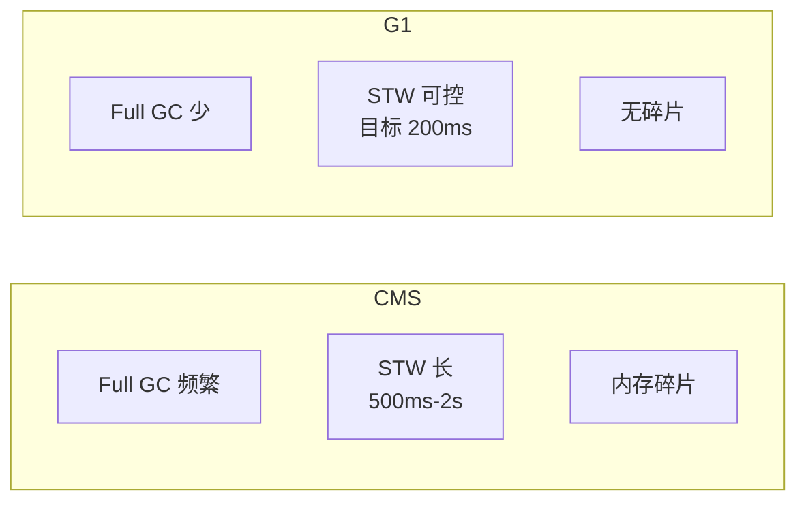
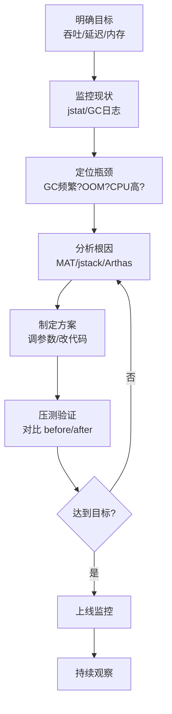

# JVM 调优实战案例文档

> 文档定位：以真实生产场景为背景，系统梳理 JVM 调优的完整方法论，涵盖堆内存、GC 收集器、内存泄漏、Metaspace、CPU 飙高、对象分配速率等典型调优案例，每个案例包含「问题现象 → 根因分析 → 调优方案 → 效果验证」的完整闭环。
>
> 适用人群：Java 后端工程师、性能优化工程师、SRE，需要排查和优化线上 JVM 性能问题的开发者。
>
> 阅读建议：先掌握调优工具链（第一章），再逐个学习典型案例（二至七章），最后参考调优经验总结（第八章）。每个案例可独立运行复现，建议边读边实操。

***

## 目录

- [一、JVM 调优工具链](#一jvm-调优工具链)

  - [1.1 命令行工具](#11-命令行工具)

  - [1.2 可视化工具](#12-可视化工具)

  - [1.3 JVM 参数速查](#13-jvm-参数速查)

- [二、案例一：堆内存不足导致频繁 Full GC](#二案例一堆内存不足导致频繁-full-gc)

- [三、案例二：大对象直接进老年代引发 Full GC](#三案例二大对象直接进老年代引发-full-gc)

- [四、案例三：内存泄漏导致 OOM](#四案例三内存泄漏导致-oom)

- [五、案例四：Metaspace 不足导致 OOM](#五案例四metaspace-不足导致-oom)

- [六、案例五：GC 收集器选择（CMS vs G1）](#六案例五gc-收集器选择cms-vs-g1)

- [七、案例六：CPU 飙高排查与优化](#七案例六cpu-飙高排查与优化)

- [八、JVM 调优经验总结](#八jvm-调优经验总结)

  - [8.1 调优通用流程](#81-调优通用流程)

  - [8.2 常见问题速查表](#82-常见问题速查表)

  - [8.3 生产环境推荐配置模板](#83-生产环境推荐配置模板)

***

## 一、JVM 调优工具链

### 1.1 命令行工具

| 工具         | 用途           | 常用命令                                        |
| ---------- | ------------ | ------------------------------------------- |
| **jps**    | 查看 Java 进程   | `jps -l`                                    |
| **jstat**  | 查看 GC 统计     | `jstat -gcutil <pid> 1000 10`               |
| **jmap**   | 导出堆转储/查看内存   | `jmap -dump:format=b,file=heap.hprof <pid>` |
| **jstack** | 查看线程栈        | `jstack <pid>`                              |
| **jcmd**   | 综合诊断         | `jcmd <pid> VM.flags`                       |
| **jinfo**  | 查看/修改 JVM 参数 | `jinfo -flags <pid>`                        |
| **jhat**   | 分析堆转储（已过时）   | -                                           |

#### jstat 输出解读

```
 S0     S1     E      O      M     CCS    YGC     YGCT    FGC    FGCT     GCT
 0.00  50.00  30.00  85.00  90.00  80.00     50    1.234     5    2.567    3.801

列说明：
S0/S1：Survivor0/1 使用率（%）
E：Eden 使用率（%）
O：老年代使用率（%）
M：元空间使用率（%）
YGC：年轻代 GC 次数
YGCT：年轻代 GC 总耗时（秒）
FGC：Full GC 次数
FGCT：Full GC 总耗时（秒）
GCT：GC 总耗时（秒）
```

#### jcmd 常用命令

```bash
# 查看 JVM 启动参数
jcmd <pid> VM.flags

# 查看系统属性
jcmd <pid> VM.system_properties

# 触发 GC
jcmd <pid> GC.run

# 查看线程栈
jcmd <pid> Thread.print

# 查看堆信息
jcmd <pid> GC.heap_info

# 导出堆转储
jcmd <pid> GC.heap_dump /tmp/heap.hprof
```

***

### 1.2 可视化工具

| 工具            | 说明           | 适用        |
| ------------- | ------------ | --------- |
| **VisualVM**  | JDK 自带，综合监控  | 内存、线程、GC  |
| **MAT**       | Eclipse 内存分析 | 堆转储分析、找泄漏 |
| **Arthas**    | 阿里开源，线上诊断    | 实时诊断、热更新  |
| **JProfiler** | 商业工具         | 全面性能分析    |
| **GCViewer**  | GC 日志可视化     | GC 日志分析   |
| **GCEasy**    | 在线 GC 分析     | 上传日志自动分析  |

#### Arthas 快速上手

```bash
# 启动 Arthas
java -jar arthas-boot.jar

# 选择进程后进入交互界面

# 查看仪表盘
dashboard

# 查看 CPU 最高的线程
thread -n 3

# 查看死锁
thread -b

# 追踪方法耗时
trace com.example.Service method

# 监控方法调用
monitor com.example.Service method

# 反编译类
jad com.example.Service

# 查看类加载信息
classloader -l
```

***

### 1.3 JVM 参数速查

#### 堆内存

```bash
-Xms<size>              # 初始堆大小
-Xmx<size>              # 最大堆大小
-Xmn<size>              # 年轻代大小
-XX:NewRatio=<n>        # 年轻代:老年代 = 1:n
-XX:SurvivorRatio=<n>   # Eden:Survivor = n:1:1
```

#### 元空间

```bash
-XX:MetaspaceSize=<size>       # 元空间初始大小
-XX:MaxMetaspaceSize=<size>    # 元空间最大大小
```

#### GC 收集器

```bash
-XX:+UseSerialGC        # Serial
-XX:+UseParNewGC        # ParNew
-XX:+UseParallelGC      # Parallel Scavenge
-XX:+UseConcMarkSweepGC # CMS
-XX:+UseG1GC            # G1
-XX:+UseZGC             # ZGC
```

#### GC 日志

```bash
# JDK 9+
-Xlog:gc*:file=gc.log:time,tags

# JDK 8
-XX:+PrintGCDetails
-XX:+PrintGCDateStamps
-Xloggc:gc.log
```

#### 诊断

```bash
-XX:+HeapDumpOnOutOfMemoryError
-XX:HeapDumpPath=/path/to/dump
-XX:+DisableExplicitGC
-XX:+PrintGCApplicationStoppedTime
```

***

## 二、案例一：堆内存不足导致频繁 Full GC

### 2.1 问题现象

```
现象：
- 服务响应变慢，P99 延迟从 50ms 涨到 2s
- jstat 观察到 Full GC 频率高（每 10 分钟一次）
- 老年代使用率持续高位（>85%）
- GC 总耗时占比 > 10%
```

### 2.2 复现代码

```java
import java.util.ArrayList;
import java.util.List;

/**
 * 堆内存不足导致频繁 Full GC
 * 模拟：不断创建大对象且持有引用，导致老年代快速填满
 */
public class HeapFullGCDemo {
    // 静态集合持有对象，模拟缓存不释放
    private static final List<byte[]> cache = new ArrayList<>();

    public static void main(String[] args) throws InterruptedException {
        System.out.println("PID: " + ProcessHandle.current().pid());

        while (true) {
            // 每次分配 1MB 数组
            byte[] data = new byte[1024 * 1024];
            cache.add(data);

            // 控制速度，让 GC 有时间回收
            Thread.sleep(50);

            // 每 200 次打印一次状态
            if (cache.size() % 200 == 0) {
                System.out.println("已缓存对象数: " + cache.size()
                    + ", 总大小约: " + (cache.size() / 1024) + "MB");
            }
        }
    }
}
```

### 2.3 调优前参数

```bash
java -Xms256m -Xmx256m -Xlog:gc*:file=gc-before.log:time,tags HeapFullGCDemo
```

### 2.4 根因分析

```
jstat 观察：
  - 老年代使用率快速增长到 90%+
  - Full GC 频繁触发
  - Full GC 后老年代使用率下降不明显（因为 cache 持有强引用）

根因：
  1. 堆内存设置过小（256MB），无法承载业务数据
  2. 静态集合 cache 持有大量对象引用，无法回收
  3. 对象存活率高，频繁晋升到老年代
```

### 2.5 调优方案

#### 方案一：调大堆内存

```bash
java -Xms1g -Xmx1g -Xmn512m \
     -Xlog:gc*:file=gc-after.log:time,tags \
     HeapFullGCDemo
```

#### 方案二：修复代码（根本解决）

```java
// 限制缓存大小 + 使用软引用
private static final int MAX_CACHE_SIZE = 500;
private static final List<SoftReference<byte[]>> cache =
    new ArrayList<>();

public static void addData(byte[] data) {
    if (cache.size() >= MAX_CACHE_SIZE) {
        cache.clear();  // 缓存满时清理
    }
    cache.add(new SoftReference<>(data));
}
```

### 2.6 效果验证

```
调优前：
  - Full GC 频率：约 5 分钟/次
  - Full GC 平均耗时：300ms
  - 老年代使用率：持续 >85%

调优后（仅调大堆）：
  - Full GC 频率：约 30 分钟/次
  - Full GC 平均耗时：400ms（堆变大，单次 GC 略慢）
  - 老年代使用率：稳定在 60-70%

调优后（修复代码）：
  - Full GC 频率：几乎不触发
  - 老年代使用率：稳定在 30-40%
  - GC 总耗时占比 < 1%
```

> **注意**：以上数据为预期趋势，实际效果需根据真实 GC 日志验证。核心指标口径：Full GC 频率、单次 Full GC 耗时、老年代使用率、GC 总耗时占比。

***

## 三、案例二：大对象直接进老年代引发 Full GC

### 3.1 问题现象

```
现象：
- 服务频繁 Full GC，但每次 GC 后老年代使用率下降明显
- Minor GC 后大量对象直接晋升到老年代
- 老年代增长速度异常快
```

### 3.2 复现代码

```java
import java.util.concurrent.TimeUnit;

/**
 * 大对象直接进入老年代
 * 模拟：频繁创建超过 PretenureSizeThreshold 的大对象
 */
public class LargeObjectDemo {
    // 1MB 大对象阈值
    private static final int LARGE_SIZE = 1024 * 1024;

    public static void main(String[] args) throws InterruptedException {
        System.out.println("PID: " + ProcessHandle.current().pid());

        for (int i = 0; i < 10000; i++) {
            // 创建大对象，直接进入老年代
            byte[] large = new byte[LARGE_SIZE];

            // 创建小对象，在年轻代
            byte[] small = new byte[1024];

            TimeUnit.MILLISECONDS.sleep(10);

            if (i % 100 == 0) {
                System.out.println("已创建大对象: " + i + " 个");
            }
        }
    }
}
```

### 3.3 调优前参数

```bash
java -Xms512m -Xmx512m -Xmn256m \
     -XX:PretenureSizeThreshold=1048576 \
     -Xlog:gc*:file=gc-large.log:time,tags \
     LargeObjectDemo
```

### 3.4 根因分析

```
GC 日志观察：
  - [Object Allocation Failure] 频繁触发
  - 大对象直接分配到老年代
  - 老年代快速填满 → Full GC

根因：
  1. 频繁创建 1MB 以上的大对象
  2. 大对象直接进入老年代（PretenureSizeThreshold=1MB）
  3. 老年代没有足够空间容纳大对象 → Full GC
```

### 3.5 调优方案

#### 方案一：调大老年代

```bash
java -Xms1g -Xmx1g -Xmn256m \
     -XX:PretenureSizeThreshold=1048576 \
     -Xlog:gc*:file=gc-large2.log:time,tags \
     LargeObjectDemo
```

#### 方案二：优化代码，避免大对象

```java
// ❌ 频繁创建大对象
for (int i = 0; i < 10000; i++) {
    byte[] large = new byte[1024 * 1024];
    process(large);
}

// ✅ 复用对象池或分批处理
private static final byte[] BUFFER = new byte[1024 * 1024];

for (int i = 0; i < 10000; i++) {
    process(BUFFER);  // 复用缓冲区
}
```

#### 方案三：使用 G1 收集器

```bash
java -Xms1g -Xmx1g \
     -XX:+UseG1GC \
     -XX:MaxGCPauseMillis=200 \
     -Xlog:gc*:file=gc-g1.log:time,tags \
     LargeObjectDemo
```

### 3.6 效果验证

```
调优前（Parallel GC + 大对象进老年代）：
  - Full GC 频率：高
  - 单次 Full GC 耗时：较长
  - 老年代增长率：快

调优后（G1）：
  - G1 用 Humongous Region 处理大对象
  - 大对象不挤占普通老年代
  - 可预测的暂停时间
```

***

## 四、案例三：内存泄漏导致 OOM

### 4.1 问题现象

```
现象：
- 服务运行一段时间后抛出 java.lang.OutOfMemoryError: Java heap space
- 堆使用率持续增长，GC 后也不下降
- Full GC 越来越频繁，最终 OOM
```

### 4.2 复现代码（ThreadLocal 泄漏）

```java
import java.util.concurrent.ExecutorService;
import java.util.concurrent.Executors;

/**
 * ThreadLocal 内存泄漏
 * 模拟：线程池中使用 ThreadLocal 但未调用 remove()
 */
public class ThreadLocalLeakDemo {
    // 线程池复用线程，ThreadLocal 的 value 无法回收
    private static final ExecutorService pool =
        Executors.newFixedThreadPool(10);

    private static final ThreadLocal<byte[]> threadLocal =
        new ThreadLocal<>();

    public static void main(String[] args) {
        System.out.println("PID: " + ProcessHandle.current().pid());

        while (true) {
            for (int i = 0; i < 10; i++) {
                pool.execute(() -> {
                    // 设置大对象到 ThreadLocal
                    threadLocal.set(new byte[1024 * 1024]); // 1MB
                    // ❌ 未调用 remove()，导致泄漏
                    // 正确做法：finally { threadLocal.remove(); }
                });
            }
            try {
                Thread.sleep(100);
            } catch (InterruptedException e) {
                Thread.currentThread().interrupt();
            }
        }
    }
}
```

### 4.3 排查步骤

```bash
# 1. 导出堆转储（OOM 时自动导出）
# 启动参数加：
-XX:+HeapDumpOnOutOfMemoryError
-XX:HeapDumpPath=/tmp/heap.hprof

# 2. 用 MAT 打开 heap.hprof

# 3. 查看 Dominator Tree（支配树）
#    找到占用内存最大的对象

# 4. 查看 Path to GC Roots
#    找到泄漏引用链

# 5. 分析发现：
#    ThreadLocalMap 的 Entry 中 value 无法回收
#    因为线程池线程不结束，Entry 一直存在
```

### 4.4 根因分析

```
引用链：
Thread → ThreadLocalMap → Entry(WeakReference<ThreadLocal>, value)

ThreadLocal 对象被 GC 回收后：
  - Entry 的 key（弱引用）变为 null
  - 但 Entry 的 value（强引用）无法回收
  - 线程池线程一直存活 → value 一直无法回收 → 内存泄漏
```

### 4.5 调优方案

#### 方案一：修复代码（根本解决）

```java
pool.execute(() -> {
    try {
        threadLocal.set(new byte[1024 * 1024]);
        // 业务逻辑
    } finally {
        threadLocal.remove();  // ✅ 必须 remove
    }
});
```

#### 方案二：使用带 remove 的封装类

```java
/**
 * 安全的 ThreadLocal 封装，自动 remove
 */
public class SafeThreadLocal<T> {
    private final ThreadLocal<T> threadLocal = new ThreadLocal<>();

    public void set(T value) {
        threadLocal.set(value);
    }

    public T get() {
        return threadLocal.get();
    }

    public void remove() {
        threadLocal.remove();
    }

    /**
     * 自动移除的 try-with-resources 用法
     */
    public AutoCloseable setWithAutoRemove(T value) {
        threadLocal.set(value);
        return threadLocal::remove;
    }
}

// 使用
SafeThreadLocal<byte[]> safeTl = new SafeThreadLocal<>();
try (AutoCloseable ignored = safeTl.setWithAutoRemove(new byte[1024])) {
    // 业务逻辑
} catch (Exception e) {
    // 异常处理
}
```

### 4.6 效果验证

```
调优前：
  - 堆内存持续增长，最终 OOM
  - Full GC 后内存不下降

调优后：
  - 堆内存稳定在合理范围
  - Full GC 后内存正常下降
  - 无 OOM
```

***

## 五、案例四：Metaspace 不足导致 OOM

### 5.1 问题现象

```
现象：
- 服务抛出 java.lang.OutOfMemoryError: Metaspace
- jstat 观察 M 列（元空间使用率）持续增长
- 频繁创建动态代理或热部署
```

### 5.2 复现代码

```java
import net.bytebuddy.ByteBuddy;
import net.bytebuddy.dynamic.DynamicType;

import java.util.ArrayList;
import java.util.List;

/**
 * Metaspace 不足导致 OOM
 * 模拟：动态生成大量类，填满元空间
 * 依赖：ByteBuddy（避免反射调用 JDK 内部方法）
 *
 * Maven 依赖：
 * <dependency>
 *     <groupId>net.bytebuddy</groupId>
 *     <artifactId>byte-buddy</artifactId>
 *     <version>1.14.10</version>
 * </dependency>
 */
public class MetaspaceLeakDemo {
    public static void main(String[] args) {
        System.out.println("PID: " + ProcessHandle.current().pid());

        List<Class<?>> classes = new ArrayList<>();

        for (int i = 0; i < 100000; i++) {
            // 动态生成类
            DynamicType.Unloaded<?> unloaded = new ByteBuddy()
                .subclass(Object.class)
                .name("com.example.DynamicClass" + i)
                .make();

            // 加载类到 JVM
            Class<?> clazz = unloaded
                .load(MetaspaceLeakDemo.class.getClassLoader())
                .getLoaded();

            classes.add(clazz);  // 持有类引用，防止卸载

            if (i % 1000 == 0) {
                System.out.println("已生成类数: " + i);
            }
        }
    }
}
```

### 5.3 调优前参数

```bash
java -XX:MetaspaceSize=64m -XX:MaxMetaspaceSize=128m \
     -cp .:byte-buddy-1.14.10.jar \
     MetaspaceLeakDemo
```

### 5.4 根因分析

```
原因：
  1. 动态生成大量类（动态代理、热部署、CGLIB）
  2. MaxMetaspaceSize 设置过小（128MB）
  3. 类加载器泄漏，类无法卸载

典型场景：
  - Spring AOP 动态代理
  - CGLIB 生成代理类
  - 热部署（JRebel、Spring DevTools）
  - Groovy/脚本引擎动态生成类
```

### 5.5 调优方案

#### 方案一：调大元空间

```bash
java -XX:MetaspaceSize=256m -XX:MaxMetaspaceSize=512m \
     -cp .:byte-buddy-1.14.10.jar \
     MetaspaceLeakDemo
```

#### 方案二：排查类加载器泄漏

```bash
# 查看类加载器
jcmd <pid> VM.classloader_stats

# Arthas 查看类加载器
classloader -l

# 查看已加载类数量
jcmd <pid> GC.class_histogram | head -20
```

#### 方案三：复用类加载器，避免重复加载

```java
// ❌ 每次创建新的 ClassLoader，类无法卸载
for (int i = 0; i < 1000; i++) {
    ClassLoader cl = new URLClassLoader(urls);
    Class<?> clazz = cl.loadClass("com.example.Service");
}

// ✅ 复用 ClassLoader
ClassLoader cl = new URLClassLoader(urls);
for (int i = 0; i < 1000; i++) {
    Class<?> clazz = cl.loadClass("com.example.Service");
}
```

### 5.6 效果验证

```
调优前（MaxMetaspaceSize=128m）：
  - 生成约 5 万个类后 OOM: Metaspace

调优后（MaxMetaspaceSize=512m）：
  - 可生成更多类
  - 但仍会 OOM（根本原因是类无法卸载）

根本解决：
  - 排查类加载器泄漏
  - 复用 ClassLoader
  - 热部署时清理旧类加载器
```

***

## 六、案例五：GC 收集器选择（CMS vs G1）

### 6.1 场景背景

```
场景：高并发 Web 服务，堆内存 8GB，对延迟敏感（P99 < 200ms）
问题：CMS 频繁 Concurrent Mode Failure，导致长时间 STW
```

### 6.2 CMS 的问题

```
CMS 缺点：
  1. 标记-清除产生内存碎片
  2. 并发清除时老年代满 → Concurrent Mode Failure → Serial Old
  3. Serial Old 是单线程，STW 时间长

GC 日志中出现：
  [CMS-concurrent-mark: ...]
  [CMS-concurrent-sweep: ...]
  CMS: Concurrent Mode Failure
  [Full GC (Allocation Failure) [CMS: ...]]
```

### 6.3 切换到 G1

#### 调优前（CMS）

```bash
java -Xms8g -Xmx8g -Xmn3g \
     -XX:+UseConcMarkSweepGC \
     -XX:CMSInitiatingOccupancyFraction=75 \
     -Xlog:gc*:file=gc-cms.log:time,tags \
     -jar app.jar
```

#### 调优后（G1）

```bash
java -Xms8g -Xmx8g \
     -XX:+UseG1GC \
     -XX:MaxGCPauseMillis=200 \
     -XX:G1HeapRegionSize=16m \
     -XX:InitiatingHeapOccupancyPercent=45 \
     -XX:MaxMetaspaceSize=512m \
     -Xlog:gc*:file=gc-g1.log:time,tags \
     -jar app.jar
```

### 6.4 效果对比



| 指标         | CMS          | G1           |
| ---------- | ------------ | ------------ |
| Full GC 频率 | 高（CMF 触发）    | 低            |
| STW 时间     | 不可控，500ms-2s | 可预测，目标 200ms |
| 内存碎片       | 有            | 无（复制整理）      |
| P99 延迟     | 抖动大          | 稳定           |

### 6.5 G1 调优参数详解

```bash
# 启用 G1
-XX:+UseG1GC

# 最大暂停时间目标（软目标，非硬保证）
-XX:MaxGCPauseMillis=200

# Region 大小（1-32MB，必须是 2 的幂）
-XX:G1HeapRegionSize=16m

# 触发 Mixed GC 的老年代占用比例
-XX:InitiatingHeapOccupancyPercent=45

# 年轻代大小范围（可选）
-XX:G1NewSizePercent=5
-XX:G1MaxNewSizePercent=60
```

***

## 七、案例六：CPU 飙高排查与优化

### 7.1 问题现象

```
现象：
- 服务 CPU 使用率持续 100%
- 响应变慢甚至无响应
- 线程数正常，但有线程占用 CPU 过高
```

### 7.2 复现代码

```java
import java.util.HashMap;
import java.util.Map;

/**
 * CPU 飙高
 * 模拟：死循环 + 高计算量
 */
public class CpuSpikeDemo {
    private static final Map<Integer, Integer> map = new HashMap<>();

    public static void main(String[] args) {
        System.out.println("PID: " + ProcessHandle.current().pid());

        // 线程 1：死循环
        new Thread(() -> {
            while (true) {
                for (int i = 0; i < Integer.MAX_VALUE; i++) {
                    map.put(i, i);
                }
            }
        }, "cpu-spike-thread").start();

        // 线程 2：正常业务
        new Thread(() -> {
            while (true) {
                try {
                    Thread.sleep(1000);
                    System.out.println("正常线程运行中...");
                } catch (InterruptedException e) {
                    Thread.currentThread().interrupt();
                }
            }
        }).start();
    }
}
```

### 7.3 排查步骤

```bash
# 1. 找到 CPU 最高的进程
top

# 2. 找到进程中 CPU 最高的线程
top -Hp <pid>
# 记录 TID（线程 ID）

# 3. 将 TID 转十六进制
printf "%x\n" <tid>
# 例如 TID=12345 → 0x3039

# 4. 查看该线程的栈
jstack <pid> | grep -A 50 "0x3039"
```

### 7.4 排查结果

```
"cpu-spike-thread" #11 prio=5 os_prio=0 tid=0x... nid=0x3039 runnable
   java.lang.Thread.State: RUNNABLE
        at java.util.HashMap.put(HashMap.java:612)
        at com.example.CpuSpikeDemo.lambda$main$0(CpuSpikeDemo.java:15)
        at com.example.CpuSpikeDemo$$Lambda$1/123456.run(Unknown Source)
        at java.lang.Thread.run(Thread.java:748)

分析：
  - 线程 cpu-spike-thread 一直处于 RUNNABLE
  - 卡在 HashMap.put，说明在死循环中不断添加元素
```

### 7.5 Arthas 快速排查

```bash
# 启动 Arthas
java -jar arthas-boot.jar

# 查看 CPU 最高的 3 个线程
thread -n 3

# 输出示例：
# "cpu-spike-thread" Id=11 cpuUsage=99.5% RUNNABLE
#     at java.util.HashMap.put(HashMap.java:612)
#     at com.example.CpuSpikeDemo.lambda$main$0(CpuSpikeDemo.java:15)

# 查看死锁
thread -b

# 追踪方法调用耗时
trace com.example.CpuSpikeDemo lambda$main$0
```

### 7.6 解决方案

```java
// ❌ 死循环
while (true) {
    for (int i = 0; i < Integer.MAX_VALUE; i++) {
        map.put(i, i);
    }
}

// ✅ 限制循环次数或加 sleep
while (running) {
    for (int i = 0; i < 1000; i++) {
        map.put(i, i);
    }
    Thread.sleep(10);  // 让出 CPU
}

// 或使用线程池 + 有界队列
ExecutorService executor = new ThreadPoolExecutor(
    4, 8, 60, TimeUnit.SECONDS,
    new ArrayBlockingQueue<>(1000),
    new ThreadPoolExecutor.CallerRunsPolicy()  // 拒绝策略
);
```

***

## 八、JVM 调优经验总结

### 8.1 调优通用流程



#### 调优三步法

| 步骤       | 说明           | 工具                       |
| -------- | ------------ | ------------------------ |
| **发现问题** | 监控 GC、内存、CPU | jstat、Prometheus、Grafana |
| **定位根因** | 分析日志、堆转储、线程栈 | MAT、jstack、Arthas        |
| **解决验证** | 调整参数/代码，压测对比 | JMeter、wrk、GC 日志         |

***

### 8.2 常见问题速查表

| 问题                           | 现象        | 常见原因               | 解决方案          |
| ---------------------------- | --------- | ------------------ | ------------- |
| 频繁 Full GC                   | 服务卡顿      | 内存泄漏/大对象/堆太小       | 查泄漏+调大堆+G1    |
| OOM: Java heap space         | 堆溢出       | 内存泄漏/堆太小           | dump分析+调大堆    |
| OOM: Metaspace               | 元空间溢出     | 动态类太多/类加载泄漏        | 调大元空间+查类加载    |
| OOM: Direct buffer           | 堆外内存溢出    | NIO ByteBuffer 未释放 | 检查 NIO 代码     |
| OOM: unable to create thread | 线程太多      | 线程池未限制             | 限制线程池大小       |
| CPU 100%                     | 无响应       | 死循环/频繁GC/死锁        | jstack/Arthas |
| GC overhead limit            | GC 耗时过长   | 堆太小/内存泄漏           | 调大堆+查泄漏       |
| CMS Concurrent Mode Failure  | Full GC 长 | 老年代满               | 换 G1/调大老年代    |

***

### 8.3 生产环境推荐配置模板

#### 通用 Web 服务（8C16G）

```bash
java \
  -Xms10g -Xmx10g \
  -XX:+UseG1GC \
  -XX:MaxGCPauseMillis=200 \
  -XX:G1HeapRegionSize=16m \
  -XX:MetaspaceSize=512m \
  -XX:MaxMetaspaceSize=1g \
  -XX:+HeapDumpOnOutOfMemoryError \
  -XX:HeapDumpPath=/data/dump \
  -XX:+DisableExplicitGC \
  -XX:+UseStringDeduplication \
  -Xlog:gc*:file=/data/logs/gc.log:time,tags \
  -Dfile.encoding=UTF-8 \
  -jar app.jar
```

#### 低延迟服务（4C8G）

```bash
java \
  -Xms6g -Xmx6g \
  -XX:+UseG1GC \
  -XX:MaxGCPauseMillis=100 \
  -XX:G1HeapRegionSize=8m \
  -XX:InitiatingHeapOccupancyPercent=35 \
  -XX:MetaspaceSize=256m \
  -XX:MaxMetaspaceSize=512m \
  -XX:+HeapDumpOnOutOfMemoryError \
  -XX:HeapDumpPath=/data/dump \
  -Xlog:gc*:file=/data/logs/gc.log:time,tags \
  -jar app.jar
```

#### 大内存服务（16C32G，考虑 ZGC）

```bash
java \
  -Xms24g -Xmx24g \
  -XX:+UseZGC \
  -XX:MetaspaceSize=512m \
  -XX:MaxMetaspaceSize=1g \
  -XX:+HeapDumpOnOutOfMemoryError \
  -XX:HeapDumpPath=/data/dump \
  -Xlog:gc*:file=/data/logs/gc.log:time,tags \
  -jar app.jar
```

### 调优核心原则

```
1. 先监控，再调优：没有数据就没有优化
2. 一次只改一个参数：便于定位效果
3. 先解决代码问题，再调 JVM 参数
4. GC 不是越少越好：要看 GC 总耗时占比
5. 堆不是越大越好：越大单次 GC 越慢
6. 压测验证：所有调优必须压测对比
7. 持续监控：上线后持续观察 GC 行为
```

***

> **说明**：本文档中的性能数据为预期趋势，实际效果需根据真实 GC 日志和压测结果验证。建议配合 GC 日志分析工具（GCViewer、GCEasy）和 APM 监控（SkyWalking、Prometheus）进行完整调优闭环。

