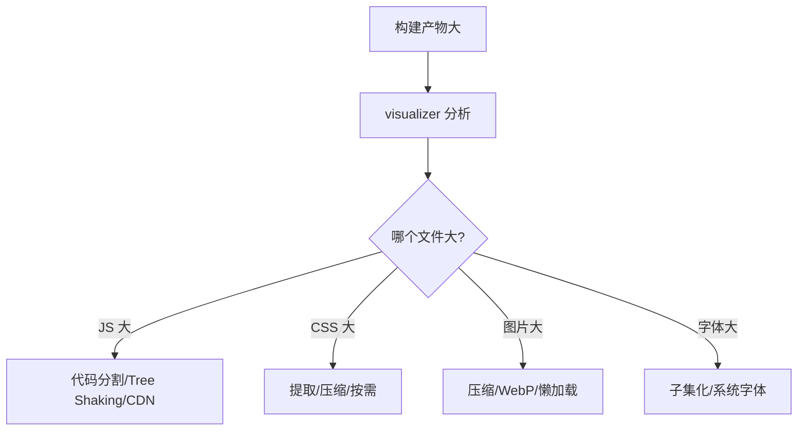
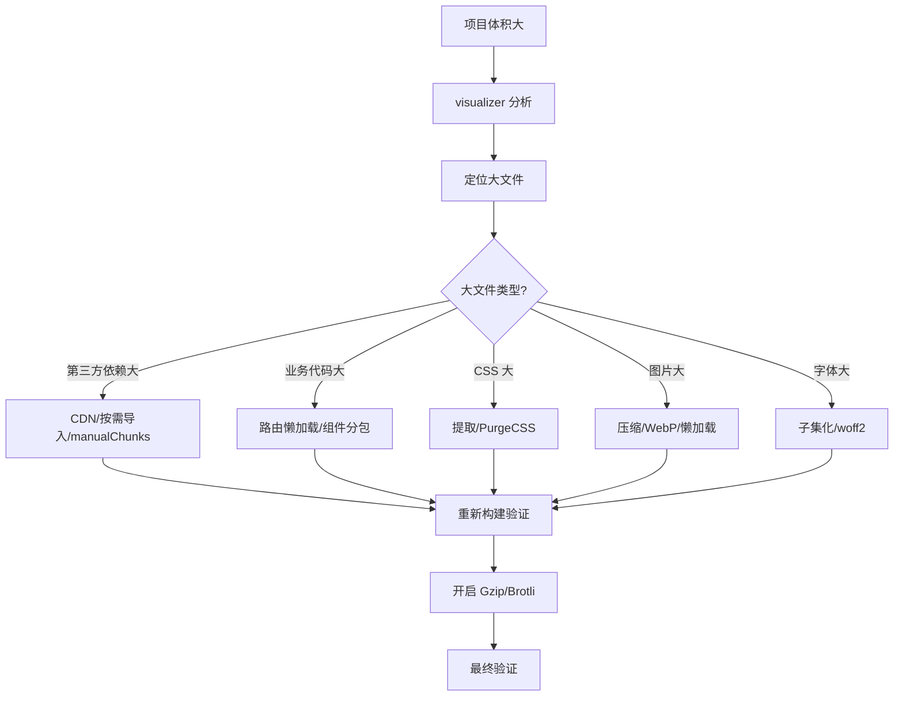

# Vite 打包优化指南高频面试题与详细回答

> 文档定位：系统梳理 Vite 打包优化在面试中的高频问题，涵盖构建产物分析、代码分割、Tree Shaking、资源优化、CDN、压缩、构建速度优化、生产配置等核心考点。
>
> 适用人群：前端工程师，尤其是需要优化项目构建速度、减小产物体积、提升首屏加载性能的开发者。
>
> 阅读建议：先掌握构建产物分析与代码分割（一至三章），再学习资源优化与压缩（四至六章），最后攻克构建速度与生产配置（七至九章）。重点关注「manualChunks 代码分割」「Tree Shaking」「图片/字体优化」「Gzip/Brotli 压缩」「CDN 外部化」五大核心模块。

***

## 目录

- [一、构建产物分析](#一构建产物分析)

  - [Q1. 如何分析 Vite 构建产物？](#q1-如何分析-vite-构建产物)

  - [Q2. 构建产物包含哪些文件？](#q2-构建产物包含哪些文件)

  - [Q3. 如何定位大文件？](#q3-如何定位大文件)

- [二、代码分割](#二代码分割)

  - [Q4. Vite 默认代码分割策略？](#q4-vite-默认代码分割策略)

  - [Q5. manualChunks 如何配置？](#q5-manualchunks-如何配置)

  - [Q6. 动态 import 如何分包？](#q6-动态-import-如何分包)

- [三、Tree Shaking](#三tree-shaking)

  - [Q7. 什么是 Tree Shaking？](#q7-什么是-tree-shaking)

  - [Q8. 如何确保 Tree Shaking 生效？](#q8-如何确保-tree-shaking-生效)

  - [Q9. sideEffects 是什么？](#q9-sideeffects-是什么)

- [四、资源优化](#四资源优化)

  - [Q10. 图片如何优化？](#q10-图片如何优化)

  - [Q11. 字体如何优化？](#q11-字体如何优化)

  - [Q12. CSS 如何优化？](#q12-css-如何优化)

- [五、CDN 与外部化](#五cdn-与外部化)

  - [Q13. 如何将大依赖改为 CDN？](#q13-如何将大依赖改为-cdn)

  - [Q14. external 和 CDN 有什么区别？](#q14-external-和-cdn-有什么区别)

- [六、压缩与产物优化](#六压缩与产物优化)

  - [Q15. 如何开启 Gzip/Brotli 压缩？](#q15-如何开启-gzipbrotli-压缩)

  - [Q16. 如何移除 console 和 debugger？](#q16-如何移除-console-和-debugger)

  - [Q17. 如何去除 Source Map？](#q17-如何去除-source-map)

- [七、构建速度优化](#七构建速度优化)

  - [Q18. 如何提升构建速度？](#q18-如何提升构建速度)

  - [Q19. 预构建如何优化？](#q19-预构建如何优化)

  - [Q20. 如何使用 rollup-plugin-visualizer？](#q20-如何使用-rollup-plugin-visualizer)

- [八、生产环境配置](#八生产环境配置)

  - [Q21. 生产环境推荐配置？](#q21-生产环境推荐配置)

  - [Q22. 如何配置多环境构建？](#q22-如何配置多环境构建)

  - [Q23. 如何配置 base 路径？](#q23-如何配置-base-路径)

- [九、综合实战题](#九综合实战题)

  - [Q24. 如何从零优化一个大体积项目？](#q24-如何从零优化一个大体积项目)

  - [Q25. 首屏加载优化完整方案？](#q25-首屏加载优化完整方案)

- [十、速答与踩坑总结](#十速答与踩坑总结)

  - [10.1 速答卡片](#101-速答卡片)

  - [10.2 实战踩坑 10 例](#102-实战踩坑-10-例)

  - [10.3 复习优先级表](#103-复习优先级表)

***

## 一、构建产物分析

### Q1. 如何分析 Vite 构建产物？

#### 方法1：rollup-plugin-visualizer（推荐）

```bash
npm install rollup-plugin-visualizer -D
```

```javascript
// vite.config.js
import { defineConfig } from 'vite'
import { visualizer } from 'rollup-plugin-visualizer'

export default defineConfig({
  plugins: [
    visualizer({
      open: true,           // 自动打开浏览器
      filename: 'stats.html', // 输出文件名
      gzipSize: true,       // 显示 gzip 大小
      brotliSize: true      // 显示 brotli 大小
    })
  ]
})
```

#### 方法2：查看 dist 目录

```bash
# 构建后查看产物大小
du -sh dist/*
ls -lh dist/assets/
```

#### 方法3：构建日志

```bash
vite build --debug
```

***

### Q2. 构建产物包含哪些文件？

```
dist/
├── index.html              # HTML 入口
├── assets/
│   ├── index-[hash].js     # 主包 JS
│   ├── vendor-[hash].js    # 第三方依赖
│   ├── [name]-[hash].js    # 路由/动态分包
│   ├── index-[hash].css    # 样式文件
│   ├── [name]-[hash].png   # 图片资源
│   └── [name]-[hash].woff2 # 字体文件
└── favicon.ico             # 图标
```

| 文件类型           | 说明      | 优化方向               |
| -------------- | ------- | ------------------ |
| **index.html** | 入口 HTML | 内联关键 CSS、预加载       |
| **主包 JS**      | 业务代码    | 代码分割、Tree Shaking  |
| **vendor JS**  | 第三方依赖   | CDN、按需导入           |
| **CSS**        | 样式      | 提取、压缩、critical CSS |
| **图片**         | 静态资源    | 压缩、WebP、懒加载        |
| **字体**         | 字体文件    | 子集化、font-display   |

***

### Q3. 如何定位大文件？



#### 步骤

```bash
# 1. 安装分析插件
npm install rollup-plugin-visualizer -D

# 2. 构建并生成分析报告
npm run build

# 3. 打开 stats.html 查看各模块大小

# 4. 定位大模块：
#    - 看哪个 chunk 最大
#    - 展开看是哪个依赖导致
#    - 决定用 CDN 还是按需导入
```

***

## 二、代码分割

### Q4. Vite 默认代码分割策略？

```
Vite 基于 Rollup，默认策略：
  1. 多入口共享模块自动分包
  2. 动态 import() 自动分包
  3. CSS 自动提取到单独文件
```

#### 默认分包效果

```
dist/assets/
├── index-[hash].js      # 主入口
├── About-[hash].js      # 动态导入的路由
├── Dashboard-[hash].js  # 动态导入的路由
└── index-[hash].css     # 所有 CSS
```

```
默认策略的问题：
  - 第三方依赖全部打入主包，导致主包过大
  - 没有按依赖类型细分
```

***

### Q5. manualChunks 如何配置？

#### 基础配置

```javascript
// vite.config.js
export default {
  build: {
    rollupOptions: {
      output: {
        manualChunks: {
          // Vue 生态
          'vue-vendor': ['vue', 'vue-router', 'pinia'],
          // UI 库
          'ui-vendor': ['element-plus', '@element-plus/icons-vue'],
          // 工具库
          'utils-vendor': ['lodash-es', 'dayjs', 'axios'],
          // 图表库（单独拆出，体积大）
          'echarts-vendor': ['echarts']
        }
      }
    }
  }
}
```

#### 函数式配置（更灵活）

```javascript
export default {
  build: {
    rollupOptions: {
      output: {
        manualChunks(id) {
          // 将 node_modules 中的依赖按包名拆分
          if (id.includes('node_modules')) {
            const match = id.match(/node_modules\/([^/]+)/)
            if (match) {
              return match[1]  // 每个依赖单独成包
            }
          }
        }
      }
    }
  }
}
```

#### 分组配置（推荐）

```javascript
export default {
  build: {
    rollupOptions: {
      output: {
        manualChunks(id) {
          if (id.includes('node_modules')) {
            // Vue 生态
            if (id.includes('vue') || id.includes('pinia')) {
              return 'vue-vendor'
            }
            // UI 库
            if (id.includes('element-plus')) {
              return 'ui-vendor'
            }
            // 工具库
            if (id.includes('lodash') || id.includes('dayjs')) {
              return 'utils-vendor'
            }
            // 其他第三方
            return 'other-vendor'
          }
        }
      }
    }
  }
}
```

***

### Q6. 动态 import 如何分包？

```javascript
// 路由懒加载
const routes = [
  {
    path: '/',
    component: () => import('./views/Home.vue')
  },
  {
    path: '/about',
    component: () => import('./views/About.vue')
  },
  {
    path: '/dashboard',
    component: () => import('./views/Dashboard.vue')
  }
]
```

#### 组件懒加载

```javascript
import { defineAsyncComponent } from 'vue'

// 异步加载重型组件
const HeavyChart = defineAsyncComponent(() =>
  import('./components/HeavyChart.vue')
)

// 带错误和加载状态
const HeavyComponent = defineAsyncComponent({
  loader: () => import('./HeavyComponent.vue'),
  loadingComponent: Loading,
  errorComponent: Error,
  delay: 200,
  timeout: 3000
})
```

#### 带注释的分包命名

```javascript
// webpackChunkName 同样适用于 Vite
const Home = () => import(/* webpackChunkName: "home" */ './views/Home.vue')
const About = () => import(/* webpackChunkName: "about" */ './views/About.vue')
```

***

## 三、Tree Shaking

### Q7. 什么是 Tree Shaking？

```
Tree Shaking：移除未使用的代码（死代码消除）
基于 ESM 的静态分析，在打包时剔除未导入的模块
```

```javascript
// 工具库
export function a() { return 'a' }
export function b() { return 'b' }

// 业务代码只导入 a
import { a } from './utils'

// 打包后 b 被移除
```

#### 原理

```
ESM 的 import/export 是静态的，编译时可确定依赖关系
Rollup 分析 AST，标记未使用的导出
打包时只保留使用到的代码
```

***

### Q8. 如何确保 Tree Shaking 生效？

| 条件                    | 说明                    |
| --------------------- | --------------------- |
| **1. 使用 ESM**         | 不能用 CommonJS（require） |
| **2. sideEffects 声明** | package.json 声明无副作用   |
| **3. 避免副作用导入**        | 不导入带副作用的模块            |
| **4. 生产模式**           | mode: production 开启   |

```json
// package.json
{
  "sideEffects": false
}
```

#### 常见破坏 Tree Shaking 的写法

```javascript
// ❌ 全量导入
import _ from 'lodash'

// ✅ 按需导入
import { debounce, throttle } from 'lodash-es'

// ❌ 导入整个组件库
import ElementPlus from 'element-plus'

// ✅ 按需导入
import { ElButton, ElInput } from 'element-plus'
```

***

### Q9. sideEffects 是什么？

```
sideEffects：告诉打包器哪些文件有副作用，不能被 Tree Shaking
```

```json
// 方式1：所有文件都无副作用
{
  "sideEffects": false
}

// 方式2：指定有副作用的文件
{
  "sideEffects": [
    "*.css",
    "*.scss",
    "./src/polyfill.js"
  ]
}
```

#### 副作用示例

```javascript
// 有副作用：修改全局变量
import './polyfill.js'  // polyfill 修改全局原型，不能移除

// 无副作用：纯函数
import { debounce } from 'lodash-es'  // 未使用的导出可移除
```

```
CSS 文件通常有副作用（影响全局样式），需要保留
```

***

## 四、资源优化

### Q10. 图片如何优化？

#### 1. 使用 WebP/AVIF 格式

```html
<picture>
  <source srcset="image.webp" type="image/webp">
  <source srcset="image.avif" type="image/avif">
  
</picture>
```

#### 2. 图片压缩

```bash
# 安装插件
npm install vite-plugin-imagemin -D
```

```javascript
// vite.config.js
import { defineConfig } from 'vite'
import viteImagemin from 'vite-plugin-imagemin'

export default defineConfig({
  plugins: [
    viteImagemin({
      gifsicle: { optimizationLevel: 7 },
      optipng: { optimizationLevel: 7 },
      mozjpeg: { quality: 80 },
      pngquant: { quality: [0.8, 0.9] },
      svgo: { plugins: [{ name: 'removeViewBox' }] }
    })
  ]
})
```

#### 3. 懒加载

```html
<!-- 原生懒加载 -->

```

```javascript
// IntersectionObserver 懒加载
const observer = new IntersectionObserver((entries) => {
  entries.forEach(entry => {
    if (entry.isIntersecting) {
      entry.target.src = entry.target.dataset.src
      observer.unobserve(entry.target)
    }
  })
})
```

#### 4. 内联小图片

```javascript
// vite.config.js
export default {
  build: {
    assetsInlineLimit: 4096  // 小于 4KB 的图片转 base64 内联
  }
}
```

***

### Q11. 字体如何优化？

#### 1. font-display: swap

```css
@font-face {
  font-family: 'MyFont';
  src: url('./myfont.woff2') format('woff2');
  font-display: swap;  /* 先用系统字体，加载完再替换 */
}
```

#### 2. 使用 WOFF2 格式

```
WOFF2 比 WOFF 小 30%，比 TTF 小 50%
优先使用 WOFF2，降级到 WOFF
```

```css
@font-face {
  font-family: 'MyFont';
  src: url('./myfont.woff2') format('woff2'),
       url('./myfont.woff') format('woff');
}
```

#### 3. 字体子集化

```bash
# 使用 fontmin 提取中文子集
npm install fontmin -D
```

```javascript
const Fontmin = require('fontmin')

const fontmin = new Fontmin()
  .src('fonts/*.ttf')
  .use(Fontmin.glyph({
    text: '你好世界ABC123'  // 只保留用到的字符
  }))
  .dest('build/fonts')

fontmin.run((err, files) => {
  console.log('字体子集化完成')
})
```

***

### Q12. CSS 如何优化？

#### 1. CSS 提取

```javascript
// vite.config.js
export default {
  build: {
    cssCodeSplit: true,  // CSS 按路由分割（默认 true）
    minify: 'esbuild'    // CSS 压缩
  }
}
```

#### 2. 移除未使用的 CSS

```bash
npm install -D rollup-plugin-css-only purgecss
```

```javascript
// 使用 PurgeCSS 移除未使用 CSS
import { defineConfig } from 'vite'
import purgecss from '@fullhuman/postcss-purgecss'

export default defineConfig({
  css: {
    postcss: {
      plugins: [
        purgecss({
          content: ['./index.html', './src/**/*.vue', './src/**/*.js']
        })
      ]
    }
  }
})
```

#### 3. Critical CSS

```
首屏关键 CSS 内联到 <style>，非关键 CSS 异步加载
```

```html
<head>
  <!-- 内联首屏 CSS -->
  <style>
    /* 首屏样式 */
  </style>
  <!-- 异步加载非首屏 CSS -->
  <link rel="stylesheet" href="/style.css" media="print" onload="this.media='all'">
</head>
```

***

## 五、CDN 与外部化

### Q13. 如何将大依赖改为 CDN？

#### 方法1：vite-plugin-cdn-import（推荐）

```bash
npm install vite-plugin-cdn-import -D
```

```javascript
// vite.config.js
import { defineConfig } from 'vite'
import importToCDN from 'vite-plugin-cdn-import'

export default defineConfig({
  plugins: [
    importToCDN({
      modules: [
        {
          name: 'vue',
          var: 'Vue',
          path: 'https://unpkg.com/vue@3/dist/vue.global.prod.js'
        },
        {
          name: 'element-plus',
          var: 'ElementPlus',
          path: 'https://unpkg.com/element-plus/dist/index.full.min.js',
          css: 'https://unpkg.com/element-plus/dist/index.css'
        },
        {
          name: 'echarts',
          var: 'echarts',
          path: 'https://unpkg.com/echarts/dist/echarts.min.js'
        }
      ]
    })
  ]
})
```

#### 方法2：手动 external + CDN

```javascript
// vite.config.js
export default {
  build: {
    rollupOptions: {
      external: ['vue', 'echarts']
    }
  }
}
```

```html
<!-- index.html -->
<script src="https://unpkg.com/vue@3/dist/vue.global.prod.js"></script>
<script src="https://unpkg.com/echarts/dist/echarts.min.js"></script>
```

***

### Q14. external 和 CDN 有什么区别？

| 维度       | external    | CDN 插件        |
| -------- | ----------- | ------------- |
| **原理**   | 标记为外部，不打包   | 自动替换为 CDN 链接  |
| **配置**   | 需手动加 script | 自动注入          |
| **开发环境** | 需要全局变量      | 开发环境正常 import |
| **灵活性**  | 高           | 中             |

```
external：构建时排除，需手动在 HTML 加 CDN script
CDN 插件：自动处理，开发环境走本地，生产走 CDN
```

#### 适用场景

```
- 小项目/简单依赖：用 CDN 插件
- 精细控制/自定义 CDN：用 external
- 公司内网 CDN：用 external + 内网地址
```

***

## 六、压缩与产物优化

### Q15. 如何开启 Gzip/Brotli 压缩？

```bash
npm install vite-plugin-compression -D
```

```javascript
// vite.config.js
import { defineConfig } from 'vite'
import viteCompression from 'vite-plugin-compression'

export default defineConfig({
  plugins: [
    // Gzip 压缩
    viteCompression({
      algorithm: 'gzip',
      ext: '.gz',
      threshold: 10240,  // 大于 10KB 压缩
      deleteOriginFile: false
    }),
    // Brotli 压缩（更小）
    viteCompression({
      algorithm: 'brotliCompress',
      ext: '.br',
      threshold: 10240
    })
  ]
})
```

#### Nginx 配置

```nginx
# 开启 gzip
gzip on;
gzip_types text/plain text/css application/javascript application/json;
gzip_min_length 1024;

# 开启 brotli（需要 ngx_brotli 模块）
brotli on;
brotli_types text/plain text/css application/javascript;
```

```
压缩效果：
  - Gzip：减少 60-70%
  - Brotli：比 Gzip 再小 15-20%
```

***

### Q16. 如何移除 console 和 debugger？

#### esbuild 配置（推荐）

```javascript
// vite.config.js
export default {
  esbuild: {
    drop: ['console', 'debugger']  // 生产环境移除
  }
}
```

#### 或使用 terser 插件

```bash
npm install terser -D
```

```javascript
// vite.config.js
export default {
  build: {
    minify: 'terser',
    terserOptions: {
      compress: {
        drop_console: true,
        drop_debugger: true
      }
    }
  }
}
```

#### 保留部分 console

```javascript
// 只移除 console.log，保留 console.error
export default {
  esbuild: {
    pure: ['console.log', 'console.warn']
  }
}
```

***

### Q17. 如何去除 Source Map？

```javascript
// vite.config.js
export default {
  build: {
    sourcemap: false,  // 不生成 source map（默认 false）
    // 或只生成 hidden source map
    sourcemap: 'hidden'
  }
}
```

| 值            | 说明             |
| ------------ | -------------- |
| **false**    | 不生成（默认）        |
| **true**     | 生成并引用          |
| **'inline'** | 内联到 JS 中       |
| **'hidden'** | 生成但不引用（用于错误监控） |

```
生产环境建议 false 或 hidden
避免源码泄露，同时减小产物体积
```

***

## 七、构建速度优化

### Q18. 如何提升构建速度？

| 优化                    | 说明                 |
| --------------------- | ------------------ |
| **1. esbuild minify** | 比 terser 快 20-40 倍 |
| **2. 减少插件**           | 只保留必要插件            |
| **3. 并行构建**           | rollupOptions 并行处理 |
| **4. 缓存**             | build.watch 缓存     |
| **5. 排除大依赖**          | external 不打包大库     |
| **6. 增量构建**           | 只构建变化的部分           |

```javascript
// vite.config.js
export default {
  build: {
    minify: 'esbuild',  // 使用 esbuild 压缩（比 terser 快）
    target: 'es2015',    // 目标语法
    reportCompressedSize: false,  // 不计算压缩后大小（加速）
    chunkSizeWarningLimit: 1000   // 提高警告阈值
  }
}
```

***

### Q19. 预构建如何优化？

```javascript
// vite.config.js
export default {
  optimizeDeps: {
    // 强制预构建（减少运行时转换）
    include: [
      'vue',
      'vue-router',
      'pinia',
      'axios',
      'lodash-es',
      'dayjs'
    ],
    // 排除不需要预构建的
    exclude: ['some-esm-only-package'],
    // 扫描入口
    entries: ['index.html']
  }
}
```

#### 预构建优化效果

```
优化前：
  - 启动时才扫描依赖
  - 大依赖（如 lodash）运行时转换慢

优化后：
  - 启动时直接读取预构建缓存
  - 大依赖提前打包，运行时直接加载
```

***

### Q20. 如何使用 rollup-plugin-visualizer？

```bash
npm install rollup-plugin-visualizer -D
```

```javascript
// vite.config.js
import { defineConfig } from 'vite'
import { visualizer } from 'rollup-plugin-visualizer'

export default defineConfig({
  plugins: [
    visualizer({
      open: true,              // 自动打开
      filename: 'stats.html',  // 输出文件
      template: 'treemap',     // treemap/sunburst/network
      gzipSize: true,          // 显示 gzip 大小
      brotliSize: true         // 显示 brotli 大小
    })
  ]
})
```

```bash
npm run build
# 自动打开 stats.html，可交互查看各模块大小
```

#### 分析报告怎么看

```
1. 看最大的 chunk 是什么
2. 展开看哪个依赖占比大
3. 决定优化策略：
   - 大依赖（echarts/lodash）→ CDN 或按需
   - 业务代码大 → 代码分割
   - CSS 大 → 提取/压缩
```

***

## 八、生产环境配置

### Q21. 生产环境推荐配置？

```javascript
// vite.config.prod.js
import { defineConfig } from 'vite'
import vue from '@vitejs/plugin-vue'
import { visualizer } from 'rollup-plugin-visualizer'
import viteCompression from 'vite-plugin-compression'
import viteImagemin from 'vite-plugin-imagemin'
import path from 'path'

export default defineConfig({
  plugins: [
    vue(),
    // 产物分析（按需开启）
    visualizer({ open: false, filename: 'stats.html' }),
    // Gzip 压缩
    viteCompression({ algorithm: 'gzip', ext: '.gz', threshold: 10240 }),
    // 图片压缩
    viteImagemin({
      mozjpeg: { quality: 80 },
      pngquant: { quality: [0.8, 0.9] }
    })
  ],

  resolve: {
    alias: { '@': path.resolve(__dirname, 'src') }
  },

  build: {
    outDir: 'dist',
    sourcemap: false,
    minify: 'esbuild',
    cssCodeSplit: true,
    chunkSizeWarningLimit: 1000,
    rollupOptions: {
      output: {
        // 文件命名
        entryFileNames: 'assets/js/[name]-[hash].js',
        chunkFileNames: 'assets/js/[name]-[hash].js',
        assetFileNames: 'assets/[ext]/[name]-[hash].[ext]',
        // 代码分割
        manualChunks: {
          'vue-vendor': ['vue', 'vue-router', 'pinia'],
          'ui-vendor': ['element-plus'],
          'utils-vendor': ['lodash-es', 'dayjs', 'axios'],
          'echarts-vendor': ['echarts']
        }
      }
    }
  },

  esbuild: {
    drop: ['console', 'debugger']
  }
})
```

***

### Q22. 如何配置多环境构建？

```javascript
// vite.config.js
import { defineConfig } from 'vite'
import vue from '@vitejs/plugin-vue'

export default defineConfig(({ mode }) => {
  return {
    plugins: [vue()],
    base: mode === 'production' ? 'https://cdn.example.com/' : '/',
    build: {
      sourcemap: mode !== 'production'
    }
  }
})
```

```bash
# 开发环境
npm run dev

# 测试环境
vite build --mode test

# 预发布
vite build --mode staging

# 生产环境
npm run build
```

```bash
# .env.production
VITE_API_BASE=https://api.example.com
VITE_CDN=https://cdn.example.com
```

***

### Q23. 如何配置 base 路径？

```javascript
// 部署在根目录
export default {
  base: '/'
}

// 部署在子目录
export default {
  base: '/my-app/'
}

// CDN 部署
export default {
  base: 'https://cdn.example.com/my-app/'
}
```

```
base 路径影响：
  - 资源引用路径
  - 路由 base
  - import 的资源 URL
```

***

## 九、综合实战题

### Q24. 如何从零优化一个大体积项目？



#### 完整步骤

```bash
# 步骤1：安装分析工具
npm install rollup-plugin-visualizer -D

# 步骤2：构建分析
npm run build
# 打开 stats.html，定位最大的 chunk

# 步骤3：按类型优化
#   - 第三方依赖大 → CDN 或按需导入
#   - 业务代码大 → 路由懒加载 + manualChunks
#   - 图片大 → 压缩 + WebP + 懒加载
#   - 字体大 → 子集化 + woff2

# 步骤4：开启压缩
npm install vite-plugin-compression -D

# 步骤5：重新构建验证
npm run build
```

***

### Q25. 首屏加载优化完整方案？

#### 1. 代码层面

```javascript
// 路由懒加载
const routes = [
  { path: '/', component: () => import('./views/Home.vue') }
]

// 大组件异步加载
const Chart = defineAsyncComponent(() => import('./Chart.vue'))

// 按需导入
import { ElButton } from 'element-plus'
import { debounce } from 'lodash-es'
```

#### 2. 构建层面

```javascript
// vite.config.js
export default {
  build: {
    rollupOptions: {
      output: {
        manualChunks: {
          'vue-vendor': ['vue', 'vue-router', 'pinia'],
          'ui-vendor': ['element-plus']
        }
      }
    }
  }
}
```

#### 3. 资源层面

```html
<!-- 预加载关键资源 -->
<link rel="preload" href="/assets/main.js" as="script">

<!-- 图片懒加载 -->


```

#### 4. 网络层面

```
- 开启 HTTP/2
- Gzip/Brotli 压缩
- CDN 加速
- 浏览器缓存（Cache-Control）
- DNS 预解析
```

***

## 十、速答与踩坑总结

### 10.1 速答卡片

**Q：如何分析构建产物？**
A：用 rollup-plugin-visualizer 生成 stats.html，可视化查看各模块大小。

**Q：如何做代码分割？**
A：路由动态 import() + build.rollupOptions.output.manualChunks。

**Q：Tree Shaking 前提？**
A：使用 ESM、声明 sideEffects、避免全量导入、生产模式。

**Q：如何移除 console？**
A：esbuild.drop: \['console', 'debugger'] 或 terser 的 drop\_console。

**Q：图片如何优化？**
A：压缩 + WebP/AVIF + 懒加载 + 小图 base64 内联。

**Q：字体如何优化？**
A：woff2 格式 + font-display: swap + 子集化。

**Q：如何开启 Gzip？**
A：vite-plugin-compression 生成 .gz 文件，Nginx 开启 gzip\_static。

**Q：大依赖如何处理？**
A：CDN 外部化（vite-plugin-cdn-import）或按需导入。

**Q：构建速度慢怎么办？**
A：用 esbuild minify、减少插件、optimizeDeps 预构建、external 大依赖。

**Q：如何去除 source map？**
A：build.sourcemap: false。

**Q：sideEffects 有什么用？**
A：告诉打包器哪些文件有副作用，防止被 Tree Shaking 误删。

**Q：CSS 如何优化？**
A：cssCodeSplit 提取、PurgeCSS 移除无用、关键 CSS 内联。

***

### 10.2 实战踩坑 10 例

| #  | 场景               | 现象          | 根因              | 解决                            |
| -- | ---------------- | ----------- | --------------- | ----------------------------- |
| 1  | manualChunks 不生效 | 依赖仍打入主包     | 配置位置错误          | 放在 build.rollupOptions.output |
| 2  | Tree Shaking 失效  | lodash 全量打入 | 用了 CommonJS 版本  | 改用 lodash-es                  |
| 3  | 图片未压缩            | 图片体积大       | 缺少压缩插件          | 安装 vite-plugin-imagemin       |
| 4  | Gzip 不生效         | 服务器返回未压缩    | Nginx 未配置       | 开启 gzip\_static               |
| 5  | CDN 加载失败         | 页面白屏        | CDN 地址错误或被墙     | 用国内 CDN 或备用源                  |
| 6  | 字体加载慢            | 文字闪烁        | 缺少 font-display | 加 font-display: swap          |
| 7  | sourcemap 泄露     | 源码可见        | 生产开启了 sourcemap | build.sourcemap: false        |
| 8  | 路径 404           | 资源找不到       | base 路径配置错      | 正确配置 base                     |
| 9  | 构建超时             | CI 构建失败     | 插件过多/依赖过大       | 精简插件、external 大依赖             |
| 10 | 缓存未更新            | 用户看到旧版本     | 文件名无 hash       | 确保 \[hash] 命名                 |

***

### 10.3 复习优先级表

| 优先级    | 主题                   | 考察概率 | 建议复习时间 |
| ------ | -------------------- | ---- | ------ |
| **P0** | manualChunks 代码分割    | 95%  | 30min  |
| **P0** | Tree Shaking         | 90%  | 30min  |
| **P0** | 图片/字体优化              | 85%  | 30min  |
| **P0** | Gzip/Brotli 压缩       | 90%  | 30min  |
| **P0** | CDN 外部化              | 85%  | 30min  |
| **P1** | 构建产物分析               | 85%  | 30min  |
| **P1** | CSS 优化               | 75%  | 30min  |
| **P1** | 首屏优化                 | 85%  | 1h     |
| **P1** | 移除 console/sourcemap | 80%  | 15min  |
| **P2** | 构建速度优化               | 70%  | 30min  |
| **P2** | 预构建优化                | 65%  | 30min  |
| **P2** | 多环境配置                | 65%  | 30min  |
| **P3** | 生产配置模板               | 60%  | 30min  |
| **P3** | base 路径配置            | 55%  | 15min  |

```mermaid
flowchart LR
    P0[manualChunks代码分割] --> P0a[Tree Shaking]
    P0a --> P0b[图片字体优化]
    P0b --> P0c[Gzip/Brotli压缩]
    P0c --> P0d[CDN外部化]
    P0d --> P1a[构建产物分析]
    P1a --> P1b[CSS优化]
    P1b --> P1c[首屏优化]
    P1c --> P1d[移除console/sourcemap]
    P1d --> P2a[构建速度优化]
    P2a --> P2b[预构建优化]
    P2b --> P2c[多环境配置]
    P2c --> P3a[生产配置模板]
    P3a --> P3b[base路径配置]

    style P0 fill:#f8d7da,stroke-width:3px
    style P0a fill:#f8d7da,stroke-width:3px
    style P0b fill:#f8d7da,stroke-width:3px
    style P0c fill:#f8d7da,stroke-width:3px
    style P0d fill:#f8d7da,stroke-width:3px
```



