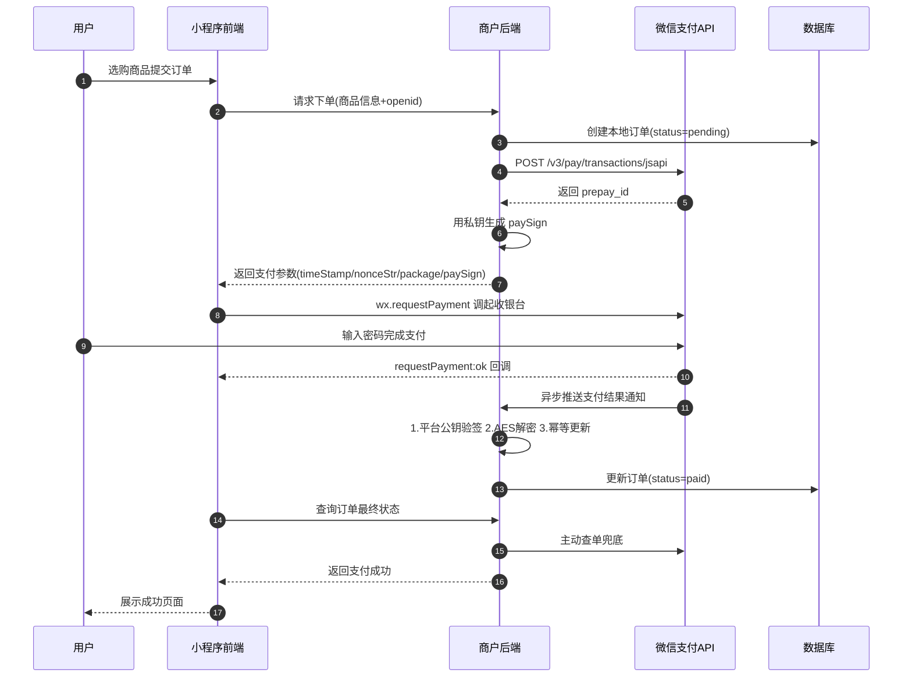
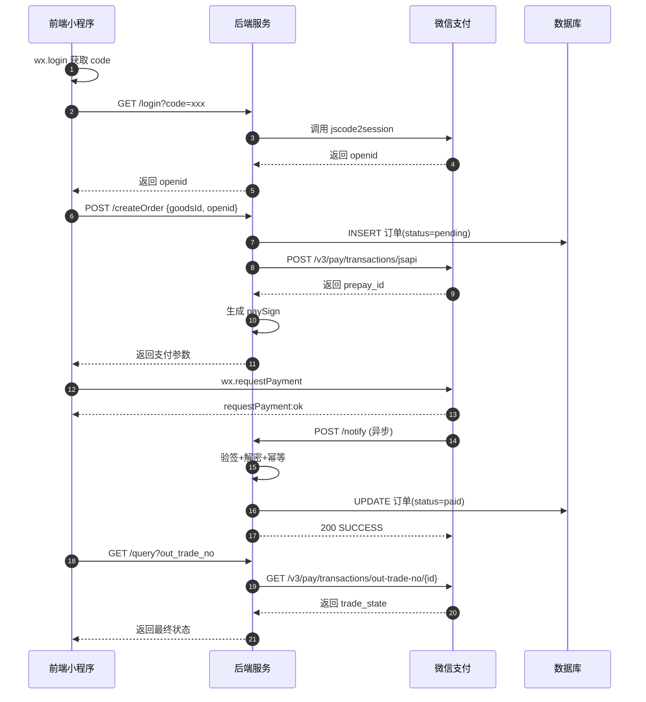
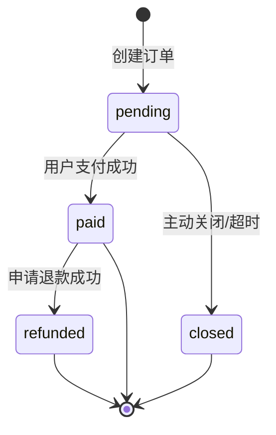
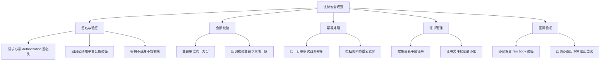
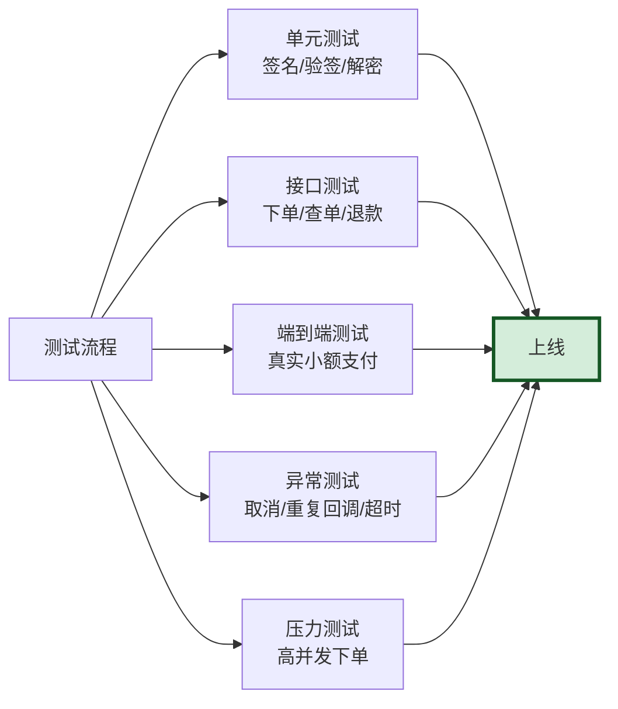

# 微信小程序支付完整实现（前后端代码）

> 文档定位：基于微信支付 APIv3，提供从前端 `wx.requestPayment` 调起到后端下单、签名生成、回调验签解密、查单退款的完整生产级代码实现，可作为小程序支付对接的工程模板。
>
> 技术栈：后端 Node.js（Express）+ 前端 微信小程序原生 / uniapp
>
> 阅读建议：先阅读 [整体流程图](#一整体流程图) 建立全局认知，再按章节对照代码实现。所有代码均含详细中文注释。

---

## 目录

- [一、整体流程图](#一整体流程图)
- [二、前置准备](#二前置准备)
  - [2.1 资质与账户配置](#21-资质与账户配置)
  - [2.2 核心参数清单](#22-核心参数清单)
  - [2.3 项目目录结构](#23-项目目录结构)
- [三、后端实现](#三后端实现)
  - [3.1 配置文件](#31-配置文件)
  - [3.2 工具类：签名生成与验签](#32-工具类签名生成与验签)
  - [3.3 工具类：AES-256-GCM 加解密](#33-工具类aes-256-gcm-加解密)
  - [3.4 工具类：HTTP 请求封装](#34-工具类http-请求封装)
  - [3.5 获取用户 openid](#35-获取用户-openid)
  - [3.6 统一下单接口（生成 prepay_id）](#36-统一下单接口生成-prepay_id)
  - [3.7 生成调起支付参数（paySign）](#37-生成调起支付参数paysign)
  - [3.8 支付结果回调通知（验签+解密+幂等）](#38-支付结果回调通知验签解密幂等)
  - [3.9 主动查询订单（兜底）](#39-主动查询订单兜底)
  - [3.10 关闭订单](#310-关闭订单)
  - [3.11 申请退款](#311-申请退款)
- [四、前端实现](#四前端实现)
  - [4.1 获取 openid 并登录](#41-获取-openid-并登录)
  - [4.2 调起支付完整流程](#42-调起支付完整流程)
  - [4.3 支付结果处理与错误码](#43-支付结果处理与错误码)
  - [4.4 uniapp 版本实现](#44-uniapp-版本实现)
- [五、完整业务串联](#五完整业务串联)
  - [5.1 前后端交互序列图](#51-前后端交互序列图)
  - [5.2 数据库订单表设计](#52-数据库订单表设计)
  - [5.3 订单状态流转](#53-订单状态流转)
- [六、安全与踩坑](#六安全与踩坑)
  - [6.1 安全规范清单](#61-安全规范清单)
  - [6.2 常见踩坑案例](#62-常见踩坑案例)
- [七、测试与上线](#七测试与上线)
  - [7.1 沙箱与真实环境测试](#71-沙箱与真实环境测试)
  - [7.2 上线 Checklist](#72-上线-checklist)

---

## 一、整体流程图



---

## 二、前置准备

### 2.1 资质与账户配置

| 步骤 | 说明 |
|------|------|
| 1. 主体资质 | 仅支持企业/个体工商户/事业单位，**不支持个人** |
| 2. 注册商户号 | 登录 [微信支付商户平台](https://pay.weixin.qq.com/) 提交资质审核 |
| 3. 签署协议 | 审核通过后在线签署支付服务协议 |
| 4. 绑定 AppID | 在商户平台「产品中心-AppID 账号管理」关联小程序 AppID |
| 5. 配置回调域名 | 小程序后台「开发-开发设置」配置 `notify_url`（必须 HTTPS） |
| 6. 设置 APIv3 密钥 | 商户平台「账户中心-API安全-APIv3密钥」设置 32 位字符串 |
| 7. 下载商户证书 | 下载 `apiclient_key.pem`（私钥）和 `apiclient_cert.pem`（公钥证书） |
| 8. 获取平台证书 | 调用接口或下载获取微信支付平台公钥（用于验签回调） |

### 2.2 核心参数清单

```yaml
# config/wechat.yml 或 .env
wechat:
  appid:               "wxxxxxxxxxxxxxxx"      # 小程序 AppID
  secret:              "xxxxxxxxxxxxxxxxxxxx"   # 小程序 AppSecret（用于换取 openid）
  pay:
    merchant_id:       "1900000000"              # 商户号（10位数字）
    serial_no:         "ABCDEF1234567890..."     # 商户证书序列号
    api_v3_key:        "xxxxxxxxxxxxxxxxxxxxxxxx" # APIv3 密钥（32位）
    private_key_path:  "cert/apiclient_key.pem"  # 商户私钥文件
    platform_cert_path: "cert/wechatpay_cert.pem" # 微信平台证书
    platform_serial:   "PLATFORM_SERIAL_NO"      # 平台证书序列号
    notify_url:        "https://yourdomain.com/api/wxpay/notify"
```

| 参数 | 用途 |
|------|------|
| `appid` / `secret` | 小程序身份标识，换取用户 openid |
| `merchant_id` | 商户号，下单必传 |
| `serial_no` | 商户证书序列号，请求头 `Authorization` 携带 |
| `api_v3_key` | 32 位密钥，用于 AES 解密回调数据 |
| `private_key_path` | 商户私钥，用于生成请求签名和 paySign |
| `platform_cert_path` | 微信平台公钥，用于验签回调 |
| `notify_url` | 支付结果异步回调地址（HTTPS） |

### 2.3 项目目录结构

```
wxpay-miniapp/
├── config/
│   └── wechat.js              # 微信支付配置
├── cert/
│   ├── apiclient_key.pem      # 商户私钥
│   └── wechatpay_cert.pem     # 微信平台证书
├── utils/
│   ├── signature.js           # 签名生成与验签
│   ├── crypto.js              # AES-256-GCM 加解密
│   └── http.js                # HTTP 请求封装
├── routes/
│   └── wxpay.js               # 支付路由
├── controllers/
│   └── wxpayController.js     # 业务控制器
├── models/
│   └── Order.js               # 订单模型
├── app.js                     # 入口
└── package.json
```

---

## 三、后端实现

### 3.1 配置文件

```javascript
// config/wechat.js
const fs = require('fs');
const path = require('path');

module.exports = {
  // 小程序配置
  appid: process.env.WX_APPID || 'wxaaaaaaaaaaaaaaaa',
  secret: process.env.WX_SECRET || 'your_app_secret_here',

  // 商户配置
  pay: {
    merchant_id: process.env.WX_MCH_ID || '1900000000',
    serial_no: process.env.WX_MCH_SERIAL || 'ABCDEF1234567890ABCDEF1234567890ABCDEF12',

    // APIv3 密钥（32位）
    api_v3_key: process.env.WX_API_V3_KEY || '0123456789ABCDEF0123456789ABCDEF',

    // 商户私钥（从文件读取）
    private_key: fs.readFileSync(
      path.join(__dirname, '../cert/apiclient_key.pem'),
      'utf8'
    ),

    // 微信平台证书（用于验签回调）
    platform_cert: fs.readFileSync(
      path.join(__dirname, '../cert/wechatpay_cert.pem'),
      'utf8'
    ),
    platform_serial: process.env.WX_PLATFORM_SERIAL || 'PLATFORM_SERIAL_NO',

    // 支付回调地址（必须 HTTPS，外网可访问）
    notify_url: process.env.WX_NOTIFY_URL || 'https://yourdomain.com/api/wxpay/notify',
  },

  // 微信支付 API 基础地址
  api_base: 'https://api.mch.weixin.qq.com',
};
```

### 3.2 工具类：签名生成与验签

```javascript
// utils/signature.js
const crypto = require('crypto');
const config = require('../config/wechat');

/**
 * 生成请求签名（用于调用微信支付 API）
 * 签名串格式：HTTP_METHOD\nREQUEST_URL\nTIMESTAMP\nNONCE_STR\nBODY\n
 * 算法：SHA256 with RSA，Base64 编码
 */
function buildAuthorizationHeader(method, url, body = '') {
  const timestamp = Math.floor(Date.now() / 1000).toString();
  const nonceStr = crypto.randomBytes(16).toString('hex');

  // 构造签名串（5 行，每行 \n 结尾）
  const message = `${method}\n${url}\n${timestamp}\n${nonceStr}\n${body}\n`;

  // 用商户私钥签名
  const sign = crypto
    .createSign('RSA-SHA256')
    .update(message, 'utf8')
    .sign(config.pay.private_key, 'base64');

  // 拼接 Authorization 头
  const auth = `WECHATPAY2-SHA256-RSA2048 mchid="${config.pay.merchant_id}",` +
    `nonce_str="${nonceStr}",` +
    `timestamp="${timestamp}",` +
    `serial_no="${config.pay.serial_no}",` +
    `signature="${sign}"`;

  return {
    Authorization: auth,
    'User-Agent': 'Mozilla/5.0 (Windows NT 10.0; Win64; x64)',
    'Content-Type': 'application/json',
    Accept: 'application/json',
  };
}

/**
 * 生成调起支付的 paySign（前端 wx.requestPayment 使用）
 * 签名串格式：appId\ntimeStamp\nnonceStr\npackage\n
 * 算法：SHA256 with RSA，Base64 编码
 */
function buildPaySign(appid, prepayId) {
  const timeStamp = Math.floor(Date.now() / 1000).toString();
  const nonceStr = crypto.randomBytes(16).toString('hex');
  const package = `prepay_id=${prepayId}`;

  // 构造签名串（4 行，每行 \n 结尾，包括最后一行）
  const message = `${appid}\n${timeStamp}\n${nonceStr}\n${package}\n`;

  // 用商户私钥签名
  const paySign = crypto
    .createSign('RSA-SHA256')
    .update(message, 'utf8')
    .sign(config.pay.private_key, 'base64');

  return {
    appId: appid,
    timeStamp,
    nonceStr,
    package,
    signType: 'RSA',
    paySign,
  };
}

/**
 * 验证微信支付回调签名
 * 用微信平台公钥验签，确保回调来自微信
 */
function verifyNotifySignature(params) {
  const {
    timestamp,        // 微信 HTTP 头 Wechatpay-Timestamp
    nonce,            // 微信 HTTP 头 Wechatpay-Nonce
    body,             // 请求体原始字符串
    signature,        // 微信 HTTP 头 Wechatpay-Signature
  } = params;

  // 构造验签串：timestamp\nnonce\nbody\n
  const message = `${timestamp}\n${nonce}\n${body}\n`;

  // 用微信平台公钥验签
  const verifier = crypto.createVerify('RSA-SHA256');
  verifier.update(message, 'utf8');

  return verifier.verify(
    config.pay.platform_cert,
    Buffer.from(signature, 'base64'),
    'base64'
  );
}

module.exports = {
  buildAuthorizationHeader,
  buildPaySign,
  verifyNotifySignature,
};
```

### 3.3 工具类：AES-256-GCM 加解密

```javascript
// utils/crypto.js
const crypto = require('crypto');
const config = require('../config/wechat');

/**
 * 解密微信支付回调数据
 * 回调通知的 resource 字段使用 AES-256-GCM 加密
 * 密钥为 APIv3 密钥（32 字节）
 */
function decryptResource(resource) {
  const { ciphertext, nonce, associated_data } = resource;

  // 密钥：APIv3 key（32 字节）
  const key = Buffer.from(config.pay.api_v3_key, 'utf8');
  // 密文：Base64 解码
  const cipherText = Buffer.from(ciphertext, 'base64');

  // GCM 模式：前 16 字节是 authTag，其余是密文
  const authTag = cipherText.slice(cipherText.length - 16);
  const encryptedData = cipherText.slice(0, cipherText.length - 16);

  // 创建解密器
  const decipher = crypto.createDecipheriv('aes-256-gcm', key, nonce, {
    authTagLength: 16,
  });

  // 设置 authTag 和附加数据
  decipher.setAuthTag(authTag);
  if (associated_data) {
    decipher.setAAD(Buffer.from(associated_data));
  }

  // 解密
  let decrypted = decipher.update(encryptedData);
  decrypted = Buffer.concat([decrypted, decipher.final()]);

  return JSON.parse(decrypted.toString('utf8'));
}

module.exports = { decryptResource };
```

### 3.4 工具类：HTTP 请求封装

```javascript
// utils/http.js
const https = require('https');
const { URL } = require('url');
const { buildAuthorizationHeader } = require('./signature');
const config = require('../config/wechat');

/**
 * 封装微信支付 API 请求
 * 自动生成签名头
 */
function wxpayRequest(method, path, body = null) {
  return new Promise((resolve, reject) => {
    const bodyStr = body ? JSON.stringify(body) : '';
    const headers = buildAuthorizationHeader(method, path, bodyStr);

    const url = new URL(config.api_base + path);
    const options = {
      hostname: url.hostname,
      port: 443,
      path: url.pathname + url.search,
      method,
      headers: {
        ...headers,
        'Content-Length': Buffer.byteLength(bodyStr),
      },
    };

    const req = https.request(options, (res) => {
      let data = '';
      res.on('data', (chunk) => (data += chunk));
      res.on('end', () => {
        try {
          const result = data ? JSON.parse(data) : {};
          if (res.statusCode >= 200 && res.statusCode < 300) {
            resolve(result);
          } else {
            reject(new Error(`HTTP ${res.statusCode}: ${data}`));
          }
        } catch (err) {
          reject(new Error(`解析响应失败: ${err.message}`));
        }
      });
    });

    req.on('error', reject);
    if (bodyStr) req.write(bodyStr);
    req.end();
  });
}

module.exports = { wxpayRequest };
```

### 3.5 获取用户 openid

```javascript
// controllers/wxpayController.js
const axios = require('axios');
const config = require('../config/wechat');

/**
 * 前端调用 wx.login 拿到 code，
 * 提交到本接口换取 openid + session_key
 * GET /api/wxpay/login?code=xxx
 */
async function login(req, res) {
  const { code } = req.query;
  if (!code) {
    return res.status(400).json({ code: 1, msg: 'code 不能为空' });
  }

  const url = `https://api.weixin.qq.com/sns/jscode2session` +
    `?appid=${config.appid}` +
    `&secret=${config.secret}` +
    `&js_code=${code}` +
    `&grant_type=authorization_code`;

  const { data } = await axios.get(url);

  if (data.errcode) {
    return res.status(400).json({
      code: data.errcode,
      msg: data.errmsg,
    });
  }

  // 实际项目应将 openid 与用户账号绑定并存库
  // 这里直接返回 openid 给前端
  res.json({
    code: 0,
    data: {
      openid: data.openid,
      session_key: data.session_key,
    },
  });
}

module.exports = { login };
```

### 3.6 统一下单接口（生成 prepay_id）

```javascript
// controllers/wxpayController.js（续）
const { wxpayRequest } = require('../utils/http');
const { buildPaySign } = require('../utils/signature');
const config = require('../config/wechat');
const Order = require('../models/Order'); // 假设的订单模型

/**
 * 创建订单并调用微信下单接口
 * POST /api/wxpay/createOrder
 * body: { goodsId, quantity, openid }
 */
async function createOrder(req, res) {
  const { goodsId, quantity = 1, openid } = req.body;

  if (!openid || !goodsId) {
    return res.status(400).json({ code: 1, msg: '参数错误' });
  }

  // 1. 查询商品信息（业务逻辑）
  const goods = await getGoodsById(goodsId);
  if (!goods) {
    return res.status(400).json({ code: 1, msg: '商品不存在' });
  }

  // 2. 生成商户内部订单号
  const outTradeNo = generateOrderNo();
  const totalAmount = goods.price * quantity; // 单位：分

  // 3. 创建本地订单
  await Order.create({
    out_trade_no: outTradeNo,
    goods_id: goodsId,
    quantity,
    total: totalAmount,
    openid,
    status: 'pending', // pending | paid | closed | refunded
    created_at: new Date(),
  });

  // 4. 调用微信统一下单接口
  const apiUrl = '/v3/pay/transactions/jsapi';
  const body = {
    appid: config.appid,
    mchid: config.pay.merchant_id,
    description: goods.name,             // 商品描述
    out_trade_no: outTradeNo,            // 商户订单号
    time_expire: getExpireTime(),        // 支付过期时间 RFC3339
    notify_url: config.pay.notify_url,  // 回调地址
    amount: {
      total: totalAmount,                // 金额，单位：分
      currency: 'CNY',
    },
    payer: {
      openid,                            // 用户 openid
    },
  };

  try {
    const result = await wxpayRequest('POST', apiUrl, body);
    const prepayId = result.prepay_id;

    // 5. 生成调起支付参数（含 paySign）
    const payParams = buildPaySign(config.appid, prepayId);

    res.json({
      code: 0,
      data: {
        out_trade_no: outTradeNo,
        ...payParams,
      },
    });
  } catch (err) {
    console.error('下单失败:', err);
    res.status(500).json({ code: 1, msg: '下单失败: ' + err.message });
  }
}

// 辅助：生成订单号（商户自定义，需唯一）
function generateOrderNo() {
  const date = new Date();
  const ymd = date.getFullYear().toString() +
    String(date.getMonth() + 1).padStart(2, '0') +
    String(date.getDate()).padStart(2, '0');
  const rand = Math.random().toString(36).slice(2, 10).toUpperCase();
  return `${ymd}${rand}`;
}

// 辅助：生成过期时间（30分钟后）
function getExpireTime() {
  const expire = new Date(Date.now() + 30 * 60 * 1000);
  return expire.toISOString(); // RFC3339 格式
}

// 辅助：模拟查询商品
async function getGoodsById(id) {
  return { id, name: '测试商品', price: 100 }; // 1元
}
```

### 3.7 生成调起支付参数（paySign）

签名生成逻辑已在 [3.2](#32-工具类签名生成与验签) 的 `buildPaySign` 中实现。关键点：

```javascript
// 签名串格式（4 行，每行 \n 结尾，包括最后一行）
// appId\n
// timeStamp\n
// nonceStr\n
// package\n

const message = `${appId}\n${timeStamp}\n${nonceStr}\nprepay_id=${prepayId}\n`;

// 用商户私钥进行 SHA256 with RSA 签名
const paySign = crypto
  .createSign('RSA-SHA256')
  .update(message, 'utf8')
  .sign(privateKey, 'base64');

// 注意：signType 固定为 "RSA"，不参与签名
```

返回给前端的数据结构：

```json
{
  "code": 0,
  "data": {
    "out_trade_no": "20260904ABC12345",
    "appId": "wxaaaaaaaaaaaaaaaa",
    "timeStamp": "1725440000",
    "nonceStr": "abc123def456...",
    "package": "prepay_id=wx20260904...",
    "signType": "RSA",
    "paySign": "oR9d8PuhnIc+YZ8c..."
  }
}
```

### 3.8 支付结果回调通知（验签+解密+幂等）

```javascript
// controllers/wxpayController.js（续）
const { verifyNotifySignature } = require('../utils/signature');
const { decryptResource } = require('../utils/crypto');

/**
 * 微信支付异步回调
 * POST /api/wxpay/notify
 * 微信会在用户支付成功后向此地址推送支付结果
 */
async function payNotify(req, res) {
  console.log('收到微信回调:', req.body);

  // 1. 提取微信 HTTP 头
  const wxTimestamp = req.get('Wechatpay-Timestamp');
  const wxNonce = req.get('Wechatpay-Nonce');
  const wxSignature = req.get('Wechatpay-Signature');
  const wxSerial = req.get('Wechatpay-Serial');

  if (!wxTimestamp || !wxNonce || !wxSignature) {
    return res.status(401).json({
      code: 'FAIL',
      message: '缺少验签字段',
    });
  }

  // 2. 获取原始请求体字符串（重要！不能用 JSON.parse 后的对象）
  const rawBody = req.rawBody; // 需在 body-parser 中保留 raw body

  // 3. 验签：用微信平台公钥验证签名
  const verified = verifyNotifySignature({
    timestamp: wxTimestamp,
    nonce: wxNonce,
    body: rawBody,
    signature: wxSignature,
  });

  if (!verified) {
    console.error('验签失败');
    return res.status(401).json({
      code: 'FAIL',
      message: '验签失败',
    });
  }

  // 4. 解密：AES-256-GCM 解密 resource 字段
  const resource = req.body.resource;
  let decrypted;
  try {
    decrypted = decryptResource(resource);
  } catch (err) {
    console.error('解密失败:', err);
    return res.status(500).json({
      code: 'FAIL',
      message: '解密失败',
    });
  }

  console.log('解密后的支付结果:', decrypted);
  /*
    decrypted 结构：
    {
      "mchid": "1900000000",
      "appid": "wxaaaaaaaaaaaaaaaa",
      "out_trade_no": "20260904ABC12345",
      "transaction_id": "42001234567890...",
      "trade_type": "JSAPI",
      "trade_state": "SUCCESS",
      "trade_state_desc": "支付成功",
      "bank_type": "OTHERS",
      "attach": "...",
      "success_time": "2026-09-04T10:00:00+08:00",
      "payer": { "openid": "oxxxxxxx" },
      "amount": { "total": 100, "payer_total": 100, "currency": "CNY", "payer_currency": "CNY" }
    }
  */

  // 5. 幂等处理：检查订单是否已处理
  const order = await Order.findOne({
    where: { out_trade_no: decrypted.out_trade_no },
  });

  if (!order) {
    console.error('订单不存在:', decrypted.out_trade_no);
    return res.status(404).json({
      code: 'FAIL',
      message: '订单不存在',
    });
  }

  // 已处理过的订单直接返回成功（防止重复回调）
  if (order.status === 'paid') {
    console.log('订单已处理，重复回调');
    return res.status(200).json({
      code: 'SUCCESS',
      message: '成功',
    });
  }

  // 6. 校验金额（防止伪造）
  if (order.total !== decrypted.amount.total) {
    console.error('金额不匹配');
    return res.status(400).json({
      code: 'FAIL',
      message: '金额不匹配',
    });
  }

  // 7. 校验支付状态
  if (decrypted.trade_state !== 'SUCCESS') {
    console.log('支付未成功:', decrypted.trade_state);
    return res.status(200).json({
      code: 'SUCCESS',
      message: '成功',
    });
  }

  // 8. 更新订单状态
  await Order.update(
    {
      status: 'paid',
      transaction_id: decrypted.transaction_id,
      paid_at: new Date(decrypted.success_time),
      updated_at: new Date(),
    },
    {
      where: { out_trade_no: decrypted.out_trade_no },
    }
  );

  // 9. 触发业务后续逻辑（发货、积分、通知等）
  await triggerBusinessLogic(order);

  // 10. 返回成功，停止微信重试
  res.status(200).json({
    code: 'SUCCESS',
    message: '成功',
  });
}

async function triggerBusinessLogic(order) {
  // 发送模板消息、赠送积分、通知 ERP 等
  console.log('处理业务后续:', order.out_trade_no);
}

module.exports = { login, createOrder, payNotify };
```

**保留 raw body 的中间件配置**：

```javascript
// app.js
const express = require('express');
const app = express();

// 关键：保留原始请求体用于验签
app.use(
  express.json({
    verify: (req, _res, buf) => {
      req.rawBody = buf.toString(); // 保留原始字符串
    },
  })
);

const wxpayRouter = require('./routes/wxpay');
app.use('/api/wxpay', wxpayRouter);

app.listen(3000, () => console.log('Server running on 3000'));
```

### 3.9 主动查询订单（兜底）

```javascript
// controllers/wxpayController.js（续）
const { wxpayRequest } = require('../utils/http');
const config = require('../config/wechat');

/**
 * 主动查询订单状态（兜底机制）
 * 即使收到回调也建议主动查单
 * GET /api/wxpay/query?out_trade_no=xxx
 */
async function queryOrder(req, res) {
  const { out_trade_no } = req.query;

  if (!out_trade_no) {
    return res.status(400).json({ code: 1, msg: '缺少订单号' });
  }

  // 调用微信查询接口
  const apiUrl = `/v3/pay/transactions/out-trade-no/${out_trade_no}` +
    `?mchid=${config.pay.merchant_id}`;

  try {
    const result = await wxpayRequest('GET', apiUrl);

    /*
      result 结构：
      {
        "trade_state": "SUCCESS",
        "trade_type": "JSAPI",
        "transaction_id": "42001234...",
        "amount": { "total": 100, "currency": "CNY" },
        "success_time": "2026-09-04T10:00:00+08:00",
        "payer": { "openid": "oxxxxxxx" }
      }
    */

    // 同步更新本地订单状态
    if (result.trade_state === 'SUCCESS') {
      await Order.update(
        {
          status: 'paid',
          transaction_id: result.transaction_id,
          paid_at: new Date(result.success_time),
        },
        { where: { out_trade_no } }
      );
    }

    res.json({
      code: 0,
      data: {
        trade_state: result.trade_state,
        transaction_id: result.transaction_id,
      },
    });
  } catch (err) {
    console.error('查询失败:', err);
    res.status(500).json({ code: 1, msg: '查询失败' });
  }
}

module.exports = { queryOrder };
```

### 3.10 关闭订单

```javascript
/**
 * 关闭订单（用户超时未支付）
 * POST /api/wxpay/close
 * body: { out_trade_no }
 */
async function closeOrder(req, res) {
  const { out_trade_no } = req.body;

  const apiUrl = `/v3/pay/transactions/out-trade-no/${out_trade_no}/close`;
  const body = {
    mchid: config.pay.merchant_id,
  };

  try {
    await wxpayRequest('POST', apiUrl, body);
    await Order.update(
      { status: 'closed', updated_at: new Date() },
      { where: { out_trade_no, status: 'pending' } }
    );

    res.json({ code: 0, msg: '订单已关闭' });
  } catch (err) {
    res.status(500).json({ code: 1, msg: '关闭失败: ' + err.message });
  }
}
```

### 3.11 申请退款

```javascript
/**
 * 申请退款
 * POST /api/wxpay/refund
 * body: { out_trade_no, refund_no, total, refund, reason }
 */
async function refund(req, res) {
  const { out_trade_no, refund_no, total, refund, reason = '用户申请退款' } = req.body;

  const apiUrl = '/v3/refund/domestic/refunds';
  const body = {
    out_trade_no,
    out_refund_no: refund_no,
    reason,
    amount: {
      refund,                    // 退款金额（分）
      total,                     // 原订单金额（分）
      currency: 'CNY',
    },
  };

  try {
    const result = await wxpayRequest('POST', apiUrl, body);

    // 更新本地订单状态
    await Order.update(
      { status: 'refunded', refund_no, updated_at: new Date() },
      { where: { out_trade_no } }
    );

    res.json({
      code: 0,
      data: {
        refund_id: result.refund_id,
        status: result.status, // SUCCESS / PROCESSING / CLOSED
      },
    });
  } catch (err) {
    res.status(500).json({ code: 1, msg: '退款失败: ' + err.message });
  }
}

module.exports = { refund };
```

**路由注册**：

```javascript
// routes/wxpay.js
const express = require('express');
const router = express.Router();
const ctrl = require('../controllers/wxpayController');

router.get('/login', ctrl.login);
router.post('/createOrder', ctrl.createOrder);
router.post('/notify', ctrl.payNotify);       // 微信回调
router.get('/query', ctrl.queryOrder);
router.post('/close', ctrl.closeOrder);
router.post('/refund', ctrl.refund);

module.exports = router;
```

---

## 四、前端实现

### 4.1 获取 openid 并登录

```javascript
// pages/index/index.js
Page({
  data: {
    openid: '',
    isLogin: false,
  },

  onLoad() {
    this.login();
  },

  // 登录获取 openid
  login() {
    wx.login({
      success: (res) => {
        if (!res.code) {
          wx.showToast({ title: '登录失败', icon: 'error' });
          return;
        }

        // 将 code 提交到后端换取 openid
        wx.request({
          url: 'https://yourdomain.com/api/wxpay/login',
          data: { code: res.code },
          method: 'GET',
          success: (resp) => {
            if (resp.data.code === 0) {
              this.setData({
                openid: resp.data.data.openid,
                isLogin: true,
              });
              wx.setStorageSync('openid', resp.data.data.openid);
            }
          },
          fail: () => {
            wx.showToast({ title: '网络错误', icon: 'error' });
          },
        });
      },
    });
  },
});
```

### 4.2 调起支付完整流程

```javascript
// pages/pay/pay.js
Page({
  data: {
    goodsId: 'g001',
    goodsName: '测试商品',
    price: 1, // 元
    isPaying: false, // 防抖标志
  },

  // 点击支付按钮
  async handlePay() {
    // 1. 防抖：防止用户重复点击
    if (this.data.isPaying) {
      wx.showToast({ title: '正在处理...', icon: 'none' });
      return;
    }
    this.setData({ isPaying: true });

    try {
      const openid = wx.getStorageSync('openid');
      if (!openid) {
        wx.showToast({ title: '请先登录', icon: 'error' });
        return;
      }

      // 2. 调用后端创建订单
      const orderRes = await this.callBackendCreateOrder(openid);
      if (orderRes.code !== 0) {
        wx.showToast({ title: orderRes.msg, icon: 'error' });
        return;
      }

      const payParams = orderRes.data;

      // 3. 调起微信支付
      const payResult = await this.callWxPay(payParams);

      // 4. 支付成功，查询最终状态
      const finalStatus = await this.queryOrderStatus(payParams.out_trade_no);

      if (finalStatus.trade_state === 'SUCCESS') {
        wx.showToast({ title: '支付成功', icon: 'success' });
        setTimeout(() => {
          wx.navigateTo({ url: '/pages/result/result?status=success' });
        }, 1500);
      } else {
        wx.showToast({ title: '支付未完成', icon: 'none' });
      }
    } catch (err) {
      this.handlePayError(err);
    } finally {
      this.setData({ isPaying: false });
    }
  },

  // 调用后端创建订单
  callBackendCreateOrder(openid) {
    return new Promise((resolve, reject) => {
      wx.request({
        url: 'https://yourdomain.com/api/wxpay/createOrder',
        method: 'POST',
        data: {
          goodsId: this.data.goodsId,
          quantity: 1,
          openid,
        },
        success: (res) => resolve(res.data),
        fail: reject,
      });
    });
  },

  // 调用微信支付 API
  callWxPay(params) {
    return new Promise((resolve, reject) => {
      wx.requestPayment({
        timeStamp: params.timeStamp,
        nonceStr: params.nonceStr,
        package: params.package,
        signType: params.signType,
        paySign: params.paySign,
        success: (res) => {
          console.log('支付成功', res);
          resolve(res);
        },
        fail: (err) => {
          console.error('支付失败', err);
          reject(err);
        },
      });
    });
  },

  // 查询订单最终状态（兜底）
  queryOrderStatus(outTradeNo) {
    return new Promise((resolve, reject) => {
      wx.request({
        url: `https://yourdomain.com/api/wxpay/query?out_trade_no=${outTradeNo}`,
        method: 'GET',
        success: (res) => {
          if (res.data.code === 0) {
            resolve(res.data.data);
          } else {
            reject(new Error(res.data.msg));
          }
        },
        fail: reject,
      });
    });
  },

  // 支付错误处理
  handlePayError(err) {
    console.error('支付错误:', err);

    // 用户取消支付
    if (err.errMsg && err.errMsg.includes('cancel')) {
      wx.showToast({ title: '已取消支付', icon: 'none' });
      return;
    }

    // 支付失败
    wx.showModal({
      title: '支付失败',
      content: err.errMsg || '请稍后重试',
      showCancel: false,
    });
  },
});
```

### 4.3 支付结果处理与错误码

```javascript
// utils/payErrorHandler.js
const PAY_ERRORS = {
  'requestPayment:fail cancel': '用户取消支付',
  'requestPayment:fail (detail message)': '支付失败',
  'requestPayment:ok': '支付成功',
};

function parsePayError(err) {
  const errMsg = err.errMsg || '';
  if (errMsg.includes('cancel')) {
    return { type: 'cancel', message: '用户主动取消支付' };
  }
  if (errMsg.includes('requestPayment:ok')) {
    return { type: 'success', message: '支付成功' };
  }
  return { type: 'error', message: '支付失败: ' + errMsg };
}

module.exports = { parsePayError };
```

**常见错误码对照表**：

| errMsg | 说明 | 处理建议 |
|--------|------|---------|
| `requestPayment:ok` | 调起支付成功 | 查询订单最终状态 |
| `requestPayment:fail cancel` | 用户取消支付 | 引导用户重新支付 |
| `requestPayment:fail (signature error)` | 签名错误 | 检查 paySign 生成 |
| `requestPayment:fail (prepay_id expired)` | prepay_id 过期 | 重新下单获取新的 prepay_id |
| `requestPayment:fail (appid mismatch)` | appId 不一致 | 下单与调起 appId 必须一致 |

### 4.4 uniapp 版本实现

```javascript
// uniapp 版本（跨端兼容）
export default {
  data() {
    return {
      isPaying: false,
    };
  },

  methods: {
    async handlePay() {
      if (this.isPaying) return;
      this.isPaying = true;

      try {
        // 1. 登录获取 code
        const { code } = await uni.login();
        // 2. 后端换取 openid + 下单（合并接口）
        const orderRes = await uni.request({
          url: 'https://yourdomain.com/api/wxpay/createOrder',
          method: 'POST',
          data: {
            code,
            goodsId: this.goodsId,
            quantity: 1,
          },
        });
        const payParams = orderRes[1].data.data;

        // 3. 调起支付
        await uni.requestPayment({
          provider: 'wxpay',
          timeStamp: payParams.timeStamp,
          nonceStr: payParams.nonceStr,
          package: payParams.package,
          signType: payParams.signType,
          paySign: payParams.paySign,
        });

        // 4. 查询最终结果
        const queryRes = await uni.request({
          url: `https://yourdomain.com/api/wxpay/query?out_trade_no=${payParams.out_trade_no}`,
        });

        uni.showToast({
          title: queryRes[1].data.data.trade_state === 'SUCCESS' ? '支付成功' : '支付未完成',
          icon: 'success',
        });
      } catch (err) {
        if (err.errMsg && err.errMsg.includes('cancel')) {
          uni.showToast({ title: '已取消', icon: 'none' });
        } else {
          uni.showToast({ title: '支付失败', icon: 'error' });
        }
      } finally {
        this.isPaying = false;
      }
    },
  },
};
```

---

## 五、完整业务串联

### 5.1 前后端交互序列图



### 5.2 数据库订单表设计

```sql
CREATE TABLE `orders` (
  `id`              BIGINT(20)   NOT NULL AUTO_INCREMENT,
  `out_trade_no`    VARCHAR(32)  NOT NULL COMMENT '商户订单号',
  `transaction_id`  VARCHAR(64)  DEFAULT NULL COMMENT '微信支付订单号',
  `goods_id`        VARCHAR(32)  NOT NULL,
  `quantity`        INT(11)      NOT NULL DEFAULT 1,
  `total`           INT(11)      NOT NULL COMMENT '订单金额（分）',
  `openid`          VARCHAR(64)  NOT NULL,
  `status`          VARCHAR(16)  NOT NULL DEFAULT 'pending'
                    COMMENT 'pending|paid|closed|refunded',
  `paid_at`         DATETIME     DEFAULT NULL,
  `refund_no`       VARCHAR(32)  DEFAULT NULL,
  `created_at`      DATETIME     NOT NULL DEFAULT CURRENT_TIMESTAMP,
  `updated_at`      DATETIME     NOT NULL DEFAULT CURRENT_TIMESTAMP ON UPDATE CURRENT_TIMESTAMP,
  PRIMARY KEY (`id`),
  UNIQUE KEY `uk_out_trade_no` (`out_trade_no`),
  KEY `idx_transaction_id` (`transaction_id`),
  KEY `idx_status` (`status`),
  KEY `idx_openid` (`openid`)
) ENGINE=InnoDB DEFAULT CHARSET=utf8mb4 COMMENT='订单表';
```

### 5.3 订单状态流转



| 状态 | 说明 | 触发条件 |
|------|------|---------|
| `pending` | 待支付 | 创建订单后 |
| `paid` | 已支付 | 收到支付成功回调/主动查单成功 |
| `closed` | 已关闭 | 超时未支付主动关单 |
| `refunded` | 已退款 | 退款成功 |

---

## 六、安全与踩坑

### 6.1 安全规范清单



### 6.2 常见踩坑案例

#### 踩坑1：验签失败 - 使用了 JSON.parse 后的对象

```javascript
// ❌ 错误：用 JSON 对象验签，验签必然失败
app.post('/notify', express.json(), (req, res) => {
  const verified = verifyNotifySignature({
    body: JSON.stringify(req.body),  // 重新序列化，字符顺序可能变化
  });
});

// ✅ 正确：使用原始字符串
app.use(express.json({
  verify: (req, _res, buf) => {
    req.rawBody = buf.toString();  // 保留原始字符串
  },
}));
```

#### 踩坑2：prepay_id 过期

```javascript
// prepay_id 有效期仅 2 小时
// 用户停留过久后调起支付会失败
// 解决：每次调起前判断 prepay_id 时间，过期重新下单

const createdTime = new Date(prepayIdCreatedAt);
if (Date.now() - createdTime > 100 * 60 * 1000) {
  // 超过 100 分钟，重新下单
  return await createNewOrder();
}
```

#### 踩坑3：金额单位错误

```javascript
// ❌ 错误：前端传元
{ amount: { total: 1 } }  // 实际支付 1 分

// ✅ 正确：后端转分
{ amount: { total: 100 } }  // 实际支付 1 元
```

#### 踩坑4：appId 不一致

```javascript
// 下单的 appId 必须与调起支付的小程序 appId 一致
// 否则报错：requestPayment:fail (appid mismatch)

// 注意：appId 参数大小写
// ❌ 错误：appid
// ✅ 正确：appId（大写 I）
```

#### 踩坑5：回调未返回 200 导致重试轰炸

```javascript
// 微信回调若没收到 200 会重试 8 次（间隔递增）
// 必须在所有分支都返回 200

app.post('/notify', async (req, res) => {
  try {
    // ... 业务逻辑
    res.status(200).json({ code: 'SUCCESS', message: '成功' });
  } catch (err) {
    console.error(err);
    // 即使出错也返回 200，避免重试
    res.status(200).json({ code: 'FAIL', message: err.message });
  }
});
```

#### 踩坑6：平台证书过期

微信平台证书会定期更新，需要定期下载新证书：

```javascript
// 启动时检查证书并定期更新
async function refreshPlatformCert() {
  const apiUrl = '/v3/certificates';
  const result = await wxpayRequest('GET', apiUrl);

  for (const cert of result.data) {
    // 解密证书内容（同样使用 AES-256-GCM）
    const decrypted = decryptResource(cert.encrypt_certificate);
    // 保存到文件
    fs.writeFileSync(
      path.join(__dirname, '../cert/wechatpay_cert.pem'),
      decrypted.certificate
    );
  }
}

// 每天检查一次
setInterval(refreshPlatformCert, 24 * 60 * 60 * 1000);
```

---

## 七、测试与上线

### 7.1 沙箱与真实环境测试

微信支付 V3 **不提供沙箱环境**，需使用真实商户号小额测试：

| 测试场景 | 方法 |
|---------|------|
| 正常支付 | 用真实账号支付 0.01 元 |
| 取消支付 | 调起收银台后关闭 |
| 金额不足 | 测试边界值 |
| 回调验签 | 用 mock 数据测试验签逻辑 |
| 重复回调 | 触发同一订单多次回调 |
| 主动查单 | 在未收到回调时查询 |
| 退款 | 支付成功后立即退款 |

### 7.2 上线 Checklist

```markdown
- [ ] 商户号、AppID、证书已配置生产环境
- [ ] notify_url 为 HTTPS 且外网可访问
- [ ] 服务器防火墙放行微信支付 IP（无需白名单）
- [ ] 已实现验签、解密、幂等
- [ ] 已实现主动查单兜底机制
- [ ] 已实现订单超时关单逻辑
- [ ] 已实现金额校验（防伪造）
- [ ] 已添加日志记录所有关键节点
- [ ] 已配置证书自动更新
- [ ] 已配置退款流程与对账
- [ ] 已做按钮防抖处理
- [ ] 已做错误码友好提示
- [ ] 已通过真实小额支付测试
- [ ] 已通过回调重复推送测试
- [ ] 已通过超时关单测试
- [ ] 已上线监控告警
```


