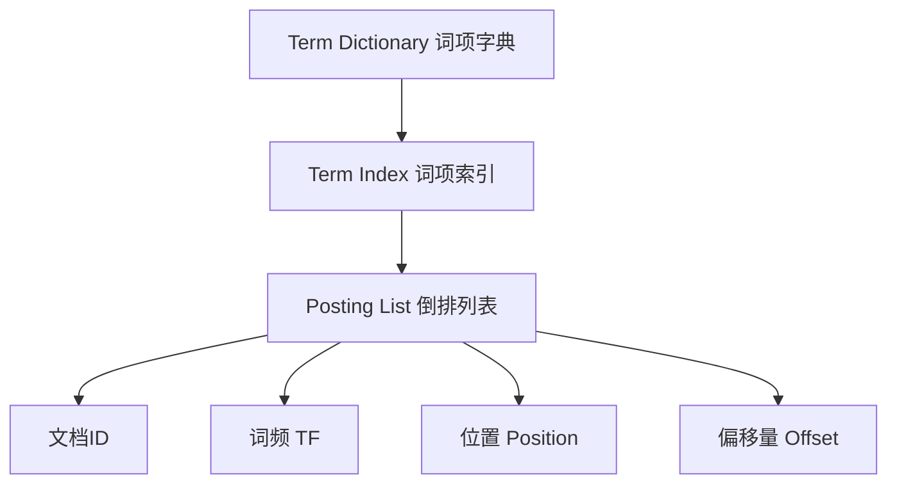
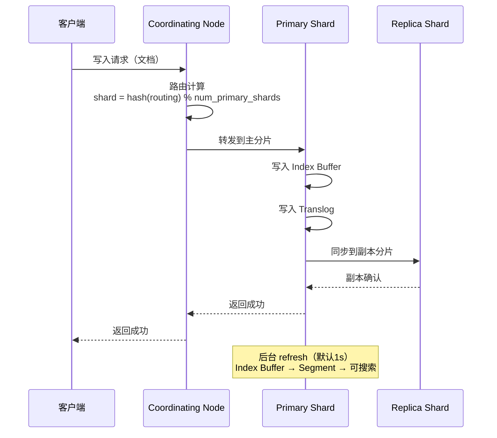
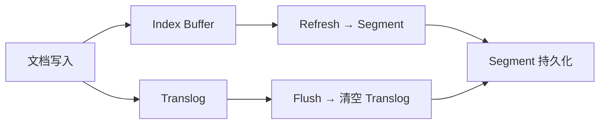
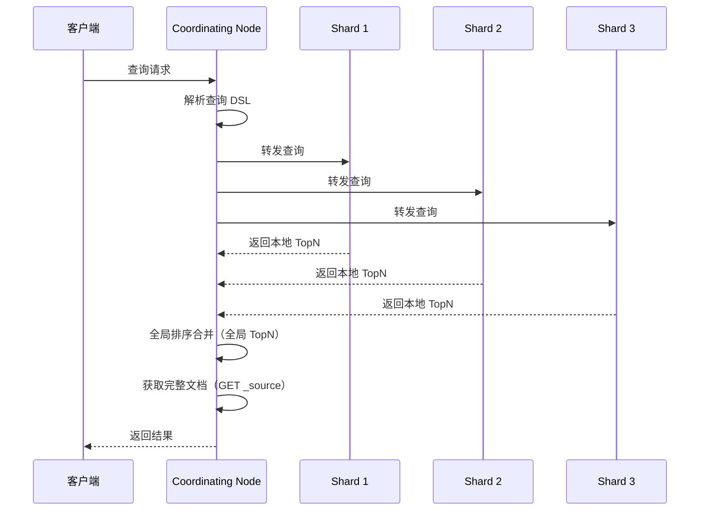
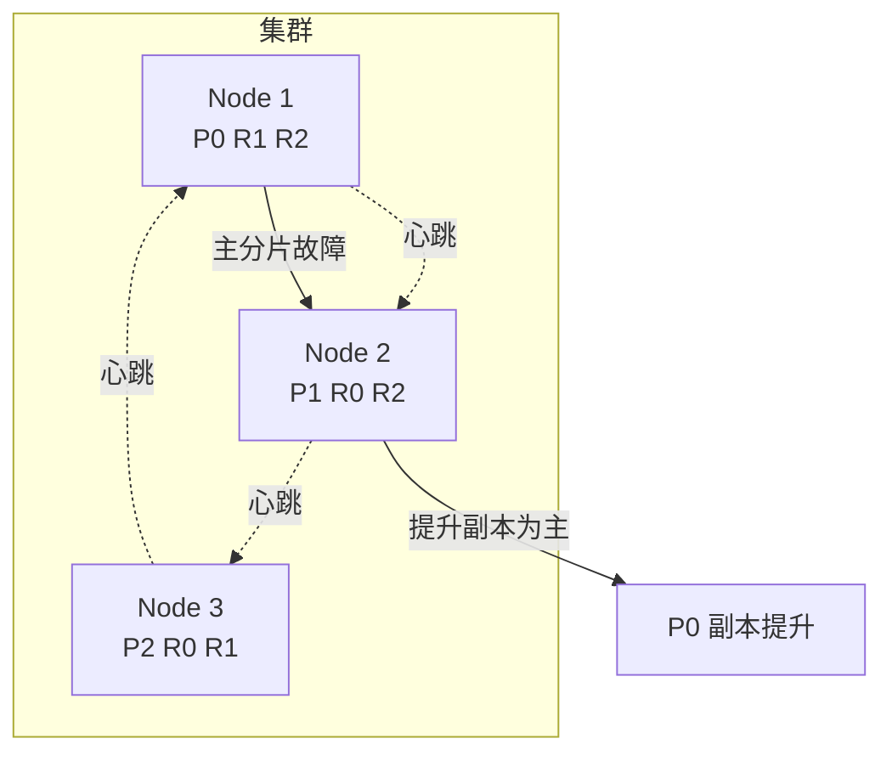

# Elasticsearch 高频面试题与详细回答

> 文档定位：系统梳理 Elasticsearch 在面试中的高频问题，涵盖基础架构、倒排索引、写入与查询原理、分词与映射、DSL 查询、聚合、集群与分片、性能优化、与 MySQL 对比等核心考点。
>
> 适用人群：Java 后端工程师，尤其是使用 ES 做全文检索、日志分析、商品搜索的开发者。
>
> 阅读建议：先掌握 ES 核心原理（一至三章），再学习查询与聚合（四至六章），最后攻克集群与优化（七至八章）。重点关注「倒排索引」「写入流程」「查询流程」「分片与副本」「深分页优化」五大核心模块。

---

## 目录

- [一、Elasticsearch 基础概念](#一elasticsearch-基础概念)
  - [Q1. Elasticsearch 是什么？与关系型数据库的区别？](#q1-elasticsearch-是什么与关系型数据库的区别)
  - [Q2. ES 核心概念（Index/Type/Document/Shard）？](#q2-es-核心概念indextypedocumentshard)
  - [Q3. 倒排索引原理？](#q3-倒排索引原理)
- [二、写入与更新原理](#二写入与更新原理)
  - [Q4. ES 写入文档的完整流程？](#q4-es-写入文档的完整流程)
  - [Q5. ES 为什么是近实时（NRT）？](#q5-es-为什么是近实时nrt)
  - [Q6. ES 更新和删除的原理？](#q6-es-更新和删除的原理)
  - [Q7. translog 的作用？](#q7-translog-的作用)
- [三、查询原理](#三查询原理)
  - [Q8. ES 查询的完整流程？](#q8-es-查询的完整流程)
  - [Q9. 文本查询（match/term/match_phrase）的区别？](#q9-文本查询matchtermphrase的区别)
  - [Q10. ES 评分机制（TF-IDF / BM25）？](#q10-es-评分机制tf-idf--bm25)
- [四、分词与映射](#四分词与映射)
  - [Q11. ES 分词器（Analyzer）组成？](#q11-es-分词器analyzer组成)
  - [Q12. IK 分词器的两种模式？](#q12-ik-分词器的两种模式)
  - [Q13. Mapping 中的字段类型有哪些？](#q13-mapping-中的字段类型有哪些)
  - [Q14. keyword 和 text 的区别？](#q14-keyword-和-text-的区别)
- [五、DSL 查询](#五dsl-查询)
  - [Q15. bool 查询的四种子句？](#q15-bool-查询的四种子句)
  - [Q16. filter 和 query 的区别？](#q16-filter-和-query-的区别)
  - [Q17. 聚合查询（Aggregation）的类型？](#q17-聚合查询aggregation的类型)
- [六、集群与分片](#六集群与分片)
  - [Q18. ES 集群架构（Master/Data/Coordinating）？](#q18-es-集群架构masterdatacoordinating)
  - [Q19. 分片（Shard）与副本（Replica）？](#q19-分片shard与副本replica)
  - [Q20. ES 如何保证高可用？](#q20-es-如何保证高可用)
  - [Q21. ES 脑裂问题与解决？](#q21-es-脑裂问题与解决)
- [七、性能优化](#七性能优化)
  - [Q22. ES 深分页问题及优化？](#q22-es-深分页问题及优化)
  - [Q23. ES 写入性能优化？](#q23-es-写入性能优化)
  - [Q24. ES 查询性能优化？](#q24-es-查询性能优化)
  - [Q25. ES 与 MySQL 数据同步方案？](#q25-es-与-mysql-数据同步方案)
- [八、综合实战题](#八综合实战题)
  - [Q26. 设计一个商品搜索系统？](#q26-设计一个商品搜索系统)
  - [Q27. ES 实现高亮搜索？](#q27-es-实现高亮搜索)
  - [Q28. ES 与 Solr 的对比？](#q28-es-与-solr-的对比)
- [九、速答与踩坑总结](#九速答与踩坑总结)
  - [9.1 速答卡片](#91-速答卡片)
  - [9.2 实战踩坑 10 例](#92-实战踩坑-10-例)
  - [9.3 复习优先级表](#93-复习优先级表)

---

## 一、Elasticsearch 基础概念

### Q1. Elasticsearch 是什么？与关系型数据库的区别？

#### 核心答案

Elasticsearch（ES）是基于 Lucene 的**分布式全文搜索与分析引擎**，适合全文检索、日志分析、指标聚合等场景。

#### ES vs MySQL

| 维度 | Elasticsearch | MySQL |
|------|---------------|-------|
| 数据模型 | JSON 文档 | 表/行/列 |
| 查询语言 | DSL（JSON） | SQL |
| 索引方式 | 倒排索引 | B+ 树 |
| 全文搜索 | ✅ 原生支持 | ❌ 需 LIKE（性能差） |
| 分布式 | ✅ 原生分布式 | 需中间件 |
| 事务 | ❌ 不支持事务 | ✅ 支持 ACID |
| 实时性 | 近实时（1s） | 强实时 |
| 聚合分析 | ✅ 强大 | ✅ 但大数据慢 |
| 适用场景 | 搜索、日志、分析 | 事务、强一致 |

#### ES 的适用场景

```
1. 全文检索（商品搜索、文章搜索）
2. 日志分析（ELK Stack）
3. 实时数据分析（聚合、指标）
4. 监控告警（Metrics + Alerting）
5. 地理搜索（geo 查询）
```

---

### Q2. ES 核心概念（Index/Type/Document/Shard）？

| 概念 | 说明 | RDB 类比 |
|------|------|---------|
| **Index** | 索引，文档的集合 | 数据库 |
| **Type** | 类型（7.x 已废弃） | 表 |
| **Document** | 文档，一条 JSON 数据 | 行 |
| **Field** | 字段，文档中的属性 | 列 |
| **Shard** | 分片，索引的水平拆分 | 分库分表 |
| **Replica** | 副本，分片的拷贝 | 从库 |
| **Mapping** | 映射，字段类型定义 | 表结构 |
| **Analyzer** | 分词器 | - |

#### 数据层级

```
Cluster（集群）
  └── Index（索引）
        └── Shard（分片）
              └── Document（文档）
                    └── Field（字段）
```

#### 分片类型

| 类型 | 说明 |
|------|------|
| **Primary Shard** | 主分片，写入时路由到主分片 |
| **Replica Shard** | 副本分片，主分片的拷贝，用于读和容灾 |

---

### Q3. 倒排索引原理？

#### 核心答案

倒排索引（Inverted Index）是 ES 的核心数据结构：从**词项（Term）**映射到**包含该词项的文档列表**。

#### 正向索引 vs 倒排索引

| 索引 | 结构 | 查询方式 |
|------|------|---------|
| 正向索引 | 文档 → 词项 | 查某文档有哪些词 |
| 倒排索引 | 词项 → 文档列表 | 查某词出现在哪些文档 |

#### 倒排索引示例

```
文档1: "我 爱 北京 天安门"
文档2: "我 爱 中国"

倒排索引：
┌──────────┬────────────┬──────────────┐
│ Term     │ 文档列表    │ 位置         │
├──────────┼────────────┼──────────────┤
│ 我       │ [1, 2]     │ [0, 0]       │
│ 爱       │ [1, 2]     │ [1, 1]       │
│ 北京     │ [1]        │ [2]          │
│ 天安门   │ [1]        │ [3]          │
│ 中国     │ [2]        │ [2]          │
└──────────┴────────────┴──────────────┘

查询 "北京" → 命中文档1
查询 "我 爱" → 命中文档1、2，再按相关度排序
```

#### 倒排索引的组成



| 组件 | 作用 |
|------|------|
| **Term Dictionary** | 存储所有词项 |
| **Term Index** | 词项的索引（FST），加速查找 |
| **Posting List** | 包含该词项的文档列表、词频、位置等 |

---

## 二、写入与更新原理

### Q4. ES 写入文档的完整流程？



#### 详细步骤

| 步骤 | 说明 |
|------|------|
| 1. 路由计算 | `shard = hash(routing) % num_primary_shards` |
| 2. 写入主分片 | 写入 Index Buffer + Translog |
| 3. 同步副本 | 同步写入所有副本分片 |
| 4. 返回成功 | 主分片和副本都写入成功 |
| 5. Refresh（1s） | Index Buffer → Segment，文档可搜索 |
| 6. Flush（默认30min） | Segment 持久化到磁盘，清空 Translog |

---

### Q5. ES 为什么是近实时（NRT）？

#### 核心答案

ES 写入数据后默认**1 秒后才能被搜索到**，因为需要经过 refresh 操作将内存中的 Index Buffer 刷成 Segment。

#### 关键概念

| 操作 | 时机 | 作用 |
|------|------|------|
| **Refresh** | 默认 1s | Index Buffer → Segment（内存），文档可搜索 |
| **Flush** | 默认 30min 或 translog 满 | Segment 持久化到磁盘，清空 Translog |
| **Merge** | 后台 | 小 Segment 合并为大 Segment |

#### 调优

```bash
# 手动 refresh
POST /my-index/_refresh

# 修改 refresh 间隔（写入密集型场景）
PUT /my-index/_settings
{
  "index": {
    "refresh_interval": "30s"
  }
}

# 关闭 refresh（批量导入时）
PUT /my-index/_settings
{
  "index": {
    "refresh_interval": -1
  }
}
```

---

### Q6. ES 更新和删除的原理？

#### 核心答案

ES 的更新和删除**不是原地操作**，而是标记旧文档为已删除，再写入新文档。

#### 更新（Update）

```
ES 不支持原地更新，因为：
1. Segment 是不可变的（immutable）
2. 更新 = 删除旧文档 + 索引新文档

流程：
  1. 从旧文档读取数据
  2. 修改字段
  3. 标记旧文档为 deleted（.del 文件）
  4. 写入新文档（新版本号）
```

#### 删除（Delete）

```
删除也是标记删除：
1. 在 .del 文件中标记文档 ID 为已删除
2. 查询时过滤掉已删除文档
3. Merge 时物理删除已删除文档
```

#### 版本号机制

```
每个文档有 _version 字段：
  1. 写入时 version=1
  2. 更新时 version+1
  3. 删除时 version+1（墓碑标记）
  4. 并发更新时，版本号小的操作会失败（乐观锁）
```

---

### Q7. translog 的作用？

#### 核心答案

Translog（事务日志）用于保证数据不丢失，类似 MySQL 的 redo log。

#### 作用

```
1. 持久性：写入 Index Buffer 后立即写 Translog，断电不丢数据
2. 恢复：重启时从 Translog 恢复未刷盘的数据
3. 副本同步：主分片通过 Translog 同步给副本
```

#### 写入流程中的 Translog



#### 配置

```yaml
# translog 刷盘策略
index.translog.durability: request    # 每次请求都 fsync（默认，最安全）
# index.translog.durability: async   # 异步刷盘（性能好但可能丢数据）
index.translog.sync_interval: 5s       # 异步刷盘间隔
index.translog.flush_threshold_size: 512mb  # translog 超过 512mb 触发 flush
```

---

## 三、查询原理

### Q8. ES 查询的完整流程？



#### 两阶段查询（Query Then Fetch）

| 阶段 | 说明 |
|------|------|
| **Query 阶段** | 协调节点向所有分片发送查询，每个分片返回本地 TopN（文档 ID + 评分） |
| **Fetch 阶段** | 协调节点合并排序后，向相关分片获取完整文档 |

#### 深分页问题

```
from + size 查询时：
  每个分片返回 from + size 条数据
  协调节点合并 分片数 × (from + size) 条数据
  → from 越大，内存消耗越大
  → ES 默认限制 from + size <= 10000
```

---

### Q9. 文本查询（match/term/match_phrase）的区别？

| 查询 | 作用 | 分词 | 示例 |
|------|------|------|------|
| **term** | 精确匹配词项 | ❌ 不分词 | `term: { status: "active" }` |
| **match** | 全文匹配 | ✅ 分词后 OR 匹配 | `match: { title: "北京天安门" }` |
| **match_phrase** | 短语匹配 | ✅ 分词后必须相邻且顺序一致 | `match_phrase: { title: "北京 天安门" }` |
| **match_all** | 匹配所有 | - | `match_all: {}` |
| **multi_match** | 多字段匹配 | ✅ | `multi_match: { query: "北京", fields: ["title","content"] }` |
| **wildcard** | 通配符 | ❌ | `wildcard: { name: "北*" }` |

#### 示例

```json
// term：精确匹配（不分词，适合 keyword 类型）
GET /products/_search
{
  "query": {
    "term": { "status": "active" }
  }
}

// match：全文匹配（分词后任意词项命中即可）
GET /products/_search
{
  "query": {
    "match": { "title": "北京 天安门" }
  }
}
// 命中：包含"北京"或"天安门"的文档

// match_phrase：短语匹配（词项必须相邻且顺序一致）
GET /products/_search
{
  "query": {
    "match_phrase": { "title": "北京 天安门" }
  }
}
// 命中：必须包含"北京天安门"这个短语
```

---

### Q10. ES 评分机制（TF-IDF / BM25）？

#### 核心答案

ES 5.x 后默认使用 **BM25** 算法计算文档相关度评分（_score）。

#### BM25 公式

```
score(D, Q) = Σ IDF(qᵢ) × (f(qᵢ, D) × (k₁ + 1)) / (f(qᵢ, D) + k₁ × (1 - b + b × |D| / avgdl))

其中：
  IDF(qᵢ) = 逆文档频率 = log(1 + (N - n(qᵢ) + 0.5) / (n(qᵢ) + 0.5))
  f(qᵢ, D) = 词项 qᵢ 在文档 D 中的词频
  |D| = 文档长度
  avgdl = 平均文档长度
  k₁ = 词频饱和参数（默认 1.2）
  b = 长度归一化参数（默认 0.75）
```

#### TF-IDF vs BM25

| 维度 | TF-IDF | BM25 |
|------|--------|------|
| 词频 | 线性增长 | 饱和增长（有上限） |
| 文档长度 | 不考虑 | 归一化（长文档惩罚） |
| 效果 | 一般 | 更优 |

#### 影响评分的因素

```
1. 词频（TF）：词项在文档中出现次数越多，分越高（但有上限）
2. 逆文档频率（IDF）：词项在越多文档出现，分越低（常见词区分度低）
3. 文档长度：文档越长，分越低（归一化）
4. 字段权重：boost 可调整字段重要性
```

---

## 四、分词与映射

### Q11. ES 分词器（Analyzer）组成？

#### 分词器三组件

| 组件 | 作用 | 示例 |
|------|------|------|
| **Character Filter** | 字符级预处理 | 去除 HTML、替换字符 |
| **Tokenizer** | 分词（核心） | 按空格切分、IK 分词 |
| **Token Filter** | 词项处理 | 小写化、停用词、同义词 |

#### 处理流程

```mermaid
flowchart LR
    A[原始文本 "Hello, <b>World</b>!"] --> CF[Character Filter]
    CF -->|去除HTML| B["Hello, World!"]
    B --> T[Tokenizer]
    T -->|分词| C["Hello", ",", "World", "!"]
    C --> TF[Token Filter]
    TF -->|小写+去标点| D["hello", "world"]
```

#### 内置分词器

| 分词器 | 适用 | 说明 |
|--------|------|------|
| **standard** | 英文 | 默认，按空格+标点切分，小写化 |
| **simple** | 英文 | 按非字母切分，小写化 |
| **whitespace** | 通用 | 仅按空格切分 |
| **keyword** | 精确匹配 | 不分词，整个文本作为一个词项 |
| **ik_max_word** | 中文 | IK 最细粒度切分 |
| **ik_smart** | 中文 | IK 智能切分 |

---

### Q12. IK 分词器的两种模式？

| 模式 | 说明 | 示例 |
|------|------|------|
| **ik_max_word** | 最细粒度切分，尽可能多的词 | "中华人民共和国" → 中华人民共和国、中华人民、中华、华人民共和国、人民共和国、人民、共和国、共和、国 |
| **ik_smart** | 智能切分，最少词数 | "中华人民共和国" → 中华人民共和国 |

#### 选择建议

```
索引时用 ik_max_word（切分细，召回率高）
搜索时用 ik_smart（切分粗，精度高）

或统一用 ik_max_word，兼顾召回和精度
```

#### 配置示例

```json
PUT /products
{
  "mappings": {
    "properties": {
      "title": {
        "type": "text",
        "analyzer": "ik_max_word",       // 索引时分词
        "search_analyzer": "ik_smart"     // 搜索时分词
      }
    }
  }
}
```

---

### Q13. Mapping 中的字段类型有哪些？

| 大类 | 类型 |
|------|------|
| **字符串** | text、keyword |
| **数值** | long、integer、short、byte、double、float、half_float、scaled_float |
| **日期** | date、date_nanos |
| **布尔** | boolean |
| **二进制** | binary |
| **范围** | integer_range、float_range、long_range、double_range、date_range |
| **对象** | object、nested、flattened |
| **地理** | geo_point、geo_shape |
| **特殊** | ip、completion、token_count、dense_vector（向量） |

#### 关键类型

| 类型 | 说明 | 适用 |
|------|------|------|
| **text** | 分词，全文检索 | 文章标题、内容 |
| **keyword** | 不分词，精确匹配 | 状态、标签、ID |
| **nested** | 嵌套对象，独立索引 | 数组对象（商品规格） |
| **dense_vector** | 稠密向量（8.x+） | 向量检索、RAG |

---

### Q14. keyword 和 text 的区别？

| 维度 | text | keyword |
|------|------|---------|
| 分词 | ✅ 分词 | ❌ 不分词 |
| 索引方式 | 倒排索引（分词后） | 倒排索引（整体） |
| 适用查询 | match、match_phrase | term、terms、聚合 |
| 聚合 | ❌ 默认不可聚合 | ✅ 可聚合 |
| 排序 | ❌ 默认不可排序 | ✅ 可排序 |
| 长度 | 无限制 | 默认 256 字符（ignore_above） |

#### 典型用法

```json
{
  "mappings": {
    "properties": {
      "title": {
        "type": "text",          // 全文检索
        "fields": {
          "keyword": {           // 多字段：同时支持精确匹配和排序
            "type": "keyword",
            "ignore_above": 256
          }
        }
      },
      "status": {
        "type": "keyword"        // 精确匹配 + 聚合
      }
    }
  }
}
```

```json
// 全文检索 title
{ "match": { "title": "北京" } }

// 精确匹配 title.keyword
{ "term": { "title.keyword": "北京天安门" } }

// 按 title.keyword 排序
{ "sort": [{ "title.keyword": "asc" }] }
```

---

## 五、DSL 查询

### Q15. bool 查询的四种子句？

| 子句 | 作用 | 影响评分 |
|------|------|---------|
| **must** | 必须匹配（AND） | ✅ 影响 |
| **should** | 应该匹配（OR） | ✅ 影响 |
| **must_not** | 必须不匹配（NOT） | ❌ 不影响（filter 上下文） |
| **filter** | 过滤匹配 | ❌ 不影响（filter 上下文，可缓存） |

#### 示例

```json
GET /products/_search
{
  "query": {
    "bool": {
      "must": [
        { "match": { "title": "手机" } },
        { "match": { "brand": "华为" } }
      ],
      "should": [
        { "match": { "tags": "5G" } },
        { "match": { "tags": "快充" } }
      ],
      "must_not": [
        { "term": { "status": "offline" } }
      ],
      "filter": [
        { "term": { "category": "electronics" } },
        { "range": { "price": { "gte": 1000, "lte": 10000 } } }
      ],
      "minimum_should_match": 1
    }
  }
}
```

---

### Q16. filter 和 query 的区别？

| 维度 | query（must/should） | filter |
|------|---------------------|--------|
| 评分 | ✅ 计算评分 | ❌ 不计算 |
| 缓存 | ❌ 不缓存 | ✅ 可缓存（bitset） |
| 性能 | 较慢 | 较快 |
| 场景 | 需要相关度排序 | 精确过滤 |

#### 性能优势

```
filter 不计算评分，且结果会被缓存为 bitset：
1. 相同 filter 条件可直接命中缓存
2. 多个 filter 用位运算合并（AND/OR）
3. 性能远高于 query

经验：所有精确匹配、范围、状态过滤都放 filter
```

---

### Q17. 聚合查询（Aggregation）的类型？

| 类型 | 说明 | 示例 |
|------|------|------|
| **Metrics** | 指标聚合：sum/avg/min/max/stats | 统计平均价格 |
| **Bucket** | 分桶聚合：terms/range/date_histogram | 按分类分组统计 |
| **Pipeline** | 管道聚合：基于其他聚合结果计算 | 计算分桶结果的平均值 |
| **Matrix** | 矩阵聚合（实验性） | - |

#### 示例：按分类统计平均价格

```json
GET /products/_search
{
  "size": 0,
  "aggs": {
    "group_by_category": {
      "terms": {
        "field": "category.keyword",
        "size": 10
      },
      "aggs": {
        "avg_price": {
          "avg": {
            "field": "price"
          }
        },
        "max_price": {
          "max": {
            "field": "price"
          }
        }
      }
    }
  }
}
```

#### 常用聚合

| 聚合 | 说明 |
|------|------|
| `terms` | 按字段值分桶 |
| `range` | 按范围分桶 |
| `date_histogram` | 按日期直方图分桶 |
| `histogram` | 按数值直方图分桶 |
| `avg/sum/min/max/stats/extended_stats` | 指标聚合 |
| `cardinality` | 去重计数（近似） |
| `top_hits` | 分桶内取 TopN |

---

## 六、集群与分片

### Q18. ES 集群架构（Master/Data/Coordinating）？

| 节点类型 | 职责 |
|---------|------|
| **Master Node** | 管理集群：创建/删除索引、分片分配、集群状态 |
| **Data Node** | 存储数据、执行查询/写入 |
| **Coordinating Node** | 协调节点：路由请求、合并结果（每个节点都可做协调节点） |
| **Ingest Node** | 数据预处理（pipeline） |
| **Machine Learning Node** | 机器学习 |

#### 配置

```yaml
# elasticsearch.yml
node.roles: [master, data]  # 同时为 Master 和 Data 节点
# node.roles: [master]       # 仅 Master
# node.roles: [data]         # 仅 Data
# node.roles: [ingest]       # 仅 Ingest
```

#### Master 选举

```
ES 7.x 前：discovery.zen.minimum_master_nodes = N/2 + 1
ES 7.x+：自动计算（无需配置）
所有 Master 候选节点投票选出 Leader
```

---

### Q19. 分片（Shard）与副本（Replica）？

#### 核心概念

| 概念 | 说明 |
|------|------|
| **Primary Shard** | 主分片，索引创建时确定，不可修改 |
| **Replica Shard** | 副本分片，可动态调整数量 |
| **Routing** | 路由规则：`shard = hash(routing) % num_primary_shards` |

#### 分片数计算

```
分片数不能太多也不能太少：
- 太多：小分片多，元数据开销大，查询慢
- 太少：大分片，恢复慢，无法并行

经验值：
- 单个分片大小：10GB - 50GB
- 单个节点分片数：每 1GB 堆内存 ≤ 20 个分片
- 单索引分片数：根据数据量估算
```

#### 示例

```json
// 创建索引时指定分片和副本
PUT /my-index
{
  "settings": {
    "number_of_shards": 3,      // 3 个主分片
    "number_of_replicas": 1     // 每个主分片 1 个副本
  }
}

// 修改副本数（分片数不能改）
PUT /my-index/_settings
{
  "settings": {
    "number_of_replicas": 2
  }
}
```

---

### Q20. ES 如何保证高可用？



#### 高可用机制

| 机制 | 说明 |
|------|------|
| **副本** | 每个主分片有副本，主分片故障副本提升 |
| **Master 选举** | Master 故障自动选举新 Master |
| **数据恢复** | 节点恢复后自动同步数据 |
| **集群状态** | Master 维护全局集群状态 |

#### 节点故障处理

```
1. Master 检测到 Data 节点失联
2. 将该节点上的主分片在其他节点的副本提升为主分片
3. 在其他节点重新创建副本，恢复副本数
4. 失联节点恢复后，重新加入集群同步数据
```

---

### Q21. ES 脑裂问题与解决？

#### 什么是脑裂

```
网络分区导致集群分裂为多个子集群
每个子集群都选举自己的 Master
→ 多个 Master 同时写入 → 数据不一致
```

#### 解决方案

| 版本 | 配置 |
|------|------|
| ES 6.x 及以前 | `discovery.zen.minimum_master_nodes = (N/2)+1` |
| ES 7.x+ | 自动管理（无需手动配置） |

#### 7.x+ 的改进

```
ES 7.x 引入了基于 Raft 的选举算法：
1. 只有获得过半 Master 候选节点投票的才能成为 Master
2. 过半原则自动防止脑裂
3. 不需要手动配置 minimum_master_nodes
```

---

## 七、性能优化

### Q22. ES 深分页问题及优化？

#### 问题

```
from + size 深分页：
  from=10000, size=10
  → 每个分片返回 10010 条
  → 3 个分片共 30030 条在协调节点排序
  → 内存消耗大，性能差
ES 默认限制 from + size <= 10000
```

#### 解决方案

| 方案 | 原理 | 适用场景 |
|------|------|---------|
| **search_after** | 基于上一页最后一条数据的排序值 | 无限滚动加载 |
| **scroll API** | 快照游标，适合深度遍历 | 数据导出、全量同步 |
| **PIT（Point In Time）** | 时间点快照，支持深分页 | 需要一致性视图 |
| **限制 from** | 限制最大页码 | 业务上不允许深翻页 |

#### search_after 示例

```json
// 第一页查询
GET /products/_search
{
  "size": 10,
  "sort": [
    { "price": "asc" },
    { "_id": "asc" }       // 需加唯一字段做 tie-breaker
  ]
}

// 第二页（用上一页最后一条的 sort 值）
GET /products/_search
{
  "size": 10,
  "sort": [
    { "price": "asc" },
    { "_id": "asc" }
  ],
  "search_after": [99.9, "abc123"]  // 上一页最后一条的 sort 值
}
```

#### scroll 示例

```bash
# 初始化 scroll
POST /products/_search?scroll=1m
{
  "size": 100,
  "query": { "match_all": {} }
}

# 用返回的 _scroll_id 继续查询
POST /_search/scroll
{
  "scroll": "1m",
  "scroll_id": "DnF1ZXJ5..."
}
```

---

### Q23. ES 写入性能优化？

| 优化手段 | 说明 |
|---------|------|
| **批量写入** | 用 Bulk API 批量提交 |
| **调整 refresh_interval** | 写入密集时设为 -1 或 30s |
| **关闭副本** | 批量导入时设为 0，导入后恢复 |
| **使用自动生成 ID** | 避免检查 ID 是否存在 |
| **合理分片数** | 避免过多小分片 |
| **异步 Translog** | `translog.durability: async` |
| **禁用 _source** | 不需要原文时禁用 |
| **使用 routing** | 路由到指定分片，减少 scatter-gather |

#### Bulk API 示例

```java
// Java Bulk 写入
BulkRequest bulkRequest = new BulkRequest();
for (Product product : products) {
    IndexRequest request = new IndexRequest("products")
        .id(product.getId())
        .source(JSON.toJSONString(product), XContentType.JSON);
    bulkRequest.add(request);
}
BulkResponse response = client.bulk(bulkRequest, RequestOptions.DEFAULT);

if (response.hasFailures()) {
    // 处理失败
}
```

#### 批量导入模板

```bash
# 1. 关闭 refresh 和副本
PUT /products/_settings
{ "index": { "refresh_interval": "-1", "number_of_replicas": 0 } }

# 2. 批量导入数据
POST _bulk
...

# 3. 恢复 refresh 和副本
PUT /products/_settings
{ "index": { "refresh_interval": "1s", "number_of_replicas": 1 } }

# 4. 强制 refresh
POST /products/_refresh
```

---

### Q24. ES 查询性能优化？

| 优化手段 | 说明 |
|---------|------|
| **用 filter 替代 query** | 精确匹配放 filter，不计算评分且可缓存 |
| **避免深分页** | 用 search_after 或 scroll |
| **减少返回字段** | 用 `_source` 指定返回字段 |
| **用 keyword 做聚合** | text 字段默认不可聚合（需 fielddata，耗内存） |
| **避免 wildcard 前缀查询** | `*xxx` 无法利用索引 |
| **合理设置分片数** | 分片太多查询合并开销大 |
| **路由查询** | 用 routing 只查特定分片 |
| **预热（Warmup）** | 预加载数据到文件缓存 |
| **Force Merge** | 合并小 Segment（只读索引） |

#### 减少返回字段

```json
GET /products/_search
{
  "_source": ["title", "price"],  // 只返回需要的字段
  "query": { "match": { "title": "手机" } }
}
```

#### 路由查询

```json
// 写入时指定 routing
PUT /products/_doc/1?routing=category_electronics
{
  "title": "手机",
  "category": "electronics"
}

// 查询时指定 routing，只查一个分片
GET /products/_search?routing=category_electronics
{
  "query": { "term": { "category": "electronics" } }
}
```

---

### Q25. ES 与 MySQL 数据同步方案？

| 方案 | 原理 | 优点 | 缺点 |
|------|------|------|------|
| **双写** | 写 MySQL 同时写 ES | 简单 | 一致性难保证 |
| **异步双写** | 写 MySQL 后发 MQ，消费写 ES | 解耦 | 最终一致 |
| **Canal/Debezium** | 监听 Binlog 同步 | 无侵入、准实时 | 运维复杂 |
| **定时全量** | 定时全量同步 | 简单 | 实时性差 |
| **Logstash** | Logstash JDBC 输入 | 配置化 | 实时性差 |

#### Canal 方案（推荐）


#### 核心代码（Canal 消费）

```java
// Canal 客户端监听 Binlog
CanalConnector connector = CanalConnectors.newSingleConnector(
    new InetSocketAddress("127.0.0.1", 11111), "example", "", "");
connector.connect();
connector.subscribe(".*\\..*");

while (running) {
    Message message = connector.getWithoutAck(100);
    long batchId = message.getId();
    if (batchId != -1 && !message.getEntries().isEmpty()) {
        for (Entry entry : message.getEntries()) {
            if (entry.getEntryType() == EntryType.ROWDATA) {
                RowChange rowChange = RowChange.parseFrom(entry.getStoreValue());
                // 解析变更，同步到 ES
                syncToEs(entry.getHeader().getTableName(), rowChange);
            }
        }
        connector.ack(batchId);
    }
}
```

---

## 八、综合实战题

### Q26. 设计一个商品搜索系统？

#### 需求

```
1. 支持关键词搜索（标题、描述）
2. 支持分类、品牌、价格区间筛选
3. 支持价格、销量、上架时间排序
4. 支持高亮显示
5. 支持分页
```

#### Index Mapping 设计

```json
PUT /products
{
  "settings": {
    "number_of_shards": 3,
    "number_of_replicas": 1,
    "analysis": {
      "analyzer": {
        "ik_analyzer": {
          "type": "custom",
          "tokenizer": "ik_max_word"
        }
      }
    }
  },
  "mappings": {
    "properties": {
      "id": { "type": "keyword" },
      "title": {
        "type": "text",
        "analyzer": "ik_max_word",
        "search_analyzer": "ik_smart",
        "fields": {
          "keyword": { "type": "keyword", "ignore_above": 256 }
        }
      },
      "description": {
        "type": "text",
        "analyzer": "ik_max_word"
      },
      "category": { "type": "keyword" },
      "brand": { "type": "keyword" },
      "price": { "type": "double" },
      "sales": { "type": "integer" },
      "createTime": { "type": "date" },
      "status": { "type": "keyword" }
    }
  }
}
```

#### 查询 DSL

```json
GET /products/_search
{
  "from": 0,
  "size": 20,
  "query": {
    "bool": {
      "must": [
        {
          "multi_match": {
            "query": "华为手机",
            "fields": ["title^3", "description"],
            "type": "best_fields"
          }
        }
      ],
      "filter": [
        { "term": { "category": "electronics" } },
        { "term": { "brand": "华为" } },
        { "range": { "price": { "gte": 1000, "lte": 10000 } } },
        { "term": { "status": "online" } }
      ]
    }
  },
  "sort": [
    { "sales": { "order": "desc" } },
    { "_score": { "order": "desc" } }
  ],
  "highlight": {
    "fields": {
      "title": { "pre_tags": ["<em>"], "post_tags": ["</em>"] }
    }
  }
}
```

---

### Q27. ES 实现高亮搜索？

#### 核心参数

| 参数 | 说明 |
|------|------|
| `pre_tags` | 高亮前缀标签 |
| `post_tags` | 高亮后缀标签 |
| `number_of_fragments` | 高亮片段数量 |
| `fragment_size` | 每个片段长度 |
| `require_field_match` | 是否只高亮查询字段 |

#### 示例

```json
GET /products/_search
{
  "query": {
    "match": { "title": "华为手机" }
  },
  "highlight": {
    "pre_tags": ["<span class='highlight'>"],
    "post_tags": ["</span>"],
    "fields": {
      "title": {
        "number_of_fragments": 0   // 0 表示高亮整个字段
      },
      "description": {
        "number_of_fragments": 3,
        "fragment_size": 100
      }
    }
  }
}
```

#### 高亮类型

| 类型 | 说明 |
|------|------|
| **unified** | 默认，性能好，支持短语查询 |
| **plain** | 慢，适合大字段 |
| **fvh** | Fast Vector Highlighter，需开启 term_vector |

---

### Q28. ES 与 Solr 的对比？

| 维度 | Elasticsearch | Solr |
|------|---------------|------|
| 基础 | Lucene | Lucene |
| 分布式 | 原生分布式 | 需 ZooKeeper（SolrCloud） |
| 易用性 | RESTful API + JSON | XML 配置较多 |
| 生态 | ELK Stack | CDH 生态 |
| 实时性 | 近实时 | 近实时 |
| 社区活跃度 | 高 | 中 |
| 适用场景 | 搜索 + 日志分析 + 实时分析 | 传统搜索 |
| 学习成本 | 低 | 中 |

#### 选型建议

```
需要日志分析（ELK）→ Elasticsearch
需要实时搜索 + 分析 → Elasticsearch
传统全文检索、已有 Solr 经验 → Solr
```

---

## 九、速答与踩坑总结

### 9.1 速答卡片

**Q：ES 为什么近实时？**
A：写入后需 refresh（默认 1s）将 Index Buffer 刷成 Segment 才可搜索。

**Q：倒排索引是什么？**
A：从词项映射到文档列表的索引结构，是全文检索的核心。

**Q：text 和 keyword 区别？**
A：text 分词用于全文检索；keyword 不分词用于精确匹配、聚合、排序。

**Q：ES 写入流程？**
A：路由到主分片 → 写 Index Buffer + Translog → 同步副本 → refresh 后可搜索。

**Q：ES 更新是原地更新吗？**
A：不是，ES 标记旧文档删除再写新文档（Segment 不可变）。

**Q：深分页怎么优化？**
A：用 search_after（无限滚动）或 scroll（全量遍历）。

**Q：filter 和 query 区别？**
A：filter 不计算评分且可缓存（bitset），性能更好；query 计算评分。

**Q：ES 如何保证高可用？**
A：副本机制 + Master 选举 + 数据自动恢复。

**Q：ES 和 MySQL 怎么同步？**
A：Canal/Debezium 监听 Binlog（推荐）、异步双写、定时全量。

**Q：IK 分词两种模式？**
A：ik_max_word（最细粒度，索引用）、ik_smart（智能切分，搜索用）。

**Q：BM25 评分考虑哪些因素？**
A：词频（TF）、逆文档频率（IDF）、文档长度归一化。

**Q：ES 脑裂怎么解决？**
A：过半原则，ES 7.x+ 基于 Raft 自动管理。

---

### 9.2 实战踩坑 10 例

| # | 场景 | 现象 | 根因 | 解决 |
|---|------|------|------|------|
| 1 | 写入后搜不到 | 数据写入但查询不到 | refresh 未执行 | 手动 refresh 或等 1s |
| 2 | 深分页报错 | Result window is too large | from+size > 10000 | 用 search_after |
| 3 | 聚合内存溢出 | fielddata 内存爆 | text 字段聚合开启了 fielddata | 用 keyword 子字段聚合 |
| 4 | 中文搜索不准 | 搜"北京"命中"北方" | 未用 IK 分词器 | 配置 ik_max_word |
| 5 | 数据丢失 | 节点宕机数据没了 | 未设副本 | number_of_replicas ≥ 1 |
| 6 | 写入慢 | 大批量导入慢 | refresh_interval 太小 | 导入时设为 -1 |
| 7 | 查询慢 | 单分片太大 | 分片数太少 | 增加分片数（单分片 10-50GB） |
| 8 | 高亮不完整 | 高亮只显示部分 | number_of_fragments 不为 0 | 设为 0 高亮整个字段 |
| 9 | 排序不准 | 按 text 字段排序报错 | text 不可排序 | 用 .keyword 子字段排序 |
| 10 | 集群状态 Yellow | 副本未分配 | 单节点无法分配副本 | 加节点或设 replicas=0 |

---

### 9.3 复习优先级表

| 优先级 | 主题 | 考察概率 | 建议复习时间 |
|--------|------|---------|-------------|
| **P0** | 倒排索引原理 | 95% | 30min |
| **P0** | 写入流程 | 90% | 1h |
| **P0** | 查询流程 | 90% | 30min |
| **P0** | text vs keyword | 90% | 15min |
| **P1** | 分片与副本 | 80% | 30min |
| **P1** | 深分页优化 | 85% | 30min |
| **P1** | 分词器（IK） | 75% | 30min |
| **P1** | filter vs query | 75% | 15min |
| **P2** | BM25 评分 | 60% | 30min |
| **P2** | 集群架构 | 65% | 30min |
| **P2** | 数据同步方案 | 60% | 30min |
| **P3** | 聚合查询 | 50% | 30min |
| **P3** | 性能优化 | 55% | 1h |


