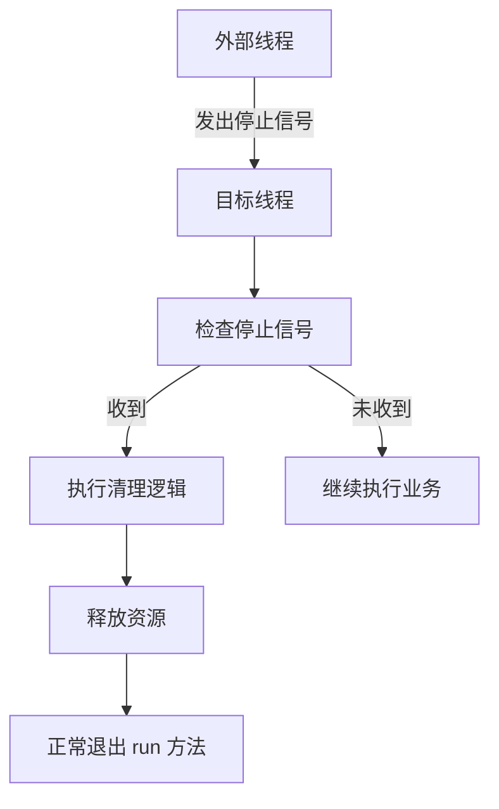
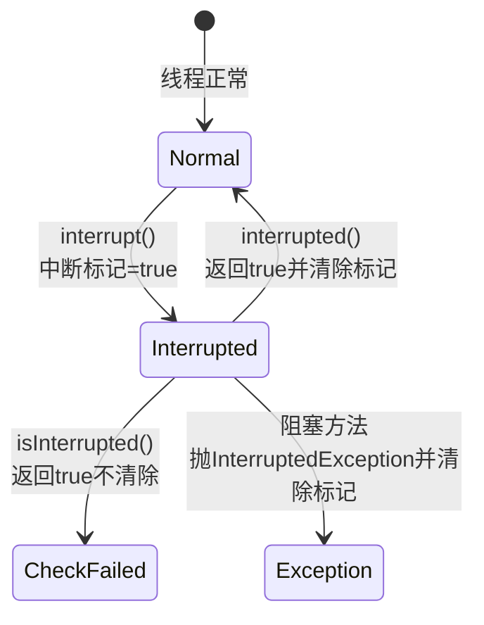
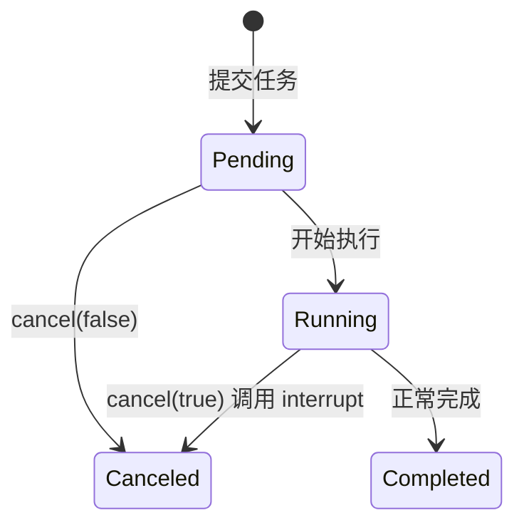
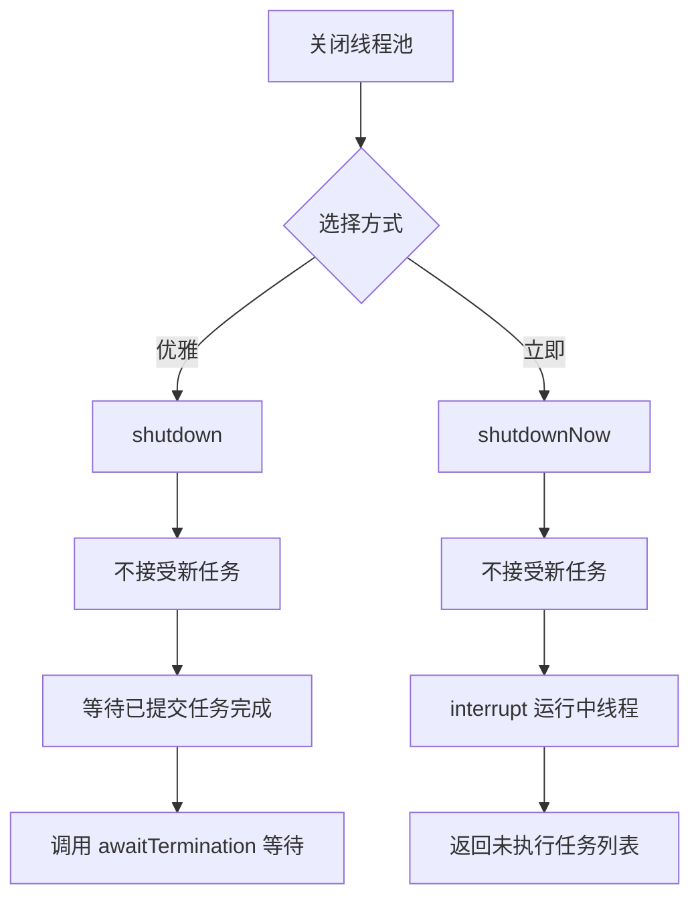
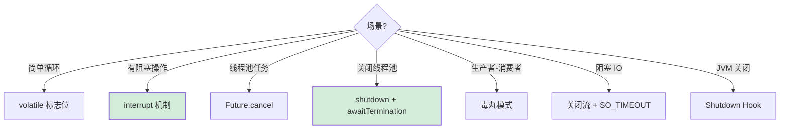
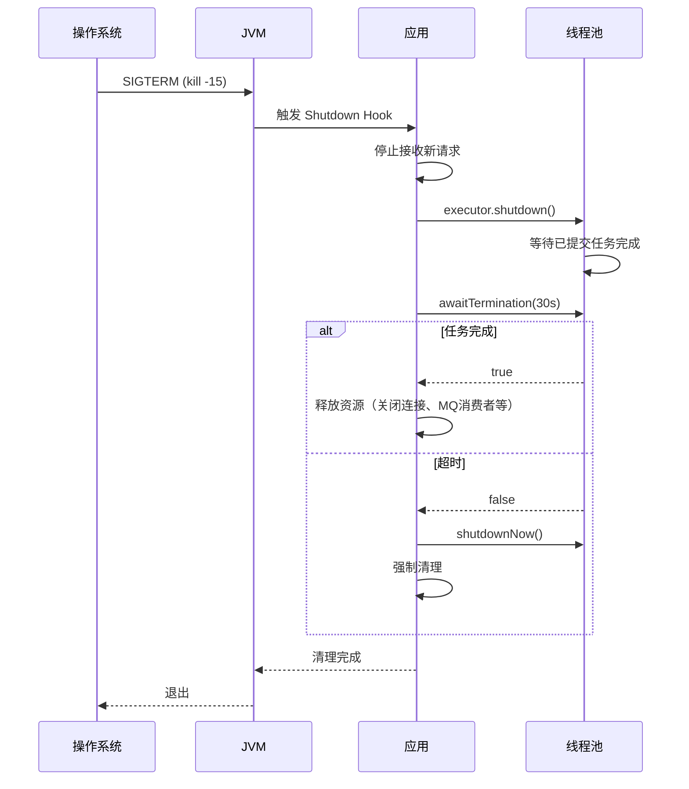

# Java 关闭线程的方式详解

> 文档定位：系统讲解 Java 中关闭/停止线程的各种方式，涵盖 Thread.stop() 的弃用原因、volatile 标志位、interrupt 中断机制、Future.cancel、线程池 shutdown、毒丸模式、阻塞 IO 处理、优雅停机等核心知识点。
>
> 适用人群：Java 后端工程师，尤其是需要正确管理线程生命周期、实现优雅停机、处理任务取消的开发者。
>
> 阅读建议：先理解「为什么不能强杀线程」，再掌握「协作式停止」的核心思想，重点关注 interrupt 机制和线程池优雅关闭两大模块。

***

## 目录

- [一、概述：为什么不能直接杀死线程](#一概述为什么不能直接杀死线程)

  - [Q1. Thread.stop() 为什么被弃用？](#q1-threadstop-为什么被弃用)

  - [Q2. 协作式停止的核心思想？](#q2-协作式停止的核心思想)

- [二、方式一：volatile 标志位](#二方式一volatile-标志位)

  - [Q3. 如何用 volatile 标志位停止线程？](#q3-如何用-volatile-标志位停止线程)

  - [Q4. volatile 标志位的局限？](#q4-volatile-标志位的局限)

- [三、方式二：interrupt 中断机制](#三方式二interrupt-中断机制)

  - [Q5. interrupt() 方法的原理？](#q5-interrupt-方法的原理)

  - [Q6. interrupted() 和 isInterrupted() 的区别？](#q6-interrupted-和-isinterrupted-的区别)

  - [Q7. 如何正确响应中断？](#q7-如何正确响应中断)

  - [Q8. 如何停止阻塞中的线程？](#q8-如何停止阻塞中的线程)

- [四、方式三：Future.cancel()](#四方式三futurecancel)

  - [Q9. Future.cancel(boolean) 如何工作？](#q9-futurecancelboolean-如何工作)

  - [Q10. cancel(true) 不生效的原因？](#q10-canceltrue-不生效的原因)

- [五、方式四：线程池关闭](#五方式四线程池关闭)

  - [Q11. shutdown() 和 shutdownNow() 的区别？](#q11-shutdown-和-shutdownnow-的区别)

  - [Q12. 如何优雅关闭线程池？](#q12-如何优雅关闭线程池)

  - [Q13. awaitTermination 的作用？](#q13-awaittermination-的作用)

- [六、方式五：毒丸模式（Poison Pill）](#六方式五毒丸模式poison-pill)

  - [Q14. 毒丸模式的原理与实现？](#q14-毒丸模式的原理与实现)

- [七、阻塞 IO 与特殊场景](#七阻塞-io-与特殊场景)

  - [Q15. 如何停止阻塞在 Socket IO 的线程？](#q15-如何停止阻塞在-socket-io-的线程)

  - [Q16. 如何停止阻塞在锁上的线程？](#q16-如何停止阻塞在锁上的线程)

- [八、JVM 关闭与 Shutdown Hook](#八jvm-关闭与-shutdown-hook)

  - [Q17. Shutdown Hook 的作用与使用？](#q17-shutdown-hook-的作用与使用)

- [九、综合方案与最佳实践](#九综合方案与最佳实践)

  - [Q18. 各方案对比与选型？](#q18-各方案对比与选型)

  - [Q19. 优雅停机完整方案？](#q19-优雅停机完整方案)

- [十、速答与踩坑总结](#十速答与踩坑总结)

  - [10.1 速答卡片](#101-速答卡片)

  - [10.2 实战踩坑 10 例](#102-实战踩坑-10-例)

  - [10.3 复习优先级表](#103-复习优先级表)

***

## 一、概述：为什么不能直接杀死线程

### Q1. Thread.stop() 为什么被弃用？

#### 核心答案

`Thread.stop()` 被弃用是因为它**不安全**：会立即释放线程持有的所有锁，可能导致对象处于不一致状态，且线程没有机会执行清理逻辑。

#### 三大问题

| 问题         | 说明                           |
| ---------- | ---------------------------- |
| **数据不一致**  | 强行中断可能让对象处于修改一半的状态           |
| **锁被强行释放** | stop 会释放所有监视器锁，其他线程可能看到不一致数据 |
| **无法清理资源** | 线程无法执行 finally 块，资源（文件、连接）泄漏 |

#### 数据不一致示例

```java
public class UnsafeStopDemo {
    private static int balance = 100;

    public static void main(String[] args) throws InterruptedException {
        Thread t = new Thread(() -> {
            // 转账：先扣 A，再加 B
            balance -= 50;            // 扣减
            // 如果在这里被 stop()，balance = 50，但 B 没收到钱
            try {
                Thread.sleep(1000);   // 模拟处理
            } catch (InterruptedException e) {
                // stop() 不会抛 InterruptedException，这里根本不执行
            }
            balance += 50;            // 加钱（可能被跳过）
        });
        t.start();
        Thread.sleep(100);
        t.stop();  // 强行停止
        System.out.println("balance = " + balance);  // 可能是 50（数据不一致）
    }
}
```

> ⚠️ `Thread.stop()`、`Thread.suspend()`、`Thread.resume()` 均已被标记为 `@Deprecated`，生产环境严禁使用。

***

### Q2. 协作式停止的核心思想？

#### 核心思想

```
Java 线程停止是「协作式」的：
  外部线程只能发出停止信号
  目标线程自行决定何时、如何停止
  目标线程有机会完成清理工作
```



#### 协作式停止的三大要素

| 要素       | 说明                            |
| -------- | ----------------------------- |
| **停止信号** | volatile 标志位 / interrupt 中断标记 |
| **响应点**  | 循环中定期检查信号                     |
| **清理逻辑** | finally 块中释放资源                |

***

## 二、方式一：volatile 标志位

### Q3. 如何用 volatile 标志位停止线程？

#### 核心原理

用一个 `volatile boolean` 变量作为停止信号，线程在循环中检查该变量，收到信号后退出。

#### 代码示例

```java
public class VolatileFlagStop {

    // 必须用 volatile 保证可见性
    private static volatile boolean running = true;

    public static void main(String[] args) throws InterruptedException {
        Thread worker = new Thread(() -> {
            while (running) {              // 检查停止标志
                // 业务逻辑
                System.out.println("working...");
                try {
                    Thread.sleep(100);
                } catch (InterruptedException e) {
                    Thread.currentThread().interrupt();  // 恢复中断标记
                    break;
                }
            }
            // 清理逻辑
            System.out.println("worker stopped, cleaning up...");
        });

        worker.start();
        Thread.sleep(500);
        running = false;  // 发出停止信号
        worker.join();    // 等待线程结束
    }
}
```

#### 封装为可复用的 Worker

```java
public abstract class StoppableWorker implements Runnable {
    private volatile boolean running = true;

    public void stop() {
        running = false;
    }

    @Override
    public final void run() {
        while (running && !Thread.currentThread().isInterrupted()) {
            try {
                doWork();
            } catch (InterruptedException e) {
                Thread.currentThread().interrupt();
                break;
            }
        }
        cleanup();
    }

    protected abstract void doWork() throws InterruptedException;

    protected void cleanup() {
        // 默认空实现，子类重写
    }
}
```

***

### Q4. volatile 标志位的局限？

| 局限            | 说明                          | 解决              |
| ------------- | --------------------------- | --------------- |
| **无法唤醒阻塞**    | 线程阻塞在 sleep/wait/IO 时不会检查标志 | 用 interrupt()   |
| **无法传参**      | 只有 true/false，无法携带停止原因      | 用自定义信号对象        |
| **无超时控制**     | 无法限制停止等待时间                  | join(timeout)   |
| **不支持取消排队任务** | 线程池中的任务无法用标志位取消             | 用 Future.cancel |

#### 阻塞场景下 volatile 失效

```java
// ❌ 问题：线程阻塞在 sleep，无法及时检查 running
public void run() {
    while (running) {
        Thread.sleep(60000);  // 阻塞 60 秒，期间无法响应停止
        doWork();
    }
}

// ✅ 解决：用 interrupt 唤醒阻塞
public void run() {
    while (running) {
        try {
            Thread.sleep(60000);
        } catch (InterruptedException e) {
            break;  // 被中断，退出
        }
        doWork();
    }
}
```

***

## 三、方式二：interrupt 中断机制

### Q5. interrupt() 方法的原理？

#### 核心答案

`interrupt()` 不会强制停止线程，而是设置线程的**中断标记**为 true，并让阻塞在 `sleep/wait/join` 的线程抛出 `InterruptedException`。

#### interrupt 的行为

| 线程状态                    | interrupt() 的效果                                                    |
| ----------------------- | ------------------------------------------------------------------ |
| **运行中**                 | 设置中断标记为 true（不立即停止）                                                |
| **阻塞（sleep/wait/join）** | 抛出 InterruptedException，清除中断标记                                     |
| **阻塞（IO/NIO）**          | 部分可中断（NIO 的 InterruptibleChannel 会关闭并抛 ClosedByInterruptException） |
| **阻塞（synchronized）**    | 不会被中断，仍等待锁                                                         |

#### 中断标记流转



***

### Q6. interrupted() 和 isInterrupted() 的区别？

| 方法                     | 返回中断标记 | 清除标记 | 说明                     |
| ---------------------- | ------ | ---- | ---------------------- |
| `Thread.interrupted()` | ✅      | ✅    | **静态方法**，返回当前线程中断标记并清除 |
| `isInterrupted()`      | ✅      | ❌    | **实例方法**，返回中断标记不清除     |

#### 示例

```java
Thread.currentThread().interrupt();  // 设置中断标记

System.out.println(Thread.interrupted());  // true，清除标记
System.out.println(Thread.interrupted());  // false（已清除）

Thread.currentThread().interrupt();
Thread t = Thread.currentThread();
System.out.println(t.isInterrupted());     // true，不清除
System.out.println(t.isInterrupted());     // true（仍为 true）
```

***

### Q7. 如何正确响应中断？

#### 核心原则

```
1. 能抛 InterruptedException 的方法：catch 后要么继续抛出，要么恢复中断标记
2. 循环中：定期检查 isInterrupted()
3. 不要吞掉中断异常（不要空 catch）
```

#### 正确写法

```java
// 方式1：抛出 InterruptedException（推荐，让上层处理）
public void doWork() throws InterruptedException {
    while (!Thread.currentThread().isInterrupted()) {
        // 业务逻辑
        Thread.sleep(100);
    }
}

// 方式2：捕获后恢复中断标记
public void doWork() {
    while (!Thread.currentThread().isInterrupted()) {
        try {
            Thread.sleep(100);
        } catch (InterruptedException e) {
            // 恢复中断标记，让循环条件判断生效
            Thread.currentThread().interrupt();
            break;
        }
    }
}

// 方式3：自定义取消检查（不抛受检异常）
private boolean checkCanceled() {
    if (Thread.currentThread().isInterrupted()) {
        return true;
    }
    return false;
}
```

#### 错误写法

```java
// ❌ 吞掉中断异常，中断信号丢失
while (true) {
    try {
        Thread.sleep(100);
    } catch (InterruptedException e) {
        // 什么都不做，线程继续运行
    }
}
```

***

### Q8. 如何停止阻塞中的线程？

#### 阻塞在 sleep / wait / join

```java
Thread worker = new Thread(() -> {
    try {
        Thread.sleep(10000);  // 阻塞
    } catch (InterruptedException e) {
        // interrupt 会抛异常，在此退出
        System.out.println("被中断，退出");
        return;
    }
});
worker.start();
worker.interrupt();  // 唤醒并抛异常
```

#### 阻塞在 BlockingQueue

```java
BlockingQueue<Integer> queue = new LinkedBlockingQueue<>();

Thread consumer = new Thread(() -> {
    try {
        while (true) {
            Integer data = queue.take();  // 阻塞，可被中断
            process(data);
        }
    } catch (InterruptedException e) {
        Thread.currentThread().interrupt();
        System.out.println("消费者退出");
    }
});
consumer.start();
consumer.interrupt();  // take() 抛 InterruptedException
```

#### 阻塞在 Lock.lockInterruptibly()

```java
ReentrantLock lock = new ReentrantLock();

Thread t = new Thread(() -> {
    try {
        lock.lockInterruptibly();  // 可中断的加锁
        try {
            // 业务
        } finally {
            lock.unlock();
        }
    } catch (InterruptedException e) {
        Thread.currentThread().interrupt();
    }
});
t.start();
t.interrupt();
```

***

## 四、方式三：Future.cancel()

### Q9. Future.cancel(boolean) 如何工作？

#### 核心答案

`Future.cancel(mayInterruptIfRunning)` 用于取消异步任务：

- `mayInterruptIfRunning=true`：若任务正在执行，调用线程的 `interrupt()`

- `mayInterruptIfRunning=false`：若任务未开始，取消排队；已开始则不干预

#### 状态流转



#### 使用示例

```java
ExecutorService executor = Executors.newSingleThreadExecutor();

Future<?> future = executor.submit(() -> {
    while (!Thread.currentThread().isInterrupted()) {
        doWork();
    }
    System.out.println("任务被取消");
});

Thread.sleep(1000);
future.cancel(true);  // 中断正在运行的任务
```

#### cancel 返回值

| 返回值     | 含义         |
| ------- | ---------- |
| `true`  | 取消成功       |
| `false` | 任务已完成或已被取消 |

#### cancel 后的查询

```java
future.isCancelled();  // 是否被取消
future.isDone();       // 是否已完成（取消也算完成）
```

***

### Q10. cancel(true) 不生效的原因？

| 原因                          | 说明                         | 解决                    |
| --------------------------- | -------------------------- | --------------------- |
| **任务不响应中断**                 | 业务循环没检查 isInterrupted()    | 循环中加中断检查              |
| **吞掉 InterruptedException** | catch 后不处理                 | 恢复中断标记或 break         |
| **阻塞在不可中断的 IO**             | BIO 的 read() 不响应 interrupt | 关闭流/通道                |
| **阻塞在 synchronized**        | 等待锁不会被中断                   | 用 lockInterruptibly() |
| **任务已完成**                   | cancel 无效                  | 检查 isDone()           |

#### 示例：cancel 不生效

```java
// ❌ 任务不响应中断
executor.submit(() -> {
    while (true) {  // 没有检查中断标记
        doHeavyWork();
    }
});

// ✅ 正确响应中断
executor.submit(() -> {
    while (!Thread.currentThread().isInterrupted()) {
        doHeavyWork();
    }
});
```

#### 长耗时任务的取消点设计

```java
public void processBatch(List<Item> items) {
    for (int i = 0; i < items.size(); i++) {
        // 每次迭代前检查中断
        if (Thread.currentThread().isInterrupted()) {
            throw new CancellationException("任务被取消");
        }
        processItem(items.get(i));
    }
}
```

***

## 五、方式四：线程池关闭

### Q11. shutdown() 和 shutdownNow() 的区别？

| 维度         | shutdown()            | shutdownNow()           |
| ---------- | --------------------- | ----------------------- |
| **行为**     | 平滑关闭，不接受新任务，等待已提交任务完成 | 立即关闭，尝试中断运行中任务          |
| **已提交未执行** | ✅ 等待执行完               | ❌ 取消（返回列表）              |
| **运行中任务**  | 等待完成                  | 调用 interrupt() 中断       |
| **返回值**    | void                  | `List<Runnable>` 未执行的任务 |
| **阻塞**     | 不阻塞                   | 不阻塞                     |
| **幂等性**    | 多次调用无副作用              | 多次调用无副作用                |

#### 流程图



***

### Q12. 如何优雅关闭线程池？

#### 标准模板

```java
public class ThreadPoolUtils {

    /**
     * 优雅关闭线程池
     */
    public static void gracefulShutdown(ExecutorService executor, long timeout, TimeUnit unit) {
        // 1. 停止接受新任务
        executor.shutdown();
        try {
            // 2. 等待已提交任务完成
            if (!executor.awaitTermination(timeout, unit)) {
                // 3. 超时则强制关闭
                System.err.println("线程池未在规定时间内关闭，强制关闭");
                executor.shutdownNow();
                // 4. 再次等待
                if (!executor.awaitTermination(timeout, unit)) {
                    System.err.println("线程池无法关闭");
                }
            }
        } catch (InterruptedException e) {
            // 当前线程被中断，强制关闭
            executor.shutdownNow();
            Thread.currentThread().interrupt();  // 恢复中断标记
        }
    }
}
```

#### 使用

```java
ExecutorService executor = Executors.newFixedThreadPool(10);
// ... 提交任务 ...
ThreadPoolUtils.gracefulShutdown(executor, 30, TimeUnit.SECONDS);
```

#### Spring Boot 中自动关闭

```java
@Bean(destroyMethod = "shutdown")
public ExecutorService taskExecutor() {
    return Executors.newFixedThreadPool(10);
}
// Spring 容器销毁时自动调用 shutdown
```

***

### Q13. awaitTermination 的作用？

#### 核心答案

`awaitTermination(timeout, unit)` 阻塞当前线程，等待线程池终止（所有任务完成）或超时。

#### 返回值

| 返回值     | 含义        |
| ------- | --------- |
| `true`  | 线程池已完全终止  |
| `false` | 超时，线程池未终止 |

#### 使用场景

```java
executor.shutdown();
if (executor.awaitTermination(60, TimeUnit.SECONDS)) {
    System.out.println("所有任务完成");
} else {
    System.out.println("超时，强制关闭");
    executor.shutdownNow();
}
```

#### 与 shutdown 的配合

```
shutdown()           → 发起关闭（非阻塞）
awaitTermination()   → 等待关闭完成（阻塞）
shutdownNow()        → 超时兜底
```

***

## 六、方式五：毒丸模式（Poison Pill）

### Q14. 毒丸模式的原理与实现？

#### 核心原理

在生产者-消费者模式中，生产者向队列放入一个**特殊的"毒丸"对象**，消费者检测到毒丸后退出。

#### 适用场景

```
生产者-消费者模式
消息队列消费
任务分发
```

#### 代码实现

```java
public class PoisonPillDemo {

    // 毒丸对象（用特殊实例标记）
    private static final Integer POISON_PILL = -1;

    public static void main(String[] args) throws InterruptedException {
        BlockingQueue<Integer> queue = new LinkedBlockingQueue<>();

        // 生产者
        Thread producer = new Thread(() -> {
            try {
                for (int i = 0; i < 10; i++) {
                    queue.put(i);
                    Thread.sleep(50);
                }
                queue.put(POISON_PILL);  // 放入毒丸
            } catch (InterruptedException e) {
                Thread.currentThread().interrupt();
            }
        });

        // 消费者
        Thread consumer = new Thread(() -> {
            try {
                while (true) {
                    Integer data = queue.take();
                    if (data.equals(POISON_PILL)) {
                        System.out.println("收到毒丸，消费者退出");
                        break;
                    }
                    System.out.println("处理: " + data);
                }
            } catch (InterruptedException e) {
                Thread.currentThread().interrupt();
            }
        });

        producer.start();
        consumer.start();
        producer.join();
        consumer.join();
    }
}
```

#### 多消费者场景

```java
// 多消费者时，需要放入与消费者数量相同的毒丸
int consumerCount = 3;
for (int i = 0; i < consumerCount; i++) {
    queue.put(POISON_PILL);
}
```

#### 优缺点

| 优点              | 缺点                 |
| --------------- | ------------------ |
| 无锁协作，性能好        | 只适用于生产者-消费者模式      |
| 消费者有机会处理完剩余任务   | 需要约定毒丸对象           |
| 比 interrupt 更温和 | 生产者必须知道消费者数量（多消费者） |

***

## 七、阻塞 IO 与特殊场景

### Q15. 如何停止阻塞在 Socket IO 的线程？

#### 问题

```
BIO 的 InputStream.read() 不响应 interrupt()
→ 调用 interrupt() 不会中断 read()
→ 线程一直阻塞
```

#### 解决方案

**方案1：关闭 Socket**

```java
public class SocketWorker implements Runnable {
    private Socket socket;

    @Override
    public void run() {
        try (InputStream in = socket.getInputStream()) {
            byte[] buffer = new byte[1024];
            int len;
            while ((len = in.read(buffer)) != -1) {  // 阻塞
                process(buffer, len);
            }
        } catch (IOException e) {
            if (socket.isClosed()) {
                System.out.println("Socket 被关闭，线程退出");
            }
        }
    }

    public void shutdown() throws IOException {
        socket.close();  // 关闭 socket，read() 抛 IOException
    }
}
```

**方案2：设置 SO\_TIMEOUT**

```java
socket.setSoTimeout(5000);  // read 超时 5 秒

while (running) {
    try {
        int len = in.read(buffer);  // 超时抛 SocketTimeoutException
        if (len == -1) break;
        process(buffer, len);
    } catch (SocketTimeoutException e) {
        // 超时，检查是否要停止
        if (!running) break;
    }
}
```

**方案3：用 NIO（推荐）**

```java
// NIO 的通道可被 interrupt 中断
ReadableByteChannel channel = Channels.newChannel(in);
try {
    channel.read(buffer);  // 可被 interrupt 中断
} catch (ClosedByInterruptException e) {
    // 被中断
}
```

***

### Q16. 如何停止阻塞在锁上的线程？

#### 问题

```
synchronized 块的等待不响应 interrupt()
→ 线程阻塞在锁上无法被中断
```

#### 解决方案：用 ReentrantLock.lockInterruptibly()

```java
ReentrantLock lock = new ReentrantLock();

Thread t = new Thread(() -> {
    try {
        lock.lockInterruptibly();  // 可中断的加锁
        try {
            // 业务逻辑
        } finally {
            if (lock.isHeldByCurrentThread()) {
                lock.unlock();
            }
        }
    } catch (InterruptedException e) {
        Thread.currentThread().interrupt();
        System.out.println("等待锁时被中断");
    }
});
t.start();
t.interrupt();  // 可中断等待锁的线程
```

#### 对比

| 锁类型                        | 可中断等待   |
| -------------------------- | ------- |
| `synchronized`             | ❌       |
| `Lock.lock()`              | ❌       |
| `Lock.lockInterruptibly()` | ✅       |
| `Lock.tryLock(timeout)`    | ✅（超时退出） |

***

## 八、JVM 关闭与 Shutdown Hook

### Q17. Shutdown Hook 的作用与使用？

#### 核心答案

Shutdown Hook 是 JVM 关闭时执行的线程，用于释放资源、保存状态等清理工作。

#### 注册 Shutdown Hook

```java
Runtime.getRuntime().addShutdownHook(new Thread(() -> {
    System.out.println("JVM 关闭中，执行清理...");
    executor.shutdown();
    try {
        executor.awaitTermination(30, TimeUnit.SECONDS);
    } catch (InterruptedException e) {
        Thread.currentThread().interrupt();
    }
    System.out.println("清理完成");
}));
```

#### Shutdown Hook 触发时机

| 触发场景  | 说明                           |
| ----- | ---------------------------- |
| 正常退出  | `System.exit(0)` 或 main 方法结束 |
| 信号终止  | `kill -15`（SIGTERM）          |
| 异常终止  | 未捕获异常导致 JVM 退出               |
| ❌ 不触发 | `kill -9`（SIGKILL）、断电、OS 崩溃  |

#### 注意事项

```
1. Shutdown Hook 中不要执行耗时操作
2. 不要在 Hook 中调用 System.exit()（会死锁）
3. Hook 执行顺序不保证
4. Hook 中也要处理中断
```

***

## 九、综合方案与最佳实践

### Q18. 各方案对比与选型？

| 方案                       | 适用场景    | 阻塞唤醒 | 清理能力  | 复杂度 | 推荐度   |
| ------------------------ | ------- | ---- | ----- | --- | ----- |
| **volatile 标志位**         | 简单循环任务  | ❌    | 需自行实现 | 低   | ⭐⭐⭐   |
| **interrupt()**          | 通用场景    | ✅    | 需自行实现 | 中   | ⭐⭐⭐⭐⭐ |
| **Future.cancel()**      | 线程池任务   | ✅    | 需自行实现 | 中   | ⭐⭐⭐⭐  |
| **shutdown/shutdownNow** | 线程池     | ✅    | 需自行实现 | 低   | ⭐⭐⭐⭐⭐ |
| **毒丸模式**                 | 生产者-消费者 | ✅    | 可处理剩余 | 中   | ⭐⭐⭐⭐  |
| **关闭 IO 流**              | 阻塞 IO   | ✅    | 需自行实现 | 中   | ⭐⭐⭐⭐  |
| **Shutdown Hook**        | JVM 关闭  | -    | ✅     | 低   | ⭐⭐⭐⭐  |

#### 选型决策



***

### Q19. 优雅停机完整方案？

#### 完整流程



#### 实现代码

```java
@Component
public class GracefulShutdown implements DisposableBean {

    @Autowired
    private ThreadPoolTaskExecutor taskExecutor;

    @Autowired
    private MqConsumer mqConsumer;

    @Autowired
    private DataSource dataSource;

    @Override
    public void destroy() throws Exception {
        System.out.println("开始优雅停机...");

        // 1. 停止接收新请求（如关闭 HTTP 端口）
        stopAcceptingRequests();

        // 2. 停止 MQ 消费
        mqConsumer.stop();

        // 3. 优雅关闭线程池
        ExecutorService executor = taskExecutor.getThreadPoolExecutor();
        executor.shutdown();
        if (!executor.awaitTermination(30, TimeUnit.SECONDS)) {
            System.err.println("线程池超时，强制关闭");
            executor.shutdownNow();
        }

        // 4. 释放资源
        if (dataSource instanceof AutoCloseable) {
            ((AutoCloseable) dataSource).close();
        }

        System.out.println("优雅停机完成");
    }

    private void stopAcceptingRequests() {
        // 从注册中心下线
        // 等待已有请求处理完成
    }
}
```

#### Spring Boot 配置

```yaml
server:
  shutdown: graceful              # 优雅停机
spring:
  lifecycle:
    timeout-per-shutdown-phase: 30s  # 最大等待时间
```

***

## 十、速答与踩坑总结

### 10.1 速答卡片

**Q：Thread.stop() 为什么不能用？**
A：不安全，会强行释放锁导致数据不一致，且无法执行清理逻辑。

**Q：Java 停止线程的推荐方式？**
A：协作式停止——用 interrupt() 发信号，目标线程检查中断标记后自行退出。

**Q：interrupted() 和 isInterrupted() 区别？**
A：interrupted() 是静态方法，返回并清除中断标记；isInterrupted() 是实例方法，只返回不清除。

**Q：interrupt() 能中断什么？**
A：可中断 sleep/wait/join（抛异常）、NIO 通道、lockInterruptibly；不能中断 synchronized 和 BIO 的 read。

**Q：如何停止阻塞在 sleep 的线程？**
A：调用 interrupt()，sleep 会抛 InterruptedException。

**Q：如何停止阻塞在 Socket IO 的线程？**
A：关闭 Socket 或设置 SO\_TIMEOUT，或用 NIO。

**Q：shutdown() 和 shutdownNow() 区别？**
A：shutdown 等已提交任务完成；shutdownNow 中断运行中任务并返回未执行任务。

**Q：cancel(true) 不生效怎么办？**
A：检查任务是否响应中断——循环中加 isInterrupted() 检查，catch InterruptedException 后恢复中断或 break。

**Q：毒丸模式适用什么场景？**
A：生产者-消费者模式，生产者放入特殊对象，消费者检测到后退出。

**Q：优雅停机的步骤？**
A：停止接收新请求 → 等待已有任务完成 → 关闭线程池 → 释放资源。

***

### 10.2 实战踩坑 10 例

| #  | 场景                      | 现象          | 根因                   | 解决                          |
| -- | ----------------------- | ----------- | -------------------- | --------------------------- |
| 1  | volatile 标志位线程不停止       | 线程一直运行      | 阻塞在 sleep 不检查标志      | 用 interrupt 唤醒              |
| 2  | cancel(true) 不生效        | 任务继续跑       | 任务不响应中断              | 循环中检查 isInterrupted()       |
| 3  | 吞掉 InterruptedException | 中断丢失        | catch 块空处理           | 恢复中断标记或重新抛出                 |
| 4  | shutdown 后仍有任务          | 任务未完成就退出    | 未调用 awaitTermination | shutdown + awaitTermination |
| 5  | 关闭线程池卡死                 | 应用无法退出      | 线程池有死循环任务            | shutdownNow 兜底              |
| 6  | Socket IO 线程无法停止        | 线程一直阻塞 read | BIO 不响应 interrupt    | 关闭 Socket 或用 NIO            |
| 7  | synchronized 无法中断       | 线程阻塞在锁上     | synchronized 不可中断    | 用 lockInterruptibly()       |
| 8  | Shutdown Hook 不执行       | 资源未释放       | kill -9 不触发 Hook     | 用 kill -15，Hook 中快速清理       |
| 9  | 毒丸模式消费者不退出              | 消费者继续运行     | 毒丸对象不匹配              | 用常量对象 equals 比较             |
| 10 | 多消费者毒丸数量不足              | 部分消费者不退出    | 毒丸数量 < 消费者数          | 放入与消费者等量的毒丸                 |

***

### 10.3 复习优先级表

| 优先级    | 主题                 | 考察概率 | 建议复习时间 |
| ------ | ------------------ | ---- | ------ |
| **P0** | interrupt 中断机制     | 95%  | 1h     |
| **P0** | 线程池优雅关闭            | 90%  | 30min  |
| **P0** | Thread.stop() 弃用原因 | 85%  | 15min  |
| **P1** | Future.cancel()    | 80%  | 30min  |
| **P1** | 阻塞场景处理             | 75%  | 30min  |
| **P1** | volatile 标志位       | 70%  | 15min  |
| **P2** | 毒丸模式               | 55%  | 30min  |
| **P2** | Shutdown Hook      | 50%  | 15min  |
| **P3** | NIO 中断             | 40%  | 30min  |
| **P3** | 优雅停机完整方案           | 45%  | 1h     |


