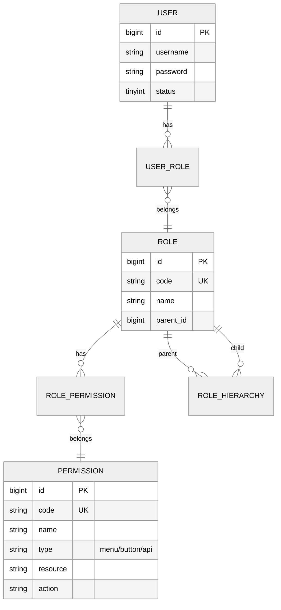
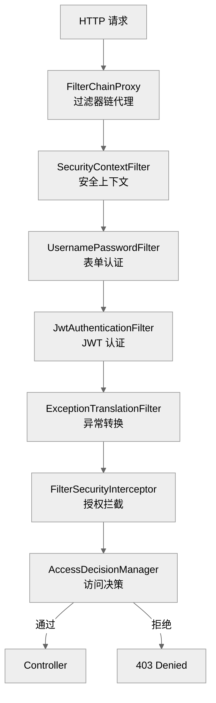
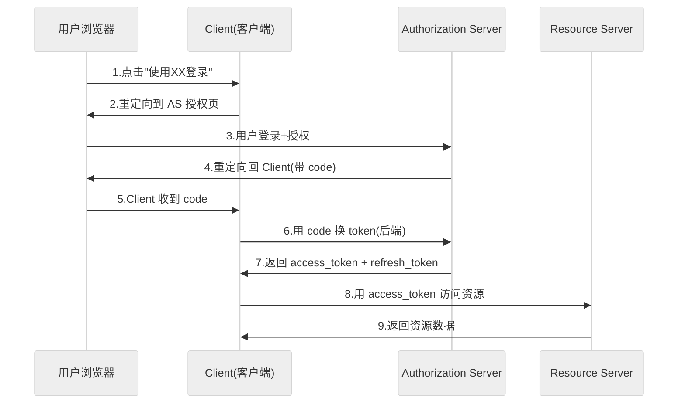
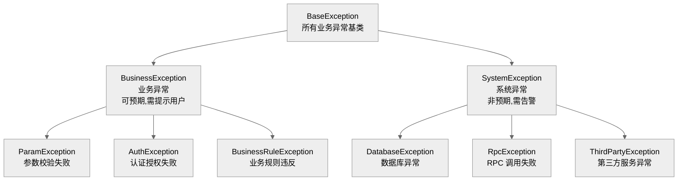
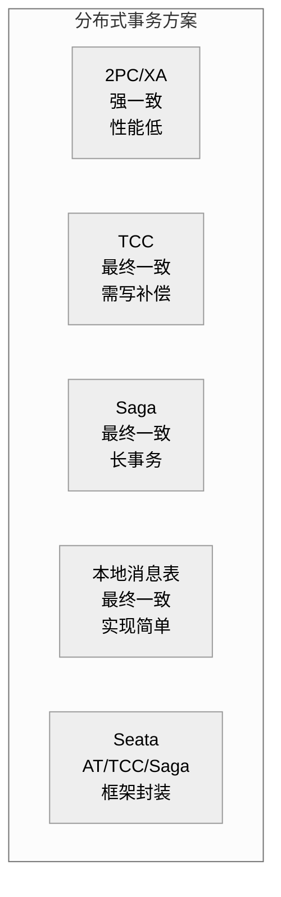
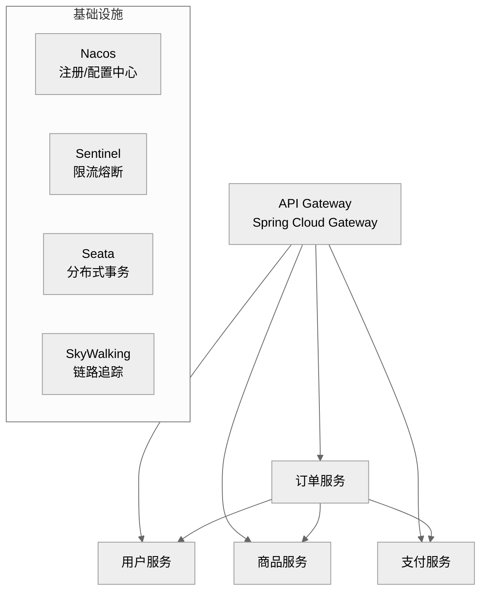
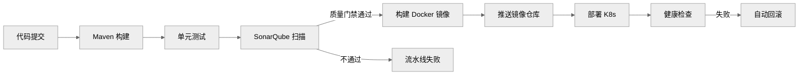

# Java 工程化高级面试题集

> 本文档系统梳理 Java 工程化实践中的高级面试题，涵盖权限控制、配置脱敏、全局错误处理、分布式事务、微服务架构等核心模块，每题配考察点、参考答案与评分标准，难度覆盖高级工程师与架构师岗位。

---

## 目录

- [一、权限控制](#一权限控制)
  - [1.1 RBAC 模型设计与实现](#11-rbac-模型设计与实现)
  - [1.2 Spring Security 核心原理](#12-spring-security-核心原理)
  - [1.3 Spring Security 自定义配置](#13-spring-security-自定义配置)
  - [1.4 权限粒度设计](#14-权限粒度设计)
  - [1.5 OAuth2.0 / OpenID Connect](#15-oauth20--openid-connect)
- [二、配置脱敏](#二配置脱敏)
  - [2.1 敏感配置加密策略](#21-敏感配置加密策略)
  - [2.2 Jasypt 集成方案](#22-jasypt-集成方案)
  - [2.3 配置中心加密机制](#23-配置中心加密机制)
  - [2.4 密钥管理最佳实践](#24-密钥管理最佳实践)
- [三、全局错误处理](#三全局错误处理)
  - [3.1 统一异常处理架构设计](#31-统一异常处理架构设计)
  - [3.2 Spring 全局异常处理器实现](#32-spring-全局异常处理器实现)
  - [3.3 错误码规范制定](#33-错误码规范制定)
  - [3.4 异常日志记录策略](#34-异常日志记录策略)
  - [3.5 前端错误信息展示方案](#35-前端错误信息展示方案)
- [四、分布式事务](#四分布式事务)
  - [4.1 分布式事务解决方案对比](#41-分布式事务解决方案对比)
  - [4.2 Seata AT 模式实现](#42-seata-at-模式实现)
- [五、微服务架构](#五微服务架构)
  - [5.1 微服务架构设计](#51-微服务架构设计)
  - [5.2 服务注册与发现](#52-服务注册与发现)
  - [5.3 API 网关实现](#53-api-网关实现)
- [六、缓存与异步](#六缓存与异步)
  - [6.1 缓存策略与一致性保障](#61-缓存策略与一致性保障)
  - [6.2 异步处理机制](#62-异步处理机制)
- [七、代码质量与 CI/CD](#七代码质量与-cicd)
  - [7.1 代码质量保障措施](#71-代码质量保障措施)
  - [7.2 CI/CD 流程设计](#72-cicd-流程设计)
- [八、考点速查表](#八考点速查表)

---

## 一、权限控制

### 1.1 RBAC 模型设计与实现

**难度**：高级　**类型**：设计题　**分值**：10

**考察点**：用户-角色-权限三层映射设计、数据模型、权限继承、数据权限

**问题描述**：
请设计一套基于 RBAC 的权限系统，要求支持：①用户-角色-权限三层映射；②角色继承；③数据权限（行级/列级）；④与 Spring Security 集成。

**参考答案要点**：

**数据模型设计**：



**核心表结构**：

```sql
-- 用户表
CREATE TABLE sys_user (
    id          BIGINT PRIMARY KEY AUTO_INCREMENT,
    username    VARCHAR(50) NOT NULL UNIQUE,
    password    VARCHAR(200) NOT NULL,
    status      TINYINT DEFAULT 1,
    created_at  DATETIME DEFAULT NOW()
);

-- 角色表(支持继承)
CREATE TABLE sys_role (
    id          BIGINT PRIMARY KEY AUTO_INCREMENT,
    code        VARCHAR(50) NOT NULL UNIQUE,
    name        VARCHAR(100) NOT NULL,
    parent_id   BIGINT DEFAULT NULL,
    level       INT DEFAULT 0
);

-- 权限表(资源+操作)
CREATE TABLE sys_permission (
    id          BIGINT PRIMARY KEY AUTO_INCREMENT,
    code        VARCHAR(100) NOT NULL UNIQUE,
    name        VARCHAR(100) NOT NULL,
    type        ENUM('MENU','BUTTON','API'),
    resource    VARCHAR(200),  -- 资源标识(system:user)
    action      VARCHAR(50)    -- 操作(list/add/edit/delete)
);

-- 用户-角色关联
CREATE TABLE sys_user_role (
    user_id     BIGINT NOT NULL,
    role_id     BIGINT NOT NULL,
    PRIMARY KEY (user_id, role_id)
);

-- 角色-权限关联
CREATE TABLE sys_role_permission (
    role_id       BIGINT NOT NULL,
    permission_id BIGINT NOT NULL,
    PRIMARY KEY (role_id, permission_id)
);

-- 数据权限规则(行级)
CREATE TABLE sys_data_permission (
    id          BIGINT PRIMARY KEY AUTO_INCREMENT,
    role_id     BIGINT NOT NULL,
    table_name  VARCHAR(100) NOT NULL,
    column_name VARCHAR(100),
    rule_type   ENUM('DEPT','SELF','CUSTOM'),
    rule_value  VARCHAR(500)   -- 部门ID/自定义SQL
);
```

**权限加载与缓存**：

```java
@Service
public class PermissionService {

    @Autowired
    private SysPermissionMapper permissionMapper;
    @Autowired
    private RedisTemplate<String, Object> redisTemplate;

    private static final String PERM_CACHE_KEY = "user:permissions:%s";

    /**
     * 获取用户所有权限编码(含角色继承)
     */
    public Set<String> getUserPermissions(Long userId) {
        String cacheKey = String.format(PERM_CACHE_KEY, userId);

        // 1. 查缓存
        @SuppressWarnings("unchecked")
        Set<String> cached = (Set<String>) redisTemplate.opsForValue().get(cacheKey);
        if (cached != null) return cached;

        // 2. 查数据库:用户→角色→权限(递归继承)
        Set<String> permissions = permissionMapper.selectPermissionsByUserId(userId);

        // 3. 超级管理员短路
        if (permissionMapper.isUserSuperAdmin(userId)) {
            permissions = Set.of("*");
        }

        // 4. 写缓存(TTL 30分钟)
        redisTemplate.opsForValue().set(cacheKey, permissions, 30, TimeUnit.MINUTES);

        return permissions;
    }

    /**
     * 校验权限
     */
    public boolean hasPermission(Long userId, String permission) {
        Set<String> perms = getUserPermissions(userId);
        return perms.contains("*") || perms.contains(permission);
    }

    /**
     * 清除权限缓存(角色变更时)
     */
    public void clearPermissionCache(Long userId) {
        redisTemplate.delete(String.format(PERM_CACHE_KEY, userId));
    }
}
```

**数据权限拦截（MyBatis Plugin）**：

```java
@Intercepts({
    @Signature(type = Executor.class, method = "query",
               args = {MappedStatement.class, Object.class, RowBounds.class, ResultHandler.class})
})
public class DataPermissionInterceptor implements Interceptor {

    @Autowired
    private DataPermissionService dataPermissionService;

    @Override
    public Object intercept(Invocation invocation) throws Throwable {
        // 获取当前用户数据权限规则
        DataPermissionRule rule = dataPermissionService.getCurrentUserRule();
        if (rule == null) return invocation.proceed();

        // 改写 SQL,追加数据过滤条件
        Object[] args = invocation.getArgs();
        MappedStatement ms = (MappedStatement) args[0];
        Object parameter = args[1];

        BoundSql boundSql = ms.getBoundSql(parameter);
        String originalSql = boundSql.getSql();
        String filteredSql = applyDataFilter(originalSql, rule);

        // 用改写后的 SQL 执行
        // ... MetaObject 反射替换 sql
        return invocation.proceed();
    }

    private String applyDataFilter(String sql, DataPermissionRule rule) {
        switch (rule.getRuleType()) {
            case DEPT:
                return sql + " AND dept_id IN (" + rule.getRuleValue() + ")";
            case SELF:
                return sql + " AND create_by = " + rule.getUserId();
            default:
                return sql;
        }
    }
}
```

**评分标准**：三层模型设计 3 分；角色继承 2 分；数据权限 3 分；缓存策略 2 分。

---

### 1.2 Spring Security 核心原理

**难度**：高级　**类型**：原理题　**分值**：10

**考察点**：过滤器链、AuthenticationManager、AccessDecisionManager、SecurityContext

**问题描述**：
请深入分析 Spring Security 的核心架构，说明一次请求的完整认证与授权流程。

**参考答案要点**：

**核心架构**：



**认证流程**：

```
1. 请求进入 JwtAuthenticationFilter
2. 从 Header 提取 Token → JwtParser 验签
3. 构建 UsernamePasswordAuthenticationToken(authenticated=true)
4. 设置到 SecurityContextHolder.getContext()
5. 后续 Filter 从 SecurityContext 获取认证信息
```

**授权流程**：

```
1. FilterSecurityInterceptor 拦截请求
2. 获取当前 Authentication 的权限列表
3. AccessDecisionManager.vote() 投票(默认 AffirmativeBased)
4. 全部弃权或任一通过 → 放行
5. 任一拒绝 → AccessDeniedException → 403
```

**核心组件职责**：

| 组件 | 职责 |
|------|------|
| `SecurityContext` | 持有 Authentication，ThreadLocal 隔离 |
| `AuthenticationManager` | 认证入口，委托 ProviderChain |
| `AuthenticationProvider` | 具体认证逻辑（Dao/Jwt/Ldap） |
| `UserDetailsService` | 加载用户信息 |
| `AccessDecisionManager` | 授权决策（Affirmative/Consensus/Unanimous） |
| `FilterChainProxy` | 过滤器链编排 |

**SecurityContext 传播问题**：

```java
// 默认 ThreadLocal,异步线程丢失
// 解决方案 1: DelegatingSecurityContextRunnable
Runnable wrapped = new DelegatingSecurityContextRunnable(originalRunnable);

// 解决方案 2: @Async 配置
@Bean
public TaskExecutor taskExecutor() {
    return new DelegatingSecurityContextExecutor(
        new ThreadPoolTaskExecutor()
    );
}
```

**评分标准**：过滤器链 3 分；认证流程 3 分；授权流程 2 分；SecurityContext 传播 2 分。

---

### 1.3 Spring Security 自定义配置

**难度**：高级　**类型**：实现题　**分值**：10

**考察点**：SecurityFilterChain 配置、JWT 集成、动态权限

**问题描述**：
请实现 Spring Security 6 + JWT 的完整配置，支持：①JWT 认证；②动态权限加载；③白名单路径。

**参考答案要点**：

```java
@Configuration
@EnableWebSecurity
public class SecurityConfig {

    @Autowired
    private JwtAuthenticationFilter jwtAuthenticationFilter;
    @Autowired
    private RestAuthenticationEntryPoint authenticationEntryPoint;
    @Autowired
    private RestAccessDeniedHandler accessDeniedHandler;

    @Bean
    public SecurityFilterChain filterChain(HttpSecurity http) throws Exception {
        http
            // 关闭 CSRF(JWT 无状态)
            .csrf(csrf -> csrf.disable())
            // 关闭 Session
            .sessionManagement(session ->
                session.sessionCreationPolicy(SessionCreationPolicy.STATELESS))
            // 异常处理
            .exceptionHandling(ex -> ex
                .authenticationEntryPoint(authenticationEntryPoint)
                .accessDeniedHandler(accessDeniedHandler))
            // 请求授权
            .authorizeHttpRequests(auth -> auth
                // 白名单
                .requestMatchers(
                    "/api/auth/login",
                    "/api/auth/refresh",
                    "/doc.html",
                    "/webjars/**",
                    "/v3/api-docs/**"
                ).permitAll()
                // 其他请求需认证
                .anyRequest().authenticated())
            // JWT Filter(在 UsernamePasswordAuthenticationFilter 之前)
            .addFilterBefore(jwtAuthenticationFilter,
                UsernamePasswordAuthenticationFilter.class);

        return http.build();
    }

    @Bean
    public PasswordEncoder passwordEncoder() {
        return new BCryptPasswordEncoder();
    }
}
```

**JWT Filter 实现**：

```java
@Component
@RequiredArgsConstructor
public class JwtAuthenticationFilter extends OncePerRequestFilter {

    private final JwtTokenProvider jwtTokenProvider;
    private final UserDetailsService userDetailsService;

    @Override
    protected void doFilterInternal(
            HttpServletRequest request,
            HttpServletResponse response,
            FilterChain filterChain) throws ServletException, IOException {

        // 1. 提取 Token
        String token = jwtTokenProvider.resolveToken(request);

        if (token != null && jwtTokenProvider.validateToken(token)) {
            // 2. 解析用户名
            String username = jwtTokenProvider.getUsername(token);

            // 3. 加载用户(含权限)
            UserDetails userDetails = userDetailsService.loadUserByUsername(username);

            // 4. 构建认证对象
            UsernamePasswordAuthenticationToken authentication =
                new UsernamePasswordAuthenticationToken(
                    userDetails, null, userDetails.getAuthorities());

            // 5. 补充请求详情
            authentication.setDetails(
                new WebAuthenticationDetailsSource().buildDetails(request));

            // 6. 设置到 SecurityContext
            SecurityContextHolder.getContext().setAuthentication(authentication);
        }

        filterChain.doFilter(request, response);
    }
}
```

**JWT Token Provider**：

```java
@Component
public class JwtTokenProvider {

    @Value("${jwt.secret}")
    private String secret;

    @Value("${jwt.access-token-expiration:3600000}")
    private long accessTokenExpiration; // 1小时

    @Value("${jwt.refresh-token-expiration:86400000}")
    private long refreshTokenExpiration; // 24小时

    private SecretKey getSigningKey() {
        return Keys.hmacShaKeyFor(secret.getBytes(StandardCharsets.UTF_8));
    }

    public String generateAccessToken(UserDetails userDetails) {
        Map<String, Object> claims = Map.of(
            "roles", userDetails.getAuthorities().stream()
                .map(GrantedAuthority::getAuthority).toList()
        );
        return Jwts.builder()
            .claims(claims)
            .subject(userDetails.getUsername())
            .issuedAt(new Date())
            .expiration(new Date(System.currentTimeMillis() + accessTokenExpiration))
            .signWith(getSigningKey())
            .compact();
    }

    public boolean validateToken(String token) {
        try {
            Jwts.parser().verifyWith(getSigningKey()).build().parseSignedClaims(token);
            return true;
        } catch (JwtException | IllegalArgumentException e) {
            return false;
        }
    }

    public String getUsername(String token) {
        return Jwts.parser().verifyWith(getSigningKey()).build()
            .parseSignedClaims(token).getPayload().getSubject();
    }

    public String resolveToken(HttpServletRequest request) {
        String bearer = request.getHeader("Authorization");
        if (bearer != null && bearer.startsWith("Bearer ")) {
            return bearer.substring(7);
        }
        return null;
    }
}
```

**评分标准**：SecurityFilterChain 配置 2 分；JWT Filter 3 分；Token Provider 3 分；异常处理 2 分。

---

### 1.4 权限粒度设计

**难度**：高级　**类型**：设计题　**分值**：8

**考察点**：功能权限 vs 数据权限、行级/列级、注解+拦截器

**问题描述**：
请设计一个支持菜单级、按钮级、接口级、数据级四层权限粒度的方案。

**参考答案要点**：

| 粒度 | 实现方式 | 示例 |
|------|----------|------|
| **菜单级** | 动态路由+后端菜单树 | 有 `system:user:list` 才显示用户菜单 |
| **按钮级** | 前端 `v-permission` 指令 | 有 `system:user:add` 才显示新增按钮 |
| **接口级** | `@PreAuthorize` 注解 | `@PreAuthorize("hasAuthority('system:user:add')")` |
| **数据级(行)** | MyBatis 拦截器追加 WHERE | 只看本部门数据 |
| **数据级(列)** | Jackson 序列化过滤 | 无 `user:salary:view` 则隐藏工资列 |

**注解式接口权限**：

```java
// 自定义注解(更简洁)
@Target({ElementType.METHOD})
@Retention(RetentionPolicy.RUNTIME)
@PreAuthorize("hasAuthority('${value}')")
public @interface RequirePermission {
    String value();
}

// 使用
@RestController
@RequestMapping("/system/user")
public class UserController {

    @RequirePermission("system:user:list")
    @GetMapping("/list")
    public Result<PageResult<UserVO>> list(@Valid UserQuery query) {
        return Result.success(userService.list(query));
    }

    @RequirePermission("system:user:add")
    @PostMapping
    public Result<Void> add(@Valid @RequestBody UserDTO dto) {
        userService.add(dto);
        return Result.success();
    }
}
```

**列级权限(Jackson 动态过滤)**：

```java
public class ColumnPermissionFilter {

    /**
     * 根据权限动态过滤字段
     */
    public static String filterFields(Object obj, Set<String> userPermissions) {
        ObjectMapper mapper = new ObjectMapper();
        SimpleFilterProvider filterProvider = new SimpleFilterProvider();

        filterProvider.addFilter("columnFilter", new SimpleBeanPropertyFilter() {
            @Override
            protected boolean include(PropertyWriter writer) {
                // 检查字段上的 @ColumnPermission 注解
                ColumnPermission cp = writer.getAnnotation(ColumnPermission.class);
                if (cp == null) return true; // 无注解,不过滤
                return userPermissions.contains(cp.value());
            }
        });

        mapper.setFilterProvider(filterProvider);
        mapper.addMixIn(obj.getClass(), ColumnFilterMixin.class);

        try {
            return mapper.writeValueAsString(obj);
        } catch (JsonProcessingException e) {
            throw new RuntimeException(e);
        }
    }
}

// 使用:字段上标注所需权限
public class UserVO {
    private String name;
    private String phone;

    @ColumnPermission("user:salary:view")
    private BigDecimal salary;  // 无此权限则自动隐藏
}
```

**评分标准**：四层粒度各 1.5 分；实现方案 2 分。

---

### 1.5 OAuth2.0 / OpenID Connect

**难度**：高级　**类型**：原理题　**分值**：10

**考察点**：授权码流程、OIDC 扩展、Spring Authorization Server

**问题描述**：
请说明 OAuth2.0 授权码流程的完整步骤，以及 OpenID Connect 在其基础上做了哪些扩展。

**参考答案要点**：

**OAuth2.0 授权码流程**：



**OIDC 扩展**：

| 扩展项 | OAuth2.0 | OIDC |
|--------|----------|------|
| **核心输出** | access_token | access_token + id_token |
| **id_token** | 无 | JWT 格式，含用户身份信息(sub/name/email) |
| **UserInfo 端点** | 无 | `/userinfo` 获取完整用户信息 |
| **scope** | 资源访问范围 | openid + profile + email + address |
| **标准 Claims** | 无 | sub/iss/aud/exp/iat/name/email/picture |

**Spring Authorization Server 配置**：

```java
@Configuration
public class AuthorizationServerConfig {

    @Bean
    public RegisteredClientRepository registeredClientRepository() {
        RegisteredClient webClient = RegisteredClient.withId(UUID.randomUUID().toString())
            .clientId("web-app")
            .clientSecret("{bcrypt}$2a$10$...")  // BCrypt 加密
            .clientAuthenticationMethod(ClientAuthenticationMethod.CLIENT_SECRET_BASIC)
            .authorizationGrantType(AuthorizationGrantType.AUTHORIZATION_CODE)
            .authorizationGrantType(AuthorizationGrantType.REFRESH_TOKEN)
            .redirectUri("https://app.example.com/login/oauth2/code/web-app")
            .scope("openid")
            .scope("profile")
            .scope("email")
            .tokenSettings(TokenSettings.builder()
                .accessTokenTimeToLive(Duration.ofHours(1))
                .refreshTokenTimeToLive(Duration.ofDays(7))
                .build())
            .build();

        return new InMemoryRegisteredClientRepository(webClient);
    }
}
```

**评分标准**：授权码流程 4 分；OIDC 扩展 3 分；Spring 配置 3 分。

---

## 二、配置脱敏

### 2.1 敏感配置加密策略

**难度**：中级　**类型**：分析题　**分值**：8

**考察点**：敏感信息识别、加密方案选择、密钥生命周期

**问题描述**：
请列举 Java 项目中常见的敏感配置项，并给出分级加密策略。

**参考答案要点**：

**敏感信息分级**：

| 级别 | 配置项 | 加密方案 | 密钥管理 |
|------|--------|----------|----------|
| **P0(极高)** | 数据库密码、API Secret | AES-256 + KMS | Vault/AWS KMS |
| **P1(高)** | JWT Secret、加密盐值 | AES-128 + Jasypt | 配置中心加密 |
| **P2(中)** | 第三方 API Key | Jasypt 单向加密 | 环境变量注入 |
| **P3(低)** | 内部服务地址、端口 | Base64(仅防肉眼) | 配置文件 |

**加密方案对比**：

| 方案 | 安全性 | 性能 | 适用场景 |
|------|--------|------|----------|
| **Jasypt 对称加密** | 中 | 高 | Spring Boot 配置文件 |
| **Vault 动态密钥** | 高 | 中 | 生产环境 |
| **KMS 信封加密** | 高 | 中 | 云环境 |
| **配置中心内置加密** | 中 | 高 | Nacos/Apollo |

**评分标准**：敏感分级 3 分；方案对比 3 分；密钥管理 2 分。

---

### 2.2 Jasypt 集成方案

**难度**：中级　**类型**：实现题　**分值**：8

**考察点**：Jasypt 集成、加密/解密命令、多环境适配

**问题描述**：
请实现 Spring Boot + Jasypt 的配置加密方案，包括 Maven 集成、加密命令、配置使用。

**参考答案要点**：

**1. Maven 依赖**：

```xml
<dependency>
    <groupId>com.github.ulisesbocchio</groupId>
    <artifactId>jasypt-spring-boot-starter</artifactId>
    <version>3.0.5</version>
</dependency>
```

**2. 加密密码**：

```bash
# 方式一:命令行加密
java -cp jasypt-1.9.3.jar org.jasypt.intf.cli.JasyptPBEStringEncryptionCLI \
  input="myDbPassword" password="master-key" algorithm="PBEWithMD5AndDES"

# 输出: xGf3kL9mN2pQ...
```

**3. 配置文件使用**：

```yaml
# application-prod.yml
spring:
  datasource:
    # ENC() 包裹加密值
    password: ENC(xGf3kL9mN2pQ...)
    username: ENC(aB3cD5eF7gH...)

jasypt:
  encryptor:
    algorithm: PBEWITHHMACSHA512ANDAES_256
    iv-generator-classname: org.jasypt.iv.RandomIvGenerator
```

**4. 密钥注入(不用明文写在配置)**：

```java
@Configuration
public class JasyptConfig {

    /**
     * 从环境变量或启动参数获取密钥
     * 启动方式: java -jar app.jar -Djasypt.encryptor.password=xxx
     * 或环境变量: JASYPT_ENCRYPTOR_PASSWORD=xxx
     */
    @Bean
    public StringEncryptor stringEncryptor() {
        String masterKey = System.getProperty("jasypt.encryptor.password");
        if (masterKey == null) {
            masterKey = System.getenv("JASYPT_ENCRYPTOR_PASSWORD");
        }
        if (masterKey == null) {
            throw new IllegalStateException("Jasypt 密钥未配置");
        }

        SimpleStringEncryptor encryptor = new SimpleStringEncryptor();
        encryptor.setPassword(masterKey);
        encryptor.setAlgorithm("PBEWITHHMACSHA512ANDAES_256");
        return encryptor;
    }
}
```

**5. 代码中手动加解密**：

```java
@Service
@RequiredArgsConstructor
public class CryptoService {

    private final StringEncryptor encryptor;

    /** 加密 */
    public String encrypt(String plainText) {
        return encryptor.encrypt(plainText);
    }

    /** 解密 */
    public String decrypt(String encrypted) {
        return encryptor.decrypt(encrypted);
    }
}
```

**评分标准**：Maven 集成 2 分；配置使用 2 分；密钥注入 2 分；手动加解密 2 分。

---

### 2.3 配置中心加密机制

**难度**：高级　**类型**：分析题　**分值**：8

**考察点**：Nacos/Apollo 内置加密、密钥分发、配置推送安全

**问题描述**：
对比 Nacos 与 Apollo 的配置加密机制，说明各自的实现原理与适用场景。

**参考答案要点**：

| 维度 | Nacos | Apollo |
|------|-------|--------|
| **加密方式** | 内置 AES + 自定义 SPI | 内置 AES + RSA |
| **密钥存储** | nacos 配置 `secretKey` | Apollo Meta Server |
| **配置格式** | `cipherAES://encrypted` | `enc://encrypted` |
| **自动解密** | Client 端 SPI 自动解密 | Client 端自动解密 |
| **密钥分发** | nacos-server 管理 | Config Service 推送 |
| **自定义算法** | 支持 SPI 扩展 | 支持 |

**Nacos 加密配置示例**：

```properties
# nacos 配置
db.password=cipherAES://U2FsdGVkX1+abc123...
```

**Nacos 自定义加密 SPI**：

```java
public class AesEncryptionPlugin implements EncryptionPluginService {

    private static final String AES_SECRET_KEY = "nacos-aes-key";

    @Override
    public String encrypt(String secretKey, String content) {
        return AesUtils.encrypt(content, secretKey + AES_SECRET_KEY);
    }

    @Override
    public String decrypt(String secretKey, String content) {
        return AesUtils.decrypt(content, secretKey + AES_SECRET_KEY);
    }

    @Override
    public String algorithmName() {
        return "cipherAES";
    }
}
// 注册: META-INF/services/com.alibaba.nacos.plugin.encryption.EncryptionPluginService
```

**评分标准**：Nacos 加密 3 分；Apollo 加密 3 分；SPI 扩展 2 分。

---

### 2.4 密钥管理最佳实践

**难度**：高级　**类型**：分析题　**分值**：8

**考察点**：密钥轮换、最小权限、审计、多云适配

**问题描述**：
请制定生产环境密钥管理最佳实践清单。

**参考答案要点**：

| 实践 | 说明 | 实现方式 |
|------|------|----------|
| **密钥不入库** | 代码/配置中不含明文密钥 | Jasypt + 环境变量 |
| **密钥轮换** | 90 天轮换一次 | Vault 动态密钥 / KMS 自动轮换 |
| **最小权限** | 每个服务只获取所需密钥 | Vault Policy / IAM Policy |
| **审计日志** | 记录每次密钥访问 | Vault Audit / CloudTrail |
| **信封加密** | 用 KMS 的 data key 加密，KEK 不出 KMS | AWS KMS Envelope Encryption |
| **密钥版本** | 支持多版本同时有效 | 轮换期间旧版本仍可解密 |
| **灾难恢复** | 密钥备份到离线存储 | Shamir Secret Sharing |
| **环境隔离** | dev/test/prod 密钥独立 | Vault Namespace / K8s Namespace |

**Vault 集成示例**：

```java
@Configuration
public class VaultConfig {

    @Bean
    public VaultTemplate vaultTemplate() {
        VaultEndpoint endpoint = VaultEndpoint.create("https://vault.example.com", 8200);
        return new VaultTemplate(endpoint, new TokenAuthentication("s.xxx"));
    }
}

@Service
@RequiredArgsConstructor
public class SecretService {

    private final VaultTemplate vaultTemplate;

    public DbCredentials getDbCredentials() {
        // 从 Vault 读取(支持动态生成临时凭据)
        VaultResponseSupport<DbCredentials> response =
            vaultTemplate.read("secret/data/myapp/db", DbCredentials.class);
        return response.getData();
    }
}
```

**评分标准**：8 条实践各 0.8 分；Vault 集成示例 1.6 分。

---

## 三、全局错误处理

### 3.1 统一异常处理架构设计

**难度**：高级　**类型**：设计题　**分值**：10

**考察点**：异常层次、错误码规范、统一响应格式、分级处理

**问题描述**：
请设计 Java 项目的统一异常处理架构，包含异常分类、错误码体系、统一响应格式。

**参考答案要点**：

**异常层次设计**：



**统一响应格式**：

```java
@Data
@Builder
public class Result<T> {
    private int code;          // 业务码(非 HTTP 状态码)
    private String message;    // 用户可读消息
    private T data;            // 数据
    private String traceId;    // 链路追踪 ID
    private long timestamp;    // 时间戳

    public static <T> Result<T> success(T data) {
        return Result.<T>builder()
            .code(ErrorCode.SUCCESS.getCode())
            .message("success")
            .data(data)
            .traceId(TraceContext.getTraceId())
            .timestamp(System.currentTimeMillis())
            .build();
    }

    public static Result<Void> error(ErrorCode errorCode) {
        return Result.<Void>builder()
            .code(errorCode.getCode())
            .message(errorCode.getMessage())
            .traceId(TraceContext.getTraceId())
            .timestamp(System.currentTimeMillis())
            .build();
    }

    public static Result<Void> error(ErrorCode errorCode, String detail) {
        return Result.<Void>builder()
            .code(errorCode.getCode())
            .message(detail)
            .traceId(TraceContext.getTraceId())
            .timestamp(System.currentTimeMillis())
            .build();
    }
}
```

**评分标准**：异常层次 3 分；统一响应 3 分；错误码 2 分；traceId 2 分。

---

### 3.2 Spring 全局异常处理器实现

**难度**：高级　**类型**：实现题　**分值**：10

**考察点**：@RestControllerAdvice、异常优先级、分级处理

**问题描述**：
请实现 Spring Boot 全局异常处理器，支持业务异常、参数校验、认证异常、系统异常分级处理。

**参考答案要点**：

```java
@Slf4j
@RestControllerAdvice
@Order(Ordered.HIGHEST_PRECEDENCE)
public class GlobalExceptionHandler {

    // ==================== 业务异常 ====================

    @ExceptionHandler(BusinessException.class)
    public Result<Void> handleBusinessException(BusinessException e) {
        log.warn("业务异常: code={}, msg={}", e.getCode(), e.getMessage());
        return Result.error(e.getErrorCode(), e.getMessage());
    }

    // ==================== 参数校验 ====================

    @ExceptionHandler(MethodArgumentNotValidException.class)
    public Result<Void> handleValidationException(MethodArgumentNotValidException e) {
        String message = e.getBindingResult().getFieldErrors().stream()
            .map(f -> f.getField() + ": " + f.getDefaultMessage())
            .collect(Collectors.joining("; "));
        log.warn("参数校验失败: {}", message);
        return Result.error(ErrorCode.PARAM_ERROR, message);
    }

    @ExceptionHandler(ConstraintViolationException.class)
    public Result<Void> handleConstraintViolation(ConstraintViolationException e) {
        String message = e.getConstraintViolations().stream()
            .map(v -> v.getPropertyPath() + ": " + v.getMessage())
            .collect(Collectors.joining("; "));
        log.warn("约束校验失败: {}", message);
        return Result.error(ErrorCode.PARAM_ERROR, message);
    }

    // ==================== 认证授权 ====================

    @ExceptionHandler(AuthenticationException.class)
    @ResponseStatus(HttpStatus.UNAUTHORIZED)
    public Result<Void> handleAuthException(AuthenticationException e) {
        log.warn("认证失败: {}", e.getMessage());
        return Result.error(ErrorCode.UNAUTHORIZED);
    }

    @ExceptionHandler(AccessDeniedException.class)
    @ResponseStatus(HttpStatus.FORBIDDEN)
    public Result<Void> handleAccessDenied(AccessDeniedException e) {
        log.warn("授权失败: {}", e.getMessage());
        return Result.error(ErrorCode.FORBIDDEN);
    }

    // ==================== 系统异常 ====================

    @ExceptionHandler(Exception.class)
    @ResponseStatus(HttpStatus.INTERNAL_SERVER_ERROR)
    public Result<Void> handleException(Exception e, HttpServletRequest request) {
        String traceId = TraceContext.getTraceId();
        log.error("系统异常: traceId={}, uri={}, msg={}", traceId, request.getRequestURI(), e.getMessage(), e);

        // 上报到 Sentry/内部告警
        SentryReporter.report(e, Map.of("traceId", traceId, "uri", request.getRequestURI()));

        // 返回脱敏信息(不暴露内部细节)
        return Result.error(ErrorCode.SYSTEM_ERROR);
    }
}
```

**评分标准**：分级处理 4 分；参数校验 2 分；traceId 2 分；脱敏返回 2 分。

---

### 3.3 错误码规范制定

**难度**：中级　**类型**：设计题　**分值**：6

**考察点**：错误码编码规则、可扩展性、前后端协同

**问题描述**：
请设计错误码编码规范，要求支持模块化、可扩展、前后端协同。

**参考答案要点**：

**错误码格式**：`AABBC`

| 位 | 含义 | 示例 |
|----|------|------|
| **AA** | 服务/模块编号 | 10=用户,20=订单,30=支付 |
| **BB** | 错误类型 | 00=成功,01=参数,02=认证,03=业务,99=系统 |
| **C** | 序号 | 1,2,3... |

**错误码枚举**：

```java
@Getter
@AllArgsConstructor
public enum ErrorCode {

    // ===== 通用 =====
    SUCCESS(0, "成功"),
    PARAM_ERROR(1001, "参数错误"),
    UNAUTHORIZED(1002, "未认证"),
    FORBIDDEN(1003, "无权限"),
    SYSTEM_ERROR(1099, "系统繁忙"),

    // ===== 用户模块(10) =====
    USER_NOT_FOUND(10031, "用户不存在"),
    USER_PASSWORD_ERROR(10032, "密码错误"),
    USER_DISABLED(10033, "用户已禁用"),
    USER_ALREADY_EXISTS(10034, "用户已存在"),

    // ===== 订单模块(20) =====
    ORDER_NOT_FOUND(20031, "订单不存在"),
    ORDER_STATUS_ERROR(20032, "订单状态不正确"),
    ORDER_STOCK_INSUFFICIENT(20033, "库存不足"),

    // ===== 支付模块(30) =====
    PAY_AMOUNT_ERROR(30031, "支付金额错误"),
    PAY_CHANNEL_ERROR(30032, "支付渠道异常"),
    PAY_TIMEOUT(30033, "支付超时");

    private final int code;
    private final String message;
}
```

**评分标准**：编码规则 2 分；枚举实现 2 分；前后端协同 2 分。

---

### 3.4 异常日志记录策略

**难度**：中级　**类型**：实现题　**分值**：6

**考察点**：日志分级、MDC 链路追踪、结构化日志、敏感信息脱敏

**问题描述**：
请实现异常日志记录策略，要求支持链路追踪、结构化输出、敏感信息脱敏。

**参考答案要点**：

```java
// MDC 链路追踪 Filter
@Component
public class TraceFilter extends OncePerRequestFilter {

    @Override
    protected void doFilterInternal(HttpServletRequest request,
            HttpServletResponse response, FilterChain filterChain)
            throws ServletException, IOException {
        String traceId = request.getHeader("X-Trace-Id");
        if (traceId == null) traceId = UUID.randomUUID().toString().replace("-", "");

        MDC.put("traceId", traceId);
        MDC.put("uri", request.getRequestURI());
        MDC.put("userId", SecurityUtils.getCurrentUserId());

        // 返回 traceId 给前端(便于排查)
        response.setHeader("X-Trace-Id", traceId);

        try {
            filterChain.doFilter(request, response);
        } finally {
            MDC.clear();
        }
    }
}
```

**logback 结构化配置**：

```xml
<configuration>
    <appender name="JSON_FILE" class="ch.qos.logback.core.rolling.RollingFileAppender">
        <file>logs/app.json</file>
        <encoder class="net.logstash.logback.encoder.LogstashEncoder">
            <!-- MDC 字段自动注入 -->
            <includeMdc>true</includeMdc>
            <includeContext>true</includeContext>
        </encoder>
        <rollingPolicy class="ch.qos.logback.core.rolling.SizeAndTimeBasedRollingPolicy">
            <fileNamePattern>logs/app.%d{yyyy-MM-dd}.%i.json</fileNamePattern>
            <maxFileSize>50MB</maxFileSize>
            <maxHistory>30</maxHistory>
        </rollingPolicy>
    </appender>

    <root level="INFO">
        <appender-ref ref="JSON_FILE"/>
    </root>
</configuration>
```

**日志脱敏**：

```java
// 脱敏 Pattern
public class LogMasker {
    private static final Pattern PHONE = Pattern.compile("(\\d{3})\\d{4}(\\d{4})");
    private static final Pattern ID_CARD = Pattern.compile("(\\d{4})\\d{10}(\\d{4})");

    public static String mask(String message) {
        message = PHONE.matcher(message).replaceAll("$1****$2");
        message = ID_CARD.matcher(message).replaceAll("$1**********$2");
        return message;
    }
}
```

**评分标准**：MDC 链路 2 分；结构化日志 2 分；脱敏 2 分。

---

### 3.5 前端错误信息展示方案

**难度**：中级　**类型**：设计题　**分值**：6

**考察点**：错误码映射、国际化、用户友好提示

**问题描述**：
请设计后端错误码与前端展示的对接方案，支持国际化与用户友好提示。

**参考答案要点**：

**后端响应协议**：

```json
{
  "code": 20032,
  "message": "订单状态不正确",
  "data": null,
  "traceId": "a1b2c3d4",
  "timestamp": 1700000000000
}
```

**前端错误码映射**：

```typescript
// errorCodes.ts
const ERROR_MESSAGES: Record<number, string> = {
  1001: '输入信息有误，请检查后重试',
  1002: '登录已过期，请重新登录',
  1003: '您没有权限执行此操作',
  10031: '用户不存在',
  20033: '商品库存不足，请稍后重试',
  30033: '支付超时，请重新发起支付',
}

// Axios 拦截器统一处理
service.interceptors.response.use(null, (error) => {
  const { code, message, traceId } = error.response?.data || {}

  // 1. 认证失败跳登录
  if (code === 1002) {
    router.push('/login')
    return
  }

  // 2. 优先用前端映射(更友好),兜底用后端 message
  const displayMsg = ERROR_MESSAGES[code] || message || '系统繁忙'

  ElMessage.error(`${displayMsg}${import.meta.env.DEV ? ` [${traceId}]` : ''}`)
})
```

**评分标准**：协议设计 2 分；前端映射 2 分；国际化/开发环境 2 分。

---

## 四、分布式事务

### 4.1 分布式事务解决方案对比

**难度**：高级　**类型**：分析题　**分值**：10

**考察点**：2PC/3PC/TCC/Saga/本地消息表、适用场景、优缺点

**问题描述**：
请对比主流分布式事务方案的原理、优缺点与适用场景。

**参考答案要点**：



| 方案 | 一致性 | 性能 | 实现复杂度 | 适用场景 |
|------|--------|------|-----------|----------|
| **2PC/XA** | 强一致 | 低(锁等待) | 低(数据库支持) | 传统关系型、短事务 |
| **TCC** | 最终一致 | 中 | 高(3 个方法) | 资源预留型(资金/库存) |
| **Saga** | 最终一致 | 高 | 中(定义补偿) | 长流程(订单编排) |
| **本地消息表** | 最终一致 | 高 | 低 | 异步场景(支付回调) |
| **Seata AT** | 最终一致 | 中 | 低(自动回滚) | 大多数业务场景 |

**本地消息表实现**：

```java
// 1. 业务操作 + 写消息表(同一本地事务)
@Transactional
public void createOrder(OrderDTO dto) {
    // 业务操作
    Order order = orderMapper.insert(dto);

    // 写消息表(与业务同事务,保证原子性)
    OutboxMessage msg = OutboxMessage.builder()
        .topic("order-created")
        .payload(JsonUtils.toJson(order))
        .status(0) // 待发送
        .build();
    outboxMapper.insert(msg);
}

// 2. 定时任务扫描消息表,发送到 MQ
@Scheduled(fixedDelay = 1000)
public void sendOutboxMessages() {
    List<OutboxMessage> messages = outboxMapper.selectPending(100);
    for (OutboxMessage msg : messages) {
        try {
            mqTemplate.send(msg.getTopic(), msg.getPayload());
            outboxMapper.updateStatus(msg.getId(), 1); // 已发送
        } catch (Exception e) {
            log.warn("消息发送失败,将重试: id={}", msg.getId());
        }
    }
}
```

**评分标准**：5 种方案对比各 1.5 分；本地消息表实现 2.5 分。

---

### 4.2 Seata AT 模式实现

**难度**：高级　**类型**：实现题　**分值**：8

**考察点**：Seata AT 原理、@GlobalTransactional、undo_log

**问题描述**：
请说明 Seata AT 模式的工作原理，并实现一个订单+库存的分布式事务。

**参考答案要点**：

**AT 模式原理**：
1. **一阶段**：拦截 SQL，生成前镜像(beforeImage)→执行业务 SQL→生成后镜像(afterImage)→写入 undo_log→提交本地事务。
2. **二阶段提交**：异步删除 undo_log。
3. **二阶段回滚**：根据 undo_log 的 beforeImage 反向补偿。

```java
// 订单服务
@Service
public class OrderService {

    @GlobalTransactional(name = "create-order", rollbackFor = Exception.class)
    public Order createOrder(OrderDTO dto) {
        // 1. 创建订单(本地事务)
        Order order = orderMapper.insert(Order.builder()
            .userId(dto.getUserId())
            .productId(dto.getProductId())
            .quantity(dto.getQuantity())
            .status("CREATED")
            .build());

        // 2. 扣减库存(远程调用,Seata 代理)
        stockClient.deduct(dto.getProductId(), dto.getQuantity());

        // 3. 扣减账户余额(远程调用)
        accountClient.debit(dto.getUserId(), order.getTotalAmount());

        return order;
    }
}
```

**undo_log 表(每个参与方)**：

```sql
CREATE TABLE undo_log (
    id            BIGINT PRIMARY KEY AUTO_INCREMENT,
    branch_id     BIGINT NOT NULL,
    xid           VARCHAR(100) NOT NULL,
    context       VARCHAR(100) NOT NULL,
    rollback_info LONGBLOB NOT NULL,
    log_status    INT NOT NULL,
    log_created   DATETIME NOT NULL,
    log_modified  DATETIME NOT NULL,
    UNIQUE KEY ux_undo_log (xid, branch_id)
);
```

**评分标准**：AT 原理 3 分；代码实现 3 分；undo_log 2 分。

---

## 五、微服务架构

### 5.1 微服务架构设计

**难度**：高级　**类型**：设计题　**分值**：10

**考察点**：服务拆分原则、技术选型、治理策略

**问题描述**：
请设计一个电商微服务架构，说明服务拆分原则与技术选型。

**参考答案要点**：



**服务拆分原则**：

| 原则 | 说明 | 示例 |
|------|------|------|
| **单一职责** | 每个服务一个业务域 | 用户/订单/商品/支付 |
| **数据独立** | 每个服务独立数据库 | order_db/product_db |
| **接口契约** | 服务间通过 API 通信 | Feign/REST/gRPC |
| **独立部署** | 服务可独立发布 | 各服务独立 CI/CD |
| **限界上下文** | DDD 领域边界 | 订单域/商品域 |

**技术选型**：

| 组件 | 选型 | 备选 |
|------|------|------|
| 注册中心 | Nacos | Consul/Zookeeper |
| 配置中心 | Nacos | Apollo |
| 网关 | Spring Cloud Gateway | Kong |
| 限流熔断 | Sentinel | Resilience4j |
| 链路追踪 | SkyWalking | Zipkin |
| 分布式事务 | Seata | 本地消息表 |
| RPC | OpenFeign | Dubbo/gRPC |

**评分标准**：拆分原则 3 分；架构图 3 分；技术选型 4 分。

---

### 5.2 服务注册与发现

**难度**：中级　**类型**：原理题　**分值**：8

**考察点**：Nacos 注册原理、心跳机制、服务下线、实例选择

**问题描述**：
请说明 Nacos 服务注册与发现的核心原理，包括注册流程、心跳机制、优雅下线。

**参考答案要点**：

| 机制 | 说明 |
|------|------|
| **临时实例** | Client 心跳上报，15s 一次，30s 不健康，90s 剔除 |
| **持久实例** | Server 主动探测(TCP/HTTP)，永久不剔除 |
| **优雅下线** | `/nacos/v1/ns/instance/deregister` 或 PreStop Hook |
| **订阅机制** | Client 通过 UDP 推送 + 定期拉取获取实例变更 |
| **集群选举** | Nacos Cluster 用 Raft 协议选举 Leader |

**优雅下线配置**：

```yaml
# application.yml
management:
  endpoints:
    web:
      exposure:
        include: shutdown
  endpoint:
    shutdown:
      enabled: true

# K8s PreStop Hook
lifecycle:
  preStop:
    exec:
      command: ["/bin/sh", "-c", "curl -X POST http://localhost:8080/actuator/shutdown"]
```

**评分标准**：注册原理 3 分；心跳机制 2 分；优雅下线 3 分。

---

### 5.3 API 网关实现

**难度**：高级　**类型**：实现题　**分值**：8

**考察点**：路由配置、过滤器链、限流、认证

**问题描述**：
请实现 Spring Cloud Gateway 的核心配置，包含路由、认证 Filter、限流。

**参考答案要点**：

```yaml
# 路由配置
spring:
  cloud:
    gateway:
      routes:
        - id: user-service
          uri: lb://user-service
          predicates:
            - Path=/api/user/**
          filters:
            - StripPrefix=1
            - name: RequestRateLimiter
              args:
                redis-rate-limiter.replenishRate: 100    # 每秒100个
                redis-rate-limiter.burstCapacity: 200    # 突发200个
                key-resolver: "#{@userKeyResolver}"

        - id: order-service
          uri: lb://order-service
          predicates:
            - Path=/api/order/**
          filters:
            - StripPrefix=1
```

**认证 Filter**：

```java
@Component
public class AuthGlobalFilter implements GlobalFilter, Ordered {

    @Autowired
    private JwtTokenProvider jwtTokenProvider;

    @Override
    public Mono<Void> filter(ServerWebExchange exchange, GatewayFilterChain chain) {
        ServerHttpRequest request = exchange.getRequest();
        String path = request.getPath().value();

        // 白名单放行
        if (isWhitelisted(path)) {
            return chain.filter(exchange);
        }

        // Token 校验
        String token = jwtTokenProvider.resolveToken(request);
        if (token == null || !jwtTokenProvider.validateToken(token)) {
            exchange.getResponse().setStatusCode(HttpStatus.UNAUTHORIZED);
            return exchange.getResponse().setComplete();
        }

        // 传递用户信息到下游
        String userId = jwtTokenProvider.getUsername(token);
        ServerHttpRequest mutatedRequest = request.mutate()
            .header("X-User-Id", userId)
            .build();

        return chain.filter(exchange.mutate().request(mutatedRequest).build());
    }

    @Override
    public int getOrder() {
        return -100; // 高优先级
    }
}
```

**评分标准**：路由配置 2 分；认证 Filter 3 分；限流 2 分；用户信息传递 1 分。

---

## 六、缓存与异步

### 6.1 缓存策略与一致性保障

**难度**：高级　**类型**：分析题　**分值**：8

**考察点**：缓存模式、一致性方案、穿透/击穿/雪崩

**问题描述**：
请说明缓存三大问题(穿透/击穿/雪崩)的解决方案，以及缓存与数据库一致性保障策略。

**参考答案要点**：

**三大问题**：

| 问题 | 原因 | 解决方案 |
|------|------|----------|
| **穿透** | 查不存在的数据 | 布隆过滤器 / 空值缓存(TTL 短) |
| **击穿** | 热点 Key 过期 | 互斥锁 / 逻辑过期(不设 TTL) |
| **雪崩** | 大量 Key 同时过期 | 随机 TTL / 多级缓存 / 熔断 |

**一致性方案**：

| 方案 | 一致性 | 复杂度 | 适用 |
|------|--------|--------|------|
| **Cache Aside(旁路)** | 最终一致 | 低 | 通用 |
| **延迟双删** | 较强 | 中 | 写多读少 |
| **监听 Binlog** | 强(最终) | 高 | 强一致要求 |

**延迟双删实现**：

```java
@Service
@RequiredArgsConstructor
public class ProductService {

    private final ProductMapper productMapper;
    private final RedisTemplate<String, Object> redisTemplate;

    private static final String CACHE_KEY = "product:%s";

    @Transactional
    public void updateProduct(Product product) {
        // 1. 删除缓存
        redisTemplate.delete(String.format(CACHE_KEY, product.getId()));

        // 2. 更新数据库
        productMapper.updateById(product);

        // 3. 延迟双删(500ms 后再删一次,覆盖旧读)
        CompletableFuture.delayedExecutor(500, TimeUnit.MILLISECONDS)
            .execute(() -> {
                redisTemplate.delete(String.format(CACHE_KEY, product.getId()));
            });
    }

    public Product getProduct(Long id) {
        String key = String.format(CACHE_KEY, id);

        // 1. 查缓存
        Product cached = (Product) redisTemplate.opsForValue().get(key);
        if (cached != null) return cached;

        // 2. 防击穿:互斥锁
        String lockKey = "lock:" + key;
        Boolean locked = redisTemplate.opsForValue()
            .setIfAbsent(lockKey, "1", 10, TimeUnit.SECONDS);
        if (Boolean.TRUE.equals(locked)) {
            try {
                // 双重检查
                cached = (Product) redisTemplate.opsForValue().get(key);
                if (cached != null) return cached;

                // 查数据库
                Product dbProduct = productMapper.selectById(id);
                if (dbProduct == null) {
                    // 防穿透:空值缓存
                    redisTemplate.opsForValue().set(key, "NULL", 5, TimeUnit.MINUTES);
                    return null;
                }
                // 写缓存(随机 TTL 防雪崩)
                long ttl = 3600 + RandomUtils.nextInt(0, 600);
                redisTemplate.opsForValue().set(key, dbProduct, ttl, TimeUnit.SECONDS);
                return dbProduct;
            } finally {
                redisTemplate.delete(lockKey);
            }
        } else {
            // 获取锁失败,短暂等待后重试
            try { Thread.sleep(100); } catch (InterruptedException ignored) {}
            return getProduct(id);
        }
    }
}
```

**评分标准**：三大问题 3 分；一致性方案 3 分；代码实现 2 分。

---

### 6.2 异步处理机制

**难度**：高级　**类型**：实现题　**分值**：8

**考察点**：Spring Event、MQ 选型、消息可靠性

**问题描述**：
请对比 Spring Event 与消息队列(MQ)的异步方案，并实现一个基于 RabbitMQ 的可靠异步处理。

**参考答案要点**：

| 维度 | Spring Event | MQ(RabbitMQ/Kafka) |
|------|-------------|-------------------|
| **作用域** | 应用内 | 跨应用 |
| **可靠性** | 事务提交后触发,应用宕机丢失 | 持久化,不丢失 |
| **顺序性** | 同步有序 | 分区内有序 |
| **适用场景** | 应用内解耦 | 跨服务异步 |

**RabbitMQ 可靠消费**：

```java
// 生产者:确认模式
@Configuration
public class RabbitConfig {

    @Bean
    public RabbitTemplate rabbitTemplate(ConnectionFactory cf) {
        RabbitTemplate template = new RabbitTemplate(cf);
        // 开启发布确认
        template.setMandatory(true);
        template.setConfirmCallback((correlationData, ack, cause) -> {
            if (!ack) {
                log.error("消息发送失败: {}, cause: {}", correlationData, cause);
                // 重发或记录到重发表
            }
        });
        template.setReturnsCallback(returned -> {
            log.error("消息路由失败: {}", returned.getMessage());
        });
        return template;
    }
}

// 消费者:手动 ACK + 幂等
@Component
@RabbitListener(queues = "order.created")
public class OrderCreatedConsumer {

    @Autowired
    private StockService stockService;
    @Autowired
    private RedisTemplate<String, String> redisTemplate;

    @RabbitHandler
    public void handleMessage(String message, Channel channel,
            @Header(AmqpHeaders.DELIVERY_TAG) long tag) throws IOException {
        String msgId = extractMsgId(message);

        try {
            // 1. 幂等检查(基于 msgId)
            Boolean isNew = redisTemplate.opsForValue()
                .setIfAbsent("mq:consumed:" + msgId, "1", 24, TimeUnit.HOURS);
            if (Boolean.FALSE.equals(isNew)) {
                log.info("消息已消费,跳过: msgId={}", msgId);
                channel.basicAck(tag, false);
                return;
            }

            // 2. 业务处理
            OrderEvent event = JsonUtils.fromJson(message, OrderEvent.class);
            stockService.deduct(event.getProductId(), event.getQuantity());

            // 3. 手动 ACK
            channel.basicAck(tag, false);

        } catch (Exception e) {
            log.error("消息处理失败: msgId={}", msgId, e);
            // NACK + requeue=false(进死信队列)
            channel.basicNack(tag, false, false);
        }
    }
}
```

**评分标准**：方案对比 2 分；生产者确认 2 分；消费者手动 ACK 2 分；幂等 2 分。

---

## 七、代码质量与 CI/CD

### 7.1 代码质量保障措施

**难度**：中级　**类型**：分析题　**分值**：8

**考察点**：静态分析、单元测试、代码规范、Code Review

**问题描述**：
请设计 Java 项目代码质量保障体系。

**参考答案要点**：

| 层级 | 工具 | 检查内容 | 集成位置 |
|------|------|----------|----------|
| **代码规范** | Checkstyle | 命名、格式、Javadoc | Maven/IDE |
| **静态分析** | SpotBugs + PMD | 空指针、资源泄漏、坏味道 | Maven/CI |
| **安全扫描** | OWASP Dependency-Check | 依赖漏洞 | CI |
| **单元测试** | JUnit5 + Mockito | 覆盖率 > 80% | Maven/CI |
| **集成测试** | Testcontainers | DB/MQ 容器化测试 | CI |
| **Code Review** | GitLab MR + SonarQube | 质量门禁 | CI |

**SonarQube 质量门禁**：

```xml
<!-- pom.xml -->
<plugin>
    <groupId>org.sonarsource.scanner.maven</groupId>
    <artifactId>sonar-maven-plugin</artifactId>
    <version>4.0.0.4121</version>
</plugin>
```

```bash
# CI 中执行
mvn verify sonar:sonar \
  -Dsonar.qualitygate.wait=true \
  -Dsonar.qualitygate.timeout=300
```

**单元测试示例(Testcontainers)**：

```java
@SpringBootTest
@Testcontainers
class OrderServiceIntegrationTest {

    @Container
    static PostgreSQLContainer<?> postgres = new PostgreSQLContainer<>("postgres:16")
        .withDatabaseName("test_db");

    @Container
    static GenericContainer<?> redis = new GenericContainer<>("redis:7")
        .withExposedPorts(6379);

    @DynamicPropertySource
    static void configureProperties(DynamicPropertyRegistry registry) {
        registry.add("spring.datasource.url", postgres::getJdbcUrl);
        registry.add("spring.datasource.username", postgres::getUsername);
        registry.add("spring.datasource.password", postgres::getPassword);
        registry.add("spring.data.redis.host", redis::getHost);
        registry.add("spring.data.redis.port", () -> redis.getMappedPort(6379));
    }

    @Test
    void shouldCreateOrder() {
        // 集成测试
    }
}
```

**评分标准**：工具选型 3 分；SonarQube 配置 2 分；Testcontainers 3 分。

---

### 7.2 CI/CD 流程设计

**难度**：高级　**类型**：设计题　**分值**：10

**考察点**：流水线设计、质量门禁、部署策略、回滚

**问题描述**：
请设计 Java 微服务的完整 CI/CD 流程，包含构建、测试、质量检查、部署、回滚。

**参考答案要点**：



**GitLab CI 配置**：

```yaml
stages:
  - build
  - test
  - quality
  - package
  - deploy

variables:
  MAVEN_OPTS: "-Dmaven.repo.local=.m2/repository"
  IMAGE_TAG: "$CI_REGISTRY_IMAGE:$CI_COMMIT_SHORT_SHA"

# 构建
build:
  stage: build
  script:
    - mvn compile -q
  cache:
    paths:
      - .m2/repository

# 单元测试
unit-test:
  stage: test
  script:
    - mvn test -q
  artifacts:
    reports:
      junit: target/surefire-reports/TEST-*.xml

# 质量检查
quality:
  stage: quality
  script:
    - mvn verify sonar:sonar
        -Dsonar.qualitygate.wait=true
        -Dsonar.qualitygate.timeout=300

# 构建镜像
package:
  stage: package
  only:
    - main
    - develop
  script:
    - docker build -t $IMAGE_TAG .
    - docker push $IMAGE_TAG

# 部署(蓝绿)
deploy-prod:
  stage: deploy
  only:
    - main
  when: manual  # 生产需手动触发
  script:
    - kubectl set image deployment/app app=$IMAGE_TAG
        --namespace=prod
    - kubectl rollout status deployment/app
        --namespace=prod --timeout=120s
  environment:
    name: production
    # 自动回滚:部署失败时
    on_stop: rollback

rollback:
  stage: deploy
  script:
    - kubectl rollout undo deployment/app --namespace=prod
  when: on_failure
```

**评分标准**：流水线设计 3 分；质量门禁 2 分；Docker/K8s 部署 3 分；回滚 2 分。

---

## 八、考点速查表

| 题号 | 模块 | 类型 | 难度 | 核心考点 | 分值 |
|------|------|------|------|----------|------|
| 1.1 | 权限控制 | 设计题 | 高级 | RBAC 模型+数据权限 | 10 |
| 1.2 | 权限控制 | 原理题 | 高级 | Spring Security 架构 | 10 |
| 1.3 | 权限控制 | 实现题 | 高级 | JWT+Security 配置 | 10 |
| 1.4 | 权限控制 | 设计题 | 高级 | 四层权限粒度 | 8 |
| 1.5 | 权限控制 | 原理题 | 高级 | OAuth2.0/OIDC | 10 |
| 2.1 | 配置脱敏 | 分析题 | 中级 | 敏感信息分级加密 | 8 |
| 2.2 | 配置脱敏 | 实现题 | 中级 | Jasypt 集成 | 8 |
| 2.3 | 配置脱敏 | 分析题 | 高级 | Nacos/Apollo 加密 | 8 |
| 2.4 | 配置脱敏 | 分析题 | 高级 | 密钥管理实践 | 8 |
| 3.1 | 错误处理 | 设计题 | 高级 | 统一异常架构 | 10 |
| 3.2 | 错误处理 | 实现题 | 高级 | @RestControllerAdvice | 10 |
| 3.3 | 错误处理 | 设计题 | 中级 | 错误码规范 | 6 |
| 3.4 | 错误处理 | 实现题 | 中级 | MDC 链路追踪+脱敏 | 6 |
| 3.5 | 错误处理 | 设计题 | 中级 | 前端错误展示 | 6 |
| 4.1 | 分布式事务 | 分析题 | 高级 | 5 种方案对比 | 10 |
| 4.2 | 分布式事务 | 实现题 | 高级 | Seata AT 实现 | 8 |
| 5.1 | 微服务 | 设计题 | 高级 | 架构设计+技术选型 | 10 |
| 5.2 | 微服务 | 原理题 | 中级 | Nacos 注册发现 | 8 |
| 5.3 | 微服务 | 实现题 | 高级 | Gateway 网关 | 8 |
| 6.1 | 缓存异步 | 分析题 | 高级 | 缓存一致性 | 8 |
| 6.2 | 缓存异步 | 实现题 | 高级 | RabbitMQ 可靠消费 | 8 |
| 7.1 | 质量CI | 分析题 | 中级 | 代码质量体系 | 8 |
| 7.2 | 质量CI | 设计题 | 高级 | CI/CD 流程 | 10 |

**面试官建议**：
- **高级工程师**：重点考察 1.1-1.3、3.1-3.2、4.1、5.1、6.1、7.2
- **架构师**：重点考察 1.4-1.5、2.3-2.4、4.1-4.2、5.1、5.3、7.2
- **P6 岗位**：全部题目覆盖，侧重实现题
- **P7 岗位**：侧重设计题与原理题，考察架构思维与方案对比能力
