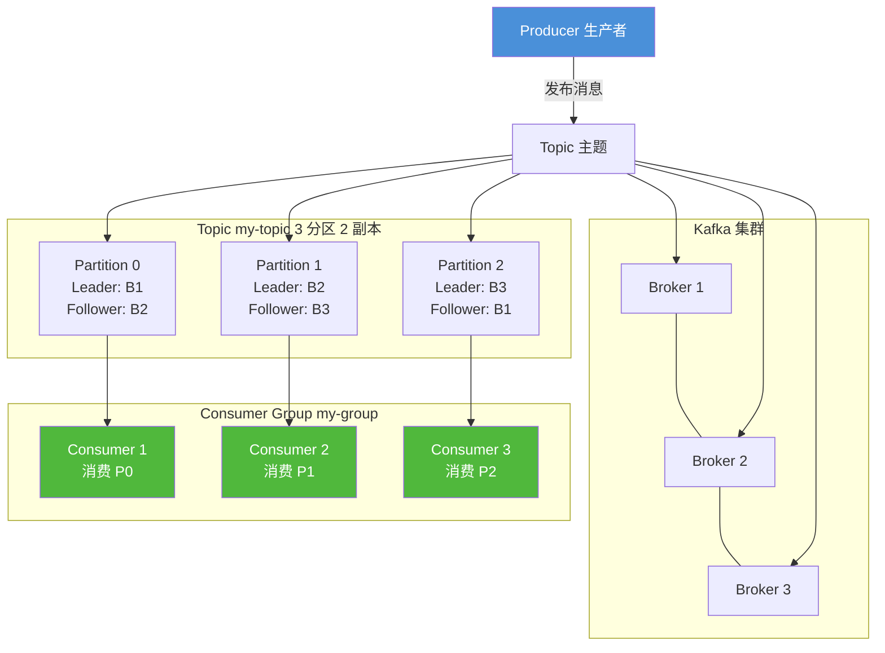
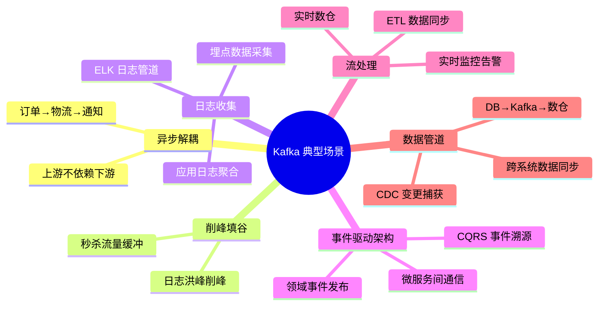
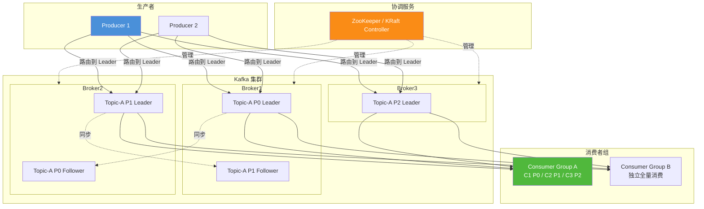
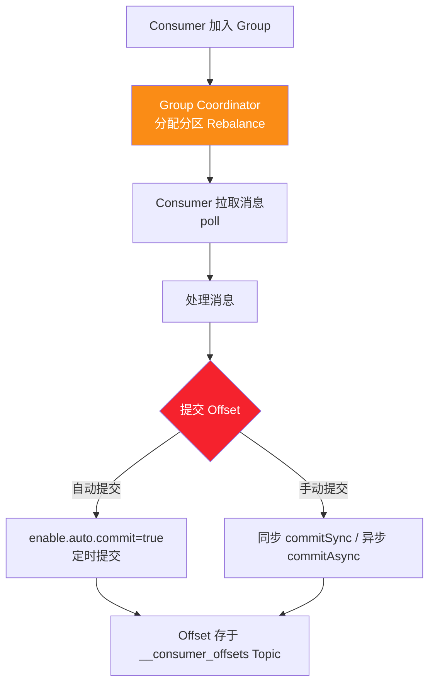
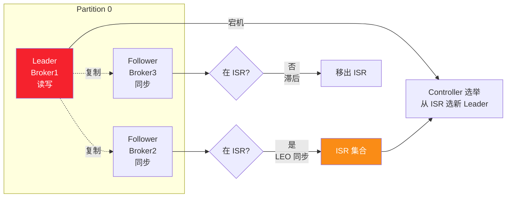
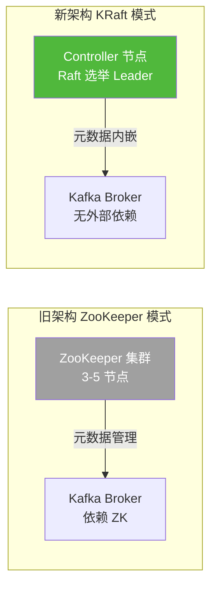

# Kafka 技术完全指南:核心原理·架构组成·安装配置·Java 集成·序列化·错误处理·性能优化

> **文档定位**:本文是 Apache Kafka 的**系统性学习与 Java 工程实践参考文档**,面向具备 Java 基础的开发人员(初中高级均适用),从核心概念到架构原理、从安装配置到 Java 集成开发、从基础 API 到性能优化与错误处理,全面覆盖 Kafka 在 Java 项目中的完整知识体系。每个知识点均配套可运行的代码示例与配置样例,确保读者既能理解原理又能落地工程。
>
> **关联文档**(建议一并阅读):
> - [Redis 技术完全指南](./Redis技术完全指南_核心原理数据结构高可用Java集成分布式应用性能优化.md) — 缓存与消息队列的协同
> - [Java 项目工程化方案](./Java项目工程化方案.md) — Java 项目工程化基线
> - [Spring-Boot 全面详解](./spring-boot/Spring-Boot全面详解_核心概念架构自动配置场景应用测试部署.md) — Spring Boot 集成基础
> - [Java 多线程与并发基础详解](./基本语法/Java多线程与并发基础详解.md) — 消费者并发模型基础
> - [高级 Java 工程师面试题](./高级Java工程师面试题.md) — 面试中的 Kafka 高频考点
>
> **版本基线**:本文以 **Kafka 3.6.x** 为基线(兼容 3.x),Java 客户端以 **Kafka Clients 3.6.x / Spring Kafka 3.1.x** 为基线(JDK 17+,兼容 JDK 8;KRaft 模式已生产可用)。

---

## 目录

- [一、Kafka 核心概念与特性](#一kafka-核心概念与特性)
  - [1.1 Kafka 是什么](#11-kafka-是什么)
  - [1.2 核心术语](#12-核心术语)
  - [1.3 核心特性](#13-核心特性)
  - [1.4 典型应用场景](#14-典型应用场景)
  - [1.5 与其他消息队列对比](#15-与其他消息队列对比)
- [二、架构组成与工作原理](#二架构组成与工作原理)
  - [2.1 整体架构](#21-整体架构)
  - [2.2 生产者工作原理](#22-生产者工作原理)
  - [2.3 消费者工作原理](#23-消费者工作原理)
  - [2.4 副本机制与 ISR](#24-副本机制与-isr)
  - [2.5 KRaft 模式(去 ZooKeeper)](#25-kraft-模式去-zookeeper)
- [三、安装与配置指南](#三安装与配置指南)
  - [3.1 单机安装(KRaft 模式)](#31-单机安装kraft-模式)
  - [3.2 集群安装](#32-集群安装)
  - [3.3 核心配置参数](#33-核心配置参数)
  - [3.4 服务启停](#34-服务启停)
- [四、基本操作命令](#四基本操作命令)
  - [4.1 主题管理](#41-主题管理)
  - [4.2 生产与消费](#42-生产与消费)
  - [4.3 消费者组管理](#43-消费者组管理)
  - [4.4 集群与配置管理](#44-集群与配置管理)
- [五、Java 集成开发指南](#五java-集成开发指南)
  - [5.1 依赖与客户端选型](#51-依赖与客户端选型)
  - [5.2 生产者 Producer 实现](#52-生产者-producer-实现)
  - [5.3 消费者 Consumer 实现](#53-消费者-consumer-实现)
  - [5.4 Spring Kafka 整合](#54-spring-kafka-整合)
- [六、消息序列化与反序列化](#六消息序列化与反序列化)
  - [6.1 序列化器选型](#61-序列化器选型)
  - [6.2 自定义序列化器](#62-自定义序列化器)
  - [6.3 Avro 与 Schema Registry](#63-avro-与-schema-registry)
- [七、配置参数详解](#七配置参数详解)
  - [7.1 生产者关键参数](#71-生产者关键参数)
  - [7.2 消费者关键参数](#72-消费者关键参数)
  - [7.3 Broker 关键参数](#73-broker-关键参数)
  - [7.4 主题级别参数](#74-主题级别参数)
- [八、错误处理机制](#八错误处理机制)
  - [8.1 生产者错误处理](#81-生产者错误处理)
  - [8.2 消费者错误处理](#82-消费者错误处理)
  - [8.3 死信队列与重试](#83-死信队列与重试)
  - [8.4 幂等与事务](#84-幂等与事务)
- [九、性能优化](#九性能优化)
  - [9.1 生产者优化](#91-生产者优化)
  - [9.2 消费者优化](#92-消费者优化)
  - [9.3 Broker 优化](#93-broker-优化)
  - [9.4 监控指标](#94-监控指标)
- [十、常见问题与最佳实践](#十常见问题与最佳实践)
  - [10.1 常见问题排查](#101-常见问题排查)
  - [10.2 最佳实践清单](#102-最佳实践清单)

---

## 一、Kafka 核心概念与特性

### 1.1 Kafka 是什么

**Apache Kafka** 是一个开源的**分布式事件流平台**(Distributed Event Streaming Platform),最初由 LinkedIn 开发,2011 年贡献给 Apache 基金会。它用 Scala 和 Java 编写,设计目标是**高吞吐、低延迟、可水平扩展、持久化、容错**的分布式发布订阅消息系统。

Kafka 不仅仅是消息队列,它同时承担三个角色:


| 角色 | 说明 | 类比 |
|------|------|------|
| **消息队列** | 生产者发布消息,消费者订阅处理 | RabbitMQ、RocketMQ |
| **存储系统** | 消息以追加日志形式持久化,可保留数天甚至永久 | 分布式提交日志 |
| **流处理引擎** | Kafka Streams 实时处理事件流 | Flink、Spark Streaming |

### 1.2 核心术语



| 术语 | 说明 |
|------|------|
| **Broker** | Kafka 服务节点,一个 Kafka 实例就是一个 Broker;多个 Broker 组成集群 |
| **Topic** | 消息的主题/分类,类似数据库的表;生产者往 Topic 发,消费者从 Topic 读 |
| **Partition** | Topic 的分区,一个 Topic 可分为多个 Partition,分布在不同 Broker 上,是并行度的单位 |
| **Replica** | 副本,每个 Partition 可配置多个副本(Leader + Follower),保证高可用 |
| **Leader / Follower** | 每个 Partition 有一个 Leader 负责读写,Follower 只同步;Leader 宕机 Follower 顶上 |
| **Producer** | 生产者,往 Topic 发布消息的客户端 |
| **Consumer** | 消费者,从 Topic 读取消息的客户端 |
| **Consumer Group** | 消费者组,组内消费者**分摊**消费所有分区(一个分区同一时刻只被组内一个消费者消费) |
| **Offset** | 消息在 Partition 中的偏移量(序号),消费者通过提交 Offset 记录消费进度 |
| **ISR** | In-Sync Replicas,与 Leader 保持同步的副本集合,是高可用的核心 |
| **Zookeeper / KRaft** | 集群协调服务(3.5 前用 ZooKeeper,3.5+ 推荐 KRaft 模式) |

### 1.3 核心特性

| 特性 | 说明 | 工程价值 |
|------|------|---------|
| **高吞吐** | 单 Broker 每秒可处理百万级消息(顺序磁盘 IO + 零拷贝) | 适合大数据、日志、埋点场景 |
| **低延迟** | 消息生产到消费延迟可低至毫秒级 | 接近实时 |
| **持久化** | 消息持久化到磁盘,可配置保留策略(按时间或大小) | 消息不丢,可重放 |
| **水平扩展** | 加 Broker 即可扩展容量和吞吐 | 线性扩展 |
| **高可用** | 多副本 + 自动故障转移 | 7×24 服务 |
| **顺序保证** | 同一分区内消息有序 | 业务有序性需求 |
| **多消费者独立** | 不同 Consumer Group 独立消费同一 Topic | 一份数据多方消费 |
| **精确一次** | 幂等 + 事务实现 Exactly-Once 语义 | 不重复不丢失 |

### 1.4 典型应用场景



### 1.5 与其他消息队列对比

| 维度 | Kafka | RabbitMQ | RocketMQ | Pulsar |
|------|-------|----------|---------|--------|
| **吞吐** | 百万级 | 万级 | 十万级 | 百万级 |
| **延迟** | 毫秒级 | 微秒级 | 毫秒级 | 毫秒级 |
| **持久化** | 磁盘顺序写 | 内存+磁盘可选 | 磁盘 | BookKeeper |
| **顺序性** | 分区内有序 | 队列内有序 | 分区内有序 | 分区内有序 |
| **事务** | 支持(较弱) | 支持 | 支持(强) | 支持 |
| **协议** | 自定义 TCP | AMQP | 自定义 | 自定义 |
| **生态** | 大数据生态最强 | 传统企业 | 阿里系 | 云原生 |
| **适用场景** | 大数据/日志/流处理 | 企业应用/复杂路由 | 电商/金融 | 多租户/云原生 |

---

## 二、架构组成与工作原理

### 2.1 整体架构



### 2.2 生产者工作原理


**分区策略**(决定消息发往哪个 Partition):

| 策略 | 说明 |
|------|------|
| 指定 Partition | `ProducerRecord(topic, partition, key, value)`,直接发往指定分区 |
| 有 Key 按 Key 哈希 | `partition = hash(key) % numPartitions`,同 Key 永远同分区(保证顺序) |
| 无 Key 轮询(默认) | 2.4 前纯 Round Robin;2.4+ 用 Sticky Partitioner(粘性,提升批量效率) |
| 自定义分区器 | 实现 `Partitioner` 接口 |

### 2.3 消费者工作原理



**消费者组与分区分配**:
- 一个 Consumer Group 内,一个分区只能被一个消费者消费
- 消费者数 > 分区数时,多余消费者空闲
- 消费者数 ≤ 分区数时,一个消费者可能消费多个分区
- 消费者加入/离开/崩溃会触发 **Rebalance**(重新分配分区)

**Offset 提交策略**:

| 策略 | 方式 | 优缺点 |
|------|------|-------|
| 自动提交 | `enable.auto.commit=true`,每 `auto.commit.interval.ms` 提交一次 | 简单,但可能重复消费或丢消息 |
| 手动同步 | `commitSync()` 阻塞提交 | 可靠,但阻塞影响吞吐 |
| 手动异步 | `commitAsync(callback)` 非阻塞 | 高吞吐,但可能失败 |
| 混合 | 正常用异步,关闭前用同步 | 推荐实践 |

### 2.4 副本机制与 ISR



**关键概念**:
- **LEO**(Log End Offset):每个副本的日志末端偏移量
- **HW**(High Watermark):所有 ISR 中最小的 LEO,消费者只能读到 HW 之前的消息
- **ISR**(In-Sync Replicas):与 Leader 保持同步的副本集合(含 Leader);Follower 滞后超过 `replica.lag.time.max.ms` 会被移出 ISR
- **acks**:生产者确认级别(见 §7.1)

**acks 参数对比**:

| acks | 说明 | 可靠性 | 性能 |
|:----:|------|:------:|:----:|
| `0` | 发出去就不管,不等确认 | 最低,可能丢 | 最高 |
| `1` | Leader 写入即返回(默认) | 中,Leader 宕机可能丢 | 高 |
| `all`/`-1` | 所有 ISR 同步才返回 | 最高,不丢 | 较低 |

### 2.5 KRaft 模式(去 ZooKeeper)

Kafka 3.0+ 引入 **KRaft**(Kafka Raft)模式,用 Kafka 自身的 Raft 协议替代 ZooKeeper 做元数据管理,3.3+ 生产可用,3.5+ 推荐使用。



**KRaft 优势**:
- 去掉 ZooKeeper,架构简化,运维成本降低
- 元数据操作性能提升(分区数可扩展到百万级)
- 集群启动更快

---

## 三、安装与配置指南

### 3.1 单机安装(KRaft 模式)

```bash
# 1. 下载(需 JDK 11+)
wget https://archive.apache.org/dist/kafka/3.6.1/kafka_2.13-3.6.1.tgz
tar -xzf kafka_2.13-3.6.1.tgz
cd kafka_2.13-3.6.1

# 2. KRaft 模式:生成集群 UUID
KAFKA_CLUSTER_ID="$(bin/kafka-storage.sh random-uuid)"

# 3. 格式化日志目录
bin/kafka-storage.sh format -t $KAFKA_CLUSTER_ID \
  -c config/kraft/server.properties

# 4. 启动 Kafka(KRaft 模式,无需 ZooKeeper)
bin/kafka-server-start.sh config/kraft/server.properties

# 5. 验证
bin/kafka-topics.sh --bootstrap-server localhost:9092 --list
```

### 3.2 集群安装

```bash
# 三节点集群示例(broker1/broker2/broker3)
# 每个节点的 config/kraft/server.properties 修改:
#
# node.id=1                              # 节点ID(每个节点不同:1/2/3)
# process.roles=broker,controller        # 同时承担 broker 和 controller
# controllers=1@broker1:9093,2@broker2:9093,3@broker3:9093
# listeners=PLAINTEXT://:9092,CONTROLLER://:9093
# advertised.listeners=PLAINTEXT://broker1:9092
# log.dirs=/data/kafka-logs              # 数据目录

# 在每个节点上执行:
bin/kafka-storage.sh format -t $CLUSTER_ID -c config/kraft/server.properties
bin/kafka-server-start.sh -daemon config/kraft/server.properties
```

### 3.3 核心配置参数

```properties
# ==================== Broker 配置(server.properties) ====================
broker.id=1                              # Broker ID(集群内唯一)
listeners=PLAINTEXT://:9092              # 监听地址
advertised.listeners=PLAINTEXT://broker1:9092  # 对外暴露地址
log.dirs=/data/kafka-logs                # 数据目录(可多个,逗号分隔)
num.network.threads=3                    # 网络线程数
num.io.threads=8                         # IO 线程数
socket.send.buffer.bytes=102400          # 发送缓冲区
socket.receive.buffer.bytes=102400       # 接收缓冲区
socket.request.max.bytes=104857600       # 最大请求大小(100MB)

# 主题默认配置
num.partitions=1                         # 默认分区数
default.replication.factor=1             # 默认副本数(生产建议3)
min.insync.replicas=1                    # 最少同步副本(配合 acks=all)

# 日志保留
log.retention.hours=168                  # 日志保留 7 天
log.retention.bytes=-1                   # 按大小保留(-1 不限)
log.segment.bytes=1073741824             # 单个日志段 1GB
log.retention.check.interval.ms=300000   # 清理检查间隔

# KRaft 模式
process.roles=broker,controller
controller.quorum.voters=1@broker1:9093,2@broker2:9093,3@broker3:9093
```

### 3.4 服务启停

```bash
# 前台启动(看日志)
bin/kafka-server-start.sh config/kraft/server.properties

# 后台启动(-daemon)
bin/kafka-server-start.sh -daemon config/kraft/server.properties

# 优雅停止
bin/kafka-server-stop.sh

# Docker 快速启动(开发测试)
docker run -d --name kafka \
  -p 9092:9092 \
  -e KAFKA_NODE_ID=1 \
  -e KAFKA_PROCESS_ROLES=broker,controller \
  -e KAFKA_LISTENERS=PLAINTEXT://:9092,CONTROLLER://:9093 \
  -e KAFKA_ADVERTISED_LISTENERS=PLAINTEXT://localhost:9092 \
  -e KAFKA_CONTROLLER_QUORUM_VOTERS=1@localhost:9093 \
  -e KAFKA_CONTROLLER_LISTENER_NAMES=CONTROLLER \
  -e KAFKA_LISTENER_SECURITY_PROTOCOL_MAP=CONTROLLER:PLAINTEXT,PLAINTEXT:PLAINTEXT \
  -e KAFKA_INTER_BROKER_LISTENER_NAME=PLAINTEXT \
  -e CLUSTER_ID=MkU3OEVBNTcwNTJENDM2Qk \
  bitnami/kafka:3.6
```

---

## 四、基本操作命令

### 4.1 主题管理

```bash
# 创建主题(3 分区,2 副本)
bin/kafka-topics.sh --bootstrap-server localhost:9092 \
  --create --topic my-topic \
  --partitions 3 \
  --replication-factor 2

# 查看主题列表
bin/kafka-topics.sh --bootstrap-server localhost:9092 --list

# 查看主题详情
bin/kafka-topics.sh --bootstrap-server localhost:9092 \
  --describe --topic my-topic

# 查看所有主题详情
bin/kafka-topics.sh --bootstrap-server localhost:9092 --describe

# 增加分区(只能增加不能减少)
bin/kafka-topics.sh --bootstrap-server localhost:9092 \
  --alter --topic my-topic --partitions 6

# 修改主题配置
bin/kafka-configs.sh --bootstrap-server localhost:9092 \
  --alter --entity-type topics --entity-name my-topic \
  --add-config retention.ms=86400000

# 删除主题(需开启 delete.topic.enable=true)
bin/kafka-topics.sh --bootstrap-server localhost:9092 \
  --delete --topic my-topic
```

### 4.2 生产与消费

```bash
# 控制台生产者(交互式)
bin/kafka-console-producer.sh --bootstrap-server localhost:9092 \
  --topic my-topic

# 带 Key 的生产者
bin/kafka-console-producer.sh --bootstrap-server localhost:9092 \
  --topic my-topic --property "key.separator=:" --property "parse.key=true"

# 控制台消费者(从头开始)
bin/kafka-console-consumer.sh --bootstrap-server localhost:9092 \
  --topic my-topic --from-beginning

# 消费者显示 Key
bin/kafka-console-consumer.sh --bootstrap-server localhost:9092 \
  --topic my-topic --property "print.key=true"

# 指定消费者组
bin/kafka-console-consumer.sh --bootstrap-server localhost:9092 \
  --topic my-topic --group my-group

# 按分区和 offset 消费
bin/kafka-console-consumer.sh --bootstrap-server localhost:9092 \
  --topic my-topic --partition 0 --offset 5
```

### 4.3 消费者组管理

```bash
# 查看所有消费者组
bin/kafka-consumer-groups.sh --bootstrap-server localhost:9092 --list

# 查看消费者组详情(含 lag)
bin/kafka-consumer-groups.sh --bootstrap-server localhost:9092 \
  --describe --group my-group

# 重置 offset 到最早
bin/kafka-consumer-groups.sh --bootstrap-server localhost:9092 \
  --group my-group --topic my-topic --reset-offsets --to-earliest --execute

# 重置 offset 到最新
bin/kafka-consumer-groups.sh --bootstrap-server localhost:9092 \
  --group my-group --topic my-topic --reset-offsets --to-latest --execute

# 重置 offset 到指定位置
bin/kafka-consumer-groups.sh --bootstrap-server localhost:9092 \
  --group my-group --topic my-topic --reset-offsets --to-offset 100 --execute

# 按时间重置
bin/kafka-consumer-groups.sh --bootstrap-server localhost:9092 \
  --group my-group --topic my-topic \
  --reset-offsets --to-datetime 2026-01-01T00:00:00.000 --execute

# 删除消费者组
bin/kafka-consumer-groups.sh --bootstrap-server localhost:9092 \
  --delete --group my-group
```

### 4.4 集群与配置管理

```bash
# 查看 Broker 列表
bin/kafka-broker-api-versions.sh --bootstrap-server localhost:9092

# 查看集群描述
bin/kafka-cluster.sh --bootstrap-server localhost:9092 describe

# 查看/修改 Broker 配置
bin/kafka-configs.sh --bootstrap-server localhost:9092 \
  --describe --entity-type brokers --entity-name 1

# 查看 Topic 配置
bin/kafka-configs.sh --bootstrap-server localhost:9092 \
  --describe --entity-type topics --entity-name my-topic

# 生产者性能测试
bin/kafka-producer-perf-test.sh --topic my-topic \
  --num-records 100000 --record-size 1024 --throughput -1

# 消费者性能测试
bin/kafka-consumer-perf-test.sh --bootstrap-server localhost:9092 \
  --topic my-topic --messages 100000
```

---

## 五、Java 集成开发指南

### 5.1 依赖与客户端选型

```xml
<!-- 方式一:原生 Kafka Clients(轻量,灵活) -->
<dependency>
    <groupId>org.apache.kafka</groupId>
    <artifactId>kafka-clients</artifactId>
    <version>3.6.1</version>
</dependency>

<!-- 方式二:Spring Kafka(Spring Boot 项目推荐) -->
<dependency>
    <groupId>org.springframework.kafka</groupId>
    <artifactId>spring-kafka</artifactId>
    <version>3.1.3</version>
</dependency>

<!-- 方式三:Spring for Apache Kafka(测试支持) -->
<dependency>
    <groupId>org.springframework.kafka</groupId>
    <artifactId>spring-kafka-test</artifactId>
    <version>3.1.3</version>
    <scope>test</scope>
</dependency>
```

| 选型 | 适用场景 |
|------|---------|
| **kafka-clients** | 非 Spring 项目、需要极致控制 |
| **Spring Kafka** | Spring Boot 项目、快速开发 |

### 5.2 生产者 Producer 实现

```java
import org.apache.kafka.clients.producer.*;
import org.apache.kafka.common.serialization.StringSerializer;
import java.util.Properties;
import java.util.concurrent.Future;

public class KafkaProducerDemo {

    public static void main(String[] args) {
        // 1. 配置生产者
        Properties props = new Properties();
        // 必需:Broker 地址
        props.put(ProducerConfig.BOOTSTRAP_SERVERS_CONFIG, "localhost:9092");
        // 必需:Key/Value 序列化器
        props.put(ProducerConfig.KEY_SERIALIZER_CLASS_CONFIG, StringSerializer.class.getName());
        props.put(ProducerConfig.VALUE_SERIALIZER_CLASS_CONFIG, StringSerializer.class.getName());
        // 可靠性:所有 ISR 确认
        props.put(ProducerConfig.ACKS_CONFIG, "all");
        // 重试次数
        props.put(ProducerConfig.RETRIES_CONFIG, 3);
        // 幂等生产者(防重复,3.0 默认开启)
        props.put(ProducerConfig.ENABLE_IDEMPOTENCE_CONFIG, true);
        // 批量大小(字节),16KB
        props.put(ProducerConfig.BATCH_SIZE_CONFIG, 16384);
        // 批量等待时间(毫秒),与 batch.size 任一满足即发送
        props.put(ProducerConfig.LINGER_MS_CONFIG, 10);
        // 缓冲区大小(字节),32MB
        props.put(ProducerConfig.BUFFER_MEMORY_CONFIG, 33554432);
        // 发送超时
        props.put(ProducerConfig.DELIVERY_TIMEOUT_MS_CONFIG, 120000);

        // 2. 创建生产者(线程安全,一个应用一个实例即可)
        try (KafkaProducer<String, String> producer = new KafkaProducer<>(props)) {

            // 3. 发送方式一: fire-and-forget(不管结果,最快但可能丢)
            producer.send(new ProducerRecord<>("my-topic", "key1", "value1"));

            // 4. 发送方式二: 同步发送(阻塞等结果)
            Future<RecordMetadata> future = producer.send(
                new ProducerRecord<>("my-topic", "key2", "value2"));
            RecordMetadata metadata = future.get();   // 阻塞等待
            System.out.printf("分区:%d, 偏移量:%d%n",
                metadata.partition(), metadata.offset());

            // 5. 发送方式三: 异步发送 + 回调(推荐)
            for (int i = 0; i < 10; i++) {
                ProducerRecord<String, String> record =
                    new ProducerRecord<>("my-topic", "key" + i, "value" + i);
                producer.send(record, (metadata2, exception) -> {
                    if (exception != null) {
                        // 发送失败处理
                        System.err.println("发送失败:" + exception.getMessage());
                        exception.printStackTrace();
                    } else {
                        System.out.printf("成功: topic=%s, partition=%d, offset=%d%n",
                            metadata2.topic(), metadata2.partition(), metadata2.offset());
                    }
                });
            }

            // 6. 发送带 Header 的消息
            ProducerRecord<String, String> recordWithHeaders = new ProducerRecord<>(
                "my-topic", null, "key99", "value99",
                java.util.List.of(new RecordHeader("traceId", "abc123".getBytes())));
            producer.send(recordWithHeaders);

        }  // try-with-resources 自动 close(会 flush 缓冲区)

        // 注意:close() 前会等待 in-flight 请求完成,默认等 60s
    }
}
```

### 5.3 消费者 Consumer 实现

```java
import org.apache.kafka.clients.consumer.*;
import org.apache.kafka.common.serialization.StringDeserializer;
import java.time.Duration;
import java.util.Collections;
import java.util.Properties;

public class KafkaConsumerDemo {

    public static void main(String[] args) {
        // 1. 配置消费者
        Properties props = new Properties();
        // 必需:Broker 地址
        props.put(ConsumerConfig.BOOTSTRAP_SERVERS_CONFIG, "localhost:9092");
        // 必需:消费者组 ID(同组内分摊消费)
        props.put(ConsumerConfig.GROUP_ID_CONFIG, "my-group");
        // 必需:反序列化器
        props.put(ConsumerConfig.KEY_DESERIALIZER_CLASS_CONFIG, StringDeserializer.class.getName());
        props.put(ConsumerConfig.VALUE_DESERIALIZER_CLASS_CONFIG, StringDeserializer.class.getName());
        // 从最早开始消费(新组首次消费位置)
        props.put(ConsumerConfig.AUTO_OFFSET_RESET_CONFIG, "earliest");
        // 自动提交 offset
        props.put(ConsumerConfig.ENABLE_AUTO_COMMIT_CONFIG, true);
        props.put(ConsumerConfig.AUTO_COMMIT_INTERVAL_MS_CONFIG, 5000);
        // 单次 poll 最大记录数
        props.put(ConsumerConfig.MAX_POLL_RECORDS_CONFIG, 500);
        // poll 间隔超时(超过则被踢出组触发 rebalance)
        props.put(ConsumerConfig.MAX_POLL_INTERVAL_MS_CONFIG, 300000);
        // 心跳间隔
        props.put(ConsumerConfig.HEARTBEAT_INTERVAL_MS_CONFIG, 3000);
        // 会话超时
        props.put(ConsumerConfig.SESSION_TIMEOUT_MS_CONFIG, 45000);

        // 2. 创建消费者(非线程安全,一个线程一个实例)
        try (KafkaConsumer<String, String> consumer = new KafkaConsumer<>(props)) {

            // 3. 订阅主题
            consumer.subscribe(Collections.singletonList("my-topic"));

            // 4. 循环拉取消息
            while (true) {
                // poll 拉取消息,参数是等待超时(没有消息时最多等多久)
                ConsumerRecords<String, String> records = consumer.poll(Duration.ofMillis(1000));

                for (ConsumerRecord<String, String> record : records) {
                    System.out.printf("topic=%s, partition=%d, offset=%d, key=%s, value=%s%n",
                        record.topic(), record.partition(), record.offset(),
                        record.key(), record.value());
                    // 处理消息的业务逻辑
                    processMessage(record);
                }

                // 5. 手动提交 offset(若关闭自动提交)
                // consumer.commitSync();   // 同步提交(阻塞)
                // consumer.commitAsync();  // 异步提交(非阻塞)
            }
        }
    }

    private static void processMessage(ConsumerRecord<String, String> record) {
        // 业务处理
        try {
            // 模拟处理
            System.out.println("处理消息: " + record.value());
        } catch (Exception e) {
            // 异常处理:记录日志 / 发送死信队列 / 跳过
            System.err.println("消息处理失败: " + e.getMessage());
        }
    }
}
```

### 5.4 Spring Kafka 整合

#### 5.4.1 配置

```yaml
# application.yml
spring:
  kafka:
    bootstrap-servers: localhost:9092
    producer:
      key-serializer: org.apache.kafka.common.serialization.StringSerializer
      value-serializer: org.springframework.kafka.support.serializer.JsonSerializer
      acks: all
      retries: 3
      batch-size: 16384
      properties:
        linger.ms: 10
        enable.idempotence: true
    consumer:
      group-id: my-group
      auto-offset-reset: earliest
      key-deserializer: org.apache.kafka.common.serialization.StringDeserializer
      value-deserializer: org.springframework.kafka.support.serializer.JsonDeserializer
      enable-auto-commit: false
      max-poll-records: 500
      properties:
        spring.json.trusted.packages: "*"
    listener:
      ack-mode: manual_immediate    # 手动提交
      concurrency: 3                 # 消费线程数
```

#### 5.4.2 生产者

```java
import org.springframework.kafka.core.KafkaTemplate;
import org.springframework.kafka.support.SendResult;
import org.springframework.stereotype.Service;
import java.util.concurrent.CompletableFuture;

@Service
public class OrderEventProducer {

    private final KafkaTemplate<String, OrderEvent> kafkaTemplate;

    public OrderEventProducer(KafkaTemplate<String, OrderEvent> kafkaTemplate) {
        this.kafkaTemplate = kafkaTemplate;
    }

    // 异步发送
    public void sendOrderAsync(OrderEvent order) {
        CompletableFuture<SendResult<String, OrderEvent>> future =
            kafkaTemplate.send("order-events", order.getOrderId(), order);

        future.whenComplete((result, ex) -> {
            if (ex != null) {
                System.err.println("发送失败: " + ex.getMessage());
                // 失败处理:重试 / 降级 / 记录日志
            } else {
                System.out.printf("发送成功: partition=%d, offset=%d%n",
                    result.getRecordMetadata().partition(),
                    result.getRecordMetadata().offset());
            }
        });
    }

    // 同步发送
    public void sendOrderSync(OrderEvent order) throws Exception {
        kafkaTemplate.send("order-events", order.getOrderId(), order).get();
    }
}
```

#### 5.4.3 消费者

```java
import org.apache.kafka.clients.consumer.ConsumerRecord;
import org.springframework.kafka.annotation.KafkaListener;
import org.springframework.kafka.support.Acknowledgment;
import org.springframework.stereotype.Service;

@Service
public class OrderEventConsumer {

    // 监听主题,手动确认
    @KafkaListener(topics = "order-events", groupId = "order-group")
    public void handleOrderEvent(ConsumerRecord<String, OrderEvent> record,
                                  Acknowledgment ack) {
        try {
            OrderEvent order = record.value();
            System.out.printf("收到订单: partition=%d, offset=%d, order=%s%n",
                record.partition(), record.offset(), order);

            // 业务处理
            processOrder(order);

            // 手动提交 offset
            ack.acknowledge();

        } catch (Exception e) {
            // 异常处理:记录日志 / 重试 / 死信队列
            System.err.println("处理失败: " + e.getMessage());
            // 不 ack,下次会重新消费(可能重复,需幂等)
        }
    }

    // 批量消费
    @KafkaListener(topics = "batch-events", groupId = "batch-group")
    public void handleBatch(java.util.List<ConsumerRecord<String, String>> records,
                             Acknowledgment ack) {
        for (ConsumerRecord<String, String> record : records) {
            System.out.println("处理: " + record.value());
        }
        ack.acknowledge();   // 批量处理完统一提交
    }

    private void processOrder(OrderEvent order) {
        // 业务逻辑
    }
}
```

---

## 六、消息序列化与反序列化

### 6.1 序列化器选型

| 序列化器 | 优点 | 缺点 | 适用场景 |
|---------|------|------|---------|
| **StringSerializer** | 简单、可读、跨语言 | 需配合 JSON 库手动转 | 通用、调试 |
| **ByteArraySerializer** | 零开销 | 需自行处理 | 二进制数据 |
| **IntegerSerializer** | 简单 | 仅整数 | Key 为 ID |
| **JsonSerializer**(Spring) | 对象直接序列化 | 跨语言需注意类型 | Spring 项目 |
| **Avro + Schema Registry** | 紧凑、Schema 演进、强类型 | 需 Registry 基础设施 | 大数据、多团队 |
| **Protobuf** | 紧凑、跨语言 | 需 .proto 编译 | 高性能 RPC |

### 6.2 自定义序列化器

```java
import org.apache.kafka.common.serialization.Serializer;
import com.fasterxml.jackson.databind.ObjectMapper;

// 自定义对象序列化器
public class OrderEventSerializer implements Serializer<OrderEvent> {
    private final ObjectMapper objectMapper = new ObjectMapper();

    @Override
    public byte[] serialize(String topic, OrderEvent data) {
        if (data == null) return null;
        try {
            return objectMapper.writeValueAsBytes(data);
        } catch (Exception e) {
            throw new RuntimeException("序列化失败", e);
        }
    }

    @Override
    public void close() {
        // 资源清理
    }
}

// 配置使用
props.put(ProducerConfig.VALUE_SERIALIZER_CLASS_CONFIG, OrderEventSerializer.class.getName());
```

### 6.3 Avro 与 Schema Registry

```java
// Avro Schema(order.avsc)
// {
//   "type": "record",
//   "name": "OrderEvent",
//   "fields": [
//     {"name": "orderId", "type": "string"},
//     {"name": "amount", "type": "double"},
//     {"name": "createTime", "type": "long"}
//   ]
// }

// Maven 依赖
// <dependency>
//   <groupId>io.confluent</groupId>
//   <artifactId>kafka-avro-serializer</artifactId>
//   <version>7.5.0</version>
// </dependency>

// 生产者配置
props.put(ProducerConfig.VALUE_SERIALIZER_CLASS_CONFIG,
    "io.confluent.kafka.serializers.KafkaAvroSerializer");
props.put("schema.registry.url", "http://localhost:8081");

// 发送 Avro 对象(需先生成 Avro 类)
producer.send(new ProducerRecord<>("orders", orderId, orderAvro));
```

---

## 七、配置参数详解

### 7.1 生产者关键参数

| 参数 | 默认值 | 说明 |
|------|:------:|------|
| `bootstrap.servers` | - | Broker 地址列表,逗号分隔 |
| `acks` | all(3.0+) | 确认级别:0/1/all |
| `retries` | Integer.MAX | 重试次数(配合 delivery.timeout 限制) |
| `retry.backoff.ms` | 100 | 重试间隔 |
| `enable.idempotence` | true(3.0+) | 幂等生产者,防重复 |
| `max.in.flight.requests.per.connection` | 5 | 单连接未确认请求数(幂等开启时 ≤5) |
| `batch.size` | 16384(16KB) | 批量大小 |
| `linger.ms` | 0 | 批量等待时间(0=立即发) |
| `buffer.memory` | 33554432(32MB) | 缓冲区大小 |
| `compression.type` | none | 压缩:none/gzip/snappy/lz4/zstd |
| `max.request.size` | 1048576(1MB) | 单条消息最大值 |
| `delivery.timeout.ms` | 120000(2min) | 发送总超时(含重试) |
| `request.timeout.ms` | 30000(30s) | 单次请求超时 |

### 7.2 消费者关键参数

| 参数 | 默认值 | 说明 |
|------|:------:|------|
| `group.id` | - | 消费者组 ID |
| `auto.offset.reset` | latest | 新组首次消费位置:earliest/latest |
| `enable.auto.commit` | true | 自动提交 offset |
| `auto.commit.interval.ms` | 5000 | 自动提交间隔 |
| `max.poll.records` | 500 | 单次 poll 最大记录数 |
| `max.poll.interval.ms` | 300000(5min) | 两次 poll 最大间隔(超时被踢出) |
| `session.timeout.ms` | 45000 | 会话超时(心跳) |
| `heartbeat.interval.ms` | 3000 | 心跳间隔 |
| `fetch.min.bytes` | 1 | 最小拉取字节数 |
| `fetch.max.wait.ms` | 500 | 最大等待时间 |
| `fetch.max.bytes` | 52428800(50MB) | 最大拉取字节数 |
| `isolation.level` | read_uncommitted | 事务隔离级别:read_committed/read_uncommitted |

### 7.3 Broker 关键参数

| 参数 | 默认值 | 说明 |
|------|:------:|------|
| `num.partitions` | 1 | 默认分区数 |
| `default.replication.factor` | 1 | 默认副本数(生产建议 3) |
| `min.insync.replicas` | 1 | 最少同步副本(配合 acks=all) |
| `log.retention.hours` | 168(7天) | 日志保留时间 |
| `log.segment.bytes` | 1GB | 单个日志段大小 |
| `num.network.threads` | 3 | 网络线程 |
| `num.io.threads` | 8 | IO 线程 |
| `message.max.bytes` | 1MB | 单条消息最大值 |
| `unclean.leader.election.enable` | false | 是否允许非 ISR 副本当 Leader(数据安全) |

### 7.4 主题级别参数

| 参数 | 说明 |
|------|------|
| `cleanup.policy` | 清理策略:delete(删除)/compact(日志压缩) |
| `retention.ms` | 保留时间 |
| `retention.bytes` | 保留大小 |
| `max.message.bytes` | 单条消息最大值 |
| `segment.ms` | 段滚动时间 |
| `compression.type` | 压缩类型 |

---

## 八、错误处理机制

### 8.1 生产者错误处理

```java
public class ProducerErrorHandler {

    private final KafkaProducer<String, String> producer;
    private static final int MAX_RETRY = 3;

    // 带重试的发送
    public void sendWithRetry(String topic, String key, String value) {
        int attempt = 0;
        while (attempt < MAX_RETRY) {
            attempt++;
            try {
                producer.send(new ProducerRecord<>(topic, key, value),
                    (metadata, exception) -> {
                        if (exception != null) {
                            // 可重试异常
                            if (isRetriable(exception)) {
                                log.warn("可重试异常: {}", exception.getMessage());
                            } else {
                                // 不可重试异常,记录死信
                                log.error("不可重试异常", exception);
                                sendToDLQ(topic, key, value);
                            }
                        }
                    });
                return;
            } catch (Exception e) {
                log.warn("第 {} 次发送失败: {}", attempt, e.getMessage());
                if (attempt >= MAX_RETRY) {
                    sendToDLQ(topic, key, value);   // 发死信队列
                }
            }
        }
    }

    // 判断是否可重试
    private boolean isRetriable(Exception e) {
        return e instanceof org.apache.kafka.common.errors.RetriableException;
        // 包括:NetworkException, LeaderNotAvailableException,
        //       NotEnoughReplicasException, TimeoutException 等
    }

    private void sendToDLQ(String originalTopic, String key, String value) {
        producer.send(new ProducerRecord<>(originalTopic + ".DLT", key, value));
    }
}
```

### 8.2 消费者错误处理

```java
public class ConsumerErrorHandler {

    // 方式一:Spring Kafka 默认错误处理器(推荐)
    // 配置 DefaultErrorHandler,自动重试 + 死信

    @Bean
    public DefaultErrorHandler errorHandler(KafkaTemplate<Object, Object> template) {
        // 重试 3 次,间隔 1s/2s/4s(指数退避)
        DeadLetterPublishingRecoverer recoverer = new DeadLetterPublishingRecoverer(
            template,
            (record, ex) -> new org.apache.kafka.common.TopicPartition(
                record.topic() + ".DLT", record.partition()));
        DefaultErrorHandler handler = new DefaultErrorHandler(recoverer,
            new org.springframework.util.backoff.ExponentialBackOff(1000L, 2.0));
        handler.setMaxAttempts(3);   // 最多重试 3 次
        // 不重试的异常(直接进死信)
        handler.addNotRetryableExceptions(DeserializationException.class);
        return handler;
    }

    // 方式二:手动处理
    public void consumeWithRetry(ConsumerRecord<String, String> record, Acknowledgment ack) {
        int maxRetry = 3;
        for (int i = 0; i <= maxRetry; i++) {
            try {
                processMessage(record);
                ack.acknowledge();
                return;
            } catch (Exception e) {
                if (i >= maxRetry) {
                    // 重试用尽,发死信
                    sendToDLQ(record);
                    ack.acknowledge();   // 确认避免无限阻塞
                } else {
                    sleep(1000L * (1L << i));   // 指数退避
                }
            }
        }
    }
}
```

### 8.3 死信队列与重试


### 8.4 幂等与事务

#### 8.4.1 幂等生产者(防重复)

```java
// 开启幂等(3.0+ 默认开启)
props.put(ProducerConfig.ENABLE_IDEMPOTENCE_CONFIG, true);
// 幂等要求:acks=all, retries>0, max.in.flight.requests.per.connection<=5
// 原理:Broker 用 PID + SeqNumber 去重
```

#### 8.4.2 事务(跨分区原子)

```java
// 事务生产者配置
props.put(ProducerConfig.TRANSACTIONAL_ID_CONFIG, "my-tx-producer-1");
props.put(ProducerConfig.ENABLE_IDEMPOTENCE_CONFIG, true);   // 事务要求幂等

KafkaProducer<String, String> producer = new KafkaProducer<>(props);

// 初始化事务
producer.initTransactions();

try {
    // 开启事务
    producer.beginTransaction();

    // 发送多条消息(可跨 Topic/Partition)
    producer.send(new ProducerRecord<>("topic1", "k1", "v1"));
    producer.send(new ProducerRecord<>("topic2", "k2", "v2"));

    // 提交消费者的 offset(消费-处理-生产 的事务闭环)
    Map<TopicPartition, OffsetAndMetadata> offsets = new HashMap<>();
    offsets.put(new TopicPartition("input-topic", 0),
        new OffsetAndMetadata(lastOffset + 1));
    producer.sendOffsetsToTransaction(offsets, "consumer-group-id");

    // 提交事务
    producer.commitTransaction();

} catch (Exception e) {
    // 回滚事务
    producer.abortTransaction();
}
```

---

## 九、性能优化

### 9.1 生产者优化

| 优化项 | 配置 | 说明 |
|--------|------|------|
| **批量发送** | `batch.size=32768`(32KB) + `linger.ms=10` | 攒一批再发,提升吞吐 |
| **压缩** | `compression.type=lz4` | 减少 50%+ 网络与存储 |
| **异步发送** | send + callback | 不阻塞业务线程 |
| **缓冲区** | `buffer.memory=67108864`(64MB) | 高并发避免阻塞 |
| **幂等开启** | `enable.idempotence=true` | 防重复,性能损失小 |
| **合理分区** | Key 哈希或自定义分区器 | 避免数据倾斜 |

```java
// 高吞吐生产者配置示例
Properties props = new Properties();
props.put(ProducerConfig.BOOTSTRAP_SERVERS_CONFIG, "localhost:9092");
props.put(ProducerConfig.ACKS_CONFIG, "all");
props.put(ProducerConfig.BATCH_SIZE_CONFIG, 32768);          // 32KB
props.put(ProducerConfig.LINGER_MS_CONFIG, 20);              // 等待 20ms
props.put(ProducerConfig.COMPRESSION_TYPE_CONFIG, "lz4");    // 压缩
props.put(ProducerConfig.BUFFER_MEMORY_CONFIG, 67108864);    // 64MB
props.put(ProducerConfig.ENABLE_IDEMPOTENCE_CONFIG, true);
```

### 9.2 消费者优化

| 优化项 | 配置 | 说明 |
|--------|------|------|
| **批量拉取** | `max.poll.records=1000` | 单次拉更多 |
| **手动提交** | `enable.auto.commit=false` | 处理完再提交 |
| **多线程消费** | 分区数 = 消费线程数 | 提升并行度 |
| **合理 fetch** | `fetch.min.bytes=1024` | 减少小批量拉取 |
| **会话超时** | `session.timeout.ms=60000` | 避免误判宕机 |

```java
// 多线程消费者(按分区分配线程)
public class ConcurrentConsumer {
    private final ExecutorService executor = Executors.newFixedThreadPool(3);

    public void start() {
        KafkaConsumer<String, String> consumer = new KafkaConsumer<>(props);
        consumer.subscribe(Collections.singletonList("my-topic"));

        while (true) {
            ConsumerRecords<String, String> records = consumer.poll(Duration.ofMillis(1000));
            // 按分区提交到线程池(保证分区内顺序)
            for (TopicPartition partition : records.partitions()) {
                List<ConsumerRecord<String, String>> partitionRecords =
                    records.records(partition);
                executor.submit(() -> {
                    for (ConsumerRecord<String, String> record : partitionRecords) {
                        process(record);
                    }
                });
            }
            // 注意:多线程下 offset 提交需特殊处理
        }
    }
}
```

### 9.3 Broker 优化

| 优化项 | 说明 |
|--------|------|
| **JVM 调优** | 堆 6-8GB,用 G1GC,Kafka 不依赖大堆 |
| **页缓存** | 留足够内存给 OS Page Cache(数据先写页缓存) |
| **磁盘** | 用 SSD 或多块 HDD RAID,顺序写性能好 |
| **网络** | 千兆/万兆网卡,`num.network.threads` 调大 |
| **分区数** | 单 Broker 分区数建议 < 4000 |
| **文件描述符** | `ulimit -n 100000` |
| **SWAP** | 关闭 swap,`vm.swappiness=1` |

### 9.4 监控指标

| 指标 | 含义 | 关注点 |
|------|------|-------|
| `UnderReplicatedPartitions` | 未同步分区数 | >0 告警,副本同步有问题 |
| `OfflinePartitions` | 离线分区数 | >0 严重,无 Leader |
| `ActiveControllerCount` | Controller 数量 | 应为 1 |
| `MessagesInPerSec` | 入消息速率 | 流量监控 |
| `BytesInPerSec` / `BytesOutPerSec` | 入/出带宽 | 网络瓶颈 |
| `RequestLatency` | 请求延迟 | >100ms 需排查 |
| `ConsumerLag` | 消费滞后 | 消费跟不上生产 |
| `ISRShrinkRate` | ISR 缩减速率 | 频繁缩减说明副本不稳定 |

```bash
# 查看 Consumer Lag
bin/kafka-consumer-groups.sh --bootstrap-server localhost:9092 \
  --describe --group my-group
# 输出列:CURRENT-OFFSET, LOG-END-OFFSET, LAG
```

---

## 十、常见问题与最佳实践

### 10.1 常见问题排查

| 问题 | 原因 | 解决方案 |
|------|------|---------|
| **消息丢失(生产者)** | acks=0/1,Leader 宕机 | 设置 acks=all + min.insync.replicas=2 |
| **消息丢失(消费者)** | 自动提交后处理失败 | 关闭自动提交,处理完手动提交 |
| **消息重复** | 生产重试 / 消费者 rebalance | 开启幂等 / 消费者做幂等 |
| **消息乱序** | 重试导致 / 多分区 | 单分区可保序;开启幂等后 max.in.flight=5 仍有序 |
| **消费积压(Lag 大)** | 消费者处理慢 / 分区少 | 增加分区+消费者 / 优化处理逻辑 |
| **Rebalance 频繁** | 消费者频繁加入退出 | 调大 session.timeout / max.poll.interval |
| **吞吐低** | batch 小 / 无压缩 / 单线程 | 调大 batch+linger / 开压缩 / 增分区 |
| **磁盘满** | 保留策略不当 | 配置合理 retention |

### 10.2 最佳实践清单

```
✅ 主题设计
  [ ] 分区数 = 预期吞吐 / 单分区吞吐(单分区约 10MB/s)
  [ ] 副本数 ≥ 3(生产)
  [ ] min.insync.replicas = 2(配合 acks=all)
  [ ] Topic 命名:业务_实体_事件,如 order_payment_created
  [ ] 合理保留策略:7-30 天,按需调整

✅ 生产者
  [ ] acks=all + min.insync.replicas=2(不丢消息)
  [ ] 开启幂等 enable.idempotence=true(3.0+ 默认)
  [ ] 异步发送 + 回调处理失败
  [ ] batch.size + linger.ms 调优吞吐
  [ ] 压缩 lz4/snappy
  [ ] 单例 Producer(线程安全,复用连接)

✅ 消费者
  [ ] 关闭自动提交,手动提交 offset
  [ ] 处理完再提交(至少一次语义)
  [ ] 消费者做幂等(防重复消费)
  [ ] 合理 max.poll.records + max.poll.interval
  [ ] 消费线程数 = 分区数(避免空闲)
  [ ] 优雅关闭:close() 会触发 rebalance

✅ 可靠性
  [ ] 生产:acks=all + 幂等 + 重试
  [ ] 消费:手动提交 + 幂等处理
  [ ] 跨系统 Exactly-Once:事务 + 消费-生产闭环
  [ ] 死信队列兜底处理失败消息

✅ 运维
  [ ] 监控 Consumer Lag、UnderReplicatedPartitions
  [ ] JVM 堆 6-8GB,留内存给 Page Cache
  [ ] 关闭 swap,SSD 磁盘
  [ ] 定期清理过期 Topic
  [ ] 生产用 KRaft 模式(去 ZooKeeper)
  [ ] 跨机房部署用 MirrorMaker2 灾备

✅ Spring Kafka
  [ ] 用 KafkaTemplate 而非裸 Producer
  [ ] @KafkaListener + 手动 ack
  [ ] DefaultErrorHandler 配置重试 + 死信
  [ ] JsonSerializer 配置 trusted.packages
```

---

> **参考来源**:
> - [Kafka 官方文档](https://kafka.apache.org/documentation/) — 权威文档
> - [Kafka 源码](https://github.com/apache/kafka) — 内部实现
> - [Kafka: The Definitive Guide](https://www.oreilly.com/library/view/kafka-the-definitive/9781492043072/) — Neha Narkhede 等著
> - [Spring Kafka 文档](https://docs.spring.io/spring-kafka/docs/current/reference/html/) — Spring 集成
> - [Confluent Schema Registry](https://docs.confluent.io/platform/current/schema-registry/index.html) — Avro Schema 管理
> - [Redis 技术完全指南](./Redis技术完全指南_核心原理数据结构高可用Java集成分布式应用性能优化.md) — 缓存与消息队列协同
> - [Java 项目工程化方案](./Java项目工程化方案.md) — Java 项目工程基线
