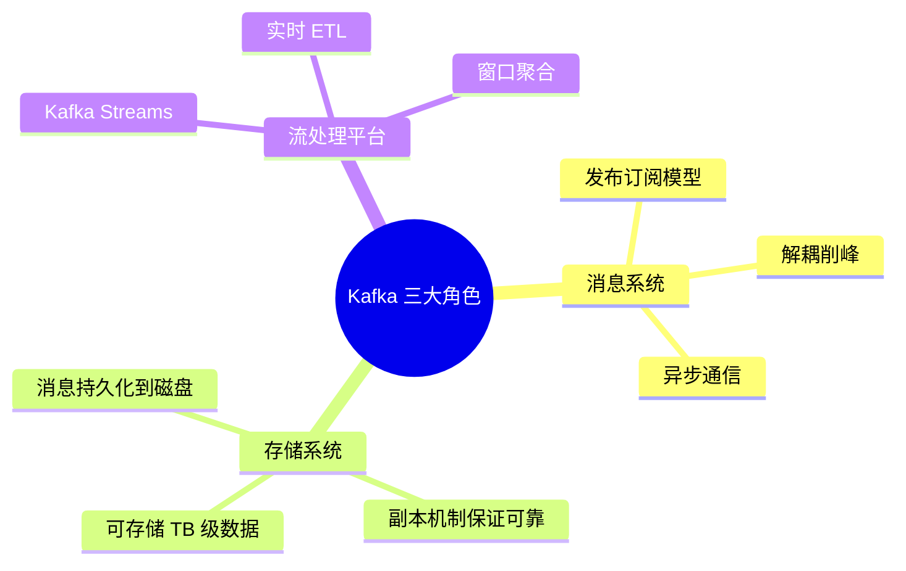
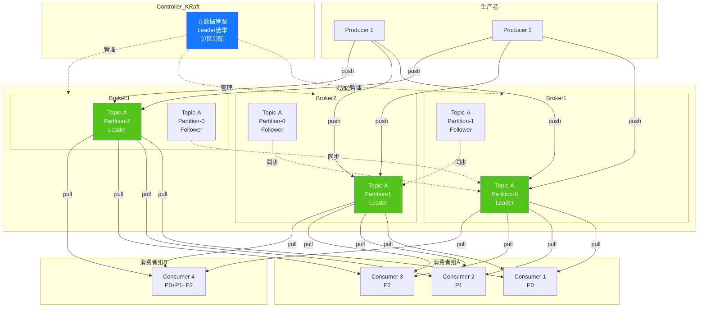
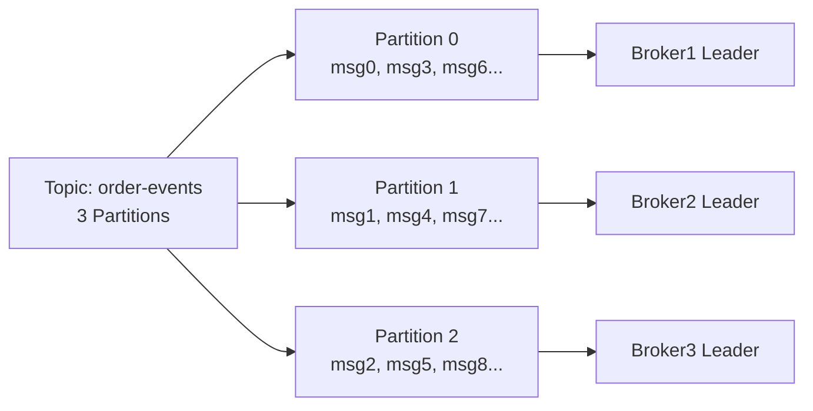
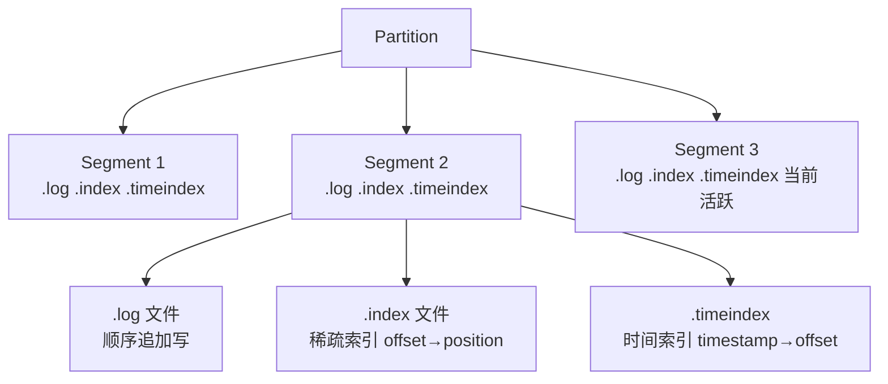
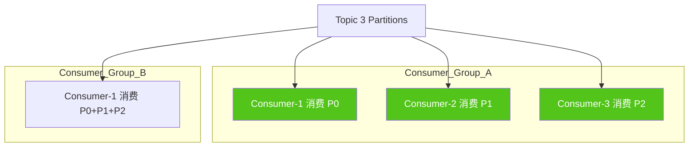
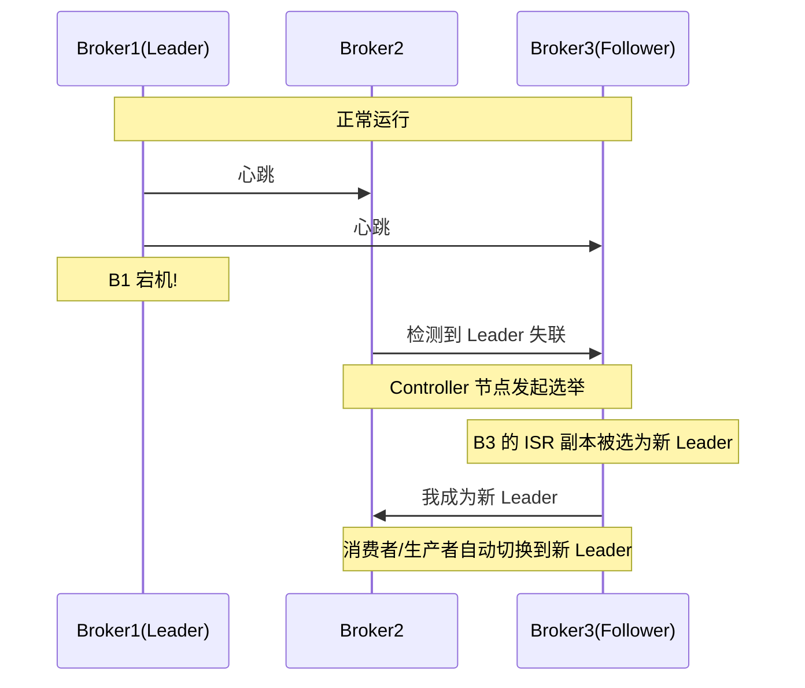
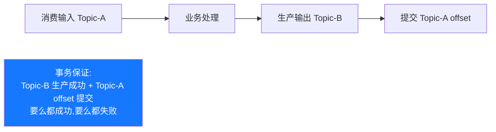
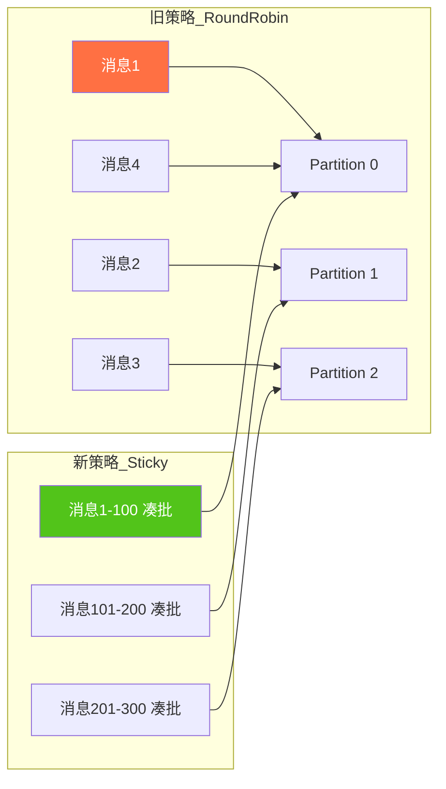
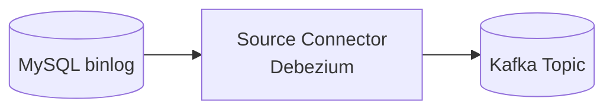
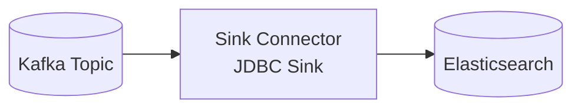

# Kafka 技术完全指南：核心概念·架构原理·安装配置·Java 客户端·高级特性·性能优化

> **文档定位**:本文是 Kafka 的**系统性学习与工程实践参考文档**,面向具备 Java 基础的开发人员(初中高级均适用),从核心概念到架构原理、从安装配置到 Java 客户端开发、从基础用法到高级特性与性能优化,全面覆盖 Kafka 在 Java 项目中的完整知识体系。内容编排遵循**由浅入深、理论结合实践**的原则,每个知识点均配套配置样例与可运行代码,确保读者既能理解原理又能落地工程。
>
> **关联文档**(建议一并阅读):
> - [Java 项目工程化方案](./Java项目工程化方案.md) — Java 项目工程化基线
> - [Spring-Boot 全面详解](./spring-boot/Spring-Boot全面详解_核心概念架构自动配置场景应用测试部署.md) — Spring Boot 集成基础
> - [Java 多线程与并发基础详解](./基本语法/Java多线程与并发基础详解.md) — 消费者并发基础
> - [Redis 技术完全指南](./Redis技术完全指南_核心原理数据结构高可用Java集成分布式应用性能优化.md) — 常搭配的缓存方案
> - [Maven 项目构建与依赖管理](./Maven项目构建与依赖管理工程实践详解.md) — 依赖管理基础
>
> **版本基线**:本文以 **Kafka 3.6.x / KRaft 模式** 为基线(兼容 3.x),Java 客户端以 **Kafka Client 3.6.x / Spring Kafka 3.1.x** 为基线(JDK 17+,兼容 JDK 11)。

---

## 目录

- [一、Kafka 核心概念与特性](#一kafka-核心概念与特性)
  - [1.1 Kafka 是什么](#11-kafka-是什么)
  - [1.2 Kafka 核心特性](#12-kafka-核心特性)
  - [1.3 典型应用场景](#13-典型应用场景)
  - [1.4 与其他消息队列的对比](#14-与其他消息队列的对比)
- [二、架构原理](#二架构原理)
  - [2.1 整体架构](#21-整体架构)
  - [2.2 主题与分区](#22-主题与分区)
  - [2.3 副本机制](#23-副本机制)
  - [2.4 存储机制](#24-存储机制)
  - [2.5 消费者组与 Rebalance](#25-消费者组与-rebalance)
  - [2.6 Leader 选举与故障恢复](#26-leader-选举与故障恢复)
  - [2.7 投递语义](#27-投递语义)
- [三、安装与配置指南](#三安装与配置指南)
  - [3.1 环境要求](#31-环境要求)
  - [3.2 Docker 安装(开发推荐)](#32-docker-安装开发推荐)
  - [3.3 Linux 集群安装(生产推荐)](#33-linux-集群安装生产推荐)
  - [3.4 KRaft 模式配置](#34-kraft-模式配置)
  - [3.5 核心配置参数详解](#35-核心配置参数详解)
  - [3.6 服务启停](#36-服务启停)
- [四、基本操作命令](#四基本操作命令)
  - [4.1 主题管理](#41-主题管理)
  - [4.2 生产者命令](#42-生产者命令)
  - [4.3 消费者命令](#43-消费者命令)
  - [4.4 消费者组管理](#44-消费者组管理)
  - [4.5 集群管理](#45-集群管理)
- [五、Java 客户端开发指南](#五java-客户端开发指南)
  - [5.1 Maven 依赖与环境要求](#51-maven-依赖与环境要求)
  - [5.2 生产者开发](#52-生产者开发)
  - [5.3 消费者开发](#53-消费者开发)
  - [5.4 序列化与反序列化](#54-序列化与反序列化)
  - [5.5 Spring Boot 集成](#55-spring-boot-集成)
- [六、高级特性](#六高级特性)
  - [6.1 事务与精确一次语义](#61-事务与精确一次语义)
  - [6.2 消息压缩](#62-消息压缩)
  - [6.3 分区策略](#63-分区策略)
  - [6.4 Kafka Streams](#64-kafka-streams)
  - [6.5 Kafka Connect](#65-kafka-connect)
- [七、性能优化](#七性能优化)
  - [7.1 生产者优化](#71-生产者优化)
  - [7.2 消费者优化](#72-消费者优化)
  - [7.3 Broker 优化](#73-broker-优化)
  - [7.4 主题与分区设计](#74-主题与分区设计)
- [八、监控与运维](#八监控与运维)
  - [8.1 JMX 指标](#81-jmx-指标)
  - [8.2 命令行工具](#82-命令行工具)
  - [8.3 常见运维操作](#83-常见运维操作)
- [九、常见问题与解决方案](#九常见问题与解决方案)
  - [9.1 消息丢失问题](#91-消息丢失问题)
  - [9.2 消息重复消费](#92-消息重复消费)
  - [9.3 消息积压](#93-消息积压)
  - [9.4 消费者频繁 Rebalance](#94-消费者频繁-rebalance)
  - [9.5 常见错误与排查](#95-常见错误与排查)
- [十、面试高频考点速查](#十面试高频考点速查)

---

## 一、Kafka 核心概念与特性

### 1.1 Kafka 是什么

**Kafka** 是 LinkedIn 开源的**分布式流处理平台**(Distributed Streaming Platform),后捐赠给 Apache 基金会,成为顶级项目。它本质上是一个**分布式、分区、多副本的提交日志**(commit log)系统,以**高吞吐、低延迟、可水平扩展**为核心设计目标。

Kafka 定位为三大角色:



### 1.2 Kafka 核心特性

| 特性 | 说明 | 量化指标 |
|-----|------|---------|
| **高吞吐** | 单机百万级 QPS,顺序写磁盘 | 普通 8 核 16GB 机器可达 100W+ msg/s |
| **低延迟** | 消息生产到消费毫秒级 | Producer `acks=1` 时延迟 <5ms |
| **可扩展** | 横向扩展 Broker 与分区 | 单集群支持千级 Broker、万级分区 |
| **持久化** | 消息存磁盘,可保留数天至永久 | 按策略自动清理(retention.ms/size) |
| **高可用** | 副本机制 + 自动故障转移 | RF=3 时容忍 1 个节点宕机 |
| **顺序保证** | 单分区内消息严格有序 | 同 Key 消息进同分区 = 有序消费 |
| **精确一次** | 事务 + 幂等生产 | EOS(Exactly-Once Semantics) |

### 1.3 典型应用场景

| 场景 | 说明 | 示例 |
|-----|------|------|
| **异步解耦** | 上游不依赖下游处理结果 | 订单系统发消息给物流/积分/通知系统 |
| **削峰填谷** | 应对突发流量 | 秒杀场景消息先入 Kafka,后端按消费能力消费 |
| **日志收集** | 统一日志通道 | 各服务日志 → Kafka → ES/HDFS |
| **流处理** | 实时 ETL / 聚合 | 用户行为流 → 实时大屏 |
| **事件溯源** | 事件驱动架构(EDA) | 领域事件存 Kafka,服务订阅 |
| **CDC 数据同步** | 数据库变更捕获 | MySQL binlog → Kafka → 多下游 |

### 1.4 与其他消息队列的对比

| 特性 | Kafka | RabbitMQ | RocketMQ | Pulsar |
|-----|:-----:|:--------:|:--------:|:------:|
| **吞吐量** | ⭐⭐⭐⭐⭐ | ⭐⭐ | ⭐⭐⭐⭐ | ⭐⭐⭐⭐⭐ |
| **延迟** | ms 级 | μs 级 | ms 级 | ms 级 |
| **顺序性** | 分区内有序 | 队列内有序 | 分区内有序 | 分区内有序 |
| **事务** | 支持 | 弱 | 强 | 强 |
| **生态** | ⭐⭐⭐⭐⭐ | ⭐⭐⭐⭐ | ⭐⭐⭐ | ⭐⭐⭐ |
| **适用场景** | 日志/流处理 | 业务消息 | 金融业务 | 云原生多租户 |

---

## 二、架构原理

### 2.1 整体架构



**核心组件说明**:

| 组件 | 说明 |
|-----|------|
| **Broker** | Kafka 服务节点,多个 Broker 组成集群 |
| **Topic** | 逻辑消息分类,类似数据库表 |
| **Partition** | Topic 的物理分片,水平扩展与并行消费的单元 |
| **Replica** | 分区副本,Leader 处理读写,Follower 同步 |
| **Producer** | 消息生产者,推送到 Broker |
| **Consumer** | 消息消费者,从 Broker 拉取 |
| **Consumer Group** | 消费者组,组内分区分摊消费 |
| **Controller** | 集群管理节点,管理 Leader 选举、分区分配 |
| **Offset** | 消息在分区内的唯一标识,消费进度 |

### 2.2 主题与分区

**Topic** 是逻辑概念,通过**多 Partition** 实现水平扩展:



**关键特性**:
- **分区数决定并发度**:一个 Consumer Group 内最多 `partition_count` 个消费者能并发消费
- **同 Key 进同分区**:Key 相同的消息一定进同一分区,保证**局部有序**
- **分区不可变**:分区数只能增加,不能减少(减少会丢失数据)

### 2.3 副本机制

每个 Partition 配置 N 个副本(Replication Factor),其中 1 个 Leader + (N-1) Follower:

```mermaid
flowchart LR
    subgraph Partition-0 副本_RF=3
        L0[Broker1<br/>Leader ✅ 读写] --> F0a[Broker2<br/>Follower 同步]
        L0 --> F0b[Broker3<br/>Follower 同步]
    end
    
    P[Producer 写] --> L0
    C[Consumer 读] --> L0
```

**ISR(In-Sync Replicas)**:与 Leader 保持同步的副本集合,只有 ISR 中的副本才有资格被选为新 Leader。

**HW(High Watermark)高水位**:消费者只能消费到 HW 之前的消息,保证**已提交消息不丢**。

**LEO(Log End Offset)**:每个副本的最后一消息 offset,HW = min(ISR 中所有副本的 LEO)。

### 2.4 存储机制

Kafka 的存储是基于**追加写日志 + 分段索引**的设计,这是其高吞吐的根因:



**高效存储的核心**:
1. **顺序写磁盘**:比随机写内存还快(6 顺序 IOPS ≈ 100 随机 IOPS)
2. **Page Cache**:依赖 OS 的页缓存,Kafka 进程不持有堆内存缓存
3. **零拷贝 sendfile**:Broker 把文件直接从 Page Cache 传到网卡,不经用户空间
4. **稀疏索引**:每个 Segment 维护稀疏索引,二分查找快速定位消息
5. **分段清理**:按时间或大小滚动新 Segment,旧 Segment 可整体删除

### 2.5 消费者组与 Rebalance

**Consumer Group** 是 Kafka 实现**发布订阅 + 队列**两种模型的核心:



**Rebalance 触发条件**:
1. 消费者加入/退出 Group
2. 订阅的 Topic 列表变化
3. 订阅的 Topic 分区数变化

**Rebalance 协议**:3 种分区分配策略

| 策略 | 类名 | 特点 |
|-----|------|------|
| **Range** | `RangeAssignor` | 默认,按 Topic 维度连续划分 |
| **RoundRobin** | `RoundRobinAssignor` | 跨 Topic 轮询分配 |
| **StickyAssignor** | `StickyAssignor` | 粘性,尽量保持原分配,减少迁移 |
| **CooperativeSticky** | `CooperativeStickyAssignor` | 增量协同重平衡(Kafka 2.4+),不停止消费 |

### 2.6 Leader 选举与故障恢复

**KRaft 模式**(Kafka 3.3+ 生产可用,替代 ZooKeeper):



**选举核心规则**:
1. **ISR 优先**:只有 ISR 中的副本能成为新 Leader
2. **第一个存活**:ISR 中按字典序第一个存活的副本当选
3. **unclean.leader.election.enable**:若 ISR 为空,是否允许非 ISR 副本当 Leader(默认 false,**强烈建议 false** 否则会丢数据)

### 2.7 投递语义

| 语义 | Producer 设置 | Consumer 设置 | 适用场景 |
|-----|:------------|:-------------|:--------|
| **At Most Once 至多一次** | `acks=0` | 自动提交 offset(可能丢) | 日志采集(可丢) |
| **At Least Once 至少一次**(默认) | `acks=1/all` | 手动提交 offset(可能重复) | 99% 业务场景 |
| **Exactly Once 精确一次** | 事务 + 幂等 | 事务消费 + 手动提交 | 金融、计费 |

---

## 三、安装与配置指南

### 3.1 环境要求

| 组件 | 要求 |
|-----|------|
| **JDK** | 11 或 17(Kafka 3.x 必需 JDK 11+,推荐 17) |
| **操作系统** | Linux 生产推荐(Windows 仅开发测试) |
| **内存** | Broker ≥ 6GB,推荐 16GB+ |
| **磁盘** | SSD/NVMe,多盘优于单盘(可配 `log.dirs` 多目录) |
| **网络** | 千兆及以上,低延迟(Broker 间复制 + 客户端) |
| **文件描述符** | ≥ 100000(`ulimit -n`) |

### 3.2 Docker 安装(开发推荐)

**单节点 KRaft 模式**(Kafka 3.3+ 不再需要 ZooKeeper):

```yaml
# docker-compose.yml
version: '3.8'
services:
  kafka:
    image: bitnami/kafka:3.6
    container_name: kafka-dev
    ports:
      - "9092:9092"           # 客户端访问
      - "9094:9094"           # Controller 内部
    environment:
      # KRaft 模式配置
      KAFKA_CFG_NODE_ID: 1
      KAFKA_CFG_PROCESS_ROLES: controller,broker
      KAFKA_CFG_CONTROLLER_QUORUM_VOTERS: 1@kafka:9093
      KAFKA_CFG_LISTENERS: PLAINTEXT://:9092,CONTROLLER://:9093
      KAFKA_CFG_ADVERTISED_LISTENERS: PLAINTEXT://localhost:9092
      KAFKA_CFG_LISTENER_SECURITY_PROTOCOL_MAP: CONTROLLER:PLAINTEXT,PLAINTEXT:PLAINTEXT
      KAFKA_CFG_CONTROLLER_LISTENER_NAMES: CONTROLLER
      KAFKA_CFG_INTER_BROKER_LISTENER_NAME: PLAINTEXT
      # 主题配置
      KAFKA_CFG_AUTO_CREATE_TOPICS_ENABLE: "true"
      KAFKA_CFG_NUM_PARTITIONS: "3"
      KAFKA_CFG_DEFAULT_REPLICATION_FACTOR: "1"
    volumes:
      - kafka_data:/bitnami/kafka

volumes:
  kafka_data:
```

启动:

```bash
docker-compose up -d
docker-compose logs -f kafka
```

### 3.3 Linux 集群安装(生产推荐)

**Step1: 准备 3 台机器**(`192.168.1.101/102/103`),安装 JDK 17:

```bash
# 三台机器均执行
apt update && apt install -y openjdk-17-jdk
java -version
# 确保输出: openjdk version "17.0.x"
```

**Step2: 下载并解压 Kafka**:

```bash
# 三台机器均执行
cd /opt
wget https://archive.apache.org/dist/kafka/3.6.1/kafka_2.13-3.6.1.tgz
tar -xzf kafka_2.13-3.6.1.tgz
ln -s kafka_2.13-3.6.1 kafka
mkdir -p /data/kafka-logs
```

**Step3: 配置 `server.properties`**(每台机器修改 `node.id` 和 `host.name`):

```properties
# /opt/kafka/config/kraft/server.properties

# ============ 基础配置 ============
node.id=1                                          # 每台不同(1/2/3)
process.roles=broker,controller                    # KRaft 模式
controller.quorum.voters=1@192.168.1.101:9093,2@192.168.1.102:9093,3@192.168.1.103:9093
listeners=PLAINTEXT://:9092,CONTROLLER://:9093
advertised.listeners=PLAINTEXT://192.168.1.101:9092  # 每台改成本机 IP
controller.listener.names=CONTROLLER
inter.broker.listener.name=PLAINTEXT

# ============ 存储配置 ============
log.dirs=/data/kafka-logs
num.network.threads=8
num.io.threads=16
socket.send.buffer.bytes=102400
socket.receive.buffer.bytes=102400
log.retention.hours=168                            # 数据保留 7 天
log.retention.bytes=10737418240                    # 单分区最大 10GB
log.segment.bytes=1073741824                       # 单段 1GB
log.segment.ms=604800000                           # 单段最长 7 天
log.cleanup.policy=delete                          # 清理策略:delete / compact

# ============ 主题默认配置 ============
num.partitions=3
default.replication.factor=3
min.insync.replicas=2                              # 至少 2 副本同步成功
auto.create.topics.enable=false                    # 生产关闭自动创建

# ============ 性能与稳定性 ============
message.max.bytes=1048576                          # 单条最大 1MB
replica.fetch.max.bytes=1048576
group.initial.rebalance.delay.ms=3000              # 首次 rebalance 延迟,聚合成员
offsets.topic.replication.factor=3
transaction.state.log.replication.factor=3
transaction.state.log.min.isr=2
```

**Step4: 生成集群 UUID 并格式化存储**(任选一台):

```bash
# 生成 Cluster UUID
KAFKA_CLUSTER_ID="$(/opt/kafka/bin/kafka-storage.sh random-uuid)"
echo $KAFKA_CLUSTER_ID   # 记录此值,所有机器相同

# 三台机器均执行(用相同的 UUID)
/opt/kafka/bin/kafka-storage.sh format \
  --cluster-id $KAFKA_CLUSTER_ID \
  --config /opt/kafka/config/kraft/server.properties
```

### 3.4 KRaft 模式配置

**KRaft 与 ZooKeeper 模式对比**:

| 维度 | ZooKeeper 模式(旧) | KRaft 模式(新,推荐) |
|-----|:-----------------:|:------------------:|
| **元数据存储** | ZooKeeper 集群 | Kafka 内部 Topic(`__cluster_metadata`) |
| **组件数** | ZK + Kafka | 仅 Kafka |
| **元数据上限** | 数十万分区有性能瓶颈 | 支持百万级分区 |
| **故障切换时间** | 几秒到几十秒 | 几秒 |
| **运维复杂度** | 高(需维护 ZK) | 低 |
| **生产可用版本** | Kafka 0.x+ | Kafka 3.3+ |

### 3.5 核心配置参数详解

**Broker 核心参数**:

| 参数 | 默认 | 推荐值 | 说明 |
|-----|:----:|:-----:|------|
| `log.dirs` | /tmp | /data/kafka-logs | 数据目录,多盘用逗号分隔 |
| `num.network.threads` | 3 | 8 | 网络线程 |
| `num.io.threads` | 8 | 16 | IO 线程 |
| `log.retention.hours` | 168 | 168 | 数据保留小时数 |
| `auto.create.topics.enable` | true | false | 生产关闭 |
| `num.partitions` | 1 | 3-12 | 新 Topic 默认分区数 |
| `default.replication.factor` | 1 | 3 | 新 Topic 默认副本数 |
| `min.insync.replicas` | 1 | 2 | 最少同步副本(配合 acks=all) |
| `unclean.leader.election.enable` | false | false | 严禁 true(会丢数据) |
| `log.segment.bytes` | 1GB | 1GB | 段文件大小 |

**Topic 核心参数**:

| 参数 | 说明 | 示例 |
|-----|------|------|
| `cleanup.policy` | 清理策略 delete/compact | `delete`(普通消息) / `compact`(KV 状态) |
| `retention.ms` | 保留时长(ms) | `604800000`(7 天) |
| `max.message.bytes` | 单条最大字节 | `1048576`(1MB) |
| `compression.type` | 压缩算法 | `producer`(跟随生产者) |

### 3.6 服务启停

```bash
# 启动(三台机器均执行)
/opt/kafka/bin/kafka-server-start.sh \
  -daemon /opt/kafka/config/kraft/server.properties

# 停止
/opt/kafka/bin/kafka-server-stop.sh

# 验证启动
jps
# 输出应包含: Kafka
```

---

## 四、基本操作命令

> 以下命令默认在 `/opt/kafka/bin/` 目录下执行,且 `--bootstrap-server` 指向任一 Broker。

### 4.1 主题管理

```bash
# 创建 Topic(3 分区,3 副本)
kafka-topics.sh --bootstrap-server localhost:9092 \
  --create --topic order-events \
  --partitions 3 \
  --replication-factor 3 \
  --config cleanup.policy=delete \
  --config retention.ms=604800000

# 查看 Topic 列表
kafka-topics.sh --bootstrap-server localhost:9092 --list

# 查看 Topic 详情
kafka-topics.sh --bootstrap-server localhost:9092 \
  --describe --topic order-events

# 查看 Topic 配置
kafka-configs.sh --bootstrap-server localhost:9092 \
  --describe --topic order-events

# 增加分区(只能增加)
kafka-topics.sh --bootstrap-server localhost:9092 \
  --alter --topic order-events --partitions 6

# 修改 Topic 配置
kafka-configs.sh --bootstrap-server localhost:9092 \
  --alter --topic order-events \
  --add-config retention.ms=259200000

# 删除 Topic(需 delete.topic.enable=true)
kafka-topics.sh --bootstrap-server localhost:9092 \
  --delete --topic order-events
```

### 4.2 生产者命令

```bash
# 控制台生产者(键盘输入每行一条消息)
kafka-console-producer.sh --bootstrap-server localhost:9092 \
  --topic order-events

# 带 Key(用 tab 分隔 Key 和 Value)
kafka-console-producer.sh --bootstrap-server localhost:9092 \
  --topic order-events \
  --property "key.separator=-" \
  --property "parse.key=true"

# 从文件读取
kafka-console-producer.sh --bootstrap-server localhost:9092 \
  --topic order-events < messages.txt

# 带 ACK 配置
kafka-console-producer.sh --bootstrap-server localhost:9092 \
  --topic order-events \
  --producer-property acks=all \
  --producer-property compression.type=lz4
```

### 4.3 消费者命令

```bash
# 控制台消费者(默认从最新 offset 开始)
kafka-console-consumer.sh --bootstrap-server localhost:9092 \
  --topic order-events

# 从最早开始消费
kafka-console-consumer.sh --bootstrap-server localhost:9092 \
  --topic order-events --from-beginning

# 指定消费者组
kafka-console-consumer.sh --bootstrap-server localhost:9092 \
  --topic order-events --group order-consumer-group

# 打印 Key
kafka-console-consumer.sh --bootstrap-server localhost:9092 \
  --topic order-events \
  --property print.key=true \
  --property key.separator="|"

# 限制消费条数
kafka-console-consumer.sh --bootstrap-server localhost:9092 \
  --topic order-events --max-messages 10
```

### 4.4 消费者组管理

```bash
# 查看所有消费者组
kafka-consumer-groups.sh --bootstrap-server localhost:9092 --list

# 查看消费者组详情(看每个分区的消费进度)
kafka-consumer-groups.sh --bootstrap-server localhost:9092 \
  --describe --group order-consumer-group

# 输出示例:
# GROUP                  TOPIC            PARTITION  CURRENT-OFFSET  LOG-END-OFFSET  LAG  CONSUMER-ID
# order-consumer-group   order-events     0          1000            1500            500  consumer-1
# order-consumer-group   order-events     1          1200            1200            0    consumer-2

# 重置 offset 到最早
kafka-consumer-groups.sh --bootstrap-server localhost:9092 \
  --group order-consumer-group \
  --topic order-events \
  --reset-offsets --to-earliest --execute

# 重置 offset 到最新
kafka-consumer-groups.sh --bootstrap-server localhost:9092 \
  --group order-consumer-group \
  --topic order-events \
  --reset-offsets --to-latest --execute

# 重置 offset 到指定位置
kafka-consumer-groups.sh --bootstrap-server localhost:9092 \
  --group order-consumer-group \
  --topic order-events:0:1000,order-events:1:2000 \
  --reset-offsets --to-offsets --execute

# 重置 offset 到指定时间
kafka-consumer-groups.sh --bootstrap-server localhost:9092 \
  --group order-consumer-group \
  --topic order-events \
  --reset-offsets --to-datetime 2026-08-01T00:00:00.000 --execute

# 删除消费者组
kafka-consumer-groups.sh --bootstrap-server localhost:9092 \
  --delete --group order-consumer-group
```

### 4.5 集群管理

```bash
# 查看集群元数据
kafka-metadata-quorum.sh --bootstrap-server localhost:9092 \
  describe --status

# 查看 Broker 列表
kafka-broker-api-versions.sh --bootstrap-server localhost:9092

# 查看 Controller 节点
kafka-metadata-quorum.sh --bootstrap-server localhost:9092 \
  describe --status

# 查看指定 Partition 的 Leader 和 ISR
kafka-topics.sh --bootstrap-server localhost:9092 \
  --describe --topic order-events --under-replicated-partitions

# 查看未同步的分区
kafka-topics.sh --bootstrap-server localhost:9092 \
  --describe --under-replicated-partitions

# 查看 Leader 不可用的分区
kafka-topics.sh --bootstrap-server localhost:9092 \
  --describe --unavailable-partitions
```

---

## 五、Java 客户端开发指南

### 5.1 Maven 依赖与环境要求

**环境要求**:
- JDK 11+(推荐 17)
- Kafka Client 3.6.x
- Maven 3.6+

**pom.xml 依赖**:

```xml
<dependencies>
    <!-- Kafka 客户端 -->
    <dependency>
        <groupId>org.apache.kafka</groupId>
        <artifactId>kafka-clients</artifactId>
        <version>3.6.1</version>
    </dependency>

    <!-- JSON 序列化(用于复杂对象) -->
    <dependency>
        <groupId>com.fasterxml.jackson.core</groupId>
        <artifactId>jackson-databind</artifactId>
        <version>2.16.0</version>
    </dependency>

    <!-- 日志 -->
    <dependency>
        <groupId>org.slf4j</groupId>
        <artifactId>slf4j-simple</artifactId>
        <version>2.0.9</version>
    </dependency>
</dependencies>
```

### 5.2 生产者开发

#### 5.2.1 基础生产者示例

```java
import org.apache.kafka.clients.producer.*;
import org.apache.kafka.common.serialization.StringSerializer;
import java.util.Properties;
import java.util.concurrent.ExecutionException;
import java.util.concurrent.Future;

public class SimpleProducer {

    private static final String BOOTSTRAP_SERVERS = "localhost:9092";
    private static final String TOPIC = "order-events";

    public static void main(String[] args) {
        // 1. 配置生产者
        Properties props = new Properties();
        props.put(ProducerConfig.BOOTSTRAP_SERVERS_CONFIG, BOOTSTRAP_SERVERS);
        props.put(ProducerConfig.KEY_SERIALIZER_CLASS_CONFIG, StringSerializer.class.getName());
        props.put(ProducerConfig.VALUE_SERIALIZER_CLASS_CONFIG, StringSerializer.class.getName());
        // 可靠性配置(生产推荐)
        props.put(ProducerConfig.ACKS_CONFIG, "all");                 // 等所有 ISR 确认
        props.put(ProducerConfig.ENABLE_IDEMPOTENCE_CONFIG, true);    // 幂等生产,防重
        props.put(ProducerConfig.RETRIES_CONFIG, 3);                   // 失败重试 3 次
        props.put(ProducerConfig.MAX_IN_FLIGHT_REQUESTS_PER_CONNECTION, 5);  // 幂等场景 ≤5
        // 性能配置
        props.put(ProducerConfig.BATCH_SIZE_CONFIG, 16384);           // 16KB 批次
        props.put(ProducerConfig.LINGER_MS_CONFIG, 5);                // 等 5ms 凑批
        props.put(ProducerConfig.BUFFER_MEMORY_CONFIG, 33554432);     // 32MB 缓冲
        props.put(ProducerConfig.COMPRESSION_TYPE_CONFIG, "lz4");     // LZ4 压缩

        // 2. 创建生产者(try-with-resources 保证关闭)
        try (KafkaProducer<String, String> producer = new KafkaProducer<>(props)) {
            // 3. 发送消息(三种方式)

            // 方式 A: fire-and-forget(不关心结果)
            producer.send(new ProducerRecord<>(TOPIC, "order-001",
                    "{\"orderId\":\"order-001\",\"amount\":99.5}"));

            // 方式 B: 同步发送(阻塞等待结果)
            Future<RecordMetadata> future = producer.send(
                new ProducerRecord<>(TOPIC, "order-002", "{\"orderId\":\"order-002\"}"));
            try {
                RecordMetadata metadata = future.get();   // 阻塞
                System.out.printf("同步发送成功: topic=%s partition=%d offset=%d%n",
                        metadata.topic(), metadata.partition(), metadata.offset());
            } catch (InterruptedException | ExecutionException e) {
                e.printStackTrace();
            }

            // 方式 C: 异步回调(推荐,性能与可靠性平衡)
            producer.send(new ProducerRecord<>(TOPIC, "order-003",
                    "{\"orderId\":\"order-003\",\"amount\":199.0}"), new Callback() {
                @Override
                public void onCompletion(RecordMetadata metadata, Exception exception) {
                    if (exception != null) {
                        System.err.println("发送失败: " + exception.getMessage());
                        exception.printStackTrace();
                    } else {
                        System.out.printf("异步发送成功: topic=%s partition=%d offset=%d%n",
                                metadata.topic(), metadata.partition(), metadata.offset());
                    }
                }
            });

            // 4. 刷新并关闭
            producer.flush();   // 触发所有未发送的批次
        }
        // producer.close() 自动调用
    }
}
```

#### 5.2.2 自定义分区器

```java
import org.apache.kafka.clients.producer.Partitioner;
import org.apache.kafka.common.Cluster;
import org.apache.kafka.common.PartitionInfo;
import java.util.List;
import java.util.Map;

public class OrderPartitioner implements Partitioner {

    @Override
    public int partition(String topic, Object key, byte[] keyBytes,
                         Object value, byte[] valueBytes, Cluster cluster) {
        List<PartitionInfo> partitions = cluster.partitionsForTopic(topic);
        int numPartitions = partitions.size();

        if (key == null) {
            // 无 Key: 轮询
            return (int) (System.currentTimeMillis() % numPartitions);
        }

        // 有 Key: 按 Key hashCode
        // 但订单 ID 末位如果是 VIP(末尾为 9),进专属分区
        String keyStr = key.toString();
        if (keyStr.endsWith("9")) {
            return numPartitions - 1;   // 最后一个分区给 VIP
        }

        // 普通 Key 按 hash
        return Math.abs(key.hashCode()) % numPartitions;
    }

    @Override
    public void close() {}

    @Override
    public void configure(Map<String, ?> configs) {}
}

// 使用:在 Producer 配置中加
// props.put(ProducerConfig.PARTITIONER_CLASS_CONFIG, OrderPartitioner.class.getName());
```

### 5.3 消费者开发

#### 5.3.1 基础消费者示例

```java
import org.apache.kafka.clients.consumer.*;
import org.apache.kafka.common.serialization.StringDeserializer;
import java.time.Duration;
import java.util.Collections;
import java.util.Properties;

public class SimpleConsumer {

    private static final String BOOTSTRAP_SERVERS = "localhost:9092";
    private static final String TOPIC = "order-events";
    private static final String GROUP_ID = "order-consumer-group";

    public static void main(String[] args) {
        // 1. 配置消费者
        Properties props = new Properties();
        props.put(ConsumerConfig.BOOTSTRAP_SERVERS_CONFIG, BOOTSTRAP_SERVERS);
        props.put(ConsumerConfig.KEY_DESERIALIZER_CLASS_CONFIG, StringDeserializer.class.getName());
        props.put(ConsumerConfig.VALUE_DESERIALIZER_CLASS_CONFIG, StringDeserializer.class.getName());
        props.put(ConsumerConfig.GROUP_ID_CONFIG, GROUP_ID);
        // 消费位置
        props.put(ConsumerConfig.AUTO_OFFSET_RESET_CONFIG, "earliest");  // 无 offset 时从头开始
        // 手动提交 offset(推荐)
        props.put(ConsumerConfig.ENABLE_AUTO_COMMIT_CONFIG, false);
        // props.put(ConsumerConfig.AUTO_COMMIT_INTERVAL_MS_CONFIG, 5000);  // 自动提交间隔
        // 性能配置
        props.put(ConsumerConfig.FETCH_MIN_BYTES_CONFIG, 1024);          // 最少 1KB
        props.put(ConsumerConfig.FETCH_MAX_WAIT_MS_CONFIG, 500);         // 最多等 500ms
        props.put(ConsumerConfig.MAX_POLL_RECORDS_CONFIG, 500);           // 单次拉取 500 条
        props.put(ConsumerConfig.MAX_POLL_INTERVAL_MS_CONFIG, 300000);    // 处理超时 5 分钟
        props.put(ConsumerConfig.SESSION_TIMEOUT_MS_CONFIG, 30000);      // 心跳超时
        props.put(ConsumerConfig.HEARTBEAT_INTERVAL_MS_CONFIG, 10000);   // 心跳间隔

        // 2. 创建消费者
        try (KafkaConsumer<String, String> consumer = new KafkaConsumer<>(props)) {
            // 3. 订阅主题
            consumer.subscribe(Collections.singletonList(TOPIC));

            // 4. 消费循环
            while (true) {
                // 拉取消息(超时 1 秒)
                ConsumerRecords<String, String> records = consumer.poll(Duration.ofSeconds(1));

                // 5. 处理每条消息
                for (ConsumerRecord<String, String> record : records) {
                    try {
                        // 业务处理
                        System.out.printf("消费: partition=%d offset=%d key=%s value=%s%n",
                                record.partition(), record.offset(), record.key(), record.value());
                        // 模拟业务处理
                        processOrder(record.value());
                    } catch (Exception e) {
                        // 单条失败不影响整批,记录日志后继续
                        System.err.println("处理失败: " + e.getMessage());
                        // 可发到死信队列
                    }
                }

                // 6. 手动提交 offset(同步,处理完一批再提交)
                if (!records.isEmpty()) {
                    consumer.commitSync();
                    // 或异步提交(性能更好,但失败可能重复)
                    // consumer.commitAsync((offsets, exception) -> {
                    //     if (exception != null) exception.printStackTrace();
                    // });
                }
            }
        }
    }

    private static void processOrder(String value) {
        // 实际业务逻辑:解析 JSON、写库、调下游服务等
    }
}
```

#### 5.3.2 按分区提交 Offset(更精细)

```java
// 按 partition 提交,某个分区处理失败不影响其他分区
for (TopicPartition partition : records.partitions()) {
    List<ConsumerRecord<String, String>> partitionRecords = records.records(partition);
    long lastOffset = -1;
    for (ConsumerRecord<String, String> record : partitionRecords) {
        try {
            processOrder(record.value());
            lastOffset = record.offset();
        } catch (Exception e) {
            // 处理失败:跳过该分区后续消息,等其他分区处理完再提交
            break;
        }
    }
    if (lastOffset >= 0) {
        // 提交该分区到 lastOffset+1(下一条消费位置)
        Map<TopicPartition, OffsetAndMetadata> offsets = new HashMap<>();
        offsets.put(partition, new OffsetAndMetadata(lastOffset + 1));
        consumer.commitSync(offsets);
    }
}
```

### 5.4 序列化与反序列化

#### 5.4.1 JSON 序列化器

```java
import com.fasterxml.jackson.databind.ObjectMapper;
import org.apache.kafka.common.errors.SerializationException;
import org.apache.kafka.common.serialization.Serializer;

public class JsonSerializer<T> implements Serializer<T> {
    private final ObjectMapper objectMapper = new ObjectMapper();

    @Override
    public byte[] serialize(String topic, T data) {
        if (data == null) return null;
        try {
            return objectMapper.writeValueAsBytes(data);
        } catch (Exception e) {
            throw new SerializationException("JSON 序列化失败: " + e.getMessage(), e);
        }
    }
}
```

#### 5.4.2 JSON 反序列化器

```java
import com.fasterxml.jackson.databind.ObjectMapper;
import org.apache.kafka.common.errors.SerializationException;
import org.apache.kafka.common.serialization.Deserializer;

public class JsonDeserializer<T> implements Deserializer<T> {
    private final ObjectMapper objectMapper = new ObjectMapper();
    private final Class<T> targetClass;

    public JsonDeserializer(Class<T> targetClass) {
        this.targetClass = targetClass;
    }

    @Override
    public T deserialize(String topic, byte[] data) {
        if (data == null) return null;
        try {
            return objectMapper.readValue(data, targetClass);
        } catch (Exception e) {
            throw new SerializationException("JSON 反序列化失败: " + e.getMessage(), e);
        }
    }
}
```

#### 5.4.3 使用 JSON 序列化的完整示例

```java
// 业务对象
public class OrderEvent {
    private String orderId;
    private String userId;
    private double amount;
    private long timestamp;
    // 构造器、getter、setter 略
}

// Producer 配置
props.put(ProducerConfig.VALUE_SERIALIZER_CLASS_CONFIG, JsonSerializer.class.getName());
producer.send(new ProducerRecord<>(TOPIC, order.getOrderId(), order));

// Consumer 配置
props.put(ConsumerConfig.VALUE_DESERIALIZER_CLASS_CONFIG, JsonDeserializer.class.getName());
// 注意:需要传递 Class 给 JsonDeserializer,通常通过参数配置或自定义 Configurer
```

### 5.5 Spring Boot 集成

#### 5.5.1 依赖

```xml
<dependencies>
    <dependency>
        <groupId>org.springframework.kafka</groupId>
        <artifactId>spring-kafka</artifactId>
        <version>3.1.5</version>
    </dependency>
    <dependency>
        <groupId>org.springframework.boot</groupId>
        <artifactId>spring-boot-starter-web</artifactId>
        <version>3.2.0</version>
    </dependency>
</dependencies>
```

#### 5.5.2 配置文件 `application.yml`

```yaml
spring:
  kafka:
    bootstrap-servers: localhost:9092
    producer:
      acks: all
      retries: 3
      batch-size: 16384
      linger-ms: 5
      compression-type: lz4
      key-serializer: org.apache.kafka.common.serialization.StringSerializer
      value-serializer: org.springframework.kafka.support.serializer.JsonSerializer
      properties:
        enable.idempotence: true
        max.in.flight.requests.per.connection: 5
    consumer:
      group-id: order-consumer-group
      auto-offset-reset: earliest
      enable-auto-commit: false
      max-poll-records: 500
      max-poll-interval-ms: 300000
      key-deserializer: org.apache.kafka.common.serialization.StringDeserializer
      value-deserializer: org.springframework.kafka.support.serializer.JsonDeserializer
      properties:
        spring.json.trusted.packages: "com.example.kafka.dto"
    listener:
      ack-mode: manual_immediate       # 手动立即确认
      concurrency: 3                   # 3 个消费线程
```

#### 5.5.3 生产者服务

```java
import org.springframework.kafka.core.KafkaTemplate;
import org.springframework.kafka.support.SendResult;
import org.springframework.stereotype.Service;
import java.util.concurrent.CompletableFuture;

@Service
public class OrderEventProducer {

    private final KafkaTemplate<String, OrderEvent> kafkaTemplate;

    public OrderEventProducer(KafkaTemplate<String, OrderEvent> kafkaTemplate) {
        this.kafkaTemplate = kafkaTemplate;
    }

    public void sendOrderEvent(OrderEvent event) {
        // 异步发送
        CompletableFuture<SendResult<String, OrderEvent>> future =
            kafkaTemplate.send("order-events", event.getOrderId(), event);

        future.whenComplete((result, ex) -> {
            if (ex != null) {
                System.err.println("发送失败: " + ex.getMessage());
            } else {
                System.out.printf("发送成功: partition=%d offset=%d%n",
                    result.getRecordMetadata().partition(),
                    result.getRecordMetadata().offset());
            }
        });
    }

    public void sendOrderEventSync(OrderEvent event) throws Exception {
        // 同步发送
        kafkaTemplate.send("order-events", event.getOrderId(), event).get();
    }
}
```

#### 5.5.4 消费者监听器

```java
import org.apache.kafka.clients.consumer.ConsumerRecord;
import org.springframework.kafka.annotation.KafkaListener;
import org.springframework.kafka.support.Acknowledgment;
import org.springframework.stereotype.Service;

@Service
public class OrderEventConsumer {

    @KafkaListener(
        topics = "order-events",
        groupId = "order-consumer-group",
        concurrency = "3"
    )
    public void onMessage(ConsumerRecord<String, OrderEvent> record,
                          Acknowledgment ack) {
        try {
            OrderEvent event = record.value();
            System.out.printf("消费: partition=%d offset=%d key=%s value=%s%n",
                record.partition(), record.offset(), record.key(), event);
            // 业务处理
            processOrder(event);
            // 手动确认
            ack.acknowledge();
        } catch (Exception e) {
            System.err.println("处理失败,不确认: " + e.getMessage());
            // 不调用 acknowledge,下次 poll 会重新消费
        }
    }

    private void processOrder(OrderEvent event) {
        // 业务处理
    }
}
```

#### 5.5.5 死信队列处理

```java
import org.springframework.kafka.annotation.DltHandler;
import org.springframework.kafka.annotation.KafkaListener;
import org.springframework.kafka.support.KafkaHeaders;
import org.springframework.messaging.handler.annotation.Header;

@Service
public class OrderEventDltConsumer {

    // 主消费者,失败后自动发到 DLT(死信主题)
    @KafkaListener(topics = "order-events", groupId = "order-group")
    public void listen(OrderEvent event) {
        throw new RuntimeException("处理失败,自动进入 DLT");
    }

    // 死信主题处理
    @DltHandler
    public void handleDlt(
            OrderEvent event,
            @Header(KafkaHeaders.RECEIVED_TOPIC) String topic,
            @Header(KafkaHeaders.RECEIVED_PARTITION_ID) int partition,
            @Header(KafkaHeaders.OFFSET) long offset) {
        System.err.printf("收到死信: topic=%s partition=%d offset=%d event=%s%n",
            topic, partition, offset, event);
        // 告警、人工介入、重试等
    }
}
```

---

## 六、高级特性

### 6.1 事务与精确一次语义

#### 6.1.1 事务应用场景

**典型场景**:消费-处理-生产 + 提交 offset,要求原子性(全成功或全失败)。



#### 6.1.2 事务生产者代码

```java
import org.apache.kafka.clients.producer.*;
import java.util.Properties;

public class TransactionalProducer {

    public static void main(String[] args) {
        Properties props = new Properties();
        props.put(ProducerConfig.BOOTSTRAP_SERVERS_CONFIG, "localhost:9092");
        props.put(ProducerConfig.KEY_SERIALIZER_CLASS_CONFIG,
                "org.apache.kafka.common.serialization.StringSerializer");
        props.put(ProducerConfig.VALUE_SERIALIZER_CLASS_CONFIG,
                "org.apache.kafka.common.serialization.StringSerializer");
        // ============ 事务配置 ============
        props.put(ProducerConfig.TRANSACTIONAL_ID_CONFIG, "order-tx-producer-1");  // 唯一事务 ID
        props.put(ProducerConfig.ENABLE_IDEMPOTENCE_CONFIG, true);
        props.put(ProducerConfig.ACKS_CONFIG, "all");
        props.put(ProducerConfig.RETRIES_CONFIG, Integer.MAX_VALUE);
        props.put(ProducerConfig.MAX_IN_FLIGHT_REQUESTS_PER_CONNECTION, 5);

        KafkaProducer<String, String> producer = new KafkaProducer<>(props);

        // 初始化事务(只调用一次)
        producer.initTransactions();

        try {
            // 开启事务
            producer.beginTransaction();

            // 发送多条消息(原子性)
            producer.send(new ProducerRecord<>("order-events", "k1", "v1"));
            producer.send(new ProducerRecord<>("order-events", "k2", "v2"));
            producer.send(new ProducerRecord<>("notification-events", "k3", "v3"));

            // 提交消费者 offset(消费-处理-生产场景)
            // producer.sendOffsetsToTransaction(offsets, consumerGroupId);

            // 提交事务
            producer.commitTransaction();

        } catch (Exception e) {
            // 异常回滚
            producer.abortTransaction();
            e.printStackTrace();
        } finally {
            producer.close();
        }
    }
}
```

#### 6.1.3 事务消费者配置

```java
// 消费端必须设置 isolation.level=read_committed,只消费已提交事务的消息
props.put(ConsumerConfig.ISOLATION_LEVEL_CONFIG, "read_committed");
```

### 6.2 消息压缩

Kafka 支持在生产者端压缩消息,减少网络传输和存储占用:

| 压缩算法 | 压缩比 | 速度 | CPU 开销 | 推荐场景 |
|---------|:-----:|:----:|:-------:|:--------|
| **none**(默认) | 1.0 | 最快 | 0 | 极致性能,可接受大消息 |
| **gzip** | 0.3-0.4 | 慢 | 高 | 带宽紧张,CPU 充裕 |
| **snappy** | 0.5-0.6 | 快 | 中 | 平衡型(推荐) |
| **lz4** | 0.5-0.6 | 最快 | 低 | **首选推荐** |
| **zstd** | 0.3-0.4 | 中 | 中 | Kafka 2.1+ 推荐(高压缩比) |

**配置**:

```java
// Producer 端配置
props.put(ProducerConfig.COMPRESSION_TYPE_CONFIG, "lz4");
```

**Topic 级别压缩配置**(所有生产者统一):

```bash
kafka-configs.sh --bootstrap-server localhost:9092 \
  --alter --topic order-events \
  --add-config compression.type=lz4
```

### 6.3 分区策略

#### 6.3.1 Kafka 内置分区策略

| 策略 | 触发条件 | 行为 |
|-----|---------|------|
| **指定 Partition** | `ProducerRecord(topic, partition, k, v)` | 强制发送到指定分区 |
| **有 Key** | `ProducerRecord(topic, key, value)` | `Math.abs(key.hashCode()) % numPartitions` |
| **无 Key + 默认 Partitioner** | `ProducerRecord(topic, value)` | Sticky Partitioner(Kafka 2.4+),凑批后切换 |
| **自定义 Partitioner** | 配置 `partitioner.class` | 用户实现 `Partitioner` 接口 |

#### 6.3.2 Sticky Partitioner 详解(Kafka 2.4+)



**Sticky Partitioner 优势**:相同批次集中在一个分区,显著提升 batch 命中率与压缩率,吞吐量提升 20-30%。

### 6.4 Kafka Streams

Kafka Streams 是 Kafka 内置的**轻量级流处理库**,无需独立集群,直接嵌入 Java 应用:

#### 6.4.1 字数统计示例

```java
import org.apache.kafka.common.serialization.Serdes;
import org.apache.kafka.streams.*;
import org.apache.kafka.streams.kstream.*;
import java.util.Properties;
import java.util.concurrent.CountDownLatch;

public class WordCountStream {

    public static void main(String[] args) {
        Properties props = new Properties();
        props.put(StreamsConfig.APPLICATION_ID_CONFIG, "word-count-app");
        props.put(StreamsConfig.BOOTSTRAP_SERVERS_CONFIG, "localhost:9092");
        props.put(StreamsConfig.DEFAULT_KEY_SERDE_CLASS_CONFIG, Serdes.String().getClass());
        props.put(StreamsConfig.DEFAULT_VALUE_SERDE_CLASS_CONFIG, Serdes.String().getClass());

        StreamsBuilder builder = new StreamsBuilder();
        KStream<String, String> source = builder.stream("input-text");

        KTable<String, Long> wordCounts = source
            .flatMapValues(value -> Arrays.asList(value.toLowerCase().split("\\W+")))
            .groupBy((key, word) -> word)
            .count();

        wordCounts.toStream().to("word-count-output",
                Produced.with(Serdes.String(), Serdes.Long()));

        Topology topology = builder.build();
        KafkaStreams streams = new KafkaStreams(topology, props);

        CountDownLatch latch = new CountDownLatch(1);
        Runtime.getRuntime().addShutdownHook(new Thread(() -> {
            streams.close();
            latch.countDown();
        }));

        try {
            streams.start();
            latch.await();
        } catch (Exception e) {
            System.exit(1);
        }
    }
}
```

### 6.5 Kafka Connect

Kafka Connect 是 Kafka 的**数据导入导出框架**,通过 Source/Sink Connector 实现 Kafka 与外部系统(数据库、ES、HDFS 等)的同步。

#### 6.5.1 Source Connector 模式(外部 → Kafka)



#### 6.5.2 Sink Connector 模式(Kafka → 外部)



**常用 Connector**:
- **Debezium**:MySQL/PostgreSQL/MongoDB 的 CDC
- **JDBC Connector**:数据库表 ↔ Kafka
- **Elasticsearch Sink**:Kafka → ES
- **S3 Sink**:Kafka → S3/HDFS
- **FileStream**:文件 ↔ Kafka(测试用)

---

## 七、性能优化

### 7.1 生产者优化

| 参数 | 默认 | 推荐值 | 优化方向 | 说明 |
|-----|:----:|:-----:|:-------:|------|
| `batch.size` | 16KB | 32-64KB | 吞吐量 | 批次越大,网络 IOPS 越少 |
| `linger.ms` | 0 | 5-20ms | 吞吐量 | 凑批延迟,牺牲一点延迟换吞吐 |
| `compression.type` | none | lz4/zstd | 网络带宽 | 压缩减少传输量 50%+ |
| `buffer.memory` | 32MB | 64MB | 高并发 | 缓冲区满会阻塞 send |
| `acks` | 1 | all | 可靠性 | 配合 `min.insync.replicas=2` |
| `retries` | 2147483647 | 3-10 | 可靠性 | 重试次数 |
| `max.in.flight.requests.per.connection` | 5 | 5 | 顺序性 | 幂等时 ≤5,严格顺序时=1 |
| `enable.idempotence` | true | true | 防重 | 幂等生产,防重 |

**优化原则**:
1. **高吞吐场景**:`batch.size=64KB + linger.ms=20 + compression=lz4`
2. **低延迟场景**:`linger.ms=0 + acks=1 + compression=none`
3. **高可靠场景**:`acks=all + min.insync.replicas=2 + enable.idempotence=true`

### 7.2 消费者优化

| 参数 | 默认 | 推荐值 | 优化方向 | 说明 |
|-----|:----:|:-----:|:-------:|------|
| `fetch.min.bytes` | 1B | 1-10KB | 吞吐量 | 单次拉取最少字节 |
| `fetch.max.wait.ms` | 500ms | 500ms | 平衡 | 配合 min.bytes 凑批 |
| `max.poll.records` | 500 | 100-500 | 吞吐量 | 单次 poll 条数 |
| `max.poll.interval.ms` | 5min | 视业务 | 防 Rebalance | 处理时间不能超过此值 |
| `session.timeout.ms` | 45s | 30-45s | 心跳 | 心跳超时判定离组 |
| `heartbeat.interval.ms` | 3s | session/3 | 心跳 | 心跳间隔 |
| `partition.assignment.strategy` | Range | CooperativeSticky | Rebalance | 减少重平衡停顿 |

**优化要点**:
1. **多线程消费**:单分区只能被组内一个消费者消费,提高并发需增加分区数
2. **批量处理**:消费后批量写库,减少 DB I/O
3. **合理 max.poll.interval.ms**:处理时间长就调大,避免误判离组

### 7.3 Broker 优化

| 优化项 | 配置/操作 | 效果 |
|-------|----------|------|
| **多盘 log.dirs** | `log.dirs=/disk1/kafka,/disk2/kafka` | I/O 分散,吞吐×N |
| **页缓存充足** | 系统 RAM ≥ Kafka+其他,留 ≥ 4GB 给 Page Cache | 命中缓存零磁盘 I/O |
| **关闭 swap** | `sysctl vm.swappiness=1` | 防止 swap 拖慢 |
| **文件描述符** | `ulimit -n 100000` | 大量分区/连接不报错 |
| **网络配置** | `net.core.somaxconn=1024` | 高并发连接不丢 |
| **JVM 堆** | `-Xmx6G -Xms6G` | 不要太大,留 RAM 给 Page Cache |
| **GC** | G1GC | `-XX:+UseG1GC -XX:MaxGCPauseMillis=20` |

### 7.4 主题与分区设计

#### 7.4.1 分区数计算公式

```
分区数 ≈ max(目标吞吐量 / 单分区吞吐量, 消费者并发数)

示例:
- 目标吞吐 100MB/s
- 单分区生产吞吐 10MB/s
- 单分区消费吞吐 5MB/s
- 消费者并发数 4
→ 分区数 = max(100/10, 100/5, 4) = max(10, 20, 4) = 20
```

#### 7.4.2 分区设计原则

| 原则 | 说明 |
|-----|------|
| 单集群分区总数 ≤ 1万 | Controller 元数据管理压力 |
| 单 Broker 分区数 ≤ 1000-2000 | 副本同步与恢复性能 |
| 副本数 ≥ 3,ISR ≥ 2 | 高可用底线 |
| 同 Key 同分区 | 保证局部有序 |
| 分区数 ≥ 消费者数 | 避免消费者空转 |

---

## 八、监控与运维

### 8.1 JMX 指标

通过 JMX 暴露的关键指标:

| 指标 | 含义 | 告警阈值 |
|-----|------|---------|
| `kafka.server:type=BrokerTopicMetrics,name=MessagesInPerSec` | 入站消息速率 | — |
| `kafka.server:type=BrokerTopicMetrics,name=BytesInPerSec` | 入站字节速率 | — |
| `kafka.server:type=BrokerTopicMetrics,name=BytesOutPerSec` | 出站字节速率 | — |
| `kafka.server:type=ReplicaManager,name=UnderReplicatedPartitions` | 未同步分区数 | >0 |
| `kafka.server:type=ReplicaManager,name=UnderMinIsrPartitionCount` | ISR 不足分区数 | >0 |
| `kafka.server:type=ReplicaManager,name=OfflineReplicaCount` | 离线副本数 | >0 |
| `kafka.server:type=ControllerKafkaMetrics,name=ActiveControllerCount` | 活跃 Controller 数 | 必须 = 1 |
| `kafka.network:type=RequestMetrics,name=TotalTimeMs` | 请求处理延迟 | P99 > 100ms |
| `kafka.consumer:type=consumer-fetch-manager-metrics,name=records-lag-max` | 消费者最大 Lag | > 10000 |

### 8.2 命令行工具

```bash
# 查看 Topic 各分区消费 Lag
kafka-consumer-groups.sh --bootstrap-server localhost:9092 \
  --describe --group order-consumer-group

# 查看 Broker 磁盘使用
kafka-log-dirs.sh --bootstrap-server localhost:9092 \
  --describe --topic-list order-events

# 查看消费者组延迟
kafka-consumer-groups.sh --bootstrap-server localhost:9092 \
  --describe --group order-consumer-group --state

# JMX 命令行查询
kafka-run-class.sh kafka.tools.JmxTool \
  --object-name kafka.server:type=ReplicaManager,name=UnderReplicatedPartitions \
  --jmx-url service:jmx:rmi:///jndi/rmi://localhost:9999/jmxrmi
```

### 8.3 常见运维操作

```bash
# 1. 平滑扩容:新增 Broker 后,迁移部分分区到新 Broker
kafka-reassign-partitions.sh --bootstrap-server localhost:9092 \
  --topics-to-move-json-file topics.json \
  --broker-list "4" \
  --generate       # 生成迁移方案
kafka-reassign-partitions.sh --bootstrap-server localhost:9092 \
  --reassignment-json-file plan.json \
  --execute        # 执行迁移
kafka-reassign-partitions.sh --bootstrap-server localhost:9092 \
  --reassignment-json-file plan.json \
  --verify         # 验证迁移完成

# 2. 限流迁移(防止迁移压垮集群)
kafka-reassign-partitions.sh --bootstrap-server localhost:9092 \
  --reassignment-json-file plan.json \
  --execute --throttle 50000000   # 50MB/s 限速

# 3. 优雅下线 Broker
# 在 server.properties 设置:
# controlled.shutdown.enable=true
# 然后停止服务:
kafka-server-stop.sh

# 4. 修复 Leader 副本(强制重新选举)
kafka-leader-election.sh --bootstrap-server localhost:9092 \
  --election-type preferred \
  --topic order-events --partition 0

# 5. 清理 Topic 数据(谨慎!不可恢复)
kafka-delete-records.sh --bootstrap-server localhost:9092 \
  --offset-json-file delete-records.json
```

---

## 九、常见问题与解决方案

### 9.1 消息丢失问题

**消息丢失三大场景**:

| 场景 | 原因 | 解决方案 |
|-----|------|---------|
| **Producer 丢消息** | `acks=0/1` 时 Broker 宕机 | `acks=all + min.insync.replicas=2 + retries=3` |
| **Broker 丢消息** | `unclean.leader.election=true` 时非 ISR 当 Leader | 严禁 true;副本数 ≥3 |
| **Consumer 丢消息** | 自动提交 offset,处理未完成就提交 | 关闭自动提交,处理完成后手动提交 |

**Producer 防丢失配置**:

```java
props.put(ProducerConfig.ACKS_CONFIG, "all");
props.put(ProducerConfig.ENABLE_IDEMPOTENCE_CONFIG, true);
props.put(ProducerConfig.RETRIES_CONFIG, Integer.MAX_VALUE);
props.put(ProducerConfig.MAX_IN_FLIGHT_REQUESTS_PER_CONNECTION, 5);
// Broker 端: min.insync.replicas=2 + replication.factor=3
```

### 9.2 消息重复消费

**重复场景**:
1. 消费者处理完成,提交 offset 前崩溃,重启后重新消费
2. Rebalance 导致已处理未提交的消息被重新消费
3. Producer 重试导致同消息多次发送(幂等生产解决)

**解决方案**:

```java
// 方案1: 业务幂等(推荐)
// 用唯一 ID + 去重表
public void processOrder(OrderEvent event) {
    // 检查是否已处理
    if (orderDao.existsById(event.getOrderId())) {
        return;   // 已处理,跳过
    }
    // 处理并入库
    orderDao.save(event);
}

// 方案2: 事务(消费-处理-生产原子)
props.put(ConsumerConfig.ISOLATION_LEVEL_CONFIG, "read_committed");
// 配合 Producer 事务 API
```

### 9.3 消息积压

**积压原因诊断**:

```bash
# 查看消费者 Lag
kafka-consumer-groups.sh --bootstrap-server localhost:9092 \
  --describe --group order-consumer-group
# 如果 LAG 持续增长,说明消费速度跟不上生产速度
```

**解决方案**:

| 方案 | 适用场景 | 操作 |
|-----|---------|------|
| **增加消费者并发** | 分区数 > 当前消费者数 | 加机器跑消费者实例 |
| **增加分区数** | 分区数 ≤ 当前消费者数 | 新增分区 + 增加消费者 |
| **批量消费** | 单条处理慢 | `max.poll.records=500` + 批量处理 |
| **异步处理** | 慢在下游(如 DB) | 消费后异步线程池处理 |
| **临时扩容** | 紧急情况 | 临时停消费业务,用快速消费者把积压消费到新 Topic,再慢慢处理 |

### 9.4 消费者频繁 Rebalance

**频繁 Rebalance 表现**:
- `max.poll.interval.ms` 超时
- 心跳超时
- 消费者实例频繁上下线

**解决方案**:

```java
// 1. 调大 max.poll.interval.ms(给业务足够处理时间)
props.put(ConsumerConfig.MAX_POLL_INTERVAL_MS_CONFIG, 600000);   // 10 分钟

// 2. 调小 max.poll.records(每批少处理,避免超时)
props.put(ConsumerConfig.MAX_POLL_RECORDS_CONFIG, 100);

// 3. 调大 session.timeout.ms
props.put(ConsumerConfig.SESSION_TIMEOUT_MS_CONFIG, 60000);
props.put(ConsumerConfig.HEARTBEAT_INTERVAL_MS_CONFIG, 20000);

// 4. 使用 CooperativeStickyAssignor(增量重平衡,不停止消费)
props.put(ConsumerConfig.PARTITION_ASSIGNMENT_STRATEGY_CONFIG,
    "org.apache.kafka.clients.consumer.CooperativeStickyAssignor");
```

### 9.5 常见错误与排查

| 错误现象 | 可能原因 | 排查方法 |
|---------|---------|---------|
| `TimeoutException waiting for metadata` | 连不上 Broker / 网络不通 | `telnet broker 9092`;检查 `advertised.listeners` |
| `NotLeaderForPartitionException` | Leader 切换中 | Producer 自动重试,正常现象 |
| `NotEnoughReplicasException` | ISR 不足 `min.insync.replicas` | 检查 Broker 状态,临时降低 `min.insync.replicas` |
| `CommitFailedException` | Rebalance 发生,offset 提交失败 | 检查 `max.poll.interval.ms`,处理时间过长 |
| `WakeupException` | 主动唤醒消费者关闭 | 正常关闭流程 |
| `SerializationException` | 消息序列化失败 | 检查 Serializer/Deserializer 类型匹配 |
| 消费者 Lag 持续增长 | 消费速度 < 生产速度 | 见 §9.3 |

---

## 十、面试高频考点速查

| 考点 | 核心答案 |
|-----|---------|
| **Kafka 为什么快** | 顺序写磁盘 + Page Cache + 零拷贝 sendfile + 批量 + 压缩 |
| **分区分配策略** | Range / RoundRobin / Sticky / CooperativeSticky |
| **副本机制** | Leader/Follower,ISR,HW=min(ISR LEO),LEO |
| **精确一次语义** | Producer 幂等 + 事务,Consumer read_committed |
| **Rebalance 流程** | JoinGroup → SyncGroup → 分配 → 心跳维持 |
| **消息丢失防范** | Producer `acks=all` + Broker `min.insync.replicas=2` + Consumer 手动提交 |
| **消息重复防范** | 业务幂等(唯一 ID 去重表)+ Producer 幂等开启 |
| **消息顺序保证** | 同 Key 进同分区,单分区内有序 |
| **KRaft 与 ZK 区别** | KRaft 用 Kafka 内部 Topic 存元数据,无需独立 ZK 集群,支持百万分区 |
| **HW 与 LEO** | LEO = 副本最后 offset;HW = min(ISR LEO),消费者只能消费到 HW |
| **零拷贝** | sendfile 系统调用,数据从 Page Cache 直接到网卡,不经用户空间 |
| **Consumer Group** | 组内分区分摊消费,组间广播;组内消费者数 ≤ 分区数 |

---

> **核心结论**:Kafka 工程化的核心在于**"高吞吐顺序写磁盘 + 多分区水平扩展 + 多副本高可用 + 消费者组并行消费"**四大设计。通过 KRaft 模式简化部署、Producer 幂等 + 事务保证 EOS、Consumer 手动提交 + 业务幂等防止重复、合理的分区数与副本数设计平衡吞吐与可靠,可以让 Kafka 在 Java 项目中稳定支撑百万级 QPS 的消息吞吐。

---

> **相关文档导航**
>
> - [Java 项目工程化方案](./Java项目工程化方案.md)
> - [Spring-Boot 全面详解](./spring-boot/Spring-Boot全面详解_核心概念架构自动配置场景应用测试部署.md)
> - [Java 多线程与并发基础详解](./基本语法/Java多线程与并发基础详解.md)
> - [Redis 技术完全指南](./Redis技术完全指南_核心原理数据结构高可用Java集成分布式应用性能优化.md)
> - [Maven 项目构建与依赖管理](./Maven项目构建与依赖管理工程实践详解.md)
> - [中级 Java 工程师面试题](./中级Java工程师面试题.md) / [高级 Java 工程师面试题](./高级Java工程师面试题.md)
