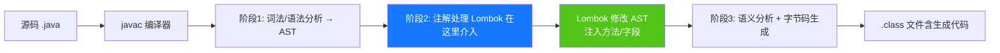
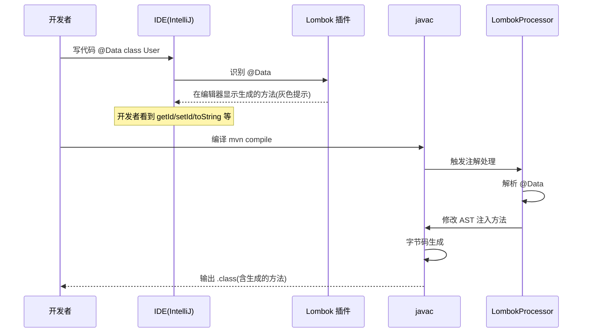
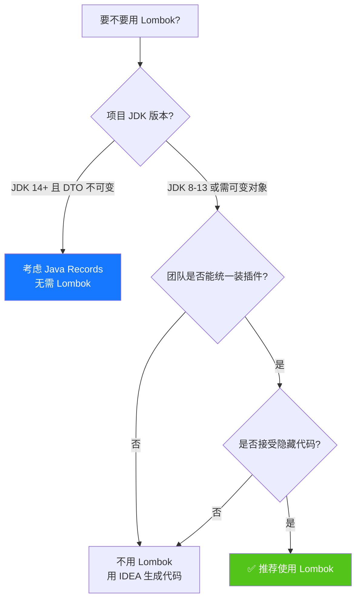

# Lombok 技术完全指南：核心原理·常用注解·安装配置·IDE 集成·高级特性·最佳实践

> **文档定位**:本文是 Lombok 的**系统性学习与工程实践参考文档**,面向具备 Java 基础的开发人员(初中高级均适用),从核心原理到安装配置、从常用注解到高级特性、从基础用法到最佳实践,全面覆盖 Lombok 在 Java 项目中的完整知识体系。内容编排遵循**由浅入深、理论结合实践**的原则,每个注解均配套**前后对比代码示例**,确保读者既能理解原理又能立即上手。
>
> **关联文档**(建议一并阅读):
> - [Java 项目工程化方案](./Java项目工程化方案.md) — Java 项目工程化基线
> - [Spring-Boot 全面详解](./spring-boot/Spring-Boot全面详解_核心概念架构自动配置场景应用测试部署.md) — Spring Boot 集成基础
> - [Maven 项目构建与依赖管理](./Maven项目构建与依赖管理工程实践详解.md) — 依赖管理基础
> - [Java 面向对象编程核心详解](./基本语法/Java面向对象编程核心详解.md) — POJO/构造器基础
> - [Java 异常处理机制详解](./基本语法/Java异常处理机制详解.md) — `@SneakyThrows` 原理基础
> - [高级 Java 工程师面试题](./高级Java工程师面试题.md) — Lombok 面试高频考点
>
> **版本基线**:本文以 **Lombok 1.18.30** 为基线(兼容 1.18.x),搭配 **JDK 17**(兼容 JDK 8+),IDE 以 **IntelliJ IDEA 2023.x / Eclipse 2023-x** 为基线。

---

## 目录

- [Lombok 技术完全指南：核心原理·常用注解·安装配置·IDE 集成·高级特性·最佳实践](#lombok-技术完全指南核心原理常用注解安装配置ide-集成高级特性最佳实践)
  - [目录](#目录)
  - [一、Lombok 概述](#一lombok-概述)
    - [1.1 Lombok 是什么](#11-lombok-是什么)
    - [1.2 为什么需要 Lombok](#12-为什么需要-lombok)
    - [1.3 核心特性](#13-核心特性)
    - [1.4 与其他方案的对比](#14-与其他方案的对比)
  - [二、核心原理](#二核心原理)
    - [2.1 编译期注解处理](#21-编译期注解处理)
    - [2.2 字节码修改机制](#22-字节码修改机制)
    - [2.3 工作流程](#23-工作流程)
  - [三、安装与配置](#三安装与配置)
    - [3.1 Maven 依赖](#31-maven-依赖)
    - [3.2 Gradle 依赖](#32-gradle-依赖)
    - [3.3 Maven 编译插件配置](#33-maven-编译插件配置)
  - [四、IDE 集成](#四ide-集成)
    - [4.1 IntelliJ IDEA](#41-intellij-idea)
      - [4.1.1 安装插件](#411-安装插件)
      - [4.1.2 启用注解处理](#412-启用注解处理)
      - [4.1.3 验证](#413-验证)
    - [4.2 Eclipse](#42-eclipse)
      - [4.2.1 安装](#421-安装)
      - [4.2.2 验证](#422-验证)
    - [4.3 VS Code](#43-vs-code)
    - [4.4 验证安装](#44-验证安装)
  - [五、常用注解详解](#五常用注解详解)
    - [5.1 Getter / Setter](#51-getter--setter)
    - [5.2 ToString](#52-tostring)
    - [5.3 EqualsAndHashCode](#53-equalsandhashcode)
    - [5.4 构造器注解](#54-构造器注解)
    - [5.5 Data](#55-data)
    - [5.6 Value](#56-value)
    - [5.7 Builder](#57-builder)
    - [5.8 日志注解](#58-日志注解)
    - [5.9 Cleanup](#59-cleanup)
    - [5.10 SneakyThrows](#510-sneakythrows)
    - [5.11 Synchronized](#511-synchronized)
    - [5.12 val 与 var](#512-val-与-var)
    - [5.13 NonNull](#513-nonnull)
    - [5.14 注解速查表](#514-注解速查表)
  - [六、高级特性](#六高级特性)
    - [6.1 lombok.config 配置文件](#61-lombokconfig-配置文件)
    - [6.2 注解参数详解](#62-注解参数详解)
    - [6.3 实验性注解](#63-实验性注解)
    - [6.4 自定义扩展](#64-自定义扩展)
  - [七、优缺点分析](#七优缺点分析)
    - [7.1 优点](#71-优点)
    - [7.2 缺点与争议](#72-缺点与争议)
    - [7.3 适用场景判断](#73-适用场景判断)
  - [八、实际应用示例](#八实际应用示例)
    - [8.1 DTO 场景](#81-dto-场景)
    - [8.2 实体类场景](#82-实体类场景)
    - [8.3 Builder 模式构建复杂对象](#83-builder-模式构建复杂对象)
    - [8.4 Spring Boot 集成示例](#84-spring-boot-集成示例)
  - [九、常见问题与最佳实践](#九常见问题与最佳实践)
    - [9.1 常见问题](#91-常见问题)
      - [Q1: 编译时报错 "找不到符号 getId()"](#q1-编译时报错-找不到符号-getid)
      - [Q2: Lombok + Jackson 反序列化失败](#q2-lombok--jackson-反序列化失败)
      - [Q3: `@EqualsAndHashCode` 在继承体系下漏字段](#q3-equalsandhashcode-在继承体系下漏字段)
      - [Q4: Lombok 与 MapStruct 配合报错](#q4-lombok-与-mapstruct-配合报错)
      - [Q5: `@SneakyThrows` 抛出的异常无法被 catch](#q5-sneakythrows-抛出的异常无法被-catch)
      - [Q6: Lombok 与 Delombok(反编译查看)](#q6-lombok-与-delombok反编译查看)
    - [9.2 最佳实践](#92-最佳实践)
  - [十、面试高频考点速查](#十面试高频考点速查)

---

## 一、Lombok 概述

### 1.1 Lombok 是什么

**Lombok** 是一个**Java 库**,通过**注解(Annotation)**的方式,在**编译期**自动生成 Java 类的样板代码(boilerplate code),包括 getter/setter、toString、equals、hashCode、构造器、日志变量、资源关闭等。它能显著减少手写重复代码,让开发者聚焦于业务逻辑。

Lombok 的核心价值是**"用注解消除样板代码,提升代码可读性与可维护性"**。

### 1.2 为什么需要 Lombok

普通 Java POJO 的痛点:

```java
// ============ 不用 Lombok:50+ 行只为一个简单 DTO ============
public class UserDTO {
    private Long id;
    private String name;
    private String email;
    private Integer age;

    public UserDTO() {}

    public UserDTO(Long id, String name, String email, Integer age) {
        this.id = id;
        this.name = name;
        this.email = email;
        this.age = age;
    }

    public Long getId() { return id; }
    public void setId(Long id) { this.id = id; }
    public String getName() { return name; }
    public void setName(String name) { this.name = name; }
    public String getEmail() { return email; }
    public void setEmail(String email) { this.email = email; }
    public Integer getAge() { return age; }
    public void setAge(Integer age) { this.age = age; }

    @Override
    public boolean equals(Object o) {
        if (this == o) return true;
        if (!(o instanceof UserDTO)) return false;
        UserDTO userDTO = (UserDTO) o;
        return Objects.equals(id, userDTO.id)
            && Objects.equals(name, userDTO.name)
            && Objects.equals(email, userDTO.email)
            && Objects.equals(age, userDTO.age);
    }

    @Override
    public int hashCode() {
        return Objects.hash(id, name, email, age);
    }

    @Override
    public String toString() {
        return "UserDTO(id=" + id + ", name=" + name + ", email=" + email + ", age=" + age + ")";
    }
}
```

```java
// ============ 使用 Lombok:仅 6 行 ============
@Data
@AllArgsConstructor
@NoArgsConstructor
public class UserDTO {
    private Long id;
    private String name;
    private String email;
    private Integer age;
}
```

**对比**:同一个 POJO,代码量从 50+ 行降到 6 行,**减少 88%**。

### 1.3 核心特性

| 特性 | 说明 | 价值 |
|-----|------|------|
| **编译期生成** | 在 javac 编译期注入字节码,运行期零开销 | 不影响运行性能 |
| **注解驱动** | 一行注解代替几十行样板代码 | 提升开发效率 |
| **可与 IDE 集成** | 主流 IDE 都有 Lombok 插件支持 | 开发体验良好 |
| **可配置** | 通过 `lombok.config` 自定义生成规则 | 灵活控制 |
| **运行期零依赖** | Lombok 是 `provided` 依赖,运行时无需引入 | 不增加部署体积 |

### 1.4 与其他方案的对比

| 方案 | 原理 | 优点 | 缺点 | 适用场景 |
|-----|------|------|------|---------|
| **Lombok** | 编译期注解处理 | 注解即可,代码量极少 | 需要 IDE 插件;侵入性强 | 通用 POJO/DTO/Entity |
| **IDEA 生成代码** | IDE 模板生成 | 无需依赖,标准 Java | 改字段要重新生成;代码冗长 | 不想引入第三方库 |
| **Java 14+ Records** | 语言级语法糖 | 标准语法,无依赖 | 不可变;字段必须 final;Java 14+ | 不可变 DTO |
| **MapStruct** | 编译期生成映射代码 | 类型安全,性能高 | 只解决对象映射 | DTO ↔ Entity 转换 |
| **Apache Commons Lang** | `ToStringBuilder` 等 | 标准库风格 | 仍需手写;性能不如 Lombok | 老项目兼容 |

---

## 二、核心原理

### 2.1 编译期注解处理

Lombok 的核心是 **JSR 269: Pluggable Annotation Processing API**(Java 6 引入)。它通过自定义的 `AnnotationProcessor` 在 javac 编译期介入,修改抽象语法树(AST)。



### 2.2 字节码修改机制

Lombok 使用了**非公开的 javac 内部 API**(`com.sun.tools.javac.tree.JCTree`)来修改 AST,这是其能"魔法"般注入代码的关键:

```mermaid
flowchart TB
    ANNO[@Data 注解] --> PROC[LombokProcessor]
    SRC[源码 AST] --> PROC
    PROC --> MOD1[注入 getter/setter]
    PROC --> MOD2[注入 toString]
    PROC --> MOD3[注入 equals/hashCode]
    PROC --> MOD4[注入构造器]
    MOD1 & MOD2 & MOD3 & MOD4 --> AST2[修改后的 AST]
    AST2 --> BYTE[字节码生成 .class]
    
    style PROC fill:#ff4d4f,color:#fff
```

**关键细节**:
- Lombok 使用 `sun.misc.Unsafe` 或反射调用 javac 内部 API
- 这也是为什么 JDK 升级有时会"破坏" Lombok(因为内部 API 不保证兼容)
- **运行期 Lombok 完全不参与**,生成的方法在 .class 里与手写代码无差别

### 2.3 工作流程



**两类协作**:
1. **IDE 插件**:让 IDE "认识" Lombok 生成的代码,避免报红;不影响编译
2. **Annotation Processor**:编译期真正修改字节码的引擎

---

## 三、安装与配置

### 3.1 Maven 依赖

```xml
<dependencies>
    <!-- Lombok 核心依赖(scope=provided,运行期不需要) -->
    <dependency>
        <groupId>org.projectlombok</groupId>
        <artifactId>lombok</artifactId>
        <version>1.18.30</version>
        <scope>provided</scope>
    </dependency>
</dependencies>
```

**关键说明**:
- `scope=provided`:Lombok 仅编译期需要,运行期由 JDK 提供(实际就是不需要)
- 这样打包后的 jar 不包含 lombok,减少体积

### 3.2 Gradle 依赖

```groovy
// build.gradle (Gradle 7+)
dependencies {
    // 方式 A:compileOnly + annotationProcessor(推荐)
    compileOnly 'org.projectlombok:lombok:1.18.30'
    annotationProcessor 'org.projectlombok:lombok:1.18.30'

    // 方式 B:旧版 Gradle(<5.0)
    // provided 'org.projectlombok:lombok:1.18.30'
}
```

### 3.3 Maven 编译插件配置

**强烈建议显式配置 maven-compiler-plugin**,避免某些 Maven 版本下注解处理器不生效:

```xml
<build>
    <plugins>
        <plugin>
            <groupId>org.apache.maven.plugins</groupId>
            <artifactId>maven-compiler-plugin</artifactId>
            <version>3.11.0</version>
            <configuration>
                <source>17</source>
                <target>17</source>
                <annotationProcessorPaths>
                    <path>
                        <groupId>org.projectlombok</groupId>
                        <artifactId>lombok</artifactId>
                        <version>1.18.30</version>
                    </path>
                    <!-- 如果同时用 MapStruct,Lombok 必须在 MapStruct 之前 -->
                    <!--
                    <path>
                        <groupId>org.mapstruct</groupId>
                        <artifactId>mapstruct-processor</artifactId>
                        <version>1.5.5.Final</version>
                    </path>
                    -->
                </annotationProcessorPaths>
            </configuration>
        </plugin>
    </plugins>
</build>
```

**Lombok + MapStruct 协同配置关键**:
- Lombok 与 MapStruct 同时使用时,**Lombok 必须在 MapStruct 之前**
- 否则 MapStruct 拿不到 Lombok 生成的 getter/setter,会报错
- Spring Boot 项目可在 pom 同时引入 Lombok 和 MapStruct 的注解处理器

---

## 四、IDE 集成

### 4.1 IntelliJ IDEA

#### 4.1.1 安装插件

**IntelliJ IDEA 2020.3+** 已内置 Lombok 插件,无需额外安装。**老版本**需要手动安装:

```
File → Settings → Plugins → 搜索 "Lombok" → Install → Restart
```

#### 4.1.2 启用注解处理

```
File → Settings → Build, Execution, Deployment → Compiler → Annotation Processors
→ 勾选 "Enable annotation processing"
```

#### 4.1.3 验证

写一个测试类,鼠标悬停字段时,IDE 应显示 Lombok 生成的 getter/setter(灰色提示):

```java
@Data
public class TestLombok {
    private String name;
    // 鼠标停在 name 上应显示 getId/setId 的提示
}
```

### 4.2 Eclipse

#### 4.2.1 安装

1. 下载 `lombok.jar` 到本地
2. 双击运行 `java -jar lombok.jar`,选择 Eclipse 安装目录
3. 重启 Eclipse

或通过 Eclipse Marketplace 安装:
```
Help → Eclipse Marketplace → 搜索 "Lombok" → Install
```

#### 4.2.2 验证

`Help → About Eclipse` 应显示 "Lombok" 字样。

### 4.3 VS Code

安装插件:
```
扩展商店搜索 "Lombok Annotations Support for VS Code" → Install
```

### 4.4 验证安装

执行 `mvn clean compile`,成功则证明编译期 Lombok 生效。打开生成的 `.class`(用 `javap -p` 命令)应能看到生成的 getter/setter:

```bash
javap -p target/classes/com/example/UserDTO.class
# 应输出:
# public java.lang.Long getId();
# public void setId(java.lang.Long);
# ...
```

---

## 五、常用注解详解

### 5.1 Getter / Setter

**作用**:为字段自动生成 getter/setter 方法。

```java
public class User {
    // 类级别注解:为所有非静态字段生成
    @Getter
    @Setter
    private String name;

    // 字段级别注解:仅作用于该字段
    @Getter(AccessLevel.PROTECTED)   // 访问级别控制
    @Setter(AccessLevel.NONE)        // 不生成 setter
    private Long id;

    // 自定义方法名(不推荐,破坏约定)
    @Getter(lazy = true)             // 懒加载(配合 final 字段)
    private String expensive = computeExpensive();
}
```

**关键参数**:

| 参数 | 取值 | 说明 |
|-----|------|------|
| `value` | `AccessLevel.PUBLIC/PROTECTED/PRIVATE/NONE/MODULE/PACKAGE` | 访问级别;`NONE` 表示不生成 |
| `lazy` | `true/false` | 仅 `@Getter` 支持,懒加载,字段必须 `final` |

**`lazy=true` 示例**(计算开销大的字段):

```java
public class ConfigHolder {
    @Getter(lazy = true)
    private final String config = loadConfig();   // 首次调用 getConfig() 才会执行

    private String loadConfig() {
        System.out.println("加载配置...");
        return "loaded-config";
    }
}
// 调用 getConfig() 第一次输出"加载配置",第二次不输出
```

### 5.2 ToString

**作用**:生成 `toString()` 方法。

```java
@ToString
public class User {
    private Long id;
    private String name;
    
    @ToString.Exclude              // 排除该字段(如密码)
    private String password;
    
    @ToString.Include(rank = 1)    // 包含方法返回值
    private boolean isActive() { return true; }
}

@ToString(
    callSuper = true,              // 调用父类 toString
    includeFieldNames = true,      // 包含字段名(默认 true)
    onlyExplicitlyIncluded = false // 仅包含 @ToString.Include 标注的字段
)
public class AdminUser extends User {
    private String role;
}
```

**输出示例**: `User(id=1, name=Tom, isActive=true)`

### 5.3 EqualsAndHashCode

**作用**:生成 `equals()` 和 `hashCode()`。

```java
@EqualsAndHashCode
public class User {
    private Long id;
    private String name;
    private transient String session;   // transient 字段默认不参与
    
    @EqualsAndHashCode.Exclude         // 显式排除
    private String cache;
}

@EqualsAndHashCode(
    of = {"id", "name"},               // 仅这两个字段参与
    callSuper = true,                  // 包含父类字段
    cacheStrategy = EqualsAndHashCode.CacheStrategy.LAZY  // 懒计算 hashCode
)
public class Order {
    private Long id;
    private String name;
    private BigDecimal amount;
}
```

**重要原则**:
- 实体类(Entity)通常只按主键(id)判断相等
- DTO/Value Object 通常按所有字段判断
- `callSuper=true` 用于继承体系,避免子类漏掉父类字段

### 5.4 构造器注解

Lombok 提供 3 个构造器注解:

| 注解 | 作用 | 等价代码 |
|-----|------|---------|
| `@NoArgsConstructor` | 无参构造器 | `public User() {}` |
| `@RequiredArgsConstructor` | 为 `final` / `@NonNull` 字段生成构造器 | 仅必需字段 |
| `@AllArgsConstructor` | 全参构造器 | 所有字段 |

```java
@RequiredArgsConstructor   // Spring 推荐用此注解做依赖注入
public class OrderService {
    private final OrderRepository orderRepo;     // final 字段 → 构造器参数
    private final PaymentService paymentService; // final 字段 → 构造器参数
    
    @NonNull
    private String serviceName = "order-service"; // @NonNull → 构造器参数
    
    private String cache;   // 非 final 非 @NonNull → 不进入构造器
}

// 等价于
public class OrderService {
    public OrderService(OrderRepository orderRepo,
                        PaymentService paymentService,
                        @NonNull String serviceName) {
        this.orderRepo = orderRepo;
        this.paymentService = paymentService;
        this.serviceName = serviceName;
    }
}
```

**Spring Boot 中 `@RequiredArgsConstructor` 是注入 Bean 的推荐方式**(替代 `@Autowired` 字段注入):

```java
@Service
@RequiredArgsConstructor
public class UserService {
    private final UserRepository userRepository;
    private final EmailService emailService;
    // Spring 会通过构造器注入这两个 Bean,字段 final 不可变,更安全
}
```

### 5.5 Data

**作用**:`@Data` 是组合注解,等价于:

```java
@Getter + @Setter + @ToString + @EqualsAndHashCode
+ @RequiredArgsConstructor
```

```java
@Data
public class UserDTO {
    private Long id;
    private String name;
    private String email;
}
// 自动生成:getId/setId/getName/setName/getEmail/setEmail
//         + toString + equals + hashCode + 无参构造器
```

**重要说明**:`@Data` **不包含** `@AllArgsConstructor`!如果需要全参构造器,需显式加:

```java
@Data
@AllArgsConstructor
public class UserDTO {
    private Long id;
    private String name;
}
```

### 5.6 Value

**作用**:生成**不可变**对象(`@Value` 是 `@Data` 的不可变版本)。字段默认 `final`,无 setter。

```java
@Value
public class UserVO {
    Long id;          // 默认 private final
    String name;
    String email;
}

// 等价于
public final class UserVO {   // 类也是 final
    private final Long id;
    private final String name;
    private final String email;
    
    // 仅有 getter,无 setter
    // 自动生成 equals/hashCode/toString
    // 自动生成全参构造器
}
```

**适用场景**:
- 不可变 DTO / Value Object
- 多线程共享的安全对象
- 函数式编程风格

### 5.7 Builder

**作用**:生成 Builder 模式,链式调用构建对象。

```java
@Builder
public class User {
    private Long id;
    private String name;
    private String email;
    private Integer age;
}

// 使用
User user = User.builder()
    .id(1L)
    .name("Tom")
    .email("tom@example.com")
    .age(25)
    .build();
```

**进阶用法**:

```java
@Builder
public class Order {
    private Long id;
    private String name;
    
    @Builder.Default                // 默认值
    private LocalDateTime createTime = LocalDateTime.now();
    
    @Singular                       // 集合类型,支持逐个添加
    private List<String> items;
}

// 使用
Order order = Order.builder()
    .id(1L)
    .name("order-1")
    .item("apple")                  // 单数形式添加
    .item("banana")
    .items(Arrays.asList("cherry", "date"))  // 也可整体添加
    .build();
```

**Builder + Jackson 反序列化**:

```java
@Data
@Builder
@NoArgsConstructor
@AllArgsConstructor
@Jacksonized                       // Lombok 1.18.24+,自动配置 Jackson 反序列化
public class UserRequest {
    private Long id;
    private String name;
}
// @Jacksonized 让 Jackson 通过 Builder 反序列化,适合不可变对象
```

### 5.8 日志注解

Lombok 为各种日志框架提供注解,自动生成 `log` 字段:

| 注解 | 生成字段 | 日志框架 |
|-----|---------|---------|
| `@Slf4j` | `private static final Logger log = LoggerFactory.getLogger(X.class);` | SLF4J(最常用) |
| `@Log` | `private static final Logger log = Logger.getLogger(X.class.getName());` | java.util.logging |
| `@Log4j` | `private static final Logger log = LogManager.getLogger(X.class);` | Log4j |
| `@Log4j2` | `private static final Logger log = LogManager.getLogger(X.class);` | Log4j2 |
| `@CommonsLog` | `private static final Log log = LogFactory.getLog(X.class);` | Apache Commons Logging |
| `@Flogger` | `private static final FluentLogger log = FluentLogger.forEnclosingClass();` | Flogger |
| `@CustomLog` | 自定义 | 自定义日志框架 |

**使用示例**:

```java
@Slf4j
@Service
public class UserService {
    public void createUser(User user) {
        log.info("创建用户: {}", user.getName());
        try {
            // 业务逻辑
        } catch (Exception e) {
            log.error("创建用户失败: {}", user.getName(), e);
        }
    }
}
```

### 5.9 Cleanup

**作用**:自动调用 `close()` 释放资源(替代 try-with-resources)。

```java
public class FileProcessor {
    public String read(String path) throws IOException {
        @Cleanup
        BufferedReader reader = new BufferedReader(new FileReader(path));
        // 方法结束时自动调用 reader.close()
        return reader.readLine();
    }
}

// 等价于
public String read(String path) throws IOException {
    BufferedReader reader = new BufferedReader(new FileReader(path));
    try {
        return reader.readLine();
    } finally {
        reader.close();
    }
}
```

**自定义关闭方法**:

```java
@Cleanup("shutdown")   // 指定调用 shutdown 而不是 close
ExecutorService executor = Executors.newFixedThreadPool(10);
```

**注意**:**推荐使用 try-with-resources 替代 `@Cleanup`**,前者是 Java 7+ 标准,更可读且语义清晰。

### 5.10 SneakyThrows

**作用**:偷偷抛出受检异常,不需要在方法签名声明 `throws`。

```java
public class SneakyThrowsDemo {
    
    // 不使用 @SneakyThrows:必须声明 throws
    public void readFile1() throws IOException {
        throw new IOException("文件读错");
    }
    
    // 使用 @SneakyThrows:不声明 throws,直接抛
    @SneakyThrows
    public void readFile2() {
        throw new IOException("文件读错");
    }
    
    // 也可以指定具体异常类型
    @SneakyThrows(IOException.class)
    public void readFile3() {
        throw new IOException("文件读错");
    }
}
```

**原理**:利用 Java 类型系统的"漏洞",通过类型擦除绕过编译期检查。运行期会真实抛出该异常。

```java
// Lombok 生成的字节码等价于
public void readFile2() {
    try {
        throw new IOException("文件读错");
    } catch (IOException e) {
        throw sneakyThrow(e);   // 用泛型欺骗编译器
    }
    // sneakyThrow 实现原理:利用类型系统漏洞
    public static <T extends Throwable> void sneakyThrow(Throwable t) throws T {
        throw (T) t;
    }
}
```

**使用建议**:
- **不建议滥用**,会让代码"看起来没有异常"
- **适合场景**:你确定调用方不会处理该异常(如反射、序列化的 `ReflectiveOperationException`)
- 调用 lambda 表达式中的受检异常时,可用 `@SneakyThrows` 简化

### 5.11 Synchronized

**作用**:替代 `synchronized` 关键字,使用私有锁对象,避免锁泄漏。

```java
public class Cache {
    private final Object lock = new Object();   // 私有锁
    
    @Synchronized("lock")    // 指定锁对象
    public void put(String key, String value) {
        // 等价于 synchronized(lock) { ... }
    }
    
    @Synchronized            // 默认创建锁 $lock
    public String get(String key) {
        return "";
    }
}
```

**注意**:推荐使用 `java.util.concurrent` 下的并发工具(`ReentrantLock`/`ReadWriteLock`)替代,语义更清晰。

### 5.12 val 与 var

**作用**:类型推断的局部变量声明,类似 JavaScript 的 `let` 或 Kotlin 的 `val/var`。

```java
public class TypeInference {
    public void demo() {
        // val: 不可变引用(类似 final),JDK 10+ 有标准 var
        val users = new ArrayList<String>();    // 编译期推断为 ArrayList<String>
        users.add("Tom");
        // users = new ArrayList<>();   // 编译错误:val 不可重新赋值
        
        // var: 可变引用
        var numbers = new HashMap<String, Integer>();
        numbers.put("one", 1);
        numbers = new HashMap<>();    // OK,var 可重新赋值
    }
}
```

| 关键字 | 不可变 | 可重新赋值 | JDK 标准替代 |
|-------|:-----:|:---------:|:-----------:|
| `val` | ✅ | ❌ | JDK 10+: `final var` |
| `var` | ❌ | ✅ | JDK 10+: `var` |

**注意**:**JDK 10+ 已有标准 `var`**,Lombok 的 `val/var` 仅适合 JDK 8/9 项目。

### 5.13 NonNull

**作用**:参数非空校验,自动生成 null 检查代码。

```java
public class UserService {
    @NonNull
    public User getUser(@NonNull Long id, String name) {
        // 自动在方法开头生成:
        // if (id == null) throw new NullPointerException("id is marked non-null but is null");
        // if (name == null) throw new NullPointerException("...");
        return new User(id, name);
    }
}

// 字段级别(配合 @RequiredArgsConstructor)
@RequiredArgsConstructor
public class OrderService {
    @NonNull
    private String orderId;   // 在构造器中会校验 null
}
```

### 5.14 注解速查表

| 注解 | 作用 | 常用度 |
|-----|------|:-----:|
| `@Getter` / `@Setter` | 生成 getter/setter | ⭐⭐⭐⭐⭐ |
| `@ToString` | 生成 toString | ⭐⭐⭐⭐ |
| `@EqualsAndHashCode` | 生成 equals/hashCode | ⭐⭐⭐⭐ |
| `@NoArgsConstructor` | 无参构造器 | ⭐⭐⭐⭐⭐ |
| `@RequiredArgsConstructor` | 必需字段构造器 | ⭐⭐⭐⭐⭐ |
| `@AllArgsConstructor` | 全参构造器 | ⭐⭐⭐⭐ |
| `@Data` | 组合注解(常用) | ⭐⭐⭐⭐⭐ |
| `@Value` | 不可变对象 | ⭐⭐⭐ |
| `@Builder` | Builder 模式 | ⭐⭐⭐⭐⭐ |
| `@Slf4j` | 日志变量 | ⭐⭐⭐⭐⭐ |
| `@Cleanup` | 资源关闭 | ⭐⭐ |
| `@SneakyThrows` | 偷抛受检异常 | ⭐⭐ |
| `@Synchronized` | 同步锁 | ⭐⭐ |
| `val` / `var` | 类型推断 | ⭐⭐⭐ |
| `@NonNull` | 非空校验 | ⭐⭐⭐⭐ |
| `@Jacksonized` | Builder + Jackson | ⭐⭐⭐ |

---

## 六、高级特性

### 6.1 lombok.config 配置文件

Lombok 支持通过项目根目录的 `lombok.config` 文件全局配置生成行为。

```properties
# lombok.config (放在项目根目录)

# ============ 全局配置 ============
# 配置是否冒泡到父目录查找更多配置(默认 true)
config.stopBubbling = true

# ============ 生成行为 ============
# 生成的方法是否调用父类(callSuper)
lombok.equalsAndHashCode.callSuper = call

# toString 是否包含字段名
lombok.toString.includeFieldNames = true

# ============ 默认访问级别 ============
# 默认 getter 访问级别
lombok.accessors.fluent = false   # false=getId/setName, true=name()/name(x)

# 链式 setter(返回 this)
lombok.accessors.chain = false    # true=setName 返回 User

# ============ 日志变量名 ============
# 默认 log,可改为 logger
lombok.log.fieldName = log

# ============ 实验性功能 ============
# 启用 @Accessors 实验性注解
lombok.accessors.prefix += m,_

# 启用 @FieldNameConstants 实验性注解
lombok.fieldNameConstants.typename = Fields
```

### 6.2 注解参数详解

`@Accessors`:链式 setter 与流式 API

```java
@Accessors(chain = true)    // setter 返回 this
public class User {
    private String name;
    private Integer age;
}
// user.setName("Tom").setAge(25);   // 链式调用

@Accessors(fluent = true)   // 不加 get/set 前缀
public class Config {
    private String key;
    private String value;
}
// config.key() / config.key("xxx")  流式风格

@Accessors(prefix = "m")   // 忽略字段前缀
public class Entity {
    private String mName;   // 生成 getName() 而不是 getMName()
    private Integer mAge;
}
```

### 6.3 实验性注解

实验性注解位于 `lombok.experimental` 包,未来可能变更:

| 注解 | 作用 |
|-----|------|
| `@Accessors` | 自定义 getter/setter 命名 |
| `@FieldDefaults` | 字段默认修饰符 |
| `@FieldNameConstants` | 字段名常量类 |
| `@Delegate` | 委托方法给字段 |
| `@With` | 生成 with 方法(不可变修改) |
| `@ExtensionMethod` | 扩展方法(Kotlin 风格) |
| `@UtilityClass` | 工具类(所有方法静态化) |

**`@With` 示例**:

```java
@With
@Value
public class User {
    Long id;
    String name;
}

// 使用:返回新对象,原对象不变(适合不可变对象)
User u1 = new User(1L, "Tom");
User u2 = u1.withName("Jerry");   // u2 = User(1L, "Jerry"),u1 不变
```

**`@UtilityClass` 示例**:

```java
@UtilityClass
public class StringUtils {
    public boolean isEmpty(String s) { return s == null || s.isEmpty(); }
}
// 等价于:
// final class StringUtils {
//     private StringUtils() {}
//     public static boolean isEmpty(String s) { return s == null || s.isEmpty(); }
// }
// 调用: StringUtils.isEmpty("xxx")
```

### 6.4 自定义扩展

Lombok 提供 SPI 扩展机制,允许自定义注解处理器。但**不建议**,因为内部 API 不稳定。

**替代方案**:用标准 JSR 269 编写自定义 `AnnotationProcessor`,在 Maven 插件配置。

---

## 七、优缺点分析

### 7.1 优点

| 优点 | 说明 |
|-----|------|
| **减少样板代码** | 一个 `@Data` 代替几十行 getter/setter/toString/equals |
| **代码可读性强** | 字段定义集中,一目了然 |
| **修改字段友好** | 加字段不用重写所有方法 |
| **编译期生成** | 运行期零开销,不依赖 Lombok 运行 |
| **统一规范** | 全团队使用相同注解,生成方法风格一致 |
| **支持多种日志框架** | `@Slf4j`/`@Log4j2` 等自动适配 |
| **Builder 模式简化** | `@Builder` 一行注解替代手写 Builder 类 |

### 7.2 缺点与争议

| 缺点 | 说明 | 缓解方案 |
|-----|------|---------|
| **侵入性强** | 团队所有人必须装 Lombok 插件,否则编译报错 | 团队规范统一安装 |
| **隐藏代码** | 看不到实际生成的方法,调试不便 | IDE 插件显示结构(`Structure`视图) |
| **JDK 升级风险** | 使用 javac 内部 API,JDK 升级可能失效 | 关注 Lombok 更新,版本对应 |
| **与 Jackson 冲突** | `@Builder` 默认 Jackson 反序列化失败 | 加 `@Jacksonized` 或 `@NoArgsConstructor` + `@AllArgsConstructor` |
| **类层级耦合** | `@Data` 在子类使用时,`equals/hashCode` 不调用父类 | 用 `@EqualsAndHashCode(callSuper=true)` |
| **`@SneakyThrows` 滥用** | 隐藏受检异常,可能误用 | 严格限定使用场景 |
| **Lombok 自身 bug** | 偶有生成的代码有缺陷 | 关注版本更新 |
| **`@AllArgsConstructor` 多字段顺序** | 字段顺序即构造器参数顺序,容易传错 | 用 `@Builder` 替代 |

### 7.3 适用场景判断



**强烈推荐使用 Lombok 的场景**:
- Spring Boot 项目(注入用 `@RequiredArgsConstructor`,日志用 `@Slf4j`)
- DTO/VO/Entity 大量样板代码的场景
- Builder 模式构建复杂对象

**不推荐用 Lombok 的场景**:
- 团队成员 JDK 水平差异大,不熟悉"看不见的方法"
- 公共 SDK 库(被外部依赖,需考虑兼容性)
- 需要严格控制对象行为的领域模型(DDD)

---

## 八、实际应用示例

### 8.1 DTO 场景

```java
@Data                          // getter/setter/toString/equals/hashCode
@Builder                       // Builder 模式
@NoArgsConstructor             // 无参构造(Jackson 反序列化必需)
@AllArgsConstructor            // 全参构造(Builder 内部使用)
public class UserDTO {
    private Long id;
    private String name;
    private String email;
    private Integer age;
    private LocalDateTime createTime;
    
    @Builder.Default
    private Boolean enabled = true;
    
    // 自定义方法(与 Lombok 生成的不冲突)
    public String getDisplayName() {
        return name + " (" + email + ")";
    }
}

// 使用
UserDTO user = UserDTO.builder()
    .id(1L)
    .name("Tom")
    .email("tom@example.com")
    .age(25)
    .build();
```

### 8.2 实体类场景

```java
@Data
@NoArgsConstructor
@AllArgsConstructor
@Builder
public class UserEntity {
    
    @TableId(type = IdType.AUTO)
    private Long id;
    
    private String name;
    
    private String email;
    
    private Integer age;
    
    @TableField(fill = FieldFill.INSERT)        // MyBatis-Plus 自动填充
    private LocalDateTime createTime;
    
    @TableField(fill = FieldFill.INSERT_UPDATE)
    private LocalDateTime updateTime;
    
    @TableLogic                                  // 逻辑删除
    @Getter(AccessLevel.NONE)                    // 不对外暴露
    private Integer deleted;
}
```

### 8.3 Builder 模式构建复杂对象

```java
@Builder
@Value
@Jacksonized
public class HttpRequest {
    String url;
    String method;
    
    @Singular
    Map<String, String> headers;
    
    @Singular
    Map<String, String> queryParams;
    
    byte[] body;
    
    @Builder.Default
    int timeoutMs = 30000;
}

// 链式构建,可读性极佳
HttpRequest request = HttpRequest.builder()
    .url("https://api.example.com/users")
    .method("POST")
    .header("Content-Type", "application/json")
    .header("Authorization", "Bearer xxx")
    .queryParam("page", "1")
    .queryParam("size", "20")
    .body("{\"name\":\"Tom\"}".getBytes())
    .timeoutMs(5000)
    .build();
```

### 8.4 Spring Boot 集成示例

```java
// ============ 1. Service 层(推荐写法) ============
@Slf4j
@Service
@RequiredArgsConstructor
public class UserService {
    
    private final UserRepository userRepository;       // final + 构造器注入
    private final EmailService emailService;
    private final ApplicationEventPublisher eventPublisher;
    
    @Transactional
    public UserDTO createUser(UserCreateRequest request) {
        log.info("创建用户: {}", request.getName());
        
        UserEntity entity = UserEntity.builder()
            .name(request.getName())
            .email(request.getEmail())
            .build();
        
        UserEntity saved = userRepository.save(entity);
        
        eventPublisher.publishEvent(new UserCreatedEvent(saved.getId()));
        
        return toDTO(saved);
    }
    
    @SneakyThrows        // 简化异常处理(EmailService 抛受检异常)
    private void sendWelcomeEmail(UserEntity user) {
        emailService.send(user.getEmail(), "Welcome!");
    }
    
    private UserDTO toDTO(UserEntity entity) {
        return UserDTO.builder()
            .id(entity.getId())
            .name(entity.getName())
            .email(entity.getEmail())
            .build();
    }
}

// ============ 2. Controller 层 ============
@RestController
@RequestMapping("/api/users")
@RequiredArgsConstructor
public class UserController {
    
    private final UserService userService;
    
    @PostMapping
    public ResponseEntity<UserDTO> create(@RequestBody UserCreateRequest request) {
        UserDTO user = userService.createUser(request);
        return ResponseEntity.ok(user);
    }
}

// ============ 3. Request/Response 对象 ============
@Data
@Builder
@NoArgsConstructor
@AllArgsConstructor
public class UserCreateRequest {
    @NotBlank
    private String name;
    
    @Email
    @NotBlank
    private String email;
}

// ============ 4. 事件对象(不可变) ============
@Value
public class UserCreatedEvent {
    Long userId;
}

// ============ 5. 配置类(用 @Slf4j 打日志) ============
@Slf4j
@Configuration
public class KafkaConfig {
    
    @Bean
    public ProducerFactory<String, String> producerFactory() {
        log.info("初始化 Kafka ProducerFactory");
        // ...
    }
}
```

---

## 九、常见问题与最佳实践

### 9.1 常见问题

#### Q1: 编译时报错 "找不到符号 getId()"

**原因**:IDE 没装 Lombok 插件,或没启用注解处理。

**解决**:
1. 安装 Lombok 插件(IntelliJ 2020.3+ 内置)
2. `Settings → Compiler → Annotation Processors → Enable annotation processing`
3. 重新构建项目 `Build → Rebuild Project`

#### Q2: Lombok + Jackson 反序列化失败

**原因**:`@Builder` 类没有无参构造器,Jackson 无法实例化。

**解决**:

```java
@Data
@Builder
@NoArgsConstructor          // 必加
@AllArgsConstructor         // 必加
@Jacksonized               // Lombok 1.18.24+,自动配置 Jackson
public class UserRequest {
    private String name;
}
```

#### Q3: `@EqualsAndHashCode` 在继承体系下漏字段

**原因**:子类 `@EqualsAndHashCode` 默认不调用父类方法。

**解决**:

```java
@Data
@EqualsAndHashCode(callSuper = true)   // 调用父类的 equals/hashCode
public class AdminUser extends User {
    private String role;
}
```

#### Q4: Lombok 与 MapStruct 配合报错

**原因**:MapStruct 在 Lombok 之前执行,拿不到生成的 getter/setter。

**解决**:在 Maven 中把 Lombok 放在 annotationProcessorPaths 的 MapStruct 之前(见 §3.3)。

#### Q5: `@SneakyThrows` 抛出的异常无法被 catch

**原因**:`@SneakyThrows` 偷抛的受检异常在编译期"不存在",catch 时编译器报错。

**解决**:

```java
try {
    sneakyThrowMethod();
} catch (Throwable e) {       // 用 Throwable 而不是具体异常
    if (e instanceof IOException) {
        // 处理
    }
}
```

#### Q6: Lombok 与 Delombok(反编译查看)

```bash
# 使用 Delombok 工具查看 Lombok 生成的真实代码
java -jar lombok.jar delombok -p src/main/java/com/example/User.java
# 输出展开后的完整 Java 代码
```

或者 IDEA 插件:

```
Refactor → Delombok → All
```

### 9.2 最佳实践

| # | 实践 | 说明 |
|:-:|------|------|
| 1 | **DTO 用 `@Data + @Builder + @NoArgsConstructor + @AllArgsConstructor`** | 四件套,Jackson 友好 |
| 2 | **Service 用 `@RequiredArgsConstructor`** | 替代 `@Autowired`,字段 final 不可变 |
| 3 | **日志用 `@Slf4j`** | 统一 log 变量名 |
| 4 | **不可变对象用 `@Value`** | 替代手写 final 字段 |
| 5 | **避免在父类用 `@Data`** | 子类需 `@EqualsAndHashCode(callSuper=true)`,容易漏 |
| 6 | **避免 `@AllArgsConstructor` 多字段** | 字段顺序敏感,用 `@Builder` 替代 |
| 7 | **`@SneakyThrows` 谨慎用** | 仅用于确实不处理的受检异常 |
| 8 | **避免 `@Cleanup`** | 用 try-with-resources 替代 |
| 9 | **配置 `lombok.config`** | 全局统一规范 |
| 10 | **MapStruct 在 Lombok 之后** | 注解处理器顺序 |

---

## 十、面试高频考点速查

| 考点 | 核心答案 |
|-----|---------|
| **Lombok 原理** | JSR 269 编译期注解处理 + 修改 AST(用 javac 内部 API `JCTree`) |
| **Lombok 是运行时还是编译时** | 编译时(运行期无依赖,scope=provided) |
| **`@Data` 包含哪些注解** | `@Getter + @Setter + @ToString + @EqualsAndHashCode + @RequiredArgsConstructor`(不包含 `@AllArgsConstructor`) |
| **`@Data` vs `@Value`** | `@Data` 可变(有 setter);`@Value` 不可变(字段 final,类 final,无 setter) |
| **为什么 `@RequiredArgsConstructor` 受 Spring 推荐** | 字段 final + 构造器注入,不可变,避免循环依赖 |
| **`@SneakyThrows` 原理** | 用泛型欺骗编译器: `public <T extends Throwable> void sneakyThrow(Throwable t) throws T { throw (T) t; }` |
| **Lombok 与 Jackson 冲突** | `@Builder` 类需加 `@NoArgsConstructor + @AllArgsConstructor` 或 `@Jacksonized` |
| **Lombok 与 MapStruct 协同** | annotationProcessorPaths 中 Lombok 必须在 MapStruct 之前 |
| **`@Builder.Default` 作用** | 为 Builder 模式提供字段默认值 |
| **`@EqualsAndHashCode(callSuper=true)` 作用** | 让子类 equals/hashCode 调用父类方法,避免漏字段 |
| **`val` vs JDK 10 `var`** | `val` 不可变,`var` 可变;JDK 10+ 推荐用标准 `var` |
| **Lombok 缺点** | 侵入性强(全团队装插件);用 javac 内部 API,JDK 升级风险;隐藏代码不易调试 |

---

> **核心结论**:Lombok 的工程价值在于**"用注解消除样板代码,让代码聚焦业务逻辑"**。通过 `@Data` 简化 POJO、`@RequiredArgsConstructor` + `@Slf4j` 规范 Spring Boot 注入与日志、`@Builder` 构建复杂对象,可以显著提升开发效率。但需注意 Lombok 的侵入性与隐藏代码特性,**遵循 §9.2 十大最佳实践**,避免滥用 `@SneakyThrows` 与 `@Cleanup`,在享受便利的同时保持代码可维护性。

---


> **相关文档导航**
>
> - [Java 项目工程化方案](./Java项目工程化方案.md)
> - [Spring-Boot 全面详解](./spring-boot/Spring-Boot全面详解_核心概念架构自动配置场景应用测试部署.md)
> - [Maven 项目构建与依赖管理](./Maven项目构建与依赖管理工程实践详解.md)
> - [Java 面向对象编程核心详解](./基本语法/Java面向对象编程核心详解.md)
> - [Java 异常处理机制详解](./基本语法/Java异常处理机制详解.md)
> - [高级 Java 工程师面试题](./高级Java工程师面试题.md)
> - [中级 Java 工程师面试题](./中级Java工程师面试题.md)
