# Maven 项目构建与依赖管理工程实践详解

> **文档版本**：v1.0 | **生成日期**：2026-08-09 | **适用技术栈**：Maven 3.6+ / Java 8+ / Spring Boot 2.x~3.x
>
> **文档定位**：本文档系统阐述 Maven 项目构建工具的**核心概念、标准项目结构、POM 配置、依赖管理机制、三套生命周期、常用命令、插件体系、多模块工程、settings.xml 全局配置、私服与镜像、最佳实践与排障指南**。所有方案配套完整 XML 配置样例、命令速查表、Mermaid 架构图和真实项目实践，适合初/中级 Java 工程师系统学习和日常开发查阅。

---

## 目录

- [一、Maven 核心概念与定位](#一maven-核心概念与定位)
  - [1.1 Maven 是什么：构建工具与依赖管理双职责](#11-maven-是什么构建工具与依赖管理双职责)
  - [1.2 核心理念：约定优于配置（CoC）](#12-核心理念约定优于配置coc)
  - [1.3 与 Gradle / Ant 的对比](#13-与-gradle--ant-的对比)
  - [1.4 Maven 工作原理概览](#14-maven-工作原理概览)
- [二、安装与环境配置](#二安装与环境配置)
  - [2.1 Windows 下安装步骤](#21-windows-下安装步骤)
  - [2.2 三层配置文件与加载顺序](#22-三层配置文件与加载顺序)
  - [2.3 验证安装成功](#23-验证安装成功)
- [三、标准项目结构](#三标准项目结构)
  - [3.1 单模块项目目录结构](#31-单模块项目目录结构)
  - [3.2 各目录职责说明](#32-各目录职责说明)
  - [3.3 多模块（聚合）项目结构](#33-多模块聚合项目结构)
- [四、POM 文件配置详解](#四pom-文件配置详解)
  - [4.1 POM 基本结构](#41-pom-基本结构)
  - [4.2 坐标三要素：groupId / artifactId / version](#42-坐标三要素groupid--artifactid--version)
  - [4.3 properties 属性定义](#43-properties-属性定义)
  - [4.4 packaging 打包类型](#44-packaging-打包类型)
- [五、依赖管理机制](#五依赖管理机制)
  - [5.1 dependency 依赖声明](#51-dependency-依赖声明)
  - [5.2 依赖范围 scope](#52-依赖范围-scope)
  - [5.3 依赖传递与依赖调解](#53-依赖传递与依赖调解)
  - [5.4 可选依赖 optional / 排除依赖 exclusions](#54-可选依赖-optional--排除依赖-exclusions)
  - [5.5 dependencyManagement 统一版本管理](#55-dependencymanagement-统一版本管理)
  - [5.6 版本范围（区间/通配符）](#56-版本范围区间通配符)
  - [5.7 依赖冲突排障实战](#57-依赖冲突排障实战)
- [六、三套生命周期与插件系统](#六三套生命周期与插件系统)
  - [6.1 三套生命周期相互独立](#61-三套生命周期相互独立)
  - [6.2 Clean 生命周期](#62-clean-生命周期)
  - [6.3 Default（Build）生命周期核心阶段](#63-defaultbuild生命周期核心阶段)
  - [6.4 Site 生命周期](#64-site-生命周期)
  - [6.5 阶段执行顺序与前置触发](#65-阶段执行顺序与前置触发)
  - [6.6 插件系统核心概念](#66-插件系统核心概念)
  - [6.7 常用内置插件与常用第三方插件清单](#67-常用内置插件与常用第三方插件清单)
  - [6.8 插件配置示例：Spring Boot 打包 + MyBatis Generator](#68-插件配置示例spring-boot-打包--mybatis-generator)
- [七、仓库体系：本地 / 中央 / 私服](#七仓库体系本地--中央--私服)
  - [7.1 三类仓库关系](#71-三类仓库关系)
  - [7.2 settings.xml 镜像配置](#72-settingsxml-镜像配置)
  - [7.3 私服（Nexus）部署](#73-私服nexus部署)
  - [7.4 本地 jar 包安装到本地仓库](#74-本地-jar-包安装到本地仓库)
- [八、Maven 常用命令速查表](#八maven-常用命令速查表)
  - [8.1 基础命令](#81-基础命令)
  - [8.2 依赖相关命令](#82-依赖相关命令)
  - [8.3 多模块过滤与 Profile 命令](#83-多模块过滤与-profile-命令)
- [九、Profile 多环境构建](#九profile-多环境构建)
  - [9.1 什么是 Profile](#91-什么是-profile)
  - [9.2 三层 Profile 定义位置](#92-三层-profile-定义位置)
  - [9.3 激活 Profile 的四种方式](#93-激活-profile-的四种方式)
  - [9.4 实战：dev/test/prod 三套环境配置](#94-实战devtestprod-三套环境配置)
- [十、多模块工程最佳实践](#十多模块工程最佳实践)
  - [10.1 父 POM + 子模块结构](#101-父-pom--子模块结构)
  - [10.2 modules 聚合声明](#102-modules-聚合声明)
  - [10.3 继承 vs 聚合](#103-继承-vs-聚合)
  - [10.4 分层模块划分（API/Service/DAL/Common/Web）](#104-分层模块划分apiservicedalcommonweb)
- [十一、常见问题排障指南](#十一常见问题排障指南)
  - [11.1 Top 5 依赖问题](#111-top-5-依赖问题)
  - [11.2 settings.xml 镜像冲突排障](#112-settingsxml-镜像冲突排障)
  - [11.3 Unknown lifecycle phase 错误](#113-unknown-lifecycle-phase-错误)
  - [11.4 Profile 未生效排障](#114-profile-未生效排障)
  - [11.5 依赖 Missing artifact 排障](#115-依赖-missing-artifact-排障)
- [十二、最佳实践清单](#十二最佳实践清单)
  - [12.1 依赖管理最佳实践](#121-依赖管理最佳实践)
  - [12.2 工程结构最佳实践](#122-工程结构最佳实践)
  - [12.3 性能与效率最佳实践](#123-性能与效率最佳实践)

---

## 一、Maven 核心概念与定位

### 1.1 Maven 是什么：构建工具与依赖管理双职责

Maven 是 Apache 基金会的开源项目构建工具，承担**两大核心职责**：

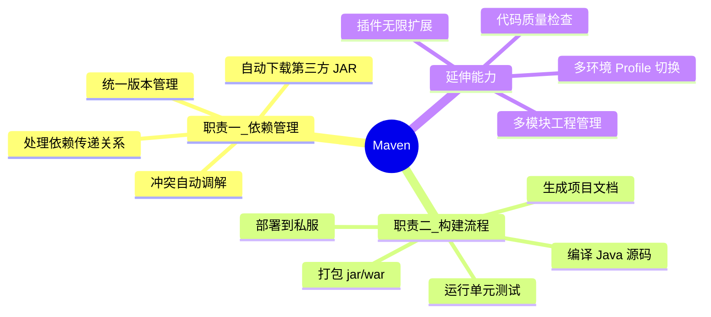

**没有 Maven 的世界（2004 年以前）**：
- 手动下载 `spring-xxx.jar`、`log4j.jar`、`commons-lang.jar` 复制到 `WEB-INF/lib`
- 每个项目各自维护 JAR，版本混乱
- 依赖 spring → 依赖 commons-logging → 依赖其他包，手动处理依赖链

**有了 Maven 之后**：
- 在 `pom.xml` 写一行 `<dependency>` 坐标，Maven 自动下载 JAR 及所有传递依赖
- 版本统一管理，冲突自动调解

### 1.2 核心理念：约定优于配置（CoC）

Maven 最大的设计哲学是 **Convention over Configuration（约定优于配置）**：**你只要遵循 Maven 的约定（目录结构、命名规则等），就不需要写复杂的构建脚本**。

| 配置项 | Maven 默认约定 | 如果不用 Maven，必须手动配置 |
|:------|:-------------|:-------------------------|
| 源码目录 | `src/main/java` | 自定义 ant task 找源码位置 |
| 资源目录 | `src/main/resources` | 手动 copy resources 到 classes |
| 测试目录 | `src/test/java` | 手写 test runner |
| 编译输出 | `target/classes` | 手动指定输出目录 |
| 打包产物 | `target/<artifactId>-<version>.jar` | 自定义打包路径 |
| 依赖仓库 | `~/.m2/repository` | 每个项目独立 lib 文件夹 |

**好处**：新成员接手项目一看结构就懂，不需要阅读复杂构建脚本；坏处：**约定必须遵守，否则 Maven 报各种找不到路径的错误**。

### 1.3 与 Gradle / Ant 的对比

| 对比维度 | **Maven** ✨ Java 项目标准 | Gradle | Ant |
|:--------|:------------------------|:------|:----|
| **核心理念** | 约定优于配置（CoC） | 约定 + 灵活 DSL | 纯脚本，无约定 |
| **配置格式** | XML（结构化、严格） | Groovy/Kotlin DSL（可编程） | XML 任务脚本 |
| **学习曲线** | ⭐⭐ 低，固定结构好上手 | ⭐⭐⭐⭐ 高，DSL 复杂 | ⭐⭐⭐ 中，任务粒度细 |
| **构建速度** | ⭐⭐ 中规中矩 | ⭐⭐⭐⭐⭐ 增量构建+缓存极快 | ⭐⭐⭐ 取决于脚本 |
| **生态成熟度** | ⭐⭐⭐⭐⭐ Java 项目事实标准 10+ 年 | ⭐⭐⭐⭐ 快速增长 | ⭐⭐ 老旧，新项目不推荐 |
| **灵活性** | ⭐⭐ XML 不够灵活，需写插件扩展 | ⭐⭐⭐⭐⭐ 可编程，逻辑分支随意写 | ⭐⭐⭐⭐⭐ 完全自定义 |
| **依赖管理** | ⭐⭐⭐⭐⭐ 成熟稳定，传递依赖处理完善 | ⭐⭐⭐⭐ 不错 | ❌ 无原生依赖管理，需 Ivy |
| **多模块工程** | ⭐⭐⭐⭐ 开箱即用 | ⭐⭐⭐⭐⭐ 复合构建更强 | ❌ 需手写 import 脚本 |
| **适用场景** | 企业级 Java / Spring Boot / 传统 Java Web | Android / 大型项目 / 需要自定义构建逻辑 | 遗留老项目 |

> **选型建议**：95% 的 Java 企业项目、Spring Boot 项目使用 **Maven** 作为默认构建工具，生态最完善、坑最少、团队学习成本最低。

### 1.4 Maven 工作原理概览

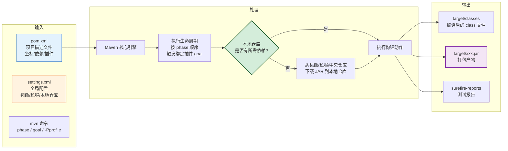

---

## 二、安装与环境配置

### 2.1 Windows 下安装步骤

```
Step 1: 下载 Maven
    访问 https://maven.apache.org/download.cgi
    下载 apache-maven-3.9.9-bin.zip

Step 2: 解压到固定目录
    例如 D:\develop\apache-maven-3.9.9
    目录结构:
      apache-maven-3.9.9/
      ├── bin/           # 可执行脚本（mvn.cmd / mvnDebug.cmd）
      ├── boot/          # maven 启动引导器
      ├── conf/
      │   └── settings.xml   # ✅ 全局级配置（重要！）
      └── lib/           # maven 自身依赖

Step 3: 配置环境变量
    系统变量:
      MAVEN_HOME = D:\develop\apache-maven-3.9.9
      或 M2_HOME = D:\develop\apache-maven-3.9.9  （老版本兼容）

    Path 系统变量追加:
      %MAVEN_HOME%\bin

Step 4: 配置 JAVA_HOME（Maven 依赖 JDK）
    JAVA_HOME 必须指向 JDK（不能是 JRE）
    建议 JDK 1.8 或 JDK 17，Java 8 + Maven 3.6 是最稳妥组合
```

### 2.2 三层配置文件与加载顺序

Maven 的配置文件分为**三层**，后加载覆盖先加载：

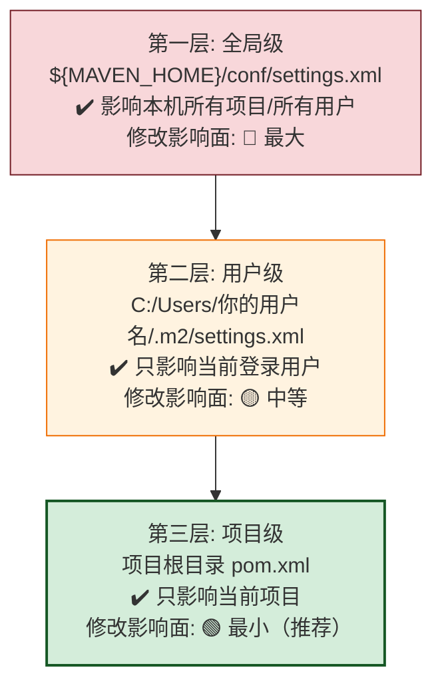

> ⚠️ **最佳实践（经验 1358123 得出）**：尽量使用**项目级 pom.xml** 做配置，其次是**用户级 ~/.m2/settings.xml**。**不到万不得已不要改全局 `conf/settings.xml`**——改了会影响本机所有项目，且容易造成别人的项目在你机器上跑不起来。

### 2.3 验证安装成功

```powershell
# Windows PowerShell 或 CMD
mvn -v

# 正确输出示例:
# Apache Maven 3.9.9 (ff98e62b4eaff9e17125...)
# Maven home: D:\develop\apache-maven-3.9.9
# Java version: 1.8.0_432, vendor: Temurin
# Java home: D:\develop\jdk1.8.0_432\jre
# Default locale: zh_CN, platform encoding: GBK
# OS name: "windows 11", version: "10.0", arch: "amd64", family: "windows"

# 注意点:
#   1) 必须显示具体 Maven 版本，否则环境变量未配好
#   2) 必须显示 Java version 1.8+（不能是 JRE-only 模式）
```

---

## 三、标准项目结构

### 3.1 单模块项目目录结构

**必须严格遵守 Maven 约定！** 否则 Maven 找不到源码、资源、测试类。

```
my-springboot-app/
├── pom.xml                          # ✅ Maven 核心：项目描述（必须在项目根）
├── src/
│   ├── main/
│   │   ├── java/                    # ✅ Java 源码目录（package 路径从此开始）
│   │   │   └── com/
│   │   │       └── example/
│   │   │           └── myapp/
│   │   │               ├── MyAppApplication.java    # Spring Boot 启动类
│   │   │               ├── controller/              # Controller 层
│   │   │               ├── service/                 # Service 层
│   │   │               ├── mapper/                  # MyBatis Mapper
│   │   │               └── entity/                  # 实体类
│   │   ├── resources/               # ✅ 资源文件（编译后复制到 classpath）
│   │   │   ├── application.yml      # Spring Boot 配置
│   │   │   ├── application-dev.yml
│   │   │   ├── application-prod.yml
│   │   │   ├── mapper/              # MyBatis XML 映射文件
│   │   │   │   └── UserMapper.xml
│   │   │   └── logback-spring.xml   # 日志配置
│   │   └── webapp/                  # ⚠️ 仅 WAR 包传统 SpringMVC 需要（Spring Boot 可省）
│   │       └── WEB-INF/
│   │           └── web.xml
│   └── test/
│       ├── java/                    # ✅ 测试源码（编译不进最终 jar）
│       │   └── com/
│       │       └── example/
│       │           └── myapp/
│       │               ├── controller/
│       │               │   └── UserControllerTest.java
│       │               └── service/
│       │                   └── UserServiceTest.java
│       └── resources/               # ✅ 测试专用资源（仅测试执行时可见）
│           └── application-test.yml
├── target/                          # 构建输出目录（clean 会删除，不要手改）
│   ├── classes/                     # 编译后的 .class 文件 + resources 复制
│   ├── test-classes/                # 测试 .class 文件
│   ├── my-springboot-app-1.0.0.jar  # 打包产物
│   └── surefire-reports/            # JUnit 测试结果报告
└── README.md
```

### 3.2 各目录职责说明

| 目录 | 编译进 JAR | 运行时 classpath 可访问 | 用途 |
|:-----|:---------:|:---------------------|:-----|
| `src/main/java` | ✅ 是 | ✅ 是 | 写业务 Java 源码 |
| `src/main/resources` | ✅ 是 | ✅ 是 | 配置文件、MyBatis XML、静态资源 |
| `src/main/webapp` | ✅ （WAR） | ✅ （WAR） | JSP/HTML 传统 Web 项目 |
| `src/test/java` | ❌ 否 | ❌ 否（仅测试时） | JUnit/TestNG 测试代码 |
| `src/test/resources` | ❌ 否 | ❌ 否（仅测试时） | 测试专用配置、Mock 数据 |
| `target/*` | — | — | 构建产物，`mvn clean` 会清空 |

### 3.3 多模块（聚合）项目结构

大项目会拆分为多个子模块，由**父 POM** 统一管理：

```
my-enterprise-project/          # ✅ 父工程根目录
├── pom.xml                     # 父 POM：packaging = pom，不打 jar
├── myapp-common/               # 子模块 1：公共工具、通用实体
│   ├── pom.xml                 # 继承父 POM
│   └── src/main/java/...
├── myapp-dal/                  # 子模块 2：数据访问层（MyBatis/DAO）
│   ├── pom.xml
│   └── src/main/java/...
├── myapp-service/              # 子模块 3：业务 Service 层
│   ├── pom.xml
│   └── src/main/java/...
├── myapp-api/                  # 子模块 4：对外 Feign/Dubbo 接口定义
│   ├── pom.xml
│   └── src/main/java/...
└── myapp-web/                  # 子模块 5：Web 启动模块，最终打 JAR 运行
    ├── pom.xml
    └── src/main/java/...
```

---

## 四、POM 文件配置详解

### 4.1 POM 基本结构

`pom.xml`（Project Object Model）是 Maven 的**灵魂文件**：

```xml
<?xml version="1.0" encoding="UTF-8"?>
<project xmlns="http://maven.apache.org/POM/4.0.0"
         xmlns:xsi="http://www.w3.org/2001/XMLSchema-instance"
         xsi:schemaLocation="http://maven.apache.org/POM/4.0.0
                             http://maven.apache.org/xsd/maven-4.0.0.xsd">

    <!-- POM 版本，Maven 3.x 固定写 4.0.0 -->
    <modelVersion>4.0.0</modelVersion>

    <!-- ========== 坐标三要素（唯一确定一个 JAR） ========== -->
    <groupId>com.example</groupId>
    <artifactId>my-springboot-app</artifactId>
    <version>1.0.0</version>

    <!-- ========== 打包类型 ========== -->
    <packaging>jar</packaging>

    <!-- ========== 项目展示信息 ========== -->
    <name>My Spring Boot App</name>
    <description>企业级 Spring Boot 示例项目</description>

    <!-- ========== 属性定义（变量） ========== -->
    <properties>
        <java.version>1.8</java.version>
        <spring-boot.version>2.7.18</spring-boot.version>
        <mybatis-plus.version>3.5.7</mybatis-plus.version>
        <maven.compiler.source>${java.version}</maven.compiler.source>
        <maven.compiler.target>${java.version}</maven.compiler.target>
        <project.build.sourceEncoding>UTF-8</project.build.sourceEncoding>
    </properties>

    <!-- ========== 依赖声明 ========== -->
    <dependencies>
        <!-- 各种 dependency 节点 -->
    </dependencies>

    <!-- ========== 统一依赖版本管理（父 POM 主要作用） ========== -->
    <dependencyManagement>
        <dependencies>
            <!-- 各种 dependency 只写版本号，子项目按需引用 -->
        </dependencies>
    </dependencyManagement>

    <!-- ========== 构建配置（插件等） ========== -->
    <build>
        <plugins>
            <!-- 各种 plugin 节点 -->
        </plugins>
    </build>

    <!-- ========== 多环境 Profile ========== -->
    <profiles>
        <!-- dev/test/prod 三套环境 -->
    </profiles>

</project>
```

### 4.2 坐标三要素：groupId / artifactId / version

**坐标** 是 Maven 用来在全世界唯一确定一个 JAR 包的命名规则：

```
groupId : 组织/公司域名反写 + 项目分组
  └── 如 com.alibaba / org.springframework.boot / com.example

artifactId : 具体模块名（JAR 包名主体）
  └── 如 druid / spring-boot-starter-web / my-springboot-app

version : 版本号（语义化最佳）
  └── 如 1.2.23 / 2.7.18 / 1.0.0-SNAPSHOT

完整坐标写法（唯一确定一个 JAR）:
  com.alibaba : druid : 1.2.23
  ──────────────────────────
  groupId   : artifactId : version
```

> **`SNAPSHOT` 版本含义**：`1.0.0-SNAPSHOT` 表示"1.0.0 开发版"，Maven 每次构建都会从私服拉取最新快照；一旦发正式版，改成 `1.0.0`（固定版本，内容不可变）。

### 4.3 properties 属性定义

`<properties>` 相当于 POM 内的全局变量，通过 `${变量名}` 引用，有两大作用：

1. **统一版本号**，避免每个依赖都重复写版本
2. **覆盖 Maven 内置参数**，如编码、Java 版本

```xml
<properties>
    <!-- 自定义属性：版本号统一管理 -->
    <spring-boot.version>2.7.18</spring-boot.version>
    <mybatis-plus.version>3.5.7</mybatis-plus.version>

    <!-- Maven 内置编译参数覆盖 -->
    <java.version>1.8</java.version>
    <maven.compiler.source>${java.version}</maven.compiler.source>   <!-- 编译源码版本 -->
    <maven.compiler.target>${java.version}</maven.compiler.target>   <!-- 编译目标字节码版本 -->
    <project.build.sourceEncoding>UTF-8</project.build.sourceEncoding>   <!-- 源码编码，防止 GBK 乱码 -->
    <project.reporting.outputEncoding>UTF-8</project.reporting.outputEncoding>
</properties>

<!-- 引用示例：${spring-boot.version} -->
<dependencies>
    <dependency>
        <groupId>org.springframework.boot</groupId>
        <artifactId>spring-boot-starter-web</artifactId>
        <version>${spring-boot.version}</version>
    </dependency>
</dependencies>
```

### 4.4 packaging 打包类型

| packaging 值 | 产物 | 触发场景 |
|:------------|:----|:--------|
| `jar`（默认） | `xxx.jar` | Spring Boot 应用、通用工具库 |
| `war` | `xxx.war` | 传统 Spring MVC 部署到 Tomcat 外置容器 |
| `pom` | 无任何产物（父工程只做管理） | 父工程/聚合工程（不写代码） |
| `maven-plugin` | Maven 插件 JAR | 自定义 Maven 插件开发 |

---

## 五、依赖管理机制

### 5.1 dependency 依赖声明

```xml
<dependencies>

    <!-- 最小声明写法 -->
    <dependency>
        <groupId>org.springframework.boot</groupId>
        <artifactId>spring-boot-starter-web</artifactId>
        <!-- 版本号：如果继承了 spring-boot-starter-parent 可省略，否则必须写 -->
    </dependency>

    <!-- 完整声明写法 -->
    <dependency>
        <groupId>com.alibaba</groupId>
        <artifactId>druid-spring-boot-starter</artifactId>
        <version>1.2.23</version>

        <!-- 依赖范围 -->
        <scope>compile</scope>

        <!-- 排除传递依赖 -->
        <exclusions>
            <exclusion>
                <groupId>org.slf4j</groupId>
                <artifactId>slf4j-log4j12</artifactId>
            </exclusion>
        </exclusions>

        <!-- 可选依赖：下游消费者不会自动传递 -->
        <optional>false</optional>
    </dependency>

</dependencies>
```

### 5.2 依赖范围 scope

`scope` 控制**依赖出现在哪些 classpath 中**（编译时 / 测试时 / 运行时），共 6 种：

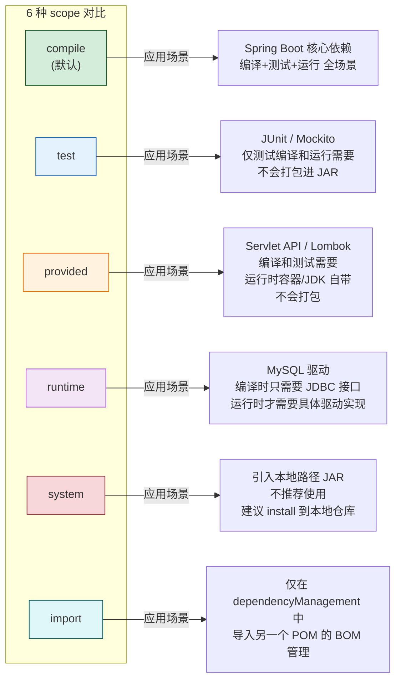

**6 种 scope 与 classpath 关系表**：

| scope 值 | 编译 classpath | 测试 classpath | 运行时打包 | 示例 |
|:--------|:------------:|:------------:|:---------:|:-----|
| **compile**（默认） | ✅ | ✅ | ✅ | spring-boot-starter-web |
| **test** | ❌ | ✅ | ❌ | junit / mockito |
| **provided** | ✅ | ✅ | ❌ | servlet-api / lombok |
| **runtime** | ❌ | ✅ | ✅ | mysql-connector-j |
| **system** | ✅ | ✅ | ❌（需手动配置） | 本地磁盘某个 jar（不推荐） |
| **import** | 不适用，仅用于 dependencyManagement 导入 BOM | | | spring-boot-dependencies |

### 5.3 依赖传递与依赖调解

Maven 支持**依赖传递**：A 依赖 B，B 依赖 C，则 A 自动获得 C（无需在 A 的 pom 里声明 C）。

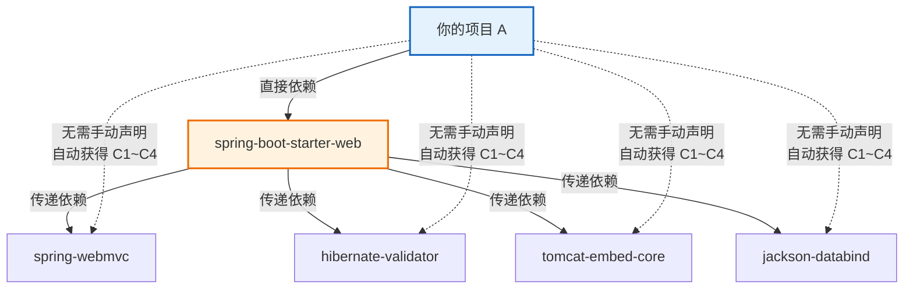

**依赖调解规则（发生冲突时 Maven 自动选哪个版本）**：

| 规则 | 优先级 | 说明 |
|:----|:------:|:-----|
| **第一声明者优先** | ⭐⭐⭐⭐⭐ | POM 中 `<dependency>` 写在前面的胜出 |
| **路径最短者优先** | ⭐⭐⭐⭐ | 依赖链越短胜出（如 A→B→C:1.0  vs  A→C:2.0，后者胜出因为只有 2 层） |
| **版本锁定（dependencyManagement）** | ⭐⭐⭐⭐⭐⭐（最高！） | 显式在 `<dependencyManagement>` 声明版本，无视上述两条规则 |

> ✅ **最佳实践**：不要依赖"自动调解"的运气，统一使用 `dependencyManagement` 显式锁定版本。

### 5.4 可选依赖 optional / 排除依赖 exclusions

```xml
<!-- 可选依赖：下游项目不会自动传递，需要时必须手动显式引入 -->
<dependency>
    <groupId>com.example</groupId>
    <artifactId>myapp-common</artifactId>
    <version>1.0.0</version>
    <!-- 这里对 commons-pool2 标记为 optional=true，只有真正用它的项目才会手动加 -->
    <optional>true</optional>
</dependency>

<!-- 排除依赖：把传递依赖中的某个包剔除（最常见：解决日志冲突/版本冲突） -->
<dependency>
    <groupId>org.springframework.boot</groupId>
    <artifactId>spring-boot-starter-web</artifactId>
    <exclusions>
        <!-- 场景：项目使用 logback，排除 web 自带的 log4j 相关包防止冲突 -->
        <exclusion>
            <groupId>org.slf4j</groupId>
            <artifactId>slf4j-log4j12</artifactId>
        </exclusion>
    </exclusions>
</dependency>
```

### 5.5 dependencyManagement 统一版本管理

**父 POM 最核心的功能**：只"声明"版本号，不实际下载依赖；子模块写 `<dependency>` 可以省略 `<version>` 自动继承版本。

```xml
<!-- ============ 父 POM（packaging=pom） ============ -->
<dependencyManagement>
    <dependencies>

        <!-- 方式一：逐个声明 -->
        <dependency>
            <groupId>com.baomidou</groupId>
            <artifactId>mybatis-plus-boot-starter</artifactId>
            <version>${mybatis-plus.version}</version>
        </dependency>

        <!-- 方式二：导入 Spring Boot BOM（推荐） -->
        <!-- BOM = Bill of Materials，一个维护好的版本清单 -->
        <dependency>
            <groupId>org.springframework.boot</groupId>
            <artifactId>spring-boot-dependencies</artifactId>
            <version>${spring-boot.version}</version>
            <type>pom</type>
            <scope>import</scope>   <!-- 只能 import，写在 dependencyManagement 中 -->
        </dependency>

    </dependencies>
</dependencyManagement>
```

```xml
<!-- ============ 子模块 POM（继承父 POM） ============ -->
<dependencies>
    <!-- 省略 version！自动继承父 POM dependencyManagement 中声明的版本 -->
    <dependency>
        <groupId>com.baomidou</groupId>
        <artifactId>mybatis-plus-boot-starter</artifactId>
        <!-- ✅ 无需写 <version> -->
    </dependency>
</dependencies>
```

**Spring Boot 项目推荐继承方式**：

```xml
<project>
    <modelVersion>4.0.0</modelVersion>

    <!-- 继承官方 starter-parent，内置所有 Spring Boot BOM -->
    <parent>
        <groupId>org.springframework.boot</groupId>
        <artifactId>spring-boot-starter-parent</artifactId>
        <version>2.7.18</version>
        <relativePath/>  <!-- 从仓库查找，不用本地 pom -->
    </parent>

    <groupId>com.example</groupId>
    <artifactId>my-springboot-app</artifactId>
    <version>1.0.0</version>

    <dependencies>
        <!-- 所有 starter 依赖都可以省略 version -->
        <dependency>
            <groupId>org.springframework.boot</groupId>
            <artifactId>spring-boot-starter-web</artifactId>
        </dependency>
        <dependency>
            <groupId>org.springframework.boot</groupId>
            <artifactId>spring-boot-starter-test</artifactId>
            <scope>test</scope>
        </dependency>
    </dependencies>
</project>
```

### 5.6 版本范围（区间/通配符）

一般不推荐使用区间版本（构建不可重复），但需了解语法：

| 写法 | 含义 |
|:-----|:-----|
| `1.2.3` | 精确等于 1.2.3（默认，推荐） |
| `(, 1.2.3]` | 小于等于 1.2.3 |
| `[1.2.3, 2.0.0)` | 大于等于 1.2.3 且小于 2.0.0 |
| `[1.4.5, )` | 大于等于 1.4.5 |
| `LATEST` | 最新发布版或快照版（不推荐） |
| `RELEASE` | 最新发布版（不推荐） |

### 5.7 依赖冲突排障实战

**场景**：日志报错 `ClassNotFoundException: org.slf4j.impl.StaticLoggerBinder`，大概率是多套日志框架冲突。解决步骤：

```bash
# Step 1：打印完整依赖树（含传递链路），输出到 txt 方便 grep 搜索
mvn dependency:tree > dependency-tree.txt

# 输出示例:
# [INFO] com.example:my-springboot-app:jar:1.0.0
# [INFO] +- org.springframework.boot:spring-boot-starter-web:jar:2.7.18:compile
# [INFO] |  +- org.springframework:spring-web:jar:5.3.39:compile
# [INFO] |  \- com.fasterxml.jackson.core:jackson-databind:jar:2.13.5:compile
# [INFO] \- org.apache.zookeeper:zookeeper:jar:3.5.10:compile
# [INFO]    \- org.slf4j:slf4j-log4j12:jar:1.7.36:compile   <--- 找到冲突源头！

# Step 2：搜索特定包的所有引入路径
mvn dependency:tree -Dincludes=org.slf4j:slf4j-log4j12

# Step 3：在冲突来源包加上 exclusions（在 pom.xml 中编辑）
#         例如把 zookeeper 传递进来的 slf4j-log4j12 排除掉
```

```xml
<!-- 排障后的最终 pom.xml -->
<dependency>
    <groupId>org.apache.zookeeper</groupId>
    <artifactId>zookeeper</artifactId>
    <version>3.5.10</version>
    <exclusions>
        <exclusion>
            <groupId>org.slf4j</groupId>
            <artifactId>slf4j-log4j12</artifactId>
        </exclusion>
        <exclusion>
            <groupId>log4j</groupId>
            <artifactId>log4j</artifactId>
        </exclusion>
    </exclusions>
</dependency>
```

---

## 六、三套生命周期与插件系统

### 6.1 三套生命周期相互独立

Maven 定义了**三套相互完全独立**的生命周期（生命周期 = 一系列有序阶段）：

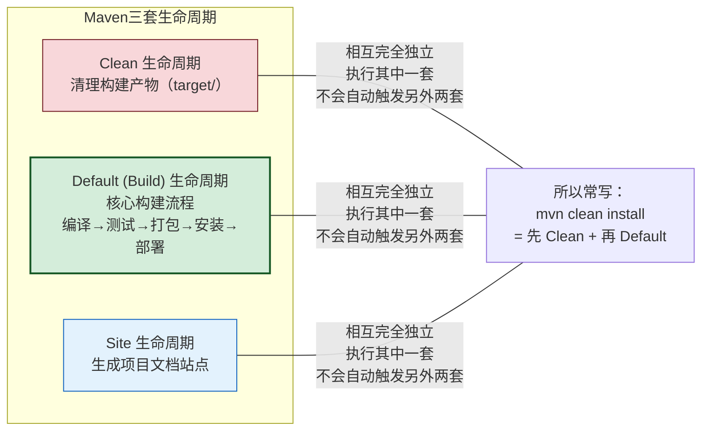

### 6.2 Clean 生命周期

| 阶段 | 含义 | 作用 |
|:----|:-----|:-----|
| `pre-clean` | 清理前准备 | 钩子阶段，插件可绑定动作 |
| `clean` | 执行清理 | **删除 target/ 目录**（`maven-clean-plugin`） |
| `post-clean` | 清理后收尾 | 钩子阶段 |

### 6.3 Default（Build）生命周期核心阶段

这是**最重要、最常用**的一套生命周期，共 23 个阶段，实际执行时会从最前面一直执行到指定阶段：

```
执行 mvn install 时，会按顺序执行以下所有阶段（依次触发）：

validate → initialize → generate-sources → process-sources
→ generate-resources → process-resources → compile
→ process-classes → generate-test-sources → process-test-sources
→ generate-test-resources → process-test-resources → test-compile
→ process-test-classes → test → prepare-package → package
→ pre-integration-test → integration-test → post-integration-test
→ verify → install → deploy
```

**常用核心阶段说明**（开发高频接触的 8 个）：

| 阶段名 | 作用 | 实际行为 |
|:------|:-----|:--------|
| `validate` | 验证 POM 正确性 | 检查坐标/依赖等基础信息 |
| `compile` | 编译源码 | `src/main/java` → `target/classes` |
| `test` | 执行单元测试 | 运行 JUnit，输出到 `target/surefire-reports` |
| `package` | 打包 | 打成 JAR/WAR 到 target/（根据 packaging 类型） |
| `verify` | 验证打包结果正确性 | 自定义检查（如 jar 内容是否符合预期） |
| `install` | 安装到本地仓库 | 复制 JAR 到 `~/.m2/repository/...` 供其他项目引用 |
| `deploy` | 部署到远程私服 | 上传 JAR 到 Nexus 等私服 |

### 6.4 Site 生命周期

| 阶段 | 作用 |
|:----|:-----|
| `pre-site` | 生成站点文档前的准备 |
| `site` | 生成项目站点文档（Javadoc、团队介绍、依赖报表等） |
| `post-site` | 站点生成完成 |
| `site-deploy` | 部署生成的站点到远程服务器 |

### 6.5 阶段执行顺序与前置触发

```
命令示例：mvn clean install package

执行顺序（三套独立）：

Clean 生命周期: pre-clean → clean → post-clean
     ↓
Default 生命周期: validate → ... → compile → ... → test → ... → package → ... → install

注：
  1) "package" 先执行，因为它在 Default 生命周期中排在 install 前面
  2) 同一生命周期中指定后面的阶段，会自动执行前面所有阶段
  3) 不同生命周期之间独立，必须显式指定各自要执行到哪一步
```

### 6.6 插件系统核心概念

Maven 自身是个**空壳调度器**，所有具体工作（编译、测试、打包、部署）全部由**插件**完成。插件 = 一组 Goal。

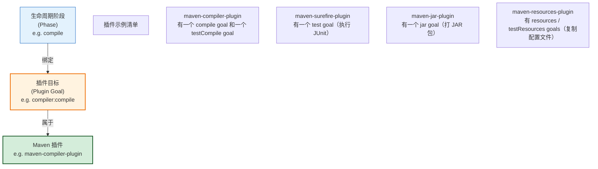

### 6.7 常用内置插件与常用第三方插件清单

| 插件 artifactId | 绑定的默认 phase | 功能 |
|:--------------|:---------------|:-----|
| `maven-resources-plugin` | process-resources | 复制 `src/main/resources` 到 classpath |
| `maven-compiler-plugin` | compile / test-compile | 编译 Java 源码 |
| `maven-surefire-plugin` | test | 执行 JUnit 单元测试 |
| `maven-jar-plugin` | package | 打 JAR 包 |
| `maven-war-plugin` | package | 打 WAR 包 |
| `maven-install-plugin` | install | 安装到本地仓库 |
| `maven-deploy-plugin` | deploy | 上传到远程私服 |
| `maven-clean-plugin` | clean | 删除 target/ |
| `maven-site-plugin` | site | 生成项目文档站 |

| 第三方插件 | 功能 | 适用场景 |
|:----------|:-----|:--------|
| `spring-boot-maven-plugin` | Spring Boot 打可执行 fat-JAR（含所有依赖） | 所有 Spring Boot 项目**必须**配置 |
| `mybatis-generator-maven-plugin` | 根据数据库表自动生成 MyBatis Entity/Mapper/XML | MyBatis 代码快速生成 |
| `maven-dependency-plugin` | copy / unpack / tree | 依赖分析、JAR 复制 |
| `maven-assembly-plugin` | 自定义打包（zip/tar.gz/distribution） | 发布版压缩包制作 |
| `sonar-maven-plugin` | 代码质量扫描 | 对接 SonarQube |
| `maven-source-plugin` | 生成 -sources.jar 并发布到私服 | 开源项目 / 内部代码溯源 |

### 6.8 插件配置示例：Spring Boot 打包 + MyBatis Generator

```xml
<build>
    <plugins>
        <!-- ========================================== -->
        <!-- 插件 1：Spring Boot 可执行 JAR 打包（必须） -->
        <!-- ========================================== -->
        <plugin>
            <groupId>org.springframework.boot</groupId>
            <artifactId>spring-boot-maven-plugin</artifactId>
            <version>${spring-boot.version}</version>
            <!-- 绑定到 Default 生命周期的 package 阶段 -->
            <executions>
                <execution>
                    <goals>
                        <goal>repackage</goal>   <!-- 核心 goal：二次打包生成 fat-JAR -->
                    </goals>
                </execution>
            </executions>
            <configuration>
                <!-- 指定启动类（Spring Boot 1.x 需要显式指定；2.x+ 自动找 @SpringBootApplication） -->
                <mainClass>com.example.myapp.MyAppApplication</mainClass>
                <!-- 打出可执行 JAR：java -jar xxx.jar 即可运行 -->
            </configuration>
        </plugin>

        <!-- ========================================== -->
        <!-- 插件 2：编译器插件（指定 JDK 版本，避免默认 1.5） -->
        <!-- ========================================== -->
        <plugin>
            <artifactId>maven-compiler-plugin</artifactId>
            <version>3.13.0</version>
            <configuration>
                <source>1.8</source>    <!-- 源码兼容版本 -->
                <target>1.8</target>    <!-- 字节码目标版本 -->
                <encoding>UTF-8</encoding>
            </configuration>
        </plugin>

        <!-- ========================================== -->
        <!-- 插件 3：MyBatis 代码生成器（需手动运行 goal） -->
        <!--   命令：mvn mybatis-generator:generate -->
        <!-- ========================================== -->
        <plugin>
            <groupId>org.mybatis.generator</groupId>
            <artifactId>mybatis-generator-maven-plugin</artifactId>
            <version>1.4.2</version>
            <configuration>
                <configurationFile>${basedir}/src/main/resources/generator/generatorConfig.xml</configurationFile>
                <overwrite>true</overwrite>
                <verbose>true</verbose>
            </configuration>
            <dependencies>
                <dependency>
                    <groupId>mysql</groupId>
                    <artifactId>mysql-connector-j</artifactId>
                    <version>8.2.0</version>
                </dependency>
            </dependencies>
        </plugin>
    </plugins>
</build>
```

---

## 七、仓库体系：本地 / 中央 / 私服

### 7.1 三类仓库关系

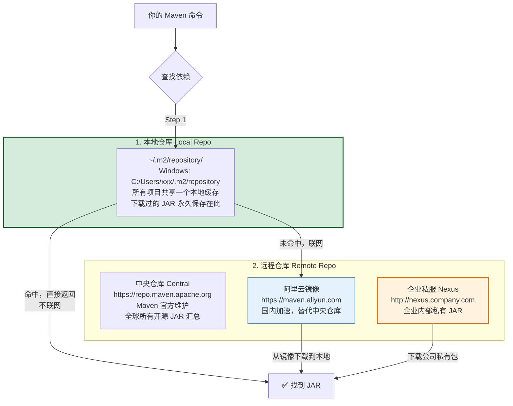

### 7.2 settings.xml 镜像配置

国内网络必做：把中央仓库替换成阿里云镜像，否则慢到超时。

推荐在**用户级** `C:/Users/你的用户名/.m2/settings.xml` 中配置：

```xml
<?xml version="1.0" encoding="UTF-8"?>
<settings xmlns="http://maven.apache.org/SETTINGS/1.0.0"
          xmlns:xsi="http://www.w3.org/2001/XMLSchema-instance"
          xsi:schemaLocation="http://maven.apache.org/SETTINGS/1.0.0
                              http://maven.apache.org/xsd/settings-1.0.0.xsd">

    <!-- ==================== 本地仓库路径（可选，默认 C:/Users/xxx/.m2/repository） ==================== -->
    <!-- 经验 1358123：若自定义此路径，要确保 IDE 的 Maven 插件用的 settings 指向这个文件，否则找不到 JAR -->
    <!--
    <localRepository>D:/mvn_repo</localRepository>
    -->

    <!-- ==================== 镜像配置（核心！） ==================== -->
    <mirrors>
        <!-- 阿里云 Maven 镜像：替换中央仓库，国内速度最快 -->
        <mirror>
            <id>aliyun-public</id>
            <name>Aliyun Maven Public</name>
            <url>https://maven.aliyun.com/repository/public</url>
            <!-- mirrorOf=* 表示拦截所有仓库请求都走这个镜像（除了下面例外） -->
            <mirrorOf>central</mirrorOf>
        </mirror>

        <!-- 经验 1358123 警告：禁止写多个 mirrorOf=* 条目！后写的会覆盖前面，导致第一个完全失效 -->
        <!-- 如需区分：一个 *.public 镜像 + 其他不同 mirrorOf 值的镜像，不能冲突 -->
    </mirrors>

    <!-- ==================== 私服认证（如果公司有 Nexus） ==================== -->
    <servers>
        <!-- server 的 id 必须和 pom.xml 中 <repository><id> 完全一致 -->
        <server>
            <id>company-nexus-releases</id>
            <username>deploy</username>
            <password>你的密码（建议加密）</password>
        </server>
        <server>
            <id>company-nexus-snapshots</id>
            <username>deploy</username>
            <password>你的密码</password>
        </server>
    </servers>

    <!-- ==================== 全局激活的 Profile ==================== -->
    <profiles>
        <profile>
            <id>company-dev</id>
            <repositories>
                <repository>
                    <id>company-nexus-releases</id>
                    <url>http://nexus.company.com/repository/maven-releases/</url>
                    <releases>
                        <enabled>true</enabled>
                    </releases>
                    <snapshots>
                        <enabled>false</enabled>
                    </snapshots>
                </repository>
            </repositories>
        </profile>
    </profiles>

    <activeProfiles>
        <activeProfile>company-dev</activeProfile>
    </activeProfiles>

</settings>
```

### 7.3 私服（Nexus）部署

企业中通常部署 Nexus 私服，有三大作用：

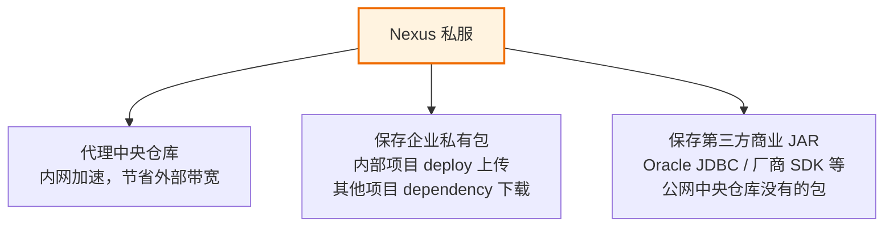

在项目 pom.xml 中配置私服上传地址（`<distributionManagement>`）：

```xml
<!-- 在父 POM 中配置，所有子模块继承 -->
<distributionManagement>
    <repository>
        <!-- id 必须与 settings.xml 中 <server><id> 一致！否则认证失败 -->
        <id>company-nexus-releases</id>
        <name>Company Nexus Releases</name>
        <url>http://nexus.company.com/repository/maven-releases/</url>
    </repository>
    <snapshotRepository>
        <id>company-nexus-snapshots</id>
        <name>Company Nexus Snapshots</name>
        <url>http://nexus.company.com/repository/maven-snapshots/</url>
    </snapshotRepository>
</distributionManagement>
```

**上传命令**：

```bash
# 自动根据 version 后缀选择仓库：
#   version 含 "-SNAPSHOT" → 传到 snapshotRepository
#   version 不含 "-SNAPSHOT" → 传到 repository
mvn clean deploy
```

### 7.4 本地 jar 包安装到本地仓库

遇到情况：拿到一个厂商的 `sdk-1.0.jar` 文件（不在任何公共仓库），其他项目也需要引用这个 SDK。

```bash
# 用 install:install-file 目标把外部 JAR 安装到本地仓库
mvn install:install-file ^
  -Dfile=D:/temp/sdk-1.0.jar ^
  -DgroupId=com.vendor ^
  -DartifactId=vendor-sdk ^
  -Dversion=1.0.0 ^
  -Dpackaging=jar

# 安装成功后，其他项目 pom.xml 可正常引用：
# <dependency>
#     <groupId>com.vendor</groupId>
#     <artifactId>vendor-sdk</artifactId>
#     <version>1.0.0</version>
# </dependency>
```

---

## 八、Maven 常用命令速查表

### 8.1 基础命令

| 命令 | 执行的 phase | 效果 | 常用场景 |
|:-----|:-----------|:-----|:--------|
| `mvn clean` | pre-clean → clean → post-clean | 删除 target/ 目录 | 构建前清理，避免旧 class 干扰 |
| `mvn compile` | validate → ... → compile | 编译 src/main/java → target/classes | 快速检查编译错误 |
| `mvn test` | ... → test-compile → test | 编译测试 + 运行 JUnit 单元测试 | 提交代码前验证测试通过 |
| `mvn test -Dtest=UserServiceTest` | test（仅运行指定类） | 只跑单个测试类 | 调试某个测试用例 |
| `mvn package` | ... → package | 编译+测试+打包（JAR/WAR 到 target/） | 生成可部署包 |
| `mvn package -DskipTests` | package（跳过 JUnit 执行） | 快速打包不跑测试 | 生产构建慎用，仅开发临时打包 |
| `mvn install` | ... → package → verify → install | 打包 + 安装到 `~/.m2/repository` | 父工程/多模块项目中，让其他模块能引用 |
| `mvn deploy` | ... → deploy | 打包 + 安装本地 + 上传私服 | 正式发布到企业 Nexus |
| `mvn site` | pre-site → site → post-site | 生成项目文档站 | 生成 JavaDoc + 项目报告 |

### 8.2 依赖相关命令

| 命令 | 功能 | 排障场景 |
|:-----|:-----|:--------|
| `mvn dependency:tree` | 打印完整依赖树（含传递链路） | ✅ 依赖冲突排查：查找谁引入了冲突包 |
| `mvn dependency:tree -Dincludes=log4j:log4j` | 搜索特定包的所有引入路径 | ✅ 找到某 JAR 的传递依赖来源 |
| `mvn dependency:analyze` | 分析声明了但未使用 / 使用了但未声明的依赖 | 清理无用依赖，显式补全未声明的依赖 |
| `mvn dependency:resolve` | 强制下载所有依赖到本地仓库（不编译） | ✅ 新项目第一次拉代码，先解依赖 |
| `mvn dependency:sources` | 下载所有依赖的源码包（-sources.jar） | IDE 中查看第三方源码 |
| `mvn dependency:go-offline` | 提前下载所有依赖到本地（含插件） | 断网环境前的准备工作 |

### 8.3 多模块过滤与 Profile 命令

| 命令 | 功能 | 说明 |
|:-----|:-----|:-----|
| `mvn clean install -pl myapp-service -am` | 只构建 myapp-service 模块**及其上游依赖** | 修改 service 层后，只构建该模块+它依赖的模块（节省时间） |
| `-pl` / `--projects` | 指定构建哪些模块（逗号分隔） | -pl myapp-common,myapp-service |
| `-am` / `--also-make` | 同时构建所指定模块的上游依赖模块 | 和 -pl 搭配，避免缺上游包 |
| `-amd` / `--also-make-dependents` | 同时构建依赖于指定模块的下游模块 | 修改 common 后，所有用到 common 的模块全构建 |
| `-Pdev` / `-P test,prod` | 激活指定 Profile | -P 后写 Profile 的 id，逗号分隔多 Profile |
| `-DskipTests` | 跳过 JUnit 测试执行（仍会编译测试代码） | package/install 前不想跑测试用 |
| `-Dmaven.test.skip=true` | 完全跳过测试（不编译+不执行） | 更快，但不验证测试编译通过 |
| `-Dmaven.compiler.source=17` | 临时覆盖 properties 中的参数值 | 不修改 pom，临时指定 Java 版本 |

---

## 九、Profile 多环境构建

### 9.1 什么是 Profile

Profile = Maven 的**环境开关**：一套环境变量 + 依赖集合 + 插件配置，构建时通过 `-Pxxx` 激活特定 Profile，使用对应配置。

典型用途：

| 环境 | API Base URL | 数据源 | 日志级别 | 是否开启 Mock |
|:----|:-----------|:------|:--------|:-----------|
| dev（本地开发） | http://localhost:8080 | 本地 MySQL | DEBUG | ✅ 开启 |
| test（测试环境） | http://test-api.company.com | 测试库 MySQL | INFO | ❌ 关闭 |
| prod（生产） | https://api.company.com | 生产库 MySQL | WARN | ❌ 关闭 |

### 9.2 三层 Profile 定义位置

| 定义位置 | 作用范围 | 推荐写什么 |
|:--------|:--------|:----------|
| `pom.xml` `<profiles>` 节点 | ✅ 仅该项目 | **项目级环境配置（推荐）**：所有团队成员共享 |
| 用户级 `~/.m2/settings.xml` `<profiles>` | ✅ 当前用户所有项目 | 私有认证信息、个性化偏好 |
| 全局 `conf/settings.xml` `<profiles>` | ✅ 本机所有用户 | 禁止（除非是所有人共用的构建服务器） |

> ⚠️ **经验 1043716 得出的坑**：命令 `-Pxxx` 的 `xxx` 必须和 `<profile>` 中的 `<id>` 完全一致！若写 `<profile><id>aliyun</id></profile>`，那必须写 `-Paliyun`，不能写 `-Pnexus`。

### 9.3 激活 Profile 的四种方式

| 激活方式 | 配置示例 | 优先级 |
|:--------|:--------|:------|
| **命令行显式指定（最高）** | `mvn package -Pdev` | 1（最高，覆盖所有） |
| settings.xml `<activeProfiles>` | `<activeProfiles><activeProfile>dev</activeProfile></activeProfiles>` | 2 |
| pom.xml `<activation><activeByDefault>true</activeByDefault>` | `<activation><activeByDefault>true</activeByDefault></activation>` | 3（仅无其他 Profile 激活时生效） |
| JDK / OS 自动检测 | `<activation><jdk>1.8</jdk></activation>` （当 JDK 为 1.8.x 时激活） | 4 |

### 9.4 实战：dev/test/prod 三套环境配置

```xml
<!-- 在项目 pom.xml 中定义三套 Profile -->
<profiles>

    <!-- ========== Profile 1：dev 开发环境（默认激活） ========== -->
    <profile>
        <id>dev</id>
        <activation>
            <activeByDefault>true</activeByDefault>
        </activation>
        <properties>
            <profile.active>dev</profile.active>
            <env.api.base>http://localhost:8080</env.api.base>
            <env.datasource.url>jdbc:mysql://127.0.0.1:3306/myapp_dev</env.datasource.url>
            <env.log.level>DEBUG</env.log.level>
            <env.mock.enabled>true</env.mock.enabled>
        </properties>
        <!-- 开发环境可以加一些额外依赖（如 H2 内存库、Mock 工具） -->
        <dependencies>
            <dependency>
                <groupId>com.h2database</groupId>
                <artifactId>h2</artifactId>
                <scope>runtime</scope>
            </dependency>
        </dependencies>
    </profile>

    <!-- ========== Profile 2：test 测试环境 ========== -->
    <profile>
        <id>test</id>
        <properties>
            <profile.active>test</profile.active>
            <env.api.base>http://test-api.company.com</env.api.base>
            <env.datasource.url>jdbc:mysql://10.0.0.21:3306/myapp_test</env.datasource.url>
            <env.log.level>INFO</env.log.level>
            <env.mock.enabled>false</env.mock.enabled>
        </properties>
    </profile>

    <!-- ========== Profile 3：prod 生产环境 ========== -->
    <profile>
        <id>prod</id>
        <properties>
            <profile.active>prod</profile.active>
            <env.api.base>https://api.company.com</env.api.base>
            <env.datasource.url>jdbc:mysql://10.0.0.11:3306/myapp_prod</env.datasource.url>
            <env.log.level>WARN</env.log.level>
            <env.mock.enabled>false</env.mock.enabled>
        </properties>
    </profile>

</profiles>
```

**配合资源过滤，将 Profile 参数注入到 Spring Boot application.yml**：

```xml
<!-- pom.xml 中开启资源过滤：把 ${变量名} 替换为 Profile 中定义的值 -->
<build>
    <resources>
        <resource>
            <directory>src/main/resources</directory>
            <filtering>true</filtering>   <!-- 开启变量替换 -->
            <!-- 只对 yml/properties 做变量替换，字体/图片等二进制文件不做 -->
            <includes>
                <include>*.yml</include>
                <include>*.yaml</include>
                <include>*.properties</include>
            </includes>
        </resource>
        <resource>
            <directory>src/main/resources</directory>
            <filtering>false</filtering>
            <!-- 除 yml/properties 以外的资源原样复制，不做过滤 -->
            <excludes>
                <exclude>*.yml</exclude>
                <exclude>*.yaml</exclude>
                <exclude>*.properties</exclude>
            </excludes>
        </resource>
    </resources>
</build>
```

```yaml
# src/main/resources/application.yml（使用 @变量@ 被 Maven 替换）
spring:
  profiles:
    active: @profile.active@      # ← Maven 打包时替换为 dev / test / prod

  datasource:
    url: @env.datasource.url@

app:
  api:
    base: @env.api.base@
  log:
    level: @env.log.level@
  mock:
    enabled: @env.mock.enabled@
```

**打包命令**：

```bash
# 默认激活 dev（因为有 activeByDefault=true）
mvn clean package

# 打包测试环境版
mvn clean package -Ptest

# 打包生产环境版
mvn clean package -Pprod

# 打包后 target/classes/application.yml 中变量会被替换为具体值
```

---

## 十、多模块工程最佳实践

### 10.1 父 POM + 子模块结构

```
my-enterprise-project/         ← 父工程（packaging=pom）
├── pom.xml                    ← 父 POM：dependencyManagement 统一版本
├── myapp-common/              ← 子模块（继承父 POM）
│   └── pom.xml
├── myapp-dal/
│   └── pom.xml
└── myapp-web/
    └── pom.xml
```

### 10.2 modules 聚合声明

```xml
<!-- ============ 父 POM ============ -->
<project>
    <modelVersion>4.0.0</modelVersion>
    <groupId>com.company</groupId>
    <artifactId>my-enterprise-project</artifactId>
    <version>1.0.0-SNAPSHOT</version>
    <packaging>pom</packaging>   <!-- 父工程必须写 pom，不打 JAR -->

    <!-- 聚合声明：列出所有子模块，父工程构建时会自动构建所有子模块 -->
    <modules>
        <module>myapp-common</module>
        <module>myapp-dal</module>
        <module>myapp-service</module>
        <module>myapp-api</module>
        <module>myapp-web</module>
    </modules>

    <!-- 全局属性 + dependencyManagement + build 等公共配置放在父 POM 里 -->
</project>
```

```xml
<!-- ============ 子模块 POM（如 myapp-dal/pom.xml） ============ -->
<project>
    <modelVersion>4.0.0</modelVersion>

    <!-- 继承父 POM，获得父 POM 所有 dependencyManagement 版本约束 -->
    <parent>
        <groupId>com.company</groupId>
        <artifactId>my-enterprise-project</artifactId>
        <version>1.0.0-SNAPSHOT</version>
        <!-- 父 POM 在上级目录（../pom.xml），用 relativePath 显式声明 -->
        <relativePath>../pom.xml</relativePath>
    </parent>

    <artifactId>myapp-dal</artifactId>
    <!-- 省略 groupId / version：自动继承父 POM 值 -->

    <dependencies>
        <!-- 引用兄弟模块：common，用兄弟间 groupId/artifactId/version -->
        <dependency>
            <groupId>com.company</groupId>
            <artifactId>myapp-common</artifactId>
            <!-- 无需写 version：父 POM dependencyManagement 已统一管理 -->
        </dependency>

        <dependency>
            <groupId>com.baomidou</groupId>
            <artifactId>mybatis-plus-boot-starter</artifactId>
            <!-- version 继承父 POM 中 dependencyManagement 的声明 -->
        </dependency>
    </dependencies>
</project>
```

### 10.3 继承 vs 聚合

| 概念 | 语法 | 目的 | 方向 |
|:-----|:-----|:-----|:-----|
| **继承（Inheritance）** | 子 POM `<parent>` 指向父 POM | 子模块继承父 POM 的配置（版本/插件/属性） | 子 → 父（自下而上引用） |
| **聚合（Aggregation）** | 父 POM `<modules>` 列子模块 | 构建父工程时自动构建所有列出的子模块 | 父 → 子（自上而下执行） |

> 实际项目中，**父 POM 同时做继承+聚合**是最常见的用法，两者相辅相成并不冲突。

### 10.4 分层模块划分（API/Service/DAL/Common/Web）

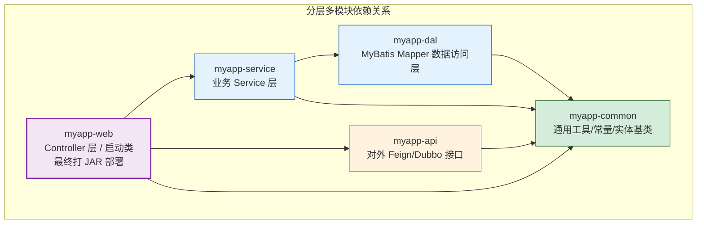

| 模块名 | 依赖方向 | 是否部署 | 职责 |
|:------|:--------|:-------|:-----|
| `myapp-common` | 无模块依赖 | ❌ 不部署 | 通用工具类、常量、BaseEntity、Result 封装 |
| `myapp-api` | 仅依赖 common | ❌ 不部署 | Feign 接口定义 / Dubbo RPC 接口 / DTO |
| `myapp-dal` | 依赖 common | ❌ 不部署 | MyBatis Mapper 接口、Entity、数据库交互 |
| `myapp-service` | 依赖 dal + common | ❌ 不部署 | 业务逻辑实现、事务、缓存 |
| `myapp-web` | 依赖 service + api + common | ✅ 打 JAR 部署 | Controller、Spring Boot 启动类、拦截器 |

---

## 十一、常见问题排障指南

### 11.1 Top 5 依赖问题

| 排名 | 现象/报错 | 根因 | 解决方案 |
|:----:|:---------|:-----|:--------|
| **1** | `Missing artifact xxx:xxx:jar:1.0` / "Maven Dependencies references non existing library" | 本地仓库缺 JAR 或 下载失败残留了 `.lastUpdated` 标记文件 | `mvn dependency:resolve -U` 强制重新下载；或删除本地仓库对应目录后重新 `mvn install` |
| **2** | `NoSuchMethodError / ClassNotFoundException` 运行时 | 依赖传递版本冲突，实际 classpath 中是旧版 JAR | `mvn dependency:tree -Dincludes=冲突包` 找出来源，在冲突来源上加 `<exclusion>` 排除 |
| **3** | IDEA 有红线但命令行 `mvn compile` 正常 | IDEA Maven 配置的 settings.xml 和命令行不一致（经验 1358123 典型） | 检查 IDEA → Settings → Build → Maven → User settings file 是否指向正确文件，并和 `mvn -v` 使用的是同一个 |
| **4** | 下载依赖极慢，报 "Read timed out" | 没配置国内镜像，直连海外中央仓库 | 在 settings.xml 中配置 aliyun mirror |
| **5** | `Could not transfer artifact xxx from/to central` | 镜像配置冲突 / settings.xml 多个 `mirrorOf=*` 条目互相覆盖 | 只保留 **一个** `mirrorOf=central` 镜像条目 |

### 11.2 settings.xml 镜像冲突排障

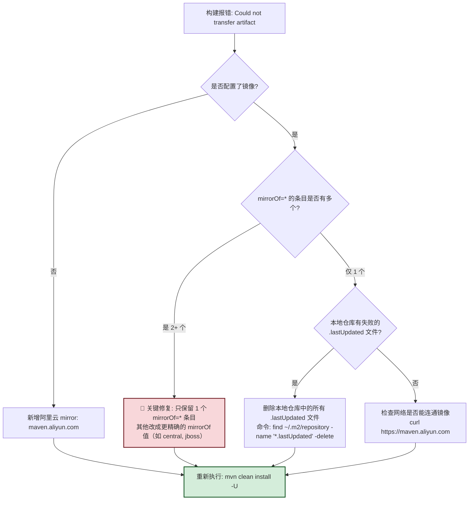

### 11.3 Unknown lifecycle phase 错误

**典型报错**：
```
[ERROR] Unknown lifecycle phase "clwan". You must specify a valid lifecycle phase or a goal.
```

根因：命令里写错了 phase 名（`clwan` 是 `clean` 的拼写错误）。Maven 只接受**固定的 23 个 Default 生命周期 phase 名**或**插件 goal 格式（`前缀:goal`）**。

解决方案：

| 错误命令 | 正确写法 | 说明 |
|:--------|:--------|:-----|
| `mvn clwan install` | `mvn clean install` | 拼写错误，clean 是唯一正确的 Clean 生命周期 phase |
| `mvn build` | `mvn package` 或 `mvn install` | Maven 没有叫 build 的 phase！构建是一整套 Default 生命周期的过程 |
| `mvn package -test` | `mvn package -DskipTests` / `-Ptest` | `-P` 是 Profile 开关，`-D` 是参数开关，不能混写；如果要跳过测试用 `-DskipTests` |
| `mvn generator` | `mvn mybatis-generator:generate` | 插件 goal 必须写 `插件前缀:goal`，不能只写前缀 |

### 11.4 Profile 未生效排障

**典型现象**：`mvn package -Ptest` 后 `application.yml` 中的 `@profile.active@` 没有被替换。

排障四步走：

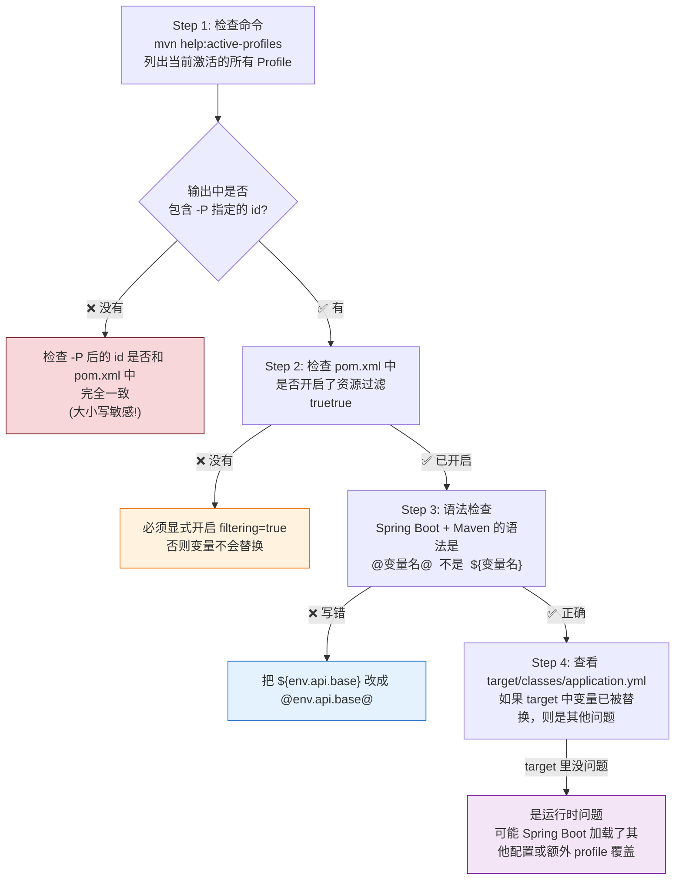

### 11.5 依赖 Missing artifact 排障

经验 1358123 得出的标准作业流程：

```
1. 先定位"仓库路径是否一致"：
   命令行执行:  mvn help:evaluate -Dexpression=settings.localRepository -q -DforceStdout
   IDEA 查看:   Settings → Build Tools → Maven → Local repository
   两者必须输出同一个路径！不一致会导致"命令行有 JAR 但 IDE 红线"或反过来。

2. 强制重新下载所有依赖（含失败重试）：
   mvn dependency:purge-local-repository
   （该命令会删除本地仓库的 resolved 依赖，然后重新 resolve 下载）

3. 若还是失败，定位是哪个包缺失：
   mvn dependency:tree -X   （-X 输出 DEBUG 日志，能看到每次请求的 URL 和 404）

4. 最后手段：清空整个本地仓库
   rm -rf ~/.m2/repository/*   （或 Windows: Remove-Item C:\Users\xxx\.m2\repository\* -Recurse）
   然后 mvn install 全量重新下载
```

---

## 十二、最佳实践清单

### 12.1 依赖管理最佳实践

| 编号 | 实践 | 说明 |
|:----:|:-----|:-----|
| DP1 | **继承 `spring-boot-starter-parent`** | Spring Boot 项目首选父 POM，内置所有 starter 版本，零配置统一 |
| DP2 | **父 POM 统一写 `dependencyManagement`** | 所有版本号集中在父 POM，子模块不写 version |
| DP3 | **绝不使用版本区间** | `[1.0.0, 2.0.0)` 导致每次构建版本可能不同，不可复现 |
| DP4 | **SNAPSHOT 仅限开发期** | `1.0.0-SNAPSHOT` 允许频繁更新；正式发版必须去除 SNAPSHOT |
| DP5 | **用 `dependency:tree` 定期审计** | 每个版本发布前跑一遍 dependency:tree，排查多余/冲突依赖 |
| DP6 | **日志框架统一用 slf4j-api** | 所有组件排除 commons-logging / slf4j-log4j12 / log4j，统一 logback |
| DP7 | **版本号放到 `<properties>`** | `${spring-boot.version}` 集中管理，升级一处生效 |
| DP8 | **自定义 scope 时明确原因** | 不要随便写 provided/runtime，注释说明为什么 |

### 12.2 工程结构最佳实践

| 编号 | 实践 | 说明 |
|:----:|:-----|:-----|
| SP1 | **严格遵守约定目录结构** | 不要自定义源码目录，增加维护成本；除非用 build-helper-plugin |
| SP2 | **大项目拆分多模块** | 按 layer（common/dal/service/api/web）或按业务拆分模块 |
| SP3 | **所有子模块 version 继承父 POM** | 不要在子模块中单独写 version，保持版本统一 |
| SP4 | **配置分层写 Profile** | dev/test/prod 三套 Profile + 资源过滤注入参数，避免环境差异 |
| SP5 | **不要修改全局 settings.xml** | 优先用户级 `~/.m2/settings.xml` / 项目级 pom.xml |
| SP6 | **`.gitignore` 忽略 target/** | 构建产物不进仓库 |

### 12.3 性能与效率最佳实践

| 编号 | 实践 | 说明 |
|:----:|:-----|:-----|
| EP1 | **必配阿里云镜像** | 国内网络把中央仓库替换为 aliyun，下载速度 10 倍+ |
| EP2 | **本地 SSD 存放仓库** | `~/.m2/repository` 有海量小文件，放在 SSD 明显更快 |
| EP3 | **使用 `-pl -am` 做增量构建** | 修改了 myapp-service，`mvn install -pl myapp-service -am` 只构建相关模块 |
| EP4 | **常用命令写 shell alias / IDEA 配置** | 把 `mvn clean install -DskipTests` 保存为快捷操作 |
| EP5 | **开启并行构建** | `mvn -T 1C clean install` 表示每个 CPU 核构建一个模块，多模块项目快 2~4 倍 |
| EP6 | **保留本地仓库缓存** | 不要频繁 `rm -rf ~/.m2/repository`，里面有大量已下载过的 JAR |
| EP7 | **升级到 Maven 3.9+** | Maven 3.9 有解析性能优化、构建缓存（Build Cache）等特性 |
| EP8 | **使用 `-Dmaven.test.skip=true` 加速打包** | 提交代码前用 CI 跑测试；本地打包可以临时跳过（仅 dev 环境） |

> **总结**：Maven 是 Java 生态最成熟、最稳定的构建工具。掌握**坐标三要素、依赖管理（scope/传递/dependencyManagement）、三套生命周期、插件系统、settings.xml 三层配置、Profile 多环境切换、多模块父子 POM**这八大核心知识点，配合排障方法论（`dependency:tree` / `help:active-profiles` / 镜像冲突排查），可以高效、稳定地支撑起任何级别的 Java 企业项目工程化实践。
