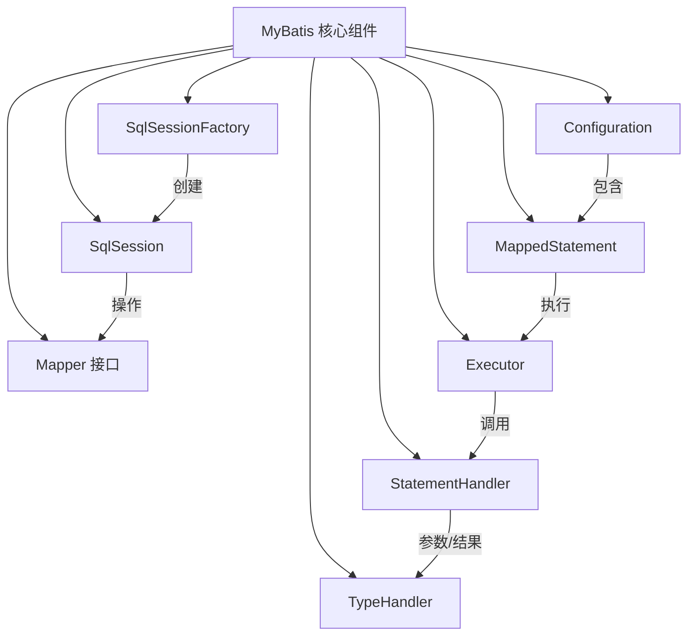
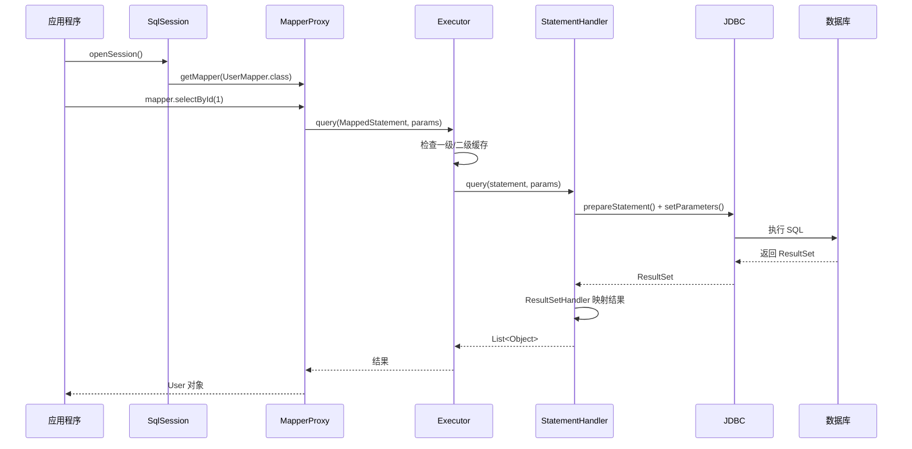
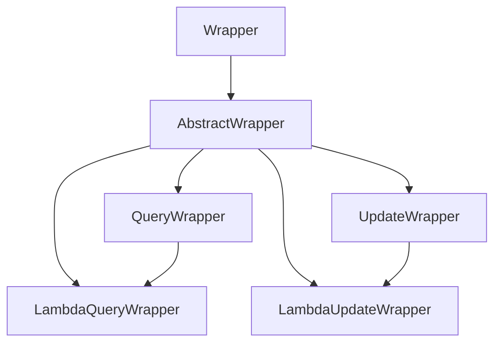
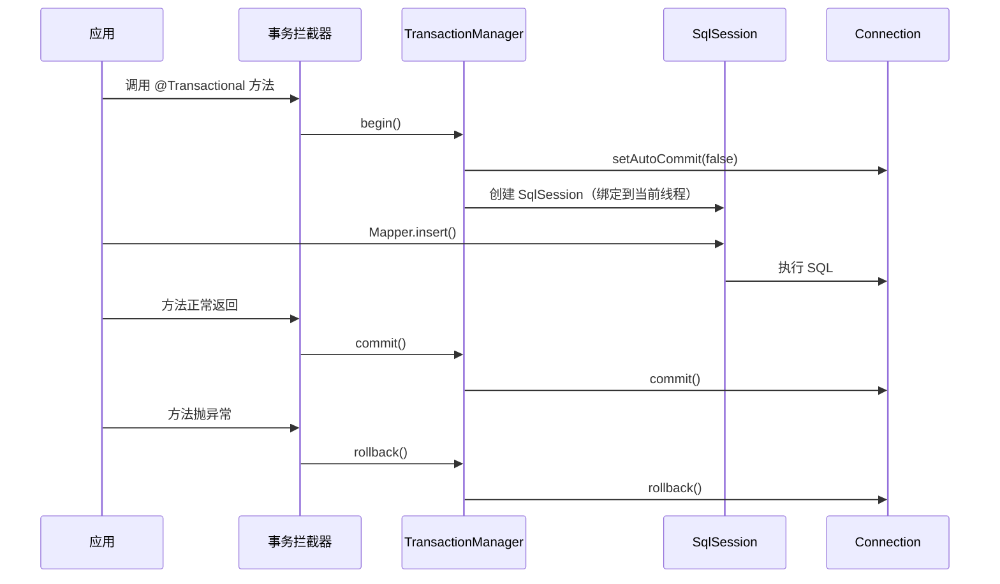

# MyBatis 与 MyBatis-Plus 高频面试题与详细回答

> 文档定位：系统梳理 MyBatis 及其增强框架 MyBatis-Plus 在面试中的高频问题，覆盖架构原理、核心配置、缓存机制、分页插件、事务连接池、性能优化、高级特性与综合实战。
>
> 适用人群：Java 后端工程师，尤其是使用 Spring Boot + MyBatis/MyBatis-Plus 技术栈的开发者。
>
> 阅读建议：先掌握 MyBatis 原生原理（一至六章），再学习 MyBatis-Plus 的增强能力（七至八章），重点关注「#{} vs ${}」「缓存机制」「分页原理」「条件构造器」四大核心考点。

***

## 目录

- [一、基础概念与架构原理](#一基础概念与架构原理)

  - [Q1. MyBatis 是什么？与 JDBC、Hibernate 有何区别？](#q1-mybatis-是什么与-jdbchibernate-有何区别)

  - [Q2. MyBatis 的核心组件有哪些？](#q2-mybatis-的核心组件有哪些)

  - [Q3. MyBatis 的完整执行流程？](#q3-mybatis-的完整执行流程)

  - [Q4. MyBatis-Plus 是什么？核心特性有哪些？](#q4-mybatis-plus-是什么核心特性有哪些)

  - [Q5. MyBatis-Plus 与 MyBatis 的关系？如何集成？](#q5-mybatis-plus-与-mybatis-的关系如何集成)

- [二、核心配置与映射](#二核心配置与映射)

  - [Q6. MyBatis XML 映射文件的常用标签有哪些？](#q6-mybatis-xml-映射文件的常用标签有哪些)

  - [Q7. #{} 和 ${} 的区别？](#q7--和-的区别)

  - [Q8. resultType 和 resultMap 的区别？](#q8-resulttype-和-resultmap-的区别)

  - [Q9. MyBatis 动态 SQL 有哪些标签？](#q9-mybatis-动态-sql-有哪些标签)

  - [Q10. MyBatis-Plus 条件构造器 Wrapper 详解？](#q10-mybatis-plus-条件构造器-wrapper-详解)

- [三、缓存机制](#三缓存机制)

  - [Q11. MyBatis 一级缓存原理？](#q11-mybatis-一级缓存原理)

  - [Q12. MyBatis 二级缓存原理与配置？](#q12-mybatis-二级缓存原理与配置)

  - [Q13. 缓存失效的场景有哪些？](#q13-缓存失效的场景有哪些)

  - [Q14. 生产环境如何正确使用 MyBatis 缓存？](#q14-生产环境如何正确使用-mybatis-缓存)

- [四、分页与插件机制](#四分页与插件机制)

  - [Q15. MyBatis 分页有哪些实现方式？](#q15-mybatis-分页有哪些实现方式)

  - [Q16. MyBatis 插件（Interceptor）原理与实现？](#q16-mybatis-插件interceptor原理与实现)

  - [Q17. MyBatis-Plus 分页插件 PaginationInnerInterceptor 原理？](#q17-mybatis-plus-分页插件-paginationinnerinterceptor-原理)

  - [Q18. MyBatis-Plus 乐观锁插件原理？](#q18-mybatis-plus-乐观锁插件原理)

- [五、事务与连接池](#五事务与连接池)

  - [Q19. MyBatis 的事务管理机制？](#q19-mybatis-的事务管理机制)

  - [Q20. Spring 集成 MyBatis 的事务如何工作？](#q20-spring-集成-mybatis-的事务如何工作)

  - [Q21. MyBatis 连接池配置与选型？](#q21-mybatis-连接池配置与选型)

  - [Q22. MyBatis 懒加载（延迟加载）原理？](#q22-mybatis-懒加载延迟加载原理)

- [六、性能优化](#六性能优化)

  - [Q23. MyBatis SQL 优化有哪些手段？](#q23-mybatis-sql-优化有哪些手段)

  - [Q24. MyBatis-Plus 批量操作如何优化？](#q24-mybatis-plus-批量操作如何优化)

  - [Q25. 字段映射与类型处理器优化？](#q25-字段映射与类型处理器优化)

  - [Q26. MyBatis-Plus 代码生成器使用？](#q26-mybatis-plus-代码生成器使用)

- [七、高级特性](#七高级特性)

  - [Q27. MyBatis-Plus 多数据源配置？](#q27-mybatis-plus-多数据源配置)

  - [Q28. MyBatis-Plus 逻辑删除实现？](#q28-mybatis-plus-逻辑删除实现)

  - [Q29. MyBatis-Plus 自动填充（MetaObjectHandler）？](#q29-mybatis-plus-自动填充metaobjecthandler)

  - [Q30. MyBatis 枚举映射与 TypeHandler？](#q30-mybatis-枚举映射与-typehandler)

- [八、综合实战题](#八综合实战题)

  - [Q31. 设计一个通用 DAO 层（BaseMapper 扩展）？](#q31-设计一个通用-dao-层basemapper-扩展)

  - [Q32. MyBatis-Plus 多租户（Tenant）实现？](#q32-mybatis-plus-多租户tenant实现)

  - [Q33. 百万级数据分页查询优化方案？](#q33-百万级数据分页查询优化方案)

- [九、高频速答与踩坑总结](#九高频速答与踩坑总结)

  - [9.1 速答卡片（20 秒一题）](#91-速答卡片20-秒一题)

  - [9.2 实战踩坑 10 例](#92-实战踩坑-10-例)

  - [9.3 复习优先级表](#93-复习优先级表)

***

## 一、基础概念与架构原理

### Q1. MyBatis 是什么？与 JDBC、Hibernate 有何区别？

#### 核心答案

MyBatis 是一个**半自动 ORM 框架**，它将 SQL 与 Java 对象映射，但 SQL 由开发者手写。相比 JDBC 更简洁，相比 Hibernate 更灵活。

#### 三者对比

| 维度     | JDBC   | MyBatis       | Hibernate          |
| ------ | ------ | ------------- | ------------------ |
| 类型     | 原生 API | 半自动 ORM       | 全自动 ORM            |
| SQL 编写 | 全部手写   | 开发者手写         | 自动生成（HQL）          |
| 灵活性    | 最高     | 高             | 低（复杂 SQL 需 native） |
| 开发效率   | 低      | 中             | 高                  |
| 性能     | 最高     | 高             | 中（对象映射开销）          |
| 数据库移植  | 差      | 差（SQL 绑定方言）   | 好（HQL 方言切换）        |
| 学习成本   | 低      | 中             | 高                  |
| 适用场景   | 简单项目   | 互联网项目（SQL 可控） | 传统企业项目             |

#### MyBatis 的核心优势

```
1. SQL 与 Java 代码分离，便于维护和优化
2. 支持动态 SQL，灵活构建复杂查询
3. 映射灵活，支持复杂结果集映射（resultMap）
4. 与 Spring 无缝集成
5. 插件机制可扩展（分页、乐观锁等）
```

#### MyBatis 的劣势

```
1. SQL 工作量大，需手写大量 XML
2. 数据库移植性差（切换数据库需改 SQL）
3. 没有自动建表、DDL 管理能力
```

***

### Q2. MyBatis 的核心组件有哪些？

#### 核心组件一览



#### 各组件职责

| 组件                    | 职责                                       |
| --------------------- | ---------------------------------------- |
| **SqlSessionFactory** | 工厂类，创建 SqlSession，全局唯一                   |
| **SqlSession**        | 一次数据库会话，提供 CRUD 方法，非线程安全                 |
| **Mapper 接口**         | DAO 接口，MyBatis 通过动态代理生成实现                |
| **Configuration**     | 全局配置对象，保存所有映射信息                          |
| **MappedStatement**   | 对应一个 `<select>`/`<insert>` 等标签，封装 SQL 信息 |
| **Executor**          | 执行器，负责 SQL 执行和缓存管理                       |
| **StatementHandler**  | 操作 JDBC Statement                        |
| **TypeHandler**       | Java 类型与 JDBC 类型的转换                      |

#### SqlSessionFactory 创建

```java
// 方式1：XML 配置
String resource = "mybatis-config.xml";
InputStream inputStream = Resources.getResourceAsStream(resource);
SqlSessionFactory sqlSessionFactory =
    new SqlSessionFactoryBuilder().build(inputStream);

// 方式2：Spring Boot 自动装配
@Autowired
private SqlSessionFactory sqlSessionFactory;
```

#### Mapper 动态代理原理

```java
// MyBatis 通过 JDK 动态代理生成 Mapper 实现
public class MapperProxy<T> implements InvocationHandler {
    private final SqlSession sqlSession;
    private final Class<T> mapperInterface;

    @Override
    public Object invoke(Object proxy, Method method, Object[] args) {
        // 根据方法名找到对应的 MappedStatement
        // 委托 SqlSession 执行 SQL
        MappedStatement ms = configuration.getMappedStatement(
            mapperInterface.getName() + "." + method.getName());
        return sqlSession.selectOne(ms.getId(), args[0]);
    }
}

// 获取 Mapper
UserMapper mapper = sqlSession.getMapper(UserMapper.class);
User user = mapper.selectById(1L);  // 实际走动态代理
```

***

### Q3. MyBatis 的完整执行流程？



#### 详细步骤

| 步骤                     | 说明                                     |
| ---------------------- | -------------------------------------- |
| 1. 创建 SqlSession       | `SqlSessionFactory.openSession()`      |
| 2. 获取 Mapper 代理        | `sqlSession.getMapper(Mapper.class)`   |
| 3. 调用 Mapper 方法        | 走 JDK 动态代理                             |
| 4. 查找 MappedStatement  | 从 Configuration 中获取 SQL 配置             |
| 5. Executor 执行         | 先查缓存，再执行 SQL                           |
| 6. StatementHandler 处理 | 预编译 SQL、设置参数                           |
| 7. JDBC 执行             | 调用 JDBC API                            |
| 8. 结果映射                | ResultSetHandler 将 ResultSet 转 Java 对象 |

***

### Q4. MyBatis-Plus 是什么？核心特性有哪些？

#### 核心答案

MyBatis-Plus（简称 MP）是 MyBatis 的**增强工具**，在 MyBatis 基础上只做增强不做改变，简化开发、提高效率。

#### 核心特性

| 特性              | 说明                                                      |
| --------------- | ------------------------------------------------------- |
| **无侵入**         | 只增强不改变，引入不会对现有工程产生影响                                    |
| **损耗小**         | 启动即注入基本 CRUD，性能基本无损耗                                    |
| **强大 CRUD**     | 内置通用 Mapper（BaseMapper）和 Service（IService）              |
| **Lambda 形式调用** | `Wrappers.<User>lambdaQuery().eq(User::getName, "Tom")` |
| **多种主键策略**      | 支持 ASSIGN\_ID（雪花算法）、AUTO、INPUT 等                        |
| **分页插件**        | 内置物理分页插件                                                |
| **代码生成器**       | 一键生成 Entity/Mapper/Service/Controller                   |
| **逻辑删除**        | 全局逻辑删除配置                                                |
| **自动填充**        | 插入/更新时自动填充字段（如 createTime）                              |
| **乐观锁**         | 通过 @Version 注解实现                                        |
| **多租户**         | 内置多租户插件                                                 |
| **动态数据源**       | 配合 dynamic-datasource 实现多数据源                            |

#### 与 MyBatis 的关系

```
MyBatis-Plus 是 MyBatis 的增强版，底层仍使用 MyBatis 核心
它不是替代 MyBatis，而是在其上封装了便捷能力

MyBatis-Plus = MyBatis + 通用 CRUD + 条件构造器 + 插件集
```

#### 快速集成

```xml
<!-- pom.xml -->
<dependency>
    <groupId>com.baomidou</groupId>
    <artifactId>mybatis-plus-boot-starter</artifactId>
    <version>3.5.7</version>
</dependency>
```

```yaml
# application.yml
mybatis-plus:
  mapper-locations: classpath*:/mapper/**/*.xml
  configuration:
    map-underscore-to-camel-case: true
    log-impl: org.apache.ibatis.logging.stdout.StdOutImpl
  global-config:
    db-config:
      id-type: assign_id        # 主键策略：雪花算法
      logic-delete-field: deleted
      logic-delete-value: 1
      logic-not-delete-value: 0
```

***

### Q5. MyBatis-Plus 与 MyBatis 的关系？如何集成？

#### 继承关系

```
MyBatis-Plus 的 SqlSessionFactory 继承自 MyBatis
MybatisSqlSessionFactoryBean extends SqlSessionFactoryBean

启动时 MP 会：
1. 扫描 Mapper 接口
2. 自动注入 BaseMapper 的通用方法（通过 MappedStatement 注入）
3. 注册内置插件（分页、乐观锁等）
```

#### 集成 Spring Boot

```java
@SpringBootApplication
@MapperScan("com.example.mapper")  // 扫描 Mapper 接口
public class Application {
    public static void main(String[] args) {
        SpringApplication.run(Application.class, args);
    }
}
```

```java
// 实体类
@Data
@TableName("user")
public class User {
    @TableId(type = IdType.ASSIGN_ID)
    private Long id;

    @TableField("username")
    private String username;

    private String email;

    @TableField(fill = FieldFill.INSERT)
    private LocalDateTime createTime;

    @TableField(fill = FieldFill.INSERT_UPDATE)
    private LocalDateTime updateTime;

    @TableLogic
    private Integer deleted;
}
```

```java
// Mapper 接口
public interface UserMapper extends BaseMapper<User> {
    // 无需写 XML，自动拥有 17 个通用方法
    // selectById, selectList, insert, updateById, deleteById ...
}
```

#### BaseMapper 内置方法

```java
public interface BaseMapper<T> {
    int insert(T entity);
    int deleteById(Serializable id);
    int deleteByMap(@Param("cm") Map<String, Object> columnMap);
    int delete(@Param("ew") Wrapper<T> queryWrapper);
    int deleteBatchIds(@Param("coll") Collection<?> idList);

    int updateById(@Param("et") T entity);
    int update(@Param("et") T entity, @Param("ew") Wrapper<T> updateWrapper);

    T selectById(Serializable id);
    List<T> selectBatchIds(@Param("coll") Collection<? extends Serializable> idList);
    List<T> selectByMap(@Param("cm") Map<String, Object> columnMap);
    T selectOne(@Param("ew") Wrapper<T> queryWrapper);
    Long selectCount(@Param("ew") Wrapper<T> queryWrapper);
    List<T> selectList(@Param("ew") Wrapper<T> queryWrapper);
    List<Map<String, Object>> selectMaps(@Param("ew") Wrapper<T> queryWrapper);
    List<Object> selectObjs(@Param("ew") Wrapper<T> queryWrapper);
    <P extends IPage<T>> P selectPage(P page, @Param("ew") Wrapper<T> queryWrapper);
    <P extends IPage<Map<String, Object>>> P selectMapsPage(P page, @Param("ew") Wrapper<T> queryWrapper);
}
```

***

## 二、核心配置与映射

### Q6. MyBatis XML 映射文件的常用标签有哪些？

#### 常用标签分类

| 标签               | 作用         | 示例                                                              |
| ---------------- | ---------- | --------------------------------------------------------------- |
| `<select>`       | 查询         | `<select id="selectById" resultType="User">`                    |
| `<insert>`       | 插入         | `<insert id="insert" useGeneratedKeys="true" keyProperty="id">` |
| `<update>`       | 更新         | `<update id="updateById">`                                      |
| `<delete>`       | 删除         | `<delete id="deleteById">`                                      |
| `<sql>`          | SQL 片段     | `<sql id="cols">id, name</sql>`                                 |
| `<include>`      | 引入 SQL 片段  | `<include refid="cols"/>`                                       |
| `<resultMap>`    | 结果映射       | `<resultMap id="userMap" type="User">`                          |
| `<parameterMap>` | 参数映射（已过时）  | -                                                               |
| `<cache>`        | 二级缓存       | `<cache eviction="LRU" size="100"/>`                            |
| `<cache-ref>`    | 引用其他命名空间缓存 | `<cache-ref namespace="..."/>`                                  |

#### resultMap 标签

```xml
<resultMap id="userMap" type="com.example.User">
    <id property="id" column="user_id"/>
    <result property="username" column="user_name"/>
    <result property="email" column="email"/>
    <!-- 一对一关联 -->
    <association property="dept" javaType="com.example.Dept">
        <id property="id" column="dept_id"/>
        <result property="name" column="dept_name"/>
    </association>
    <!-- 一对多关联 -->
    <collection property="orders" ofType="com.example.Order">
        <id property="id" column="order_id"/>
        <result property="amount" column="amount"/>
    </collection>
</resultMap>
```

#### 完整示例

```xml
<?xml version="1.0" encoding="UTF-8"?>
<!DOCTYPE mapper PUBLIC "-//mybatis.org//DTD Mapper 3.0//EN"
    "http://mybatis.org/dtd/mybatis-3-mapper.dtd">
<mapper namespace="com.example.mapper.UserMapper">

    <sql id="baseCols">id, username, email, create_time</sql>

    <select id="selectById" resultType="com.example.User">
        SELECT <include refid="baseCols"/> FROM user WHERE id = #{id}
    </select>

    <insert id="insert" useGeneratedKeys="true" keyProperty="id">
        INSERT INTO user (username, email, create_time)
        VALUES (#{username}, #{email}, #{createTime})
    </insert>

    <update id="updateById">
        UPDATE user SET username = #{username}, email = #{email}
        WHERE id = #{id}
    </update>

    <delete id="deleteById">
        DELETE FROM user WHERE id = #{id}
    </delete>

</mapper>
```

***

### Q7. #{} 和 ${} 的区别？

#### 核心区别

| 维度         | `#{}`                  | `${}`            |
| ---------- | ---------------------- | ---------------- |
| **编译方式**   | 预编译（PreparedStatement） | 字符串拼接（Statement） |
| **SQL 注入** | ❌ 不会                   | ✅ 会（有注入风险）       |
| **参数替换**   | 替换为 `?` 占位符            | 直接拼接字符串          |
| **类型转换**   | 自动类型转换（TypeHandler）    | 无                |
| **适用场景**   | 所有参数值                  | 表名、列名、排序字段等      |

#### 示例对比

```xml
<!-- #{} 预编译 -->
<select id="selectById" resultType="User">
    SELECT * FROM user WHERE id = #{id}
</select>
<!-- 实际执行：SELECT * FROM user WHERE id = ?  参数: [1] -->

<!-- ${} 字符串拼接 -->
<select id="selectByColumn" resultType="User">
    SELECT * FROM user ORDER BY ${columnName}
</select>
<!-- 实际执行：SELECT * FROM user ORDER BY create_time -->
```

#### SQL 注入风险

```xml
<!-- ❌ 危险：${} 拼接用户输入 -->
<select id="selectByName" resultType="User">
    SELECT * FROM user WHERE name = '${name}'
</select>
<!-- 若 name = "' OR 1=1 --"，则 SQL 变为：
     SELECT * FROM user WHERE name = '' OR 1=1 --'
     → 查询全部数据，注入成功！ -->

<!-- ✅ 安全：使用 #{} -->
<select id="selectByName" resultType="User">
    SELECT * FROM user WHERE name = #{name}
</select>
<!-- 实际执行：SELECT * FROM user WHERE name = ?  参数: [' OR 1=1 --]
     不会注入 -->
```

#### 必须用 ${} 的场景

```xml
<!-- 1. 动态表名 -->
<select id="selectFromTable" resultType="Map">
    SELECT * FROM ${tableName} WHERE id = #{id}
</select>

<!-- 2. 动态列名 -->
<select id="selectByColumn" resultType="User">
    SELECT ${column} FROM user WHERE id = #{id}
</select>

<!-- 3. ORDER BY 字段 -->
<select id="selectList" resultType="User">
    SELECT * FROM user ORDER BY ${orderBy} ${sort}
</select>
```

> ⚠️ 使用 `${}` 时必须做**白名单校验**，防止 SQL 注入。

***

### Q8. resultType 和 resultMap 的区别？

| 维度    | resultType     | resultMap                   |
| ----- | -------------- | --------------------------- |
| 映射方式  | 自动映射（列名 → 属性名） | 手动映射                        |
| 适用场景  | 简单查询，列名与属性名一致  | 复杂查询、关联查询、列名不一致             |
| 配置位置  | select 标签属性    | 单独定义 resultMap 标签           |
| 关联支持  | ❌ 不支持一对一/一对多   | ✅ 支持 association/collection |
| 类型处理器 | 自动使用           | 可指定 typeHandler             |

#### resultType 示例

```xml
<!-- 列名与属性名一致（下划线转驼峰需配置 map-underscore-to-camel-case） -->
<select id="selectById" resultType="com.example.User">
    SELECT id, username, email, create_time FROM user WHERE id = #{id}
</select>
```

#### resultMap 示例

```xml
<!-- 复杂映射 -->
<resultMap id="userWithOrders" type="com.example.User">
    <id property="id" column="user_id"/>
    <result property="username" column="user_name"/>
    <!-- 一对多 -->
    <collection property="orders" ofType="com.example.Order">
        <id property="id" column="order_id"/>
        <result property="amount" column="amount"/>
    </collection>
</resultMap>

<select id="selectUserWithOrders" resultMap="userWithOrders">
    SELECT u.id AS user_id, u.username AS user_name,
           o.id AS order_id, o.amount
    FROM user u LEFT JOIN orders o ON u.id = o.user_id
    WHERE u.id = #{id}
</select>
```

***

### Q9. MyBatis 动态 SQL 有哪些标签？

| 标签                                    | 作用                      |
| ------------------------------------- | ----------------------- |
| `<if>`                                | 条件判断                    |
| `<choose>` / `<when>` / `<otherwise>` | 多条件分支（类似 switch）        |
| `<where>`                             | 自动添加 WHERE 并去除多余 AND/OR |
| `<set>`                               | 自动添加 SET 并去除末尾逗号        |
| `<trim>`                              | 自定义前后缀和去除内容             |
| `<foreach>`                           | 遍历集合（IN 子句、批量插入）        |
| `<bind>`                              | 绑定变量（如模糊查询拼接 %）         |

#### 常用组合示例

```xml
<!-- where + if -->
<select id="selectByCondition" resultType="User">
    SELECT * FROM user
    <where>
        <if test="username != null and username != ''">
            AND username LIKE CONCAT('%', #{username}, '%')
        </if>
        <if test="email != null">
            AND email = #{email}
        </if>
    </where>
</select>

<!-- set + if -->
<update id="updateById">
    UPDATE user
    <set>
        <if test="username != null">username = #{username},</if>
        <if test="email != null">email = #{email},</if>
    </set>
    WHERE id = #{id}
</update>

<!-- foreach -->
<select id="selectByIds" resultType="User">
    SELECT * FROM user WHERE id IN
    <foreach collection="ids" item="id" open="(" separator="," close=")">
        #{id}
    </foreach>
</select>

<!-- foreach 批量插入 -->
<insert id="batchInsert">
    INSERT INTO user (username, email) VALUES
    <foreach collection="list" item="u" separator=",">
        (#{u.username}, #{u.email})
    </foreach>
</insert>

<!-- choose/when/otherwise -->
<select id="selectByType" resultType="User">
    SELECT * FROM user
    <where>
        <choose>
            <when test="type == 'admin'">AND role = 'admin'</when>
            <when test="type == 'vip'">AND is_vip = 1</when>
            <otherwise>AND role = 'normal'</otherwise>
        </choose>
    </where>
</select>

<!-- trim 自定义 -->
<select id="selectByTrim">
    SELECT * FROM user
    <trim prefix="WHERE" prefixOverrides="AND|OR">
        <if test="username != null">AND username = #{username}</if>
    </trim>
</select>
```

***

### Q10. MyBatis-Plus 条件构造器 Wrapper 详解？

#### Wrapper 体系



| Wrapper               | 用途            | 字段引用方式               |
| --------------------- | ------------- | -------------------- |
| `QueryWrapper`        | 查询条件          | 字符串列名                |
| `UpdateWrapper`       | 更新条件 + SET 字段 | 字符串列名                |
| `LambdaQueryWrapper`  | 查询条件（Lambda）  | 方法引用 `User::getName` |
| `LambdaUpdateWrapper` | 更新条件（Lambda）  | 方法引用                 |

#### 常用方法

```java
// QueryWrapper 示例
QueryWrapper<User> qw = new QueryWrapper<>();
qw.eq("username", "Tom")           // =
  .ne("age", 18)                   // !=
  .gt("age", 18)                   // >
  .ge("age", 18)                   // >=
  .lt("age", 30)                   // <
  .le("age", 30)                   // <=
  .between("age", 18, 30)          // BETWEEN
  .like("username", "Tom")         // LIKE '%Tom%'
  .likeLeft("username", "Tom")     // LIKE '%Tom'
  .likeRight("username", "Tom")    // LIKE 'Tom%'
  .in("id", Arrays.asList(1, 2, 3))
  .isNull("email")
  .isNotNull("phone")
  .orderByDesc("create_time")
  .last("LIMIT 10");               // 拼接 SQL 末尾

// LambdaQueryWrapper 示例（推荐，编译期检查）
LambdaQueryWrapper<User> lqw = Wrappers.<User>lambdaQuery()
    .eq(User::getUsername, "Tom")
    .like(User::getEmail, "@example.com")
    .between(User::getAge, 18, 30)
    .orderByDesc(User::getCreateTime);

List<User> users = userMapper.selectList(lqw);
```

#### UpdateWrapper 示例

```java
// UpdateWrapper：SET 子句和 WHERE 条件
UpdateWrapper<User> uw = new UpdateWrapper<>();
uw.set("status", 1)
  .setSql("login_count = login_count + 1")  // 原生 SQL
  .eq("id", 1L);

userMapper.update(null, uw);
// 生成 SQL: UPDATE user SET status=1, login_count = login_count + 1 WHERE id=1

// LambdaUpdateWrapper
LambdaUpdateWrapper<User> luw = Wrappers.<User>lambdaUpdate()
    .set(User::getStatus, 1)
    .eq(User::getId, 1L);
userMapper.update(null, luw);
```

#### 条件构造器的优先级与嵌套

```java
// AND 优先级高于 OR，可用 and()/or() 嵌套
LambdaQueryWrapper<User> lqw = Wrappers.<User>lambdaQuery()
    .eq(User::getStatus, 1)
    .and(w -> w.eq(User::getAge, 18).or().eq(User::getAge, 20))
    .like(User::getUsername, "Tom");
// 生成: WHERE status=1 AND (age=18 OR age=20) AND username LIKE '%Tom%'
```

#### select 排除字段

```java
// 查询时排除大字段（如 content）
LambdaQueryWrapper<User> lqw = Wrappers.<User>lambdaQuery()
    .select(User.class, info -> !info.getColumn().equals("content"))
    .eq(User::getStatus, 1);
```

***

## 三、缓存机制

### Q11. MyBatis 一级缓存原理？

#### 核心答案

一级缓存是 **SqlSession 级别**的缓存，默认开启，同一个 SqlSession 内相同查询会直接返回缓存结果。

#### 一级缓存原理

```
一级缓存底层是 HashMap，key = CacheKey（MappedStatement + 参数 + rowBounds + SQL）
存储在 Executor 中（BaseExecutor.localCache）

同一个 SqlSession 内：
  第1次查询：执行 SQL → 结果存入 localCache
  第2次相同查询：命中 localCache → 直接返回，不执行 SQL
```

#### 缓存 key 的组成

```java
CacheKey cacheKey = new CacheKey();
cacheKey.update(ms.getId());          // MappedStatement ID
cacheKey.update(rowBounds.getOffset());
cacheKey.update(rowBounds.getLimit());
cacheKey.update(boundSql.getSql());   // SQL 语句
cacheKey.update(parameterObject);     // 参数
```

#### 一级缓存失效场景

| 场景                            | 说明                    |
| ----------------------------- | --------------------- |
| **不同 SqlSession**             | 每个 SqlSession 有独立缓存   |
| **执行了 insert/update/delete**  | 清空当前 SqlSession 的一级缓存 |
| **手动 clearCache()**           | 清空缓存                  |
| **执行了 commit() / rollback()** | 提交或回滚时清空              |
| **不同 SQL 或参数**                | key 不同，不命中            |

#### 示例

```java
SqlSession session1 = factory.openSession();
UserMapper mapper1 = session1.getMapper(UserMapper.class);

// 第1次查询：执行 SQL
User u1 = mapper1.selectById(1L);
// 第2次相同查询：命中缓存，不执行 SQL
User u2 = mapper1.selectById(1L);
System.out.println(u1 == u2);  // true（同一对象）

// 执行更新，清空缓存
mapper1.updateById(u1);
// 第3次查询：缓存已清，重新执行 SQL
User u3 = mapper1.selectById(1L);
System.out.println(u1 == u3);  // false

session1.close();
```

#### Spring 中的一级缓存

```
Spring 集成 MyBatis 后，每次查询默认开启新 SqlSession
→ 一级缓存基本失效（除非同一事务内共享 SqlSession）

同一事务内：
  Spring 会复用同一个 SqlSession → 一级缓存生效
不同事务：
  不同 SqlSession → 一级缓存失效
```

***

### Q12. MyBatis 二级缓存原理与配置？

#### 核心答案

二级缓存是 **Mapper 命名空间级别**的缓存，跨 SqlSession 共享，需手动开启。

#### 二级缓存原理

```
二级缓存跨 SqlSession 共享
存储在 Configuration 中（每个 namespace 一个 Cache）

查询流程：
  1. 先查二级缓存（CachingExecutor）
  2. 未命中 → 查一级缓存
  3. 未命中 → 查数据库
  4. 结果存入一级缓存和二级缓存（事务提交后）

注意：二级缓存在事务 commit 后才写入，防止脏读
```

#### 开启二级缓存

```java
// 1. 全局配置开启
@Configuration
public class MyBatisConfig {
    @Bean
    public ConfigurationCustomizer configurationCustomizer() {
        return configuration -> configuration.setCacheEnabled(true);
    }
}

// 2. Mapper 接口或 XML 中声明
@CacheNamespace  // 注解方式
public interface UserMapper { ... }
```

```xml
<!-- XML 方式 -->
<mapper namespace="com.example.mapper.UserMapper">
    <cache eviction="LRU" flushInterval="60000" size="512" readOnly="true"/>
</mapper>
```

#### cache 标签属性

| 属性              | 说明                       | 默认值   |
| --------------- | ------------------------ | ----- |
| `eviction`      | 回收策略（LRU/FIFO/SOFT/WEAK） | LRU   |
| `flushInterval` | 刷新间隔（ms）                 | 不刷新   |
| `size`          | 缓存对象数                    | 1024  |
| `readOnly`      | 是否只读                     | false |

#### 二级缓存注意事项

```
1. 实体类必须实现 Serializable（readOnly=false 时）
2. 多表查询不要用二级缓存（可能读到脏数据）
3. 集群环境下需使用分布式缓存（Redis）替代
4. update/delete 会清空整个 namespace 缓存（影响范围大）
```

***

### Q13. 缓存失效的场景有哪些？

#### 一级缓存失效

| 场景                           | 说明                 |
| ---------------------------- | ------------------ |
| 不同 SqlSession                | 缓存不共享              |
| 执行 DML（insert/update/delete） | 清空当前 SqlSession 缓存 |
| 手动 `clearCache()`            | 清空                 |
| `commit()` / `rollback()`    | 清空                 |
| 不同 SQL/参数                    | key 不匹配            |
| 查询跨事务（Spring）                | 不同 SqlSession      |

#### 二级缓存失效

| 场景                    | 说明                        |
| --------------------- | ------------------------- |
| 同一 namespace 下执行 DML  | 清空该 namespace 所有缓存        |
| `flushCache="true"`   | 该语句执行后清空缓存                |
| 配置 `flushInterval` 到期 | 定时清空                      |
| 手动清空                  | `sqlSession.clearCache()` |

#### 示例：二级缓存的脏读问题

```
SQL1: SELECT * FROM user WHERE id = 1  → 缓存结果
SQL2: UPDATE user SET name = 'Tom' WHERE id = 1
SQL3: SELECT * FROM user WHERE id = 1  → 仍返回旧值（缓存未失效）

原因：SQL2 在另一个 namespace（如 UserMapper.update）执行，
      若 SQL1 和 SQL2 不在同一 namespace，则 SQL2 不会清 SQL1 的缓存
```

***

### Q14. 生产环境如何正确使用 MyBatis 缓存？

#### 建议策略

```
1. 一级缓存：默认开启即可，无需特殊配置
2. 二级缓存：谨慎使用，建议关闭或仅用于读多写少的字典表
3. 业务缓存：用 Redis 替代二级缓存，更灵活可控
```

#### 关闭二级缓存（推荐）

```yaml
mybatis-plus:
  configuration:
    cache-enabled: false  # 关闭二级缓存
```

#### 何时用二级缓存

| 场景            | 是否推荐  | 原因          |
| ------------- | ----- | ----------- |
| 字典表、配置表（极少更新） | ✅ 推荐  | 读多写少，命中率高   |
| 高频查询的用户信息     | ⚠️ 谨慎 | 更新会清空缓存     |
| 订单、交易数据       | ❌ 不推荐 | 更新频繁，缓存命中率低 |
| 多表关联查询        | ❌ 不推荐 | 容易脏读        |

#### 用 Redis 替代二级缓存

```java
@Service
public class UserService {
    @Autowired
    private UserMapper userMapper;

    @Autowired
    private RedisTemplate<String, Object> redisTemplate;

    public User getById(Long id) {
        String key = "user:" + id;
        User user = (User) redisTemplate.opsForValue().get(key);
        if (user != null) return user;

        user = userMapper.selectById(id);
        if (user != null) {
            redisTemplate.opsForValue().set(key, user, 30, TimeUnit.MINUTES);
        }
        return user;
    }

    public void update(User user) {
        userMapper.updateById(user);
        // 删除缓存
        redisTemplate.delete("user:" + user.getId());
    }
}
```

***

## 四、分页与插件机制

### Q15. MyBatis 分页有哪些实现方式？

| 方式                | 原理               | 优点        | 缺点                |
| ----------------- | ---------------- | --------- | ----------------- |
| **RowBounds**     | 内存分页（查全部再截取）     | 零侵入       | 数据量大时性能差          |
| **手动 LIMIT**      | SQL 加 LIMIT      | 简单        | 需手写 count 和分页 SQL |
| **PageHelper 插件** | 拦截 SQL 自动加 LIMIT | 方便        | 需引入插件             |
| **MP 分页插件**       | 拦截器实现            | 与 MP 无缝集成 | 依赖 MP             |

#### RowBounds（内存分页，不推荐大数据量）

```java
RowBounds rowBounds = new RowBounds(10, 20);  // offset=10, limit=20
List<User> users = sqlSession.selectList(
    "com.example.mapper.UserMapper.selectAll", null, rowBounds);
```

#### 手动 LIMIT

```xml
<select id="selectByPage" resultType="User">
    SELECT * FROM user LIMIT #{offset}, #{size}
</select>
```

```java
int page = 2, size = 20;
int offset = (page - 1) * size;
List<User> users = mapper.selectByPage(offset, size);
```

#### PageHelper

```xml
<dependency>
    <groupId>com.github.pagehelper</groupId>
    <artifactId>pagehelper-spring-boot-starter</artifactId>
    <version>1.4.7</version>
</dependency>
```

```java
PageHelper.startPage(1, 10);  // 紧跟的第一条查询会被分页
List<User> users = userMapper.selectAll();
PageInfo<User> pageInfo = new PageInfo<>(users);
long total = pageInfo.getTotal();
```

***

### Q16. MyBatis 插件（Interceptor）原理与实现？

#### 核心原理

MyBatis 插件基于**动态代理 + 责任链**，可拦截四大对象：

| 拦截对象                 | 可拦截方法                                   | 用途        |
| -------------------- | --------------------------------------- | --------- |
| **Executor**         | update、query、commit、rollback            | 缓存、事务     |
| **StatementHandler** | prepare、parameterize、batch、update、query | SQL 改写、分页 |
| **ParameterHandler** | setParameters                           | 参数处理      |
| **ResultSetHandler** | handleResultSets、handleOutputParameters | 结果处理      |

#### 插件实现

```java
@Intercepts({
    @Signature(
        type = StatementHandler.class,
        method = "prepare",
        args = {Connection.class, Integer.class}
    )
})
public class SqlLogInterceptor implements Interceptor {

    @Override
    public Object intercept(Invocation invocation) throws Throwable {
        StatementHandler handler = (StatementHandler) invocation.getTarget();
        BoundSql boundSql = handler.getBoundSql();
        String sql = boundSql.getSql();
        Object parameter = boundSql.getParameterObject();

        long start = System.currentTimeMillis();
        Object result = invocation.proceed();
        long cost = System.currentTimeMillis() - start;

        // 打印 SQL 和耗时
        System.out.println("SQL: " + sql);
        System.out.println("参数: " + parameter);
        System.out.println("耗时: " + cost + "ms");

        return result;
    }

    @Override
    public Object plugin(Object target) {
        return Plugin.wrap(target, this);
    }

    @Override
    public void setProperties(Properties properties) {
        // 配置属性
    }
}
```

#### 注册插件

```java
@Configuration
public class MyBatisConfig {
    @Bean
    public SqlSessionFactory sqlSessionFactory(DataSource dataSource) throws Exception {
        MybatisSqlSessionFactoryBean factory = new MybatisSqlSessionFactoryBean();
        factory.setDataSource(dataSource);
        // 注册插件
        factory.setPlugins(new SqlLogInterceptor());
        return factory.getObject();
    }
}
```

#### 拦截器执行顺序

```
多个插件按注册顺序形成责任链：
  PluginA → PluginB → PluginC → 实际对象

执行时：
  A.intercept → B.intercept → C.intercept → 实际方法
```

***

### Q17. MyBatis-Plus 分页插件 PaginationInnerInterceptor 原理？

#### 核心原理

PaginationInnerInterceptor 拦截 `Executor.query` 方法，自动：

1. 执行 COUNT SQL（统计总数）
2. 改写原 SQL 加 LIMIT 子句
3. 返回分页结果

#### 配置

```java
@Configuration
@MapperScan("com.example.mapper")
public class MybatisPlusConfig {

    @Bean
    public MybatisPlusInterceptor mybatisPlusInterceptor() {
        MybatisPlusInterceptor interceptor = new MybatisPlusInterceptor();
        // 分页插件，指定数据库类型
        interceptor.addInnerInterceptor(
            new PaginationInnerInterceptor(DbType.MYSQL));
        return interceptor;
    }
}
```

#### 使用

```java
// 分页查询
Page<User> page = new Page<>(1, 10);  // 第1页，每页10条
IPage<User> result = userMapper.selectPage(page,
    Wrappers.<User>lambdaQuery().eq(User::getStatus, 1));

List<User> records = result.getRecords();      // 当前页数据
long total = result.getTotal();                // 总记录数
long pages = result.getPages();                // 总页数
long current = result.getCurrent();            // 当前页
long size = result.getSize();                  // 每页大小
```

#### 生成的 SQL

```sql
-- 1. COUNT 查询
SELECT COUNT(*) FROM user WHERE status = 1

-- 2. 分页查询
SELECT * FROM user WHERE status = 1 LIMIT 0, 10
```

#### 自定义分页 SQL

```xml
<!-- Mapper XML 中自定义分页 -->
<select id="selectUserPage" resultType="User">
    SELECT * FROM user
    <where>
        <if test="ew != null">
            ${ew.sqlSegment}
        </if>
    </where>
</select>
```

```java
// Mapper 接口
IPage<User> selectUserPage(IPage<User> page,
                           @Param("ew") Wrapper<User> wrapper);
```

#### 大页码优化（count 优化）

```java
// 关闭 count 查询（不需要总数时）
Page<User> page = new Page<>(1, 10, false);  // false = 不查 count

// 自定义 count SQL
IPage<User> selectUserPage(IPage<User> page, @Param("ew") Wrapper<User> wrapper);
// 在 XML 中定义 selectUserPage_COUNT
```

***

### Q18. MyBatis-Plus 乐观锁插件原理？

#### 核心原理

通过 `@Version` 注解标记版本字段，更新时自动加 `WHERE version = ?`，并 `SET version = version + 1`。若影响行数为 0，说明数据已被他人修改，更新失败。

#### 配置

```java
@Bean
public MybatisPlusInterceptor mybatisPlusInterceptor() {
    MybatisPlusInterceptor interceptor = new MybatisPlusInterceptor();
    interceptor.addInnerInterceptor(new OptimisticLockerInnerInterceptor());
    return interceptor;
}
```

#### 实体类

```java
@Data
@TableName("user")
public class User {
    @TableId(type = IdType.ASSIGN_ID)
    private Long id;

    private String username;

    @Version
    private Integer version;  // 版本字段
}
```

#### 使用

```java
// 1. 先查询（获取当前 version）
User user = userMapper.selectById(1L);  // version = 1

// 2. 修改
user.setUsername("NewName");

// 3. 更新，自动加 WHERE version = 1 AND SET version = 2
int rows = userMapper.updateById(user);

if (rows == 0) {
    // 乐观锁冲突，数据已被他人修改
    throw new RuntimeException("数据已被修改，请刷新后重试");
}
```

#### 生成的 SQL

```sql
-- 原始
UPDATE user SET username = ?, version = version + 1 WHERE id = ?

-- 乐观锁插件改写后
UPDATE user SET username = ?, version = version + 1
WHERE id = ? AND version = ?
```

#### 注意事项

```
1. 仅支持 updateById 和 update(entity, wrapper) 方法
2. 仅作用于 updateById 和 update(entity, wrapper)
3. wrapper 不能复用，需每次新建
4. 字段类型支持 int/Integer/long/Long/Date/Timestamp/LocalDateTime
```

***

## 五、事务与连接池

### Q19. MyBatis 的事务管理机制？

#### 事务工厂

| 类型          | 工厂类                       | 说明                 |
| ----------- | ------------------------- | ------------------ |
| **JDBC**    | JdbcTransactionFactory    | 使用 Connection 管理事务 |
| **MANAGED** | ManagedTransactionFactory | 由容器管理事务            |

#### 配置

```xml
<!-- mybatis-config.xml -->
<transactionManager type="JDBC"/>
<!-- 或 -->
<transactionManager type="MANAGED"/>
```

#### JdbcTransaction 原理

```java
public class JdbcTransaction implements Transaction {
    private Connection connection;
    private DataSource dataSource;
    private boolean autoCommmit;

    @Override
    public Connection getConnection() throws SQLException {
        if (connection == null) {
            connection = dataSource.getConnection();
            connection.setAutoCommit(false);  // 关闭自动提交
        }
        return connection;
    }

    @Override
    public void commit() throws SQLException {
        if (connection != null) {
            connection.commit();
        }
    }

    @Override
    public void rollback() throws SQLException {
        if (connection != null) {
            connection.rollback();
        }
    }
}
```

#### 使用

```java
SqlSession session = factory.openSession(false);  // false = 手动提交
try {
    UserMapper mapper = session.getMapper(UserMapper.class);
    mapper.insert(user1);
    mapper.insert(user2);
    session.commit();  // 提交事务
} catch (Exception e) {
    session.rollback();  // 回滚
} finally {
    session.close();
}
```

***

### Q20. Spring 集成 MyBatis 的事务如何工作？

#### 核心原理

Spring 通过 `@Transactional` 管理事务，MyBatis 的 SqlSession 由 Spring 管理，事务通过 `DataSourceTransactionManager` 实现。



#### 配置

```java
@Configuration
@EnableTransactionManagement
@MapperScan("com.example.mapper")
public class MyBatisConfig {

    @Bean
    public DataSourceTransactionManager transactionManager(DataSource dataSource) {
        return new DataSourceTransactionManager(dataSource);
    }
}
```

#### 使用

```java
@Service
public class UserService {

    @Autowired
    private UserMapper userMapper;

    @Transactional(rollbackFor = Exception.class)
    public void transfer(Long fromId, Long toId, BigDecimal amount) {
        User from = userMapper.selectById(fromId);
        User to = userMapper.selectById(toId);

        from.setBalance(from.getBalance().subtract(amount));
        to.setBalance(to.getBalance().add(amount));

        userMapper.updateById(from);
        userMapper.updateById(to);
        // 任一异常则回滚
    }
}
```

#### Spring 事务失效场景

| 场景         | 原因                     | 解决                |
| ---------- | ---------------------- | ----------------- |
| 方法非 public | AOP 不拦截非 public        | 改为 public         |
| 同类内部调用     | 绕过代理                   | 注入自身或用 AopContext |
| 异常被 catch  | 未抛出异常                  | 重新抛出或手动回滚         |
| 异常类型不匹配    | 默认只回滚 RuntimeException | 指定 `rollbackFor`  |
| 数据库不支持事务   | MyISAM 引擎              | 改用 InnoDB         |
| 事务传播行为配置错误 | REQUIRES\_NEW 等        | 检查 propagation    |

***

### Q21. MyBatis 连接池配置与选型？

#### 常见连接池对比

| 连接池             | 性能 | 配置复杂度 | 监控            | 推荐度                   |
| --------------- | -- | ----- | ------------- | --------------------- |
| **HikariCP**    | 最高 | 低     | 中             | ⭐⭐⭐⭐⭐（Spring Boot 默认） |
| **Druid**       | 高  | 中     | 强（SQL 监控、防注入） | ⭐⭐⭐⭐⭐（监控需求）           |
| **Tomcat JDBC** | 中  | 中     | 中             | ⭐⭐⭐                   |
| **C3P0**        | 低  | 高     | 弱             | ⭐⭐（已不推荐）              |
| **DBCP2**       | 中  | 中     | 中             | ⭐⭐⭐                   |

#### HikariCP 配置（Spring Boot 默认）

```yaml
spring:
  datasource:
    url: jdbc:mysql://localhost:3306/db
    username: root
    password: root
    driver-class-name: com.mysql.cj.jdbc.Driver
    hikari:
      maximum-pool-size: 20       # 最大连接数
      minimum-idle: 5             # 最小空闲
      connection-timeout: 30000   # 获取连接超时（ms）
      idle-timeout: 600000        # 空闲超时（ms）
      max-lifetime: 1800000       # 连接最大存活时间（ms）
      pool-name: MyHikariPool
```

#### Druid 配置

```yaml
spring:
  datasource:
    type: com.alibaba.druid.pool.DruidDataSource
    druid:
      url: jdbc:mysql://localhost:3306/db
      username: root
      password: root
      driver-class-name: com.mysql.cj.jdbc.Driver
      initial-size: 5
      max-active: 20
      min-idle: 5
      max-wait: 60000
      # 监控
      stat-view-servlet:
        enabled: true
        url-pattern: /druid/*
      filter:
        stat:
          enabled: true
          log-slow-sql: true
          slow-sql-millis: 1000
        wall:
          enabled: true  # SQL 防火墙
```

***

### Q22. MyBatis 懒加载（延迟加载）原理？

#### 核心答案

懒加载是指查询关联对象时，不立即加载关联数据，而是生成代理对象，访问关联属性时才执行 SQL 查询。

#### 配置

```yaml
mybatis-plus:
  configuration:
    lazy-loading-enabled: true              # 开启懒加载
    aggressive-lazy-loading: false          # 按需加载（非全部加载）
    lazy-load-trigger-methods: "equals,clone,hashCode,toString"
```

#### 使用

```xml
<resultMap id="userMap" type="User">
    <id property="id" column="id"/>
    <result property="username" column="username"/>
    <!-- 懒加载关联 -->
    <association property="dept" column="dept_id"
                 select="com.example.mapper.DeptMapper.selectById"
                 fetchType="lazy"/>
    <collection property="orders" column="id"
                select="com.example.mapper.OrderMapper.selectByUserId"
                fetchType="lazy"/>
</resultMap>

<select id="selectById" resultMap="userMap">
    SELECT * FROM user WHERE id = #{id}
</select>
```

#### 懒加载原理

```java
// MyBatis 使用 Javassist 或 CGLIB 生成代理对象
// 访问关联属性时，触发代理方法 → 执行关联查询 → 赋值 → 返回

User user = userMapper.selectById(1L);
// 此时只执行: SELECT * FROM user WHERE id = 1
// dept 和 orders 是代理对象，未查询

Dept dept = user.getDept();
// 此时执行: SELECT * FROM dept WHERE id = ?
```

#### 懒加载的 N+1 问题

```
查询 100 个用户，每个用户访问其部门：
  1 次用户查询 + 100 次部门查询 = 101 次 SQL（N+1 问题）

解决：
  1. 用 JOIN 一次查询（不用懒加载）
  2. 用 <collection> 的嵌套查询 + fetchType=eager
  3. 批量关联查询
```

***

## 六、性能优化

### Q23. MyBatis SQL 优化有哪些手段？

| 优化手段                 | 说明                |
| -------------------- | ----------------- |
| \*\*避免 SELECT \*\*\* | 只查需要的字段           |
| **使用索引列查询**          | WHERE 条件用索引列      |
| **LIMIT 分页**         | 避免全表扫描            |
| **批量操作**             | 用 foreach 批量插入/更新 |
| **合理使用缓存**           | 读多写少用缓存           |
| **避免深分页**            | 大 offset 用游标分页    |
| **慢 SQL 监控**         | Druid 监控慢 SQL     |

#### 深分页优化

```sql
-- ❌ 深分页性能差
SELECT * FROM user ORDER BY id LIMIT 1000000, 20;

-- ✅ 游标分页（基于上一页最后一条 id）
SELECT * FROM user WHERE id > #{lastId} ORDER BY id LIMIT 20;

-- ✅ 子查询优化
SELECT * FROM user
WHERE id >= (SELECT id FROM user ORDER BY id LIMIT 1000000, 1)
LIMIT 20;
```

#### 批量操作优化

```xml
<!-- 批量插入 -->
<insert id="batchInsert">
    INSERT INTO user (username, email) VALUES
    <foreach collection="list" item="u" separator=",">
        (#{u.username}, #{u.email})
    </foreach>
</insert>
```

```java
// 分批插入，避免 SQL 过长
public void batchInsert(List<User> users) {
    int batchSize = 1000;
    for (int i = 0; i < users.size(); i += batchSize) {
        List<User> batch = users.subList(i, Math.min(i + batchSize, users.size()));
        userMapper.batchInsert(batch);
    }
}
```

***

### Q24. MyBatis-Plus 批量操作如何优化？

#### saveBatch 底层原理

```java
// IService.saveBatch 底层是循环调用 insert（非真正批量）
// 性能较差，每条都执行一次 INSERT
```

#### 优化方案

**方案1：使用原生批量 SQL（推荐）**

```java
// Mapper 中自定义批量插入
@Insert("<script>" +
        "INSERT INTO user (username, email) VALUES " +
        "<foreach collection='list' item='u' separator=','>" +
        "(#{u.username}, #{u.email})" +
        "</foreach>" +
        "</script>")
int batchInsert(@Param("list") List<User> list);
```

**方案2：使用 JDBC Batch（rewriteBatchedStatements）**

```yaml
spring:
  datasource:
    url: jdbc:mysql://localhost:3306/db?rewriteBatchedStatements=true
```

```java
@Autowired
private SqlSessionFactory sqlSessionFactory;

public void batchInsert(List<User> users) {
    SqlSession session = sqlSessionFactory.openSession(ExecutorType.BATCH);
    UserMapper mapper = session.getMapper(UserMapper.class);
    try {
        for (int i = 0; i < users.size(); i++) {
            mapper.insert(users.get(i));
            if (i % 1000 == 0) {
                session.commit();  // 分批提交
                session.clearCache();
            }
        }
        session.commit();
    } catch (Exception e) {
        session.rollback();
    } finally {
        session.close();
    }
}
```

#### 对比

| 方案                                    | 1万条耗时 | 说明          |
| ------------------------------------- | ----- | ----------- |
| saveBatch 循环                          | \~15s | 每条单独 INSERT |
| XML foreach                           | \~2s  | 一条 SQL      |
| JDBC Batch + rewriteBatchedStatements | \~1s  | 真正批量        |

***

### Q25. 字段映射与类型处理器优化？

#### TypeHandler 自定义

```java
// JSON 字段映射为对象
@MappedTypes(UserProfile.class)
@MappedJdbcTypes(JdbcType.VARCHAR)
public class JsonTypeHandler<T> extends BaseTypeHandler<T> {

    private static final ObjectMapper MAPPER = new ObjectMapper();
    private final Class<T> clazz;

    public JsonTypeHandler(Class<T> clazz) {
        this.clazz = clazz;
    }

    @Override
    public void setNonNullParameter(PreparedStatement ps, int i, T parameter, JdbcType jdbcType)
            throws SQLException {
        ps.setString(i, toJson(parameter));
    }

    @Override
    public T getNullableResult(ResultSet rs, String columnName) throws SQLException {
        return fromJson(rs.getString(columnName));
    }

    private String toJson(T obj) {
        try {
            return MAPPER.writeValueAsString(obj);
        } catch (JsonProcessingException e) {
            throw new RuntimeException(e);
        }
    }

    private T fromJson(String json) {
        if (json == null) return null;
        try {
            return MAPPER.readValue(json, clazz);
        } catch (JsonProcessingException e) {
            throw new RuntimeException(e);
        }
    }
}
```

#### 在 MP 中使用

```java
@TableName(autoResultMap = true)  // 必须开启
public class User {
    @TableId
    private Long id;

    @TableField(typeHandler = JsonTypeHandler.class)
    private UserProfile profile;  // JSON 字段
}
```

#### 枚举映射

```java
public enum GenderEnum {
    MALE(1, "男"),
    FEMALE(2, "女");

    @EnumValue  // MP 注解：数据库存储的值
    private final int code;
    private final String desc;
}

// 配置（Spring Boot）
mybatis-plus:
  configuration:
    default-enum-type-handler: com.baomidou.mybatisplus.core.handlers.MybatisEnumTypeHandler
```

***

### Q26. MyBatis-Plus 代码生成器使用？

#### 引入依赖

```xml
<dependency>
    <groupId>com.baomidou</groupId>
    <artifactId>mybatis-plus-generator</artifactId>
    <version>3.5.7</version>
</dependency>
<dependency>
    <groupId>org.apache.velocity</groupId>
    <artifactId>velocity-engine-core</artifactId>
    <version>2.3</version>
</dependency>
```

#### 生成代码

```java
public class CodeGenerator {
    public static void main(String[] args) {
        FastAutoGenerator.create("jdbc:mysql://localhost:3306/db", "root", "root")
            .globalConfig(builder -> builder
                .author("author")
                .outputDir(System.getProperty("user.dir") + "/src/main/java")
                .disableOpenDir()
            )
            .packageConfig(builder -> builder
                .parent("com.example")
                .moduleName("user")
                .entity("entity")
                .mapper("mapper")
                .service("service")
                .serviceImpl("service.impl")
                .controller("controller")
                .xml("mapper.xml")
            )
            .strategyConfig(builder -> builder
                .addInclude("user", "order")  // 要生成的表
                .entityBuilder()
                    .enableLombok()
                    .idType(IdType.ASSIGN_ID)
                    .logicDeleteColumnName("deleted")
                .controllerBuilder()
                    .enableRestStyle()
                .mapperBuilder()
                    .enableBaseResultMap()
                    .enableBaseColumnList()
            )
            .templateEngine(new VelocityTemplateEngine())
            .execute();
    }
}
```

#### 生成的文件结构

```
com/example/user/
├── controller/
│   └── UserController.java
├── service/
│   ├── IUserService.java
│   └── impl/UserServiceImpl.java
├── mapper/
│   ├── UserMapper.java
│   └── xml/UserMapper.xml
└── entity/
    └── User.java
```

***

## 七、高级特性

### Q27. MyBatis-Plus 多数据源配置？

#### 引入 dynamic-datasource

```xml
<dependency>
    <groupId>com.baomidou</groupId>
    <artifactId>dynamic-datasource-spring-boot-starter</artifactId>
    <version>3.6.1</version>
</dependency>
```

#### 配置多数据源

```yaml
spring:
  datasource:
    dynamic:
      primary: master  # 默认数据源
      datasource:
        master:
          url: jdbc:mysql://localhost:3306/db_master
          username: root
          password: root
          driver-class-name: com.mysql.cj.jdbc.Driver
        slave:
          url: jdbc:mysql://localhost:3306/db_slave
          username: root
          password: root
          driver-class-name: com.mysql.cj.jdbc.Driver
```

#### 使用

```java
@Service
public class UserService {

    @Autowired
    private UserMapper userMapper;

    // 主库：写操作
    @DS("master")
    public void addUser(User user) {
        userMapper.insert(user);
    }

    // 从库：读操作
    @DS("slave")
    public User getUser(Long id) {
        return userMapper.selectById(id);
    }
}
```

#### 读写分离

```java
@Service
public class UserService {

    // 方法上的 @DS 优先级高于类上
    @DS("slave")
    public User getById(Long id) {
        return userMapper.selectById(id);
    }

    @DS("master")
    public void save(User user) {
        userMapper.insert(user);
    }
}
```

#### 事务中的多数据源

```
注意：多数据源下 @Transactional 只能保证单数据源事务
跨数据源事务需使用分布式事务（Seata 等）
```

***

### Q28. MyBatis-Plus 逻辑删除实现？

#### 核心原理

逻辑删除是将 DELETE 操作改为 UPDATE，将删除标记字段置为已删除值。查询时自动过滤已删除数据。

#### 配置

```yaml
mybatis-plus:
  global-config:
    db-config:
      logic-delete-field: deleted       # 逻辑删除字段
      logic-delete-value: 1             # 已删除
      logic-not-delete-value: 0         # 未删除
```

#### 实体类

```java
@Data
@TableName("user")
public class User {
    @TableId
    private Long id;

    private String username;

    @TableLogic
    private Integer deleted;  // 逻辑删除字段
}
```

#### 效果

```java
// 1. 删除 → 变为 UPDATE
userMapper.deleteById(1L);
// 生成: UPDATE user SET deleted = 1 WHERE id = 1 AND deleted = 0

// 2. 查询 → 自动加条件
userMapper.selectById(1L);
// 生成: SELECT * FROM user WHERE id = 1 AND deleted = 0

// 3. 全表查询 → 自动过滤
userMapper.selectList(null);
// 生成: SELECT * FROM user WHERE deleted = 0
```

#### 注意事项

```
1. 逻辑删除字段不要在查询中手动使用
2. 唯一索引需包含 deleted 字段（防止唯一冲突）
3. 批量删除也会自动变为批量 UPDATE
4. 可通过 @TableLogic(value="0", delval="1") 单独配置
```

***

### Q29. MyBatis-Plus 自动填充（MetaObjectHandler）？

#### 核心原理

在 insert/update 时自动填充指定字段（如 createTime、updateTime、createBy）。

#### 实现

```java
@Component
public class MyMetaObjectHandler implements MetaObjectHandler {

    @Override
    public void insertFill(MetaObject metaObject) {
        // 插入时填充
        this.strictInsertFill(metaObject, "createTime", LocalDateTime.class, LocalDateTime.now());
        this.strictInsertFill(metaObject, "updateTime", LocalDateTime.class, LocalDateTime.now());
        this.strictInsertFill(metaObject, "createBy", Long.class, getCurrentUserId());
    }

    @Override
    public void updateFill(MetaObject metaObject) {
        // 更新时填充
        this.strictUpdateFill(metaObject, "updateTime", LocalDateTime.class, LocalDateTime.now());
        this.strictUpdateFill(metaObject, "updateBy", Long.class, getCurrentUserId());
    }

    private Long getCurrentUserId() {
        // 从上下文获取当前用户 ID
        return UserContext.getUserId();
    }
}
```

#### 实体类

```java
@Data
public class BaseEntity {
    @TableField(fill = FieldFill.INSERT)
    private LocalDateTime createTime;

    @TableField(fill = FieldFill.INSERT_UPDATE)
    private LocalDateTime updateTime;

    @TableField(fill = FieldFill.INSERT)
    private Long createBy;

    @TableField(fill = FieldFill.INSERT_UPDATE)
    private Long updateBy;
}
```

#### FieldFill 枚举

| 枚举              | 说明       |
| --------------- | -------- |
| `DEFAULT`       | 不填充      |
| `INSERT`        | 插入时填充    |
| `UPDATE`        | 更新时填充    |
| `INSERT_UPDATE` | 插入和更新时填充 |

#### 注意事项

```
1. strictInsertFill/strictUpdateFill 只在字段为 null 时填充
2. 若字段有值则不覆盖
3. 如需强制覆盖，用 setFieldValByName
```

***

### Q30. MyBatis 枚举映射与 TypeHandler？

#### MyBatis 原生枚举处理

```yaml
mybatis-plus:
  configuration:
    # 默认枚举处理：使用 EnumTypeHandler（存枚举名）
    # 或 MybatisEnumTypeHandler（存 @EnumValue 注解的值）
    default-enum-type-handler: org.apache.ibatis.type.EnumTypeHandler
```

#### 使用 @EnumValue

```java
public enum StatusEnum {
    NORMAL(0, "正常"),
    DISABLED(1, "禁用");

    @EnumValue  // 数据库存储的值
    private final int code;

    @JsonValue  // JSON 序列化输出
    private final String desc;
}
```

#### 自定义 TypeHandler

```java
@MappedTypes(StatusEnum.class)
public class StatusEnumHandler extends BaseTypeHandler<StatusEnum> {

    @Override
    public void setNonNullParameter(PreparedStatement ps, int i, StatusEnum param, JdbcType jdbcType)
            throws SQLException {
        ps.setInt(i, param.getCode());
    }

    @Override
    public StatusEnum getNullableResult(ResultSet rs, String columnName) throws SQLException {
        int code = rs.getInt(columnName);
        return Arrays.stream(StatusEnum.values())
            .filter(e -> e.getCode() == code)
            .findFirst()
            .orElse(null);
    }

    @Override
    public StatusEnum getNullableResult(ResultSet rs, int columnIndex) throws SQLException {
        int code = rs.getInt(columnIndex);
        return Arrays.stream(StatusEnum.values())
            .filter(e -> e.getCode() == code)
            .findFirst()
            .orElse(null);
    }

    @Override
    public StatusEnum getNullableResult(CallableStatement cs, int columnIndex) throws SQLException {
        int code = cs.getInt(columnIndex);
        return Arrays.stream(StatusEnum.values())
            .filter(e -> e.getCode() == code)
            .findFirst()
            .orElse(null);
    }
}
```

***

## 八、综合实战题

### Q31. 设计一个通用 DAO 层（BaseMapper 扩展）？

#### 需求

```
1. 扩展 BaseMapper，增加通用方法
2. 批量 upsert（存在更新，不存在插入）
3. 按条件批量更新
4. 物理删除（绕过逻辑删除）
```

#### 实现

```java
/**
 * 自定义通用 Mapper，继承 BaseMapper 扩展方法
 */
public interface MyBaseMapper<T> extends BaseMapper<T> {

    /**
     * 批量插入（MySQL ON DUPLICATE KEY UPDATE）
     */
    int batchUpsert(@Param("list") List<T> list);

    /**
     * 批量更新（按主键）
     */
    int batchUpdateById(@Param("list") List<T> list);

    /**
     * 物理删除（绕过逻辑删除）
     */
    int physicalDeleteById(@Param("id") Serializable id);
}
```

```xml
<!-- MyBaseMapper.xml -->
<mapper namespace="com.example.mapper.MyBaseMapper">

    <!-- 批量 upsert，需子类提供具体列 -->
    <sql id="batchUpsertTemplate">
        INSERT INTO ${tableName} (${columns}) VALUES
        <foreach collection="list" item="item" separator=",">
            (${values})
        </foreach>
        ON DUPLICATE KEY UPDATE ${updateSet}
    </sql>

</mapper>
```

```java
/**
 * 具体 Mapper 继承
 */
public interface UserMapper extends MyBaseMapper<User> {

    @Override
    @Insert("<script>" +
            "INSERT INTO user (id, username, email) VALUES " +
            "<foreach collection='list' item='u' separator=','>" +
            "(#{u.id}, #{u.username}, #{u.email})" +
            "</foreach> " +
            "ON DUPLICATE KEY UPDATE username = VALUES(username), email = VALUES(email)" +
            "</script>")
    int batchUpsert(@Param("list") List<User> list);
}
```

#### Service 层通用封装

```java
public interface IBaseService<T> extends IService<T> {
    boolean batchUpsert(List<T> list);
}

public class BaseServiceImpl<M extends MyBaseMapper<T>, T>
        extends ServiceImpl<M, T> implements IBaseService<T> {

    @Override
    public boolean batchUpsert(List<T> list) {
        if (CollectionUtils.isEmpty(list)) return false;
        return baseMapper.batchUpsert(list) > 0;
    }
}
```

***

### Q32. MyBatis-Plus 多租户（Tenant）实现？

#### 核心原理

通过 TenantLineInnerInterceptor 拦截 SQL，自动在所有查询/更新中加 `tenant_id = ?` 条件。

#### 配置

```java
@Configuration
public class MybatisPlusConfig {

    @Bean
    public MybatisPlusInterceptor mybatisPlusInterceptor() {
        MybatisPlusInterceptor interceptor = new MybatisPlusInterceptor();

        // 多租户插件
        interceptor.addInnerInterceptor(new TenantLineInnerInterceptor(
            new TenantLineHandler() {

                @Override
                public Expression getTenantId() {
                    // 从上下文获取当前租户 ID
                    Long tenantId = TenantContext.getTenantId();
                    return new LongValue(tenantId);
                }

                @Override
                public String getTenantIdColumn() {
                    return "tenant_id";  // 租户字段名
                }

                @Override
                public boolean ignoreTable(String tableName) {
                    // 忽略不需要租户隔离的表
                    return "sys_config".equals(tableName)
                        || "tenant".equals(tableName);
                }
            }));

        interceptor.addInnerInterceptor(new PaginationInnerInterceptor(DbType.MYSQL));
        return interceptor;
    }
}
```

#### 租户上下文

```java
public class TenantContext {
    private static final ThreadLocal<Long> TENANT_ID = new ThreadLocal<>();

    public static void setTenantId(Long tenantId) {
        TENANT_ID.set(tenantId);
    }

    public static Long getTenantId() {
        return TENANT_ID.get();
    }

    public static void clear() {
        TENANT_ID.remove();
    }
}
```

#### 拦截器效果

```sql
-- 原始 SQL
SELECT * FROM user WHERE status = 1

-- 插件改写后
SELECT * FROM user WHERE status = 1 AND tenant_id = 1001
```

#### 注意事项

```
1. 所有表必须有 tenant_id 字段（或在 ignoreTable 中排除）
2. 租户 ID 通过 ThreadLocal 传递，异步线程需注意传递
3. 关联查询的所有表都会自动加 tenant_id 条件
4. 批量操作同样会加租户条件
5. 跨租户查询需用 @InterceptorIgnore 注解跳过
```

***

### Q33. 百万级数据分页查询优化方案？

#### 问题

```
传统 LIMIT 分页：
  LIMIT 1000000, 20  → MySQL 需扫描 1000020 行再丢弃前 1000000 行
  性能极差
```

#### 方案1：游标分页（推荐）

```java
/**
 * 游标分页：基于上一页最后一条记录的 ID
 */
public IPage<User> selectByCursor(Long lastId, int size) {
    LambdaQueryWrapper<User> wrapper = Wrappers.<User>lambdaQuery()
        .gt(lastId != null, User::getId, lastId)  // id > lastId
        .orderByAsc(User::getId)
        .last("LIMIT " + size);

    List<User> records = userMapper.selectList(wrapper);

    Page<User> page = new Page<>();
    page.setRecords(records);
    page.setSize(size);
    return page;
}
```

#### 方案2：延迟关联

```sql
-- 先查 ID，再关联查询
SELECT u.* FROM user u
INNER JOIN (
    SELECT id FROM user WHERE status = 1 ORDER BY id LIMIT 1000000, 20
) t ON u.id = t.id
ORDER BY u.id;
```

#### 方案3：使用覆盖索引

```sql
-- 确保 ORDER BY 的字段有索引
CREATE INDEX idx_status_id ON user(status, id);

-- 利用索引覆盖，避免回表
SELECT id, username FROM user WHERE status = 1 ORDER BY id LIMIT 1000000, 20;
```

#### 方案4：业务规避

```
1. 不让用户跳转到非常深的页码（限制最大页码）
2. 改用「加载更多」（无限滚动）替代页码分页
3. 用 Elasticsearch 等搜索引擎做深分页
4. 数据归档：历史数据迁移到归档表
```

#### 方案对比

| 方案           | 性能     | 复杂度 | 是否支持跳页 |
| ------------ | ------ | --- | ------ |
| LIMIT offset | 差（深分页） | 低   | ✅      |
| 游标分页         | 优      | 中   | ❌      |
| 延迟关联         | 良      | 中   | ✅      |
| 覆盖索引         | 良      | 低   | ✅      |
| ES 搜索        | 优      | 高   | ✅      |

***

## 九、高频速答与踩坑总结

### 9.1 速答卡片（20 秒一题）

**Q：#{} 和 ${} 的区别？**
A：`#{}` 预编译防注入，`${}` 字符串拼接有注入风险。参数值用 `#{}`，表名列名用 `${}`。

**Q：MyBatis 一级缓存和二级缓存的区别？**
A：一级缓存是 SqlSession 级别（默认开启），二级缓存是 Mapper 命名空间级别（需手动开启）。

**Q：MyBatis 插件能拦截哪些对象？**
A：Executor、StatementHandler、ParameterHandler、ResultSetHandler。

**Q：MyBatis-Plus 分页插件原理？**
A：拦截 Executor.query，自动执行 COUNT SQL 并改写原 SQL 加 LIMIT。

**Q：resultType 和 resultMap 区别？**
A：resultType 自动映射（列名=属性名），resultMap 手动映射（支持关联查询）。

**Q：MP 逻辑删除原理？**
A：DELETE 变 UPDATE（置删除标记），查询自动加 `deleted=0` 条件。

**Q：MP 乐观锁怎么实现？**
A：`@Version` 注解 + OptimisticLockerInnerInterceptor，更新时加 `WHERE version=?` 并自增。

**Q：Spring 事务失效的场景？**
A：非 public 方法、同类内部调用、异常被 catch、异常类型不匹配、数据库不支持事务。

**Q：MP 自动填充怎么实现？**
A：实现 MetaObjectHandler，配合 `@TableField(fill=FieldFill.INSERT)` 注解。

**Q：MyBatis 懒加载原理？**
A：用动态代理生成关联对象，访问属性时才执行 SQL 查询。需配置 `lazy-loading-enabled=true`。

**Q：深分页如何优化？**
A：游标分页（id > lastId LIMIT N）、延迟关联、覆盖索引、限制最大页码。

**Q：MP 批量插入性能差怎么解决？**
A：用 XML foreach 拼接一条 SQL，或 JDBC Batch + rewriteBatchedStatements=true。

***

### 9.2 实战踩坑 10 例

| #  | 场景                        | 现象                 | 根因                                     | 解决                                         |
| -- | ------------------------- | ------------------ | -------------------------------------- | ------------------------------------------ |
| 1  | `${}` 拼接用户输入              | SQL 注入漏洞           | 未用 `#{}`                               | 改用 `#{}`，必要时白名单校验                          |
| 2  | MP updateById 不更新 null 字段 | 字段更新失败             | `@TableField(updateStrategy=NOT_NULL)` | 改 `FieldStrategy.IGNORED` 或用 UpdateWrapper |
| 3  | 二级缓存脏读                    | 读到旧数据              | 跨 namespace 更新未清缓存                     | 关闭二级缓存，用 Redis                             |
| 4  | saveBatch 性能极差            | 万条数据 15s+          | 循环单条 INSERT                            | 改用 foreach 批量 SQL                          |
| 5  | 分页插件不生效                   | 返回全量数据             | 未注册 PaginationInnerInterceptor         | 配置 MybatisPlusInterceptor                  |
| 6  | 多租户插件报错                   | SQL 找不到 tenant\_id | 表无该字段                                  | 加字段或配置 ignoreTable                         |
| 7  | 乐观锁更新失败返回 0               | 更新不了数据             | version 已变                             | 重新查询后再更新                                   |
| 8  | @Transactional 不回滚        | 数据未回滚              | 异常被吞或非 RuntimeException                | 加 `rollbackFor=Exception.class`            |
| 9  | 深分页查询超时                   | LIMIT 百万行慢         | offset 太大                              | 改用游标分页                                     |
| 10 | 枚举存数据库为 null              | 枚举值丢失              | 未配置 TypeHandler                        | 加 `@EnumValue` 或自定义 TypeHandler            |

***

### 9.3 复习优先级表

| 优先级    | 主题           | 考察概率 | 建议复习时间 |
| ------ | ------------ | ---- | ------ |
| **P0** | #{} vs ${}   | 95%  | 15min  |
| **P0** | 一级/二级缓存      | 90%  | 30min  |
| **P0** | 插件原理与分页      | 85%  | 1h     |
| **P0** | MP 条件构造器     | 90%  | 30min  |
| **P1** | resultMap 映射 | 70%  | 30min  |
| **P1** | 动态 SQL 标签    | 75%  | 30min  |
| **P1** | Spring 事务集成  | 80%  | 1h     |
| **P1** | MP 逻辑删除/乐观锁  | 75%  | 30min  |
| **P2** | 懒加载          | 55%  | 30min  |
| **P2** | 自动填充/多租户     | 50%  | 30min  |
| **P2** | 批量操作优化       | 60%  | 30min  |
| **P3** | 代码生成器        | 35%  | 15min  |
| **P3** | 多数据源         | 40%  | 30min  |
| **P3** | 深分页优化        | 45%  | 30min  |


