# Redis 技术完全指南：核心原理·数据结构·高可用·Java 集成·分布式应用·性能优化

> **文档定位**:本文是 Redis 的**系统性学习与应用参考文档**,面向具备 Java 基础的开发人员(初中高级均适用),从核心概念到架构原理、从安装配置到 Java 集成、从单机使用到分布式应用,全面覆盖 Redis 在 Java 项目中的完整知识体系。内容编排遵循**由浅入深、理论结合实践**的原则,每个知识点均配套代码示例与配置样例,确保读者既能理解原理又能落地工程。
>
> **关联文档**(建议一并阅读):
> - [Java 项目工程化方案](./Java项目工程化方案.md) — Java 项目工程化基线
> - [Spring-Boot 全面详解](./spring-boot/Spring-Boot全面详解_核心概念架构自动配置场景应用测试部署.md) — Spring Boot 集成基础
> - [Java 多线程与并发基础详解](./基本语法/Java多线程与并发基础详解.md) — 分布式锁的本地并发基础
> - [Java 集合框架详解](./基本语法/Java集合框架详解.md) — 与 Redis 数据结构的对比学习
> - [中级 Java 工程师面试题](./中级Java工程师面试题.md) / [高级 Java 工程师面试题](./高级Java工程师面试题.md) — 面试中的 Redis 高频考点
>
> **版本基线**:本文以 **Redis 7.x** 为基线(兼容 6.x),Java 客户端以 **Lettuce 6.x / Redisson 3.x / Spring Data Redis 3.x** 为基线(JDK 17+,兼容 JDK 8)。

---

## 目录

- [Redis 技术完全指南：核心原理·数据结构·高可用·Java 集成·分布式应用·性能优化](#redis-技术完全指南核心原理数据结构高可用java-集成分布式应用性能优化)
  - [目录](#目录)
  - [一、Redis 核心概念与特性](#一redis-核心概念与特性)
    - [1.1 Redis 是什么](#11-redis-是什么)
    - [1.2 Redis 核心特性](#12-redis-核心特性)
    - [1.3 典型应用场景](#13-典型应用场景)
    - [1.4 与其他数据库的对比](#14-与其他数据库的对比)
    - [1.5 后端做缓存为什么喜欢用 Redis](#15-后端做缓存为什么喜欢用-redis)
      - [1.5.1 问题阐述:后端为什么需要缓存,又为什么是 Redis](#151-问题阐述后端为什么需要缓存又为什么是-redis)
      - [1.5.2 维度一:性能特性——内存 + 单线程 + IO 多路复用](#152-维度一性能特性内存--单线程--io-多路复用)
      - [1.5.3 维度二:数据结构优势——不只是 KV,而是数据结构服务器](#153-维度二数据结构优势不只是-kv而是数据结构服务器)
      - [1.5.4 维度三:高可用性——主从 + 哨兵 + 集群三重保障](#154-维度三高可用性主从--哨兵--集群三重保障)
      - [1.5.5 维度四:扩展性——水平分片与读写分离](#155-维度四扩展性水平分片与读写分离)
      - [1.5.6 维度五:原子操作支持——计数、扣减、加锁的安全基石](#156-维度五原子操作支持计数扣减加锁的安全基石)
      - [1.5.7 维度六:持久化机制——缓存也能不丢数据](#157-维度六持久化机制缓存也能不丢数据)
      - [1.5.8 维度七:多语言与生态支持——开箱即用的集成](#158-维度七多语言与生态支持开箱即用的集成)
      - [1.5.9 综合对比:Redis vs Memcached vs 本地缓存](#159-综合对比redis-vs-memcached-vs-本地缓存)
      - [1.5.10 实际应用场景说明](#1510-实际应用场景说明)
      - [1.5.11 补充:什么时候不该用 Redis 做缓存](#1511-补充什么时候不该用-redis-做缓存)
      - [1.5.12 本节小结](#1512-本节小结)
  - [二、安装与配置指南](#二安装与配置指南)
    - [2.1 多平台安装](#21-多平台安装)
      - [2.1.1 Linux 安装(生产推荐)](#211-linux-安装生产推荐)
      - [2.1.2 macOS 安装](#212-macos-安装)
      - [2.1.3 Windows 安装](#213-windows-安装)
      - [2.1.4 Docker 安装(跨平台,推荐用于开发测试)](#214-docker-安装跨平台推荐用于开发测试)
    - [2.2 配置文件详解](#22-配置文件详解)
      - [2.2.1 核心配置参数](#221-核心配置参数)
      - [2.2.2 淘汰策略详解](#222-淘汰策略详解)
    - [2.3 服务启停与基本管理](#23-服务启停与基本管理)
  - [三、数据结构详解](#三数据结构详解)
    - [3.1 String 字符串](#31-string-字符串)
    - [3.2 Hash 哈希表](#32-hash-哈希表)
    - [3.3 List 列表](#33-list-列表)
    - [3.4 Set 集合](#34-set-集合)
    - [3.5 Sorted Set 有序集合](#35-sorted-set-有序集合)
    - [3.6 Bitmap 位图](#36-bitmap-位图)
    - [3.7 HyperLogLog 基数统计](#37-hyperloglog-基数统计)
    - [3.8 Geospatial 地理空间](#38-geospatial-地理空间)
    - [3.9 Stream 流](#39-stream-流)
  - [四、持久化机制](#四持久化机制)
    - [4.1 RDB 持久化](#41-rdb-持久化)
    - [4.2 AOF 持久化](#42-aof-持久化)
    - [4.3 混合持久化](#43-混合持久化)
    - [4.4 持久化方案选型](#44-持久化方案选型)
  - [五、高可用架构](#五高可用架构)
    - [5.1 主从复制](#51-主从复制)
    - [5.2 哨兵 Sentinel](#52-哨兵-sentinel)
    - [5.3 Redis Cluster 集群](#53-redis-cluster-集群)
    - [5.4 高可用方案选型](#54-高可用方案选型)
  - [六、缓存策略设计](#六缓存策略设计)
    - [6.1 缓存穿透](#61-缓存穿透)
    - [6.2 缓存击穿](#62-缓存击穿)
    - [6.3 缓存雪崩](#63-缓存雪崩)
    - [6.4 缓存更新策略](#64-缓存更新策略)
    - [6.5 缓存一致性](#65-缓存一致性)
    - [6.6 缓存设计模式](#66-缓存设计模式)
  - [七、Java 集成指南](#七java-集成指南)
    - [7.1 客户端对比与选型](#71-客户端对比与选型)
    - [7.2 Jedis 使用](#72-jedis-使用)
      - [7.2.1 Maven 依赖](#721-maven-依赖)
      - [7.2.2 基础使用](#722-基础使用)
    - [7.3 Lettuce 使用](#73-lettuce-使用)
      - [7.3.1 Maven 依赖](#731-maven-依赖)
      - [7.3.2 基础使用(同步/异步/响应式)](#732-基础使用同步异步响应式)
    - [7.4 Redisson 使用](#74-redisson-使用)
      - [7.4.1 Maven 依赖](#741-maven-依赖)
      - [7.4.2 配置与基础使用](#742-配置与基础使用)
    - [7.5 Spring Data Redis 整合](#75-spring-data-redis-整合)
      - [7.5.1 依赖与配置](#751-依赖与配置)
      - [7.5.2 RedisTemplate 配置(推荐)](#752-redistemplate-配置推荐)
      - [7.5.3 使用示例](#753-使用示例)
    - [7.6 连接池配置](#76-连接池配置)
  - [八、分布式应用](#八分布式应用)
    - [8.1 分布式锁](#81-分布式锁)
      - [8.1.1 SETNX 基础方案](#811-setnx-基础方案)
      - [8.1.2 Redisson 锁(生产推荐)](#812-redisson-锁生产推荐)
    - [8.2 分布式计数器与限流](#82-分布式计数器与限流)
      - [8.2.1 计数器](#821-计数器)
      - [8.2.2 令牌桶限流(Redisson)](#822-令牌桶限流redisson)
      - [8.2.3 滑动窗口限流(ZSet)](#823-滑动窗口限流zset)
    - [8.3 消息队列实现](#83-消息队列实现)
      - [8.3.1 List 实现简单队列](#831-list-实现简单队列)
      - [8.3.2 Stream 实现可靠队列](#832-stream-实现可靠队列)
      - [8.3.3 延迟队列(ZSet)](#833-延迟队列zset)
    - [8.4 分布式 ID 生成](#84-分布式-id-生成)
  - [九、性能优化](#九性能优化)
    - [9.1 内存优化](#91-内存优化)
    - [9.2 命令优化](#92-命令优化)
    - [9.3 网络与配置调优](#93-网络与配置调优)
    - [9.4 监控指标](#94-监控指标)
    - [9.5 性能诊断](#95-性能诊断)
  - [十、常见问题与解决方案](#十常见问题与解决方案)
    - [10.1 常见问题排查](#101-常见问题排查)
    - [10.2 生产事故案例](#102-生产事故案例)
      - [案例一:KEYS 命令导致服务雪崩](#案例一keys-命令导致服务雪崩)
      - [案例二:大 key 导致主从同步失败](#案例二大-key-导致主从同步失败)
    - [10.3 最佳实践清单](#103-最佳实践清单)

---

## 一、Redis 核心概念与特性

### 1.1 Redis 是什么

**Redis**(Remote Dictionary Server)是一个开源的、基于内存的、键值型(Key-Value)NoSQL 数据库,由 Salvatore Sanfilippo(Antirez)于 2009 年发布,使用 ANSI C 语言编写。它不仅仅是缓存,而是一个**数据结构服务器**——除了简单的字符串键值,还原生支持 Hash、List、Set、Sorted Set、Bitmap、HyperLogLog、Geospatial、Stream 等丰富的数据结构。


### 1.2 Redis 核心特性

| 特性 | 说明 | 工程价值 |
|------|------|---------|
| **基于内存** | 数据主要存内存,读写延迟亚毫秒级 | 适合高并发低延迟场景,QPS 单机 10 万+ |
| **单线程命令处理** | 6.0 前纯单线程;6.0+ IO 多线程,命令仍单线程 | 避免锁竞争,无并发安全问题;慢命令会阻塞 |
| **丰富数据结构** | String/Hash/List/Set/ZSet/Bitmap/HLL/Geo/Stream | 不只是 KV,可解决复杂业务问题 |
| **持久化** | RDB 快照 + AOF 日志,可单独或组合使用 | 数据不丢,可作主库 |
| **主从复制** | 异步复制,读写分离 | 读扩展 + 数据备份 |
| **高可用** | Sentinel 自动故障转移 | 满足 7×24 服务 |
| **水平扩展** | Cluster 分片(16384 槽位) | 突破单机内存与 QPS 上限 |
| **Lua 脚本** | 原子执行多命令 | 复杂业务无锁化 |
| **事务** | MULTI/EXEC,弱事务(非回滚) | 简单原子场景 |
| **发布订阅** | Pub/Sub 消息模式 | 轻量消息广播 |
| **过期与淘汰** | TTL + 8 种淘汰策略 | 内存自动回收 |
| **管道 Pipeline** | 批量命令一次发送 | 减少 RTT,大幅提升吞吐 |

### 1.3 典型应用场景

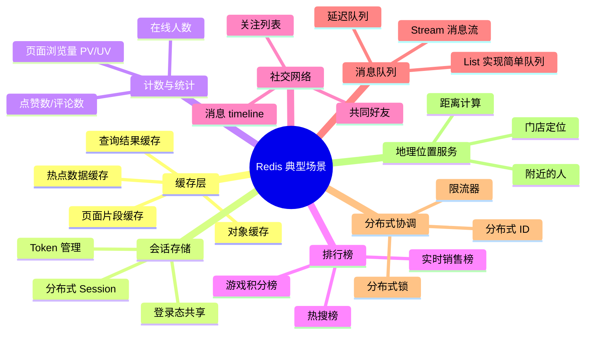

### 1.4 与其他数据库的对比

| 维度 | Redis | MySQL(InnoDB) | MongoDB | Memcached |
|------|-------|---------------|---------|-----------|
| **数据模型** | KV + 丰富数据结构 | 关系表 | 文档(BSON) | 纯 KV |
| **存储介质** | 内存为主(可持久化) | 磁盘为主 | 磁盘为主,内存缓存 | 纯内存 |
| **读写性能** | 单机 10 万+ QPS | 单机千级 QPS | 单机万级 QPS | 单机 10 万+ QPS |
| **数据结构** | String/Hash/List/Set/ZSet 等 | 表/索引/视图 | 文档/数组 | 仅 String |
| **持久化** | RDB + AOF | WAL + Buffer Pool | WiredTiger journal | 无 |
| **事务** | 弱事务(MULTI) | 强事务 ACID | 多文档事务(4.0+) | 无 |
| **集群** | Cluster(槽位分片) | 分库分表 | Sharded Cluster | 客户端分片 |
| **适用场景** | 缓存/排行榜/锁/队列 | 核心业务数据 | 半结构化数据 | 纯缓存 |
| **数据量** | GB-TB(受内存限制) | TB-PB | TB-PB | GB-TB |

### 1.5 后端做缓存为什么喜欢用 Redis

#### 1.5.1 问题阐述:后端为什么需要缓存,又为什么是 Redis

在现代分布式后端系统中,**数据库往往是性能瓶颈的第一现场**。以 MySQL 为例,单机 QPS 通常在千级,一次磁盘随机读的延迟在毫秒量级;而一次典型互联网请求往往需要查询多次数据库,当并发上来后数据库连接池被打满、慢查询堆积、响应时间雪崩。**缓存的本质是用更快的存储介质(内存)挡在数据库前面**,把"读多写少"且"变化不频繁"的数据留在内存里,让 99% 的读请求在亚毫秒级返回,数据库只承担缓存未命中的少量请求和全部写请求。

但"用内存做缓存"这件事,工程上有许多坑要踩:

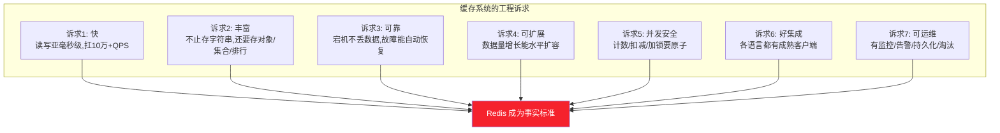

后端工程师在选型缓存方案时,通常会面临三类选择:**本地缓存(Caffeine/Guava)**、**Memcached**、**Redis**。本地缓存性能最高但无法跨进程共享、不能做分布式锁、容量受 JVM 限制;Memcached 纯内存、多线程、性能也很好,但只支持字符串、无持久化、无高可用方案、无法满足复杂业务场景。**Redis 之所以成为后端缓存的事实标准,是因为它同时满足了"快、丰富、可靠、可扩展、原子、易集成、可运维"这七大诉求**——下面从七个维度逐一分析。

#### 1.5.2 维度一:性能特性——内存 + 单线程 + IO 多路复用

Redis 的性能优势来自三个关键设计的叠加:

| 设计 | 原理 | 性能贡献 |
|------|------|---------|
| **基于内存** | 数据全部存内存,无磁盘 IO | 读写延迟 0.1-1ms,比 MySQL 快 100 倍 |
| **单线程命令处理** | 一个线程串行执行命令,避免锁竞争与上下文切换 | 无并发安全问题,CPU 利用率高 |
| **IO 多路复用** | epoll/kselect 单线程处理数万连接 | 单机支撑 10 万+ 并发连接 |
| **6.0+ IO 多线程** | 网络读写并行,命令执行仍单线程 | 网络 IO 瓶颈打破,QPS 再提升 1-2 倍 |

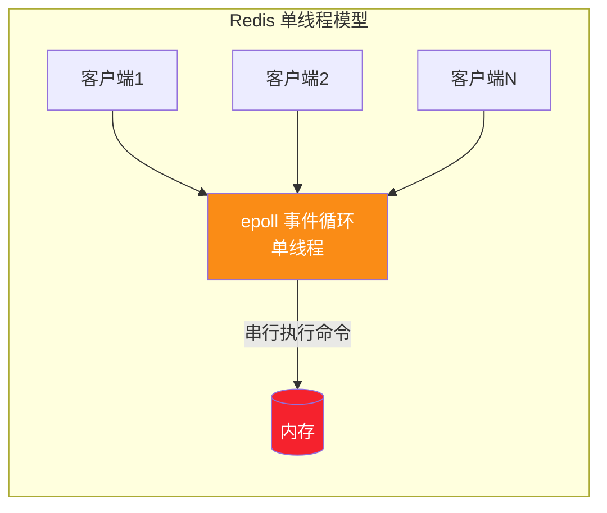

> **为什么单线程还这么快?** 因为 Redis 的瓶颈不是 CPU 计算,而是内存访问和网络 IO。内存访问纳秒级,单线程每秒可执行 10 万次命令;而多线程的锁竞争、上下文切换开销反而拖慢速度。这正印证了一句名言:**"Redis 单线程的瓶颈在内存带宽,而不是 CPU"**。

**实测性能参考**(Redis 7.x,单节点,典型硬件):

| 操作 | QPS | 平均延迟 |
|------|:---:|:-------:|
| SET/GET(简单字符串) | 10-15 万 | 0.1-0.3ms |
| HGETALL(小 Hash) | 8-10 万 | 0.2-0.5ms |
| Pipeline 批量(100 条) | 80-100 万 | 1-2ms(总) |
| 集群模式(6 节点) | 60-90 万 | 0.5-1ms |

#### 1.5.3 维度二:数据结构优势——不只是 KV,而是数据结构服务器

这是 Redis 与 Memcached 最本质的区别。Memcached 只能存字符串,而 Redis 原生支持 9 种数据结构,**让缓存不仅能"存取",还能"计算"**:

| 数据结构 | 缓存场景 | 替代方案的痛点 |
|---------|---------|--------------|
| **String** | 缓存对象 JSON、计数器 | Memcached 也能做,但无 INCR 原子操作 |
| **Hash** | 缓存用户/商品对象,支持字段级更新 | 用 String 存 JSON 要整体读写,浪费带宽 |
| **List** | 最新动态、消息队列 | 关系库 ORDER BY 慢,且无法 LPUSH/BRPOP 阻塞 |
| **Set** | 标签、共同好友、去重 | SQL 的 DISTINCT/JOIN 性能差 |
| **Sorted Set** | 排行榜、延迟队列 | 关系库排序需全表扫描或复杂索引 |
| **Bitmap** | 签到、活跃统计(省内存) | 关系库一行一记录,内存占用百倍 |
| **HyperLogLog** | UV 去重统计(12KB 统计亿级) | Set 存亿级 UV 需数 GB |

**典型对比:排行榜场景**

```java
// 方案A:用 MySQL 做排行榜
// 每次查 Top10:SELECT * FROM scores ORDER BY score DESC LIMIT 10;
// 问题:数据量大时排序慢,需建索引,实时更新 score 还要 UPDATE

// 方案B:用 Redis Sorted Set
jedis.zadd("ranking", score, userId);              // 加分 O(logN)
Set<String> top10 = jedis.zrevrange("ranking", 0, 9); // 取 Top10 O(logN+M)
Long rank = jedis.zrevrank("ranking", userId);       // 查用户排名 O(logN)
// 优势:亚毫秒级,无需建索引,实时更新
```

> **工程价值**:数据结构丰富意味着**很多业务计算可以直接在 Redis 里完成**,不必把数据拉到应用层再处理。这既是性能优势,也是架构简化——"缓存"升级成了"内存数据库"。

#### 1.5.4 维度三:高可用性——主从 + 哨兵 + 集群三重保障

缓存宕机是后端的噩梦:一瞬间所有请求打到数据库,引发雪崩。Redis 提供了完整的高可用方案:


| 方案 | 故障转移 | 数据分片 | 适用规模 | 恢复时间 |
|------|:-------:|:--------:|:--------:|:-------:|
| 主从 | 手动 | ❌ | 中小 | 分钟级 |
| **Sentinel** | **自动** | ❌ | 中 | 30s 内 |
| **Cluster** | **自动** | ✅ | 大 | 30s 内 |

> **对比 Memcached**:Memcached 没有任何高可用方案,节点宕机即数据丢失,只能靠客户端一致性哈希重新分片。这让 Memcached 只能做"可丢失的纯缓存",而 Redis 可以承担"不能丢的缓存"甚至"主库"角色。

#### 1.5.5 维度四:扩展性——水平分片与读写分离

当单机 Redis 的内存或 QPS 不够时,有两种扩展路径:

| 扩展方式 | 实现 | 解决的问题 | 复杂度 |
|---------|------|-----------|:------:|
| **读写分离** | 主写从读,一主多从 | 读 QPS 扩展 | 低 |
| **Cluster 分片** | 16384 槽位,CRC16 路由 | 内存 + 读写双扩展 | 中 |
| **代理层分片** | Twemproxy/Codis | 客户端无感知 | 中高 |

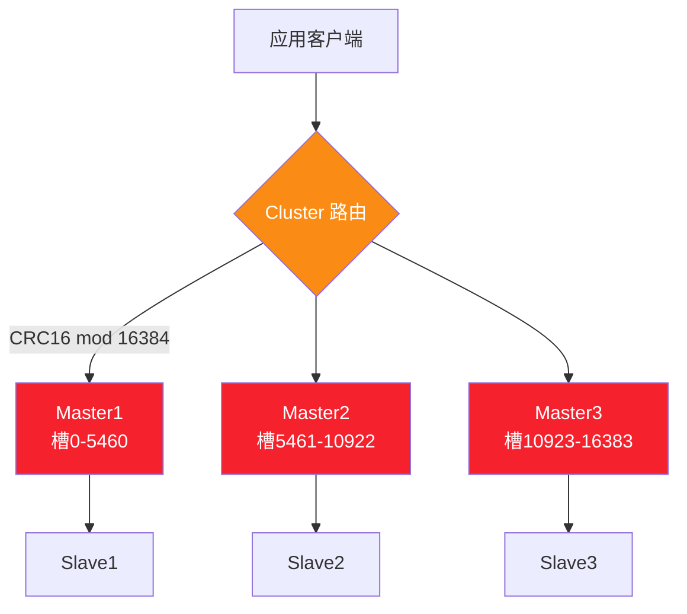

**扩展性优势总结**:
- **读扩展**:加从节点即可,QPS 线性增长
- **写扩展**:Cluster 分片,写 QPS 随节点数线性增长
- **内存扩展**:Cluster 分片,总容量 = 节点数 × 单机内存
- **在线扩容**:Cluster 支持在线添加节点 + 槽位迁移,不停服

#### 1.5.6 维度五:原子操作支持——计数、扣减、加锁的安全基石

缓存场景中大量操作需要原子性:点赞计数不能多算、库存扣减不能超卖、分布式锁不能误释放。Redis 提供了三层原子性保障:

| 层级 | 机制 | 原子性 | 适用场景 |
|------|------|:------:|---------|
| **单命令原子** | INCR/DECR/SETNX/HINCRBY | ✅ | 计数器、点赞、库存 |
| **Lua 脚本** | 多命令原子执行,中途不被打断 | ✅ | 复杂业务(如"检查并扣减") |
| **事务 MULTI** | 命令打包执行,但不支持回滚 | 弱 | 简单批量 |

```java
// 场景:秒杀库存扣减(必须原子)
// 错误做法(超卖):先 GET 再 SET,中间有并发间隙
String stock = jedis.get("stock:1001");
if (Integer.parseInt(stock) > 0) {
    jedis.decr("stock:1001");   // 高并发下会超卖!
}

// 正确做法1:DECR 原子操作
Long remain = jedis.decr("stock:1001");
if (remain < 0) {
    jedis.incr("stock:1001");   // 回补
    throw new SoldOutException();
}

// 正确做法2:Lua 脚本(检查+扣减+记录一步到位)
String lua =
    "if redis.call('get', KEYS[1]) == ARGV[1] then " +   // 验证用户未重复下单
    "  if tonumber(redis.call('get', KEYS[2])) > 0 then " + // 检查库存
    "    redis.call('decr', KEYS[2]) " +                  // 扣减库存
    "    redis.call('sadd', KEYS[3], ARGV[1]) " +         // 记录已下单
    "    return 1 " +
    "  end " +
    "end " +
    "return 0";
Object result = jedis.eval(lua, 
    Arrays.asList("user:lock", "stock:1001", "orders:1001"),
    Arrays.asList("user_123"));
```

> **对比 Memcached**:Memcached 的 INCR 不支持"小于 0 不扣减"这种条件逻辑,复杂原子操作只能靠客户端 CAS(Compare-And-Swap)重试,性能差且易错。Redis 的 Lua 脚本是**服务端原子执行**,这是它能支撑秒杀、抢红包等高并发场景的关键。

#### 1.5.7 维度六:持久化机制——缓存也能不丢数据

纯缓存(如 Memcached)宕机数据全丢,重启后所有缓存归零,数据库瞬间被击穿。Redis 的持久化让"重启后缓存仍在",大幅降低了故障恢复的代价:

| 持久化方式 | 数据丢失风险 | 恢复速度 | 适用场景 |
|---------|:----------:|:-------:|---------|
| 关闭持久化 | 全丢 | 最快 | 纯缓存,可从 DB 重建 |
| RDB | 丢失最近一次快照后的数据 | 快 | 允许丢几分钟数据 |
| AOF(everysec) | 最多丢 1 秒 | 中 | 不能丢数据 |
| **混合持久化** | 最多丢 1 秒 | 快 | **生产推荐** |

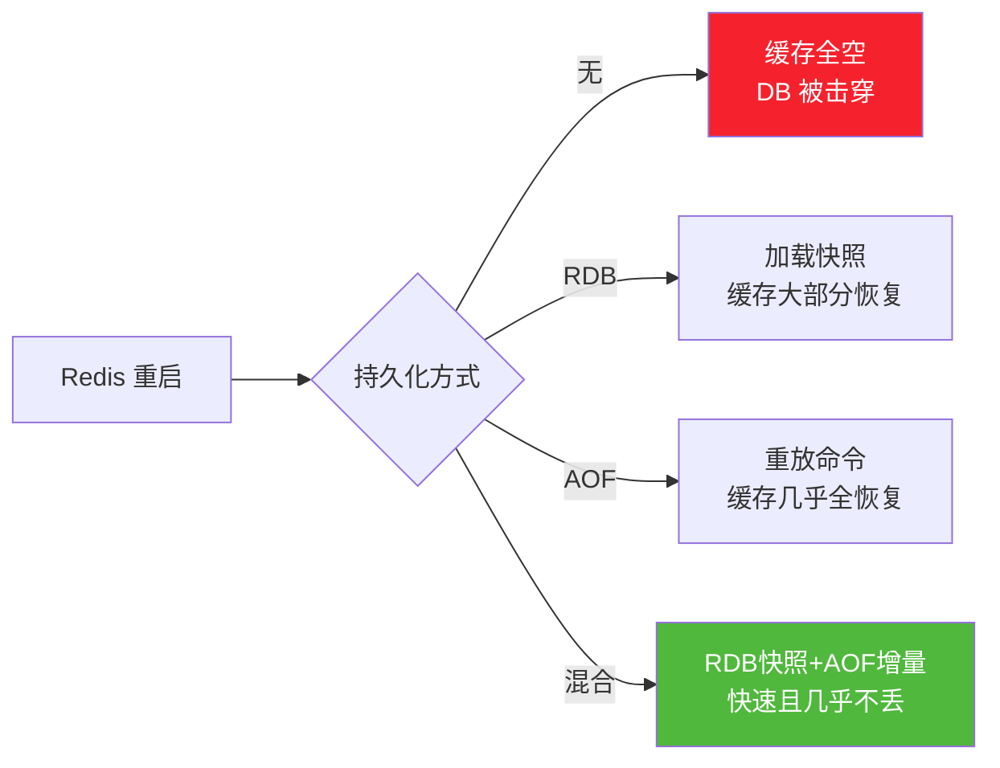

> **工程价值**:持久化让 Redis 不仅能做缓存,还能做**轻量级主库**——例如分布式锁、限流计数器、会话存储,这些数据丢了会导致业务异常,必须持久化。这是 Memcached 做不到的。

#### 1.5.8 维度七:多语言与生态支持——开箱即用的集成

Redis 协议简单(RESP),几乎所有编程语言都有成熟客户端,**开箱即用,无需造轮子**:

| 语言 | 主流客户端 | Spring 集成 |
|------|---------|:-----------:|
| **Java** | Jedis / Lettuce / Redisson | ✅ Spring Data Redis |
| **Python** | redis-py / aioredis | ✅ |
| **Go** | go-redis / redigo | ✅ |
| **Node.js** | ioredis / node-redis | ✅ |
| **C#** | StackExchange.Redis | ✅ |
| **PHP** | phpredis / predis | ✅ |
| **Ruby** | redis-rb | ✅ |

**Java 生态尤其完善**:
- **Spring Data Redis**:Spring Boot 自动配置,`RedisTemplate` 开箱即用
- **Redisson**:提供分布式锁、布隆过滤器、限流器、分布式集合等高级工具
- **Spring Cache**:注解式缓存(`@Cacheable`/`@CacheEvict`),Redis 作为默认实现
- **JetCache**:阿里开源的多级缓存框架,原生支持 Redis

```java
// Spring Cache 注解式缓存,零样板代码
@Service
public class UserService {
    @Cacheable(value = "users", key = "#id")           // 自动查缓存,miss 则执行方法并回填
    public User getUser(Long id) {
        return userDao.findById(id);                    // 只有缓存未命中才查 DB
    }
    
    @CacheEvict(value = "users", key = "#user.id")      // 更新时自动删除缓存
    public void updateUser(User user) {
        userDao.update(user);
    }
}
```

> **对比 Memcached**:Memcached 客户端生态虽然也有,但缺少 Redisson 这种"分布式工具箱",也缺少 Spring Cache 的原生深度集成。对于 Java 技术栈,Redis 的生态成熟度远超 Memcached。

#### 1.5.9 综合对比:Redis vs Memcached vs 本地缓存

| 维度 | Redis | Memcached | 本地缓存(Caffeine) |
|------|-------|-----------|-------------------|
| **性能** | 10万+ QPS,亚毫秒 | 10万+ QPS,亚毫秒 | 100万+ QPS,纳秒 |
| **数据结构** | 9 种丰富 | 仅 String | 取决于实现 |
| **持久化** | RDB + AOF | ❌ | ❌ |
| **高可用** | Sentinel/Cluster | ❌ | 单机 |
| **分布式** | ✅ 跨进程共享 | ✅ | ❌ 仅本进程 |
| **原子操作** | INCR/Lua/事务 | INCR(有限) | CAS |
| **内存效率** | 高(ziplist 编码) | 中(slab 分配) | 最高 |
| **多语言** | 全 | 全 | 取决于语言 |
| **容量** | GB-TB | GB-TB | MB-GB(JVM 限制) |
| **适用场景** | 通用缓存/分布式锁/队列 | 纯缓存 | 极致性能的热点缓存 |

**选型建议**:

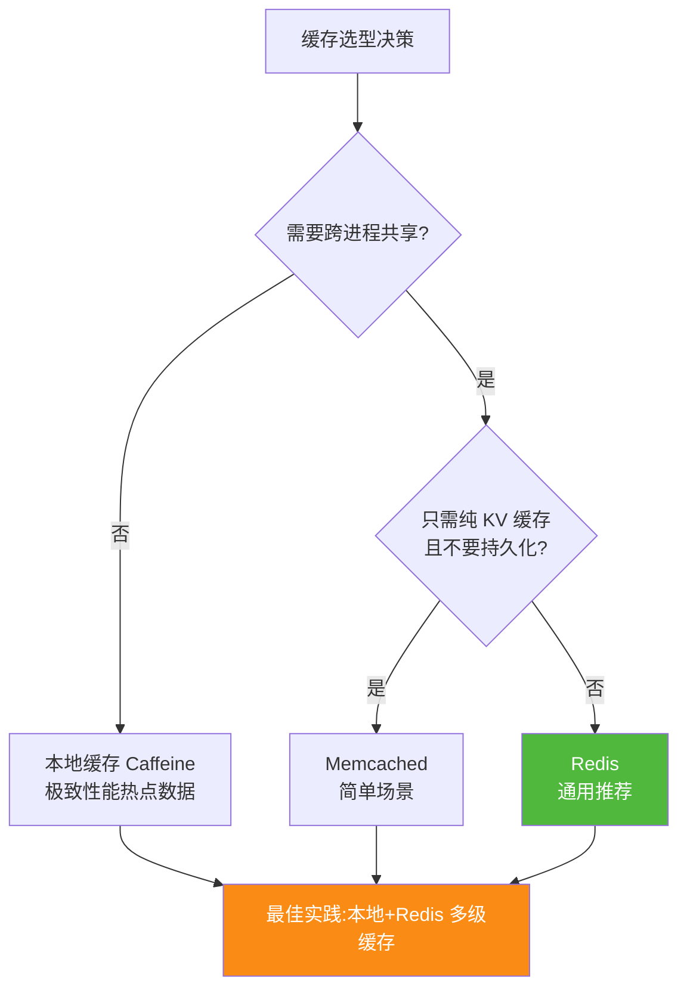

#### 1.5.10 实际应用场景说明

综合上述七大优势,Redis 在后端缓存中的典型落地场景包括:

| 场景 | 利用的优势 | 替代方案的痛点 |
|------|-----------|--------------|
| **热点数据缓存** | 性能 + 数据结构 + 持久化 | DB 扛不住高并发读 |
| **分布式 Session** | 跨进程共享 + 持久化 + TTL | 本地 Session 无法跨服务器,重启丢失 |
| **排行榜/计数器** | Sorted Set + 原子操作 | MySQL 排序慢,并发计数不安全 |
| **分布式锁** | SET NX + Lua + 集群高可用 | 数据库锁性能差,Zookeeper 过重 |
| **限流** | 原子计数 + 过期 + Lua | 无法跨进程,精度差 |
| **消息队列** | List/Stream + 阻塞 | 引入 MQ 太重,简单场景过度设计 |
| **验证码/Token** | TTL + 跨进程共享 | 本地缓存无法跨节点验证 |
| **购物车** | Hash 字段级更新 | String 存 JSON 要整体读写 |

```java
// 综合示例:电商商品详情页的多场景 Redis 应用
@Service
@RequiredArgsConstructor
public class ProductDetailService {
    private final RedisTemplate<String, Object> redis;
    
    // 1. 商品详情缓存(String 存 JSON)
    @Cacheable(value = "product", key = "#id")
    public Product getProduct(Long id) {
        return productDao.findById(id);
    }
    
    // 2. 库存原子扣减(Lua 脚本)
    public boolean deductStock(Long productId, int qty) {
        String lua = "if tonumber(redis.call('get',KEYS[1]))>=ARGV[1] " +
                     "then redis.call('decrby',KEYS[1],ARGV[1]) return 1 " +
                     "else return 0 end";
        Long r = (Long) redis.execute(new DefaultRedisScript<>(lua, Long.class),
                Collections.singletonList("stock:" + productId), qty);
        return r == 1L;
    }
    
    // 3. 销量排行榜(ZSet)
    public void recordSale(Long productId, double amount) {
        redis.opsForZSet().incrementScore("sales:ranking:today", 
            productId.toString(), amount);
    }
    
    // 4. 浏览量统计(HyperLogLog,省内存)
    public void recordView(Long productId, Long userId) {
        redis.opsForHyperLogLog().add("views:product:" + productId, 
            userId.toString());
    }
    
    // 5. 分布式锁防重复下单
    public Order createOrder(Long userId, Long productId) {
        RLock lock = redisson.getLock("order:lock:" + userId + ":" + productId);
        try {
            if (!lock.tryLock(3, 30, TimeUnit.SECONDS)) {
                throw new BusinessException("请勿重复提交");
            }
            return doCreateOrder(userId, productId);
        } finally {
            if (lock.isHeldByCurrentThread()) lock.unlock();
        }
    }
}
```

#### 1.5.11 补充:什么时候不该用 Redis 做缓存

> 工程选型忌讳"一把锤子敲所有钉子"。Redis 虽好,但以下场景应谨慎:

| 场景 | 原因 | 替代方案 |
|------|------|---------|
| **数据量远超内存** | Redis 内存贵,冷数据入内存浪费 | MySQL + 本地缓存热点 |
| **强事务需求** | Redis 事务弱(无回滚) | 关系数据库 |
| **复杂关联查询** | Redis 无 JOIN | 关系数据库 |
| **大 Value(>10MB)** | 阻塞单线程 | 对象存储 + 元数据缓存 |
| **冷数据归档** | 内存成本高 | 磁盘数据库/对象存储 |

#### 1.5.12 本节小结

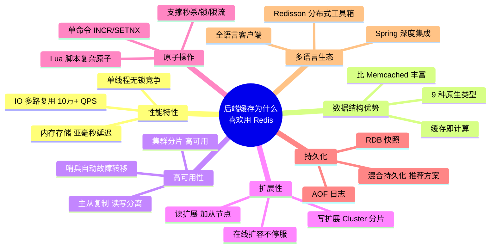

> **一句话总结**:**后端选 Redis 做缓存,不是因为它是"最快的"(本地缓存更快),也不是因为它是"最简单的"(Memcached 更简单),而是因为它在"快、丰富、可靠、可扩展、原子、易集成、可运维"七个维度上取得了最佳平衡——它是唯一一个能同时满足"缓存 + 分布式锁 + 计数器 + 排行榜 + 消息队列"的轻量级方案,让后端工程师用一套技术栈解决一揽子问题。**

---

## 二、安装与配置指南

### 2.1 多平台安装

#### 2.1.1 Linux 安装(生产推荐)

```bash
# 方式一:源码编译(推荐,性能最优)
wget https://download.redis.io/releases/redis-7.2.4.tar.gz
tar xzf redis-7.2.4.tar.gz
cd redis-7.2.4
make && make test    # 编译并跑测试
sudo make install    # 安装到 /usr/local/bin

# 方式二:apt(Ubuntu/Debian)
sudo apt update
sudo apt install redis-server

# 方式三:yum(CentOS/RHEL)
sudo yum install epel-release
sudo yum install redis

# 启动
redis-server /etc/redis/redis.conf

# 验证
redis-cli ping    # 返回 PONG 即成功
```

#### 2.1.2 macOS 安装

```bash
# Homebrew 安装
brew update
brew install redis

# 启动服务(后台)
brew services start redis

# 前台启动
redis-server

# 验证
redis-cli ping
```

#### 2.1.3 Windows 安装

> **注意**:Redis 官方不直接支持 Windows。生产环境严禁使用 Windows 版,仅用于本地开发测试。

```powershell
# 方式一:WSL2(推荐,与 Linux 一致)
wsl --install
# 进入 WSL 后按 Linux 方式安装

# 方式二:Docker
docker run -d --name redis -p 6379:6379 redis:7.2

# 方式三:Microsoft 维护的旧版(仅 3.x,不推荐)
# 下载 https://github.com/microsoftarchive/redis/releases
```

#### 2.1.4 Docker 安装(跨平台,推荐用于开发测试)

```bash
# 基础启动
docker run -d --name redis \
  -p 6379:6379 \
  redis:7.2

# 带密码与持久化
docker run -d --name redis \
  -p 6379:6379 \
  -v /data/redis:/data \
  redis:7.2 \
  redis-server --requirepass yourpassword \
               --appendonly yes \
               --maxmemory 512mb \
               --maxmemory-policy allkeys-lru

# Docker Compose
cat > docker-compose.yml <<'EOF'
version: '3.8'
services:
  redis:
    image: redis:7.2
    container_name: redis
    restart: always
    ports:
      - "6379:6379"
    volumes:
      - ./data:/data
      - ./redis.conf:/etc/redis/redis.conf
    command: redis-server /etc/redis/redis.conf
    sysctls:
      - net.core.somaxconn=511
EOF
docker-compose up -d
```

### 2.2 配置文件详解

#### 2.2.1 核心配置参数

```conf
# ==================== 网络配置 ====================
bind 127.0.0.1 -::1              # 绑定地址,生产应改为内网IP;多IP用空格分隔
protected-mode yes               # 保护模式,启用时只允许本机访问
port 6379                        # 端口
tcp-backlog 511                  # TCP 连接队列长度,高并发建议 511+
timeout 0                        # 客户端空闲超时(秒),0=永不超时
tcp-keepalive 300                # TCP keepalive 探测间隔,防止连接死掉

# ==================== 通用配置 ====================
daemonize no                     # 是否后台运行(docker 中必须 no)
supervised no                    # 进程监督方式
pidfile /var/run/redis_6379.pid  # PID 文件路径
loglevel notice                  # 日志级别:debug/verbose/notice/warning
logfile ""                       # 日志文件,空=stdout
databases 16                     # 逻辑库数量,默认 16

# ==================== 内存配置 ====================
maxmemory 1gb                    # 最大内存,生产必须设置
maxmemory-policy allkeys-lru     # 淘汰策略,见 §9.1

# ==================== 快照 RDB ====================
save 900 1                       # 900s 内 1 次修改则快照
save 300 10                      # 300s 内 10 次修改则快照
save 60 10000                    # 60s 内 10000 次修改则快照
stop-writes-on-bgsave-error yes  # bgsave 失败时拒绝写入,保护数据
rdbcompression yes               # RDB 文件 LZF 压缩
rdbchecksum yes                  # RDB 文件 CRC64 校验
dbfilename dump.rdb              # RDB 文件名
dir /var/lib/redis               # 持久化文件目录

# ==================== AOF 追加日志 ====================
appendonly yes                   # 启用 AOF
appendfilename "appendonly.aof"  # AOF 文件名
appendfsync everysec             # 刷盘策略:always/everysec/no
no-appendfsync-on-rewrite no     # 重写期间不 fsync
auto-aof-rewrite-percentage 100  # AOF 重写:文件比上次大 100% 时触发
auto-aof-rewrite-min-size 64mb   # AOF 重写最小阈值
aof-load-truncated yes           # 加载截断的 AOF 文件(容错)
aof-use-rdb-preamble yes         # AOF 文件头使用 RDB 格式(混合持久化)

# ==================== 慢日志 ====================
slowlog-log-slower-than 10000    # 慢日志阈值(微秒),10000=10ms,0=全部记录
slowlog-max-len 128              # 慢日志最大保留条数

# ==================== 客户端缓冲区 ====================
maxclients 10000                 # 最大客户端连接数
client-output-buffer-limit normal 0 0 0
client-output-buffer-limit replica 256mb 64mb 60
client-output-buffer-limit pubsub 32mb 8mb 60

# ==================== 安全配置 ====================
requirepass your_strong_password # 密码(生产必设)
rename-command FLUSHALL ""       # 禁用危险命令
rename-command FLUSHDB ""
rename-command CONFIG ""
```

#### 2.2.2 淘汰策略详解

| 策略 | 说明 | 适用场景 |
|------|------|---------|
| `noeviction` | 不淘汰,内存满直接报错(默认) | 数据不能丢失,如做主库 |
| `allkeys-lru` | 所有 key 中淘汰最久未使用 | **缓存场景首选** |
| `allkeys-lfu` | 所有 key 中淘汰最少使用(Redis 4.0+) | 缓存,优于 LRU |
| `allkeys-random` | 随机淘汰 | 无明显热点 |
| `volatile-lru` | 设了 TTL 的 key 中淘汰 LRU | 混合场景(部分持久) |
| `volatile-lfu` | 设了 TTL 的 key 中淘汰 LFU | 混合场景 |
| `volatile-random` | 设了 TTL 的 key 中随机淘汰 | 混合场景 |
| `volatile-ttl` | 优先淘汰即将过期的 key | 业务能接受短期不一致 |

### 2.3 服务启停与基本管理

```bash
# 启动(指定配置文件)
redis-server /etc/redis/redis.conf

# 停止(优雅,会触发持久化)
redis-cli shutdown
redis-cli -a yourpassword shutdown   # 带密码

# 客户端连接
redis-cli
redis-cli -h host -p 6379 -a password

# 常用管理命令
INFO                              # 服务器信息
INFO memory                       # 内存详情
INFO replication                  # 主从信息
CONFIG GET maxmemory              # 查看配置
CONFIG SET maxmemory 2gb          # 在线修改配置(重启失效,需 CONFIG REWRITE 持久化)
CONFIG REWRITE                    # 将运行时配置写回配置文件
DBSIZE                            # 当前库 key 数量
FLUSHDB                           # 清空当前库(危险!)
FLUSHALL                          # 清空所有库(危险!)
SLOWLOG GET 10                    # 查看慢日志
CLIENT LIST                       # 客户端连接列表
MONITOR                           # 实时监控所有命令(调试用,生产慎用)
```

---

## 三、数据结构详解

### 3.1 String 字符串

**内部实现**:Redis String 不是 C 字符串,而是自定义的 SDS(Simple Dynamic String)。SDS 记录了长度,获取长度 O(1);二进制安全(可存图片/序列化对象);预分配空间,减少内存重分配。

| 命令 | 说明 | 时间复杂度 |
|------|------|:---------:|
| `SET key value [EX seconds] [NX\|XX]` | 设置,EX=过期秒,NX=不存在才设,XX=存在才设 | O(1) |
| `GET key` | 获取 | O(1) |
| `DEL key` | 删除 | O(1) |
| `INCR key` / `DECR key` | 自增/自减 1 | O(1) |
| `INCRBY key n` / `DECRBY key n` | 自增/自减 n | O(1) |
| `INCRBYFLOAT key n` | 浮点自增 | O(1) |
| `APPEND key value` | 追加 | O(1) |
| `STRLEN key` | 长度 | O(1) |
| `MSET k1 v1 k2 v2` / `MGET k1 k2` | 批量设/取 | O(N) |
| `SETEX key seconds value` | 设置带过期(已废弃,用 SET EX) | O(1) |
| `SETNX key value` | 不存在才设(已废弃,用 SET NX) | O(1) |
| `GETRANGE key start end` / `SETRANGE key offset value` | 子串操作 | O(N) |

```bash
# 基本操作
SET user:1:name "张三"
GET user:1:name                     # "张三"

# 计数器(原子操作,线程安全)
SET article:100:likes 0
INCR article:100:likes              # 1
INCR article:100:likes              # 2
INCRBY article:100:likes 10         # 12
DECR article:100:likes              # 11

# 带过期与 NX(分布式锁常用)
SET lock:order:123 "owner_1" EX 30 NX   # 成功返回 OK,失败返回 nil

# 批量操作(减少网络往返)
MSET k1 v1 k2 v2 k3 v3
MGET k1 k2 k3
```

**典型场景**:缓存对象(JSON 序列化)、计数器、分布式锁、限流计数、验证码存储。

### 3.2 Hash 哈希表

**内部实现**:小数据用 ziplist(7.0 后 listpack)节省内存;大数据用 hashtable。当元素数超过 `hash-max-ziplist-entries`(默认 128)或单值超过 `hash-max-ziplist-value`(默认 64 字节)时升级。

| 命令 | 说明 | 时间复杂度 |
|------|------|:---------:|
| `HSET key field value` | 设置单字段 | O(1) |
| `HGET key field` | 获取单字段 | O(1) |
| `HMSET key f1 v1 f2 v2` | 批量设(已废弃,用 HSET) | O(N) |
| `HMGET key f1 f2` | 批量取 | O(N) |
| `HGETALL key` | 获取所有字段 | O(N) |
| `HDEL key f1 f2` | 删除字段 | O(N) |
| `HINCRBY key field n` | 字段自增 | O(1) |
| `HEXISTS key field` | 字段是否存在 | O(1) |
| `HLEN key` | 字段数 | O(1) |
| `HKEYS key` / `HVALS key` | 所有字段名/值 | O(N) |
| `HSETNX key field value` | 不存在才设 | O(1) |

```bash
# 用户信息存储(比 String 存 JSON 更省内存,且可局部更新)
HSET user:1 name "张三" age 28 email "zhangsan@example.com"
HGET user:1 name                    # "张三"
HGETALL user:1                      # name 张三 \n age 28 \n email zhangsan@example.com
HINCRBY user:1 age 1                # age 变为 29
HDEL user:1 email                   # 删除字段
HEXISTS user:1 age                  # (integer) 1
```

**典型场景**:对象存储(用户/商品/订单)、购物车(user:cart → {商品ID: 数量})、配置中心。

### 3.3 List 列表

**内部实现**:7.0 前 ziplist + quicklist;7.0 后 listpack + quicklist。两端操作 O(1),中间访问 O(N)。

| 命令 | 说明 | 时间复杂度 |
|------|------|:---------:|
| `LPUSH key v1 v2` / `RPUSH key v1 v2` | 左/右插入 | O(1)~O(N) |
| `LPOP key [count]` / `RPOP key [count]` | 左/右弹出 | O(1) |
| `LRANGE key start stop` | 范围获取 | O(S+N) |
| `LLEN key` | 长度 | O(1) |
| `LINDEX key index` | 按索引取 | O(N) |
| `LSET key index value` | 按索引设 | O(N) |
| `LREM key count value` | 移除指定值 | O(N) |
| `LTRIM key start stop` | 保留范围,其余删除 | O(N) |
| `BLPOP key timeout` / `BRPOP key timeout` | 阻塞弹出 | O(1) |
| `LINSERT key BEFORE\|AFTER pivot value` | 插入 | O(N) |

```bash
# 消息队列(生产消费)
LPUSH mq:order "order_001"
LPUSH mq:order "order_002"
BRPOP mq:order 0                    # 阻塞等待,0=永久阻塞

# 最新动态 timeline(微博/朋友圈)
LPUSH user:1:timeline "msg_100"
LPUSH user:1:timeline "msg_101"
LRANGE user:1:timeline 0 9          # 最新 10 条
LTRIM user:1:timeline 0 999         # 只保留最新 1000 条

# 固定长度列表(如最近访问记录)
LPUSH recent:visits "page_A"
LTRIM recent:visits 0 99            # 始终保留最新 100 条
```

**典型场景**:消息队列(LPUSH+BRPOP)、最新列表(timeline)、操作日志栈。

### 3.4 Set 集合

**内部实现**:intset(全是整数且元素数 < 512)或 hashtable。

| 命令 | 说明 | 时间复杂度 |
|------|------|:---------:|
| `SADD key m1 m2` | 添加 | O(N) |
| `SREM key m1 m2` | 移除 | O(N) |
| `SMEMBERS key` | 所有成员 | O(N) |
| `SISMEMBER key member` | 是否成员 | O(1) |
| `SCARD key` | 成员数 | O(1) |
| `SRANDMEMBER key [count]` | 随机取 | O(N) |
| `SPOP key [count]` | 随机弹出 | O(N) |
| `SINTER k1 k2` | 交集 | O(N*M) |
| `SUNION k1 k2` | 并集 | O(N) |
| `SDIFF k1 k2` | 差集 | O(N) |
| `SINTERSTORE dest k1 k2` | 交集存 dest | O(N*M) |

```bash
# 标签系统
SADD article:100:tags "java" "redis" "cache"
SADD article:101:tags "java" "spring" "boot"

# 共同标签(交集)
SINTER article:100:tags article:101:tags    # "java"

# 相关文章(有共同标签)
SUNION article:100:tags article:101:tags

# 抽奖
SADD lottery:2026 user1 user2 user3 user4 user5
SRANDMEMBER lottery:2026 1                   # 随机抽 1 个(不弹出)
SPOP lottery:2026 3                          # 随机抽 3 个(弹出,不可重复)

# 点赞用户集合
SADD like:article:100 user:1 user:2 user:3
SCARD like:article:100                        # 点赞数:3
SISMEMBER like:article:100 user:1             # 是否点赞:1
```

**典型场景**:标签、共同好友、抽奖、去重、点赞。

### 3.5 Sorted Set 有序集合

**内部实现**:listpack(小) + skiplist(跳表)+ hashtable(用于 O(1) 查成员分值)。这是 Redis 最复杂也最强大的数据结构。

| 命令 | 说明 | 时间复杂度 |
|------|------|:---------:|
| `ZADD key score member [score member]` | 添加,带分值 | O(log N) |
| `ZSCORE key member` | 取分值 | O(1) |
| `ZRANK key member` / `ZREVRANK key member` | 升/降序排名 | O(log N) |
| `ZRANGE key start stop [WITHSCORES]` | 升序范围 | O(log N + M) |
| `ZREVRANGE key start stop` | 降序范围 | O(log N + M) |
| `ZRANGEBYSCORE key min max` | 按分值范围 | O(log N + M) |
| `ZINCRBY key increment member` | 分值自增 | O(log N) |
| `ZREM key member` | 移除 | O(log N) |
| `ZCARD key` | 成员数 | O(1) |
| `ZCOUNT key min max` | 分值范围内数量 | O(log N) |
| `ZPOPMAX key` / `ZPOPMIN key` | 弹出最大/最小 | O(log N) |
| `BZPOPMAX key timeout` | 阻塞弹出 | O(log N) |
| `ZUNIONSTORE dest numkeys k1 k2` | 并集 | O(N*log N) |

```bash
# 排行榜
ZADD ranking:dau 1000 user:1 800 user:2 1500 user:3 1200 user:4
# 实时排名(降序,取 Top3)
ZREVRANGE ranking:dau 0 2 WITHSCORES    # user:3 1500, user:4 1200, user:1 1000
# 用户排名
ZREVRANK ranking:dau user:1              # 2(第3名,0-based)
# 用户分值
ZSCORE ranking:dau user:1                # "1000"
# 加分
ZINCRBY ranking:dau 200 user:1           # user:1 分值变为 1200
# 前 10 名
ZREVRANGE ranking:dau 0 9 WITHSCORES

# 延迟队列(用时间戳作为 score)
ZADD delay:queue 1691568000 "task_001"   # 到期时间戳
ZADD delay:queue 1691568600 "task_002"
# 扫描到期任务
ZRANGEBYSCORE delay:queue 0 1691568200 LIMIT 0 10
```

**典型场景**:排行榜、延迟队列、带权重的标签、范围查找、Top N。

### 3.6 Bitmap 位图

**内部实现**:String 的扩展,按位操作。最大 512MB,即 2^32 位(约 42.9 亿)。

| 命令 | 说明 | 时间复杂度 |
|------|------|:---------:|
| `SETBIT key offset value` | 设定位 | O(1) |
| `GETBIT key offset` | 获取位 | O(1) |
| `BITCOUNT key [start end]` | 统计 1 的个数 | O(N) |
| `BITOP AND dest k1 k2` | 位运算 | O(N) |
| `BITPOS key bit` | 第一个 0/1 的位置 | O(N) |
| `BITFIELD key ...` | 多位操作 | O(1) |

```bash
# 用户签到(user:sign:{uid}:{yyyyMM})
SETBIT user:sign:1001:202608 8 1        # 8 号签到(日期从 0 开始)
GETBIT user:sign:1001:202608 8           # 1
BITCOUNT user:sign:1001:202608           # 本月签到次数
# 连续签到天数(从今天往前找第一个 0)
BITPOS user:sign:1001:202608 0 8         # 从第 8 位开始找第一个 0

# 用户活跃统计
SETBIT active:20260808 1001 1            # uid=1001 在 8月8日 活跃
BITCOUNT active:20260808                 # 当日活跃用户数
BITOP AND active:week active:20260808 active:20260809 active:20260810  # 三日都活跃
```

**典型场景**:签到、活跃用户统计、布隆过滤器、状态标记(省内存)。

### 3.7 HyperLogLog 基数统计

**内部实现**:基于概率的基数估算算法,固定 12KB 内存,标准误差 0.81%。

| 命令 | 说明 | 时间复杂度 |
|------|------|:---------:|
| `PFADD key el1 el2` | 添加元素 | O(1) |
| `PFCOUNT key` | 估算基数 | O(1) |
| `PFMERGE dest k1 k2` | 合并 | O(N) |

```bash
# UV 统计(去重计数)
PFADD page:uv:home user:1 user:2 user:3 user:1   # 重复的自动去重
PFCOUNT page:uv:home                                # 3
# 每日 UV 合并为周 UV
PFMERGE page:uv:week page:uv:20260808 page:uv:20260809 ...
PFCOUNT page:uv:week
```

**典型场景**:UV/PV 统计、独立访客数、搜索词独立数。**不需要精确**的场景用 HLL,比 Set 节省上百倍内存。

### 3.8 Geospatial 地理空间

**内部实现**:基于 Sorted Set,用 GeoHash 编码经纬度为分值。

| 命令 | 说明 | 时间复杂度 |
|------|------|:---------:|
| `GEOADD key lng lat member` | 添加地理位置 | O(log N) |
| `GEOPOS key member` | 获取坐标 | O(log N) |
| `GEODIST key m1 m2 [unit]` | 两点距离 | O(log N) |
| `GEORADIUS key lng lat r unit` | 中心点半径内查找(6.2 后废弃) | O(N) |
| `GEOSEARCH key ...` | 搜索(推荐) | O(N) |
| `GEOSEARCHSTORE ...` | 搜索并存入 | O(N) |

```bash
# 门店定位
GEOADD stores 116.481028 39.998574 "store_beijing" 121.473701 31.230416 "store_shanghai"
# 两店距离
GEODIST stores store_beijing store_shanghai km     # "1067.3384"
# 附近 1000km 的门店
GEOSEARCH stores FROMLONLAT 116.48 39.99 BYRADIUS 1000 km ASC
```

**典型场景**:附近的人/店、距离计算、打车匹配、地理位置推送。

### 3.9 Stream 流

**内部实现**:Redis 5.0 引入,专为消息流设计。支持持久化、消费者组、消息确认(ACK),类似 Kafka 的轻量版。

| 命令 | 说明 | 时间复杂度 |
|------|------|:---------:|
| `XADD key * field value` | 添加消息 | O(1) |
| `XLEN key` | 消息数 | O(1) |
| `XRANGE key - +` | 范围读取 | O(N) |
| `XREAD COUNT n STREAMS key id` | 读取 | O(log N + N) |
| `XGROUP CREATE key group $` | 创建消费者组 | O(1) |
| `XREADGROUP GROUP g c COUNT n STREAMS key >` | 消费组读取 | O(log N + N) |
| `XACK key group id` | 确认消息 | O(1) |
| `XPENDING key group` | 待确认消息 | O(N) |
| `XCLAIM key group consumer minIdleTime id` | 转移消息归属 | O(log N) |
| `XTRIM key MAXLEN n` | 裁剪 | O(N) |

```bash
# 生产消息(* 表示自动生成 ID)
XADD orders * orderId 1001 amount 5000
XADD orders * orderId 1002 amount 3000

# 创建消费者组($ 表示只消费新消息)
XGROUP CREATE orders order_group $

# 消费者消费
XREADGROUP GROUP order_group consumer_1 COUNT 10 STREAMS orders >
# {"orderId":"1001","amount":"5000"}

# 确认消费
XACK orders order_group 1691568000000-0

# 查看待确认消息(消费失败可重试)
XPENDING orders order_group
```

**典型场景**:消息队列(可靠)、事件溯源、操作日志、IoT 数据流。

---

## 四、持久化机制

### 4.1 RDB 持久化

**原理**:在某个时间点,将内存中的所有数据以二进制形式快照到磁盘的 `dump.rdb` 文件。触发方式:手动 `SAVE`/`BGSAVE`、配置 `save` 规则、主从复制时、`SHUTDOWN` 时。

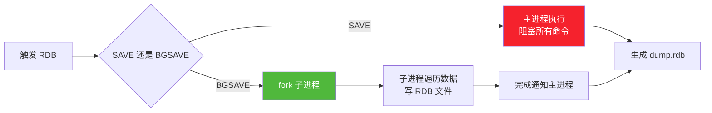

**优点**:文件小、恢复快、适合备份。
**缺点**:两次快照间数据可能丢失;fork 时内存翻倍(写时复制 COW)。

```conf
# RDB 配置
save 900 1
save 300 10
save 60 10000
stop-writes-on-bgsave-error yes
rdbcompression yes
rdbchecksum yes
dbfilename dump.rdb
dir /var/lib/redis
```

### 4.2 AOF 持久化

**原理**:将每条写命令追加到 `appendonly.aof` 文件,类似 MySQL 的 binlog。重启时重放命令恢复数据。

| 刷盘策略 | 说明 | 性能 | 数据丢失风险 |
|---------|------|:----:|:----------:|
| `always` | 每条命令都 fsync | 最差 | 几乎不丢 |
| `everysec` | 每秒 fsync 一次(**默认推荐**) | 好 | 最多丢 1 秒 |
| `no` | 由 OS 决定 fsync | 最好 | 丢失不确定 |

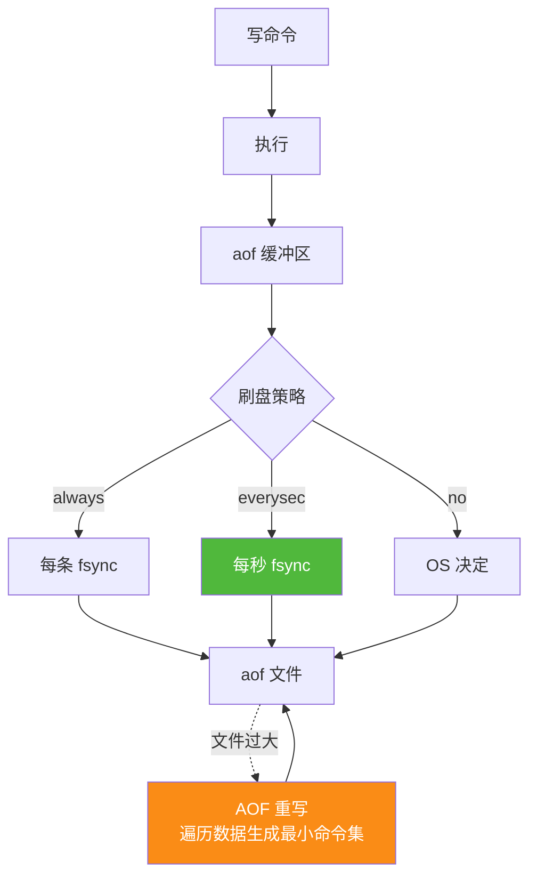

**AOF 重写**:文件越来越大时,Redis 遍历内存数据,用最少的命令重写文件(如 100 次 INCR 合并为 1 次 SET 最终值)。

```conf
# AOF 配置
appendonly yes
appendfilename "appendonly.aof"
appendfsync everysec
no-appendfsync-on-rewrite no
auto-aof-rewrite-percentage 100
auto-aof-rewrite-min-size 64mb
aof-load-truncated yes
```

### 4.3 混合持久化

**原理**(Redis 4.0+):AOF 重写时,不再用纯命令格式,而是**先写 RDB 二进制快照,再追加增量 AOF 命令**。兼顾 RDB 的快速恢复和 AOF 的低数据丢失。


```conf
# 混合持久化开启
aof-use-rdb-preamble yes    # 默认已开启
```

### 4.4 持久化方案选型

| 场景 | 推荐方案 | 理由 |
|------|---------|------|
| **纯缓存** | 关闭持久化 | 性能最高,数据丢了从 DB 重建 |
| **允许丢几分钟数据** | 仅 RDB | 恢复快,文件小 |
| **不能丢数据** | AOF everysec | 最多丢 1 秒 |
| **核心业务** | **混合持久化(推荐)** | 恢复快 + 低丢失 |
| **备份** | RDB 定时备份到 OSS/S3 | 文件小,适合长期归档 |

---

## 五、高可用架构

### 5.1 主从复制

**作用**:读写分离(主写从读)、数据热备、故障快速恢复。

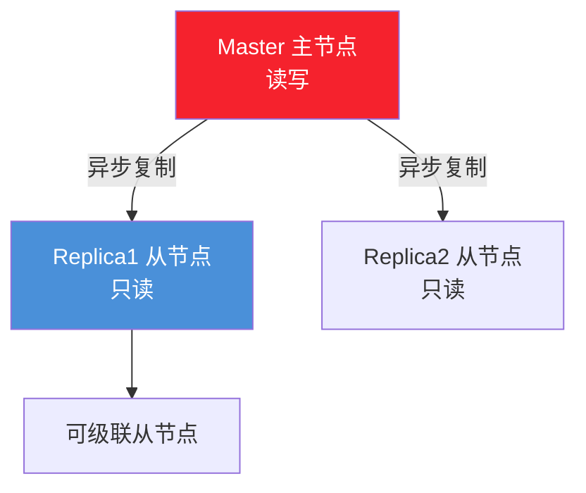

**复制流程**:
1. **全量同步**:从节点首次连接,主节点执行 BGSAVE 生成 RDB,发送给从节点;同时缓存新写命令,发送 RDB 后追加。
2. **增量同步**:全量后,主节点持续把写命令通过命令传播发送给从节点。
3. **断线重连**:用 `PSYNC` + `replid` + `offset`,若 offset 在 backlog 内则增量同步,否则全量。

```conf
# 主节点配置(默认即主)
# 无需特殊配置

# 从节点配置
replicaof 192.168.1.100 6379
masterauth yourpassword        # 主节点密码
replica-read-only yes          # 从节点只读
repl-backlog-size 1mb          # 复制积压缓冲区,大一点减少全量同步
repl-timeout 60                # 复制超时
```

```bash
# 动态设置从节点
redis-cli -p 6380 REPLICAOF 192.168.1.100 6379
# 查看复制状态
INFO replication
```

### 5.2 哨兵 Sentinel

**作用**:在主从基础上,自动监控、通知、故障转移。当 Master 宕机,Sentinel 自动选举新 Master,通知客户端切换。

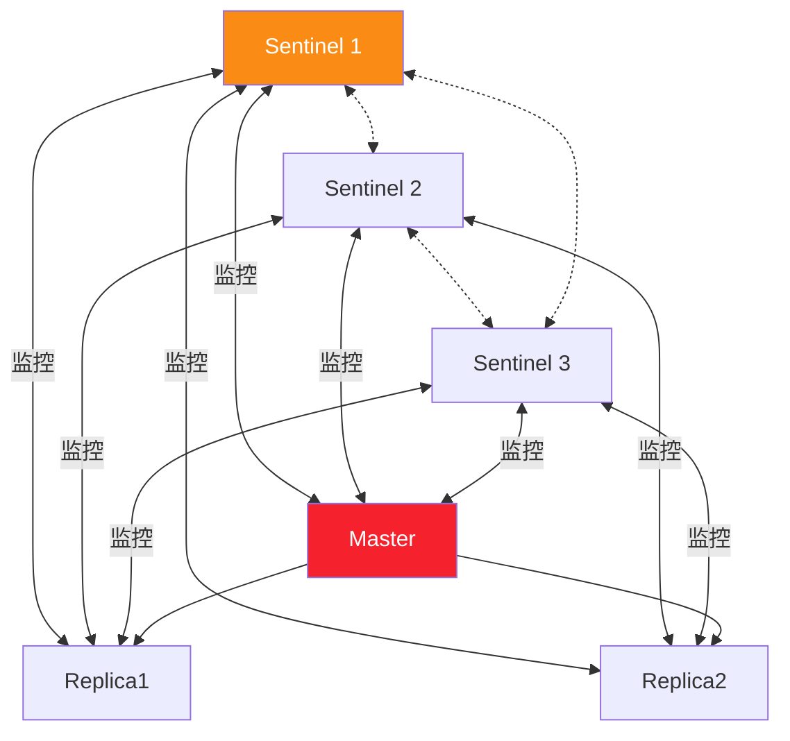

**故障转移流程**:
1. **主观下线**:单个 Sentinel 发现 Master 无响应 PING,标记 `sdown`。
2. **客观下线**:超过 `quorum` 个 Sentinel 都认为下线,标记 `odown`。
3. **选举 Sentinel Leader**:基于 Raft。
4. **Leader 选新 Master**:按优先级 → offset → runid 选最优 Replica。
5. **执行切换**:旧 Master 的从节点指向新 Master;更新配置。

```conf
# sentinel.conf
port 26379
sentinel monitor mymaster 192.168.1.100 6379 2    # quorum=2
sentinel auth-pass mymaster yourpassword
sentinel down-after-milliseconds mymaster 5000    # 5s 无响应判下线
sentinel parallel-syncs mymaster 1                # 故障转移时并行同步的从节点数
sentinel failover-timeout mymaster 60000          # 故障转移超时
```

```bash
# 启动 Sentinel
redis-sentinel /etc/redis/sentinel.conf
# 查看状态
redis-cli -p 26379 SENTINEL masters
redis-cli -p 26379 SENTINEL replicas mymaster
```

### 5.3 Redis Cluster 集群

**作用**:数据分片(突破单机内存与 QPS 上限)+ 高可用(每个分片自带主从)。Redis Cluster 用 **16384 个槽位(hash slot)**,每个 key 经 CRC16 计算 mod 16384 落到某个槽。

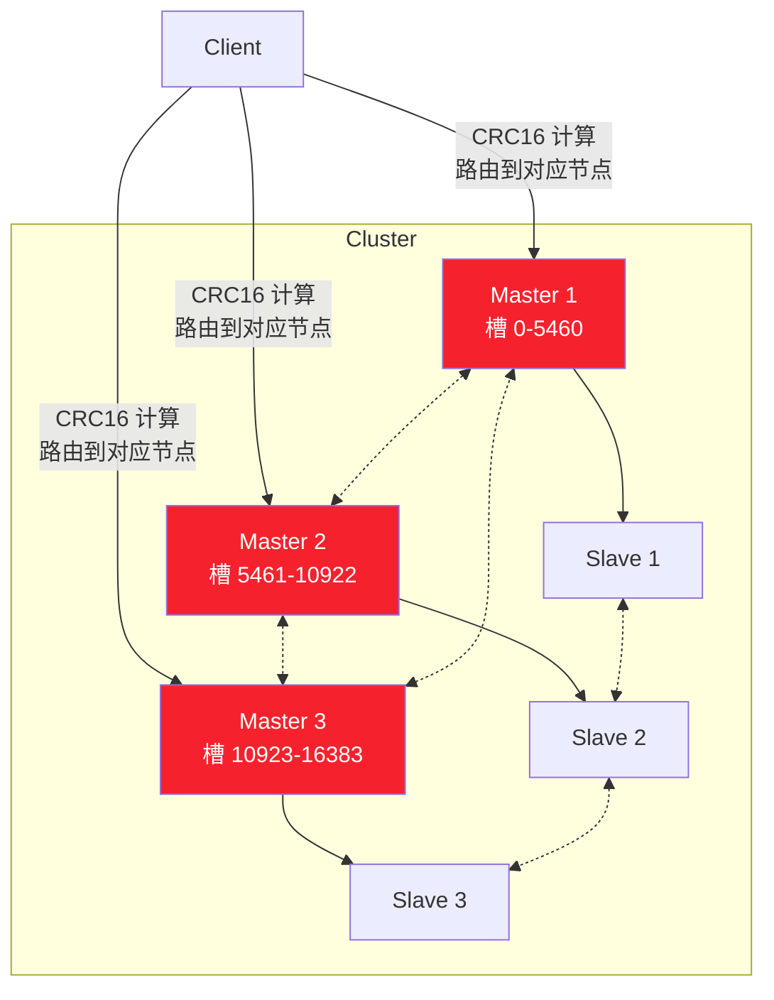

**关键概念**:
- **槽位**:key 通过 `CRC16(key) mod 16384` 计算归属。集群最少 3 主 3 从。
- **MOVED 重定向**:客户端访问错误节点,节点返回 MOVED,客户端缓存路由表。
- **ASK 重定向**:槽位迁移中的临时重定向,不缓存。
- **Gossip 协议**:节点间通信,传播集群状态。
- **故障检测**:节点间 PING/PONG,半数以上主节点标记某节点下线则真正下线。

```bash
# 创建集群(6 节点:3 主 3 从)
redis-cli --cluster create \
  192.168.1.101:6379 192.168.1.102:6379 192.168.1.103:6379 \
  192.168.1.104:6379 192.168.1.105:6379 192.168.1.106:6379 \
  --cluster-replicas 1

# 查看集群状态
redis-cli -c -h 192.168.1.101 -p 6379 CLUSTER INFO
# cluster_state:ok

# 查看节点
CLUSTER NODES
# 查看槽位
CLUSTER SLOTS

# 扩容:添加新节点
redis-cli --cluster add-node 192.168.1.107:6379 192.168.1.101:6379
redis-cli --cluster reshard 192.168.1.101:6379  # 迁移槽位
```

**Cluster 限制**:
- 不支持跨槽位的多键操作(如 `MGET k1 k2` 若 k1 k2 不同槽会报错),除非用 `{tag}` hash tag。
- 不支持 SELECT 切换 db(只能用 db 0)。
- 事务和 Lua 脚本涉及的 key 必须在同一槽位。

### 5.4 高可用方案选型

| 方案 | 节点数 | 数据分片 | 故障转移 | 适用场景 | 成本 |
|------|:------:|:--------:|:--------:|---------|:----:|
| 单机 | 1 | ❌ | ❌ | 开发测试 | 低 |
| 主从 | 2+ | ❌ | 手动 | 读多写少,允许人工介入 | 中 |
| Sentinel | 3+ | ❌ | 自动 | 中小规模,数据量 < 单机内存 | 中 |
| **Cluster** | 6+ | ✅ | 自动 | **大规模,数据量超单机内存** | 高 |

---

## 六、缓存策略设计

### 6.1 缓存穿透

**定义**:查询**根本不存在**的数据,缓存和 DB 都没有,每次请求都打到 DB。


**解决方案**:

| 方案 | 实现 | 优点 | 缺点 |
|------|------|------|------|
| **缓存空值** | DB 没查到也缓存 `null`,设短 TTL(60s) | 简单 | 浪费内存,短期不一致 |
| **布隆过滤器** | 启动加载所有 key 到布隆过滤器,请求前先过滤 | 内存省 | 误判率,删除困难 |
| **接口限流/参数校验** | 拦截非法请求(ID 格式校验) | 治本 | 需业务配合 |

```java
// 缓存空值方案(Java 伪代码)
public User getUser(Long id) {
    String key = "user:" + id;
    Object val = redis.get(key);
    if (val != null) {
        return "NULL".equals(val) ? null : (User) val;
    }
    User user = userDao.findById(id);
    if (user == null) {
        redis.set(key, "NULL", 60, TimeUnit.SECONDS);  // 缓存空值
    } else {
        redis.set(key, user, 3600, TimeUnit.SECONDS);
    }
    return user;
}

// 布隆过滤器方案(Redisson)
RBloomFilter<Long> bloomFilter = redisson.getBloomFilter("user:bloom");
bloomFilter.tryInit(1_000_000L, 0.01);   // 100万容量,1%误判率

public User getUser(Long id) {
    if (!bloomFilter.contains(id)) {
        return null;   // 一定不存在,直接返回
    }
    // ... 继续查缓存和 DB
}
```

### 6.2 缓存击穿

**定义**:**热点 key** 突然过期,瞬间大量并发请求打到 DB。

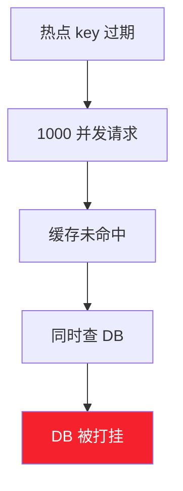

**解决方案**:

| 方案 | 实现 | 适用场景 |
|------|------|---------|
| **互斥锁** | 只让一个线程查 DB,其他等待 | 数据实时性要求高 |
| **逻辑过期** | 不设 TTL,值内带过期时间,后台异步刷新 | 可短暂不一致 |
| **热点永不过期** | 主动更新,不依赖 TTL | 极端热点 |

```java
// 互斥锁方案
public User getUserWithLock(Long id) {
    String key = "user:" + id;
    Object val = redis.get(key);
    if (val != null) return (User) val;
    
    String lockKey = "lock:user:" + id;
    try {
        // 尝试加锁,等待 3s
        boolean locked = redis.set(lockKey, "1", 30, SECONDS, NX, EX) != null;
        if (!locked) {
            Thread.sleep(50);   // 短暂等待重试
            return getUserWithLock(id);
        }
        // 双重检查
        val = redis.get(key);
        if (val != null) return (User) val;
        
        User user = userDao.findById(id);
        redis.set(key, user, 3600, SECONDS);
        return user;
    } finally {
        redis.del(lockKey);
    }
}
```

### 6.3 缓存雪崩

**定义**:**大量 key 同时过期** 或 **Redis 宕机**,请求全部打到 DB。

**解决方案**:

| 场景 | 方案 |
|------|------|
| 大量 key 同时过期 | TTL 加随机值(如 3600 + random(300)),打散过期时间 |
| Redis 宕机 | 集群高可用 + 服务降级(返回默认值)+ 限流 |
| DB 也被打挂 | 熔断(Hystrix/Sentinel)+ 排队 |

```java
// TTL 加随机值
int ttl = 3600 + ThreadLocalRandom.current().nextInt(300);
redis.set(key, value, ttl, SECONDS);

// 多级缓存(本地+远程)
public User getUserMultiLevel(Long id) {
    // 1. 本地缓存(Caffeine)
    User user = localCache.getIfPresent(id);
    if (user != null) return user;
    // 2. Redis
    user = redis.get("user:" + id);
    if (user != null) {
        localCache.put(id, user);
        return user;
    }
    // 3. DB
    user = userDao.findById(id);
    if (user != null) {
        redis.set("user:" + id, user, 3600, SECONDS);
        localCache.put(id, user);
    }
    return user;
}
```

### 6.4 缓存更新策略

| 策略 | 说明 | 一致性 | 复杂度 | 适用场景 |
|------|------|:------:|:------:|---------|
| **Cache Aside(旁路)** | 读先查缓存,miss 查 DB 回填;写先更 DB 再删缓存 | 中 | 低 | **默认选择** |
| **Read/Write Through** | 应用只操作缓存,缓存层同步读写 DB | 高 | 高 | 缓存层支持 |
| **Write Behind** | 只写缓存,异步刷 DB | 低 | 中 | 写多读少,可容忍丢失 |

### 6.5 缓存一致性

**Cache Aside 的经典问题**:先更新 DB 再删缓存,若删除失败则不一致。


**解决方案**:

| 方案 | 实现 | 优缺点 |
|------|------|-------|
| **重试删除** | 删除失败入队列,异步重试 | 简单可靠,有延迟 |
| **订阅 binlog** | Canal 订阅 MySQL binlog,异步删缓存 | 解耦,最终一致 |
| **双删延迟** | 先删缓存→更 DB→延迟 500ms 再删缓存 | 兜底方案 |
| **TTL 兜底** | 所有缓存设 TTL,最终一致 | 简单,有窗口期 |

### 6.6 缓存设计模式

```
┌─────────────────────────────────────────────────────┐
│ 缓存设计模式                                         │
├─────────────────────────────────────────────────────┤
│ 1. Cache Aside(旁路缓存)——最常用                  │
│    读:cache.get → miss → db.get → cache.set       │
│    写:db.update → cache.del                        │
├─────────────────────────────────────────────────────┤
│ 2. Read-Through(读穿透)                            │
│    应用只查缓存,缓存 miss 时由缓存层查 DB 回填     │
├─────────────────────────────────────────────────────┤
│ 3. Write-Through(写穿透)                           │
│    应用只写缓存,缓存层同步写 DB                     │
├─────────────────────────────────────────────────────┤
│ 4. Write-Behind(写回/异步写)                       │
│    应用只写缓存,缓存层异步批量刷 DB                 │
└─────────────────────────────────────────────────────┘
```

---

## 七、Java 集成指南

### 7.1 客户端对比与选型

| 维度 | Jedis | Lettuce | Redisson |
|------|-------|---------|----------|
| **连接模型** | 同步,连接池 | 同步/异步/响应式,基于 Netty | 同步/异步/响应式 |
| **线程安全** | 否(需连接池) | 是(单连接多线程共享) | 是 |
| **Spring Boot 默认** | 2.0 前 | **2.0 后默认** | 否 |
| **分布式锁** | 手动实现 | 手动实现 | **自带 RLock** |
| **分布式集合** | ❌ | ❌ | **自带(Map/Set/Queue)** |
| **学习成本** | 低 | 中 | 中高 |
| **适用场景** | 简单同步 | 高并发、响应式 | 需要分布式数据结构 |

### 7.2 Jedis 使用

#### 7.2.1 Maven 依赖

```xml
<dependency>
    <groupId>redis.clients</groupId>
    <artifactId>jedis</artifactId>
    <version>5.1.0</version>
</dependency>
```

#### 7.2.2 基础使用

```java
import redis.clients.jedis.Jedis;
import redis.clients.jedis.JedisPool;
import redis.clients.jedis.JedisPoolConfig;

public class JedisDemo {
    public static void main(String[] args) {
        // 1. 直接连接(不推荐生产用)
        try (Jedis jedis = new Jedis("localhost", 6379)) {
            jedis.auth("yourpassword");
            jedis.set("hello", "world");
            System.out.println(jedis.get("hello"));  // world
        }

        // 2. 连接池(推荐)
        JedisPoolConfig config = new JedisPoolConfig();
        config.setMaxTotal(50);          // 最大连接数
        config.setMaxIdle(10);           // 最大空闲连接
        config.setMinIdle(5);            // 最小空闲连接
        config.setMaxWaitMillis(3000);   // 获取连接最大等待
        config.setTestOnBorrow(true);    // 获取时校验
        
        try (JedisPool pool = new JedisPool(config, "localhost", 6379, 2000, "yourpassword");
             Jedis jedis = pool.getResource()) {
            // String
            jedis.set("user:1", "张三");
            // Hash
            jedis.hset("user:1:info", "name", "张三");
            jedis.hset("user:1:info", "age", "28");
            // List
            jedis.lpush("queue", "msg1", "msg2");
            // Set
            jedis.sadd("tags", "java", "redis");
            // ZSet
            jedis.zadd("ranking", 100, "user1");
        }
    }
}
```

### 7.3 Lettuce 使用

#### 7.3.1 Maven 依赖

```xml
<dependency>
    <groupId>io.lettuce</groupId>
    <artifactId>lettuce-core</artifactId>
    <version>6.3.2.RELEASE</version>
</dependency>
```

#### 7.3.2 基础使用(同步/异步/响应式)

```java
import io.lettuce.core.*;
import io.lettuce.core.api.StatefulRedisConnection;
import io.lettuce.core.api.sync.RedisCommands;
import io.lettuce.core.api.async.RedisAsyncCommands;

public class LettuceDemo {
    public static void main(String[] args) {
        // 1. 创建客户端(支持 URI 形式)
        RedisClient client = RedisClient.create("redis://password@localhost:6379/0");
        
        // 2. 建立连接(线程安全,可多线程共享)
        try (StatefulRedisConnection<String, String> conn = client.connect()) {
            
            // 同步 API
            RedisCommands<String, String> sync = conn.sync();
            sync.set("key1", "value1");
            System.out.println(sync.get("key1"));
            
            // 异步 API(CompletableFuture)
            RedisAsyncCommands<String, String> async = conn.async();
            RedisFuture<String> future = async.get("key1");
            future.thenAccept(val -> System.out.println("异步结果:" + val));
            
            // 响应式 API(Reactor)
            conn.reactive().get("key1").subscribe(val -> 
                System.out.println("响应式结果:" + val));
        }
        
        // 3. 集群客户端
        RedisClusterClient clusterClient = RedisClusterClient.create(
            RedisURI.create("redis://192.168.1.101:6379"));
        try (StatefulRedisClusterConnection<String, String> conn = clusterClient.connect()) {
            conn.sync().set("cluster_key", "cluster_value");
        }
        
        client.shutdown();
    }
}
```

### 7.4 Redisson 使用

#### 7.4.1 Maven 依赖

```xml
<dependency>
    <groupId>org.redisson</groupId>
    <artifactId>redisson</artifactId>
    <version>3.27.2</version>
</dependency>
```

#### 7.4.2 配置与基础使用

```java
import org.redisson.Redisson;
import org.redisson.api.*;
import org.redisson.config.Config;

public class RedissonDemo {
    public static void main(String[] args) {
        Config config = new Config();
        config.useSingleServer()
              .setAddress("redis://localhost:6379")
              .setPassword("yourpassword")
              .setDatabase(0)
              .setConnectionPoolSize(32)
              .setConnectionMinimumIdleSize(8);
        
        // 集群模式
        // config.useClusterServers()
        //       .addNodeAddress("redis://192.168.1.101:6379")
        //       .addNodeAddress("redis://192.168.1.102:6379");
        
        // 哨兵模式
        // config.useSentinelServers()
        //       .setMasterName("mymaster")
        //       .addSentinelAddress("redis://192.168.1.201:26379");
        
        RedissonClient redisson = Redisson.create(config);
        
        // 1. 分布式锁(见 §8.1)
        RLock lock = redisson.getLock("myLock");
        
        // 2. 分布式 Map(类似 ConcurrentHashMap)
        RMap<String, User> map = redisson.getMap("userMap");
        map.put("user1", new User("张三", 28));
        
        // 3. 分布式队列
        RQueue<String> queue = redisson.getQueue("myQueue");
        queue.offer("msg1");
        
        // 4. 延迟队列
        RDelayedQueue<String> delayQueue = redisson.getDelayedQueue(queue);
        delayQueue.offer("delayed_msg", 10, TimeUnit.SECONDS);
        
        // 5. 限流器
        RRateLimiter limiter = redisson.getRateLimiter("myLimiter");
        limiter.trySetRate(RateType.OVERALL, 100, 1, RateIntervalUnit.SECONDS);
        
        // 6. 布隆过滤器
        RBloomFilter<Long> bloomFilter = redisson.getBloomFilter("userBloom");
        bloomFilter.tryInit(1_000_000, 0.01);
        bloomFilter.add(1001L);
        System.out.println(bloomFilter.contains(1001L));   // true
        
        redisson.shutdown();
    }
}
```

### 7.5 Spring Data Redis 整合

#### 7.5.1 依赖与配置

```xml
<!-- Spring Boot 3.x -->
<dependency>
    <groupId>org.springframework.boot</groupId>
    <artifactId>spring-boot-starter-data-redis</artifactId>
</dependency>
<!-- 连接池 -->
<dependency>
    <groupId>org.apache.commons</groupId>
    <artifactId>commons-pool2</artifactId>
</dependency>
```

```yaml
# application.yml
spring:
  data:
    redis:
      host: localhost
      port: 6379
      password: yourpassword
      database: 0
      timeout: 3000ms
      lettuce:
        pool:
          max-active: 50
          max-idle: 10
          min-idle: 5
          max-wait: 3000ms
        cluster:           # 集群配置
          nodes:
            - 192.168.1.101:6379
            - 192.168.1.102:6379
          max-redirects: 3
```

#### 7.5.2 RedisTemplate 配置(推荐)

```java
import com.fasterxml.jackson.annotation.JsonAutoDetect;
import com.fasterxml.jackson.annotation.PropertyAccessor;
import com.fasterxml.jackson.databind.ObjectMapper;
import com.fasterxml.jackson.databind.jsontype.impl.LaissezFaireSubTypeValidator;
import org.springframework.context.annotation.Bean;
import org.springframework.context.annotation.Configuration;
import org.springframework.data.redis.connection.RedisConnectionFactory;
import org.springframework.data.redis.core.RedisTemplate;
import org.springframework.data.redis.serializer.GenericJackson2JsonRedisSerializer;
import org.springframework.data.redis.serializer.StringRedisSerializer;

@Configuration
public class RedisConfig {

    @Bean
    public RedisTemplate<String, Object> redisTemplate(RedisConnectionFactory factory) {
        RedisTemplate<String, Object> template = new RedisTemplate<>();
        template.setConnectionFactory(factory);

        // JSON 序列化配置
        ObjectMapper om = new ObjectMapper();
        om.setVisibility(PropertyAccessor.ALL, JsonAutoDetect.Visibility.ANY);
        om.activateDefaultTyping(LaissezFaireSubTypeValidator.instance,
                ObjectMapper.DefaultTyping.NON_FINAL);

        GenericJackson2JsonRedisSerializer jsonSerializer = 
            new GenericJackson2JsonRedisSerializer(om);
        StringRedisSerializer stringSerializer = new StringRedisSerializer();

        // Key 用 String,Value 用 JSON
        template.setKeySerializer(stringSerializer);
        template.setHashKeySerializer(stringSerializer);
        template.setValueSerializer(jsonSerializer);
        template.setHashValueSerializer(jsonSerializer);
        template.afterPropertiesSet();
        return template;
    }
}
```

#### 7.5.3 使用示例

```java
@Service
@RequiredArgsConstructor
public class UserService {
    private final RedisTemplate<String, Object> redisTemplate;
    
    private static final String KEY_PREFIX = "user:";
    private static final long TTL = 3600;  // 1小时
    
    public User getUser(Long id) {
        String key = KEY_PREFIX + id;
        Object cached = redisTemplate.opsForValue().get(key);
        if (cached != null) return (User) cached;
        
        User user = userDao.findById(id);
        if (user != null) {
            redisTemplate.opsForValue().set(key, user, TTL, TimeUnit.SECONDS);
        }
        return user;
    }
    
    public void updateUser(User user) {
        userDao.update(user);
        redisTemplate.delete(KEY_PREFIX + user.getId());  // 删除缓存
    }
    
    // Hash 操作
    public void cacheUserInfo(User user) {
        String key = KEY_PREFIX + user.getId() + ":info";
        Map<String, Object> map = new HashMap<>();
        map.put("name", user.getName());
        map.put("age", user.getAge());
        redisTemplate.opsForHash().putAll(key, map);
    }
    
    // ZSet 排行榜
    public void addScore(Long userId, double score) {
        redisTemplate.opsForZSet().incrementScore("ranking:dau", 
            userId.toString(), score);
    }
    
    public Set<Object> getTopN(int n) {
        return redisTemplate.opsForZSet()
            .reverseRange("ranking:dau", 0, n - 1);
    }
}
```

### 7.6 连接池配置

| 参数 | 推荐值 | 说明 |
|------|:------:|------|
| `max-active` | 50 | 最大连接数,根据 QPS 调整 |
| `max-idle` | 10 | 最大空闲,避免突发建连 |
| `min-idle` | 5 | 最小空闲,保持热连接 |
| `max-wait` | 3000ms | 等待连接超时,超时抛异常 |
| `test-on-borrow` | false | 获取时 PING,性能优先则关 |
| `test-while-idle` | true | 空闲时检测,驱逐无效连接 |
| `time-between-eviction-runs` | 30s | 空闲检测间隔 |

---

## 八、分布式应用

### 8.1 分布式锁

#### 8.1.1 SETNX 基础方案

```java
// 基础方案:SET key value NX EX(原子操作)
public boolean tryLock(String key, String requestId, int expireSeconds) {
    return "OK".equals(jedis.set(key, requestId, "NX", "EX", expireSeconds));
}

// 解锁必须验证 requestId(防止误删别人的锁)+ Lua 保证原子性
public boolean unlock(String key, String requestId) {
    String lua = 
        "if redis.call('get', KEYS[1]) == ARGV[1] then " +
        "  return redis.call('del', KEYS[1]) " +
        "else return 0 end";
    return jedis.eval(lua, Collections.singletonList(key), 
            Collections.singletonList(requestId)).equals(1L);
}
```

**基础方案的缺陷**:
- 主从切换时锁可能丢失(主节点加锁后未同步就宕机)
- 业务执行超时,锁自动释放,被其他线程获取
- 不可重入

#### 8.1.2 Redisson 锁(生产推荐)

Redisson 的 `RLock` 实现了** watchdog 自动续期 + 可重入 + 公平锁**:

```java
import org.redisson.api.RLock;

public class RedissonLockDemo {
    private final RedissonClient redisson;
    
    public void doBusiness() {
        RLock lock = redisson.getLock("orderLock:123");
        try {
            // 1. 阻塞获取(默认 30s 过期,watchdog 每 10s 续期)
            lock.lock();
            
            // 2. 带超时获取
            // if (lock.tryLock(3, 30, TimeUnit.SECONDS)) { ... }
            
            // 业务逻辑
            doSomething();
        } catch (InterruptedException e) {
            Thread.currentThread().interrupt();
        } finally {
            if (lock.isHeldByCurrentThread()) {
                lock.unlock();
            }
        }
    }
    
    // 可重入:同一线程可多次获取
    public void reentrantExample() {
        RLock lock = redisson.getLock("reentrantLock");
        lock.lock();
        try {
            methodA(lock);   // 内部再次 lock.lock(),计数+1
        } finally {
            lock.unlock();
        }
    }
    
    // 公平锁:按请求顺序获取
    public void fairLock() {
        RLock fairLock = redisson.getFairLock("fairLock");
        fairLock.lock();
        // ...
    }
    
    // 联锁(RedLock):多个独立 Redis 实例,N/2+1 加锁成功才算成功
    public void redLock() {
        RLock lock1 = redisson.getLock("lock1");
        RLock lock2 = redisson.getLock("lock2");
        RLock lock3 = redisson.getLock("lock3");
        RedissonRedLock redLock = new RedissonRedLock(lock1, lock2, lock3);
        try {
            redLock.lock();
            // 业务
        } finally {
            redLock.unlock();
        }
    }
}
```

**Redisson 锁原理**:
- 加锁:Lua 脚本,hash 结构 `{threadId: count}`,设 TTL 30s
- 续期:watchdog 后台线程,每 10s 检查锁仍持有则续期到 30s
- 解锁:Lua 脚本,count-1,为 0 则删除 key

### 8.2 分布式计数器与限流

#### 8.2.1 计数器

```java
// 原子计数(点赞、PV)
public long incrCounter(String key) {
    return jedis.incr("counter:" + key);
}

// 限流计数(固定窗口)
public boolean isRateLimited(String userId, int maxTimes, int windowSec) {
    String key = "rate:" + userId;
    long count = jedis.incr(key);
    if (count == 1) {
        jedis.expire(key, windowSec);   // 第一次设过期
    }
    return count > maxTimes;
}
```

#### 8.2.2 令牌桶限流(Redisson)

```java
RRateLimiter limiter = redisson.getRateLimiter("api:limiter");
// 每秒 100 个令牌
limiter.trySetRate(RateType.OVERALL, 100, 1, RateIntervalUnit.SECONDS);

public void callApi() {
    if (limiter.tryAcquire(1)) {
        // 获取到令牌,执行业务
    } else {
        throw new RateLimitException("请求过于频繁");
    }
}
```

#### 8.2.3 滑动窗口限流(ZSet)

```java
// 滑动窗口:1分钟内最多 100 次
public boolean isAllowed(String userId) {
    String key = "sliding:" + userId;
    long now = System.currentTimeMillis();
    long windowStart = now - 60_000;
    
    // Lua 脚本保证原子性
    String lua = 
        "redis.call('ZREMRANGEBYSCORE', KEYS[1], 0, ARGV[1]) " +
        "redis.call('ZADD', KEYS[1], ARGV[2], ARGV[2]) " +
        "redis.call('EXPIRE', KEYS[1], 60) " +
        "return redis.call('ZCARD', KEYS[1])";
    
    Long count = (Long) jedis.eval(lua, Arrays.asList(key),
            Arrays.asList(String.valueOf(windowStart), String.valueOf(now)));
    return count <= 100;
}
```

### 8.3 消息队列实现

#### 8.3.1 List 实现简单队列

```java
// 生产者
jedis.lpush("mq:order", JSON.toJSONString(order));

// 消费者(阻塞弹出)
while (true) {
    List<String> msgs = jedis.brpop(0, "mq:order");  // 0=永久阻塞
    if (msgs != null && msgs.size() == 2) {
        processOrder(JSON.parseObject(msgs.get(1), Order.class));
    }
}
```

#### 8.3.2 Stream 实现可靠队列

```java
// 生产者
Map<String, String> map = new HashMap<>();
map.put("orderId", "1001");
map.put("amount", "5000");
jedis.xadd("orders:stream", StreamEntryID.NEW_ENTRY, map);

// 消费者组
jedis.xgroupCreate("orders:stream", "orderGroup", 
    StreamEntryID.LAST_ENTRY, true);

// 消费
while (true) {
    List<Map.Entry<String, List<StreamEntry>>> result = 
        jedis.xreadGroup("orderGroup", "consumer1", 10, 3000, false, 
            new XReadGroupParams().count(1), "orders:stream");
    if (result != null) {
        for (StreamEntry entry : result.get(0).getValue()) {
            try {
                processOrder(entry.getFields());
                jedis.xack("orders:stream", "orderGroup", entry.getID());
            } catch (Exception e) {
                // 失败不 ACK,后续可 XCLAIM 重试
            }
        }
    }
}
```

#### 8.3.3 延迟队列(ZSet)

```java
// 入队:执行时间作为 score
long executeAt = System.currentTimeMillis() + 10 * 60 * 1000;  // 10分钟后
jedis.zadd("delay:queue", executeAt, JSON.toJSONString(task));

// 扫描线程
while (true) {
    long now = System.currentTimeMillis();
    Set<Tuple> tasks = jedis.zrangeByScoreWithScores("delay:queue", 0, now, 0, 10);
    for (Tuple task : tasks) {
        // Lua 保证原子获取
        String lua = 
            "if redis.call('ZRANK', KEYS[1], ARGV[1]) then " +
            "  return redis.call('ZREM', KEYS[1], ARGV[1]) " +
            "else return 0 end";
        if ((Long) jedis.eval(lua, Arrays.asList("delay:queue"),
                Arrays.asList(task.getElement())) == 1L) {
            executeTask(JSON.parseObject(task.getElement(), Task.class));
        }
    }
    Thread.sleep(1000);
}
```

### 8.4 分布式 ID 生成

```java
// 方案一:INCR 自增(简单,但单点)
public long nextId(String key) {
    return jedis.incr("id:gen:" + key);
}

// 方案二:INCRBY 批量获取(减少网络往返,推荐)
public class IdGenerator {
    private long currentId;
    private long maxId;
    
    public synchronized long nextId(String key) {
        if (currentId >= maxId) {
            long step = 1000;  // 每次取 1000 个
            maxId = jedis.incrBy("id:gen:" + key, step);
            currentId = maxId - step;
        }
        return ++currentId;
    }
}

// 方案三:Redis + Snowflake(高可用分布式 ID)
public class RedisSnowflake {
    // 用 Redis 存 workerId,避免冲突
    public long getWorkerId() {
        return jedis.incr("snowflake:workerId") % 1024;
    }
}
```

---

## 九、性能优化

### 9.1 内存优化

| 优化手段 | 节省比例 | 实现方式 |
|---------|:--------:|---------|
| **用 Hash 替代多个 String** | 50%+ | 一个对象用 Hash 存字段,而非多个 String key |
| **ziplist/listpack 编码** | 70%+ | 控制 `hash-max-ziplist-entries` 等 |
| **压缩 value** | 60%+ | 序列化时用 Protobuf/MessagePack 替代 JSON |
| **短 key 命名** | 10%+ | `u:1` 替代 `user:info:1001` |
| **共享对象** | - | Redis 内置 0-9999 整数共享 |
| **设置 maxmemory + 淘汰** | - | 防止内存爆炸 |
| **过期 + 淘汰配合** | - | 主动删除过期 key |

```conf
# 内存优化配置
hash-max-ziplist-entries 128       # Hash 用 ziplist 的最大元素数
hash-max-ziplist-value 64          # 单元素最大字节数
list-max-ziplist-size -2           # List 节点大小
set-max-intset-entries 512         # Set 用 intset 的最大整数数
zset-max-ziplist-entries 128       # ZSet 用 ziplist 的最大元素数
zset-max-ziplist-value 64
```

### 9.2 命令优化

| 反模式 | 问题 | 优化 |
|--------|------|------|
| `KEYS *` | 阻塞,生产禁用 | 用 `SCAN` 渐进式遍历 |
| `HGETALL` 大 Hash | 阻塞 | 用 `HSCAN` 或 `HMGET` 指定字段 |
| `LRANGE 0 -1` 长 List | 阻塞 | 分页 `LRANGE 0 99` |
| `SMEMBERS` 大 Set | 阻塞 | 用 `SSCAN` |
| `SORT` 大集合 | 阻塞 | 应用层排序,或用 ZSet |
| 大量 `SET` `GET` | RTT 高 | 用 `MSET` `MGET` 或 Pipeline |
| `DEL` 大 key | 阻塞 | 用 `UNLINK` 异步删除 |
| `FLUSHALL`/`FLUSHDB` | 阻塞 | 用 `FLUSHALL ASYNC` |

```java
// Pipeline 批量执行(减少网络往返)
Pipeline pipe = jedis.pipelined();
for (int i = 0; i < 1000; i++) {
    pipe.set("key" + i, "value" + i);
}
pipe.sync();   // 一次性发送

// SCAN 渐进式遍历
String cursor = "0";
ScanParams params = new ScanParams().match("user:*").count(100);
do {
    ScanResult<String> result = jedis.scan(cursor, params);
    List<String> keys = result.getResult();
    // 处理 keys
    cursor = result.getCursor();
} while (!"0".equals(cursor));
```

### 9.3 网络与配置调优

```conf
# 网络优化
tcp-keepalive 300                 # 保持连接
tcp-backlog 511                   # 连接队列

# IO 多线程(Redis 6.0+)
io-threads 4                      # IO 线程数(CPU 核数的一半)
io-threads-do-reads yes           # IO 线程也读(默认只写)

# 内存分配
activerehashing yes               # 主动 rehash
```

```bash
# Linux 内核优化
echo never > /sys/kernel/mm/transparent_hugepage/enabled  # 关闭 THP
sysctl -w net.core.somaxconn=511                            # 连接队列
sysctl -w net.ipv4.tcp_max_syn_backlog=511
```

### 9.4 监控指标

| 指标 | 命令 | 关注点 |
|------|------|-------|
| 内存使用 | `INFO memory` | `used_memory_rss` 接近 `maxmemory` 告警 |
| QPS | `INFO stats` | `instantaneous_ops_per_sec` |
| 连接数 | `INFO clients` | `connected_clients` 接近 `maxclients` 告警 |
| 命中率 | `INFO stats` | `keyspace_hits / (hits + misses)` > 95% |
| 慢日志 | `SLOWLOG GET 10` | 慢命令分析 |
| 主从延迟 | `INFO replication` | `master_repl_offset - slave_repl_offset` |
| 大 key | `redis-cli --bigkeys` | 定期扫描 |
| 持久化耗时 | `INFO persistence` | `rdb_last_bgsave_time_sec` |

### 9.5 性能诊断

```bash
# 1. 性能测试
redis-benchmark -h host -p 6379 -c 100 -n 100000 -t set,get

# 2. 慢日志
redis-cli slowlog get 10

# 3. 大 key 扫描
redis-cli --bigkeys
redis-cli --memkeys            # 内存占用大的 key

# 4. latency 诊断
redis-cli --latency
redis-cli --latency-history

# 5. 查看客户端
redis-cli client list
redis-cli client info

# 6. 查看命令统计
redis-cli info commandstats
```

---

## 十、常见问题与解决方案

### 10.1 常见问题排查

| 问题 | 原因 | 解决方案 |
|------|------|---------|
| **OOM** | 内存超限 | 设 `maxmemory` + 淘汰策略 |
| **响应变慢** | 慢命令阻塞 | 查 SLOWLOG,禁用 KEYS/SORT |
| **连接数满** | 连接泄漏 | 检查连接池,关闭未释放连接 |
| **主从延迟大** | 网络抖动/大 key | 增大 repl-backlog,优化大 key |
| **AOF 文件大** | 未重写 | 配置 auto-aof-rewrite |
| **fork 慢** | 内存大 | 降低内存或用物理机 |
| **CPU 100%** | 慢命令/短 value | 查 SLOWLOG,优化数据结构 |

### 10.2 生产事故案例

#### 案例一:KEYS 命令导致服务雪崩

```
现象:某服务调用 Redis 后整体卡顿,所有接口超时
排查:SLOWLOG 发现 KEYS user:* 执行了 5 秒
原因:开发用 KEYS 遍历用户 key,数据量 100 万
解决:
  1. 立即用 SCAN 替换 KEYS
  2. 紧急情况用 SLAVEOF NO ONE 断开从节点读流量
教训:生产严禁 KEYS,代码评审重点检查
```

#### 案例二:大 key 导致主从同步失败

```
现象:从节点频繁全量同步,数据延迟 30 分钟
排查:redis-cli --bigkeys 发现一个 500MB 的 Hash
原因:某业务把全部商品信息存到一个 Hash
解决:
  1. 拆分:按品类分多个 Hash
  2. 用 UNLINK 异步删除大 key
  3. HSCAN 渐进式迁移
教训:单 key 控制在 10KB 以内,Hash/Set 元素数 < 1 万
```

### 10.3 最佳实践清单

```
✅ 配置类
  [ ] 设置 maxmemory + allkeys-lru(缓存场景)
  [ ] 设置 requirepass(生产必设)
  [ ] 禁用危险命令:rename-command FLUSHALL ""
  [ ] 开启 AOF everysec 或混合持久化
  [ ] bind 内网地址,启用 protected-mode

✅ 数据模型类
  [ ] key 命名规范:{业务}:{实体}:{ID},如 user:info:1001
  [ ] 合理设置 TTL,避免内存泄漏
  [ ] 单 key 不超过 10KB,集合元素不超过 1 万
  [ ] 用 Hash 存对象,不用多个 String
  [ ] 大 key 拆分,用 hash tag 保证同槽

✅ 命令类
  [ ] 禁用 KEYS,用 SCAN
  [ ] 大集合用 HSCAN/SSCAN/ZSCAN
  [ ] 批量操作用 MSET/MGET/Pipeline
  [ ] 删大 key 用 UNLINK 不用 DEL
  [ ] 避免长事务和复杂 Lua

✅ Java 客户端类
  [ ] 生产用 Lettuce 或 Redisson,不用裸 Jedis
  [ ] 连接池配置合理(max-active 50,max-wait 3s)
  [ ] 序列化用 JSON 或 Protobuf
  [ ] Spring 用 RedisTemplate,配置统一序列化器

✅ 高可用类
  [ ] 生产至少 Sentinel 3 节点,或 Cluster 6 节点
  [ ] 主从复制开启 repl-backlog
  [ ] 客户端支持自动故障转移(Lettuce/Redisson 原生支持)

✅ 监控类
  [ ] 监控内存、QPS、命中率、连接数
  [ ] SLOWLOG 接入告警
  [ ] 定期扫描大 key 和热点 key
  [ ] 主从延迟监控

✅ 安全类
  [ ] 密码强度足够
  [ ] 禁止公网直连
  [ ] 敏感数据加密后再存
  [ ] 操作审计日志
```

---

> **参考来源**:
> - [Redis 官方文档](https://redis.io/docs/) — 权威文档
> - [Redis 源码](https://github.com/redis/redis) — 内部实现
> - [Redis 设计与实现](http://redisbook.com/) — 黄健宏,深入原理
> - [Lettuce 文档](https://lettuce.io/) — Spring Boot 默认客户端
> - [Redisson 文档](https://github.com/redisson/redisson) — 分布式 Java 工具
> - [Spring Data Redis](https://docs.spring.io/spring-data/redis/reference/) — Spring 集成
> - [Java 项目工程化方案](./Java项目工程化方案.md) — 同系列工程基线
> - [Spring-Boot 全面详解](./spring-boot/Spring-Boot全面详解_核心概念架构自动配置场景应用测试部署.md) — Spring Boot 基础
