# Redis 面试题汇总：核心数据结构·持久化·高可用·缓存策略·分布式锁·性能优化

> **文档定位**：本文档是 Redis 面试题的**系统性汇编**，面向具备 Java 基础的初中高级开发人员，覆盖**核心数据结构、持久化机制、高可用方案、缓存策略、性能优化、分布式锁实现**等高频面试知识点。题目难度分布合理，**中级题目考察基础应用与原理理解**，**高级题目涉及复杂场景设计与问题解决**。
>
> 每道题目均包含**问题描述、参考答案、原理解释、代码示例、加分项**五个部分，确保读者既能理解底层原理，又能落地工程实践。
>
> **关联文档**（建议一并阅读）：
> - [Redis 技术完全指南](../Redis技术完全指南_核心原理数据结构高可用Java集成分布式应用性能优化.md) — Redis 系统学习参考
> - [Java 多线程与并发基础详解](./Java多线程与并发基础详解.md) — 分布式锁的本地并发基础
> - [Java 集合框架详解](./Java集合框架详解.md) — 与 Redis 数据结构的对比学习
> - [中级 Java 工程师面试题](../中级Java工程师面试题.md) / [高级 Java 工程师面试题](../高级Java工程师面试题.md) — 综合面试题
>
> **难度标记**：🟡 **中级**（考察基础应用与原理理解） / 🔴 **高级**（考察复杂场景设计与问题解决）
>
> **版本基线**：Redis 7.x（兼容 6.x），Java 客户端以 Lettuce 6.x / Redisson 3.x / Spring Data Redis 3.x 为基线。

---

## 目录

- [一、Redis 基础概念与原理](#一redis-基础概念与原理)
  - [1.1 🟡 Redis 是什么？为什么快？](#11--redis-是什么为什么快)
  - [1.2 🟡 Redis 单线程为什么还能这么快？](#12--redis-单线程为什么还能这么快)
  - [1.3 🔴 Redis 6.0 多线程是怎么回事？是不是单线程被废弃了？](#13--redis-60-多线程是怎么回事是不是单线程被废弃了)
  - [1.4 🟡 Redis 和 Memcached 的区别？为什么后端缓存更倾向 Redis？](#14--redis-和-memcached-的区别为什么后端缓存更倾向-redis)
  - [1.5 🔴 Redis 为什么选择单线程模型，而不是多线程？](#15--redis-为什么选择单线程模型而不是多线程)
- [二、核心数据结构与应用场景](#二核心数据结构与应用场景)
  - [2.1 🟡 Redis 有哪些基本数据结构？分别适用什么场景？](#21--redis-有哪些基本数据结构分别适用什么场景)
  - [2.2 🟡 String 的底层数据结构是什么？](#22--string-的底层数据结构是什么)
  - [2.3 🟡 Hash 类型的底层实现是什么？](#23--hash-类型的底层实现是什么)
  - [2.4 🔴 ZSet 为什么能保持有序？跳表是什么？](#24--zset-为什么能保持有序跳表是什么)
  - [2.5 🔴 Redis 7.0 引入的 Listpack 是什么？为什么替换 ziplist？](#25--redis-70-引入的-listpack-是什么为什么替换-ziplist)
  - [2.6 🟡 如何用 Redis 实现排行榜？](#26--如何用-redis-实现排行榜)
  - [2.7 🟡 如何用 Redis 实现点赞/取消点赞功能？](#27--如何用-redis-实现点赞取消点赞功能)
  - [2.8 🔴 如何用 Bitmap 统计亿级用户的日活？](#28--如何用-bitmap-统计亿级用户的日活)
  - [2.9 🔴 HyperLogLog 是什么？为什么只要 12KB 就能统计亿级 UV？](#29--hyperloglog-是什么为什么只要-12kb-就能统计亿级-uv)
- [三、持久化机制](#三持久化机制)
  - [3.1 🟡 RDB 和 AOF 的区别是什么？](#31--rdb-和-aof-的区别是什么)
  - [3.2 🟡 AOF 的三种刷盘策略有什么区别？怎么选？](#32--aof-的三种刷盘策略有什么区别怎么选)
  - [3.3 🔴 RDB 的 bgsave 是怎么工作的？fork 子进程会不会阻塞主线程？](#33--rdb-的-bgsave-是怎么工作的fork-子进程会不会阻塞主线程)
  - [3.4 🔴 AOF 重写是什么？为什么需要？会不会阻塞？](#34--aof-重写是什么为什么需要会不会阻塞)
  - [3.5 🔴 Redis 4.0 的混合持久化是什么？为什么推荐？](#35--redis-40-的混合持久化是什么为什么推荐)
  - [3.6 🔴 生产环境持久化方案怎么选？](#36--生产环境持久化方案怎么选)
- [四、高可用架构](#四高可用架构)
  - [4.1 🟡 Redis 主从复制是什么？为什么需要？](#41--redis-主从复制是什么为什么需要)
  - [4.2 🔴 主从复制的全量同步和增量同步分别什么时候触发？流程是什么？](#42--主从复制的全量同步和增量同步分别什么时候触发流程是什么)
  - [4.3 🟡 哨兵 Sentinel 是干什么的？怎么工作？](#43--哨兵-sentinel-是干什么的怎么工作)
  - [4.4 🔴 哨兵的故障转移流程是怎样的？怎么选新主节点？](#44--哨兵的故障转移流程是怎样的怎么选新主节点)
  - [4.5 🟡 Redis Cluster 是什么？为什么需要它？](#45--redis-cluster-是什么为什么需要它)
  - [4.6 🔴 Redis Cluster 的数据分片原理是什么？为什么是 16384 个槽？](#46--redis-cluster-的数据分片原理是什么为什么是-16384-个槽)
  - [4.7 🔴 Redis Cluster 的 Gossip 协议是什么？节点怎么发现故障？](#47--redis-cluster-的-gossip-协议是什么节点怎么发现故障)
  - [4.8 🔴 主从、哨兵、Cluster 三种方案怎么选？](#48--主从哨兵cluster-三种方案怎么选)
- [五、缓存策略设计](#五缓存策略设计)
  - [5.1 🟡 什么是缓存穿透？怎么解决？](#51--什么是缓存穿透怎么解决)
  - [5.2 🟡 什么是缓存击穿？怎么解决？](#52--什么是缓存击穿怎么解决)
  - [5.3 🟡 什么是缓存雪崩？怎么解决？](#53--什么是缓存雪崩怎么解决)
  - [5.4 🔴 布隆过滤器是什么？为什么能解决缓存穿透？](#54--布隆过滤器是什么为什么能解决缓存穿透)
  - [5.5 🟡 缓存与数据库一致性如何保证？](#55--缓存与数据库一致性如何保证)
  - [5.6 🔴 双删延迟策略为什么能保证最终一致性？延迟时间怎么定？](#56--双删延迟策略为什么能保证最终一致性延迟时间怎么定)
  - [5.7 🔴 Cache Aside / Read Through / Write Through / Write Behind 区别？](#57--cache-aside--read-through--write-through--write-behind-区别)
  - [5.8 🟡 Redis 的内存淘汰策略有哪些？怎么选？](#58--redis-的内存淘汰策略有哪些怎么选)
- [六、分布式锁实现](#六分布式锁实现)
  - [6.1 🟡 如何用 Redis 实现分布式锁？最简单的方案是什么？](#61--如何用-redis-实现分布式锁最简单的方案是什么)
  - [6.2 🔴 SETNX 加 EXPIRE 两条命令有什么问题？怎么解决？](#62--setnx-加-expire-两条命令有什么问题怎么解决)
  - [6.3 🔴 业务执行时间超过锁过期时间怎么办？](#63--业务执行时间超过锁过期时间怎么办)
  - [6.4 🔴 Redisson 的看门狗机制是怎么工作的？](#64--redisson-的看门狗机制是怎么工作的)
  - [6.5 🔴 Redis 主从切换导致锁丢失怎么办？Redlock 是什么？](#65--redis-主从切换导致锁丢失怎么办redlock-是什么)
  - [6.6 🔴 Redlock 真的安全吗？Martin Kleppmann 和 antirez 的争论是什么？](#66--redlock-真的安全吗martin-kleppmann-和-antirez-的争论是什么)
  - [6.7 🟡 Redisson 实现分布式锁的完整代码](#67--redisson-实现分布式锁的完整代码)
- [七、性能优化与问题排查](#七性能优化与问题排查)
  - [7.1 🟡 Redis 慢查询怎么排查？](#71--redis-慢查询怎么排查)
  - [7.2 🔴 为什么生产环境禁止用 KEYS 命令？用什么替代？](#72--为什么生产环境禁止用-keys-命令用什么替代)
  - [7.3 🔴 什么是大 Key？怎么排查？怎么解决？](#73--什么是大-key怎么排查怎么解决)
  - [7.4 🔴 什么是热 Key？怎么排查？怎么解决？](#74--什么是热-key怎么排查怎么解决)
  - [7.5 🟡 Pipeline 是什么？为什么能大幅提升性能？](#75--pipeline-是什么为什么能大幅提升性能)
  - [7.6 🔴 Pipeline 和事务MULTI有什么区别？](#76--pipeline-和事务multi有什么区别)
  - [7.7 🟡 Redis 的内存碎片是什么？怎么清理？](#77--redis-的内存碎片是什么怎么清理)
  - [7.8 🔴 生产环境 Redis 突然变慢，怎么排查？](#78--生产环境-redis-突然变慢怎么排查)
- [八、复杂场景设计](#八复杂场景设计)
  - [8.1 🔴 设计一个限流系统，支持 QPS 和滑动窗口](#81--设计一个限流系统支持-qps-和滑动窗口)
  - [8.2 🔴 设计一个延迟任务系统](#82--设计一个延迟任务系统)
  - [8.3 🔴 设计一个秒杀系统的库存扣减方案](#83--设计一个秒杀系统的库存扣减方案)
  - [8.4 🔴 设计一个分布式 ID 生成器](#84--设计一个分布式-id-生成器)
  - [8.5 🔴 如何用 Redis Stream 实现可靠消息队列？](#85--如何用-redis-stream-实现可靠消息队列)
- [九、综合应用实战](#九综合应用实战)
  - [9.1 🔴 一次完整的生产事故：缓存击穿导致数据库雪崩](#91--一次完整的生产事故缓存击穿导致数据库雪崩)
  - [9.2 🔴 一次完整的生产事故：大 Key 导致主从同步延迟](#92--一次完整的生产事故大-key-导致主从同步延迟)
  - [9.3 🔴 Redis 高频面试速查表](#93--redis-高频面试速查表)

---

## 一、Redis 基础概念与原理

### 1.1 🟡 Redis 是什么？为什么快？

**答：**

Redis（Remote Dictionary Server）是基于内存的 key-value 数据库，由 C 语言编写，支持多种数据结构，是当前最流行的 NoSQL 数据库之一。

**Redis 之所以快，有六大核心原因：**

| 序号 | 原因 | 详细说明 |
|:---:|:-----|:--------|
| 1 | **完全基于内存** | 数据全部存在内存中，读取速度是磁盘的 10 万倍以上（内存 100ns vs 磁盘 10ms） |
| 2 | **单线程模型** | 避免了多线程的上下文切换和锁竞争，单机 QPS 可达 10 万+ |
| 3 | **IO 多路复用** | 使用 epoll 模型，单线程处理大量并发连接，非阻塞 IO |
| 4 | **C 语言实现** | 距离操作系统更近，执行效率高，内存管理直接 |
| 5 | **高效的数据结构** | SDS、跳表、压缩列表等针对不同场景做了极致优化 |
| 6 | **简单的协议** | RESP 协议解析简单，文本协议易调试、解析快 |

**性能参考：**

```
单机 Redis 7.0 性能基准测试（单 key 1024 字节）:
  - GET:   ~10 万 QPS
  - SET:   ~10 万 QPS
  - Pipeline 批量: ~100 万 QPS

对比关系型数据库:
  - MySQL 单机:  ~3000-5000 QPS
  - Redis:      ~10 万 QPS（快 20-30 倍）
```

**加分项**：能指出"快是相对的"——Redis 在 100 万 QPS 场景下反而不如内存数据库（如 Memcached 某些场景），但在功能丰富度和持久化能力上完胜。

---

### 1.2 🟡 Redis 单线程为什么还能这么快？

**答：**

**核心理解**：Redis 的"单线程"是指**命令处理是单线程的**，不是说整个 Redis 进程只有一个线程。Redis 6.0 之后实际上有多个线程（关闭文件、AOF 刷盘等用多线程异步处理），但**接收-解析-执行-返回**这个核心链路依然是单线程。

**单线程快的本质原因：**

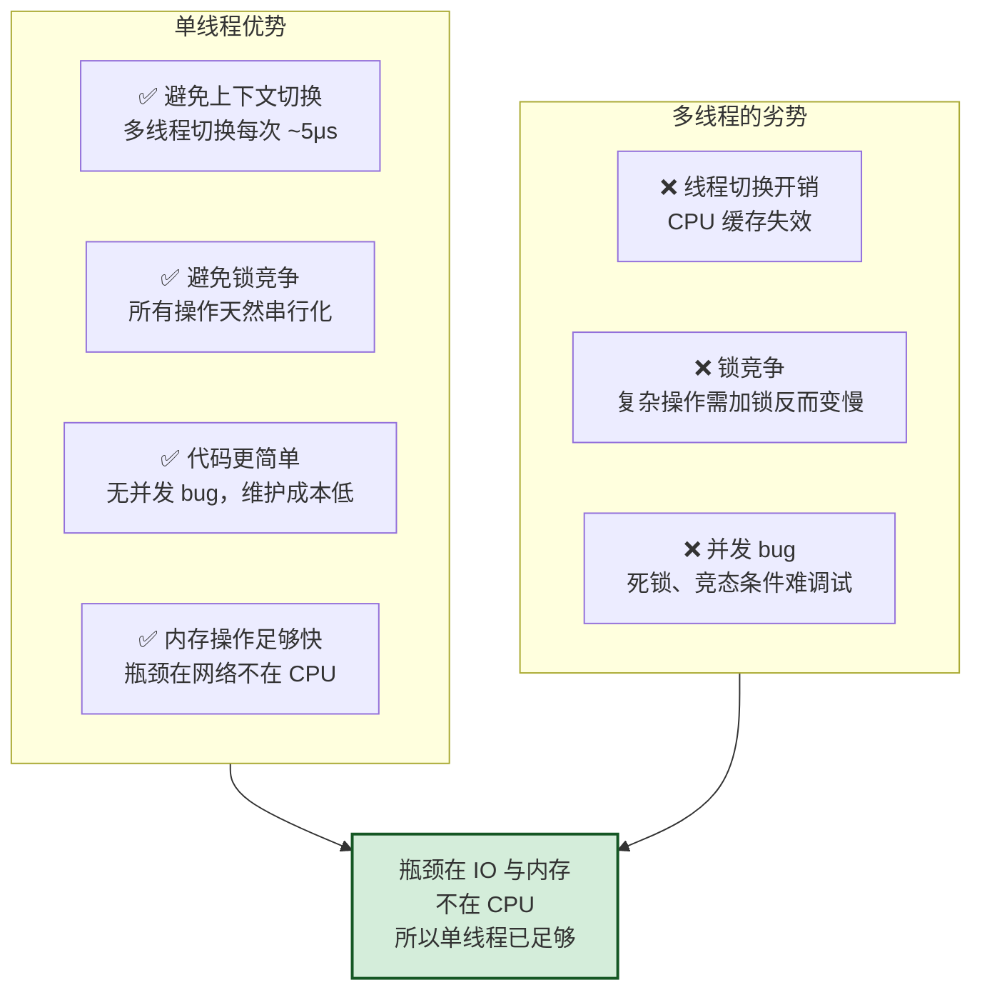
```mermaid
flowchart TB
    subgraph 单线程优势
        A1["✅ 避免上下文切换<br/>多线程切换每次 ~5μs"]
        A2["✅ 避免锁竞争<br/>所有操作天然串行化"]
        A3["✅ 代码更简单<br/>无并发 bug，维护成本低"]
        A4["✅ 内存操作足够快<br/>瓶颈在网络不在 CPU"]
    end

    subgraph 多线程的劣势
        B1["❌ 线程切换开销<br/>CPU 缓存失效"]
        B2["❌ 锁竞争<br/>复杂操作需加锁反而变慢"]
        B3["❌ 并发 bug<br/>死锁、竞态条件难调试"]
    end

    单线程优势 --> CONCLUSION["瓶颈在 IO 与内存<br/>不在 CPU<br/>所以单线程已足够"]
    多线程的劣势 --> CONCLUSION

    style CONCLUSION fill:#d4edda,stroke:#155724,stroke-width:2px
```

**关键数据支撑**：
- Redis 一次命令执行约 100ns（内存操作）
- 一次线程上下文切换约 5μs（5000ns）
- 多线程切换的开销 **远大于** 单线程串行执行的开销

**适用前提**：
- CPU 不是瓶颈（瓶颈在网络 IO）
- 命令本身是简短内存操作（不是 `KEYS`、`SORT` 这种 O(N) 大命令）

**加分项**：能区分"单线程"的具体范围——指命令执行链路单线程，不代表持久化、AOF 刷盘等也单线程。

---

### 1.3 🔴 Redis 6.0 多线程是怎么回事？是不是单线程被废弃了？

**答：**

**不是！** Redis 6.0 引入的多线程**仅用于网络 IO**，命令执行依然是单线程。

**为什么要引入多线程 IO？**

随着硬件发展，Redis 单机性能瓶颈从 CPU 转移到**网络 IO**：
- 网卡带宽打满（如 40Gbps 网卡下 Redis 已达到瓶颈）
- 单线程 IO 解析协议在高并发下成为瓶颈

**Redis 6.0 多线程架构：**

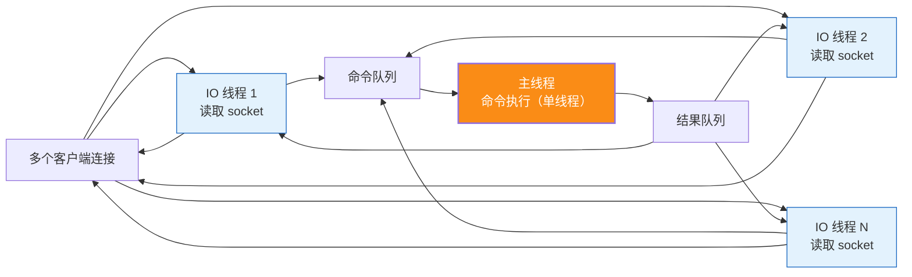
```mermaid
flowchart LR
    CLIENT[多个客户端连接] --> IO1[IO 线程 1<br/>读取 socket]
    CLIENT --> IO2[IO 线程 2<br/>读取 socket]
    CLIENT --> ION[IO 线程 N<br/>读取 socket]

    IO1 & IO2 & ION --> QUEUE[命令队列]
    QUEUE --> MAIN[主线程<br/>命令执行（单线程）]
    MAIN --> QUEUE2[结果队列]
    QUEUE2 --> IO1 & IO2 & ION
    IO1 & IO2 & ION --> CLIENT

    style MAIN fill:#fa8c16,color:#fff,stroke-width:2px
    style IO1 fill:#e3f2fd,stroke:#1565c0
    style IO2 fill:#e3f2fd,stroke:#1565c0
    style ION fill:#e3f2fd,stroke:#1565c0
```

**开启多线程 IO 的配置：**

```conf
# redis.conf
# 开启多线程 IO（默认关闭）
io-threads 4
# 读写都使用多线程（默认只读用）
io-threads-do-reads yes
```

**为什么不把命令执行也多线程化？**

| 维度 | IO 多线程 | 命令多线程 |
|:----|:---------|:---------|
| 收益 | 突破网卡瓶颈，QPS 提升 1~2 倍 | 收益有限（命令本身已很快） |
| 复杂度 | 低（IO 无状态，无需加锁） | 高（共享数据需加锁，反而变慢） |
| 兼容性 | 完全兼容（命令语义不变） | 破坏现有所有命令的原子性 |

**加分项**：明确指出 Redis 6.0 多线程是**可选的**，默认关闭；只有在高并发+大流量场景下才有收益，小项目用单线程已够。

---

### 1.4 🟡 Redis 和 Memcached 的区别？为什么后端缓存更倾向 Redis？

**答：**

| 对比维度 | **Redis** ✅ 后端首选 | Memcached |
|:--------|:------------------|:----------|
| **数据结构** | String/Hash/List/Set/ZSet/Bitmap/HLL/Geo/Stream | 仅 String |
| **单机性能** | ~10 万 QPS | ~50 万 QPS（更极致） |
| **持久化** | RDB + AOF（数据不丢） | ❌ 纯内存，重启丢失 |
| **高可用** | 主从/哨兵/Cluster 内置 | 需客户端一致性哈希 |
| **单 Value 大小** | 默认 512MB | 默认 1MB |
| **线程模型** | 单线程（命令执行） | 多线程 |
| **事务** | MULTI/EXEC/WATCH | ❌ 不支持 |
| **过期策略** | 惰性 + 定期 | 惰性删除 |
| **集群** | 原生 Cluster 分片 | 客户端分片 |
| **生态** | Spring Data/Redisson 等丰富 | 相对简单 |

**为什么 Redis 更受欢迎？**

1. **数据结构丰富**：Memcached 只能存 String，但 Hash/List/ZSet 让 Redis 能做排行榜、计数器、消息队列等复杂业务
2. **持久化保证**：即使宕机也能恢复数据，不只是缓存还能当数据库
3. **高可用开箱即用**：Sentinel/Cluster 是内置功能
4. **生态成熟**：Spring Data Redis、Redisson 等成熟客户端

**Memcached 还有优势吗？**

有，但场景很窄：
- **纯 KV 缓存 + 多核机器**：Memcached 多线程在多核上吞吐更高（50 万 QPS）
- **不需要持久化**：临时性缓存，丢了无所谓

**加分项**：能提到 Redis 7.0 之后通过多线程 IO 已经把性能差距缩小，进一步巩固了 Redis 的首选地位。

---

### 1.5 🔴 Redis 为什么选择单线程模型，而不是多线程？

**答：**

这是 Redis 作者 antirez 的经典设计决策，**不是不能做多线程，而是不值得做**。理由如下：

**1. 性能瓶颈分析**

Redis 单命令执行时间约 100ns，瓶颈分布：
- 内存操作：100ns（极快）
- 网络往返：通常 0.1~1ms（瓶颈所在）
- CPU 计算：几乎不是瓶颈

**结论**：瓶颈在网络 IO 而非 CPU，多线程无法突破网络瓶颈，反而引入额外开销。

**2. 多线程的隐性成本**

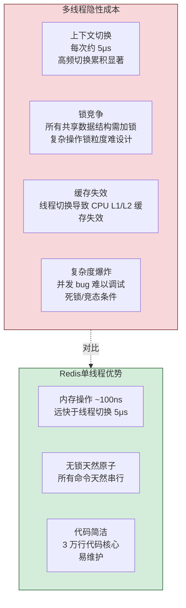
```mermaid
flowchart TB
    subgraph 多线程隐性成本
        C1["上下文切换<br/>每次约 5μs<br/>高频切换累积显著"]
        C2["锁竞争<br/>所有共享数据结构需加锁<br/>复杂操作锁粒度难设计"]
        C3["缓存失效<br/>线程切换导致 CPU L1/L2 缓存失效"]
        C4["复杂度爆炸<br/>并发 bug 难以调试<br/>死锁/竞态条件"]
    end

    subgraph Redis单线程优势
        S1["内存操作 ~100ns<br/>远快于线程切换 5μs"]
        S2["无锁天然原子<br/>所有命令天然串行"]
        S3["代码简洁<br/>3 万行代码核心<br/>易维护"]
    end

    多线程隐性成本 -.->|"对比"| Redis单线程优势

    style 多线程隐性成本 fill:#f8d7da,stroke:#721c24
    style Redis单线程优势 fill:#d4edda,stroke:#155724
```

**3. Redis 多线程的两次尝试**

- Redis 4.0：后台任务多线程（如 `UNLINK` 异步删除大 key、AOF 刷盘）—— **不破坏命令执行的原子性**
- Redis 6.0：IO 多线程（接收/返回 socket）—— **命令执行依然单线程**

**4. 什么时候 Redis 单线程会变慢？**

只有一个场景：**执行 O(N) 大命令**
- `KEYS *`：扫描所有 key，几百万 key 时阻塞几秒
- `HGETALL` 大 Hash（百万元素）：阻塞数百毫秒
- `SORT` 大集合：CPU 密集型

**正解**：避免大命令，用 `SCAN` / `HSCAN` 替代，保持命令 O(1) 或 O(log N)。

**加分项**：能结合 CAP 原理说明——Redis 选择 CP（强一致）+ 单线程原子操作，牺牲一点性能换取了正确性保障。

---

## 二、核心数据结构与应用场景

### 2.1 🟡 Redis 有哪些基本数据结构？分别适用什么场景？

**答：**

Redis 共有 9 种数据结构，5 种基础 + 4 种扩展：

| 数据结构 | 底层实现 | 典型应用场景 | 时间复杂度 |
|:--------|:--------|:------------|:----------|
| **String** | SDS（简单动态字符串） | 缓存、计数器、分布式锁、Session | O(1) |
| **Hash** | ziplist / listpack / hashtable | 对象存储（用户信息、商品信息） | O(1) |
| **List** | quicklist（双向链表 + ziplist） | 消息队列、最新列表、文章列表 | O(1) 头尾 / O(N) 中间 |
| **Set** | intset / hashtable | 去重、共同好友、标签 | O(1) 增删查 |
| **ZSet** | listpack / skiplist + hashtable | 排行榜、延迟队列、TOP N | O(log N) |
| **Bitmap** | String 的位操作 | 签到、日活统计、布隆过滤器 | O(1) |
| **HyperLogLog** | 稀疏/密集表示 | UV 统计（基数估算） | O(1) |
| **Geo** | ZSet + GeoHash 编码 | 附近的人、附近的店 | O(log N) |
| **Stream** | radix tree | 消息队列（带消费者组） | O(1) 追加 / O(log N) 读取 |

**选型对照表（按业务场景）：**

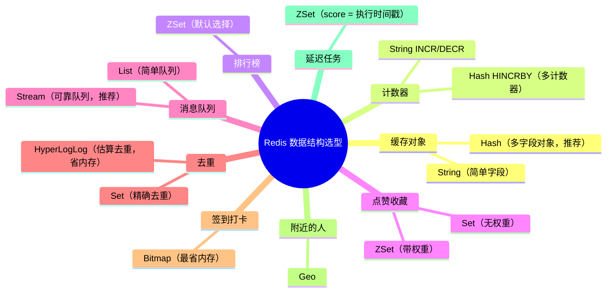
```mermaid
mindmap
  root((Redis 数据结构选型))
    缓存对象
      String（简单字段）
      Hash（多字段对象，推荐）
    计数器
      String INCR/DECR
      Hash HINCRBY（多计数器）
    排行榜
      ZSet（默认选择）
    点赞收藏
      Set（无权重）
      ZSet（带权重）
    消息队列
      List（简单队列）
      Stream（可靠队列，推荐）
    去重
      Set（精确去重）
      HyperLogLog（估算去重，省内存）
    签到打卡
      Bitmap（最省内存）
    附近的人
      Geo
    延迟任务
      ZSet（score = 执行时间戳）
```

**加分项**：能说出每种结构的内存占用特征（如 Bitmap 1 亿用户仅 12MB，HyperLogLog 1 亿 UV 仅 12KB）。

---

### 2.2 🟡 String 的底层数据结构是什么？

**答：**

Redis 的 String 不是 C 语言的 `char*`，而是自己实现的 **SDS（Simple Dynamic String，简单动态字符串）**。

**SDS 结构（Redis 3.2 之后优化为多种头部）：**

```c
// Redis 7.x 的 SDS 结构（按字符串长度选择不同头部）
struct __attribute__ ((__packed__)) sdshdr8 {
    uint8_t len;          // 已使用长度
    uint8_t alloc;        // 分配的总长度（不含头部和 \0）
    unsigned char flags;  // 低3位标识头部类型（sdshdr5/8/16/32/64）
    char buf[];           // 实际存储的字符数据
};
```

**SDS 相比 C 字符串的 5 大优势：**

| 优势 | C 字符串 | SDS |
|:-----|:--------|:----|
| **获取长度** | O(N) 遍历到 `\0` | O(1) 直接读 `len` 字段 |
| **防止缓冲区溢出** | 不检查，可能溢出覆盖相邻内存 | 自动检查 `alloc` 是否够，不够就扩容 |
| **减少内存重分配** | 每次修改都重新分配 | 空间预分配 + 惰性释放，修改效率高 |
| **二进制安全** | 遇到 `\0` 就截断 | 用 `len` 判断结束，可存图片/序列化字节 |
| **兼容部分 C 字符串函数** | — | 末尾仍有 `\0`，可复用 `strstr` 等 |

**空间预分配策略**：

```
字符串增长时:
  如果 len < 1MB:  分配 2 × len 的空间（即预留 len 长度）
  如果 len >= 1MB: 预留 1MB 空间

例:
  "hello" → 修改为 "hello world"（11 字节）
  分配空间 = 11 × 2 + 1 = 23 字节
  剩余 free = 12 字节，下次小修改无需重新分配
```

**加分项**：能指出 Redis 3.2 之前 SDS 只有一种结构（`int len + int free + char buf[]`），3.2 之后按字符串大小分了 5 种头部（sdshdr5/8/16/32/64），节省小字符串的内存开销。

---

### 2.3 🟡 Hash 类型的底层实现是什么？

**答：**

Redis 7.x 中 Hash 的底层实现有**两种**，根据数据量自动切换：

| 底层结构 | 触发条件 | 优势 |
|:--------|:--------|:-----|
| **listpack**（Redis 7.0 替换 ziplist） | 元素数 ≤ 128 且 单元素 ≤ 64 字节 | 内存紧凑，访问局部性好 |
| **hashtable** | 元素数 > 128 或 单元素 > 64 字节 | 查询 O(1)，无遍历开销 |

**listpack 结构（紧凑连续内存）：**

```
[element1][element2][element3][element4]...[end-byte]
  键1     值1      键2      值2

特点: 整个数组连续存储，无指针开销，CPU 缓存友好
缺点: 插入/删除中间元素需要内存搬移
```

**hashtable 结构（Redis 自实现类似 Java HashMap）：**

```
数组 + 链表（Redis 7.0 之后引入 listpack 替代链表）

[dictht[0]]
  +----+    +----------+
  | 0  |--->| bucket   |
  +----+    +----------+
  | 1  |--->| k1 → v1  | → | k2 → v2 | (链表/listpack)
  +----+    +----------+
  | 2  |    | null     |
  +----+    +----------+
```

**渐进式 rehash（核心考点）：**

当 hashtable 元素过多触发扩容时，Redis 不会一次性迁移所有数据（会阻塞主线程），而是采用**渐进式 rehash**：

```c
// dictht 结构（双哈希表）
typedef struct dict {
    dictht ht[2];       // ht[0] 平时用，ht[1] rehash 时用
    long rehashidx;     // -1 表示没在 rehash，否则表示当前迁移到哪个桶
} dict;
```

**渐进式 rehash 流程**：

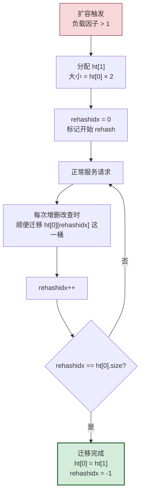
```mermaid
flowchart TB
    START["扩容触发<br/>负载因子 > 1"] --> ALLOC["分配 ht[1]<br/>大小 = ht[0] × 2"]
    ALLOC --> SET["rehashidx = 0<br/>标记开始 rehash"]

    SET --> NORMAL["正常服务请求"]
    NORMAL --> EACH["每次增删改查时<br/>顺便迁移 ht[0][rehashidx] 这一桶"]
    EACH --> NEXT["rehashidx++"]
    NEXT --> CHECK{"rehashidx == ht[0].size?"}
    CHECK -->|"否"| NORMAL
    CHECK -->|"是"| DONE["迁移完成<br/>ht[0] = ht[1]<br/>rehashidx = -1"]

    style START fill:#f8d7da,stroke:#721c24
    style DONE fill:#d4edda,stroke:#155724,stroke-width:2px
```

**rehash 期间的读写规则**：
- 写入：新数据写入 `ht[1]`，不写入 `ht[0]`
- 读取：先查 `ht[0]`，找不到再查 `ht[1]`
- 删除：两个表都要查

**加分项**：能解释为什么 Hash 在小数据量用 listpack——为了**省内存**，hashtable 每个元素至少要 16 字节指针，listpack 紧凑存储能省一半以上内存。

---

### 2.4 🔴 ZSet 为什么能保持有序？跳表是什么？

**答：**

ZSet（Sorted Set）的底层是 **skiplist（跳表） + hashtable** 双结构。

**1. 为什么用两个结构？**

| 结构 | 作用 | 优势 |
|:-----|:-----|:-----|
| **skiplist** | 按 score 排序，支持范围查询 | 范围查询 O(log N) |
| **hashtable** | member → score 映射 | 单元素查询 O(1) |

只用 skiplist 单点查询是 O(log N)，加 hashtable 后变成 O(1)；只用 hashtable 又无法排序。**两个结构分工合作**。

**2. 跳表是什么？**

跳表 = **多层链表**，通过**空间换时间**实现 O(log N) 查询。

**跳表结构示例**（查询元素 35）：

```
Level 3:  [HEAD] --------------------------------------> [35] ----------> [NIL]
                       ← 大跨度跳跃，快速定位区间
Level 2:  [HEAD] ------> [12] ------------------> [35] --> [NIL]
                       ← 中等跳跃
Level 1:  [HEAD] ------> [12] ------> [23] ----> [35] --> [NIL]
                       ← 小跳跃
Level 0:  [HEAD] -> [3] -> [12] -> [18] -> [23] -> [35] -> [44] -> [NIL]
           完整链表，包含所有节点
```

**查询 35 的过程**：
1. 从 Level 3 最高层开始，HEAD 的下一个节点是 35，匹配到！返回
2. 总共只比较了 1 次

如果用普通链表，要从 HEAD 遍历到 35，比较 6 次。跳表通过多层索引把 O(N) 优化到 O(log N)。

**3. 为什么不用红黑树而用跳表？**

Redis 作者 antirez 的解释（5 大理由）：

| 维度 | 跳表 | 红黑树 |
|:-----|:----|:------|
| **实现复杂度** | 简单（约 100 行代码） | 复杂（旋转/染色约 300 行） |
| **范围查询** | 天然支持（链表顺序遍历） | 需要中序遍历，复杂 |
| **内存局部性** | 较差（节点分散） | 较好（树紧凑） |
| **并发友好性** | 局部加锁即可 | 旋转影响多个节点 |
| **调参灵活性** | 可调层数概率 p | 固定结构 |

**4. 跳表的随机层数生成**

新节点插入时，层数通过**抛硬币**决定：

```c
// Redis 的层数生成算法
int zslRandomLevel(void) {
    int level = 1;
    // ZSKIPLIST_P = 0.25，即 1/4 概率升一层
    while ((random() & 0xFFFF) < (0.25 * 0xFFFF))
        level += 1;
    return (level < ZSKIPLIST_MAXLEVEL) ? level : ZSKIPLIST_MAXLEVEL;
}
// 期望层数 = 1 / (1 - 0.25) = 1.33
// 即平均每个节点占 1.33 层
```

**加分项**：能指出跳表每个节点的平均指针数是 1.33（p=0.25 时），内存开销仅比红黑树多约 33%，但实现简单很多。

---

### 2.5 🔴 Redis 7.0 引入的 Listpack 是什么？为什么替换 ziplist？

**答：**

**Listpack 是 Redis 7.0 引入的紧凑列表结构，用来替换 ziplist**。

**1. ziplist 的问题（为什么替换）**

ziplist 是连续内存的紧凑列表，但有一个致命缺陷——**连锁更新（Cascade Update）**：

```
ziplist 结构:
[header][entry1][entry2][entry3]...[end]

每个 entry 包含 prevlen 字段（记录前一个 entry 的长度）:
  - 前一个 entry < 254 字节：prevlen 用 1 字节
  - 前一个 entry >= 254 字节：prevlen 用 5 字节

连锁更新场景:
  假设有连续多个 entry 长度都恰好是 253 字节（prevlen = 1 字节）
  现在修改 entry1，长度变为 254 字节
  → entry2 的 prevlen 要从 1 字节扩展为 5 字节
  → entry2 长度从 253 变为 257（>= 254）
  → entry3 的 prevlen 也要扩展
  → ... 雪崩式扩展，最坏 O(N²) 性能
```

**2. Listpack 的改进**

```
listpack 结构:
[header][entry1][entry2][entry3]...[end]

每个 entry 只记录自己的长度，不记录前一个 entry 的长度
→ 修改一个 entry 不影响其他 entry
→ 彻底消除连锁更新问题
```

**3. 对比表**

| 维度 | ziplist | listpack |
|:-----|:--------|:---------|
| **prevlen 字段** | ✅ 有（连锁更新根因） | ❌ 无 |
| **连锁更新** | ⚠️ 最坏 O(N²) | ✅ 不存在 |
| **内存占用** | 略多 | 略少（少存 prevlen） |
| **查询性能** | O(N) | O(N) |
| **修改性能** | 最坏 O(N²) | O(N) |

**4. 影响范围**

Redis 7.0 开始，以下数据结构的紧凑表示都从 ziplist 切换到 listpack：
- Hash 的 listpack
- ZSet 的 listpack
- List 的 quicklist 内部节点

**加分项**：能指出 Redis 7.0 是渐进替换的——`listpack` 在 7.0 引入但默认未启用，7.0+ 通过 `listpack-max-entries` 等配置控制；旧版本数据可兼容读取 ziplist。

---

### 2.6 🟡 如何用 Redis 实现排行榜？

**答：**

排行榜是 ZSet 的**经典场景**，利用 score 排序的特性。

**核心命令：**

```bash
# 1. 添加玩家分数（更新）
ZADD leaderboard 9500 "user:1001"
ZADD leaderboard 8800 "user:1002"
ZADD leaderboard 9500 "user:1003"

# 2. 获取 Top 10（按分数从高到低）
ZREVRANGE leaderboard 0 9 WITHSCORES

# 3. 查询某玩家排名（从高到低，第 1 名返回 0）
ZREVRANK leaderboard "user:1001"

# 4. 查询某玩家分数
ZSCORE leaderboard "user:1001"

# 5. 增加玩家分数（如游戏中得分）
ZINCRBY leaderboard 100 "user:1001"

# 6. 获取分数区间内的玩家（如 9000-10000 分段）
ZRANGEBYSCORE leaderboard 9000 10000 WITHSCORES
```

**Java 实现（Spring Data Redis）：**

```java
@Service
public class LeaderboardService {

    private final StringRedisTemplate redis;
    private static final String KEY = "leaderboard:game:1";

    // 增加用户分数
    public Double addScore(String userId, double score) {
        return redis.opsForZSet().incrementScore(KEY, userId, score);
    }

    // 获取 Top N
    public List<RankItem> getTopN(int n) {
        Set<ZSetOperations.TypedTuple<String>> tuples =
            redis.opsForZSet().reverseRangeWithScores(KEY, 0, n - 1);

        List<RankItem> result = new ArrayList<>();
        int rank = 1;
        for (ZSetOperations.TypedTuple<String> t : tuples) {
            result.add(new RankItem(rank++, t.getValue(), t.getScore()));
        }
        return result;
    }

    // 获取用户排名
    public RankItem getUserRank(String userId) {
        Long rank = redis.opsForZSet().reverseRank(KEY, userId);
        Double score = redis.opsForZSet().score(KEY, userId);
        return new RankItem(rank == null ? -1 : rank + 1, userId, score == null ? 0 : score);
    }
}
```

**进阶场景：**

| 场景 | 实现方案 |
|:-----|:--------|
| **周榜/月榜** | 每周一个 Key：`leaderboard:week:2026W32`，定时清理历史 Key |
| **多维度排行** | 不同维度用不同 Key：`leaderboard:sales` / `leaderboard:level` |
| **分页排行** | `ZREVRANGE leaderboard start end WITHSCORES`（start/end 是下标） |
| **并列排名** | 用 `ZRANGE` 反查同分数段，前端处理并列展示 |

**加分项**：能提到亿级用户的排行榜优化——分区排行榜（按国家/地区分 Key）+ 定时合并到全局榜，避免单 Key 过大。

---

### 2.7 🟡 如何用 Redis 实现点赞/取消点赞功能？

**答：**

点赞场景非常适合用 Set 或 Hash 实现，根据是否需要时间排序选择。

**方案一：Set（不需要时间排序）**

```bash
# 点赞（用户 1001 给文章 1 点赞）
SADD like:post:1 "user:1001"

# 取消点赞
SREM like:post:1 "user:1001"

# 检查是否已点赞
SISMEMBER like:post:1 "user:1001"

# 获取点赞总数
SCARD like:post:1

# 获取点赞列表（分页）
SMEMBERS like:post:1   # ⚠️ 大 Set 慎用，用 SSCAN
```

**方案二：ZSet（需要按点赞时间排序）**

```bash
# 点赞（score = 时间戳）
ZADD like:post:1 1678886400 "user:1001"

# 取消点赞
ZREM like:post:1 "user:1001"

# 检查是否点赞
ZSCORE like:post:1 "user:1001"   # 返回分数则已点赞，nil 则未点赞

# 获取最近点赞的 N 个用户
ZREVRANGE like:post:1 0 9

# 获取点赞总数
ZCARD like:post:1
```

**完整 Java 实现：**

```java
@Service
public class LikeService {

    private final StringRedisTemplate redis;

    // 点赞
    public boolean like(String postId, String userId) {
        String key = "like:post:" + postId;
        Long result = redis.opsForZSet().add(key, userId, System.currentTimeMillis());
        return result != null && result > 0;
    }

    // 取消点赞
    public boolean unlike(String postId, String userId) {
        String key = "like:post:" + postId;
        Long result = redis.opsForZSet().remove(key, userId);
        return result != null && result > 0;
    }

    // 是否点赞
    public boolean isLiked(String postId, String userId) {
        String key = "like:post:" + postId;
        Double score = redis.opsForZSet().score(key, userId);
        return score != null;
    }

    // 点赞数
    public long count(String postId) {
        String key = "like:post:" + postId;
        Long size = redis.opsForZSet().zCard(key);
        return size == null ? 0 : size;
    }
}
```

**进阶优化**：


```mermaid
flowchart LR
    USER["用户点赞"] --> REDIS["写入 Redis ZSet"]
    REDIS --> MQ["异步消息"]
    MQ --> DB["定时落库 MySQL<br/>减轻数据库压力"]

    style REDIS fill:#fa8c16,color:#fff
    style MQ fill:#e3f2fd,stroke:#1565c0
```

**加分项**：能指出"点赞数据要不要持久化到 DB"——要看业务：
- 临时性点赞（如短视频）：只存 Redis 即可
- 重要业务（如文章点赞数展示）：Redis 做热点，异步落库 MySQL

---

### 2.8 🔴 如何用 Bitmap 统计亿级用户的日活？

**答：**

Bitmap 是 String 的位操作扩展，**1 亿用户只需 12MB 内存**，是统计日活的最佳方案。

**核心思路**：

```
每个用户 ID 对应一个 bit 位置:
  - 用户 ID = 1001 → bit 位置 1001
  - 用户当天访问 → 把 bit 1001 设为 1
  - 统计日活 → 统计所有为 1 的 bit 数量

内存计算:
  1 亿用户 = 1 亿 bit = 1 亿 / 8 = 12.5 MB
  对比 Set 存储: 1 亿 × 8 字节（用户ID） = 800 MB（64 倍）
```

**核心命令：**

```bash
# 用户 1001 访问（设置 bit）
SETBIT active:2026-08-08 1001 1

# 检查用户 1001 是否访问
GETBIT active:2026-08-08 1001

# 统计日活（统计为 1 的 bit 数）
BITCOUNT active:2026-08-08

# 统计连续 3 天都活跃的用户（AND 运算）
BITOP AND active:3days active:2026-08-06 active:2026-08-07 active:2026-08-08

# 统计 3 天内任意一天活跃的用户（OR 运算）
BITOP OR active:any3days active:2026-08-06 active:2026-08-07 active:2026-08-08
```

**Java 实现：**

```java
@Service
public class ActiveUserService {

    private final StringRedisTemplate redis;

    // 用户访问记录
    public void recordVisit(long userId) {
        String key = "active:" + LocalDate.now().format(DateTimeFormatter.BASIC_ISO_DATE);
        redis.opsForValue().setBit(key, userId, true);
    }

    // 当天日活数
    public long getDailyActive() {
        String key = "active:" + LocalDate.now().format(DateTimeFormatter.BASIC_ISO_DATE);
        Long count = redis.opsForValue().bitCount(key);
        return count == null ? 0 : count;
    }

    // 连续 7 天活跃用户数
    public long getWeeklyActive() {
        String[] keys = new String[7];
        for (int i = 0; i < 7; i++) {
            LocalDate date = LocalDate.now().minusDays(i);
            keys[i] = "active:" + date.format(DateTimeFormatter.BASIC_ISO_DATE);
        }
        // AND 操作：7 天都活跃
        redis.opsForValue().bitOp(BitOperation.AND, "active:week", keys);
        Long count = redis.opsForValue().bitCount("active:week");
        return count == null ? 0 : count;
    }
}
```

**注意事项**：

| 问题 | 解决方案 |
|:-----|:--------|
| 用户 ID 不是连续数字 | 用哈希函数把 ID 映射到 [0, N] 区间，可能有冲突（少量误差可接受） |
| 历史数据怎么处理 | 设置 TTL，如保留 90 天：`EXPIRE active:2026-08-08 7776000` |
| 精确统计 vs 估算 | Bitmap 精确，HyperLogLog 估算（12KB 估算亿级，但误差 0.81%） |

**加分项**：能对比 Bitmap 与 HyperLogLog 的取舍——精确用 Bitmap（12MB），允许误差用 HyperLogLog（12KB，省 1000 倍）。

---

### 2.9 🔴 HyperLogLog 是什么？为什么只要 12KB 就能统计亿级 UV？

**答：**

HyperLogLog（HLL）是 Redis 提供的**基数估算**数据结构，**12KB 内存估算亿级 UV，误差 0.81%**。

**1. 基本使用**

```bash
# 添加元素
PFADD uv:2026-08-08 "user:1001"
PFADD uv:2026-08-08 "user:1002" "user:1003"

# 获取基数估算值（去重后的元素数量）
PFCOUNT uv:2026-08-08

# 合并多个 HLL（如合并 7 天 UV）
PFMERGE uv:week uv:2026-08-02 uv:2026-08-03 ... uv:2026-08-08
```

**2. 原理简介**

HLL 基于**伯努利试验**和**概率论**：

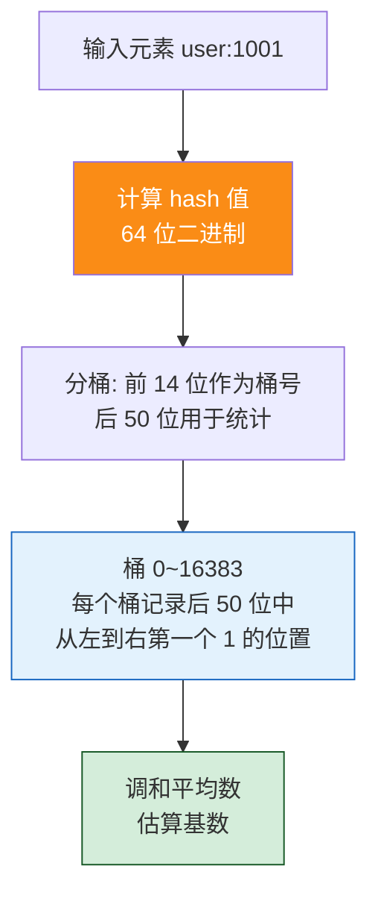
```mermaid
flowchart TB
    INPUT["输入元素 user:1001"] --> HASH["计算 hash 值<br/>64 位二进制"]
    HASH --> SPLIT["分桶: 前 14 位作为桶号<br/>后 50 位用于统计"]
    SPLIT --> BUCKET["桶 0~16383<br/>每个桶记录后 50 位中<br/>从左到右第一个 1 的位置"]
    BUCKET --> ESTIMATE["调和平均数<br/>估算基数"]

    style HASH fill:#fa8c16,color:#fff
    style BUCKET fill:#e3f2fd,stroke:#1565c0
    style ESTIMATE fill:#d4edda,stroke:#155724
```

**直观理解**：
- 抛硬币：连续出现正面的次数 k，估算总抛掷次数 ≈ 2^k
- HLL：每个元素的 hash 中前导零的数量 k，估算元素总数 ≈ 2^k
- 16384 个桶求**调和平均数**，降低方差，提高精度

**3. 内存占用**

```
16384 桶 × 6 bit/桶 = 98304 bit = 12288 字节 = 12 KB
```

无论元素是 1 万还是 1 亿，**永远是 12 KB**。

**4. 误差分析**

| 元素数量 | 实际内存 | 估算误差 |
|:--------|:--------|:--------|
| 1 万 | 12 KB | ~2% |
| 100 万 | 12 KB | ~0.81% |
| 1 亿 | 12 KB | ~0.81% |

**5. Bitmap vs HyperLogLog**

| 维度 | Bitmap | HyperLogLog |
|:-----|:------|:------------|
| **内存** | 1 亿用户 12 MB | 1 亿用户 12 KB（省 1000 倍） |
| **精度** | 100% 精确 | 0.81% 误差 |
| **支持操作** | AND/OR/XOR 集合运算 | 只能 PFMERGE 合并 |
| **适用场景** | 需要精确+集合运算 | 只需要基数估算 |

**加分项**：能说出 HLL 不能删除元素（只能重建），所以不适合需要"取消点赞/移除用户"的场景。

---

## 三、持久化机制

### 3.1 🟡 RDB 和 AOF 的区别是什么？

**答：**

RDB（Redis Database）和 AOF（Append Only File）是 Redis 两种持久化方式，各有特点：

| 对比维度 | **RDB** | **AOF** |
|:--------|:--------|:--------|
| **原理** | 周期性把内存数据**快照**到磁盘 | 记录每条**写命令**到日志文件 |
| **文件格式** | 二进制紧凑 | 文本协议（RESP） |
| **触发方式** | `save`/`bgsave`/自动触发 | 实时写入 / 按策略刷盘 |
| **文件大小** | 小（紧凑二进制） | 大（命令日志，需重写压缩） |
| **恢复速度** | 快（直接加载二进制） | 慢（要重放所有命令） |
| **数据安全性** | 可能丢失上次快照后的数据 | 最多丢 1 秒（everysec 策略） |
| **对性能影响** | 大（fork 子进程时内存翻倍） | 小（追加日志，后台刷盘） |
| **优先级** | 低（AOF 开启时优先用 AOF） | 高 |

**RDB 文件示例（dump.rdb）：**

```
[REDIS] [版本] [元数据] [DB 0 数据...] [CRC64 校验]
二进制紧凑存储，节省空间
```

**AOF 文件示例（appendonly.aof）：**

```
*2      ← 2 个参数
$6      ← 第一个参数长度 6
SELECT  ← 命令
$1
0       ← DB 0
*3
$3
SET     ← SET 命令
$4
user1
$5
hello
```

**双开策略**：Redis 4.0+ 支持混合持久化，结合两者优点。

**加分项**：能指出 AOF 优先级高于 RDB——如果同时开启，Redis 重启时会优先加载 AOF 文件。

---

### 3.2 🟡 AOF 的三种刷盘策略有什么区别？怎么选？

**答：**

AOF 的 `appendfsync` 配置控制**多久把缓冲区数据 fsync 到磁盘**：

| 策略 | 含义 | 性能 | 数据安全 | 适用场景 |
|:----|:-----|:----|:--------|:--------|
| **always** | 每条命令都 fsync | 最慢（QPS 下降 10 倍） | 不丢数据 | 金融级别高安全 |
| **everysec** | 每秒 fsync 一次 | 接近无 AOF | 最多丢 1 秒 | **生产推荐** |
| **no** | 由 OS 决定 fsync 时机 | 最快 | 丢数据较多（30 秒内） | 不推荐 |

**原理对比**：

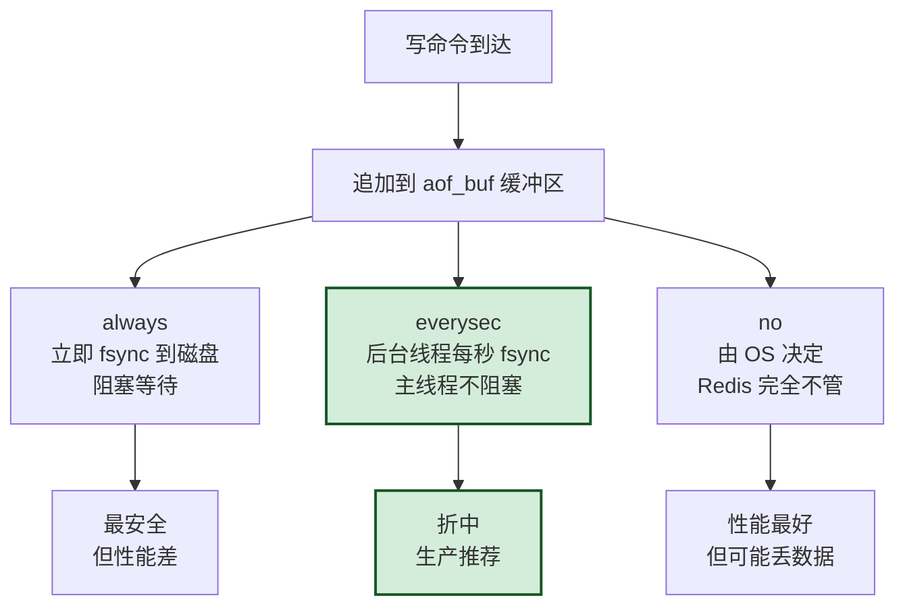
```mermaid
flowchart TB
    CMD["写命令到达"] --> BUF["追加到 aof_buf 缓冲区"]

    BUF --> ALWAYS["always<br/>立即 fsync 到磁盘<br/>阻塞等待"]
    BUF --> EVERYSEC["everysec<br/>后台线程每秒 fsync<br/>主线程不阻塞"]
    BUF --> NO["no<br/>由 OS 决定<br/>Redis 完全不管"]

    ALWAYS --> SAFE1["最安全<br/>但性能差"]
    EVERYSEC --> SAFE2["折中<br/>生产推荐"]
    NO --> SAFE3["性能最好<br/>但可能丢数据"]

    style EVERYSEC fill:#d4edda,stroke:#155724,stroke-width:2px
    style SAFE2 fill:#d4edda,stroke:#155724,stroke-width:2px
```

**生产推荐配置：**

```conf
# redis.conf
appendonly yes
appendfsync everysec      # 每秒 fsync，平衡性能与安全
no-appendfsync-on-rewrite yes   # AOF 重写期间不 fsync，避免 IO 抖动
auto-aof-rewrite-percentage 100  # AOF 文件比上次重写后大 100% 触发重写
auto-aof-rewrite-min-size 64mb   # AOF 文件最小 64MB 才触发重写
```

**加分项**：能解释为什么 `always` 性能差——fsync 是同步系统调用，磁盘 IO 约 10ms，意味着每条命令都要等 10ms，QPS 从 10 万降到 1 千。

---

### 3.3 🔴 RDB 的 bgsave 是怎么工作的？fork 子进程会不会阻塞主线程？

**答：**

**1. bgsave 工作流程**

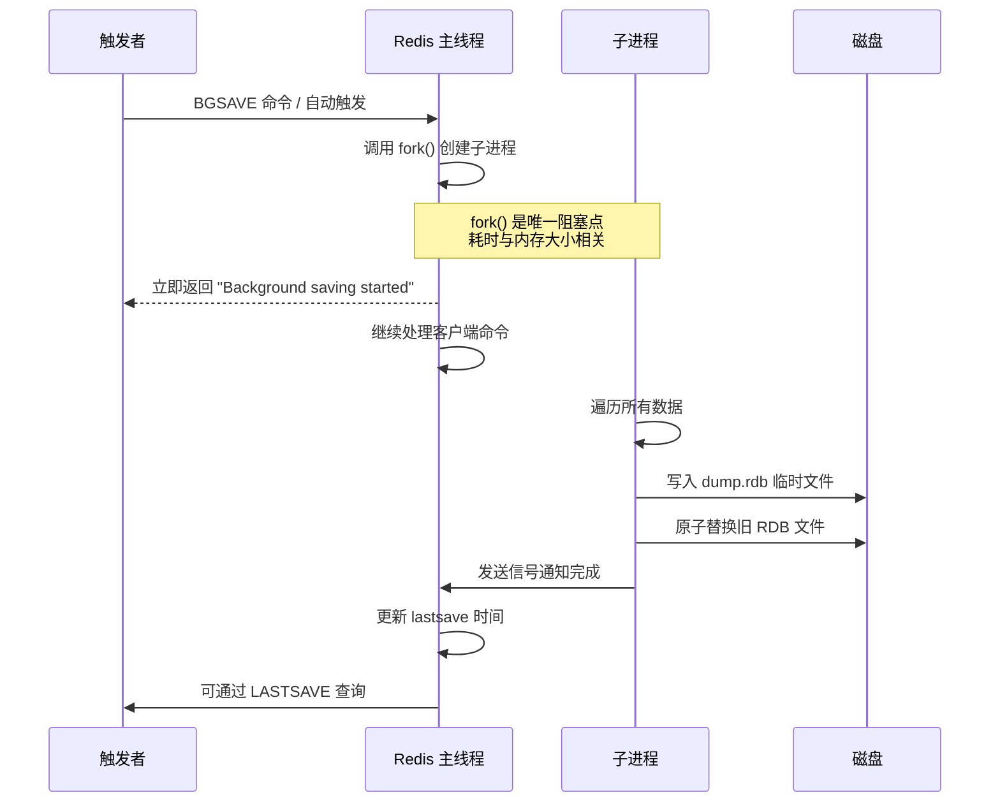
```mermaid
sequenceDiagram
    participant User as 触发者
    participant Main as Redis 主线程
    participant Child as 子进程
    participant Disk as 磁盘

    User->>Main: BGSAVE 命令 / 自动触发
    Main->>Main: 调用 fork() 创建子进程

    Note over Main,Child: fork() 是唯一阻塞点<br/>耗时与内存大小相关

    Main-->>User: 立即返回 "Background saving started"
    Main->>Main: 继续处理客户端命令

    Child->>Child: 遍历所有数据
    Child->>Disk: 写入 dump.rdb 临时文件
    Child->>Disk: 原子替换旧 RDB 文件
    Child->>Main: 发送信号通知完成

    Main->>Main: 更新 lastsave 时间
    Main->>User: 可通过 LASTSAVE 查询
```

**2. fork 会阻塞主线程，但通常很短**

`fork()` 是操作系统系统调用，**确实会阻塞主线程**，但阻塞时间主要取决于**内存大小**：

| 内存大小 | fork 耗时 | 影响 |
|:--------|:--------|:----|
| 1 GB | ~10ms | 几乎无感 |
| 10 GB | ~100ms | 略有感知 |
| 100 GB | ~1秒 | 明显阻塞 |
| 300 GB | ~3秒 | 严重阻塞，QPS 抖动 |

**3. fork 不复制内存，靠 COW（Copy On Write）**

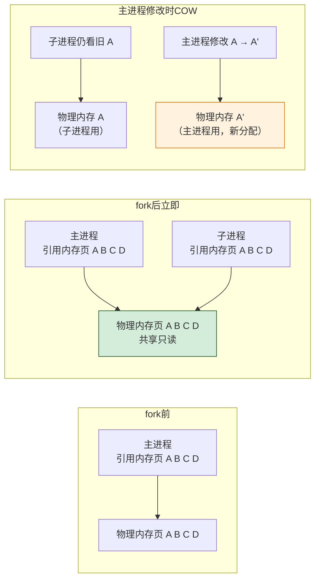
```mermaid
flowchart LR
    subgraph fork前
        MAIN1["主进程<br/>引用内存页 A B C D"]
        MEM1["物理内存页 A B C D"]
        MAIN1 --> MEM1
    end

    subgraph fork后立即
        MAIN2["主进程<br/>引用内存页 A B C D"]
        CHILD2["子进程<br/>引用内存页 A B C D"]
        MEM2["物理内存页 A B C D<br/>共享只读"]
        MAIN2 --> MEM2
        CHILD2 --> MEM2
    end

    subgraph 主进程修改时COW
        MAIN3["主进程修改 A → A'"]
        CHILD3["子进程仍看旧 A"]
        MEM3_OLD["物理内存 A<br/>（子进程用）"]
        MEM3_NEW["物理内存 A'<br/>（主进程用，新分配）"]
        CHILD3 --> MEM3_OLD
        MAIN3 --> MEM3_NEW
    end

    style MEM2 fill:#d4edda,stroke:#155724
    style MEM3_NEW fill:#fff3e0,stroke:#ef6c00
```

**COW 关键点**：
- fork 时**不复制内存**，父子进程共享同一物理内存页（标记为只读）
- 父进程要修改某页时，操作系统才**复制一份**给父进程修改
- 子进程始终看到 fork 时刻的快照数据

**4. fork 期间内存可能翻倍**

极端情况：fork 期间所有内存页都被主进程修改 → 所有页都要 COW → 内存占用翻倍。

**生产建议**：
- Redis 机器内存留 50% 余量给 COW
- 监控 `info memory` 中的 `used_memory_rss`，超过阈值告警

**加分项**：能解释为什么 Redis 不用线程做 RDB 而用子进程——多线程共享内存需要加锁，会破坏命令的原子性；子进程天然隔离，COW 保证数据一致性。

---

### 3.4 🔴 AOF 重写是什么？为什么需要？会不会阻塞？

**答：**

**1. 为什么需要 AOF 重写？**

AOF 是命令日志，会越来越大：

```
原始命令日志:
SET user:1 a     ← 设置
SET user:1 b     ← 又设置
SET user:1 c     ← 又设置
DEL user:1       ← 删除
SET user:1 d     ← 又设置

AOF 文件记录了 4 条命令，但最终状态只有 1 个 key=user:1, value=d
重写后只需 1 条命令: SET user:1 d
```

**重写 = 把内存当前状态重新生成最小命令集**，可减少 80%+ 文件大小。

**2. 重写流程**

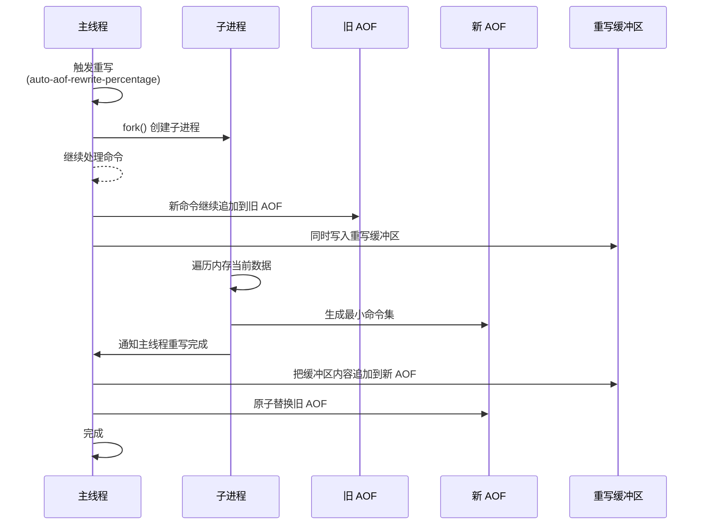
```mermaid
sequenceDiagram
    participant Main as 主线程
    participant Child as 子进程
    participant OldAOF as 旧 AOF
    participant NewAOF as 新 AOF
    participant Buf as 重写缓冲区

    Main->>Main: 触发重写<br/>(auto-aof-rewrite-percentage)
    Main->>Child: fork() 创建子进程

    Main-->>Main: 继续处理命令
    Main->>OldAOF: 新命令继续追加到旧 AOF
    Main->>Buf: 同时写入重写缓冲区

    Child->>Child: 遍历内存当前数据
    Child->>NewAOF: 生成最小命令集

    Child->>Main: 通知主线程重写完成
    Main->>Buf: 把缓冲区内容追加到新 AOF
    Main->>NewAOF: 原子替换旧 AOF
    Main->>Main: 完成
```

**3. 重写会不会阻塞？**

| 阶段 | 阻塞主线程 | 说明 |
|:----|:--------:|:-----|
| fork 子进程 | ✅ 短暂阻塞 | 同 bgsave，依赖内存大小 |
| 子进程生成新 AOF | ❌ 不阻塞 | 子进程独立工作 |
| 主线程写命令 | ❌ 不阻塞 | 但要多写一份到重写缓冲区（额外内存） |
| 替换 AOF 文件 | ✅ 短暂阻塞 | 锁住主线程，但很快 |

**4. 触发方式**

```conf
# redis.conf 自动触发
auto-aof-rewrite-percentage 100  # 文件比上次重写后增长 100%
auto-aof-rewrite-min-size 64mb   # 文件至少 64MB 才考虑重写

# 手动触发
BGREWRITEAOF   # 后台重写，不阻塞
```

**5. 生产建议**

```conf
# 推荐配置
auto-aof-rewrite-percentage 50   # 降低阈值，更频繁重写
auto-aof-rewrite-min-size 128mb  # 提高最小限制，避免小文件频繁重写
no-appendfsync-on-rewrite yes    # 重写期间不 fsync，避免 IO 抖动
```

**加分项**：能指出"重写期间主线程要同时写旧 AOF 和缓冲区，内存占用会临时增加"——所以重写期间监控内存峰值。

---

### 3.5 🔴 Redis 4.0 的混合持久化是什么？为什么推荐？

**答：**

**混合持久化 = RDB + AOF 结合**，解决 AOF 恢复慢的问题。

**1. 传统 AOF 恢复慢的问题**

```
AOF 文件: 全部是命令日志
重启恢复: 重放每条命令
1 亿 key 的 AOF 文件可能要 10+ 分钟才能恢复
```

**2. 混合持久化原理**

重写 AOF 时，**前半部分用 RDB 二进制，后半部分用 AOF 命令日志**：

```
混合 AOF 文件结构:
[RDB 二进制快照] + [增量 AOF 命令日志]

恢复时:
1. 先加载 RDB 部分（快，二进制直接读）
2. 再重放 AOF 部分（少，只重放重写后的命令）
```

**3. 开启方式**

```conf
# redis.conf（Redis 4.0+）
aof-use-rdb-preamble yes   # 默认开启（Redis 5.0+）
```

**4. 对比**

| 持久化方案 | 恢复速度 | 数据完整性 | 文件大小 |
|:---------|:--------|:----------|:--------|
| 纯 RDB | 最快 | 丢上次快照后的数据 | 最小 |
| 纯 AOF | 最慢 | 最多丢 1 秒 | 最大 |
| **混合持久化** | 快 | 最多丢 1 秒 | 中等 |

**5. 恢复时间对比（1 亿 key）**

| 方案 | 恢复时间 |
|:----|:--------|
| 纯 RDB | ~30 秒 |
| 纯 AOF | ~10 分钟 |
| 混合持久化 | ~1 分钟 |

**加分项**：能指出混合持久化是 **AOF 文件的开头部分是 RDB 格式**——本质还是 AOF 文件，但用 RDB 加速恢复。

---

### 3.6 🔴 生产环境持久化方案怎么选？

**答：**

根据业务场景选择，没有银弹：

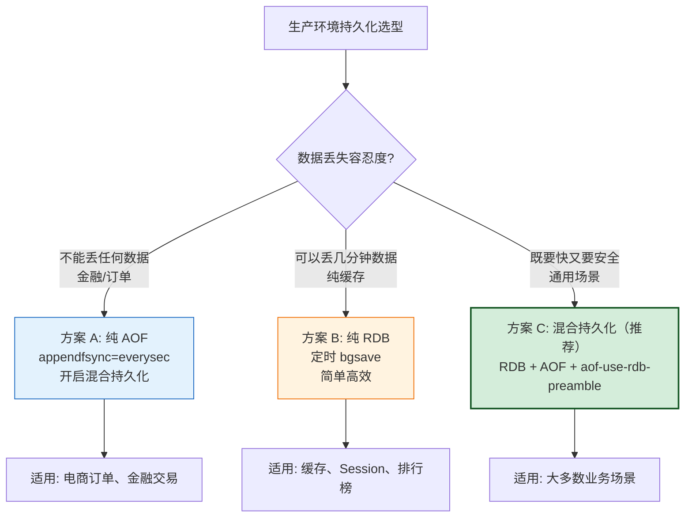
```mermaid
flowchart TB
    START["生产环境持久化选型"] --> Q1{"数据丢失容忍度?"}

    Q1 -->|"不能丢任何数据<br/>金融/订单"| AOF["方案 A: 纯 AOF<br/>appendfsync=everysec<br/>开启混合持久化"]
    Q1 -->|"可以丢几分钟数据<br/>纯缓存"| RDB["方案 B: 纯 RDB<br/>定时 bgsave<br/>简单高效"]
    Q1 -->|"既要快又要安全<br/>通用场景"| MIX["方案 C: 混合持久化（推荐）<br/>RDB + AOF + aof-use-rdb-preamble"]

    AOF --> AOF_C["适用: 电商订单、金融交易"]
    RDB --> RDB_C["适用: 缓存、Session、排行榜"]
    MIX --> MIX_C["适用: 大多数业务场景"]

    style MIX fill:#d4edda,stroke:#155724,stroke-width:2px
    style AOF fill:#e3f2fd,stroke:#1565c0
    style RDB fill:#fff3e0,stroke:#ef6c00
```

**典型场景配置：**

**场景一：纯缓存（推荐 RDB）**

```conf
appendonly no       # 关闭 AOF
save 900 1          # 15 分钟内有 1 个变更就保存
save 300 10         # 5 分钟内有 10 个变更就保存
save 60 10000       # 1 分钟内有 1 万个变更就保存
```

**场景二：订单/金融（推荐 AOF + 混合持久化）**

```conf
appendonly yes
appendfsync everysec          # 每秒 fsync
aof-use-rdb-preamble yes      # 混合持久化
no-appendfsync-on-rewrite yes # 重写时不 fsync
auto-aof-rewrite-percentage 50
auto-aof-rewrite-min-size 128mb
```

**场景三：Redis 当数据库（最严格）**

```conf
appendonly yes
appendfsync always            # 每条命令都 fsync（性能差但绝对安全）
aof-use-rdb-preamble yes
```

**加分项**：能指出"持久化只是兜底，真正的高可用要靠主从+哨兵"——持久化解决的是单机宕机后的数据恢复，主从解决的是实时故障切换。

---

## 四、高可用架构

### 4.1 🟡 Redis 主从复制是什么？为什么需要？

**答：**

**主从复制**：一台 Redis 主节点（Master）的数据实时同步到一个或多个从节点（Slave）。

**为什么需要主从复制？**

| 需求 | 单机问题 | 主从解决 |
|:----|:--------|:--------|
| **读写分离** | 单机 QPS 上限 10 万 | 主写从读，QPS 翻倍 |
| **数据冗余** | 单机宕机数据丢失 | 从节点有副本 |
| **故障恢复** | 宕机要手动恢复 | 从节点可提升为主 |
| **读写分离** | 读多写少场景单机扛不住 | 读分散到多个从节点 |

**主从架构示例：**

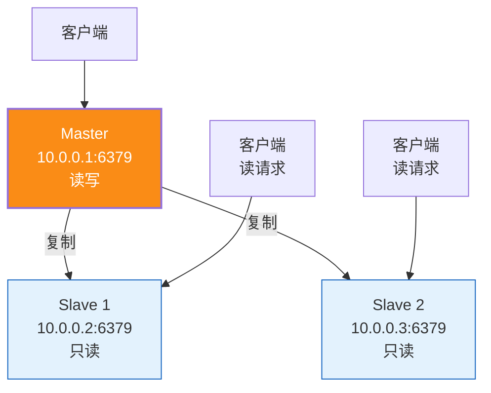
```mermaid
flowchart TB
    CLIENT["客户端"] --> MASTER["Master<br/>10.0.0.1:6379<br/>读写"]
    MASTER -->|复制| SLAVE1["Slave 1<br/>10.0.0.2:6379<br/>只读"]
    MASTER -->|复制| SLAVE2["Slave 2<br/>10.0.0.3:6379<br/>只读"]

    CLIENT2["客户端<br/>读请求"] --> SLAVE1
    CLIENT3["客户端<br/>读请求"] --> SLAVE2

    style MASTER fill:#fa8c16,color:#fff,stroke-width:2px
    style SLAVE1 fill:#e3f2fd,stroke:#1565c0
    style SLAVE2 fill:#e3f2fd,stroke:#1565c0
```

**配置方式：**

```bash
# 在从节点配置
redis-cli -h 10.0.0.2 -p 6379
> REPLICAOF 10.0.0.1 6379   # Redis 5.0+ 用 REPLICAOF
# 或老版本: SLAVEOF 10.0.0.1 6379

# 或在 redis.conf 配置
replicaof 10.0.0.1 6379
replica-read-only yes       # 从节点只读（默认开启）
```

**主从复制特点**：
- **异步复制**：主节点写完立即返回，不等待从节点确认
- **主从一致**：最终一致，从节点可能短暂落后
- **读写分离**：主节点读写，从节点只读

**加分项**：能指出"主从复制不保证强一致"——异步复制意味着主节点宕机时，从节点可能丢失最后几条数据。

---

### 4.2 🔴 主从复制的全量同步和增量同步分别什么时候触发？流程是什么？

**答：**

**1. 全量同步 vs 增量同步对比**

| 维度 | 全量同步 | 增量同步 |
|:----|:--------|:--------|
| **触发条件** | 第一次连接 / runid 不匹配 / backlog 丢失 | 断线重连且 backlog 中有数据 |
| **流程** | 主节点 bgsave + 发送 RDB + 发送缓冲区命令 | 主节点发送断线期间的命令 |
| **开销** | 大（fork + 网络传输 RDB） | 小（仅传增量命令） |
| **时间** | 几秒到几分钟 | 毫秒级 |

**2. 全量同步流程**

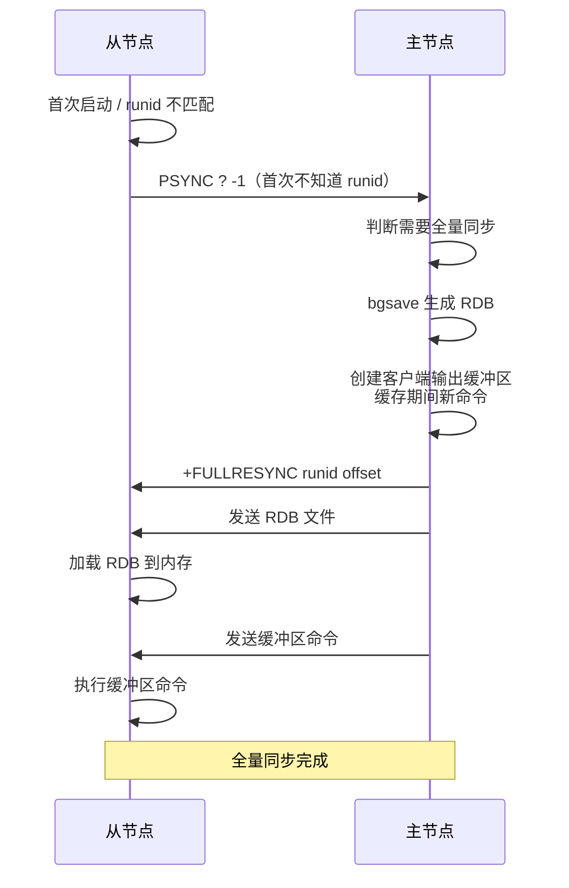
```mermaid
sequenceDiagram
    participant Slave as 从节点
    participant Master as 主节点

    Slave->>Slave: 首次启动 / runid 不匹配
    Slave->>Master: PSYNC ? -1（首次不知道 runid）
    Master->>Master: 判断需要全量同步
    Master->>Master: bgsave 生成 RDB
    Master->>Master: 创建客户端输出缓冲区<br/>缓存期间新命令
    Master->>Slave: +FULLRESYNC runid offset
    Master->>Slave: 发送 RDB 文件
    Slave->>Slave: 加载 RDB 到内存
    Master->>Slave: 发送缓冲区命令
    Slave->>Slave: 执行缓冲区命令
    Note over Slave,Master: 全量同步完成
```

**3. 增量同步流程**

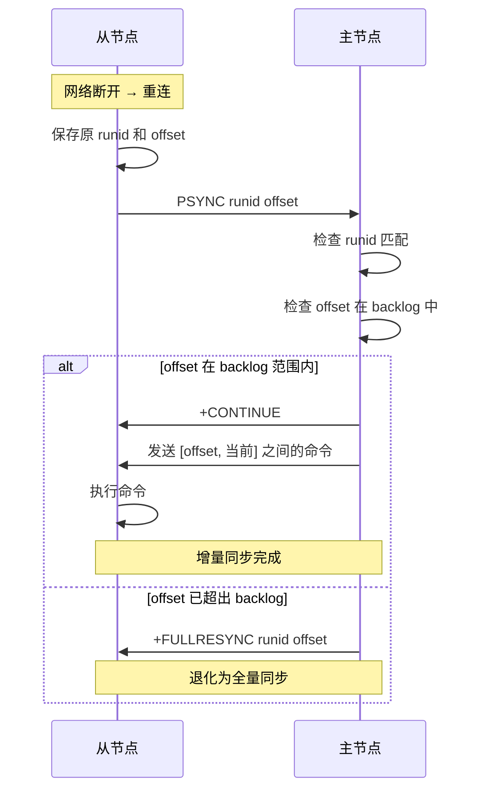
```mermaid
sequenceDiagram
    participant Slave as 从节点
    participant Master as 主节点

    Note over Slave: 网络断开 → 重连
    Slave->>Slave: 保存原 runid 和 offset
    Slave->>Master: PSYNC runid offset
    Master->>Master: 检查 runid 匹配
    Master->>Master: 检查 offset 在 backlog 中
    alt offset 在 backlog 范围内
        Master->>Slave: +CONTINUE
        Master->>Slave: 发送 [offset, 当前] 之间的命令
        Slave->>Slave: 执行命令
        Note over Slave,Master: 增量同步完成
    else offset 已超出 backlog
        Master->>Slave: +FULLRESYNC runid offset
        Note over Slave,Master: 退化为全量同步
    end
```

**4. 关键概念：runid / offset / backlog**

| 概念 | 作用 |
|:----|:----|
| **runid** | 主节点唯一标识，重启后会变；从节点通过它判断主节点是否换了 |
| **offset** | 主从复制的位置标记，主节点每写一条命令 offset 增加 |
| **backlog** | 主节点的环形缓冲区，默认 1MB，存储最近的命令用于增量同步 |

**5. 生产调优**

```conf
# redis.conf（主节点配置）
repl-backlog-size 256mb      # 增大 backlog，避免网络抖动导致全量同步
repl-backlog-ttl 3600        # backlog 闲置 1 小时后释放
repl-timeout 60              # 复制超时时间
repl-ping-replica-period 10  # 心跳间隔

# 从节点配置
replica-priority 100         # 哨兵故障转移时的优先级（数字越小越优先）
min-replicas-to-write 1      # 主节点至少有 1 个从节点才接受写（强一致）
min-replicas-max-lag 10      # 从节点延迟不超过 10 秒
```

**加分项**：能解释为什么 `repl-backlog-size` 要够大——网络抖动重连时，如果 offset 已超出 backlog，会退化为全量同步，对大 Redis 是灾难。

---

### 4.3 🟡 哨兵 Sentinel 是干什么的？怎么工作？

**答：**

**Sentinel（哨兵）是 Redis 官方的高可用方案**，负责监控主从节点、自动故障转移、通知客户端。

**三大核心职责：**

| 职责 | 说明 |
|:----|:----|
| **监控** | 持续检查主从节点是否存活 |
| **通知** | 节点异常时通知运维或客户端 |
| **自动故障转移** | 主节点宕机时，自动选举新主节点并通知客户端 |

**哨兵架构：**

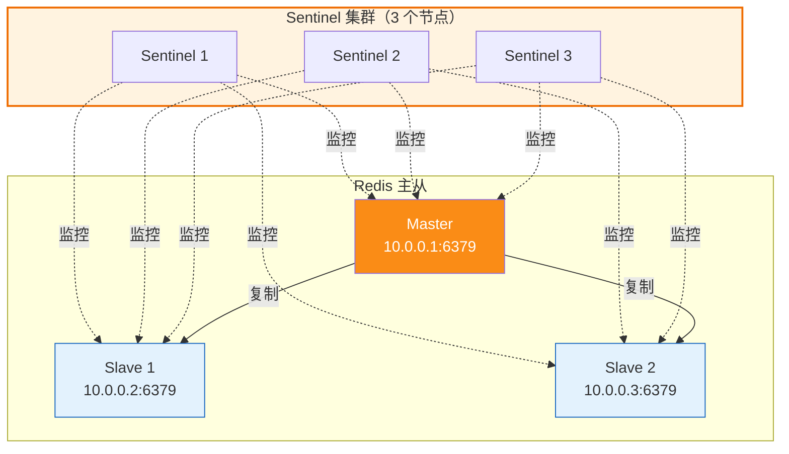
```mermaid
flowchart TB
    subgraph 哨兵集群["Sentinel 集群（3 个节点）"]
        S1["Sentinel 1"]
        S2["Sentinel 2"]
        S3["Sentinel 3"]
    end

    subgraph Redis集群["Redis 主从"]
        M["Master<br/>10.0.0.1:6379"]
        SL1["Slave 1<br/>10.0.0.2:6379"]
        SL2["Slave 2<br/>10.0.0.3:6379"]
    end

    S1 & S2 & S3 -.->|监控| M
    S1 & S2 & S3 -.->|监控| SL1 & SL2

    M -->|复制| SL1 & SL2

    style 哨兵集群 fill:#fff3e0,stroke:#ef6c00,stroke-width:2px
    style M fill:#fa8c16,color:#fff
    style SL1 fill:#e3f2fd,stroke:#1565c0
    style SL2 fill:#e3f2fd,stroke:#1565c0
```

**为什么至少 3 个哨兵？**

故障转移需要**多数派投票**（quorum），3 个哨兵能容忍 1 个宕机，5 个能容忍 2 个宕机。

**配置示例（sentinel.conf）：**

```conf
# 监控的主节点（mymaster 是逻辑名）
sentinel monitor mymaster 10.0.0.1 6379 2

# 解释参数:
# - 10.0.0.1 6379: 主节点 IP 和端口
# - 2: quorum，至少 2 个哨兵同意才判定主节点宕机

# 主节点多久无响应判定为宕机（默认 30 秒）
sentinel down-after-milliseconds mymaster 30000

# 故障转移时同时同步新主的从节点数
sentinel parallel-syncs mymaster 1

# 故障转移超时时间
sentinel failover-timeout mymaster 180000
```

**客户端连接方式（Java + Jedis）：**

```java
// Jedis 哨兵配置
Set<String> sentinels = new HashSet<>();
sentinels.add("10.0.0.11:26379");
sentinels.add("10.0.0.12:26379");
sentinels.add("10.0.0.13:26379");

JedisSentinelPool pool = new JedisSentinelPool("mymaster", sentinels);
try (Jedis jedis = pool.getResource()) {
    jedis.set("key", "value");
}
```

**加分项**：能指出哨兵自身也要高可用——单哨兵宕机就没法故障转移，所以哨兵至少 3 个节点。

---

### 4.4 🔴 哨兵的故障转移流程是怎样的？怎么选新主节点？

**答：**

**故障转移完整流程**：

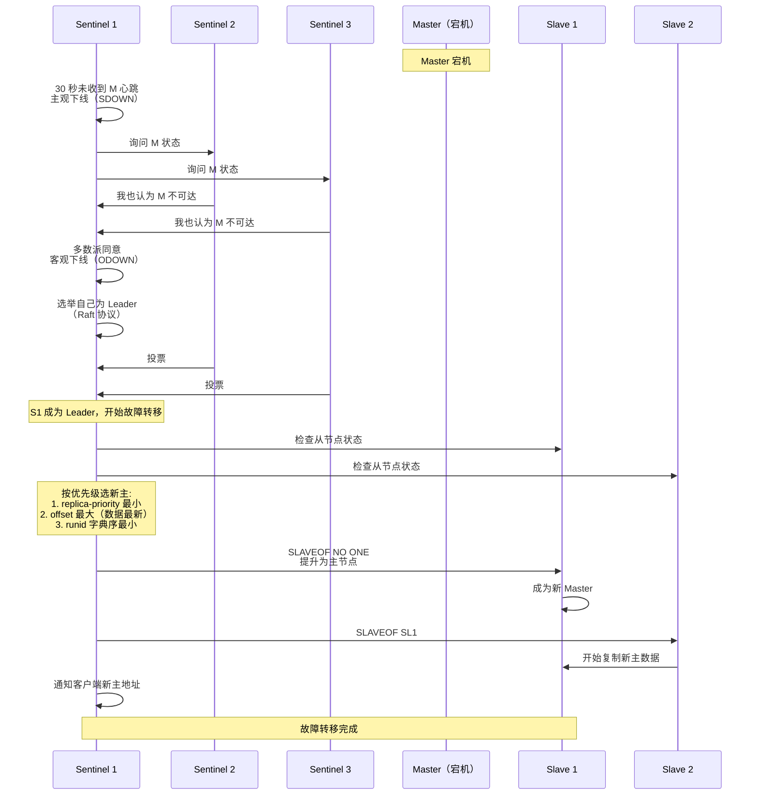
```mermaid
sequenceDiagram
    participant S1 as Sentinel 1
    participant S2 as Sentinel 2
    participant S3 as Sentinel 3
    participant M as Master（宕机）
    participant SL1 as Slave 1
    participant SL2 as Slave 2

    Note over M: Master 宕机
    S1->>S1: 30 秒未收到 M 心跳<br/>主观下线（SDOWN）
    S1->>S2: 询问 M 状态
    S1->>S3: 询问 M 状态
    S2->>S1: 我也认为 M 不可达
    S3->>S1: 我也认为 M 不可达
    S1->>S1: 多数派同意<br/>客观下线（ODOWN）

    S1->>S1: 选举自己为 Leader<br/>（Raft 协议）
    S2->>S1: 投票
    S3->>S1: 投票
    Note over S1: S1 成为 Leader，开始故障转移

    S1->>SL1: 检查从节点状态
    S1->>SL2: 检查从节点状态

    Note over S1: 按优先级选新主:<br/>1. replica-priority 最小<br/>2. offset 最大（数据最新）<br/>3. runid 字典序最小

    S1->>SL1: SLAVEOF NO ONE<br/>提升为主节点
    SL1->>SL1: 成为新 Master

    S1->>SL2: SLAVEOF SL1
    SL2->>SL1: 开始复制新主数据

    S1->>S1: 通知客户端新主地址
    Note over S1,SL1: 故障转移完成
```

**核心概念区分**：

| 概念 | 含义 |
|:----|:----|
| **主观下线 SDOWN** | 单个哨兵认为节点不可达 |
| **客观下线 ODOWN** | 多数派哨兵同意节点不可达 |
| **quorum** | 转换为 ODOWN 需要的最少哨兵数 |

**新主节点选举规则（按优先级）**：

1. **`replica-priority` 值最小**的从节点（0 表示永不参与选举）
2. **复制偏移量 offset 最大**的从节点（数据最新）
3. **runid 字典序最小**的从节点（兜底）

**为什么这么设计？**

- 优先级：运维人为控制，比如高性能机器优先级高
- offset：数据最新的从节点丢失最少
- runid：兜底规则，保证确定性

**客户端感知新主**：

客户端连接哨兵获取主节点地址，哨兵故障转移后会更新主节点信息。客户端断开后重连会自动获取新地址。

**加分项**：能解释"为什么故障转移期间会有短暂不可用"——选举新主+客户端切换需要几秒到几十秒，期间写请求会失败。

---

### 4.5 🟡 Redis Cluster 是什么？为什么需要它？

**答：**

**Redis Cluster 是 Redis 官方的分布式方案**，解决单机容量和性能瓶颈。

**为什么需要 Cluster？**

| 痛点 | 单机/主从 | Cluster 解决 |
|:----|:--------|:------------|
| **数据容量** | 单机内存上限（如 256GB） | 数据分片到多节点，可扩到 PB |
| **QPS 瓶颈** | 单机 10 万 QPS | N 个节点 = N × 10 万 QPS |
| **单点故障** | 主从切换仍可能丢数据 | 多主多从，单主宕机不影响整体 |

**Cluster 架构：**

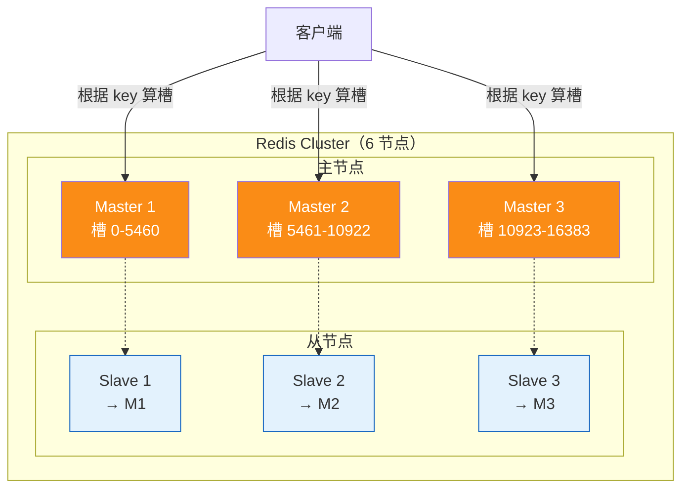
```mermaid
flowchart TB
    subgraph RedisCluster["Redis Cluster（6 节点）"]
        subgraph 主节点
            M1["Master 1<br/>槽 0-5460"]
            M2["Master 2<br/>槽 5461-10922"]
            M3["Master 3<br/>槽 10923-16383"]
        end

        subgraph 从节点
            S1["Slave 1<br/>→ M1"]
            S2["Slave 2<br/>→ M2"]
            S3["Slave 3<br/>→ M3"]
        end

        M1 -.-> S1
        M2 -.-> S2
        M3 -.-> S3
    end

    CLIENT["客户端"] -->|根据 key 算槽| M1 & M2 & M3

    style M1 fill:#fa8c16,color:#fff
    style M2 fill:#fa8c16,color:#fff
    style M3 fill:#fa8c16,color:#fff
    style S1 fill:#e3f2fd,stroke:#1565c0
    style S2 fill:#e3f2fd,stroke:#1565c0
    style S3 fill:#e3f2fd,stroke:#1565c0
```

**核心特点**：
- **数据分片**：16384 个槽（slot）分配到多个主节点
- **去中心化**：无中心代理，客户端直连节点
- **高可用**：每个主节点有从节点，主宕机自动切换
- **Gossip 协议**：节点间通信

**Cluster 最小要求**：6 个节点（3 主 3 从）。

**加分项**：能指出 Cluster 不支持跨槽事务（MULTI/EXEC 跨多个节点会失败），也不支持 `SELECT` 切换 DB（只能用 DB 0）。

---

### 4.6 🔴 Redis Cluster 的数据分片原理是什么？为什么是 16384 个槽？

**答：**

**1. 分片原理**

Redis Cluster 用**哈希槽（Hash Slot）**实现数据分片：

```
写入 key 流程:
1. CRC16 计算 key 的哈希值
2. 哈希值 mod 16384 = 槽位号（0~16383）
3. 根据槽位号找到对应的主节点
4. 写入该节点

例:
key = "user:1001"
CRC16("user:1001") = 12345
12345 mod 16384 = 12345
槽 12345 归属 Master 3
→ 写入 Master 3
```

**槽位分配示例（3 主节点）：**

| 主节点 | 槽位范围 | 槽数 |
|:------|:--------|:----:|
| Master 1 | 0 ~ 5460 | 5461 |
| Master 2 | 5461 ~ 10922 | 5462 |
| Master 3 | 10923 ~ 16383 | 5461 |

**2. 为什么是 16384 个槽？**

Redis 作者 antirez 的解释（4 个理由）：

| 理由 | 说明 |
|:----|:----|
| **1. 网络带宽** | 节点间通过 Gossip 通信，每毫秒交换心跳包，包含节点负责的槽位 bitmap。16384 位 = 2KB，节点数多时带宽可控。如果用 65536 槽，bitmap 是 8KB，节点多时浪费带宽 |
| **2. 集群规模上限** | Redis 建议集群节点数不超过 1000。16384 槽 / 1000 节点 ≈ 16 槽/节点，足够均匀。65536 槽对 1000 节点过剩 |
| **3. 数据压缩** | bitmap 中 0 较多时压缩效果好，2KB 数据压缩后很小 |
| **4. 历史原因** | CRC16 输出 16 位，最大 65536。但实际 16384 已够用，没必要用满 |

**3. 节点间通信：Gossip 协议**

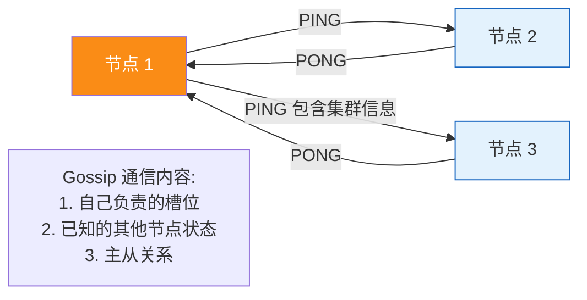
```mermaid
flowchart LR
    N1["节点 1"] -->|PING| N2["节点 2"]
    N2 -->|PONG| N1
    N1 -->|PING 包含集群信息| N3["节点 3"]
    N3 -->|PONG| N1

    Note1["Gossip 通信内容:<br/>1. 自己负责的槽位<br/>2. 已知的其他节点状态<br/>3. 主从关系"]

    style N1 fill:#fa8c16,color:#fff
    style N2 fill:#e3f2fd,stroke:#1565c0
    style N3 fill:#e3f2fd,stroke:#1565c0
```

**4. 客户端路由**

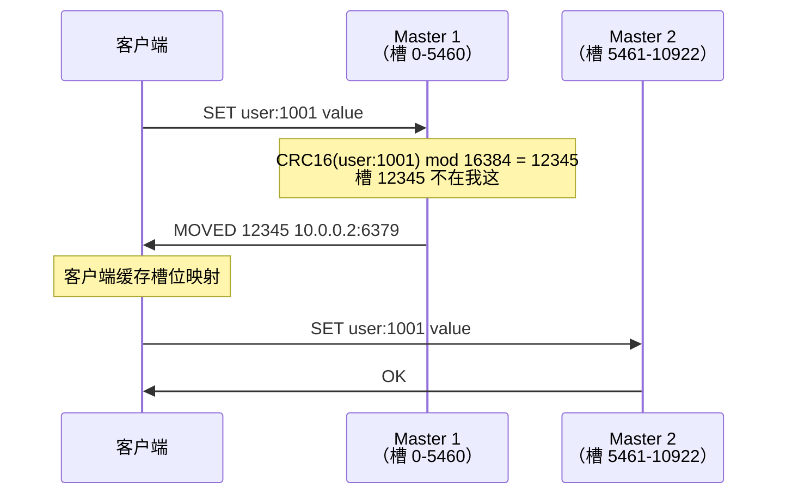
```mermaid
sequenceDiagram
    participant Client as 客户端
    participant Node1 as Master 1<br/>（槽 0-5460）
    participant Node2 as Master 2<br/>（槽 5461-10922）

    Client->>Node1: SET user:1001 value
    Note over Node1: CRC16(user:1001) mod 16384 = 12345<br/>槽 12345 不在我这
    Node1->>Client: MOVED 12345 10.0.0.2:6379
    Note over Client: 客户端缓存槽位映射
    Client->>Node2: SET user:1001 value
    Node2->>Client: OK
```

**MOVED 重定向**：客户端访问错节点时，节点返回 MOVED 命令告诉客户端正确地址。客户端缓存映射后下次直连。

**加分项**：能解释**哈希标签（Hash Tag）**——用 `{}` 指定 key 的部分参与哈希计算，让相关 key 落在同一槽：

```bash
# 这两个 key 会落在同一槽（CRC16 计算 user）
SET {user}:1001:profile "..."
SET {user}:1001:order "..."
# 因为只用 {user} 部分计算槽位
# 这样可以在同一节点执行事务/聚合操作
```

---

### 4.7 🔴 Redis Cluster 的 Gossip 协议是什么？节点怎么发现故障？

**答：**

**1. Gossip 协议简介**

Gossip（流言协议）是一种**最终一致性**的分布式协议，节点间通过 PING/PONG 交换集群状态信息。

**核心特征**：
- 去中心化（无主节点）
- 最终一致（信息逐步传播）
- 容错（节点宕机不影响协议）

**2. 通信机制**

```mermaid
flowchart LR
    N1["节点 A"] -->|PING| N2["节点 B"]
    N2 -->|PONG| N1

    N1 -.->|PONG| N3["节点 C"]
    N1 -.->|PONG| N4["节点 D"]

    style N1 fill:#fa8c16,color:#fff
```

**Gossip 消息内容**：

```
PING/PONG 消息包含:
1. 发送者的 slot bitmap（负责哪些槽）
2. 发送者感知的所有节点状态（IP/端口/角色/在线状态）
3. 主从关系信息
```

**3. 故障检测流程**

```mermaid
flowchart TB
    START["节点 A 定期 PING 节点 B"] --> WAIT{"B 在<br/>cluster-node-timeout<br/>内响应?"}

    WAIT -->|"是"| NORMAL["正常"]
    WAIT -->|"否"| PF["标记 B 为 PFAIL<br/>（主观下线）<br/>只是 A 自己的判断"]

    PF --> GOSSIP["Gossip 传播<br/>A 把 B=PFAIL 信息告诉其他节点"]
    GOSSIP --> OTHERS["其他节点收到信息<br/>各自验证 B"]

    OTHERS --> VOTE{"半数以上节点<br/>都标记 B 为 PFAIL?"}
    VOTE -->|"是"| FAIL["标记 B 为 FAIL<br/>（客观下线）<br/>广播给整个集群"]
    VOTE -->|"否"| RECOVER["继续监控"]

    FAIL --> ACTION{"B 是主节点?"}
    ACTION -->|"是"| FAILOVER["触发故障转移<br/>从节点提升为主"]
    ACTION -->|"否"| WAIT_SLAVE["等待其主节点处理"]

    style PF fill:#fff3e0,stroke:#ef6c00
    style FAIL fill:#f8d7da,stroke:#721c24,stroke-width:2px
    style FAILOVER fill:#d4edda,stroke:#155724,stroke-width:2px
```

**4. 关键概念区分**

| 状态 | 含义 | 谁的判断 |
|:----|:----|:--------|
| **PFAIL（主观下线）** | 单个节点认为 B 不可达 | 单个节点的本地判断 |
| **FAIL（客观下线）** | 半数以上节点认为 B 不可达 | 集群共识 |

**5. 故障转移（从节点提升为主）**

```mermaid
flowchart TB
    MASTER_DOWN["Master 宕机<br/>被标记为 FAIL"] --> SLAVES["其从节点检测到"]

    SLAVES --> ELECTION["从节点选举（Raft）:<br/>1. 数据最新（offset 最大）优先<br/>2. 协商一个从节点参选"]

    ELECTION --> VOTE["参选从节点请求其他主节点投票"]
    VOTE --> WIN{"获得多数主节点<br/>投票?"}
    WIN -->|"是"| NEW_MASTER["提升为新主<br/>SLAVEOF NO ONE"]
    WIN -->|"否"| RETRY["等待重试"]

    NEW_MASTER["广播 PONG<br/>告知集群新主诞生"] --> DONE["故障转移完成"]

    style NEW_MASTER fill:#d4edda,stroke:#155724,stroke-width:2px
```

**6. 生产配置**

```conf
# redis.conf
cluster-node-timeout 15000       # 节点超时时间（15 秒）
cluster-require-full-coverage yes # 集群至少有一个槽不可用就拒绝服务（默认 yes）
cluster-allow-reads-when-down no  # 集群下线时是否允许读
```

**加分项**：能指出 Gossip 协议的代价——**信息传播有延迟**，集群规模大时状态收敛可能需要几秒。

---

### 4.8 🔴 主从、哨兵、Cluster 三种方案怎么选？

**答：**

**1. 三种方案对比**

| 维度 | 主从复制 | 哨兵 Sentinel | Redis Cluster |
|:----|:--------|:------------|:--------------|
| **数据分片** | ❌ 不分片 | ❌ 不分片 | ✅ 自动分片 |
| **高可用** | ❌ 需手动切换 | ✅ 自动故障转移 | ✅ 自动故障转移 |
| **容量扩展** | ❌ 单机内存上限 | ❌ 单机内存上限 | ✅ 横向扩展 |
| **客户端复杂度** | 简单 | 中等（连哨兵） | 较复杂（MOVED 重定向） |
| **最小节点数** | 2（1主1从） | 5（2主3从+3哨兵，或3主3从+3哨兵） | 6（3主3从） |
| **适用场景** | 读多写少+可接受手动恢复 | 中小规模+需要高可用 | 大数据量+高并发+需要扩展 |

**2. 选型决策树**

```mermaid
flowchart TB
    START["Redis 高可用选型"] --> Q1{"数据量 > 单机内存?"}

    Q1 -->|"是（>100GB）"| CLUSTER["✅ Redis Cluster<br/>必须分片"]
    Q1 -->|"否"| Q2{"QPS > 10 万?"}

    Q2 -->|"是"| CLUSTER
    Q2 -->|"否"| Q3{"需要自动故障转移?"}

    Q3 -->|"是"| SENTINEL["✅ 哨兵 Sentinel<br/>主从+自动切换"]
    Q3 -->|"否"| Q4{"需要读写分离?"}

    Q4 -->|"是"| MASTER_SLAVE["✅ 主从复制<br/>手动管理故障"]
    Q4 -->|"否"| SINGLE["✅ 单机 Redis<br/>最简单"]

    style CLUSTER fill:#d4edda,stroke:#155724,stroke-width:2px
    style SENTINEL fill:#e3f2fd,stroke:#1565c0,stroke-width:2px
    style MASTER_SLAVE fill:#fff3e0,stroke:#ef6c00
    style SINGLE fill:#f3e5f5,stroke:#7b1fa2
```

**3. 典型场景推荐**

| 场景 | 数据量 | QPS | 推荐方案 |
|:----|:------|:----|:--------|
| 小项目/内部工具 | < 10 GB | < 1 万 | 主从复制 |
| 中型业务 | 10~100 GB | 1~10 万 | 哨兵 Sentinel |
| 大型互联网 | > 100 GB | > 10 万 | Redis Cluster |
| 缓存场景 | < 50 GB | < 5 万 | 主从（缓存丢了无所谓） |
| 数据库场景 | > 50 GB | > 5 万 | Cluster + AOF 持久化 |

**加分项**：能指出"哨兵 + 主从也能横向扩展读"——通过多个从节点分担读请求；但写还是单主，写瓶颈只能靠 Cluster 分片解决。

---

## 五、缓存策略设计

### 5.1 🟡 什么是缓存穿透？怎么解决？

**答：**

**缓存穿透**：查询一个**数据库中不存在的数据**，由于缓存也不会命中，每次请求都打到数据库。

```mermaid
flowchart LR
    USER["用户请求<br/>查询 userId=99999（不存在）"] --> CACHE{"缓存命中?"}
    CACHE -->|"❌ 未命中"| DB{"数据库查询"}
    DB -->|"❌ 不存在"| EMPTY["返回 null<br/>不写缓存"]
    EMPTY --> USER
    USER -.->|"下次查询同样数据<br/>依然穿透"| CACHE

    style CACHE fill:#f8d7da,stroke:#721c24
    style DB fill:#f8d7da,stroke:#721c24
```

**典型攻击场景**：恶意用户用不存在的 ID 频繁请求，导致数据库压力过大。

**解决方案对比**：

| 方案 | 实现 | 优点 | 缺点 |
|:----|:----|:----|:-----|
| **1. 缓存空值** | 数据库查不到也缓存 `null`，设置短 TTL（如 60 秒） | 简单，对少量穿透有效 | 大量不存在的 key 会占用内存；数据可能短暂不一致 |
| **2. 布隆过滤器** | 启动时加载所有存在的 key 到布隆过滤器，请求先过布隆过滤器 | 内存占用极小，拦截率高 | 有误判率（约 1%）；新增 key 要同步加入布隆过滤器 |
| **3. 接口限流** | 对单 IP/单用户限流 | 防恶意攻击 | 治标不治本，无法解决正常穿透 |

**方案一实现（缓存空值）**：

```java
public User getUser(String userId) {
    String key = "user:" + userId;
    String cached = redis.get(key);

    if (cached != null) {
        if ("NULL".equals(cached)) {
            return null;  // 缓存了空值
        }
        return JSON.parseObject(cached, User.class);
    }

    // 缓存未命中，查数据库
    User user = userMapper.selectById(userId);
    if (user == null) {
        // 数据库也没有，缓存空值 60 秒
        redis.set(key, "NULL", 60, TimeUnit.SECONDS);
        return null;
    }
    redis.set(key, JSON.toJSONString(user), 1, TimeUnit.HOURS);
    return user;
}
```

**方案二实现（布隆过滤器）**：

```java
// Redisson 布隆过滤器
RBloomFilter<String> bloomFilter = redisson.getBloomFilter("user:bloom");
bloomFilter.tryInit(1000000L, 0.01);  // 100 万容量，1% 误判率

// 启动时加载所有用户 ID
List<String> allUserIds = userMapper.selectAllIds();
allUserIds.forEach(bloomFilter::add);

public User getUser(String userId) {
    // 1. 先过布隆过滤器
    if (!bloomFilter.contains(userId)) {
        return null;  // 布隆过滤器说不存在，直接返回
    }

    // 2. 再查缓存/数据库
    // ...
}
```

**加分项**：能指出布隆过滤器的"误判"特性——布隆过滤器说不存在的肯定不存在，说存在的可能不存在（误判）。

---

### 5.2 🟡 什么是缓存击穿？怎么解决？

**答：**

**缓存击穿**：**热点 key 突然过期**，大量并发请求同时打到数据库。

```mermaid
flowchart TB
    KEY["热点 key<br/>user:1001（明星微博）"] --> EXPIRE["TTL 到期<br/>突然失效"]

    EXPIRE --> REQ1["请求 1"] --> DB1["查数据库"]
    EXPIRE --> REQ2["请求 2"] --> DB2["查数据库"]
    EXPIRE --> REQ3["请求 3"] --> DB3["查数据库"]
    EXPIRE --> REQ4["请求 N..."] --> DBN["查数据库"]

    DB1 & DB2 & DB3 & DBN --> COLLAPSE["数据库压力瞬间暴涨<br/>可能宕机"]

    style EXPIRE fill:#f8d7da,stroke:#721c24
    style COLLAPSE fill:#f8d7da,stroke:#721c24,stroke-width:2px
```

**与缓存穿透的区别**：
- 穿透：查**不存在**的数据
- 击穿：查**存在**但**缓存刚失效**的热点数据

**解决方案**：

| 方案 | 实现 | 适用场景 |
|:----|:----|:--------|
| **1. 互斥锁（推荐）** | 缓存失效时只让一个请求查数据库，其他等待 | 大部分场景 |
| **2. 热点 key 永不过期** | 不设 TTL，更新时主动刷新缓存 | 极热点 key |
| **3. 逻辑过期** | value 中存过期时间，到期后异步刷新 | 可接受短暂脏数据 |

**方案一实现（互斥锁）**：

```java
public User getUserWithLock(String userId) {
    String key = "user:" + userId;
    String cached = redis.get(key);

    if (cached != null) {
        return JSON.parseObject(cached, User.class);
    }

    // 缓存未命中，加锁
    String lockKey = "lock:user:" + userId;
    try {
        // 尝试加锁，等待 3 秒
        boolean locked = redis.opsForValue().setIfAbsent(
            lockKey, "1", 10, TimeUnit.SECONDS);

        if (locked) {
            // 双重检查
            cached = redis.get(key);
            if (cached != null) {
                return JSON.parseObject(cached, User.class);
            }

            // 查数据库
            User user = userMapper.selectById(userId);
            redis.set(key, JSON.toJSONString(user), 1, TimeUnit.HOURS);
            return user;
        } else {
            // 没拿到锁，等待 50ms 后重试
            Thread.sleep(50);
            return getUserWithLock(userId);
        }
    } finally {
        redis.delete(lockKey);
    }
}
```

**方案二实现（逻辑过期）**：

```java
// value 中包含过期时间
class CacheData<T> {
    T data;
    long expireTime;  // 逻辑过期时间
}

public User getUserWithLogicalExpire(String userId) {
    String key = "user:" + userId;
    String cached = redis.get(key);

    if (cached == null) {
        return null;  // 不存在，需要预热
    }

    CacheData<User> cacheData = JSON.parseObject(cached, CacheData.class);

    // 未过期，直接返回
    if (cacheData.expireTime > System.currentTimeMillis()) {
        return cacheData.data;
    }

    // 已过期，异步刷新
    String lockKey = "lock:user:" + userId;
    if (redis.opsForValue().setIfAbsent(lockKey, "1", 10, TimeUnit.SECONDS)) {
        // 拿到锁，异步刷新
        CompletableFuture.runAsync(() -> {
            try {
                User user = userMapper.selectById(userId);
                CacheData<User> newData = new CacheData<>();
                newData.data = user;
                newData.expireTime = System.currentTimeMillis() + 3600000;
                redis.set(key, JSON.toJSONString(newData));
            } finally {
                redis.delete(lockKey);
            }
        });
    }

    // 返回旧数据（接受短暂脏数据）
    return cacheData.data;
}
```

**加分项**：能指出互斥锁方案的缺点——增加等待时间，但保证了数据一致性；逻辑过期方案性能更好但有短暂脏数据。

---

### 5.3 🟡 什么是缓存雪崩？怎么解决？

**答：**

**缓存雪崩**：**大量缓存同时失效** 或 **Redis 宕机**，导致所有请求打到数据库。

```mermaid
flowchart TB
    subgraph 雪崩原因1["原因一: 大量 key 同时过期"]
        MANY["1000 个 key<br/>同时设置 TTL=3600s"] --> EXPIRE_ALL["1 小时后同时失效"]
        EXPIRE_ALL --> ALL_TO_DB["所有请求打到数据库"]
    end

    subgraph 雪崩原因2["原因二: Redis 宕机"]
        DOWN["Redis 集群宕机"] --> NO_CACHE["缓存完全不可用"]
        NO_CACHE --> ALL_TO_DB2["所有请求打到数据库"]
    end

    ALL_TO_DB --> CRASH["数据库压力暴涨<br/>可能宕机"]
    ALL_TO_DB2 --> CRASH

    style EXPIRE_ALL fill:#f8d7da,stroke:#721c24
    style DOWN fill:#f8d7da,stroke:#721c24
    style CRASH fill:#f8d7da,stroke:#721c24,stroke-width:2px
```

**解决方案**：

| 原因 | 解决方案 |
|:----|:--------|
| **大量 key 同时过期** | 1. 设置随机 TTL（如 3600 + random(600) 秒）<br/>2. 永不过期 + 定时刷新 |
| **Redis 宕机** | 1. 高可用（主从+哨兵/Cluster）<br/>2. 多级缓存（本地缓存 + Redis）<br/>3. 服务降级（返回默认值） |

**方案一实现（随机 TTL）**：

```java
public void cacheUser(User user) {
    String key = "user:" + user.getId();
    // 基础 TTL 1 小时 + 随机 0~10 分钟
    int ttl = 3600 + new Random().nextInt(600);
    redis.set(key, JSON.toJSONString(user), ttl, TimeUnit.SECONDS);
}
```

**方案二实现（多级缓存）**：

```mermaid
flowchart LR
    REQ["请求"] --> L1["L1 本地缓存<br/>Caffeine<br/>TTL=60s"]
    L1 -->|"未命中"| L2["L2 Redis 缓存<br/>TTL=1h"]
    L2 -->|"未命中"| DB["数据库"]

    DB --> L2
    DB --> L1

    style L1 fill:#d4edda,stroke:#155724
    style L2 fill:#e3f2fd,stroke:#1565c0
    style DB fill:#fff3e0,stroke:#ef6c00
```

```java
// Caffeine + Redis 多级缓存
public User getUserMultiLevel(String userId) {
    // L1: 本地缓存
    User user = caffeineCache.getIfPresent(userId);
    if (user != null) return user;

    // L2: Redis
    String cached = redis.get("user:" + userId);
    if (cached != null) {
        user = JSON.parseObject(cached, User.class);
        caffeineCache.put(userId, user);  // 回填 L1
        return user;
    }

    // L3: 数据库
    user = userMapper.selectById(userId);
    if (user != null) {
        redis.set("user:" + userId, JSON.toJSONString(user), 1, TimeUnit.HOURS);
        caffeineCache.put(userId, user);
    }
    return user;
}
```

**加分项**：能指出雪崩和击穿的区别——击穿是单 key 失效，雪崩是大量 key 失效；解决思路类似但规模不同。

---

### 5.4 🔴 布隆过滤器是什么？为什么能解决缓存穿透？

**答：**

**布隆过滤器（Bloom Filter）**是一种空间效率极高的概率型数据结构，用于判断元素**是否在集合中**。

**1. 核心特性**

| 特性 | 说明 |
|:----|:----|
| **空间效率** | 1 亿元素只需 ~120MB（vs HashSet 需要 1GB+） |
| **误判率** | "存在"可能有误判（假阳性），"不存在"一定准确 |
| **不可删除** | 标准布隆过滤器不支持删除元素 |
| **O(1) 查询** | k 次哈希运算，与集合大小无关 |

**2. 原理**

```mermaid
flowchart TB
    INPUT["元素 user:1001"] --> HASH["k 个哈希函数<br/>h1, h2, h3"]
    HASH --> B1["bit[h1]=1"]
    HASH --> B2["bit[h2]=1"]
    HASH --> B3["bit[h3]=1"]

    BITMAP["bitmap (m 位)<br/>[0,1,0,1,1,0,0,1,0,1,0,0,...]"]
    B1 & B2 & B3 --> BITMAP

    style BITMAP fill:#e3f2fd,stroke:#1565c0,stroke-width:2px
```

**添加元素**：用 k 个哈希函数计算 k 个位置，把 bitmap 中对应位置设为 1。

**查询元素**：用 k 个哈希函数计算 k 个位置，如果**所有位置都是 1**，则"可能存在"；如果**有任一位是 0**，则"一定不存在"。

**3. 为什么能解决缓存穿透？**

```
恶意请求 userId=99999（数据库不存在）
↓
布隆过滤器查询：bit[h1]=0, bit[h2]=1, bit[h3]=0
↓
有位是 0 → 一定不存在 → 直接返回 null
↓
不会查缓存，更不会查数据库
```

**4. 误判率控制**

```java
// Redisson 布隆过滤器
RBloomFilter<String> filter = redisson.getBloomFilter("userFilter");
// 参数1: 预期元素数量
// 参数2: 期望误判率
filter.tryInit(100_000_000L, 0.01);  // 1 亿元素，1% 误判率
```

**容量与误判率的关系**：

| 元素数量 | 误判率 | 内存占用 |
|:--------|:------|:--------|
| 100 万 | 1% | 1.2 MB |
| 1 亿 | 1% | 120 MB |
| 1 亿 | 0.1% | 180 MB |
| 1 亿 | 0.01% | 240 MB |

**5. 误判带来的影响**

1% 误判率意味着：1% 不存在的 key 会被误判为存在，仍会查数据库。但比 100% 穿透好太多。

**6. 布隆过滤器不支持删除的问题**

```
场景: 用户 1001 被注销，要从布隆过滤器删除
问题: 多个元素的哈希位置可能重叠，删除会影响其他元素
```

**解决方案**：用 **布谷鸟过滤器（Cuckoo Filter）**，支持删除，但实现更复杂。

**加分项**：能指出布隆过滤器的两种变体——计数布隆过滤器（支持删除但内存翻倍）和布谷鸟过滤器（更省空间且支持删除）。

---

### 5.5 🟡 缓存与数据库一致性如何保证？

**答：**

**核心问题**：缓存和数据库是两个系统，无法用单一事务保证强一致，只能追求**最终一致**。

**4 种常见方案对比**：

| 方案 | 实现 | 一致性 | 复杂度 |
|:----|:----|:------|:------|
| **1. Cache Aside（旁路缓存）** | 先更新 DB，再删除缓存 | 最终一致 | 低 |
| **2. Read Through/Write Through** | 缓存层代理读写 DB | 强一致（缓存层保证） | 高 |
| **3. Write Behind** | 先更新缓存，异步写 DB | 弱一致 | 中 |
| **4. 双删延迟** | 先删缓存→更新 DB→延迟再删缓存 | 最终一致（更可靠） | 中 |

**1. Cache Aside（推荐，最常用）**

```java
// 写操作
public void updateUser(User user) {
    userMapper.update(user);       // 1. 先更新数据库
    redis.delete("user:" + user.getId());  // 2. 再删除缓存
}

// 读操作
public User getUser(String userId) {
    String cached = redis.get("user:" + userId);
    if (cached != null) return JSON.parseObject(cached, User.class);

    User user = userMapper.selectById(userId);
    if (user != null) {
        redis.set("user:" + userId, JSON.toJSONString(user), 1, TimeUnit.HOURS);
    }
    return user;
}
```

**为什么是删除缓存而不是更新缓存？**

| 操作 | 优势 | 劣势 |
|:----|:----|:-----|
| **删除缓存** | 懒加载，避免频繁更新；多个写操作只删一次 | 下次读要查 DB |
| **更新缓存** | 下次读直接命中 | 多个并发写可能导致缓存与 DB 不一致；写多读少时浪费 |

**2. Cache Aside 的并发问题**

```mermaid
sequenceDiagram
    participant A as 线程 A（更新）
    participant B as 线程 B（读）
    participant Cache as 缓存
    participant DB as 数据库

    Note over A: 缓存恰好失效
    B->>DB: 查询 user:1
    DB-->>B: 返回旧值 v1
    A->>DB: 更新 user:1 = v2
    A->>Cache: 删除 user:1
    B->>Cache: 写入 user:1 = v1（旧值！）
    Note over Cache: 缓存是旧值，不一致！
```

**问题**：读线程 B 在更新 DB 前查到旧值，更新 DB 后又把旧值写入缓存，导致缓存是旧值。

**解决**：双删延迟策略。

**加分项**：能指出"先删缓存再更新 DB"也有问题——读线程可能在删除后、更新前读到 DB 旧值并写回缓存。所以**推荐"先更新 DB 再删缓存"**，加上**延迟双删**兜底。

---

### 5.6 🔴 双删延迟策略为什么能保证最终一致性？延迟时间怎么定？

**答：**

**1. 双删延迟流程**

```mermaid
sequenceDiagram
    participant A as 线程 A（更新）
    participant B as 线程 B（读）
    participant Cache as 缓存
    participant DB as 数据库

    A->>Cache: 第一次删除 user:1
    Note over Cache: 缓存为空

    B->>Cache: 查询 user:1（未命中）
    B->>DB: 查询 user:1
    Note over A: 同时 A 更新 DB
    A->>DB: 更新 user:1 = v2

    DB-->>B: 返回旧值 v1（A 还没更新完）
    B->>Cache: 写入 user:1 = v1（旧值）

    A->>A: 等待 N 秒（延迟）
    Note over A: N 秒后，B 已经写入旧值
    A->>Cache: 第二次删除 user:1
    Note over Cache: 缓存清空，下次读会从 DB 加载新值 v2
```

**2. 为什么能保证最终一致？**

```
第一次删除: 防止读到旧缓存
延迟等待: 让并发的读线程完成"读 DB 旧值 → 写缓存旧值"的操作
第二次删除: 把读线程写入的旧值清掉

最终结果: 缓存为空，下次读会从 DB 加载最新值
```

**3. 延迟时间怎么定？**

延迟时间要**大于一次读操作的耗时**：

```java
// 估算延迟时间
// 一次读操作 = 查 DB + 写缓存
// 通常 100ms~500ms 足够

public void updateUserWithDoubleDelete(User user) {
    String key = "user:" + user.getId();

    // 1. 第一次删除缓存
    redis.delete(key);

    // 2. 更新数据库
    userMapper.update(user);

    // 3. 延迟第二次删除（异步，避免阻塞主线程）
    CompletableFuture.runAsync(() -> {
        try {
            Thread.sleep(500);  // 延迟 500ms
            redis.delete(key);
        } catch (InterruptedException e) {
            Thread.currentThread().interrupt();
        }
    });
}
```

**延迟时间估算公式**：

```
延迟时间 = 读业务耗时 + 几百毫秒余量

读业务耗时 = DB 查询耗时 + 缓存写入耗时
通常 DB 查询 10~100ms，缓存写入 1~5ms
→ 延迟 500ms 足够覆盖 99% 场景
```

**4. 第二次删除失败怎么办？**

```java
// 用消息队列重试
public void updateUserWithRetry(User user) {
    String key = "user:" + user.getId();
    redis.delete(key);
    userMapper.update(user);

    // 发送延迟消息
    mqSender.sendDelayed("cache-delete", key, 500);

    // 消费者收到消息后删除缓存
    // 失败则重试
}

@RabbitListener(queues = "cache-delete")
public void handleCacheDelete(String key) {
    redis.delete(key);
    // 如果删除失败，抛异常触发重试
}
```

**加分项**：能指出"双删延迟"是兜底方案，**主流程还是 Cache Aside**；如果业务允许，用"消息队列+重试"比"延迟双删"更可靠。

---

### 5.7 🔴 Cache Aside / Read Through / Write Through / Write Behind 区别？

**答：**

这是缓存策略的 4 种经典模式：

```mermaid
flowchart TB
    subgraph CacheAside["Cache Aside（旁路缓存）"]
        APP1["应用"] -->|"读"| CACHE1["缓存"]
        CACHE1 -->|"未命中"| DB1["数据库"]
        APP1 -->|"写"| DB1
        APP1 -->|"写后删"| CACHE1
    end

    subgraph ReadThrough["Read Through"]
        APP2["应用"] -->|"读写都过缓存"| CACHE2["缓存层"]
        CACHE2 -->|"未命中自动查"| DB2["数据库"]
    end

    subgraph WriteThrough["Write Through"]
        APP3["应用"] -->|"写"| CACHE3["缓存层"]
        CACHE3 -->|"同步写"| DB3["数据库"]
    end

    subgraph WriteBehind["Write Behind"]
        APP4["应用"] -->|"写"| CACHE4["缓存层"]
        CACHE4 -->|"异步写"| DB4["数据库"]
    end

    style CacheAside fill:#d4edda,stroke:#155724,stroke-width:2px
    style WriteBehind fill:#fff3e0,stroke:#ef6c00
```

**详细对比**：

| 模式 | 应用职责 | 一致性 | 性能 | 适用场景 |
|:----|:--------|:------|:----|:--------|
| **Cache Aside** | 应用同时管理缓存和 DB | 最终一致 | 高 | 通用场景（90% 项目） |
| **Read Through** | 应用只读缓存，缓存层加载 DB | 强一致 | 高 | 读多写少 |
| **Write Through** | 应用只写缓存，缓存层同步写 DB | 强一致 | 中（写慢） | 写少且要强一致 |
| **Write Behind** | 应用只写缓存，缓存层异步写 DB | 弱一致 | 最高（写极快） | 写多且允许丢数据 |

**1. Cache Aside（旁路缓存，最常用）**

```java
// 应用同时操作缓存和 DB
public User getUser(String id) {
    User user = redis.get("user:" + id);
    if (user == null) {
        user = db.query(id);
        redis.set("user:" + id, user);
    }
    return user;
}

public void updateUser(User user) {
    db.update(user);
    redis.delete("user:" + user.getId());
}
```

**特点**：应用直接管理缓存，灵活但代码侵入性强。

**2. Read Through**

```java
// 缓存层代理读 DB
public User getUser(String id) {
    // 应用只调缓存，缓存未命中时自己加载 DB
    return cache.get("user:" + id, () -> db.query(id));
}
```

**特点**：应用代码简洁，缓存层负责加载逻辑。

**3. Write Through**

```java
// 缓存层同步写 DB
public void updateUser(User user) {
    cache.put("user:" + user.getId(), user);  // 缓存层同步写 DB
}
```

**特点**：写操作要等 DB 写完，性能较差，但一致性最好。

**4. Write Behind（Write Back）**

```java
// 缓存层异步写 DB
public void updateUser(User user) {
    cache.put("user:" + user.getId(), user);  // 只写缓存
    // 缓存层后台异步刷入 DB
}
```

**特点**：写极快，但缓存宕机可能丢数据。适用于日志、统计等容忍丢失的场景。

**加分项**：能指出"Write Behind 就是操作系统页缓存的思路"——Linux 文件写入也是先写页缓存，异步刷盘，性能极高但有丢数据风险。

---

### 5.8 🟡 Redis 的内存淘汰策略有哪些？怎么选？

**答：**

当 Redis 内存达到 `maxmemory` 限制时，按淘汰策略删除部分 key 释放内存。Redis 共 8 种策略：

| 策略 | 说明 | 适用场景 |
|:----|:----|:--------|
| **noeviction**（默认） | 不淘汰，写入直接报错 | 数据不能丢的场景 |
| **allkeys-lru** | 所有 key 中淘汰最久未使用的 | **缓存场景首选** |
| **allkeys-lfu** | 所有 key 中淘汰使用频率最低的 | 访问频率差异大的场景 |
| **allkeys-random** | 随机淘汰 | 无差异访问模式 |
| **volatile-lru** | 设置了 TTL 的 key 中淘汰 LU | 混合场景（部分数据持久） |
| **volatile-lfu** | 设置了 TTL 的 key 中淘汰 LFU | 同上 |
| **volatile-random** | 设置了 TTL 的 key 中随机淘汰 | 同上 |
| **volatile-ttl** | 设置了 TTL 的 key 中淘汰即将过期的 | 优先清理快过期的 |

**LRU vs LFU 区别**：

| 算法 | 全称 | 原理 | 适用场景 |
|:----|:----|:----|:--------|
| **LRU** | Least Recently Used | 淘汰最久未访问的 | 时间局部性强的数据 |
| **LFU** | Least Frequently Used | 淘汰访问频率最低的 | 频率差异明显的数据 |

**LRU 的问题**：偶尔被访问的冷数据会"挤掉"频繁访问的热数据。

```
场景: 一次扫描操作访问了大量冷数据
LRU: 冷数据被放到队首，热数据被淘汰 ❌
LFU: 冷数据频率低，仍会被淘汰 ✅
```

**Redis 的近似 LRU/LFU**：

Redis 不是严格的 LRU/LFU，而是**近似算法**：

```conf
# redis.conf
maxmemory-policy allkeys-lru
maxmemory-samples 5  # 随机采样 5 个 key，淘汰其中最久未使用的
```

**采样数越大越精确但越慢**：
- `samples=5`：约 80% 接近真实 LRU
- `samples=10`：约 90% 接近真实 LRU

**选型建议**：

```mermaid
flowchart TB
    START["内存淘汰策略选型"] --> Q1{"数据类型?"}

    Q1 -->|"纯缓存<br/>所有数据都可丢"| ALLKEYS["✅ allkeys-lru<br/>（首选）"]
    Q1 -->|"缓存+持久数据混合<br/>部分 key 不设 TTL"| VOLATILE["✅ volatile-lru"]
    Q1 -->|"不能丢任何数据"| NOEVICT["✅ noeviction<br/>但要监控内存"]

    style ALLKEYS fill:#d4edda,stroke:#155724,stroke-width:2px
    style VOLATILE fill:#e3f2fd,stroke:#1565c0
    style NOEVICT fill:#fff3e0,stroke:#ef6c00
```

**加分项**：能指出"Redis 4.0 才引入 LFU"——之前只有 LRU；LFU 通过概率衰减避免老数据频率永远高的问题。

---

## 六、分布式锁实现

### 6.1 🟡 如何用 Redis 实现分布式锁？最简单的方案是什么？

**答：**

**最简单的方案：SETNX + EXPIRE**

```bash
# SETNX = SET if Not eXists
SETNX lock:order:1001 "client_uuid"   # 加锁
EXPIRE lock:order:1001 30              # 设置过期时间
```

**问题**：两条命令非原子操作，如果 SETNX 成功后客户端崩溃，锁永远不会释放。

**改进方案：SET NX EX（推荐）**

```bash
# Redis 2.6.12+ 支持原子操作
SET lock:order:1001 "client_uuid" NX EX 30
```

- `NX`：key 不存在才设置（= SETNX）
- `EX 30`：过期时间 30 秒
- 原子操作，避免 SETNX+EXPIRE 的非原子问题

**释放锁（Lua 脚本保证原子性）**：

```lua
-- 释放锁必须先检查 value 是否是自己加的，再删除
-- 否则会删除别人加的锁
if redis.call("get", KEYS[1]) == ARGV[1] then
    return redis.call("del", KEYS[1])
else
    return 0
end
```

**完整 Java 实现**：

```java
public class SimpleRedisLock {

    private final StringRedisTemplate redis;
    private static final String LOCK_PREFIX = "lock:";
    private static final long DEFAULT_EXPIRE = 30;  // 秒

    public boolean tryLock(String lockKey, String clientId, long expireSeconds) {
        String key = LOCK_PREFIX + lockKey;
        Boolean result = redis.opsForValue().setIfAbsent(
            key, clientId, expireSeconds, TimeUnit.SECONDS);
        return Boolean.TRUE.equals(result);
    }

    public boolean unlock(String lockKey, String clientId) {
        String key = LOCK_PREFIX + lockKey;
        // 用 Lua 脚本保证"检查+删除"原子性
        String luaScript =
            "if redis.call('get', KEYS[1]) == ARGV[1] then " +
            "  return redis.call('del', KEYS[1]) " +
            "else " +
            "  return 0 " +
            "end";
        Long result = redis.execute(
            new DefaultRedisScript<>(luaScript, Long.class),
            Collections.singletonList(key),
            clientId);
        return result != null && result > 0;
    }
}
```

**使用示例**：

```java
String clientId = UUID.randomUUID().toString();
if (lock.tryLock("order:1001", clientId, 30)) {
    try {
        // 执行业务逻辑
        processOrder();
    } finally {
        lock.unlock("order:1001", clientId);
    }
}
```

**加分项**：能指出 `clientId` 必须用 UUID——不能让客户端 B 误删客户端 A 加的锁。

---

### 6.2 🔴 SETNX 加 EXPIRE 两条命令有什么问题？怎么解决？

**答：**

**问题：两条命令非原子操作**

```mermaid
sequenceDiagram
    participant Client as 客户端
    participant Redis as Redis

    Client->>Redis: SETNX lock:1 "uuid"
    Redis-->>Client: 1 (成功)
    Note over Client: 客户端崩溃！
    Client-xRedis: EXPIRE 未执行
    Note over Redis: lock:1 永不过期<br/>其他客户端永远拿不到锁
```

**场景**：
1. SETNX 成功
2. 客户端崩溃/网络断开
3. EXPIRE 未执行
4. 锁永远存在，其他客户端无法获取

**解决方案**：

| 方案 | 实现 | 优缺点 |
|:----|:----|:------|
| **1. SET NX EX**（推荐） | `SET key value NX EX 30` | ✅ 原子操作，最简单 |
| **2. Lua 脚本** | 用 Lua 把 SETNX+EXPIRE 包成原子 | ✅ 灵活，但稍复杂 |
| **3. value 存过期时间** | value 存当前时间+TTL，读取时判断 | ⚠️ 时钟不同步有问题 |

**方案一实现（推荐）**：

```bash
# SET 命令的 NX + EX 组合是原子操作
SET lock:1 "client_uuid" NX EX 30
```

**方案二实现（Lua）**：

```lua
-- 原子加锁
if redis.call("setnx", KEYS[1], ARGV[1]) == 1 then
    redis.call("expire", KEYS[1], ARGV[2])
    return 1
else
    return 0
end
```

**加分项**：能指出 Redis 2.6.12 之前不支持 SET NX EX，只能用 Lua；2.6.12+ 后 SET 命令原生支持，Lua 方案已不必要。

---

### 6.3 🔴 业务执行时间超过锁过期时间怎么办？

**答：**

**问题场景**：

```mermaid
sequenceDiagram
    participant A as 客户端 A
    participant Redis as Redis
    participant B as 客户端 B

    A->>Redis: 加锁 lock:1，TTL=30s
    A->>A: 执行业务（耗时 40s）
    Note over Redis: 30s 后锁自动过期
    B->>Redis: 加锁 lock:1（成功！）
    B->>B: 执行业务
    A->>Redis: 释放锁（删除了 B 的锁！）
    Note over B: B 的锁被 A 删除<br/>C 也能加锁<br/>并发问题！
```

**问题本质**：
1. 锁过期了但业务没执行完
2. 多个客户端同时持有"锁"
3. 误删别人的锁

**解决方案：看门狗机制（Watchdog）**

```mermaid
flowchart TB
    CLIENT["客户端 A"] -->|加锁 TTL=30s| REDIS[Redis]
    CLIENT -->|启动看门狗线程| WATCH["看门狗<br/>每 10s 检查"]
    WATCH -->|业务还在执行| RENEW["续期 TTL=30s"]
    WATCH -->|业务执行完| STOP["停止看门狗"]

    style WATCH fill:#fa8c16,color:#fff
    style RENEW fill:#d4edda,stroke:#155724
```

**看门狗原理**：
1. 加锁时启动一个后台线程
2. 每隔 TTL/3（如 10 秒）检查一次
3. 如果客户端还持有锁，重置 TTL 为 30 秒
4. 业务执行完，停止看门狗

**简单实现**：

```java
public class RedisLockWithWatchdog {

    private final StringRedisTemplate redis;
    private final ScheduledExecutorService scheduler = Executors.newScheduledThreadPool(1);
    private final Map<String, ScheduledFuture<?>> watchTasks = new ConcurrentHashMap<>();

    public boolean tryLock(String lockKey, String clientId, long ttl) {
        String key = "lock:" + lockKey;
        Boolean locked = redis.opsForValue().setIfAbsent(
            key, clientId, ttl, TimeUnit.SECONDS);
        if (Boolean.TRUE.equals(locked)) {
            startWatchdog(lockKey, clientId, ttl);
            return true;
        }
        return false;
    }

    private void startWatchdog(String lockKey, String clientId, long ttl) {
        long renewInterval = ttl / 3;  // 每 TTL/3 续期一次
        ScheduledFuture<?> task = scheduler.scheduleAtFixedRate(() -> {
            // 用 Lua 脚本：检查锁是否还是自己的，是则续期
            String luaScript =
                "if redis.call('get', KEYS[1]) == ARGV[1] then " +
                "  return redis.call('expire', KEYS[1], ARGV[2]) " +
                "else " +
                "  return 0 " +
                "end";
            Long result = redis.execute(
                new DefaultRedisScript<>(luaScript, Long.class),
                Collections.singletonList("lock:" + lockKey),
                clientId, String.valueOf(ttl));
            if (result == null || result == 0) {
                // 续期失败（锁已不属于自己），停止看门狗
                ScheduledFuture<?> t = watchTasks.remove(lockKey);
                if (t != null) t.cancel(false);
            }
        }, renewInterval, renewInterval, TimeUnit.SECONDS);
        watchTasks.put(lockKey, task);
    }

    public boolean unlock(String lockKey, String clientId) {
        // 停止看门狗
        ScheduledFuture<?> task = watchTasks.remove(lockKey);
        if (task != null) task.cancel(false);

        // 释放锁
        String luaScript =
            "if redis.call('get', KEYS[1]) == ARGV[1] then " +
            "  return redis.call('del', KEYS[1]) " +
            "else " +
            "  return 0 " +
            "end";
        Long result = redis.execute(
            new DefaultRedisScript<>(luaScript, Long.class),
            Collections.singletonList("lock:" + lockKey),
            clientId);
        return result != null && result > 0;
    }
}
```

**加分项**：能指出 Redisson 的看门狗就是这个原理，且 Redisson 实现得更完善——支持锁重入、公平锁、读写锁等。

---

### 6.4 🔴 Redisson 的看门狗机制是怎么工作的？

**答：**

**Redisson 是 Redis 的 Java 客户端，内置完善的分布式锁实现**，看门狗是核心特性之一。

**1. Redisson 加锁流程**

```mermaid
flowchart TB
    CLIENT["客户端调用 lock.lock()"] --> TRY["尝试加锁<br/>Lua 脚本"]
    TRY --> SUCCESS{"加锁成功?"}
    SUCCESS -->|"是"| WATCHDOG["启动看门狗<br/>每 10s 续期"]
    SUCCESS -->|"否"| WAIT["等待并重试"]

    WATCHDOG --> BUSINESS["执行业务"]
    BUSINESS --> UNLOCK["unlock()<br/>停止看门狗"]

    style WATCHDOG fill:#fa8c16,color:#fff,stroke-width:2px
    style UNLOCK fill:#d4edda,stroke:#155724
```

**2. 加锁 Lua 脚本（支持重入）**

```lua
-- Redisson 加锁核心 Lua 脚本（简化版）
if redis.call('exists', KEYS[1]) == 0 then
    -- 锁不存在，直接加锁
    redis.call('hset', KEYS[1], ARGV[2], 1)  -- hash 结构：field=client_id, value=重入次数
    redis.call('pexpire', KEYS[1], ARGV[1])  -- 设置过期时间
    return nil
end

if redis.call('hexists', KEYS[1], ARGV[2]) == 1 then
    -- 锁存在但是自己的，重入次数+1
    redis.call('hincrby', KEYS[1], ARGV[2], 1)
    redis.call('pexpire', KEYS[1], ARGV[1])
    return nil
end

-- 锁被别人持有，返回剩余 TTL
return redis.call('pttl', KEYS[1])
```

**3. 看门狗工作细节**

```java
// Redisson 看门狗核心代码（简化）
private void scheduleExpirationRenewal(long threadId) {
    // 内部用 Netty 的 HashedWheelTimer 定时器
    Timeout task = commandExecutor.getConnectionManager()
        .newTimeout(timeout -> {
            // 1. Lua 脚本：检查锁是否还是自己的，是则续期
            CompletionStage<Boolean> future = renewExpirationAsync(threadId);
            future.whenComplete((res, e) -> {
                if (res) {
                    // 续期成功，安排下一次续期
                    scheduleExpirationRenewal(threadId);
                }
                // 续期失败（锁已不属于自己），停止看门狗
            });
        }, lockWatchdogTimeout / 3, TimeUnit.MILLISECONDS);
    // lockWatchdogTimeout 默认 30s，所以每 10s 续期一次
}
```

**4. 看门狗关键参数**

```java
// Redisson 配置
Config config = new Config();
config.setLockWatchdogTimeout(30000);  // 默认 30 秒
// 看门狗续期间隔 = 30 / 3 = 10 秒
```

**5. 关键特性**

| 特性 | 说明 |
|:----|:----|
| **自动续期** | 业务执行期间自动续期，避免锁过期 |
| **锁重入** | 同一线程可多次加锁，计数器记录次数 |
| **可中断** | 支持中断等待中的锁获取 |
| **公平锁可选** | `RedissonFairLock` 按请求顺序加锁 |
| **读写锁** | `RedissonReadWriteLock` 支持读写分离 |

**6. 重要注意：看门狗只在不指定 leaseTime 时启用**

```java
// 看门狗启用（不指定 leaseTime）
lock.lock();                    // ✅ 启用看门狗，默认 30s 续期

// 看门狗不启用（指定 leaseTime）
lock.lock(30, TimeUnit.SECONDS);  // ❌ 不启用看门狗，30 秒后自动释放
```

**加分项**：能指出 Redisson 看门狗用 Netty 的 HashedWheelTimer 实现定时任务，而不是 ScheduledExecutorService，性能更高。

---

### 6.5 🔴 Redis 主从切换导致锁丢失怎么办？Redlock 是什么？

**答：**

**1. 问题场景**

```mermaid
sequenceDiagram
    participant Client as 客户端
    participant Master as Master
    participant Slave as Slave

    Client->>Master: 加锁 lock:1
    Master-->>Client: OK
    Note over Master: 主从同步还未完成
    Master->>Master: 宕机！
    Note over Slave: Slave 提升为新 Master<br/>但没有 lock:1 的数据
    Client->>Slave: 检查锁
    Slave-->>Client: 锁不存在
    Note over Client: 其他客户端也能加锁<br/>并发问题！
```

**问题**：Redis 主从复制是异步的，主节点加锁后未同步到从节点就宕机，锁丢失。

**2. Redlock 算法**

Redis 作者 antirez 提出的**多节点 Redlock 算法**：

```mermaid
flowchart TB
    CLIENT["客户端"] -->|"同时向 5 个独立 Redis 实例加锁"| R1["Redis 1"]
    CLIENT --> R2["Redis 2"]
    CLIENT --> R3["Redis 3"]
    CLIENT --> R4["Redis 4"]
    CLIENT --> R5["Redis 5"]

    R1 --> R1R["返回结果"]
    R2 --> R2R["返回结果"]
    R3 --> R3R["返回结果"]
    R4 --> R4R["返回结果"]
    R5 --> R5R["返回结果"]

    R1R & R2R & R3R & R4R & R5R --> COUNT["统计成功数"]
    COUNT --> JUDGE{"≥3 个成功<br/>且耗时 < TTL?"}
    JUDGE -->|"是"| SUCCESS["✅ 加锁成功"]
    JUDGE -->|"否"| FAIL["❌ 加锁失败<br/>向所有节点释放锁"]

    style SUCCESS fill:#d4edda,stroke:#155724,stroke-width:2px
    style FAIL fill:#f8d7da,stroke:#721c24
```

**Redlock 流程**：
1. 客户端获取当前时间 T1
2. 依次向 N 个（通常 5）独立 Redis 实例发送加锁请求（SET NX EX，短 TTL）
3. 统计成功数，如果**多数派（≥ N/2 + 1）成功**，且**总耗时 < TTL**，则加锁成功
4. 加锁失败则向所有节点发送释放锁请求

**3. 为什么用独立 Redis 实例？**

```
❌ 错误：用 5 个主从集群的 Master
   → 一个集群 Master 宕机，Slave 提升后仍可能丢失锁

✅ 正确：5 个完全独立的 Redis 实例（无主从关系）
   → 任一实例宕机，其他 4 个仍有锁
```

**4. Redisson 实现 Redlock**

```java
Config config1 = new Config();
config1.useSingleServer().setAddress("redis://10.0.0.1:6379");
RedissonClient client1 = Redisson.create(config1);

Config config2 = new Config();
config2.useSingleServer().setAddress("redis://10.0.0.2:6379");
RedissonClient client2 = Redisson.create(config2);

Config config3 = new Config();
config3.useSingleServer().setAddress("redis://10.0.0.3:6379");
RedissonClient client3 = Redisson.create(config3);

// 创建 3 个独立的 RLock
RLock lock1 = client1.getLock("lock:order:1");
RLock lock2 = client2.getLock("lock:order:1");
RLock lock3 = client3.getLock("lock:order:1");

// 组成 Redlock
RedissonRedLock redLock = new RedissonRedLock(lock1, lock2, lock3);

try {
    // 尝试加锁，等待 10 秒，锁自动释放 30 秒
    boolean locked = redLock.tryLock(10, 30, TimeUnit.SECONDS);
    if (locked) {
        // 执行业务
    }
} finally {
    redLock.unlock();
}
```

**加分项**：能指出 Redlock 争议——Martin Kleppmann（DDIA 作者）认为 Redlock 不安全，antirez 反驳；实际生产中大多数场景用 Redisson 单节点锁 + 看门狗已足够。

---

### 6.6 🔴 Redlock 真的安全吗？Martin Kleppmann 和 antirez 的争论是什么？

**答：**

这是分布式系统领域的经典争论，2016 年 Martin Kleppmann（DDIA 作者）和 Redis 作者 antirez 的辩论。

**1. Martin Kleppmann 的两大质疑**

**质疑一：GC 停顿导致锁失效**

```mermaid
sequenceDiagram
    participant C1 as 客户端 1
    participant R1 as Redis 1
    participant R2 as Redis 2
    participant R3 as Redis 3
    participant C2 as 客户端 2

    C1->>R1: 加锁成功（TTL=10s）
    C1->>R2: 加锁成功
    C1->>R3: 加锁成功
    Note over C1: 取到多数锁，加锁成功

    Note over C1: ⚠️ 此时客户端 1 发生长时间 GC Stop-The-World
    Note over C1: GC 持续 15s，期间锁全部过期

    R1-->>R2: 锁过期
    R2-->>R3: 锁过期

    C2->>R1: 加锁成功（TTL=10s）
    C2->>R2: 加锁成功
    C2->>R3: 加锁成功
    Note over C2: 取到多数锁，加锁成功

    Note over C1,C2: 此时两个客户端都认为自己持有锁！
    C1->>R1: 写入数据（以为自己还有锁）
    C2->>R1: 写入数据（以为自己还有锁）
    Note over R1: 数据被并发写入，锁失效
```

**质疑二：时钟漂移导致锁提前过期**

Redlock 算法依赖各节点时钟一致。如果某节点时钟跳变（NTP 同步、VM 迁移、闰秒），可能导致锁提前过期或延迟过期，破坏安全性。

**2. antirez 的反驳**

| 反驳点 | 内容 |
|:------|:-----|
| **GC 问题非 Redlock 独有** | 任何有 TTL 的锁都有这个问题，包括 Zookeeper（session timeout） |
| **时钟漂移可控制** | 通过限制各节点时钟差异、使用单调时钟可缓解 |
| **fencing token 兜底** | 配合单调递增的 token，即使锁失效也能在资源侧拦截旧 token 的写入 |

**3. 工程结论**

| 场景 | 推荐方案 |
|:----|:--------|
| **效率型锁**（避免重复计算，偶尔失效可接受） | Redisson 单节点锁 + 看门狗，够用 |
| **正确性型锁**（金融、扣款，绝对不能错） | Zookeeper / etcd（基于一致性算法，fencing token 内建） |
| **极端高可用要求** | Redlock + fencing token（但实现复杂） |

**加分项**：
- 能讲清楚 Redlock 的"多数派"思想（至少 N/2+1 个节点加锁成功）
- 能指出 Zookeeper 的锁是通过"临时节点 + Watch"实现的，客户端宕机后 session 失效自动释放，相比 Redis 的 TTL 更优雅
- 能提到 etcd 的 lease 机制本质类似 ZK 的 session

---

### 6.7 🟡 Redisson 实现分布式锁的完整代码

**答：**

**完整可落地的 Redisson 分布式锁示例**：

```java
// 1. 引入依赖
// <dependency>
//     <groupId>org.redisson</groupId>
//     <artifactId>redisson-spring-boot-starter</artifactId>
//     <version>3.23.4</version>
// </dependency>

@Configuration
public class RedissonConfig {

    @Bean(destroyMethod = "shutdown")
    public RedissonClient redissonClient() {
        Config config = new Config();
        config.useSingleServer()
              .setAddress("redis://127.0.0.1:6379")
              .setDatabase(0)
              .setConnectionPoolSize(64)
              .setConnectionMinimumIdleSize(10);
        return Redisson.create(config);
    }
}
```

```java
@Service
public class OrderService {

    @Autowired
    private RedissonClient redissonClient;

    @Autowired
    private OrderMapper orderMapper;

    /**
     * 下单加锁 - 推荐写法
     */
    public Order createOrder(String userId, String productId) {
        String lockKey = "lock:order:" + userId + ":" + productId;
        RLock lock = redissonClient.getLock(lockKey);

        try {
            // tryLock: 等待 10s，锁自动释放 30s（看门狗会续期，业务未完成不会过期）
            boolean locked = lock.tryLock(10, 30, TimeUnit.SECONDS);
            if (!locked) {
                throw new BusinessException("操作过于频繁，请稍后再试");
            }

            // 二次检查（防止重复下单）
            if (orderMapper.exists(userId, productId)) {
                throw new BusinessException("已下单，请勿重复提交");
            }

            // 执行业务
            Order order = buildOrder(userId, productId);
            orderMapper.insert(order);
            return order;

        } catch (InterruptedException e) {
            Thread.currentThread().interrupt();
            throw new BusinessException("加锁中断");
        } finally {
            // 释放锁（必须判断是否持有 + 是否是当前线程持有）
            if (lock.isHeldByCurrentThread()) {
                lock.unlock();
            }
        }
    }

    /**
     * 注解式分布式锁（AOP 封装）
     */
    @DistributedLock(key = "'lock:order:' + #userId", waitTime = 5, leaseTime = 30)
    public Order createOrderWithAnnotation(String userId) {
        return buildOrder(userId, "default");
    }
}
```

```java
/**
 * 自定义注解 + AOP 实现声明式分布式锁
 */
@Target(ElementType.METHOD)
@Retention(RetentionPolicy.RUNTIME)
public @interface DistributedLock {
    String key();                   // SpEL 表达式
    long waitTime() default 3;      // 等待时间（秒）
    long leaseTime() default -1;    // -1 表示启用看门狗自动续期
}
```

```java
@Aspect
@Component
public class DistributedLockAspect {

    @Autowired
    private RedissonClient redissonClient;

    @Around("@annotation(distributedLock)")
    public Object around(ProceedingJoinPoint pjp, DistributedLock distributedLock) throws Throwable {
        // 解析 SpEL 表达式获取 key
        String lockKey = parseKey(distributedLock.key(), pjp);

        RLock lock = redissonClient.getLock(lockKey);
        boolean locked = false;
        try {
            locked = lock.tryLock(
                distributedLock.waitTime(),
                distributedLock.leaseTime(),
                TimeUnit.SECONDS
            );
            if (!locked) {
                throw new BusinessException("获取锁失败: " + lockKey);
            }
            return pjp.proceed();
        } finally {
            if (locked && lock.isHeldByCurrentThread()) {
                lock.unlock();
            }
        }
    }

    private String parseKey(String keyExpr, ProceedingJoinPoint pjp) throws NoSuchMethodException {
        MethodSignature signature = (MethodSignature) pjp.getSignature();
        Method method = pjp.getTarget().getClass().getMethod(signature.getName(), signature.getParameterTypes());
        EvaluationContext context = new MethodBasedEvaluationContext(
            pjp.getTarget(), method, pjp.getArgs(), new DefaultParameterNameDiscoverer()
        );
        return new SpelExpressionParser().parseExpression(keyExpr).getValue(context, String.class);
    }
}
```

**加分项**：
- 能讲清楚 `tryLock(waitTime, leaseTime, unit)` 的两个时间含义
- 能指出 `leaseTime = -1` 时启用看门狗（默认 30s 续期）
- 能解释为什么 `unlock` 前要判断 `isHeldByCurrentThread()`（防止锁已过期被别人拿走后误释放）
- 能提到 Redisson 还支持公平锁 `getFairLock`、读写锁 `getReadWriteLock`、联锁 `getMultiLock`

---

## 七、性能优化与问题排查

### 7.1 🟡 Redis 慢查询怎么排查？

**答：**

**1. 开启慢查询日志**

```bash
# redis.conf 配置
slowlog-log-slower-than 10000    # 单位微秒，10000 = 10ms
slowlog-max-len 128              # 最多保留 128 条慢查询
```

```bash
# 动态修改（无需重启）
CONFIG SET slowlog-log-slower-than 5000    # 5ms
CONFIG SET slowlog-max-len 256

# 查看慢查询
SLOWLOG GET 10       # 获取最近 10 条
SLOWLOG LEN          # 查看慢查询条数
SLOWLOG RESET        # 清空慢查询
```

**2. 慢查询输出格式**

```bash
127.0.0.1:6379> SLOWLOG GET 3
1) 1) (integer) 14                # 唯一 ID
   2) (integer) 1620000000        # 时间戳
   3) (integer) 25000             # 耗时（微秒）= 25ms
   4) 1) "KEYS"                   # 命令
      2) "user:*"                 # 参数
   5) "127.0.0.1:53218"           # 客户端
   6) ""                          # 客户端名称
```

**3. 常见慢查询原因与解决**

| 原因 | 示例 | 解决 |
|:----|:----|:----|
| **O(N) 命令** | `KEYS *`、`SMEMBERS` 大集合 | 用 `SCAN`、`SSCAN` 替代 |
| **大 Key 操作** | `HGETALL` 万字段 Hash | 拆分大 Key，用 `HSCAN` |
| **SORT 操作** | `SORT mylist BY weight_*` | 在业务层排序，或用 ZSet |
| **删除大 Key** | `DEL` 10 万元素的 List | 用 `UNLINK` 异步删除 |
| **持久化阻塞** | fork 子进程慢、AOF fsync | 优化磁盘 IO，降低 fsync 频率 |
| **网络问题** | 客户端跨机房、带宽打满 | 同机房部署、压缩大 value |

**4. 其他排查工具**

```bash
# 1. 实时监控命令执行
MONITOR                        # 打印所有命令（生产慎用，影响性能）

# 2. 查看 Redis 内部延迟
LATENCY LATEST                 # 最近发生的延迟事件
LATENCY HISTORY event-name     # 查看历史
LATENCY GRAPH event-name       # 图形化展示

# 3. INFO 命令查看整体状态
INFO stats                     # 命令执行统计
INFO memory                    # 内存使用
INFO persistence               # 持久化状态

# 4. 查看客户端连接
CLIENT LIST                    # 列出所有连接
CLIENT KILL ID <id>            # 杀掉某个连接
```

**加分项**：
- 能提到 `INFO commandstats` 可以看每个命令的执行次数和耗时占比
- 能提到 redis-cli 自带的 `--latency`、`--bigkeys`、`--hotkeys` 工具
- 能用 `LATENCY DOCTOR` 让 Redis 自动分析延迟原因并给出建议

---

### 7.2 🔴 为什么生产环境禁止用 KEYS 命令？用什么替代？

**答：**

**1. KEYS 为什么危险**

`KEYS pattern` 是 O(N) 命令，N 是整个 Redis 中所有 key 的数量。执行时**会阻塞主线程**，期间所有其他命令都要排队等待。

```mermaid
flowchart LR
    A[KEYS user:*] -->|阻塞主线程| B[遍历所有 1000 万 Key]
    B --> C[耗时 1-10 秒]
    C --> D[期间所有命令排队]
    D --> E[应用超时<br/>连接池打满<br/>服务雪崩]

    style A fill:#f5222d,color:#fff
    style E fill:#f5222d,color:#fff
```

**2. 实际事故案例**

某公司生产环境有 500 万 key，开发在脚本里写了 `KEYS session:*` 做 session 统计，结果每次执行耗时 3 秒，导致 3 秒内所有请求超时，引发雪崩。

**3. 替代方案**

| 替代命令 | 特点 | 适用场景 |
|:--------|:-----|:--------|
| **SCAN** | 游标分批遍历，不阻塞 | 遍历所有 key |
| **HSCAN** | 遍历 Hash 字段 | 大 Hash |
| **SSCAN** | 遍历 Set 元素 | 大 Set |
| **ZSCAN** | 遍历 ZSet 元素 | 大 ZSet |

**4. SCAN 用法**

```bash
# SCAN cursor [MATCH pattern] [COUNT count] [TYPE type]
SCAN 0 MATCH user:* COUNT 100    # 从 0 开始，匹配 user:*，每次返回约 100 个

# 返回：
# 1) "17280"                     # 下一次的游标
# 2) 1) "user:1001"
#    2) "user:1002"
#    ...

SCAN 17280 MATCH user:* COUNT 100   # 用返回的游标继续
# 直到游标返回 0，遍历完成
```

**5. Java 代码实现**

```java
public List<String> scanKeys(Jedis jedis, String pattern) {
    List<String> keys = new ArrayList<>();
    String cursor = "0";
    ScanParams params = new ScanParams().match(pattern).count(100);

    do {
        ScanResult<String> result = jedis.scan(cursor, params);
        keys.addAll(result.getResult());
        cursor = result.getCursor();
    } while (!"0".equals(cursor));

    return keys;
}
```

**6. SCAN 的注意事项**

| 注意点 | 说明 |
|:------|:-----|
| **弱一致性** | 遍历期间如果有 key 增删，可能返回重复或遗漏 |
| **COUNT 是提示** | 实际返回数量可能多于或少于 COUNT |
| **游标 0 表示结束** | 不要假设游标递增，它是内部哈希槽位 |
| **生产建议** | 在低峰期执行，控制 COUNT 大小（100-1000） |

**加分项**：
- 能解释 SCAN 底层是**高位优先遍历**（reverse binary iteration），保证遍历完整个哈希表且能容忍扩容缩容
- 能指出如果只是要查业务 key，应该在业务层维护一个 Set 记录所有 key，而不是 SCAN
- 能提到 Redis 6.0+ 的 `STRALGO LCP` 等命令

---

### 7.3 🔴 什么是大 Key？怎么排查？怎么解决？

**答：**

**1. 大 Key 的定义**

| 类型 | 大 Key 标准 |
|:----|:----------|
| String | value > 10KB（有些团队定 1MB） |
| Hash/List/Set/ZSet | 元素数量 > 5000，或总大小 > 10MB |
| 集合型 + 单元素大 | List 元素单条 > 10KB |

**2. 大 Key 的危害**

| 危害 | 说明 |
|:----|:----|
| **阻塞主线程** | 操作大 Key 耗时长（如 `HGETALL` 万字段 Hash 耗时 100ms+） |
| **网络阻塞** | 传输大 value 占用带宽，影响其他请求 |
| **内存不均** | Cluster 模式下导致某个分片内存远超其他 |
| **删除阻塞** | `DEL` 大 Key 同步删除会阻塞（Redis 4.0+ 用 `UNLINK` 异步） |
| **持久化阻塞** | fork 子进程时大 Key 增加复制开销 |
| **主从同步延迟** | 全量同步时大 Key 传输慢 |

**3. 排查方法**

```bash
# 方法 1: redis-cli 自带工具（推荐）
redis-cli --bigkeys                    # 扫描各类型最大的 key
redis-cli --bigkeys -i 0.1             # 间隔 0.1s，避免阻塞

# 方法 2: memory usage 命令（Redis 4.0+）
MEMORY USAGE key                       # 查看单个 key 占用内存（字节）
MEMORY STATS                           # 查看内存分配统计

# 方法 3: SCAN + DEBUG OBJECT（不推荐，DEBUG 阻塞）
SCAN 0 MATCH * COUNT 1000
DEBUG OBJECT key                       # 查看序列化后大小

# 方法 4: RDB 文件离线分析
redis-rdb-tools                        # Python 工具，分析 dump.rdb
rdb -c memory dump.rdb > memory.csv    # 导出所有 key 内存占用
```

```java
// Java 在线扫描大 Key
public void scanBigKeys(Jedis jedis) {
    String cursor = "0";
    ScanParams params = new ScanParams().count(100);

    do {
        ScanResult<String> result = jedis.scan(cursor, params);
        for (String key : result.getResult()) {
            String type = jedis.type(key);
            Long size = getKeySize(jedis, key, type);
            if (size != null && size > 5000) {
                System.out.println("大 Key: " + key + " type=" + type + " size=" + size);
            }
        }
        cursor = result.getCursor();
    } while (!"0".equals(cursor));
}

private Long getKeySize(Jedis jedis, String key, String type) {
    switch (type) {
        case "string": return (long) jedis.strlen(key);
        case "list":   return jedis.llen(key);
        case "hash":   return jedis.hlen(key);
        case "set":    return jedis.scard(key);
        case "zset":   return jedis.zcard(key);
        default:       return null;
    }
}
```

**4. 解决方案**

| 方案 | 实现 | 适用 |
|:----|:----|:----|
| **拆分** | 大 Hash 按字段哈希拆成多个小 Hash | 业务可拆分 |
| **压缩** | value 用 gzip/snappy 压缩后再存 | String 大 value |
| **删除** | `UNLINK` 异步删除 | 已无用的历史大 Key |
| **迁移** | 大 Key 迁移到其他存储（如 MongoDB） | 不适合 Redis 的数据 |
| **过期** | 加 TTL 让其自动过期 | 临时性大 Key |

```java
// 拆分大 Hash 示例：把 10 万字段的 user:hash 拆成 100 个分片
public String getShardKey(String userId) {
    int shard = Math.abs(userId.hashCode() % 100);
    return "user:hash:" + shard;
}

public void hset(String userId, String field, String value) {
    jedis.hset(getShardKey(userId), field, value);
}

// 异步删除大 Key（Redis 4.0+）
jedis.unlink("big:key:1001");    // 等价于 DEL 但不阻塞
```

**5. 大 Key 删除的渐进式方案（Redis < 4.0）**

```java
// 渐进式删除大 Hash（兼容老版本）
public void deleteBigHash(Jedis jedis, String key, int batch) {
    String cursor = "0";
    ScanParams params = new ScanParams().count(batch);
    do {
        ScanResult<Map.Entry<String, String>> result = jedis.hscan(key, cursor, params);
        for (Map.Entry<String, String> entry : result.getResult()) {
            jedis.hdel(key, entry.getKey());
        }
        cursor = result.getCursor();
    } while (!"0".equals(cursor));
    jedis.del(key);
}
```

**加分项**：
- 能讲清楚 Redis 4.0 引入的 `lazyfree` 机制（异步删除）
- 能提到 `LAZYFREE` 的配置项：`lazyfree-lazy-eviction`、`lazyfree-lazy-expire`、`lazyfree-lazy-server-del`
- 能指出大 Key 排查应该**在从节点执行**，避免影响主节点

---

### 7.4 🔴 什么是热 Key？怎么排查？怎么解决？

**答：**

**1. 热 Key 的定义**

**热 Key** 是指某个 key 被访问频率远高于其他 key，导致**单个 Redis 节点 CPU/带宽成为瓶颈**。典型场景：热门商品、爆款新闻、明星八卦、首页推荐。

**2. 热 Key 的危害**

| 危害 | 说明 |
|:----|:----|
| **单节点 CPU 瓶颈** | 单 key QPS 数万+，集中在某个分片 |
| **带宽打满** | 大 value + 高 QPS 占满网卡 |
| **缓存击穿** | 热 Key 过期瞬间，海量请求穿透到 DB |
| **Cluster 数据倾斜** | 单分片过载，其他分片闲置 |

**3. 排查方法**

```bash
# 方法 1: redis-cli --hotkeys（需开启 LFU 淘汰策略）
CONFIG SET maxmemory-policy allkeys-lfu
redis-cli --hotkeys

# 方法 2: MONITOR 命令（生产慎用，仅短时排查）
MONITOR | grep -oE '"[a-z]+:[a-z0-9]+"' | sort | uniq -c | sort -nr | head

# 方法 3: INFO commandstats 看命令频次
INFO commandstats
# cmdstat_get:calls=1000000,usec=50000,usec_per_call=0.05
```

```java
// 方法 4: 客户端拦截统计（生产推荐）
@Component
public class HotKeyDetector {

    private static final int THRESHOLD = 1000;   // 10s 内 1000 次算热 key
    private final LoadingCache<String, LongAdder> counter = CacheBuilder.newBuilder()
            .expireAfterWrite(10, TimeUnit.SECONDS)
            .build(new CacheLoader<String, LongAdder>() {
                @Override
                public LongAdder load(String key) { return new LongAdder(); }
            });

    public void access(String key) {
        counter.getUnchecked(key).increment();
    }

    @Scheduled(fixedRate = 10000)
    public void detect() {
        counter.asMap().forEach((key, adder) -> {
            if (adder.sum() > THRESHOLD) {
                log.warn("检测到热 Key: {} QPS={}", key, adder.sum() / 10);
                // 触发本地缓存预热
            }
        });
    }
}
```

**4. 解决方案**

| 方案 | 实现 | 适用 |
|:----|:----|:----|
| **本地缓存** | 用 Caffeine/Guava 在 JVM 内缓存热 Key | 读多写少，能容忍秒级延迟 |
| **多副本读** | 同一数据写多个 key（hot_v1/hot_v2），随机读 | 简单有效 |
| **拆分** | 把热 Key 拆成多份分散到不同分片 | Cluster 场景 |
| **限流** | 对热 Key 访问限流，保护后端 | 应急方案 |
| **预热** | 提前加载，TTL 设长 + 异步刷新 | 可预知热点 |

```java
// 方案 1: 本地缓存（Caffeine）+ Redis 二级缓存
public class TwoLevelCache {

    private final Cache<String, String> localCache = Caffeine.newBuilder()
            .maximumSize(10000)
            .expireAfterWrite(2, TimeUnit.SECONDS)    // 本地缓存 2s
            .build();

    private final Jedis jedis;

    public String get(String key) {
        // L1: 本地缓存
        String value = localCache.getIfPresent(key);
        if (value != null) return value;

        // L2: Redis
        value = jedis.get(key);
        if (value != null) {
            localCache.put(key, value);
        }
        return value;
    }
}
```

```java
// 方案 2: 多副本读
public class HotKeyReader {

    private final Jedis jedis;
    private final Random random = new Random();
    private static final int REPLICAS = 5;

    public String get(String key) {
        // 随机选一个副本读，分散到不同分片
        int idx = random.nextInt(REPLICAS);
        return jedis.get(key + "_v" + idx);
    }

    public void set(String key, String value) {
        // 写时同步写所有副本
        for (int i = 0; i < REPLICAS; i++) {
            jedis.setex(key + "_v" + i, 3600, value);
        }
    }
}
```

**加分项**：
- 能提到京东的 hotkey 框架（统一热 Key 探测 + 客户端本地缓存）
- 能指出热 Key 探测要在**客户端做**，而不是在 Redis 服务端做（服务端无状态）
- 能讲清楚为什么本地缓存 TTL 不能太长（数据一致性）也不能太短（达不到缓存效果）

---

### 7.5 🟡 Pipeline 是什么？为什么能大幅提升性能？

**答：**

**1. Pipeline 原理**

普通命令：每次发一个命令，要等 Redis 返回结果才能发下一个。N 个命令 = N 次 RTT。

Pipeline：一次性发送多个命令，Redis 依次执行后一次性返回所有结果。N 个命令 = 1 次 RTT。

```mermaid
sequenceDiagram
    participant C as Client
    participant R as Redis

    Note over C,R: 普通模式（3 个命令 = 3 RTT）
    C->>R: CMD1
    R-->>C: RESULT1
    C->>R: CMD2
    R-->>C: RESULT2
    C->>R: CMD3
    R-->>C: RESULT3

    Note over C,R: Pipeline 模式（3 个命令 = 1 RTT）
    C->>R: CMD1 + CMD2 + CMD3
    R-->>C: RESULT1 + RESULT2 + RESULT3
```

**2. 性能对比**

| 方式 | 1 万次 SET 耗时 | 原因 |
|:----|:--------------|:----|
| 单条命令 | 10-15 秒 | 每次都 1ms RTT |
| Pipeline（批量 1000） | 0.1-0.3 秒 | RTT 减少 100 倍 |
| 事务 MULTI | 0.2-0.5 秒 | 也有批量，但有额外开销 |

**3. Java 代码示例**

```java
// Jedis Pipeline
public void pipelineExample(Jedis jedis) {
    Pipeline pipe = jedis.pipelined();
    for (int i = 0; i < 1000; i++) {
        pipe.set("key:" + i, "value:" + i);
    }
    pipe.sync();    // 提交并等待结果

    // 或异步获取结果
    Pipeline pipe2 = jedis.pipelined();
    for (int i = 0; i < 1000; i++) {
        pipe2.get("key:" + i);
    }
    List<Object> results = pipe2.syncAndReturnAll();
}
```

```java
// Spring Data Redis Pipeline
public void pipelineExample(RedisTemplate<String, String> redis) {
    redis.executePipelined((RedisCallback<Object>) connection -> {
        StringRedisConnection conn = (StringRedisConnection) connection;
        for (int i = 0; i < 1000; i++) {
            conn.set("key:" + i, "value:" + i);
        }
        return null;
    });
}
```

**4. 注意事项**

| 注意点 | 说明 |
|:------|:-----|
| **非原子** | Pipeline 只是批量发送，命令间可能插入其他客户端的命令 |
| **内存占用** | 客户端要缓存所有响应，单次 Pipeline 不宜过大（建议 500-1000 条） |
| **超时风险** | 单次 Pipeline 执行时间长，要调大客户端超时 |
| **Cluster 兼容** | Pipeline 命令必须路由到同一节点，Cluster 模式要用 `{{hashtag}}` |

**加分项**：
- 能讲清楚 Pipeline 与事务的区别（Pipeline 非原子，事务原子但不支持回滚）
- 能指出 Pipeline 本质是**客户端缓冲**，Redis 服务端不需要特殊支持
- 能提到 Cluster 模式下 Redisson 的 `RBatch` 自动处理分片

---

### 7.6 🔴 Pipeline 和事务MULTI有什么区别？

**答：**

| 对比维度 | Pipeline | MULTI/EXEC 事务 |
|:--------|:---------|:---------------|
| **目的** | 减少 RTT，提升吞吐 | 保证命令原子执行 |
| **原子性** | ❌ 非原子，命令间可插入其他客户端命令 | ✅ 原子（执行期间不被打断） |
| **回滚** | ❌ 不支持 | ❌ 不支持（Redis 事务无回滚） |
| **Watch** | ❌ 不支持乐观锁 | ✅ 支持 `WATCH` 乐观锁 |
| **网络往返** | 1 次 RTT | 1 次 RTT（但比 Pipeline 多开销） |
| **服务端处理** | 顺序执行，可能被打断 | 进入队列，EXEC 时顺序执行，不被打断 |
| **典型场景** | 批量写入/读取 | 原子操作（如转账） |

**事务示例（带 WATCH 乐观锁）**：

```bash
# 监视 balance:1001，如果在 EXEC 前被修改，事务失败
WATCH balance:1001
MULTI
DECRBY balance:1001 100
INCRBY balance:1002 100
EXEC
# 返回:
# 1) (integer) 900
# 2) (integer) 1100
# 如果期间 balance:1001 被改了，EXEC 返回 nil
```

```java
// Java 事务示例
public void transfer(String from, String to, int amount) {
    jedis.watch("balance:" + from);
    String balance = jedis.get("balance:" + from);
    if (Integer.parseInt(balance) < amount) {
        jedis.unwatch();
        throw new BusinessException("余额不足");
    }
    Transaction tx = jedis.multi();
    tx.decrBy("balance:" + from, amount);
    tx.incrBy("balance:" + to, amount);
    List<Object> result = tx.exec();
    if (result == null || result.isEmpty()) {
        throw new BusinessException("并发修改，请重试");
    }
}
```

**为什么 Redis 事务不支持回滚？**

antirez 的设计哲学：Redis 命令错误通常是编程错误（语法错、类型错），不应该在生产出现；支持回滚会增加复杂度且影响性能。如果需要回滚，用 Lua 脚本。

**加分项**：
- 能讲清楚 `WATCH` 的实现：基于 `MODIFIED` 标记，被监视的 key 任何修改都会让事务失败
- 能指出 Lua 脚本是**更推荐的原子方案**（事务的替代品）
- 能解释 `DISCARD` 命令（放弃事务，清空队列）

---

### 7.7 🟡 Redis 的内存碎片是什么？怎么清理？

**答：**

**1. 什么是内存碎片**

Redis 通过 jemalloc（默认）分配内存。当频繁修改/删除 key 时，会产生不连续的内存块，这些块无法被复用，就是"碎片"。

```mermaid
flowchart TB
    subgraph 分配器视角
        A[已使用: 1GB<br/>实际数据] 
        B[碎片: 500MB<br/>无法复用的小块]
        C[空闲: 500MB<br/>可分配]
    end
    
    subgraph 现象
        D["INFO memory:<br/>used_memory = 1GB<br/>used_memory_rss = 1.5GB<br/>碎片率 = 1.5"]
    end
    
    A & B --> D

    style B fill:#fa8c16,color:#fff
```

**2. 碎片率指标**

```bash
INFO memory
# used_memory = 1073741824          # Redis 分配的数据内存（1GB）
# used_memory_rss = 1610612736      # 操作系统视角的内存（1.5GB）
# mem_fragmentation_ratio = 1.50    # 碎片率 = rss / used
```

| 碎片率 | 含义 | 处理 |
|:------|:-----|:----|
| **< 1.0** | 内存超用（swap），危险 | 立即扩容内存 |
| **1.0 - 1.5** | 正常 | 无需处理 |
| **1.5 - 2.0** | 碎片较多 | 关注，可清理 |
| **> 2.0** | 碎片严重 | 必须清理 |

**3. 清理方法**

```bash
# 方法 1: 自动清理（Redis 4.0-RC1+）
CONFIG SET activedefrag yes                  # 开启自动碎片清理
CONFIG SET active-defrag-ignore-bytes 100mb   # 碎片超过 100MB 才触发
CONFIG SET active-defrag-threshold-lower 10   # 碎片率超 10% 触发
CONFIG SET active-defrag-threshold-upper 100  # 碎片率超 100% 全力清理
CONFIG SET active-defrag-cycle-min 1          # 最小 CPU 占比 1%
CONFIG SET active-defrag-cycle-max 25         # 最大 CPU 占比 25%

# 方法 2: 手动触发（Redis 4.0+）
MEMORY PURGE                                  # 让分配器释放空闲内存

# 方法 3: 重启 Redis（最彻底但影响服务）
# 主从切换后重启旧节点，内存重新分配
```

**4. 预防碎片**

| 措施 | 说明 |
|:----|:----|
| **避免大 Key 频繁修改** | 大 List 频繁 LPUSH/RPOP 会产生碎片 |
| **合理设置过期** | 让无用 key 自动过期，而不是手动删 |
| **用 Hash 代替多个 String** | 一个 Hash 的字段共享内存分配 |
| **选择合适的分配器** | jemalloc（默认）比 libc 更优秀 |

**加分项**：
- 能讲清楚 `activedefrag` 的原理：Redis 主线程在空闲时**渐进式**地把数据从碎片块搬到连续块，每次只搬少量，不阻塞
- 能提到 `MEMORY MALLOC-STATS` 查看 jemalloc 详细统计
- 能解释为什么 `mem_fragmentation_ratio < 1` 比 > 2 更危险（说明用了 swap，磁盘 IO 会拖垮 Redis）

---

### 7.8 🔴 生产环境 Redis 突然变慢，怎么排查？

**答：**

**排查思路（从最常见到最罕见）**：

```mermaid
flowchart TB
    A[Redis 变慢] --> B{慢查询多吗?}
    B -->|是| C[查 SLOWLOG<br/>定位 O(N) 命令/大 Key]
    B -->|否| D{内存碎片率高吗?}
    D -->|是| E[开启 activedefrag]
    D -->|否| F{持久化阻塞吗?}
    F -->|是| G[看 fork 耗时/AOF fsync]
    F -->|否| H{网络问题吗?}
    H -->|是| I[查带宽/跨机房/连接数]
    H -->|否| J{主从同步异常?}
    J -->|是| K[全量同步? BIGKEY?]
    J -->|否| L[系统层面: CPU/IO/Swap]

    style C fill:#f5222d,color:#fff
    style G fill:#fa8c16,color:#fff
    style L fill:#fa8c16,color:#fff
```

**1. 慢查询排查（最常见）**

```bash
SLOWLOG GET 20                # 查最近 20 条慢查询
INFO commandstats             # 看哪个命令耗时高
LATENCY LATEST                # 看最近的延迟事件
```

常见原因：`KEYS *`、`HGETALL` 大 Hash、`SORT`、`FLUSHALL`。

**2. 持久化阻塞**

```bash
INFO persistence
# rdb_bgsave_in_progress: 0/1
# rdb_last_bgsave_time_sec: 5      # 上次 bgsave 耗时
# rdb_last_bgsave_status: ok
# aof_pending_fsync: 0
# aof_delayed_fsync: 0             # AOF fsync 阻塞次数
```

| 问题 | 现象 | 解决 |
|:----|:----|:----|
| **fork 慢** | bgsave 期间延迟飙升 | 降低 `hz`、用 `thp` always、控制实例内存 |
| **AOF fsync 阻塞** | 主线程等待磁盘 IO | 换 SSD、`appendfsync everysec` |
| **AOF 重写** | 重写期间 fork 慢 | 配置 `auto-aof-rewrite-percentage` 合理 |

```bash
# 查看 fork 耗时
LATENCY DOCTOR
# fork time: 230ms（> 100ms 算慢）

# 解决：关闭 THP（Transparent Huge Pages）
echo never > /sys/kernel/mm/transparent_hugepage/enabled
```

**3. 内存与碎片**

```bash
INFO memory
# used_memory, used_memory_rss, mem_fragmentation_ratio
```

碎片率 > 1.5 开启 `activedefrag`；内存接近上限检查淘汰策略。

**4. 网络与连接**

```bash
INFO clients
# connected_clients: 1000        # 当前连接数
# blocked_clients: 0             # 阻塞命令数（BLPOP 等）

CLIENT LIST                     # 查看所有客户端
# 注意看 idle 时间长、age 大的连接

# 网络流量
INFO stats
# total_net_input_bytes
# total_net_output_bytes
# instantaneous_input_kbps
# instantaneous_output_kbps
```

| 问题 | 现象 | 解决 |
|:----|:----|:----|
| **连接数过多** | connected_clients 持续增长 | 检查客户端连接池配置 |
| **带宽打满** | output_kbps 接近网卡上限 | 限流、压缩 value、分片 |
| **跨机房访问** | 延迟高 | 同机房部署、读写分离 |

**5. 主从同步异常**

```bash
INFO replication
# role: master
# connected_slaves: 2
# slave0: ip=...,state=online,offset=123456,lag=0
```

| 问题 | 现象 | 解决 |
|:----|:----|:----|
| **全量同步** | slave offset 重置、lag 大 | 排查主从断连原因，避免大 Key |
| **同步延迟** | slave lag 持续增大 | 网络/主节点负载问题 |
| **主从风暴** | 频繁全量同步 | 调整 `repl-backlog-size`、`client-output-buffer-limit` |

**6. 系统层面**

```bash
# Linux 工具
top -p $(pidof redis-server)    # CPU、内存
iostat -x 1                     # 磁盘 IO
vmstat 1                        # swap、context switch
strace -p $(pidof redis-server) -c -e trace=write  # 系统调用

# 检查 swap
cat /proc/$(pidof redis-server)/status | grep VmSwap
# VmSwap: 0 kB（必须为 0，否则磁盘 IO 拖垮）
```

| 问题 | 现象 | 解决 |
|:----|:----|:----|
| **Swap 被使用** | 延迟飙升几十倍 | `vm.swappiness=1`，确保 `maxmemory` |
| **CPU 被抢占** | 其他进程占用 CPU | 绑核、`renice` |
| **NUMA 问题** | 跨 NUMA 节点访问内存慢 | `numactl --cpunodebind=0 --membind=0` |
| **网卡中断不均** | 单核处理网络中断 | RPS/RFS 多核分发 |

**7. Redis 自身诊断**

```bash
LATENCY DOCTOR       # 自动诊断并给建议
DEBUG SLEEP 0        # 测试延迟基线
DEBUG OBJECT key     # 查看单个 key 内部结构
OBJECT ENCODING key  # 查看 key 的编码（ziplist/listpack/hashtable）
```

**加分项**：
- 能系统性地按"应用层 → Redis 层 → 系统层"分层排查
- 能提到 `LATENCY DOCTOR` 的自动化建议
- 能指出 Redis 变慢的**最常见原因**是慢查询和持久化阻塞（占 80%）
- 能讲清楚 fork 慢的原因：`copy-on-write` 期间如果内存大、写操作多，会触发大量页面复制

---

## 八、复杂场景设计

### 8.1 🔴 设计一个限流系统，支持 QPS 和滑动窗口

**答：**

**1. 固定窗口限流（INCR + EXPIRE）**

```java
public boolean rateLimit(Jedis jedis, String key, int limit, int windowSec) {
    long count = jedis.incr(key);
    if (count == 1) {
        jedis.expire(key, windowSec);    // 第一次访问设过期
    }
    return count <= limit;
}
```

**问题**：临界点突刺。比如限 100 QPS，0.99s 来 100 个 + 1.01s 来 100 个 = 1 秒内 200 个。

**2. 滑动窗口限流（ZSet 实现）**

```java
public boolean slidingWindowRateLimit(Jedis jedis, String key, int limit, int windowSec) {
    long now = System.currentTimeMillis();
    long windowStart = now - windowSec * 1000L;

    // Lua 脚本保证原子性
    String lua =
        "redis.call('ZREMRANGEBYSCORE', KEYS[1], 0, ARGV[1]) " +     // 1. 移除窗口外的旧记录
        + "local current = redis.call('ZCARD', KEYS[1]) "             // 2. 统计当前窗口请求数
        + "if current < tonumber(ARGV[3]) then "                       // 3. 未超限则添加
        + "  redis.call('ZADD', KEYS[1], ARGV[2], ARGV[2]) "
        + "  redis.call('EXPIRE', KEYS[1], ARGV[4]) "
        + "  return 1 "
        + "else "
        + "  return 0 "
        + "end";

    Object result = jedis.eval(lua,
        Collections.singletonList(key),
        Arrays.asList(
            String.valueOf(windowStart),
            String.valueOf(now),
            String.valueOf(limit),
            String.valueOf(windowSec)
        )
    );
    return Long.parseLong(result.toString()) == 1;
}
```

```mermaid
flowchart LR
    subgraph 滑动窗口 1 秒
        A[t-1.0s] --- B[t-0.7s] --- C[t-0.3s] --- D[t 当前]
        A:::old
        B:::valid
        C:::valid
        D:::valid
    end
    
    classDef old fill:#d9d9d9
    classDef valid fill:#52c41a,color:#fff
```

**3. 令牌桶限流（Redisson 实现，推荐）**

```java
public boolean tokenBucketRateLimit(RedissonClient redisson, String key, long rate, long capacity) {
    RRateLimiter limiter = redisson.getRateLimiter(key);
    // rate: 每秒生成令牌数；capacity: 桶容量
    limiter.trySetRate(RateType.OVERALL, rate, capacity, RateIntervalUnit.SECONDS);
    return limiter.tryAcquire(1);
}
```

**4. 三种算法对比**

| 算法 | 优点 | 缺点 | 适用 |
|:----|:----|:----|:----|
| **固定窗口** | 实现简单 | 临界突刺 | 精度要求低 |
| **滑动窗口** | 精度高 | 内存占用大（ZSet） | API 限流 |
| **令牌桶** | 支持突发流量 | 实现复杂 | 网关限流 |
| **漏桶** | 平滑输出 | 无法应对突发 | 流量整形 |

**加分项**：
- 能讲清楚滑动窗口的 ZSet 实现：member 是请求 ID（时间戳），score 也是时间戳
- 能提到 Lua 脚本是**原子执行**的关键（否则 ZREMRANGEBYSCORE 和 ZADD 之间有并发间隙）
- 能指出分布式限流要考虑**全局协调**，单 Redis 节点是瓶颈

---

### 8.2 🔴 设计一个延迟任务系统

**答：**

**1. 方案一：ZSet（最常用）**

把任务作为 member，执行时间作为 score 存入 ZSet，定时扫描到期任务。

```java
// 添加延迟任务
public void addDelayTask(Jedis jedis, String taskId, long executeAt) {
    jedis.zadd("delay:tasks", executeAt, taskId);
}

// 消费延迟任务（定时调度）
public List<String> pollDelayTasks(Jedis jedis, long currentTime) {
    // Lua 脚本：取出到期任务并删除
    String lua =
        "local tasks = redis.call('ZRANGEBYSCORE', KEYS[1], 0, ARGV[1]) " +
        "if #tasks > 0 then " +
        "  redis.call('ZREMRANGEBYSCORE', KEYS[1], 0, ARGV[1]) " +
        "end " +
        "return tasks";

    Object result = jedis.eval(lua,
        Collections.singletonList("delay:tasks"),
        Collections.singletonList(String.valueOf(currentTime))
    );
    return (List<String>) result;
}
```

```mermaid
flowchart LR
    A[业务侧] -->|添加任务<br/>score=执行时间| Z[ZSet delay:tasks]
    S[调度器] -->|每秒扫描<br/>ZRangeByScore 0 now| Z
    Z -->|返回到期任务| S
    S -->|执行任务| B[业务处理]
    S -->|任务失败| R[重试队列]
```

**2. 方案二：Redis Stream（Redis 5.0+）**

```bash
# 添加延迟消息（自动分配 ID）
XADD delay_stream * task "send_email" execute_at 1620000000

# 消费者组 + 待处理消息
XGROUP CREATE delay_stream delay_group 0
XREADGROUP GROUP delay_group consumer1 COUNT 10 BLOCK 1000 STREAMS delay_stream >
```

**3. 方案三：键过期事件通知（keyspace notifications）**

```bash
# 开启键过期通知
CONFIG SET notify-keyspace-events Ex

# 订阅
SUBSCRIBE __keyevent@0__:expired
```

```java
// 设置带 TTL 的任务 key
jedis.setex("delay:task:1001", 60, "send_email");

// 监听过期事件（不推荐，见下文）
jedis.subscribe(new JedisPubSub() {
    @Override
    public void onMessage(String channel, String message) {
        System.out.println("任务过期: " + message);
    }
}, "__keyevent@0__:expired");
```

**4. 三种方案对比**

| 方案 | 优点 | 缺点 | 适用 |
|:----|:----|:----|:----|
| **ZSet** | 简单、可控、可靠 | 单点、扫描有延迟 | 中小规模 |
| **Stream** | 可靠、可消费组、持久化 | API 复杂、延迟需额外处理 | 生产推荐 |
| **过期通知** | 实现简单 | **不可靠**（过期事件可能丢失） | 不推荐生产 |

**5. 生产级延迟系统设计**

```mermaid
flowchart TB
    A[业务接口] --> B[写入延迟任务<br/>ZSet + DB 持久化]
    B --> C[调度器集群<br/>分片扫描]
    C --> D{取到期任务}
    D -->|有| E[执行任务]
    D -->|无| F[等待下次扫描]
    E -->|成功| G[删除任务<br/>标记完成]
    E -->|失败| H{重试次数 < 3?}
    H -->|是| I[重新入队<br/>延迟递增]
    H -->|否| J[死信队列<br/>人工处理]
    
    K[故障恢复] -.->|重启时从 DB 恢复| C

    style B fill:#52c41a,color:#fff
    style J fill:#f5222d,color:#fff
```

**加分项**：
- 能指出**ZSet 方案的最大问题**：单 ZSet 容量有限，需要按业务分片（如 `delay:tasks:order`、`delay:tasks:email`）
- 能讲清楚过期通知**为什么不可靠**：Redis 不保证过期事件一定触发（如重启、内存淘汰时丢失）
- 能提到 RocketMQ / Kafka 的延迟消息是更工业级的方案

---

### 8.3 🔴 设计一个秒杀系统的库存扣减方案

**答：**

**1. 整体架构**

```mermaid
flowchart TB
    U[用户] -->|秒杀请求| CDN[CDN/WAF 防刷]
    CDN --> GW[API 网关<br/>限流 + 鉴权]
    GW --> APP[应用层<br/>本地校验]
    APP -->|1. 预扣库存| R[Redis<br/>Lua 原子扣减]
    APP -->|2. 异步下单| MQ[消息队列]
    MQ --> ORDER[订单服务]
    ORDER -->|3. 真正扣减| DB[MySQL]
    ORDER -->|4. 回写库存| R
    
    R -.->|预热| DB

    style R fill:#f5222d,color:#fff
    style MQ fill:#fa8c16,color:#fff
```

**2. Redis 预扣库存（Lua 脚本）**

```java
public boolean deductStock(Jedis jedis, String productId, String userId) {
    String lua =
        // 1. 检查用户是否已下单（防重复）
        "if redis.call('SISMEMBER', KEYS[2], ARGV[1]) == 1 then " +
        "  return -1 " +                                          // 已下单
        "end " +
        // 2. 检查库存
        "local stock = tonumber(redis.call('GET', KEYS[1])) " +
        "if stock == nil or stock <= 0 then " +
        "  return 0 " +                                           // 库存不足
        "end " +
        // 3. 扣减库存
        "redis.call('DECR', KEYS[1]) " +
        // 4. 记录用户已下单
        "redis.call('SADD', KEYS[2], ARGV[1]) " +
        "return 1";                                                // 成功

    Object result = jedis.eval(lua,
        Arrays.asList("stock:" + productId, "orders:" + productId),
        Collections.singletonList(userId)
    );
    int code = Integer.parseInt(result.toString());
    if (code == -1) throw new BusinessException("请勿重复下单");
    if (code == 0) throw new BusinessException("已售罄");
    return true;
}
```

**3. 库存预热**

```java
// 活动开始前，把库存加载到 Redis
public void preheatStock(String productId, int stock) {
    jedis.set("stock:" + productId, String.valueOf(stock));
    jedis.del("orders:" + productId);    // 清空已下单记录
}
```

**4. 异步下单**

```java
public void createOrderAsync(String productId, String userId) {
    // 预扣成功后，发送 MQ 异步创建订单
    OrderMessage msg = new OrderMessage(productId, userId, System.currentTimeMillis());
    rocketMQTemplate.asyncSend("order:create", msg, new SendCallback() {
        @Override
        public void onSuccess(SendResult result) { /* 订单创建中 */ }
        @Override
        public void onException(Throwable e) {
            // 发送失败，回滚 Redis 库存
            jedis.incr("stock:" + productId);
            jedis.srem("orders:" + productId, userId);
        }
    });
}

// 订单消费者
@RocketMQMessageListener(topic = "order:create")
public class OrderConsumer implements RocketMQListener<OrderMessage> {
    @Override
    public void onMessage(OrderMessage msg) {
        try {
            // 真正写订单
            orderService.createOrder(msg);
        } catch (Exception e) {
            // 下单失败，回滚库存
            jedis.incr("stock:" + productId);
            jedis.srem("orders:" + productId, userId);
        }
    }
}
```

**5. 防超卖的关键设计**

| 措施 | 说明 |
|:----|:----|
| **Lua 脚本原子扣减** | 检查 + 扣减 + 记录一步到位 |
| **Redis 单线程** | 命令串行执行，无并发问题 |
| **Set 防重复** | 用户下单后加入 Set，防止重复扣减 |
| **MQ 解耦** | 异步下单，避免 DB 成为瓶颈 |
| **回滚机制** | 下单失败时回滚 Redis 库存 |

**6. 库存对账**

```java
// 定时对账，保证 Redis 与 DB 一致
@Scheduled(cron = "0 */5 * * * ?")
public void checkStock() {
    for (String productId : activeProducts) {
        int redisStock = Integer.parseInt(jedis.get("stock:" + productId));
        int dbStock = orderMapper.countRemaining(productId);
        if (redisStock != dbStock) {
            log.warn("库存不一致: {} redis={} db={}", productId, redisStock, dbStock);
            // 以 DB 为准修正
            jedis.set("stock:" + productId, String.valueOf(dbStock));
        }
    }
}
```

**加分项**：
- 能讲清楚"预扣库存"思想：Redis 扣减是预扣，DB 才是真正的库存
- 能提到**热点库存分桶**：把 1000 库存拆成 10 份存在 `stock:1001:0` ~ `stock:1001:9`，分散热点
- 能指出秒杀的真正瓶颈是**网络带宽和应用层**，不是 Redis（Redis 单机 10 万 QPS 足够）
- 能提到限流（令牌桶）和防刷（IP 限制、验证码）是秒杀的前置防线

---

### 8.4 🔴 设计一个分布式 ID 生成器

**答：**

**1. 方案一：INCR 自增（简单但单点）**

```java
public long generateId(Jedis jedis, String bizType) {
    return jedis.incr("id:gen:" + bizType);
}
```

**优点**：简单、单调递增、易读。
**缺点**：单点瓶颈、依赖 Redis 可用性、ID 可预测（安全风险）。

**2. 方案二：INCR + 日期前缀（业务友好）**

```java
public String generateOrderId(Jedis jedis) {
    String date = LocalDate.now().format(DateTimeFormatter.ofPattern("yyyyMMdd"));
    Long seq = jedis.incr("id:order:" + date);
    jedis.expireAt("id:order:" + date, Date.from(LocalDate.now().plusDays(1).atStartOfDay(ZoneId.systemDefault()).toInstant()));
    return date + String.format("%08d", seq);    // 20260809 + 00000001
}
```

**3. 方案三：号段模式（推荐）**

每次从 Redis 取一批 ID（如 1000 个），应用层内存分配，减少 Redis 访问。

```java
@Component
public class SegmentIdGenerator {

    @Autowired
    private Jedis jedis;

    private final AtomicLong current = new AtomicLong(0);
    private final AtomicLong max = new AtomicLong(0);
    private static final int STEP = 1000;

    public long nextId() {
        // 本地号段未用完，直接分配
        if (current.get() < max.get()) {
            return current.getAndIncrement();
        }
        // 申请下一批
        synchronized (this) {
            if (current.get() >= max.get()) {
                long start = jedis.incrBy("id:segment", STEP) - STEP + 1;
                current.set(start);
                max.set(start + STEP);
            }
            return current.getAndIncrement();
        }
    }
}
```

```mermaid
flowchart LR
    A[业务调用] -->|1. 取本地号段| B{current < max?}
    B -->|是| C[返回 ID<br/>current++]
    B -->|否| D[2. 向 Redis 申请 1000 个]
    D --> E[3. 更新本地 current/max]
    E --> C
```

**4. 方案四：Snowflake 雪花算法（无依赖）**

```java
public class SnowflakeIdGenerator {
    private static final long EPOCH = 1609459200000L;    // 2021-01-01
    private static final long WORKER_BITS = 5L;
    private static final long DATACENTER_BITS = 5L;
    private static final long SEQUENCE_BITS = 12L;

    private final long workerId;
    private final long datacenterId;
    private long sequence = 0;
    private long lastTimestamp = -1L;

    public synchronized long nextId() {
        long timestamp = System.currentTimeMillis();
        if (timestamp < lastTimestamp) {
            throw new IllegalStateException("时钟回拨");
        }
        if (timestamp == lastTimestamp) {
            sequence = (sequence + 1) & ~(-1L << SEQUENCE_BITS);
            if (sequence == 0) {
                timestamp = tilNextMillis(lastTimestamp);
            }
        } else {
            sequence = 0;
        }
        lastTimestamp = timestamp;
        return ((timestamp - EPOCH) << (WORKER_BITS + DATACENTER_BITS + SEQUENCE_BITS))
             | (datacenterId << (WORKER_BITS + SEQUENCE_BITS))
             | (workerId << SEQUENCE_BITS)
             | sequence;
    }
}
```

**5. 方案对比**

| 方案 | 性能 | 依赖 | 趋势 | 适用 |
|:----|:----|:----|:----|:----|
| INCR | 中（10 万 QPS） | Redis | 递增 | 小规模 |
| INCR+日期 | 中 | Redis | 可读 | 订单号 |
| **号段模式** | **高（百万 QPS）** | Redis（弱依赖） | 趋势递增 | **推荐** |
| Snowflake | 极高 | 无 | 无规律 | 分布式 |

**加分项**：
- 能提到美团 Leaf、百度 UidGenerator 是开源的分布式 ID 方案
- 能讲清楚号段模式的"双 buffer"优化：当前号段用到 20% 时，异步加载下一批
- 能指出 Snowflake 的时钟回拨问题及处理（等待、报错、借用前一位）

---

### 8.5 🔴 如何用 Redis Stream 实现可靠消息队列？

**答：**

**1. Redis Stream 简介**

Stream 是 Redis 5.0 引入的**持久化消息队列**，借鉴了 Kafka 的设计思想，支持消费组、消息确认、消息回溯。

| 特性 | List（旧方案） | Stream（新方案） |
|:----|:--------------|:----------------|
| 持久化 | ✅ | ✅ |
| 消费组 | ❌ | ✅ |
| 消息确认 | ❌（BRPOP 即消费） | ✅（XACK） |
| 消息回溯 | ❌ | ✅（按 ID 查询） |
| 阻塞读取 | BRPOP | XREAD BLOCK |
| 死信处理 | ❌ | ✅（XPENDING/XCLAIM） |

**2. 基础命令**

```bash
# 生产消息（* 表示自动生成 ID）
XADD orders * userId 1001 productId 2001 amount 99.5
# 返回: "1620000000000-0"（时间戳-序号）

# 消费组
XGROUP CREATE orders order_group 0       # 创建消费组，从头开始
XGROUP CREATE orders order_group $       # 从最新开始

# 消费消息
XREADGROUP GROUP order_group consumer1 COUNT 10 BLOCK 5000 STREAMS orders >
# > 表示未消费过的消息

# 确认消息
XACK orders order_group 1620000000000-0

# 查看待处理消息
XPENDING orders order_group
# 1) (integer) 3                    # 待确认数量
# 2) "1620000000000-0"              # 最早 ID
# 3) "1620000000002-0"              # 最晚 ID
# 4) 1) 1) "consumer1"
#       2) "2"
#    2) 1) "consumer2"
#       2) "1"

# 转移消息给其他消费者（处理死信）
XCLAIM orders order_group consumer2 5000 1620000000000-0
# 把超过 5000ms 未确认的消息转给 consumer2
```

**3. 消费流程**

```mermaid
sequenceDiagram
    participant P as Producer
    participant S as Stream
    participant C as Consumer
    participant PEL as Pending List

    P->>S: XADD message
    S->>C: XREADGROUP > (投递)
    S->>PEL: 加入待确认列表
    C->>C: 处理消息
    alt 处理成功
        C->>S: XACK
        S->>PEL: 删除
    else 处理失败/宕机
        PEL-->>C: 重启后重新投递
    end
```

**4. Java 代码实现**

```java
// 生产者
@Service
public class OrderStreamProducer {

    @Autowired
    private Jedis jedis;

    public String sendOrderMessage(Order order) {
        Map<String, String> fields = new HashMap<>();
        fields.put("orderId", order.getId());
        fields.put("userId", order.getUserId());
        fields.put("amount", order.getAmount().toString());
        return jedis.xadd("orders", StreamEntryID.NEW_ENTRY, fields);
    }
}

// 消费者
@Component
public class OrderStreamConsumer {

    @Autowired
    private Jedis jedis;

    private static final String STREAM = "orders";
    private static final String GROUP = "order_group";
    private static final String CONSUMER = "consumer-1";

    @PostConstruct
    public void init() {
        try {
            jedis.xgroupCreate(STREAM, GROUP, new StreamEntryID(), false);
        } catch (Exception e) {
            // 消费组已存在
        }
    }

    @Scheduled(fixedDelay = 1000)
    public void consume() {
        // 1. 读取新消息
        List<Map.Entry<String, List<StreamEntry>>> result = jedis.xreadGroup(
            GROUP, CONSUMER, 10, 1000, false, STREAM, ">"
        );

        for (Map.Entry<String, List<StreamEntry>> entry : result) {
            for (StreamEntry msg : entry.getValue()) {
                try {
                    processOrder(msg.getFields());
                    jedis.xack(STREAM, GROUP, msg.getID());    // 确认
                } catch (Exception e) {
                    log.error("处理失败: {}", msg.getID(), e);
                    // 不 ACK，待会重试
                }
            }
        }

        // 2. 处理死信（超时未确认的消息）
        handleDeadLetters();
    }

    private void handleDeadLetters() {
        // 查询待处理消息
        StreamPendingSummary pending = jedis.xpending(STREAM, GROUP);
        if (pending.getTotal() == 0) return;

        // 转移超过 60s 未确认的消息给当前消费者重试
        List<StreamEntry> claimed = jedis.xclaim(
            STREAM, GROUP, CONSUMER, 60000, 10, new StreamEntryID("0-0")
        );
        for (StreamEntry msg : claimed) {
            log.warn("重试死信: {}", msg.getID());
            try {
                processOrder(msg.getFields());
                jedis.xack(STREAM, GROUP, msg.getID());
            } catch (Exception e) {
                log.error("重试失败: {}", msg.getID(), e);
                // 重试 N 次后转死信队列
            }
        }
    }
}
```

**5. 可靠性保证**

| 机制 | 说明 |
|:----|:----|
| **持久化** | Stream 默认持久化到 AOF/RDB |
| **消费组** | 多消费者分摊消息，提升吞吐 |
| **PEL 列表** | 已投递未确认的消息保留在 Pending List |
| **XACK 确认** | 业务处理成功才确认，否则重投 |
| **XCLAIM 转移** | 处理超时的消息转给其他消费者 |
| **消息回溯** | 通过 ID 可以重新消费历史消息 |
| **MAXLEN 截断** | `XADD MAXLEN 10000` 限制 Stream 长度 |

**加分项**：
- 能讲清楚 Stream 的 `PEL`（Pending Entry List）机制：消息投递后进入 PEL，XACK 后才移除
- 能指出 `XADD MAXLEN ~ 10000` 的 `~` 表示近似截断（性能更好）
- 能提到 Stream 相比 Kafka 的局限：不支持分区（用 key 路由）、单机性能上限、无消费者组重平衡
- 能讲清楚 `XREADGROUP` 的 `>` 和 `0` 区别：`>` 是新消息，`0` 是从 PEL 重新读取

---

## 九、综合应用实战

### 9.1 🔴 一次完整的生产事故：缓存击穿导致数据库雪崩

**答：**

**事故背景**：某电商大促期间，首页推荐商品缓存突然失效，导致 MySQL QPS 从 5000 飙到 50000，连接池打满，服务整体不可用 5 分钟。

**1. 事故时间线**

```mermaid
gantt
    title 事故时间线
    dateFormat HH:mm:ss
    section 缓存
    热点商品缓存写入        :done, a1, 10:00:00, 1h
    缓存 TTL 到期           :crit, milestone, a2, 11:00:00
    section 数据库
    MySQL QPS 5000          :done, b1, 10:00:00, 1h
    QPS 飙升到 50000        :crit, b2, 11:00:00, 10s
    连接池打满              :crit, b3, after b2, 20s
    section 应用
    接口超时                :crit, c1, 11:00:30, 30s
    服务雪崩                :crit, c2, 11:01:00, 4m
    紧急扩容 + 限流          :active, c3, 11:05:00, 10m
    恢复                    :c4, 11:15:00
```

**2. 根因分析**

```text
直接原因：热点商品缓存同时过期（用了固定 TTL = 1 小时）
间接原因：
  1. 没有互斥锁保护，缓存 miss 后所有请求穿透到 DB
  2. 没有限流，QPS 瞬间打满 DB
  3. 缓存预热只做了冷启动，未考虑 TTL 续期
```

**3. 应急处理**

```bash
# 1. 紧急限流（网关层降级）
# Nginx 限流：每秒只放 1000 请求
limit_req_zone $binary_remote_addr zone=api:10m rate=1000r/s;

# 2. 手动写回缓存（运维）
redis-cli SET product:recommend:home '<json>' EX 3600

# 3. DB 扩容（临时加从库）
# 4. 应用层熔断（Sentinel）
```

**4. 长期改进**

```java
// 改进 1: 互斥锁防止击穿
public Product getProductWithMutex(String productId) {
    String key = "product:" + productId;
    String value = redis.get(key);

    if (value == null) {
        // 互斥锁，只让一个请求查 DB
        String lockKey = "lock:product:" + productId;
        if (redis.setnx(lockKey, "1", 10, TimeUnit.SECONDS)) {
            try {
                value = redis.get(key);    // 双重检查
                if (value == null) {
                    Product product = productMapper.selectById(productId);
                    value = JSON.toJSONString(product);
                    // 随机 TTL 防雪崩
                    int ttl = 3600 + ThreadLocalRandom.current().nextInt(600);
                    redis.set(key, value, ttl, TimeUnit.SECONDS);
                }
            } finally {
                redis.delete(lockKey);
            }
        } else {
            // 等待 50ms 后重试
            Thread.sleep(50);
            return getProductWithMutex(productId);
        }
    }
    return JSON.parseObject(value, Product.class);
}
```

```java
// 改进 2: 逻辑过期（不设 TTL，业务层判断）
public Product getProductWithLogicalExpire(String productId) {
    String key = "product:" + productId;
    String value = redis.get(key);
    if (value == null) return null;    // 理论上不会，预热过

    ProductCache cache = JSON.parseObject(value, ProductCache.class);
    if (cache.getExpireAt() > System.currentTimeMillis()) {
        return cache.getProduct();    // 未过期，直接返回
    }

    // 已过期，异步刷新
    if (redis.setnx("lock:refresh:" + productId, "1", 30, TimeUnit.SECONDS)) {
        CompletableFuture.runAsync(() -> {
            try {
                Product fresh = productMapper.selectById(productId);
                redis.set(key, buildCache(fresh, 3600), -1, TimeUnit.SECONDS);
            } finally {
                redis.delete("lock:refresh:" + productId);
            }
        });
    }
    return cache.getProduct();    // 返回旧值（兜底）
}
```

**改进 3**：TTL 加随机扰动、热点永久缓存、限流熔断。

**5. 经验总结**

| 教训 | 改进 |
|:----|:----|
| 热点缓存统一 TTL | TTL 加随机值（±10%） |
| 无互斥锁 | 加互斥锁或逻辑过期 |
| 无限流 | 网关 + 应用双层限流 |
| 缓存预热一次 | 定时刷新 + 主动更新 |
| 应急慢 | 演练 + 自动化预案 |

**加分项**：
- 能画出完整的事故时间线
- 能讲清楚互斥锁方案和逻辑过期方案的**取舍**（前者牺牲性能换一致，后者牺牲一致换性能）
- 能提到 Sentinel / Hystrix 的熔断降级是兜底防线

---

### 9.2 🔴 一次完整的生产事故：大 Key 导致主从同步延迟

**答：**

**事故背景**：社交平台用户发送大视频封面图，单个 key 存了 5MB 的 Base64 数据，导致主从同步延迟从毫秒级飙升到 30 秒，从库读到的都是旧数据。

**1. 故障现象**

```text
监控告警：
  - 主从延迟从 < 1ms 飙升到 30s
  - 从库 CPU 使用率 95%（解析 RDB）
  - 客户端报错：读到旧数据
  - 主库带宽占用 800Mbps（正常 50Mbps）
```

**2. 根因分析**

```text
1. 业务侧把 5MB 的图片 Base64 存到 Redis（user:1001:avatar）
2. 用户频繁更换头像，每次都覆盖 5MB 的 key
3. 主从同步时，大 key 传输慢，占满复制缓冲区
4. 从库 fork 后要加载大 key，内存拷贝耗时长
5. 单个大 key 阻塞主从同步线程
```

**3. 排查过程**

```bash
# 1. 查主从同步状态
INFO replication
# master_repl_offset: 1000000
# slave0: offset=970000, lag=30    # 从库 offset 落后 3 万

# 2. 查大 Key
redis-cli --bigkeys
# [00.00%] Biggest string found 'user:1001:avatar' has 5242880 bytes

# 3. 查复制缓冲区
CONFIG GET client-output-buffer-limit
# client-output-buffer-limit "slave 256mb 64mb 60"
```

**4. 解决方案**

```java
// 方案 1: 大 Value 改存 OSS，Redis 只存 URL
public void updateAvatar(String userId, MultipartFile file) {
    // 旧：把 Base64 存 Redis（错误）
    // String base64 = Base64.encode(file.getBytes());
    // jedis.set("user:" + userId + ":avatar", base64);

    // 新：上传 OSS，Redis 只存 URL（正确）
    String url = ossClient.upload(file);
    jedis.set("user:" + userId + ":avatar", url);
}
```

```bash
# 方案 2: 异步删除大 Key（应急）
UNLINK user:1001:avatar

# 方案 3: 调整复制缓冲区
CONFIG SET client-output-buffer-limit "slave 512mb 128mb 120"
CONFIG SET repl-backlog-size 256mb
```

**5. 长期改进**

| 改进 | 说明 |
|:----|:----|
| **大 Key 监控** | 定期 `--bigkeys` 扫描，超 10KB 告警 |
| **客户端校验** | SET 时校验 value 大小，超 1MB 拒绝 |
| **架构规范** | 大文件走对象存储，Redis 只存元数据 |
| **复制优化** | 合理设置 `repl-backlog-size`、`client-output-buffer-limit` |
| **从库容灾** | 从库延迟超阈值时降级到主库读 |

```java
// 客户端拦截大 Value
@Component
public class RedisWriteInterceptor {

    private static final int MAX_VALUE_SIZE = 1024 * 1024;    // 1MB

    public void set(String key, String value) {
        if (value.length() > MAX_VALUE_SIZE) {
            throw new BusinessException("Value 过大: " + value.length() + " bytes");
        }
        jedis.set(key, value);
    }
}
```

**6. 经验总结**

| 教训 | 改进 |
|:----|:----|
| Redis 当对象存储 | 大文件走 OSS，Redis 只存元数据 |
| 无大 Key 监控 | 定期扫描 + 实时告警 |
| 复制缓冲区太小 | 根据业务调整 buffer |
| 主从延迟无感知 | 监控 slave lag，超阈值告警 |

**加分项**：
- 能讲清楚大 Key 影响主从同步的**底层原理**：单命令传输阻塞 + fork 内存拷贝慢
- 能提到 `repl-backlog-size` 的作用：环形缓冲区，过小会导致全量同步
- 能指出 `client-output-buffer-limit` 的三个值：`hard soft soft-seconds`

---

### 9.3 🔴 Redis 高频面试速查表

**答：**

**1. 核心概念速查**

| 问题 | 一句话答案 |
|:----|:----------|
| Redis 为什么快？ | 内存 + 单线程 + IO 多路复用 + 高效数据结构 |
| 单线程为什么快？ | 无锁竞争、无上下文切换、瓶颈在内存而非 CPU |
| 6.0 多线程改了什么？ | IO 读写多线程，命令执行仍单线程 |
| Redis vs Memcached？ | 数据结构丰富、持久化、高可用、原子操作 |
| 为什么不直接更新缓存？ | 删除更省资源，避免并发更新导致不一致 |

**2. 数据结构速查**

| 结构 | 底层实现 | 典型场景 |
|:----|:--------|:--------|
| String | SDS | 缓存对象、计数器 |
| Hash | ziplist/listpack/hashtable | 对象字段级缓存 |
| List | quicklist | 消息队列、最新动态 |
| Set | intset/hashtable | 去重、共同好友 |
| ZSet | listpack/skiplist+hashtable | 排行榜、延迟队列 |
| Bitmap | String | 签到、活跃统计 |
| HyperLogLog | 稀疏/密集 | UV 去重 |
| Geo | ZSet | 附近的人 |
| Stream | radix tree | 消息队列 |

**3. 持久化速查**

| 方式 | 丢失风险 | 恢复速度 | 适用 |
|:----|:--------|:--------|:----|
| RDB | 最近一次快照后 | 快 | 容忍几分钟丢失 |
| AOF everysec | 最多 1 秒 | 慢 | 数据安全要求高 |
| 混合 | 1 秒 + RDB 增量 | 中 | **生产推荐** |

**4. 高可用速查**

| 方案 | 故障转移 | 分片 | 适用 |
|:----|:-------|:----|:----|
| 主从 | 手动 | ❌ | 读扩展 |
| 哨兵 | 自动 | ❌ | 中小规模 |
| Cluster | 自动 | ✅ | 大规模 |

**5. 缓存策略速查**

| 问题 | 现象 | 解决 |
|:----|:----|:----|
| 穿透 | 查不存在的 key | 布隆过滤器 + 空值缓存 |
| 击穿 | 热 key 过期 | 互斥锁 + 逻辑过期 |
| 雪崩 | 大量 key 同时过期 | 随机 TTL + 多级缓存 |
| 一致性 | 缓存与 DB 不一致 | Cache Aside + 双删延迟 |

**6. 分布式锁速查**

| 方案 | 原子性 | 自动续期 | 适用 |
|:----|:------|:--------|:----|
| SETNX+EXPIRE | ❌ | ❌ | 不推荐 |
| SET NX EX | ✅ | ❌ | 简单场景 |
| Redisson | ✅ | ✅（看门狗） | **生产推荐** |
| Redlock | ✅（多节点） | ✅ | 极端高可用 |

**7. 性能优化速查**

| 优化点 | 手段 |
|:------|:----|
| 减少 RTT | Pipeline、批量 |
| 避免阻塞 | 不用 KEYS、大 Key 用 UNLINK |
| 内存优化 | 合理编码、压缩 value |
| 慢查询 | SLOWLOG + SCAN 替代 |
| 连接池 | 复用连接、控制连接数 |

**8. 常见陷阱速查**

| 陷阱 | 后果 | 正确做法 |
|:----|:----|:--------|
| KEYS * | 阻塞主线程 | 用 SCAN |
| 大 Key DEL | 阻塞主线程 | 用 UNLINK |
| 分布式锁无超时 | 死锁 | SET NX EX |
| 缓存统一 TTL | 雪崩 | TTL 加随机 |
| 先删缓存再更新 DB | 不一致 | Cache Aside |
| 把 Redis 当 DB | 数据丢失 | 持久化 + 高可用 |

**9. 高频手撕题**

| 题目 | 核心点 |
|:----|:------|
| 实现分布式锁 | SET NX EX + Lua 释放 + 看门狗 |
| 实现排行榜 | ZSet + ZADD/ZREVRANGE |
| 实现限流器 | ZSet 滑动窗口 / 令牌桶 |
| 实现延迟队列 | ZSet / Stream |
| 实现秒杀 | Lua 原子扣减 + MQ 异步下单 |
| 实现 UV 统计 | HyperLogLog / Bitmap |

**10. 加分话术**

| 场景 | 加分回答 |
|:----|:--------|
| 被问"Redis 快" | 补充：瓶颈在内存带宽，6.0 IO 多线程提升 1-2 倍 |
| 被问"分布式锁" | 补充：Martin Kleppmann vs antirez 之争，fencing token |
| 被问"缓存一致性" | 补充：最终一致是工程现实，强一致要用 2PC |
| 被问"Cluster" | 补充：Gossip 协议、16384 槽、CRC16 路由 |
| 被问"持久化" | 补充：fork COW、混合持久化、AOF 重写 |

---

> **文档总结**：本文档覆盖 Redis 面试的**核心数据结构、持久化、高可用、缓存策略、分布式锁、性能优化、复杂场景设计**等关键知识点，包含 **50+ 道面试题**，每道题均提供**问题描述、参考答案、原理解释、代码示例、加分项**五个部分。建议读者按章节顺序学习，中级题目打好基础，高级题目拓展深度，结合代码示例动手实践，方能在面试中游刃有余。
>
> **延伸阅读**：
> - [Redis 技术完全指南](../Redis技术完全指南_核心原理数据结构高可用Java集成分布式应用性能优化.md) — 系统学习 Redis 原理
> - [Java 多线程与并发基础详解](./Java多线程与并发基础详解.md) — 分布式锁的并发基础
> - [Java 集合框架详解](./Java集合框架详解.md) — 与 Redis 数据结构对比
> - [Spring Boot 面试题汇总](./SpringBoot面试题汇总.md) — Spring 集成 Redis 实战
> - [Spring-Boot 全面详解](../spring-boot/Spring-Boot全面详解_核心概念架构自动配置场景应用测试部署.md) — Spring Boot 集成基础