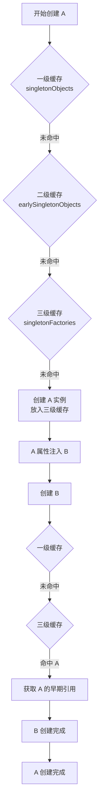
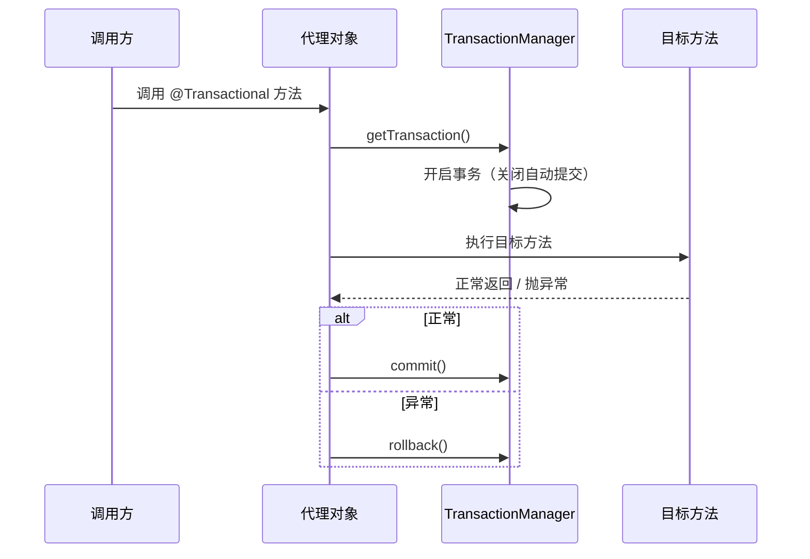
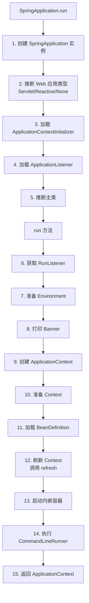
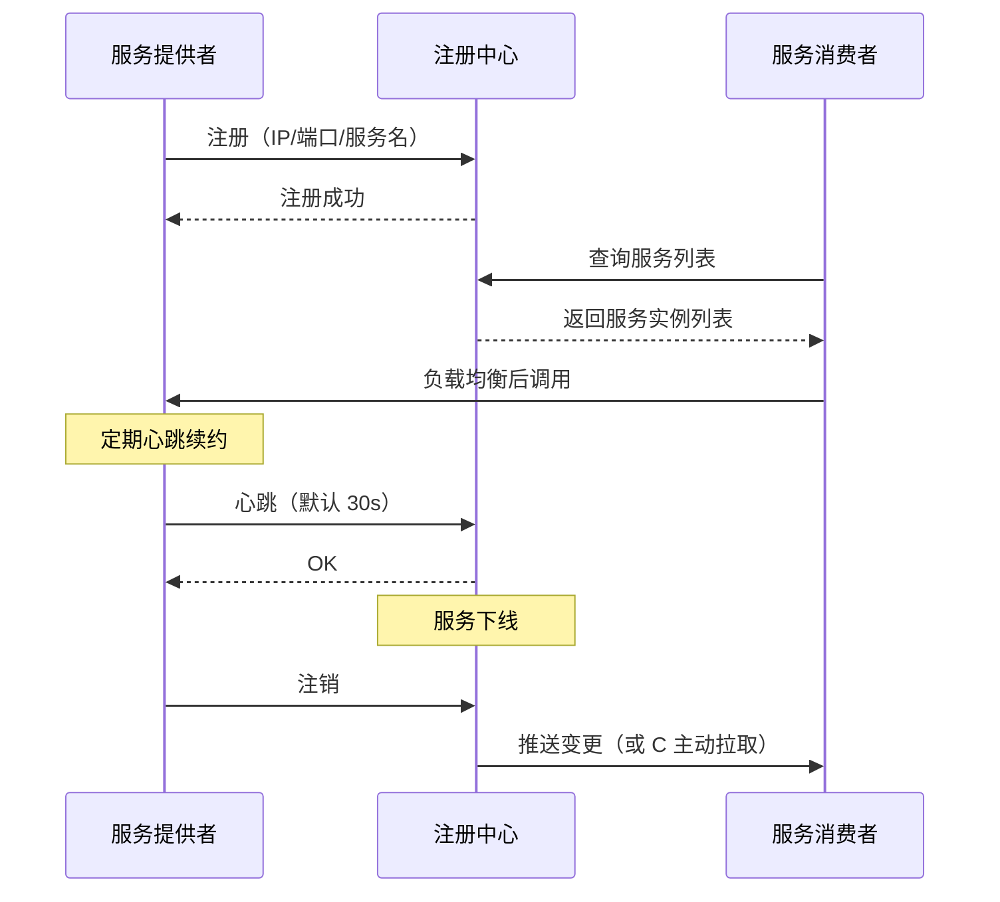
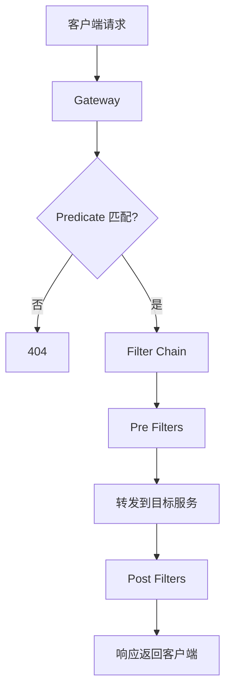
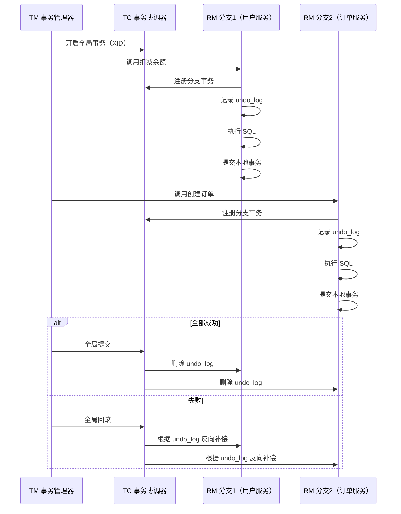

# Spring / Spring Boot / Spring Cloud 高频面试题与详细回答

> 文档定位：系统梳理 Spring 全家桶（Spring Core、Spring Boot、Spring Cloud）在面试中的高频问题，覆盖 IoC/AOP 原理、Bean 生命周期、自动配置机制、微服务注册发现、服务调用、配置中心、网关、分布式事务等核心考点。
>
> 适用人群：Java 后端工程师，尤其是使用 Spring Boot + Spring Cloud 技术栈的开发者。
>
> 阅读建议：先掌握 Spring 核心原理（一至二章），再学习 Spring Boot 自动配置（三至五章），最后攻克 Spring Cloud 微服务（六至十一章）。重点关注「Bean 生命周期」「AOP 原理」「自动配置原理」「注册中心」「分布式事务」五大核心模块。

---

## 目录

- [一、Spring IoC 与 Bean 管理](#一spring-ioc-与-bean-管理)
  - [Q1. 什么是 IoC 和 DI？](#q1-什么是-ioc-和-di)
  - [Q2. Spring Bean 的生命周期？](#q2-spring-bean-的生命周期)
  - [Q3. Bean 的作用域有哪些？](#q3-bean-的作用域有哪些)
  - [Q4. Spring 依赖注入的方式？](#q4-spring-依赖注入的方式)
  - [Q5. @Autowired 和 @Resource 的区别？](#q5-autowired-和-resource-的区别)
  - [Q6. Bean 循环依赖如何解决？](#q6-bean-循环依赖如何解决)
- [二、Spring AOP 与事务](#二spring-aop-与事务)
  - [Q7. Spring AOP 原理（JDK 动态代理 vs CGLIB）？](#q7-spring-aop-原理jdk-动态代理-vs-cglib)
  - [Q8. Spring AOP 通知类型有哪些？](#q8-spring-aop-通知类型有哪些)
  - [Q9. Spring 事务传播行为？](#q9-spring-事务传播行为)
  - [Q10. Spring 事务失效的场景？](#q10-spring-事务失效的场景)
  - [Q11. @Transactional 注解原理？](#q11-transactional-注解原理)
- [三、Spring Boot 自动配置](#三spring-boot-自动配置)
  - [Q12. Spring Boot 自动配置原理？](#q12-spring-boot-自动配置原理)
  - [Q13. @SpringBootApplication 注解包含什么？](#q13-springbootapplication-注解包含什么)
  - [Q14. starter 起步依赖原理？如何自定义 starter？](#q14-starter-起步依赖原理如何自定义-starter)
  - [Q15. Spring Boot 配置加载顺序？](#q15-spring-boot-配置加载顺序)
- [四、Spring Boot 启动流程与容器](#四spring-boot-启动流程与容器)
  - [Q16. Spring Boot 启动流程详解？](#q16-spring-boot-启动流程详解)
  - [Q17. Spring Boot 内嵌容器（Tomcat/Jetty/Undertow）？](#q17-spring-boot-内嵌容器tomcatjettyundertow)
  - [Q18. Spring Boot 如何打成可执行 jar？](#q18-spring-boot-如何打成可执行-jar)
- [五、Spring Boot 监控与配置](#五spring-boot-监控与配置)
  - [Q19. Spring Boot Actuator 常用端点？](#q19-spring-boot-actuator-常用端点)
  - [Q20. Spring Boot 多环境配置？](#q20-spring-boot-多环境配置)
  - [Q21. Spring Boot 优雅停机？](#q21-spring-boot-优雅停机)
- [六、Spring Cloud 注册中心](#六spring-cloud-注册中心)
  - [Q22. 服务注册与发现原理？](#q22-服务注册与发现原理)
  - [Q23. Nacos 与 Eureka 的区别？](#q23-nacos-与-eureka-的区别)
  - [Q24. Nacos 心跳与健康检查机制？](#q24-nacos-心跳与健康检查机制)
- [七、Spring Cloud 服务调用](#七spring-cloud-服务调用)
  - [Q25. OpenFeign 原理与使用？](#q25-openfeign-原理与使用)
  - [Q26. Ribbon 与 Spring Cloud LoadBalancer 的区别？](#q26-ribbon-与-spring-cloud-loadbalancer-的区别)
  - [Q27. 负载均衡策略有哪些？](#q27-负载均衡策略有哪些)
- [八、Spring Cloud 配置中心与网关](#八spring-cloud-配置中心与网关)
  - [Q28. Nacos Config 配置中心原理？](#q28-nacos-config-配置中心原理)
  - [Q29. Spring Cloud Gateway 原理与核心概念？](#q29-spring-cloud-gateway-原理与核心概念)
  - [Q30. Gateway 与 Zuul 的区别？](#q30-gateway-与-zuul-的区别)
- [九、Spring Cloud 分布式事务](#九spring-cloud-分布式事务)
  - [Q31. 分布式事务解决方案对比？](#q31-分布式事务解决方案对比)
  - [Q32. Seata AT 模式原理？](#q32-seata-at-模式原理)
  - [Q33. Seata 四种模式对比？](#q33-seata-四种模式对比)
- [十、综合实战题](#十综合实战题)
  - [Q34. 设计一个 Spring Boot 统一异常处理？](#q34-设计一个-spring-boot-统一异常处理)
  - [Q35. 设计一个 Spring Cloud 限流方案？](#q35-设计一个-spring-cloud-限流方案)
  - [Q36. 微服务链路追踪方案（Sleuth + Zipkin）？](#q36-微服务链路追踪方案sleuth--zipkin)
- [十一、高频速答与踩坑总结](#十一高频速答与踩坑总结)
  - [11.1 速答卡片（20 秒一题）](#111-速答卡片20-秒一题)
  - [11.2 实战踩坑 10 例](#112-实战踩坑-10-例)
  - [11.3 复习优先级表](#113-复习优先级表)

---

## 一、Spring IoC 与 Bean 管理

### Q1. 什么是 IoC 和 DI？

#### 核心答案

- **IoC（Inversion of Control，控制反转）**：对象的创建和依赖管理交给 Spring 容器，而非手动 new。
- **DI（Dependency Injection，依赖注入）**：IoC 的实现方式，容器将依赖对象注入到需要它的 Bean 中。

#### 传统方式 vs IoC

```java
// 传统方式：对象自己创建依赖（耦合高）
public class UserService {
    private UserDao userDao = new UserDao();  // 硬编码依赖
}

// IoC 方式：依赖由容器注入（耦合低）
public class UserService {
    @Autowired
    private UserDao userDao;  // 容器注入
}
```

#### IoC 容器核心接口

| 接口 | 职责 |
|------|------|
| `BeanFactory` | 最基础容器，提供 Bean 获取 |
| `ApplicationContext` | 高级容器，继承 BeanFactory，支持国际化、事件、AOP 等 |
| `ConfigurableApplicationContext` | 可配置的容器，支持 refresh/close |

#### DI 的三种方式

| 方式 | 注解 | 说明 |
|------|------|------|
| 构造器注入 | 构造器（Spring 4.3+ 隐式） | **推荐**，依赖不可变、单元测试友好 |
| Setter 注入 | `@Autowired` setter | 可选依赖、可重新注入 |
| 字段注入 | `@Autowired` 字段 | 简单但不利于测试和不可变 |

#### 构造器注入示例（推荐）

```java
@Service
public class UserService {
    private final UserDao userDao;
    private final OrderService orderService;

    // Spring 4.3+ 单构造器可省略 @Autowired
    public UserService(UserDao userDao, OrderService orderService) {
        this.userDao = userDao;
        this.orderService = orderService;
    }
}
```

---

### Q2. Spring Bean 的生命周期？

#### 完整生命周期

```mermaid
flowchart TB
    S[实例化 Bean] --> P[属性赋值 Populate]
    P --> A1[Aware 回调<br/>BeanNameAware/BeanFactoryAware/ApplicationContextAware]
    A1 --> BPP1[BeanPostProcessor.postProcessBeforeInitialization]
    BPP1 --> INIT[初始化<br/>@PostConstruct → InitializingBean.afterPropertiesSet → init-method]
    INIT --> BPP2[BeanPostProcessor.postProcessAfterInitialization]
    BPP2 --> U[使用 Bean]
    U --> D[销毁<br/>@PreDestroy → DisposableBean.destroy → destroy-method]
```

#### 详细阶段

| 阶段 | 回调 | 说明 |
|------|------|------|
| 1. 实例化 | 构造器 | 创建 Bean 实例 |
| 2. 属性注入 | `@Autowired` | 注入依赖属性 |
| 3. Aware 回调 | `BeanNameAware`/`BeanFactoryAware`/`ApplicationContextAware` | 注入容器相关信息 |
| 4. 前置处理 | `BeanPostProcessor.postProcessBeforeInitialization` | AOP 代理在此生成 |
| 5. 初始化 | `@PostConstruct` → `InitializingBean` → `init-method` | 自定义初始化逻辑 |
| 6. 后置处理 | `BeanPostProcessor.postProcessAfterInitialization` | 可对 Bean 包装（如 AOP） |
| 7. 使用 | - | 业务调用 |
| 8. 销毁 | `@PreDestroy` → `DisposableBean` → `destroy-method` | 资源释放 |

#### 代码示例

```java
@Component
public class MyBean implements BeanNameAware, InitializingBean, DisposableBean {

    @Override
    public void setBeanName(String name) {
        System.out.println("BeanNameAware: " + name);
    }

    @PostConstruct
    public void postConstruct() {
        System.out.println("@PostConstruct");
    }

    @Override
    public void afterPropertiesSet() {
        System.out.println("InitializingBean.afterPropertiesSet");
    }

    public void initMethod() {
        System.out.println("init-method");
    }

    @PreDestroy
    public void preDestroy() {
        System.out.println("@PreDestroy");
    }

    @Override
    public void destroy() {
        System.out.println("DisposableBean.destroy");
    }

    public void destroyMethod() {
        System.out.println("destroy-method");
    }
}
```

---

### Q3. Bean 的作用域有哪些？

| 作用域 | 说明 | 适用场景 |
|--------|------|---------|
| **singleton**（默认） | 容器中唯一实例 | 无状态 Bean（Service、DAO） |
| **prototype** | 每次获取创建新实例 | 有状态 Bean |
| **request** | 每个 HTTP 请求一个实例 | Web 环境 |
| **session** | 每个 HTTP 会话一个实例 | Web 环境 |
| **application** | ServletContext 生命周期 | Web 环境 |
| **websocket** | WebSocket 会话 | WebSocket 场景 |

#### 配置

```java
@Scope("prototype")
@Service
public class MyPrototypeBean { ... }

// 或指定代理模式
@Scope(value = "prototype", proxyMode = ScopedProxyMode.TARGET_CLASS)
```

#### singleton vs prototype 注意事项

```
singleton Bean 注入 prototype Bean 时，prototype 只在注入时创建一次
→ 后续使用的是同一个 prototype 实例（失效）

解决：
1. 用 ApplicationContext.getBean() 每次获取
2. 用 lookup-method
3. 用 ObjectProvider<T>
```

```java
@Service
public class SingletonBean {
    @Autowired
    private ObjectProvider<PrototypeBean> provider;

    public void doSomething() {
        PrototypeBean bean = provider.getObject();  // 每次获取新实例
    }
}
```

---

### Q4. Spring 依赖注入的方式？

#### 三种注入方式对比

| 方式 | 优点 | 缺点 | 推荐度 |
|------|------|------|--------|
| **构造器注入** | 依赖不可变、测试友好、可检测循环依赖 | 参数多时构造器臃肿 | ⭐⭐⭐⭐⭐ |
| **Setter 注入** | 可选依赖、可重新注入 | 依赖可变、可能 NPE | ⭐⭐⭐ |
| **字段注入** | 简单、代码少 | 不利于测试、不可变、循环依赖隐藏 | ⭐⭐（不推荐） |

#### 构造器注入

```java
@Service
public class UserService {
    private final UserDao userDao;
    private final OrderService orderService;

    public UserService(UserDao userDao, OrderService orderService) {
        this.userDao = userDao;
        this.orderService = orderService;
    }
}
```

#### 字段注入（不推荐）

```java
@Service
public class UserService {
    @Autowired
    private UserDao userDao;  // 无法 final，测试需反射注入
}
```

---

### Q5. @Autowired 和 @Resource 的区别？

| 维度 | @Autowired | @Resource |
|------|-----------|-----------|
| 来源 | Spring | JSR-250（Java 标准） |
| 注入方式 | **按类型**（byType） | **按名称**（byName），找不到再按类型 |
| 必需性 | 默认 required=true | 默认必需 |
| 多 Bean 歧义 | 配合 @Qualifier | name 属性指定 |
| 空值 | required=false 允许 | 不支持 |

#### 使用示例

```java
// @Autowired + @Qualifier 指定名称
@Autowired
@Qualifier("userDaoImpl")
private UserDao userDao;

// @Resource 按名称注入
@Resource(name = "userDaoImpl")
private UserDao userDao;

// @Resource 不指定 name，按属性名查找
@Resource
private UserDao userDao;  // 查找名为 userDao 的 Bean
```

---

### Q6. Bean 循环依赖如何解决？

#### 循环依赖场景

```
A 依赖 B，B 依赖 A → 循环依赖
```

#### Spring 解决循环依赖的三级缓存



#### 三级缓存说明

| 缓存 | 名称 | 内容 |
|------|------|------|
| 一级 | `singletonObjects` | 完整 Bean 实例 |
| 二级 | `earlySingletonObjects` | 早期 Bean 引用（已实例化未初始化） |
| 三级 | `singletonFactories` | ObjectFactory（生成早期引用，AOP 代理在此生成） |

#### 循环依赖解决条件

| 场景 | 能否解决 | 原因 |
|------|---------|------|
| singleton + setter 注入 | ✅ | 三级缓存 |
| singleton + 构造器注入 | ❌ | 实例化时就需要依赖 |
| prototype | ❌ | 不缓存，无法提前暴露 |

#### 构造器循环依赖解决

```java
// 方案1：用 @Lazy 延迟注入
@Service
public class A {
    private final B b;
    public A(@Lazy B b) { this.b = b; }  // 注入 B 的代理
}

// 方案2：改用 setter 注入
// 方案3：重构代码消除循环依赖
```

---

## 二、Spring AOP 与事务

### Q7. Spring AOP 原理（JDK 动态代理 vs CGLIB）？

#### 核心答案

Spring AOP 通过**动态代理**实现，在目标方法执行前后织入通知逻辑。

#### 两种代理方式

| 维度 | JDK 动态代理 | CGLIB |
|------|-------------|-------|
| 原理 | 实现目标接口的代理类 | 生成目标类的子类 |
| 要求 | 目标类必须实现接口 | 目标类不能 final |
| 性能 | 略高（接口调用） | 略低（继承） |
| Spring Boot 2.x+ 默认 | - | ✅ CGLIB |
| 配置 | `proxy-target-class=false` | `proxy-target-class=true` |

#### JDK 动态代理示例

```java
public class MyInvocationHandler implements InvocationHandler {
    private final Object target;

    public MyInvocationHandler(Object target) {
        this.target = target;
    }

    @Override
    public Object invoke(Object proxy, Method method, Object[] args) throws Throwable {
        System.out.println("前置通知");
        Object result = method.invoke(target, args);
        System.out.println("后置通知");
        return result;
    }
}

// 创建代理
UserService proxy = (UserService) Proxy.newProxyInstance(
    UserService.class.getClassLoader(),
    new Class[]{UserService.class},
    new MyInvocationHandler(new UserServiceImpl())
);
```

#### CGLIB 代理示例

```java
public class MyMethodInterceptor implements MethodInterceptor {
    @Override
    public Object intercept(Object obj, Method method, Object[] args, MethodProxy proxy) throws Throwable {
        System.out.println("前置通知");
        Object result = proxy.invokeSuper(obj, args);
        System.out.println("后置通知");
        return result;
    }
}

Enhancer enhancer = new Enhancer();
enhancer.setSuperclass(UserServiceImpl.class);
enhancer.setCallback(new MyMethodInterceptor());
UserServiceImpl proxy = (UserServiceImpl) enhancer.create();
```

#### AOP 选择逻辑

```
if (目标类实现了接口) {
    if (proxyTargetClass == false) 使用 JDK 动态代理
    else 使用 CGLIB
} else {
    使用 CGLIB
}
```

---

### Q8. Spring AOP 通知类型有哪些？

| 通知类型 | 注解 | 执行时机 |
|---------|------|---------|
| 前置通知 | `@Before` | 目标方法执行前 |
| 后置返回通知 | `@AfterReturning` | 目标方法正常返回后 |
| 后置异常通知 | `@AfterThrowing` | 目标方法抛出异常后 |
| 后置通知 | `@After` | 目标方法执行后（无论正常或异常） |
| 环绕通知 | `@Around` | 目标方法前后，可控制是否执行 |

#### 示例

```java
@Aspect
@Component
public class LogAspect {

    @Pointcut("execution(* com.example.service.*.*(..))")
    public void servicePointcut() {}

    @Before("servicePointcut()")
    public void before(JoinPoint joinPoint) {
        System.out.println("前置: " + joinPoint.getSignature().getName());
    }

    @AfterReturning(pointcut = "servicePointcut()", returning = "result")
    public void afterReturning(Object result) {
        System.out.println("返回: " + result);
    }

    @AfterThrowing(pointcut = "servicePointcut()", throwing = "ex")
    public void afterThrowing(Exception ex) {
        System.out.println("异常: " + ex.getMessage());
    }

    @Around("servicePointcut()")
    public Object around(ProceedingJoinPoint pjp) throws Throwable {
        long start = System.currentTimeMillis();
        Object result = pjp.proceed();
        long cost = System.currentTimeMillis() - start;
        System.out.println("耗时: " + cost + "ms");
        return result;
    }
}
```

---

### Q9. Spring 事务传播行为？

| 传播行为 | 说明 |
|---------|------|
| **REQUIRED**（默认） | 有事务则加入，无则新建 |
| **REQUIRES_NEW** | 总是新建事务，挂起当前事务 |
| **SUPPORTS** | 有事务则加入，无则非事务执行 |
| **NOT_SUPPORTED** | 非事务执行，挂起当前事务 |
| **MANDATORY** | 必须有事务，否则抛异常 |
| **NEVER** | 必须无事务，否则抛异常 |
| **NESTED** | 嵌套事务（保存点），外部回滚则内部回滚 |

#### 常用场景

```java
@Transactional(propagation = Propagation.REQUIRED)
public void methodA() {
    methodB();  // 加入 A 的事务
}

@Transactional(propagation = Propagation.REQUIRES_NEW)
public void methodB() {
    // 新建独立事务，A 回滚不影响 B
}

@Transactional(propagation = Propagation.NESTED)
public void methodC() {
    // 嵌套事务，A 回滚则 C 回滚，C 回滚不影响 A
}
```

---

### Q10. Spring 事务失效的场景？

| 场景 | 原因 | 解决 |
|------|------|------|
| 方法非 public | AOP 不拦截非 public | 改为 public |
| 同类内部调用 | 绕过代理对象 | 注入自身 / AopContext.currentProxy() |
| 异常被 catch | 未抛出异常 | 重新抛出 / TransactionAspectSupport.currentTransactionStatus().setRollbackOnly() |
| 异常类型不匹配 | 默认只回滚 RuntimeException | `rollbackFor = Exception.class` |
| 数据库不支持事务 | MyISAM 引擎 | 改用 InnoDB |
| 未被 Spring 管理 | 类未加 @Component | 加注解 |
| propagation 配置错误 | NOT_SUPPORTED 等 | 检查传播行为 |
| 多数据源 | 事务管理器不匹配 | 指定 transactionManager |

#### 同类内部调用失效

```java
@Service
public class UserService {

    @Autowired
    private UserService self;  // 注入自身代理

    public void methodA() {
        // ❌ this.methodB() 直接调用，事务不生效
        // ✅ self.methodB() 通过代理调用，事务生效
        self.methodB();
    }

    @Transactional
    public void methodB() {
        // 事务操作
    }
}
```

---

### Q11. @Transactional 注解原理？

#### 核心原理

`@Transactional` 通过 AOP 拦截目标方法，在方法执行前开启事务，执行后提交或回滚。

#### 执行流程



#### 关键参数

```java
@Transactional(
    propagation = Propagation.REQUIRED,      // 传播行为
    isolation = Isolation.DEFAULT,           // 隔离级别
    timeout = 30,                            // 超时时间（秒）
    readOnly = false,                        // 是否只读
    rollbackFor = Exception.class,           // 回滚异常
    noRollbackFor = BusinessException.class  // 不回滚异常
)
```

---

## 三、Spring Boot 自动配置

### Q12. Spring Boot 自动配置原理？

#### 核心原理

Spring Boot 启动时通过 `@EnableAutoConfiguration` 加载 `META-INF/spring.factories`（Spring Boot 2.7+ 用 `META-INF/spring/org.springframework.boot.autoconfigure.AutoConfiguration.imports`）中配置的自动配置类，根据条件注解（`@ConditionalOnXxx`）决定是否生效。

#### 自动配置流程

```mermaid
flowchart TB
    S[启动 @SpringBootApplication] --> EA[@EnableAutoConfiguration]
    EA --> AI[AutoConfigurationImportSelector]
    AI --> SF[加载 spring.factories / .imports]
    SF --> Filter{条件过滤}
    Filter -->|@ConditionalOnClass| C1[类是否存在]
    Filter -->|@ConditionalOnBean| C2[Bean 是否存在]
    Filter -->|@ConditionalOnProperty| C3[配置是否满足]
    Filter -->|@ConditionalOnMissingBean| C4[Bean 是否缺失]
    C1 & C2 & C3 & C4 --> PASS[条件满足]
    PASS --> REG[注册 BeanDefinition]
    REG --> Done[自动配置完成]
```

#### 条件注解

| 注解 | 说明 |
|------|------|
| `@ConditionalOnClass` | 类路径存在指定类 |
| `@ConditionalOnMissingClass` | 类路径不存在指定类 |
| `@ConditionalOnBean` | 容器存在指定 Bean |
| `@ConditionalOnMissingBean` | 容器不存在指定 Bean |
| `@ConditionalOnProperty` | 配置属性满足条件 |
| `@ConditionalOnWebApplication` | Web 应用环境 |
| `@ConditionalOnExpression` | SpEL 表达式为真 |

#### 自动配置示例（Redis）

```java
@AutoConfiguration
@ConditionalOnClass(RedisOperations.class)
@EnableConfigurationProperties(RedisProperties.class)
public class RedisAutoConfiguration {

    @Bean
    @ConditionalOnMissingBean(name = "redisTemplate")
    public RedisTemplate<Object, Object> redisTemplate(RedisConnectionFactory factory) {
        RedisTemplate<Object, Object> template = new RedisTemplate<>();
        template.setConnectionFactory(factory);
        return template;
    }
}
```

---

### Q13. @SpringBootApplication 注解包含什么？

#### 组成

```java
@SpringBootApplication =
    @SpringBootConfiguration      // 标记配置类
    + @EnableAutoConfiguration     // 开启自动配置
    + @ComponentScan              // 组件扫描（默认扫描启动类所在包）
```

#### 源码

```java
@Target(ElementType.TYPE)
@Retention(RetentionPolicy.RUNTIME)
@Documented
@Inherited
@SpringBootConfiguration
@EnableAutoConfiguration
@ComponentScan(excludeFilters = {
    @ComponentScan.Filter(type = FilterType.CUSTOM, classes = TypeExcludeFilter.class),
    @ComponentScan.Filter(type = FilterType.CUSTOM, classes = AutoConfigurationExcludeFilter.class)
})
public @interface SpringBootApplication {
    // 排除自动配置类
    Class<?>[] exclude() default {};
    String[] excludeName() default {};
    // 扫描包
    String[] scanBasePackages() default {};
}
```

---

### Q14. starter 起步依赖原理？如何自定义 starter？

#### starter 原理

starter 是一组依赖的集合，引入一个 starter 就引入了相关所有依赖 + 自动配置类。

```
my-spring-boot-starter
  ├── pom.xml          → 引入所有依赖
  └── AutoConfiguration → 自动配置类
```

#### 自定义 starter

```xml
<!-- pom.xml -->
<artifactId>my-spring-boot-starter</artifactId>
<dependencies>
    <dependency>
        <groupId>org.springframework.boot</groupId>
        <artifactId>spring-boot-autoconfigure</artifactId>
    </dependency>
</dependencies>
```

```java
// 配置属性类
@ConfigurationProperties(prefix = "my.hello")
public class HelloProperties {
    private String name = "world";
    // getter/setter
}

// 自动配置类
@AutoConfiguration
@EnableConfigurationProperties(HelloProperties.class)
public class HelloAutoConfiguration {

    @Bean
    @ConditionalOnMissingBean
    public HelloService helloService(HelloProperties properties) {
        return new HelloService(properties.getName());
    }
}
```

```properties
# src/main/resources/META-INF/spring/org.springframework.boot.autoconfigure.AutoConfiguration.imports
com.example.hello.HelloAutoConfiguration
```

---

### Q15. Spring Boot 配置加载顺序？

#### 配置优先级（从低到高）

```
1. 默认属性（SpringApplication.setDefaultProperties）
2. @PropertySource
3. 命令行参数
4. SPRING_APPLICATION_JSON
5. Servlet 参数
6. application-{profile}.yml（指定环境）
7. application.yml（公共配置）
8. @ConfigurationProperties
9. 外部配置文件（jar 包外）
10. 环境变量
11. 系统属性（System.getProperties()）
```

#### 多 profile 配置

```yaml
# application.yml
spring:
  profiles:
    active: dev  # 激活 dev 环境

# application-dev.yml
server:
  port: 8080

# application-prod.yml
server:
  port: 80
```

#### 配置文件位置优先级（从高到低）

```
1. file:./config/         # 项目根目录 config
2. file:./                # 项目根目录
3. classpath:/config/     # jar 包内 config
4. classpath:/            # jar 包根目录
```

---

## 四、Spring Boot 启动流程与容器

### Q16. Spring Boot 启动流程详解？



#### 关键步骤说明

| 步骤 | 说明 |
|------|------|
| 推断 Web 类型 | 根据类路径是否存在 DispatcherServlet / WebApplication |
| 准备 Environment | 加载配置文件、环境变量 |
| 创建 Context | 按 Web 类型创建 AnnotationConfigServletWebServerApplicationContext |
| refresh | 核心方法，完成 Bean 的创建、AOP 代理、事件发布 |
| 启动容器 | 在 refresh 中启动 Tomcat |

---

### Q17. Spring Boot 内嵌容器（Tomcat/Jetty/Undertow）？

#### 三种容器对比

| 容器 | 性能 | 资源占用 | 异步支持 | 默认 |
|------|------|---------|---------|------|
| **Tomcat** | 中 | 中 | 一般 | ✅ |
| **Jetty** | 中 | 轻量 | 一般 | ❌ |
| **Undertow** | 高 | 最轻量 | 强 | ❌ |

#### 切换容器

```xml
<!-- 排除 Tomcat，引入 Undertow -->
<dependency>
    <groupId>org.springframework.boot</groupId>
    <artifactId>spring-boot-starter-web</artifactId>
    <exclusions>
        <exclusion>
            <groupId>org.springframework.boot</groupId>
            <artifactId>spring-boot-starter-tomcat</artifactId>
        </exclusion>
    </exclusions>
</dependency>
<dependency>
    <groupId>org.springframework.boot</groupId>
    <artifactId>spring-boot-starter-undertow</artifactId>
</dependency>
```

#### 容器配置

```yaml
server:
  port: 8080
  tomcat:
    max-threads: 200          # 最大线程数
    min-spare-threads: 10     # 最小空闲线程
    accept-count: 100         # 等待队列
    connection-timeout: 20000 # 连接超时
```

---

### Q18. Spring Boot 如何打成可执行 jar？

#### 核心：spring-boot-maven-plugin

```xml
<plugin>
    <groupId>org.springframework.boot</groupId>
    <artifactId>spring-boot-maven-plugin</artifactId>
    <configuration>
        <mainClass>com.example.Application</mainClass>
    </configuration>
    <executions>
        <execution>
            <goals>
                <goal>repackage</goal>  <!-- 重新打包 -->
            </goals>
        </execution>
    </executions>
</plugin>
```

#### 可执行 jar 结构

```
app.jar
├── META-INF/
│   └── MANIFEST.MF          # 包含 Main-Class 和 Start-Class
├── BOOT-INF/
│   ├── classes/             # 项目 class 文件
│   └── lib/                 # 依赖 jar
└── org/springframework/boot/loader/  # Spring Boot Loader
```

#### 启动原理

```
java -jar app.jar
  → JVM 读取 MANIFEST.MF 的 Main-Class: JarLauncher
  → JarLauncher 加载 BOOT-INF/classes 和 BOOT-INF/lib
  → 调用 Start-Class（用户的主类）的 main 方法
```

#### MANIFEST.MF

```
Main-Class: org.springframework.boot.loader.JarLauncher
Start-Class: com.example.Application
Spring-Boot-Version: 3.1.0
Spring-Boot-Classes: BOOT-INF/classes/
Spring-Boot-Lib: BOOT-INF/lib/
```

---

## 五、Spring Boot 监控与配置

### Q19. Spring Boot Actuator 常用端点？

#### 引入依赖

```xml
<dependency>
    <groupId>org.springframework.boot</groupId>
    <artifactId>spring-boot-starter-actuator</artifactId>
</dependency>
```

#### 常用端点

| 端点 | 说明 | 默认暴露 |
|------|------|---------|
| `/actuator/health` | 健康检查 | ✅ |
| `/actuator/info` | 应用信息 | ✅ |
| `/actuator/metrics` | 指标信息 | ❌ |
| `/actuator/env` | 环境属性 | ❌ |
| `/actuator/beans` | Bean 列表 | ❌ |
| `/actuator/mappings` | 请求映射 | ❌ |
| `/actuator/heapdump` | 堆转储 | ❌ |
| `/actuator/loggers` | 日志级别 | ❌ |
| `/actuator/threaddump` | 线程转储 | ❌ |
| `/actuator/shutdown` | 关闭应用 | ❌（需手动开启） |

#### 配置暴露

```yaml
management:
  endpoints:
    web:
      exposure:
        include: health,info,metrics,env  # 暴露指定端点
  endpoint:
    health:
      show-details: always  # 显示详细健康信息
    shutdown:
      enabled: true  # 开启 shutdown 端点（谨慎）
```

#### 自定义健康检查

```java
@Component
public class MyHealthIndicator implements HealthIndicator {

    @Override
    public Health health() {
        try {
            // 检查数据库连接、Redis 等
            checkDependency();
            return Health.up().withDetail("status", "OK").build();
        } catch (Exception e) {
            return Health.down().withDetail("error", e.getMessage()).build();
        }
    }
}
```

---

### Q20. Spring Boot 多环境配置？

#### 方式1：profile 配置文件

```yaml
# application.yml（公共）
spring:
  profiles:
    active: dev

# application-dev.yml
server:
  port: 8080
spring:
  datasource:
    url: jdbc:mysql://localhost:3306/dev

# application-prod.yml
server:
  port: 80
spring:
  datasource:
    url: jdbc:mysql://prod-host:3306/prod
```

#### 方式2：命令行指定

```bash
# 通过参数指定 profile
java -jar app.jar --spring.profiles.active=prod

# 通过环境变量
SPRING_PROFILES_ACTIVE=prod java -jar app.jar
```

#### 方式3：@Profile 注解

```java
@Configuration
@Profile("dev")
public class DevConfig {
    // 仅 dev 环境生效
}

@Service
@Profile({"dev", "test"})
public class MockService {
    // dev 和 test 环境生效
}
```

---

### Q21. Spring Boot 优雅停机？

#### 配置

```yaml
server:
  shutdown: graceful  # 优雅停机

spring:
  lifecycle:
    timeout-per-shutdown-phase: 30s  # 最大等待时间
```

#### 原理

```
1. 收到 SIGTERM 信号（kill -15）
2. Spring 停止接收新请求
3. 等待正在处理的请求完成（最多 30s）
4. 关闭连接池、线程池、释放资源
5. JVM 退出
```

#### 自定义停机逻辑

```java
@Component
public class GracefulShutdown implements DisposableBean {

    @Override
    public void destroy() {
        System.out.println("应用关闭，执行清理...");
        // 关闭线程池、MQ 消费者、释放资源
    }
}
```

#### Kubernetes 中的优雅停机

```yaml
lifecycle:
  preStop:
    exec:
      command: ["sh", "-c", "sleep 10"]  # 给服务发现时间摘除
terminationGracePeriodSeconds: 40
```

---

## 六、Spring Cloud 注册中心

### Q22. 服务注册与发现原理？



#### 核心概念

| 概念 | 说明 |
|------|------|
| **服务注册** | 服务启动时向注册中心登记自己的信息 |
| **服务发现** | 消费者从注册中心获取服务实例列表 |
| **心跳续约** | 提供者定期发送心跳，证明自己存活 |
| **服务摘除** | 心跳超时则剔除实例 |
| **健康检查** | 检测实例是否可用 |

---

### Q23. Nacos 与 Eureka 的区别？

| 维度 | Nacos | Eureka |
|------|-------|--------|
| 开发公司 | 阿里巴巴 | Netflix |
| 注册中心类型 | AP + CP（可切换） | AP |
| 配置中心 | ✅ 集成 | ❌ 需配合 Config |
| 健康检查 | 心跳 + TCP/HTTP/MySQL | 心跳 |
| 持久化 | 支持（MySQL/Derby） | 内存（集群同步） |
| 控制台 | 丰富 | 简单 |
| 维护状态 | 活跃 | 已停止维护（2.0 停更） |
| 协议 | HTTP/gRPC | HTTP |

#### Nacos AP/CP 切换

```
Nacos 默认 AP 模式（可用性优先）
临时实例（ephemeral=true）→ AP 模式（Distro 协议）
持久实例（ephemeral=false）→ CP 模式（Raft 协议）
```

---

### Q24. Nacos 心跳与健康检查机制？

#### 心跳机制（临时实例）

```
1. 服务注册后，客户端每 5s 发送一次心跳
2. Nacos 15s 未收到心跳 → 标记实例不健康
3. Nacos 30s 未收到心跳 → 剔除实例
```

#### 健康检查（持久实例）

```
Nacos 服务端主动探测：
- TCP 探测：尝试连接 IP:Port
- HTTP 探测：HTTP GET 指定路径，200 为健康
- MySQL 探测：执行 SELECT 1
```

#### 配置

```yaml
spring:
  cloud:
    nacos:
      discovery:
        server-addr: 127.0.0.1:8848
        ephemeral: true              # 临时实例（AP 模式）
        heart-beat-interval: 5000    # 心跳间隔 5s
        heart-beat-timeout: 15000    # 心跳超时 15s
        ip-delete-timeout: 30000     # 剔除超时 30s
```

---

## 七、Spring Cloud 服务调用

### Q25. OpenFeign 原理与使用？

#### 核心原理

OpenFeign 通过**动态代理**将接口方法调用转化为 HTTP 请求。

#### 使用

```xml
<dependency>
    <groupId>org.springframework.cloud</groupId>
    <artifactId>spring-cloud-starter-openfeign</artifactId>
</dependency>
```

```java
@EnableFeignClients
@SpringBootApplication
public class Application { ... }

// 定义 Feign 接口
@FeignClient(name = "user-service", path = "/user")
public interface UserFeignClient {

    @GetMapping("/{id}")
    User getUserById(@PathVariable("id") Long id);

    @PostMapping
    Result createUser(@RequestBody User user);
}
```

```java
// 使用
@Service
public class OrderService {
    @Autowired
    private UserFeignClient userFeignClient;

    public User getUser(Long id) {
        return userFeignClient.getUserById(id);
    }
}
```

#### 原理

```
1. @EnableFeignClients 扫描 @FeignClient 接口
2. 为每个接口创建 JDK 动态代理
3. 调用方法时：
   - 解析方法上的 @GetMapping 等注解，构建 HTTP 请求
   - 通过负载均衡选择服务实例
   - 发起 HTTP 请求
   - 解析响应为返回值
```

#### Feign 配置

```yaml
feign:
  client:
    config:
      default:
        connectTimeout: 5000     # 连接超时
        readTimeout: 10000        # 读取超时
        loggerLevel: full         # 日志级别
  httpclient:
    enabled: true                # 使用 Apache HttpClient 替代默认
    max-connections: 200
```

---

### Q26. Ribbon 与 Spring Cloud LoadBalancer 的区别？

| 维度 | Ribbon | Spring Cloud LoadBalancer |
|------|--------|--------------------------|
| 维护状态 | 已停更（进入维护） | **官方推荐** |
| 阻塞/响应式 | 阻塞 | 阻塞 + 响应式 |
| 集成方式 | 与 Feign 集成 | 与 Feign 集成 |
| 负载均衡策略 | 7 种（轮询、随机、权重等） | 轮询、随机 |

#### Spring Cloud LoadBalancer 使用

```xml
<dependency>
    <groupId>org.springframework.cloud</groupId>
    <artifactId>spring-cloud-starter-loadbalancer</artifactId>
</dependency>
```

```java
@Configuration
public class LoadBalancerConfig {

    @Bean
    public ReactorLoadBalancer<ServiceInstance> randomLoadBalancer(
            Environment environment, LoadBalancerClientFactory factory) {
        String name = environment.getProperty(LoadBalancerClientFactory.PROPERTY_NAME);
        return new RandomLoadBalancer(factory.getLazyProvider(name, ServiceInstanceListSupplier.class), name);
    }
}
```

---

### Q27. 负载均衡策略有哪些？

| 策略 | 说明 | 适用场景 |
|------|------|---------|
| **轮询（RoundRobin）** | 依次分配 | 服务实例性能相近 |
| **随机（Random）** | 随机选择 | 简单场景 |
| **加权轮询（Weighted）** | 按权重分配 | 实例性能差异大 |
| **最少连接（LeastConnection）** | 选择连接数最少的 | 长连接场景 |
| **一致性哈希（ConsistentHash）** | 相同请求到相同实例 | 会话保持 |
| **响应时间（ResponseTime）** | 选择响应最快的 | 对延迟敏感 |

---

## 八、Spring Cloud 配置中心与网关

### Q28. Nacos Config 配置中心原理？

#### 核心概念

| 概念 | 说明 |
|------|------|
| **Namespace** | 命名空间，隔离环境（dev/test/prod） |
| **Group** | 分组，隔离业务 |
| **Data ID** | 配置文件 ID |

#### 配置格式

```
${prefix}-${spring.profiles.active}.${file-extension}

例：user-service-dev.yaml
    prefix = user-service
    active = dev
    extension = yaml
```

#### 动态刷新原理

```
1. 客户端启动时从 Nacos 拉取配置
2. 客户端与 Nacos 保持长连接（gRPC）
3. Nacos 配置变更 → 推送变更通知到客户端
4. 客户端重新拉取配置
5. @RefreshScope 注解的 Bean 重新注入属性
```

#### 使用

```xml
<dependency>
    <groupId>com.alibaba.cloud</groupId>
    <artifactId>spring-cloud-starter-alibaba-nacos-config</artifactId>
</dependency>
```

```yaml
# bootstrap.yml（必须在 bootstrap 中配置）
spring:
  application:
    name: user-service
  cloud:
    nacos:
      config:
        server-addr: 127.0.0.1:8848
        file-extension: yaml
        namespace: dev-namespace-id
        group: DEFAULT_GROUP
```

```java
// 动态刷新
@RestController
@RefreshScope
public class ConfigController {

    @Value("${user.max-age:100}")
    private int maxAge;

    @GetMapping("/max-age")
    public int getMaxAge() {
        return maxAge;
    }
}
```

---

### Q29. Spring Cloud Gateway 原理与核心概念？

#### 核心概念

| 概念 | 说明 |
|------|------|
| **Route（路由）** | 网关基本单元，包含 ID、目标 URI、断言、过滤器 |
| **Predicate（断言）** | 判断请求是否匹配路由 |
| **Filter（过滤器）** | 请求/响应的修改逻辑 |

#### 架构



#### 配置示例

```yaml
spring:
  cloud:
    gateway:
      routes:
        - id: user-service
          uri: lb://user-service  # 负载均衡
          predicates:
            - Path=/user/**
          filters:
            - StripPrefix=1
            - AddRequestHeader=X-Request-Id, 123
```

#### 常用断言

| 断言 | 说明 |
|------|------|
| `Path` | 路径匹配 |
| `Method` | HTTP 方法 |
| `Header` | 请求头匹配 |
| `Query` | 查询参数 |
| `Cookie` | Cookie |
| `Host` | Host |
| `Between` | 时间区间 |

#### 常用过滤器

| 过滤器 | 说明 |
|--------|------|
| `StripPrefix` | 去掉路径前缀 |
| `AddRequestHeader` | 添加请求头 |
| `AddResponseHeader` | 添加响应头 |
| `RewritePath` | 重写路径 |
| `RequestRateLimiter` | 限流 |
| `Retry` | 重试 |

---

### Q30. Gateway 与 Zuul 的区别？

| 维度 | Zuul 1.x | Zuul 2.x | Spring Cloud Gateway |
|------|----------|----------|---------------------|
| 线程模型 | 同步阻塞（Servlet） | 异步非阻塞 | 异步非阻塞（WebFlux） |
| 性能 | 低 | 中 | 高 |
| 维护状态 | 停更 | 停更 | **活跃** |
| 基于 | Servlet | Netty | Spring WebFlux + Reactor |
| 限流 | 需扩展 | 需扩展 | 内置 RequestRateLimiter |

---

## 九、Spring Cloud 分布式事务

### Q31. 分布式事务解决方案对比？

| 方案 | 一致性 | 性能 | 复杂度 | 适用场景 |
|------|--------|------|--------|---------|
| **2PC（两阶段提交）** | 强一致 | 低 | 中 | 传统 XA 事务 |
| **TCC** | 最终一致 | 中 | 高 | 对一致性要求高 |
| **Saga** | 最终一致 | 高 | 高 | 长事务、业务补偿 |
| **本地消息表** | 最终一致 | 高 | 中 | 异步解耦 |
| **MQ 事务消息** | 最终一致 | 高 | 中 | RocketMQ 事务消息 |
| **Seata AT** | 最终一致 | 高 | 低 | 通用场景（推荐） |

---

### Q32. Seata AT 模式原理？

#### 核心原理

通过**全局锁** + **回滚日志（undo_log）**实现自动回滚，业务代码无侵入。

#### 执行流程



#### undo_log 表结构

```sql
CREATE TABLE undo_log (
    id BIGINT PRIMARY KEY AUTO_INCREMENT,
    branch_id BIGINT NOT NULL,
    xid VARCHAR(128) NOT NULL,
    rollback_info LONGBLOB NOT NULL,  -- 回滚数据
    log_created DATETIME NOT NULL,
    log_modified DATETIME NOT NULL,
    UNIQUE KEY ux_undo_log (xid, branch_id)
);
```

#### 使用

```java
@GlobalTransactional  // 开启全局事务
public void placeOrder(Long userId, Long productId, int count) {
    // 调用用户服务扣减余额
    userService.deductBalance(userId, amount);
    // 调用库存服务扣减库存
    stockService.deductStock(productId, count);
    // 创建订单
    orderService.createOrder(userId, productId, count);
}
```

---

### Q33. Seata 四种模式对比？

| 模式 | 原理 | 侵入性 | 一致性 | 适用场景 |
|------|------|--------|--------|---------|
| **AT** | 自动回滚（undo_log） | 无 | 最终一致 | 通用场景 |
| **TCC** | Try-Confirm-Cancel 业务补偿 | 高（写三个接口） | 最终一致 | 一致性要求高 |
| **Saga** | 长事务编排，失败反向补偿 | 中 | 最终一致 | 长事务流程 |
| **XA** | 两阶段提交（数据库支持） | 无 | 强一致 | 传统场景 |

---

## 十、综合实战题

### Q34. 设计一个 Spring Boot 统一异常处理？

```java
@RestControllerAdvice
public class GlobalExceptionHandler {

    // 业务异常
    @ExceptionHandler(BusinessException.class)
    public Result<?> handleBusinessException(BusinessException e) {
        log.warn("业务异常: {}", e.getMessage());
        return Result.fail(e.getCode(), e.getMessage());
    }

    // 参数校验异常
    @ExceptionHandler(MethodArgumentNotValidException.class)
    public Result<?> handleValidException(MethodArgumentNotValidException e) {
        String msg = e.getBindingResult().getFieldErrors().stream()
            .map(f -> f.getField() + ": " + f.getDefaultMessage())
            .collect(Collectors.joining("; "));
        return Result.fail(400, msg);
    }

    // 系统异常
    @ExceptionHandler(Exception.class)
    public Result<?> handleException(Exception e) {
        log.error("系统异常", e);
        return Result.fail(500, "系统繁忙，请稍后重试");
    }
}
```

---

### Q35. 设计一个 Spring Cloud 限流方案？

#### 方案1：Gateway + Redis 限流

```yaml
spring:
  cloud:
    gateway:
      routes:
        - id: user-service
          uri: lb://user-service
          predicates:
            - Path=/user/**
          filters:
            - name: RequestRateLimiter
              args:
                redis-rate-limiter.replenishRate: 10    # 令牌桶每秒填充速率
                redis-rate-limiter.burstCapacity: 20    # 令牌桶容量
                key-resolver: "#{@ipKeyResolver}"        # 限流 key
```

```java
@Bean
public KeyResolver ipKeyResolver() {
    return exchange -> Mono.just(
        exchange.getRequest().getRemoteAddress().getAddress().getHostAddress()
    );
}
```

#### 方案2：Sentinel 限流

```java
// 定义限流规则
FlowRule rule = new FlowRule();
rule.setResource("createOrder");
rule.setGrade(RuleConstant.FLOW_GRADE_QPS);
rule.setCount(100);  // 每秒 100 次
FlowRuleManager.loadRules(Collections.singletonList(rule));

// 资源使用
@SentinelResource(value = "createOrder", blockHandler = "blockHandler")
public void createOrder() {
    // 业务逻辑
}

public void blockHandler(BlockException ex) {
    throw new RuntimeException("系统繁忙，请稍后重试");
}
```

#### 方案对比

| 方案 | 位置 | 粒度 | 功能 |
|------|------|------|------|
| Gateway + Redis | 网关层 | IP/接口 | 简单限流 |
| Sentinel | 服务层 | 接口/资源 | 限流 + 熔断 + 降级 |

---

### Q36. 微服务链路追踪方案（Sleuth + Zipkin）？

#### 核心概念

| 概念 | 说明 |
|------|------|
| **Trace** | 一次完整请求链路（唯一 TraceId） |
| **Span** | 链路中的一个工作单元（如一次 HTTP 调用） |
| **TraceId** | 贯穿整个链路的唯一 ID |
| **SpanId** | 当前 Span 的 ID |
| **ParentId** | 父 Span ID |

#### 集成

```xml
<dependency>
    <groupId>org.springframework.cloud</groupId>
    <artifactId>spring-cloud-starter-sleuth</artifactId>
</dependency>
<dependency>
    <groupId>org.springframework.cloud</groupId>
    <artifactId>spring-cloud-sleuth-zipkin</artifactId>
</dependency>
```

```yaml
spring:
  zipkin:
    base-url: http://zipkin-server:9411
  sleuth:
    sampler:
      probability: 1.0  # 采样率 100%（生产 0.1-1.0）
```

#### 链路传递

```
请求 A（TraceId=xxx, SpanId=1）
  → 服务1（TraceId=xxx, SpanId=1, ParentId=null）
    → 调用服务2（TraceId=xxx, SpanId=2, ParentId=1）
      → 调用服务3（TraceId=xxx, SpanId=3, ParentId=2）
```

#### 使用 SkyWalking（替代方案）

```
SkyWalking 是无侵入的 APM 工具，通过 Java Agent 实现
- 无需改代码
- 自动埋点
- 支持 Java/Go/Node.js 等多语言
- 拓扑图、链路追踪、告警
```

---

## 十一、高频速答与踩坑总结

### 11.1 速答卡片（20 秒一题）

**Q：IoC 和 DI 的关系？**
A：IoC 是设计思想（控制反转），DI 是实现方式（依赖注入）。

**Q：Bean 生命周期？**
A：实例化 → 属性注入 → Aware → BeanPostProcessor前置 → 初始化 → BeanPostProcessor后置 → 使用 → 销毁。

**Q：Spring 如何解决循环依赖？**
A：三级缓存（singletonObjects/earlySingletonObjects/singletonFactories），只解决 singleton + setter 注入。

**Q：JDK 动态代理和 CGLIB 区别？**
A：JDK 基于接口，CGLIB 基于子类。Spring Boot 2.x+ 默认 CGLIB。

**Q：@Transactional 失效的场景？**
A：非 public、同类内部调用、异常被 catch、异常类型不匹配、数据库不支持事务。

**Q：Spring Boot 自动配置原理？**
A：@EnableAutoConfiguration 加载 spring.factories 中的自动配置类，通过 @Conditional 条件判断是否生效。

**Q：@SpringBootApplication 包含什么？**
A：@SpringBootConfiguration + @EnableAutoConfiguration + @ComponentScan。

**Q：Nacos 和 Eureka 区别？**
A：Nacos 支持 AP/CP 切换、内置配置中心、持久化；Eureka 仅 AP、已停更。

**Q：OpenFeign 原理？**
A：动态代理将接口方法转为 HTTP 请求，集成负载均衡。

**Q：Seata AT 模式原理？**
A：通过 undo_log 反向补偿，全局锁保证隔离性，业务无侵入。

**Q：Gateway 核心组件？**
A：Route（路由）+ Predicate（断言）+ Filter（过滤器）。

**Q：分布式事务解决方案？**
A：2PC、TCC、Saga、本地消息表、MQ 事务消息、Seata AT。

---

### 11.2 实战踩坑 10 例

| # | 场景 | 现象 | 根因 | 解决 |
|---|------|------|------|------|
| 1 | @Transactional 不回滚 | 数据未回滚 | 同类内部调用绕过代理 | 注入自身或 AopContext |
| 2 | 循环依赖启动失败 | BeanCurrentlyInCreationException | 构造器循环依赖 | @Lazy 或改 setter |
| 3 | 自动配置不生效 | Bean 未创建 | 缺少 starter 依赖或条件不满足 | 检查条件注解 |
| 4 | 配置不刷新 | Nacos 改配置后不生效 | 未加 @RefreshScope | 加 @RefreshScope |
| 5 | Feign 调用超时 | ReadTimeout | 默认超时太短 | 配置 readTimeout |
| 6 | Gateway 404 | 请求 404 | Predicate 不匹配 | 检查 Path/路由配置 |
| 7 | Seata 回滚失败 | 数据不一致 | 表无主键或 undo_log 表缺失 | 加主键、建 undo_log |
| 8 | 服务注册不上 | Nacos 无实例 | 网络不通或配置错误 | 检查 server-addr |
| 9 | 优雅停机丢请求 | 请求被切断 | 未配置 graceful shutdown | server.shutdown=graceful |
| 10 | 分布式事务不回滚 | 跨服务未回滚 | 未加 @GlobalTransactional | 加注解并配置 Seata |

---

### 11.3 复习优先级表

| 优先级 | 主题 | 考察概率 | 建议复习时间 |
|--------|------|---------|-------------|
| **P0** | Bean 生命周期 | 95% | 30min |
| **P0** | IoC/DI 与循环依赖 | 90% | 30min |
| **P0** | AOP 与动态代理 | 90% | 1h |
| **P0** | @Transactional 事务失效 | 95% | 30min |
| **P0** | 自动配置原理 | 90% | 1h |
| **P1** | Spring Boot 启动流程 | 80% | 1h |
| **P1** | 注册中心（Nacos） | 80% | 30min |
| **P1** | OpenFeign 原理 | 75% | 30min |
| **P1** | 网关 Gateway | 75% | 30min |
| **P2** | Seata 分布式事务 | 70% | 1h |
| **P2** | 配置中心动态刷新 | 60% | 30min |
| **P2** | 限流方案 | 65% | 30min |
| **P3** | 链路追踪 | 45% | 30min |
| **P3** | 优雅停机 | 40% | 15min |

```mermaid
flowchart LR
    P0[Bean生命周期] --> P0a[IoC与循环依赖]
    P0a --> P0b[AOP与动态代理]
    P0b --> P0c[事务失效]
    P0c --> P0d[自动配置原理]
    P0d --> P1a[启动流程]
    P1a --> P1b[Nacos注册中心]
    P1b --> P1c[OpenFeign]
    P1c --> P1d[Gateway网关]
    P1d --> P2a[Seata分布式事务]
    P2a --> P2b[配置中心]
    P2b --> P2c[限流方案]
    P2c --> P3a[链路追踪]
    P3a --> P3b[优雅停机]

    style P0 fill:#f8d7da,stroke-width:3px
    style P0a fill:#f8d7da,stroke-width:3px
    style P0b fill:#f8d7da,stroke-width:3px
    style P0c fill:#f8d7da,stroke-width:3px
    style P0d fill:#f8d7da,stroke-width:3px
```


