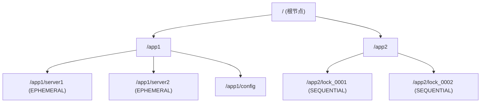
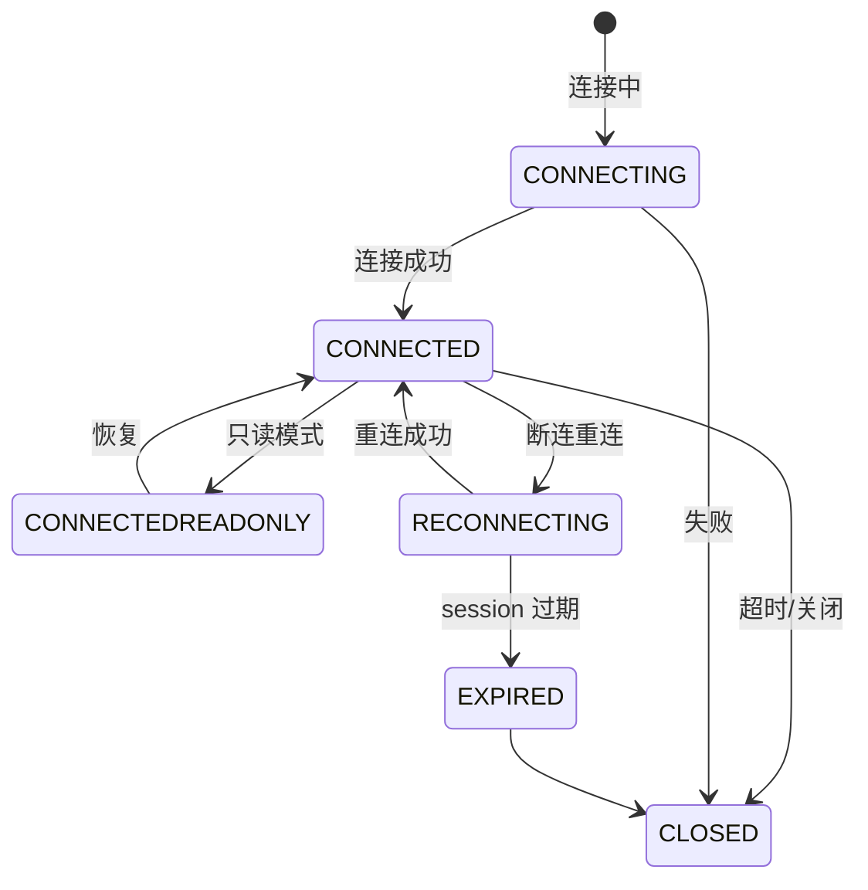
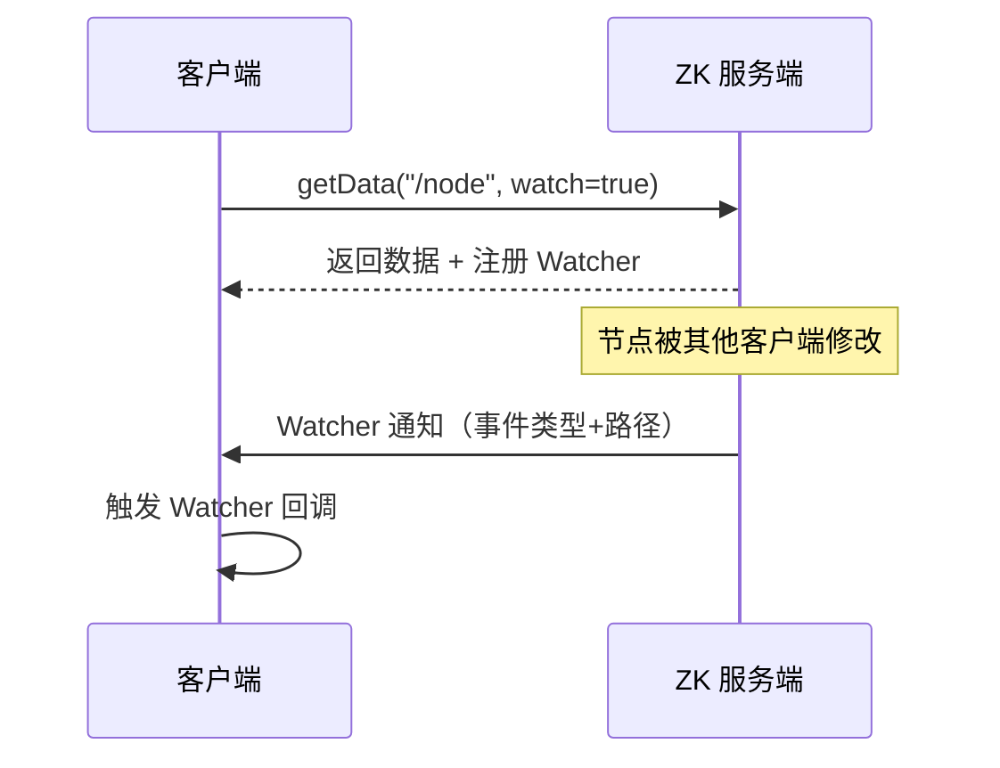
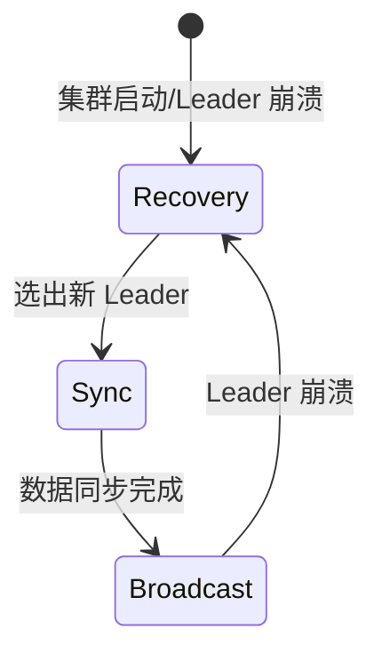
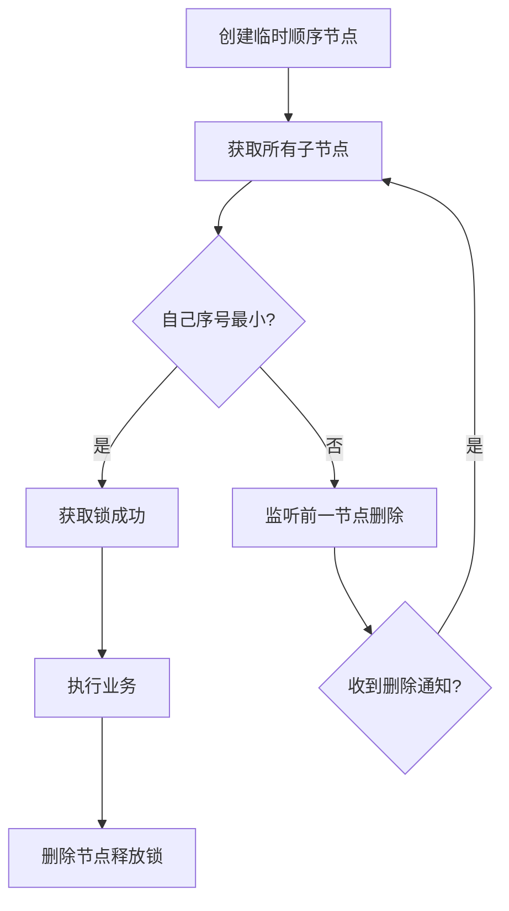
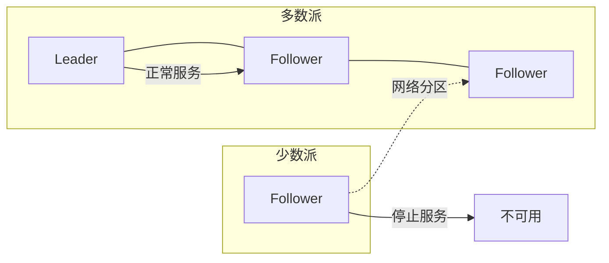
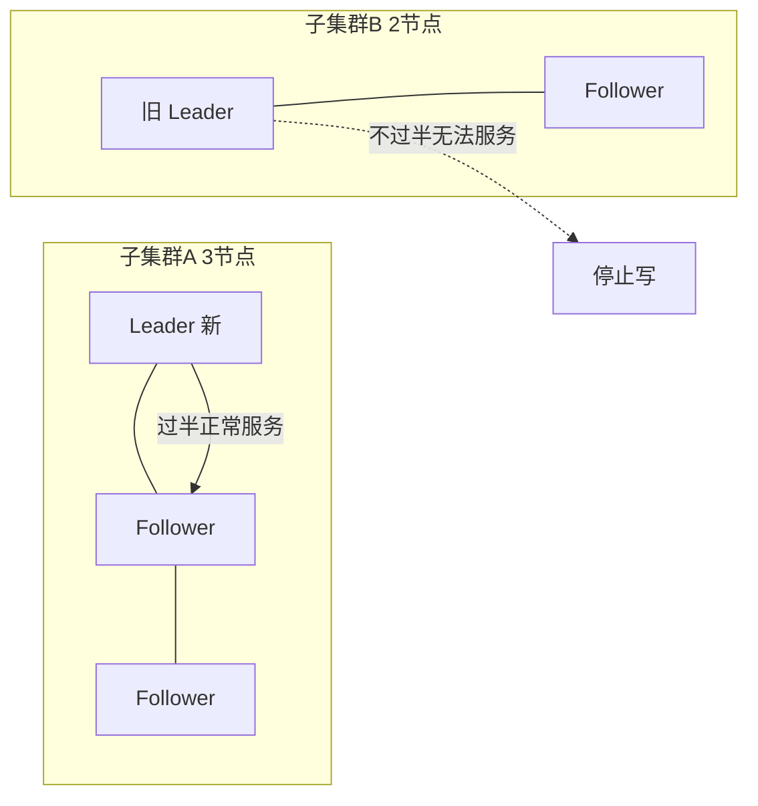

# ZooKeeper 高频面试题与详细回答

> 文档定位：系统梳理 ZooKeeper 在分布式系统中的核心面试问题，涵盖架构原理、ZAB 协议、节点特性、Watcher 机制、应用场景（注册中心/分布式锁/选主）、一致性保证、性能优化等高频考点。
>
> 适用人群：Java 后端工程师，尤其是使用 Dubbo、Kafka、Hadoop 等依赖 ZK 的分布式系统开发者。
>
> 阅读建议：先掌握 ZK 核心数据结构与协议（一至三章），再学习 Watcher 与应用场景（四至六章），最后攻克 ZAB 一致性协议（第七章）。重点关注「ZAB 协议」「Watcher 机制」「分布式锁实现」「与 Nacos/Etcd 对比」四大核心模块。

***

## 目录

- [一、ZooKeeper 基础概念](#一zookeeper-基础概念)

  - [Q1. ZooKeeper 是什么？解决什么问题？](#q1-zookeeper-是什么解决什么问题)

  - [Q2. ZooKeeper 数据模型（Znode）？](#q2-zookeeper-数据模型znode)

  - [Q3. Znode 的类型有哪些？](#q3-znode-的类型有哪些)

  - [Q4. ZooKeeper 会话（Session）机制？](#q4-zookeeper-会话session机制)

- [二、核心特性与 API](#二核心特性与-api)

  - [Q5. ZooKeeper 的核心 API？](#q5-zookeeper-的核心-api)

  - [Q6. ACL 权限控制？](#q6-acl-权限控制)

  - [Q7. 顺序节点的实现与应用？](#q7-顺序节点的实现与应用)

- [三、Watcher 监听机制](#三watcher-监听机制)

  - [Q8. Watcher 机制原理？](#q8-watcher-机制原理)

  - [Q9. Watcher 的特性（一次性/顺序性）？](#q9-watcher-的特性一次性顺序性)

  - [Q10. 客户端如何使用 Watcher？](#q10-客户端如何使用-watcher)

- [四、ZAB 一致性协议](#四zab-一致性协议)

  - [Q11. ZAB 协议是什么？与 Paxos/Raft 的区别？](#q11-zab-协议是什么与-paxosraft-的区别)

  - [Q12. ZAB 的三种模式？](#q12-zab-的三种模式)

  - [Q13. Zookeeper Leader 选举过程？](#q13-zookeeper-leader-选举过程)

  - [Q14. ZAB 消息广播（写流程）？](#q14-zab-消息广播写流程)

- [五、ZooKeeper 应用场景](#五zookeeper-应用场景)

  - [Q15. 如何用 ZK 实现分布式锁？](#q15-如何用-zk-实现分布式锁)

  - [Q16. 如何用 ZK 实现服务注册与发现？](#q16-如何用-zk-实现服务注册与发现)

  - [Q17. 如何用 ZK 实现 Master 选主？](#q17-如何用-zk-实现-master-选主)

  - [Q18. 如何用 ZK 实现配置中心？](#q18-如何用-zk-实现配置中心)

- [六、ZooKeeper 集群与一致性](#六zookeeper-集群与一致性)

  - [Q19. ZK 集群节点数为什么建议奇数？](#q19-zk-集群节点数为什么建议奇数)

  - [Q20. ZK 的一致性保证（顺序一致性/最终一致性）？](#q20-zk-的一致性保证顺序一致性最终一致性)

  - [Q21. ZK 的 CAP 取舍？](#q21-zk-的-cap-取舍)

  - [Q22. ZK 与 Nacos/Etcd/Consul 的对比？](#q22-zk-与-nacosetcdconsul-的对比)

- [七、性能优化与运维](#七性能优化与运维)

  - [Q23. ZK 性能优化有哪些手段？](#q23-zk-性能优化有哪些手段)

  - [Q24. ZK 如何处理脑裂（Split-Brain）？](#q24-zk-如何处理脑裂split-brain)

  - [Q25. ZK 集群扩容与数据迁移？](#q25-zk-集群扩容与数据迁移)

- [八、综合实战题](#八综合实战题)

  - [Q26. 设计一个基于 ZK 的分布式锁（带公平性/超时/续期）？](#q26-设计一个基于-zk-的分布式锁带公平性超时续期)

  - [Q27. ZK 实现分布式锁和 Redis 实现的区别？](#q27-zk-实现分布式锁和-redis-实现的区别)

  - [Q28. Curator 框架的核心功能？](#q28-curator-框架的核心功能)

- [九、速答与踩坑总结](#九速答与踩坑总结)

  - [9.1 速答卡片](#91-速答卡片)

  - [9.2 实战踩坑 10 例](#92-实战踩坑-10-例)

  - [9.3 复习优先级表](#93-复习优先级表)

***

## 一、ZooKeeper 基础概念

### Q1. ZooKeeper 是什么？解决什么问题？

#### 核心答案

ZooKeeper 是一个**分布式协调服务**，通过提供类似文件系统的树状数据结构和监听机制，解决分布式系统中的**一致性协调**问题。

#### 解决的核心问题

| 问题            | ZK 方案                   |
| ------------- | ----------------------- |
| **服务注册与发现**   | 临时节点 + Watcher          |
| **分布式锁**      | 顺序临时节点 + Watcher        |
| **Master 选主** | 抢建临时节点                  |
| **配置管理**      | Znode 存储配置 + Watcher 推送 |
| **集群管理**      | 临时节点存活检测                |
| **分布式队列/屏障**  | 顺序节点                    |
| **命名服务**      | 顺序节点生成唯一 ID             |

#### 核心特性

```
1. 顺序一致性：客户端请求按发送顺序执行
2. 原子性：更新要么成功要么失败
3. 单一视图：客户端连到哪个节点看到相同数据
4. 可靠性：一旦更新成功将持久化
5. 实时性：客户端在一定时间内能读到最新数据
```

***

### Q2. ZooKeeper 数据模型（Znode）？

#### 树状结构



#### Znode 结构

每个 Znode 包含：

| 部分           | 说明                |
| ------------ | ----------------- |
| **data**     | 存储的数据（默认 1MB）     |
| **ACL**      | 访问控制列表            |
| **stat**     | 元数据（版本、时间戳、子节点数等） |
| **children** | 子节点列表             |

#### stat 结构

| 字段               | 说明                   |
| ---------------- | -------------------- |
| `czxid`          | 节点创建时的事务 ID          |
| `mzxid`          | 节点最后修改的事务 ID         |
| `ctime`          | 创建时间                 |
| `mtime`          | 修改时间                 |
| `version`        | 数据版本号（每次修改+1）        |
| `cversion`       | 子节点版本号               |
| `aversion`       | ACL 版本号              |
| `ephemeralOwner` | 临时节点 owner（0 表示永久节点） |
| `dataLength`     | 数据长度                 |
| `numChildren`    | 子节点数量                |

***

### Q3. Znode 的类型有哪些？

| 类型                               | 说明             | 特性     |
| -------------------------------- | -------------- | ------ |
| **PERSISTENT**（持久）               | 创建后一直存在，除非手动删除 | 默认类型   |
| **EPHEMERAL**（临时）                | 会话断开后自动删除      | 不能有子节点 |
| **PERSISTENT\_SEQUENTIAL**（持久顺序） | 持久 + 自动追加递增序号  | 序号全局递增 |
| **EPHEMERAL\_SEQUENTIAL**（临时顺序）  | 临时 + 自动追加递增序号  | 会话断开删除 |

#### 创建节点示例（Java）

```java
ZooKeeper zk = new ZooKeeper("127.0.0.1:2181", 5000, null);

// 持久节点
zk.create("/app", "data".getBytes(), Ids.OPEN_ACL_UNSAFE, CreateMode.PERSISTENT);

// 临时节点
zk.create("/app/server1", "data".getBytes(), Ids.OPEN_ACL_UNSAFE, CreateMode.EPHEMERAL);

// 持久顺序节点
zk.create("/app/lock-", "data".getBytes(), Ids.OPEN_ACL_UNSAFE, CreateMode.PERSISTENT_SEQUENTIAL);

// 临时顺序节点
zk.create("/app/lock-", "data".getBytes(), Ids.OPEN_ACL_UNSAFE, CreateMode.EPHEMERAL_SEQUENTIAL);
```

#### 关键特性

```
1. 临时节点不能有子节点
2. 顺序节点的序号由父节点维护，全局递增
3. 临时节点在 session 过期后自动删除（用于心跳检测）
4. 节点名不能包含 / 字符
```

***

### Q4. ZooKeeper 会话（Session）机制？

#### 会话状态



#### 会话核心参数

| 参数                  | 说明                   | 默认值     |
| ------------------- | -------------------- | ------- |
| `sessionTimeout`    | 会话超时时间               | 客户端设置   |
| `tickTime`          | ZK 时间单位（心跳间隔）        | 2000ms  |
| `minSessionTimeout` | 最小会话超时（2\*tickTime）  | 4000ms  |
| `maxSessionTimeout` | 最大会话超时（20\*tickTime） | 40000ms |

#### 会话保活机制

```
1. 客户端每 tickTime/3 发送一次心跳（ping）
2. 若服务端超过 sessionTimeout 未收到心跳，会话过期
3. 会话过期后，该会话的临时节点全部删除
4. 客户端重连时需带原 sessionId，若已过期则重新建立
```

***

## 二、核心特性与 API

### Q5. ZooKeeper 的核心 API？

| API                 | 说明        |
| ------------------- | --------- |
| `create`            | 创建节点      |
| `delete`            | 删除节点      |
| `exists`            | 判断节点是否存在  |
| `getData`           | 获取节点数据    |
| `setData`           | 设置节点数据    |
| `getChildren`       | 获取子节点列表   |
| `getACL` / `setACL` | 获取/设置 ACL |
| `sync`              | 同步数据      |

#### 示例

```java
// 创建连接
ZooKeeper zk = new ZooKeeper("127.0.0.1:2181", 5000, event -> {
    System.out.println("事件: " + event.getType());
});

// 创建节点
zk.create("/test", "hello".getBytes(), Ids.OPEN_ACL_UNSAFE, CreateMode.PERSISTENT);

// 获取数据
byte[] data = zk.getData("/test", false, null);
System.out.println(new String(data));

// 设置数据（带版本号，乐观锁）
zk.setData("/test", "world".getBytes(), -1);  // -1 表示不检查版本

// 获取子节点
List<String> children = zk.getChildren("/test", false);

// 删除节点
zk.delete("/test", -1);
```

***

### Q6. ACL 权限控制？

#### ACL 结构

```
scheme:id:permissions
```

| 维度              | 说明                                 |
| --------------- | ---------------------------------- |
| **scheme**      | 认证方式：world/auth/digest/ip          |
| **id**          | 身份标识                               |
| **permissions** | 权限位：READ/WRITE/CREATE/DELETE/ADMIN |

#### 权限位

| 权限     | 缩写 | 说明         |
| ------ | -- | ---------- |
| READ   | r  | 读取节点数据和子节点 |
| WRITE  | w  | 修改节点数据     |
| CREATE | c  | 创建子节点      |
| DELETE | d  | 删除子节点      |
| ADMIN  | a  | 设置 ACL     |

#### 内置 ACL

| ACL               | 说明                       |
| ----------------- | ------------------------ |
| `OPEN_ACL_UNSAFE` | 完全开放（world:anyone:cdrwa） |
| `CREATOR_ALL_ACL` | 创建者全部权限                  |
| `READ_ACL_UNSAFE` | 任何人只读                    |

#### 示例

```java
// IP 白名单 ACL
ACL ipAcl = new ACL(Perms.READ, new Id("ip", "192.168.1.0/24"));

// 用户名密码 ACL
zk.addAuthInfo("digest", "user:password".getBytes());
ACL digestAcl = new ACL(Perms.ALL, new Id("digest", DigestAuthenticationProvider.generateDigest("user:password")));

// 创建带 ACL 的节点
zk.create("/secure", "data".getBytes(),
    Collections.singletonList(digestAcl), CreateMode.PERSISTENT);
```

***

### Q7. 顺序节点的实现与应用？

#### 实现原理

```
顺序节点创建时，ZK 在节点名后追加 10 位数字序号
序号由父节点维护，全局单调递增
序号格式：%010d（如 0000000001）
```

#### 应用场景

| 场景            | 用法                |
| ------------- | ----------------- |
| **分布式锁**      | 创建临时顺序节点，序号最小者获取锁 |
| **分布式队列**     | 按序号顺序消费           |
| **Master 选举** | 最小序号节点为 Master    |
| **唯一 ID 生成**  | 利用序号生成全局唯一 ID     |

#### 唯一 ID 生成示例

```java
public class ZkIdGenerator {
    private final ZooKeeper zk;
    private final String path;

    public ZkIdGenerator(ZooKeeper zk, String path) {
        this.zk = zk;
        this.path = path;
    }

    public long nextId() throws Exception {
        // 创建顺序节点，不存储数据
        String node = zk.create(path + "/id-", new byte[0],
            Ids.OPEN_ACL_UNSAFE, CreateMode.PERSISTENT_SEQUENTIAL);
        // 提取序号
        String seq = node.substring(node.lastIndexOf("-") + 1);
        return Long.parseLong(seq);
    }
}
```

***

## 三、Watcher 监听机制

### Q8. Watcher 机制原理？

#### 核心答案

Watcher 是 ZK 的**发布订阅**机制：客户端在节点上注册 Watcher，当节点发生变化时，ZK 服务端通知客户端。



#### Watcher 事件类型

| 事件类型                  | 触发条件   |
| --------------------- | ------ |
| `NodeCreated`         | 节点被创建  |
| `NodeDeleted`         | 节点被删除  |
| `NodeDataChanged`     | 节点数据变更 |
| `NodeChildrenChanged` | 子节点变更  |

#### Watcher 通知

```java
Watcher watcher = event -> {
    Watcher.Event.EventType type = event.getType();
    String path = event.getPath();
    System.out.println("事件: " + type + ", 路径: " + path);

    // 一次性触发后需重新注册
    if (type == Watcher.Event.EventType.NodeDataChanged) {
        try {
            byte[] data = zk.getData(path, watcher, null);  // 重新注册
        } catch (Exception e) {
            e.printStackTrace();
        }
    }
};

byte[] data = zk.getData("/node", watcher, null);
```

***

### Q9. Watcher 的特性（一次性/顺序性）？

| 特性      | 说明                         |
| ------- | -------------------------- |
| **一次性** | Watcher 触发一次后自动移除，需重新注册    |
| **顺序性** | 通知按事件发生顺序送达                |
| **异步性** | 通知异步发送，不阻塞客户端              |
| **轻量**  | 通知只包含事件类型和路径，不包含数据         |
| **会话级** | 会话断开时 Watcher 失效，会话恢复需重新注册 |

#### 一次性问题解决

```java
// 持续监听封装
public void watchNode(String path) throws Exception {
    zk.getData(path, event -> {
        if (event.getType() == Watcher.Event.EventType.NodeDataChanged) {
            try {
                byte[] data = zk.getData(path, null, null);
                System.out.println("数据变更: " + new String(data));
                watchNode(path);  // 递归重新注册
            } catch (Exception e) {
                e.printStackTrace();
            }
        }
    }, null);
}
```

#### 可能丢失通知的场景

```
1. 客户端会话过期（需要重新注册所有 Watcher）
2. 通知发送后客户端崩溃（未收到）
3. 节点在注册 Watcher 前已变化（需先 getData 再 watch）
```

***

### Q10. 客户端如何使用 Watcher？

#### Curator 封装（推荐）

Curator 提供了 `NodeCache`、`PathChildrenCache`、`TreeCache` 解决 Watcher 一次性问题。

```xml
<dependency>
    <groupId>org.apache.curator</groupId>
    <artifactId>curator-recipes</artifactId>
    <version>5.5.0</version>
</dependency>
```

```java
// 监听单个节点数据变化
NodeCache cache = new NodeCache(client, "/config");
cache.getListenable().addListener(() -> {
    ChildData data = cache.getCurrentData();
    if (data != null) {
        System.out.println("配置变更: " + new String(data.getData()));
    }
});
cache.start();

// 监听子节点变化
PathChildrenCache childrenCache = new PathChildrenCache(client, "/servers", true);
childrenCache.getListenable().addListener((client, event) -> {
    switch (event.getType()) {
        case CHILD_ADDED:
            System.out.println("新增服务: " + event.getData().getPath());
            break;
        case CHILD_REMOVED:
            System.out.println("移除服务: " + event.getData().getPath());
            break;
        case CHILD_UPDATED:
            System.out.println("服务更新: " + event.getData().getPath());
            break;
    }
});
childrenCache.start();
```

***

## 四、ZAB 一致性协议

### Q11. ZAB 协议是什么？与 Paxos/Raft 的区别？

#### 核心答案

ZAB（ZooKeeper Atomic Broadcast）是 ZK 专用的原子广播协议，用于保证集群数据一致性。

| 维度   | ZAB                      | Paxos                     | Raft                      |
| ---- | ------------------------ | ------------------------- | ------------------------- |
| 设计目标 | 主备复制 + 崩溃恢复              | 通用一致性                     | 易理解的一致性                   |
| 节点角色 | Leader/Follower/Observer | Proposer/Acceptor/Learner | Leader/Follower/Candidate |
| 选举方式 | Leader 选举                | 多 Proposer 竞争             | Leader 选举                 |
| 日志复制 | 主从复制                     | 多数派确认                     | 主从复制                      |
| 适用场景 | ZK                       | 通用                        | 通用                        |

#### ZAB 的两个核心

```
1. 消息广播（Broadcast）：Leader 将提案发送给所有 Follower
2. 崩溃恢复（Recovery）：Leader 崩溃后重新选举并同步数据
```

***

### Q12. ZAB 的三种模式？

| 模式                  | 说明                                |
| ------------------- | --------------------------------- |
| **恢复模式（Recovery）**  | 集群启动或 Leader 崩溃时，选举新 Leader 并同步数据 |
| **广播模式（Broadcast）** | Leader 正常工作，处理客户端写请求              |
| **同步模式（Sync）**      | Follower 与 Leader 数据同步            |

#### 模式流转



***

### Q13. Zookeeper Leader 选举过程？

#### 选举触发场景

```
1. 集群启动时
2. Leader 崩溃或失联
3. 过半 Follower 与 Leader 断开
```

#### 选举流程

```mermaid
flowchart TB
    S[启动/Leader 失联] --> L1[每个节点投自己<br/>(zxid最大优先)]
    L1 --> L2[收集投票]
    L2 --> L3{过半选票?}
    L3 -->|是| L4[成为 Leader]
    L3 -->|否| L5[更新投票<br/>投给 zxid 更大的节点]
    L5 --> L2
    L4 --> L6[Leader 通知所有节点]
```

#### 投票比较规则

```
1. 优先比较 zxid（事务 ID）：zxid 大的胜出（数据最新）
2. zxid 相同则比较 myid（节点 ID）：myid 大的胜出
```

#### 选举状态

| 状态          | 说明     |
| ----------- | ------ |
| `LOOKING`   | 选举中    |
| `FOLLOWING` | 跟随者    |
| `LEADING`   | Leader |
| `OBSERVING` | 观察者    |

***

### Q14. ZAB 消息广播（写流程）？

```mermaid
sequenceDiagram
    participant C as 客户端
    participant L as Leader
    participant F as Follower

    C->>L: 写请求
    L->>L: 生成 Proposal（zxid）
    L->>F: 广播 Proposal
    F->>F: 写入事务日志
    F-->>L: ACK
    L->>L{收到过半 ACK?}
    L->>L: 提交 Commit
    L->>F: 广播 Commit
    L-->>C: 返回成功
```

#### 关键步骤

| 步骤              | 说明                     |
| --------------- | ---------------------- |
| 1. 生成 Proposal  | Leader 为请求分配全局递增 zxid  |
| 2. 广播 Proposal  | 发送给所有 Follower         |
| 3. Follower ACK | Follower 写入事务日志后返回 ACK |
| 4. 过半确认         | 收到过半 ACK 后提交           |
| 5. 广播 Commit    | 通知所有节点提交               |

#### zxid 结构

```
zxid (64位) = 高 32 位 epoch（Leader 周期） + 低 32 位 counter（事务序号）
```

***

## 五、ZooKeeper 应用场景

### Q15. 如何用 ZK 实现分布式锁？

#### 原理

```
1. 在 /locks 下创建临时顺序节点 lock-0001
2. 获取 /locks 下所有子节点
3. 若自己的序号最小，获取锁
4. 否则监听前一个节点的删除事件
5. 收到通知后回到步骤 2
```



#### 实现（Curator）

```java
InterProcessMutex lock = new InterProcessMutex(client, "/locks/my-lock");

// 获取锁
if (lock.acquire(10, TimeUnit.SECONDS)) {
    try {
        // 业务逻辑
    } finally {
        lock.release();  // 释放锁
    }
}
```

#### 原生实现

```java
public class ZkDistributedLock {
    private final ZooKeeper zk;
    private final String lockPath;
    private String currentNode;

    public ZkDistributedLock(ZooKeeper zk, String lockPath) {
        this.zk = zk;
        this.lockPath = lockPath;
    }

    public void lock() throws Exception {
        // 1. 创建临时顺序节点
        currentNode = zk.create(lockPath + "/lock-", new byte[0],
            Ids.OPEN_ACL_UNSAFE, CreateMode.EPHEMERAL_SEQUENTIAL);

        // 2. 循环尝试获取锁
        while (true) {
            List<String> children = zk.getChildren(lockPath, false);
            Collections.sort(children);
            String minNode = children.get(0);
            String myNode = currentNode.substring(lockPath.length() + 1);

            if (myNode.equals(minNode)) {
                return;  // 获取锁成功
            }

            // 3. 监听前一个节点
            String prevNode = children.get(children.indexOf(myNode) - 1);
            CountDownLatch latch = new CountDownLatch(1);
            Stat stat = zk.exists(lockPath + "/" + prevNode, event -> {
                if (event.getType() == Watcher.Event.EventType.NodeDeleted) {
                    latch.countDown();
                }
            });

            if (stat != null) {
                latch.await();  // 等待前一个节点删除
            }
        }
    }

    public void unlock() throws Exception {
        zk.delete(currentNode, -1);
    }
}
```

***

### Q16. 如何用 ZK 实现服务注册与发现？

#### 原理

```
1. 服务提供者启动时，在 /services/service-name 下创建临时节点
2. 节点数据存储服务地址和端口
3. 服务消费者监听 /services/service-name 子节点变化
4. 提供者宕机时临时节点自动删除，消费者收到通知
```

#### 实现

```java
// 服务注册
public class ServiceRegistry {
    private final ZooKeeper zk;
    private final String basePath = "/services";

    public void register(String serviceName, String address) throws Exception {
        String servicePath = basePath + "/" + serviceName;
        if (zk.exists(servicePath, false) == null) {
            zk.create(servicePath, new byte[0], Ids.OPEN_ACL_UNSAFE, CreateMode.PERSISTENT);
        }
        // 创建临时节点，会话断开自动删除
        zk.create(servicePath + "/" + address, address.getBytes(),
            Ids.OPEN_ACL_UNSAFE, CreateMode.EPHEMERAL);
    }
}

// 服务发现
public class ServiceDiscovery {
    private volatile List<String> providers = new ArrayList<>();

    public void discover(String serviceName) throws Exception {
        String path = "/services/" + serviceName;
        // 监听子节点变化
        List<String> children = zk.getChildren(path, event -> {
            if (event.getType() == Watcher.Event.EventType.NodeChildrenChanged) {
                try {
                    updateProviders(path);
                } catch (Exception e) {
                    e.printStackTrace();
                }
            }
        });
        providers = children;
    }

    private void updateProviders(String path) throws Exception {
        providers = zk.getChildren(path, true);
    }
}
```

***

### Q17. 如何用 ZK 实现 Master 选主？

#### 原理

```
1. 多个节点竞争创建 /master 临时节点
2. 创建成功者成为 Master
3. 失败者监听 /master 节点删除
4. Master 宕机后临时节点删除，其他节点重新竞争
```

#### 实现

```java
public class MasterElection {
    private final ZooKeeper zk;
    private final String masterPath = "/master";
    private boolean isMaster = false;

    public void tryElect() throws Exception {
        try {
            // 尝试创建临时节点
            zk.create(masterPath, "server-1".getBytes(),
                Ids.OPEN_ACL_UNSAFE, CreateMode.EPHEMERAL);
            isMaster = true;
            System.out.println("成为 Master");
        } catch (KeeperException.NodeExistsException e) {
            // 节点已存在，监听删除
            isMaster = false;
            Stat stat = zk.exists(masterPath, event -> {
                if (event.getType() == Watcher.Event.EventType.NodeDeleted) {
                    try {
                        tryElect();  // Master 宕机，重新选举
                    } catch (Exception ex) {
                        ex.printStackTrace();
                    }
                }
            });
            if (stat == null) {
                tryElect();  // 节点已被删除，重新尝试
            }
        }
    }
}
```

***

### Q18. 如何用 ZK 实现配置中心？

#### 原理

```
1. 配置存储在 /config 节点
2. 客户端启动时读取配置并注册 Watcher
3. 配置变更时客户端收到通知，重新拉取
```

#### 实现

```java
public class ZkConfigCenter {
    private final ZooKeeper zk;
    private final String configPath = "/config";
    private volatile Properties config = new Properties();

    public void init() throws Exception {
        // 读取配置
        byte[] data = zk.getData(configPath, event -> {
            if (event.getType() == Watcher.Event.EventType.NodeDataChanged) {
                try {
                    loadConfig();  // 配置变更，重新加载
                } catch (Exception e) {
                    e.printStackTrace();
                }
            }
        }, null);
        config.load(new ByteArrayInputStream(data));
    }

    private void loadConfig() throws Exception {
        byte[] data = zk.getData(configPath, true, null);
        Properties newConfig = new Properties();
        newConfig.load(new ByteArrayInputStream(data));
        config = newConfig;
        System.out.println("配置已更新: " + config);
    }

    public String get(String key) {
        return config.getProperty(key);
    }
}
```

***

## 六、ZooKeeper 集群与一致性

### Q19. ZK 集群节点数为什么建议奇数？

#### 核心答案

ZK 集群需要**过半节点存活**才能提供服务（过半原则）。奇数节点在相同容忍度下更节省资源。

| 节点数 | 允许宕机数 | 过半数 | 说明               |
| --- | ----- | --- | ---------------- |
| 3   | 1     | 2   | 容忍 1 台宕机         |
| 4   | 1     | 3   | 容忍 1 台（与 3 节点相同） |
| 5   | 2     | 3   | 容忍 2 台宕机         |
| 6   | 2     | 4   | 容忍 2 台（与 5 节点相同） |

#### 结论

```
3 节点和 4 节点都只能容忍 1 台宕机，但 4 节点多一台成本
→ 选奇数节点更经济
→ 推荐 3 或 5 节点（7 节点用于超大规模）
```

***

### Q20. ZK 的一致性保证（顺序一致性/最终一致性）？

#### 一致性级别

| 保证         | 说明               |
| ---------- | ---------------- |
| **顺序一致性**  | 客户端的写请求按发送顺序执行   |
| **原子性**    | 更新要么成功要么失败       |
| **单一系统视图** | 客户端无论连哪个节点看到相同数据 |
| **可靠性**    | 更新一旦成功持久化        |
| **最终实时性**  | 客户端在一定时间内能读到最新数据 |

#### 读一致性

```
默认读：从任意节点读取（可能读到旧数据，最终一致）
同步读：调用 sync() 后再读（确保读到最新数据）
```

```java
// 普通读（可能读到旧数据）
byte[] data = zk.getData("/node", false, null);

// 强一致读（先同步再读）
zk.sync("/node", null, null);
byte[] data = zk.getData("/node", false, null);
```

***

### Q21. ZK 的 CAP 取舍？

#### CAP 理论

| 维度                         | 说明    |
| -------------------------- | ----- |
| **C（Consistency）**         | 一致性   |
| **A（Availability）**        | 可用性   |
| **P（Partition Tolerance）** | 分区容错性 |

#### ZK 的取舍

```
ZK 选择 CP（一致性 + 分区容错性）：
- 发生网络分区时，少数派节点停止服务（牺牲可用性）
- 保证多数派数据一致
```



#### 对比

| 系统        | CAP 取舍       |
| --------- | ------------ |
| ZooKeeper | CP           |
| Eureka    | AP           |
| Nacos     | CP + AP（可切换） |
| Etcd      | CP           |
| Consul    | CP           |

***

### Q22. ZK 与 Nacos/Etcd/Consul 的对比？

| 维度    | ZooKeeper | Nacos       | Etcd  | Consul          |
| ----- | --------- | ----------- | ----- | --------------- |
| 开发语言  | Java      | Java        | Go    | Go              |
| CAP   | CP        | CP/AP 切换    | CP    | CP              |
| 一致性协议 | ZAB       | Raft/Distro | Raft  | Raft            |
| 配置中心  | ❌（需自己实现）  | ✅ 内置        | ✅ 内置  | ✅ KV            |
| 服务发现  | ✅         | ✅           | ✅     | ✅               |
| 健康检查  | 临时节点      | 心跳/HTTP/TCP | Lease | HTTP/TCP/Script |
| 多数据中心 | ❌         | ✅           | ❌     | ✅               |
| 控制台   | 弱         | 丰富          | 中     | 丰富              |
| 性能    | 中         | 高           | 高     | 中               |

***

## 七、性能优化与运维

### Q23. ZK 性能优化有哪些手段？

| 优化手段              | 说明                        |
| ----------------- | ------------------------- |
| **快照与日志分离**       | 数据快照和事务日志放不同磁盘            |
| **JVM 参数调优**      | 堆内存设置合理，避免 GC 暂停          |
| **限制 Watcher 数量** | 过多 Watcher 占用内存           |
| **避免大节点**         | 单节点数据 < 1MB，子节点数 < 10 万   |
| **客户端连接复用**       | 避免频繁创建连接                  |
| **读写分离**          | 读请求走 Follower，写请求走 Leader |
| **Observer 节点**   | 增加读吞吐，不参与选举               |

#### 关键配置

```properties
# tickTime：心跳间隔
tickTime=2000

# 数据目录和日志目录分离
dataDir=/zk/data
dataLogDir=/zk/log

# 快照数量
autopurge.snapRetainCount=3

# 清理间隔
autopurge.purgeInterval=1

# 最大客户端连接数
maxClientCnxns=60

# 节点最大数据
jute.maxbuffer=1048576
```

***

### Q24. ZK 如何处理脑裂（Split-Brain）？

#### 什么是脑裂

```
网络分区导致集群分成两个或多个子集群
每个子集群都认为自己有合法 Leader
→ 多个 Leader 同时处理写请求 → 数据不一致
```

#### ZK 的解决方案

```
1. 过半原则：只有包含过半节点的子集群才能选举 Leader
2. epoch 机制：每个 Leader 有唯一 epoch，旧 Leader 的写入会被拒绝
3. 心跳检测：Follower 与 Leader 失去联系后进入选举状态
```



***

### Q25. ZK 集群扩容与数据迁移？

#### 扩容方式

| 方式       | 说明          | 停机    |
| -------- | ----------- | ----- |
| **滚动重启** | 逐个重启节点，修改配置 | 不中断服务 |
| **全量重启** | 所有节点同时重启    | 短暂中断  |

#### 滚动扩容步骤

```
1. 在所有节点的 zoo.cfg 中添加新节点配置
2. 逐个重启 Follower 节点
3. 最后重启 Leader 节点（触发重新选举）
4. 新节点启动后自动加入集群
```

#### 数据迁移

```
1. 停写（或使用双写）
2. 使用 zkCli.sh 的 copy 命令导出数据
3. 在新集群导入数据
4. 切换客户端连接到新集群
```

```bash
# 导出
zkCli.sh -server old-zk:2181 <<EOF
ls /
get /config
EOF

# 导入（用 Curator 或 zkCopy 工具）
java -jar zkcopy.jar --source old-zk:2181 --target new-zk:2181
```

***

## 八、综合实战题

### Q26. 设计一个基于 ZK 的分布式锁（带公平性/超时/续期）？

#### 需求

```
1. 公平锁（按申请顺序获取）
2. 支持超时获取
3. 支持锁续期（防止业务未执行完锁过期）
4. 可重入
```

#### 实现（基于 Curator InterProcessMutex）

```java
public class ZkFairLock {
    private final InterProcessMutex lock;
    private final String lockPath;

    public ZkFairLock(CuratorFramework client, String lockPath) {
        this.lock = new InterProcessMutex(client, lockPath);
        this.lockPath = lockPath;
    }

    /**
     * 获取锁（带超时）
     */
    public boolean tryLock(long timeout, TimeUnit unit) throws Exception {
        return lock.acquire(timeout, unit);
    }

    /**
     * 释放锁
     */
    public void unlock() throws Exception {
        if (lock.isOwnedByCurrentThread()) {
            lock.release();
        }
    }

    /**
     * 判断当前线程是否持有锁
     */
    public boolean isLocked() {
        return lock.isOwnedByCurrentThread();
    }
}
```

#### 手动实现带续期的锁

```java
public class RenewalZkLock {
    private final ZooKeeper zk;
    private final String lockPath;
    private final long sessionTimeout;
    private ScheduledExecutorService renewalExecutor;
    private String currentNode;

    public RenewalZkLock(ZooKeeper zk, String lockPath, long sessionTimeout) {
        this.zk = zk;
        this.lockPath = lockPath;
        this.sessionTimeout = sessionTimeout;
    }

    public boolean tryLock(long timeout, TimeUnit unit) throws Exception {
        long deadline = System.currentTimeMillis() + unit.toMillis(timeout);

        // 1. 创建临时顺序节点
        currentNode = zk.create(lockPath + "/lock-", new byte[0],
            Ids.OPEN_ACL_UNSAFE, CreateMode.EPHEMERAL_SEQUENTIAL);

        // 2. 启动续期线程（每 sessionTimeout/3 续期一次）
        startRenewal();

        // 3. 尝试获取锁
        while (System.currentTimeMillis() < deadline) {
            List<String> children = zk.getChildren(lockPath, false);
            Collections.sort(children);
            String myName = currentNode.substring(lockPath.length() + 1);

            if (myName.equals(children.get(0))) {
                return true;  // 获取锁
            }

            // 监听前一个节点
            String prev = children.get(children.indexOf(myName) - 1);
            CountDownLatch latch = new CountDownLatch(1);
            zk.exists(lockPath + "/" + prev, e -> {
                if (e.getType() == Watcher.Event.EventType.NodeDeleted) latch.countDown();
            });
            latch.await(deadline - System.currentTimeMillis(), TimeUnit.MILLISECONDS);
        }

        // 超时，删除节点
        zk.delete(currentNode, -1);
        stopRenewal();
        return false;
    }

    private void startRenewal() {
        renewalExecutor = Executors.newSingleThreadScheduledExecutor();
        renewalExecutor.scheduleAtFixedRate(() -> {
            try {
                // 重新设置数据触发节点更新（保持会话活跃）
                zk.setData(currentNode, new byte[0], -1);
            } catch (Exception e) {
                // 续期失败
            }
        }, sessionTimeout / 3, sessionTimeout / 3, TimeUnit.MILLISECONDS);
    }

    private void stopRenewal() {
        if (renewalExecutor != null) {
            renewalExecutor.shutdownNow();
        }
    }

    public void unlock() throws Exception {
        stopRenewal();
        zk.delete(currentNode, -1);
    }
}
```

***

### Q27. ZK 实现分布式锁和 Redis 实现的区别？

| 维度       | ZooKeeper 锁    | Redis 锁        |
| -------- | -------------- | -------------- |
| **一致性**  | 强一致（CP）        | 最终一致（AP）       |
| **锁可靠性** | 高（临时节点自动释放）    | 中（需设置过期时间）     |
| **公平性**  | 支持（顺序节点）       | 不支持（需自己实现）     |
| **性能**   | 低（写需过半 ACK）    | 高（内存操作）        |
| **阻塞等待** | 支持（Watcher 通知） | 轮询或 Pub/Sub    |
| **锁续期**  | 需自己实现          | Redisson 内置看门狗 |
| **复杂度**  | 中              | 低（SET NX PX）   |
| **适用场景** | 对一致性要求高、并发低    | 高并发、允许极小概率不一致  |

#### Redis 锁示例

```java
// Redis 分布式锁
String result = jedis.set(lockKey, requestId, "NX", "PX", 30000);
if ("OK".equals(result)) {
    try {
        // 业务
    } finally {
        // 释放锁（Lua 脚本保证原子性）
        String script = "if redis.call('get', KEYS[1]) == ARGV[1] then return redis.call('del', KEYS[1]) else return 0 end";
        jedis.eval(script, Collections.singletonList(lockKey), Collections.singletonList(requestId));
    }
}
```

#### 选型建议

```
高一致性、低并发 → ZK 锁
高并发、允许极小概率不一致 → Redis 锁
需要公平锁 → ZK 锁
需要自动续期 → Redisson（Redis）
```

***

### Q28. Curator 框架的核心功能？

#### Curator 是什么

Curator 是 Netflix 开源的 ZK 客户端，封装了原生 ZK API 的复杂性，提供了更易用的接口和常用 recipe。

#### 核心模块

| 模块                    | 说明                  |
| --------------------- | ------------------- |
| **curator-framework** | 核心客户端，链式 API        |
| **curator-recipes**   | 常用 recipe（锁、选举、队列等） |
| **curator-client**    | 底层客户端               |

#### 常用 Recipe

| Recipe                  | 说明                   |
| ----------------------- | -------------------- |
| `InterProcessMutex`     | 分布式可重入锁              |
| `InterProcessSemaphore` | 分布式信号量               |
| `LeaderSelector`        | Leader 选举            |
| `DistributedQueue`      | 分布式队列                |
| `DistributedBarrier`    | 分布式屏障                |
| `NodeCache`             | 节点缓存（解决 Watcher 一次性） |
| `PathChildrenCache`     | 子节点缓存                |
| `TreeCache`             | 整棵树缓存                |

#### 客户端示例

```java
// 创建客户端（重连策略 + 命名空间）
CuratorFramework client = CuratorFrameworkFactory.builder()
    .connectString("127.0.0.1:2181")
    .sessionTimeoutMs(5000)
    .connectionTimeoutMs(3000)
    .retryPolicy(new ExponentialBackoffRetry(1000, 3))
    .namespace("myapp")  // 命名空间，所有路径前加 /myapp
    .build();

client.start();

// 链式 API
client.create()
    .creatingParentsIfNeeded()
    .withMode(CreateMode.PERSISTENT)
    .forPath("/test", "data".getBytes());

byte[] data = client.getData().forPath("/test");

client.close();
```

***

## 九、速答与踩坑总结

### 9.1 速答卡片

**Q：ZooKeeper 是什么？**
A：分布式协调服务，提供树状数据结构 + Watcher 机制，解决分布式一致性问题。

**Q：Znode 有哪几种类型？**
A：持久、临时、持久顺序、临时顺序。

**Q：临时节点有什么用？**
A：会话断开自动删除，用于心跳检测、服务注册、分布式锁。

**Q：Watcher 是一次性的吗？**
A：是，触发一次后自动移除，需重新注册。

**Q：ZK 集群为什么建议奇数节点？**
A：过半原则，奇数节点更节省资源（3 和 4 都只能容忍 1 台宕机）。

**Q：ZAB 协议是什么？**
A：ZK 原子广播协议，保证集群数据一致性，包含消息广播和崩溃恢复。

**Q：ZK 是 CP 还是 AP？**
A：CP（一致性 + 分区容错），网络分区时少数派停止服务。

**Q：ZK 如何实现分布式锁？**
A：临时顺序节点 + 监听前一个节点删除，序号最小者获锁。

**Q：ZK 分布式锁和 Redis 锁的区别？**
A：ZK 强一致、支持公平、性能低；Redis 高并发、需自己处理过期。

**Q：ZK 怎么处理脑裂？**
A：过半原则 + epoch 机制，只有过半节点的子集群能服务。

**Q：Curator 解决了什么问题？**
A：封装 ZK 原生 API 复杂性，提供分布式锁、选举、队列等常用 recipe。

***

### 9.2 实战踩坑 10 例

| #  | 场景           | 现象             | 根因                | 解决                        |
| -- | ------------ | -------------- | ----------------- | ------------------------- |
| 1  | 服务注册后失联      | 临时节点未删除        | sessionTimeout 太长 | 调小 sessionTimeout         |
| 2  | Watcher 丢失通知 | 数据变更没收到        | Watcher 一次性，未重新注册 | 用 Curator NodeCache       |
| 3  | 分布式锁不释放      | 节点一直存在         | 客户端未正确删除节点        | 用 try-finally 释放          |
| 4  | 连接频繁断开       | session 过期     | 网络延迟导致心跳超时        | 调大 sessionTimeout + 重连策略  |
| 5  | 性能差          | 读写都很慢          | 所有请求打 Leader      | 读走 Follower，写走 Leader     |
| 6  | 脑裂导致数据不一致    | 两个 Leader      | 网络分区 + 过半配置错误     | 确保集群节点数配置正确               |
| 7  | 节点数据丢失       | 重启后数据没了        | dataDir 配置错误或快照损坏 | 检查 dataDir，定期备份快照         |
| 8  | 子节点过多        | getChildren 超时 | 节点数超 10 万         | 分桶存储（按 hash 分目录）          |
| 9  | Curator 连接失败 | 无法连接 ZK        | 命名空间路径不存在         | 用 creatingParentsIfNeeded |
| 10 | 锁顺序错乱        | 公平锁不按顺序        | 子节点列表未排序          | Collections.sort 后取最小     |

***

### 9.3 复习优先级表

| 优先级    | 主题              | 考察概率 | 建议复习时间 |
| ------ | --------------- | ---- | ------ |
| **P0** | ZAB 协议与选举       | 90%  | 1h     |
| **P0** | Watcher 机制      | 90%  | 30min  |
| **P0** | 分布式锁实现          | 95%  | 1h     |
| **P0** | Znode 类型与应用     | 85%  | 30min  |
| **P1** | CAP 取舍          | 80%  | 15min  |
| **P1** | 集群节点数奇数         | 75%  | 15min  |
| **P1** | 与 Nacos/Etcd 对比 | 70%  | 30min  |
| **P1** | Master 选主       | 70%  | 30min  |
| **P2** | 配置中心实现          | 55%  | 30min  |
| **P2** | Curator 框架      | 50%  | 30min  |
| **P2** | 服务注册发现          | 60%  | 30min  |
| **P3** | 脑裂处理            | 45%  | 30min  |
| **P3** | 性能优化与运维         | 40%  | 30min  |

```mermaid
flowchart LR
    P0[ZAB协议与选举] --> P0a[Watcher机制]
    P0a --> P0b[分布式锁实现]
    P0b --> P0c[Znode类型与应用]
    P0c --> P1a[CAP取舍]
    P1a --> P1b[奇数节点]
    P1b --> P1c[与Nacos/Etcd对比]
    P1c --> P1d[Master选主]
    P1d --> P2a[配置中心]
    P2a --> P2b[Curator框架]
    P2b --> P2c[服务注册发现]
    P2c --> P3a[脑裂处理]
    P3a --> P3b[性能优化与运维]

    style P0 fill:#f8d7da,stroke-width:3px
    style P0a fill:#f8d7da,stroke-width:3px
    style P0b fill:#f8d7da,stroke-width:3px
    style P0c fill:#f8d7da,stroke-width:3px
```



