# Spring Boot 全面详解：核心概念·架构设计·自动配置·场景应用·测试·部署

> **文档定位**:本文是 Spring Boot 的**系统性学习参考文档**,面向 Java 开发者(初中高级均适用),从核心概念到架构原理、从环境搭建到部署上线,全面覆盖 Spring Boot 开发的完整知识体系。内容编排遵循**由浅入深、理论结合实践**的原则,每个知识点均配套代码示例与配置样例。
>
> **关联文档**(建议一并阅读):
> - [Spring-Boot-MyBatis-Maven-MVC整合指南](./Spring-Boot-MyBatis-Maven-MVC整合指南.md) — Spring Boot + MyBatis 整合实战
> - [../基本语法/SpringBoot面试题汇总](../基本语法/SpringBoot面试题汇总.md) — Spring Boot 面试题精解
> - [../基本语法/SpringBoot面试题汇总](../基本语法/SpringBoot面试题汇总.md) — Spring Boot 面试题补充
> - [../高级Java工程师面试题](../高级Java工程师面试题.md) — 高级面试题中的 Spring Boot 部分

---

## 目录

- [一、Spring Boot 概述](#一spring-boot-概述)
  - [1.1 什么是 Spring Boot](#11-什么是-spring-boot)
  - [1.2 Spring Boot 与 Spring Framework 的关系](#12-spring-boot-与-spring-framework-的关系)
  - [1.3 为什么选择 Spring Boot](#13-为什么选择-spring-boot)
- [二、核心概念与设计理念](#二核心概念与设计理念)
  - [2.1 约定优于配置](#21-约定优于配置)
  - [2.2 起步依赖（Starter）](#22-起步依赖starter)
  - [2.3 内嵌服务器](#23-内嵌服务器)
  - [2.4 生产就绪（Production-Ready）](#24-生产就绪production-ready)
- [三、系统架构设计](#三系统架构设计)
  - [3.1 Spring Boot 分层架构](#31-spring-boot-分层架构)
  - [3.2 Spring Boot 启动流程](#32-spring-boot-启动流程)
  - [3.3 Bean 生命周期与 IoC 容器](#33-bean-生命周期与-ioc-容器)
- [四、开发环境搭建](#四开发环境搭建)
  - [4.1 JDK 安装与配置](#41-jdk-安装与配置)
  - [4.2 Maven/Gradle 配置](#42-mavengradle-配置)
  - [4.3 IDE 选择与配置](#43-ide-选择与配置)
  - [4.4 创建第一个 Spring Boot 项目](#44-创建第一个-spring-boot-项目)
- [五、基础项目结构解析](#五基础项目结构解析)
  - [5.1 标准目录结构](#51-标准目录结构)
  - [5.2 启动类详解](#52-启动类详解)
  - [5.3 资源文件说明](#53-资源文件说明)
- [六、依赖管理](#六依赖管理)
  - [6.1 Spring Boot Starter 体系](#61-spring-boot-starter-体系)
  - [6.2 版本管理（BOM）](#62-版本管理bom)
  - [6.3 常用依赖清单](#63-常用依赖清单)
- [七、自动配置原理](#七自动配置原理)
  - [7.1 @EnableAutoConfiguration 原理](#71-enableautoconfiguration-原理)
  - [7.2 自动配置加载机制](#72-自动配置加载机制)
  - [7.3 条件注解详解](#73-条件注解详解)
  - [7.4 自定义自动配置](#74-自定义自动配置)
- [八、常用注解说明](#八常用注解说明)
  - [8.1 核心注解](#81-核心注解)
  - [8.2 Web 注解](#82-web-注解)
  - [8.3 数据访问注解](#83-数据访问注解)
  - [8.4 配置注解](#84-配置注解)
- [九、配置方式](#九配置方式)
  - [9.1 application.properties 配置](#91-applicationproperties-配置)
  - [9.2 application.yml 配置](#92-applicationyml-配置)
  - [9.3 多环境配置（Profile）](#93-多环境配置profile)
  - [9.4 外部化配置加载顺序](#94-外部化配置加载顺序)
  - [9.5 自定义配置属性绑定](#95-自定义配置属性绑定)
- [十、Web 开发](#十web-开发)
  - [10.1 RESTful API 开发](#101-restful-api-开发)
  - [10.2 参数校验](#102-参数校验)
  - [10.3 全局异常处理](#103-全局异常处理)
  - [10.4 统一响应封装](#104-统一响应封装)
  - [10.5 跨域处理](#105-跨域处理)
- [十一、数据访问](#十一数据访问)
  - [11.1 Spring Data JPA](#111-spring-data-jpa)
  - [11.2 MyBatis 整合](#112-mybatis-整合)
  - [11.3 事务管理](#113-事务管理)
  - [11.4 连接池配置](#114-连接池配置)
- [十二、安全认证](#十二安全认证)
  - [12.1 Spring Security 快速入门](#121-spring-security-快速入门)
  - [12.2 JWT 认证实现](#122-jwt-认证实现)
- [十三、测试方法](#十三测试方法)
  - [13.1 单元测试](#131-单元测试)
  - [13.2 集成测试](#132-集成测试)
  - [13.3 Web 层测试（MockMvc）](#133-web-层测试mockmvc)
  - [13.4 测试数据库](#134-测试数据库)
- [十四、部署流程](#十四部署流程)
  - [14.1 打包方式（JAR/WAR）](#141-打包方式jarwar)
  - [14.2 Docker 容器化部署](#142-docker-容器化部署)
  - [14.3 生产环境配置建议](#143-生产环境配置建议)
- [十五、Actuator 监控](#十五actuator-监控)
  - [15.1 Actuator 端点](#151-actuator-端点)
  - [15.2 健康检查](#152-健康检查)
  - [15.3 自定义监控指标](#153-自定义监控指标)

---

## 一、Spring Boot 概述

### 1.1 什么是 Spring Boot

Spring Boot 是 Pivotal 团队开发的、基于 Spring 框架的**快速应用开发框架**。它通过"约定优于配置"的设计理念，极大地简化了 Spring 应用的初始搭建和开发过程，让开发者能够**"只需运行（Just Run）"**即可启动独立的、生产级别的 Spring 应用。

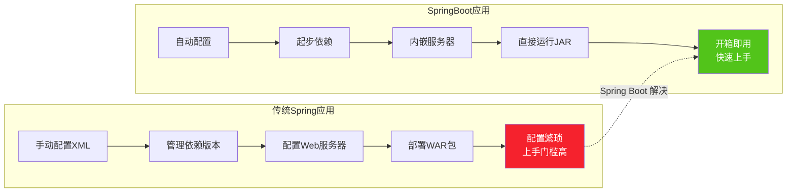

### 1.2 Spring Boot 与 Spring Framework 的关系

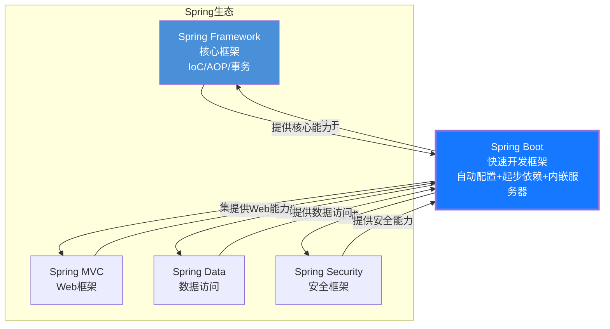

**关系总结**:

| 对比维度 | Spring Framework | Spring Boot |
|---------|------------------|-------------|
| **定位** | 基础框架，提供 IoC/AOP 等核心能力 | 快速开发框架，简化 Spring 应用开发 |
| **配置方式** | 大量 XML/Java 配置 | 自动配置 + 约定优于配置 |
| **依赖管理** | 手动管理版本 | 起步依赖（Starter）统一版本 |
| **Web 服务器** | 需外部部署 Tomcat 等 | 内嵌 Tomcat/Jetty/Undertow |
| **部署方式** | WAR 包部署到容器 | JAR 包直接运行 |
| **关系** | Spring Boot **基于** Spring Framework，不是替代 | — |

### 1.3 为什么选择 Spring Boot

| 优势 | 说明 |
|------|------|
| **快速开发** | 分钟级创建可运行项目，专注业务代码 |
| **自动配置** | 根据依赖自动配置 Bean，减少 90% 配置代码 |
| **内嵌服务器** | 无需安装 Tomcat，`java -jar` 即可启动 |
| **生产就绪** | Actuator 提供健康检查、监控指标等运维端点 |
| **生态丰富** | 与 Spring Cloud/Security/Data/DataFlow 无缝集成 |
| **社区活跃** | 全球最流行的 Java 框架，文档完善、社区活跃 |
| **版本统一** | Starter 统一管理依赖版本，杜绝版本冲突 |

---

## 二、核心概念与设计理念

### 2.1 约定优于配置

Spring Boot 的核心理念是**"约定优于配置"（Convention over Configuration）**。框架提供了一套合理的默认配置，开发者只需在需要偏离默认值时才进行显式配置。

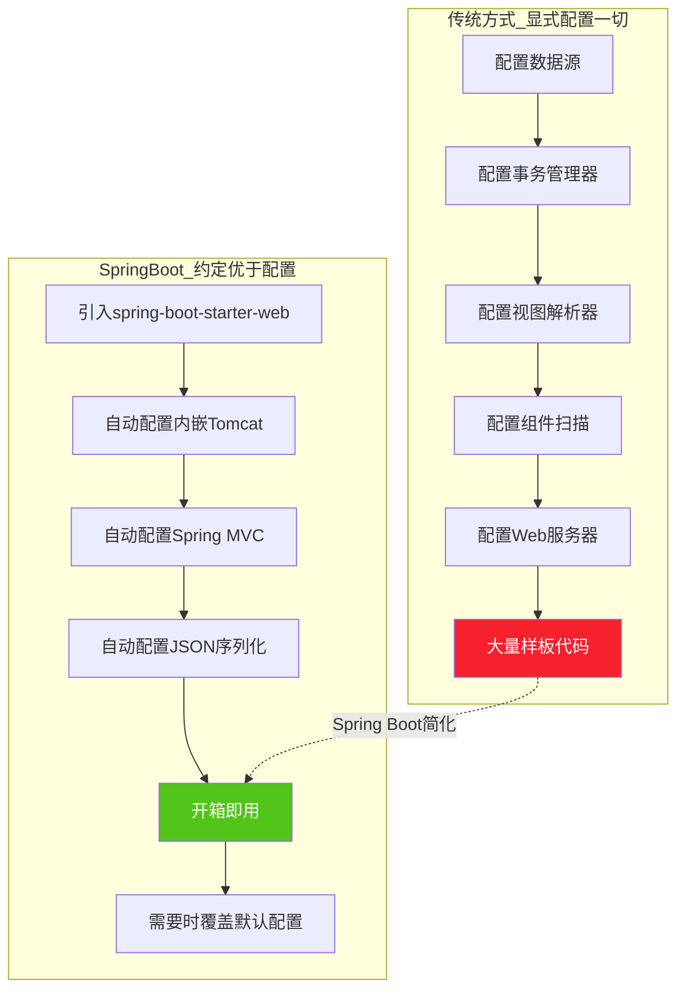

**示例：数据源自动配置**

```java
// 传统 Spring：需要手动配置数据源
@Bean
public DataSource dataSource() {
    DriverManagerDataSource ds = new DriverManagerDataSource();
    ds.setDriverClassName("com.mysql.cj.jdbc.Driver");
    ds.setUrl("jdbc:mysql://localhost:3306/mydb");
    ds.setUsername("root");
    ds.setPassword("123456");
    return ds;
}

// Spring Boot：只需在 application.yml 中配置
// spring:
//   datasource:
//     url: jdbc:mysql://localhost:3306/mydb
//     username: root
//     password: 123456
// 框架自动创建 DataSource Bean，无需写任何 Java 代码
```

### 2.2 起步依赖（Starter）

起步依赖是 Spring Boot 的核心创新之一。它将**某一功能场景所需的全部依赖打包为一个 Starter POM**，开发者只需引入一个依赖即可获得该场景下的全部库。

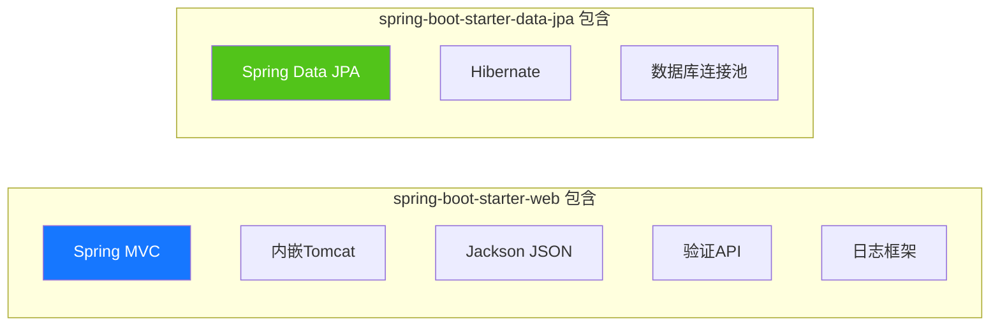

```xml
<!-- 引入一个依赖，获得整个 Web 开发栈 -->
<dependency>
    <groupId>org.springframework.boot</groupId>
    <artifactId>spring-boot-starter-web</artifactId>
</dependency>

<!-- 引入一个依赖，获得完整 JPA 数据访问栈 -->
<dependency>
    <groupId>org.springframework.boot</groupId>
    <artifactId>spring-boot-starter-data-jpa</artifactId>
</dependency>
```

> **注意**：Starter 依赖**不需要指定版本号**，版本由 Spring Boot 父 POM（`spring-boot-starter-parent`）统一管理。

### 2.3 内嵌服务器

Spring Boot 内嵌了三种 Web 服务器，默认使用 Tomcat，无需部署 WAR 包到外部容器。

| 服务器 | 默认 | 特点 | 适用场景 |
|-------|:----:|------|---------|
| **Tomcat** | ✅ | 最流行、稳定、社区活跃 | 通用 Web 应用（默认选择） |
| **Jetty** | — | 轻量级、启动快 | 对启动速度要求高的场景 |
| **Undertow** | — | 高性能、低内存 | 高并发、资源敏感型场景 |

```xml
<!-- 切换为 Jetty：排除 Tomcat，引入 Jetty -->
<dependency>
    <groupId>org.springframework.boot</groupId>
    <artifactId>spring-boot-starter-web</artifactId>
    <exclusions>
        <exclusion>
            <groupId>org.springframework.boot</groupId>
            <artifactId>spring-boot-starter-tomcat</artifactId>
        </exclusion>
    </exclusions>
</dependency>
<dependency>
    <groupId>org.springframework.boot</groupId>
    <artifactId>spring-boot-starter-jetty</artifactId>
</dependency>
```

### 2.4 生产就绪（Production-Ready）

Spring Boot Actuator 提供**生产级别的运维监控能力**，包括健康检查、运行指标、环境信息、线程转储等。

```xml
<dependency>
    <groupId>org.springframework.boot</groupId>
    <artifactId>spring-boot-starter-actuator</artifactId>
</dependency>
```

```yaml
# application.yml — 暴露所有监控端点
management:
  endpoints:
    web:
      exposure:
        include: "*"    # 暴露所有端点（生产环境应按需暴露）
  endpoint:
    health:
      show-details: always  # 显示健康检查详情
```

| 端点 | 路径 | 说明 |
|------|------|------|
| health | `/actuator/health` | 应用健康状态 |
| info | `/actuator/info` | 应用基本信息 |
| metrics | `/actuator/metrics` | 运行指标（内存/线程/请求） |
| env | `/actuator/env` | 环境变量与配置 |
| loggers | `/actuator/loggers` | 日志级别管理 |
| threaddump | `/actuator/threaddump` | 线程转储 |
| beans | `/actuator/beans` | 所有 Bean 列表 |

---

## 三、系统架构设计

### 3.1 Spring Boot 分层架构

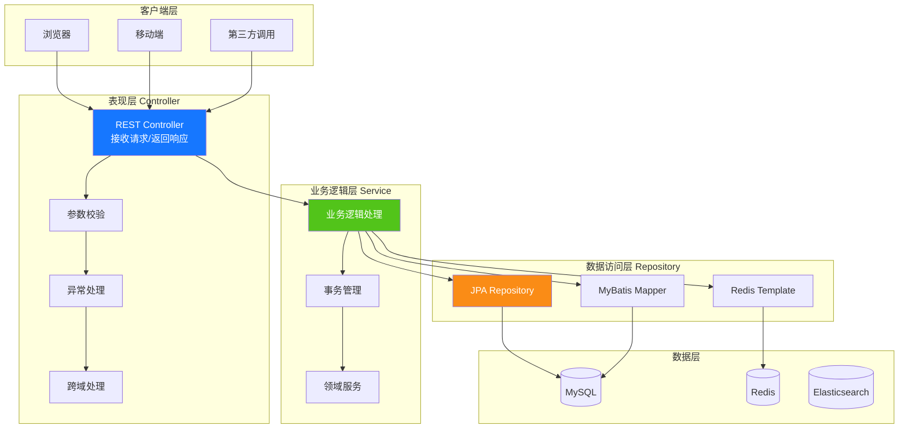

### 3.2 Spring Boot 启动流程

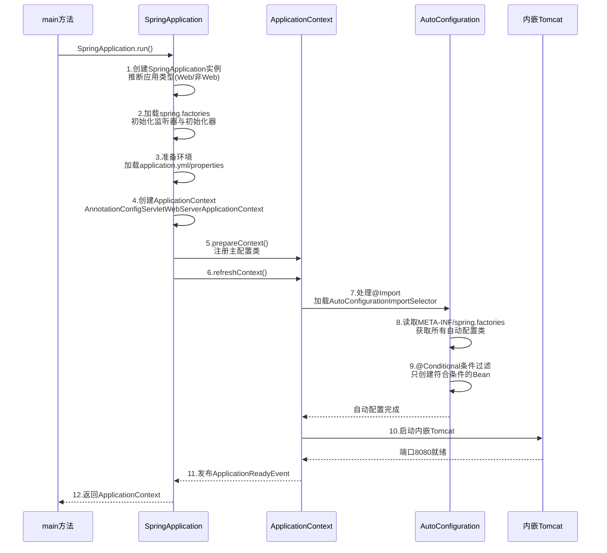

**启动流程关键步骤详解**:

```java
@SpringBootApplication  // 组合注解，触发自动配置
public class MyApplication {
    public static void main(String[] args) {
        // SpringApplication.run 内部执行流程:
        // 1. 推断应用类型（Servlet Web / Reactive Web / 非Web）
        // 2. 加载 spring.factories 中的初始化器和监听器
        // 3. 创建并配置 Environment（加载配置文件）
        // 4. 创建 ApplicationContext
        // 5. refreshContext（核心：IoC容器初始化 + 自动配置）
        // 6. 启动内嵌Web服务器
        // 7. 发布 ApplicationStartedEvent / ApplicationReadyEvent
        SpringApplication.run(MyApplication.class, args);
    }
}
```

### 3.3 Bean 生命周期与 IoC 容器

```mermaid
flowchart TB
    subgraph Bean生命周期
        L1[实例化<br/>Instantiation] --> L2[属性注入<br/>Populate Properties]
        L2 --> L3[BeanNameAware<br/>BeanFactoryAware]
        L3 --> L4[BeanPostProcessor<br/>前置处理]
        L4 --> L5[初始化<br/>@PostConstruct/InitializingBean/init-method]
        L5 --> L6[BeanPostProcessor<br/>后置处理<br/>AOP代理在此生成]
        L6 --> L7[Bean就绪<br/>可被使用]
        L7 --> L8[销毁<br/>@PreDestroy/DisposableBean/destroy-method]
    end
    
    style L1 fill:#1677ff,color:#fff
    style L5 fill:#52c41a,color:#fff
    style L6 fill:#fa8c16,color:#fff
    style L8 fill:#f5222d,color:#fff
```

---

## 四、开发环境搭建

### 4.1 JDK 安装与配置

| 项目 | 说明 |
|------|------|
| **推荐版本** | JDK 17 或 JDK 21（LTS 版本） |
| **最低要求** | Spring Boot 3.x 要求 JDK 17+；Spring Boot 2.x 支持 JDK 8+ |
| **下载地址** | [Oracle JDK](https://www.oracle.com/java/technologies/downloads/) 或 [OpenJDK (Adoptium)](https://adoptium.net/) |

```bash
# 验证 JDK 安装
java -version
# 输出示例:
# openjdk version "17.0.10" 2024-01-16
# OpenJDK Runtime Environment Temurin-17.0.10+7
# OpenJDK 64-Bit Server VM Temurin-17.0.10+7
```

**环境变量配置**:

```bash
# Windows 系统环境变量
JAVA_HOME=C:\Program Files\Java\jdk-17
PATH=%JAVA_HOME%\bin;%PATH%

# Linux/Mac
export JAVA_HOME=/usr/lib/jvm/java-17-openjdk
export PATH=$JAVA_HOME/bin:$PATH
```

### 4.2 Maven/Gradle 配置

#### Maven 配置

```bash
# 验证 Maven
mvn -v
```

**配置阿里云镜像**（编辑 `~/.m2/settings.xml`）:

```xml
<settings>
  <mirrors>
    <mirror>
      <id>aliyunmaven</id>
      <mirrorOf>*</mirrorOf>
      <name>阿里云公共仓库</name>
      <url>https://maven.aliyun.com/repository/public</url>
    </mirror>
  </mirrors>
</settings>
```

#### Gradle 配置（可选）

```bash
# 验证 Gradle
gradle -v
```

**配置阿里云镜像**（编辑 `~/.gradle/init.gradle`）:

```groovy
allprojects {
    repositories {
        maven { url 'https://maven.aliyun.com/repository/public' }
        mavenCentral()
    }
}
```

### 4.3 IDE 选择与配置

| IDE | 推荐度 | 特点 |
|-----|:------:|------|
| **IntelliJ IDEA** | ⭐⭐⭐⭐⭐ | 对 Spring Boot 支持最好，代码提示、配置补全、内嵌运行 |
| Eclipse + STS | ⭐⭐⭐ | 免费，Spring Tool Suite 插件提供支持 |
| VS Code | ⭐⭐⭐ | 轻量，安装 Java Extension Pack + Spring Boot Extension |

**IntelliJ IDEA 推荐设置**:
1. 安装 `Spring Boot` / `Spring Initializr` 插件（Ultimate 版内置）
2. 开启 `Settings → Build → Compiler → Annotation Processors → Enable annotation processing`（Lombok 必需）
3. 配置 JDK：`File → Project Structure → SDK → 17`

### 4.4 创建第一个 Spring Boot 项目

#### 方式一：Spring Initializr（官方推荐）

1. 访问 [https://start.spring.io/](https://start.spring.io/)
2. 配置项目参数：

| 参数 | 示例值 | 说明 |
|------|--------|------|
| Project | Maven | 构建工具 |
| Language | Java | 编程语言 |
| Spring Boot | 3.2.x | 版本（选最新稳定版） |
| Group | com.example | 组织名 |
| Artifact | demo | 项目名 |
| Packaging | Jar | 打包方式 |
| Java | 17 | JDK 版本 |

3. 添加依赖：Spring Web、Spring Data JPA、MySQL Driver、Lombok
4. 点击 **Generate** 下载项目压缩包
5. 解压后用 IDEA 打开即可

#### 方式二：IDEA 内置创建

`File → New → Project → Spring Initializr` → 按引导操作

#### 方式三：命令行创建

```bash
# 使用 Spring Boot CLI
spring init --dependencies=web,jpa,mysql --build=maven --java-version=17 com.example:demo:0.0.1-SNAPSHOT
```

#### 验证项目可运行

```java
// src/main/java/com/example/demo/DemoApplication.java
@SpringBootApplication
public class DemoApplication {
    public static void main(String[] args) {
        SpringApplication.run(DemoApplication.class, args);
    }
}

// 添加一个简单的 Controller 验证
@RestController
@RequestMapping("/api")
public class HelloController {

    @GetMapping("/hello")
    public String hello() {
        return "Hello, Spring Boot!";
    }
}
```

```bash
# 启动应用
mvn spring-boot:run

# 或打包后运行
mvn clean package
java -jar target/demo-0.0.1-SNAPSHOT.jar

# 测试
curl http://localhost:8080/api/hello
# 输出: Hello, Spring Boot!
```

---

## 五、基础项目结构解析

### 5.1 标准目录结构

```
my-project/
├── src/
│   ├── main/
│   │   ├── java/
│   │   │   └── com/
│   │   │       └── example/
│   │   │           └── project/
│   │   │               ├── config/           # 配置类
│   │   │               │   ├── WebConfig.java
│   │   │               │   └── SecurityConfig.java
│   │   │               ├── controller/       # 控制器层
│   │   │               │   └── UserController.java
│   │   │               ├── service/          # 业务逻辑层
│   │   │               │   ├── UserService.java
│   │   │               │   └── impl/
│   │   │               │       └── UserServiceImpl.java
│   │   │               ├── repository/       # 数据访问层
│   │   │               │   └── UserRepository.java
│   │   │               ├── entity/           # 实体类
│   │   │               │   └── User.java
│   │   │               ├── dto/              # 数据传输对象
│   │   │               │   ├── UserRequest.java
│   │   │               │   └── UserResponse.java
│   │   │               ├── exception/        # 自定义异常
│   │   │               │   ├── BusinessException.java
│   │   │               │   └── GlobalExceptionHandler.java
│   │   │               ├── util/             # 工具类
│   │   │               │   └── JwtUtil.java
│   │   │               └── ProjectApplication.java  # 启动类
│   │   └── resources/
│   │       ├── static/                       # 静态资源(CSS/JS/图片)
│   │       ├── templates/                    # 模板文件(Thymeleaf)
│   │       ├── mapper/                       # MyBatis XML映射
│   │       │   └── UserMapper.xml
│   │       ├── application.yml               # 主配置文件
│   │       ├── application-dev.yml           # 开发环境配置
│   │       ├── application-prod.yml          # 生产环境配置
│   │       └── banner.txt                    # 自定义启动Banner
│   └── test/
│       └── java/
│           └── com/
│               └── example/
│                   └── project/
│                       ├── controller/
│                       │   └── UserControllerTest.java
│                       ├── service/
│                       │   └── UserServiceTest.java
│                       └── ProjectApplicationTests.java
├── pom.xml                                   # Maven构建文件
├── .gitignore
└── README.md
```

### 5.2 启动类详解

```java
/**
 * Spring Boot 应用启动类
 * 必须放在所有业务包的根路径下，确保组件扫描覆盖全部代码
 */
@SpringBootApplication  // 核心组合注解
public class ProjectApplication {

    public static void main(String[] args) {
        // 方式一：默认启动
        SpringApplication.run(ProjectApplication.class, args);

        // 方式二：自定义启动（可设置Banner、关闭Banner等）
        // SpringApplication app = new SpringApplication(ProjectApplication.class);
        // app.setBannerMode(Banner.Mode.OFF);  // 关闭Banner
        // app.run(args);

        // 方式三：Fluent API
        // new SpringApplicationBuilder(ProjectApplication.class)
        //     .bannerMode(Banner.Mode.OFF)
        //     .properties("server.port=9090")
        //     .run(args);
    }
}
```

### 5.3 资源文件说明

| 文件/目录 | 用途 |
|----------|------|
| `application.yml` | 主配置文件，所有配置的入口 |
| `application-{profile}.yml` | 环境特定配置（dev/test/prod） |
| `static/` | 静态资源，直接通过 URL 访问（如 `/static/style.css`） |
| `templates/` | 模板引擎文件（Thymeleaf/Freemarker） |
| `mapper/` | MyBatis XML 映射文件 |
| `banner.txt` | 自定义启动 Banner |
| `import.sql` | 启动时自动执行的 SQL 脚本 |
| `schema.sql` | 启动时自动执行的建表 SQL |

---

## 六、依赖管理

### 6.1 Spring Boot Starter 体系

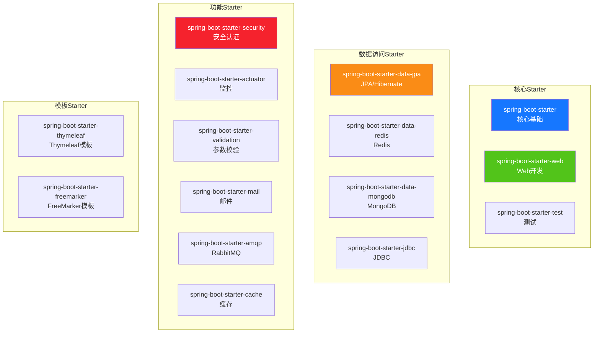

### 6.2 版本管理（BOM）

Spring Boot 使用 **BOM（Bill of Materials）** 统一管理所有依赖版本，开发者无需手动指定版本号。

```xml
<!-- 方式一：继承父POM（最常用） -->
<parent>
    <groupId>org.springframework.boot</groupId>
    <artifactId>spring-boot-starter-parent</artifactId>
    <version>3.2.0</version>
    <relativePath/>
</parent>

<!-- 引入依赖时不需要写 version -->
<dependencies>
    <dependency>
        <groupId>org.springframework.boot</groupId>
        <artifactId>spring-boot-starter-web</artifactId>
        <!-- 无需 <version>，由父POM管理 -->
    </dependency>
</dependencies>
```

```xml
<!-- 方式二：导入BOM（适合不能继承父POM的项目） -->
<dependencyManagement>
    <dependencies>
        <dependency>
            <groupId>org.springframework.boot</groupId>
            <artifactId>spring-boot-dependencies</artifactId>
            <version>3.2.0</version>
            <type>pom</type>
            <scope>import</scope>
        </dependency>
    </dependencies>
</dependencyManagement>
```

### 6.3 常用依赖清单

```xml
<dependencies>
    <!-- ==================== Web 开发 ==================== -->
    <dependency>
        <groupId>org.springframework.boot</groupId>
        <artifactId>spring-boot-starter-web</artifactId>
    </dependency>

    <!-- 参数校验 -->
    <dependency>
        <groupId>org.springframework.boot</groupId>
        <artifactId>spring-boot-starter-validation</artifactId>
    </dependency>

    <!-- ==================== 数据访问 ==================== -->
    <!-- JPA -->
    <dependency>
        <groupId>org.springframework.boot</groupId>
        <artifactId>spring-boot-starter-data-jpa</artifactId>
    </dependency>

    <!-- MySQL 驱动 -->
    <dependency>
        <groupId>com.mysql</groupId>
        <artifactId>mysql-connector-j</artifactId>
        <scope>runtime</scope>
    </dependency>

    <!-- Redis -->
    <dependency>
        <groupId>org.springframework.boot</groupId>
        <artifactId>spring-boot-starter-data-redis</artifactId>
    </dependency>

    <!-- ==================== 功能组件 ==================== -->
    <!-- 安全认证 -->
    <dependency>
        <groupId>org.springframework.boot</groupId>
        <artifactId>spring-boot-starter-security</artifactId>
    </dependency>

    <!-- 监控 -->
    <dependency>
        <groupId>org.springframework.boot</groupId>
        <artifactId>spring-boot-starter-actuator</artifactId>
    </dependency>

    <!-- ==================== 工具库 ==================== -->
    <!-- Lombok -->
    <dependency>
        <groupId>org.projectlombok</groupId>
        <artifactId>lombok</artifactId>
        <optional>true</optional>
    </dependency>

    <!-- ==================== 测试 ==================== -->
    <dependency>
        <groupId>org.springframework.boot</groupId>
        <artifactId>spring-boot-starter-test</artifactId>
        <scope>test</scope>
    </dependency>
</dependencies>
```

---

## 七、自动配置原理

### 7.1 @EnableAutoConfiguration 原理

`@SpringBootApplication` 是一个组合注解，其中包含 `@EnableAutoConfiguration`，这是自动配置的核心入口。

```java
// @SpringBootApplication 的组成
@SpringBootConfiguration      // 等同于 @Configuration，标识配置类
@EnableAutoConfiguration      // 自动配置核心注解
@ComponentScan                // 组件扫描，默认扫描启动类所在包及子包
public @interface SpringBootApplication {
}
```

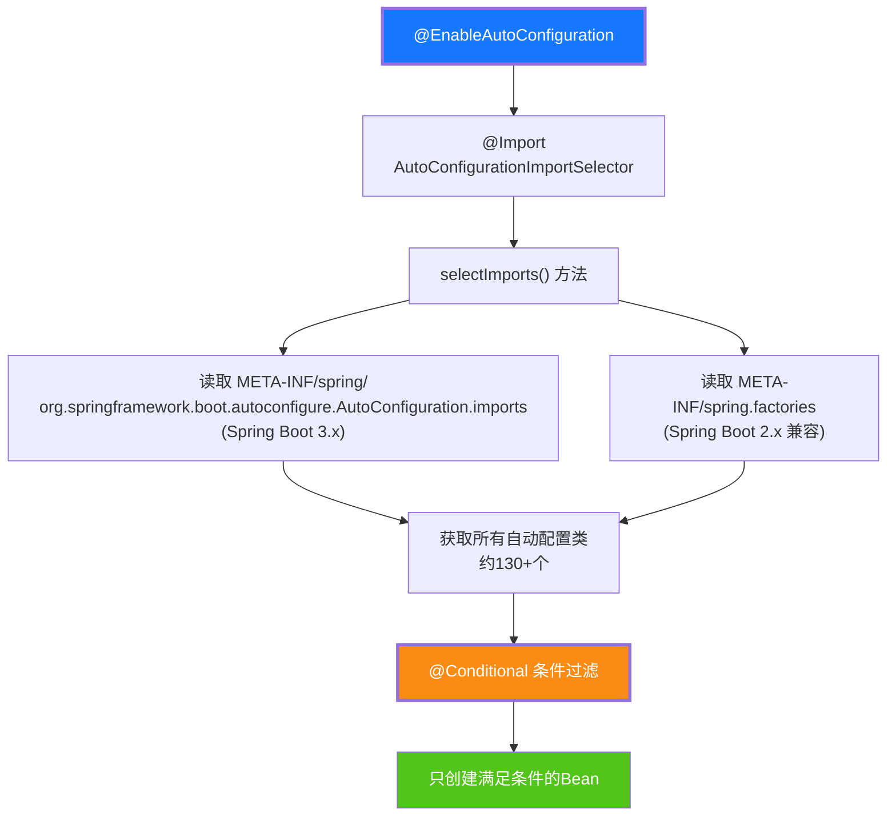

### 7.2 自动配置加载机制

```java
// AutoConfigurationImportSelector 核心逻辑（简化版）
public class AutoConfigurationImportSelector implements ImportSelector {

    @Override
    public String[] selectImports(AnnotationMetadata metadata) {
        // 1. 获取候选的自动配置类列表
        List<String> configurations = getCandidateConfigurations(metadata, attributes);
        
        // 2. 去重
        configurations = removeDuplicates(configurations);
        
        // 3. 根据 @AutoConfigureExclude 排除
        configurations = applyExclusions(configurations, exclude);
        
        // 4. 根据 @AutoConfigureOrder 排序
        configurations = sortConfigurations(configurations);
        
        // 5. 返回需要加载的配置类
        return configurations.toArray(new String[0]);
    }

    // 读取配置文件获取候选配置类
    protected List<String> getCandidateConfigurations(AnnotationMetadata metadata,
                                                       AnnotationAttributes attributes) {
        // Spring Boot 3.x: 读取 META-INF/spring/...AutoConfiguration.imports
        List<String> configurations = ImportCandidates.load(
            AutoConfiguration.class, getBeanClassLoader()
        ).getCandidates();
        
        // Spring Boot 2.x: 读取 META-INF/spring.factories
        // configurations = SpringFactoriesLoader.loadFactoryNames(...);
        
        return configurations;
    }
}
```

### 7.3 条件注解详解

自动配置的核心在于**条件注解**，它决定了一个配置类/Bean 是否生效。

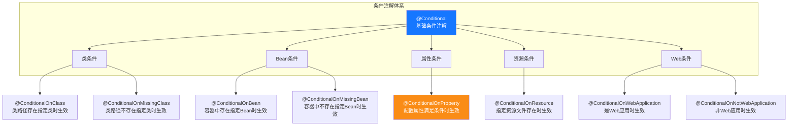

**条件注解使用示例**:

```java
// DataSourceAutoConfiguration 节选（Spring Boot 源码）
@AutoConfiguration
@ConditionalOnClass({ DataSource.class, EmbeddedDatabaseType.class })
@ConditionalOnMissingBean(type = "io.r2dbc.spi.ConnectionFactory")
@EnableConfigurationProperties(DataSourceProperties.class)
public class DataSourceAutoConfiguration {

    // 只有当类路径存在 DataSource 类时，这个配置类才生效
    // 只有当容器中没有自定义 DataSource 时，才自动创建

    @Bean
    @ConditionalOnMissingBean
    public DataSource dataSource(DataSourceProperties properties) {
        // 自动创建数据源
        return properties.initializeDataSourceBuilder().build();
    }
}
```

### 7.4 自定义自动配置

```java
// 1. 定义配置属性类
@ConfigurationProperties(prefix = "myapp")
@Data
public class MyAppProperties {
    private String name = "default";
    private boolean enabled = true;
    private int timeout = 3000;
}

// 2. 定义自动配置类
@AutoConfiguration
@ConditionalOnClass(MyService.class)
@EnableConfigurationProperties(MyAppProperties.class)
public class MyServiceAutoConfiguration {

    @Bean
    @ConditionalOnMissingBean
    @ConditionalOnProperty(prefix = "myapp", name = "enabled", havingValue = "true")
    public MyService myService(MyAppProperties properties) {
        return new MyService(properties.getName(), properties.getTimeout());
    }
}

// 3. 注册自动配置类
// 在 src/main/resources/META-INF/spring/
// 创建文件 org.springframework.boot.autoconfigure.AutoConfiguration.imports
// 文件内容:
// com.example.MyServiceAutoConfiguration
```

---

## 八、常用注解说明

### 8.1 核心注解

| 注解 | 说明 | 示例 |
|------|------|------|
| `@SpringBootApplication` | 启动类组合注解 | `@SpringBootApplication` |
| `@Configuration` | 标识配置类 | `@Configuration public class AppConfig` |
| `@Bean` | 声明 Bean | `@Bean public RestTemplate restTemplate()` |
| `@Component` | 通用组件 | `@Component public class MyUtil` |
| `@Service` | 业务层组件 | `@Service public class UserService` |
| `@Repository` | 数据访问层组件 | `@Repository public class UserDao` |
| `@Autowired` | 自动注入 | `@Autowired private UserService userService` |
| `@Value` | 注入配置值 | `@Value("${app.name}") private String appName` |
| `@ConfigurationProperties` | 批量绑定配置 | `@ConfigurationProperties(prefix="app")` |
| `@ComponentScan` | 组件扫描 | `@ComponentScan(basePackages="com.example")` |
| `@EnableScheduling` | 开启定时任务 | `@EnableScheduling` |
| `@Scheduled` | 定时任务方法 | `@Scheduled(cron="0 0 * * * ?")` |

### 8.2 Web 注解

```java
// ==================== 控制器注解 ====================
@RestController         // @Controller + @ResponseBody，RESTful API专用
@RequestMapping("/api")  // 类级路由
public class UserController {

    @GetMapping("/users")          // GET /api/users
    public List<User> list() { ... }

    @GetMapping("/users/{id}")     // GET /api/users/1
    public User getById(@PathVariable Long id) { ... }

    @PostMapping("/users")         // POST /api/users
    public User create(@RequestBody @Valid UserRequest req) { ... }

    @PutMapping("/users/{id}")     // PUT /api/users/1
    public User update(@PathVariable Long id, @RequestBody UserRequest req) { ... }

    @DeleteMapping("/users/{id}")  // DELETE /api/users/1
    public void delete(@PathVariable Long id) { ... }

    @PatchMapping("/users/{id}/status")  // PATCH 部分更新
    public User updateStatus(@PathVariable Long id, @RequestParam String status) { ... }
}

// ==================== 参数绑定注解 ====================
@GetMapping("/search")
public String search(
    @RequestParam(name = "keyword", defaultValue = "") String keyword,  // 查询参数
    @RequestHeader("Authorization") String token,                      // 请求头
    @CookieValue("sessionId") String sessionId,                        // Cookie
    @RequestParam(defaultValue = "1") int page,
    @RequestParam(defaultValue = "10") int size
) {
    return "搜索: " + keyword + ", 页码: " + page;
}
```

### 8.3 数据访问注解

```java
// ==================== JPA 注解 ====================
@Entity                    // 标识JPA实体
@Table(name = "t_user")    // 映射表名
@Data                      // Lombok: getter/setter
@NoArgsConstructor
@AllArgsConstructor
public class User {
    @Id                    // 主键
    @GeneratedValue(strategy = GenerationType.IDENTITY)  // 自增
    private Long id;

    @Column(name = "username", length = 50, nullable = false)
    private String username;

    @Column(name = "email")
    private String email;

    @Temporal(TemporalType.TIMESTAMP)
    @Column(name = "created_at")
    private Date createdAt;
}

// ==================== Repository 注解 ====================
public interface UserRepository extends JpaRepository<User, Long> {

    // 方法名查询（Spring Data 自动实现）
    List<User> findByUsernameContaining(String keyword);

    // @Query 自定义查询
    @Query("SELECT u FROM User u WHERE u.email = :email")
    User findByEmail(@Param("email") String email);

    // 原生 SQL
    @Query(value = "SELECT * FROM t_user WHERE status = ?1", nativeQuery = true)
    List<User> findByStatus(String status);

    // 修改操作
    @Modifying
    @Query("UPDATE User u SET u.status = :status WHERE u.id = :id")
    int updateStatus(@Param("id") Long id, @Param("status") String status);
}
```

### 8.4 配置注解

```java
// @ConfigurationProperties 批量绑定配置
@Configuration
@ConfigurationProperties(prefix = "app")
@Data
public class AppConfig {
    private String name;
    private String version;
    private Database database = new Database();
    private List<String> servers = new ArrayList<>();

    @Data
    public static class Database {
        private String url;
        private String username;
        private int maxPoolSize = 10;
    }
}
```

```yaml
# application.yml 对应配置
app:
  name: my-application
  version: 1.0.0
  database:
    url: jdbc:mysql://localhost:3306/mydb
    username: root
    max-pool-size: 20
  servers:
    - server1.example.com
    - server2.example.com
```

---

## 九、配置方式

### 9.1 application.properties 配置

```properties
# ==================== 服务器配置 ====================
server.port=8080
server.servlet.context-path=/api
server.tomcat.max-threads=200
server.tomcat.uri-encoding=UTF-8

# ==================== 数据源配置 ====================
spring.datasource.url=jdbc:mysql://localhost:3306/mydb?useSSL=false&serverTimezone=UTC
spring.datasource.username=root
spring.datasource.password=123456
spring.datasource.driver-class-name=com.mysql.cj.jdbc.Driver

# ==================== JPA 配置 ====================
spring.jpa.hibernate.ddl-auto=update
spring.jpa.show-sql=true
spring.jpa.properties.hibernate.format_sql=true
spring.jpa.database-platform=org.hibernate.dialect.MySQLDialect

# ==================== Redis 配置 ====================
spring.redis.host=localhost
spring.redis.port=6379
spring.redis.password=
spring.redis.timeout=3000ms

# ==================== 日志配置 ====================
logging.level.root=INFO
logging.level.com.example=DEBUG
logging.file.name=logs/app.log
logging.pattern.console=%d{yyyy-MM-dd HH:mm:ss} [%thread] %-5level %logger{36} - %msg%n

# ==================== 自定义配置 ====================
app.name=My Application
app.version=1.0.0
app.feature.enabled=true
```

### 9.2 application.yml 配置

YAML 格式**层次清晰、可读性更强**，是 Spring Boot 推荐的配置方式。

```yaml
# ==================== 服务器配置 ====================
server:
  port: 8080
  servlet:
    context-path: /api
  tomcat:
    max-threads: 200
    uri-encoding: UTF-8

# ==================== 数据源配置 ====================
spring:
  datasource:
    url: jdbc:mysql://localhost:3306/mydb?useSSL=false&serverTimezone=UTC
    username: root
    password: 123456
    driver-class-name: com.mysql.cj.jdbc.Driver
    hikari:
      maximum-pool-size: 20
      minimum-idle: 5
      idle-timeout: 30000
      max-lifetime: 1800000
      connection-timeout: 30000

  # ==================== JPA 配置 ====================
  jpa:
    hibernate:
      ddl-auto: update
    show-sql: true
    properties:
      hibernate:
        format_sql: true
        dialect: org.hibernate.dialect.MySQLDialect

  # ==================== Redis 配置 ====================
  redis:
    host: localhost
    port: 6379
    password: ""
    timeout: 3000ms
    lettuce:
      pool:
        max-active: 8
        max-idle: 4
        min-idle: 2

# ==================== 日志配置 ====================
logging:
  level:
    root: INFO
    com.example: DEBUG
  file:
    name: logs/app.log
  pattern:
    console: "%d{yyyy-MM-dd HH:mm:ss} [%thread] %-5level %logger{36} - %msg%n"

# ==================== 自定义配置 ====================
app:
  name: My Application
  version: 1.0.0
  feature:
    enabled: true
  security:
    jwt:
      secret: mySecretKey
      expiration: 86400000
```

**properties 与 yml 对比**:

| 对比维度 | application.properties | application.yml |
|---------|:--------------------:|:--------------:|
| 格式 | 键值对（扁平） | 层次结构（缩进） |
| 可读性 | 一般 | 好 |
| 支持列表 | 需索引 `list[0]` | 原生支持 `- item` |
| 支持Map | 需前缀 `map.key` | 原生支持 |
| 注释 | `#` | `#` |
| 推荐度 | ⭐⭐⭐ | ⭐⭐⭐⭐⭐ |

### 9.3 多环境配置（Profile）

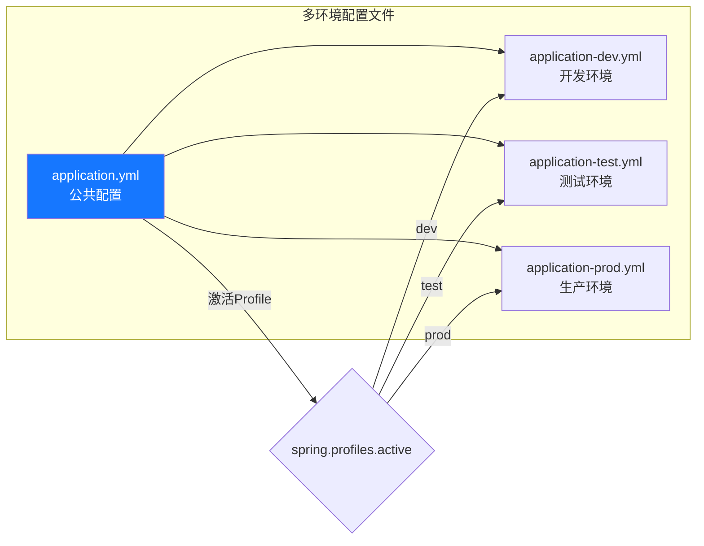

**application.yml（公共配置）**:

```yaml
spring:
  profiles:
    active: dev  # 默认激活开发环境

# 所有环境共享的配置
app:
  name: My Application
```

**application-dev.yml（开发环境）**:

```yaml
server:
  port: 8080

spring:
  datasource:
    url: jdbc:mysql://localhost:3306/dev_db
    username: root
    password: dev123

logging:
  level:
    com.example: DEBUG
```

**application-prod.yml（生产环境）**:

```yaml
server:
  port: 80

spring:
  datasource:
    url: jdbc:mysql://prod-mysql:3306/prod_db
    username: ${DB_USERNAME}   # 从环境变量读取
    password: ${DB_PASSWORD}

logging:
  level:
    com.example: INFO
  file:
    name: /var/log/app/app.log
```

**激活 Profile 的方式**:

```bash
# 方式一：配置文件（application.yml）
# spring.profiles.active=dev

# 方式二：命令行参数
java -jar app.jar --spring.profiles.active=prod

# 方式三：环境变量
export SPRING_PROFILES_ACTIVE=prod
java -jar app.jar

# 方式四：JVM参数
java -Dspring.profiles.active=prod -jar app.jar
```

### 9.4 外部化配置加载顺序

Spring Boot 配置按**优先级从高到低**加载，高优先级覆盖低优先级：

```mermaid
graph TB
    subgraph 配置加载优先级_从高到低
        L1["1. 命令行参数<br/>--server.port=9090"]
        L2["2. SPRING_APPLICATION_JSON<br/>环境变量中的JSON"]
        L3["3. ServletConfig/ServletContext参数"]
        L4["4. JNDI属性"]
        L5["5. Java系统属性<br/>-Dserver.port=9090"]
        L6["6. 操作系统环境变量<br/>SERVER_PORT=9090"]
        L7["7. RandomValuePropertySource<br/>random.*随机值"]
        L8["8. JAR包外的application-{profile}.yml"]
        L9["9. JAR包内的application-{profile}.yml"]
        L10["10. JAR包外的application.yml"]
        L11["11. JAR包内的application.yml"]
        L12["12. @PropertySource注解"]
        L13["13. 默认属性<br/>SpringApplication.setDefaultProperties"]
        
        L1 --> L2 --> L3 --> L4 --> L5 --> L6 --> L7
        L7 --> L8 --> L9 --> L10 --> L11 --> L12 --> L13
    end
    
    style L1 fill:#f5222d,color:#fff
    style L8 fill:#fa8c16,color:#fff
    style L10 fill:#1677ff,color:#fff
```

### 9.5 自定义配置属性绑定

```java
// 方式一：@ConfigurationProperties（推荐）
@Component
@ConfigurationProperties(prefix = "app.security.jwt")
@Data
public class JwtProperties {
    private String secret;
    private Long expiration = 86400000L;  // 默认值
    private String header = "Authorization";
    private String prefix = "Bearer ";
}

// 方式二：@Value（适合少量配置）
@Component
public class AppConfig {
    @Value("${app.name}")
    private String appName;

    @Value("${app.feature.enabled:false}")  // 默认值false
    private boolean featureEnabled;

    @Value("${app.servers:localhost}")  // 默认值
    private String defaultServer;
}

// 方式三：@ConfigurationProperties + @Validated（校验）
@Component
@ConfigurationProperties(prefix = "app")
@Validated
@Data
public class AppProperties {
    @NotBlank
    private String name;

    @Min(1) @Max(65535)
    private int port = 8080;

    @Email
    private String adminEmail;
}
```

---

## 十、Web 开发

### 10.1 RESTful API 开发

```java
/**
 * 用户管理 RESTful API
 */
@RestController
@RequestMapping("/api/users")
@Slf4j
public class UserController {

    @Autowired
    private UserService userService;

    /**
     * 分页查询用户列表
     * GET /api/users?page=1&size=10&keyword=张
     */
    @GetMapping
    public Page<User> list(
            @RequestParam(defaultValue = "1") int page,
            @RequestParam(defaultValue = "10") int size,
            @RequestParam(required = false) String keyword) {
        return userService.findUsers(page, size, keyword);
    }

    /**
     * 根据ID查询用户
     * GET /api/users/1
     */
    @GetMapping("/{id}")
    public User getById(@PathVariable Long id) {
        return userService.findById(id);
    }

    /**
     * 创建用户
     * POST /api/users
     */
    @PostMapping
    @ResponseStatus(HttpStatus.CREATED)
    public User create(@RequestBody @Valid UserCreateRequest request) {
        return userService.create(request);
    }

    /**
     * 更新用户
     * PUT /api/users/1
     */
    @PutMapping("/{id}")
    public User update(@PathVariable Long id, 
                       @RequestBody @Valid UserUpdateRequest request) {
        return userService.update(id, request);
    }

    /**
     * 删除用户
     * DELETE /api/users/1
     */
    @DeleteMapping("/{id}")
    @ResponseStatus(HttpStatus.NO_CONTENT)
    public void delete(@PathVariable Long id) {
        userService.delete(id);
    }
}
```

### 10.2 参数校验

```java
// ==================== DTO 与校验注解 ====================
@Data
public class UserCreateRequest {

    @NotBlank(message = "用户名不能为空")
    @Size(min = 2, max = 20, message = "用户名长度2-20个字符")
    private String username;

    @NotBlank(message = "密码不能为空")
    @Size(min = 6, max = 50, message = "密码长度6-50个字符")
    @Pattern(regexp = "^(?=.*[a-z])(?=.*[A-Z])(?=.*\\d).+$",
             message = "密码必须包含大小写字母和数字")
    private String password;

    @NotBlank(message = "邮箱不能为空")
    @Email(message = "邮箱格式不正确")
    private String email;

    @NotNull(message = "年龄不能为空")
    @Min(value = 18, message = "年龄不能小于18岁")
    @Max(value = 120, message = "年龄不能超过120岁")
    private Integer age;

    @Pattern(regexp = "^1[3-9]\\d{9}$", message = "手机号格式不正确")
    private String phone;
}

// ==================== Controller 中使用校验 ====================
@PostMapping
public User create(@RequestBody @Valid UserCreateRequest request) {
    // 如果校验失败，自动抛出 MethodArgumentNotValidException
    // 由全局异常处理器捕获并返回友好提示
    return userService.create(request);
}
```

### 10.3 全局异常处理

```java
/**
 * 全局异常处理器
 * 统一捕获异常并返回标准化错误响应
 */
@RestControllerAdvice
@Slf4j
public class GlobalExceptionHandler {

    /**
     * 参数校验异常
     */
    @ExceptionHandler(MethodArgumentNotValidException.class)
    public ResponseEntity<ErrorResponse> handleValidation(
            MethodArgumentNotValidException ex) {
        List<String> errors = ex.getBindingResult()
                .getFieldErrors()
                .stream()
                .map(e -> e.getField() + ": " + e.getDefaultMessage())
                .collect(Collectors.toList());

        ErrorResponse response = ErrorResponse.builder()
                .code(400)
                .message("参数校验失败")
                .errors(errors)
                .timestamp(LocalDateTime.now())
                .build();

        return ResponseEntity.badRequest().body(response);
    }

    /**
     * 业务异常
     */
    @ExceptionHandler(BusinessException.class)
    public ResponseEntity<ErrorResponse> handleBusiness(BusinessException ex) {
        ErrorResponse response = ErrorResponse.builder()
                .code(ex.getCode())
                .message(ex.getMessage())
                .timestamp(LocalDateTime.now())
                .build();
        return ResponseEntity.status(ex.getCode()).body(response);
    }

    /**
     * 资源不存在异常
     */
    @ExceptionHandler(NoHandlerFoundException.class)
    public ResponseEntity<ErrorResponse> handleNotFound(NoHandlerFoundException ex) {
        ErrorResponse response = ErrorResponse.builder()
                .code(404)
                .message("资源不存在")
                .timestamp(LocalDateTime.now())
                .build();
        return ResponseEntity.status(404).body(response);
    }

    /**
     * 其他未捕获异常（兜底）
     */
    @ExceptionHandler(Exception.class)
    public ResponseEntity<ErrorResponse> handleAll(Exception ex) {
        log.error("未处理异常: ", ex);
        ErrorResponse response = ErrorResponse.builder()
                .code(500)
                .message("服务器内部错误")
                .timestamp(LocalDateTime.now())
                .build();
        return ResponseEntity.status(500).body(response);
    }
}

// ==================== 统一错误响应 ====================
@Data
@Builder
public class ErrorResponse {
    private int code;
    private String message;
    private List<String> errors;
    private LocalDateTime timestamp;
}

// ==================== 自定义业务异常 ====================
@Getter
public class BusinessException extends RuntimeException {
    private final int code;

    public BusinessException(int code, String message) {
        super(message);
        this.code = code;
    }

    public static BusinessException of(int code, String message) {
        return new BusinessException(code, message);
    }
}
```

### 10.4 统一响应封装

```java
/**
 * 统一响应封装
 */
@Data
@Builder
@AllArgsConstructor
public class ApiResponse<T> {
    private int code;
    private String message;
    private T data;
    private LocalDateTime timestamp;

    public static <T> ApiResponse<T> success(T data) {
        return ApiResponse.<T>builder()
                .code(200)
                .message("success")
                .data(data)
                .timestamp(LocalDateTime.now())
                .build();
    }

    public static <T> ApiResponse<T> success() {
        return success(null);
    }

    public static <T> ApiResponse<T> error(int code, String message) {
        return ApiResponse.<T>builder()
                .code(code)
                .message(message)
                .timestamp(LocalDateTime.now())
                .build();
    }
}

// Controller 中使用
@GetMapping("/{id}")
public ApiResponse<User> getById(@PathVariable Long id) {
    User user = userService.findById(id);
    return ApiResponse.success(user);
}
```

### 10.5 跨域处理

```java
// 方式一：全局跨域配置（推荐）
@Configuration
public class WebConfig implements WebMvcConfigurer {

    @Override
    public void addCorsMappings(CorsRegistry registry) {
        registry.addMapping("/api/**")
                .allowedOrigins("http://localhost:3000", "https://myapp.com")
                .allowedMethods("GET", "POST", "PUT", "DELETE", "OPTIONS")
                .allowedHeaders("*")
                .allowCredentials(true)
                .maxAge(3600);  // 预检请求缓存1小时
    }
}

// 方式二：注解级跨域（单个Controller）
@CrossOrigin(origins = "http://localhost:3000")
@RestController
public class UserController { ... }

// 方式三：Filter 跨域（适合全局Filter场景）
@Bean
public CorsFilter corsFilter() {
    CorsConfiguration config = new CorsConfiguration();
    config.addAllowedOrigin("http://localhost:3000");
    config.addAllowedMethod("*");
    config.addAllowedHeader("*");
    config.setAllowCredentials(true);

    UrlBasedCorsConfigurationSource source = new UrlBasedCorsConfigurationSource();
    source.registerCorsConfiguration("/api/**", config);
    return new CorsFilter(source);
}
```

---

## 十一、数据访问

### 11.1 Spring Data JPA

```java
// ==================== 实体类 ====================
@Entity
@Table(name = "t_user")
@Data
@NoArgsConstructor
@AllArgsConstructor
@Builder
public class User {
    @Id
    @GeneratedValue(strategy = GenerationType.IDENTITY)
    private Long id;

    @Column(nullable = false, length = 50)
    private String username;

    @Column(nullable = false, length = 100)
    private String email;

    @Column(name = "status", length = 20)
    private String status;

    @Column(name = "created_at")
    @CreationTimestamp
    private LocalDateTime createdAt;

    @Column(name = "updated_at")
    @UpdateTimestamp
    private LocalDateTime updatedAt;
}

// ==================== Repository 接口 ====================
public interface UserRepository extends JpaRepository<User, Long>,
                                          JpaSpecificationExecutor<User> {

    // 方法名查询（Spring Data 自动实现）
    Optional<User> findByUsername(String username);
    List<User> findByStatus(String status);
    List<User> findByUsernameContainingAndStatus(String keyword, String status);
    long countByStatus(String status);

    // @Query JPQL 查询
    @Query("SELECT u FROM User u WHERE u.createdAt >= :date")
    List<User> findCreatedAfter(@Param("date") LocalDateTime date);

    // @Query 原生 SQL
    @Query(value = "SELECT * FROM t_user WHERE email LIKE %:keyword%",
           nativeQuery = true)
    List<User> searchByEmail(@Param("keyword") String keyword);

    // 排序查询
    List<User> findByStatusOrderByCreatedAtDesc(String status);

    // 分页查询
    Page<User> findByUsernameContaining(String keyword, Pageable pageable);

    // 修改操作
    @Modifying
    @Query("UPDATE User u SET u.status = :status WHERE u.id IN :ids")
    int batchUpdateStatus(@Param("ids") List<Long> ids,
                          @Param("status") String status);
}

// ==================== Service 层使用 ====================
@Service
@Transactional
public class UserService {

    @Autowired
    private UserRepository userRepository;

    public Page<User> findUsers(int page, int size, String keyword) {
        Pageable pageable = PageRequest.of(page - 1, size,
                Sort.by(Sort.Direction.DESC, "createdAt"));

        if (StringUtils.hasText(keyword)) {
            return userRepository.findByUsernameContaining(keyword, pageable);
        }
        return userRepository.findAll(pageable);
    }

    // 动态条件查询（Specification）
    public List<User> search(String username, String email, String status) {
        return userRepository.findAll((root, query, cb) -> {
            List<Predicate> predicates = new ArrayList<>();
            if (StringUtils.hasText(username)) {
                predicates.add(cb.like(root.get("username"), "%" + username + "%"));
            }
            if (StringUtils.hasText(email)) {
                predicates.add(cb.like(root.get("email"), "%" + email + "%"));
            }
            if (StringUtils.hasText(status)) {
                predicates.add(cb.equal(root.get("status"), status));
            }
            return cb.and(predicates.toArray(new Predicate[0]));
        });
    }
}
```

### 11.2 MyBatis 整合

```yaml
# application.yml — MyBatis 配置
mybatis:
  mapper-locations: classpath:mapper/*.xml   # XML映射文件位置
  type-aliases-package: com.example.entity    # 实体类别名包
  configuration:
    map-underscore-to-camel-case: true        # 驼峰命名映射
    cache-enabled: true                        # 二级缓存
    log-impl: org.apache.ibatis.logging.stdout.StdOutImpl  # SQL日志
```

```java
// ==================== Mapper 接口 ====================
@Mapper
public interface UserMapper {

    @Select("SELECT * FROM t_user WHERE id = #{id}")
    User findById(Long id);

    @Select("SELECT * FROM t_user WHERE username LIKE CONCAT('%', #{keyword}, '%')")
    List<User> searchByUsername(String keyword);

    @Insert("INSERT INTO t_user(username, email, status) " +
            "VALUES(#{username}, #{email}, #{status})")
    @Options(useGeneratedKeys = true, keyProperty = "id")
    int insert(User user);

    @Update("UPDATE t_user SET status = #{status} WHERE id = #{id}")
    int updateStatus(@Param("id") Long id, @Param("status") String status);

    @Delete("DELETE FROM t_user WHERE id = #{id}")
    int deleteById(Long id);
}

// ==================== XML 映射文件（复杂查询） ====================
// src/main/resources/mapper/UserMapper.xml
/*
<?xml version="1.0" encoding="UTF-8"?>
<!DOCTYPE mapper PUBLIC "-//mybatis.org//DTD Mapper 3.0//EN"
    "http://mybatis.org/dtd/mybatis-3-mapper.dtd">
<mapper namespace="com.example.mapper.UserMapper">

    <resultMap id="userResultMap" type="User">
        <id property="id" column="id"/>
        <result property="username" column="username"/>
        <result property="email" column="email"/>
        <result property="status" column="status"/>
    </resultMap>

    <select id="findUserWithOrders" resultMap="userResultMap">
        SELECT u.* FROM t_user u
        WHERE u.status = #{status}
        ORDER BY u.created_at DESC
    </select>

    <insert id="batchInsert" parameterType="java.util.List">
        INSERT INTO t_user(username, email, status)
        VALUES
        <foreach collection="list" item="user" separator=",">
            (#{user.username}, #{user.email}, #{user.status})
        </foreach>
    </insert>
</mapper>
*/
```

### 11.3 事务管理

```java
// ==================== 声明式事务（注解方式，最常用） ====================
@Service
public class OrderService {

    @Autowired
    private OrderRepository orderRepository;

    @Autowired
    private ProductService productService;

    /**
     * 下单操作：扣减库存 + 创建订单（同一事务内）
     */
    @Transactional(rollbackFor = Exception.class)  // 所有异常都回滚
    public Order createOrder(OrderRequest request) {
        // 1. 扣减库存
        productService.reduceStock(request.getProductId(), request.getQuantity());
        // 2. 创建订单
        Order order = Order.builder()
                .productId(request.getProductId())
                .quantity(request.getQuantity())
                .totalAmount(request.getTotalAmount())
                .status("PENDING")
                .build();
        order = orderRepository.save(order);
        // 3. 如果以上任一步骤抛出异常，整个事务回滚
        return order;
    }

    @Transactional(readOnly = true)  // 只读事务（优化性能）
    public Order findById(Long id) {
        return orderRepository.findById(id).orElse(null);
    }

    @Transactional(timeout = 30)  // 事务超时30秒
    public void batchProcess(List<Long> ids) {
        // 批量处理逻辑
    }

    @Transactional(isolation = Isolation.READ_COMMITTED)  // 指定隔离级别
    public void updateOrder(Long id, String status) {
        orderRepository.updateStatus(id, status);
    }
}
```

### 11.4 连接池配置

```yaml
spring:
  datasource:
    # HikariCP（Spring Boot 默认连接池）
    hikari:
      maximum-pool-size: 20          # 最大连接数
      minimum-idle: 5                # 最小空闲连接
      idle-timeout: 30000            # 空闲连接超时(ms)
      max-lifetime: 1800000          # 连接最大存活时间(ms)
      connection-timeout: 30000      # 连接超时(ms)
      pool-name: MyHikariPool        # 连接池名
      connection-test-query: SELECT 1  # 连接测试SQL
```

---

## 十二、安全认证

### 12.1 Spring Security 快速入门

```xml
<!-- 引入 Spring Security -->
<dependency>
    <groupId>org.springframework.boot</groupId>
    <artifactId>spring-boot-starter-security</artifactId>
</dependency>
```

```java
// ==================== Spring Security 配置 ====================
@Configuration
@EnableWebSecurity
@EnableMethodSecurity  // 开启方法级安全（@PreAuthorize等）
public class SecurityConfig {

    @Bean
    public SecurityFilterChain filterChain(HttpSecurity http) throws Exception {
        http
            // 授权规则
            .authorizeHttpRequests(auth -> auth
                .requestMatchers("/api/public/**", "/actuator/health").permitAll()  // 公开接口
                .requestMatchers("/api/admin/**").hasRole("ADMIN")                   // 管理员接口
                .requestMatchers("/api/user/**").hasAnyRole("USER", "ADMIN")         // 用户接口
                .anyRequest().authenticated()                                        // 其他需认证
            )
            // 表单登录
            .formLogin(form -> form
                .loginPage("/login")
                .defaultSuccessUrl("/home")
                .permitAll()
            )
            // 注销
            .logout(logout -> logout
                .logoutUrl("/logout")
                .logoutSuccessUrl("/login?logout")
                .permitAll()
            )
            // CSRF（API开发可关闭）
            .csrf(csrf -> csrf.disable())
            // Session管理
            .sessionManagement(session -> session
                .sessionCreationPolicy(SessionCreationPolicy.IF_REQUIRED)
            );

        return http.build();
    }

    @Bean
    public PasswordEncoder passwordEncoder() {
        return new BCryptPasswordEncoder();
    }
}

// ==================== 方法级安全控制 ====================
@Service
public class UserService {

    @PreAuthorize("hasRole('ADMIN')")
    public void deleteUser(Long id) { ... }

    @PreAuthorize("hasAnyRole('USER', 'ADMIN')")
    public User getUser(Long id) { ... }

    @PostAuthorize("returnObject.username == authentication.name")
    public User getMyProfile(Long id) { ... }
}
```

### 12.2 JWT 认证实现

```java
// ==================== JWT 工具类 ====================
@Component
public class JwtUtil {

    @Value("${app.security.jwt.secret}")
    private String secret;

    @Value("${app.security.jwt.expiration:86400000}")
    private long expiration;

    public String generateToken(String username, List<String> roles) {
        return Jwts.builder()
                .subject(username)
                .claim("roles", roles)
                .issuedAt(new Date())
                .expiration(new Date(System.currentTimeMillis() + expiration))
                .signWith(Keys.hmacShaKeyFor(secret.getBytes()))
                .compact();
    }

    public Claims parseToken(String token) {
        return Jwts.parser()
                .verifyWith(Keys.hmacShaKeyFor(secret.getBytes()))
                .build()
                .parseSignedClaims(token)
                .getPayload();
    }

    public boolean validateToken(String token) {
        try {
            parseToken(token);
            return true;
        } catch (Exception e) {
            return false;
        }
    }
}

// ==================== JWT 过滤器 ====================
@Component
public class JwtAuthenticationFilter extends OncePerRequestFilter {

    @Autowired
    private JwtUtil jwtUtil;

    @Autowired
    private UserDetailsService userDetailsService;

    @Override
    protected void doFilterInternal(HttpServletRequest request,
                                    HttpServletResponse response,
                                    FilterChain filterChain) throws ServletException, IOException {
        String header = request.getHeader("Authorization");

        if (header != null && header.startsWith("Bearer ")) {
            String token = header.substring(7);
            if (jwtUtil.validateToken(token)) {
                String username = jwtUtil.parseToken(token).getSubject();
                UserDetails userDetails = userDetailsService.loadUserByUsername(username);

                UsernamePasswordAuthenticationToken auth =
                    new UsernamePasswordAuthenticationToken(
                        userDetails, null, userDetails.getAuthorities());
                SecurityContextHolder.getContext().setAuthentication(auth);
            }
        }

        filterChain.doFilter(request, response);
    }
}
```

---

## 十三、测试方法

### 13.1 单元测试

```java
// ==================== Service 层单元测试（Mock依赖） ====================
@ExtendWith(MockitoExtension.class)
class UserServiceTest {

    @Mock
    private UserRepository userRepository;

    @InjectMocks
    private UserService userService;

    @Test
    void findById_shouldReturnUser() {
        // Given（准备数据）
        User user = User.builder().id(1L).username("testuser").build();
        when(userRepository.findById(1L)).thenReturn(Optional.of(user));

        // When（执行测试）
        User result = userService.findById(1L);

        // Then（验证结果）
        assertThat(result).isNotNull();
        assertThat(result.getUsername()).isEqualTo("testuser");
        verify(userRepository, times(1)).findById(1L);
    }

    @Test
    void create_shouldThrowWhenUsernameExists() {
        // Given
        UserCreateRequest request = new UserCreateRequest();
        request.setUsername("existing");
        when(userRepository.existsByUsername("existing")).thenReturn(true);

        // When & Then
        assertThatThrownBy(() -> userService.create(request))
            .isInstanceOf(BusinessException.class)
            .hasMessage("用户名已存在");
    }
}
```

### 13.2 集成测试

```java
// ==================== 集成测试（启动完整应用上下文） ====================
@SpringBootTest
@AutoConfigureTestDatabase(replace = AutoConfigureTestDatabase.Replace.NONE)
@Transactional  // 测试后自动回滚，不污染数据库
class UserServiceIntegrationTest {

    @Autowired
    private UserService userService;

    @Autowired
    private UserRepository userRepository;

    @Test
    void createAndFindById_shouldWork() {
        // 创建用户
        UserCreateRequest request = new UserCreateRequest();
        request.setUsername("integration_test");
        request.setEmail("test@test.com");

        User created = userService.create(request);

        // 验证创建成功
        assertThat(created.getId()).isNotNull();

        // 查询验证
        User found = userService.findById(created.getId());
        assertThat(found.getUsername()).isEqualTo("integration_test");
    }
}
```

### 13.3 Web 层测试（MockMvc）

```java
// ==================== Controller 层测试 ====================
@WebMvcTest(UserController.class)
class UserControllerTest {

    @Autowired
    private MockMvc mockMvc;

    @MockBean
    private UserService userService;

    @Test
    void getById_shouldReturnUser() throws Exception {
        // Given
        User user = User.builder().id(1L).username("testuser").build();
        when(userService.findById(1L)).thenReturn(user);

        // When & Then
        mockMvc.perform(get("/api/users/1")
                .contentType(MediaType.APPLICATION_JSON))
            .andExpect(status().isOk())
            .andExpect(jsonPath("$.data.username").value("testuser"));
    }

    @Test
    void create_shouldReturn400WhenUsernameBlank() throws Exception {
        // Given
        String requestBody = """
            {"username": "", "email": "test@test.com"}
            """;

        // When & Then
        mockMvc.perform(post("/api/users")
                .contentType(MediaType.APPLICATION_JSON)
                .content(requestBody))
            .andExpect(status().isBadRequest())
            .andExpect(jsonPath("$.message").value("参数校验失败"));
    }

    @Test
    void list_shouldReturnPage() throws Exception {
        // Given
        Page<User> page = new PageImpl<>(List.of(
            User.builder().id(1L).username("user1").build()
        ));
        when(userService.findUsers(1, 10, null)).thenReturn(page);

        // When & Then
        mockMvc.perform(get("/api/users")
                .param("page", "1")
                .param("size", "10"))
            .andExpect(status().isOk())
            .andExpect(jsonPath("$.data.content[0].username").value("user1"));
    }
}
```

### 13.4 测试数据库

```java
// ==================== 使用 H2 内存数据库测试 ====================
// application-test.yml
/*
spring:
  datasource:
    url: jdbc:h2:mem:testdb;MODE=MySQL
    driver-class-name: org.h2.Driver
    username: sa
    password:
  jpa:
    hibernate:
      ddl-auto: create-drop
    show-sql: true
*/

@SpringBootTest
@ActiveProfiles("test")  // 激活 test Profile
class UserRepositoryTest {

    @Autowired
    private UserRepository userRepository;

    @Test
    void findByUsername_shouldReturnUser() {
        // Given
        User user = User.builder()
                .username("testuser")
                .email("test@test.com")
                .status("ACTIVE")
                .build();
        userRepository.save(user);

        // When
        Optional<User> found = userRepository.findByUsername("testuser");

        // Then
        assertThat(found).isPresent();
        assertThat(found.get().getEmail()).isEqualTo("test@test.com");
    }

    @AfterEach
    void cleanup() {
        userRepository.deleteAll();
    }
}
```

---

## 十四、部署流程

### 14.1 打包方式（JAR/WAR）

#### JAR 打包（推荐）

```xml
<!-- pom.xml 中 packaging 默认为 jar -->
<packaging>jar</packaging>

<!-- spring-boot-maven-plugin（打包可执行JAR） -->
<build>
    <plugins>
        <plugin>
            <groupId>org.springframework.boot</groupId>
            <artifactId>spring-boot-maven-plugin</artifactId>
            <configuration>
                <excludes>
                    <exclude>
                        <groupId>org.projectlombok</groupId>
                        <artifactId>lombok</artifactId>
                    </exclude>
                </excludes>
            </configuration>
        </plugin>
    </plugins>
</build>
```

```bash
# 打包
mvn clean package -DskipTests

# 运行
java -jar target/my-app-1.0.0.jar

# 带参数运行
java -jar target/my-app-1.0.0.jar --spring.profiles.active=prod --server.port=9090
```

#### WAR 打包（部署到外部 Tomcat）

```java
// 1. 修改启动类，继承 SpringBootServletInitializer
@SpringBootApplication
public class Application extends SpringBootServletInitializer {

    @Override
    protected SpringApplicationBuilder configure(SpringApplicationBuilder builder) {
        return builder.sources(Application.class);
    }

    public static void main(String[] args) {
        SpringApplication.run(Application.class, args);
    }
}
```

```xml
<!-- 2. 修改 packaging 为 war -->
<packaging>war</packaging>

<!-- 3. 排除内嵌 Tomcat -->
<dependency>
    <groupId>org.springframework.boot</groupId>
    <artifactId>spring-boot-starter-tomcat</artifactId>
    <scope>provided</scope>
</dependency>
```

### 14.2 Docker 容器化部署

```dockerfile
# Dockerfile — 多阶段构建
# 阶段1：构建
FROM maven:3.9-eclipse-temurin-17 AS builder
WORKDIR /app
COPY pom.xml .
RUN mvn dependency:go-offline  # 缓存依赖层
COPY src ./src
RUN mvn clean package -DskipTests

# 阶段2：运行
FROM eclipse-temurin:17-jre-alpine
WORKDIR /app
COPY --from=builder /app/target/*.jar app.jar

# 环境变量
ENV JAVA_OPTS="-Xms256m -Xmx512m -Dspring.profiles.active=prod"
ENV TZ=Asia/Shanghai

# 暴露端口
EXPOSE 8080

# 健康检查
HEALTHCHECK --interval=30s --timeout=3s --retries=3 \
    CMD wget -qO- http://localhost:8080/actuator/health || exit 1

# 启动
ENTRYPOINT ["sh", "-c", "java $JAVA_OPTS -jar app.jar"]
```

```yaml
# docker-compose.yml — 完整部署编排
version: '3.8'
services:
  app:
    build: .
    ports:
      - "8080:8080"
    environment:
      - SPRING_PROFILES_ACTIVE=prod
      - DB_HOST=mysql
      - DB_PORT=3306
      - DB_NAME=prod_db
      - DB_USERNAME=root
      - DB_PASSWORD=${DB_PASSWORD}
      - REDIS_HOST=redis
    depends_on:
      - mysql
      - redis
    restart: always
    networks:
      - app-network

  mysql:
    image: mysql:8.0
    environment:
      MYSQL_ROOT_PASSWORD: ${DB_PASSWORD}
      MYSQL_DATABASE: prod_db
    volumes:
      - mysql-data:/var/lib/mysql
    ports:
      - "3306:3306"
    networks:
      - app-network

  redis:
    image: redis:7-alpine
    ports:
      - "6379:6379"
    volumes:
      - redis-data:/data
    networks:
      - app-network

volumes:
  mysql-data:
  redis-data:

networks:
  app-network:
    driver: bridge
```

```bash
# 构建并启动
docker-compose up -d --build

# 查看日志
docker-compose logs -f app

# 停止
docker-compose down
```

### 14.3 生产环境配置建议

```yaml
# application-prod.yml — 生产环境配置
server:
  port: 8080
  tomcat:
    max-threads: 200
    accept-count: 100
    max-connections: 8192

spring:
  datasource:
    url: jdbc:mysql://${DB_HOST}:${DB_PORT}/${DB_NAME}?useSSL=true&serverTimezone=Asia/Shanghai
    username: ${DB_USERNAME}
    password: ${DB_PASSWORD}
    hikari:
      maximum-pool-size: 20
      minimum-idle: 5
      connection-timeout: 30000

  jpa:
    hibernate:
      ddl-auto: none  # 生产环境不自动建表
    show-sql: false    # 生产环境关闭SQL日志

logging:
  level:
    root: WARN
    com.example: INFO
  file:
    name: /var/log/app/application.log
    max-size: 100MB
    max-history: 30

management:
  endpoints:
    web:
      exposure:
        include: health,info,metrics  # 只暴露必要端点
  endpoint:
    health:
      show-details: when-authorized  # 需认证才能查看详情
```

---

## 十五、Actuator 监控

### 15.1 Actuator 端点

```xml
<dependency>
    <groupId>org.springframework.boot</groupId>
    <artifactId>spring-boot-starter-actuator</artifactId>
</dependency>
```

```yaml
management:
  endpoints:
    web:
      exposure:
        include: health,info,metrics,env,loggers,threaddump,heapdump
        exclude: beans  # 排除敏感端点
  endpoint:
    health:
      show-details: always
    info:
      env:
        enabled: true
  info:
    env:
      enabled: true
    build:
      enabled: true
    git:
      mode: full
```

### 15.2 健康检查

```java
// 自定义健康检查指标
@Component
public class DatabaseHealthIndicator implements HealthIndicator {

    @Autowired
    private UserRepository userRepository;

    @Override
    public Health health() {
        try {
            long count = userRepository.count();
            return Health.up()
                    .withDetail("userCount", count)
                    .withDetail("database", "MySQL")
                    .build();
        } catch (Exception e) {
            return Health.down()
                    .withDetail("error", e.getMessage())
                    .build();
        }
    }
}
```

```bash
# 健康检查结果
curl http://localhost:8080/actuator/health
# {
#   "status": "UP",
#   "components": {
#     "db": {
#       "status": "UP",
#       "details": { "database": "MySQL", "userCount": 1234 }
#     },
#     "diskSpace": { "status": "UP" },
#     "ping": { "status": "UP" }
#   }
# }
```

### 15.3 自定义监控指标

```java
// 使用 Micrometer 自定义指标
@Service
public class OrderService {

    private final Counter orderCreateCounter;
    private final Timer orderProcessTimer;
    private final Gauge orderPendingGauge;

    public OrderService(MeterRegistry meterRegistry,
                        OrderRepository orderRepository) {
        // 计数器：统计下单次数
        this.orderCreateCounter = Counter.builder("app.orders.created")
                .description("订单创建次数")
                .tag("type", "normal")
                .register(meterRegistry);

        // 计时器：统计订单处理耗时
        this.orderProcessTimer = Timer.builder("app.orders.process.time")
                .description("订单处理耗时")
                .register(meterRegistry);

        // 仪表：当前待处理订单数
        this.orderPendingGauge = Gauge.builder("app.orders.pending",
                () -> orderRepository.countByStatus("PENDING"))
                .description("待处理订单数量")
                .register(meterRegistry);
    }

    public Order createOrder(OrderRequest request) {
        orderCreateCounter.increment();  // 计数+1
        return orderProcessTimer.record(() -> {
            // 订单处理逻辑
            return doCreateOrder(request);
        });
    }
}
```

```bash
# 查看指标
curl http://localhost:8080/actuator/metrics/app.orders.created
# {
#   "name": "app.orders.created",
#   "measurements": [{ "statistic": "COUNT", "value": 1523 }],
#   "availableTags": [{ "tag": "type", "values": ["normal"] }]
# }
```

---

## 总结

Spring Boot 通过**约定优于配置**、**自动配置**和**起步依赖**三大核心特性，彻底改变了 Spring 应用的开发方式。本文从核心概念到架构原理、从环境搭建到部署上线，系统性地覆盖了 Spring Boot 开发的完整知识体系。

**核心要点回顾**:

| 知识领域 | 核心要点 |
|---------|---------|
| **核心概念** | 约定优于配置、起步依赖、内嵌服务器、生产就绪 |
| **架构设计** | 分层架构（Controller→Service→Repository）、IoC 容器、Bean 生命周期 |
| **自动配置** | `@EnableAutoConfiguration` → `spring.factories` → 条件注解过滤 |
| **配置管理** | YAML/properties、多环境 Profile、外部化配置优先级 |
| **Web 开发** | RESTful API、参数校验、全局异常处理、统一响应封装 |
| **数据访问** | Spring Data JPA、MyBatis 整合、声明式事务 |
| **安全认证** | Spring Security、JWT 认证 |
| **测试** | 单元测试（Mockito）、集成测试、Web 测试（MockMvc） |
| **部署** | JAR/WAR 打包、Docker 容器化、生产环境配置 |
| **监控** | Actuator 端点、健康检查、Micrometer 自定义指标 |

> **学习建议**:Spring Boot 的学习路径建议为**"先用→再懂→后精"**：先用 Spring Initializr 创建项目跑通 Hello World；再理解自动配置原理和核心注解；最后深入源码、性能调优和微服务架构。搭配本文关联的[整合指南](./Spring-Boot-MyBatis-Maven-MVC整合指南.md)和[面试题汇总](../基本语法/SpringBoot面试题汇总.md)进行系统学习，效果更佳。
