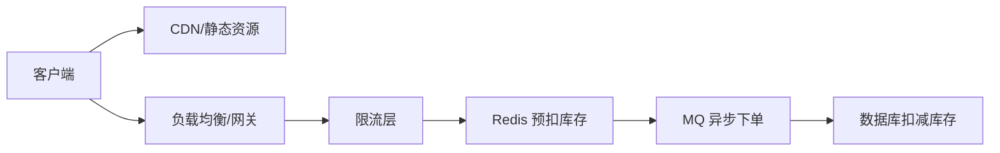

# 高级Java工程师面试题

> 面向3-5年及以上经验的高级Java工程师，涵盖Maven、Spring Boot、MyBatis、JVM、并发编程、分布式等核心领域。
> 题型包括：简答题、原理分析题、场景设计题、源码分析题。

---

## 目录

- [一、Maven](#一maven)
- [二、Spring Boot](#二spring-boot)
- [三、MyBatis](#三mybatis)
- [四、Java 核心基础](#四java-核心基础)
- [五、JVM](#五jvm)
- [六、并发编程](#六并发编程)
- [七、分布式与微服务](#七分布式与微服务)
- [八、设计模式](#八设计模式)
- [九、数据库与缓存](#九数据库与缓存)
- [十、综合场景设计题](#十综合场景设计题)

---

## 一、Maven

### 1.1 Maven 依赖仲裁机制是如何工作的？如何解决依赖冲突？

**答：**

Maven 采用**最短路径优先**原则进行依赖仲裁：

- 如果同一依赖出现在依赖树的不同路径中，路径最短的优先。
- 如果路径长度相同，则声明顺序靠前的优先。

**解决依赖冲突的常用方式：**

```xml
<!-- 使用 <exclusions> 排除传递性依赖 -->
<dependency>
    <groupId>com.example</groupId>
    <artifactId>some-lib</artifactId>
    <version>1.0</version>
    <exclusions>
        <exclusion>
            <groupId>com.conflict</groupId>
            <artifactId>conflict-lib</artifactId>
        </exclusion>
    </exclusions>
</dependency>
```

```bash
# 使用 dependency:tree 分析依赖树
mvn dependency:tree

# 使用 dependency:analyze 检测未使用的依赖
mvn dependency:analyze
```

### 1.2 Maven 的生命周期有哪些阶段？简述每个阶段的作用。

**答：**

Maven 有三套生命周期，每套包含多个阶段（Phase）：

| 生命周期 | 阶段 | 作用 |
|---------|------|------|
| **Clean** | pre-clean / clean / post-clean | 清理构建产物 |
| **Default** | validate → compile → test → package → verify → install → deploy | 核心构建流程 |
| **Site** | pre-site / site / post-site / site-deploy | 生成项目站点文档 |

**常用阶段详解：**

- `compile`：编译源代码
- `test`：运行单元测试
- `package`：打包为 jar/war
- `install`：安装到本地仓库
- `deploy`：部署到远程仓库

### 1.3 什么是 Maven 的 `<parent>` 和 `<dependencyManagement>`？它们有什么区别？

**答：**

- **`<parent>`**：继承父 POM，子模块会继承父 POM 中的所有配置（依赖、插件、属性等），常用于多模块项目统一管理。
- **`<dependencyManagement>`**：仅声明依赖版本号，不实际引入依赖。子模块使用时无需指定版本，实现版本统一管理。

**区别：**

| 特性 | `<parent>` | `<dependencyManagement>` |
|------|-----------|------------------------|
| 作用范围 | 继承整个 POM 配置 | 仅管理依赖版本 |
| 是否引入依赖 | 父 POM 的依赖默认被子模块继承 | 子模块需要显式声明才会引入 |
| 典型场景 | 多模块项目统一构建配置 | 统一版本号管理 |

### 1.4 Maven 多模块构建时，如何优化构建速度？

**答：**

```bash
# 1. 并行构建
mvn -T 4 clean install          # 4 线程并行
mvn -T 1C clean install         # 每个 CPU 核心一个线程

# 2. 跳过不需要的模块
mvn install -pl module-a,module-b -am   # 仅构建指定模块及其依赖

# 3. 跳过测试
mvn install -DskipTests

# 4. 使用 Maven 增量构建（Maven 3.5+）
mvn install -Dmaven.build.cache.enabled=true
```

### 1.5 如何自定义 Maven 插件？简述实现步骤。

**答：**

1. 创建 Maven 项目，`packaging` 设置为 `maven-plugin`。
2. 继承 `AbstractMojo` 类，实现 `execute()` 方法。
3. 使用 `@Mojo` 注解配置插件目标（goal）和生命周期阶段。
4. 使用 `@Parameter` 注解定义可配置参数。

```java
@Mojo(name = "hello", defaultPhase = LifecyclePhase.PACKAGE)
public class HelloMojo extends AbstractMojo {

    @Parameter(property = "hello.name", defaultValue = "World")
    private String name;

    @Override
    public void execute() throws MojoExecutionException, MojoFailureException {
        getLog().info("Hello, " + name + "!");
    }
}
```

---

## 二、Spring Boot

### 2.1 Spring Boot 自动配置的原理是什么？请结合 `@EnableAutoConfiguration` 说明。

**答：**

核心原理：**基于 `@EnableAutoConfiguration` + `spring.factories` 机制 + 条件注解**。

1. `@SpringBootApplication` 组合了 `@EnableAutoConfiguration`。
2. `@EnableAutoConfiguration` 通过 `@Import(AutoConfigurationImportSelector.class)` 导入配置。
3. `AutoConfigurationImportSelector` 读取 `META-INF/spring.factories` 中 `org.springframework.boot.autoconfigure.EnableAutoConfiguration` 对应的配置类列表。
4. 每个配置类通过 `@ConditionalOnClass`、`@ConditionalOnMissingBean` 等条件注解判断是否生效。

```java
// spring.factories 文件示例
org.springframework.boot.autoconfigure.EnableAutoConfiguration=\
org.springframework.boot.autoconfigure.web.servlet.WebMvcAutoConfiguration,\
org.springframework.boot.autoconfigure.jdbc.DataSourceAutoConfiguration
```

### 2.2 Spring Boot 中如何自定义 Starter？

**答：**

**步骤：**

1. 创建两个模块：
   - `xxx-spring-boot-starter`：空包，仅依赖自动配置模块
   - `xxx-spring-boot-autoconfigure`：自动配置逻辑

2. 创建自动配置类：

```java
@Configuration
@ConditionalOnClass(MyService.class)
@EnableConfigurationProperties(MyProperties.class)
public class MyAutoConfiguration {

    @Bean
    @ConditionalOnMissingBean
    public MyService myService(MyProperties properties) {
        return new MyService(properties);
    }
}
```

3. 创建配置属性类：

```java
@ConfigurationProperties(prefix = "my.service")
public class MyProperties {
    private String url;
    private int timeout = 3000;
    // getter/setter
}
```

4. 在 `META-INF/spring.factories` 中注册：

```properties
org.springframework.boot.autoconfigure.EnableAutoConfiguration=\
com.example.MyAutoConfiguration
```

### 2.3 Spring Boot 中如何实现异步处理？`@Async` 的原理是什么？

**答：**

**使用方式：**

```java
@EnableAsync  // 在配置类上开启异步支持
@SpringBootApplication
public class Application {
    public static void main(String[] args) {
        SpringApplication.run(Application.class, args);
    }
}

@Service
public class AsyncService {

    @Async
    public CompletableFuture<String> doSomething() {
        // 异步执行的方法
        return CompletableFuture.completedFuture("done");
    }
}
```

**原理：**

1. `@EnableAsync` 通过 `@Import(AsyncConfigurationSelector.class)` 导入 `ProxyAsyncConfiguration`。
2. `ProxyAsyncConfiguration` 注册 `AsyncAnnotationBeanPostProcessor`。
3. Bean 后处理器在初始化 Bean 时，检测 `@Async` 注解，为其创建 AOP 代理。
4. 代理对象将方法调用委托给 `TaskExecutor` 在线程池中异步执行。

### 2.4 Spring Boot 的异常处理机制有哪些？如何统一处理全局异常？

**答：**

**方式一：`@ControllerAdvice` + `@ExceptionHandler`（推荐）**

```java
@RestControllerAdvice
public class GlobalExceptionHandler {

    @ExceptionHandler(ResourceNotFoundException.class)
    public Result<?> handleNotFound(ResourceNotFoundException e) {
        return Result.error(404, e.getMessage());
    }

    @ExceptionHandler(Exception.class)
    public Result<?> handleException(Exception e) {
        return Result.error(500, "服务器内部错误");
    }
}
```

**方式二：实现 `ErrorController` 或 `ErrorAttributes`**

- 自定义 `/error` 端点的返回内容。

**方式三：`@ExceptionHandler` 局部处理**

- 在单个 Controller 中声明，仅处理该 Controller 的异常。

### 2.5 Spring Boot 中如何实现优雅关闭（Graceful Shutdown）？

**答：**

```yaml
# application.yml
server:
  shutdown: graceful  # 开启优雅关闭

spring:
  lifecycle:
    timeout-per-shutdown-phase: 30s  # 关闭等待超时时间
```

**原理：**

- 应用收到关闭信号时，停止接受新请求，等待正在处理的请求完成（最多 `timeout-per-shutdown-phase` 配置的时间）。
- 未完成的请求超时后会被强制终止。

### 2.6 Spring Boot 中 `@SpringBootApplication` 注解的组合关系是什么？

**答：**

`@SpringBootApplication` 是一个组合注解，等效于：

```java
@SpringBootConfiguration   // 继承 @Configuration，标识为配置类
@EnableAutoConfiguration   // 开启自动配置
@ComponentScan             // 启用组件扫描（默认扫描当前包及其子包）
```

**完整说明：**

| 注解 | 作用 |
|------|------|
| `@SpringBootConfiguration` | 标识为 Spring Boot 配置类 |
| `@EnableAutoConfiguration` | 启用自动配置机制 |
| `@ComponentScan` | 扫描 `@Component`、`@Service`、`@Repository`、`@Controller` 等注解 |

---

## 三、MyBatis

### 3.1 MyBatis 中 `#{}` 和 `${}` 的区别是什么？什么场景下使用 `${}`？

**答：**

| 特性 | `#{}` | `${}` |
|------|-------|-------|
| 处理方式 | 预编译，生成 `?` 占位符 | 直接字符串替换 |
| SQL 注入防护 | 是 | 否 |
| 适用场景 | 参数传递（推荐） | 表名、列名等动态 SQL 片段 |

**示例：**

```xml
<!-- 安全：预编译 -->
<select id="findById" resultType="User">
    SELECT * FROM user WHERE id = #{id}
</select>

<!-- 不安全，但必要时使用：动态表名 -->
<select id="findByTable" resultType="User">
    SELECT * FROM ${tableName} WHERE status = #{status}
</select>
```

> ⚠️ 使用 `${}` 时，必须对传入值做严格校验，防止 SQL 注入。

### 3.2 MyBatis 的一级缓存和二级缓存有什么区别？可能存在什么问题？

**答：**

| 特性 | 一级缓存 | 二级缓存 |
|------|---------|---------|
| 作用域 | SqlSession（默认开启） | namespace（需手动开启） |
| 生命周期 | 随 SqlSession 销毁而失效 | 随应用生命周期 |
| 共享范围 | 同一 SqlSession 内 | 跨 SqlSession 共享 |

**可能存在的问题：**

- **脏读问题**：二级缓存跨 SqlSession 共享，当不同 namespace 操作同一张表时，缓存可能未及时刷新，导致脏读。
- **内存问题**：大量数据缓存可能导致内存溢出，建议设置 `size` 和 `flushInterval`。
- **分布式问题**：单机缓存，分布式环境下需配合 Redis 等外部缓存。

**建议：**
- 一级缓存无需修改，默认开启即可。
- 二级缓存谨慎使用，推荐使用 Redis 等外部缓存方案替代。

### 3.3 MyBatis 的插件机制是如何实现的？如何编写一个分页插件？

**答：**

**原理：**

MyBatis 允许在 **四大核心对象** 创建时进行拦截：

| 对象 | 作用 |
|------|------|
| `Executor` | SQL 执行器 |
| `StatementHandler` | 语句处理器 |
| `ParameterHandler` | 参数处理器 |
| `ResultSetHandler` | 结果集处理器 |

使用 `@Intercepts` 和 `@Signature` 定义拦截点。

**分页插件示例：**

```java
@Intercepts({
    @Signature(type = Executor.class, method = "query",
              args = {MappedStatement.class, Object.class,
                      RowBounds.class, ResultHandler.class})
})
public class PageInterceptor implements Interceptor {

    @Override
    public Object intercept(Invocation invocation) throws Throwable {
        Object[] args = invocation.getArgs();
        MappedStatement ms = (MappedStatement) args[0];
        Object parameter = args[1];

        if (parameter instanceof Page) {
            Page page = (Page) parameter;
            // 1. 获取原始 SQL
            BoundSql boundSql = ms.getBoundSql(parameter);
            String originalSql = boundSql.getSql();

            // 2. 查询总记录数
            String countSql = "SELECT COUNT(1) FROM (" + originalSql + ") tmp";
            // ... 执行 count 查询

            // 3. 拼接分页 SQL
            String pageSql = originalSql + " LIMIT " + page.getOffset()
                             + ", " + page.getPageSize();
            // ... 替换 SQL 并执行
        }
        return invocation.proceed();
    }
}
```

### 3.4 MyBatis 中 `resultMap` 的 `association` 和 `collection` 有什么区别？

**答：**

| 标签 | 映射关系 | 对应 Java 类型 |
|------|---------|---------------|
| `<association>` | 一对一 | 对象（POJO） |
| `<collection>` | 一对多 | 集合（List/Set） |

**示例：**

```xml
<!-- 一对一：员工 -> 部门 -->
<resultMap id="EmployeeMap" type="Employee">
    <id property="id" column="id"/>
    <association property="department" javaType="Department">
        <id property="id" column="dept_id"/>
        <result property="name" column="dept_name"/>
    </association>
</resultMap>

<!-- 一对多：部门 -> 员工列表 -->
<resultMap id="DepartmentMap" type="Department">
    <id property="id" column="id"/>
    <collection property="employees" ofType="Employee">
        <id property="id" column="emp_id"/>
        <result property="name" column="emp_name"/>
    </collection>
</resultMap>
```

### 3.5 MyBatis 中如何实现批量插入？有哪些方式？

**答：**

**方式一：MyBatis 原生 foreach（推荐小批量）**

```xml
<insert id="batchInsert" parameterType="list">
    INSERT INTO user(name, email, age) VALUES
    <foreach collection="list" item="item" separator=",">
        (#{item.name}, #{item.email}, #{item.age})
    </foreach>
</insert>
```

**方式二：使用 BatchExecutor**

```java
// 配置批量执行器
SqlSession sqlSession = sqlSessionFactory.openSession(ExecutorType.BATCH);
UserMapper mapper = sqlSession.getMapper(UserMapper.class);

for (User user : userList) {
    mapper.insert(user);  // 不会立即执行，而是批量提交
}
sqlSession.commit();  // 一次性提交
sqlSession.close();
```

**方式三：JDBC 原生 batch（性能最优）**

```java
connection.setAutoCommit(false);
String sql = "INSERT INTO user(name, email) VALUES(?, ?)";
PreparedStatement ps = connection.prepareStatement(sql);

for (User user : userList) {
    ps.setString(1, user.getName());
    ps.setString(2, user.getEmail());
    ps.addBatch();
}
ps.executeBatch();
connection.commit();
```

**性能对比：** JDBC 原生 batch > MyBatis BatchExecutor > MyBatis foreach（大数量时差异明显，建议单批不超过 1000 条）。

---

## 四、Java 核心基础

### 4.1 HashMap 的底层实现原理是什么？JDK 1.7 和 1.8 的区别？

**答：**

**JDK 1.7：**

- 底层：**数组 + 链表**
- 插入：**头插法**
- 扩容：**先扩容再插入**
- 多线程扩容时可能出现**环形链表**导致死循环

**JDK 1.8：**

- 底层：**数组 + 链表 + 红黑树**
- 插入：**尾插法**
- 链表长度 ≥ 8 且数组长度 ≥ 64 时，链表转为红黑树
- 扩容：**先插入再扩容**
- 解决了环形链表问题

**核心参数：**

| 参数 | 描述 | 默认值 |
|------|------|--------|
| `initialCapacity` | 初始容量 | 16 |
| `loadFactor` | 负载因子 | 0.75 |
| `TREEIFY_THRESHOLD` | 树化阈值 | 8 |
| `UNTREEIFY_THRESHOLD` | 退化阈值 | 6 |

### 4.2 ConcurrentHashMap 如何保证线程安全？JDK 1.7 和 1.8 的实现差异？

**答：**

| 版本 | 实现方式 | 锁粒度 |
|------|---------|--------|
| JDK 1.7 | **Segment 分段锁**（继承 ReentrantLock） | 默认 16 个 Segment，每个 Segment 独立加锁 |
| JDK 1.8 | **synchronized + CAS + 红黑树** | 链表头节点或红黑树根节点 |

**JDK 1.8 核心逻辑：**

```java
// put 方法核心逻辑
final V putVal(K key, V value, boolean onlyIfAbsent) {
    // 1. 计算 hash
    // 2. 数组为空则初始化 (CAS)
    // 3. 当前位置为空则 CAS 直接插入
    // 4. 当前位置有元素，synchronized 锁定头节点后插入
    // 5. 链表长度 ≥ 8 转为红黑树
}
```

**JDK 1.8 优势：**

- 锁粒度更细（从 Segment 级别降到桶级别）
- 使用 synchronized 替代 ReentrantLock，减少内存开销
- 引入红黑树，提高查询性能

### 4.3 Java 中 `==` 和 `equals()` 的区别？`hashCode()` 和 `equals()` 的约定是什么？

**答：**

**`==` vs `equals()`：**

| 比较方式 | 作用 |
|---------|------|
| `==` | 比较基本类型值是否相等；比较引用类型内存地址是否相同 |
| `equals()` | 默认比较内存地址（同 `==`），但可重写以比较对象内容 |

**`hashCode()` 和 `equals()` 的约定：**

1. 如果两个对象通过 `equals()` 比较相等，则它们的 `hashCode()` 必须相等。
2. 如果两个对象 `hashCode()` 相等，它们不一定通过 `equals()` 相等（哈希碰撞）。
3. 重写 `equals()` 必须重写 `hashCode()`。

**违反约定的后果：**

- 使用 `HashSet`、`HashMap` 等散列集合时，会导致相同对象被重复添加或无法正确查找。

### 4.4 Java 中 `synchronized` 和 `ReentrantLock` 的区别？

**答：**

| 特性 | `synchronized` | `ReentrantLock` |
|------|---------------|-----------------|
| 实现方式 | JVM 层面（监视器锁） | API 层面（AQS） |
| 是否自动释放 | 是（退出同步块自动释放） | 否（需在 finally 中 unlock） |
| 锁公平性 | 非公平 | 支持公平/非公平 |
| 可中断性 | 不支持 | 支持 `lockInterruptibly()` |
| 超时获取 | 不支持 | 支持 `tryLock(timeout, unit)` |
| 条件变量 | 配合 `wait()/notify()` | 使用 `Condition` 对象，支持多个条件 |
| 锁状态检查 | 不支持 | 支持 `isHeldByCurrentThread()` |

**选择建议：**

- 简单场景优先使用 `synchronized`（代码简洁，JVM 会持续优化，如锁粗化、锁消除、偏向锁）。
- 需要公平锁、可中断、超时获取、多条件变量的场景使用 `ReentrantLock`。

### 4.5 Java 中泛型的实现原理是什么？什么是类型擦除？

**答：**

**泛型原理：**

Java 泛型通过**类型擦除**实现。泛型信息仅存在于编译阶段，编译后的字节码中不包含泛型类型信息。

```java
// 编译前
List<String> list = new ArrayList<>();
list.add("hello");
String s = list.get(0);

// 编译后（类型擦除）
List list = new ArrayList();
list.add("hello");
String s = (String) list.get(0);  // 自动插入强制类型转换
```

**类型擦除的后果：**

1. 不能在运行时获取泛型类型（如 `T.class` 不合法）。
2. 不能创建泛型数组（如 `new T[10]` 不合法）。
3. 不能使用基本类型作为泛型参数（如 `List<int>` 不合法，需用 `List<Integer>`）。
4. 方法重载中，泛型不同的同名方法被视为相同签名（桥接方法解决）。

---

## 五、JVM

### 5.1 JVM 内存区域如何划分？JDK 8 中永久代（PermGen）被元空间（Metaspace）替代的原因是什么？

**答：**

**JVM 内存区域（JDK 8）：**

| 区域 | 作用 | 是否线程私有 |
|------|------|------------|
| 程序计数器 | 当前线程执行的字节码行号指示器 | 是 |
| Java 虚拟机栈 | 存储栈帧（局部变量表、操作数栈、动态链接、方法出口） | 是 |
| 本地方法栈 | 为 Native 方法服务 | 是 |
| 堆 | 存储对象实例，GC 主要区域 | 否 |
| 元空间（Metaspace） | 存储类信息、常量、静态变量、JIT 编译代码 | 否 |

**永久代 → 元空间的原因：**

1. **永久代大小固定**，容易触发 OutOfMemoryError（PermGen space）。
2. **元空间使用本地内存**（Native Memory），受物理内存限制而非 JVM 参数限制，减少 OOM 风险。
3. **永久代与堆耦合**，GC 复杂度高。元空间独立管理，便于优化。
4. **为合并 HotSpot 与 JRockit 做准备**，JRockit 没有永久代概念。

### 5.2 如何判断对象是否可被回收？GC Roots 包括哪些？

**答：**

**判断算法：** **可达性分析算法**（主流）。

- 从 GC Roots 出发，向下搜索引用链。
- 不可达的对象标记为可回收。

**GC Roots 包括：**

1. 虚拟机栈（栈帧中的局部变量表）中引用的对象。
2. 方法区中静态属性引用的对象。
3. 方法区中常量引用的对象。
4. 本地方法栈中 JNI（Native 方法）引用的对象。
5. 活跃线程（Thread）。
6. 同步监视器（synchronized 持有的对象）。

### 5.3 介绍 CMS 和 G1 垃圾收集器的特点及适用场景。

**答：**

| 特性 | CMS | G1 |
|------|-----|-----|
| 设计目标 | 最短停顿时间 | 可预测的停顿时间 |
| 分代方式 | 新生代 + 老年代 | Region 分区（逻辑分代） |
| 垃圾回收算法 | 标记-清除 | 标记-复制 + 标记-整理 |
| 并发阶段 | 初始标记 → 并发标记 → 重新标记 → 并发清除 | 初始标记 → 并发标记 → 最终标记 → 筛选回收 |
| 碎片问题 | 有（标记-清除导致） | 无（标记-整理） |
| 适用场景 | 响应时间优先，老年代收集 | 大堆内存（>4G），需要可预测停顿 |

**CMS 缺点：**

- 产生内存碎片，可能导致 Full GC 提前。
- 并发阶段占用 CPU 资源，可能降低吞吐量。
- 无法处理浮动垃圾，可能导致 Concurrent Mode Failure。

**G1 特点：**

- 堆被划分为 2048 个 Region，每个 Region 独立回收。
- 维护 Remembered Set 避免全堆扫描。
- 通过 `-XX:MaxGCPauseMillis` 设置目标停顿时间。
- JDK 9+ 默认垃圾收集器。

### 5.4 什么是类加载机制？双亲委派模型是什么？如何打破它？

**答：**

**类加载机制：** JVM 将 `.class` 文件加载到内存，经过验证、准备、解析、初始化等步骤，最终形成可被 JVM 直接使用的 Java 类型。

**双亲委派模型：**

```
┌─────────────────────────────────┐
│       Bootstrap ClassLoader      │  ← C++ 实现，加载 rt.jar
├─────────────────────────────────┤
│    Extension ClassLoader         │  ← 加载 jre/lib/ext/*.jar
├─────────────────────────────────┤
│    Application ClassLoader       │  ← 加载 classpath 下的类
├─────────────────────────────────┤
│    User-Defined ClassLoader      │  ← 自定义加载器
└─────────────────────────────────┘
```

**加载流程：** 一个类加载器收到加载请求时，先将请求委派给父加载器，只有父加载器无法加载时，才由自己尝试加载。

**打破双亲委派模型的方式：**

1. **重写 `loadClass()` 方法**（不推荐，会破坏委派逻辑）。
2. **重写 `findClass()` 方法**（推荐，保持双亲委派，仅自定义查找逻辑）。
3. **典型场景：**
   - Tomcat：为每个 Web 应用隔离类加载，优先加载 Web 应用中的类。
   - SPI 机制（ServiceLoader）：线程上下文类加载器，父加载器加载子加载器的类。
   - 热部署：自定义 ClassLoader 重复加载类。

### 5.5 什么是 JIT 编译？什么是逃逸分析？逃逸分析有哪些优化？

**答：**

**JIT（Just-In-Time）编译：**

- 运行时将热点代码（Hot Spot）编译为本地机器码，提高执行效率。
- 通过 `-XX:CompileThreshold` 设置触发阈值（Client 模式 1500 次，Server 模式 10000 次）。

**逃逸分析：** 分析对象的作用域，判断对象是否逃逸出方法或线程。

**逃逸分析的优化：**

1. **栈上分配**：未逃逸的对象直接在栈上分配，随栈帧弹出而自动销毁，减少 GC 压力。
2. **同步消除**：未逃逸的对象上的同步锁可以被消除。
3. **标量替换**：未逃逸的对象可以被拆解为基本类型，直接在栈上分配其成员变量。

---

## 六、并发编程

### 6.1 线程池的核心参数有哪些？如何合理配置线程池？

**答：**

**ThreadPoolExecutor 核心参数：**

| 参数 | 作用 |
|------|------|
| `corePoolSize` | 核心线程数（常驻线程） |
| `maximumPoolSize` | 最大线程数 |
| `keepAliveTime` | 非核心线程空闲存活时间 |
| `unit` | 时间单位 |
| `workQueue` | 任务队列（阻塞队列） |
| `threadFactory` | 线程工厂 |
| `handler` | 拒绝策略 |

**处理流程：**

```
提交任务 → 核心线程未满？→ 创建核心线程执行
         ↓ 已满
         ↓
         → 队列未满？→ 放入队列等待
         ↓ 已满
         ↓
         → 最大线程未满？→ 创建非核心线程执行
         ↓ 已满
         ↓
         → 执行拒绝策略
```

**合理配置建议：**

```java
// CPU 密集型：corePoolSize ≈ CPU 核心数 + 1
int cpuCores = Runtime.getRuntime().availableProcessors();
new ThreadPoolExecutor(cpuCores + 1, cpuCores * 2, ...);

// IO 密集型：corePoolSize ≈ CPU 核心数 * 2
// 更精确的公式：线程数 = CPU核心数 * (1 + 等待时间/计算时间)
int ioThreads = cpuCores * 2;
new ThreadPoolExecutor(ioThreads, ioThreads * 2, ...);
```

**拒绝策略：**

| 策略 | 行为 |
|------|------|
| `AbortPolicy` | 抛出 RejectedExecutionException（默认） |
| `CallerRunsPolicy` | 调用者线程直接执行任务 |
| `DiscardPolicy` | 丢弃任务，不抛异常 |
| `DiscardOldestPolicy` | 丢弃队列中最旧的任务，重试提交 |

### 6.2 volatile 关键字的作用和原理是什么？

**答：**

**作用：**

1. **保证可见性**：一个线程修改变量后，其他线程立即可见。
2. **禁止指令重排序**：防止编译器或 CPU 对 volatile 变量前后的指令进行重排序优化。
3. **不保证原子性**：如 `count++` 这种复合操作仍有线程安全问题。

**底层原理：**

- 通过 **内存屏障**（Memory Barrier）实现：
  - 写 volatile 变量时，JVM 在写操作后插入 **StoreStore 屏障** + **StoreLoad 屏障**，强制将当前线程的本地内存刷新到主内存。
  - 读 volatile 变量时，JVM 在读操作前插入 **LoadLoad 屏障** + **LoadStore 屏障**，强制从主内存读取最新值。

**典型应用场景：**

```java
// 1. 状态标志
volatile boolean shutdown = false;
// 2. 双重检查锁定的单例模式
private volatile static Singleton instance;
```

### 6.3 AQS（AbstractQueuedSynchronizer）的原理是什么？

**答：**

**AQS 核心组件：**

1. **同步状态（state）**：`volatile int state`，通过 CAS 修改。
2. **CLH 双端队列**：存储等待获取锁的线程。
3. **模板方法模式**：子类实现 `tryAcquire()` / `tryRelease()` 等抽象方法。

**工作流程：**

```
线程尝试获取锁
  ├── 成功 → 直接执行
  └── 失败 → 包装为 Node 加入 CLH 队列尾部
             ↓
             阻塞线程（LockSupport.park()）
             ↓
             前驱节点释放锁后，唤醒后继节点
```

**基于 AQS 实现的同步器：**

| 同步器 | 功能 |
|--------|------|
| ReentrantLock | 可重入独占锁 |
| Semaphore | 信号量（共享锁） |
| CountDownLatch | 倒计时门闩 |
| ReentrantReadWriteLock | 读写锁 |

### 6.4 什么是 CAS？CAS 存在什么问题？如何解决 ABA 问题？

**答：**

**CAS（Compare And Swap）：** 原子操作，包含三个操作数：内存地址 V、期望值 A、新值 B。当 V 的值等于 A 时，将 V 更新为 B，否则不更新。

**CAS 存在的问题：**

| 问题 | 描述 |
|------|------|
| ABA 问题 | 值从 A 变为 B 再变回 A，CAS 无法感知中间变化 |
| 自旋开销 | 长时间自旋会消耗大量 CPU |
| 只能保证一个共享变量的原子操作 | 多个变量需加锁或使用 AtomicReference |

**解决 ABA 问题：**

使用 **版本号机制**（AtomicStampedReference）：

```java
AtomicStampedReference<Integer> ref = new AtomicStampedReference<>(100, 0);

// 比较时同时比较引用和版本号
boolean success = ref.compareAndSet(100, 200, stamp, stamp + 1);
```

### 6.5 ThreadLocal 的原理是什么？内存泄漏问题如何避免？

**答：**

**原理：**

- 每个 Thread 维护一个 `ThreadLocalMap`（Thread 的成员变量）。
- `ThreadLocalMap` 的 key 是 `ThreadLocal` 实例的弱引用（WeakReference），value 是实际存储的值。
- 调用 `get()/set()` 时，以当前 ThreadLocal 对象为 key 操作当前线程的 ThreadLocalMap。

**内存泄漏问题：**

- ThreadLocalMap 的 key 是弱引用，GC 时可能被回收，导致 key 变为 null。
- 但 value 是强引用，不会被回收，导致 value 永远无法被访问，造成内存泄漏。

**解决方案：**

```java
// 1. 使用结束后手动调用 remove()
ThreadLocal<String> tl = new ThreadLocal<>();
try {
    tl.set("value");
    // 使用 ThreadLocal
} finally {
    tl.remove();  // 务必在 finally 中清理
}

// 2. ThreadLocalMap 的 get()/set() 方法会清理部分 key 为 null 的条目
//    但不保证完全清理，不能依赖此机制
```

---

## 七、分布式与微服务

### 7.1 什么是 CAP 定理？在分布式系统中如何取舍？

**答：**

**CAP 定理：** 分布式系统最多只能同时满足以下三个特性中的两个：

| 特性 | 说明 |
|------|------|
| C（Consistency） | 一致性，所有节点同一时刻看到的数据相同 |
| A（Availability） | 可用性，每个请求都能获得响应（非错误） |
| P（Partition Tolerance） | 分区容错性，系统允许网络分区 |

**常见取舍方案：**

- **CP 系统**：放弃可用性，保证一致性。如：ZooKeeper、Etcd。
- **AP 系统**：放弃一致性，保证可用性。如：Eureka、Cassandra。
- 现实中，网络分区不可避免，因此通常是在 **CP** 和 **AP** 之间选择。

### 7.2 分布式事务的解决方案有哪些？简述 Seata 的 AT 模式原理。

**答：**

**常见分布式事务方案：**

| 方案 | 特点 | 适用场景 |
|------|------|---------|
| 两阶段提交（2PC） | 强一致性，性能差 | 传统数据库 |
| TCC（Try-Confirm-Cancel） | 最终一致性，业务侵入性强 | 高并发场景 |
| 本地消息表 | 最终一致性，可靠 | 异步场景 |
| 可靠消息事务（RocketMQ） | 最终一致性，消息中间件 | 异步解耦 |
| Seata AT 模式 | 自动补偿，无业务侵入 | 微服务场景 |

**Seata AT 模式原理：**

1. **第一阶段（Try）**：TM 向 TC 注册全局事务，RM 执行业务 SQL，同时生成 **undo log**，并提交本地事务。
2. **第二阶段（Commit/Rollback）**：
   - Commit：TC 通知 RM 删除 undo log，全局事务结束。
   - Rollback：TC 通知 RM 根据 undo log 回滚数据。

### 7.3 服务熔断、降级、限流的区别是什么？如何实现？

**答：**

| 概念 | 目的 | 措施 |
|------|------|------|
| **熔断** | 防止故障级联扩散 | 检测到服务不可用时，直接切断对该服务的调用 |
| **降级** | 保证核心功能可用 | 关闭非核心功能，返回降级响应（如缓存数据、默认值） |
| **限流** | 保护系统不被流量冲垮 | 限制单位时间内的请求量 |

**实现方式：**

**Sentinel 示例：**

```java
// 熔断
@SentinelResource(value = "getUser", fallback = "getUserFallback")
public User getUser(Long id) {
    // 调用远程服务
}

public User getUserFallback(Long id, Throwable t) {
    return new User(id, "默认用户");  // 降级返回
}

// 限流
@PostConstruct
public void initFlowRules() {
    List<FlowRule> rules = new ArrayList<>();
    FlowRule rule = new FlowRule();
    rule.setResource("getUser");
    rule.setGrade(RuleConstant.FLOW_GRADE_QPS);
    rule.setCount(100);  // QPS 限制 100
    rules.add(rule);
    FlowRuleManager.loadRules(rules);
}
```

### 7.4 Spring Cloud 中 Gateway 和 Zuul 的区别是什么？

**答：**

| 特性 | Spring Cloud Gateway | Zuul 1.x |
|------|---------------------|----------|
| 底层 | Spring WebFlux（Reactive） | Servlet（阻塞式 IO） |
| 性能 | 高（非阻塞异步） | 一般（同步阻塞） |
| 长连接支持 | 支持 WebSocket | 不支持 |
| 路由配置 | 支持 Java DSL 和 YAML | 主要 YAML 配置 |
| 过滤器 | GatewayFilter（链式） | ZuulFilter（pre/post/route/error） |
| 限流 | 内置 RequestRateLimiter | 需自行实现 |

**总结：** 新项目推荐使用 Spring Cloud Gateway，性能更好，支持响应式编程。

---

## 八、设计模式

### 8.1 单例模式有哪些实现方式？推荐哪种？为什么？

**答：**

| 实现方式 | 线程安全 | 延迟加载 | 防反射/反序列化 |
|---------|---------|---------|---------------|
| 饿汉式 | 是 | 否 | 否 |
| 懒汉式（synchronized） | 是 | 是 | 否 |
| 双重检查锁定（DCL） | 是 | 是 | 否 |
| 静态内部类 | 是 | 是 | 否 |
| **枚举** | **是** | **是** | **是** |

**推荐：枚举实现（最安全）**

```java
public enum Singleton {
    INSTANCE;

    public void doSomething() {
        // 业务逻辑
    }
}
```

**优点：**
- 天然线程安全。
- 自动支持序列化，JVM 保证枚举实例唯一。
- 防反射攻击（枚举的构造方法在反射中受到保护）。

### 8.2 策略模式在实际项目中的应用场景？请举例说明。

**答：**

**场景：** 支付渠道选择、促销活动计费、数据导出格式选择、登录认证方式等。

**示例：订单价格计算（不同会员等级折扣策略）**

```java
// 策略接口
public interface DiscountStrategy {
    BigDecimal apply(BigDecimal amount);
}

// 具体策略
@Component("vipDiscount")
public class VipDiscountStrategy implements DiscountStrategy {
    @Override
    public BigDecimal apply(BigDecimal amount) {
        return amount.multiply(new BigDecimal("0.8"));  // 8 折
    }
}

@Component("normalDiscount")
public class NormalDiscountStrategy implements DiscountStrategy {
    @Override
    public BigDecimal apply(BigDecimal amount) {
        return amount;  // 无折扣
    }
}

// 策略上下文
@Service
public class DiscountContext {

    @Autowired
    private Map<String, DiscountStrategy> strategyMap;

    public BigDecimal calculate(String userLevel, BigDecimal amount) {
        DiscountStrategy strategy = strategyMap.getOrDefault(userLevel + "Discount",
                new NormalDiscountStrategy());
        return strategy.apply(amount);
    }
}
```

### 8.3 代理模式中，JDK 动态代理和 CGLIB 代理的区别是什么？

**答：**

| 特性 | JDK 动态代理 | CGLIB 代理 |
|------|-------------|-----------|
| 原理 | 基于接口，生成代理类实现目标接口 | 基于继承，生成目标类的子类 |
| 要求 | 目标对象必须实现接口 | 目标对象不能是 final 类，方法不能是 final |
| 性能（创建） | 较快 | 较慢（需生成字节码） |
| 性能（调用） | 较慢（反射调用） | 较快（FastClass 机制） |
| 适用 | 有接口的 Bean | 无接口的 Bean |

**Spring AOP 的选择逻辑：** 默认优先使用 JDK 动态代理，如果目标类没有实现接口，则使用 CGLIB 代理。

---

## 九、数据库与缓存

### 9.1 MySQL 中索引的底层数据结构是什么？为什么使用 B+ 树？

**答：**

**MySQL InnoDB 索引底层使用 B+ 树。**

**B+ 树的优点：**

| 特性 | B+ 树 | 红黑树 | B 树 | 哈希表 |
|------|-------|--------|------|--------|
| 磁盘 IO 次数 | 矮胖，高度低（3-4 层） | 高，高度取决于数据量 | 中 | 不支持范围查询 |
| 范围查询 | 支持（叶子节点链表） | 不支持 | 支持（但需回旋遍历） | 不支持 |
| 全表扫描 | 叶子节点链表遍历 | 中序遍历 | 中序遍历 | 不支持 |
| 数据存储 | 仅叶子节点存数据 | 每个节点 | 每个节点 | 数组 |

**为什么是 B+ 树：**

1. **矮胖结构**：非叶子节点不存数据，每层能存更多索引项，降低树高度（3-4 层即可存储千万级数据），减少磁盘 IO。
2. **叶子节点链表**：叶子节点通过指针串联成有序链表，支持高效范围查询（`BETWEEN`、`>`、`<`）。
3. **磁盘预读友好**：B+ 树的节点大小设置为操作系统页大小（通常 16KB），一次 IO 读取完整节点。

### 9.2 MySQL 中什么是聚簇索引？什么是回表查询？如何避免回表？

**答：**

**聚簇索引：**

- InnoDB 中，主键索引就是聚簇索引，叶子节点存储整行数据。
- 如果没有定义主键，InnoDB 会选择一个唯一非空索引作为聚簇索引，否则隐式生成一个 `ROW_ID`。

**回表查询：**

- 使用非主键索引（二级索引）查询时，先查到主键 ID，再通过主键 ID 到聚簇索引中查找完整行数据，这个过程称为回表。

**避免回表的方式：覆盖索引**

```sql
-- 假设有联合索引 (name, age)
-- 以下查询直接从索引获取数据，无需回表
SELECT name, age FROM user WHERE name = '张三';

-- 以下查询需要回表（因为要查询 address 字段不在索引中）
SELECT name, age, address FROM user WHERE name = '张三';
```

### 9.3 Redis 的持久化机制有哪些？RDB 和 AOF 的区别是什么？

**答：**

| 特性 | RDB | AOF |
|------|-----|-----|
| 存储方式 | 二进制快照文件 | 追加写命令的日志文件 |
| 触发方式 | 手动（SAVE/BGSAVE）/ 自动（配置） | 每写命令追加 |
| 恢复速度 | 快（直接加载快照） | 慢（重放命令） |
| 数据安全性 | 可能丢失最近一次快照后的数据 | 可配置每写/每秒/系统控制 fsync |
| 文件大小 | 小（压缩二进制） | 大（记录所有写命令） |
| 影响性能 | BGSAVE fork 子进程，可能短暂阻塞 | 写频繁时影响性能 |

**推荐实践：** **同时开启 RDB + AOF**

- AOF 用于数据恢复（安全性高）。
- RDB 用于冷备和快速重启。

```conf
# redis.conf
save 900 1          # 900 秒内至少 1 个 key 变更，触发 RDB
appendonly yes      # 开启 AOF
appendfsync everysec # 每秒 fsync
```

### 9.4 Redis 缓存穿透、缓存击穿、缓存雪崩的区别及解决方案？

**答：**

| 问题 | 现象 | 解决方案 |
|------|------|---------|
| **缓存穿透** | 查询不存在的数据，缓存和数据库都没有，请求直接打到数据库 | 1. 缓存空值（短 TTL）<br>2. 布隆过滤器（Bloom Filter） |
| **缓存击穿** | 热点 key 突然过期，大量请求并发访问数据库 | 1. 互斥锁（setnx）<br>2. 热点 key 设置永不过期 + 后台异步更新 |
| **缓存雪崩** | 大量 key 同时过期，或 Redis 宕机，导致数据库崩溃 | 1. TTL 加随机值<br>2. 多级缓存（本地 + 远程）<br>3. 限流降级<br>4. Redis 高可用（主从 + 哨兵/集群） |

**布隆过滤器示例：**

```java
@Component
public class BloomFilterService {

    private BloomFilter<String> bloomFilter;

    @PostConstruct
    public void init() {
        bloomFilter = BloomFilter.create(Funnels.stringFunnel(Charset.defaultCharset()),
                1000000, 0.01);  // 预计 100 万数据，1% 误判率
        // 加载已有数据的 ID 到布隆过滤器
    }

    public boolean mightContain(String id) {
        return bloomFilter.mightContain(id);
    }
}
```

---

## 十、综合场景设计题

### 10.1 设计一个高并发秒杀系统

**需求：**

- 商品库存有限，同一时间大量用户抢购。
- 不能超卖，系统不能被流量冲垮。

**设计方案：**



**核心策略：**

| 层级 | 策略 |
|------|------|
| **前端** | 按钮置灰、CDN 静态化、随机延迟 |
| **网关/接入层** | 限流（令牌桶/漏桶）、IP 黑名单、验证码 |
| **Redis** | Lua 脚本原子扣减库存、库存预热 |
| **MQ** | 异步削峰，订单落库 |
| **数据库** | 乐观锁（`UPDATE SET stock=stock-1 WHERE stock>0`） |
| **兜底** | 本地缓存、服务降级、熔断 |

**Lua 脚本示例：**

```lua
-- 原子扣减库存
local key = KEYS[1]           -- 库存 key
local userId = ARGV[1]        -- 用户 ID
local buyNum = tonumber(ARGV[2]) -- 购买数量

local stock = tonumber(redis.call('GET', key))
if stock >= buyNum then
    redis.call('DECRBY', key, buyNum)
    return 1  -- 成功
else
    return 0  -- 库存不足
end
```

### 10.2 设计一个短链接生成系统

**需求：**

- 长 URL 转为短 URL，点击短链接能重定向到原 URL。
- 支持高并发访问，数据量亿级。

**设计方案：**

**1. 发号器策略：**

```
使用自增 ID（如 Snowflake/MongoDB ObjectId）→ Base62 编码 → 短链接
```

```java
public class ShortUrlGenerator {

    private static final String BASE62 = "0123456789abcdefghijklmnopqrstuvwxyzABCDEFGHIJKLMNOPQRSTUVWXYZ";

    public static String encode(long id) {
        StringBuilder sb = new StringBuilder();
        while (id > 0) {
            sb.append(BASE62.charAt((int) (id % 62)));
            id /= 62;
        }
        return sb.reverse().toString();
    }
}
```

**2. 存储设计：**

| 存储 | 用途 |
|------|------|
| Redis | 缓存热点短链接映射（短 URL → 长 URL） |
| MySQL | 持久化存储映射关系 |
| Bloom Filter | 防止恶意短链接遍历 |

**3. 重定向流程：**

```
请求短链接 → 查 Redis 缓存 → 命中则 302 重定向
                          ↓ 未命中
                          查 MySQL → 写入 Redis → 302 重定向
```

### 10.3 设计一个分布式链路追踪系统

**需求：**

- 追踪一次请求在多个微服务间的完整调用链。
- 定位耗时瓶颈和异常点。

**设计方案：** 参考 **Google Dapper** / **Zipkin** / **SkyWalking**。

**核心概念：**

| 概念 | 说明 |
|------|------|
| TraceId | 全局唯一标识，串联整个调用链 |
| SpanId | 每个服务调用单元的唯一标识 |
| ParentSpanId | 父 Span 的 ID，形成调用树 |
| Annotation | 时间戳标记（CS/CR/SS/SR） |

**数据采集示例：**

```java
@Component
public class TraceFilter implements Filter {

    @Override
    public void doFilter(ServletRequest request, ServletResponse response, FilterChain chain) {
        HttpServletRequest req = (HttpServletRequest) request;

        // 获取或生成 TraceId
        String traceId = req.getHeader("X-Trace-Id");
        if (traceId == null) {
            traceId = UUID.randomUUID().toString().replace("-", "");
        }

        // 设置到 MDC（日志上下文）
        MDC.put("traceId", traceId);

        // 透传给下游服务
        HttpServletResponse resp = (HttpServletResponse) response;
        resp.setHeader("X-Trace-Id", traceId);

        long start = System.currentTimeMillis();
        try {
            chain.doFilter(request, response);
        } finally {
            long duration = System.currentTimeMillis() - start;
            // 上报 Span 数据
            reportSpan(traceId, req.getRequestURI(), duration);
            MDC.remove("traceId");
        }
    }
}
```

---

> **参考说明：** 本题集涵盖高级 Java 工程师面试的常见核心知识点，部分场景设计题可结合候选人实际项目经验展开讨论，重点考察解决问题的思路而非标准答案。