# Java 内存与 JVM 高频面试题与详细回答

> 文档定位：系统梳理 Java 内存模型与 JVM 内存管理的高频面试问题，涵盖运行时数据区、堆内存划分、对象创建与内存分配、垃圾回收算法与收集器、内存泄漏与调优、JVM 参数等核心考点。
>
> 适用人群：Java 后端工程师，尤其是需要排查 OOM、优化 GC、调优 JVM 参数的开发者。
>
> 阅读建议：先掌握运行时数据区（一至二章），再学习对象与 GC（三至六章），最后攻克调优与排查（七至九章）。重点关注「JVM 内存结构」「GC 算法」「G1 收集器」「OOM 排查」四大核心模块。

***

## 目录

- [一、JVM 运行时数据区](#一jvm-运行时数据区)

  - [Q1. JVM 运行时数据区有哪些？](#q1-jvm-运行时数据区有哪些)

  - [Q2. 堆内存的结构（年轻代/老年代/元空间）？](#q2-堆内存的结构年轻代老年代元空间)

  - [Q3. 程序计数器、虚拟机栈、本地方法栈？](#q3-程序计数器虚拟机栈本地方法栈)

  - [Q4. 方法区与元空间的区别？](#q4-方法区与元空间的区别)

- [二、对象创建与内存分配](#二对象创建与内存分配)

  - [Q5. 对象的创建过程？](#q5-对象的创建过程)

  - [Q6. 对象的内存布局？](#q6-对象的内存布局)

  - [Q7. 对象的访问定位方式？](#q7-对象的访问定位方式)

  - [Q8. 对象内存分配策略？](#q8-对象内存分配策略)

- [三、垃圾回收基础](#三垃圾回收基础)

  - [Q9. 如何判断对象是否可回收？](#q9-如何判断对象是否可回收)

  - [Q10. 四种引用类型（强/软/弱/虚）？](#q10-四种引用类型强弱弱虚)

  - [Q11. finalize() 方法的作用？](#q11-finalize-方法的作用)

- [四、垃圾回收算法](#四垃圾回收算法)

  - [Q12. 常见 GC 算法（标记-清除/复制/标记-整理/分代）？](#q12-常见-gc-算法标记-清除复制标记-整理分代)

  - [Q13. Minor GC / Major GC / Full GC 的区别？](#q13-minor-gc--major-gc--full-gc-的区别)

  - [Q14. 什么是 STW（Stop The World）？](#q14-什么是-stwstop-the-world)

- [五、垃圾收集器](#五垃圾收集器)

  - [Q15. 常见垃圾收集器有哪些？](#q15-常见垃圾收集器有哪些)

  - [Q16. CMS 收集器原理与缺点？](#q16-cms-收集器原理与缺点)

  - [Q17. G1 收集器原理与优势？](#q17-g1-收集器原理与优势)

  - [Q18. ZGC / Shenandoah 收集器？](#q18-zgc--shenandoah-收集器)

- [六、内存泄漏与 OOM](#六内存泄漏与-oom)

  - [Q19. 什么是内存泄漏？常见场景？](#q19-什么是内存泄漏常见场景)

  - [Q20. 常见 OOM 类型与排查？](#q20-常见-oom-类型与排查)

  - [Q21. ThreadLocal 内存泄漏原理？](#q21-threadlocal-内存泄漏原理)

- [七、JVM 调优](#七jvm-调优)

  - [Q22. 常用 JVM 参数有哪些？](#q22-常用-jvm-参数有哪些)

  - [Q23. 如何排查 CPU 飙高？](#q23-如何排查-cpu-飙高)

  - [Q24. 如何排查频繁 Full GC？](#q24-如何排查频繁-full-gc)

- [八、类加载与内存](#八类加载与内存)

  - [Q25. 类加载过程？](#q25-类加载过程)

  - [Q26. 双亲委派模型？](#q26-双亲委派模型)

- [九、综合实战题](#九综合实战题)

  - [Q27. 一次线上 OOM 排查完整流程？](#q27-一次线上-oom-排查完整流程)

  - [Q28. 如何设计高并发服务的 JVM 参数？](#q28-如何设计高并发服务的-jvm-参数)

- [十、速答与踩坑总结](#十速答与踩坑总结)

  - [10.1 速答卡片](#101-速答卡片)

  - [10.2 实战踩坑 10 例](#102-实战踩坑-10-例)

  - [10.3 复习优先级表](#103-复习优先级表)

***

## 一、JVM 运行时数据区

### Q1. JVM 运行时数据区有哪些？

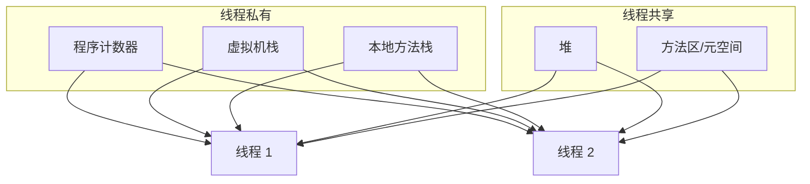

| 区域          | 线程 | 存储内容                     | 异常                       |
| ----------- | -- | ------------------------ | ------------------------ |
| **程序计数器**   | 私有 | 当前线程执行的字节码行号             | 无（唯一无 OOM 的区域）           |
| **虚拟机栈**    | 私有 | 栈帧（局部变量表、操作数栈、动态链接、返回地址） | StackOverflowError / OOM |
| **本地方法栈**   | 私有 | Native 方法                | StackOverflowError / OOM |
| **堆**       | 共享 | 对象实例、数组                  | OOM                      |
| **方法区/元空间** | 共享 | 类信息、常量、静态变量、JIT 代码       | OOM                      |
| **直接内存**    | 共享 | NIO 使用的堆外内存              | OOM                      |

#### 线程私有 vs 共享

```
线程私有：随线程创建而创建，随线程销毁而销毁
  - 程序计数器
  - 虚拟机栈
  - 本地方法栈

线程共享：所有线程共享，随 JVM 启动创建
  - 堆
  - 方法区/元空间
```

***

### Q2. 堆内存的结构（年轻代/老年代/元空间）？

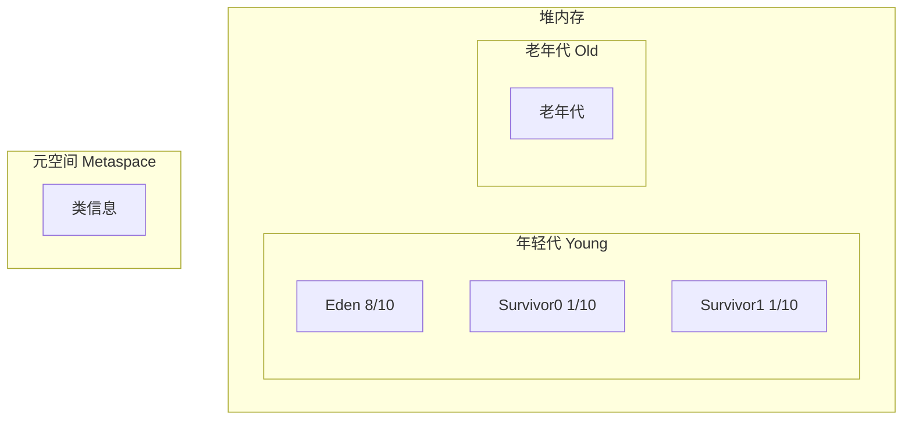

#### 堆内存划分（JDK 8 默认）

| 区域              | 默认比例      | 存储内容        | GC 方式              |
| --------------- | --------- | ----------- | ------------------ |
| **Eden**        | 年轻代 8/10  | 新创建的对象      | Minor GC           |
| **Survivor0/1** | 年轻代各 1/10 | 存活的对象       | Minor GC           |
| **老年代**         | 堆 2/3     | 长期存活的对象、大对象 | Major GC / Full GC |
| **元空间**         | 本地内存      | 类信息、常量      | Full GC            |

#### 对象晋升规则

```
1. 对象在 Eden 创建
2. Minor GC 后存活 → 复制到 Survivor（年龄 +1）
3. 年龄达到阈值（默认 15）→ 晋升到老年代
4. Survivor 中相同年龄对象大小总和 > Survivor 空间的一半 → 年龄 >= 该值的对象直接晋升
5. 大对象（超过 -XX:PretenureSizeThreshold）直接进入老年代
```

***

### Q3. 程序计数器、虚拟机栈、本地方法栈？

#### 程序计数器（PC Register）

```
作用：记录当前线程执行的字节码行号
特点：
  - 线程私有
  - 唯一不会 OOM 的区域
  - 执行 Native 方法时为 undefined
```

#### 虚拟机栈（VM Stack）

```
每个方法调用创建一个栈帧（Stack Frame）：
  - 局部变量表：基本类型、对象引用
  - 操作数栈：计算临时数据
  - 动态链接：符号引用转直接引用
  - 返回地址：方法返回地址

异常：
  - StackOverflowError：栈深度超过限制（递归太深）
  - OutOfMemoryError：栈扩展时内存不足
```

#### 栈帧结构

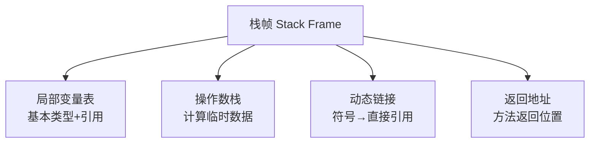

#### 本地方法栈

```
为 Native 方法服务，与虚拟机栈类似
HotSpot 中两者合并为一个
```

***

### Q4. 方法区与元空间的区别？

| 维度     | 方法区（永久代 PermGen）                            | 元空间（Metaspace）                          |
| ------ | ------------------------------------------- | --------------------------------------- |
| JDK 版本 | JDK 7 及以前                                   | JDK 8+                                  |
| 内存位置   | 堆内存中                                        | 本地内存（Native Memory）                     |
| 大小限制   | 受堆大小限制（-XX:MaxPermSize）                     | 受本地内存限制（-XX:MaxMetaspaceSize）           |
| OOM 类型 | `java.lang.OutOfMemoryError: PermGen space` | `java.lang.OutOfMemoryError: Metaspace` |
| 字符串常量池 | JDK7 前移到永久代                                 | JDK7 移到堆                                |

#### 为什么废除永久代？

```
1. 永久代大小难确定，容易 OOM
2. GC 复杂，与堆耦合
3. 类元数据不受堆大小限制更灵活
```

***

## 二、对象创建与内存分配

### Q5. 对象的创建过程？

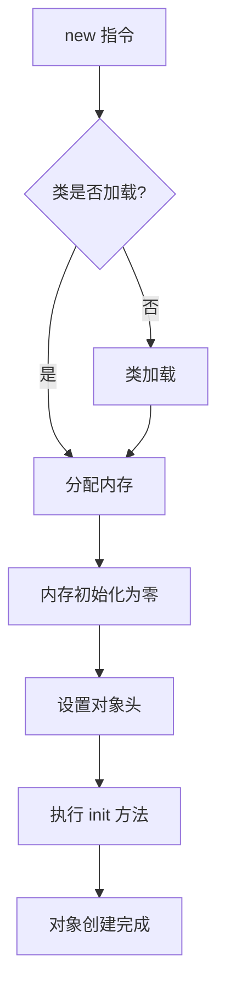

#### 详细步骤

| 步骤             | 说明                |
| -------------- | ----------------- |
| 1. 类加载检查       | 检查类是否已加载、解析、初始化   |
| 2. 分配内存        | 在堆中为对象分配空间        |
| 3. 初始化零值       | 内存空间初始化为零值（默认值）   |
| 4. 设置对象头       | 标记对象类型、哈希码、GC 年龄等 |
| 5. 执行 `<init>` | 调用构造方法            |

#### 内存分配方式

| 方式                         | 原理      | 适用                   |
| -------------------------- | ------- | -------------------- |
| **指针碰撞（Bump The Pointer）** | 移动分界指针  | 堆内存规整（Serial/ParNew） |
| **空闲列表（Free List）**        | 维护空闲块列表 | 堆内存不规整（CMS）          |

#### 线程安全分配

```
TLAB（Thread Local Allocation Buffer）：
每个线程在 Eden 区有一块私有缓冲区
线程优先在 TLAB 分配，避免锁竞争
-XX:+UseTLAB（默认开启）
```

***

### Q6. 对象的内存布局？

```
对象在内存中由三部分组成：
  1. 对象头（Header）
  2. 实例数据（Instance Data）
  3. 对齐填充（Padding）
```

#### 对象头

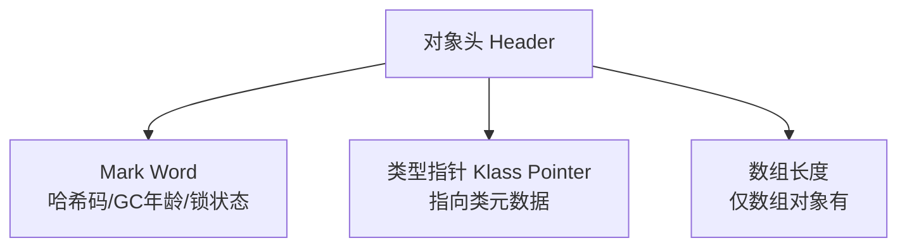

| 部分            | 大小（64位）        | 内容             |
| ------------- | -------------- | -------------- |
| **Mark Word** | 8 字节           | 哈希码、GC 年龄、锁标志位 |
| **类型指针**      | 8 字节（压缩后 4 字节） | 指向类元数据         |
| **数组长度**      | 4 字节           | 仅数组对象          |

#### 实例数据与对齐填充

```
实例数据：对象的字段（基本类型 + 引用类型）
对齐填充：HotSpot 要求对象大小 8 字节对齐，不足则填充
```

***

### Q7. 对象的访问定位方式？

| 方式                   | 原理               | 优点        | 缺点         |
| -------------------- | ---------------- | --------- | ---------- |
| **句柄访问**             | 栈中引用指向句柄池，句柄指向对象 | 对象移动只需改句柄 | 多一次指针开销    |
| **直接指针（HotSpot 默认）** | 栈中引用直接指向对象       | 访问快       | 对象移动需改所有引用 |

#### HotSpot 直接指针

```
栈中 reference → 堆中对象 → 对象头类型指针 → 方法区类元数据
```

***

### Q8. 对象内存分配策略？

| 策略              | 说明                                             |
| --------------- | ---------------------------------------------- |
| **优先在 Eden 分配** | 新对象默认在 Eden 创建                                 |
| **大对象直接进老年代**   | 超过 PretenureSizeThreshold 的对象                  |
| **长期存活对象进老年代**  | 年龄超过 MaxTenuringThreshold（默认 15）               |
| **动态年龄判定**      | Survivor 中相同年龄对象大小 > Survivor 一半，年龄 >= 该值的对象晋升 |
| **空间分配担保**      | Minor GC 前检查老年代是否有足够空间                         |

#### 示例

```bash
# 大对象阈值（超过 1MB 直接进老年代）
-XX:PretenureSizeThreshold=1048576

# 晋升年龄阈值
-XX:MaxTenuringThreshold=15
```

***

## 三、垃圾回收基础

### Q9. 如何判断对象是否可回收？

#### 两种算法

| 算法                 | 原理                   | 缺点       |
| ------------------ | -------------------- | -------- |
| **引用计数法**          | 每个对象有引用计数器，为 0 则回收   | 无法解决循环引用 |
| **可达性分析（HotSpot）** | 从 GC Roots 遍历，不可达则回收 | 需遍历整个引用链 |

#### 循环引用问题

```java
// 引用计数法无法回收循环引用的对象
class A { B b; }
class B { A a; }
A a = new A();
B b = new B();
a.b = b;
b.a = a;
a = null;
b = null;
// 此时 a 和 b 互相引用，但外部已不可达
// 引用计数法：计数都不为 0，无法回收
// 可达性分析：从 GC Roots 不可达，可回收
```

#### GC Roots 有哪些？

```
1. 虚拟机栈中引用的对象（局部变量）
2. 方法区中静态变量引用的对象
3. 方法区中常量引用的对象
4. 本地方法栈中 JNI 引用的对象
5. 活跃线程
```

***

### Q10. 四种引用类型（强/软/弱/虚）？

| 引用类型    | 回收时机           | 用途             | 实现类                         |
| ------- | -------------- | -------------- | --------------------------- |
| **强引用** | 永不回收（除非置 null） | 普通对象           | `Object obj = new Object()` |
| **软引用** | 内存不足时回收        | 缓存             | `SoftReference`             |
| **弱引用** | 下次 GC 时回收      | 缓存、ThreadLocal | `WeakReference`             |
| **虚引用** | 随时回收，跟踪对象回收    | 堆外内存管理         | `PhantomReference`          |

#### 示例

```java
// 强引用
Object strong = new Object();

// 软引用：内存不足时回收
SoftReference<Object> soft = new SoftReference<>(new Object());

// 弱引用：下次 GC 回收
WeakReference<Object> weak = new WeakReference<>(new Object());

// 虚引用：必须配合 ReferenceQueue
ReferenceQueue<Object> queue = new ReferenceQueue<>();
PhantomReference<Object> phantom = new PhantomReference<>(new Object(), queue);
```

#### 应用场景

```
1. 软引用：图片缓存（内存不足时回收）
2. 弱引用：ThreadLocal 的 key、WeakHashMap
3. 虚引用：管理堆外内存（DirectByteBuffer）
```

***

### Q11. finalize() 方法的作用？

#### 核心答案

`finalize()` 是 Object 的方法，对象被 GC 前可能被调用，**但不保证执行，且只能执行一次**。

#### 自救示例

```java
public class FinalizeEscape {
    private static FinalizeEscape SAVE_HOOK = null;

    @Override
    protected void finalize() throws Throwable {
        super.finalize();
        System.out.println("finalize 执行");
        SAVE_HOOK = this;  // 自救：重新建立引用
    }

    public static void main(String[] args) throws Exception {
        SAVE_HOOK = new FinalizeEscape();
        SAVE_HOOK = null;
        System.gc();
        Thread.sleep(500);
        // 第一次 finalize 自救成功
        System.out.println(SAVE_HOOK != null ? "存活" : "已回收");

        SAVE_HOOK = null;
        System.gc();
        Thread.sleep(500);
        // 第二次 finalize 不会再执行，对象被回收
        System.out.println(SAVE_HOOK != null ? "存活" : "已回收");
    }
}
```

#### 为什么不推荐用 finalize？

```
1. 执行时间不确定，可能永远不执行
2. 只能执行一次
3. 开销大，影响 GC 性能
4. Java 9 已标记为 @Deprecated
5. 推荐用 try-with-resources 或 Cleaner
```

***

## 四、垃圾回收算法

### Q12. 常见 GC 算法（标记-清除/复制/标记-整理/分代）？

| 算法        | 原理            | 优点     | 缺点      |
| --------- | ------------- | ------ | ------- |
| **标记-清除** | 标记可回收对象，清除    | 简单     | 产生内存碎片  |
| **复制算法**  | 将存活对象复制到另一半空间 | 无碎片，高效 | 浪费一半空间  |
| **标记-整理** | 标记后将存活对象移到一端  | 无碎片    | 移动对象开销大 |
| **分代收集**  | 不同代用不同算法      | 综合最优   | 复杂      |

#### 标记-清除

```
存活对象：A C E F
清除前：[A][B][C][D][E][F]
清除后：[A][ ][C][ ][E][F]  ← 产生碎片
```

#### 复制算法

```
From 区：[A][B][C][D][E]
标记存活：A C E
复制到 To 区：[A][C][E][ ][ ]
清空 From 区
```

#### 标记-整理

```
标记存活：A C E
清除前：[A][B][C][D][E]
整理后：[A][C][E][ ][ ]  ← 无碎片
```

#### 分代收集

```
年轻代：复制算法（对象存活率低）
老年代：标记-清除 或 标记-整理（对象存活率高）
```

***

### Q13. Minor GC / Major GC / Full GC 的区别？

| 类型           | 作用区域      | 触发条件    | STW 时间 |
| ------------ | --------- | ------- | ------ |
| **Minor GC** | 年轻代       | Eden 满  | 短      |
| **Major GC** | 老年代       | 老年代空间不足 | 长      |
| **Full GC**  | 整个堆 + 元空间 | 多种触发    | 最长     |

#### Full GC 触发条件

```
1. 老年代空间不足
2. 元空间不足
3. System.gc() 调用
4. Minor GC 晋升担保失败
5. CMS 出现 Concurrent Mode Failure
```

#### 空间分配担保

```
Minor GC 前检查：
老年代最大可用空间 > 历次晋升老年代对象平均大小？
  - 是：执行 Minor GC
  - 否：执行 Full GC（担保失败）
```

***

### Q14. 什么是 STW（Stop The World）？

#### 核心答案

STW 是 GC 过程中**暂停所有用户线程**的现象，所有 GC 算法都有 STW，只是时间长短不同。

#### STW 的目的

```
1. 保证 GC 期间对象状态不变
2. 可达性分析时引用关系不变化
3. 标记-整理时移动对象的一致性
```

#### 各收集器 STW 对比

| 收集器      | STW 时间        |
| -------- | ------------- |
| Serial   | 长（单线程）        |
| Parallel | 中（多线程）        |
| CMS      | 短（并发标记）       |
| G1       | 可预测（默认 200ms） |
| ZGC      | 极短（< 10ms）    |

***

## 五、垃圾收集器

### Q15. 常见垃圾收集器有哪些？

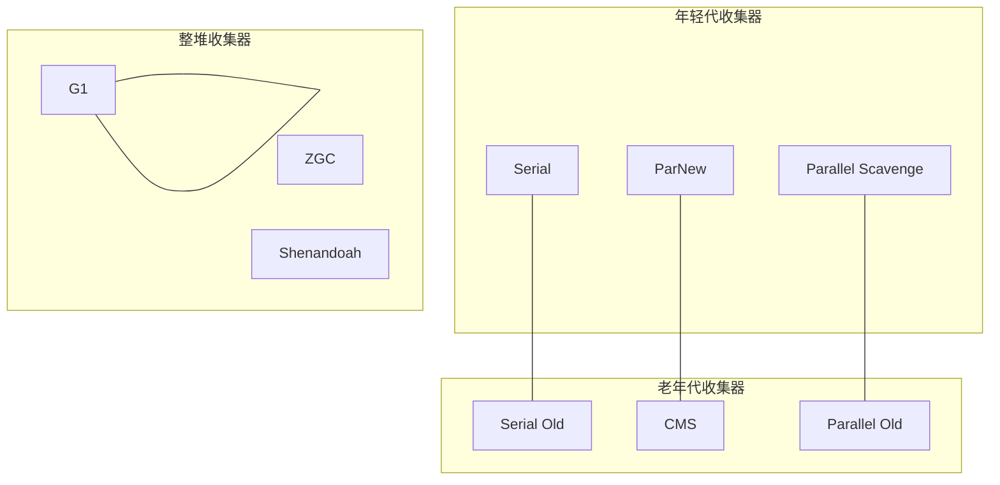

#### 收集器对比

| 收集器                   | 代   | 线程  | 算法       | 适用     |
| --------------------- | --- | --- | -------- | ------ |
| **Serial**            | 年轻代 | 单线程 | 复制       | 客户端    |
| **ParNew**            | 年轻代 | 多线程 | 复制       | 配合 CMS |
| **Parallel Scavenge** | 年轻代 | 多线程 | 复制       | 吞吐量优先  |
| **CMS**               | 老年代 | 多线程 | 标记-清除    | 低延迟    |
| **G1**                | 整堆  | 多线程 | 标记-整理+复制 | 可预测延迟  |
| **ZGC**               | 整堆  | 多线程 | 着色指针+读屏障 | 超低延迟   |

#### 组合关系

```
Serial + Serial Old：单线程组合
ParNew + CMS：低延迟组合（JDK 8 默认的服务端组合之一）
Parallel Scavenge + Parallel Old：吞吐量组合
G1：独立收集器，不需要配合（JDK 9+ 默认）
```

***

### Q16. CMS 收集器原理与缺点？

#### 四个阶段

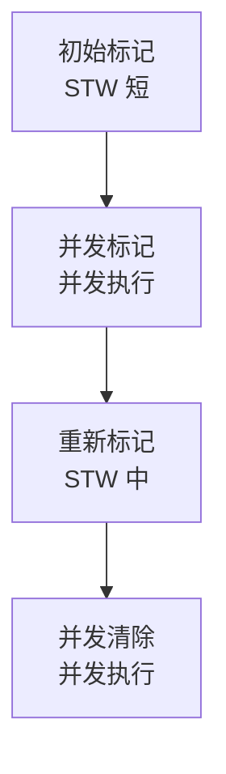

| 阶段       | 是否 STW | 说明                 |
| -------- | ------ | ------------------ |
| **初始标记** | ✅ 短    | 标记 GC Roots 直接关联对象 |
| **并发标记** | ❌      | 从 GC Roots 遍历整个对象图 |
| **重新标记** | ✅ 中    | 修正并发标记期间变化的引用      |
| **并发清除** | ❌      | 清除已标记对象            |

#### 缺点

| 缺点                          | 说明                        |
| --------------------------- | ------------------------- |
| **内存碎片**                    | 标记-清除产生碎片                 |
| **CPU 敏感**                  | 并发阶段占用 CPU                |
| **Concurrent Mode Failure** | 并发清除时老年代满 → 触发 Serial Old |
| **无法处理浮动垃圾**                | 并发标记期间产生的新垃圾需下次 GC        |

#### 调优参数

```bash
# 启用 CMS
-XX:+UseConcMarkSweepGC

# 触发 CMS 的老年代占用比例
-XX:CMSInitiatingOccupancyFraction=75

# 内存碎片整理
-XX:+UseCMSCompactAtFullCollection
-XX:CMSFullGCsBeforeCompaction=5
```

***

### Q17. G1 收集器原理与优势？

#### 核心思想

```
G1 将堆划分为多个大小相等的 Region（1-32MB）
每个 Region 可作为 Eden、Survivor、Old、Humongous
跟踪每个 Region 的垃圾价值（可回收空间）
优先回收价值最大的 Region（Garbage First）
```

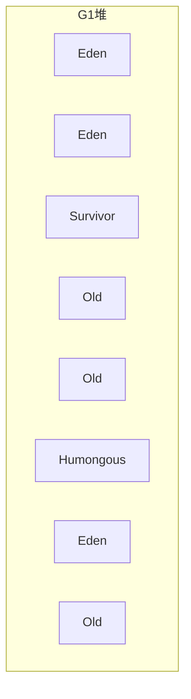

#### G1 的回收阶段

| 阶段                  | 说明                      |
| ------------------- | ----------------------- |
| **年轻代 GC**          | 复制算法，回收 Eden + Survivor |
| **并发标记周期**          | 初始标记 → 并发标记 → 重新标记 → 清理 |
| **混合 GC（Mixed GC）** | 回收年轻代 + 部分老年代 Region    |

#### G1 的优势

| 优势        | 说明                              |
| --------- | ------------------------------- |
| **可预测暂停** | `-XX:MaxGCPauseMillis` 控制目标暂停时间 |
| **无内存碎片** | 复制算法整理 Region                   |
| **整堆回收**  | 不分代回收，更灵活                       |
| **大对象优化** | Humongous Region 存放大对象          |

#### 适用场景

```
1. 堆内存较大（> 4GB）
2. 需要可预测的暂停时间
3. JDK 9+ 默认收集器
```

#### 关键参数

```bash
# 启用 G1
-XX:+UseG1GC

# 最大暂停时间目标
-XX:MaxGCPauseMillis=200

# Region 大小
-XX:G1HeapRegionSize=16m

# 触发 Mixed GC 的老年代占用
-XX:InitiatingHeapOccupancyPercent=45
```

***

### Q18. ZGC / Shenandoah 收集器？

#### 核心目标

```
低延迟（STW < 10ms），不随堆大小增加
```

#### ZGC

| 特性                         | 说明             |
| -------------------------- | -------------- |
| **着色指针（Colored Pointers）** | 指针中存储对象状态信息    |
| **读屏障（Load Barrier）**      | 读取对象时检查并修正引用   |
| **并发整理**                   | 整理阶段也并发        |
| **暂停时间**                   | < 10ms，不随堆大小增加 |

#### 适用场景

```
1. 超大堆（TB 级）
2. 超低延迟要求
3. JDK 15+ 正式支持
```

```bash
# 启用 ZGC
-XX:+UseZGC
```

#### Shenandoah

```
与 ZGC 类似，由 RedHat 开发
核心：Brooks 指针（转发指针）实现并发整理
JDK 12+ 支持
```

***

## 六、内存泄漏与 OOM

### Q19. 什么是内存泄漏？常见场景？

#### 核心答案

内存泄漏 = 对象已不再使用，但**仍被 GC Roots 引用**，无法被回收。

#### 常见场景

| 场景                  | 原因                        | 解决                       |
| ------------------- | ------------------------- | ------------------------ |
| **静态集合持有对象**        | static Map/List 不断添加不清理   | 使用 WeakHashMap、及时 remove |
| **ThreadLocal 未清理** | ThreadLocalMap 的 Entry 泄漏 | 用完调用 remove()            |
| **未关闭的资源**          | 流、连接、监听器未关闭               | try-with-resources       |
| **缓存未设上限**          | 缓存无限增长                    | 用 LRU 缓存（Guava/Caffeine） |
| **监听器未注销**          | 注册了监听器但没注销                | 注销监听器                    |
| **内部类持有外部类**        | 非静态内部类隐式持有外部类引用           | 用静态内部类 + 弱引用             |
| **单例持有外部对象**        | 单例持有大对象引用                 | 及时置 null                 |

#### 静态集合泄漏示例

```java
// ❌ 内存泄漏：静态 List 不断添加
public class Cache {
    private static List<Object> list = new ArrayList<>();

    public void add(Object obj) {
        list.add(obj);  // 永远不清理
    }
}

// ✅ 解决：用弱引用或限制大小
public class Cache {
    private static final int MAX_SIZE = 1000;
    private static List<WeakReference<Object>> list = new ArrayList<>();

    public void add(Object obj) {
        if (list.size() > MAX_SIZE) {
            list.clear();
        }
        list.add(new WeakReference<>(obj));
    }
}
```

***

### Q20. 常见 OOM 类型与排查？

| OOM 类型                                    | 原因                    |
| ----------------------------------------- | --------------------- |
| **Java heap space**                       | 堆内存不足                 |
| **GC overhead limit exceeded**            | GC 耗时过长（>98%时间，回收<2%） |
| **Metaspace**                             | 元空间不足（类加载过多）          |
| **Direct buffer memory**                  | 堆外内存不足（NIO）           |
| **unable to create new native thread**    | 线程数过多                 |
| **Requested array size exceeds VM limit** | 数组太大                  |

#### 排查步骤

```bash
# 1. 导出堆转储
jmap -dump:format=b,file=heap.hprof <pid>

# 2. 或启动时加参数自动 dump
-XX:+HeapDumpOnOutOfMemoryError
-XX:HeapDumpPath=/path/to/dump

# 3. 用 MAT / VisualVM / JProfiler 分析
#    - 查看大对象
#    - 查看引用链
#    - 查看内存泄漏嫌疑

# 4. 查看 GC 日志
-Xlog:gc*:file=gc.log:time,tags
```

#### 工具

| 工具         | 说明         |
| ---------- | ---------- |
| **jmap**   | 导出堆转储、查看内存 |
| **jstat**  | 查看 GC 统计   |
| **jstack** | 查看线程栈      |
| **MAT**    | 堆内存分析      |
| **Arthas** | 阿里开源诊断工具   |

***

### Q21. ThreadLocal 内存泄漏原理？

#### 核心结构

```
Thread → ThreadLocalMap → Entry(WeakReference<ThreadLocal>, value)

ThreadLocal 作为 key 是弱引用
但 value 是强引用，由 Entry 持有
```

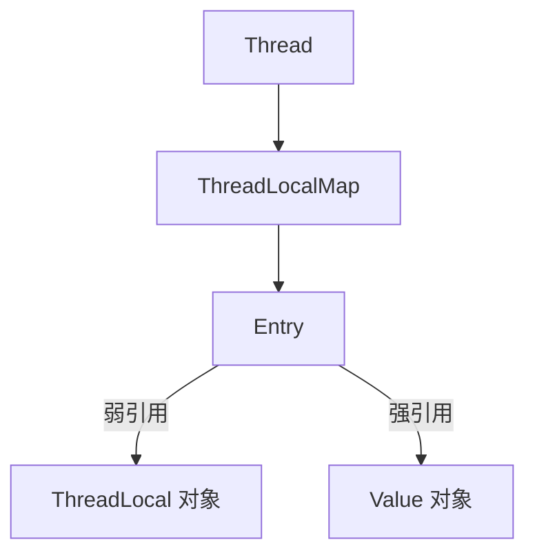

#### 泄漏原因

```
1. ThreadLocal 被置 null，GC 回收了 ThreadLocal 对象
2. Entry 的 key（弱引用）被回收，key = null
3. 但 Entry 的 value（强引用）无法回收
4. 如果线程不结束（线程池），value 一直无法回收 → 泄漏
```

#### 解决

```java
ThreadLocal<Object> tl = new ThreadLocal<>();
try {
    tl.set(obj);
    // 使用
} finally {
    tl.remove();  // 必须调用 remove()
}
```

#### 为什么用弱引用？

```
如果 key 是强引用：ThreadLocal 永远无法回收，泄漏更严重
如果 key 是弱引用：ThreadLocal 可被回收，但需手动 remove value
```

***

## 七、JVM 调优

### Q22. 常用 JVM 参数有哪些？

#### 堆内存

```bash
# 初始堆和最大堆（建议设为相同值，避免动态扩展）
-Xms4g -Xmx4g

# 年轻代大小
-Xmn1g
# 或
-XX:NewRatio=2   # 年轻代:老年代 = 1:2

# Eden 和 Survivor 比例
-XX:SurvivorRatio=8   # Eden:Survivor = 8:1:1
```

#### 元空间

```bash
# 元空间大小
-XX:MetaspaceSize=256m
-XX:MaxMetaspaceSize=512m
```

#### GC 收集器

```bash
# G1（JDK 9+ 默认）
-XX:+UseG1GC

# CMS
-XX:+UseConcMarkSweepGC

# ZGC
-XX:+UseZGC
```

#### GC 日志

```bash
# JDK 9+
-Xlog:gc*:file=gc.log:time,tags

# JDK 8
-XX:+PrintGCDetails
-XX:+PrintGCDateStamps
-Xloggc:gc.log
```

#### OOM Dump

```bash
-XX:+HeapDumpOnOutOfMemoryError
-XX:HeapDumpPath=/path/to/dump
```

#### 生产环境推荐配置

```bash
java -Xms4g -Xmx4g \
     -XX:+UseG1GC \
     -XX:MaxGCPauseMillis=200 \
     -XX:MetaspaceSize=256m \
     -XX:MaxMetaspaceSize=512m \
     -XX:+HeapDumpOnOutOfMemoryError \
     -XX:HeapDumpPath=/data/dump \
     -Xlog:gc*:file=/data/logs/gc.log:time,tags \
     -jar app.jar
```

***

### Q23. 如何排查 CPU 飙高？

#### 排查步骤

```bash
# 1. 找到 CPU 最高的 Java 进程
top
# 或
ps -ef | grep java

# 2. 找到进程中 CPU 最高的线程
top -Hp <pid>

# 3. 将线程 ID 转十六进制
printf "%x\n" <tid>

# 4. 查看线程栈
jstack <pid> | grep <tid_hex> -A 30
```

#### 常见原因

| 原因        | 排查                 |
| --------- | ------------------ |
| **死循环**   | 看线程栈是否卡在某段代码       |
| **频繁 GC** | jstat 看 GC 频率      |
| **死锁**    | jstack 查找 deadlock |
| **热点代码**  | Arthas trace 方法耗时  |

#### Arthas 快速排查

```bash
# 查看 CPU 最高的线程
thread -n 3

# 查看死锁
thread -b

# 追踪方法耗时
trace com.example.Service method
```

***

### Q24. 如何排查频繁 Full GC？

#### 排查步骤

```bash
# 1. 查看 GC 统计
jstat -gcutil <pid> 1000 10

# 2. 查看 GC 日志
# 分析 GC 频率、耗时、回收效果

# 3. 导出堆转储分析
jmap -dump:format=b,file=heap.hprof <pid>
```

#### 常见原因

| 原因                 | 解决                            |
| ------------------ | ----------------------------- |
| **内存泄漏**           | 分析堆转储，找泄漏对象                   |
| **大对象过多**          | 检查代码，避免大对象                    |
| **元空间不足**          | 调大 MaxMetaspaceSize           |
| **System.gc() 调用** | 检查代码，加 -XX:+DisableExplicitGC |
| **堆太小**            | 调大 -Xmx                       |

#### jstat 输出解读

```
 S0     S1     E      O      M     CCS    YGC     YGCT    FGC    FGCT     GCT
 0.00  50.00  30.00  85.00  90.00  80.00     50    1.234     5    2.567    3.801

S0/S1：Survivor0/1 使用率
E：Eden 使用率
O：老年代使用率
M：元空间使用率
YGC：年轻代 GC 次数
YGCT：年轻代 GC 耗时
FGC：Full GC 次数
FGCT：Full GC 耗时
```

***

## 八、类加载与内存

### Q25. 类加载过程？

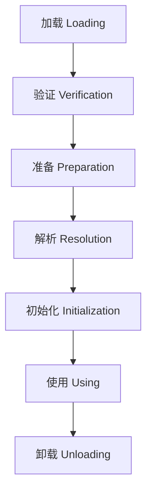

#### 各阶段

| 阶段      | 说明                               |
| ------- | -------------------------------- |
| **加载**  | 通过类全限定名获取二进制字节流，生成 Class 对象      |
| **验证**  | 验证字节码合法性（文件格式、元数据、字节码、符号引用）      |
| **准备**  | 为静态变量分配内存并赋零值（final 除外）          |
| **解析**  | 符号引用转为直接引用                       |
| **初始化** | 执行 `<clinit>` 方法（静态变量赋值 + 静态代码块） |

#### 初始化触发时机（主动引用）

```
1. new 对象
2. 调用静态方法
3. 访问静态变量（非 final）
4. 反射调用
5. 初始化子类时先初始化父类
6. 主类启动
```

#### 被动引用不触发初始化

```java
// 1. 通过子类引用父类静态变量，只初始化父类
System.out.println(SubClass.value);  // 不初始化 SubClass

// 2. 数组定义不触发
SuperClass[] arr = new SuperClass[10];

// 3. 常量引用不触发
System.out.println(Class.CONSTANT);  // 编译期常量
```

***

### Q26. 双亲委派模型？

#### 核心原理

```
类加载请求 → 委派给父加载器 → 父加载器无法加载 → 自己加载
```

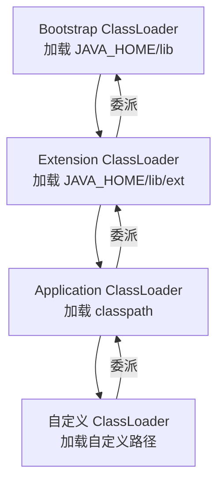

#### 为什么用双亲委派？

```
1. 安全性：防止核心类被篡改（如 java.lang.String）
2. 避免重复加载：同一个类只会被加载一次
3. 类层次清晰：保证类的唯一性
```

#### 破坏双亲委派

```
1. SPI 机制（JDBC、JNDI）：线程上下文类加载器
2. OSGi：模块化类加载
3. Tomcat：每个 Web 应用独立的类加载器
4. 自定义 ClassLoader：重写 loadClass 方法
```

#### 自定义类加载器示例

```java
public class MyClassLoader extends ClassLoader {
    private String path;

    public MyClassLoader(String path) {
        this.path = path;
    }

    @Override
    protected Class<?> findClass(String name) throws ClassNotFoundException {
        try {
            String fileName = path + "/" + name.replace('.', '/') + ".class";
            byte[] bytes = Files.readAllBytes(Paths.get(fileName));
            return defineClass(name, bytes, 0, bytes.length);
        } catch (IOException e) {
            throw new ClassNotFoundException(name, e);
        }
    }
}
```

***

## 九、综合实战题

### Q27. 一次线上 OOM 排查完整流程？

#### 完整流程

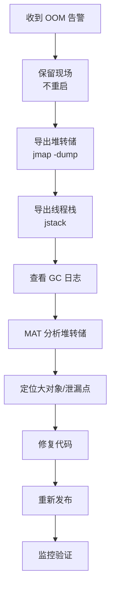

#### 具体步骤

```bash
# 1. 确认进程存活，保留现场
# 不要立即重启，先 dump

# 2. 导出堆转储
jmap -dump:format=b,file=/tmp/heap.hprof <pid>

# 3. 导出线程栈
jstack <pid> > /tmp/thread.txt

# 4. 查看 GC 情况
jstat -gcutil <pid> 1000 10

# 5. 用 MAT 分析 heap.hprof
#    - Histogram：按类统计对象数量和大小
#    - Dominator Tree：找大对象
#    - Path to GC Roots：找泄漏引用链
#    - Leak Suspects：自动分析泄漏嫌疑
```

#### 常见问题定位

| 现象         | 可能原因                    |
| ---------- | ----------------------- |
| 某个类对象数量异常多 | 集合不断添加未清理               |
| 大对象占比高     | 大对象未及时释放                |
| 线程数过多      | ThreadLocal 泄漏 / 线程池未关闭 |
| Class 对象过多 | 动态代理 / 热部署类加载器泄漏        |

***

### Q28. 如何设计高并发服务的 JVM 参数？

#### 场景：4C8G 的 Spring Boot 服务

```bash
java \
  # 堆内存：留 2G 给系统和元空间
  -Xms6g -Xmx6g \
  # 年轻代：设大些，减少 Minor GC 频率
  -Xmn2g \
  # 元空间
  -XX:MetaspaceSize=256m \
  -XX:MaxMetaspaceSize=512m \
  # G1 收集器
  -XX:+UseG1GC \
  -XX:MaxGCPauseMillis=200 \
  -XX:G1HeapRegionSize=16m \
  # 大对象阈值
  -XX:PretenureSizeThreshold=1m \
  # 晋升年龄
  -XX:MaxTenuringThreshold=15 \
  # GC 日志
  -Xlog:gc*:file=/data/logs/gc.log:time,tags \
  # OOM 自动 dump
  -XX:+HeapDumpOnOutOfMemoryError \
  -XX:HeapDumpPath=/data/dump \
  # 禁用显式 GC
  -XX:+DisableExplicitGC \
  -jar app.jar
```

#### 调优思路

```
1. 堆大小：物理内存的 70-80%
2. 年轻代：高并发服务设大些（减少 Minor GC）
3. 收集器：G1（可预测延迟）
4. 监控：GC 日志 + 堆 dump + APM
5. 目标：
   - Minor GC 频率 < 1次/秒
   - Full GC < 1次/天
   - GC 总耗时 < 5%
```

***

## 十、速答与踩坑总结

### 10.1 速答卡片

**Q：JVM 运行时数据区有哪些？**
A：程序计数器、虚拟机栈、本地方法栈（线程私有）+ 堆、方法区/元空间（线程共享）。

**Q：堆内存怎么划分？**
A：年轻代（Eden + 2 Survivor）+ 老年代；JDK8 方法区改为元空间（本地内存）。

**Q：如何判断对象可回收？**
A：可达性分析，从 GC Roots 遍历，不可达则可回收。

**Q：四种引用类型？**
A：强引用（不回收）、软引用（内存不足回收）、弱引用（下次 GC 回收）、虚引用（跟踪回收）。

**Q：GC 算法有哪些？**
A：标记-清除、复制、标记-整理、分代收集。

**Q：Minor/Full GC 区别？**
A：Minor GC 回收年轻代，快；Full GC 回收整堆+元空间，慢。

**Q：常见收集器？**
A：Serial、ParNew、Parallel、CMS、G1、ZGC；JDK9+ 默认 G1。

**Q：CMS 的四个阶段？**
A：初始标记（STW）→ 并发标记 → 重新标记（STW）→ 并发清除。

**Q：G1 的优势？**
A：可预测暂停时间、无内存碎片、整堆回收、Region 化。

**Q：内存泄漏常见原因？**
A：静态集合、ThreadLocal 未清理、未关闭资源、缓存无限增长、监听器未注销。

**Q：ThreadLocal 为什么泄漏？**
A：Entry 的 value 是强引用，线程不结束时 value 无法回收；用完要 remove()。

**Q：如何排查 OOM？**
A：jmap 导出堆转储 → MAT 分析大对象和引用链 → 修复代码。

**Q：双亲委派模型？**
A：类加载先委派给父加载器，父加载不了才自己加载，保证核心类安全。

***

### 10.2 实战踩坑 10 例

| #  | 场景               | 现象                      | 根因                   | 解决                        |
| -- | ---------------- | ----------------------- | -------------------- | ------------------------- |
| 1  | 服务运行几小时后 OOM     | heap space              | 静态 Map 不断添加          | 加 LRU 或 WeakHashMap       |
| 2  | 线程池任务异常后内存涨      | OOM                     | ThreadLocal 未 remove | finally 中 remove          |
| 3  | Full GC 频繁       | 服务卡顿                    | 元空间满（热部署）            | 调大 MaxMetaspaceSize       |
| 4  | CPU 飙高 100%      | 服务无响应                   | 死循环                  | jstack 定位                 |
| 5  | 大对象直接进老年代        | 频繁 Full GC              | 大对象未分批               | 调大 PretenureSizeThreshold |
| 6  | CMS 内存碎片         | Concurrent Mode Failure | 标记-清除产生碎片            | 用 G1 或开启碎片整理              |
| 7  | 线程数过多            | unable to create thread | 线程池未限制               | 固定线程池大小                   |
| 8  | 堆外内存泄漏           | Direct buffer memory    | NIO ByteBuffer 未释放   | 用 try-with-resources      |
| 9  | Xms != Xmx       | 启动后内存波动                 | 堆动态扩展                | Xms = Xmx                 |
| 10 | System.gc() 频繁触发 | 非预期 Full GC             | 代码或依赖调用              | -XX:+DisableExplicitGC    |

***

### 10.3 复习优先级表

| 优先级    | 主题             | 考察概率 | 建议复习时间 |
| ------ | -------------- | ---- | ------ |
| **P0** | JVM 运行时数据区     | 95%  | 30min  |
| **P0** | GC 算法          | 90%  | 30min  |
| **P0** | G1 收集器         | 90%  | 1h     |
| **P0** | OOM 排查         | 95%  | 1h     |
| **P0** | 内存泄漏           | 85%  | 30min  |
| **P1** | 对象创建与布局        | 75%  | 30min  |
| **P1** | 四种引用           | 75%  | 15min  |
| **P1** | 双亲委派           | 80%  | 30min  |
| **P1** | CMS 收集器        | 70%  | 30min  |
| **P2** | ThreadLocal 泄漏 | 65%  | 30min  |
| **P2** | 类加载过程          | 60%  | 30min  |
| **P2** | JVM 调优参数       | 60%  | 30min  |
| **P3** | ZGC/Shenandoah | 45%  | 30min  |
| **P3** | 直接内存           | 40%  | 15min  |

```mermaid
flowchart LR
    P0[JVM运行时数据区] --> P0a[GC算法]
    P0a --> P0b[G1收集器]
    P0b --> P0c[OOM排查]
    P0c --> P0d[内存泄漏]
    P0d --> P1a[对象创建与布局]
    P1a --> P1b[四种引用]
    P1b --> P1c[双亲委派]
    P1c --> P1d[CMS收集器]
    P1d --> P2a[ThreadLocal泄漏]
    P2a --> P2b[类加载过程]
    P2b --> P2c[JVM调优参数]
    P2c --> P3a[ZGC/Shenandoah]
    P3a --> P3b[直接内存]

    style P0 fill:#f8d7da,stroke-width:3px
    style P0a fill:#f8d7da,stroke-width:3px
    style P0b fill:#f8d7da,stroke-width:3px
    style P0c fill:#f8d7da,stroke-width:3px
    style P0d fill:#f8d7da,stroke-width:3px
```

