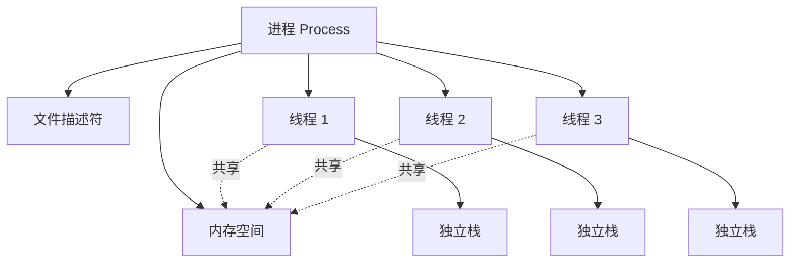
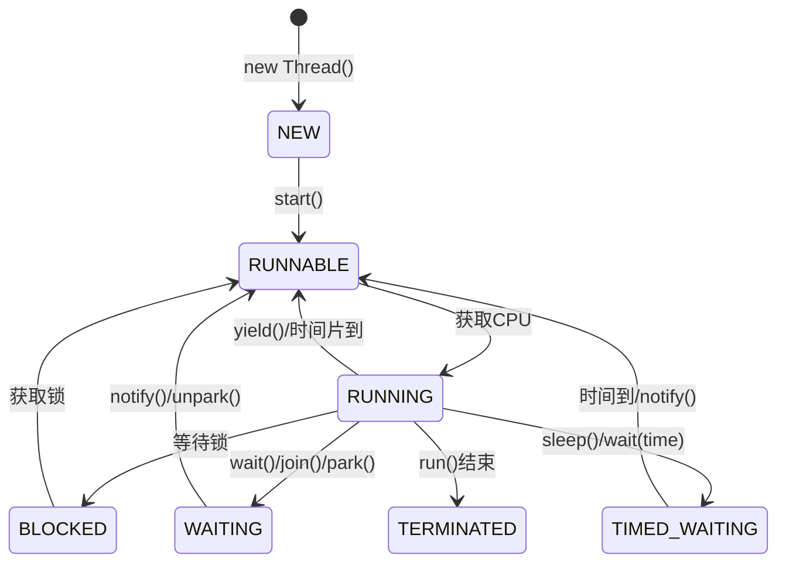
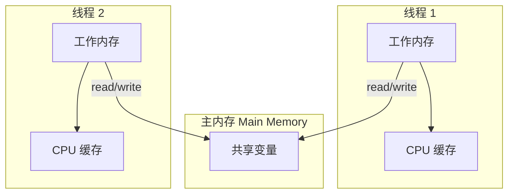
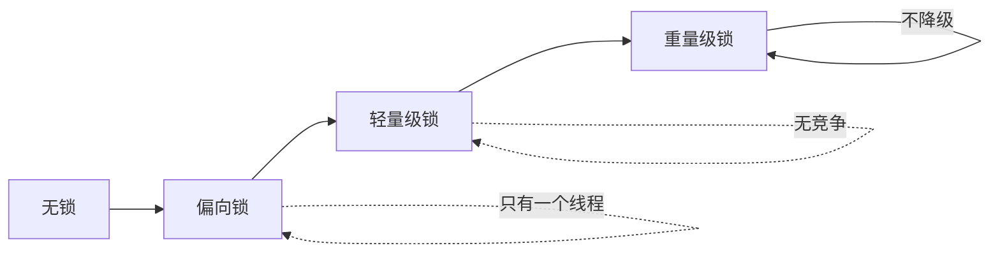
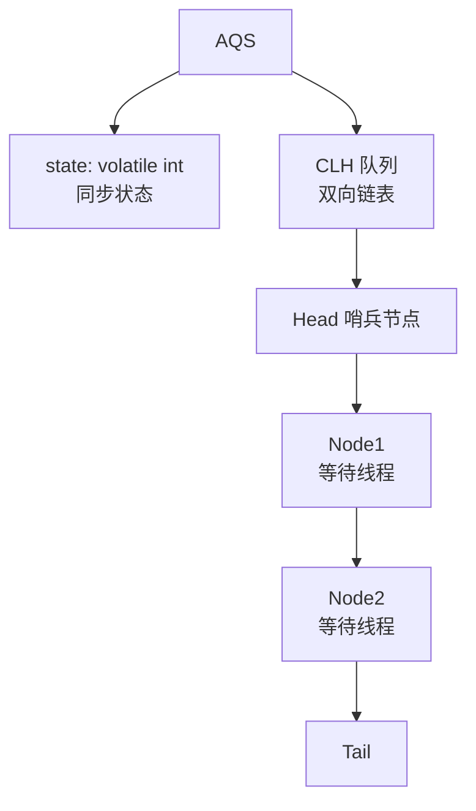
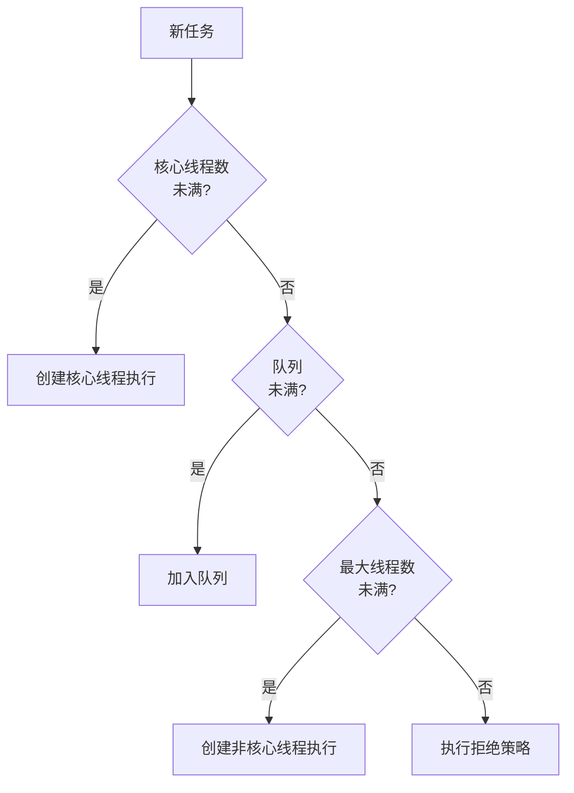
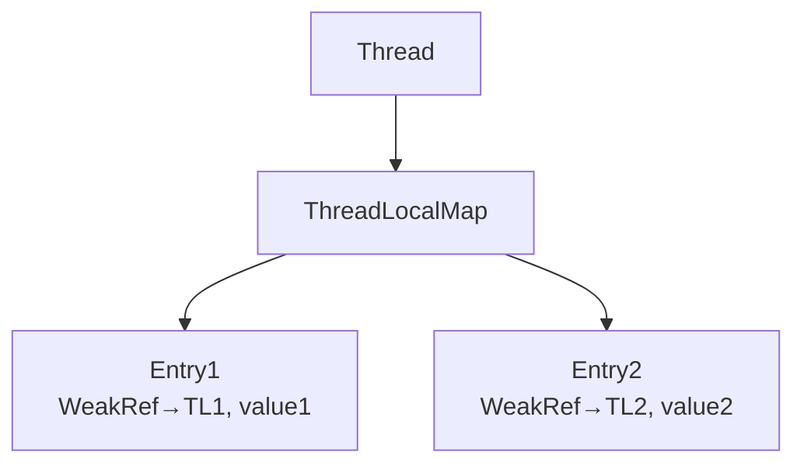

# Java 线程高频面试题与详细回答

> 文档定位：系统梳理 Java 多线程在面试中的高频问题，涵盖线程基础、同步机制、volatile、synchronized、Lock、线程池、并发工具类、线程安全、死锁等核心考点。
>
> 适用人群：Java 后端工程师，尤其是需要编写并发代码、优化线程池、排查并发问题的开发者。
>
> 阅读建议：先掌握线程基础与同步（一至三章），再学习线程池与工具类（四至五章），最后攻克并发安全与死锁（六至八章）。重点关注「volatile 原理」「synchronized 锁升级」「线程池执行流程」「AQS」四大核心模块。

***

## 目录

- [一、线程基础](#一线程基础)

  - [Q1. 线程与进程的区别？](#q1-线程与进程的区别)

  - [Q2. 创建线程的方式？](#q2-创建线程的方式)

  - [Q3. 线程的生命周期？](#q3-线程的生命周期)

  - [Q4. 线程状态有哪些？](#q4-线程状态有哪些)

- [二、volatile 与 JMM](#二volatile-与-jmm)

  - [Q5. Java 内存模型（JMM）？](#q5-java-内存模型jmm)

  - [Q6. volatile 的作用与原理？](#q6-volatile-的作用与原理)

  - [Q7. volatile 能保证原子性吗？](#q7-volatile-能保证原子性吗)

  - [Q8. happens-before 原则？](#q8-happens-before-原则)

- [三、synchronized 与 Lock](#三synchronized-与-lock)

  - [Q9. synchronized 的实现原理？](#q9-synchronized-的实现原理)

  - [Q10. synchronized 锁升级过程？](#q10-synchronized-锁升级过程)

  - [Q11. synchronized 和 ReentrantLock 的区别？](#q11-synchronized-和-reentrantlock-的区别)

  - [Q12. AQS 原理？](#q12-aqs-原理)

- [四、线程池](#四线程池)

  - [Q13. 线程池的核心参数？](#q13-线程池的核心参数)

  - [Q14. 线程池的执行流程？](#q14-线程池的执行流程)

  - [Q15. 线程池的拒绝策略？](#q15-线程池的拒绝策略)

  - [Q16. 如何合理设置线程池参数？](#q16-如何合理设置线程池参数)

  - [Q17. Executors 为什么不推荐？](#q17-executors-为什么不推荐)

- [五、并发工具类](#五并发工具类)

  - [Q18. CountDownLatch / CyclicBarrier / Semaphore？](#q18-countdownlatch--cyclicbarrier--semaphore)

  - [Q19. ConcurrentHashMap 原理？](#q19-concurrenthashmap-原理)

  - [Q20. ThreadLocal 原理？](#q20-threadlocal-原理)

- [六、线程安全](#六线程安全)

  - [Q21. 什么是线程安全？如何保证？](#q21-什么是线程安全如何保证)

  - [Q22. CAS 原理与 ABA 问题？](#q22-cas-原理与-aba-问题)

  - [Q23. 原子类 AtomicInteger 原理？](#q23-原子类-atomicinteger-原理)

- [七、死锁](#七死锁)

  - [Q24. 死锁的四个必要条件？](#q24-死锁的四个必要条件)

  - [Q25. 如何排查和避免死锁？](#q25-如何排查和避免死锁)

- [八、综合实战题](#八综合实战题)

  - [Q26. 实现一个线程安全的单例？](#q26-实现一个线程安全的单例)

  - [Q27. 生产者消费者模式？](#q27-生产者消费者模式)

  - [Q28. 如何优雅停止线程？](#q28-如何优雅停止线程)

- [九、速答与踩坑总结](#九速答与踩坑总结)

  - [9.1 速答卡片](#91-速答卡片)

  - [9.2 实战踩坑 10 例](#92-实战踩坑-10-例)

  - [9.3 复习优先级表](#93-复习优先级表)

***

## 一、线程基础

### Q1. 线程与进程的区别？

| 维度      | 进程                | 线程               |
| ------- | ----------------- | ---------------- |
| **定义**  | 资源分配的最小单位         | CPU 调度的最小单位      |
| **资源**  | 独立的地址空间、文件描述符     | 共享进程资源           |
| **开销**  | 创建/切换开销大          | 创建/切换开销小         |
| **通信**  | IPC（管道、消息队列、共享内存） | 共享内存、锁           |
| **稳定性** | 一个进程崩溃不影响其他       | 一个线程崩溃可能导致整个进程崩溃 |



***

### Q2. 创建线程的方式？

#### 四种方式

| 方式              | 说明                      | 有返回值 |
| --------------- | ----------------------- | ---- |
| **继承 Thread**   | 重写 run()                | ❌    |
| **实现 Runnable** | 实现 run()，传入 Thread      | ❌    |
| **实现 Callable** | 实现 call()，配合 FutureTask | ✅    |
| **线程池**         | ExecutorService 提交      | ✅    |

#### 代码示例

```java
// 方式1：继承 Thread
class MyThread extends Thread {
    @Override
    public void run() {
        System.out.println("继承 Thread");
    }
}

// 方式2：实现 Runnable
class MyRunnable implements Runnable {
    @Override
    public void run() {
        System.out.println("实现 Runnable");
    }
}

// 方式3：实现 Callable（有返回值）
class MyCallable implements Callable<String> {
    @Override
    public String call() {
        return "实现 Callable";
    }
}

public class ThreadDemo {
    public static void main(String[] args) throws Exception {
        new MyThread().start();

        new Thread(new MyRunnable()).start();

        // Callable + FutureTask
        FutureTask<String> futureTask = new FutureTask<>(new MyCallable());
        new Thread(futureTask).start();
        System.out.println(futureTask.get());  // 获取返回值

        // 方式4：线程池
        ExecutorService pool = Executors.newFixedThreadPool(2);
        pool.submit(new MyRunnable());
        pool.shutdown();
    }
}
```

***

### Q3. 线程的生命周期？



### Q4. 线程状态有哪些？

| 状态                 | 说明             |
| ------------------ | -------------- |
| **NEW**            | 新建，未调用 start() |
| **RUNNABLE**       | 可运行（包含就绪和运行中）  |
| **BLOCKED**        | 阻塞，等待锁         |
| **WAITING**        | 无限等待，需被唤醒      |
| **TIMED\_WAITING** | 限时等待，时间到自动唤醒   |
| **TERMINATED**     | 终止，run() 执行完毕  |

***

## 二、volatile 与 JMM

### Q5. Java 内存模型（JMM）？

#### 核心答案

JMM（Java Memory Model）定义了线程与主内存之间的抽象关系，解决多线程的**可见性**、**原子性**、**有序性**问题。



#### 三大特性

| 特性      | 说明                 | 保证方式                        |
| ------- | ------------------ | --------------------------- |
| **可见性** | 一个线程修改共享变量，其他线程能看到 | volatile、synchronized、final |
| **原子性** | 操作不可中断             | synchronized、Lock、Atomic 类  |
| **有序性** | 禁止指令重排序            | volatile、synchronized       |

***

### Q6. volatile 的作用与原理？

#### 两个作用

```
1. 保证可见性：写 volatile 变量后立即刷回主内存，读 volatile 变量从主内存读取
2. 禁止指令重排序：通过内存屏障（Memory Barrier）实现
```

#### 内存屏障

```
volatile 写：在写操作前加 StoreStore 屏障，写后加 StoreLoad 屏障
volatile 读：在读操作后加 LoadLoad 屏障和 LoadStore 屏障

效果：
  - 写 volatile 之前的操作不会被重排到写之后
  - 读 volatile 之后的操作不会被重排到读之前
```

#### 典型应用：双重检查锁单例

```java
public class Singleton {
    // 必须加 volatile，防止指令重排序
    private static volatile Singleton instance;

    private Singleton() {}

    public static Singleton getInstance() {
        if (instance == null) {                    // 第一次检查
            synchronized (Singleton.class) {
                if (instance == null) {            // 第二次检查
                    instance = new Singleton();    // 非原子操作，可能重排序
                }
            }
        }
        return instance;
    }
}
```

#### 为什么必须加 volatile？

```
instance = new Singleton() 不是原子操作，分为三步：
  1. 分配内存空间
  2. 初始化对象
  3. 将 instance 指向内存地址

如果没有 volatile，步骤 2 和 3 可能重排序：
  线程 A 执行 1→3，instance 不为 null 但未初始化
  线程 B 第一次检查发现 instance != null，返回未初始化的对象 → 报错

volatile 禁止 2 和 3 重排序，保证对象完全初始化后才赋值
```

***

### Q7. volatile 能保证原子性吗？

#### 核心答案

**不能**。volatile 只保证可见性和有序性，不保证原子性。

#### 示例

```java
public class VolatileDemo {
    private static volatile int count = 0;

    public static void main(String[] args) throws InterruptedException {
        for (int i = 0; i < 10; i++) {
            new Thread(() -> {
                for (int j = 0; j < 1000; j++) {
                    count++;  // 非原子操作：读→加1→写
                }
            }).start();
        }
        Thread.sleep(2000);
        System.out.println(count);  // 期望 10000，实际小于 10000
    }
}
```

#### 原因

```
count++ 不是原子操作，分为三步：
  1. 读取 count
  2. count + 1
  3. 写回 count

线程 A 读到 count=0
线程 B 读到 count=0
线程 A 写回 count=1
线程 B 写回 count=1  ← 丢失了一次更新
```

#### 解决方案

```java
// 方案1：synchronized
synchronized void increment() {
    count++;
}

// 方案2：AtomicInteger（CAS）
private static AtomicInteger count = new AtomicInteger(0);
count.incrementAndGet();

// 方案3：ReentrantLock
```

***

### Q8. happens-before 原则？

#### 核心答案

happens-before 是判断数据是否存在竞争、线程是否安全的依据，前一个操作的结果对后一个操作可见。

#### 八大规则

| 规则              | 说明                                                         |
| --------------- | ---------------------------------------------------------- |
| **程序顺序规则**      | 同一线程内，前面的操作 happens-before 后面的操作                           |
| **volatile 规则** | volatile 写 happens-before 后续的 volatile 读                   |
| **锁规则**         | unlock happens-before 后续的 lock                             |
| **传递规则**        | A happens-before B，B happens-before C → A happens-before C |
| **线程启动规则**      | Thread.start() happens-before 线程内所有操作                      |
| **线程终止规则**      | 线程内所有操作 happens-before Thread.join()                       |
| **对象终结规则**      | 对象构造完成 happens-before finalize()                           |
| **中断规则**        | interrupt() happens-before 检测到中断                           |

***

## 三、synchronized 与 Lock

### Q9. synchronized 的实现原理？

#### 核心答案

synchronized 基于对象头的**Mark Word**和**Monitor**实现。

#### 对象头 Mark Word（64 位）

| 锁状态       | 25bit          | 31bit    | 4bit   | 1bit   | 2bit |
| --------- | -------------- | -------- | ------ | ------ | ---- |
| **无锁**    | unused         | hashCode | 分代年龄   | 0      | 01   |
| **偏向锁**   | 线程ID           | Epoch    | 分代年龄   | 1      | 01   |
| **轻量级锁**  | 指向栈中锁记录的指针     | <br />   | <br /> | <br /> | 00   |
| **重量级锁**  | 指向 Monitor 的指针 | <br />   | <br /> | <br /> | 10   |
| **GC 标记** | -              | <br />   | <br /> | <br /> | 11   |

#### Monitor 机制

```
每个对象关联一个 Monitor：
  - _owner：持有锁的线程
  - _EntryList：等待获取锁的线程队列
  - _WaitSet：调用 wait() 的线程队列

synchronized 过程：
  1. 检查对象头 Mark Word 的锁状态
  2. 获取锁：设置 _owner 为当前线程
  3. 释放锁：清空 _owner，唤醒 EntryList 中的线程
```

***

### Q10. synchronized 锁升级过程？



#### 锁升级方向

```
无锁 → 偏向锁 → 轻量级锁 → 重量级锁
（只能升级，不能降级，偏向锁可重偏向）
```

| 锁        | 适用场景    | 实现                | 性能       |
| -------- | ------- | ----------------- | -------- |
| **偏向锁**  | 单线程访问   | Mark Word 记录线程 ID | 几乎无开销    |
| **轻量级锁** | 多线程交替访问 | CAS 自旋            | 自旋消耗 CPU |
| **重量级锁** | 多线程竞争   | Monitor + 阻塞      | 线程阻塞唤醒   |

#### 各阶段说明

```
偏向锁：
  - 第一个线程获取锁时，Mark Word 记录线程 ID
  - 同一线程再次获取锁，无需 CAS
  - 其他线程来竞争，升级为轻量级锁

轻量级锁：
  - 线程在栈中创建 Lock Record
  - CAS 将 Mark Word 指向 Lock Record
  - 竞争失败则自旋，自旋失败升级为重量级锁

重量级锁：
  - 竞争线程阻塞（park）
  - 释放锁后唤醒（unpark）
```

***

### Q11. synchronized 和 ReentrantLock 的区别？

| 维度       | synchronized    | ReentrantLock         |
| -------- | --------------- | --------------------- |
| **实现**   | JVM 层面（Monitor） | JDK 层面（AQS）           |
| **锁释放**  | 自动释放            | 需手动 unlock()          |
| **公平锁**  | ❌ 非公平           | ✅ 可配置公平/非公平           |
| **可中断**  | ❌ 不可中断          | ✅ lockInterruptibly() |
| **超时获取** | ❌               | ✅ tryLock(timeout)    |
| **条件变量** | wait/notify（一个） | Condition（多个）         |
| **性能**   | 低竞争时好           | 高竞争时好                 |
| **可重入**  | ✅               | ✅                     |

#### ReentrantLock 示例

```java
import java.util.concurrent.locks.ReentrantLock;

public class LockDemo {
    private final ReentrantLock lock = new ReentrantLock();
    // 公平锁：new ReentrantLock(true)

    public void method() {
        lock.lock();
        try {
            // 临界区代码
        } finally {
            lock.unlock();  // 必须在 finally 中释放
        }
    }

    // 可中断获取锁
    public void methodInterruptible() throws InterruptedException {
        lock.lockInterruptibly();
        try {
            // 临界区
        } finally {
            lock.unlock();
        }
    }

    // 超时获取锁
    public boolean methodTryLock() throws InterruptedException {
        if (lock.tryLock(3, TimeUnit.SECONDS)) {
            try {
                // 临界区
                return true;
            } finally {
                lock.unlock();
            }
        }
        return false;
    }
}
```

#### Condition 多条件

```java
// 生产者消费者用 Condition
ReentrantLock lock = new ReentrantLock();
Condition notFull = lock.newCondition();   // 队列不满
Condition notEmpty = lock.newCondition();  // 队列不空
```

***

### Q12. AQS 原理？

#### 核心答案

AQS（AbstractQueuedSynchronizer）是并发锁的基础框架，用一个 **volatile int state** 表示同步状态，用 **CLH 队列**管理等待线程。

#### 核心结构



#### state 含义

```
state = 0：无锁
state > 0：有锁，值表示重入次数

获取锁：CAS 修改 state（0 → 1）
释放锁：state - 1
```

#### 模板方法

| 方法                          | 说明           |
| --------------------------- | ------------ |
| `acquire(int)`              | 独占获取锁（不响应中断） |
| `acquireInterruptibly(int)` | 独占获取锁（响应中断）  |
| `tryAcquire(int)`           | 尝试获取锁（子类实现）  |
| `release(int)`              | 释放锁          |
| `tryRelease(int)`           | 尝试释放锁（子类实现）  |

#### CLH 队列

```
获取锁失败的线程封装为 Node，加入 CLH 队列尾部
Node 包含：
  - thread：等待的线程
  - waitStatus：节点状态（SIGNAL/CONDITION/CANCELLED等）
  - prev/next：前驱/后继指针

锁释放时：唤醒队列中第一个等待线程
```

#### ReentrantLock 的 AQS 实现

```
公平锁：
  - 检查队列中是否有等待时间更长的线程
  - 有则排队，没有则 CAS 获取锁

非公平锁：
  - 直接 CAS 获取锁
  - 失败则排队
```

***

## 四、线程池

### Q13. 线程池的核心参数？

```java
public ThreadPoolExecutor(
    int corePoolSize,           // 核心线程数
    int maximumPoolSize,        // 最大线程数
    long keepAliveTime,         // 空闲线程存活时间
    TimeUnit unit,              // 时间单位
    BlockingQueue<Runnable> workQueue,  // 任务队列
    ThreadFactory threadFactory,        // 线程工厂
    RejectedExecutionHandler handler    // 拒绝策略
)
```

| 参数                  | 说明                                                            |
| ------------------- | ------------------------------------------------------------- |
| **corePoolSize**    | 核心线程数，即使空闲也保留                                                 |
| **maximumPoolSize** | 最大线程数                                                         |
| **keepAliveTime**   | 非核心线程空闲存活时间                                                   |
| **workQueue**       | 任务队列（ArrayBlockingQueue/LinkedBlockingQueue/SynchronousQueue） |
| **threadFactory**   | 创建线程的工厂（可设名字、守护状态）                                            |
| **handler**         | 拒绝策略                                                          |

***

### Q14. 线程池的执行流程？



#### 流程说明

```
1. 核心线程数未满 → 创建核心线程执行
2. 核心线程数满 → 加入队列
3. 队列满 → 创建非核心线程（直到 maximumPoolSize）
4. 最大线程数满 → 执行拒绝策略
```

#### 线程销毁

```
核心线程：默认不销毁（allowCoreThreadTimeOut=true 时可销毁）
非核心线程：空闲超过 keepAliveTime 后销毁
```

***

### Q15. 线程池的拒绝策略？

| 策略                      | 说明                            | 适用     |
| ----------------------- | ----------------------------- | ------ |
| **AbortPolicy**（默认）     | 抛出 RejectedExecutionException | 需要感知拒绝 |
| **CallerRunsPolicy**    | 由提交任务的线程执行                    | 不希望丢任务 |
| **DiscardPolicy**       | 直接丢弃任务                        | 可丢弃的场景 |
| **DiscardOldestPolicy** | 丢弃队列最老的任务                     | 新任务更重要 |

#### 自定义拒绝策略

```java
public class CustomRejectedHandler implements RejectedExecutionHandler {
    @Override
    public void rejectedExecution(Runnable r, ThreadPoolExecutor executor) {
        // 记录日志、告警、降级处理
        System.out.println("任务被拒绝: " + r);
        // 可以尝试重新入队或持久化
    }
}
```

***

### Q16. 如何合理设置线程池参数？

#### 核心公式

```
线程数 = CPU 核心数 × (1 + 等待时间/计算时间)

等待时间：IO 等待（数据库、网络）
计算时间：CPU 计算
```

| 任务类型        | 计算公式               | 示例（8 核）   |
| ----------- | ------------------ | --------- |
| **CPU 密集型** | CPU 核数 + 1         | 9         |
| **IO 密集型**  | CPU 核数 × 2         | 16        |
| **混合型**     | CPU 核数 × (1 + W/C) | 根据 W/C 计算 |

#### 队列选择

| 队列                        | 说明                     | 适用                  |
| ------------------------- | ---------------------- | ------------------- |
| **ArrayBlockingQueue**    | 有界数组队列                 | 需要控制队列大小            |
| **LinkedBlockingQueue**   | 无界链表队列（默认 Integer.MAX） | 任务量可控               |
| **SynchronousQueue**      | 不存储任务，直接交给线程           | 配合大 maximumPoolSize |
| **PriorityBlockingQueue** | 优先级队列                  | 任务有优先级              |

#### 生产推荐

```java
// IO 密集型（8 核）
ThreadPoolExecutor ioPool = new ThreadPoolExecutor(
    16, 32,
    60L, TimeUnit.SECONDS,
    new LinkedBlockingQueue<>(1000),
    new ThreadFactoryBuilder().setNameFormat("io-pool-%d").build(),
    new ThreadPoolExecutor.CallerRunsPolicy()
);

// CPU 密集型（8 核）
ThreadPoolExecutor cpuPool = new ThreadPoolExecutor(
    8, 8,
    0L, TimeUnit.MILLISECONDS,
    new LinkedBlockingQueue<>(1000),
    new ThreadFactoryBuilder().setNameFormat("cpu-pool-%d").build(),
    new ThreadPoolExecutor.AbortPolicy()
);
```

***

### Q17. Executors 为什么不推荐？

#### 原因

```
Executors 提供的工厂方法隐藏了参数，容易导致 OOM：
  - FixedThreadPool：LinkedBlockingQueue 无界 → 队列堆积 OOM
  - SingleThreadPool：LinkedBlockingQueue 无界 → 队列堆积 OOM
  - CachedThreadPool：maximumPoolSize=Integer.MAX → 线程过多 OOM
  - ScheduledThreadPool：DelayedWorkQueue 无界 → 队列堆积 OOM
```

#### 推荐写法

```java
// ❌ 不推荐
ExecutorService pool = Executors.newFixedThreadPool(10);

// ✅ 推荐：手动创建，明确参数
ThreadPoolExecutor pool = new ThreadPoolExecutor(
    10, 20,
    60L, TimeUnit.SECONDS,
    new LinkedBlockingQueue<>(1000),
    new ThreadFactoryBuilder().setNameFormat("my-pool-%d").build(),
    new ThreadPoolExecutor.CallerRunsPolicy()
);
```

***

## 五、并发工具类

### Q18. CountDownLatch / CyclicBarrier / Semaphore？

| 工具                 | 作用           | 特点             |
| ------------------ | ------------ | -------------- |
| **CountDownLatch** | 一个线程等待多个线程完成 | 一次性，计数到 0 不可重置 |
| **CyclicBarrier**  | 多个线程互相等待     | 可重置复用          |
| **Semaphore**      | 控制并发线程数      | 信号量，可控制资源访问数   |

#### CountDownLatch

```java
// 主线程等待 3 个子线程完成
CountDownLatch latch = new CountDownLatch(3);

for (int i = 0; i < 3; i++) {
    new Thread(() -> {
        try {
            // 执行任务
        } finally {
            latch.countDown();  // 计数 -1
        }
    }).start();
}

latch.await();  // 等待计数为 0
System.out.println("所有任务完成");
```

#### CyclicBarrier

```java
// 3 个线程互相等待
CyclicBarrier barrier = new CyclicBarrier(3, () -> {
    System.out.println("所有线程到达屏障，执行汇总");
});

for (int i = 0; i < 3; i++) {
    new Thread(() -> {
        try {
            // 第一阶段任务
            barrier.await();  // 等待所有线程到达
            // 第二阶段任务
        } catch (Exception e) {
            e.printStackTrace();
        }
    }).start();
}
```

#### Semaphore

```java
// 最多 3 个线程同时访问
Semaphore semaphore = new Semaphore(3);

for (int i = 0; i < 10; i++) {
    new Thread(() -> {
        try {
            semaphore.acquire();  // 获取许可
            // 访问共享资源
        } catch (InterruptedException e) {
            e.printStackTrace();
        } finally {
            semaphore.release();  // 释放许可
        }
    }).start();
}
```

***

### Q19. ConcurrentHashMap 原理？

#### JDK 1.7 vs 1.8

| 维度      | JDK 1.7                        | JDK 1.8            |
| ------- | ------------------------------ | ------------------ |
| **结构**  | Segment 数组 + HashEntry 数组 + 链表 | Node 数组 + 链表/红黑树   |
| **锁**   | Segment 分段锁（ReentrantLock）     | CAS + synchronized |
| **并发度** | Segment 数量（默认 16）              | 桶级别                |
| **查询**  | 遍历链表                           | 链表/红黑树             |
| **扩容**  | Segment 内扩容                    | 全表扩容               |

#### JDK 1.8 put 流程

```mermaid
flowchart TB
    P[put(key, value)] --> E{数组为空?}
    E -->|是| INIT[初始化数组]
    E -->|否| H[计算 hash]
    INIT --> H
    H --> B{桶为空?}
    B -->|是| CAS[CAS 写入]
    B -->|否| L{是否扩容?}
    L -->|是| HELP[协助扩容]
    L -->|否| SYN[synchronized 锁桶头]
    SYN --> T{链表 or 红黑树?}
    T -->|链表| LINK[遍历链表插入]
    T -->|红黑树| TREE[红黑树插入]
    LINK -->|长度>=8| CONV[转为红黑树]
```

#### 关键特性

```
1. 线程安全：CAS + synchronized 锁桶头
2. 不允许 null key/value
3. 链表长度 >= 8 且数组长度 >= 64 转红黑树
4. 并发扩容：多个线程协助迁移
5. size 计算：baseCount + CounterCell 数组（避免竞争）
```

***

### Q20. ThreadLocal 原理？

#### 核心结构

```
每个 Thread 有一个 ThreadLocalMap：
  Thread.threadLocals = ThreadLocalMap
  ThreadLocalMap.Entry[] table
  Entry = WeakReference<ThreadLocal> + value
```



#### set 方法

```java
public void set(T value) {
    Thread t = Thread.currentThread();
    ThreadLocalMap map = getMap(t);  // t.threadLocals
    if (map != null)
        map.set(this, value);
    else
        createMap(t, value);
}
```

#### get 方法

```java
public T get() {
    Thread t = Thread.currentThread();
    ThreadLocalMap map = getMap(t);
    if (map != null) {
        ThreadLocalMap.Entry e = map.getEntry(this);
        if (e != null) return (T) e.value;
    }
    return setInitialValue();
}
```

#### 内存泄漏

```
Entry 的 key（ThreadLocal）是弱引用，value 是强引用
ThreadLocal 被回收后，key = null，但 value 无法回收
→ 线程不结束，value 一直无法回收 → 泄漏

解决：用完调用 remove()
```

***

## 六、线程安全

### Q21. 什么是线程安全？如何保证？

#### 线程安全的三个特性

```
原子性：操作不可中断
可见性：一个线程的修改对其他线程可见
有序性：指令不被重排序
```

#### 保证方式

| 方式               | 原子性 | 可见性 | 有序性 | 说明         |
| ---------------- | --- | --- | --- | ---------- |
| **synchronized** | ✅   | ✅   | ✅   | 锁机制        |
| **Lock**         | ✅   | ✅   | ✅   | 显示锁        |
| **volatile**     | ❌   | ✅   | ✅   | 只保证可见性和有序性 |
| **Atomic 类**     | ✅   | ✅   | ❌   | CAS 操作     |
| **final**        | -   | ✅   | -   | 初始化后不可变    |

***

### Q22. CAS 原理与 ABA 问题？

#### CAS 原理

```
CAS（Compare And Swap）：比较并交换
包含三个操作数：内存位置 V、预期值 A、新值 B

过程：
  if (V == A) { V = B; return true; }
  else return false;

原子性由 CPU 指令保证（cmpxchg）
```

#### ABA 问题

```
线程1：读取 V = A，准备改为 C
线程2：将 V 从 A 改为 B，又从 B 改回 A
线程1：CAS 检查 V == A，成功改为 C
→ 但实际 V 已经被修改过，可能有问题
```

#### 解决方案

```java
// 使用 AtomicStampedReference（版本号）
AtomicStampedReference<String> ref = new AtomicStampedReference<>("A", 0);

int stamp = ref.getStamp();
ref.compareAndSet("A", "B", stamp, stamp + 1);  // 每次修改版本号+1
```

***

### Q23. 原子类 AtomicInteger 原理？

#### 核心：CAS + 自旋

```java
public class AtomicInteger extends Number {
    private volatile int value;

    public final int incrementAndGet() {
        // CAS 自旋：失败则重试
        return unsafe.getAndAddInt(this, valueOffset, 1) + 1;
    }
}

// getAndAddInt 实现（Unsafe）
public final int getAndAddInt(Object o, long offset, int delta) {
    int v;
    do {
        v = getIntVolatile(o, offset);  // 读取当前值
    } while (!compareAndSwapInt(o, offset, v, v + delta));  // CAS 更新
    return v;
}
```

#### CAS 缺点

| 缺点           | 说明          | 解决                     |
| ------------ | ----------- | ---------------------- |
| **ABA 问题**   | 值改了又改回      | AtomicStampedReference |
| **自旋开销**     | 高竞争时 CPU 空转 | 升级为锁                   |
| **只能保证一个变量** | 多变量无法原子     | AtomicReference 封装对象   |

***

## 七、死锁

### Q24. 死锁的四个必要条件？

| 条件        | 说明                   |
| --------- | -------------------- |
| **互斥**    | 资源同一时间只能被一个线程占用      |
| **请求与保持** | 持有资源的同时请求其他资源        |
| **不可剥夺**  | 已获得的资源不能被强制剥夺        |
| **循环等待**  | 存在循环等待链（A 等 B，B 等 A） |

#### 破坏死锁

| 条件    | 破坏方法                      |
| ----- | ------------------------- |
| 互斥    | 一般无法破坏（资源本身需要互斥）          |
| 请求与保持 | 一次性申请所有资源                 |
| 不可剥夺  | 主动释放资源（ReentrantLock 可中断） |
| 循环等待  | 按固定顺序申请资源                 |

***

### Q25. 如何排查和避免死锁？

#### 排查工具

```bash
# 1. jstack 查找死锁
jstack <pid>
# 输出中会有 "Found one Java-level deadlock"

# 2. Arthas
thread -b  # 查看死锁线程
```

#### 死锁示例

```java
// 两个线程互相等待对方的锁
Object lock1 = new Object();
Object lock2 = new Object();

new Thread(() -> {
    synchronized (lock1) {
        Thread.sleep(100);
        synchronized (lock2) { }  // 等待 lock2
    }
}).start();

new Thread(() -> {
    synchronized (lock2) {
        Thread.sleep(100);
        synchronized (lock1) { }  // 等待 lock1
    }
}).start();
```

#### 避免方法

```java
// 方法1：固定加锁顺序
Object first = id1 < id2 ? lock1 : lock2;
Object second = id1 < id2 ? lock2 : lock1;
synchronized (first) {
    synchronized (second) { }
}

// 方法2：使用 tryLock + 超时
if (lock1.tryLock(1, TimeUnit.SECONDS)) {
    try {
        if (lock2.tryLock(1, TimeUnit.SECONDS)) {
            try { } finally { lock2.unlock(); }
        }
    } finally { lock1.unlock(); }
}

// 方法3：缩小锁范围，减少嵌套锁
```

***

## 八、综合实战题

### Q26. 实现一个线程安全的单例？

#### 双重检查锁（推荐）

```java
public class Singleton {
    private static volatile Singleton instance;

    private Singleton() {}

    public static Singleton getInstance() {
        if (instance == null) {
            synchronized (Singleton.class) {
                if (instance == null) {
                    instance = new Singleton();
                }
            }
        }
        return instance;
    }
}
```

#### 静态内部类（推荐，最简单）

```java
public class Singleton {
    private Singleton() {}

    // 静态内部类在第一次使用时才加载
    private static class Holder {
        private static final Singleton INSTANCE = new Singleton();
    }

    public static Singleton getInstance() {
        return Holder.INSTANCE;
    }
}
```

#### 枚举（最安全，防反射和序列化）

```java
public enum Singleton {
    INSTANCE;

    public void doSomething() {
        // 业务方法
    }
}
```

***

### Q27. 生产者消费者模式？

```java
import java.util.LinkedList;
import java.util.Queue;
import java.util.concurrent.locks.Condition;
import java.util.concurrent.locks.ReentrantLock;

public class ProducerConsumer {
    private final Queue<Integer> queue = new LinkedList<>();
    private final int MAX_SIZE = 10;
    private final ReentrantLock lock = new ReentrantLock();
    private final Condition notFull = lock.newCondition();
    private final Condition notEmpty = lock.newCondition();

    // 生产者
    public void produce(int data) throws InterruptedException {
        lock.lock();
        try {
            while (queue.size() == MAX_SIZE) {
                notFull.await();  // 队列满，等待
            }
            queue.offer(data);
            notEmpty.signal();  // 通知消费者
        } finally {
            lock.unlock();
        }
    }

    // 消费者
    public Integer consume() throws InterruptedException {
        lock.lock();
        try {
            while (queue.isEmpty()) {
                notEmpty.await();  // 队列空，等待
            }
            Integer data = queue.poll();
            notFull.signal();  // 通知生产者
            return data;
        } finally {
            lock.unlock();
        }
    }
}
```

#### 也可用 BlockingQueue 实现

```java
// 更简单的方式：BlockingQueue
BlockingQueue<Integer> queue = new ArrayBlockingQueue<>(10);

// 生产者
queue.put(data);  // 满了自动阻塞

// 消费者
Integer data = queue.take();  // 空了自动阻塞
```

***

### Q28. 如何优雅停止线程？

#### 方式一：interrupt 中断（推荐）

```java
public class MyTask implements Runnable {
    @Override
    public void run() {
        while (!Thread.currentThread().isInterrupted()) {
            try {
                // 业务逻辑
                doWork();
            } catch (InterruptedException e) {
                // 响应中断
                Thread.currentThread().interrupt();  // 恢复中断状态
                break;
            }
        }
        // 清理资源
        cleanup();
    }
}

// 停止
thread.interrupt();
```

#### 方式二：volatile 标志位

```java
public class MyTask implements Runnable {
    private volatile boolean running = true;

    @Override
    public void run() {
        while (running) {
            doWork();
        }
        cleanup();
    }

    public void stop() {
        running = false;
    }
}
```

#### 方式三：线程池 shutdown

```java
ExecutorService pool = Executors.newFixedThreadPool(10);
pool.execute(task);

// 优雅关闭
pool.shutdown();  // 不再接受新任务，等待已提交任务完成
// pool.shutdownNow();  // 尝试中断所有任务

// 等待终止
if (!pool.awaitTermination(60, TimeUnit.SECONDS)) {
    pool.shutdownNow();  // 超时强制关闭
}
```

#### 不推荐的方式

```java
// ❌ Thread.stop()：已废弃，不释放锁，数据不一致
// ❌ Thread.destroy()：已废弃，不释放资源
```

***

## 九、速答与踩坑总结

### 9.1 速答卡片

**Q：线程和进程的区别？**
A：进程是资源分配单位，线程是 CPU 调度单位；线程共享进程资源，切换开销小。

**Q：volatile 能保证原子性吗？**
A：不能，只保证可见性和有序性；原子性需 synchronized/Lock/Atomic。

**Q：synchronized 和 ReentrantLock 区别？**
A：synchronized 是 JVM 层面自动释放；ReentrantLock 是 JDK 层面手动释放，支持公平锁、可中断、超时、多 Condition。

**Q：synchronized 锁升级过程？**
A：无锁 → 偏向锁 → 轻量级锁 → 重量级锁，只能升级不能降级。

**Q：AQS 是什么？**
A：AbstractQueuedSynchronizer，用 volatile state + CLH 队列实现锁框架。

**Q：线程池核心参数？**
A：corePoolSize、maximumPoolSize、keepAliveTime、workQueue、threadFactory、handler。

**Q：线程池执行流程？**
A：核心线程未满→创建核心线程；队列未满→入队；最大线程未满→创建非核心线程；否则拒绝。

**Q：Executors 为什么不推荐？**
A：无界队列/线程数可能导致 OOM，推荐手动 new ThreadPoolExecutor。

**Q：ConcurrentHashMap 怎么保证线程安全？**
A：JDK1.8 用 CAS + synchronized 锁桶头，1.7 用 Segment 分段锁。

**Q：ThreadLocal 为什么内存泄漏？**
A：Entry 的 value 是强引用，线程不结束则 value 无法回收；用完要 remove()。

**Q：CAS 的 ABA 问题？**
A：值从 A→B→A，CAS 无法感知；用 AtomicStampedReference 加版本号解决。

**Q：死锁四个必要条件？**
A：互斥、请求与保持、不可剥夺、循环等待；破坏任意一个即可避免。

**Q：如何优雅停止线程？**
A：用 interrupt() 或 volatile 标志位，不要用 stop()。

***

### 9.2 实战踩坑 10 例

| #  | 场景             | 现象                      | 根因                    | 解决                        |
| -- | -------------- | ----------------------- | --------------------- | ------------------------- |
| 1  | volatile 计数不准  | count++ 结果少             | volatile 不保证原子性       | 用 AtomicInteger           |
| 2  | 双重检查锁单例报错      | NPE                     | 缺 volatile 导致指令重排     | 加 volatile                |
| 3  | 线程池 OOM        | 队列无限增长                  | 用了 Executors 无界队列     | 手动 new ThreadPoolExecutor |
| 4  | ThreadLocal 泄漏 | 内存持续增长                  | 未调用 remove()          | finally 中 remove()        |
| 5  | 死锁             | 服务卡死                    | 加锁顺序不一致               | 固定加锁顺序                    |
| 6  | 线程名难排查         | 堆栈看不懂                   | 默认线程名 pool-1-thread-1 | 自定义 ThreadFactory         |
| 7  | 线程数爆炸          | unable to create thread | 线程池未限制                | 设 maximumPoolSize         |
| 8  | CAS 自旋 CPU 高   | CPU 100%                | 高竞争自旋                 | 高竞争改用锁                    |
| 9  | 锁未释放           | 死锁                      | 没在 finally unlock     | finally 中释放               |
| 10 | interrupt 不生效  | 线程不响应中断                 | catch 后未恢复中断状态        | catch 中调用 interrupt()     |

***

### 9.3 复习优先级表

| 优先级    | 主题                   | 考察概率 | 建议复习时间 |
| ------ | -------------------- | ---- | ------ |
| **P0** | volatile 原理          | 95%  | 30min  |
| **P0** | synchronized 锁升级     | 95%  | 30min  |
| **P0** | 线程池执行流程              | 95%  | 30min  |
| **P0** | AQS 原理               | 90%  | 1h     |
| **P1** | synchronized vs Lock | 85%  | 30min  |
| **P1** | 线程池参数与拒绝策略           | 85%  | 30min  |
| **P1** | ConcurrentHashMap    | 80%  | 1h     |
| **P1** | ThreadLocal 原理       | 85%  | 30min  |
| **P2** | CAS 与 ABA            | 75%  | 30min  |
| **P2** | CountDownLatch 等工具   | 70%  | 30min  |
| **P2** | 死锁排查                 | 70%  | 30min  |
| **P3** | 线程状态与生命周期            | 60%  | 15min  |
| **P3** | happens-before       | 55%  | 30min  |

```mermaid
flowchart LR
    P0[volatile原理] --> P0a[synchronized锁升级]
    P0a --> P0b[线程池执行流程]
    P0b --> P0c[AQS原理]
    P0c --> P1a[synchronized vs Lock]
    P1a --> P1b[线程池参数与拒绝策略]
    P1b --> P1c[ConcurrentHashMap]
    P1c --> P1d[ThreadLocal原理]
    P1d --> P2a[CAS与ABA]
    P2a --> P2b[并发工具类]
    P2b --> P2c[死锁排查]
    P2c --> P3a[线程状态与生命周期]
    P3a --> P3b[happens-before]

    style P0 fill:#f8d7da,stroke-width:3px
    style P0a fill:#f8d7da,stroke-width:3px
    style P0b fill:#f8d7da,stroke-width:3px
    style P0c fill:#f8d7da,stroke-width:3px
```



