# Kubernetes（K8s）高频面试题与详细回答

> 文档定位：系统梳理 Kubernetes 在面试中的高频问题，涵盖架构原理、核心组件、Pod 生命周期、调度机制、网络模型、存储、Service/Ingress、配置管理、运维排查等核心考点。
>
> 适用人群：后端工程师、DevOps、云原生开发者，尤其是需要使用 K8s 部署和运维应用的开发者。
>
> 阅读建议：先掌握 K8s 架构与核心组件（一至三章），再学习 Pod/SVC 等核心资源（四至六章），最后攻克网络、存储与运维（七至十章）。重点关注「Pod 生命周期」「调度机制」「Service 原理」「CNI/CSI」「故障排查」五大核心模块。

***

## 目录

- [一、Kubernetes 基础概念](#一kubernetes-基础概念)

  - [Q1. Kubernetes 是什么？解决什么问题？](#q1-kubernetes-是什么解决什么问题)

  - [Q2. K8s 核心架构（Master/Node）？](#q2-k8s-核心架构masternode)

  - [Q3. K8s 核心组件有哪些？](#q3-k8s-核心组件有哪些)

- [二、Pod 与工作负载](#二pod-与工作负载)

  - [Q4. Pod 是什么？为什么 K8s 最小单位是 Pod 不是容器？](#q4-pod-是什么为什么-k8s-最小单位是-pod-不是容器)

  - [Q5. Pod 的生命周期？](#q5-pod-的生命周期)

  - [Q6. Pod 重启策略（RestartPolicy）？](#q6-pod-重启策略restartpolicy)

  - [Q7. Deployment / StatefulSet / DaemonSet 的区别？](#q7-deployment--statefulset--daemonset-的区别)

  - [Q8. Deployment 的滚动更新原理？](#q8-deployment-的滚动更新原理)

- [三、调度机制](#三调度机制)

  - [Q9. K8s 调度器（Scheduler）工作原理？](#q9-k8s-调度器scheduler工作原理)

  - [Q10. 节点亲和性（NodeAffinity）与 Pod 亲和性？](#q10-节点亲和性nodeaffinity与-pod-亲和性)

  - [Q11. 污点（Taint）与容忍（Toleration）？](#q11-污点taint与容忍toleration)

  - [Q12. 资源限制（requests/limits）？](#q12-资源限制requestslimits)

- [四、Service 与网络](#四service-与网络)

  - [Q13. Service 的四种类型？](#q13-service-的四种类型)

  - [Q14. Service 是如何实现负载均衡的？](#q14-service-是如何实现负载均衡的)

  - [Q15. kube-proxy 的三种模式（iptables/ipvs/userspace）？](#q15-kube-proxy-的三种模式iptablesipvsuserspace)

  - [Q16. Ingress 与 Ingress Controller？](#q16-ingress-与-ingress-controller)

  - [Q17. K8s 网络模型（CNI）？](#q17-k8s-网络模型cni)

- [五、存储与配置](#五存储与配置)

  - [Q18. Volume / PV / PVC 的区别？](#q18-volume--pv--pvc-的区别)

  - [Q19. StorageClass 与动态供给？](#q19-storageclass-与动态供给)

  - [Q20. ConfigMap 与 Secret 的区别？](#q20-configmap-与-secret-的区别)

- [六、健康检查与自动伸缩](#六健康检查与自动伸缩)

  - [Q21. 探针（Probe）的三种类型？](#q21-探针probe的三种类型)

  - [Q22. HPA（水平 Pod 自动伸缩）原理？](#q22-hpa水平-pod-自动伸缩原理)

  - [Q23. 优雅停机（Graceful Shutdown）？](#q23-优雅停机graceful-shutdown)

- [七、运维与故障排查](#七运维与故障排查)

  - [Q24. Pod 一直处于 Pending 怎么办？](#q24-pod-一直处于-pending-怎么办)

  - [Q25. Pod CrashLoopBackOff 排查思路？](#q25-pod-crashloopbackoff-排查思路)

  - [Q26. K8s 常用运维命令？](#q26-k8s-常用运维命令)

- [八、安全与权限](#八安全与权限)

  - [Q27. RBAC 权限模型？](#q27-rbac-权限模型)

  - [Q28. Namespace 的作用？](#q28-namespace-的作用)

- [九、综合实战题](#九综合实战题)

  - [Q29. 如何实现蓝绿部署与金丝雀发布？](#q29-如何实现蓝绿部署与金丝雀发布)

  - [Q30. K8s 与 Docker 的关系？](#q30-k8s-与-docker-的关系)

- [十、速答与踩坑总结](#十速答与踩坑总结)

  - [10.1 速答卡片](#101-速答卡片)

  - [10.2 实战踩坑 10 例](#102-实战踩坑-10-例)

  - [10.3 复习优先级表](#103-复习优先级表)

***

## 一、Kubernetes 基础概念

### Q1. Kubernetes 是什么？解决什么问题？

#### 核心答案

Kubernetes（K8s）是 Google 开源的**容器编排引擎**，用于自动化部署、扩缩容和管理容器化应用。

#### 解决的问题

| 问题   | 传统方式       | K8s 方案        |
| ---- | ---------- | ------------- |
| 应用部署 | 手动/脚本部署    | 声明式部署（YAML）   |
| 扩缩容  | 手动加机器      | HPA 自动伸缩      |
| 负载均衡 | Nginx 手动配置 | Service 自动负载  |
| 服务发现 | 配置文件       | DNS + Service |
| 故障恢复 | 人工重启       | 自动重启/重建       |
| 滚动更新 | 停机更新       | 滚动更新/金丝雀      |
| 资源调度 | 手动分配       | 自动调度          |

#### 核心特性

```
1. 自动装箱（Bin Packing）：根据资源需求自动调度
2. 自愈（Self-Healing）：容器失败自动重启、重建
3. 水平扩缩容：HPA 按 CPU/自定义指标扩缩
4. 服务发现与负载均衡：Service + DNS
5. 滚动更新与回滚：Deployment 管理
6. 密钥与配置管理：Secret + ConfigMap
7. 存储编排：PV/PVC 动态挂载
```

***

### Q2. K8s 核心架构（Master/Node）？

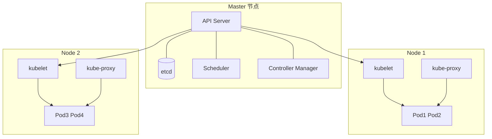

| 组件                     | 所在节点   | 职责                                     |
| ---------------------- | ------ | -------------------------------------- |
| **API Server**         | Master | 所有请求入口，RESTful API，鉴权                  |
| **etcd**               | Master | 分布式 KV 存储，存集群状态                        |
| **Scheduler**          | Master | Pod 调度到合适的 Node                        |
| **Controller Manager** | Master | 管理各种 Controller（Deployment/ReplicaSet） |
| **kubelet**            | Node   | 管理本节点 Pod 生命周期                         |
| **kube-proxy**         | Node   | 实现 Service 网络规则                        |
| **Container Runtime**  | Node   | 容器运行时（Docker/containerd）               |

***

### Q3. K8s 核心组件有哪些？

#### 控制平面组件

| 组件                           | 职责                         |
| ---------------------------- | -------------------------- |
| **kube-apiserver**           | 集群统一入口，REST API，所有组件交互都通过它 |
| **etcd**                     | 集群数据库，存储所有资源状态             |
| **kube-scheduler**           | 调度 Pod 到 Node              |
| **kube-controller-manager**  | 运行各种控制器                    |
| **cloud-controller-manager** | 与云服务商交互                    |

#### 节点组件

| 组件                    | 职责                      |
| --------------------- | ----------------------- |
| **kubelet**           | 接收 API Server 指令，管理 Pod |
| **kube-proxy**        | 维护网络规则（iptables/ipvs）   |
| **container-runtime** | 运行容器（containerd/Docker） |

#### 核心对象

| 对象                   | 说明             |
| -------------------- | -------------- |
| **Pod**              | 最小调度单位，一个或多个容器 |
| **Service**          | 服务发现 + 负载均衡    |
| **Deployment**       | 无状态应用部署        |
| **StatefulSet**      | 有状态应用部署        |
| **DaemonSet**        | 每个节点运行一个 Pod   |
| **Ingress**          | HTTP/HTTPS 路由  |
| **ConfigMap/Secret** | 配置与密钥          |
| **PV/PVC**           | 持久化存储          |

***

## 二、Pod 与工作负载

### Q4. Pod 是什么？为什么 K8s 最小单位是 Pod 不是容器？

#### 核心答案

Pod 是 K8s 中**最小的调度和管理单位**，包含一个或多个共享网络和存储的容器。

#### 为什么用 Pod 而不是直接管理容器？

```
1. 共享网络：Pod 内容器共享同一个网络命名空间（localhost 互通）
2. 共享存储：Pod 内容器可挂载相同 Volume
3. 紧耦合场景：如主容器 + sidecar（日志收集、代理）
4. 原子调度：Pod 内容器必须调度到同一节点
```

#### Pod 内容器关系

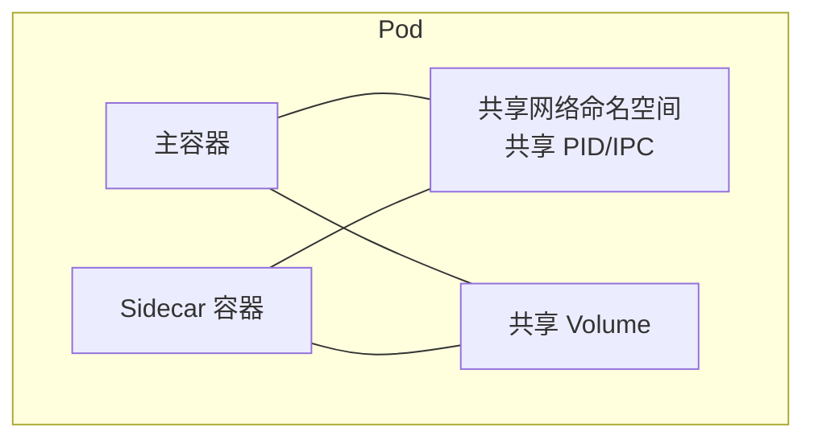

#### Pod YAML 示例

```yaml
apiVersion: v1
kind: Pod
metadata:
  name: my-pod
spec:
  containers:
    - name: main-container
      image: nginx:1.21
      ports:
        - containerPort: 80
    - name: sidecar
      image: busybox
      command: ["sh", "-c", "while true; do echo logs; sleep 10; done"]
```

***

### Q5. Pod 的生命周期？

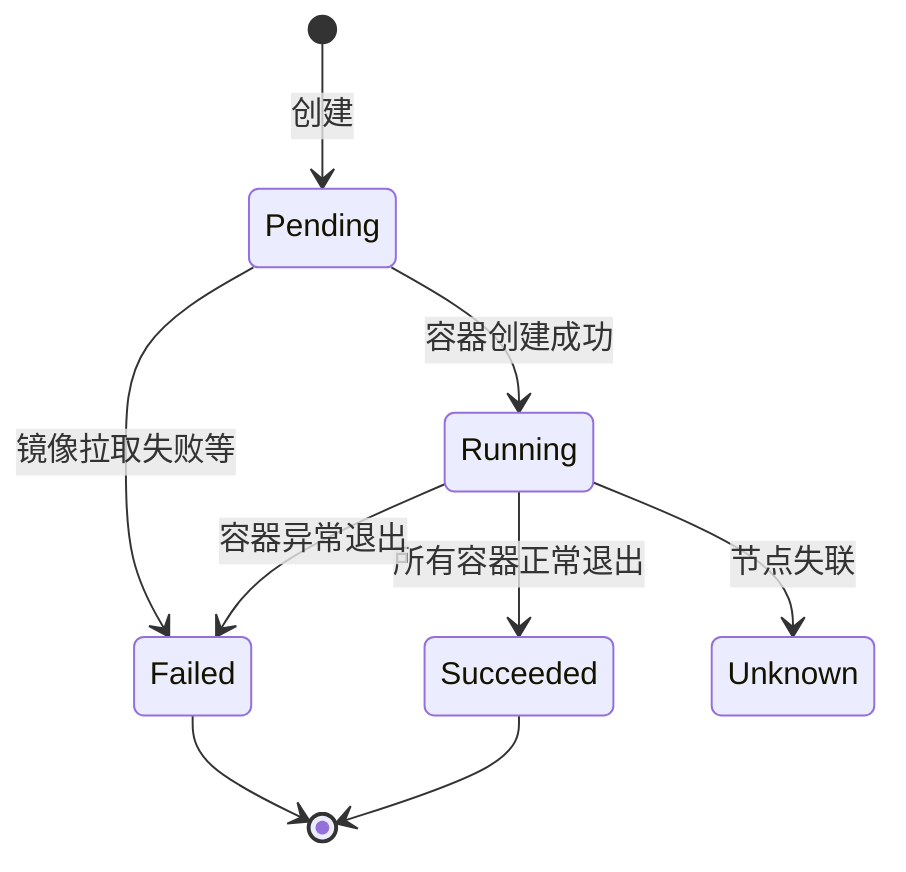

#### 各阶段说明

| 阶段            | 说明                    |
| ------------- | --------------------- |
| **Pending**   | Pod 已创建，等待调度或镜像拉取     |
| **Running**   | 至少一个容器在运行             |
| **Succeeded** | 所有容器正常退出（exit code 0） |
| **Failed**    | 至少一个容器异常退出            |
| **Unknown**   | 无法获取 Pod 状态（节点失联）     |

#### Pod 生命周期钩子

| 钩子            | 触发时机      | 用途        |
| ------------- | --------- | --------- |
| **postStart** | 容器创建后立即执行 | 初始化、预热    |
| **preStop**   | 容器终止前执行   | 优雅停机、保存数据 |

```yaml
spec:
  containers:
    - name: app
      image: myapp
      lifecycle:
        postStart:
          exec:
            command: ["/bin/sh", "-c", "echo started > /tmp/start"]
        preStop:
          exec:
            command: ["/bin/sh", "-c", "kill -TERM 1"]
```

***

### Q6. Pod 重启策略（RestartPolicy）？

| 策略             | 说明            | 适用                |
| -------------- | ------------- | ----------------- |
| **Always**（默认） | 容器退出总是重启      | 长期运行服务（nginx、web） |
| **OnFailure**  | 容器异常退出（非0）才重启 | 批处理任务（Job）        |
| **Never**      | 永不重启          | 一次性任务             |

```yaml
spec:
  restartPolicy: Always   # Always / OnFailure / Never
```

#### 退避（Backoff）机制

```
容器崩溃后重启间隔：10s → 20s → 40s → ... 最长 5 分钟
状态从 ContainerCreating → CrashLoopBackOff
```

***

### Q7. Deployment / StatefulSet / DaemonSet 的区别？

| 维度    | Deployment   | StatefulSet          | DaemonSet     |
| ----- | ------------ | -------------------- | ------------- |
| 适用场景  | 无状态应用        | 有状态应用                | 每节点一个         |
| 名称    | 随机后缀         | 有序（web-0, web-1）     | 节点名           |
| 存储    | 共享或独立 PVC    | 每个 Pod 独立 PVC        | 节点本地存储        |
| 网络标识  | 无固定 DNS      | 有固定 DNS（web-0.nginx） | 无             |
| 扩缩容顺序 | 无序           | 有序（从大到小缩容）           | 自动跟随节点        |
| 更新策略  | 滚动/重建        | 滚动/分区                | 滚动            |
| 示例    | Nginx、Web 应用 | MySQL、Redis 集群       | 日志收集、监控 Agent |

#### StatefulSet 示例

```yaml
apiVersion: apps/v1
kind: StatefulSet
metadata:
  name: web
spec:
  serviceName: "nginx"
  replicas: 3
  selector:
    matchLabels:
      app: nginx
  template:
    metadata:
      labels:
        app: nginx
    spec:
      containers:
        - name: nginx
          image: nginx:1.21
          ports:
            - containerPort: 80
  volumeClaimTemplates:              # 每个 Pod 独立 PVC
    - metadata:
        name: data
      spec:
        accessModes: ["ReadWriteOnce"]
        resources:
          requests:
            storage: 1Gi
```

***

### Q8. Deployment 的滚动更新原理？

#### 核心答案

Deployment 通过控制 ReplicaSet 实现滚动更新：**逐步创建新 ReplicaSet 的 Pod，同时减少旧 ReplicaSet 的 Pod**，直到全部替换。

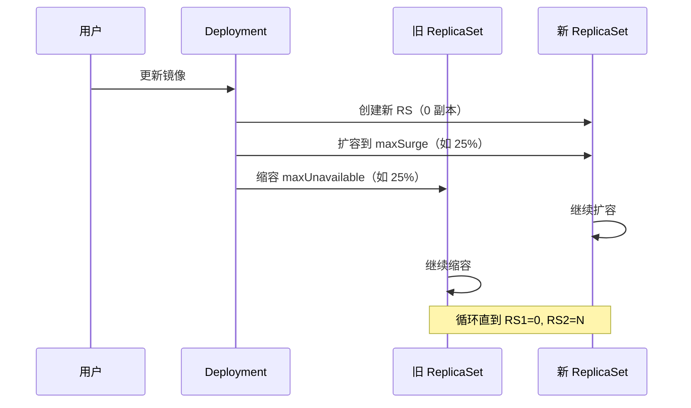

#### 关键参数

```yaml
spec:
  strategy:
    type: RollingUpdate
    rollingUpdate:
      maxSurge: 25%          # 最多可超出副本数
      maxUnavailable: 25%    # 最多不可用副本数
```

| 参数                 | 说明                          |
| ------------------ | --------------------------- |
| **maxSurge**       | 更新过程中最多可超出期望副本数的数量（绝对值或百分比） |
| **maxUnavailable** | 更新过程中最多不可用的副本数（绝对值或百分比）     |

#### 回滚

```bash
# 查看历史版本
kubectl rollout history deployment/my-app

# 回滚到上一版本
kubectl rollout undo deployment/my-app

# 回滚到指定版本
kubectl rollout undo deployment/my-app --to-revision=2

# 暂停/恢复更新
kubectl rollout pause deployment/my-app
kubectl rollout resume deployment/my-app
```

***

## 三、调度机制

### Q9. K8s 调度器（Scheduler）工作原理？

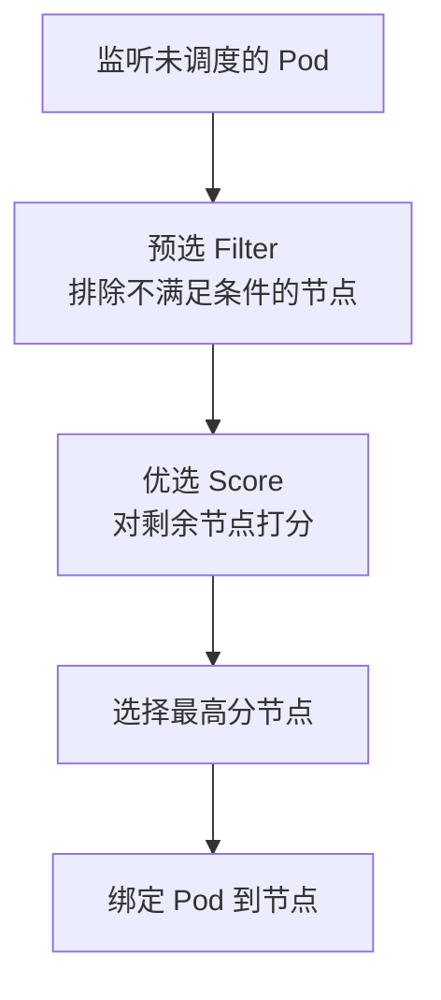

#### 调度两阶段

| 阶段             | 说明                        |
| -------------- | ------------------------- |
| **Filter（预选）** | 排除不满足条件的节点（资源不足、端口冲突、污点等） |
| **Score（优选）**  | 对通过预选的节点打分，选择最高分          |

#### 常见预选规则

| 规则                 | 说明                    |
| ------------------ | --------------------- |
| `NodeResourcesFit` | 节点资源是否满足 Pod requests |
| `NodeAffinity`     | 节点亲和性                 |
| `TaintToleration`  | 污点容忍                  |
| `PodAffinity`      | Pod 亲和性               |
| `NodeName`         | 指定节点名                 |
| `HostPort`         | 端口冲突检查                |

#### 常见优选规则

| 规则                                | 说明       |
| --------------------------------- | -------- |
| `NodeResourcesBalancedAllocation` | 资源均衡     |
| `ImageLocality`                   | 节点已有镜像优先 |
| `PodTopologySpread`               | 拓扑分布     |
| `LeastRequested`                  | 剩余资源多的优先 |

***

### Q10. 节点亲和性（NodeAffinity）与 Pod 亲和性？

#### 节点亲和性

```yaml
spec:
  affinity:
    nodeAffinity:
      requiredDuringSchedulingIgnoredDuringExecution:   # 硬约束（必须满足）
        nodeSelectorTerms:
          - matchExpressions:
              - key: disktype
                operator: In
                values: ["ssd"]
      preferredDuringSchedulingIgnoredDuringExecution:  # 软约束（尽量满足）
        - weight: 1
          preference:
            matchExpressions:
              - key: zone
                operator: In
                values: ["cn-east-1"]
```

#### Pod 亲和性/反亲和性

```yaml
spec:
  affinity:
    podAffinity:           # 亲和性：Pod 尽量放在一起
      requiredDuringSchedulingIgnoredDuringExecution:
        - labelSelector:
            matchExpressions:
              - key: app
                operator: In
                values: ["web"]
          topologyKey: kubernetes.io/hostname
    podAntiAffinity:       # 反亲和性：Pod 尽量分开（高可用）
      preferredDuringSchedulingIgnoredDuringExecution:
        - weight: 100
          podAffinityTerm:
            labelSelector:
              matchExpressions:
                - key: app
                  operator: In
                  values: ["web"]
            topologyKey: kubernetes.io/hostname
```

| 亲和性                 | 作用        | 场景              |
| ------------------- | --------- | --------------- |
| **NodeAffinity**    | Pod 与节点   | 指定节点类型（SSD、GPU） |
| **PodAffinity**     | Pod 与 Pod | 紧耦合服务放一起        |
| **PodAntiAffinity** | Pod 与 Pod | 高可用（分散到不同节点）    |

***

### Q11. 污点（Taint）与容忍（Toleration）？

#### 核心概念

```
污点（Taint）：节点的标签，排斥不带对应容忍的 Pod
容忍（Toleration）：Pod 的属性，允许调度到有对应污点的节点
```

#### 污点

```bash
# 给节点打污点
kubectl taint nodes node1 key1=value1:NoSchedule

# 污点效果
# NoSchedule：不调度（已运行的不受影响）
# PreferNoSchedule：尽量不调度
# NoExecute：不调度且驱逐已运行的 Pod
```

#### 容忍

```yaml
spec:
  tolerations:
    - key: "key1"
      operator: "Equal"     # Equal / Exists
      value: "value1"
      effect: "NoSchedule"
      tolerationSeconds: 3600  # NoExecute 时可延迟驱逐
```

#### 应用场景

```
1. 专用节点：GPU 节点打污点，只有 GPU 任务能调度
2. 预留节点：保留资源给特定服务
3. 节点维护：打 NoExecute 污点驱逐所有 Pod
```

***

### Q12. 资源限制（requests/limits）？

| 参数           | 说明    | 作用                  |
| ------------ | ----- | ------------------- |
| **requests** | 资源请求量 | 调度依据，保证至少有这么多资源     |
| **limits**   | 资源上限  | 超过限制会被 OOM Kill 或限流 |

#### 资源类型

| 资源       | 单位            | 说明                    |
| -------- | ------------- | --------------------- |
| **CPU**  | 核（1 = 1 vCPU） | 可写 500m = 0.5 核       |
| **内存**   | 字节            | Mi（1024Ki）、Gi（1024Mi） |
| **临时存储** | 字节            | ephemeral-storage     |
| **GPU**  | 个             | nvidia.com/gpu        |

#### 示例

```yaml
spec:
  containers:
    - name: app
      image: myapp
      resources:
        requests:
          cpu: "500m"        # 请求 0.5 核
          memory: "256Mi"    # 请求 256MB
        limits:
          cpu: "1000m"       # 上限 1 核
          memory: "512Mi"    # 上限 512MB
```

#### CPU 与内存的区别

```
CPU：可压缩资源，超过 limits 会被限流（throttle），不会 Kill
内存：不可压缩资源，超过 limits 会被 OOM Kill
```

#### 资源 QoS 等级

| 等级             | 条件                      | 说明          |
| -------------- | ----------------------- | ----------- |
| **Guaranteed** | 所有容器 requests = limits  | 最高优先级，最后被驱逐 |
| **Burstable**  | 设置了 requests 但 < limits | 中优先级        |
| **BestEffort** | 未设置 requests/limits     | 最低优先级，最先被驱逐 |

***

## 四、Service 与网络

### Q13. Service 的四种类型？

| 类型                | 说明          | 适用场景          |
| ----------------- | ----------- | ------------- |
| **ClusterIP**（默认） | 集群内部虚拟 IP   | 服务间内部通信       |
| **NodePort**      | 在所有节点开放端口   | 外部访问（测试/简单场景） |
| **LoadBalancer**  | 云厂商负载均衡器    | 生产环境外部访问      |
| **ExternalName**  | CNAME 到外部域名 | 访问集群外服务       |

#### 示例

```yaml
apiVersion: v1
kind: Service
metadata:
  name: my-service
spec:
  type: ClusterIP          # ClusterIP / NodePort / LoadBalancer / ExternalName
  selector:
    app: my-app
  ports:
    - port: 80             # Service 端口
      targetPort: 8080     # 容器端口
      nodePort: 30080      # NodePort 时的节点端口（30000-32767）
```

#### Headless Service

```yaml
spec:
  clusterIP: None    # 不分配虚拟 IP，直接返回 Pod IP
```

```
Headless Service 用途：
1. StatefulSet 的服务发现（每个 Pod 有固定 DNS）
2. 客户端自己做负载均衡
3. 直接访问 Pod
```

***

### Q14. Service 是如何实现负载均衡的？

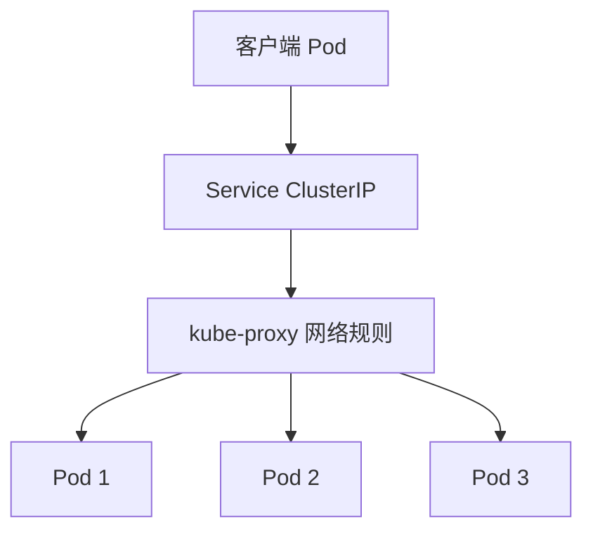

#### 原理

```
1. Service 有一个虚拟 IP（ClusterIP）
2. kube-proxy 监听 Service 和 Endpoint 变化
3. 在节点上创建网络规则（iptables/ipvs）
4. 访问 ClusterIP 的流量被转发到后端 Pod
5. 默认轮询（Round Robin）负载均衡
```

#### Endpoint

```
Service 通过 selector 匹配 Pod，生成 Endpoint 列表
Endpoint 存储在 etcd 中，kube-proxy 监听变化更新规则
```

```bash
# 查看 Endpoint
kubectl get endpoints my-service
```

***

### Q15. kube-proxy 的三种模式（iptables/ipvs/userspace）？

| 模式               | 原理              | 性能     | 支持的负载均衡策略    |
| ---------------- | --------------- | ------ | ------------ |
| **userspace**    | kube-proxy 进程转发 | 差（用户态） | 轮询           |
| **iptables**（默认） | 内核 netfilter 规则 | 中      | 随机           |
| **ipvs**         | 内核 IPVS 模块      | 高      | 轮询/最少连接/源哈希等 |

#### 对比

```
iptables 模式：
  - 规则数随 Service/Endpoint 增长线性增加
  - 1万+ Service 时性能下降明显
  - 只支持随机负载均衡

ipvs 模式：
  - 基于哈希表，性能不随规模下降
  - 支持 10+ 负载均衡算法
  - 适合大规模集群
  - 需要内核加载 ip_vs 模块
```

```bash
# 切换到 ipvs 模式
# 修改 kube-proxy ConfigMap
kubectl edit configmap kube-proxy -n kube-system
# mode: "ipvs"
```

***

### Q16. Ingress 与 Ingress Controller？

#### 核心概念

```
Ingress：K8s 资源，定义 HTTP/HTTPS 路由规则
Ingress Controller：实现 Ingress 规则的组件（如 Nginx Ingress）
```

#### 与 Service 的区别

| 维度   | Service               | Ingress            |
| ---- | --------------------- | ------------------ |
| 层级   | L4（TCP/UDP）           | L7（HTTP/HTTPS）     |
| 功能   | 简单转发                  | 路由、SSL、限流、重写       |
| 外部访问 | NodePort/LoadBalancer | HTTP 路由到多个 Service |

#### Ingress 示例

```yaml
apiVersion: networking.k8s.io/v1
kind: Ingress
metadata:
  name: my-ingress
  annotations:
    nginx.ingress.kubernetes.io/rewrite-target: /
spec:
  ingressClassName: nginx
  rules:
    - host: app.example.com
      http:
        paths:
          - path: /api
            pathType: Prefix
            backend:
              service:
                name: api-service
                port:
                  number: 80
          - path: /web
            pathType: Prefix
            backend:
              service:
                name: web-service
                port:
                  number: 80
  tls:
    - hosts:
        - app.example.com
      secretName: tls-secret
```

#### 常见 Ingress Controller

| Controller        | 说明           |
| ----------------- | ------------ |
| **Nginx Ingress** | 最常用，基于 Nginx |
| **Traefik**       | 云原生，自动发现     |
| **HAProxy**       | 高性能          |
| **Istio Gateway** | 服务网格集成       |

***

### Q17. K8s 网络模型（CNI）？

#### 核心原则

```
K8s 网络模型要求：
1. 每个 Pod 有独立 IP
2. 所有 Pod 可直接通信（无需 NAT）
3. 节点与 Pod 可直接通信
4. Pod 看到的 IP 与其他 Pod 看到的一致
```

#### CNI（Container Network Interface）

CNI 是容器网络插件规范，K8s 通过 CNI 实现 Pod 网络。

| CNI 插件          | 模式             | 适用       |
| --------------- | -------------- | -------- |
| **Flannel**     | overlay（VXLAN） | 简单，跨主机   |
| **Calico**      | overlay + BGP  | 网络策略，大规模 |
| **Weave**       | overlay        | 简单       |
| **Cilium**      | eBPF           | 高性能、安全   |
| **Kube-router** | BGP            | 简单       |

#### Pod 网络通信流程

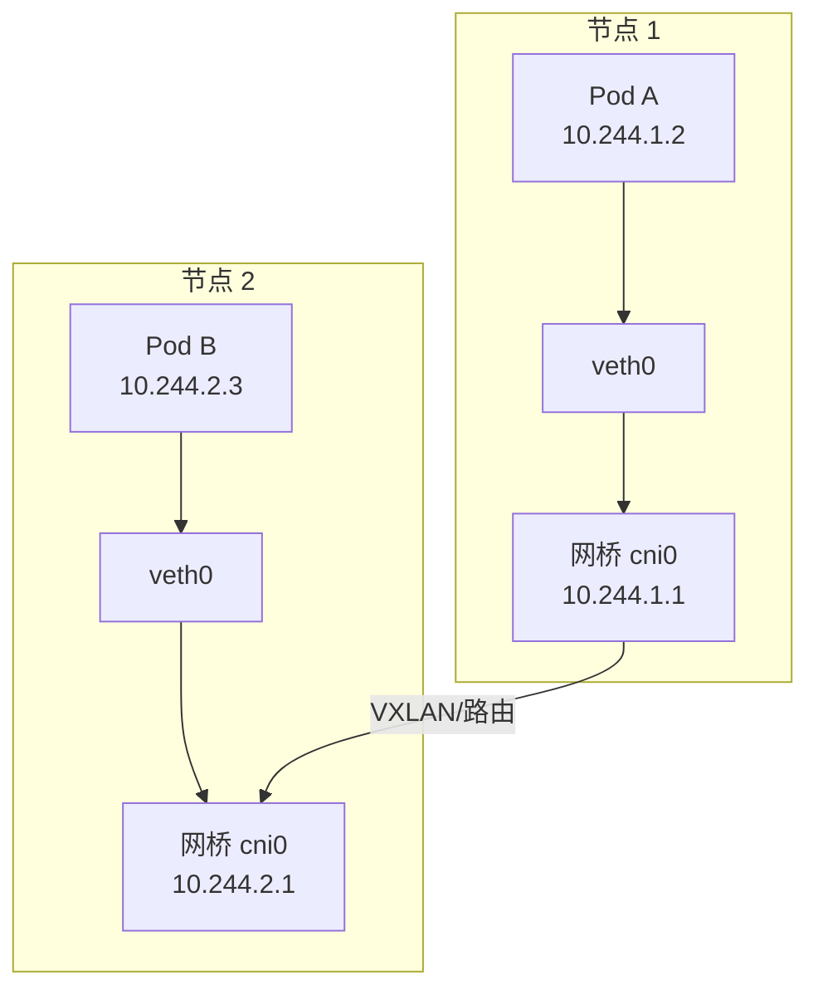

#### 跨节点 Pod 通信

```
1. Pod A 发包到 Pod B
2. 包通过 veth 进入节点 1 的 cni0 网桥
3. 网桥查路由表，转发到节点 2
4. 节点 2 的 cni0 网桥转发到 Pod B 的 veth
5. Pod B 收到包
```

***

## 五、存储与配置

### Q18. Volume / PV / PVC 的区别？

| 概念                             | 说明       | 生命周期        |
| ------------------------------ | -------- | ----------- |
| **Volume**                     | Pod 级存储  | 与 Pod 同生命周期 |
| **PV（PersistentVolume）**       | 集群级存储资源  | 独立于 Pod     |
| **PVC（PersistentVolumeClaim）** | 用户对存储的请求 | 独立于 Pod     |

#### 三种 Volume

| 类型           | 说明                  | 生命周期    |
| ------------ | ------------------- | ------- |
| **emptyDir** | Pod 内临时存储，Pod 删除即消失 | 与 Pod 同 |
| **hostPath** | 挂载节点本地目录            | 与节点同    |
| **PV/PVC**   | 持久化存储               | 独立于 Pod |

#### PV/PVC 绑定流程

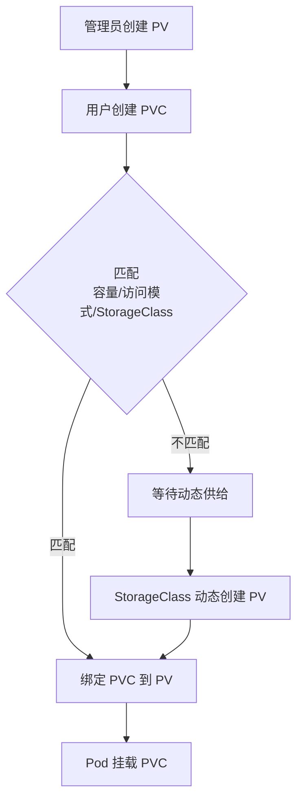

#### PV 示例

```yaml
apiVersion: v1
kind: PersistentVolume
metadata:
  name: pv-1
spec:
  capacity:
    storage: 5Gi
  accessModes:
    - ReadWriteOnce       # RWO / ROX / RWX / RWOP
  persistentVolumeReclaimPolicy: Retain  # Retain / Delete / Recycle
  storageClassName: standard
  hostPath:
    path: /mnt/data
```

#### PVC 示例

```yaml
apiVersion: v1
kind: PersistentVolumeClaim
metadata:
  name: pvc-1
spec:
  accessModes:
    - ReadWriteOnce
  resources:
    requests:
      storage: 5Gi
  storageClassName: standard
```

#### 访问模式

| 模式                         | 说明              |
| -------------------------- | --------------- |
| **ReadWriteOnce（RWO）**     | 单节点读写           |
| **ReadOnlyMany（ROX）**      | 多节点只读           |
| **ReadWriteMany（RWX）**     | 多节点读写           |
| **ReadWriteOncePod（RWOP）** | 单 Pod 读写（1.27+） |

***

### Q19. StorageClass 与动态供给？

#### 核心答案

StorageClass 定义存储类型，实现**动态供给**（Dynamic Provisioning），用户创建 PVC 时自动创建 PV。

#### StorageClass 示例

```yaml
apiVersion: storage.k8s.io/v1
kind: StorageClass
metadata:
  name: standard
provisioner: kubernetes.io/aws-ebs   # 存储供给者
parameters:
  type: gp2                           # EBS 类型
reclaimPolicy: Delete                 # PV 回收策略
allowVolumeExpansion: true            # 允许扩容
```

#### 动态供给流程

```
1. 用户创建 PVC，指定 storageClassName
2. StorageClass 的 provisioner 自动创建 PV
3. PV 自动绑定到 PVC
4. Pod 使用 PVC
```

#### 常见 Provisioner

| 云厂商   | Provisioner                                 |
| ----- | ------------------------------------------- |
| AWS   | kubernetes.io/aws-ebs                       |
| GCP   | kubernetes.io/gce-pd                        |
| Azure | kubernetes.io/azure-disk                    |
| NFS   | k8s-sigs.io/nfs-subdir-external-provisioner |
| Ceph  | rbd.csi.ceph.com                            |

***

### Q20. ConfigMap 与 Secret 的区别？

| 维度   | ConfigMap | Secret          |
| ---- | --------- | --------------- |
| 用途   | 非敏感配置     | 敏感信息（密码、密钥、证书）  |
| 存储   | 明文（etcd）  | Base64 编码（etcd） |
| 大小限制 | 1MB       | 1MB             |
| 安全   | 普通        | 可启用加密 + 权限控制    |

#### ConfigMap 示例

```yaml
apiVersion: v1
kind: ConfigMap
metadata:
  name: app-config
data:
  app.properties: |
    server.port=8080
    app.name=myapp
  log_level: "info"
```

#### Secret 示例

```yaml
apiVersion: v1
kind: Secret
metadata:
  name: db-secret
type: Opaque
data:
  username: YWRtaW4=        # Base64 编码
  password: cGFzc3dvcmQ=
```

#### 使用方式

```yaml
spec:
  containers:
    - name: app
      image: myapp
      env:
        - name: LOG_LEVEL
          valueFrom:
            configMapKeyRef:
              name: app-config
              key: log_level
        - name: DB_PASSWORD
          valueFrom:
            secretKeyRef:
              name: db-secret
              key: password
      volumeMounts:
        - name: config-volume
          mountPath: /etc/config
        - name: secret-volume
          mountPath: /etc/secret
          readOnly: true
  volumes:
    - name: config-volume
      configMap:
        name: app-config
    - name: secret-volume
      secret:
        secretName: db-secret
```

#### 安全建议

```
1. etcd 启用加密存储
2. 用 RBAC 限制 Secret 访问
3. 不要把 Secret 提交到 Git
4. 生产环境用外部密钥管理（Vault）
```

***

## 六、健康检查与自动伸缩

### Q21. 探针（Probe）的三种类型？

| 探针                 | 作用   | 失败后果                     |
| ------------------ | ---- | ------------------------ |
| **livenessProbe**  | 存活探针 | 容器重启                     |
| **readinessProbe** | 就绪探针 | 从 Service 移除             |
| **startupProbe**   | 启动探针 | 成功前禁用 liveness/readiness |

#### 示例

```yaml
spec:
  containers:
    - name: app
      image: myapp
      startupProbe:                    # 启动探针（慢启动应用）
        httpGet:
          path: /health
          port: 8080
        failureThreshold: 30
        periodSeconds: 5

      livenessProbe:                   # 存活探针
        httpGet:
          path: /health
          port: 8080
        initialDelaySeconds: 10
        periodSeconds: 10
        failureThreshold: 3

      readinessProbe:                  # 就绪探针
        httpGet:
          path: /ready
          port: 8080
        initialDelaySeconds: 5
        periodSeconds: 5
```

#### 检查方式

| 方式          | 说明                      |
| ----------- | ----------------------- |
| `httpGet`   | HTTP GET 请求，200-399 为成功 |
| `tcpSocket` | TCP 连接成功                |
| `exec`      | 执行命令，exit 0 为成功         |

***

### Q22. HPA（水平 Pod 自动伸缩）原理？

#### 核心答案

HPA 根据 CPU/内存/自定义指标自动调整 Pod 副本数。

#### 工作原理

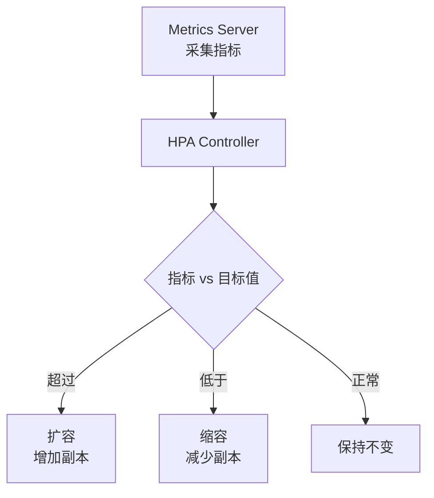

#### HPA 示例

```yaml
apiVersion: autoscaling/v2
kind: HorizontalPodAutoscaler
metadata:
  name: my-app-hpa
spec:
  scaleTargetRef:
    apiVersion: apps/v1
    kind: Deployment
    name: my-app
  minReplicas: 2
  maxReplicas: 10
  metrics:
    - type: Resource
      resource:
        name: cpu
        target:
          type: Utilization
          averageUtilization: 70      # CPU 超过 70% 扩容
    - type: Resource
      resource:
        name: memory
        target:
          type: Utilization
          averageUtilization: 80
  behavior:
    scaleUp:
      stabilizationWindowSeconds: 60   # 扩容稳定窗口
    scaleDown:
      stabilizationWindowSeconds: 300  # 缩容稳定窗口（默认 5 分钟）
```

#### 关键参数

| 参数                            | 说明        |
| ----------------------------- | --------- |
| `minReplicas` / `maxReplicas` | 最小/最大副本数  |
| `averageUtilization`          | 目标利用率百分比  |
| `stabilizationWindowSeconds`  | 稳定窗口，防止抖动 |

#### 其他伸缩

| 类型                     | 说明                     |
| ---------------------- | ---------------------- |
| **HPA**                | 水平 Pod 伸缩（副本数）         |
| **VPA**                | 垂直 Pod 伸缩（资源 requests） |
| **Cluster Autoscaler** | 节点伸缩                   |

***

### Q23. 优雅停机（Graceful Shutdown）？

#### 核心答案

Pod 被删除时，K8s 会先发送 SIGTERM，等待 `terminationGracePeriodSeconds`（默认 30s）后再 SIGKILL。

#### 优雅停机流程

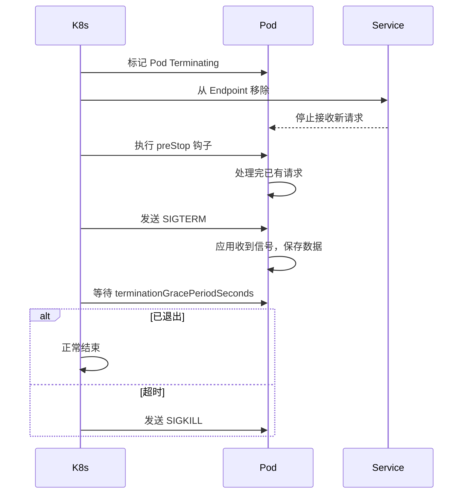

#### 配置

```yaml
spec:
  terminationGracePeriodSeconds: 60   # 优雅停机时间
  containers:
    - name: app
      image: myapp
      lifecycle:
        preStop:
          exec:
            command: ["/bin/sh", "-c", "sleep 10"]  # 等待请求处理完
```

#### 应用层配合

```java
// Spring Boot 配置优雅停机
server:
  shutdown: graceful
spring:
  lifecycle:
    timeout-per-shutdown-phase: 30s
```

***

## 七、运维与故障排查

### Q24. Pod 一直处于 Pending 怎么办？

#### 排查步骤

```bash
# 1. 查看 Pod 详情和事件
kubectl describe pod <pod-name>

# 2. 查看节点资源
kubectl describe node <node-name>

# 3. 查看调度器日志
kubectl logs -n kube-system kube-scheduler-<master>
```

#### 常见原因

| 原因              | 排查方法                         |
| --------------- | ---------------------------- |
| **资源不足**        | 检查节点 CPU/内存是否满足 requests     |
| **节点亲和性不满足**    | 检查 nodeAffinity/nodeSelector |
| **污点不容忍**       | 检查 taint/toleration          |
| **PV/PVC 未绑定**  | 检查 PVC 状态                    |
| **镜像拉取失败**      | 检查 ImagePullBackOff          |
| **节点 NotReady** | 检查节点状态                       |

***

### Q25. Pod CrashLoopBackOff 排查思路？

#### 排查步骤

```bash
# 1. 查看 Pod 状态
kubectl get pods

# 2. 查看事件
kubectl describe pod <pod-name>

# 3. 查看日志
kubectl logs <pod-name> --previous    # 查看上一次崩溃的日志

# 4. 查看容器退出码
kubectl get pod <pod-name> -o jsonpath='{.status.containerStatuses[0].lastState.terminated.exitCode}'
```

#### 常见退出码

| 退出码 | 含义                                   |
| --- | ------------------------------------ |
| 0   | 正常退出                                 |
| 1   | 应用错误                                 |
| 137 | 被 SIGKILL（OOM Kill 或超出 memory limit） |
| 139 | 段错误（Segfault）                        |
| 143 | 被 SIGTERM                            |

#### 常见原因

| 原因           | 解决                  |
| ------------ | ------------------- |
| **应用启动失败**   | 看日志排查               |
| **OOM Kill** | 检查 memory limits，调大 |
| **健康检查失败**   | 检查探针配置              |
| **配置错误**     | 检查 ConfigMap/Secret |
| **端口冲突**     | 检查 containerPort    |
| **依赖未就绪**    | 检查依赖服务              |

***

### Q26. K8s 常用运维命令？

#### Pod 操作

```bash
# 查看 Pod
kubectl get pods -n <namespace>
kubectl get pods -o wide        # 显示节点 IP
kubectl describe pod <pod>      # 详细信息

# 日志
kubectl logs <pod> -f           # 实时日志
kubectl logs <pod> --previous   # 上一次崩溃日志
kubectl logs <pod> -c <container>  # 多容器指定容器

# 进入容器
kubectl exec -it <pod> -- /bin/bash

# 删除
kubectl delete pod <pod>
kubectl delete pod <pod> --force --grace-period=0
```

#### 资源操作

```bash
# 查看所有资源
kubectl get all -n <namespace>

# 查看事件
kubectl get events -n <namespace> --sort-by='.lastTimestamp'

# 查看节点
kubectl get nodes
kubectl top nodes               # 节点资源使用
kubectl top pods                # Pod 资源使用

# 进入集群调试
kubectl run debug --image=busybox -it --rm -- /bin/sh
```

#### 配置调试

```bash
# 查看资源 YAML
kubectl get pod <pod> -o yaml

# 查看 API 资源
kubectl api-resources

# 查看集群信息
kubectl cluster-info
kubectl version
```

***

## 八、安全与权限

### Q27. RBAC 权限模型？

#### 核心概念

| 资源                     | 说明                                 |
| ---------------------- | ---------------------------------- |
| **Role**               | 命名空间内的权限规则                         |
| **ClusterRole**        | 集群级权限规则                            |
| **RoleBinding**        | 将 Role 绑定到用户/ServiceAccount        |
| **ClusterRoleBinding** | 将 ClusterRole 绑定到用户/ServiceAccount |

#### 示例

```yaml
# 命名空间内的 Role
apiVersion: rbac.authorization.k8s.io/v1
kind: Role
metadata:
  name: pod-reader
  namespace: default
rules:
  - apiGroups: [""]
    resources: ["pods"]
    verbs: ["get", "list", "watch"]

# 绑定 Role
apiVersion: rbac.authorization.k8s.io/v1
kind: RoleBinding
metadata:
  name: read-pods
  namespace: default
subjects:
  - kind: ServiceAccount
    name: my-sa
roleRef:
  kind: Role
  name: pod-reader
  apiGroup: rbac.authorization.k8s.io
```

#### 常见 verbs

| Verb             | 说明     |
| ---------------- | ------ |
| get              | 获取单个资源 |
| list             | 列出资源   |
| watch            | 监听资源变化 |
| create           | 创建     |
| update           | 更新     |
| patch            | 部分更新   |
| delete           | 删除     |
| deletecollection | 批量删除   |

#### 常用内置 ClusterRole

| ClusterRole     | 说明      |
| --------------- | ------- |
| `cluster-admin` | 超级管理员   |
| `admin`         | 命名空间管理员 |
| `edit`          | 编辑权限    |
| `view`          | 只读权限    |

***

### Q28. Namespace 的作用？

#### 核心答案

Namespace 用于**逻辑隔离**集群资源，实现多租户、环境隔离。

#### 查看与创建

```bash
# 查看命名空间
kubectl get namespaces

# 创建
kubectl create namespace dev

# 指定命名空间操作
kubectl get pods -n dev
kubectl config set-context --current --namespace=dev
```

#### 默认命名空间

| Namespace         | 说明     |
| ----------------- | ------ |
| `default`         | 默认命名空间 |
| `kube-system`     | 系统组件   |
| `kube-public`     | 公开资源   |
| `kube-node-lease` | 节点心跳   |

#### 使用场景

```
1. 环境隔离：dev / test / prod
2. 团队隔离：team-a / team-b
3. 资源配额：每个 Namespace 设 ResourceQuota
4. 权限控制：RBAC 按 Namespace 授权
```

***

## 九、综合实战题

### Q29. 如何实现蓝绿部署与金丝雀发布？

#### 蓝绿部署

```
蓝绿部署：同时运行两个版本（蓝=旧，绿=新）
流量从蓝切到绿，出问题立即切回
```

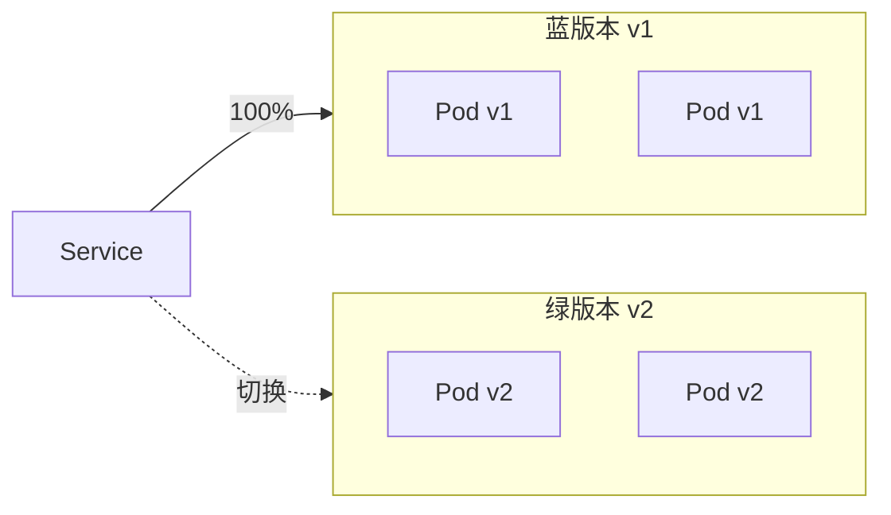

#### 实现方式

```yaml
# 蓝版本 Service（旧）
apiVersion: v1
kind: Service
metadata:
  name: app-blue
spec:
  selector:
    app: app
    version: v1
  ports:
    - port: 80

# 绿版本 Service（新）
apiVersion: v1
kind: Service
metadata:
  name: app-green
spec:
  selector:
    app: app
    version: v2
  ports:
    - port: 80

# 主 Service 通过改 selector 切换流量
# version: v1 → version: v2
```

#### 金丝雀发布

```
金丝雀：先让小部分流量到新版本，验证后逐步放大
```

| 方案                         | 实现                             |
| -------------------------- | ------------------------------ |
| **多 Deployment + Service** | 调整副本数比例                        |
| **Ingress 权重**             | Nginx Ingress 支持 traffic split |
| **Istio**                  | 服务网格流量管理                       |

#### 金丝雀（副本数方式）

```
v1 Deployment: 9 个副本（90% 流量）
v2 Deployment: 1 个副本（10% 流量）
→ 验证 OK → v1 缩到 0，v2 扩到 10
```

#### 金丝雀（Nginx Ingress 权重）

```yaml
apiVersion: networking.k8s.io/v1
kind: Ingress
metadata:
  name: app-canary
  annotations:
    nginx.ingress.kubernetes.io/canary: "true"
    nginx.ingress.kubernetes.io/canary-weight: "10"  # 10% 流量
spec:
  rules:
    - host: app.example.com
      http:
        paths:
          - path: /
            pathType: Prefix
            backend:
              service:
                name: app-v2
                port:
                  number: 80
```

***

### Q30. K8s 与 Docker 的关系？

| 维度 | Docker                 | Kubernetes |
| -- | ---------------------- | ---------- |
| 定位 | 容器运行时                  | 容器编排平台     |
| 层级 | 单机                     | 集群         |
| 功能 | 创建/运行容器                | 调度/伸缩/管理容器 |
| 关系 | K8s 可以用 Docker 作为容器运行时 | -          |

#### 关系说明

```
Docker：负责容器的构建和运行
K8s：负责在多台机器上调度和管理容器

K8s 不直接管理容器，而是通过 CRI（Container Runtime Interface）
与容器运行时交互：
  - Docker（通过 dockershim，已废弃）
  - containerd（推荐）
  - CRI-O
```

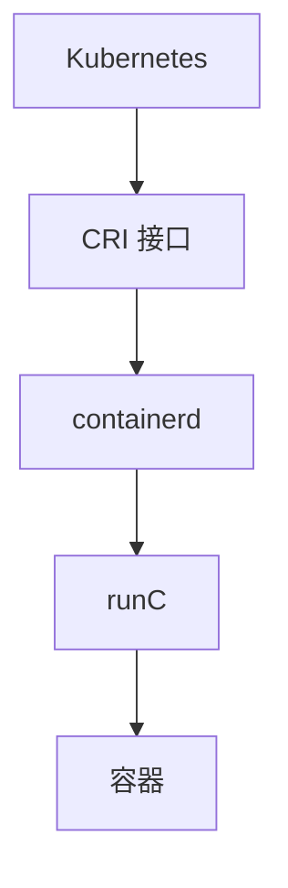

#### K8s 1.24+ 移除 Dockershim

```
K8s 1.24 后不再支持 Docker 作为容器运行时
推荐使用 containerd 或 CRI-O
但镜像仍可用 Docker 构建，推送到镜像仓库后 K8s 可拉取
```

***

## 十、速答与踩坑总结

### 10.1 速答卡片

**Q：K8s 最小调度单位是什么？**
A：Pod（不是容器），一个 Pod 可包含多个共享网络和存储的容器。

**Q：Pod 生命周期有哪些状态？**
A：Pending → Running → Succeeded/Failed/Unknown。

**Q：Deployment 和 StatefulSet 区别？**
A：Deployment 无状态，Pod 名随机；StatefulSet 有状态，Pod 名有序、有固定 DNS 和独立存储。

**Q：Service 有哪些类型？**
A：ClusterIP（默认）、NodePort、LoadBalancer、ExternalName。

**Q：kube-proxy 三种模式？**
A：userspace（差）、iptables（默认）、ipvs（高性能）。

**Q：什么是 CNI？**
A：容器网络接口规范，实现 Pod 网络（Flannel、Calico、Cilium）。

**Q：PV 和 PVC 的区别？**
A：PV 是集群存储资源，PVC 是用户对存储的请求。

**Q：ConfigMap 和 Secret 区别？**
A：ConfigMap 存非敏感配置（明文），Secret 存敏感信息（Base64 编码）。

**Q：三种探针？**
A：liveness（存活，失败重启）、readiness（就绪，失败移出 Service）、startup（启动，成功前禁用其他探针）。

**Q：Pod CrashLoopBackOff 怎么排查？**
A：kubectl describe 看事件 → kubectl logs --previous 看上一次日志 → 检查退出码。

**Q：HPA 是什么？**
A：水平 Pod 自动伸缩，根据 CPU/自定义指标调整副本数。

**Q：蓝绿部署和金丝雀区别？**
A：蓝绿是两版本全量切换；金丝雀是逐步放量。

***

### 10.2 实战踩坑 10 例

| #  | 场景               | 现象               | 根因                 | 解决                               |
| -- | ---------------- | ---------------- | ------------------ | -------------------------------- |
| 1  | Pod 一直 Pending   | 无法调度             | 节点资源不足/污点不匹配       | 加资源/加容忍                          |
| 2  | CrashLoopBackOff | 不断重启             | OOM Kill / 应用崩溃    | 调大 memory limit / 查日志            |
| 3  | Service 不通       | 访问 ClusterIP 超时  | selector 不匹配 Pod   | 检查 selector 标签                   |
| 4  | 镜像拉取失败           | ImagePullBackOff | 凭证错误/镜像不存在         | 检查 imagePullSecrets              |
| 5  | DNS 解析失败         | 服务间无法通信          | CoreDNS 异常         | 重启 CoreDNS                       |
| 6  | Pod 无法访问外网       | 网络不通             | 网络策略/iptables      | 检查 NetworkPolicy                 |
| 7  | HPA 不生效          | 不伸缩              | metrics-server 未部署 | 安装 metrics-server                |
| 8  | PV 无法绑定          | PVC Pending      | StorageClass 不存在   | 创建 StorageClass                  |
| 9  | 探针误杀             | Pod 频繁重启         | 探针超时太短             | 调大 failureThreshold/period       |
| 10 | 滚动更新中断           | 服务不可用            | maxUnavailable 设太大 | 调小 maxUnavailable，用 readiness 探针 |

***

### 10.3 复习优先级表

| 优先级    | 主题                               | 考察概率 | 建议复习时间 |
| ------ | -------------------------------- | ---- | ------ |
| **P0** | Pod 生命周期                         | 95%  | 30min  |
| **P0** | Service 原理                       | 90%  | 30min  |
| **P0** | Deployment/StatefulSet/DaemonSet | 90%  | 30min  |
| **P0** | 探针与健康检查                          | 85%  | 30min  |
| **P1** | 调度机制（亲和/污点）                      | 80%  | 1h     |
| **P1** | 网络模型（CNI）                        | 75%  | 1h     |
| **P1** | PV/PVC/StorageClass              | 75%  | 30min  |
| **P1** | 故障排查                             | 80%  | 1h     |
| **P2** | HPA/VPA                          | 65%  | 30min  |
| **P2** | Ingress                          | 60%  | 30min  |
| **P2** | RBAC                             | 55%  | 30min  |
| **P3** | 蓝绿/金丝雀                           | 50%  | 30min  |
| **P3** | 安全加固                             | 40%  | 1h     |

```mermaid
flowchart LR
    P0[Pod生命周期] --> P0a[Service原理]
    P0a --> P0b[Deployment/StatefulSet]
    P0b --> P0c[探针与健康检查]
    P0c --> P1a[调度机制]
    P1a --> P1b[网络模型CNI]
    P1b --> P1c[PV/PVC]
    P1c --> P1d[故障排查]
    P1d --> P2a[HPA/VPA]
    P2a --> P2b[Ingress]
    P2b --> P2c[RBAC]
    P2c --> P3a[蓝绿/金丝雀]
    P3a --> P3b[安全加固]

    style P0 fill:#f8d7da,stroke-width:3px
    style P0a fill:#f8d7da,stroke-width:3px
    style P0b fill:#f8d7da,stroke-width:3px
    style P0c fill:#f8d7da,stroke-width:3px
```

