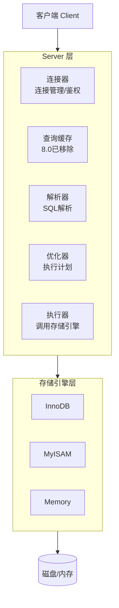
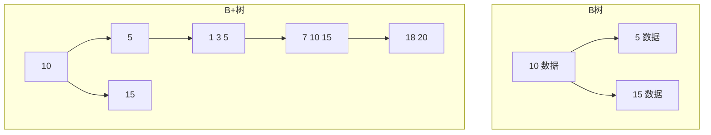
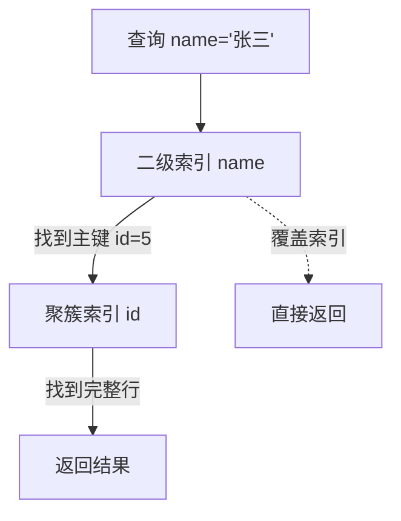
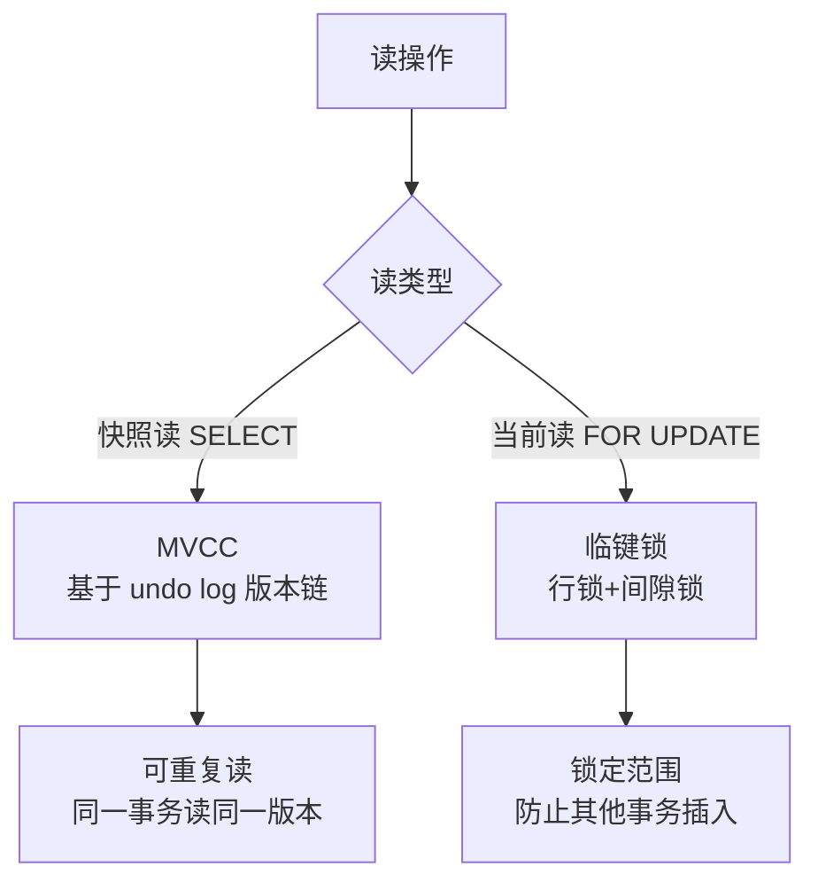
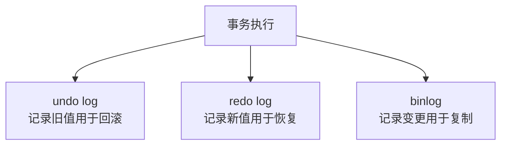
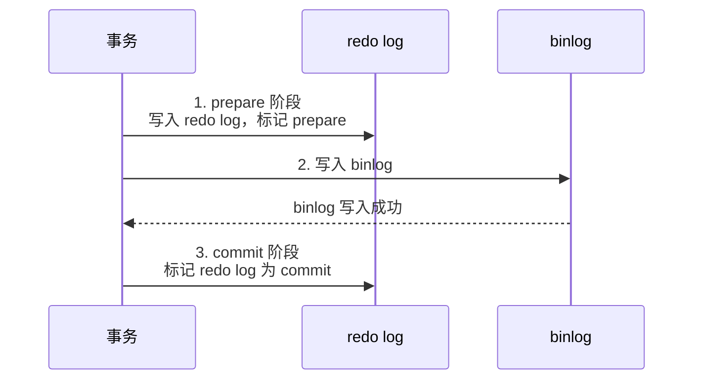
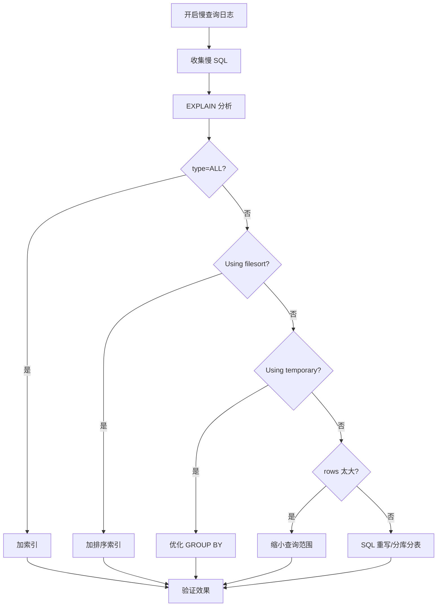
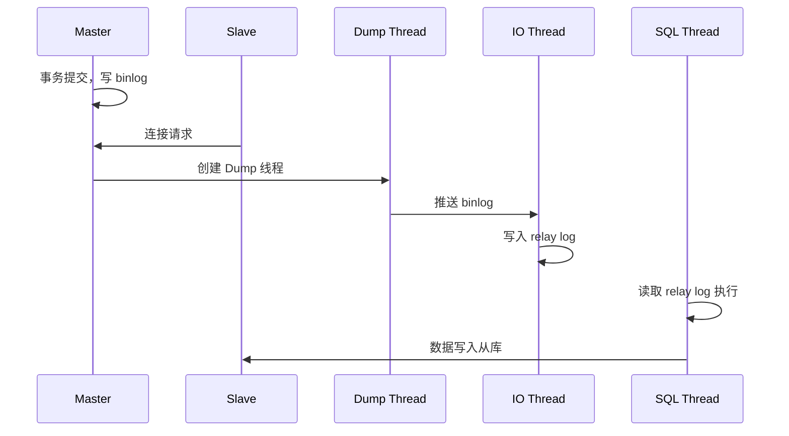

# MySQL 高频面试题与详细回答

> 文档定位：系统梳理 MySQL 在面试中的高频问题，涵盖架构原理、索引与 B+ 树、事务与锁、MVCC、SQL 优化、日志机制、主从复制、分库分表等核心考点。
>
> 适用人群：Java 后端工程师，尤其是需要设计数据库、优化 SQL、排查慢查询的开发者。
>
> 阅读建议：先掌握索引与事务（二至四章），再学习锁与 MVCC（五至六章），最后攻克优化与架构（七至九章）。重点关注「B+ 树索引」「事务隔离级别」「MVCC 原理」「慢查询优化」「锁机制」五大核心模块。

***

## 目录

- [一、MySQL 基础架构](#一mysql-基础架构)

  - [Q1. MySQL 整体架构？](#q1-mysql-整体架构)

  - [Q2. InnoDB 与 MyISAM 的区别？](#q2-innodb-与-myisam-的区别)

  - [Q3. 字符集 utf8 和 utf8mb4 的区别？](#q3-字符集-utf8-和-utf8mb4-的区别)

- [二、索引与 B+ 树](#二索引与-b-树)

  - [Q4. 索引的数据结构？为什么用 B+ 树？](#q4-索引的数据结构为什么用-b-树)

  - [Q5. 聚簇索引与非聚簇索引？](#q5-聚簇索引与非聚簇索引)

  - [Q6. 覆盖索引、回表、索引下推？](#q6-覆盖索引回表索引下推)

  - [Q7. 最左前缀原则？](#q7-最左前缀原则)

- [三、事务与隔离级别](#三事务与隔离级别)

  - [Q8. 事务的 ACID？](#q8-事务的-acid)

  - [Q9. 事务的四种隔离级别？](#q9-事务的四种隔离级别)

  - [Q10. MySQL 默认可重复读是如何解决幻读的？](#q10-mysql-默认可重复读是如何解决幻读的)

- [四、MVCC 与日志](#四mvcc-与日志)

  - [Q11. MVCC 原理？](#q11-mvcc-原理)

  - [Q12. undo log / redo log / binlog 的区别？](#q12-undo-log--redo-log--binlog-的区别)

  - [Q13. redo log 的两阶段提交？](#q13-redo-log-的两阶段提交)

- [五、锁机制](#五锁机制)

  - [Q14. MySQL 的锁有哪些？](#q14-mysql-的锁有哪些)

  - [Q15. 行锁、表锁、间隙锁、临键锁？](#q15-行锁表锁间隙锁临键锁)

  - [Q16. 死锁的原因与解决？](#q16-死锁的原因与解决)

- [六、SQL 优化](#六sql-优化)

  - [Q17. EXPLAIN 各字段含义？](#q17-explain-各字段含义)

  - [Q18. 慢查询优化思路？](#q18-慢查询优化思路)

  - [Q19. 索引失效的场景？](#q19-索引失效的场景)

  - [Q20. 分页查询优化（深分页）？](#q20-分页查询优化深分页)

- [七、主从复制与高可用](#七主从复制与高可用)

  - [Q21. 主从复制原理？](#q21-主从复制原理)

  - [Q22. 主从延迟的原因与解决？](#q22-主从延迟的原因与解决)

  - [Q23. 读写分离方案？](#q23-读写分离方案)

- [八、分库分表](#八分库分表)

  - [Q24. 什么时候需要分库分表？](#q24-什么时候需要分库分表)

  - [Q25. 分库分表方案与中间件？](#q25-分库分表方案与中间件)

  - [Q26. 分库分表后的问题？](#q26-分库分表后的问题)

- [九、综合实战题](#九综合实战题)

  - [Q27. 如何设计一个订单表？](#q27-如何设计一个订单表)

  - [Q28. 如何排查线上死锁？](#q28-如何排查线上死锁)

- [十、速答与踩坑总结](#十速答与踩坑总结)

  - [10.1 速答卡片](#101-速答卡片)

  - [10.2 实战踩坑 10 例](#102-实战踩坑-10-例)

  - [10.3 复习优先级表](#103-复习优先级表)

***

## 一、MySQL 基础架构

### Q1. MySQL 整体架构？



| 层级       | 组件            | 职责                   |
| -------- | ------------- | -------------------- |
| **连接器**  | -             | 连接管理、权限校验            |
| **查询缓存** | -             | SQL 命中缓存直接返回（8.0 移除） |
| **解析器**  | -             | 词法/语法分析，生成解析树        |
| **优化器**  | -             | 生成执行计划，选择索引          |
| **执行器**  | -             | 调用存储引擎，返回结果          |
| **存储引擎** | InnoDB/MyISAM | 数据存储与读写              |

#### 一条 SQL 的执行流程

```
1. 连接器：建立连接、校验权限
2. 查询缓存：命中则直接返回（8.0 移除）
3. 解析器：SQL 词法/语法分析
4. 优化器：选择执行计划和索引
5. 执行器：调用存储引擎接口
6. 存储引擎：读取/写入数据，返回结果
```

***

### Q2. InnoDB 与 MyISAM 的区别？

| 维度       | InnoDB     | MyISAM |
| -------- | ---------- | ------ |
| **事务**   | ✅ 支持       | ❌ 不支持  |
| **行锁**   | ✅ 行锁       | ❌ 表锁   |
| **外键**   | ✅ 支持       | ❌ 不支持  |
| **崩溃恢复** | ✅ redo log | ❌ 易丢数据 |
| **全文索引** | 5.6+ 支持    | ✅ 原生支持 |
| **聚簇索引** | ✅          | ❌      |
| **MVCC** | ✅          | ❌      |
| **适用场景** | 事务、并发      | 只读、日志  |

#### 为什么默认用 InnoDB？

```
1. 支持事务（ACID）
2. 行锁，并发性能好
3. 崩溃恢复（redo log）
4. 聚簇索引，主键查询快
5. 支持外键、MVCC
```

***

### Q3. 字符集 utf8 和 utf8mb4 的区别？

| 字符集               | 字节数     | 支持字符            |
| ----------------- | ------- | --------------- |
| **utf8（utf8mb3）** | 最多 3 字节 | 不支持 emoji、生僻汉字  |
| **utf8mb4**       | 最多 4 字节 | 支持所有 Unicode 字符 |

```
MySQL 的 utf8 是 utf8mb3 的别名，只支持 3 字节
emoji 和部分生僻字需要 4 字节，必须用 utf8mb4
```

#### 推荐配置

```sql
-- 建库
CREATE DATABASE mydb DEFAULT CHARACTER SET utf8mb4 COLLATE utf8mb4_unicode_ci;

-- 建表
CREATE TABLE user (
    id BIGINT PRIMARY KEY,
    name VARCHAR(50)
) ENGINE=InnoDB DEFAULT CHARSET=utf8mb4 COLLATE=utf8mb4_unicode_ci;
```

***

## 二、索引与 B+ 树

### Q4. 索引的数据结构？为什么用 B+ 树？

#### 常见索引数据结构

| 结构        | 特点      | 缺点            |
| --------- | ------- | ------------- |
| **哈希表**   | O(1) 查询 | 不支持范围查询、有序    |
| **二叉搜索树** | 有序      | 可能退化为链表       |
| **红黑树**   | 平衡二叉树   | 树太高，IO 多      |
| **B 树**   | 多路平衡树   | 非叶子节点也存数据，扇出小 |
| **B+ 树**  | B 树变种   | -             |

#### B+ 树 vs B 树



| 维度    | B 树        | B+ 树       |
| ----- | ---------- | ---------- |
| 非叶子节点 | 存数据        | 只存索引       |
| 叶子节点  | 不相连        | 链表相连       |
| 查询    | 可能在非叶子节点命中 | 必须到叶子节点    |
| 范围查询  | 需中序遍历      | 链表顺序遍历     |
| 扇出    | 小          | 大（非叶子不存数据） |

#### 为什么 B+ 树适合数据库索引？

```
1. 树矮（一般 3-4 层），IO 次数少
2. 非叶子节点只存索引，扇出大，能存更多索引
3. 叶子节点链表相连，范围查询高效
4. 查询稳定，每次都到叶子节点
```

#### B+ 树高度计算

```
假设：
  - 每页 16KB
  - 索引项 12 字节（主键 8 + 指针 4）
  - 叶子节点数据行 1KB

非叶子节点每页可存：16KB / 12B ≈ 1365 个索引项
3 层 B+ 树可存：1365 × 1365 × 16 ≈ 3000 万行数据
4 层可存：1365^3 × 16 ≈ 400 亿行

所以千万级数据，B+ 树 3-4 层即可，查询只需 3-4 次 IO
```

***

### Q5. 聚簇索引与非聚簇索引？

| 维度   | 聚簇索引（主键索引） | 非聚簇索引（二级索引） |
| ---- | ---------- | ----------- |
| 叶子节点 | 存完整行数据     | 存主键值        |
| 数量   | 只能有 1 个    | 可以有多个       |
| 物理顺序 | 与索引顺序一致    | 逻辑顺序        |
| 查询   | 主键查询快      | 需回表         |

#### InnoDB 聚簇索引

```
InnoDB 表数据本身就是聚簇索引（按主键组织）
如果没有主键：
  1. 选择唯一非空索引作为聚簇索引
  2. 没有则生成隐藏的 row_id（6字节）
```

#### 回表过程



```
回表：通过二级索引找到主键，再通过主键索引找完整数据
覆盖索引：查询的列都在二级索引中，无需回表
```

***

### Q6. 覆盖索引、回表、索引下推？

| 概念            | 说明                    |
| ------------- | --------------------- |
| **回表**        | 二级索引找到主键后，再回聚簇索引查完整数据 |
| **覆盖索引**      | 查询列都在索引中，无需回表         |
| **索引下推（ICP）** | 5.6+，在索引遍历阶段就过滤，减少回表  |

#### 覆盖索引示例

```sql
-- 索引：idx_name_age(name, age)

-- ✅ 覆盖索引：name 和 age 都在索引中
SELECT name, age FROM user WHERE name = '张三';

-- ❌ 需要回表：select * 需要查完整行
SELECT * FROM user WHERE name = '张三';
```

#### 索引下推（ICP）示例

```sql
-- 索引：idx_name_age(name, age)

-- 不开启 ICP：先按 name 找，再回表过滤 age
SELECT * FROM user WHERE name = '张三' AND age > 20;

-- 开启 ICP：在索引中同时过滤 name 和 age，减少回表
-- 5.6+ 默认开启
SET optimizer_switch = 'index_condition_pushdown=on';
```

***

### Q7. 最左前缀原则？

#### 核心

```
联合索引 (a, b, c)：
  ✅ WHERE a = 1
  ✅ WHERE a = 1 AND b = 2
  ✅ WHERE a = 1 AND b = 2 AND c = 3
  ✅ WHERE a = 1 AND c = 3   -- a 走索引，c 不走
  ❌ WHERE b = 2              -- 跳过 a，索引失效
  ❌ WHERE b = 2 AND c = 3    -- 跳过 a，索引失效
```

#### 索引顺序优化

```
区分度高的列放前面
等值查询的列放前面
范围查询的列放后面
```

```sql
-- 联合索引 (a, b, c)
-- a 等值、b 范围、c 等值 → c 无法用索引

-- 优化：把 c 放 b 前面
-- 索引 (a, c, b)
-- a 等值、c 等值、b 范围 → 都能用索引
```

***

## 三、事务与隔离级别

### Q8. 事务的 ACID？

| 特性      | 英文          | 说明            | 实现         |
| ------- | ----------- | ------------- | ---------- |
| **原子性** | Atomicity   | 事务要么全成功，要么全失败 | undo log   |
| **一致性** | Consistency | 事务前后数据一致      | 其他三个特性共同保证 |
| **隔离性** | Isolation   | 并发事务互不干扰      | 锁 + MVCC   |
| **持久性** | Durability  | 提交后数据永久保存     | redo log   |

***

### Q9. 事务的四种隔离级别？

| 隔离级别            | 脏读 | 不可重复读 | 幻读               | 实现                           |
| --------------- | -- | ----- | ---------------- | ---------------------------- |
| **读未提交**        | ✅  | ✅     | ✅                | 无                            |
| **读已提交（RC）**    | ❌  | ✅     | ✅                | MVCC（每次 SELECT 生成新 ReadView） |
| **可重复读（RR，默认）** | ❌  | ❌     | ✅（InnoDB 用临键锁解决） | MVCC（第一次 SELECT 生成 ReadView） |
| **串行化**         | ❌  | ❌     | ❌                | 全表锁                          |

#### 三种读异常

| 异常        | 说明                                   |
| --------- | ------------------------------------ |
| **脏读**    | 读到其他事务未提交的数据                         |
| **不可重复读** | 同一事务内两次读同一行，结果不同（其他事务 UPDATE）        |
| **幻读**    | 同一事务内两次范围查询，行数不同（其他事务 INSERT/DELETE） |

***

### Q10. MySQL 默认可重复读是如何解决幻读的？

#### 核心答案

InnoDB 在 RR 隔离级别下通过\*\*临键锁（Next-Key Lock）\*\*和 **MVCC** 共同解决幻读。

#### 快照读 vs 当前读

| 读类型     | 说明                              | 幻读解决方案         |
| ------- | ------------------------------- | -------------- |
| **快照读** | 普通 SELECT                       | MVCC（ReadView） |
| **当前读** | SELECT FOR UPDATE、UPDATE、DELETE | 临键锁            |



#### 临键锁

```
临键锁 = 行锁 + 间隙锁
锁定一个左开右闭的区间 (a, b]

例：索引有 10, 20, 30
临键锁区间：(-∞,10], (10,20], (20,30], (30,+∞)

SELECT * FROM t WHERE id > 15 AND id < 25 FOR UPDATE;
锁定区间：(10,20], (20,30]
→ 其他事务无法在 (10,30) 范围内插入，解决幻读
```

***

## 四、MVCC 与日志

### Q11. MVCC 原理？

#### 核心组件

| 组件               | 说明                                    |
| ---------------- | ------------------------------------- |
| **隐藏字段**         | DB\_TRX\_ID（事务ID）、DB\_ROLL\_PTR（回滚指针） |
| **undo log 版本链** | 每次修改生成一条 undo log，通过回滚指针连成链           |
| **ReadView**     | 事务启动时生成，记录活跃事务列表                      |

#### 隐藏字段

```
每行数据有两个隐藏字段：
  - DB_TRX_ID：最后修改该行的事务 ID
  - DB_ROLL_PTR：指向 undo log 的指针
```

#### ReadView 四个属性

| 属性               | 说明                       |
| ---------------- | ------------------------ |
| `m_ids`          | 生成 ReadView 时活跃的事务 ID 列表 |
| `min_trx_id`     | m\_ids 中最小的事务 ID         |
| `max_trx_id`     | 下一个要分配的事务 ID             |
| `creator_trx_id` | 创建 ReadView 的事务 ID       |

#### 可见性判断

```
对于某行数据的 DB_TRX_ID：
  1. DB_TRX_ID == creator_trx_id → 可见（自己修改的）
  2. DB_TRX_ID < min_trx_id → 可见（已提交）
  3. DB_TRX_ID >= max_trx_id → 不可见（未来的事务）
  4. min_trx_id <= DB_TRX_ID < max_trx_id：
     - 在 m_ids 中 → 不可见（活跃未提交）
     - 不在 m_ids 中 → 可见（已提交）
不可见则沿 undo log 版本链找上一个版本，直到找到可见版本
```

#### RC vs RR 的 MVCC 区别

```
RC：每次 SELECT 都生成新的 ReadView → 能读到其他事务已提交的数据
RR：第一次 SELECT 生成 ReadView，后续复用 → 同一事务读同一版本
```

***

### Q12. undo log / redo log / binlog 的区别？

| 维度       | undo log   | redo log  | binlog         |
| -------- | ---------- | --------- | -------------- |
| **层级**   | 存储引擎层      | 存储引擎层     | Server 层       |
| **作用**   | 回滚 + MVCC  | 崩溃恢复      | 主从复制 + 归档      |
| **内容**   | 逻辑日志（反向操作） | 物理日志（页修改） | 逻辑日志（SQL 或行变更） |
| **写入时机** | 事务执行时      | 事务提交前     | 事务提交时          |
| **循环写**  | ❌（按事务）     | ✅（固定大小循环） | ❌（追加写）         |
| **崩溃恢复** | ❌          | ✅         | 主从恢复           |



#### 三种日志的作用

```
undo log：
  - 事务回滚（原子性）
  - MVCC 快照读

redo log：
  - WAL（Write-Ahead Logging）预写日志
  - 崩溃恢复，保证持久性

binlog：
  - 主从复制
  - 数据归档/恢复
```

***

### Q13. redo log 的两阶段提交？

#### 为什么需要两阶段提交？

```
问题：redo log 和 binlog 是两份独立的日志
如果只写 redo log 成功，binlog 失败：
  - 崩溃恢复后，redo log 有数据，但 binlog 没有
  - 主从复制时，从库没有这条数据 → 不一致

如果只写 binlog 成功，redo log 失败：
  - 崩溃恢复后，redo log 没有，binlog 有
  - 主从复制时，从库有数据，但主库没有 → 不一致

两阶段提交解决：保证 redo log 和 binlog 要么都成功，要么都失败
```

#### 两阶段提交流程



| 阶段           | 操作                    | 崩溃恢复           |
| ------------ | --------------------- | -------------- |
| **prepare**  | 写 redo log，标记 prepare | 检查 binlog 是否完整 |
| **写 binlog** | 写 binlog              | -              |
| **commit**   | 标记 redo log 为 commit  | -              |

#### 崩溃恢复规则

```
1. redo log 是 commit → 直接提交
2. redo log 是 prepare：
   - binlog 完整 → 提交
   - binlog 不完整 → 回滚
```

***

## 五、锁机制

### Q14. MySQL 的锁有哪些？

#### 按粒度

| 锁类型    | 粒度 | 性能     | 存储引擎          |
| ------ | -- | ------ | ------------- |
| **表锁** | 表  | 低（并发差） | InnoDB/MyISAM |
| **行锁** | 行  | 高（并发好） | InnoDB        |
| **页锁** | 页  | 中      | BDB           |

#### 按模式

| 锁类型        | 说明           |
| ---------- | ------------ |
| **共享锁（S）** | 读锁，多个事务可同时持有 |
| **排他锁（X）** | 写锁，只能一个事务持有  |

#### 兼容性

| <br />  | S 锁 | X 锁 |
| ------- | --- | --- |
| **S 锁** | 兼容  | 冲突  |
| **X 锁** | 冲突  | 冲突  |

#### InnoDB 行锁类型

| 锁                 | 说明               |
| ----------------- | ---------------- |
| **Record Lock**   | 行锁，锁单行           |
| **Gap Lock**      | 间隙锁，锁区间（不包含行）    |
| **Next-Key Lock** | 临键锁，行锁+间隙锁（左开右闭） |

***

### Q15. 行锁、表锁、间隙锁、临键锁？

#### 加锁规则

```
InnoDB 行锁通过索引实现：
  - 走索引 → 行锁
  - 不走索引 → 表锁（全表扫描）
```

```sql
-- 行锁（走索引）
SELECT * FROM user WHERE id = 1 FOR UPDATE;

-- 表锁（不走索引，全表扫描）
SELECT * FROM user WHERE name = '张三' FOR UPDATE;
-- name 没有索引，全表扫描，锁所有行
```

#### 间隙锁

```
间隙锁锁的是两个索引之间的间隙，防止其他事务在间隙中插入
只在 RR 隔离级别下生效
```

```
索引值：10, 20, 30
间隙：(-∞,10), (10,20), (20,30), (30,+∞)

SELECT * FROM t WHERE id = 20 FOR UPDATE;
→ 锁行 20 + 间隙 (10,20) + (20,30)
→ 防止其他事务在 10-30 之间插入
```

#### 临键锁

```
临键锁 = 行锁 + 间隙锁 = 左开右闭区间 (a, b]
是 InnoDB 默认的行锁算法
```

***

### Q16. 死锁的原因与解决？

#### 死锁示例

```sql
-- 事务 A
BEGIN;
UPDATE user SET age = 20 WHERE id = 1;   -- 锁 id=1
-- 等待 id=2 的锁
UPDATE user SET age = 30 WHERE id = 2;

-- 事务 B
BEGIN;
UPDATE user SET age = 30 WHERE id = 2;   -- 锁 id=2
-- 等待 id=1 的锁
UPDATE user SET age = 20 WHERE id = 1;

-- 结果：A 等 B 的锁，B 等 A 的锁 → 死锁
```

#### 死锁检测

```bash
# 查看最近死锁
SHOW ENGINE INNODB STATUS;

# 查看锁等待
SELECT * FROM information_schema.INNODB_LOCK_WAITS;
```

#### 解决方案

| 方案         | 说明             |
| ---------- | -------------- |
| **固定加锁顺序** | 所有事务按相同顺序加锁    |
| **缩短事务**   | 事务尽快提交，减少锁持有时间 |
| **降低隔离级别** | RC 级别减少间隙锁     |
| **合理索引**   | 行锁替代表锁         |
| **死锁重试**   | 捕获死锁异常，重试      |

***

## 六、SQL 优化

### Q17. EXPLAIN 各字段含义？

| 字段                 | 说明                                  |
| ------------------ | ----------------------------------- |
| **id**             | 查询序号，相同 id 从上到下执行                   |
| **select\_type**   | 查询类型（SIMPLE/PRIMARY/SUBQUERY/UNION） |
| **table**          | 表名                                  |
| **type**           | 访问类型（性能从好到差）                        |
| **possible\_keys** | 可能用到的索引                             |
| **key**            | 实际用到的索引                             |
| **key\_len**       | 索引使用的字节数                            |
| **ref**            | 索引匹配的列或常量                           |
| **rows**           | 预估扫描行数                              |
| **Extra**          | 额外信息                                |

#### type 访问类型（性能从好到差）

```
system > const > eq_ref > ref > range > index > ALL

const：主键/唯一索引等值查询
eq_ref：联表时用主键/唯一索引
ref：普通索引等值查询
range：索引范围查询
index：全索引扫描（只扫索引不扫数据）
ALL：全表扫描（最差，需优化）
```

#### Extra 常见值

| 值                         | 说明               |
| ------------------------- | ---------------- |
| **Using index**           | 覆盖索引，性能好         |
| **Using where**           | 服务器层过滤           |
| **Using index condition** | 索引下推（ICP）        |
| **Using temporary**       | 使用临时表，需优化        |
| **Using filesort**        | 额外排序，需优化         |
| **Using join buffer**     | 联表用了 join buffer |

***

### Q18. 慢查询优化思路？



#### 慢查询配置

```sql
-- 开启慢查询日志
SET GLOBAL slow_query_log = ON;

-- 慢查询阈值（秒）
SET GLOBAL long_query_time = 1;

-- 日志文件
SET GLOBAL slow_query_log_file = '/var/log/mysql/slow.log';
```

#### 常见优化手段

| 手段                   | 说明         |
| -------------------- | ---------- |
| **加索引**              | 解决全表扫描     |
| **覆盖索引**             | 减少回表       |
| \*\*避免 SELECT \*\*\* | 只查需要的列     |
| **LIMIT 优化**         | 深分页用子查询    |
| **JOIN 优化**          | 小表驱动大表，加索引 |
| **避免函数**             | 索引列不用函数    |
| **OR 改 UNION**       | OR 可能不用索引  |

***

### Q19. 索引失效的场景？

| 场景                   | 示例                               | 原因        |
| -------------------- | -------------------------------- | --------- |
| **函数/计算**            | `WHERE YEAR(create_time) = 2024` | 函数破坏索引有序性 |
| **隐式类型转换**           | `WHERE varchar_col = 123`        | 字符串转数字    |
| **LIKE 左模糊**         | `WHERE name LIKE '%张'`           | 左模糊无法用索引  |
| **OR 连接非索引列**        | `WHERE a = 1 OR b = 2`           | b 无索引则全表扫 |
| **!= / NOT IN / <>** | `WHERE status != 1`              | 优化器选择全表扫  |
| **IS NOT NULL**      | `WHERE name IS NOT NULL`         | 可能全表扫     |
| **最左前缀不满足**          | `WHERE b = 2`（索引 a,b）            | 跳过最左列     |

#### 示例

```sql
-- ❌ 索引失效：函数
SELECT * FROM user WHERE YEAR(create_time) = 2024;

-- ✅ 优化：范围查询
SELECT * FROM user WHERE create_time >= '2024-01-01' AND create_time < '2025-01-01';

-- ❌ 索引失效：隐式转换（phone 是 varchar）
SELECT * FROM user WHERE phone = 13800138000;

-- ✅ 优化：用字符串
SELECT * FROM user WHERE phone = '13800138000';

-- ❌ 索引失效：左模糊
SELECT * FROM user WHERE name LIKE '%张';

-- ✅ 优化：右模糊可用索引
SELECT * FROM user WHERE name LIKE '张%';
```

***

### Q20. 分页查询优化（深分页）？

#### 问题

```sql
-- 深分页：扫描前 1000010 行，取 10 行
SELECT * FROM user LIMIT 1000000, 10;
```

#### 优化方案

| 方案           | 说明              |
| ------------ | --------------- |
| **子查询 + 主键** | 先查主键，再用主键查数据    |
| **游标分页（推荐）** | 用上一页最后一条 ID 做条件 |
| **禁止深翻页**    | 业务限制最大页码        |

#### 子查询优化

```sql
-- ❌ 深分页
SELECT * FROM user ORDER BY id LIMIT 1000000, 10;

-- ✅ 子查询先查 ID
SELECT * FROM user WHERE id >= (
    SELECT id FROM user ORDER BY id LIMIT 1000000, 1
) LIMIT 10;
```

#### 游标分页（推荐）

```sql
-- 第一页
SELECT * FROM user ORDER BY id LIMIT 10;

-- 第二页（用上一页最后一条 id）
SELECT * FROM user WHERE id > 100 ORDER BY id LIMIT 10;
```

***

## 七、主从复制与高可用

### Q21. 主从复制原理？



#### 三个线程

| 线程              | 所在 | 作用                     |
| --------------- | -- | ---------------------- |
| **Binlog Dump** | 主库 | 推送 binlog 给从库          |
| **IO 线程**       | 从库 | 接收 binlog 写入 relay log |
| **SQL 线程**      | 从库 | 读取 relay log 并执行       |

#### 复制方式

| 方式           | 说明                |
| ------------ | ----------------- |
| **异步复制**（默认） | 主库提交即返回，不等待从库     |
| **半同步复制**    | 至少一个从库确认收到 binlog |
| **组复制**      | MGR，基于 Paxos      |

***

### Q22. 主从延迟的原因与解决？

#### 原因

| 原因            | 说明             |
| ------------- | -------------- |
| **从库性能差**     | 从库硬件不如主库       |
| **大事务**       | 主库大事务，从库重放慢    |
| **SQL 线程单线程** | 从库 SQL 线程串行执行  |
| **网络延迟**      | 跨地域网络慢         |
| **锁等待**       | 从库查询锁阻塞 SQL 线程 |

#### 解决方案

```sql
-- 1. 开启多线程复制（5.7+）
SET GLOBAL slave_parallel_workers = 8;
SET GLOBAL slave_parallel_type = LOGICAL_CLOCK;

-- 2. 从库配置和主库一致
-- 3. 避免大事务，拆分为小事务
-- 4. 读写分离时，一致性要求高的读走主库
```

#### 查看延迟

```sql
-- 查看从库状态
SHOW SLAVE STATUS;

-- 关注 Seconds_Behind_Master（秒）
-- 为 NULL 表示复制中断
```

***

### Q23. 读写分离方案？

| 方案        | 说明                   | 优点  | 缺点   |
| --------- | -------------------- | --- | ---- |
| **应用层路由** | 代码中判断读写              | 灵活  | 侵入代码 |
| **中间件代理** | ShardingSphere/MyCat | 透明  | 额外运维 |
| **数据库代理** | ProxySQL/MaxScale    | 性能好 | 学习成本 |

#### 应用层实现

```java
// 用 ThreadLocal 切换数据源
@Service
public class OrderService {

    @Autowired
    private OrderMapper orderMapper;

    // 读走从库
    @DataSource("slave")
    public Order getOrder(Long id) {
        return orderMapper.selectById(id);
    }

    // 写走主库
    @DataSource("master")
    @Transactional
    public void createOrder(Order order) {
        orderMapper.insert(order);
    }
}
```

#### 读写分离注意事项

```
1. 强制走主库：对一致性要求高的查询（如刚写入后查询）
2. 延迟容忍：从库可能有秒级延迟
3. 事务内读走主库：避免读到旧数据
```

***

## 八、分库分表

### Q24. 什么时候需要分库分表？

| 触发条件  | 阈值                           |
| ----- | ---------------------------- |
| 单表数据量 | > 2000 万行（InnoDB B+ 树超过 4 层） |
| 单表数据量 | > 5GB                        |
| QPS   | > 5000                       |
| 慢查询   | 频繁出现且优化无效                    |

#### 拆分方式

| 方式       | 说明             |
| -------- | -------------- |
| **垂直分库** | 按业务拆库（用户库、订单库） |
| **垂直分表** | 按字段拆表（冷热字段分离）  |
| **水平分库** | 按路由规则把数据分到多个库  |
| **水平分表** | 按路由规则把数据分到多个表  |

***

### Q25. 分库分表方案与中间件？

| 中间件                | 类型     | 说明         |
| ------------------ | ------ | ---------- |
| **ShardingSphere** | 客户端代理  | 功能全，社区活跃   |
| **MyCat**          | 代理服务器  | 老牌中间件      |
| **Vitess**         | 代理     | YouTube 开源 |
| **TIDB**           | 分布式数据库 | 原生分布式      |

#### 分片策略

| 策略        | 说明                  | 适用    |
| --------- | ------------------- | ----- |
| **取模**    | `hash(user_id) % N` | 均匀分布  |
| **范围**    | 按 ID 范围、时间范围        | 范围查询多 |
| **一致性哈希** | 哈希环                 | 扩容方便  |

```java
// 取模分片
public int getShardIndex(Long userId, int shardCount) {
    return Math.abs(userId.hashCode()) % shardCount;
}
```

***

### Q26. 分库分表后的问题？

| 问题          | 解决方案           |
| ----------- | -------------- |
| **跨库 JOIN** | 应用层组装，或冗余字段    |
| **跨库事务**    | 分布式事务（Seata）   |
| **分布式 ID**  | 雪花算法、UUID、号段模式 |
| **跨库排序/分页** | 应用层合并（限制深度）    |
| **扩容迁移**    | 一致性哈希、双写迁移     |

#### 分布式 ID 方案

```java
// 雪花算法
public class SnowflakeIdGenerator {
    private long workerId;
    private long sequence = 0L;
    private long lastTimestamp = -1L;

    public synchronized long nextId() {
        long timestamp = System.currentTimeMillis();
        if (timestamp < lastTimestamp) {
            throw new RuntimeException("时钟回拨");
        }
        if (timestamp == lastTimestamp) {
            sequence = (sequence + 1) & 4095;
            if (sequence == 0) {
                timestamp = tilNextMillis(lastTimestamp);
            }
        } else {
            sequence = 0L;
        }
        lastTimestamp = timestamp;
        // 1位符号 + 41位时间戳 + 10位机器ID + 12位序列号
        return ((timestamp - 1288834974657L) << 22)
             | (workerId << 12)
             | sequence;
    }
}
```

***

## 九、综合实战题

### Q27. 如何设计一个订单表？

```sql
CREATE TABLE `t_order` (
  `id` BIGINT NOT NULL COMMENT '主键ID',
  `order_no` VARCHAR(32) NOT NULL COMMENT '订单号',
  `user_id` BIGINT NOT NULL COMMENT '用户ID',
  `amount` DECIMAL(10,2) NOT NULL COMMENT '订单金额',
  `status` TINYINT NOT NULL DEFAULT 0 COMMENT '状态:0待支付 1已支付 2已取消',
  `create_time` DATETIME NOT NULL DEFAULT CURRENT_TIMESTAMP,
  `update_time` DATETIME NOT NULL DEFAULT CURRENT_TIMESTAMP ON UPDATE CURRENT_TIMESTAMP,
  `is_deleted` TINYINT NOT NULL DEFAULT 0 COMMENT '逻辑删除',
  PRIMARY KEY (`id`),
  UNIQUE KEY `uk_order_no` (`order_no`),
  KEY `idx_user_id_status` (`user_id`, `status`),
  KEY `idx_create_time` (`create_time`)
) ENGINE=InnoDB DEFAULT CHARSET=utf8mb4 COMMENT='订单表';
```

#### 设计要点

```
1. 主键：BIGINT 自增或雪花算法（避免主键太长）
2. 订单号：唯一索引，业务可追溯
3. 常用查询字段建联合索引（user_id, status）
4. 时间字段：create_time 建索引用于范围查询
5. 逻辑删除：is_deleted 字段，避免物理删除
6. 金额：DECIMAL(10,2)，不用 FLOAT/DOUBLE
7. 状态：TINYINT，不用字符串
8. 字符集：utf8mb4
9. 引擎：InnoDB
```

***

### Q28. 如何排查线上死锁？

```bash
# 1. 查看最近死锁日志
SHOW ENGINE INNODB STATUS\G

# 2. 查看当前锁等待
SELECT * FROM information_schema.INNODB_LOCK_WAITS;

# 3. 查看当前持有的锁
SELECT * FROM information_schema.INNODB_LOCKS;

# 4. 查看正在执行的事务
SELECT * FROM information_schema.INNODB_TRX;
```

#### 死锁日志分析

```
LATEST DETECTED DEADLOCK
------------------------
*** (1) TRANSACTION:
TRANSACTION 12345, ACTIVE 2 sec
mysql tables in use 1, locked 1
LOCK WAIT 2 lock struct(s)
UPDATE user SET age=20 WHERE id=1
*** (1) WAITING FOR THIS LOCK TO BE GRANTED:
RECORD LOCKS ... index PRIMARY ... id=1

*** (2) TRANSACTION:
TRANSACTION 12346, ACTIVE 1 sec
UPDATE user SET age=30 WHERE id=2
*** (2) WAITING FOR THIS LOCK TO BE GRANTED:
RECORD LOCKS ... index PRIMARY ... id=2

*** WE ROLL BACK TRANSACTION (2)
```

#### 解决步骤

```
1. 定位死锁的两个事务和 SQL
2. 分析加锁顺序
3. 统一加锁顺序（按主键从小到大）
4. 缩短事务，减少锁持有时间
5. 必要时降级为 RC 隔离级别（减少间隙锁）
```

***

## 十、速答与踩坑总结

### 10.1 速答卡片

**Q：InnoDB 为什么用 B+ 树？**
A：B+ 树矮（3-4 层）、IO 少、非叶子节点只存索引扇出大、叶子节点链表支持范围查询。

**Q：聚簇索引和非聚簇索引区别？**
A：聚簇索引叶子存完整数据，非聚簇索引叶子存主键值，需回表。

**Q：覆盖索引是什么？**
A：查询列都在索引中，无需回表。

**Q：最左前缀原则？**
A：联合索引从最左列开始匹配，跳过则索引失效。

**Q：事务隔离级别有哪些？**
A：读未提交、读已提交、可重复读（默认）、串行化。

**Q：MySQL 如何解决幻读？**
A：RR 级别用 MVCC（快照读）+ 临键锁（当前读）。

**Q：MVCC 原理？**
A：隐藏字段（事务ID+回滚指针）+ undo log 版本链 + ReadView 可见性判断。

**Q：redo log 和 binlog 区别？**
A：redo log 是引擎层物理日志，用于崩溃恢复；binlog 是 Server 层逻辑日志，用于主从复制。

**Q：什么是两阶段提交？**
A：redo log prepare → 写 binlog → redo log commit，保证两份日志一致性。

**Q：索引失效场景？**
A：函数、隐式转换、左模糊、OR 非索引列、最左前缀不满足。

**Q：慢查询怎么优化？**
A：EXPLAIN 分析 → 看 type/key/rows/Extra → 加索引/覆盖索引/优化 SQL。

**Q：深分页怎么优化？**
A：子查询先查 ID，或游标分页（用上一页最后 ID）。

**Q：主从复制原理？**
A：主库写 binlog → Dump 线程推送给从库 IO 线程 → 写 relay log → SQL 线程执行。

**Q：死锁怎么解决？**
A：固定加锁顺序、缩短事务、合理索引、死锁重试。

***

### 10.2 实战踩坑 10 例

| #  | 场景        | 现象                   | 根因                      | 解决                          |
| -- | --------- | -------------------- | ----------------------- | --------------------------- |
| 1  | emoji 存不进 | 插入报错                 | utf8 不支持 4 字节           | 改 utf8mb4                   |
| 2  | 索引不生效     | EXPLAIN 显示 ALL       | 隐式类型转换                  | 用正确类型查询                     |
| 3  | 深分页慢      | LIMIT 1000000,10 超时  | 扫描太多行                   | 子查询/游标分页                    |
| 4  | 死锁频繁      | 事务回滚                 | 加锁顺序不一致                 | 统一加锁顺序                      |
| 5  | 主从延迟大     | Seconds\_Behind 很大   | 大事务/从库慢                 | 拆事务/多线程复制                   |
| 6  | 脏页刷新慢     | 写入卡顿                 | innodb\_io\_capacity 太小 | 调大 io\_capacity             |
| 7  | 间隙锁导致锁等待  | 并发插入卡住               | RR 级别间隙锁                | 改 RC 或缩小范围                  |
| 8  | 覆盖索引不生效   | 仍回表                  | SELECT \*               | 只查需要的列                      |
| 9  | 统计信息不准    | 索引选错                 | 统计信息过期                  | ANALYZE TABLE               |
| 10 | 连接数打满     | Too many connections | 连接未释放/配置太小              | 调大 max\_connections + 检查连接池 |

***

### 10.3 复习优先级表

| 优先级    | 主题                   | 考察概率 | 建议复习时间 |
| ------ | -------------------- | ---- | ------ |
| **P0** | B+ 树索引原理             | 95%  | 30min  |
| **P0** | 聚簇/非聚簇索引             | 90%  | 30min  |
| **P0** | 事务隔离级别               | 95%  | 30min  |
| **P0** | MVCC 原理              | 90%  | 1h     |
| **P0** | 索引失效与优化              | 95%  | 1h     |
| **P1** | 锁机制（行锁/间隙锁）          | 85%  | 1h     |
| **P1** | redo/binlog/undo log | 85%  | 30min  |
| **P1** | 慢查询优化                | 90%  | 1h     |
| **P1** | 主从复制                 | 75%  | 30min  |
| **P2** | 两阶段提交                | 70%  | 30min  |
| **P2** | EXPLAIN 详解           | 75%  | 30min  |
| **P2** | 分库分表                 | 65%  | 1h     |
| **P3** | 死锁排查                 | 60%  | 30min  |
| **P3** | 高可用方案                | 55%  | 30min  |


