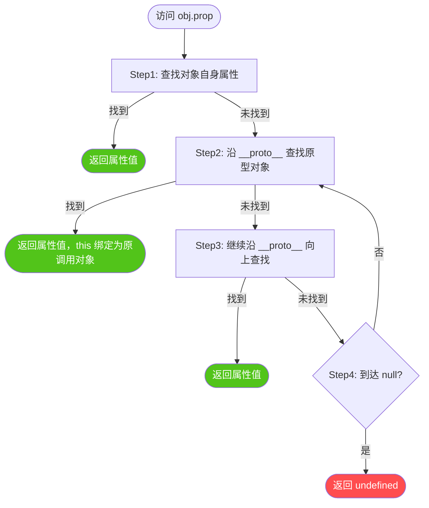
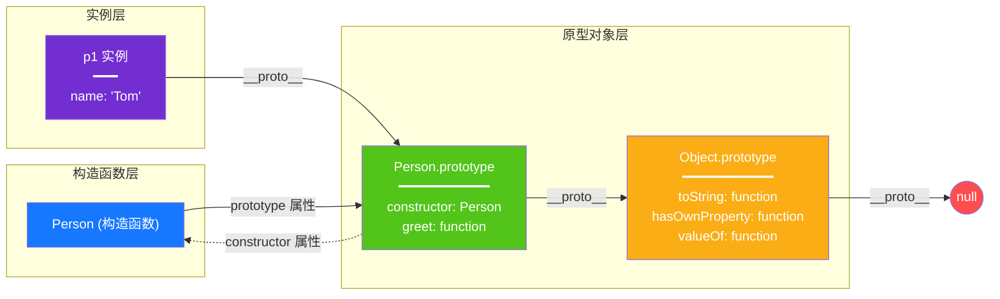
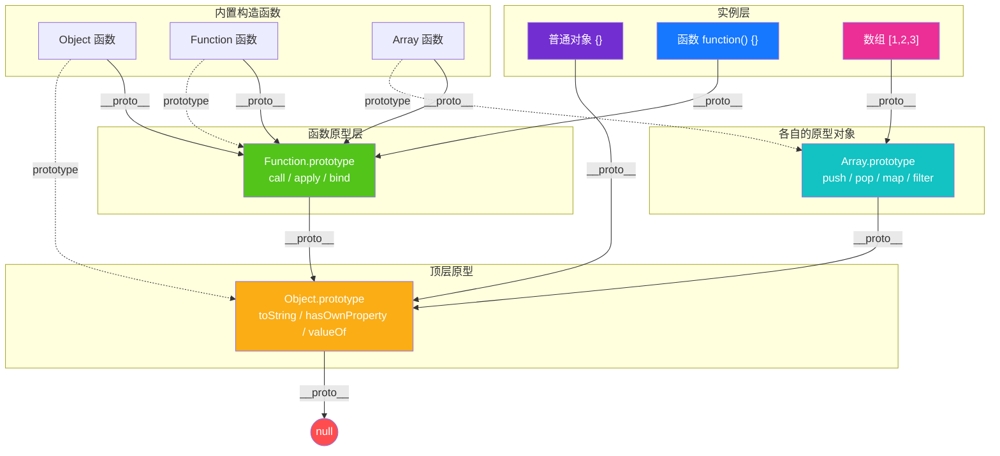
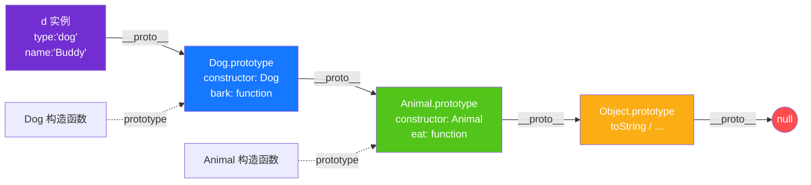
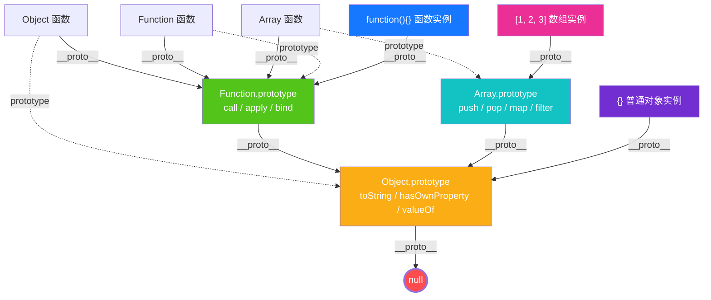

# JavaScript 原型与原型链面试题

> 面向面试与日常开发的原型链速查笔记。示例默认在现代 JavaScript（ES2022+）环境运行。

## 目录

- [一、核心概念解析](#一核心概念解析)
  - [1. 原型（Prototype）](#1-原型prototype)
  - [2. prototype 与 \_\_proto\_\_ 的区别](#2-prototype-与-__proto__-的区别)
  - [3. constructor 属性](#3-constructor-属性)
  - [4. 原型链（Prototype Chain）](#4-原型链prototype-chain)
  - [5. 原型链关系图](#5-原型链关系图)
  - [6. 不同对象类型的原型链层级](#6-不同对象类型的原型链层级)
  - [7. 原型链的终点 null](#7-原型链的终点-null)
  - [8. 原型链实现继承](#8-原型链实现继承)
  - [9. 原型链的实际应用场景](#9-原型链的实际应用场景)
- [二、面试题](#二面试题)
  - [1. `new` 操作符](#题目-1new-操作符的原理基础)
  - [2. 属性遮蔽](#题目-2原型链上的属性遮蔽基础)
  - [3. 继承方式对比](#题目-3多种继承方式对比进阶)
  - [4. `instanceof`](#题目-4instanceof-原理实现进阶)
  - [5. 属性遍历](#题目-5原型链上的属性遍历进阶)
  - [6. `Function` 与 `Object`](#题目-6function-和-object-的原型关系高阶)
- [三、易错点与最佳实践](#三易错点与最佳实践)

## 一、核心概念解析

### 1. 原型（Prototype）

**原型（Prototype）** 是 JavaScript 实现继承与属性共享的核心机制。每一个 JavaScript 对象在创建时都会关联另一个对象，这个关联对象就是它的**原型**；对象通过原型可以访问到原原型对象上的属性与方法。

**两个关键概念区分**：

- **`[[Prototype]]` 内部槽位**：ECMAScript 规范定义的**内部槽位**，每个对象都有，存储该对象的原型引用。无法直接访问，需通过 `Object.getPrototypeOf(obj)` 读取、`Object.setPrototypeOf(obj, proto)` 设置。
- **`prototype` 属性**：**仅函数对象**才有的显式数据属性（箭头函数没有）。当函数被作为构造函数用 `new` 调用时，其 `prototype` 属性指向的对象会成为新实例的原型。
- **`__proto__` 属性**：历史遗留的**访问器属性**（定义在 `Object.prototype` 上），是访问 `[[Prototype]]` 的非标准方式。**业务代码不要直接使用**，应使用 `Object.getPrototypeOf()` / `Object.setPrototypeOf()`。

```javascript
function Person(name) {
  this.name = name;
}

// 函数对象的 prototype 属性 —— 显式可访问
console.log(Person.prototype); // { constructor: Person }

const p1 = new Person('Tom');

// 实例对象的 [[Prototype]] 指向构造函数的 prototype
console.log(Object.getPrototypeOf(p1) === Person.prototype); // true（标准）
console.log(p1.__proto__ === Person.prototype);              // true（非标准，但浏览器仍支持）

// 原型对象上的 constructor 属性指回构造函数
console.log(Person.prototype.constructor === Person); // true
```

### 2. prototype 与 \_\_proto\_\_ 的区别

这两个属性名称相似但含义完全不同，是初学者最容易混淆的点。下表给出严格对比：

| 对比维度 | `prototype` | `__proto__` |
|---------|:-----------:|:-----------:|
| **存在于** | 仅函数对象（含 class） | 所有对象（含函数） |
| **本质** | 函数的显式数据属性 | 对象内部 `[[Prototype]]` 的访问器 |
| **作用** | 决定 `new` 创建的实例的原型 | 指向当前对象自身的原型 |
| **方向** | 构造函数 →（指向）→ 原型对象 | 实例对象 →（指向）→ 原型对象 |
| **标准性** | 标准 API | 非标准（已废弃，建议用 `Object.getPrototypeOf`） |
| **箭头函数** | 没有 `prototype` 属性 | 有 `__proto__`（指向 `Function.prototype` 或 `Object.prototype`） |

**一句话记忆**：`prototype` 是"函数对它未来实例的承诺"，`__proto__` 是"对象对自己出身的追溯"。

```javascript
function Foo() {}
const f = new Foo();

// prototype：函数 → 原型对象（用于 new）
console.log(typeof Foo.prototype);          // 'object'

// __proto__：实例 → 原型对象（追溯出身）
console.log(f.__proto__ === Foo.prototype); // true

// 函数本身也是对象，所以函数也有 __proto__
console.log(Foo.__proto__ === Function.prototype); // true

// 箭头函数没有 prototype，但仍有 __proto__
const arrow = () => {};
console.log(arrow.prototype);                      // undefined
console.log(arrow.__proto__ === Function.prototype); // true
```

### 3. constructor 属性

**`constructor`** 是原型对象上指向构造函数的属性，主要用途：

1. 标识对象的构造来源（`obj.constructor === Foo` 判断"出身"）
2. 在原型被重写后需手动修复（否则 `instance.constructor` 会指向错误的构造函数）

```javascript
function Animal(type) { this.type = type; }
console.log(Animal.prototype.constructor === Animal); // true

const a = new Animal('cat');
console.log(a.constructor === Animal); // true（沿原型链找到）

// ⚠️ 重写 prototype 后 constructor 丢失
Animal.prototype = { eat() { console.log('eating'); } };
const b = new Animal('dog');
console.log(b.constructor === Animal); // false！现在指向 Object
console.log(b.constructor === Object);  // true（默认对象字面量的 constructor）

// ✅ 修复：手动指回
Animal.prototype.constructor = Animal;
```

### 4. 原型链（Prototype Chain）

**原型链**：当访问对象的某个属性时，JavaScript 引擎沿对象的 `[[Prototype]]` 引用逐级向上查找，直到找到该属性或抵达 `null`（终点），这条查找路径就是原型链。

**查找算法（4 步）**：



**原型链示意**：

```
p1 ──__proto__──→ Person.prototype ──__proto__──→ Object.prototype ──__proto__──→ null
```

**写入属性的特殊性**：
- **读取**走原型链查找（找不到返回 `undefined`）
- **写入**通常直接在自身对象上创建/修改属性（产生"属性遮蔽"），不会修改原型对象（除非显式赋值给原型）

```javascript
function Person(name) { this.name = name; }
Person.prototype.greet = function () { return `Hi, ${this.name}`; };

const p = new Person('Tom');
p.greet();  // 'Hi, Tom' —— 沿原型链在 Person.prototype 上找到 greet

// 写入：直接在自身创建，不污染原型
p.greet = function () { return 'Hello!'; };  // 遮蔽原型上的方法
console.log(p.greet());      // 'Hello!' —— 自身属性优先
console.log(Person.prototype.greet());  // 'Hi, undefined' —— 原型未被修改
```

### 5. 原型链关系图

下图清晰展示**构造函数的 `prototype` 属性**与**实例对象的 `__proto__` 属性**之间的指向关系，以及原型链的完整结构：



**关系图要点解读**：

| 箭头 | 起点 → 终点 | 含义 |
|-----|------------|------|
| **prototype** | Person → Person.prototype | 构造函数通过 `prototype` 属性指向它的原型对象 |
| **constructor** | Person.prototype → Person | 原型对象通过 `constructor` 指回构造函数（双向关联） |
| **__proto__** | p1 → Person.prototype | 实例通过 `__proto__`（即 `[[Prototype]]`）指向构造函数的原型对象 |
| **__proto__** | Person.prototype → Object.prototype | 原型对象本身也是普通对象，其原型是 `Object.prototype` |
| **__proto__** | Object.prototype → null | 原型链的终点，`Object.prototype` 的原型是 `null` |

### 6. 不同对象类型的原型链层级

不同对象类型的原型链层级有所不同。下图展示**普通对象、函数对象、数组对象**三大类型的原型链结构：



**三大对象类型原型链对比**：

| 对象类型 | 原型链路径 | 关键特征 |
|---------|-----------|---------|
| **普通对象** `{}` | `obj` → `Object.prototype` → `null` | 直接继承 Object，链最短 |
| **函数对象** `function(){}` | `fn` → `Function.prototype` → `Object.prototype` → `null` | 多一层 Function.prototype，能调用 `call/apply/bind` |
| **数组对象** `[1,2,3]` | `arr` → `Array.prototype` → `Object.prototype` → `null` | 多一层 Array.prototype，能调用 `push/map` 等数组方法 |
| **自定义类实例** | `instance` → `Class.prototype` → `Object.prototype` → `null` | 通过 `new` 创建，原型是 `Class.prototype` |

**`Function` 与 `Object` 的特殊循环关系**：

```javascript
// 所有函数（含 Object 和 Function 自身）的原型都是 Function.prototype
console.log(Object.__proto__ === Function.prototype);   // true
console.log(Function.__proto__ === Function.prototype); // true（Function 是自身的"实例"）

// Function.prototype 也是对象，其原型是 Object.prototype
console.log(Function.prototype.__proto__ === Object.prototype); // true

// Object.prototype 是所有对象的"终点站长"
console.log(Object.prototype.__proto__); // null
```

### 7. 原型链的终点 null

**`null` 是原型链的终点**，也是"查找停止"的标志。理解 `null` 的意义需要从三个层面：

1. **查找终止**：当原型链遍历到 `Object.prototype.__proto__ === null` 时，引擎知道"没有更上层了"，返回 `undefined`。
2. **设计哲学**：JavaScript 用 `null` 表示"无原型"，与"原型对象"区分开。如果终点是 `undefined` 或抛错，会破坏 `__proto__` 链式访问的语义。
3. **`Object.create(null)`**：创建**无原型**对象（`__proto__` 是 `null`），用作纯净字典，避免原型污染和意外属性访问。

```javascript
// 1. 正常原型链终点
console.log(Object.prototype.__proto__); // null

const obj = {};
console.log(Object.getPrototypeOf(Object.getPrototypeOf(obj))); // null

// 2. 无原型对象：Object.create(null)
const dict = Object.create(null);
dict.key = 'value';
console.log(Object.getPrototypeOf(dict)); // null

// dict 没有 toString / hasOwnProperty 等方法
dict.toString;        // undefined
dict.hasOwnProperty;  // undefined

// 3. 无原型对象的用途：纯净字典 / 哈希表
// 不会因为原型属性而出现"假阳性"
const map = Object.create(null);
console.log(map.toString); // undefined（如果是 {} 则会返回 toString 函数）

// 4. 原型链查找终止的演示
const a = Object.create(null);
a.x = 1;
console.log(a.x);        // 1（自身找到）
console.log(a.y);        // undefined（找不到，且原型是 null，立即终止）
console.log(a.toString); // undefined（Object.prototype 上的方法也无法访问）
```

### 8. 原型链实现继承

```javascript
function Animal(type) {
  this.type = type;
}
Animal.prototype.eat = function () {
  console.log(`${this.type} is eating`);
};

function Dog(name) {
  Animal.call(this, 'dog'); // 继承属性
  this.name = name;
}

// 继承方法
Dog.prototype = Object.create(Animal.prototype);
Dog.prototype.constructor = Dog;

Dog.prototype.bark = function () {
  console.log(`${this.name} is barking`);
};

const d = new Dog('Buddy');
d.eat();  // dog is eating
d.bark(); // Buddy is barking
```

**继承后的原型链结构**：



### 9. 原型链的实际应用场景

原型链不是抽象理论，而是日常开发中无处不在的实用机制。以下是 5 类典型应用场景：

#### 场景一：方法共享，节省内存

将方法定义在原型上，所有实例共享同一份方法，避免每个实例都复制一份。

```javascript
// ❌ 错误：每个实例都有一份方法副本，内存浪费
function User(name) {
  this.name = name;
  this.greet = function () { return `Hi, ${this.name}`; };  // 每个实例都有独立函数对象
}

// ✅ 正确：方法定义在原型上，所有实例共享
function User(name) {
  this.name = name;
}
User.prototype.greet = function () { return `Hi, ${this.name}`; };

const u1 = new User('Tom');
const u2 = new User('Jerry');
console.log(u1.greet === u2.greet); // true —— 同一个函数引用
```

#### 场景二：扩展内置类型能力（谨慎使用）

通过修改原型链可以为内置类型添加方法（**不推荐修改内置原型**，仅演示原理）：

```javascript
// 安全做法：定义独立的工具函数，不污染原型
function sum(arr) {
  return arr.reduce((acc, n) => acc + n, 0);
}
sum([1, 2, 3]); // 6

// 危险做法：修改 Array.prototype（生产环境禁止）
Array.prototype.last = function () { return this[this.length - 1]; };
[1, 2, 3].last(); // 3

// 为什么禁止：可能与其他库冲突、破坏 for...in 遍历、未来标准可能新增同名方法
```

#### 场景三：实现自定义类型判断

通过原型链实现比 `typeof` 更精细的类型判断：

```javascript
// 自定义类层级判断
class Element { constructor(tag) { this.tag = tag; } }
class HTMLElement extends Element { /* ... */ }
class HTMLDivElement extends HTMLElement { /* ... */ }

const div = new HTMLDivElement('div');

console.log(div instanceof HTMLDivElement);  // true（直接父类）
console.log(div instanceof HTMLElement);      // true（祖父类）
console.log(div instanceof Element);         // true（始祖类）
console.log(div instanceof Object);           // true（最终祖先）

// 原型链路径：div → HTMLDivElement.prototype → HTMLElement.prototype → Element.prototype → Object.prototype → null
```

#### 场景四：插件化架构与方法复用

框架设计中，基类原型承载通用能力，子类通过原型链复用：

```javascript
class Plugin {
  constructor(name) {
    this.name = name;
    this.enabled = true;
  }
  // 通用能力：所有子类都能调用
  log(msg) { console.log(`[${this.name}] ${msg}`); }
  destroy() { this.enabled = false; }
}

class AuthPlugin extends Plugin {
  authenticate(token) {
    this.log(`authenticating with ${token}`);  // 复用父类 log
    return token === 'valid';
  }
}

const auth = new AuthPlugin('auth');
auth.authenticate('valid');   // [auth] authenticating with valid
auth.destroy();               // 复用父类 destroy
```

#### 场景五：Object.create 精准控制原型

`Object.create(proto)` 可以指定新对象的原型，用于实现"原型式继承"或创建纯净对象：

```javascript
// 1. 原型式继承：基于现有对象创建新对象
const baseConfig = { timeout: 5000, retries: 3 };
const prodConfig = Object.create(baseConfig);
prodConfig.timeout = 10000;  // 仅覆盖自身属性
console.log(prodConfig.retries);    // 3（继承自 baseConfig）
console.log(baseConfig.retries);    // 3（原对象未受影响）

// 2. 创建无原型对象：纯净字典
const dict = Object.create(null);
dict.key = 'value';
// dict.toString 不存在，避免原型污染攻击

// 3. 实现继承的标准方式
function inherit(Child, Parent) {
  Child.prototype = Object.create(Parent.prototype);
  Child.prototype.constructor = Child;
}
```

---

## 二、面试题

### 题目 1：new 操作符的原理（基础）

#### 题干

实现一个自定义的 `_new` 函数，模拟 `new` 操作符的行为。

#### 解题思路

`new` 操作符执行时内部做了 4 件事：

1. 创建一个空对象
2. 将空对象的 `__proto__` 指向构造函数的 `prototype`
3. 将构造函数内部的 `this` 绑定到该对象，并执行构造函数
4. 如果构造函数返回的是对象，则返回该对象；否则返回步骤 1 创建的对象

#### 正确代码实现

```javascript
function _new(Constructor, ...args) {
  // 1. 创建空对象，原型指向构造函数的 prototype
  const obj = Object.create(Constructor.prototype);

  // 2. 执行构造函数，绑定 this
  const result = Constructor.apply(obj, args);

  // 3. 如果构造函数返回了对象，则返回该对象；否则返回新创建的对象
  return (typeof result === 'object' && result !== null) || typeof result === 'function'
    ? result
    : obj;
}

// 测试
function Person(name, age) {
  this.name = name;
  this.age = age;
}

const p = _new(Person, 'Tom', 25);
console.log(p.name); // Tom
console.log(p instanceof Person); // true
```

#### 知识点拓展

- `Object.create(proto)` 创建以 `proto` 为原型且没有自有属性的对象；它与对象字面量中的 `__proto__` 初始化语法目的相近，但不要把两者当作完全等价的通用写法。
- 构造函数如果显式返回一个对象，则 `new` 表达式的结果是该对象而非 `this`
- `instanceof` 通过原型链判断：`obj instanceof Fn` 检查 `Fn.prototype` 是否在 `obj` 的原型链上

#### 项目案例

**案例：插件化事件总线系统**

**场景描述：** 开发一个前端监控 SDK，需要支持插件化架构。每个插件是一个类，用户通过 `new` 创建插件实例并注册到事件总线中。需要理解和模拟 `new` 操作符来管理插件的生命周期。

**实际代码：**

```javascript
// ===== 实际项目：前端监控 SDK 插件系统 =====

// 1. 插件基类
class MonitorPlugin {
  constructor(name) {
    this.name = name;
    this.enabled = true;
    this.stats = { events: 0, errors: 0 };
  }

  onEvent(event) {
    this.stats.events++;
  }

  onError(error) {
    this.stats.errors++;
  }

  destroy() {
    this.enabled = false;
  }
}

// 2. 具体插件
class PerformancePlugin extends MonitorPlugin {
  constructor() {
    super('performance');
    this.metrics = [];
  }

  onEvent(event) {
    super.onEvent(event);
    if (event.type === 'timing') {
      this.metrics.push({
        url: event.url,
        loadTime: event.loadTime,
        timestamp: Date.now()
      });
    }
  }
}

class ErrorPlugin extends MonitorPlugin {
  constructor() {
    super('error');
    this.errors = [];
  }

  onError(error) {
    super.onError(error);
    this.errors.push({
      message: error.message,
      stack: error.stack,
      timestamp: Date.now()
    });
  }
}

// 3. 插件管理器 —— 核心：使用 new 动态创建插件实例
class PluginManager {
  constructor() {
    this.plugins = new Map();
  }

  // 注册插件 —— new 的应用场景
  register(PluginClass, config = {}) {
    // 使用 new 创建插件实例（等价于我们实现的 _new）
    const plugin = new PluginClass(config);

    if (!(plugin instanceof MonitorPlugin)) {
      throw new Error('插件必须继承 MonitorPlugin');
    }

    this.plugins.set(plugin.name, plugin);
    console.log(`插件 [${plugin.name}] 已注册`);
    return plugin;
  }

  // 批量注册 —— 多实例 new
  registerAll(pluginClasses) {
    return pluginClasses.map(PluginClass => this.register(PluginClass));
  }

  broadcast(event) {
    this.plugins.forEach(plugin => {
      if (plugin.enabled) {
        plugin.onEvent(event);
      }
    });
  }

  destroy(name) {
    const plugin = this.plugins.get(name);
    if (plugin) {
      plugin.destroy();
      this.plugins.delete(name);
    }
  }
}

// 4. 使用示例
const manager = new PluginManager();   // new 创建管理器
manager.register(PerformancePlugin);   // new 创建性能插件
manager.register(ErrorPlugin);         // new 创建错误插件

// 查看插件实例的原型链
const perfPlugin = new PerformancePlugin();
console.log(perfPlugin instanceof PerformancePlugin);  // true
console.log(perfPlugin instanceof MonitorPlugin);      // true
console.log(perfPlugin instanceof Object);             // true
// 原型链：perfPlugin → PerformancePlugin.prototype → MonitorPlugin.prototype → Object.prototype → null
```

**解决的问题：**
- 通过 `new` 动态创建插件实例，每个插件有独立的内部状态（`stats`、`metrics`）
- 利用原型链实现插件继承，公共方法 `onEvent`/`onError` 在基类中定义，子类通过 `super` 扩展
- 插件管理器通过 `instanceof` 校验插件合法性，确保类型安全

---

### 题目 2：原型链上的属性遮蔽（基础）

#### 题干

```javascript
function Parent() { this.name = 'parent'; }
Parent.prototype.getName = function () { return this.name; };

function Child() { this.name = 'child'; }
Child.prototype = new Parent();
Child.prototype.constructor = Child;

const c = new Child();
console.log(c.getName());
console.log(c.__proto__.getName());
```

以上代码输出什么？为什么？

#### 解题思路

1. `c.getName()`：在 `c` 自身找不到 `getName`，沿原型链找到 `Child.prototype`（即 `new Parent()` 对象），也没有，继续找到 `Parent.prototype.getName`，执行时 `this` 指向 `c`，`c.name` 为 `'child'`，输出 `'child'`
2. `c.__proto__.getName()`：`__proto__` 指向 `Child.prototype`（即 `new Parent()` 对象），`getName` 在 `Parent.prototype` 上，执行时 `this` 指向 `Child.prototype`（即 `new Parent()` 对象），该对象的 `name` 为 `'parent'`，输出 `'parent'`

#### 正确代码实现

```javascript
// 输出：
// 'child'
// 'parent'

// 解释：
// c.getName() → this === c → c.name === 'child'
// c.__proto__.getName() → this === c.__proto__ (Child.prototype, 即 new Parent()) → .name === 'parent'
```

#### 知识点拓展

- **属性遮蔽（Property Shadowing）**：对象自身属性会遮蔽原型链上的同名属性
- `this` 指向**调用时的上下文**，而非定义时的上下文
- `c.__proto__` 是 `Child.prototype`，而 `Child.prototype` 是 `new Parent()` 的实例

#### 项目案例

**案例：组件库默认配置与实例配置的叠加**

**场景描述：** 开发一个 UI 组件库（如表格组件），需要支持全局默认配置和单个实例配置。全局配置设置在原型上，实例配置在构造函数中设置，利用属性遮蔽机制实现"就近原则"的配置覆盖。

**实际代码：**

```javascript
// ===== 实际项目：表格组件配置系统 =====

// 1. 全局默认配置（定义在原型上，所有实例共享）
function Table(config) {
  // 实例配置：在构造函数中设置，遮蔽原型上的同名属性
  this.columns = config.columns;       // 必须由实例指定
  this.dataSource = config.dataSource; // 必须由实例指定
  if (config.pageSize) this.pageSize = config.pageSize;     // 可选的实例覆盖
  if (config.bordered !== undefined) this.bordered = config.bordered;
  if (config.striped !== undefined) this.striped = config.striped;
  if (config.locale) this.locale = config.locale;
}

// 原型上的全局默认配置
Table.prototype.pageSize = 10;         // 默认每页 10 条
Table.prototype.bordered = false;      // 默认无边框
Table.prototype.striped = true;        // 默认斑马纹
Table.prototype.locale = 'zh-CN';      // 默认中文
Table.prototype.height = 'auto';       // 默认高度自适应
Table.prototype.loading = false;       // 默认非加载状态

// 原型上的方法
Table.prototype.render = function () {
  console.log(`表格渲染: pageSize=${this.pageSize}, bordered=${this.bordered}`);
  console.log(`  striped=${this.striped}, locale=${this.locale}`);
};

Table.prototype.setPageSize = function (size) {
  this.pageSize = size;  // 注意：这是给实例添加自身属性，不是修改原型
  this.render();
};

// 2. 全局配置修改（修改原型，影响所有未遮蔽的实例）
Table.setGlobalDefaults = function (defaults) {
  Object.assign(Table.prototype, defaults);
};

// 3. 使用示例
// 实例 A：使用默认配置（不传可选参数）
const tableA = new Table({
  columns: ['id', 'name'],
  dataSource: [{ id: 1, name: 'Tom' }]
});
tableA.render();
// 输出：表格渲染: pageSize=10, bordered=false
//       striped=true, locale=zh-CN

// 实例 B：覆盖部分默认配置
const tableB = new Table({
  columns: ['id', 'name'],
  dataSource: [{ id: 2, name: 'Jerry' }],
  pageSize: 20,       // 覆盖默认值
  bordered: true,     // 覆盖默认值
  locale: 'en-US'     // 覆盖默认值
});
tableB.render();
// 输出：表格渲染: pageSize=20, bordered=true
//       striped=true, locale=en-US   ← striped 未覆盖，仍用原型默认值

// 4. 验证属性遮蔽机制
console.log(tableA.hasOwnProperty('pageSize'));    // false — 来自原型
console.log(tableB.hasOwnProperty('pageSize'));    // true  — 实例自身属性
console.log(tableA.hasOwnProperty('striped'));     // false — 两个实例都来自原型
console.log(tableB.hasOwnProperty('striped'));     // false

// 5. 运行时修改全局默认值
Table.setGlobalDefaults({ pageSize: 50, striped: false });
console.log('--- 全局默认值已修改 ---');
tableA.render();
// 输出：表格渲染: pageSize=50, striped=false, ...
//  tableA 的 pageSize 来自原型，所以跟随全局变化

tableB.render();
// 输出：表格渲染: pageSize=20, striped=false, ...
//  tableB 的 pageSize 是自身属性(20)，遮蔽了原型(50)
//  tableB 的 striped 来自原型，所以跟随全局变化(false)

// 6. 实例运行时覆盖
tableA.setPageSize(100);
// 此时 tableA.pageSize 变成自身属性 100，遮蔽原型上的 50
console.log(tableA.hasOwnProperty('pageSize')); // true — 现在有了自身属性
```

**原型链检索过程可视化：**

```
tableA 读取 pageSize 时的查找过程：
  ① tableA 自身 → 没有 pageSize → 继续
  ② tableA.__proto__ (Table.prototype) → 找到 pageSize = 50 → 返回 50

tableB 读取 pageSize 时的查找过程：
  ① tableB 自身 → 找到 pageSize = 20 → 直接返回 20（遮蔽！）
  ② 不再继续查找原型链
```

**解决的问题：**
- 利用原型链属性遮蔽实现"默认配置 + 实例覆盖"模式，减少内存占用
- 未覆盖的配置项自动继承原型默认值，覆盖后不影响其他实例
- 全局默认值修改能立即影响所有未覆盖的实例，实现热更新效果
- 避免了每个实例都复制一份完整配置对象的内存浪费

---

### 题目 3：多种继承方式对比（进阶）

#### 题干

请分别实现以下继承方式，并分析每种方式的优缺点：

1. 原型链继承
2. 借用构造函数继承
3. 组合继承
4. 寄生组合继承

#### 解题思路

| 方式 | 核心思路 | 优点 | 缺点 |
|------|---------|------|------|
| 原型链继承 | 子类原型指向父类实例 | 方法共享 | 引用类型属性被所有实例共享，无法传参 |
| 借用构造函数 | 子类中调用父类构造函数 | 可传参，属性独立 | 方法不能复用，每次创建都会创建方法 |
| 组合继承 | 原型链 + 借用构造函数 | 属性独立，方法复用 | 父类构造函数被调用了两次 |
| 寄生组合继承 | 借用构造函数 + `Object.create` | 只调用一次父类构造函数 | 实现稍复杂 |

#### 正确代码实现

```javascript
// ===== 1. 原型链继承 =====
function Parent() { this.colors = ['red', 'blue']; }
function Child() {}
Child.prototype = new Parent();

const c1 = new Child();
c1.colors.push('green');
const c2 = new Child();
console.log(c2.colors); // ['red', 'blue', 'green'] — 被共享修改了！

// ===== 2. 借用构造函数继承 =====
function Parent(name) { this.name = name; this.colors = ['red']; }
Parent.prototype.say = function () { console.log(this.name); };

function Child(name) {
  Parent.call(this, name); // 继承属性
}

const c3 = new Child('Tom');
c3.colors.push('blue');
const c4 = new Child('Jerry');
console.log(c4.colors); // ['red'] — 独立

console.log(c3.say); // undefined — 方法无法继承！

// ===== 3. 组合继承 =====
function Parent(name) {
  this.name = name;
  this.colors = ['red'];
}
Parent.prototype.say = function () {
  console.log(this.name);
};

function Child(name, age) {
  Parent.call(this, name); // 第一次调用 Parent
  this.age = age;
}
Child.prototype = new Parent(); // 第二次调用 Parent
Child.prototype.constructor = Child;

const c5 = new Child('Tom', 10);
c5.say(); // Tom — 方法可以复用

// ===== 4. 寄生组合继承（最佳方案） =====
function inherit(Child, Parent) {
  // 创建父类原型的副本，避免调用父类构造函数
  const prototype = Object.create(Parent.prototype);
  prototype.constructor = Child;
  Child.prototype = prototype;
}

function Parent(name) {
  this.name = name;
  this.colors = ['red'];
}
Parent.prototype.say = function () {
  console.log(this.name);
};

function Child(name, age) {
  Parent.call(this, name); // 借用构造函数
  this.age = age;
}

inherit(Child, Parent);

// 子类新增方法必须在继承之后
Child.prototype.sayAge = function () {
  console.log(this.age);
};

const c6 = new Child('Tom', 10);
c6.say();    // Tom
c6.sayAge(); // 10
```

#### 知识点拓展

- **ES6 `class` 本质**：`class` 是寄生组合继承的语法糖，`extends` 内部实现类似 `Object.create(Parent.prototype)` + `Parent.call(this)`
- **`instanceof` 原理**：`a instanceof B` 等价于 `B.prototype` 是否在 `a` 的原型链上
- **`Object.create(null)`**：创建没有原型的对象，可用作纯净的字典

#### 项目案例

**案例：HTTP 请求客户端库的继承体系**

**场景描述：** 开发一个 HTTP 请求库（类似 Axios），需要支持多种请求类型（GET、POST、文件上传等），每种请求类型有共同的行为（请求拦截、响应拦截、超时处理）和各自特有的逻辑。使用寄生组合继承构建清晰的类层次。

**实际代码：**

```javascript
// ===== 实际项目：HTTP 请求客户端库 =====

// 1. 基类：基础请求类
function BaseRequest(config) {
  this.baseURL = config.baseURL || '';
  this.timeout = config.timeout || 10000;
  this.headers = { ...config.headers } || {};
  this.interceptors = {
    request: [],
    response: []
  };
}

BaseRequest.prototype = {
  constructor: BaseRequest,

  // 请求拦截器
  useRequestInterceptor(fn) {
    this.interceptors.request.push(fn);
    return this;
  },

  // 响应拦截器
  useResponseInterceptor(fn) {
    this.interceptors.response.push(fn);
    return this;
  },

  // 执行请求拦截器链
  _applyRequestInterceptors(config) {
    return this.interceptors.request.reduce(
      (cfg, interceptor) => interceptor(cfg),
      config
    );
  },

  // 基础发送方法（子类必须覆盖）
  send(url, config) {
    throw new Error('子类必须实现 send() 方法');
  },

  // 通用请求入口
  request(url, config = {}) {
    const finalConfig = this._applyRequestInterceptors({
      url: this.baseURL + url,
      timeout: this.timeout,
      headers: { ...this.headers },
      ...config
    });
    return this.send(finalConfig.url, finalConfig);
  }
};

// 2. 寄生组合继承工具函数
function inherit(Child, Parent) {
  Child.prototype = Object.create(Parent.prototype);
  Child.prototype.constructor = Child;
  Child._super = Parent.prototype; // 保留父类原型引用
}

// 3. GetRequest：GET 请求（继承 BaseRequest）
function GetRequest(config) {
  BaseRequest.call(this, config);          // 步骤一：借用构造函数继承属性
  this.method = 'GET';
}
inherit(GetRequest, BaseRequest);          // 步骤二：寄生组合继承方法

GetRequest.prototype.send = function (url, config) {
  const queryString = config.params
    ? '?' + new URLSearchParams(config.params).toString()
    : '';
  console.log(`[GET] ${url}${queryString}`);
  // 实际发送 fetch 请求...
  return fetch(url + queryString, {
    method: 'GET',
    headers: config.headers
  });
};

// 4. PostRequest：POST 请求（继承 BaseRequest）
function PostRequest(config) {
  BaseRequest.call(this, config);
  this.method = 'POST';
}
inherit(PostRequest, BaseRequest);

PostRequest.prototype.send = function (url, config) {
  console.log(`[POST] ${url}`, config.body);
  return fetch(url, {
    method: 'POST',
    headers: {
      'Content-Type': 'application/json',
      ...config.headers
    },
    body: JSON.stringify(config.body)
  });
};

// 5. UploadRequest：文件上传请求（继承 PostRequest，多级继承）
function UploadRequest(config) {
  PostRequest.call(this, config);         // 调用父类构造函数
  this.method = 'UPLOAD';
  this.uploadProgress = 0;
}
inherit(UploadRequest, PostRequest);      // 二级继承

UploadRequest.prototype.send = function (url, config) {
  const formData = new FormData();
  formData.append('file', config.file);

  console.log(`[UPLOAD] ${url} (${config.file.name})`);

  // 通过 XMLHttpRequest 实现进度追踪
  return new Promise((resolve, reject) => {
    const xhr = new XMLHttpRequest();
    xhr.upload.onprogress = (e) => {
      if (e.lengthComputable) {
        this.uploadProgress = Math.round((e.loaded / e.total) * 100);
        console.log(`上传进度: ${this.uploadProgress}%`);
      }
    };
    xhr.open('POST', this.baseURL + url);
    xhr.send(formData);
  });
};

// 6. 使用示例
const getClient = new GetRequest({
  baseURL: 'https://api.example.com',
  timeout: 5000
});

// 添加拦截器（所有请求类型共享这个方法）
getClient
  .useRequestInterceptor(config => {
    config.headers['X-Request-Id'] = crypto.randomUUID();
    return config;
  })
  .useResponseInterceptor(response => {
    console.log('响应状态:', response.status);
    return response;
  });

const uploadClient = new UploadRequest({
  baseURL: 'https://upload.example.com',
  timeout: 30000
});

// 验证原型链
console.log(uploadClient instanceof UploadRequest);  // true
console.log(uploadClient instanceof PostRequest);    // true
console.log(uploadClient instanceof BaseRequest);    // true
console.log(uploadClient instanceof Object);         // true

// 验证方法来源
console.log(uploadClient.hasOwnProperty('send'));    // true  — UploadRequest 自身
console.log(uploadClient.hasOwnProperty('request')); // false — 来自 BaseRequest.prototype
console.log(uploadClient.hasOwnProperty('baseURL')); // true  — 构造函数中赋值的

// 原型链层级：
// uploadClient → UploadRequest.prototype → PostRequest.prototype → BaseRequest.prototype → Object.prototype → null
```

**为什么选择寄生组合继承？**

| 对比维度 | 原型链继承 | 组合继承 | 寄生组合继承（本项目采用） |
|---------|-----------|---------|-------------------------|
| 父类调用次数 | 1 次 | 2 次 | **1 次** |
| 属性独立性 | 差（共享） | 好 | **好** |
| 方法复用 | 好 | 好 | **好** |
| 原型链额外属性 | 有 | 有 | **无**（纯净） |
| 多级继承 | 容易出错 | 勉强支持 | **清晰支持** |

**解决的问题：**
- 使用寄生组合继承构建了三级继承体系（BaseRequest → PostRequest → UploadRequest），代码清晰可维护
- 基础方法（拦截器、超时）在基类中定义一次，所有子类通过原型链复用
- 每个子类实例拥有独立的属性（baseURL、timeout、headers），不会互相干扰
- 多级继承（UploadRequest 继承 PostRequest 再继承 BaseRequest）原型链干净，没有冗余属性

---

### 题目 4：`instanceof` 原理实现（进阶）

#### 题干

实现一个自定义函数 `myInstanceof`，模拟 `instanceof` 操作符的行为。

#### 解题思路

`instanceof` 检查构造函数的 `prototype` 是否出现在对象的原型链上。实现时使用标准的 `Object.getPrototypeOf()` 逐级向上查找；实际运算还可能受 `Symbol.hasInstance` 影响。

#### 正确代码实现

```javascript
function myInstanceof(instance, constructor) {
  if (typeof constructor !== 'function' || constructor.prototype == null) {
    throw new TypeError('右侧必须是一个具有 prototype 的构造函数');
  }

  // 原始值不是对象；函数值本身也是对象，可以作为左值参与检查
  if ((typeof instance !== 'object' && typeof instance !== 'function') || instance === null) {
    return false;
  }

  let proto = Object.getPrototypeOf(instance);

  while (proto !== null) {
    if (proto === constructor.prototype) {
      return true;
    }
    proto = Object.getPrototypeOf(proto);
  }

  return false;
}

// 测试
function Person() {}
const p = new Person();

console.log(myInstanceof(p, Person));      // true
console.log(myInstanceof(p, Object));       // true
console.log(myInstanceof(p, Array));        // false
console.log(myInstanceof({}, Object));      // true
console.log(myInstanceof(123, Number));     // false（基本类型）
```

#### 知识点拓展

- `Object.getPrototypeOf(obj)` 是获取原型的标准方法，优于 `obj.__proto__`
- 原始值（number、string、boolean、bigint、symbol）不会沿原型链检查，因此 `1 instanceof Number` 为 `false`；包装对象 `new Number(1) instanceof Number` 则为 `true`
- `Symbol.hasInstance` 允许自定义 `instanceof` 行为

#### 项目案例

**案例：表单校验库的类型安全校验**

**场景描述：** 开发一个表单校验库，需要支持多种校验规则（必填、长度、正则、自定义等）。使用 `instanceof` 原理实现类型安全的校验规则注册和校验结果类型判断。

**实际代码：**

```javascript
// ===== 实际项目：表单校验库 =====

// 1. 校验规则基类
class ValidationRule {
  constructor(message) {
    this.message = message || '校验失败';
  }
  validate(value) {
    throw new Error('子类必须实现 validate()');
  }
}

// 2. 具体校验规则类
class RequiredRule extends ValidationRule {
  constructor(message) { super(message); }
  validate(value) {
    return value !== undefined && value !== null && value !== '';
  }
}

class MinLengthRule extends ValidationRule {
  constructor(min, message) {
    super(message);
    this.min = min;
  }
  validate(value) {
    return typeof value === 'string' && value.length >= this.min;
  }
}

class RegexRule extends ValidationRule {
  constructor(pattern, message) {
    super(message);
    this.pattern = pattern;
  }
  validate(value) {
    return this.pattern.test(value);
  }
}

class CustomRule extends ValidationRule {
  constructor(validatorFn, message) {
    super(message);
    this.validatorFn = validatorFn;
  }
  validate(value) {
    return this.validatorFn(value);
  }
}

// 3. 校验结果类
class ValidationResult {
  constructor(field, rule, value, passed) {
    this.field = field;
    this.rule = rule;
    this.value = value;
    this.passed = passed;
    this.timestamp = Date.now();
  }
}

// 4. 表单校验器 —— 核心：使用 instanceof 进行类型安全校验
class FormValidator {
  constructor() {
    this.rules = new Map(); // { fieldName: [ValidationRule, ValidationRule, ...] }
  }

  // 注册校验规则 —— instanceof 确保类型安全
  addRule(fieldName, rule) {
    // 关键：使用 instanceof 校验 rule 是否合法的校验规则实例
    if (!(rule instanceof ValidationRule)) {
      throw new TypeError(
        `addRule() 期望 ValidationRule 实例，但收到了 ${typeof rule}`
      );
    }

    if (!this.rules.has(fieldName)) {
      this.rules.set(fieldName, []);
    }
    this.rules.get(fieldName).push(rule);
    return this;
  }

  // 批量校验
  validate(formData) {
    const results = [];

    this.rules.forEach((fieldRules, fieldName) => {
      const value = formData[fieldName];

      fieldRules.forEach(rule => {
        const passed = rule.validate(value);
        results.push(
          new ValidationResult(fieldName, rule, value, passed)
        );
      });
    });

    return results;
  }

  // 判断规则类型 —— 使用 instanceof 细化类型
  getRuleTypeStats() {
    const stats = { required: 0, minLength: 0, regex: 0, custom: 0 };

    this.rules.forEach(fieldRules => {
      fieldRules.forEach(rule => {
        // 注意检查顺序：子类优先，因为子类 instanceof 父类也是 true
        if (rule instanceof MinLengthRule) {
          stats.minLength++;
        } else if (rule instanceof RegexRule) {
          stats.regex++;
        } else if (rule instanceof CustomRule) {
          stats.custom++;
        } else if (rule instanceof RequiredRule) {
          stats.required++;
        }
      });
    });

    return stats;
  }

  // 移除特定类型的规则
  removeRulesByType(RuleClass) {
    this.rules.forEach((fieldRules, fieldName) => {
      const filtered = fieldRules.filter(rule => !(rule instanceof RuleClass));
      this.rules.set(fieldName, filtered);
    });
  }
}

// 5. 使用示例
const validator = new FormValidator();

validator
  .addRule('username', new RequiredRule('用户名不能为空'))
  .addRule('username', new MinLengthRule(3, '用户名至少3个字符'))
  .addRule('email', new RequiredRule('邮箱不能为空'))
  .addRule('email', new RegexRule(/^[^\s@]+@[^\s@]+\.[^\s@]+$/, '邮箱格式不正确'))
  .addRule('age', new CustomRule(v => v >= 18 && v <= 120, '年龄需在18-120之间'));

// 尝试传入非法规则（会被 instanceof 拦截）
try {
  validator.addRule('name', { validate: () => true });
} catch (e) {
  console.log(e.message); // "addRule() 期望 ValidationRule 实例，但收到了 object"
}

// 执行校验
const result = validator.validate({
  username: 'ab',
  email: 'invalid-email',
  age: 15
});

// 统计规则类型
console.log(validator.getRuleTypeStats());
// { required: 2, minLength: 1, regex: 1, custom: 1 }

// 移除所有正则规则
validator.removeRulesByType(RegexRule);
console.log(validator.getRuleTypeStats());
// { required: 2, minLength: 1, regex: 0, custom: 1 }
```

**自定义 `instanceof` 行为（Symbol.hasInstance）：**

```javascript
// 高级场景：让普通函数也支持 instanceof 检测
class RuleGroup {
  static [Symbol.hasInstance](instance) {
    // 自定义 instanceof 行为：只要对象有 rules 数组和 validate 方法就算
    return instance
      && Array.isArray(instance.rules)
      && typeof instance.validate === 'function';
  }
}

// 任何满足条件的对象都能通过 instanceof 检测
const myGroup = {
  rules: [new RequiredRule('必填')],
  validate(data) { /* ... */ }
};

console.log(myGroup instanceof RuleGroup); // true（自定义逻辑）
```

**解决的问题：**
- 通过 `instanceof` 在运行时做类型守卫，防止非法规则对象混入校验链
- 利用 `instanceof` 的多态特性（子类 `instanceof` 父类也为 `true`）实现规则类型统计和批量移除
- 自定义 `Symbol.hasInstance` 实现"鸭子类型"检测，比严格继承检查更灵活
- 本质是对原型链遍历的应用，与 `myInstanceof` 实现原理完全一致

---

### 题目 5：原型链上的属性遍历（进阶）

#### 题干

```javascript
function Person() {}
Person.prototype.name = 'Person';

const p = new Person();
p.age = 25;

// 以下代码分别输出什么？
console.log('name' in p);
console.log('age' in p);
console.log('toString' in p);
console.log(p.hasOwnProperty('name'));
console.log(p.hasOwnProperty('age'));
console.log(Object.keys(p));
```

#### 解题思路

| 方法 | 检查范围 | 是否包含原型链 |
|------|---------|--------------|
| `in` 操作符 | 自身 + 原型链 | 是 |
| `hasOwnProperty` | 仅自身 | 否 |
| `Object.keys` | 仅自身可枚举属性 | 否 |
| `for...in` | 自身 + 原型链可枚举属性 | 是 |

#### 正确代码实现

```javascript
// 输出：
// true  — name 在原型链上
// true  — age 是自身属性
// true  — toString 在 Object.prototype 上
// false — name 是原型上的属性，不是自身属性
// true  — age 是自身属性
// ['age'] — 只有自身可枚举属性

// for...in 会遍历原型链上可枚举的属性
for (let key in p) {
  console.log(key); // age, name
}
```

#### 知识点拓展

- `Object.keys()` 只返回**自身可枚举**属性
- `for...in` 遍历**自身 + 原型链上可枚举**属性，通常配合 `hasOwnProperty` 过滤
- `Object.getOwnPropertyNames()` 获取自身所有属性（包括不可枚举）
- `Object.getOwnPropertySymbols()` 获取自身所有 Symbol 属性

#### 项目案例

**案例：对象深拷贝与序列化工具**

**场景描述：** 开发一个深拷贝和序列化工具库，需要正确处理对象自身属性与原型链属性的关系。深拷贝时只拷贝自身属性，避免将原型方法误拷贝；序列化时也要区分自身属性和继承属性。

**实际代码：**

```javascript
// ===== 实际项目：深拷贝与序列化工具 =====

// 1. 原型链感知的深拷贝
function deepClone(obj, visited = new WeakMap()) {
  // 基本类型直接返回
  if (obj === null || typeof obj !== 'object') return obj;

  // 循环引用检测
  if (visited.has(obj)) return visited.get(obj);

  // 特殊对象处理
  if (obj instanceof Date) return new Date(obj);
  if (obj instanceof RegExp) return new RegExp(obj.source, obj.flags);
  if (obj instanceof Map) {
    const copy = new Map();
    visited.set(obj, copy);
    obj.forEach((val, key) => copy.set(key, deepClone(val, visited)));
    return copy;
  }
  if (obj instanceof Set) {
    const copy = new Set();
    visited.set(obj, copy);
    obj.forEach(val => copy.add(deepClone(val, visited)));
    return copy;
  }

  // 普通对象和数组
  const copy = Array.isArray(obj) ? [] : Object.create(Object.getPrototypeOf(obj));
  visited.set(obj, copy);

  // 关键：只拷贝自身属性，不拷贝原型链上的属性
  const ownKeys = [
    ...Object.getOwnPropertyNames(obj),
    ...Object.getOwnPropertySymbols(obj)
  ];

  for (const key of ownKeys) {
    const descriptor = Object.getOwnPropertyDescriptor(obj, key);
    if (descriptor.get || descriptor.set) {
      // 访问器属性：复制描述符
      Object.defineProperty(copy, key, {
        get: descriptor.get ? () => descriptor.get.call(copy) : undefined,
        set: descriptor.set ? (v) => descriptor.set.call(copy, v) : undefined,
        enumerable: descriptor.enumerable,
        configurable: descriptor.configurable
      });
    } else {
      copy[key] = deepClone(obj[key], visited);
    }
  }

  return copy;
}

// 2. 安全的 JSON 序列化（只序列化自身属性）
function safeStringify(obj, replacer = null, space = 2) {
  const plainObj = {};

  // 使用 Object.keys() —— 只获取自身可枚举属性
  for (const key of Object.keys(obj)) {
    const value = obj[key];

    // 跳过函数和 undefined（JSON 不支持）
    if (typeof value === 'function' || value === undefined) continue;

    // 跳过 Symbol 类型的 key（JSON 不支持）
    if (typeof key === 'symbol') continue;

    plainObj[key] = value;
  }

  return JSON.stringify(plainObj, replacer, space);
}

// 3. 对象差异比较（只比较自身属性）
function shallowDiff(objA, objB) {
  const diff = {};
  const allKeys = new Set([
    ...Object.keys(objA),
    ...Object.keys(objB)
  ]);

  allKeys.forEach(key => {
    const aVal = objA[key];
    const bVal = objB[key];

    if (aVal !== bVal) {
      diff[key] = { from: aVal, to: bVal };
    }
  });

  return diff;
}

// 4. 测试数据
class User {
  constructor(name, age) {
    this.name = name;
    this.age = age;
  }
  get info() {
    return `${this.name}, ${this.age}岁`;
  }
}

User.prototype.role = 'user';           // 原型属性
User.prototype.greet = function () {     // 原型方法
  return `Hello, I'm ${this.name}`;
};

// 创建包含嵌套、数组、日期、循环引用的实例
const original = new User('Tom', 25);
original.hobbies = ['reading', 'coding'];
original.metadata = { createdAt: new Date(), visits: 10 };
original.self = original;  // 循环引用

// 5. 深拷贝测试
console.log('=== 深拷贝测试 ===');
const cloned = deepClone(original);

// 自身属性被正确拷贝
console.log(cloned.name);         // 'Tom'
console.log(cloned.age);          // 25
console.log(cloned.hobbies);      // ['reading', 'coding']
console.log(cloned.metadata.createdAt instanceof Date); // true

// 原型方法仍然可用（因为保留了原型链）
console.log(cloned.greet());      // "Hello, I'm Tom"

// 原型属性不会被拷贝到自身
console.log(cloned.hasOwnProperty('role'));   // false
console.log(cloned.hasOwnProperty('greet'));  // false
console.log(cloned.hasOwnProperty('info'));   // false（getter 在原型上）

// 循环引用被正确处理
console.log(cloned.self === cloned); // true

// 6. 序列化测试
console.log('\n=== 序列化测试 ===');
const json = safeStringify(original);
console.log(json);
// 只包含自身属性：name, age, hobbies, metadata
// 不包含原型属性：role, greet, info

const parsed = JSON.parse(json);
console.log(parsed.name);     // 'Tom'
console.log(parsed.role);     // undefined — 原型属性未被序列化
console.log(parsed.greet);    // undefined — 原型方法未被序列化

// 7. 自身属性 vs 原型属性对比
console.log('\n=== 属性来源分析 ===');
console.log('自身属性:', Object.keys(original));
// ['name', 'age', 'hobbies', 'metadata', 'self']

console.log('原型属性:', Object.keys(Object.getPrototypeOf(original)));
// ['role', 'greet', 'info']  ← 注意：这些不会出现在实例的 Object.keys 中

// for...in 会遍历原型链（需要过滤）
console.log('for...in 遍历:');
for (const key in original) {
  const source = original.hasOwnProperty(key) ? '自身' : '原型';
  console.log(`  ${key} (${source})`);
}
// name (自身), age (自身), hobbies (自身), metadata (自身), self (自身)
// role (原型), greet (原型), info (原型)
```

**属性遍历方法在项目中的选型决策：**

```
                    ┌─────────────────────────────────┐
                    │    需要遍历对象的属性             │
                    └───────────────┬─────────────────┘
                                    │
                    ┌───────────────▼─────────────────┐
                    │ 只需要实例自身的属性？            │
                    └───────┬───────────────┬─────────┘
                            │ 是            │ 否
                    ┌───────▼──────┐  ┌─────▼──────────┐
                    │ Object.keys()│  │ 需要可枚举性     │
                    │ (深拷贝)     │  │ 过滤？           │
                    └──────────────┘  └───┬─────────┬───┘
                                          │ 是      │ 否
                                   ┌──────▼──┐ ┌───▼────┐
                                   │ for...in│ │getOwn..│
                                   │+hasOwn  │ │Names() │
                                   │(调试)   │ │(序列化) │
                                   └─────────┘ └────────┘
```

**解决的问题：**
- 深拷贝时使用 `Object.getOwnPropertyNames` + `Object.getOwnPropertySymbols` 只拷贝自身属性，避免误将原型方法复制为实例属性
- 序列化时用 `Object.keys()` 只取自身可枚举属性，防止 `JSON.stringify` 尝试序列化原型上的函数属性
- `for...in` 配合 `hasOwnProperty` 过滤，用于调试时查看完整属性链（区分自身和继承）
- 保留了原型链引用（`Object.create(Object.getPrototypeOf(obj))`），拷贝后实例仍可调用原型方法

---

### 题目 6：`Function` 和 `Object` 的原型关系（高阶）

#### 题干

```javascript
console.log(Function.prototype === Function.__proto__);
console.log(Function.prototype === Object.__proto__);
console.log(Function.prototype.__proto__ === Object.prototype);
console.log(Object.__proto__ === Function.prototype);
console.log(Object.prototype.__proto__);
```

#### 解题思路

JavaScript 中 `Function` 和 `Object` 的关系是原型链的经典难点：

```
Function ──__proto__──→ Function.prototype ──__proto__──→ Object.prototype ──__proto__──→ null
Object   ──__proto__──→ Function.prototype ──__proto__──→ Object.prototype ──__proto__──→ null
```

关键规则：
- 所有函数（包括 `Function` 和 `Object`）的 `__proto__` 都指向 `Function.prototype`
- `Function.prototype` 是一个函数对象，但其 `__proto__` 指向 `Object.prototype`
- `Object.prototype` 是所有对象的终点，`__proto__` 为 `null`

#### 正确代码实现

```javascript
// 1. true — Function.prototype 就是 Function.__proto__
//    因为 Function 是函数，其 __proto__ 指向 Function.prototype
console.log(Function.prototype === Function.__proto__); // true

// 2. true — Object 也是函数，其 __proto__ 也指向 Function.prototype
console.log(Function.prototype === Object.__proto__); // true

// 3. true — Function.prototype 是对象，其 __proto__ 指向 Object.prototype
console.log(Function.prototype.__proto__ === Object.prototype); // true

// 4. true — 同 2
console.log(Object.__proto__ === Function.prototype); // true

// 5. null — Object.prototype 是原型链终点
console.log(Object.prototype.__proto__); // null
```

#### 知识点拓展

- **`Function` 是它自己的构造函数**：`Function.constructor === Function`
- **`Object` 是函数**，所以 `Object.__proto__ === Function.prototype`
- 所有内建构造函数（`Array`、`RegExp`、`Date` 等）的 `__proto__` 都指向 `Function.prototype`

#### 项目案例

**案例：框架插件系统 —— 理解"函数即对象"**

**场景描述：** 开发一个微内核框架，需要动态注册和调用插件。理解 `Function` 和 `Object` 的原型关系是设计框架核心机制的关键——函数既是可调用的"动作"，也是可挂载属性的"对象"。

**实际代码：**

```javascript
// ===== 实际项目：微内核框架插件系统 =====

// 1. 框架核心：利用 Function 和 Object 的原型关系

// 插件工厂函数 —— 函数既是可调用的，也是对象
function createPlugin(name, handler) {
  // 函数本身也是对象，可以挂载属性
  const plugin = function (context) {
    console.log(`[插件: ${plugin.name}] 执行中...`);
    const startTime = performance.now();
    const result = handler(context);
    plugin.stats.calls++;
    plugin.stats.totalTime += performance.now() - startTime;
    return result;
  };

  // 给函数对象挂载属性（函数即对象！）
  plugin.name = name;
  plugin.version = '1.0.0';
  plugin.stats = { calls: 0, totalTime: 0, errors: 0 };
  plugin.dependencies = [];
  plugin.enabled = true;

  // 给函数对象挂载方法（通过原型链）
  plugin.getStats = function () {
    return {
      name: this.name,
      calls: this.stats.calls,
      avgTime: this.stats.calls > 0
        ? (this.stats.totalTime / this.stats.calls).toFixed(2) + 'ms'
        : 'N/A'
    };
  };

  return plugin;
}

// 2. 插件管理器 —— 统一管理函数对象
class PluginManager {
  constructor() {
    this.plugins = new Map();
  }

  register(plugin) {
    // 验证：plugin 必须是函数（instanceof Function）
    // 注意：所有函数都是 Function 的实例，同时 typeof 也是 'function'
    if (typeof plugin !== 'function') {
      throw new TypeError('插件必须是函数');
    }
    this.plugins.set(plugin.name, plugin);
    console.log(`插件 [${plugin.name}] 已注册 v${plugin.version}`);
  }

  // 获取所有插件状态
  getAllStats() {
    const stats = [];
    this.plugins.forEach(plugin => {
      stats.push(plugin.getStats());  // 调用函数对象上的方法
    });
    return stats;
  }

  // 管道执行：按顺序执行所有插件
  pipeline(initialContext) {
    let context = { ...initialContext };

    this.plugins.forEach(plugin => {
      if (plugin.enabled) {
        context = plugin(context);  // 函数调用
      }
    });

    return context;
  }
}

// 3. 创建插件（函数即对象）
const authPlugin = createPlugin('auth', (ctx) => {
  if (!ctx.token) throw new Error('未授权');
  ctx.user = { id: 1, name: 'Tom' };
  return ctx;
});
authPlugin.dependencies = ['config'];  // 函数对象上的属性

const logPlugin = createPlugin('logger', (ctx) => {
  console.log(`[请求] ${ctx.method} ${ctx.url}`);
  return ctx;
});

const cachePlugin = createPlugin('cache', (ctx) => {
  ctx.cached = false;
  return ctx;
});

// 4. 使用插件系统
const manager = new PluginManager();
manager.register(authPlugin);
manager.register(logPlugin);
manager.register(cachePlugin);

// 执行管道
const result = manager.pipeline({
  method: 'GET',
  url: '/api/users',
  token: 'abc123'
});

// 查看统计
console.log(manager.getAllStats());

// 5. 验证 Function 和 Object 的原型关系
console.log('\n=== 原型关系验证 ===');

// 插件是函数，所以是 Function 的实例
console.log(authPlugin instanceof Function);  // true
console.log(authPlugin instanceof Object);    // true — 函数也是对象！

// 函数对象的属性访问路径
console.log(authPlugin.hasOwnProperty('name'));     // true  — 函数自身属性
console.log(authPlugin.hasOwnProperty('version'));  // true  — 函数自身属性
console.log(authPlugin.hasOwnProperty('call'));     // false — 来自 Function.prototype
console.log(authPlugin.hasOwnProperty('toString')); // false — 来自 Object.prototype

// 原型链：authPlugin → Function.prototype → Object.prototype → null
console.log(Object.getPrototypeOf(authPlugin) === Function.prototype);  // true
console.log(Object.getPrototypeOf(Function.prototype) === Object.prototype); // true

// 函数也是对象：可以像普通对象一样操作
console.log(typeof authPlugin);           // 'function'
console.log(Object.keys(authPlugin));     // ['name', 'version', 'stats', 'dependencies', 'enabled', 'getStats']
```

**6. 框架扩展：利用 Function.prototype 统一增强所有插件**

```javascript
// 所有函数共享 Function.prototype —— 可以给所有插件添加通用能力
Function.prototype.throttle = function (delay) {
  const fn = this;
  let lastCall = 0;
  return function (...args) {
    const now = Date.now();
    if (now - lastCall >= delay) {
      lastCall = now;
      return fn.apply(this, args);
    }
  };
};

// 创建节流版插件
const throttledLogger = logPlugin.throttle(1000);
// throttledLogger 的执行频率被限制为每秒最多 1 次

// 注意：生产环境不应修改内置原型，这里仅做原型链原理演示
// 实际项目中应使用高阶函数包装
```

**Function vs Object 原型关系在项目中的实际意义：**

```
┌──────────────────────────────────────────────────────────────────┐
│           Function 和 Object 原型关系在项目中的应用               │
├──────────────────────────────────────────────────────────────────┤
│                                                                  │
│  场景 1：函数作为一等公民                                         │
│    函数可以像普通对象一样挂载属性（name, version, stats）          │
│    因为：Function.prototype.__proto__ === Object.prototype        │
│    所以：函数继承了 Object.prototype 的所有方法                   │
│                                                                  │
│  场景 2：类型判断                                                 │
│    typeof fn === 'function'  → 判断是否可调用                     │
│    fn instanceof Function    → 判断是否继承自 Function            │
│    fn instanceof Object      → 始终为 true，函数也是对象          │
│                                                                  │
│  场景 3：方法共享                                                 │
│    所有函数共享 Function.prototype 上的方法（call, apply, bind）   │
│    所有对象共享 Object.prototype 上的方法（toString, hasOwn...）  │
│                                                                  │
│  场景 4：统一增强                                                 │
│    修改 Function.prototype → 所有函数获得新能力                   │
│    修改 Object.prototype  → 所有对象（含函数）获得新能力           │
│    ⚠️ 不推荐在生产代码中修改内置原型                               │
│                                                                  │
└──────────────────────────────────────────────────────────────────┘
```

**解决的问题：**
- 利用"函数即对象"的特性，在函数上挂载元数据（name、version、stats），实现自描述的插件系统
- 理解 `Function.prototype` 和 `Object.prototype` 的关系，设计出函数既能调用又能像对象一样操作的 API
- 插件的 `getStats()` 方法放在函数对象自身而非原型上，避免了污染 `Function.prototype`
- 通过原型链验证（`instanceof Function` + `instanceof Object`）确保插件类型的正确性

---

## 三、易错点与最佳实践

### 面试速答模板

回答原型链问题时，可以按“定义 → 查找 → 应用 → 风险”的顺序组织：

1. **定义**：对象通过内部的 `[[Prototype]]` 关联另一个对象；构造函数的 `prototype` 是新实例默认继承的对象。
2. **查找**：读取属性时先查自身，再沿 `[[Prototype]]` 逐级向上，直到 `null`；写入属性通常会在自身创建或更新属性。
3. **应用**：原型用于共享方法，`new`、`extends`、`instanceof` 都建立在这套机制之上。
4. **风险**：避免直接修改内置原型；谨慎把数组/对象等可变引用放到原型上；跨 iframe 场景不要只依赖 `instanceof`。

### 一页速查

| 问题 | 结论 |
| --- | --- |
| 实例的原型 | `Object.getPrototypeOf(instance)` |
| 构造函数的原型对象 | `Constructor.prototype` |
| 原型链终点 | `Object.prototype` 的原型是 `null` |
| 自有属性判断 | `Object.hasOwn(obj, key)`（旧环境使用 `Object.prototype.hasOwnProperty.call`） |
| 创建指定原型的对象 | `Object.create(proto)` |
| 判断原型链关系 | `value instanceof Constructor`；注意跨 realm 和 `Symbol.hasInstance` |
| 遍历自有可枚举属性 | `Object.keys(obj)` |
| 遍历全部自有属性 | `Object.getOwnPropertyNames` + `Object.getOwnPropertySymbols` |

### 常见易错点

| 易错点 | 说明 | 正确做法 |
|--------|------|---------|
| `constructor` 指向错误 | 重写 `prototype` 后 `constructor` 丢失 | 手动修正 `Child.prototype.constructor = Child` |
| 原型上的引用类型被共享 | 数组、对象等引用类型在原型上会被所有实例共享 | 引用类型属性在构造函数中定义 |
| `__proto__` 非标准 | `__proto__` 是浏览器实现，非标准 API | 使用 `Object.getPrototypeOf` / `Object.setPrototypeOf` |
| `instanceof` 跨 iframe 失效 | 不同 iframe 的构造函数不相等 | 使用 `Object.prototype.toString.call` 检测类型 |

### 最佳实践

```javascript
// 1. 使用 class 语法替代手动原型操作
class Animal {
  constructor(name) {
    this.name = name;
  }
  eat() {
    console.log(`${this.name} is eating`);
  }
}

class Dog extends Animal {
  constructor(name) {
    super(name);
  }
  bark() {
    console.log(`${this.name} is barking`);
  }
}

// 2. 检测属性是否属于自身
const obj = { a: 1 };
if (Object.prototype.hasOwnProperty.call(obj, 'a')) {
  // 安全地使用 obj.a
}

// 3. 创建纯净对象
const dict = Object.create(null);
dict.key = 'value'; // 没有 __proto__，没有 toString 等

// 4. 避免修改内置原型
// 不要这样做：Array.prototype.myMethod = function() {}
// 使用扩展函数替代：function myMethod(arr) {}
```

### 原型链总结图

下图综合展示**所有内置构造函数、原型对象、实例**之间的完整原型链关系，是理解 JavaScript 原型体系的"终极一图"：



**读图口诀**：

1. **所有构造函数（Object/Function/Array）的 `__proto__` 都指向 `Function.prototype`**（因为它们都是函数）
2. **所有构造函数的 `prototype` 都指向各自的原型对象**（`Object.prototype` / `Function.prototype` / `Array.prototype`）
3. **所有原型对象的 `__proto__` 最终都汇聚到 `Object.prototype`**（除 `Object.prototype` 自身）
4. **`Object.prototype.__proto__` 是 `null`** —— 原型链的终点
5. **实例的 `__proto__` 指向其构造函数的 `prototype`**（数组实例 → `Array.prototype`，普通对象 → `Object.prototype`）
