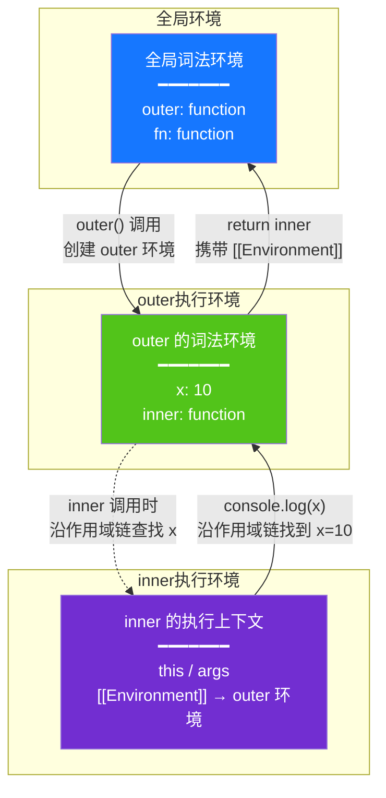
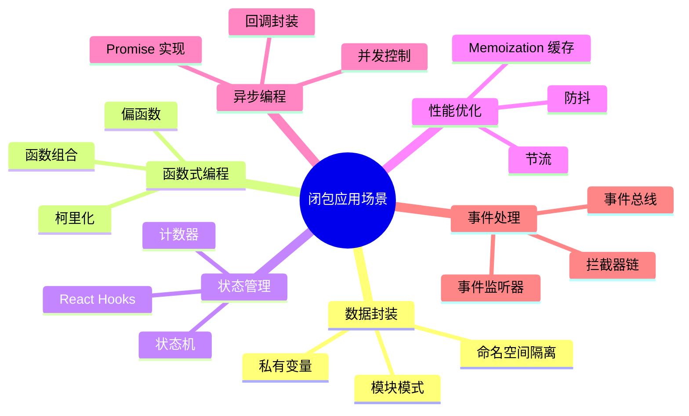
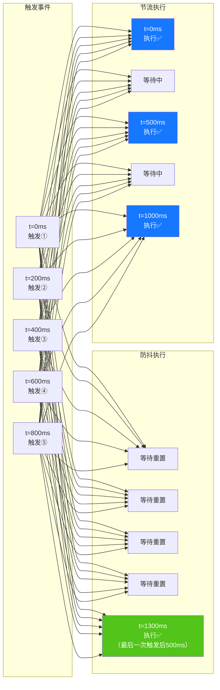
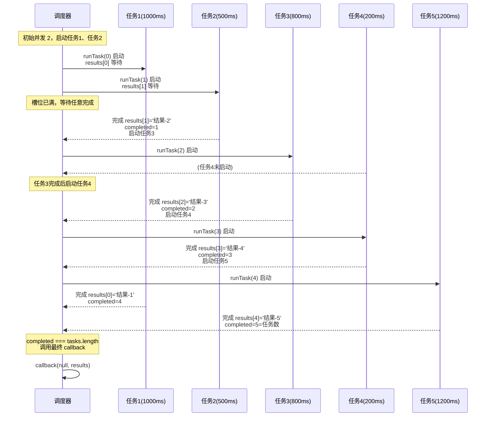

# JavaScript 闭包面试题

> 面向面试与日常开发的闭包速查笔记。示例默认在现代 JavaScript（ES2022+）环境运行。
>
> **关联文档**：
> - [01-原型链.md](./01-原型链.md) — JavaScript 原型链体系（同系列前置阅读）
> - [03-作用域与作用域链.md](./03-作用域与作用域链.md) — 闭包的底层基础

## 目录

- [JavaScript 闭包面试题](#javascript-闭包面试题)
  - [目录](#目录)
  - [一、闭包概念解析](#一闭包概念解析)
    - [1. 定义](#1-定义)
    - [2. 核心特性](#2-核心特性)
    - [3. 闭包的形成条件](#3-闭包的形成条件)
    - [4. 工作原理](#4-工作原理)
    - [5. 常见误区](#5-常见误区)
    - [6. 应用场景总览](#6-应用场景总览)
  - [二、面试题](#二面试题)
    - [题目 1：经典循环中的闭包陷阱（基础）](#题目-1经典循环中的闭包陷阱基础)
      - [题干](#题干)
      - [解题思路](#解题思路)
      - [正确代码实现](#正确代码实现)
      - [运行结果](#运行结果)
      - [知识点拓展](#知识点拓展)
    - [题目 2：模块模式与私有变量（进阶）](#题目-2模块模式与私有变量进阶)
      - [题干](#题干-1)
      - [解题思路](#解题思路-1)
      - [正确代码实现](#正确代码实现-1)
      - [知识点拓展](#知识点拓展-1)
    - [题目 3：闭包与内存泄漏（进阶）](#题目-3闭包与内存泄漏进阶)
      - [题干](#题干-2)
      - [解题思路](#解题思路-2)
      - [正确代码实现](#正确代码实现-2)
      - [知识点拓展](#知识点拓展-2)
    - [题目 4：函数柯里化与闭包（进阶）](#题目-4函数柯里化与闭包进阶)
      - [题干](#题干-3)
      - [解题思路](#解题思路-3)
      - [正确代码实现](#正确代码实现-3)
      - [知识点拓展](#知识点拓展-3)
    - [题目 5：防抖与节流中的闭包实践（综合应用）](#题目-5防抖与节流中的闭包实践综合应用)
      - [题干](#题干-4)
      - [解题思路](#解题思路-4)
      - [正确代码实现](#正确代码实现-4)
      - [运行结果](#运行结果-1)
      - [知识点拓展](#知识点拓展-4)
    - [题目 6：闭包在异步编程中的应用（高阶）](#题目-6闭包在异步编程中的应用高阶)
      - [题干](#题干-5)
      - [解题思路](#解题思路-5)
      - [正确代码实现](#正确代码实现-5)
      - [运行结果](#运行结果-2)
      - [知识点拓展](#知识点拓展-5)
    - [题目 7：闭包与 Memoization（性能优化）（高阶）](#题目-7闭包与-memoization性能优化高阶)
      - [题干](#题干-6)
      - [解题思路](#解题思路-6)
      - [正确代码实现](#正确代码实现-6)
      - [运行结果](#运行结果-3)
      - [知识点拓展](#知识点拓展-6)
  - [三、总结](#三总结)
    - [闭包知识体系全景](#闭包知识体系全景)
    - [闭包面试高频考点](#闭包面试高频考点)
    - [闭包使用建议](#闭包使用建议)
    - [面试回答通用模板](#面试回答通用模板)
    - [一页纸速查](#一页纸速查)

---

## 一、闭包概念解析

### 1. 定义

**闭包（Closure）** 是指一个函数**捕获**并**记住**其定义时所处作用域中的变量，即使该函数在其定义作用域之外执行，依然能够访问这些变量。

更严格的定义（基于 ECMAScript 规范）：**闭包是函数与其词法环境的组合**。当函数被创建时，会携带其定义时所在的词法环境引用（`[[Environment]]` 内部槽位），这个引用使得函数即便在原作用域外被调用，仍能访问外部变量。

```javascript
function outer() {
  const x = 10;
  function inner() {
    console.log(x); // 10 — inner 捕获了 outer 作用域中的 x
  }
  return inner;
}

const fn = outer();
fn(); // 10 — 即使 outer 已执行完毕，inner 仍能访问 x
```

**直观理解**：闭包就像一个"随身携带的背包"，函数离开定义作用域时，把需要用到的外部变量装进背包带走，无论走到哪里都能从背包中取到这些变量。

### 2. 核心特性

| 特性 | 说明 |
|------|------|
| **词法作用域** | 函数的作用域在**定义时**决定，而非执行时；闭包捕获的是变量引用，而非变量值 |
| **变量保持** | 被闭包引用的变量不会被垃圾回收机制回收，直至闭包本身被销毁 |
| **私有状态** | 闭包可以创建对外部函数中变量的"私有"访问权限，外部无法直接修改 |
| **状态持久化** | 每次调用外部函数都会创建**新的词法环境**，产生独立的状态副本 |
| **实时性** | 闭包捕获的是变量**引用**而非值快照，外部变量变化时闭包能感知到最新值 |

### 3. 闭包的形成条件

闭包的形成需要满足以下三个条件（缺一不可）：


```javascript
// 三个条件示例
function outer() {           // 条件1：函数嵌套
  const message = 'hello';   // 外部变量
  function inner() {          // 条件2：内部函数引用外部变量
    console.log(message);
  }
  return inner;              // 条件3：返回到外部
}

const fn = outer();           // 闭包形成：fn 持有 inner + outer 的词法环境
```

**反例：不是闭包的场景**

```javascript
// 反例1：没有嵌套函数
function noNesting() {
  const x = 1;
  return x;  // 直接返回值，不形成闭包
}

// 反例2：内部函数没有引用外部变量
function noReference() {
  const x = 1;
  function inner() {
    return 2;  // 没有引用 x
  }
  return inner;
  // 理论上 inner 仍携带 outer 的环境引用，但因为没有使用 x，
  // 现代引擎会优化掉对 x 的持有（逃逸分析）
}

// 反例3：内部函数没有返回到外部
function noReturn() {
  const x = 1;
  function inner() {
    console.log(x);
  }
  inner();  // 只在内部调用，函数执行完即销毁
}
```

### 4. 工作原理

闭包的实现依赖于 JavaScript 的 **词法环境（Lexical Environment）** 机制：

1. 每个函数创建时都会生成一个 `[[Environment]]` 内部属性，指向其定义时的词法环境
2. 函数执行时，其执行上下文的**外部环境引用（Outer Environment Reference）** 指向该 `[[Environment]]`
3. 当函数在其定义作用域外被调用时，JavaScript 引擎通过作用域链（Scope Chain）逐级查找变量
4. 只要闭包函数还存在引用，其引用的变量所在的词法环境就不会被销毁



**关键细节**：当 `outer()` 执行完毕后，其执行上下文从调用栈弹出，但由于返回的 `inner` 函数持有 `[[Environment]]` 指向 `outer` 的词法环境，**该词法环境不会被垃圾回收**，里面的 `x` 变量得以保留。这就是闭包"记住"变量的本质。

### 5. 常见误区

| 误区 | 真相 | 说明 |
|------|------|------|
| **"闭包是函数"** | 闭包 = 函数 + 词法环境 | 闭包是函数与其携带的环境的组合，不是函数本身 |
| **"闭包捕获的是值"** | 闭包捕获的是**引用** | 外部变量改变时，闭包能看到最新值（见下方示例） |
| **"闭包一定导致内存泄漏"** | 仅当闭包被长期持有且引用大对象时才有风险 | 短生命周期闭包会被正常回收 |
| **"箭头函数没有闭包"** | 箭头函数同样可以形成闭包 | 箭头函数只是没有自己的 `this`/`arguments`，闭包机制不变 |
| **"每次调用闭包都共享状态"** | 每次调用外部函数创建**独立**的词法环境 | 不同实例间状态隔离 |

**闭包捕获引用而非值的演示**：

```javascript
function counter() {
  let count = 0;
  return function () {
    count++;          // 修改的是引用变量本身
    return count;
  };
}

const c = counter();
console.log(c()); // 1
console.log(c()); // 2 —— 每次都能看到最新的 count
console.log(c()); // 3

// 不同实例状态独立
const c2 = counter();
console.log(c2()); // 1 —— 全新的 count，与 c 互不影响
```

### 6. 应用场景总览



---

## 二、面试题

### 题目 1：经典循环中的闭包陷阱（基础）

#### 题干

```javascript
for (var i = 0; i < 5; i++) {
  setTimeout(function () {
    console.log(i);
  }, i * 1000);
}
```

以上代码输出什么？为什么？如何修复使其输出 `0, 1, 2, 3, 4`？

#### 解题思路

**问题分析：**

1. `var` 声明的 `i` 具有**函数作用域（Function Scope）**，而非块级作用域
2. 整个循环共享同一个 `i` 变量
3. `setTimeout` 的回调函数是闭包，它们捕获的是同一个 `i` 的引用，而非值
4. 当回调执行时，循环早已结束，`i` 的值已经是 `5`
5. 因此实际输出：`5, 5, 5, 5, 5`（每 1 秒输出一个 5）

**执行流程时序**：

```mermaid
sequenceDiagram
    participant Code as 同步代码
    participant Loop as 循环变量 i
    participant Queue as 宏任务队列
    participant Timer as 定时器
    
    Note over Code,Timer: 主线程同步执行循环
    Code->>Loop: i = 0
    Code->>Queue: 注册回调 1 (delay=0ms)
    Note over Loop: i 仍是同一个变量
    Code->>Loop: i = 1
    Code->>Queue: 注册回调 2 (delay=1000ms)
    Code->>Loop: i = 2
    Code->>Queue: 注册回调 3 (delay=2000ms)
    Code->>Loop: i = 3
    Code->>Queue: 注册回调 4 (delay=3000ms)
    Code->>Loop: i = 4
    Code->>Queue: 注册回调 5 (delay=4000ms)
    Code->>Loop: i = 5（循环结束！i 现在是 5）
    
    Note over Code,Timer: 同步代码结束，开始处理宏任务队列
    Timer-->>Queue: 0ms 到，执行回调 1
    Queue->>Loop: 读取 i → 5
    Note over Queue: 输出 5
    Timer-->>Queue: 1000ms 到，执行回调 2
    Queue->>Loop: 读取 i → 5
    Note over Queue: 输出 5
    Note over Queue: ... 重复，全部输出 5
```

**修复方案（三种）：**

| 方案 | 原理 | 适用场景 |
|------|------|----------|
| 使用 `let`（ES6） | 块级作用域，每次迭代创建独立绑定 | 优先推荐 |
| 使用 IIFE 包裹 | 通过函数参数创建独立副本 | 兼容 ES5 环境 |
| 使用 `setTimeout` 第三个参数 | 回调参数传递值副本，实现简单 | 适合 ES6+ 环境 |

#### 正确代码实现

```javascript
// 方案一：使用 let（推荐）
for (let i = 0; i < 5; i++) {
  setTimeout(function () {
    console.log(i);
  }, i * 1000);
}

// 方案二：使用 IIFE
for (var i = 0; i < 5; i++) {
  (function (j) {
    setTimeout(function () {
      console.log(j);
    }, j * 1000);
  })(i);
}

// 方案三：setTimeout 第三个参数
for (var i = 0; i < 5; i++) {
  setTimeout(function (j) {
    console.log(j);
  }, i * 1000, i);
}
```

#### 运行结果

**修复前**（`var` 版本，每 1 秒输出一次）：

```
5  (1s)
5  (2s)
5  (3s)
5  (4s)
5  (5s)
```

**修复后**（三种方案输出相同）：

```
0  (1s)
1  (2s)
2  (3s)
3  (4s)
4  (5s)
```

**关键差异**：`let` 每次迭代创建独立的 `i` 绑定（词法环境层级），IIFE 通过函数参数复制值，`setTimeout` 第三参数也是值复制。三者本质都是让每个回调持有**独立的变量**而非共享引用。

#### 知识点拓展

- **`var` vs `let` 的作用域差异**：`var` 是函数作用域，`let`/`const` 是块级作用域
- **IIFE（立即执行函数表达式）**：创建一个独立作用域，是 ES5 时代的常见解决方案
- **`setTimeout` 额外参数**：从第三个参数开始，会作为参数传递给回调函数
- **事件循环（Event Loop）**：`setTimeout` 的回调在宏任务队列中等待，循环结束后才会执行

---

### 题目 2：模块模式与私有变量（进阶）

#### 题干

使用闭包实现一个**计数器模块**，要求：

1. 提供 `increment`、`decrement`、`getValue`、`reset` 四个方法
2. 计数器的内部状态**不可被外部直接修改**
3. 支持创建多个独立计数器实例，互不干扰
4. 每个计数器可以有自定义初始值（默认为 0）

#### 解题思路

**核心考点：**

1. 利用闭包实现**私有变量** —— 外部无法直接访问 `count`，只能通过暴露的方法操作
2. 每次调用工厂函数都会创建新的词法环境，实例之间状态隔离
3. 这种模式是 **模块模式（Module Pattern）** 的基础，也是现代前端框架状态管理的思想来源

**设计要点：**

- 使用工厂函数（而非类）来展示闭包的本质
- 方法通过对象字面量返回，每个方法都持有对 `count` 的闭包引用
- `count` 变量对外部完全不可见，实现真正的封装

#### 正确代码实现

```javascript
function createCounter(initialValue = 0) {
  let count = initialValue;

  return {
    increment() {
      count++;
      return count;
    },
    decrement() {
      count--;
      return count;
    },
    getValue() {
      return count;
    },
    reset() {
      count = initialValue;
      return count;
    }
  };
}

// 使用示例
const counterA = createCounter(10);
const counterB = createCounter();

console.log(counterA.getValue());  // 10
counterA.increment();              // 11
counterA.increment();              // 12
console.log(counterA.getValue());  // 12

console.log(counterB.getValue());  // 0
counterB.decrement();              // -1
console.log(counterB.getValue());  // -1

counterA.reset();                  // 10（回到初始值）

// 无法直接访问私有变量
console.log(counterA.count);       // undefined
```

#### 知识点拓展

- **模块模式**：闭包是实现信息隐藏（Information Hiding）的核心手段，体现了"最小权限原则"
- **与 Class 的对比**：Class 的私有字段（`#count`）是 ES2022 的语法糖，底层仍是基于闭包
- **数据封装**：闭包实现的私有变量比命名约定（如 `_count` 前缀）更安全
- **工厂函数 vs 构造函数**：工厂函数无需 `new`，更灵活，适合创建多个独立实例

---

### 题目 3：闭包与内存泄漏（进阶）

#### 题干

```javascript
function createLargeArray() {
  const largeArray = new Array(1000000).fill('data');

  return {
    getData: function () {
      return 'some data';
    },
    getArray: function () {
      return largeArray;
    }
  };
}

const obj = createLargeArray();
```

请分析上述代码中是否存在内存泄漏风险？如果存在，请说明原因并提出优化方案。如果 `getData` 方法从未被调用，`largeArray` 是否会被垃圾回收？

#### 解题思路

**问题分析：**

1. 闭包会持有外部函数词法环境中**被引用的变量**，但实际中大多数引擎会优化：只保留被闭包引用的变量
2. 然而，**只要有任何一个闭包引用了该词法环境中的任意变量**，整个环境对象（包括未引用的变量）都可能被保留
3. 在上例中，`getArray` 方法引用了 `largeArray`，导致整个 `largeArray` 无法被垃圾回收
4. 即使从未调用 `getData`，只要 `obj` 还存在，`largeArray` 就**不会被回收**

**优化方案：**

- 不需要时不保留对大数组的引用
- 或者将大数组设计为可选的、按需加载的方式
- 在不再需要时主动解除引用

#### 正确代码实现

```javascript
// 优化方案一：不需要大数组时，移除引用
function createLargeArray() {
  const largeArray = new Array(1000000).fill('data');

  return {
    getData: function () {
      return 'some data';
    },
    getArray: function () {
      return largeArray;
    },
    // 提供释放方法
    release: function () {
      largeArray.length = 0; // 清空数组
    }
  };
}

// 优化方案二：按需创建，避免闭包一直持有引用
function createManager() {
  let largeArray = null;

  return {
    loadArray: function () {
      largeArray = new Array(1000000).fill('data');
    },
    unloadArray: function () {
      largeArray = null; // 解除引用，允许 GC 回收
    },
    getData: function () {
      return 'some data';
    }
  };
}

// 使用
const manager = createManager();
// 需要时加载
manager.loadArray();
// 使用完毕
manager.unloadArray(); // largeArray 可以被回收
```

#### 知识点拓展

- **闭包与 GC**：现代 V8 引擎会进行"逃逸分析"，只保留被闭包实际引用的变量，但需要时间验证
- **常见内存泄漏场景**：
  - 全局变量持有闭包引用（如事件监听器未移除）
  - 闭包引用 DOM 元素导致 DOM 无法被回收
  - 定时器回调中的闭包引用
- **WeakMap/WeakSet**：当需要保存与对象关联的数据但又不想阻止 GC 时使用
- **Chrome Memory 面板**：可使用 `Retainers` 分析闭包引用链

---

### 题目 4：函数柯里化与闭包（进阶）

#### 题干

实现一个通用的柯里化函数 `curry`，将普通函数转换为柯里化版本。要求：

```javascript
function add(a, b, c) {
  return a + b + c;
}

const curriedAdd = curry(add);
console.log(curriedAdd(1)(2)(3));  // 6
console.log(curriedAdd(1, 2)(3));  // 6
console.log(curriedAdd(1)(2, 3));  // 6
console.log(curriedAdd(1, 2, 3));  // 6
```

#### 解题思路

**核心概念：**

柯里化（Currying）本质上是利用闭包**逐步收集参数**，直到参数数量满足原函数要求才执行。每次调用都返回一个新的闭包，该闭包保存了已收集的参数。

**设计要点：**

1. 需要知道原函数的**参数数量**（`fn.length`）
2. 每次调用时，将新参数与已收集参数合并
3. 若参数数量满足要求，立即执行原函数
4. 若参数数量不足，返回一个新闭包继续收集

#### 正确代码实现

```javascript
function curry(fn) {
  const arity = fn.length; // 原函数期望的参数个数

  // 核心递归函数，args 收集已传入的参数
  function curried(...args) {
    if (args.length >= arity) {
      // 参数足够，直接执行
      return fn.apply(this, args);
    } else {
      // 参数不足，返回新函数继续收集
      return function (...nextArgs) {
        return curried.apply(this, [...args, ...nextArgs]);
      };
    }
  }

  return curried;
}

// 使用示例
function add(a, b, c) {
  return a + b + c;
}

const curriedAdd = curry(add);
console.log(curriedAdd(1)(2)(3));  // 6
console.log(curriedAdd(1, 2)(3));  // 6
console.log(curriedAdd(1)(2, 3));  // 6
console.log(curriedAdd(1, 2, 3));  // 6

// 进阶：支持占位符 _ 的柯里化
function curryWithPlaceholder(fn) {
  const arity = fn.length;

  function curried(...args) {
    // 检查是否还需等待占位符
    const hasPlaceholder = args.some(
      arg => arg === curryWithPlaceholder.placeholder
    );

    if (args.length >= arity && !hasPlaceholder) {
      return fn.apply(this, args);
    }

    return function (...nextArgs) {
      const merged = args.map(
        arg =>
          arg === curryWithPlaceholder.placeholder && nextArgs.length
            ? nextArgs.shift()
            : arg
      );
      return curried.apply(this, [...merged, ...nextArgs]);
    };
  }

  return curried;
}

curryWithPlaceholder.placeholder = Symbol('_');
```

#### 知识点拓展

- **柯里化 vs 偏函数（Partial Application）**：柯里化将多元函数转为**一元函数链**；偏函数是固定部分参数，生成参数更少的函数
- **实际应用场景**：
  - 函数式编程中的**组合（Compose）** 和 **管道（Pipe）**
  - 日志记录中固定部分参数（如 `logWithLevel('INFO')`）
  - 事件处理中预绑定参数
- **性能考量**：柯里化会增加函数调用栈深度，对性能敏感场景需谨慎
- **`Function.length`**：表示函数**形式参数**的个数，不包括剩余参数（`...rest`）和默认参数

---

### 题目 5：防抖与节流中的闭包实践（综合应用）

#### 题干

分别实现**防抖（Debounce）** 和**节流（Throttle）** 函数，要求：

1. 防抖：在连续触发事件时，只有在最后一次触发后等待 `delay` 毫秒才执行
2. 节流：在连续触发事件时，保证每 `delay` 毫秒至少执行一次
3. 都必须返回一个函数（闭包），保持内部状态
4. 支持 `this` 上下文正确绑定
5. 支持可选的立即执行选项（立即执行第一次）

#### 解题思路

**防抖与节流的本质区别：**

| 特性 | 防抖（Debounce） | 节流（Throttle） |
|------|-----------------|-----------------|
| 执行时机 | 最后一次触发后等待 | 固定时间间隔执行 |
| 适用场景 | 搜索输入框、窗口 resize | 滚动加载、鼠标移动 |
| 类比 | 电梯门关上前等最后一个人 | 地铁每 5 分钟一班 |

**时间轴对比**（delay = 500ms，连续触发 5 次）：



**闭包的作用：**

- 防抖：通过闭包持有 `timerId`，每次调用时清除之前的定时器
- 节流：通过闭包持有 `lastTime` 或 `timerId`，控制执行频率

#### 正确代码实现

```javascript
// ===== 防抖 =====
function debounce(fn, delay, immediate = false) {
  let timer = null;

  return function (...args) {
    const context = this;
    const callNow = immediate && !timer;

    // 清除之前的定时器
    if (timer) {
      clearTimeout(timer);
    }

    // 设置新的定时器
    timer = setTimeout(() => {
      timer = null;
      if (!immediate) {
        fn.apply(context, args);
      }
    }, delay);

    // 立即执行第一次
    if (callNow) {
      fn.apply(context, args);
    }
  };
}

// ===== 节流（时间戳版） =====
function throttle(fn, delay) {
  let lastTime = 0;

  return function (...args) {
    const context = this;
    const now = Date.now();

    if (now - lastTime >= delay) {
      lastTime = now;
      fn.apply(context, args);
    }
  };
}

// ===== 节流（定时器版—保证最后一次执行） =====
function throttleWithTimer(fn, delay) {
  let timer = null;

  return function (...args) {
    const context = this;

    if (!timer) {
      timer = setTimeout(() => {
        timer = null;
        fn.apply(context, args);
      }, delay);
    }
  };
}

// ===== 节流（综合版—首次+最后一次都执行） =====
function throttleEnhanced(fn, delay) {
  let lastTime = 0;
  let timer = null;

  return function (...args) {
    const context = this;
    const now = Date.now();
    const remaining = delay - (now - lastTime);

    if (remaining <= 0) {
      // 时间已到，立即执行
      if (timer) {
        clearTimeout(timer);
        timer = null;
      }
      lastTime = now;
      fn.apply(context, args);
    } else if (!timer) {
      // 最后一次触发时执行
      timer = setTimeout(() => {
        lastTime = Date.now();
        timer = null;
        fn.apply(context, args);
      }, remaining);
    }
  };
}

// 使用示例
const log = debounce(() => console.log('搜索请求'), 300);
// 连续调用：只在最后一次调用后 300ms 执行一次
log();
log();
log(); // 只有这次会触发

const scroll = throttle(() => console.log('加载更多'), 500);
window.addEventListener('scroll', scroll);
```

#### 运行结果

**防抖运行示例**（`debounce`，delay=300ms）：

```javascript
const log = debounce(() => console.log('搜索请求'), 300);
log();  // t=0ms
log();  // t=100ms（重置定时器）
log();  // t=200ms（重置定时器）
// t=500ms（最后一次触发后 300ms）执行
// 输出：搜索请求（只输出 1 次）
```

**节流运行示例**（`throttle`，delay=500ms）：

```javascript
const onScroll = throttle(() => console.log('加载'), 500);
// 假设连续滚动触发：
onScroll(); // t=0ms  → 输出：加载
onScroll(); // t=100ms → 不执行
onScroll(); // t=300ms → 不执行
onScroll(); // t=500ms → 输出：加载
onScroll(); // t=700ms → 不执行
onScroll(); // t=1000ms → 输出：加载
// 每 500ms 至多执行一次
```

**三版节流对比**：

| 版本 | 首次执行 | 中间执行 | 最后一次触发后执行 |
|-----|:-------:|:-------:|:---------------:|
| `throttle`（时间戳版） | ✅ | 每 delay 一次 | ❌（可能漏掉最后一次） |
| `throttleWithTimer`（定时器版） | ❌ | 每 delay 一次 | ✅（最后一次必执行） |
| `throttleEnhanced`（综合版） | ✅ | 每 delay 一次 | ✅ |

**结论**：实际项目中推荐 `throttleEnhanced` 综合版，兼顾首次响应和尾部触发。

#### 知识点拓展

- **`this` 绑定**：使用 `fn.apply(context, args)` 确保闭包内的 `this` 指向调用者
- **箭头函数 vs 普通函数**：箭头函数没有自己的 `this`，不能用于需要动态 `this` 的场景
- **`clearTimeout` 的意义**：防抖的核心机制——每次调用取消上一次的延迟执行
- **实际面试题变形**：防抖的"立即执行"版本、节流的"leading + trailing"版本
- **Lodash 实现参考**：`_.debounce` 和 `_.throttle` 提供了更完整的 `maxWait` 等配置

---

### 题目 6：闭包在异步编程中的应用（高阶）

#### 题干

在不使用 `async/await` 和 Promise 的情况下，利用闭包实现一个**异步任务调度器**，要求：

1. 支持**并行**执行多个异步任务（如 `setTimeout` 模拟）
2. 在所有任务完成后执行**回调函数**
3. 支持限制最大**并发数量**
4. 返回每个任务的结果数组

#### 解题思路

**核心机制：**

1. 利用闭包保存共享状态：`results` 数组、`completed` 计数、`currentIndex` 当前任务索引
2. 每次启动一个任务时，通过闭包"记住"该任务在结果数组中的位置
3. `currentIndex` 控制任务的启动顺序，确保不超过最大并发数
4. 当 `completed === tasks.length` 时，调用最终回调

**并发执行时序**（5 个任务，limit=2）：



**关键点**：每个任务通过闭包"记住"自己的 `index`，因此无论哪个任务先完成，结果都能正确放入 `results[index]` 位置，最终数组顺序与启动顺序一致。

#### 正确代码实现

```javascript
function parallelTaskScheduler(tasks, limit, callback) {
  const results = [];
  let completed = 0;
  let currentIndex = 0;
  let isStopped = false;

  function runTask(index) {
    if (isStopped) return;

    // 通过闭包记住当前任务的 index
    tasks[index](function (result) {
      if (isStopped) return;

      results[index] = result;
      completed++;

      if (completed === tasks.length) {
        // 所有任务完成
        callback(null, results);
      } else if (currentIndex < tasks.length) {
        // 启动下一个任务
        runTask(currentIndex++);
      }
    });
  }

  // 启动初始并发任务
  const initialCount = Math.min(limit, tasks.length);
  for (let i = 0; i < initialCount; i++) {
    runTask(currentIndex++);
  }

  // 返回取消函数（通过闭包暴露）
  return function cancel() {
    isStopped = true;
  };
}

// 使用示例
function createAsyncTask(id, duration) {
  // 每个任务都是一个接收 callback 的函数
  return function (callback) {
    setTimeout(() => {
      console.log(`任务 ${id} 完成`);
      callback(`结果-${id}`);
    }, duration);
  };
}

const tasks = [
  createAsyncTask(1, 1000),
  createAsyncTask(2, 500),
  createAsyncTask(3, 800),
  createAsyncTask(4, 200),
  createAsyncTask(5, 1200)
];

const cancel = parallelTaskScheduler(tasks, 2, (err, results) => {
  if (err) {
    console.error('执行失败:', err);
    return;
  }
  console.log('所有任务完成:', results);
  // 预期输出: ['结果-1', '结果-2', '结果-3', '结果-4', '结果-5']
});

// 如需取消：cancel();
```

#### 运行结果

```
任务 2 完成      （t=500ms，最先完成）
任务 4 完成      （t=700ms，因任务3未启动，任务4等任务3完成才启动，但任务4本身只需200ms）
任务 3 完成      （t=800ms）
任务 1 完成      （t=1000ms）
任务 5 完成      （t=1200ms）
所有任务完成: ['结果-1', '结果-2', '结果-3', '结果-4', '结果-5']
```

**关键观察**：尽管任务完成顺序是 2→4→3→1→5（与启动顺序 1→2→3→4→5 不同），但最终 `results` 数组的顺序与启动顺序一致 —— 这正是闭包记住 `index` 的价值。

#### 知识点拓展

- **闭包替代 Promise**：在 ES6 之前，闭包是处理异步逻辑的主要方式（回调函数 + 闭包）
- **并发控制**：限制并发数防止资源耗尽，是闭包在工程中的重要应用
- **回调函数**：通过闭包传递结果，每个任务有自己的 `index` 闭包
- **扩展思考**：如何用闭包实现 Promise 的 `all`、`race`、`allSettled`

---

### 题目 7：闭包与 Memoization（性能优化）（高阶）

#### 题干

实现一个**通用 Memoization 函数**，利用闭包缓存函数计算结果。要求：

1. 支持任意参数数量的函数
2. 能够正确处理多个参数组成的**复合键**
3. 支持设置最大缓存大小（LRU 策略可选）
4. 处理递归函数的情况（如 Fibonacci）

#### 解题思路

**核心机制：**

1. 通过闭包维护一个 `Map` 作为缓存
2. 每次调用时，先检查缓存中是否有对应结果
3. 有则直接返回缓存值，无则计算并存入缓存
4. 对于递归函数，包装后的函数需要能递归调用缓存版本

**键生成策略：**

- 单参数：直接使用参数作为键
- 多参数：使用 `JSON.stringify` 或自定义序列化函数生成复合键

#### 正确代码实现

```javascript
function memoize(fn, options = {}) {
  const { maxSize = Infinity, keyResolver = JSON.stringify } = options;
  const cache = new Map();

  // 用于支持递归优化的包装函数
  const memoized = function (...args) {
    const key = keyResolver(args);

    if (cache.has(key)) {
      return cache.get(key);
    }

    const result = fn.apply(this, args);
    cache.set(key, result);

    // LRU 缓存淘汰
    if (cache.size > maxSize) {
      const firstKey = cache.keys().next().value;
      cache.delete(firstKey);
    }

    return result;
  };

  // 暴露缓存操作接口
  memoized.cache = cache;
  memoized.clear = function () {
    cache.clear();
  };

  return memoized;
}

// 使用示例一：计算阶乘
function factorial(n) {
  if (n <= 1) return 1;
  return n * factorial(n - 1);
}

// 注意：普通方式无法缓存递归调用
// 需要将函数绑定到自身
const memoizedFactorial = memoize(function (n) {
  if (n <= 1) return 1;
  return n * memoizedFactorial(n - 1); // 调用缓存的版本
});

console.time('memoized');
console.log(memoizedFactorial(30)); // 计算
console.timeEnd('memoized'); // 较快

console.time('memoized again');
console.log(memoizedFactorial(30)); // 直接从缓存读取
console.timeEnd('memoized again'); // 极快

// 使用示例二：Fibonacci（性能对比）
let callCount = 0;
const fib = memoize(function (n) {
  callCount++;
  if (n <= 1) return n;
  return fib(n - 1) + fib(n - 2);
});

console.log(fib(40)); // 102334155
console.log(`函数实际执行次数: ${callCount}`); // 41 次（而非指数级）
// 未使用 memoize 时，fib(40) 需要约 3.3 亿次调用

// 使用示例三：多参数
const sum = memoize(function (a, b, c) {
  console.log('计算中...');
  return a + b + c;
});

console.log(sum(1, 2, 3)); // 计算中... 6
console.log(sum(1, 2, 3)); // 6（直接返回缓存）
```

#### 运行结果

**Fibonacci 性能对比**（`fib(40)`）：

| 实现方式 | 调用次数 | 耗时（参考） | 时间复杂度 |
|---------|:-------:|:-----------:|:---------:|
| 普通递归（无缓存） | ~3.3 亿次 | 数秒~数十秒 | O(2ⁿ) |
| Memoization 缓存 | 41 次 | <1ms | O(n) |
| 提速倍数 | **约 800 万倍** | — | — |

**阶乘缓存命中演示**：

```
console.time('memoized');
console.log(memoizedFactorial(30)); // 2.652528598e+32
console.timeEnd('memoized');        // memoized: ~0.5ms（计算并缓存）

console.time('memoized again');
console.log(memoizedFactorial(30)); // 2.652528598e+32
console.timeEnd('memoized again');  // memoized again: ~0.01ms（命中缓存）
```

**多参数缓存命中演示**：

```
计算中...
6              （首次计算，缓存）
6              （命中缓存，不输出"计算中..."）
```

#### 知识点拓展

- **Memoization 与闭包**：缓存 Map 通过闭包隐藏，外部无法直接篡改
- **时间复杂度**：将 O(2^n) 的指数级复杂度降为 O(n) 的线性复杂度
- **适用场景**：
  - 纯函数（相同输入永远返回相同输出）
  - 计算密集型操作
  - 递归函数（Fibonacci、阶乘等）
- **不适用场景**：
  - 有副作用的函数
  - 依赖外部状态的函数
  - 参数为引用类型且变化频繁
- **React 中的 Memoization**：`React.memo`、`useMemo`、`useCallback` 本质上都是利用闭包和缓存

---

## 三、总结

### 闭包知识体系全景

```mermaid
mindmap
  root((JavaScript 闭包))
    理论基础
      词法作用域
      执行上下文
      [[Environment]] 内部槽位
      作用域链查找
    形成条件
      函数嵌套
      引用外部变量
      返回到外部作用域
    核心特性
      变量持久化
      状态隔离
      私有封装
      引用而非值
    典型应用
      模块模式
      柯里化
      防抖节流
      Memoization
      异步并发控制
    注意事项
      内存泄漏
      状态隔离
      性能权衡
      可读性平衡
```

### 闭包面试高频考点

| 考点 | 考察频率 | 典型题目 | 关键回答要点 |
|------|---------|---------|------------|
| 循环中的闭包陷阱 | ★★★★★ | 题目 1 | `var` 共享变量 + `let`/IIFE/参数复制三种修复 |
| 模块模式与封装 | ★★★★☆ | 题目 2 | 工厂函数 + 闭包持有私有变量 + 方法暴露 |
| 内存泄漏 | ★★★★☆ | 题目 3 | 闭包持有词法环境 + 主动解除引用 + WeakMap |
| 柯里化 | ★★★☆☆ | 题目 4 | 逐步收集参数 + `fn.length` 判断终止 + 闭包链 |
| 防抖/节流 | ★★★★★ | 题目 5 | 定时器 + 闭包持有状态 + `this`/args 绑定 |
| 异步与并发控制 | ★★★☆☆ | 题目 6 | 闭包记住 index + 共享计数 + 并发上限 |
| Memoization | ★★★☆☆ | 题目 7 | Map 缓存 + 复合键 + LRU 淘汰 |

### 闭包使用建议

1. **合理使用**：闭包是强大工具，但过度使用可能导致代码难以理解和维护
2. **注意内存**：不再需要的闭包应及时解除引用（`fn = null`），避免内存泄漏
3. **优先 `let`/`const`**：使用块级作用域替代 IIFE，代码更简洁
4. **理解原理**：理解词法作用域和执行上下文是掌握闭包的关键
5. **结合实践**：在组件封装、高阶函数、Hook 等场景中灵活运用闭包思想
6. **避免循环引用**：闭包引用 DOM 节点时尤需注意，老版本 IE 会因循环引用泄漏
7. **警惕性能陷阱**：高频调用的闭包函数（如防抖）内部避免创建大对象

### 面试回答通用模板

回答闭包类面试题时，建议按以下结构展开（**定义 → 原理 → 应用 → 注意事项**）：

```text
1. 一句话定义
   "闭包是函数与其词法环境的组合，能让函数在定义作用域外被调用时仍访问外部变量。"

2. 原理简述
   "函数创建时携带 [[Environment]] 内部槽位指向定义时的词法环境，
    即使外部作用域执行完毕，只要闭包还被引用，其词法环境就不会被 GC 回收。"

3. 应用场景
   "常用于：数据私有化（模块模式）、参数收集（柯里化）、状态保持（防抖节流）、
    结果缓存（Memoization）、异步并发控制。"

4. 注意事项
   "需要警惕内存泄漏：闭包长期持有大对象时，应在不需要时主动解除引用；
    闭包捕获的是变量引用而非值快照，循环中使用 var 会有共享变量陷阱。"
```

### 一页纸速查

| 问题 | 答案 |
|------|------|
| 闭包是什么？ | 函数 + 其定义时的词法环境 |
| 闭包捕获的是值还是引用？ | **引用**（外部变量变化时闭包能感知） |
| 闭包的形成条件？ | 函数嵌套 + 引用外部变量 + 返回到外部 |
| 为什么闭包能"记住"变量？ | `[[Environment]]` 持有词法环境，阻止 GC |
| 每次调用外部函数闭包共享吗？ | **不共享**，每次创建独立的词法环境 |
| 闭包一定内存泄漏吗？ | 不一定，仅当被长期持有且引用大对象时才有风险 |
| 箭头函数能形成闭包吗？ | 能，只是没有自己的 `this`/`arguments` |
| `var` 循环为什么输出都是 5？ | 共享同一变量，回调执行时循环已结束 |
| 防抖 vs 节流？ | 防抖=最后一次后等待；节流=固定间隔执行 |
| Memoization 原理？ | 闭包持有 Map 缓存，相同参数直接返回 |

---

> **核心结论**：闭包是 JavaScript 函数式编程的基石。理解"`[[Environment]]` 持有词法环境"这一本质，就能解释所有闭包现象 —— 无论是循环陷阱、模块封装、柯里化，还是防抖节流、并发控制、缓存优化，都是这一原理在不同场景下的应用。掌握闭包的关键不在于背诵定义，而在于**用"词法环境 + 引用持有"的视角重新审视所有涉及函数嵌套的代码**。