# JavaScript Promise 异步编程面试题

> 面向面试与日常开发的 Promise 速查笔记。示例默认在现代 JavaScript（ES2022+）环境运行。
>
> **关联文档**：
> - [01-原型链.md](./01-原型链.md) — JavaScript 原型链体系
> - [02-闭包面试题.md](./02-闭包面试题.md) — 闭包与异步回调的基础
> - [04-事件循环.md](./04-事件循环.md) — 宏任务/微任务调度机制

## 目录

- [JavaScript Promise 异步编程面试题](#javascript-promise-异步编程面试题)
  - [目录](#目录)
  - [一、核心概念解析](#一核心概念解析)
    - [1. Promise 定义](#1-promise-定义)
    - [2. 三种状态](#2-三种状态)
    - [3. 核心特性](#3-核心特性)
    - [4. 基本用法](#4-基本用法)
    - [5. Promise 静态方法](#5-promise-静态方法)
    - [6. 工作原理：状态机与微任务](#6-工作原理状态机与微任务)
    - [7. 应用场景](#7-应用场景)
  - [二、面试题](#二面试题)
    - [题目 1：Promise 执行顺序（基础）](#题目-1promise-执行顺序基础)
      - [题干](#题干)
      - [解题思路](#解题思路)
      - [正确代码实现](#正确代码实现)
      - [运行结果](#运行结果)
      - [知识点拓展](#知识点拓展)
    - [题目 2：Promise 链式调用与错误处理（基础）](#题目-2promise-链式调用与错误处理基础)
      - [题干](#题干-1)
      - [解题思路](#解题思路-1)
      - [正确代码实现](#正确代码实现-1)
      - [运行结果](#运行结果-1)
      - [知识点拓展](#知识点拓展-1)
    - [题目 3：实现 Promise.all（进阶）](#题目-3实现-promiseall进阶)
      - [题干](#题干-2)
      - [解题思路](#解题思路-2)
      - [正确代码实现](#正确代码实现-2)
      - [运行结果](#运行结果-2)
      - [知识点拓展](#知识点拓展-2)
    - [题目 4：Promise 并发控制（进阶）](#题目-4promise-并发控制进阶)
      - [题干](#题干-3)
      - [解题思路](#解题思路-3)
      - [正确代码实现](#正确代码实现-3)
      - [运行结果](#运行结果-3)
      - [知识点拓展](#知识点拓展-3)
    - [题目 5：Promise 超时控制（进阶）](#题目-5promise-超时控制进阶)
      - [题干](#题干-4)
      - [解题思路](#解题思路-4)
      - [正确代码实现](#正确代码实现-4)
      - [运行结果](#运行结果-4)
      - [知识点拓展](#知识点拓展-4)
    - [题目 6：实现 Promise.retry（高阶）](#题目-6实现-promiseretry高阶)
      - [题干](#题干-5)
      - [解题思路](#解题思路-5)
      - [正确代码实现](#正确代码实现-5)
      - [运行结果](#运行结果-5)
      - [知识点拓展](#知识点拓展-5)
    - [题目 7：实现 Promise 串行执行（高阶）](#题目-7实现-promise-串行执行高阶)
      - [题干](#题干-6)
      - [解题思路](#解题思路-6)
      - [正确代码实现](#正确代码实现-6)
      - [运行结果](#运行结果-6)
      - [知识点拓展](#知识点拓展-6)
    - [题目 8：微任务队列与 Promise 嵌套（高阶）](#题目-8微任务队列与-promise-嵌套高阶)
      - [题干](#题干-7)
      - [解题思路](#解题思路-7)
      - [正确代码实现](#正确代码实现-7)
      - [运行结果](#运行结果-7)
      - [知识点拓展](#知识点拓展-7)
  - [三、易错点与最佳实践](#三易错点与最佳实践)
    - [常见易错点](#常见易错点)
    - [最佳实践](#最佳实践)
    - [Promise 状态变迁图](#promise-状态变迁图)
    - [面试高频考点速查](#面试高频考点速查)
    - [一页纸速查](#一页纸速查)

---

## 一、核心概念解析

### 1. Promise 定义

**Promise** 是 ES6 引入的异步编程解决方案，它代表一个**未来才会完成的操作**的结果。从规范角度看，Promise 是一个拥有 `.then()` 方法的对象或函数，它通过状态机机制管理异步操作的最终结果，并提供链式调用能力。

更直白的理解：Promise 是一个"承诺"——它承诺在异步操作完成后给出结果，无论成功还是失败。

### 2. 三种状态

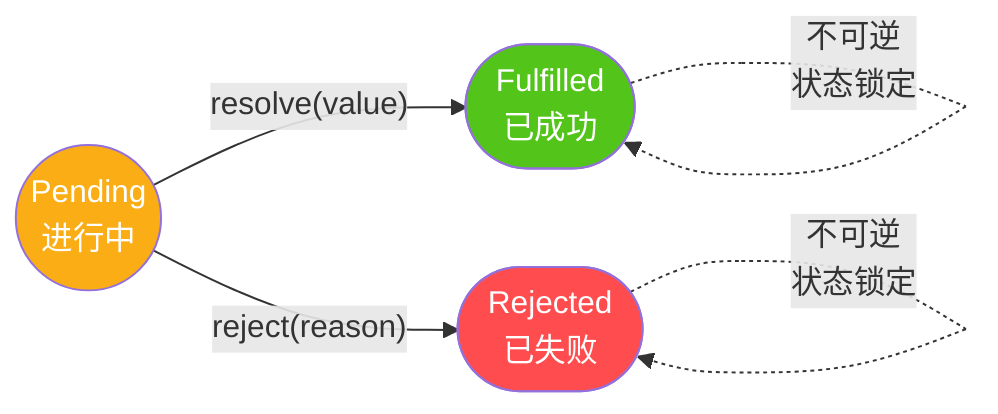

**状态规则**：

- 状态一旦改变，**不可逆转**（只能发生一次状态变迁）
- 只能从 `Pending` 变为 `Fulfilled`（成功）或 `Rejected`（失败）
- 状态一旦变为 `Fulfilled` 或 `Rejected`，后续的 `resolve`/`reject` 调用都会被静默忽略
- `Fulfilled` 会触发 `.then` 的成功回调；`Rejected` 会触发 `.catch` 的失败回调

### 3. 核心特性

| 特性 | 说明 |
|------|------|
| **状态机机制** | 三态不可逆，确保异步结果的确定性 |
| **链式调用** | 每个 `.then` 返回新的 Promise，可串联多个异步操作 |
| **错误冒泡** | 错误会沿链向下传递，直到遇到 `.catch` |
| **微任务调度** | `.then`/`.catch`/`.finally` 回调在微任务队列中执行 |
| **不可取消** | Promise 一旦创建无法外部取消（需配合 `AbortController`） |
| **值穿透** | `.then` 非函数参数会被忽略，值会传递到下一个 `.then` |

### 4. 基本用法

```javascript
const promise = new Promise((resolve, reject) => {
  // Promise 构造函数接收一个执行器函数（executor）
  // 执行器同步执行，接收 resolve 和 reject 两个函数
  
  setTimeout(() => {
    const success = true;
    if (success) {
      resolve('操作成功');  // 将状态从 Pending → Fulfilled
    } else {
      reject(new Error('操作失败'));  // 将状态从 Pending → Rejected
    }
  }, 1000);
});

// 消费 Promise：通过 then/catch/finally 注册回调
promise
  .then(value => console.log(value))     // 操作成功（Fulfilled 时触发）
  .catch(error => console.error(error))  // 操作失败（Rejected 时触发）
  .finally(() => console.log('完成'));    // 完成（无论成功失败都触发）
```

**重要细节**：

- `resolve`/`reject` 是异步调用的（即使同步代码里立即 `resolve`，`.then` 也在微任务中执行）
- `finally` 不接收值也不传递值，只在状态确定后执行清理逻辑
- `.then(onFulfilled, onRejected)` 中第二个参数可处理错误，但通常用 `.catch` 更清晰

### 5. Promise 静态方法

| 方法 | 行为 | 快速失败 | 典型场景 |
|------|------|:-------:|---------|
| `Promise.all` | 全部成功才成功 | ✅ 任一失败立即失败 | 并行请求，全部需要 |
| `Promise.allSettled` | 等待所有完成（无论成功/失败） | ❌ 从不失败 | 批量操作，关注所有结果 |
| `Promise.race` | 返回第一个完成的（无论成功/失败） | 取决于第一个 | 超时控制、资源竞争 |
| `Promise.any` | 返回第一个成功的 | ❌ 全部失败才失败 | 多源备份，任一可用即可 |
| `Promise.resolve` | 包装为 resolved 的 Promise | — | 包装同步值或已有 Promise |
| `Promise.reject` | 包装为 rejected 的 Promise | — | 快速创建失败 Promise |

**静态方法对比示例**：

```javascript
const p1 = Promise.resolve('成功1');
const p2 = Promise.reject(new Error('失败2'));
const p3 = Promise.resolve('成功3');

// Promise.all：任一失败即失败
Promise.all([p1, p2, p3])
  .then(results => console.log(results))
  .catch(err => console.log(err.message));  // 失败2

// Promise.allSettled：等待所有完成
Promise.allSettled([p1, p2, p3]).then(results => {
  // [{status:'fulfilled', value:'成功1'},
  //  {status:'rejected', reason:Error},
  //  {status:'fulfilled', value:'成功3'}]
});

// Promise.race：第一个完成（成功或失败）
Promise.race([p1, p2]).then(v => console.log(v));  // 成功1 或 失败2（看哪个先）

// Promise.any：第一个成功
Promise.any([p2, p1, p3]).then(v => console.log(v));  // 成功1（跳过 p2 的失败）
```

### 6. 工作原理：状态机与微任务

Promise 的执行基于两个核心机制：**状态机驱动** + **微任务调度**。

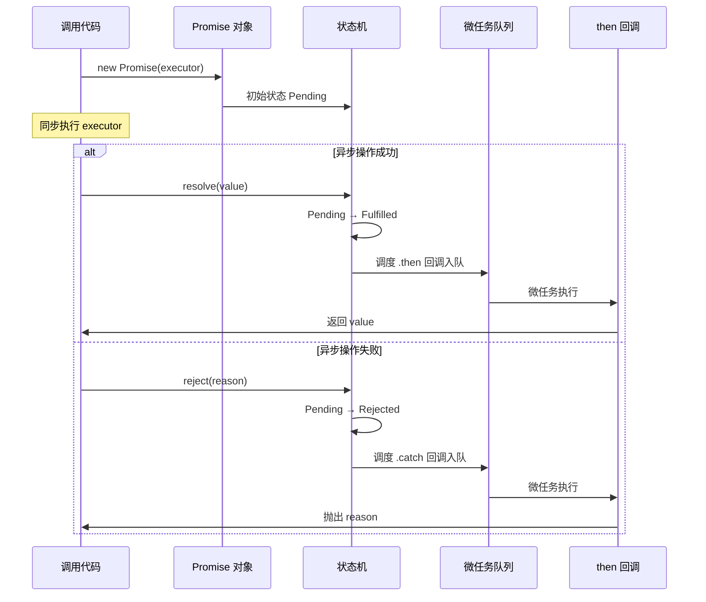

**关键机制**：

1. **执行器同步执行**：`new Promise(executor)` 中的 `executor` 立即同步执行
2. **状态变迁是同步的**：调用 `resolve()`/`reject()` 立即改变状态
3. **回调是异步的**：`.then`/`.catch` 回调在微任务队列中执行，不会立即同步调用
4. **状态锁定后回调仍可注册**：即使 Promise 已 resolved，后续 `.then` 仍会被调度到微任务执行

### 7. 应用场景

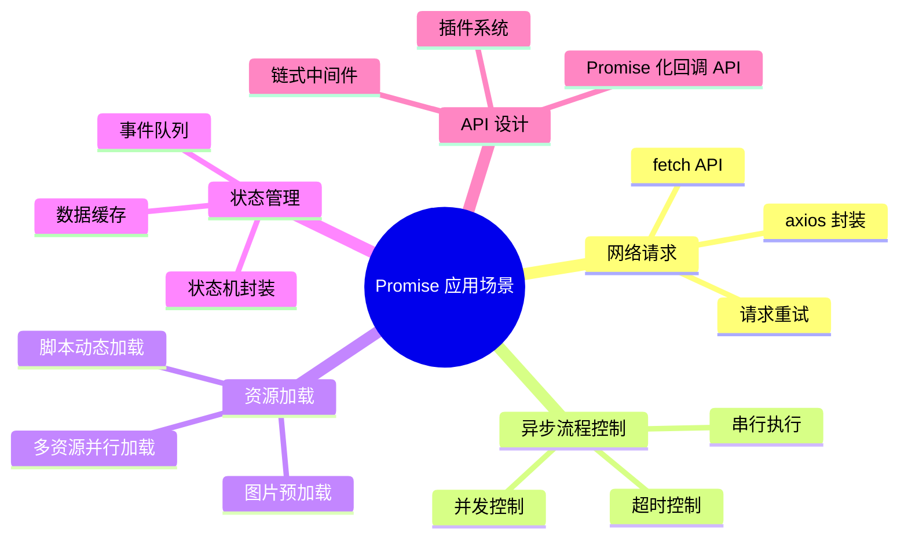

---

## 二、面试题

### 题目 1：Promise 执行顺序（基础）

#### 题干

```javascript
console.log('1');

setTimeout(() => console.log('2'), 0);

Promise.resolve().then(() => console.log('3'));

console.log('4');
```

以上代码的输出顺序是什么？为什么？

#### 解题思路

本题考察**微任务（Microtask）与宏任务（Macrotask）** 的执行顺序：

1. 同步代码先执行：`1` → `4`
2. 微任务优先于宏任务：`Promise.then` 是微任务，`setTimeout` 是宏任务
3. 因此 `3` 在 `2` 之前输出

**事件循环执行流程**：

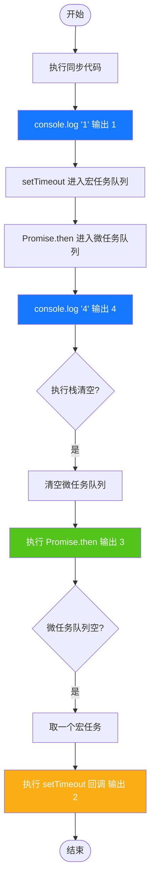

#### 正确代码实现

```javascript
// 输出顺序：
// 1
// 4
// 3
// 2

// 执行顺序分析：
// 1. 执行栈：console.log('1')
// 2. 执行栈：setTimeout 回调进入宏任务队列
// 3. 执行栈：Promise.resolve().then 回调进入微任务队列
// 4. 执行栈：console.log('4')
// 5. 执行栈清空，清空微任务队列：console.log('3')
// 6. 执行宏任务队列：console.log('2')
```

#### 运行结果

```
1
4
3
2
```

**关键规律**：同步代码 → 微任务（Promise.then）→ 宏任务（setTimeout）。每轮事件循环：执行一个宏任务 → 清空所有微任务 → 进入下一轮。

#### 知识点拓展

- **宏任务**：`setTimeout`、`setInterval`、`I/O`、`UI rendering`、`setImmediate`
- **微任务**：`Promise.then/catch/finally`、`MutationObserver`、`queueMicrotask`
- 每次事件循环中，先执行一个宏任务，然后清空所有微任务，再进行渲染

---

### 题目 2：Promise 链式调用与错误处理（基础）

#### 题干

```javascript
Promise.resolve(1)
  .then(val => {
    console.log(val);
    return val + 1;
  })
  .then(val => {
    console.log(val);
    throw new Error('Error!');
  })
  .then(val => {
    console.log(val);
  })
  .catch(err => {
    console.log('Caught:', err.message);
  })
  .then(val => {
    console.log('After catch:', val);
  });
```

以上代码的输出是什么？

#### 解题思路

1. Promise 链式调用中，每个 `.then` 返回一个新的 Promise
2. 如果 `.then` 中抛出异常或返回 rejected Promise，会跳过后续 `.then` 直到找到 `.catch`
3. `.catch` 处理完错误后，可以继续链式调用 `.then`
4. `.catch` 返回的 `undefined` 会作为下一个 `.then` 的参数

#### 正确代码实现

```javascript
// 输出：
// 1
// 2
// Caught: Error!
// After catch: undefined

// 流程分析：
// resolve(1) → then(1) 打印 1，返回 2
// then(2) 打印 2，抛出 Error
// 跳过 then(3)，进入 catch 打印 "Caught: Error!"
// catch 返回 undefined，进入 then(4) 打印 "After catch: undefined"
```

#### 运行结果

```
1
2
Caught: Error!
After catch: undefined
```

**Promise 链状态流转图**：

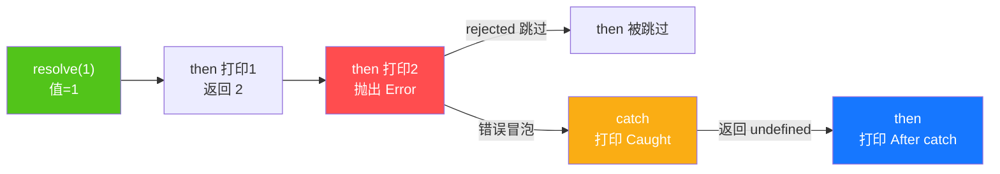

#### 知识点拓展

- `.catch` 实际上是 `.then(null, rejectHandler)` 的语法糖
- 在 `.then` 或 `.catch` 中 return 的值会被 `Promise.resolve()` 包装
- 如果 `.catch` 中再抛出异常，需要后续的 `.catch` 处理

---

### 题目 3：实现 Promise.all（进阶）

#### 题干

实现一个自定义的 `myPromiseAll` 函数，模拟 `Promise.all` 的行为。

#### 解题思路

`Promise.all` 的核心逻辑：
1. 接收一个可迭代对象（通常为数组）
2. 返回一个新的 Promise
3. 所有 Promise 都成功时，按输入顺序返回结果数组
4. 任一 Promise 失败，立即以该错误拒绝

#### 正确代码实现

```javascript
function myPromiseAll(promises) {
  return new Promise((resolve, reject) => {
    if (!Array.isArray(promises)) {
      return reject(new TypeError('Argument must be an array'));
    }

    if (promises.length === 0) {
      return resolve([]);
    }

    const results = [];
    let completed = 0;

    promises.forEach((promise, index) => {
      // 非 Promise 值用 Promise.resolve 包装
      Promise.resolve(promise)
        .then(value => {
          results[index] = value; // 保持输入顺序
          completed++;
          if (completed === promises.length) {
            resolve(results);
          }
        })
        .catch(reject); // 任一失败，立即拒绝
    });
  });
}

// 测试
const p1 = Promise.resolve(1);
const p2 = new Promise(r => setTimeout(() => r(2), 100));
const p3 = 3; // 普通值

myPromiseAll([p1, p2, p3]).then(console.log); // [1, 2, 3]

// 失败测试
const p4 = Promise.reject(new Error('Fail'));
myPromiseAll([p1, p4, p3]).catch(err => console.log(err.message)); // Fail
```

#### 运行结果

**成功场景**：`myPromiseAll([p1, p2, p3])` → `[1, 2, 3]`（按输入顺序返回）

**失败场景**：`myPromiseAll([p1, p4, p3])` → `Fail`（p4 失败，整体立即失败）

**Promise.all 行为示意图**：

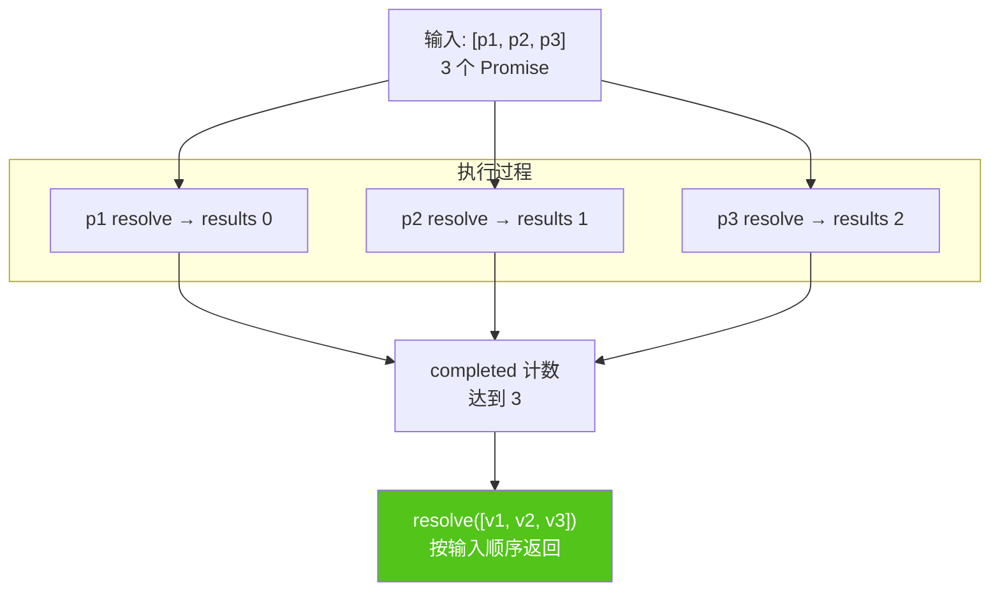

#### 知识点拓展

- `Promise.all` 采用**快速失败**策略：一个失败，整体失败
- `Promise.allSettled` 则等待所有完成，返回每个 Promise 的 `{ status, value/reason }`
- 注意 `Promise.all` 的**空数组**行为：`Promise.all([])` 返回 `[]`（已 resolve）

---

### 题目 4：Promise 并发控制（进阶）

#### 题干

实现一个函数 `asyncPool`，限制异步任务的并发数量。给定任务数组和并发数 `limit`，最多同时执行 `limit` 个任务。

#### 解题思路

1. 使用一个 `running` 计数器跟踪当前执行的任务数
2. 使用一个队列管理待执行的任务
3. 每当一个任务完成，从队列中取出下一个任务执行
4. 返回一个 Promise，在所有任务完成后 resolve

#### 正确代码实现

```javascript
function asyncPool(tasks, limit) {
  return new Promise(resolve => {
    const results = [];
    let running = 0;
    let index = 0;

    function run() {
      if (index === tasks.length && running === 0) {
        resolve(results);
        return;
      }

      while (running < limit && index < tasks.length) {
        const currentIndex = index++;
        const task = tasks[currentIndex];

        running++;
        Promise.resolve(task())
          .then(result => {
            results[currentIndex] = result;
          })
          .catch(error => {
            results[currentIndex] = { error };
          })
          .finally(() => {
            running--;
            run();
          });
      }
    }

    run();
  });
}

// 使用示例
const createTask = (id, delay) => () =>
  new Promise(r => {
    setTimeout(() => {
      console.log(`Task ${id} done`);
      r(id);
    }, delay);
  });

const tasks = [
  createTask(1, 1000),
  createTask(2, 500),
  createTask(3, 800),
  createTask(4, 200),
  createTask(5, 1200)
];

asyncPool(tasks, 2).then(results => {
  console.log('All done:', results);
});
// 同时最多 2 个任务执行
```

#### 运行结果

**并发执行时序**（5 个任务，limit=2）：

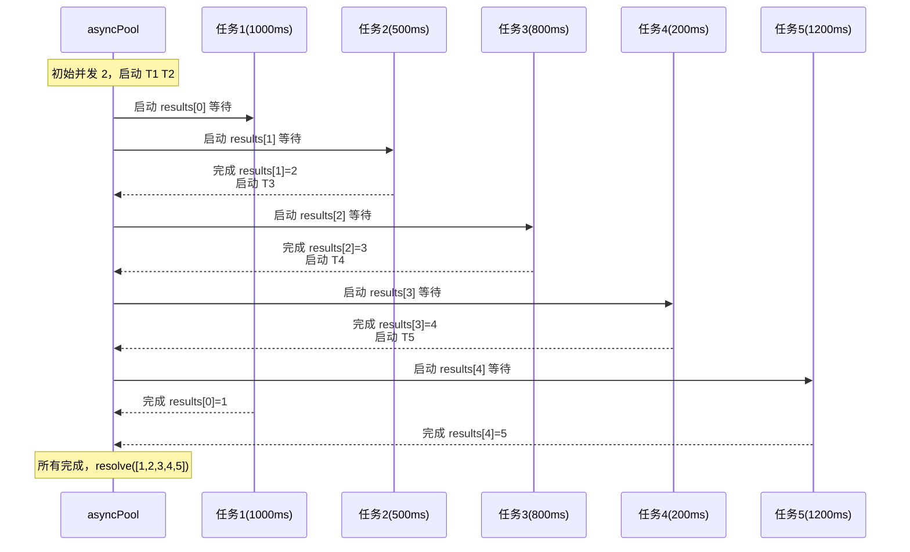

**控制台输出**：

```
Task 2 done      （t=500ms）
Task 3 done      （t=800ms）
Task 4 done      （t=1000ms，T3 完成后启动 T4）
Task 1 done      （t=1000ms）
Task 5 done      （t=2200ms）
All done: [1, 2, 3, 4, 5]
```

**关键观察**：尽管任务完成顺序与启动顺序不同，但 `results` 数组按启动顺序（index）填充，最终顺序与输入一致。

#### 知识点拓展

- 并发控制是面试高频考点，也是工程实践（如批量请求接口）中的常见需求
- 可用 `async/await` + `for...of` 实现类似效果
- 实际项目可参考 `p-limit` 库

---

### 题目 5：Promise 超时控制（进阶）

#### 题干

实现一个 `promiseTimeout` 函数，给一个 Promise 添加超时控制。如果 Promise 在指定时间内未完成，则自动超时失败。

#### 解题思路

利用 `Promise.race` 实现：将原始 Promise 与一个超时 Promise 进行竞速。

#### 正确代码实现

```javascript
function promiseTimeout(promise, ms) {
  const timeout = new Promise((_, reject) => {
    setTimeout(() => {
      reject(new Error(`Promise timed out after ${ms}ms`));
    }, ms);
  });

  return Promise.race([promise, timeout]);
}

// 使用示例
const slowPromise = new Promise(r => setTimeout(() => r('Done'), 2000));

promiseTimeout(slowPromise, 1000)
  .then(console.log)
  .catch(err => console.log(err.message)); // Promise timed out after 1000ms

// 改进版：超时后清理定时器
function promiseTimeoutWithCleanup(promise, ms) {
  let timer;
  const timeout = new Promise((_, reject) => {
    timer = setTimeout(() => {
      reject(new Error(`Timed out after ${ms}ms`));
    }, ms);
  });

  return Promise.race([promise, timeout]).finally(() => clearTimeout(timer));
}
```

#### 运行结果

**超时场景**：`promiseTimeout(slowPromise, 1000)`（slowPromise 需要 2000ms）

```
Promise timed out after 1000ms   （1s 后超时失败）
```

**正常场景**：`promiseTimeout(fastPromise, 1000)`（fastPromise 只需 500ms）

```
Done                             （500ms 后正常完成，清理定时器）
```

**Promise.race 竞速示意图**：

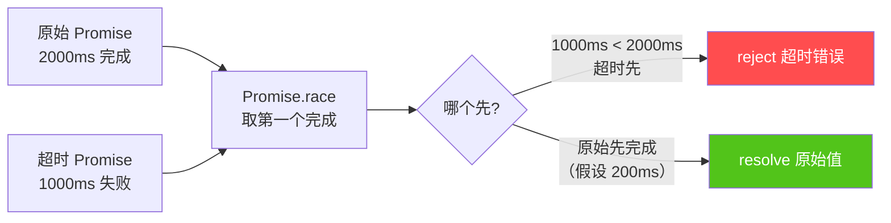

#### 知识点拓展

- `Promise.race` 接收第一个完成的 Promise，无论成功或失败
- 超时后清理定时器是良好的实践，避免内存泄漏
- 超时控制常用于网络请求、数据库查询等场景

---

### 题目 6：实现 Promise.retry（高阶）

#### 题干

实现一个 `promiseRetry` 函数，当 Promise 失败时自动重试，最多重试 `times` 次。每次重试之间有延迟。

#### 解题思路

使用递归或 `async/await` 循环实现：
1. 执行任务
2. 如果成功则返回结果
3. 如果失败且剩余重试次数 > 0，等待延迟后重试
4. 如果所有重试都失败，抛出最后一次错误

#### 正确代码实现

```javascript
function promiseRetry(fn, times, delay = 0) {
  return new Promise((resolve, reject) => {
    const attempt = (remaining) => {
      fn()
        .then(resolve)
        .catch(error => {
          if (remaining <= 1) {
            reject(error);
          } else {
            setTimeout(() => {
              attempt(remaining - 1);
            }, delay);
          }
        });
    };

    attempt(times);
  });
}

// 使用示例
let attempts = 0;
const unstableTask = () => {
  attempts++;
  console.log(`Attempt ${attempts}`);
  if (attempts < 3) {
    return Promise.reject(new Error('Failed'));
  }
  return Promise.resolve('Success');
};

promiseRetry(unstableTask, 5, 500)
  .then(result => console.log(result)) // Success
  .catch(err => console.log(err.message));

// 使用 async/await 实现
async function promiseRetryAsync(fn, times, delay = 0) {
  let lastError;
  for (let i = 0; i < times; i++) {
    try {
      return await fn();
    } catch (error) {
      lastError = error;
      if (i < times - 1 && delay > 0) {
        await new Promise(r => setTimeout(r, delay));
      }
    }
  }
  throw lastError;
}
```

#### 运行结果

**使用示例运行**（unstableTask 前 2 次失败，第 3 次成功，重试 5 次间隔 500ms）：

```
Attempt 1                （t=0ms，失败）
Attempt 2                （t=500ms，失败）
Attempt 3                （t=1000ms，成功）
Success                  （t=1000ms，返回 'Success'）
```

**重试策略对比**：

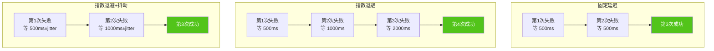

**三种重试策略对比表**：

| 策略 | 延迟公式 | 优点 | 缺点 | 适用场景 |
|-----|---------|------|------|---------|
| **固定延迟** | `delay` | 实现简单 | 重试间隔死板 | 偶发失败 |
| **指数退避** | `delay * 2^n` | 渐进式等待，减轻服务压力 | 可能等待过久 | 服务过载 |
| **指数退避+抖动** | `delay * 2^n + random` | 避免重试风暴 | 实现略复杂 | 高并发场景 |

#### 知识点拓展

- 重试策略：固定延迟、指数退避（Exponential Backoff）、随机延迟 + 抖动（Jitter）
- 指数退避示例：`delay * Math.pow(2, attempt)` + 随机抖动
- 重试应配合**幂等性**保证，避免重复操作产生副作用

---

### 题目 7：实现 Promise 串行执行（高阶）

#### 题干

实现一个函数 `serialPromises`，接收一个返回 Promise 的函数数组，要求**按顺序串行执行**，并将结果按顺序返回。

#### 解题思路

`reduce` 或 `async/await` 循环实现：
1. 使用 `reduce` 累积 Promise 链，每次 `.then` 后执行下一个任务
2. 或使用 `for...of` 循环 `await` 每个任务

#### 正确代码实现

```javascript
// 方法一：reduce 实现
function serialPromises(tasks) {
  return tasks.reduce((prevPromise, task) => {
    return prevPromise.then(results => {
      return task().then(result => {
        results.push(result);
        return results;
      });
    });
  }, Promise.resolve([]));
}

// 方法二：async/await 实现
async function serialPromisesAsync(tasks) {
  const results = [];
  for (const task of tasks) {
    const result = await task();
    results.push(result);
  }
  return results;
}

// 使用示例
const tasks = [
  () => new Promise(r => setTimeout(() => { console.log('Task 1'); r(1); }, 300)),
  () => new Promise(r => setTimeout(() => { console.log('Task 2'); r(2); }, 100)),
  () => new Promise(r => setTimeout(() => { console.log('Task 3'); r(3); }, 200))
];

serialPromises(tasks).then(console.log);
// 输出顺序：Task 1 → Task 2 → Task 3 → [1, 2, 3]
// 即使 Task 2 的延迟更短，也得等 Task 1 完成
```

#### 运行结果

**串行执行时序**（3 个任务，延迟分别为 300/100/200ms）：

```
Task 1     （t=300ms，必须先完成）
Task 2     （t=400ms，等 Task 1 完成后启动）
Task 3     （t=600ms，等 Task 2 完成后启动）
[1, 2, 3]  （最终结果按顺序返回）
```

**串行 vs 并行对比**：

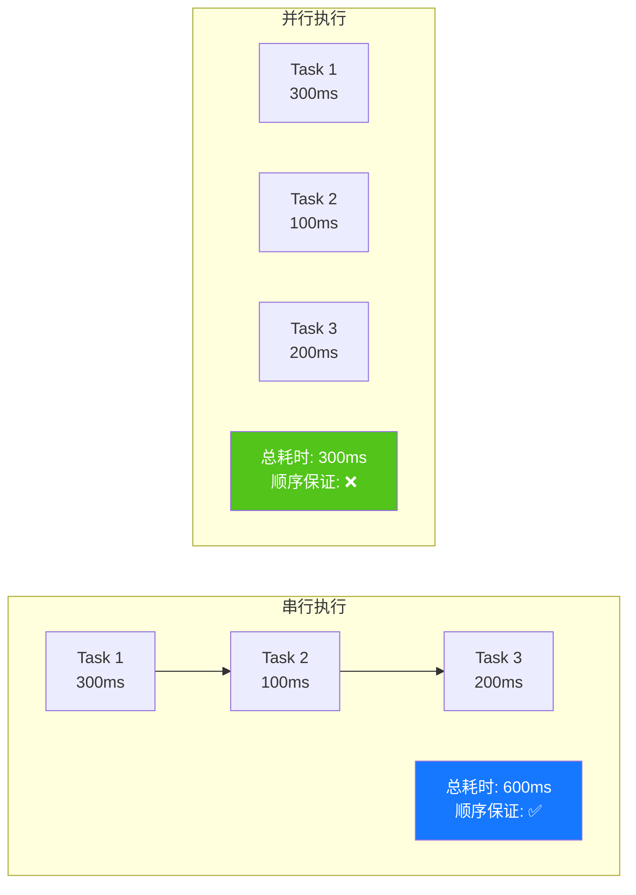

**串行 vs 并行选型表**：

| 维度 | 串行执行 | 并行执行 |
|-----|---------|---------|
| **总耗时** | 各任务耗时之和 | 取最慢任务的耗时 |
| **顺序保证** | ✅ 严格按顺序 | ❌ 完成顺序不定 |
| **资源占用** | 低（同时只有 1 个） | 高（同时 N 个） |
| **适用场景** | 依赖前一步结果、限流 | 独立任务、追求速度 |

#### 知识点拓展

- 串行 vs 并行：串行保证顺序但慢，并行快但不保证顺序
- `reduce` 实现串行的本质：将 Promise 链逐步构建
- `async/await` 实现更直观，推荐在生产中使用

---

### 题目 8：微任务队列与 Promise 嵌套（高阶）

#### 题干

```javascript
Promise.resolve()
  .then(() => {
    console.log('A');
    Promise.resolve()
      .then(() => console.log('B'))
      .then(() => console.log('C'));
  })
  .then(() => console.log('D'));

console.log('E');
```

以上代码的输出是什么？为什么？

#### 解题思路

本题考察**微任务队列的嵌套执行顺序**：

1. 同步代码先执行：`E`
2. 第一个 `.then` 注册的回调进入微任务队列
3. 执行第一个 `.then` 回调，输出 `A`，内部注册 `then(B)` 进入微任务队列
4. 第一个 `.then` 回调返回 `undefined`，外部第二个 `.then` 注册 `D` 进入微任务队列
5. **关键**：微任务队列中有 `B` 和 `D`，先入先出，所以先执行 `B`
6. `B` 的 `.then` 注册 `C` 进入微任务队列
7. 执行 `D`，输出 `D`
8. 执行 `C`，输出 `C`

#### 正确代码实现

```javascript
// 输出：
// E
// A
// B
// D
// C

// 详细执行流程：
// 1. 同步：Promise.resolve() 创建已决议的 Promise
// 2. 同步：注册 then(A) → 微任务队列: [A]
// 3. 同步：console.log('E') → 输出 E
// 4. 微任务：执行 A → 输出 A
//    内部：Promise.resolve().then(B) → 微任务队列: [B]
//    外部：A 返回 undefined → 注册 then(D) → 微任务队列: [B, D]
// 5. 微任务：执行 B → 输出 B
//    内部：B 返回 undefined → 注册 then(C) → 微任务队列: [D, C]
// 6. 微任务：执行 D → 输出 D
// 7. 微任务：执行 C → 输出 C
```

#### 运行结果

```
E
A
B
D
C
```

**微任务队列变化过程**：

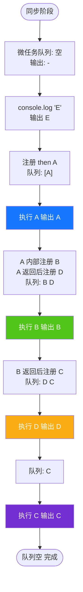

**关键规律**：微任务队列是 FIFO（先进先出）。每次 `.then` 回调执行完毕后，新注册的 `.then` 会被追加到队列末尾，而不是插队执行。

#### 知识点拓展

- 微任务队列是**先进先出（FIFO）** 的
- 每次 `.then` 返回后，新注册的 `.then` 会被追加到微任务队列末尾
- 理解这个机制对分析复杂 Promise 执行顺序至关重要

---

## 三、易错点与最佳实践

### 常见易错点

| 易错点 | 错误示例 | 正确做法 |
|--------|---------|---------|
| 忘记 return Promise | `.then(() => { return fetch(url) })` 写成了 `.then(() => { fetch(url) })` | 确保 `.then` 中返回 Promise 或值 |
| 嵌套 Promise 而非链式 | `.then(() => { return p.then(...) })` | 使用链式调用 `.then().then()` |
| 在 `.then` 中直接 `throw` 非 Error | `throw 'error'` | `throw new Error('error')` |
| 忽略 `.catch` | Promise 链末尾没有 `.catch` | 始终添加 `.catch` 处理错误 |
| `new Promise` 中执行同步代码抛出异常 | 未用 `try/catch` 包裹 | 用 `try/catch` 包裹，调用 `reject` |

### 最佳实践

```javascript
// 1. 始终以 .catch 结尾
fetch('/api/data')
  .then(res => res.json())
  .then(data => process(data))
  .catch(err => console.error('Failed:', err));

// 2. async/await + try/catch 替代 Promise 链
async function fetchData() {
  try {
    const res = await fetch('/api/data');
    const data = await res.json();
    return process(data);
  } catch (err) {
    console.error('Failed:', err);
    throw err;
  }
}

// 3. 避免 Promise 嵌套（回调地狱的变体）
// ❌ 不推荐
fetch('/a').then(dataA => {
  fetch('/b').then(dataB => {
    fetch('/c').then(dataC => {});
  });
});

// ✅ 推荐
fetch('/a')
  .then(dataA => fetch('/b'))
  .then(dataB => fetch('/c'))
  .then(dataC => {});

// 4. 使用 Promise.all 并行处理独立请求
const [users, posts] = await Promise.all([
  fetch('/api/users').then(r => r.json()),
  fetch('/api/posts').then(r => r.json())
]);

// 5. 使用 AbortController 取消请求
const controller = new AbortController();
fetch('/api/data', { signal: controller.signal })
  .then(res => res.json())
  .catch(err => {
    if (err.name === 'AbortError') return;
    console.error(err);
  });
// 取消： controller.abort();
```

### Promise 状态变迁图

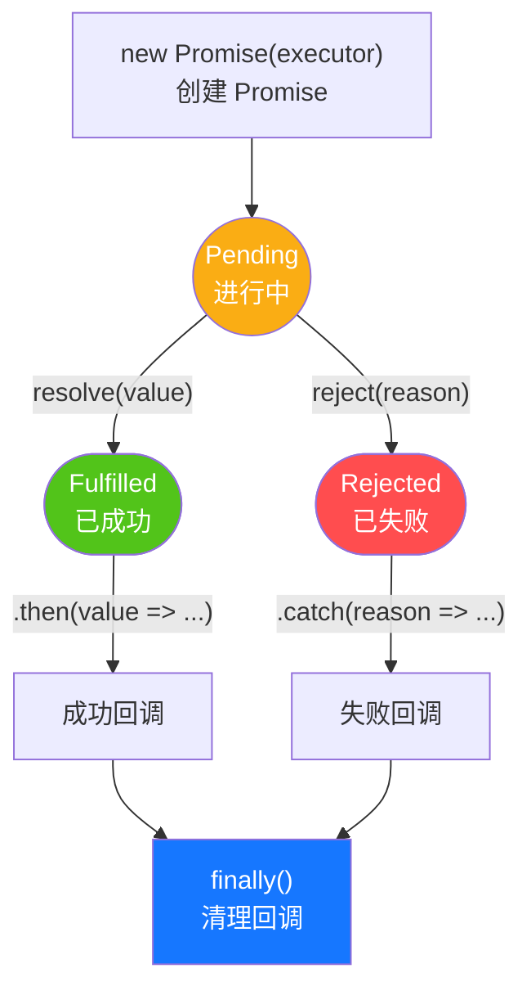

**状态变迁规则**：

1. `new Promise(executor)` 创建后初始为 `Pending` 状态
2. `resolve(value)` → 状态变迁为 `Fulfilled`，触发 `.then` 成功回调
3. `reject(reason)` → 状态变迁为 `Rejected`，触发 `.catch` 失败回调
4. 状态变迁后，`.finally` 回调必然执行（无论成功或失败）
5. 状态变迁后不可逆，后续的 `resolve`/`reject` 调用被静默忽略

### 面试高频考点速查

| 考点 | 考察频率 | 典型题目 | 关键回答要点 |
|------|:-------:|---------|------------|
| 执行顺序（宏/微任务） | ★★★★★ | 题目 1、8 | 同步 → 微任务（Promise.then）→ 宏任务（setTimeout） |
| 链式调用与错误处理 | ★★★★★ | 题目 2 | `.then` 返回新 Promise + 错误冒泡到 `.catch` + `.catch` 后可继续 `.then` |
| 实现 Promise.all | ★★★★☆ | 题目 3 | 计数器 + 按索引存结果 + 任一失败即 reject |
| 并发控制 | ★★★★☆ | 题目 4 | running 计数 + 队列管理 + 完成后启动下一个 |
| 超时控制 | ★★★☆☆ | 题目 5 | `Promise.race` 原始 Promise + 超时 Promise |
| 重试机制 | ★★★☆☆ | 题目 6 | 递归重试 + 指数退避 + 幂等性保证 |
| 串行执行 | ★★★★☆ | 题目 7 | `reduce` 累积 Promise 链 或 `for...of + await` |
| 微任务嵌套 | ★★★★☆ | 题目 8 | 微任务 FIFO + `.then` 注册追加到队尾 |

### 一页纸速查

| 问题 | 答案 |
|------|------|
| Promise 三种状态？ | Pending（进行中）、Fulfilled（已成功）、Rejected（已失败） |
| 状态变迁规则？ | 只能 Pending → Fulfilled/Rejected，且不可逆 |
| `.then` 返回什么？ | 一个新的 Promise（链式调用的基础） |
| 宏任务 vs 微任务？ | 微任务优先级高，每轮事件循环先清空微任务 |
| `Promise.all` 失败行为？ | 任一失败立即失败（快速失败） |
| `Promise.allSettled` 失败行为？ | 等所有完成，从不失败 |
| `Promise.race` vs `Promise.any`？ | race 取第一个完成（成功或失败）；any 取第一个成功 |
| 错误如何在链中传递？ | 沿链冒泡，直到遇到 `.catch` |
| `.catch` 后还能 `.then` 吗？ | 能，`.catch` 返回的值（默认 undefined）传给下一个 `.then` |
| `.finally` 接收值吗？ | 不接收，也不传递，仅做清理 |
| 如何取消 Promise？ | Promise 本身不可取消，需配合 `AbortController` |
| `async/await` 与 Promise 关系？ | `async` 函数返回 Promise，`await` 是 `.then` 的语法糖 |

---

> **核心结论**：Promise 的核心是**"状态机 + 微任务"**两个机制。理解了三态不可逆的状态变迁规律，以及"每轮事件循环先清空微任务"的调度规则，就能解释所有 Promise 现象 —— 无论是执行顺序、链式调用、错误处理，还是 `all`/`race`/`any` 的差异、并发控制、重试机制，都是这两大机制在不同场景下的应用。掌握 Promise 的关键不在于背诵 API，而在于**用"状态变迁 + 微任务调度"的视角重新审视所有异步代码**。