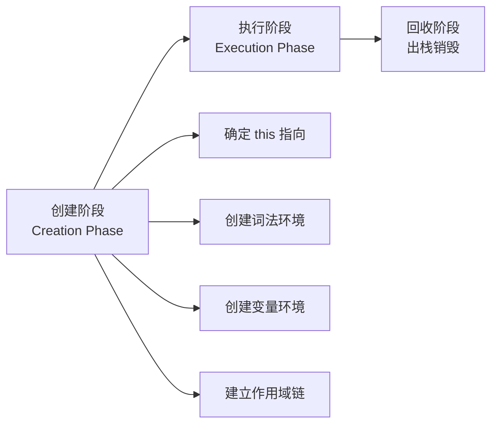
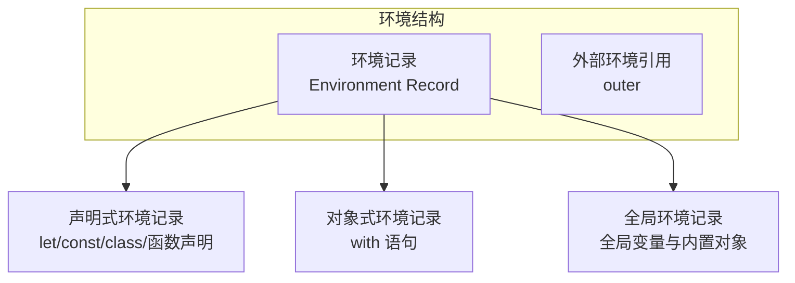
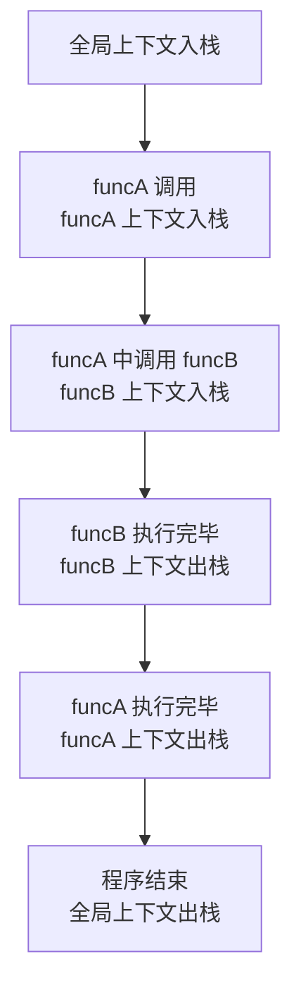
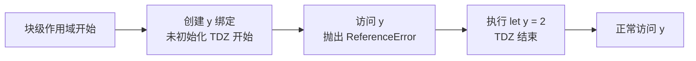
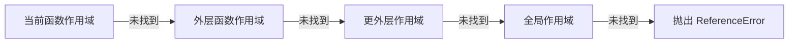
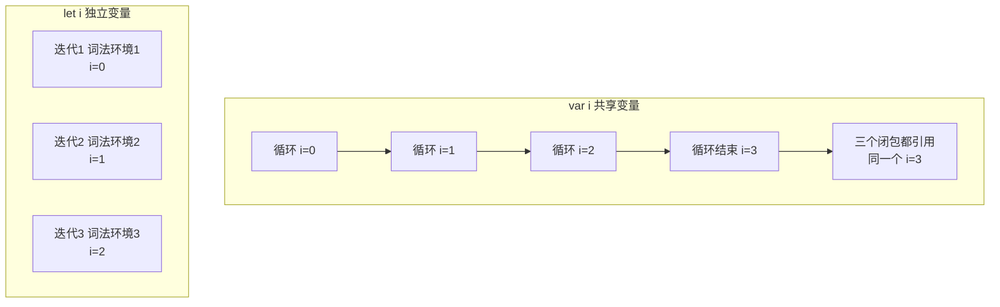
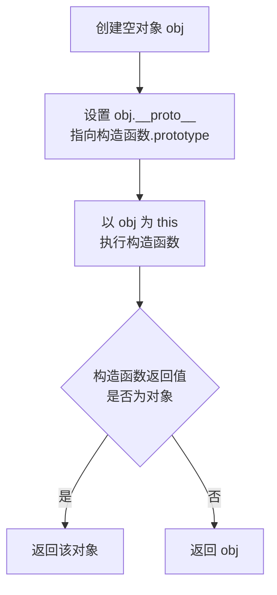
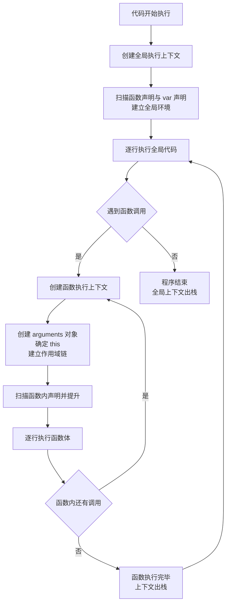

# JavaScript 执行上下文

## 一、概述

### 1.1 什么是执行上下文

执行上下文（Execution Context，简称 EC）是 JavaScript 引擎执行代码时所创建的**运行环境**。它为代码执行提供必要的环境信息，包括变量声明、函数声明、作用域链、`this` 指向等。

当代码开始运行时，引擎会创建对应的执行上下文；函数被调用时，新的函数执行上下文被压入执行栈；执行完毕后弹出销毁。理解执行上下文是掌握作用域、闭包、`this` 指向等核心机制的基础。

### 1.2 执行上下文的类型

| 类型 | 说明 | 创建时机 |
|------|------|---------|
| **全局执行上下文**（GEC） | 程序启动时创建，关联全局对象 `window`（浏览器）或 `globalThis` | 程序启动 |
| **函数执行上下文**（FEC） | 每次调用函数时创建 | 函数调用时 |
| **Eval 执行上下文** | `eval()` 执行时创建（严格模式下拥有独立作用域） | eval 调用时 |

> 💡 一个程序中只存在一个全局执行上下文，但可以有任意多个函数执行上下文。

---

## 二、执行上下文的生命周期

执行上下文从创建到销毁经历两个核心阶段：



### 2.1 创建阶段

创建阶段会构建上下文所需的环境信息，最终形成一个上下文对象：

```javascript
ExecutionContext = {
  ThisBinding: <this 指向>,
  LexicalEnvironment: <词法环境>,
  VariableEnvironment: <变量环境>
}
```

### 2.2 执行阶段

逐行执行代码，完成变量赋值、函数调用等操作。执行完毕后，上下文从调用栈弹出。

---

## 三、词法环境与变量环境

### 3.1 概念对比

执行上下文中的环境分为**词法环境**（LexicalEnvironment）和**变量环境**（VariableEnvironment），二者结构相似但用途不同。

| 特性 | 变量环境（VariableEnvironment） | 词法环境（LexicalEnvironment） |
|------|-------------------------------|------------------------------|
| 存储 | `var` 声明、函数声明 | `let`、`const`、函数参数、`class` |
| 提升 | 变量提升为 `undefined`，函数声明整体提升 | 存在暂时性死区（TDZ） |
| 作用域类型 | 函数作用域 | 块级作用域 |
| 块级隔离 | 不支持块级隔离 | 每个块级作用域创建新环境 |

### 3.2 环境结构

每个环境由**环境记录**（Environment Record）和**外部环境引用**（outer）组成：



---

## 四、执行上下文栈（调用栈）

JavaScript 引擎使用**栈**数据结构管理执行上下文，遵循 LIFO（后进先出）原则。



调用栈示例：

```javascript
function funcA() {
  funcB();
  console.log('funcA 执行');
}

function funcB() {
  console.log('funcB 执行');
}

funcA();
```

执行 `funcB` 时的调用栈状态：

```
┌──────────────────────────┐
│ funcB() 执行上下文        │  ← 栈顶（当前执行）
├──────────────────────────┤
│ funcA() 执行上下文        │
├──────────────────────────┤
│ 全局执行上下文            │  ← 栈底
└──────────────────────────┘
```

---

## 五、变量提升与暂时性死区

### 5.1 变量提升（Hoisting）

`var` 声明和函数声明在创建阶段被提升到当前作用域顶部，但 `var` 的赋值不会提升。

```javascript
console.log(a); // undefined（声明提升，未赋值）
var a = 1;

foo(); // 'foo'（函数声明整体提升）
function foo() {
  console.log('foo');
}

bar(); // TypeError: bar is not a function（函数表达式仅声明提升）
var bar = function () {
  console.log('bar');
};
```

### 5.2 暂时性死区（TDZ）

`let` 和 `const` 声明的变量在创建阶段被放入词法环境，但未初始化。从作用域开始到声明语句执行之间的区域称为**暂时性死区**，在此期间访问变量会抛出 `ReferenceError`。

```javascript
console.log(x); // ReferenceError: Cannot access 'x' before initialization
let x = 1;

{
  // 此处为 y 的暂时性死区
  console.log(y); // ReferenceError
  let y = 2;
}
```



---

## 六、作用域链

作用域链是由当前环境的变量对象逐级向上层环境链接形成的查找链，用于变量的查找。



### 作用域链查找规则

1. 从当前作用域开始查找
2. 若未找到，沿作用域链向上查找
3. 找到即停止；若到全局作用域仍未找到，抛出 `ReferenceError`
4. 内层作用域的变量会**遮蔽**外层同名变量

---

## 七、面试题精讲

### 题目 1：变量提升与函数提升优先级（基础）

#### 题干

```javascript
console.log(foo);

var foo = function () {
  console.log('expression');
};

function foo() {
  console.log('declaration');
}

console.log(foo);
```

#### 解题思路

函数声明提升优先级高于 `var` 变量声明：

1. **创建阶段**：`function foo(){}` 整体提升；`var foo` 声明被忽略（已被函数声明占据）
2. **执行阶段**：
   - 第一个 `console.log(foo)` 输出函数声明
   - `foo = function(){...}` 赋值覆盖函数声明
   - 第二个 `console.log(foo)` 输出函数表达式

#### 执行过程模拟

```javascript
// 创建阶段（提升后）：
//   function foo() { console.log('declaration'); }  // 函数声明提升
//   var foo;  // 变量声明被忽略，避免覆盖函数声明

// 执行阶段：
console.log(foo); // → [Function: foo]（函数声明）
foo = function () { console.log('expression'); };
console.log(foo); // → [Function: foo]（函数表达式）
```

#### 知识点拓展

- 函数声明提升优先级高于 `var` 变量声明
- 但函数声明可被后续**赋值操作**覆盖
- 推荐使用 `let/const` 替代 `var`，避免变量提升带来的混淆

---

### 题目 2：`this` 指向的四种绑定规则（基础）

#### 题干

```javascript
const obj = {
  name: 'obj',
  say: function () {
    console.log(this.name);
  },
  sayArrow: () => {
    console.log(this.name);
  }
};

const obj2 = { name: 'obj2' };

obj.say();           // 1. ?
obj.sayArrow();      // 2. ?
obj.say.call(obj2);  // 3. ?
const fn = obj.say;
fn();                // 4. ?
```

#### 解题思路

`this` 绑定的四种规则（优先级从低到高）：

| 规则 | 触发场景 | `this` 指向 |
|------|---------|------------|
| 默认绑定 | 独立函数调用 | 全局对象（严格模式为 `undefined`） |
| 隐式绑定 | 通过对象调用方法 | 调用的对象 |
| 显式绑定 | `call/apply/bind` | 指定的对象 |
| new 绑定 | `new` 构造函数 | 新创建的对象 |

**箭头函数**没有自己的 `this`，它从定义时的外层作用域捕获 `this`，且不可被 `call/apply/bind` 修改。

#### 输出结果

```javascript
// 1. obj.say() → 'obj'
//    隐式绑定，this 指向 obj
// 2. obj.sayArrow() → undefined
//    箭头函数 this 来自外层作用域（全局），全局无 name 属性
// 3. obj.say.call(obj2) → 'obj2'
//    显式绑定，this 指向 obj2
// 4. fn() → undefined（严格模式）/ 报错（严格模式 + 严格访问）
//    隐式绑定丢失，this 指向全局对象，全局无 name 属性
```

#### 知识点拓展

- **隐式绑定丢失**：将方法赋值给变量或作为回调传递时，丢失 `this` 绑定
- 箭头函数的 `this` 在定义时确定，无法通过 `call/apply/bind` 修改
- 绑定优先级：`new` > 显式 > 隐式 > 默认

---

### 题目 3：闭包与执行上下文（进阶）

#### 题干

```javascript
function createFunctions() {
  const result = [];
  for (var i = 0; i < 3; i++) {
    result.push(function () {
      console.log(i);
    });
  }
  return result;
}

const fns = createFunctions();
fns[0](); // ?
fns[1](); // ?
fns[2](); // ?
```

#### 解题思路

1. `var i` 声明的变量位于 `createFunctions` 的**变量环境**中，整个函数共享同一个 `i`
2. 三个闭包捕获的是同一个变量 `i` 的**引用**
3. 循环结束时 `i = 3`，三个函数执行时都输出 `3`

#### 输出结果

```javascript
// 输出：3, 3, 3
```

#### 修复方案

```javascript
// 方案一：使用 let（推荐）
function createFunctions() {
  const result = [];
  for (let i = 0; i < 3; i++) {
    // 每次迭代创建独立的词法环境
    result.push(function () {
      console.log(i);
    });
  }
  return result;
}
// 输出：0, 1, 2

// 方案二：使用 IIFE 创建独立作用域
function createFunctions() {
  const result = [];
  for (var i = 0; i < 3; i++) {
    (function (j) {
      result.push(function () {
        console.log(j);
      });
    })(i);
  }
  return result;
}
// 输出：0, 1, 2
```



#### 知识点拓展

- `let` 在 `for` 循环中，每次迭代都会**创建新的词法环境**
- `var` 在整个函数作用域中共享同一个变量
- 闭包捕获的是**变量的引用**，而非变量当前的值

---

### 题目 4：作用域链与变量查找（进阶）

#### 题干

```javascript
var x = 10;

function foo() {
  console.log(x); // ?
  var x = 20;
  console.log(x); // ?

  function bar() {
    console.log(x); // ?
    var x = 30;
    console.log(x); // ?
  }

  bar();
}

foo();
```

#### 解题思路

每个函数都有自己的变量环境，变量查找从**当前作用域**开始，逐级向上。`var` 声明的变量会提升到当前函数作用域顶部，但赋值不提升。

#### 执行过程模拟

```javascript
// 提升后的 foo 等价于：
function foo() {
  var x;  // 变量提升，初始为 undefined
  function bar() {
    var x;  // 变量提升，初始为 undefined
    console.log(x); // undefined（使用 bar 作用域内的 x）
    x = 30;
    console.log(x); // 30
  }
  console.log(x); // undefined（使用 foo 作用域内的 x，遮蔽全局 x）
  x = 20;
  console.log(x); // 20
  bar();
}
```

#### 输出结果

```javascript
// undefined（foo 作用域内的 x 提升，遮蔽全局 x）
// 20（x 赋值为 20）
// undefined（bar 作用域内的 x 提升，遮蔽 foo 的 x）
// 30（x 赋值为 30）
```

#### 知识点拓展

- 作用域链查找：**当前作用域 → 父级作用域 → ... → 全局作用域**
- `var` 的作用域是**函数作用域**，不是块级作用域
- 内层作用域的变量声明会**遮蔽**外层同名变量

---

### 题目 5：严格模式下的 `this`（进阶）

#### 题干

```javascript
'use strict';

const obj = {
  name: 'obj',
  say: function () {
    console.log(this.name);
  }
};

const fn = obj.say;
fn(); // ?

function foo() {
  console.log(this);
}
foo(); // ?

setTimeout(function () {
  console.log(this); // ?
}, 0);
```

#### 解题思路

严格模式下，**默认绑定**的 `this` 从全局对象变为 `undefined`。但 `setTimeout` 的回调由宿主环境（浏览器）调用，HTML 规范规定其回调以全局对象作为 `this` 调用，与严格模式无关。

#### 输出结果

```javascript
// TypeError: Cannot read properties of undefined
//   fn() 是独立调用，严格模式下 this 为 undefined，访问 this.name 报错
// undefined
//   foo() 独立调用，严格模式下 this 为 undefined
// window
//   setTimeout 回调由宿主环境调用，this 始终为 window
```

> ⚠️ **注意**：`setTimeout` 回调中的 `this` 为 `window`，并非因为内部使用 `apply`，而是 HTML 规范规定回调以全局对象作为 `this` 调用。

#### 知识点拓展

- 严格模式下默认绑定的 `this` 为 `undefined`
- 箭头函数不受严格模式影响（始终使用外层作用域的 `this`）
- `setTimeout`、`setInterval` 回调的 `this` 为全局对象

---

### 题目 6：`new` 绑定与返回值（进阶）

#### 题干

```javascript
function Person(name) {
  this.name = name;
  this.age = 25;
  return { name: 'override' };
}

function Animal(name) {
  this.name = name;
  this.age = 3;
  return 123;
}

const p = new Person('Tom');
const a = new Animal('Dog');

console.log(p);
console.log(a);
```

#### 解题思路

`new` 操作符的返回值规则：

- 构造函数返回**对象**（非 `null`）→ `new` 表达式返回该对象
- 构造函数返回**基本类型**或 `undefined`/`null` → 忽略返回值，返回 `new` 创建的实例

#### 输出结果

```javascript
// { name: 'override' }
//   Person 显式返回对象，覆盖了 this
// Animal { name: 'Dog', age: 3 }
//   Animal 返回基本类型 123，被忽略
```

#### `new` 操作符执行流程



#### 知识点拓展

- 构造函数显式返回对象时，`new` 的结果是该对象
- 构造函数返回基本类型时，被忽略，返回 `this`
- 这就是构造函数通常不显式 `return` 的原因

---

### 题目 7：eval 与执行上下文（高阶）

#### 题干

```javascript
var x = 'global';

function foo() {
  var x = 'local';
  eval('console.log(x); var x = "eval-local"; console.log(x);');
  console.log(x);
}

foo();
```

#### 解题思路

`eval` 分为**直接 eval**（direct eval）和**间接 eval**（indirect eval）：

- **直接 eval**：在非严格模式下，`eval` 中的 `var` 声明会**泄漏到调用者的作用域**
- **间接 eval**（如 `(0, eval)(code)`）：始终在全局作用域执行，不影响调用者作用域
- **严格模式**：`eval` 拥有独立作用域，不影响外层

本题为直接 eval 且非严格模式。`foo` 已有 `var x = 'local'`，eval 中的 `var x` 声明不会重新创建绑定（同名变量已存在），但 eval 内的赋值会修改 `foo` 作用域中的 `x`。

#### 输出结果

```javascript
// 'local'      eval 执行时，foo 作用域中 x = 'local'
// 'eval-local' eval 中 x 被赋值为 'eval-local'
// 'eval-local' eval 修改了 foo 作用域中的 x
```

#### 验证示例

```javascript
// 严格模式下，eval 拥有独立作用域
function bar() {
  'use strict';
  var x = 'local';
  eval('var x = "eval-local"; console.log(x);'); // 'eval-local'
  console.log(x); // 'local'（eval 中的 x 在独立作用域中）
}
bar();

// 间接 eval，在全局作用域执行
var y = 'outer';
function baz() {
  var y = 'inner';
  (0, eval)('console.log(y);'); // 'outer'（间接 eval 在全局执行）
}
baz();
```

#### 知识点拓展

- 非严格模式下，直接 `eval` 可修改调用者作用域
- 严格模式下 `eval` 有独立作用域，不影响外层
- 实际开发中**避免使用 `eval`**，原因：
  - 性能问题（引擎无法静态优化）
  - 安全风险（代码注入）
  - 调试困难
- 替代方案：`new Function()`、`JSON.parse()` 等

---

## 八、易错点与最佳实践

### 8.1 常见易错点

| 易错点 | 错误认知 | 正确理解 |
|--------|---------|---------|
| 提升优先级 | `var` 与函数声明优先级相同 | 函数声明优先级高于 `var` |
| 暂时性死区 | `let/const` 不提升 | 提升但未初始化，存在 TDZ |
| 箭头函数 `this` | 箭头函数有动态 `this` | `this` 在定义时确定，无法修改 |
| 回调函数 `this` | 回调中 `this` 仍指向原对象 | 默认绑定到全局对象或 `undefined` |
| 严格模式 | 严格模式影响所有 `this` | 仅影响默认绑定 |
| eval 作用域 | eval 始终影响外层作用域 | 仅直接 eval + 非严格模式才影响 |

### 8.2 最佳实践

```javascript
// 1. 优先使用 let/const，避免 var
const name = 'Tom';
let count = 0;
// ❌ 避免：var name = 'Tom';

// 2. 使用箭头函数保持 this 指向（在回调场景）
class Timer {
  constructor() {
    this.seconds = 0;
  }
  start() {
    setInterval(() => {
      this.seconds++; // 箭头函数捕获外层 this
    }, 1000);
  }
}

// 3. 使用 bind 固定 this（在需要动态 this 的场景）
const module = {
  x: 42,
  getX() {
    return this.x;
  }
};
const unboundGetX = module.getX;
console.log(unboundGetX()); // undefined
const boundGetX = module.getX.bind(module);
console.log(boundGetX()); // 42

// 4. 避免使用 eval
// ❌ 避免
eval('console.log("hello")');
// ✅ 替代方案
new Function('console.log("hello")')();

// 5. 使用严格模式，避免隐式全局变量
'use strict';
```

### 8.3 执行上下文工作流程总结



---

## 九、参考阅读

- [MDN - JavaScript 参考](https://developer.mozilla.org/zh-CN/docs/Web/JavaScript/Reference)
- [ECMAScript 规范 - 执行上下文](https://tc39.es/ecma262/#sec-execution-contexts)
- 《你不知道的 JavaScript（上卷）》第二部分
- 《JavaScript 高级程序设计》第 4 章
