# JavaScript 执行上下文

> **文档定位**：本文是 JavaScript 核心机制系列文档之一，系统讲解**执行上下文（Execution Context）**的完整知识体系。执行上下文是 JavaScript 引擎执行代码时创建的运行环境，是理解**变量提升、作用域链、闭包、`this` 指向**等核心机制的基石。
>
> **适用读者**：具备 JavaScript 基础，希望深入理解语言运行机制的开发者；准备前端面试的工程师。
>
> **关联文档**：
> - [03-Promise异步编程](./03-Promise异步编程.md) — 异步任务与执行栈的协作
> - [04-闭包详解](./04-闭包详解.md) — 闭包与执行上下文的深度关联
> - [05-作用域与作用域链](./05-作用域与作用域链.md) — 作用域的完整知识体系
>
> **阅读建议**：建议按章节顺序阅读，重点理解「词法环境」「作用域链」「`this` 绑定」三大核心机制，再通过面试题巩固。

---

## 目录

- [一、概述](#一概述)
  - [1.1 什么是执行上下文](#11-什么是执行上下文)
  - [1.2 为什么需要执行上下文](#12-为什么需要执行上下文)
  - [1.3 执行上下文的核心组成](#13-执行上下文的核心组成)
- [二、执行上下文的类型](#二执行上下文的类型)
  - [2.1 全局执行上下文](#21-全局执行上下文)
  - [2.2 函数执行上下文](#22-函数执行上下文)
  - [2.3 Eval 执行上下文](#23-eval-执行上下文)
  - [2.4 模块执行上下文（ES6+）](#24-模块执行上下文es6)
- [三、执行上下文的生命周期](#三执行上下文的生命周期)
  - [3.1 生命周期总览](#31-生命周期总览)
  - [3.2 创建阶段详解](#32-创建阶段详解)
  - [3.3 执行阶段详解](#33-执行阶段详解)
- [四、词法环境与变量环境](#四词法环境与变量环境)
  - [4.1 ES5 与 ES6 的演进](#41-es5-与-es6-的演进)
  - [4.2 词法环境的结构](#42-词法环境的结构)
  - [4.3 环境记录的类型](#43-环境记录的类型)
  - [4.4 词法环境 vs 变量环境](#44-词法环境-vs-变量环境)
- [五、执行上下文栈（调用栈）](#五执行上下文栈调用栈)
  - [5.1 调用栈的工作机制](#51-调用栈的工作机制)
  - [5.2 调用栈示例推演](#52-调用栈示例推演)
  - [5.3 栈溢出与最大栈深度](#53-栈溢出与最大栈深度)
- [六、变量提升与暂时性死区](#六变量提升与暂时性死区)
  - [6.1 变量提升](#61-变量提升hoisting)
  - [6.2 函数提升的优先级](#62-函数提升的优先级)
  - [6.3 暂时性死区（TDZ）](#63-暂时性死区tdz)
- [七、作用域链](#七作用域链)
  - [7.1 作用域链的形成](#71-作用域链的形成)
  - [7.2 作用域链查找规则](#72-作用域链查找规则)
  - [7.3 函数的 `[[Scopes]]` 属性](#73-函数的-scopes-属性)
- [八、`this` 绑定机制](#八this-绑定机制)
  - [8.1 四种绑定规则](#81-四种绑定规则)
  - [8.2 绑定优先级](#82-绑定优先级)
  - [8.3 箭头函数的 `this`](#83-箭头函数的-this)
  - [8.4 严格模式对 `this` 的影响](#84-严格模式对-this-的影响)
- [九、闭包与执行上下文](#九闭包与执行上下文)
  - [9.1 闭包的本质](#91-闭包的本质)
  - [9.2 闭包与执行上下文的关系](#92-闭包与执行上下文的关系)
  - [9.3 闭包的内存管理](#93-闭包的内存管理)
- [十、面试题精讲](#十面试题精讲)
  - [题目 1：变量提升与函数提升优先级（基础）](#题目-1变量提升与函数提升优先级基础)
  - [题目 2：`this` 指向的四种绑定规则（基础）](#题目-2this-指向的四种绑定规则基础)
  - [题目 3：闭包与循环变量（进阶）](#题目-3闭包与循环变量进阶)
  - [题目 4：作用域链与变量查找（进阶）](#题目-4作用域链与变量查找进阶)
  - [题目 5：严格模式下的 `this`（进阶）](#题目-5严格模式下的-this进阶)
  - [题目 6：`new` 绑定与返回值（进阶）](#题目-6new-绑定与返回值进阶)
  - [题目 7：`eval` 与执行上下文（高阶）](#题目-7eval-与执行上下文高阶)
  - [题目 8：异步回调中的执行上下文（高阶）](#题目-8异步回调中的执行上下文高阶)
- [十一、易错点与最佳实践](#十一易错点与最佳实践)
  - [11.1 常见易错点](#111-常见易错点)
  - [11.2 最佳实践](#112-最佳实践)
  - [11.3 执行上下文工作流程总结](#113-执行上下文工作流程总结)
- [十二、扩展知识](#十二扩展知识)
  - [12.1 执行上下文与事件循环](#121-执行上下文与事件循环)
  - [12.2 执行上下文与模块化](#122-执行上下文与模块化)
- [十三、参考阅读](#十三参考阅读)

---

## 一、概述

### 1.1 什么是执行上下文

**执行上下文**（Execution Context，简称 EC）是 JavaScript 引擎执行代码时所创建的**运行环境**。它为代码执行提供必要的环境信息，包括变量声明、函数声明、作用域链、`this` 指向等。

当代码开始运行时，引擎会创建对应的执行上下文；函数被调用时，新的函数执行上下文被压入执行栈；执行完毕后弹出销毁。理解执行上下文是掌握作用域、闭包、`this` 指向等核心机制的基础。

```javascript
// 一段简单代码背后，引擎做了大量工作
function greet(name) {
  // 此处引擎已为 greet 函数创建了执行上下文
  // 包含：this 指向、name 参数、作用域链、arguments 等
  console.log(`Hello, ${name}!`);
}

greet('Tom'); // 调用时创建函数执行上下文
```

### 1.2 为什么需要执行上下文

JavaScript 是**单线程**语言，同一时刻只能执行一个任务。执行上下文为引擎提供了**任务隔离**机制：

| 隔离维度 | 说明 | 示例 |
|---------|------|------|
| **变量隔离** | 每个函数有独立的变量空间，避免命名冲突 | 两个函数都有局部变量 `x`，互不影响 |
| **作用域隔离** | 内层作用域可访问外层，反之不可 | 函数内部可访问全局变量，全局无法访问函数内变量 |
| **`this` 隔离** | 不同调用方式下 `this` 指向不同 | `obj.fn()` 与 `fn()` 的 `this` 不同 |
| **状态隔离** | 每次调用函数都是独立的环境 | 递归调用不会相互覆盖变量 |

### 1.3 执行上下文的核心组成

根据 ECMAScript 规范，每个执行上下文包含三个核心组件：

```javascript
ExecutionContext = {
  ThisBinding: <this 指向>,           // 当前上下文的 this 值
  LexicalEnvironment: <词法环境>,      // 存储 let/const/函数声明等
  VariableEnvironment: <变量环境>      // 存储 var 声明
}
```

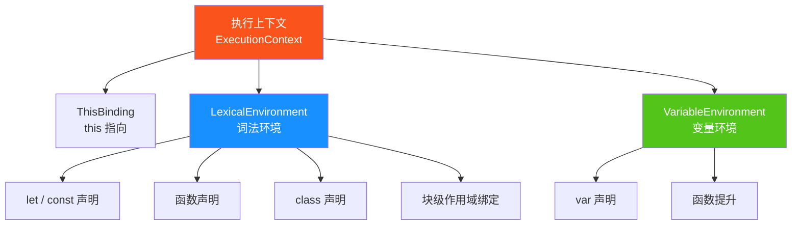

---

## 二、执行上下文的类型

### 2.1 全局执行上下文

**全局执行上下文**（Global Execution Context，GEC）是程序启动时创建的**第一个**执行上下文，整个程序生命周期中只有一个。

| 特性 | 说明 |
|------|------|
| 创建时机 | 程序启动时 |
| 关联对象 | 浏览器中为 `window`，Node.js 中为 `global`，统一可用 `globalThis` |
| `this` 指向 | 默认指向全局对象 |
| 生命周期 | 程序运行期间一直存在，程序退出时销毁 |
| 作用 | 创建全局变量、全局函数，作为作用域链的终点 |

```javascript
// 浏览器环境
console.log(this === window);        // true
console.log(globalThis === window);  // true

// 在全局声明的变量会成为全局对象的属性
var globalVar = 'I am global';
console.log(window.globalVar);       // 'I am global'

// 但 let/const 声明的全局变量不会成为全局对象属性
let letVar = 'I am let';
console.log(window.letVar);          // undefined
```

### 2.2 函数执行上下文

**函数执行上下文**（Function Execution Context，FEC）在**每次函数调用时**创建，函数执行完毕后销毁。

| 特性 | 说明 |
|------|------|
| 创建时机 | 函数被调用时 |
| 数量 | 每次调用都会创建新的上下文，递归调用会创建多个 |
| 额外信息 | 包含 `arguments` 对象、函数参数、`this` 绑定 |
| 生命周期 | 函数执行完毕后出栈销毁（除非形成闭包） |

```javascript
function add(a, b) {
  // 函数执行上下文包含：
  // - this 指向（取决于调用方式）
  // - arguments: { 0: 1, 1: 2, length: 2 }
  // - 参数 a = 1, b = 2
  // - 作用域链：[当前环境 → 全局环境]
  return a + b;
}

add(1, 2); // 创建函数执行上下文
add(3, 4); // 再次调用，创建新的执行上下文
```

### 2.3 Eval 执行上下文

`eval()` 函数执行代码时会创建**独立的 Eval 执行上下文**。

```javascript
var x = 'global';

function foo() {
  var x = 'local';
  // 直接 eval：在调用者作用域中执行
  eval('var y = "eval-var"; console.log(x);'); // 'local'
  console.log(y); // 'eval-var'（eval 中的声明泄漏到 foo 作用域）
}

foo();
```

> ⚠️ **生产环境强烈不建议使用 `eval`**：性能差（引擎无法静态优化）、安全风险（代码注入）、调试困难。现代开发中可用 `new Function()`、`JSON.parse()` 等替代。

### 2.4 模块执行上下文（ES6+）

ES6 模块拥有**独立的模块执行上下文**，与全局执行上下文不同：

| 特性 | 普通脚本 | ES6 模块 |
|------|---------|---------|
| `this` 顶层指向 | `window`（浏览器） | `undefined` |
| 变量是否成为全局对象属性 | `var` 会成为 | 都不会 |
| 默认严格模式 | 否 | **是** |
| 作用域 | 全局作用域 | 模块作用域 |

```javascript
// module.js（ES6 模块）
console.log(this); // undefined（模块顶层 this 为 undefined）
var x = 1;
console.log(window.x); // undefined（不会污染全局）
```

---

## 三、执行上下文的生命周期

### 3.1 生命周期总览

执行上下文从创建到销毁经历两个核心阶段：

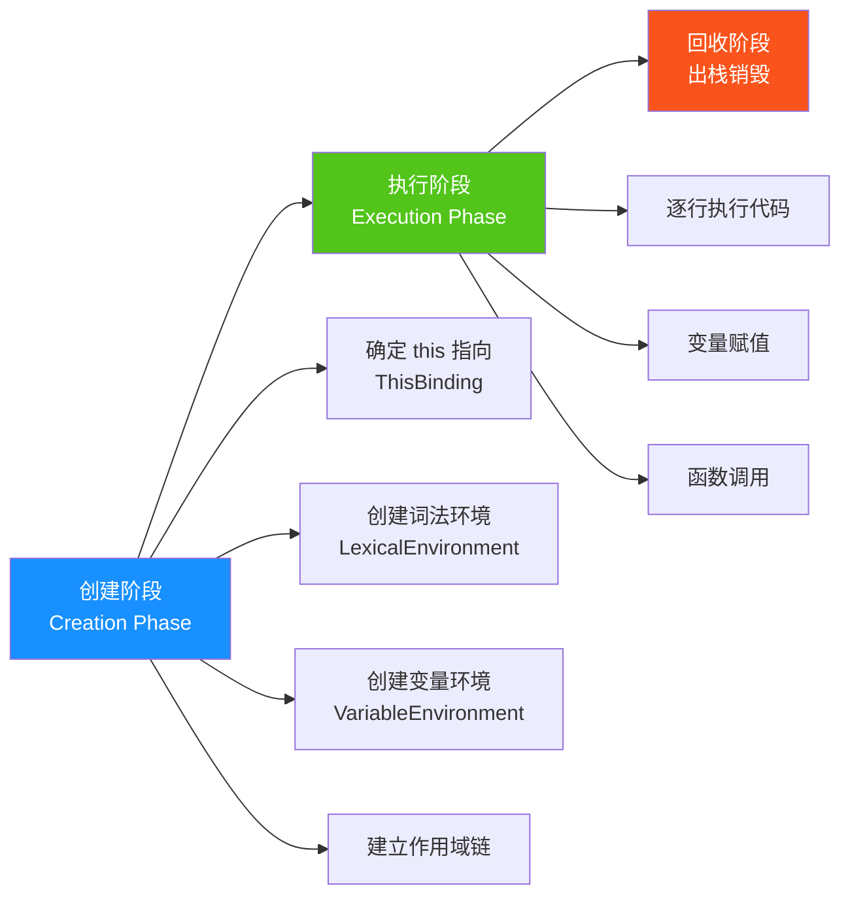

### 3.2 创建阶段详解

创建阶段会构建上下文所需的环境信息，最终形成一个上下文对象：

```javascript
// 函数执行上下文创建阶段（伪代码）
FunctionExecutionContext = {
  ThisBinding: <this 值>,
  LexicalEnvironment: {
    EnvironmentRecord: {
      // 函数参数
      arguments: { 0: 'Tom', length: 1, callee: fn },
      // let/const 声明（未初始化）
      name: <uninitialized>,
      // 函数声明
      sayHi: <function>
    },
    outer: <父级词法环境引用>
  },
  VariableEnvironment: {
    EnvironmentRecord: {
      // var 声明（初始化为 undefined）
      age: undefined
    },
    outer: <父级词法环境引用>
  }
}
```

**创建阶段的关键工作**：

1. **确定 `this` 指向**（ThisBinding）：根据调用方式确定 `this`
2. **创建词法环境**：处理 `let`/`const`/函数声明/参数等
3. **创建变量环境**：处理 `var` 声明（赋值为 `undefined`）
4. **建立作用域链**：通过 `outer` 引用连接父级环境

### 3.3 执行阶段详解

执行阶段逐行执行代码，完成以下工作：

- **变量赋值**：将创建阶段初始化为 `undefined` 的变量赋实际值
- **函数调用**：遇到函数调用时，创建新的函数执行上下文并压栈
- **作用域查找**：变量访问时沿作用域链查找

```javascript
function demo(name) {       // 创建阶段：name='Tom', age=undefined, sayHi=fn
  console.log(name);        // 执行阶段：'Tom'
  var age = 25;             // 执行阶段：age 赋值为 25
  console.log(age);         // 执行阶段：25
  function sayHi() {}       // 创建阶段已提升
}

demo('Tom');
```

---

## 四、词法环境与变量环境

### 4.1 ES5 与 ES6 的演进

执行上下文的环境模型在 ES5 和 ES6 中有显著差异：

| 版本 | 模型 | 说明 |
|------|------|------|
| **ES5** | 变量对象（VO） + 活动对象（AO） | 函数执行上下文中 VO 转为 AO |
| **ES6** | 词法环境（LE） + 变量环境（VE） | 区分 `let/const` 与 `var`，支持块级作用域 |

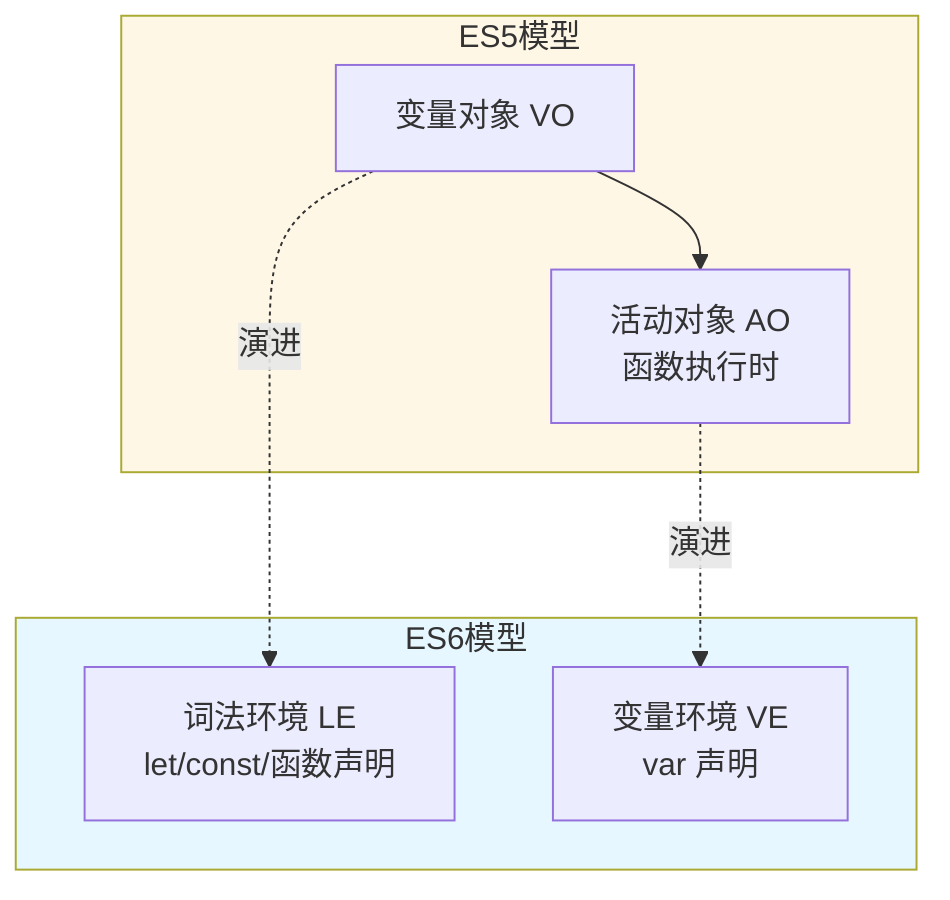

### 4.2 词法环境的结构

每个词法环境由两部分组成：

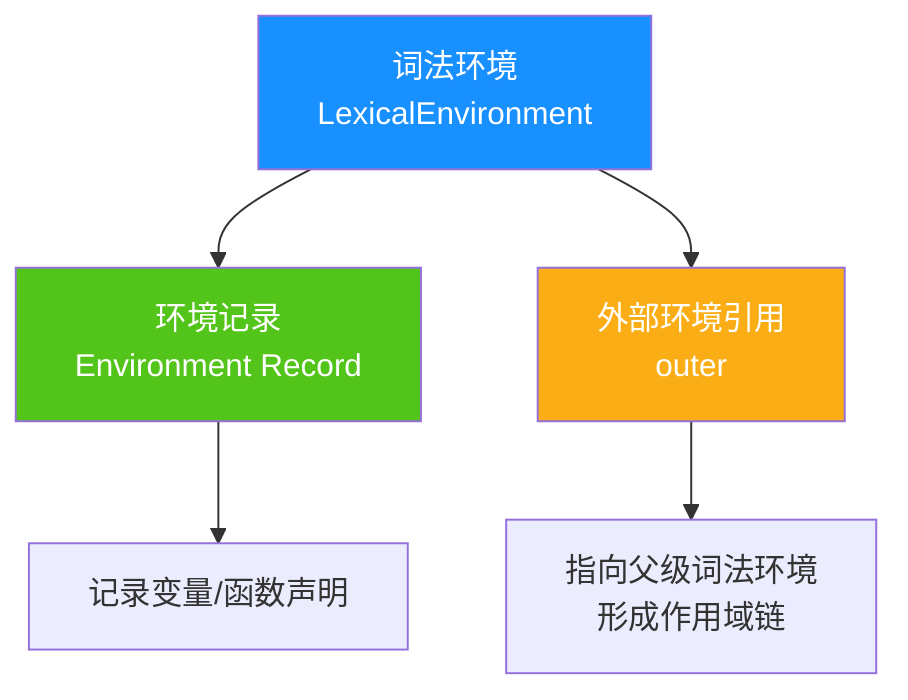

**结构示例**：

```javascript
// 全局词法环境
GlobalLexicalEnvironment = {
  EnvironmentRecord: {
    // 全局变量、全局函数、内置对象
    PI: 3.14159,
    setTimeout: <function>,
    // ...
  },
  outer: null  // 全局环境没有外层
}

// 函数词法环境
FunctionLexicalEnvironment = {
  EnvironmentRecord: {
    arguments: { ... },
    name: 'Tom',          // let 声明
    sayHi: <function>     // 函数声明
  },
  outer: <GlobalLexicalEnvironment>  // 指向全局
}
```

### 4.3 环境记录的类型

环境记录是词法环境的核心，根据作用域类型分为多种：

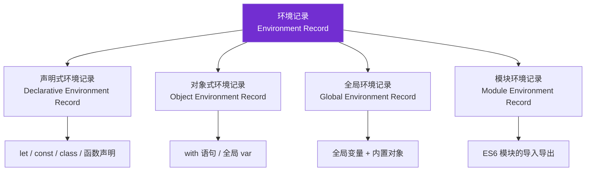

| 环境记录类型 | 存储内容 | 典型场景 |
|------------|---------|---------|
| **声明式** | `let`/`const`/`class`/函数声明 | 函数作用域、块级作用域 |
| **对象式** | 对象的属性 | `with` 语句、全局 `var` 声明 |
| **全局** | 全局变量 + 内置对象 | 全局执行上下文 |
| **模块** | 模块的导入导出绑定 | ES6 模块 |

### 4.4 词法环境 vs 变量环境

| 特性 | 变量环境（VariableEnvironment） | 词法环境（LexicalEnvironment） |
|------|-------------------------------|------------------------------|
| 存储 | `var` 声明、函数声明 | `let`、`const`、函数参数、`class` |
| 提升 | 变量提升为 `undefined`，函数声明整体提升 | 存在暂时性死区（TDZ） |
| 作用域类型 | 函数作用域 | 块级作用域 |
| 块级隔离 | 不支持块级隔离 | 每个块级作用域创建新环境 |
| 初始值 | `var` 初始化为 `undefined` | `let/const` 未初始化（TDZ） |

**为什么需要两个环境？**

ES6 引入 `let`/`const` 后，需要支持**块级作用域**，但 `var` 仍然是**函数作用域**。两个环境分开管理，使得块级作用域能独立创建新的词法环境，而不影响 `var` 声明。

```javascript
function example() {
  var x = 1;          // 存入变量环境
  let y = 2;          // 存入词法环境

  {
    let y = 3;        // 新的块级词法环境
    let z = 4;        // 新的块级词法环境
    console.log(y);   // 3（块级作用域内的 y）
    console.log(x);   // 1（从变量环境查找）
  }

  console.log(y);     // 2（外层词法环境的 y）
  console.log(z);     // ReferenceError: z is not defined
}
```

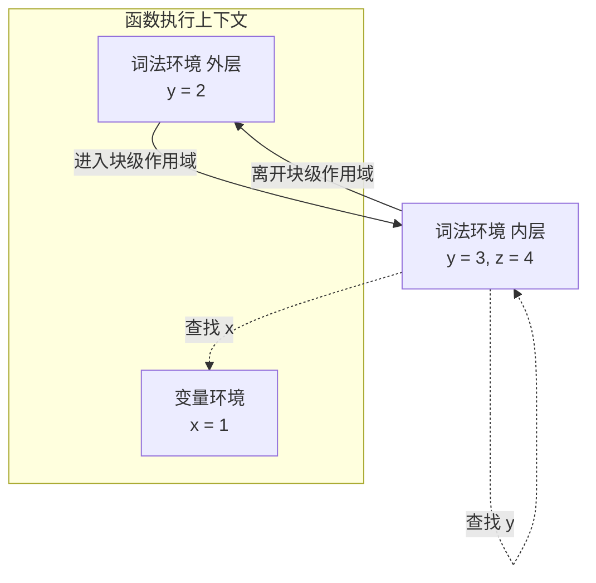

---

## 五、执行上下文栈（调用栈）

### 5.1 调用栈的工作机制

JavaScript 引擎使用**栈**数据结构管理执行上下文，遵循 **LIFO**（后进先出）原则：

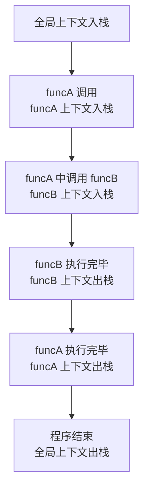

| 操作 | 触发时机 | 说明 |
|------|---------|------|
| **入栈（Push）** | 函数被调用时 | 创建新的函数执行上下文并压入栈顶 |
| **出栈（Pop）** | 函数执行完毕时 | 当前上下文从栈顶弹出销毁 |
| **栈顶** | 当前正在执行的上下文 | 引擎始终操作栈顶上下文 |

### 5.2 调用栈示例推演

```javascript
function funcA() {
  funcB();
  console.log('funcA 执行');
}

function funcB() {
  console.log('funcB 执行');
}

funcA();
```

**执行过程推演**：

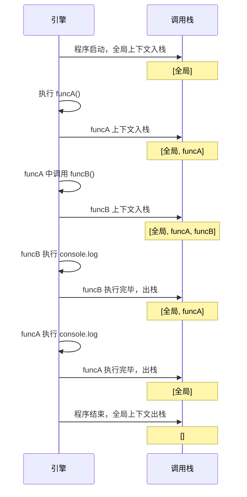

执行 `funcB` 时的调用栈状态：

```
┌──────────────────────────┐
│ funcB() 执行上下文        │  ← 栈顶（当前执行）
├──────────────────────────┤
│ funcA() 执行上下文        │
├──────────────────────────┤
│ 全局执行上下文            │  ← 栈底
└──────────────────────────┘
```

### 5.3 栈溢出与最大栈深度

调用栈有**最大深度限制**，超过会抛出 `RangeError: Maximum call stack size exceeded`。

```javascript
// 递归无终止条件，导致栈溢出
function infinite() {
  infinite();
}

infinite();
// Uncaught RangeError: Maximum call stack size exceeded
```

**不同浏览器的最大栈深度**：

| 浏览器 | 大致最大深度 |
|-------|------------|
| Chrome | 约 10,000 - 15,000 层 |
| Firefox | 约 20,000 - 30,000 层 |
| Safari | 约 10,000 - 20,000 层 |

> 💡 **尾调用优化（TCO）**：ES6 在严格模式下支持尾调用优化，递归函数若为尾递归则不会增加栈深度，可避免栈溢出。但目前只有 Safari 完整支持。

```javascript
// 普通递归（可能栈溢出）
function factorial(n) {
  if (n <= 1) return 1;
  return n * factorial(n - 1);  // 不是尾递归（乘法操作在递归之后）
}

// 尾递归优化版
function factorialTCO(n, acc = 1) {
  'use strict';
  if (n <= 1) return acc;
  return factorialTCO(n - 1, n * acc);  // 尾递归（递归是最后操作）
}
```

---

## 六、变量提升与暂时性死区

### 6.1 变量提升

`var` 声明和函数声明在创建阶段被提升到当前作用域顶部，但 `var` 的赋值不会提升。

```javascript
console.log(a); // undefined（声明提升，未赋值）
var a = 1;

foo(); // 'foo'（函数声明整体提升）
function foo() {
  console.log('foo');
}

bar(); // TypeError: bar is not a function（函数表达式仅声明提升）
var bar = function () {
  console.log('bar');
};
```

**变量提升的本质**：

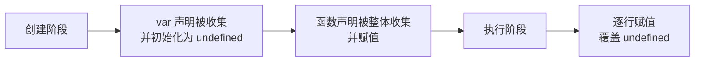

### 6.2 函数提升的优先级

函数声明的提升优先级**高于** `var` 变量声明。当两者同名时，函数声明会先被提升，`var` 声明被忽略（不会覆盖已有的函数声明）。

```javascript
console.log(foo); // [Function: foo]

var foo = function () {
  console.log('expression');
};

function foo() {
  console.log('declaration');
}

console.log(foo); // [Function: expression]
```

**提升后的等价代码**：

```javascript
// 创建阶段（提升后）：
function foo() {
  console.log('declaration');
}
var foo;  // 声明被忽略（foo 已被函数声明占据）

// 执行阶段：
console.log(foo);  // 函数声明
foo = function () { console.log('expression'); };  // 赋值覆盖
console.log(foo);  // 函数表达式
```

### 6.3 暂时性死区（TDZ）

`let` 和 `const` 声明的变量在创建阶段被放入词法环境，但**未初始化**。从作用域开始到声明语句执行之间的区域称为**暂时性死区（Temporal Dead Zone，TDZ）**，在此期间访问变量会抛出 `ReferenceError`。

```javascript
console.log(x); // ReferenceError: Cannot access 'x' before initialization
let x = 1;

{
  // 此处为 y 的暂时性死区
  console.log(y); // ReferenceError
  let y = 2;
}
```

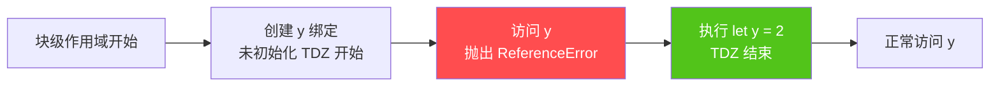

**TDZ 的隐藏陷阱**：

```javascript
// 陷阱 1：typeof 也不再安全
typeof x; // ReferenceError（x 在 TDZ 中）
let x = 1;

// 陷阱 2：函数参数默认值中的 TDZ
function foo(a = b, b = 2) {
  console.log(a, b);
}
foo(); // ReferenceError: Cannot access 'b' before initialization
// 参数按顺序求值，a 的默认值 b 此时在 TDZ 中

// 陷阱 3：let 与 var 的区别
let z = 1;
{
  console.log(z); // ReferenceError（块内 let z 在 TDZ 中）
  let z = 2;
}
```

---

## 七、作用域链

### 7.1 作用域链的形成

作用域链是由当前环境的变量对象**逐级向上层环境链接**形成的查找链，通过词法环境的 `outer` 引用连接。

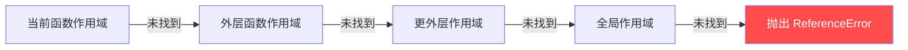

**作用域链的构建过程**：

```javascript
var globalVar = 'global';

function outer() {
  var outerVar = 'outer';

  function inner() {
    var innerVar = 'inner';
    console.log(innerVar, outerVar, globalVar); // 都能访问
  }

  inner();
}

outer();
```

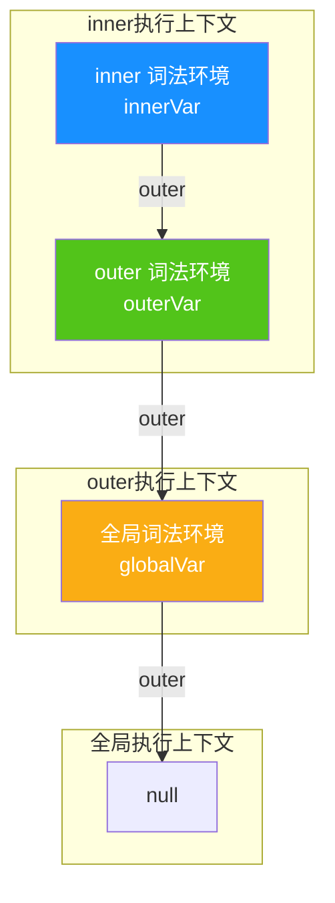

### 7.2 作用域链查找规则

1. 从当前作用域开始查找
2. 若未找到，沿作用域链向上查找
3. 找到即停止；若到全局作用域仍未找到，抛出 `ReferenceError`
4. 内层作用域的变量会**遮蔽**外层同名变量

```javascript
var x = 10;

function foo() {
  console.log(x); // undefined（foo 作用域内的 x 提升，遮蔽全局 x）
  var x = 20;
  console.log(x); // 20
}

foo();
```

> 💡 **注意**：作用域链在**函数定义时**就确定了（词法作用域/静态作用域），而非函数调用时。这与 `this` 不同——`this` 在调用时确定。

### 7.3 函数的 `[[Scopes]]` 属性

每个函数对象内部都有一个 `[[Scopes]]` 属性，保存了函数定义时的作用域链。函数调用时，新创建的执行上下文的作用域链 = `[[Scopes]]` + 当前的变量对象。

```javascript
// 通过 console.dir 可以查看函数的 [[Scopes]]
function outer() {
  var outerVar = 'outer';
  function inner() {
    console.log(outerVar);
  }
  return inner;
}

var fn = outer();
console.dir(fn);
// [[Scopes]]: [
//   Closure (outer): { outerVar: 'outer' },
//   Global: { ... }
// ]
```

---

## 八、`this` 绑定机制

### 8.1 四种绑定规则

`this` 的指向在**函数调用时**确定，遵循四种绑定规则：

| 规则 | 触发场景 | `this` 指向 | 示例 |
|------|---------|------------|------|
| **默认绑定** | 独立函数调用 | 全局对象（严格模式为 `undefined`） | `fn()` |
| **隐式绑定** | 通过对象调用方法 | 调用的对象 | `obj.fn()` |
| **显式绑定** | `call/apply/bind` | 指定的对象 | `fn.call(obj)` |
| **new 绑定** | `new` 构造函数 | 新创建的对象 | `new Fn()` |

```javascript
// 1. 默认绑定
function fn1() { console.log(this); }
fn1(); // window（非严格模式）/ undefined（严格模式）

// 2. 隐式绑定
const obj = { name: 'obj', fn2() { console.log(this.name); } };
obj.fn2(); // 'obj'

// 3. 显式绑定
function fn3() { console.log(this.name); }
const obj2 = { name: 'obj2' };
fn3.call(obj2);  // 'obj2'
fn3.apply(obj2); // 'obj2'
const bound = fn3.bind(obj2);
bound(); // 'obj2'

// 4. new 绑定
function Person(name) { this.name = name; }
const p = new Person('Tom');
console.log(p.name); // 'Tom'
```

### 8.2 绑定优先级

四种规则的优先级从高到低为：


```javascript
// 验证优先级
function foo(name) { this.name = name; }

const obj = { name: 'obj' };

// 显式 > 隐式
obj.foo = foo;
obj.foo.call('newObj', 'Tom'); // this 指向 'newObj'，而非 obj

// new > 显式
const bound = foo.bind(obj, 'Tom');
const instance = new bound(); // this 指向新实例，而非 obj
console.log(instance.name); // 'Tom'
console.log(obj.name);      // undefined（未被修改）
```

### 8.3 箭头函数的 `this`

箭头函数**没有自己的 `this`**，它从**定义时的外层作用域**捕获 `this`，且不可被 `call/apply/bind` 修改。

```javascript
const obj = {
  name: 'obj',
  // 普通函数：this 在调用时确定
  say: function () {
    console.log(this.name);
  },
  // 箭头函数：this 在定义时捕获外层（全局）
  sayArrow: () => {
    console.log(this.name);
  }
};

obj.say();      // 'obj'（隐式绑定）
obj.sayArrow(); // undefined（this 指向全局，无 name 属性）

// 箭头函数的 this 不可被修改
obj.sayArrow.call({ name: 'other' }); // 仍是 undefined
```

**箭头函数 `this` 的典型应用**：

```javascript
// 回调场景：保持外层 this
class Timer {
  constructor() {
    this.seconds = 0;
  }
  start() {
    // 普通函数会丢失 this，箭头函数保持外层 this
    setInterval(() => {
      this.seconds++;
      console.log(this.seconds);
    }, 1000);
  }
}

new Timer().start();
```

### 8.4 严格模式对 `this` 的影响

严格模式下，**默认绑定**的 `this` 从全局对象变为 `undefined`。但其他绑定规则不受影响。

```javascript
'use strict';

function foo() {
  console.log(this);
}

foo();           // undefined（严格模式默认绑定）
foo.call(null);  // null（显式绑定 null）
foo.call({});    // {}（显式绑定对象）

const obj = { foo };
obj.foo();       // obj（隐式绑定不受影响）
```

> ⚠️ **关于 `setTimeout` 的 `this`**：`setTimeout` 的回调由宿主环境（浏览器）调用，**HTML 规范规定**其回调以全局对象作为 `this`，与严格模式无关。
>
> ```javascript
> 'use strict';
> setTimeout(function () {
>   console.log(this); // window（非 undefined）
> }, 0);
> ```

---

## 九、闭包与执行上下文

### 9.1 闭包的本质

**闭包**是函数与其词法环境的组合，使得函数即使在其词法作用域外执行，仍能访问定义时的作用域变量。

```javascript
function createCounter() {
  let count = 0;
  return function () {
    count++;
    return count;
  };
}

const counter = createCounter();
console.log(counter()); // 1
console.log(counter()); // 2
// createCounter 执行上下文已销毁，但 count 仍被闭包引用
```

### 9.2 闭包与执行上下文的关系

闭包的本质是：**函数的 `[[Scopes]]` 属性持有对外层词法环境的引用**，即使外层执行上下文已出栈销毁，词法环境仍因被引用而保留在内存中。

```mermaid
flowchart TB
    subgraph createCounter执行时
        CC[createCounter 上下文]
        LE[词法环境<br/>count = 0]
        CC --> LE
    end

    subgraph createCounter返回后
        F[返回的函数对象]
        F -->|[[Scopes]]| LE
        CC2[createCounter 上下文<br/>已出栈销毁]
        LE2[词法环境<br/>仍被引用，未回收]
        CC2 -.->|销毁| LE2
    end

    style LE2 fill:#fa541c,color:#fff
```

```javascript
function outer() {
  var outerVar = 'I am outer';

  function inner() {
    console.log(outerVar); // 通过 [[Scopes]] 访问外层变量
  }

  return inner;
}

var closureFn = outer();
// outer 执行上下文出栈，但 inner 的 [[Scopes]] 仍持有 outer 的词法环境
closureFn(); // 'I am outer'
```

### 9.3 闭包的内存管理

闭包会持有对外层变量的引用，导致这些变量**无法被垃圾回收**。若使用不当，可能造成**内存泄漏**。

```javascript
// 闭包导致的内存泄漏示例
function leakyHandler() {
  const hugeData = new Array(1000000).fill('data');

  return function () {
    console.log('handled');
    // 即使不用 hugeData，它也无法被回收
  };
}

const handler = leakyHandler();
// handler 持有 leakyHandler 的词法环境，hugeData 无法释放
```

**避免闭包内存泄漏**：

```javascript
// 1. 及时解除引用
function betterHandler() {
  const hugeData = new Array(1000000).fill('data');
  const result = hugeData.length; // 提前提取需要的数据

  return function () {
    console.log(result);
    // 不持有 hugeData 引用
  };
}

// 2. 弱引用（WeakMap/WeakSet）
const weakCache = new WeakMap();
function cachedProcessor(key) {
  if (weakCache.has(key)) return weakCache.get(key);
  const result = process(key);
  weakCache.set(key, result);
  return result;
}
```

---

## 十、面试题精讲

### 题目 1：变量提升与函数提升优先级（基础）

#### 题干

```javascript
console.log(foo);

var foo = function () {
  console.log('expression');
};

function foo() {
  console.log('declaration');
}

console.log(foo);
```

#### 解题思路

函数声明提升优先级高于 `var` 变量声明：

1. **创建阶段**：`function foo(){}` 整体提升；`var foo` 声明被忽略（已被函数声明占据）
2. **执行阶段**：
   - 第一个 `console.log(foo)` 输出函数声明
   - `foo = function(){...}` 赋值覆盖函数声明
   - 第二个 `console.log(foo)` 输出函数表达式

#### 执行过程模拟

```javascript
// 创建阶段（提升后）：
//   function foo() { console.log('declaration'); }  // 函数声明提升
//   var foo;  // 变量声明被忽略，避免覆盖函数声明

// 执行阶段：
console.log(foo); // → [Function: foo]（函数声明）
foo = function () { console.log('expression'); };
console.log(foo); // → [Function: foo]（函数表达式）
```

#### 知识点拓展

- 函数声明提升优先级高于 `var` 变量声明
- 但函数声明可被后续**赋值操作**覆盖
- 推荐使用 `let/const` 替代 `var`，避免变量提升带来的混淆

---

### 题目 2：`this` 指向的四种绑定规则（基础）

#### 题干

```javascript
const obj = {
  name: 'obj',
  say: function () {
    console.log(this.name);
  },
  sayArrow: () => {
    console.log(this.name);
  }
};

const obj2 = { name: 'obj2' };

obj.say();           // 1. ?
obj.sayArrow();      // 2. ?
obj.say.call(obj2);  // 3. ?
const fn = obj.say;
fn();                // 4. ?
```

#### 解题思路

`this` 绑定的四种规则（优先级从低到高）：

| 规则 | 触发场景 | `this` 指向 |
|------|---------|------------|
| 默认绑定 | 独立函数调用 | 全局对象（严格模式为 `undefined`） |
| 隐式绑定 | 通过对象调用方法 | 调用的对象 |
| 显式绑定 | `call/apply/bind` | 指定的对象 |
| new 绑定 | `new` 构造函数 | 新创建的对象 |

**箭头函数**没有自己的 `this`，它从定义时的外层作用域捕获 `this`，且不可被 `call/apply/bind` 修改。

#### 输出结果

```javascript
// 1. obj.say() → 'obj'
//    隐式绑定，this 指向 obj
// 2. obj.sayArrow() → undefined
//    箭头函数 this 来自外层作用域（全局），全局无 name 属性
// 3. obj.say.call(obj2) → 'obj2'
//    显式绑定，this 指向 obj2
// 4. fn() → undefined（非严格模式）/ 报错（严格模式）
//    隐式绑定丢失，this 指向全局对象，全局无 name 属性
```

#### 知识点拓展

- **隐式绑定丢失**：将方法赋值给变量或作为回调传递时，丢失 `this` 绑定
- 箭头函数的 `this` 在定义时确定，无法通过 `call/apply/bind` 修改
- 绑定优先级：`new` > 显式 > 隐式 > 默认

---

### 题目 3：闭包与循环变量（进阶）

#### 题干

```javascript
function createFunctions() {
  const result = [];
  for (var i = 0; i < 3; i++) {
    result.push(function () {
      console.log(i);
    });
  }
  return result;
}

const fns = createFunctions();
fns[0](); // ?
fns[1](); // ?
fns[2](); // ?
```

#### 解题思路

1. `var i` 声明的变量位于 `createFunctions` 的**变量环境**中，整个函数共享同一个 `i`
2. 三个闭包捕获的是同一个变量 `i` 的**引用**
3. 循环结束时 `i = 3`，三个函数执行时都输出 `3`

#### 输出结果

```javascript
// 输出：3, 3, 3
```

#### 修复方案

```javascript
// 方案一：使用 let（推荐）
function createFunctions() {
  const result = [];
  for (let i = 0; i < 3; i++) {
    // 每次迭代创建独立的词法环境
    result.push(function () {
      console.log(i);
    });
  }
  return result;
}
// 输出：0, 1, 2

// 方案二：使用 IIFE 创建独立作用域
function createFunctions() {
  const result = [];
  for (var i = 0; i < 3; i++) {
    (function (j) {
      result.push(function () {
        console.log(j);
      });
    })(i);
  }
  return result;
}
// 输出：0, 1, 2
```

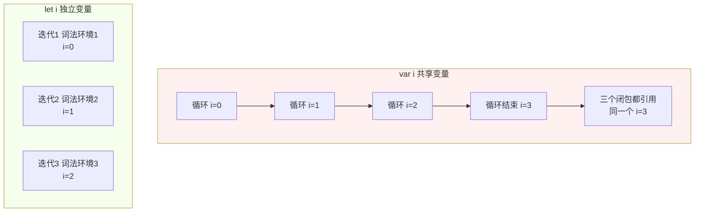

#### 知识点拓展

- `let` 在 `for` 循环中，每次迭代都会**创建新的词法环境**
- `var` 在整个函数作用域中共享同一个变量
- 闭包捕获的是**变量的引用**，而非变量当前的值

---

### 题目 4：作用域链与变量查找（进阶）

#### 题干

```javascript
var x = 10;

function foo() {
  console.log(x); // ?
  var x = 20;
  console.log(x); // ?

  function bar() {
    console.log(x); // ?
    var x = 30;
    console.log(x); // ?
  }

  bar();
}

foo();
```

#### 解题思路

每个函数都有自己的变量环境，变量查找从**当前作用域**开始，逐级向上。`var` 声明的变量会提升到当前函数作用域顶部，但赋值不提升。

#### 执行过程模拟

```javascript
// 提升后的 foo 等价于：
function foo() {
  var x;  // 变量提升，初始为 undefined
  function bar() {
    var x;  // 变量提升，初始为 undefined
    console.log(x); // undefined（使用 bar 作用域内的 x）
    x = 30;
    console.log(x); // 30
  }
  console.log(x); // undefined（使用 foo 作用域内的 x，遮蔽全局 x）
  x = 20;
  console.log(x); // 20
  bar();
}
```

#### 输出结果

```javascript
// undefined（foo 作用域内的 x 提升，遮蔽全局 x）
// 20（x 赋值为 20）
// undefined（bar 作用域内的 x 提升，遮蔽 foo 的 x）
// 30（x 赋值为 30）
```

#### 知识点拓展

- 作用域链查找：**当前作用域 → 父级作用域 → ... → 全局作用域**
- `var` 的作用域是**函数作用域**，不是块级作用域
- 内层作用域的变量声明会**遮蔽**外层同名变量

---

### 题目 5：严格模式下的 `this`（进阶）

#### 题干

```javascript
'use strict';

const obj = {
  name: 'obj',
  say: function () {
    console.log(this.name);
  }
};

const fn = obj.say;
fn(); // ?

function foo() {
  console.log(this);
}
foo(); // ?

setTimeout(function () {
  console.log(this); // ?
}, 0);
```

#### 解题思路

严格模式下，**默认绑定**的 `this` 从全局对象变为 `undefined`。但 `setTimeout` 的回调由宿主环境（浏览器）调用，HTML 规范规定其回调以全局对象作为 `this` 调用，与严格模式无关。

#### 输出结果

```javascript
// TypeError: Cannot read properties of undefined
//   fn() 是独立调用，严格模式下 this 为 undefined，访问 this.name 报错
// undefined
//   foo() 独立调用，严格模式下 this 为 undefined
// window
//   setTimeout 回调由宿主环境调用，this 始终为 window
```

> ⚠️ **注意**：`setTimeout` 回调中的 `this` 为 `window`，并非因为内部使用 `apply`，而是 HTML 规范规定回调以全局对象作为 `this` 调用。

#### 知识点拓展

- 严格模式下默认绑定的 `this` 为 `undefined`
- 箭头函数不受严格模式影响（始终使用外层作用域的 `this`）
- `setTimeout`、`setInterval` 回调的 `this` 为全局对象

---

### 题目 6：`new` 绑定与返回值（进阶）

#### 题干

```javascript
function Person(name) {
  this.name = name;
  this.age = 25;
  return { name: 'override' };
}

function Animal(name) {
  this.name = name;
  this.age = 3;
  return 123;
}

const p = new Person('Tom');
const a = new Animal('Dog');

console.log(p);
console.log(a);
```

#### 解题思路

`new` 操作符的返回值规则：

- 构造函数返回**对象**（非 `null`）→ `new` 表达式返回该对象
- 构造函数返回**基本类型**或 `undefined`/`null` → 忽略返回值，返回 `new` 创建的实例

#### 输出结果

```javascript
// { name: 'override' }
//   Person 显式返回对象，覆盖了 this
// Animal { name: 'Dog', age: 3 }
//   Animal 返回基本类型 123，被忽略
```

#### `new` 操作符执行流程

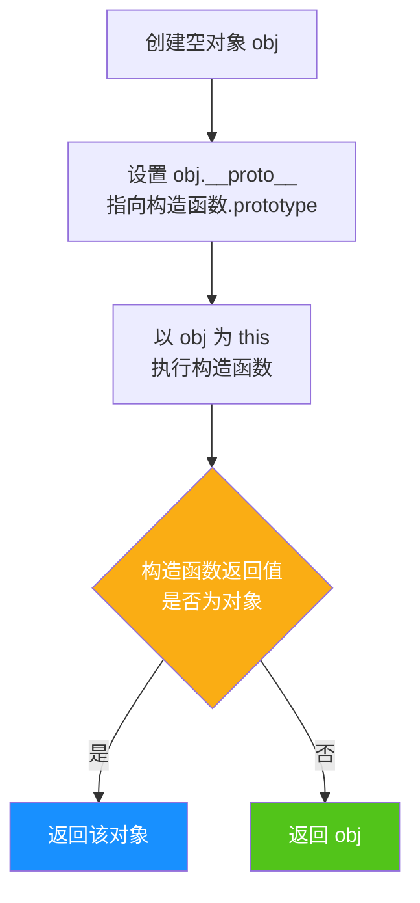

#### 手写 `new` 实现

```javascript
function myNew(Constructor, ...args) {
  // 1. 创建新对象，原型指向构造函数的 prototype
  const obj = Object.create(Constructor.prototype);
  // 2. 以 obj 为 this 执行构造函数
  const result = Constructor.apply(obj, args);
  // 3. 如果构造函数返回对象，则返回该对象；否则返回 obj
  return (result !== null && typeof result === 'object') ? result : obj;
}

// 测试
const p2 = myNew(Person, 'Tom');
console.log(p2); // { name: 'override' }
```

#### 知识点拓展

- 构造函数显式返回对象时，`new` 的结果是该对象
- 构造函数返回基本类型时，被忽略，返回 `this`
- 这就是构造函数通常不显式 `return` 的原因

---

### 题目 7：`eval` 与执行上下文（高阶）

#### 题干

```javascript
var x = 'global';

function foo() {
  var x = 'local';
  eval('console.log(x); var x = "eval-local"; console.log(x);');
  console.log(x);
}

foo();
```

#### 解题思路

`eval` 分为**直接 eval**（direct eval）和**间接 eval**（indirect eval）：

- **直接 eval**：在非严格模式下，`eval` 中的 `var` 声明会**泄漏到调用者的作用域**
- **间接 eval**（如 `(0, eval)(code)`）：始终在全局作用域执行，不影响调用者作用域
- **严格模式**：`eval` 拥有独立作用域，不影响外层

本题为直接 eval 且非严格模式。`foo` 已有 `var x = 'local'`，eval 中的 `var x` 声明不会重新创建绑定（同名变量已存在），但 eval 内的赋值会修改 `foo` 作用域中的 `x`。

#### 输出结果

```javascript
// 'local'      eval 执行时，foo 作用域中 x = 'local'
// 'eval-local' eval 中 x 被赋值为 'eval-local'
// 'eval-local' eval 修改了 foo 作用域中的 x
```

#### 验证示例

```javascript
// 严格模式下，eval 拥有独立作用域
function bar() {
  'use strict';
  var x = 'local';
  eval('var x = "eval-local"; console.log(x);'); // 'eval-local'
  console.log(x); // 'local'（eval 中的 x 在独立作用域中）
}
bar();

// 间接 eval，在全局作用域执行
var y = 'outer';
function baz() {
  var y = 'inner';
  (0, eval)('console.log(y);'); // 'outer'（间接 eval 在全局执行）
}
baz();
```

#### 知识点拓展

- 非严格模式下，直接 `eval` 可修改调用者作用域
- 严格模式下 `eval` 有独立作用域，不影响外层
- 实际开发中**避免使用 `eval`**，原因：
  - 性能问题（引擎无法静态优化）
  - 安全风险（代码注入）
  - 调试困难
- 替代方案：`new Function()`、`JSON.parse()` 等

---

### 题目 8：异步回调中的执行上下文（高阶）

#### 题干

```javascript
var name = 'global';

const obj = {
  name: 'obj',
  say: function () {
    console.log(this.name);
  },
  arrowSay: () => {
    console.log(this.name);
  },
  delaySay: function () {
    setTimeout(function () {
      console.log(this.name);
    }, 0);
  },
  delayArrow: function () {
    setTimeout(() => {
      console.log(this.name);
    }, 0);
  }
};

obj.say();          // 1. ?
obj.arrowSay();     // 2. ?
obj.delaySay();     // 3. ?
obj.delayArrow();   // 4. ?
```

#### 解题思路

| 调用 | `this` 来源 | 结果 |
|------|------------|------|
| `obj.say()` | 隐式绑定，`this` = `obj` | `'obj'` |
| `obj.arrowSay()` | 箭头函数，`this` 来自外层（全局） | `undefined` |
| `obj.delaySay()` | `setTimeout` 回调，`this` = `window` | `'global'` |
| `obj.delayArrow()` | 箭头函数，`this` 来自 `delayArrow` 的 `this` = `obj` | `'obj'` |

**关键点**：箭头函数的 `this` 在**定义时**从外层执行上下文捕获。`delayArrow` 内的箭头函数定义时，外层 `delayArrow` 的 `this` 是 `obj`（隐式绑定），因此箭头函数的 `this` 也是 `obj`。

#### 输出结果

```javascript
// 1. 'obj'      obj.say() 隐式绑定
// 2. undefined  箭头函数 this 来自全局
// 3. 'global'   setTimeout 回调 this 为 window
// 4. 'obj'      箭头函数 this 来自 delayArrow 的 this
```

#### 执行上下文角度分析

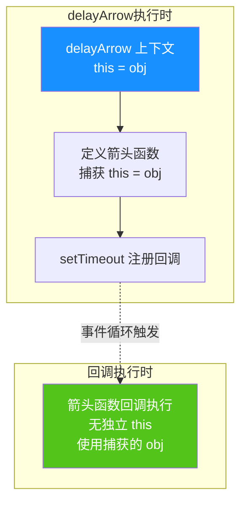

#### 知识点拓展

- 异步回调的执行上下文在**回调执行时**才创建，但箭头函数的 `this` 在**定义时**就已确定
- `setTimeout` 普通回调的 `this` 始终为 `window`（非严格模式）或 `undefined`（严格模式下仍为 `window`，因为 HTML 规范覆盖）
- 在异步场景中保持 `this` 的三种方式：
  1. 使用箭头函数（推荐）
  2. 提前用 `const self = this` 保存
  3. 使用 `bind` 绑定

```javascript
// 三种保持 this 的方式
const obj3 = {
  name: 'obj3',
  // 方式 1：箭头函数（推荐）
  way1: function () {
    setTimeout(() => console.log(this.name), 0);
  },
  // 方式 2：保存 this
  way2: function () {
    const self = this;
    setTimeout(function () { console.log(self.name); }, 0);
  },
  // 方式 3：bind
  way3: function () {
    setTimeout(function () { console.log(this.name); }.bind(this), 0);
  }
};
```

---

## 十一、易错点与最佳实践

### 11.1 常见易错点

| 易错点 | 错误认知 | 正确理解 |
|--------|---------|---------|
| 提升优先级 | `var` 与函数声明优先级相同 | 函数声明优先级高于 `var` |
| 暂时性死区 | `let/const` 不提升 | 提升但未初始化，存在 TDZ |
| 箭头函数 `this` | 箭头函数有动态 `this` | `this` 在定义时确定，无法修改 |
| 回调函数 `this` | 回调中 `this` 仍指向原对象 | 默认绑定到全局对象或 `undefined` |
| 严格模式 | 严格模式影响所有 `this` | 仅影响默认绑定 |
| `eval` 作用域 | `eval` 始终影响外层作用域 | 仅直接 `eval` + 非严格模式才影响 |
| 作用域链时机 | 作用域链在调用时确定 | 在函数**定义时**就确定（词法作用域） |
| `this` 时机 | `this` 在定义时确定 | `this` 在**调用时**确定（除箭头函数） |

### 11.2 最佳实践

```javascript
// 1. 优先使用 let/const，避免 var
const name = 'Tom';
let count = 0;
// ❌ 避免：var name = 'Tom';

// 2. 使用箭头函数保持 this 指向（在回调场景）
class Timer {
  constructor() {
    this.seconds = 0;
  }
  start() {
    setInterval(() => {
      this.seconds++; // 箭头函数捕获外层 this
    }, 1000);
  }
}

// 3. 使用 bind 固定 this（在需要动态 this 的场景）
const module = {
  x: 42,
  getX() {
    return this.x;
  }
};
const unboundGetX = module.getX;
console.log(unboundGetX()); // undefined
const boundGetX = module.getX.bind(module);
console.log(boundGetX()); // 42

// 4. 避免使用 eval
// ❌ 避免
eval('console.log("hello")');
// ✅ 替代方案
new Function('console.log("hello")')();

// 5. 使用严格模式，避免隐式全局变量
'use strict';

// 6. 避免在块级作用域内声明函数（用函数表达式替代）
// ❌ 不推荐
if (true) {
  function foo() {} // 行为在不同浏览器不一致
}
// ✅ 推荐
if (true) {
  const foo = function () {};
}
```

### 11.3 执行上下文工作流程总结

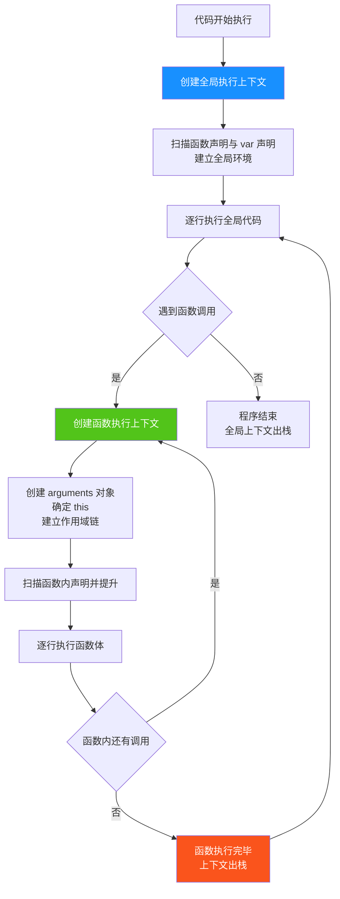

---

## 十二、扩展知识

### 12.1 执行上下文与事件循环

执行上下文栈与事件循环（Event Loop）协同工作，构成 JavaScript 的并发模型：

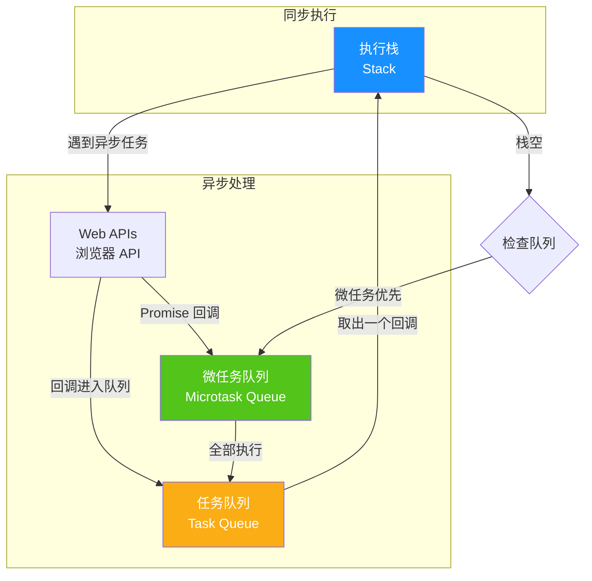

**关键点**：
- 执行栈为空时，事件循环才会从队列中取任务
- 微任务（Promise.then、MutationObserver）优先于宏任务（setTimeout、setInterval）
- 每次宏任务执行完毕，会清空所有微任务

```javascript
console.log('1: 同步');

setTimeout(() => {
  console.log('4: 宏任务');
}, 0);

Promise.resolve().then(() => {
  console.log('3: 微任务');
});

console.log('2: 同步');

// 输出顺序：1 → 2 → 3 → 4
```

### 12.2 执行上下文与模块化

ES6 模块拥有独立的模块执行上下文，与普通脚本不同：

| 特性 | 普通脚本 | ES6 模块 |
|------|---------|---------|
| 顶层 `this` | `window`（浏览器） | `undefined` |
| 默认严格模式 | 否 | **是** |
| 变量污染全局 | `var` 会成为全局属性 | 不会 |
| 作用域 | 全局作用域 | 模块作用域 |
| 加载方式 | 同步 | 异步（编译时静态分析） |

```javascript
// module.js
console.log(this); // undefined

var x = 1;        // 不会成为 window.x
let y = 2;
export { y };
```

---

## 十三、参考阅读

- [MDN - JavaScript 参考](https://developer.mozilla.org/zh-CN/docs/Web/JavaScript/Reference)
- [ECMAScript 规范 - 执行上下文](https://tc39.es/ecma262/#sec-execution-contexts)
- [ECMAScript 规范 - 词法环境](https://tc39.es/ecma262/#sec-lexical-environments)
- 《你不知道的 JavaScript（上卷）》第二部分
- 《JavaScript 高级程序设计》第 4 章
- 《深入理解 ES6》第 1-2 章
