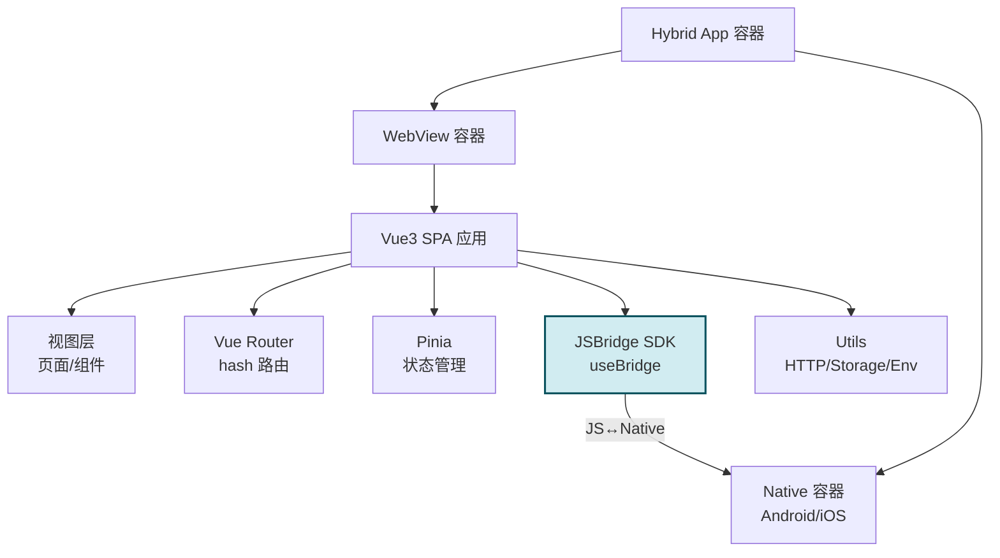
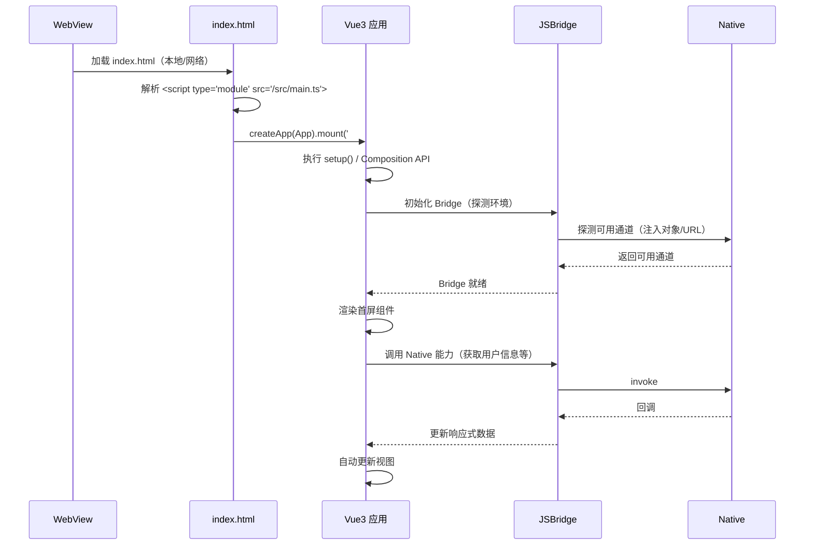
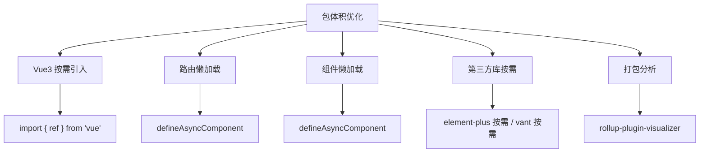
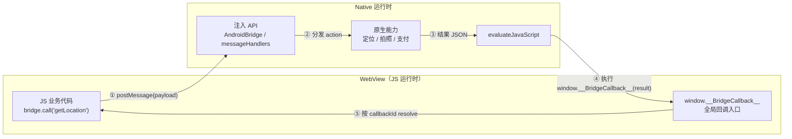
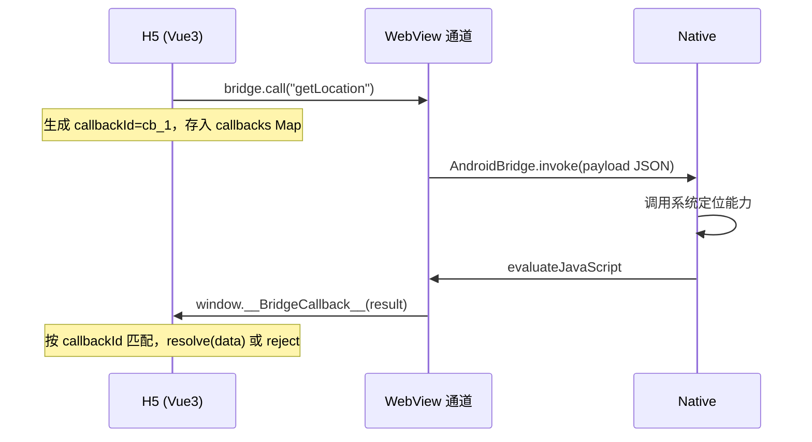
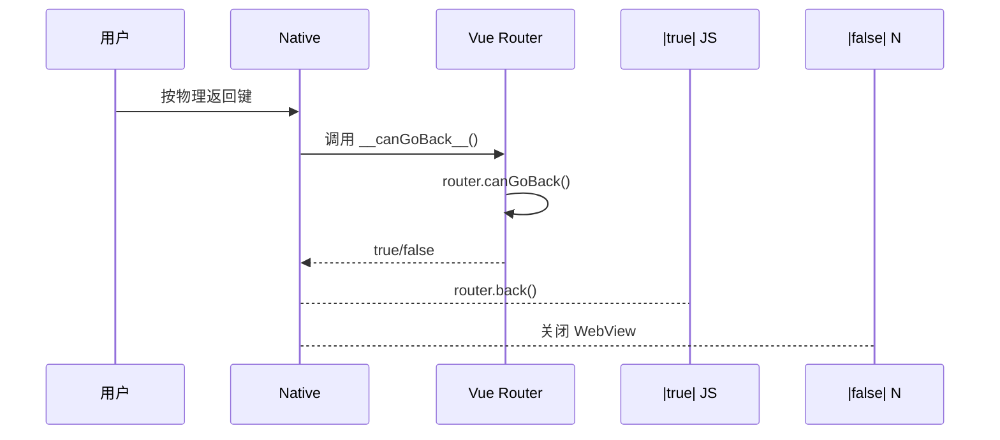
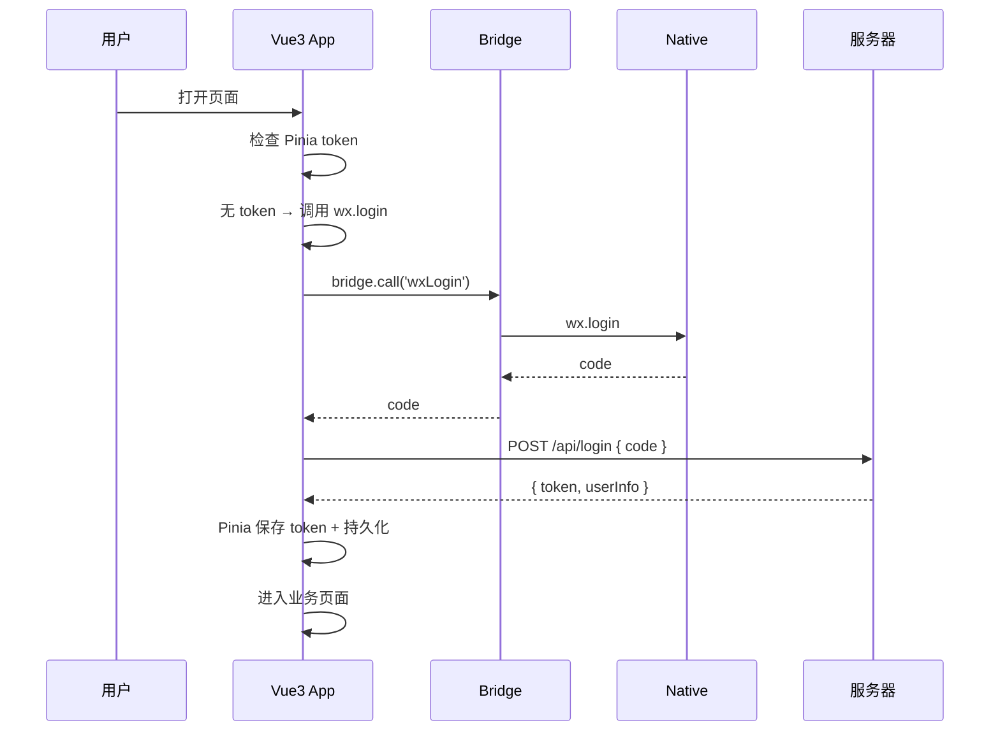
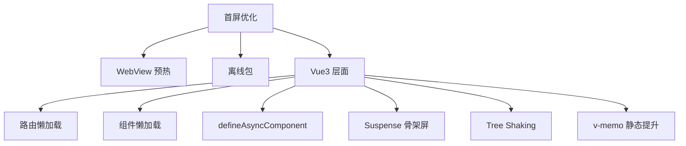

# H5 Hybrid + Vue3 混合开发高频面试题与详细回答

> 文档定位：聚焦「Vue3 在 Hybrid App（WebView 容器）」中的高频面试问题，涵盖 Vue3 在 Hybrid 场景下的特殊用法、JSBridge 与 Composition API 结合、路由在 WebView 中的坑、状态管理与离线包协同、性能优化、以及 TypeScript 工程化实践。
>
> 前置知识：建议先掌握 \[H5 Hybrid 混合开发面试题] 与 \[Vue3 基础]，本文聚焦两者的结合点与 Hybrid 特有的问题。
>
> 阅读建议：按章节由浅入深，重点关注「JSBridge + useBridge Hook」「路由在 WebView 中的坑」「Vue3 性能在 Hybrid 中的优化」三大核心模块。

***

## 目录

- [H5 Hybrid + Vue3 混合开发高频面试题与详细回答](#h5-hybrid--vue3-混合开发高频面试题与详细回答)
  - [目录](#目录)
  - [一、Vue3 在 Hybrid 中的定位与架构](#一vue3-在-hybrid-中的定位与架构)
    - [Q1. Vue3 为什么适合 Hybrid 开发？与 Vue2 对比优势？](#q1-vue3-为什么适合-hybrid-开发与-vue2-对比优势)
      - [Vue3 相比 Vue2 的核心优势](#vue3-相比-vue2-的核心优势)
      - [为什么 Proxy 对 Hybrid 更重要？](#为什么-proxy-对-hybrid-更重要)
      - [包体积对比（影响 Hybrid 首屏）](#包体积对比影响-hybrid-首屏)
    - [Q2. Vue3 在 Hybrid App 中的典型架构设计？](#q2-vue3-在-hybrid-app-中的典型架构设计)
      - [架构全景](#架构全景)
      - [目录结构](#目录结构)
      - [main.ts 入口](#maints-入口)
    - [Q3. Vue3 应用在 WebView 中的启动流程？](#q3-vue3-应用在-webview-中的启动流程)
      - [启动优化要点](#启动优化要点)
    - [Q4. Vue3 Composition API 在 Hybrid 中的优势？](#q4-vue3-composition-api-在-hybrid-中的优势)
      - [逻辑复用：Bridge 逻辑抽成 Hook](#逻辑复用bridge-逻辑抽成-hook)
      - [关注点聚合](#关注点聚合)
      - [更好的 Tree Shaking](#更好的-tree-shaking)
    - [Q5. Vue3 的 Tree Shaking 与 Hybrid 包体积优化？](#q5-vue3-的-tree-shaking-与-hybrid-包体积优化)
      - [Vue3 的 Tree Shaking 支持](#vue3-的-tree-shaking-支持)
      - [构建产物对比](#构建产物对比)
      - [Hybrid 包体积优化策略](#hybrid-包体积优化策略)
      - [Vite 配置](#vite-配置)
      - [路由懒加载](#路由懒加载)
  - [二、JSBridge 与 Vue3 结合](#二jsbridge-与-vue3-结合)
    - [JSBridge 通信原理（前置基础）](#jsbridge-通信原理前置基础)
      - [为什么需要 JSBridge](#为什么需要-jsbridge)
      - [双向通信全景](#双向通信全景)
      - [JS → Native 的三种实现方式](#js--native-的三种实现方式)
      - [Native → JS 的实现方式](#native--js-的实现方式)
      - [回调配对机制：callbackId + Promise](#回调配对机制callbackid--promise)
      - [消息协议约定](#消息协议约定)
      - [安全设计](#安全设计)
    - [Q6. 如何封装一个 Vue3 可用的 JSBridge（useBridge Hook）？](#q6-如何封装一个-vue3-可用的-jsbridgeusebridge-hook)
      - [核心设计](#核心设计)
      - [Bridge 核心层](#bridge-核心层)
      - [useBridge Hook](#usebridge-hook)
      - [业务 composables](#业务-composables)
      - [组件中使用](#组件中使用)
    - [Q7. 如何把 Native 回调转为 Vue3 响应式数据？](#q7-如何把-native-回调转为-vue3-响应式数据)
      - [场景：Native 主动推送（如定位更新、网络变化）](#场景native-主动推送如定位更新网络变化)
      - [响应式封装：useBridgeEvent](#响应式封装usebridgeevent)
      - [使用示例：监听网络变化](#使用示例监听网络变化)
      - [使用示例：监听定位更新](#使用示例监听定位更新)
    - [Q8. 如何在 Vue3 组件中统一处理 Bridge 调用的 Loading 和错误？](#q8-如何在-vue3-组件中统一处理-bridge-调用的-loading-和错误)
      - [方案1：Hook 统一管理](#方案1hook-统一管理)
      - [方案2：全局错误处理（app.config.errorHandler）](#方案2全局错误处理appconfigerrorhandler)
      - [方案3：全局 Loading（Pinia store）](#方案3全局-loadingpinia-store)
    - [Q9. 如何设计 Vue3 中的 Bridge 插件（Vue Plugin）？](#q9-如何设计-vue3-中的-bridge-插件vue-plugin)
      - [插件实现](#插件实现)
      - [组件中使用](#组件中使用-1)
    - [Q10. Native 主动推送消息如何与 Vue3 响应式系统打通？](#q10-native-主动推送消息如何与-vue3-响应式系统打通)
      - [架构](#架构)
      - [完整实现：全局事件总线 + Pinia 同步](#完整实现全局事件总线--pinia-同步)
      - [Pinia 同步原生状态](#pinia-同步原生状态)
      - [组件中使用响应式原生数据](#组件中使用响应式原生数据)
  - [三、Vue3 路由在 WebView 中的坑](#三vue3-路由在-webview-中的坑)
    - [Q11. Vue Router 在 WebView 中用 hash 还是 history 模式？](#q11-vue-router-在-webview-中用-hash-还是-history-模式)
      - [核心区别](#核心区别)
      - [为什么 Hybrid 推荐 hash 模式？](#为什么-hybrid-推荐-hash-模式)
      - [hash 模式配置](#hash-模式配置)
      - [history 模式（需 Native 配合）](#history-模式需-native-配合)
    - [Q12. WebView 返回键（物理返回 / 手势返回）如何与 Vue Router 集成？](#q12-webview-返回键物理返回--手势返回如何与-vue-router-集成)
      - [方案：Native 调用 JS 判断是否可返回](#方案native-调用-js-判断是否可返回)
      - [JS 端实现](#js-端实现)
      - [Native 端实现（Android）](#native-端实现android)
      - [Vue Router 4 中判断可返回](#vue-router-4-中判断可返回)
    - [Q13. 多 WebView 模式下 Vue Router 的状态同步问题？](#q13-多-webview-模式下-vue-router-的状态同步问题)
      - [问题场景](#问题场景)
      - [解决方案](#解决方案)
    - [Q14. 离线包场景下 Vue Router 的 base 路径如何配置？](#q14-离线包场景下-vue-router-的-base-路径如何配置)
      - [问题](#问题)
      - [解决方案](#解决方案-1)
      - [自定义协议场景](#自定义协议场景)
      - [静态资源路径配置（Vite）](#静态资源路径配置vite)
    - [Q15. Vue Router 懒加载与 WebView 离线包的协同？](#q15-vue-router-懒加载与-webview-离线包的协同)
      - [离线包打包策略](#离线包打包策略)
      - [路由懒加载（动态 import）](#路由懒加载动态-import)
      - [预加载首屏路由](#预加载首屏路由)
      - [离线包增量更新与懒加载协同](#离线包增量更新与懒加载协同)
  - [四、状态管理与响应式](#四状态管理与响应式)
    - [Q16. Pinia 在 Hybrid 中的优势与使用？](#q16-pinia-在-hybrid-中的优势与使用)
      - [Pinia vs Vuex](#pinia-vs-vuex)
      - [基础用法](#基础用法)
    - [Q17. 如何在 Pinia 中持久化状态到本地存储？](#q17-如何在-pinia-中持久化状态到本地存储)
      - [使用 pinia-plugin-persistedstate](#使用-pinia-plugin-persistedstate)
      - [手动持久化（更灵活）](#手动持久化更灵活)
      - [持久化到 IndexedDB（大数据）](#持久化到-indexeddb大数据)
    - [Q18. Vue3 响应式原理（Proxy）在 Hybrid 中的兼容性？](#q18-vue3-响应式原理proxy在-hybrid-中的兼容性)
      - [Proxy 浏览器兼容性](#proxy-浏览器兼容性)
      - [低版本 Android 兼容方案](#低版本-android-兼容方案)
      - [检测 Proxy 并降级](#检测-proxy-并降级)
      - [Vue3 响应式原理简述](#vue3-响应式原理简述)
    - [Q19. 如何在 Hybrid 中管理全局登录态与 Token？](#q19-如何在-hybrid-中管理全局登录态与-token)
      - [登录流程](#登录流程)
      - [Pinia 管理登录态](#pinia-管理登录态)
      - [路由守卫](#路由守卫)
      - [HTTP 请求携带 Token](#http-请求携带-token)
      - [Token 失效处理（Native 通知）](#token-失效处理native-通知)
  - [五、Vue3 性能在 Hybrid 中的优化](#五vue3-性能在-hybrid-中的优化)
    - [Q20. Vue3 首屏优化在 Hybrid 中的特殊手段？](#q20-vue3-首屏优化在-hybrid-中的特殊手段)
      - [Hybrid 首屏优化全景](#hybrid-首屏优化全景)
      - [Suspense + 骨架屏](#suspense--骨架屏)
      - [组件级懒加载](#组件级懒加载)
      - [编译优化（Vue3 自动）](#编译优化vue3-自动)
    - [Q21. 如何用 v-memo / v-once 优化长列表在 WebView 中的渲染？](#q21-如何用-v-memo--v-once-优化长列表在-webview-中的渲染)
      - [v-once：只渲染一次](#v-once只渲染一次)
      - [v-memo：条件性缓存渲染](#v-memo条件性缓存渲染)
      - [v-memo + 虚拟列表](#v-memo--虚拟列表)
      - [v-memo 注意事项](#v-memo-注意事项)
    - [Q22. Vue3 异步组件 defineAsyncComponent 与 WebView 加载？](#q22-vue3-异步组件-defineasynccomponent-与-webview-加载)
      - [基本用法](#基本用法)
      - [与离线包协同](#与离线包协同)
      - [路由级 + 组件级懒加载](#路由级--组件级懒加载)
    - [Q23. 如何避免 Vue3 重渲染导致 WebView 卡顿？](#q23-如何避免-vue3-重渲染导致-webview-卡顿)
      - [重渲染原因与解决](#重渲染原因与解决)
      - [markRaw：跳过响应式](#markraw跳过响应式)
      - [shallowRef / shallowReactive](#shallowref--shallowreactive)
      - [精确 watch](#精确-watch)
    - [Q24. Vue3 KeepAlive 页面切换中的使用？](#q24-vue3-keepalive-页面切换中的使用)
      - [KeepAlive 缓存组件](#keepalive-缓存组件)
      - [生命周期：onActivated / onDeactivated](#生命周期onactivated--ondeactivated)
      - [Hybrid 场景：KeepAlive 与 WebView 生命周期](#hybrid-场景keepalive-与-webview-生命周期)
      - [KeepAlive 缓存策略](#keepalive-缓存策略)
  - [六、Vue3 生命周期与 WebView 事件](#六vue3-生命周期与-webview-事件)
    - [Q25. Vue3 生命周期与 WebView 生命周期的对应关系？](#q25-vue3-生命周期与-webview-生命周期的对应关系)
      - [生命周期对应表](#生命周期对应表)
      - [Hybrid 中 onMounted 用法](#hybrid-中-onmounted-用法)
      - [WebView 页面隐藏时的处理](#webview-页面隐藏时的处理)
    - [Q26. WebView 页面销毁时 Vue3 组件的清理（定时器/监听/订阅）？](#q26-webview-页面销毁时-vue3-组件的清理定时器监听订阅)
      - [清理清单](#清理清单)
      - [统一清理模式](#统一清理模式)
      - [Vue3 自动清理（onScopeDispose）](#vue3-自动清理onscopedispose)
      - [内存泄漏检测](#内存泄漏检测)
    - [Q27. 如何监听 WebView 的可见性变化（pagehide / visibilitychange）？](#q27-如何监听-webview-的可见性变化pagehide--visibilitychange)
      - [事件对比](#事件对比)
      - [完整封装](#完整封装)
      - [使用示例](#使用示例)
      - [Native 配合：主动通知 JS](#native-配合主动通知-js)
  - [七、TypeScript 与工程化](#七typescript-与工程化)
    - [Q28. Vue3 + TS 在 Hybrid 中的类型定义实践？](#q28-vue3--ts-在-hybrid-中的类型定义实践)
      - [Bridge 类型定义](#bridge-类型定义)
      - [组件 Props 类型](#组件-props-类型)
      - [Pinia 类型](#pinia-类型)
      - [环境变量类型](#环境变量类型)
    - [Q29. Vite + Vue3 + 多入口打包离线包配置？](#q29-vite--vue3--多入口打包离线包配置)
      - [Vite 配置](#vite-配置-1)
      - [离线包清单自动生成](#离线包清单自动生成)
    - [Q30. 如何在 Vue3 中做环境判断（H5 / Hybrid / 小程序）？](#q30-如何在-vue3-中做环境判断h5--hybrid--小程序)
      - [环境判断工具](#环境判断工具)
      - [在 Vue3 中使用](#在-vue3-中使用)
      - [环境相关逻辑封装](#环境相关逻辑封装)
  - [八、综合实战题](#八综合实战题)
    - [Q31. 设计一个 Vue3 + Hybrid 的通用支付组件？](#q31-设计一个-vue3--hybrid-的通用支付组件)
      - [需求](#需求)
      - [组件实现](#组件实现)
      - [使用](#使用)
    - [Q32. 设计一个 Vue3 的 Hybrid 路由守卫 + 登录态校验？](#q32-设计一个-vue3-的-hybrid-路由守卫--登录态校验)
      - [路由配置](#路由配置)
      - [路由守卫](#路由守卫-1)
      - [Pinia 中的静默登录](#pinia-中的静默登录)
    - [Q33. 设计一个 Vue3 + Bridge 的图片上传组件？](#q33-设计一个-vue3--bridge-的图片上传组件)
      - [需求](#需求-1)
      - [组件实现](#组件实现-1)
      - [图片压缩工具](#图片压缩工具)
  - [九、高频速答与踩坑总结](#九高频速答与踩坑总结)
    - [9.1 速答卡片（20 秒一题）](#91-速答卡片20-秒一题)
    - [9.2 实战踩坑 10 例](#92-实战踩坑-10-例)
    - [9.3 复习优先级表](#93-复习优先级表)

***

## 一、Vue3 在 Hybrid 中的定位与架构

### Q1. Vue3 为什么适合 Hybrid 开发？与 Vue2 对比优势？

#### Vue3 相比 Vue2 的核心优势

| 维度                  | Vue2                  | Vue3                | Hybrid 中的意义                      |
| ------------------- | --------------------- | ------------------- | -------------------------------- |
| **响应式**             | Object.defineProperty | **Proxy**           | 更好的属性增删、数组响应；性能更好                |
| **包体积**             | 较大（\~30KB gzip）       | **更小（\~10KB gzip）** | 离线包体积小，加载快                       |
| **Tree Shaking**    | 差                     | **好**（按需引入）         | 只打包用到的 API，首屏更小                  |
| **Composition API** | 无                     | **有**               | 逻辑复用方便，Bridge 逻辑可抽成 Hook         |
| **TypeScript**      | 弱（需装饰器）               | **一等支持**            | 大型 Hybrid 项目类型安全                 |
| **Fragment**        | 必须单根                  | **支持多根**            | 减少无用 DOM 层级                      |
| **Teleport**        | 无                     | **有**               | 弹窗、遮罩可挂到 body 外，不受父级 overflow 影响 |
| **Suspense**        | 无                     | **有**               | 异步组件加载，配合离线包懒加载                  |

#### 为什么 Proxy 对 Hybrid 更重要？

```javascript
// Vue2 defineProperty 痛点：
// 1. 无法监听属性新增/删除（需 Vue.set / Vue.delete）
// 2. 数组下标修改不响应
// 3. 初始化时深度遍历，启动慢

// Vue3 Proxy：
// 1. 属性增删自动响应
// 2. 数组任意操作响应
// 3. 懒代理（访问时才代理），启动更快
// 4. 支持 Map/Set/WeakMap

// Hybrid 场景：Bridge 回调返回的复杂对象可直接赋值，无需手动 set
const data = reactive({});
bridge.call('getUserInfo').then(user => {
  data.user = user;  // Vue3 自动响应，Vue2 需 Vue.set
});
```

#### 包体积对比（影响 Hybrid 首屏）

```
Vue2: vue.runtime.min.js ≈ 33KB (gzip)
Vue3: vue.runtime.global.prod.js ≈ 13KB (gzip) + 按需 API
→ Hybrid 离线包更小，首屏加载更快
```

***

### Q2. Vue3 在 Hybrid App 中的典型架构设计？

#### 架构全景



#### 目录结构

```
hybrid-vue3-app/
├── public/
│   ├── index.html
│   └── package.json          # 离线包清单
├── src/
│   ├── main.ts               # 入口
│   ├── App.vue
│   ├── router/               # 路由配置
│   │   └── index.ts
│   ├── stores/               # Pinia 状态
│   │   ├── user.ts
│   │   └── app.ts
│   ├── bridge/               # JSBridge 封装
│   │   ├── core.ts           # Bridge 核心
│   │   ├── useBridge.ts      # useBridge Hook
│   │   └── plugins.ts        # Bridge 插件
│   ├── composables/          # 组合式函数
│   │   ├── useDevice.ts
│   │   ├── useLocation.ts
│   │   └── useShare.ts
│   ├── pages/                # 页面
│   ├── components/           # 通用组件
│   ├── api/                  # HTTP 请求
│   ├── utils/                # 工具
│   │   ├── env.ts            # 环境判断
│   │   └── storage.ts
│   └── styles/
├── vite.config.ts
└── tsconfig.json
```

#### main.ts 入口

```typescript
// src/main.ts
import { createApp } from 'vue';
import { createPinia } from 'pinia';
import App from './App.vue';
import router from './router';
import bridgePlugin from './bridge/plugins';
import './styles/index.css';

const app = createApp(App);

app.use(createPinia());
app.use(router);
app.use(bridgePlugin);  // 注入 Bridge 全局方法

app.mount('#app');
```

***

### Q3. Vue3 应用在 WebView 中的启动流程？



#### 启动优化要点

| 优化点              | 手段                           |
| ---------------- | ---------------------------- |
| **Bridge 预初始化**  | HTML 加载前 Native 注入 Bridge 对象 |
| **首屏不依赖 Bridge** | 先渲染骨架屏，Bridge 就绪后再取数据        |
| **路由懒加载**        | 非首屏路由 `defineAsyncComponent` |
| **Pinia 懒加载**    | 按需初始化 store                  |
| **预加载核心模块**      | `<link rel="modulepreload">` |

```html
<!-- index.html 预加载 -->
<link rel="modulepreload" href="/src/main.ts">
<link rel="modulepreload" href="/src/bridge/core.ts">
```

***

### Q4. Vue3 Composition API 在 Hybrid 中的优势？

#### 逻辑复用：Bridge 逻辑抽成 Hook

```javascript
// Vue2：mixin 命名冲突、来源不清晰
export default {
  mixins: [deviceMixin, locationMixin],
  // 不知道 deviceInfo 来自哪个 mixin
}

// Vue3：Hook 清晰，来源明确
function useDevice() {
  const deviceInfo = ref(null);
  const loading = ref(false);

  const getDeviceInfo = async () => {
    loading.value = true;
    try {
      deviceInfo.value = await bridge.call('getDeviceInfo');
    } finally {
      loading.value = false;
    }
  };

  return { deviceInfo, loading, getDeviceInfo };
}

// 组件中使用
export default {
  setup() {
    const { deviceInfo, getDeviceInfo } = useDevice();
    return { deviceInfo, getDeviceInfo };
  }
}
```

#### 关注点聚合

```javascript
// ❌ Vue2 Options API：相同逻辑分散
export default {
  data() { return { location: null, locationError: null, locationLoading: false }; },
  mounted() { this.getLocation(); },
  beforeDestroy() { /* 清理定位监听 */ },
  methods: {
    getLocation() { /* ... */ }
  }
}

// ✅ Vue3 Composition API：定位逻辑聚合
function useLocation() {
  const location = ref(null);
  const error = ref(null);
  const loading = ref(false);

  async function getLocation() {
    loading.value = true;
    try {
      location.value = await bridge.call('getLocation');
    } catch (e) {
      error.value = e.message;
    } finally {
      loading.value = false;
    }
  }

  onMounted(getLocation);
  onUnmounted(() => bridge.call('stopLocation'));

  return { location, error, loading, getLocation };
}
```

#### 更好的 Tree Shaking

```javascript
// Vue3 按需引入，未使用的 API 不打包
import { ref, computed, onMounted } from 'vue';
// 未引入 watchEffect → 不打包
```

***

### Q5. Vue3 的 Tree Shaking 与 Hybrid 包体积优化？

#### Vue3 的 Tree Shaking 支持

Vue3 将 API 拆分为独立模块，构建时可按需引入：

```javascript
// ❌ 全量引入（不推荐）
import Vue from 'vue';
Vue.reactive({});

// ✅ 按需引入（推荐）
import { reactive, ref, computed } from 'vue';
reactive({});
```

#### 构建产物对比

| 引入方式            | gzip 大小 |
| --------------- | ------- |
| Vue2 全量         | \~33KB  |
| Vue3 全量         | \~13KB  |
| Vue3 按需（常用 API） | \~9KB   |

#### Hybrid 包体积优化策略



#### Vite 配置

```typescript
// vite.config.ts
import { defineConfig } from 'vite';
import vue from '@vitejs/plugin-vue';

export default defineConfig({
  plugins: [vue()],
  build: {
    target: 'es2015',
    cssCodeSplit: true,
    rollupOptions: {
      output: {
        manualChunks: {
          // Vue 相关单独打包
          vue: ['vue', 'vue-router', 'pinia'],
          // UI 库单独打包
          ui: ['vant'],
        },
      },
    },
  },
});
```

#### 路由懒加载

```typescript
// src/router/index.ts
import { createRouter, createWebHashHistory } from 'vue-router';

const routes = [
  {
    path: '/',
    component: () => import('@/pages/Home.vue'),  // 首屏不懒加载
  },
  {
    path: '/user',
    component: () => import('@/pages/User.vue'),  // 懒加载
  },
  {
    path: '/order',
    component: () => import('@/pages/Order.vue'), // 懒加载
  },
];

export default createRouter({
  history: createWebHashHistory(),
  routes,
});
```

***

## 二、JSBridge 与 Vue3 结合

### JSBridge 通信原理（前置基础）

> 在看 Q6 的 `useBridge` 封装之前，先搞懂底层：WebView 里的 JS 到底怎么调用 Native？Native 又怎么把结果送回 JS？

#### 为什么需要 JSBridge

Hybrid 页面运行在 **WebView 沙箱**中：JS 只能操作 DOM 和浏览器标准 API，没有拍照、定位、支付、通讯录、原生路由跳转等系统能力。**JSBridge 就是 JS 运行时与 Native 运行时之间的「消息通道 + 通信协议」**，让 H5 能调用原生能力，也让 Native 能主动向 H5 推送事件（网络变化、定位更新、登录失效等）。

本质上它解决两个方向的通信：

1. **JS → Native**：JS 把「调用哪个能力 + 参数」通过通道发给 Native；
2. **Native → JS**：Native 执行完后，让 WebView 执行一段 JS，把结果 / 事件推回 H5。

#### 双向通信全景



#### JS → Native 的三种实现方式

| 方式 | 原理 | Android 实现 | iOS 实现 | 优点 | 缺点 |
|-----|------|------------|---------|------|------|
| **注入 API**（主流） | Native 向 JS 上下文注入原生对象，JS 直接调其方法 | `addJavascriptInterface` → `window.AndroidBridge.invoke()` | `WKScriptMessageHandler` → `window.webkit.messageHandlers.bridge.postMessage()` | 入口规范、参数无长度限制、性能好 | iOS 统一走 `postMessage`，需自行按 action 分发 |
| **拦截 URL Scheme**（兜底） | JS 触发自定义协议请求，Native 拦截导航事件 | `shouldOverrideUrlLoading` | `decidePolicyForNavigationAction` | 兼容性极好、无注入安全漏洞 | URL 长度受限（约 2KB）、纯异步、延迟高、连续调用易被吞 |
| **拦截弹窗**（老旧） | 重写 `prompt/alert/console.log`，消息藏在文案里 | `onJsPrompt` | `runJavaScriptTextInputPanel...` | `prompt` 可同步返回值 | Hack 写法、污染弹窗、已基本淘汰 |

> 现代 Hybrid 基本采用「**注入 API 为主，URL Scheme 兜底**」：高版本用注入，低版本或注入失败时降级 Scheme。

**方式一：注入 API（Android）**

```java
// Android 4.2+：被暴露给 JS 的方法必须加 @JavascriptInterface 注解
public class JsBridge {
    private final WebView webView;

    @JavascriptInterface
    public void invoke(String payload) {
        // payload: {"action":"getLocation","data":{},"callbackId":"cb_1"}
        JSONObject msg = new JSONObject(payload);
        String action = msg.optString("action");
        String callbackId = msg.optString("callbackId");

        // 执行原生能力（定位/拍照/支付...），完成后切回主线程回调 JS
        webView.post(() -> {
            String result = "{\"callbackId\":\"" + callbackId + "\",\"code\":0,\"data\":{\"lat\":31.2}}";
            webView.evaluateJavascript(
                "javascript:window.__BridgeCallback__(" + result + ")", null);
        });
    }
}

webView.getSettings().setJavaScriptEnabled(true);
webView.addJavascriptInterface(new JsBridge(webView), "AndroidBridge");
```

**方式一：注入 API（iOS WKWebView）**

```swift
class BridgeHandler: NSObject, WKScriptMessageHandler {
    weak var webView: WKWebView?

    func userContentController(_ uc: WKUserContentController,
                               didReceive message: WKScriptMessage) {
        // JS 端调用：window.webkit.messageHandlers.bridge.postMessage(payload)
        guard message.name == "bridge",
              let body = message.body as? String,
              let data = body.data(using: .utf8),
              let msg = try? JSONSerialization.jsonObject(with: data) as? [String: Any]
        else { return }

        let callbackId = msg["callbackId"] as? String ?? ""
        // 执行原生能力后回调 JS（result 为响应 JSON 字符串）
        webView?.evaluateJavaScript("window.__BridgeCallback__(\(result))")
    }
}

webView.configuration.userContentController.add(BridgeHandler(), name: "bridge")
```

**方式二：URL Scheme 拦截（兜底方案）**

```javascript
// JS 端：用隐藏 iframe 发起自定义协议请求（比直接改 location.href 更可靠）
function callByScheme(action, data = {}) {
  const callbackId = `cb_${Date.now()}_${Math.random().toString(36).slice(2)}`;
  const url = `jsbridge://${action}?data=${encodeURIComponent(JSON.stringify(data))}&callbackId=${callbackId}`;

  const iframe = document.createElement('iframe');
  iframe.style.display = 'none';
  iframe.src = url;                 // Native 拦截到 jsbridge:// 协议
  document.body.appendChild(iframe);
  setTimeout(() => iframe.remove(), 100);
  return callbackId;
}
```

```java
// Android 端拦截导航
@Override
public boolean shouldOverrideUrlLoading(WebView view, WebResourceRequest request) {
    Uri uri = request.getUrl();
    if ("jsbridge".equals(uri.getScheme())) {
        String action = uri.getHost();                          // 如 camera/open
        String data = uri.getQueryParameter("data");
        String callbackId = uri.getQueryParameter("callbackId");
        // 处理原生能力后，evaluateJavascript 回调 JS
        return true;   // 拦截，不真正加载该 URL
    }
    return super.shouldOverrideUrlLoading(view, request);
}
```

#### Native → JS 的实现方式

Native 无法直接调用 JS 变量，只能**让 WebView 执行一段 JS 代码字符串**，约定调用 H5 提前挂在 `window` 上的全局入口：

| 平台 | API | 特点 |
|-----|-----|------|
| Android < 4.4 | `webView.loadUrl("javascript:fn()")` | 无返回值、有刷新开销、已废弃 |
| Android ≥ 4.4 | `webView.evaluateJavascript("javascript:fn()", callback)` | 高效、可获取 JS 返回值 |
| iOS WKWebView | `webView.evaluateJavaScript("fn()")` | 高效、可获取返回值 |
| iOS UIWebView | `stringByEvaluatingJavaScript(from:)` | 老旧、已淘汰 |

关键约定：**Native 不直接调用业务函数**，而是统一调用 `window.__BridgeCallback__`（请求响应）和 `window.__BridgeEvent__`（事件推送）两个全局入口，由 JS 侧内部分发——Native 不需要感知 H5 的内部结构。

#### 回调配对机制：callbackId + Promise

一次 Bridge 调用是异步的，且可能同时有几十个调用在飞行中，因此需要 **callbackId 配对**：

1. JS 发起调用时生成唯一 `callbackId`，把 `resolve / reject` 存入回调表；
2. payload 中带上 `callbackId` 发给 Native；
3. Native 处理完把 `callbackId` 原样带回，调用全局回调入口；
4. JS 侧按 id 找到对应 Promise，`resolve` 结果或 `reject` 错误，并做超时清理。

这正是 Q6 中 `HybridBridge.call()` 的核心设计：



#### 消息协议约定

三端（JS / Android / iOS）按统一的 JSON 信封（envelope）解析：

```jsonc
// 请求：JS → Native
{ "action": "getLocation", "data": { "type": "gcj02" }, "callbackId": "cb_1725000001_1" }

// 响应：Native → JS（请求回调）
{ "callbackId": "cb_1725000001_1", "code": 0, "data": { "lat": 31.23, "lng": 121.47 }, "message": "" }

// 事件：Native → JS（主动推送，无 callbackId，带 event 名）
{ "event": "networkChange", "data": { "online": false } }
```

- `action`：Native 注册的能力名（必须在白名单内）；
- `code`：`0` 表示成功，非 0 为业务错误，配合 `message` 描述；
- 事件推送与请求回调走两个全局入口，事件由 Q7 / Q10 的 `useBridgeEvent` 接收。

#### 安全设计

| 风险 | 防御措施 |
|-----|---------|
| 恶意页面调用 Bridge | Native 校验当前页面**域名白名单**，非可信 host 不注入对象、不响应 Scheme |
| 越权调用敏感能力 | Native 维护 **action 白名单**；支付、通讯录等需额外鉴权 + 用户授权 |
| 参数注入 | Native 端对 payload 做类型、长度、字段校验 |
| Android 4.2 以下注入漏洞 | 低版本 `addJavascriptInterface` 可被 JS 反射调用系统类，应**降级 URL Scheme**；4.2+ 暴露方法必须加 `@JavascriptInterface` |
| 回调劫持 / 数据泄露 | 回调入口校验 `callbackId` 合法性；token 等敏感数据不走 Bridge 明文传递 |

***

### Q6. 如何封装一个 Vue3 可用的 JSBridge（useBridge Hook）？

#### 核心设计

```
Bridge 核心层（JS/Native 通信）
    ↓
Vue Plugin 层（全局注入 $bridge）
    ↓
useBridge Hook 层（组件内响应式调用）
    ↓
业务 composables（useDevice / useLocation / useShare）
```

#### Bridge 核心层

```typescript
// src/bridge/core.ts
type BridgeOptions = {
  timeout?: number;
};

class HybridBridge {
  private seq = 0;
  private callbacks = new Map<string, { resolve: Function; reject: Function; timer: number }>();
  private ready = false;

  constructor() {
    this.setupGlobalCallback();
    this.detectChannel();
  }

  private setupGlobalCallback() {
    (window as any).__BridgeCallback__ = (result: string | object) => {
      const r = typeof result === 'string' ? JSON.parse(result) : result;
      const cb = this.callbacks.get(r.callbackId);
      if (!cb) return;
      clearTimeout(cb.timer);
      this.callbacks.delete(r.callbackId);
      r.code === 0 ? cb.resolve(r.data) : cb.reject(new Error(r.message));
    };
  }

  private detectChannel() {
    const ua = navigator.userAgent;
    if (/Android/.test(ua) && (window as any).AndroidBridge) {
      this.env = 'android';
    } else if (/iPhone|iPad/.test(ua) && (window as any).webkit?.messageHandlers?.bridge) {
      this.env = 'ios';
    } else {
      this.env = 'web';
    }
    this.ready = true;
  }

  call(action: string, data: any = {}, options: BridgeOptions = {}): Promise<any> {
    return new Promise((resolve, reject) => {
      const callbackId = `cb_${Date.now()}_${++this.seq}`;
      const timeout = options.timeout || 10000;

      const timer = window.setTimeout(() => {
        this.callbacks.delete(callbackId);
        reject(new Error(`Bridge timeout: ${action}`));
      }, timeout);

      this.callbacks.set(callbackId, { resolve, reject, timer });

      const payload = JSON.stringify({ action, data, callbackId });

      if (this.env === 'android') {
        (window as any).AndroidBridge.invoke(payload);
      } else if (this.env === 'ios') {
        (window as any).webkit.messageHandlers.bridge.postMessage(payload);
      } else {
        reject(new Error('Bridge not available'));
      }
    });
  }

  isAvailable() {
    return this.env !== 'web';
  }
}

export const bridge = new HybridBridge();
```

#### useBridge Hook

```typescript
// src/bridge/useBridge.ts
import { ref, onUnmounted } from 'vue';
import { bridge } from './core';

/**
 * useBridge: 响应式 Bridge 调用
 * 自动管理 loading / error，组件卸载时清理
 */
export function useBridge() {
  const loading = ref(false);
  const error = ref<string | null>(null);

  async function call(action: string, data?: any, options?: any) {
    loading.value = true;
    error.value = null;
    try {
      return await bridge.call(action, data, options);
    } catch (e: any) {
      error.value = e.message;
      throw e;
    } finally {
      loading.value = false;
    }
  }

  return { call, loading, error, isAvailable: bridge.isAvailable() };
}

/**
 * 调用 Bridge 并返回响应式数据
 */
export function useBridgeData(action: string, data?: any, options?: any) {
  const result = ref<any>(null);
  const { call, loading, error } = useBridge();

  async function run() {
    result.value = await call(action, data, options);
  }

  // 组件卸载时如果还在请求，标记取消（简化）
  onUnmounted(() => { /* 可扩展取消逻辑 */ });

  return { result, loading, error, run };
}
```

#### 业务 composables

```typescript
// src/composables/useDevice.ts
import { useBridgeData } from '@/bridge/useBridge';

export function useDevice() {
  const { result: deviceInfo, loading, error, run } = useBridgeData('getDeviceInfo');
  return { deviceInfo, loading, error, refresh: run };
}

// src/composables/useLocation.ts
import { useBridgeData } from '@/bridge/useBridge';

export function useLocation() {
  const { result: location, loading, error, run } = useBridgeData('getLocation', { type: 'gcj02' });
  return { location, loading, error, refresh: run };
}
```

#### 组件中使用

```vue
<!-- src/pages/Home.vue -->
<template>
  <div>
    <div v-if="loading">加载中...</div>
    <div v-else-if="error">错误: {{ error }}</div>
    <div v-else>
      <p>设备: {{ deviceInfo?.model }}</p>
      <p>系统: {{ deviceInfo?.system }}</p>
      <button @click="refresh">刷新</button>
    </div>
  </div>
</template>

<script setup lang="ts">
import { onMounted } from 'vue';
import { useDevice } from '@/composables/useDevice';

const { deviceInfo, loading, error, refresh } = useDevice();

onMounted(refresh);
</script>
```

***

### Q7. 如何把 Native 回调转为 Vue3 响应式数据？

#### 场景：Native 主动推送（如定位更新、网络变化）

```typescript
// src/bridge/core.ts 增加事件订阅能力
class HybridBridge {
  // ... 已有代码

  private eventListeners = new Map<string, Set<Function>>();

  /**
   * Native 主动调用 JS 的入口
   * Native 通过 evaluateJavaScript("__BridgeEvent__('locationUpdate', {...})") 调用
   */
  setupEventReceiver() {
    (window as any).__BridgeEvent__ = (event: string, payload: any) => {
      const listeners = this.eventListeners.get(event);
      if (listeners) {
        listeners.forEach(fn => fn(payload));
      }
    };
  }

  on(event: string, callback: Function): () => void {
    if (!this.eventListeners.has(event)) {
      this.eventListeners.set(event, new Set());
    }
    this.eventListeners.get(event)!.add(callback);
    // 返回取消订阅函数
    return () => this.eventListeners.get(event)?.delete(callback);
  }

  off(event: string, callback?: Function) {
    if (callback) {
      this.eventListeners.get(event)?.delete(callback);
    } else {
      this.eventListeners.delete(event);
    }
  }
}
```

#### 响应式封装：useBridgeEvent

```typescript
// src/bridge/useBridgeEvent.ts
import { ref, onMounted, onUnmounted, shallowRef } from 'vue';
import { bridge } from './core';

/**
 * 订阅 Native 事件，返回响应式数据
 * 组件卸载自动取消订阅
 */
export function useBridgeEvent<T = any>(event: string) {
  const data = shallowRef<T | null>(null);
  let unsubscribe: (() => void) | null = null;

  onMounted(() => {
    unsubscribe = bridge.on(event, (payload: T) => {
      data.value = payload;
    });
  });

  onUnmounted(() => {
    unsubscribe?.();
  });

  return { data };
}
```

#### 使用示例：监听网络变化

```vue
<template>
  <div>
    <p>网络状态: {{ network?.type }}</p>
    <p :class="{ offline: !network?.connected }">
      {{ network?.connected ? '在线' : '离线' }}
    </p>
  </div>
</template>

<script setup lang="ts">
import { useBridgeEvent } from '@/bridge/useBridgeEvent';

interface NetworkInfo {
  type: 'wifi' | '4g' | '5g' | 'none';
  connected: boolean;
}

const { data: network } = useBridgeEvent<NetworkInfo>('networkChange');
</script>
```

#### 使用示例：监听定位更新

```typescript
// 持续定位场景
const { data: location } = useBridgeEvent('locationUpdate');

watch(location, (newLoc) => {
  console.log('位置更新:', newLoc?.latitude, newLoc?.longitude);
});
```

***

### Q8. 如何在 Vue3 组件中统一处理 Bridge 调用的 Loading 和错误？

#### 方案1：Hook 统一管理

```typescript
// src/bridge/useBridgeRequest.ts
import { ref } from 'vue';
import { bridge } from './core';

/**
 * 统一封装 Bridge 调用：自动 loading + 错误处理 + 重试
 */
export function useBridgeRequest() {
  const loading = ref(false);
  const error = ref<string | null>(null);

  async function request(action: string, data?: any, options: { retry?: number } = {}) {
    loading.value = true;
    error.value = null;
    const retry = options.retry ?? 0;

    for (let i = 0; i <= retry; i++) {
      try {
        const result = await bridge.call(action, data);
        loading.value = false;
        return result;
      } catch (e: any) {
        if (i === retry) {
          error.value = e.message;
          loading.value = false;
          throw e;
        }
        await new Promise(r => setTimeout(r, 300));
      }
    }
  }

  function reset() {
    error.value = null;
  }

  return { loading, error, request, reset };
}
```

#### 方案2：全局错误处理（app.config.errorHandler）

```typescript
// main.ts
app.config.errorHandler = (err, instance, info) => {
  console.error('Vue Error:', err, info);
  // 统一上报
  reportError(err, { component: instance?.type?.name });
  // 提示用户
  if (isBridgeError(err)) {
    wx?.showToast?.({ title: err.message, icon: 'none' });
  }
};
```

#### 方案3：全局 Loading（Pinia store）

```typescript
// src/stores/loading.ts
import { defineStore } from 'pinia';
import { ref } from 'vue';

export const useLoadingStore = defineStore('loading', () => {
  const count = ref(0);  // 并发计数
  const isLoading = () => count.value > 0;

  function start() { count.value++; }
  function end() { count.value = Math.max(0, count.value - 1); }

  return { count, isLoading, start, end };
});
```

```typescript
// 封装请求自动管理全局 loading
import { useLoadingStore } from '@/stores/loading';

async function bridgeRequest(action: string, data?: any) {
  const store = useLoadingStore();
  store.start();
  try {
    return await bridge.call(action, data);
  } finally {
    store.end();
  }
}
```

```vue
<!-- App.vue 全局 loading -->
<template>
  <div class="app">
    <router-view />
    <div v-if="loadingStore.isLoading()" class="global-loading">
      <van-loading />
    </div>
  </div>
</template>
```

***

### Q9. 如何设计 Vue3 中的 Bridge 插件（Vue Plugin）？

#### 插件实现

```typescript
// src/bridge/plugins.ts
import type { App } from 'vue';
import { bridge } from './core';

export default {
  install(app: App, options?: any) {
    // 全局属性
    app.config.globalProperties.$bridge = bridge;
    app.config.globalProperties.$isHybrid = bridge.isAvailable();

    // 全局方法
    app.provide('bridge', bridge);

    // 全局指令：v-bridge-click
    app.directive('bridge-click', {
      mounted(el, binding) {
        el.addEventListener('click', async () => {
          const { action, data, onSuccess, onError } = binding.value;
          try {
            const result = await bridge.call(action, data);
            onSuccess?.(result);
          } catch (e) {
            onError?.(e);
          }
        });
      },
    });
  },
};
```

#### 组件中使用

```vue
<template>
  <div>
    <button @click="openCamera">拍照</button>
    <button v-bridge-click="{ action: 'share', data: { title: 'Hello' } }">分享</button>
  </div>
</template>

<script setup lang="ts">
import { getCurrentInstance, inject } from 'vue';

// 方式1：通过 inject
const bridge = inject('bridge');

// 方式2：通过 proxy（Options 风格）
const { proxy } = getCurrentInstance()!;
// proxy.$bridge.call('xxx')

async function openCamera() {
  try {
    const photo = await bridge.call('takePhoto');
    console.log(photo);
  } catch (e) {
    console.error(e);
  }
}
</script>
```

***

### Q10. Native 主动推送消息如何与 Vue3 响应式系统打通？

#### 架构

```
Native 事件 → __BridgeEvent__ → bridge.on → useBridgeEvent → shallowRef → 视图更新
```

#### 完整实现：全局事件总线 + Pinia 同步

```typescript
// src/bridge/eventBus.ts
import { bridge } from './core';

type EventHandler = (payload: any) => void;

class EventBus {
  private listeners = new Map<string, Set<EventHandler>>();

  constructor() {
    // 接收 Native 推送
    (window as any).__BridgeEvent__ = (event: string, payload: any) => {
      this.emit(event, payload);
    };
  }

  on(event: string, handler: EventHandler): () => void {
    if (!this.listeners.has(event)) {
      this.listeners.set(event, new Set());
    }
    this.listeners.get(event)!.add(handler);
    return () => this.off(event, handler);
  }

  off(event: string, handler?: EventHandler) {
    if (handler) {
      this.listeners.get(event)?.delete(handler);
    } else {
      this.listeners.delete(event);
    }
  }

  private emit(event: string, payload: any) {
    this.listeners.get(event)?.forEach(h => h(payload));
  }
}

export const eventBus = new EventBus();
```

#### Pinia 同步原生状态

```typescript
// src/stores/app.ts
import { defineStore } from 'pinia';
import { ref } from 'vue';
import { eventBus } from '@/bridge/eventBus';

export const useAppStore = defineStore('app', () => {
  const network = ref<'wifi' | '4g' | '5g' | 'none'>('wifi');
  const isOnline = ref(true);
  const location = ref<{ lat: number; lng: number } | null>(null);

  // 订阅 Native 事件
  const unsubNetwork = eventBus.on('networkChange', (info) => {
    network.value = info.type;
    isOnline.value = info.connected;
  });

  const unsubLocation = eventBus.on('locationUpdate', (loc) => {
    location.value = loc;
  });

  function $dispose() {
    unsubNetwork();
    unsubLocation();
  }

  return { network, isOnline, location, $dispose };
});
```

#### 组件中使用响应式原生数据

```vue
<template>
  <div>
    <van-tag :type="isOnline ? 'success' : 'danger'">
      {{ isOnline ? '在线' : '离线' }}
    </van-tag>
    <p>网络: {{ network }}</p>
    <p v-if="location">位置: {{ location.lat }}, {{ location.lng }}</p>
  </div>
</template>

<script setup lang="ts">
import { useAppStore } from '@/stores/app';
const appStore = useAppStore();
const { network, isOnline, location } = storeToRefs(appStore);
</script>
```

***

## 三、Vue3 路由在 WebView 中的坑

### Q11. Vue Router 在 WebView 中用 hash 还是 history 模式？

#### 核心区别

| 模式           | URL 形式                   | WebView 中表现           | 推荐             |
| ------------ | ------------------------ | --------------------- | -------------- |
| **hash**     | `app://index.html#/home` | URL 带 #，刷新不 404       | ✅ Hybrid 推荐    |
| **history**  | `app://index.html/home`  | 刷新可能 404（需 Native 拦截） | ⚠️ 需 Native 配合 |
| **abstract** | 无 URL（内存）                | 完全内存路由                | 多 WebView 场景   |

#### 为什么 Hybrid 推荐 hash 模式？

```
1. 离线包场景：文件协议 file:// 或自定义协议，history 模式刷新会 404
2. Native 拦截复杂：history 模式需要 Native 拦截所有子路径返回 index.html
3. 与微信/小程序 WebView 兼容：hash 模式无需额外配置
```

#### hash 模式配置

```typescript
// src/router/index.ts
import { createRouter, createWebHashHistory } from 'vue-router';

const router = createRouter({
  history: createWebHashHistory(),
  routes: [
    { path: '/', component: () => import('@/pages/Home.vue') },
    { path: '/user', component: () => import('@/pages/User.vue') },
  ],
});

export default router;
```

#### history 模式（需 Native 配合）

```typescript
import { createRouter, createWebHistory } from 'vue-router';

const router = createRouter({
  history: createWebHistory(),  // 需 Native 拦截所有路径
  routes,
});
```

```java
// Android 拦截所有子路径返回 index.html
@Override
public WebResourceResponse shouldInterceptRequest(WebView view, WebResourceRequest request) {
    String url = request.getUrl().toString();
    // 非静态资源请求，返回 index.html
    if (!isStaticResource(url) && url.startsWith(baseUrl)) {
        return new WebResourceResponse("text/html", "UTF-8",
            new FileInputStream(localIndexHtml));
    }
    return super.shouldInterceptRequest(view, request);
}
```

***

### Q12. WebView 返回键（物理返回 / 手势返回）如何与 Vue Router 集成？

#### 方案：Native 调用 JS 判断是否可返回



#### JS 端实现

```typescript
// src/router/index.ts
import { router } from './router';

// 暴露给 Native 调用
(window as any).__canGoBack__ = () => {
  // 有历史记录且不是首页
  return window.history.length > 1 && router.currentRoute.value.path !== '/';
};

(window as any).__goBack__ = () => {
  router.back();
};

// 路由变化时通知 Native
router.afterEach((to) => {
  bridge.call('updateNavBar', {
    title: (to.meta.title as string) || '',
    showBack: to.path !== '/',
  });
});
```

#### Native 端实现（Android）

```java
@Override
public boolean onKeyDown(int keyCode, KeyEvent event) {
    if (keyCode == KeyEvent.KEYCODE_BACK) {
        // 询问 JS 是否可返回
        webView.evaluateJavascript("__canGoBack__()", result -> {
            if ("true".equals(result)) {
                webView.evaluateJavascript("__goBack__()", null);
            } else {
                finish();  // 关闭 Activity
            }
        });
        return true;
    }
    return super.onKeyDown(keyCode, event);
}
```

#### Vue Router 4 中判断可返回

```typescript
// Vue Router 4 没有 canGoBack 方法，用 history.state 判断
function canGoBack() {
  // 方式1：history.length（不准，包含 Native 历史）
  // 方式2：维护路由栈
  return routeStack.length > 1;
}

// 维护路由栈
const routeStack = [];
router.afterEach((to) => {
  if (to.meta.replace) {
    routeStack[routeStack.length - 1] = to.path;
  } else {
    routeStack.push(to.path);
  }
});
```

***

### Q13. 多 WebView 模式下 Vue Router 的状态同步问题？

#### 问题场景

```
Hybrid App 中每个页面是独立 WebView：
  WebView1 (首页) → WebView2 (列表) → WebView3 (详情)

每个 WebView 独立 Vue Router，路由状态不共享。
从详情返回列表时，列表可能重新加载，丢失滚动位置。
```

#### 解决方案

**方案1：Native 侧缓存 WebView（推荐）**

```java
// Android：使用 Activity 栈缓存 WebView
// 不销毁 WebView，只隐藏/显示
@Override
protected void onPause() {
    webView.onPause();
    super.onPause();
}

@Override
protected void onResume() {
    webView.onResume();
    super.onResume();
}
```

```swift
// iOS：用 UINavigationController push/pop 不销毁 WKWebView
```

**方案2：JS 侧持久化滚动位置**

```typescript
// 记录滚动位置
const scrollPositions = new Map<string, number>();

router.beforeEach((to, from, next) => {
  // 保存当前页滚动位置
  if (from.name) {
    scrollPositions.set(from.fullPath, window.scrollY);
  }
  next();
});

router.afterEach((to) => {
  // 恢复滚动位置
  const savedPos = scrollPositions.get(to.fullPath);
  if (savedPos !== undefined) {
    requestAnimationFrame(() => window.scrollTo(0, savedPos));
  }
});
```

**方案3：通过 Native 通道同步状态**

```typescript
// 页面 A 跳转到 B 时，通过 Native 传递状态
bridge.call('navigate', {
  url: '/detail?id=123',
  state: { fromList: true, scrollTop: 500 }
});

// 页面 B 通过 URL 参数或 localStorage 获取状态
const state = JSON.parse(localStorage.getItem('navState') || '{}');
```

***

### Q14. 离线包场景下 Vue Router 的 base 路径如何配置？

#### 问题

```
离线包通过 file:// 或自定义协议加载：
  file:///sdcard/offline/v1/index.html

Vue Router 默认 base 为 '/'，但 file:// 场景下路径不对。
```

#### 解决方案

```typescript
// src/router/index.ts
import { createRouter, createWebHashHistory } from 'vue-router';

// 离线包场景：用相对路径
const router = createRouter({
  history: createWebHashHistory('./'),  // base 设为 './'
  routes,
});
```

#### 自定义协议场景

```typescript
// 如 hybrid://module/index.html
const router = createRouter({
  history: createWebHashHistory(),  // hash 模式无需关心 base
  routes,
});
```

#### 静态资源路径配置（Vite）

```typescript
// vite.config.ts
export default defineConfig({
  base: './',  // 所有资源用相对路径
  build: {
    assetsDir: 'assets',
  },
});
```

***

### Q15. Vue Router 懒加载与 WebView 离线包的协同？

#### 离线包打包策略

```
离线包 v1.0.zip 包含：
  index.html
  assets/
    index-abc.js        # 主包（首屏必须）
    index-abc.css
    User-def.js         # 懒加载 chunk
    Order-ghi.js        # 懒加载 chunk
    img/
```

#### 路由懒加载（动态 import）

```typescript
const routes = [
  {
    path: '/',
    component: () => import('@/pages/Home.vue'),  // 首屏不懒加载（或预加载）
  },
  {
    path: '/user',
    component: () => import('@/pages/User.vue'),  // 懒加载
  },
  {
    path: '/order',
    component: () => import('@/pages/Order.vue'),
  },
];
```

#### 预加载首屏路由

```typescript
// 首屏加载后预加载其他路由
router.isReady().then(() => {
  const routesToPreload = ['/user', '/order'];
  routesToPreload.forEach(path => {
    const route = router.resolve(path);
    // 预加载组件
    route.matched.forEach(record => {
      const comp = record.components?.default;
      if (comp && typeof comp === 'function') {
        comp();  // 触发预加载
      }
    });
  });
});
```

#### 离线包增量更新与懒加载协同

```
1. 全量包首次下载：包含所有 chunk
2. 增量更新：只更新变化的 chunk（根据 hash 文件名）
3. 懒加载 chunk 也走离线包（Native 拦截 shouldInterceptRequest）
4. 若离线包版本过旧，懒加载 chunk 可能 404 → 触发全量更新
```

```javascript
// 懒加载失败时降级
function safeImport(loader) {
  return loader().catch(err => {
    console.error('懒加载失败，可能离线包版本过旧', err);
    // 触发更新离线包
    bridge.call('updateOfflinePackage');
    throw err;
  });
}

const routes = [
  { path: '/user', component: () => safeImport(() => import('@/pages/User.vue')) },
];
```

***

## 四、状态管理与响应式

### Q16. Pinia 在 Hybrid 中的优势与使用？

#### Pinia vs Vuex

| 维度         | Vuex           | Pinia                           | Hybrid 优势         |
| ---------- | -------------- | ------------------------------- | ----------------- |
| API        | Options API 风格 | Composition API 风格              | 与 Vue3 一致         |
| TypeScript | 弱              | **强类型**                         | 类型安全              |
| 模块化        | modules        | **每个 store 独立**                 | 按需引入，Tree Shaking |
| Mutations  | 必须             | **已废弃 mutations**               | 直接修改 state        |
| 体积         | 较大             | **更小**                          | 离线包更小             |
| 持久化        | 需插件            | **pinia-plugin-persistedstate** | 方便                |

#### 基础用法

```typescript
// src/stores/user.ts
import { defineStore } from 'pinia';
import { ref, computed } from 'vue';

export const useUserStore = defineStore('user', () => {
  // state
  const token = ref(localStorage.getItem('token') || '');
  const userInfo = ref<UserInfo | null>(null);

  // getters
  const isLogin = computed(() => !!token.value);

  // actions
  async function login(code: string) {
    const { token: t, user } = await bridge.call('login', { code });
    token.value = t;
    userInfo.value = user;
    localStorage.setItem('token', t);
  }

  function logout() {
    token.value = '';
    userInfo.value = null;
    localStorage.removeItem('token');
  }

  return { token, userInfo, isLogin, login, logout };
});
```

```vue
<!-- 组件中使用 -->
<script setup lang="ts">
import { useUserStore } from '@/stores/user';
import { storeToRefs } from 'pinia';

const userStore = useUserStore();
const { token, userInfo, isLogin } = storeToRefs(userStore);
const { login, logout } = userStore;
</script>
```

***

### Q17. 如何在 Pinia 中持久化状态到本地存储？

#### 使用 pinia-plugin-persistedstate

```typescript
// src/stores/user.ts
import { defineStore } from 'pinia';

export const useUserStore = defineStore('user', {
  state: () => ({
    token: '',
    userInfo: null,
  }),
  persist: {
    key: 'hybrid_user',          // localStorage key
    storage: localStorage,       // 或 sessionStorage
    paths: ['token', 'userInfo.id'],  // 只持久化指定字段
  },
});
```

#### 手动持久化（更灵活）

```typescript
// src/stores/user.ts
import { defineStore } from 'pinia';
import { ref, watch } from 'vue';

export const useUserStore = defineStore('user', () => {
  const token = ref(localStorage.getItem('token') || '');

  // 变化时自动持久化
  watch(token, (val) => {
    localStorage.setItem('token', val);
  });

  function setToken(t: string) {
    token.value = t;
    // watch 自动持久化
  }

  return { token, setToken };
});
```

#### 持久化到 IndexedDB（大数据）

```typescript
// 大对象（如购物车、离线数据）存 IndexedDB
import { defineStore } from 'pinia';
import { ref, watch } from 'vue';
import { idbGet, idbSet } from '@/utils/idb';

export const useCartStore = defineStore('cart', () => {
  const items = ref<CartItem[]>([]);

  // 初始化从 IndexedDB 加载
  (async () => {
    const saved = await idbGet('cart');
    if (saved) items.value = saved;
  })();

  // 变化时存 IndexedDB（防抖）
  let timer: number;
  watch(items, (val) => {
    clearTimeout(timer);
    timer = setTimeout(() => idbSet('cart', val), 500);
  }, { deep: true });

  return { items };
});
```

***

### Q18. Vue3 响应式原理（Proxy）在 Hybrid 中的兼容性？

#### Proxy 浏览器兼容性

| 浏览器                  | Proxy 支持 |
| -------------------- | -------- |
| Chrome 49+           | ✅        |
| Safari 10+           | ✅        |
| iOS 10+              | ✅        |
| Android WebView 4.4+ | ⚠️ 部分支持  |
| Android 5.0+         | ✅        |

#### 低版本 Android 兼容方案

```
Android 4.4 WebView（Chromium 30）不支持 Proxy。
解决方案：
1. 集成腾讯 X5 内核（统一 Chromium 版本）
2. 使用 Vue3 的 reactivity transform 降级（不支持）
3. 降级到 Vue2（不推荐）
```

#### 检测 Proxy 并降级

```typescript
if (typeof Proxy === 'undefined') {
  // 不支持 Proxy，提示升级或使用降级方案
  bridge.call('showToast', { message: '当前系统版本过低，请升级' });
}
```

#### Vue3 响应式原理简述

```
reactive(obj) → new Proxy(obj, {
  get(target, key) {
    track(target, key);  // 收集依赖
    return target[key];
  },
  set(target, key, value) {
    target[key] = value;
    trigger(target, key);  // 触发更新
    return true;
  }
});

Hybrid 优势：
1. 属性增删自动响应（Bridge 回调动态添加字段）
2. 数组操作响应（push/splice 等）
3. Map/Set 响应
4. 懒代理（首次访问才代理，启动快）
```

***

### Q19. 如何在 Hybrid 中管理全局登录态与 Token？

#### 登录流程



#### Pinia 管理登录态

```typescript
// src/stores/auth.ts
import { defineStore } from 'pinia';
import { ref, computed } from 'vue';

export const useAuthStore = defineStore('auth', () => {
  const token = ref(localStorage.getItem('token') || '');
  const userInfo = ref<UserInfo | null>(null);

  const isLogin = computed(() => !!token.value);

  async function login() {
    // 1. 获取微信 code
    const { code } = await bridge.call('wxLogin');
    // 2. 后端换 token
    const { token: t, user } = await api.login(code);
    // 3. 保存
    token.value = t;
    userInfo.value = user;
    localStorage.setItem('token', t);
  }

  function logout() {
    token.value = '';
    userInfo.value = null;
    localStorage.removeItem('token');
    router.push('/login');
  }

  return { token, userInfo, isLogin, login, logout };
});
```

#### 路由守卫

```typescript
// src/router/index.ts
import { useAuthStore } from '@/stores/auth';

router.beforeEach((to, from, next) => {
  const auth = useAuthStore();

  // 需要登录的路由
  if (to.meta.requireAuth && !auth.isLogin) {
    next({ path: '/login', query: { redirect: to.fullPath } });
  } else {
    next();
  }
});
```

#### HTTP 请求携带 Token

```typescript
// src/utils/http.ts
import { useAuthStore } from '@/stores/auth';

const http = axios.create({ baseURL: '/api' });

http.interceptors.request.use((config) => {
  const auth = useAuthStore();
  if (auth.token) {
    config.headers.Authorization = `Bearer ${auth.token}`;
  }
  return config;
});

http.interceptors.response.use(
  (res) => res,
  (err) => {
    if (err.response?.status === 401) {
      const auth = useAuthStore();
      auth.logout();
    }
    return Promise.reject(err);
  }
);
```

#### Token 失效处理（Native 通知）

```typescript
// 监听 Native 的 token 失效通知
eventBus.on('tokenExpired', () => {
  const auth = useAuthStore();
  auth.logout();
  bridge.call('showToast', { message: '登录已过期，请重新登录' });
});
```

***

## 五、Vue3 性能在 Hybrid 中的优化

### Q20. Vue3 首屏优化在 Hybrid 中的特殊手段？

#### Hybrid 首屏优化全景



#### Suspense + 骨架屏

```vue
<!-- App.vue -->
<template>
  <Suspense>
    <template #default>
      <router-view />
    </template>
    <template #fallback>
      <SkeletonScreen />
    </template>
  </Suspense>
</template>

<script setup lang="ts">
import { Suspense } from 'vue';
</script>
```

```vue
<!-- pages/Home.vue -->
<script setup lang="ts">
// async setup 触发 Suspense fallback
const data = await fetchHomeData();
</script>
```

#### 组件级懒加载

```vue
<template>
  <div>
    <Header />
    <Suspense>
      <HeavyComponent />
      <template #fallback><Skeleton /></template>
    </Suspense>
  </div>
</template>

<script setup lang="ts">
import { defineAsyncComponent, Suspense } from 'vue';
const HeavyComponent = defineAsyncComponent(() => import('./HeavyComponent.vue'));
</script>
```

#### 编译优化（Vue3 自动）

```
Vue3 编译时优化：
1. 静态提升（hoistStatic）：静态节点提到 render 外
2. PatchFlags：标记动态节点，diff 时跳过静态
3. 缓存事件处理函数（cacheHandlers）
4. 块级 diff：只比较动态节点
```

```vue
<!-- 编译前 -->
<div>
  <span>静态文字</span>
  <span>{{ dynamic }}</span>
</div>

<!-- 编译后（优化） -->
const _hoisted_1 = /*#__PURE__*/_createElementVNode("span", null, "静态文字", -1)

function render(_ctx, _cache) {
  return (_openBlock(), _createElementBlock("div", null, [
    _hoisted_1,  // 静态提升
    _createElementVNode("span", null, _toDisplayString(_ctx.dynamic), 1 /* TEXT */)
    // PatchFlags=1，只 diff 文本
  ]))
}
```

***

### Q21. 如何用 v-memo / v-once 优化长列表在 WebView 中的渲染？

#### v-once：只渲染一次

```vue
<!-- 静态内容，永远不更新 -->
<template>
  <div v-once>
    <h1>{{ title }}</h1>  <!-- 首次渲染后不再更新 -->
    <p>静态说明文字</p>
  </div>
</template>
```

#### v-memo：条件性缓存渲染

```vue
<!-- 只有当 item.id 变化时才重新渲染 -->
<li v-for="item in list" :key="item.id" v-memo="[item.id]">
  {{ item.name }}
</li>
```

```vue
<!-- 多依赖：只有这两个值变化才更新 -->
<div v-memo="[user.name, user.avatar]">
  
  <span>{{ user.name }}</span>
</div>
```

#### v-memo + 虚拟列表

```vue
<template>
  <div class="list" ref="containerRef">
    <div class="phantom" :style="{ height: totalHeight + 'px' }" />
    <div class="visible" :style="{ transform: `translateY(${offset}px)` }">
      <div
        v-for="item in visibleItems"
        :key="item.id"
        v-memo="[item.id, item.name]"  <!-- 只在这两个变化时重渲染 -->
        class="item"
      >
        {{ item.name }}
      </div>
    </div>
  </div>
</template>
```

#### v-memo 注意事项

```
✅ 适合：长列表中大部分项目不变的场景
✅ 适合：复杂组件，props 变化少
❌ 不适合：每个 item 都会频繁更新的场景
❌ 不适合：依赖多个频繁变化的值
```

***

### Q22. Vue3 异步组件 defineAsyncComponent 与 WebView 加载？

#### 基本用法

```typescript
import { defineAsyncComponent } from 'vue';

const UserComponent = defineAsyncComponent({
  loader: () => import('@/components/UserComponent.vue'),
  loadingComponent: LoadingSpinner,
  errorComponent: ErrorComponent,
  delay: 200,          // 延迟显示 loading（避免闪烁）
  timeout: 10000,      // 超时
  onError(error, retry, fail, attempts) {
    if (error.message.includes('404') && attempts < 3) {
      retry();  // 离线包版本过旧，重试
    } else {
      fail();
    }
  }
});
```

#### 与离线包协同

```
1. 异步组件的 chunk 走离线包（Native 拦截）
2. 离线包缺失或版本不匹配 → chunk 加载失败
3. onError 中触发离线包更新
4. 更新后重试加载
```

```typescript
const SafeAsyncComponent = (loader) => defineAsyncComponent({
  loader: () => loader().catch(async (err) => {
    // 懒加载失败，可能是离线包问题
    console.warn('组件加载失败，尝试更新离线包', err);
    await bridge.call('updateOfflinePackage');
    return loader();  // 重试
  }),
  loadingComponent: Loading,
  errorComponent: ErrorComp,
  delay: 300,
});
```

#### 路由级 + 组件级懒加载

```typescript
// 路由级（页面级）
const routes = [
  { path: '/user', component: defineAsyncComponent(() => import('@/pages/User.vue')) },
];

// 组件级（页面内大组件）
<template>
  <HeavyChart v-if="showChart" />
</template>
<script setup>
const HeavyChart = defineAsyncComponent(() => import('@/components/HeavyChart.vue'));
</script>
```

***

### Q23. 如何避免 Vue3 重渲染导致 WebView 卡顿？

#### 重渲染原因与解决

| 原因             | 解决                                        |
| -------------- | ----------------------------------------- |
| props 变化       | 用 `shallowRef` / `shallowReactive` 减少深度监听 |
| 大对象响应式         | `markRaw` 标记不响应                           |
| 不必要的响应式        | 不需要响应的数据用 `ref` 或普通变量                     |
| 列表 key 用 index | 用唯一 id                                    |
| 大列表全量渲染        | 虚拟列表 + v-memo                             |
| computed 过度依赖  | 拆分为多个 computed                            |
| watch 深度监听     | 用 `watch` 的 `{ deep: false }` 或精确监听       |

#### markRaw：跳过响应式

```typescript
import { markRaw, reactive } from 'vue';

// 从 Bridge 获取的大对象，不需要响应
const bigData = markRaw(await bridge.call('getBigData'));
const state = reactive({ data: bigData });  // data 不响应
```

#### shallowRef / shallowReactive

```typescript
import { shallowRef, shallowReactive } from 'vue';

// shallowRef：只响应 .value 的变化，不深度代理
const list = shallowRef<Item[]>([]);

// 整体替换才触发更新
list.value = newList;  // ✅ 触发
list.value.push(item); // ❌ 不触发（浅层）

// shallowReactive：只响应顶层属性
const state = shallowReactive({
  user: { name: 'Tom' },
  count: 0,
});
state.count++;         // ✅ 触发
state.user.name = 'A'; // ❌ 不触发
```

#### 精确 watch

```typescript
// ❌ 深度监听整个大对象，性能差
watch(bigObject, () => {}, { deep: true });

// ✅ 只监听需要的字段
watch(() => bigObject.user.name, (val) => {
  console.log('name changed:', val);
});
```

***

### Q24. Vue3 KeepAlive 页面切换中的使用？

#### KeepAlive 缓存组件

```vue
<!-- App.vue -->
<template>
  <router-view v-slot="{ Component }">
    <keep-alive :include="cachedPages" :max="10">
      <component :is="Component" />
    </keep-alive>
  </router-view>
</template>

<script setup lang="ts">
import { ref } from 'vue';
const cachedPages = ref(['Home', 'List']);  // 缓存的组件名
</script>
```

#### 生命周期：onActivated / onDeactivated

```typescript
import { onActivated, onDeactivated } from 'vue';

onActivated(() => {
  // 组件被激活（从缓存恢复）
  console.log('页面显示');
});

onDeactivated(() => {
  // 组件被停用（离开但不销毁）
  console.log('页面隐藏');
});
```

#### Hybrid 场景：KeepAlive 与 WebView 生命周期

```
WebView 切到后台 → Vue 组件 onDeactivated
WebView 回到前台 → Vue 组件 onActivated

配合 visibilitychange / pagehide：
```

```typescript
import { onMounted, onUnmounted } from 'vue';

onMounted(() => {
  document.addEventListener('visibilitychange', handleVisibility);
});

function handleVisibility() {
  if (document.visibilityState === 'hidden') {
    // WebView 切到后台，暂停视频、定时器等
  } else {
    // 回到前台，恢复
  }
}
```

#### KeepAlive 缓存策略

```typescript
// 根据路由 meta 决定是否缓存
const cachedPages = ref<string[]>([]);

router.beforeEach((to, from, next) => {
  if (to.meta.keepAlive) {
    if (!cachedPages.value.includes(to.name as string)) {
      cachedPages.value.push(to.name as string);
    }
  }
  next();
});
```

***

## 六、Vue3 生命周期与 WebView 事件

### Q25. Vue3 生命周期与 WebView 生命周期的对应关系？

#### 生命周期对应表

| Vue3 生命周期         | WebView 对应事件  | 说明                |
| ----------------- | ------------- | ----------------- |
| `setup`           | WebView 加载 JS | 组件创建              |
| `onBeforeMount`   | DOM 创建前       | -                 |
| `onMounted`       | DOM 挂载完成      | 可操作 DOM、调用 Bridge |
| `onBeforeUpdate`  | 数据变化前         | -                 |
| `onUpdated`       | DOM 更新完成      | -                 |
| `onBeforeUnmount` | 组件销毁前         | 清理资源              |
| `onUnmounted`     | 组件销毁          | WebView 销毁        |
| `onActivated`     | WebView 前台显示  | KeepAlive 激活      |
| `onDeactivated`   | WebView 后台隐藏  | KeepAlive 停用      |

#### Hybrid 中 onMounted 用法

```typescript
import { onMounted, onUnmounted } from 'vue';

onMounted(() => {
  // DOM 已挂载，可安全调用 Bridge
  bridge.call('getDeviceInfo').then(info => {
    deviceInfo.value = info;
  });

  // 监听 WebView 可见性
  document.addEventListener('visibilitychange', handleVisibility);
  window.addEventListener('pagehide', handlePageHide);
});

onUnmounted(() => {
  // 清理：避免内存泄漏
  document.removeEventListener('visibilitychange', handleVisibility);
  window.removeEventListener('pagehide', handlePageHide);
});
```

#### WebView 页面隐藏时的处理

```typescript
function handleVisibility() {
  if (document.visibilityState === 'hidden') {
    // 页面隐藏（切到后台）
    // 暂停轮询、动画、视频
    clearInterval(pollTimer);
    video.pause();
  } else {
    // 页面恢复
    // 恢复轮询
    startPoll();
  }
}

function handlePageHide() {
  // 页面即将隐藏（可能被销毁）
  // 保存状态
  localStorage.setItem('lastState', JSON.stringify(state));
}
```

***

### Q26. WebView 页面销毁时 Vue3 组件的清理（定时器/监听/订阅）？

#### 清理清单

```
1. setInterval / setTimeout
2. addEventListener
3. WebSocket / EventSource
4. Bridge 事件订阅
5. 轮询请求
6. 视频/音频播放
7. 全局事件总线
8. Pinia store 订阅
```

#### 统一清理模式

```typescript
import { onMounted, onUnmounted, onBeforeUnmount } from 'vue';
import { bridge } from '@/bridge/core';

export function usePolling() {
  let timer: number | null = null;
  let ws: WebSocket | null = null;
  const unsubs: (() => void)[] = [];

  onMounted(() => {
    // 定时器
    timer = window.setInterval(() => {
      fetchData();
    }, 5000);

    // WebSocket
    ws = new WebSocket('wss://api.example.com/ws');
    ws.onmessage = (e) => handleMessage(e.data);

    // Bridge 事件
    unsubs.push(bridge.on('networkChange', handleNetwork));

    // 全局事件
    window.addEventListener('resize', handleResize);
  });

  onBeforeUnmount(() => {
    // 清理定时器
    if (timer) clearInterval(timer);

    // 关闭 WebSocket
    ws?.close();

    // 取消 Bridge 订阅
    unsubs.forEach(fn => fn());

    // 移除事件监听
    window.removeEventListener('resize', handleResize);
  });

  return { /* ... */ };
}
```

#### Vue3 自动清理（onScopeDispose）

```typescript
import { ref, onScopeDispose, watchEffect } from 'vue';

function useCount() {
  const count = ref(0);
  const timer = setInterval(() => count.value++, 1000);

  // 自动在作用域销毁时清理
  onScopeDispose(() => clearInterval(timer));

  return count;
}
```

#### 内存泄漏检测

```typescript
// 开发环境检测未清理的资源
if (import.meta.env.DEV) {
  const timers = new Set<number>();
  const originalSetInterval = window.setInterval;
  window.setInterval = function (...args) {
    const id = originalSetInterval.apply(this, args);
    timers.add(id);
    return id;
  };

  onUnmounted(() => {
    if (timers.size > 0) {
      console.warn(`组件卸载时还有 ${timers.size} 个定时器未清理`);
    }
  });
}
```

***

### Q27. 如何监听 WebView 的可见性变化（pagehide / visibilitychange）？

#### 事件对比

| 事件                 | 触发时机              | 兼容性           |
| ------------------ | ----------------- | ------------- |
| `visibilitychange` | 标签页/WebView 可见性变化 | 全支持           |
| `pagehide`         | 页面即将隐藏            | iOS Safari 较好 |
| `pageshow`         | 页面显示              | 配合 pagehide   |
| `beforeunload`     | 页面前卸载             | WebView 不一定触发 |

#### 完整封装

```typescript
// src/composables/useWebViewLifecycle.ts
import { onMounted, onUnmounted } from 'vue';

export function useWebViewLifecycle() {
  const isVisible = ref(true);

  function handleVisibility() {
    isVisible.value = document.visibilityState === 'visible';
  }

  function handlePageHide() {
    isVisible.value = false;
  }

  function handlePageShow() {
    isVisible.value = true;
  }

  onMounted(() => {
    document.addEventListener('visibilitychange', handleVisibility);
    window.addEventListener('pagehide', handlePageHide);
    window.addEventListener('pageshow', handlePageShow);
  });

  onUnmounted(() => {
    document.removeEventListener('visibilitychange', handleVisibility);
    window.removeEventListener('pagehide', handlePageHide);
    window.removeEventListener('pageshow', handlePageShow);
  });

  return { isVisible };
}
```

#### 使用示例

```vue
<script setup lang="ts">
import { watch } from 'vue';
import { useWebViewLifecycle } from '@/composables/useWebViewLifecycle';

const { isVisible } = useWebViewLifecycle();

let pollTimer: number;

watch(isVisible, (visible) => {
  if (visible) {
    // 回到前台：恢复轮询
    pollTimer = window.setInterval(fetchData, 5000);
  } else {
    // 切到后台：暂停轮询
    clearInterval(pollTimer);
  }
});
</script>
```

#### Native 配合：主动通知 JS

```
Native 切到后台 → evaluateJavaScript("__onPageHide__()")
Native 回到前台 → evaluateJavaScript("__onPageShow__()")
```

```typescript
// JS 接收 Native 通知
(window as any).__onPageHide__ = () => {
  document.dispatchEvent(new Event('visibilitychange'));
};
(window as any).__onPageShow__ = () => {
  document.dispatchEvent(new Event('visibilitychange'));
};
```

***

## 七、TypeScript 与工程化

### Q28. Vue3 + TS 在 Hybrid 中的类型定义实践？

#### Bridge 类型定义

```typescript
// src/bridge/types.ts
export interface BridgeResponse<T = any> {
  code: number;
  message: string;
  data: T;
  callbackId: string;
}

export interface DeviceInfo {
  model: string;
  system: string;
  systemVersion: string;
  brand: string;
  screenWidth: number;
  screenHeight: number;
  dpr: number;
}

export interface Location {
  latitude: number;
  longitude: number;
  accuracy: number;
  address?: string;
}

export interface BridgeAPIs {
  getDeviceInfo: () => Promise<DeviceInfo>;
  getLocation: (options?: { type?: string }) => Promise<Location>;
  takePhoto: (options?: { quality?: number }) => Promise<{ path: string }>;
  share: (options: { title: string; desc?: string; url?: string }) => Promise<void>;
}

// 类型化的 Bridge 调用
const bridge = {
  call<K extends keyof BridgeAPIs>(action: K, ...args: Parameters<BridgeAPIs[K]>): Promise<ReturnType<BridgeAPIs[K]>> {
    // ... 实现
  }
};
```

#### 组件 Props 类型

```vue
<script setup lang="ts">
import { defineProps, withDefaults } from 'vue';

interface Props {
  title: string;
  count?: number;
  items?: string[];
}

const props = withDefaults(defineProps<Props>(), {
  count: 0,
  items: () => [],
});
</script>
```

#### Pinia 类型

```typescript
// src/stores/user.ts
import { defineStore } from 'pinia';
import { ref, computed } from 'vue';

interface UserInfo {
  id: number;
  name: string;
  avatar: string;
}

export const useUserStore = defineStore('user', () => {
  const userInfo = ref<UserInfo | null>(null);
  const isLogin = computed(() => !!userInfo.value);

  function setUser(user: UserInfo) {
    userInfo.value = user;
  }

  return { userInfo, isLogin, setUser };
});
```

#### 环境变量类型

```typescript
// src/env.d.ts
/// <reference types="vite/client" />

interface ImportMetaEnv {
  readonly VITE_API_BASE: string;
  readonly VITE_APP_VERSION: string;
  readonly VITE_IS_HYBRID: boolean;
}

interface ImportMeta {
  readonly env: ImportMetaEnv;
}

// 使用
const baseURL = import.meta.env.VITE_API_BASE;
```

***

### Q29. Vite + Vue3 + 多入口打包离线包配置？

#### Vite 配置

```typescript
// vite.config.ts
import { defineConfig } from 'vite';
import vue from '@vitejs/plugin-vue';
import { resolve } from 'path';

export default defineConfig({
  plugins: [vue()],
  base: './',  // 离线包相对路径
  resolve: {
    alias: {
      '@': resolve(__dirname, 'src'),
    },
  },
  build: {
    target: 'es2015',
    outDir: 'dist',
    assetsDir: 'assets',
    cssCodeSplit: true,
    rollupOptions: {
      input: {
        main: resolve(__dirname, 'index.html'),
        // 多入口（如有多个独立页面）
        // admin: resolve(__dirname, 'admin.html'),
      },
      output: {
        manualChunks: {
          vue: ['vue', 'vue-router', 'pinia'],
          ui: ['vant'],
        },
        chunkFileNames: 'assets/js/[name]-[hash].js',
        assetFileNames: 'assets/[ext]/[name]-[hash].[ext]',
      },
    },
  },
});
```

#### 离线包清单自动生成

```typescript
// vite.config.ts（添加插件）
function offlineManifestPlugin() {
  return {
    name: 'offline-manifest',
    closeBundle() {
      const fs = require('fs');
      const path = require('path');
      const distDir = path.resolve(__dirname, 'dist');

      function walkDir(dir: string, prefix = ''): string[] {
        const files: string[] = [];
        fs.readdirSync(dir).forEach((file: string) => {
          const fullPath = path.join(dir, file);
          const relPath = prefix + file;
          if (fs.statSync(fullPath).isDirectory()) {
            files.push(...walkDir(fullPath, relPath + '/'));
          } else {
            files.push(relPath);
          }
        });
        return files;
      }

      const manifest = {
        name: 'hybrid-app',
        version: process.env.npm_package_version,
        entry: 'index.html',
        files: walkDir(distDir),
        timestamp: Date.now(),
      };

      fs.writeFileSync(
        path.join(distDir, 'package.json'),
        JSON.stringify(manifest, null, 2)
      );
    },
  };
}

export default defineConfig({
  plugins: [vue(), offlineManifestPlugin()],
});
```

***

### Q30. 如何在 Vue3 中做环境判断（H5 / Hybrid / 小程序）？

#### 环境判断工具

```typescript
// src/utils/env.ts
export const Env = {
  ua: navigator.userAgent,

  get isHybrid() {
    return /HybridApp\//.test(this.ua) ||
           !!(window as any).AndroidBridge ||
           !!(window as any).webkit?.messageHandlers?.bridge;
  },

  get isAndroid() {
    return /Android/.test(this.ua);
  },

  get isiOS() {
    return /iPhone|iPad|iPod/.test(this.ua);
  },

  get isWeChat() {
    return /MicroMessenger/.test(this.ua);
  },

  get isMiniProgram() {
    return (window as any).__wxjs_environment === 'miniprogram' ||
           /miniProgram/.test(this.ua);
  },

  get appVersion() {
    const match = this.ua.match(/HybridApp\/([\d.]+)/);
    return match ? match[1] : '';
  },

  get dpr() {
    return window.devicePixelRatio || 1;
  },
};
```

#### 在 Vue3 中使用

```typescript
// main.ts 注入全局
app.config.globalProperties.$env = Env;

// 组件中
<script setup lang="ts">
import { Env } from '@/utils/env';

if (Env.isHybrid) {
  // Hybrid 环境
}
</script>
```

#### 环境相关逻辑封装

```typescript
// src/composables/useShare.ts
import { Env } from '@/utils/env';

export function useShare() {
  async function share(options: ShareOptions) {
    if (Env.isHybrid) {
      // Hybrid：调用原生分享
      return bridge.call('share', options);
    } else if (Env.isWeChat) {
      // 微信：调用 JSSDK
      return wxShare(options);
    } else {
      // 浏览器：复制链接
      return copyToClipboard(options.url);
    }
  }

  return { share };
}
```

***

## 八、综合实战题

### Q31. 设计一个 Vue3 + Hybrid 的通用支付组件？

#### 需求

```
1. 统一支付入口（微信支付 / 支付宝）
2. 自动调起 Native 支付
3. 处理成功 / 失败 / 取消
4. 可复用、可配置
```

#### 组件实现

```vue
<!-- src/components/PayButton.vue -->
<template>
  <button
    class="pay-btn"
    :disabled="loading"
    @click="handlePay"
  >
    <span v-if="loading">支付中...</span>
    <span v-else>{{ text }}</span>
  </button>
</template>

<script setup lang="ts">
import { ref } from 'vue';
import { bridge } from '@/bridge/core';
import { useToast } from '@/composables/useToast';

interface Props {
  orderId: string;
  amount: number;  // 分
  text?: string;
  payType?: 'wechat' | 'alipay';
}

const props = withDefaults(defineProps<Props>(), {
  text: '立即支付',
  payType: 'wechat',
});

const emit = defineEmits<{
  success: [orderId: string];
  fail: [error: string];
  cancel: [];
}>();

const loading = ref(false);
const toast = useToast();

async function handlePay() {
  if (loading.value) return;
  loading.value = true;

  try {
    // 1. 调用后端下单，获取支付参数
    const payParams = await api.createOrder({
      orderId: props.orderId,
      payType: props.payType,
    });

    // 2. 调起原生支付
    await bridge.call('requestPayment', {
      ...payParams,
      payType: props.payType,
    });

    // 3. 支付成功，查询订单状态
    const result = await api.queryOrder(props.orderId);

    if (result.status === 'paid') {
      emit('success', props.orderId);
      toast.success('支付成功');
    } else {
      emit('fail', '支付未完成');
      toast.error('支付未完成，请重试');
    }
  } catch (e: any) {
    if (e.message.includes('cancel')) {
      emit('cancel');
      toast.info('已取消支付');
    } else {
      emit('fail', e.message);
      toast.error('支付失败：' + e.message);
    }
  } finally {
    loading.value = false;
  }
}
</script>
```

#### 使用

```vue
<template>
  <PayButton
    :order-id="order.id"
    :amount="order.amount"
    pay-type="wechat"
    @success="onPaySuccess"
    @fail="onPayFail"
    @cancel="onPayCancel"
  />
</template>

<script setup lang="ts">
import PayButton from '@/components/PayButton.vue';

function onPaySuccess(orderId: string) {
  router.push(`/order/${orderId}/success`);
}
</script>
```

***

### Q32. 设计一个 Vue3 的 Hybrid 路由守卫 + 登录态校验？

#### 路由配置

```typescript
// src/router/index.ts
import { createRouter, createWebHashHistory } from 'vue-router';

const routes = [
  {
    path: '/login',
    component: () => import('@/pages/Login.vue'),
    meta: { requireAuth: false, title: '登录' },
  },
  {
    path: '/',
    component: () => import('@/pages/Home.vue'),
    meta: { requireAuth: true, title: '首页', keepAlive: true },
  },
  {
    path: '/profile',
    component: () => import('@/pages/Profile.vue'),
    meta: { requireAuth: true, title: '个人中心' },
  },
];

const router = createRouter({
  history: createWebHashHistory(),
  routes,
});

export default router;
```

#### 路由守卫

```typescript
import { useAuthStore } from '@/stores/auth';
import { bridge } from '@/bridge/core';

router.beforeEach(async (to, from, next) => {
  const auth = useAuthStore();

  // 不需要登录的页面直接放行
  if (!to.meta.requireAuth) {
    next();
    return;
  }

  // 需要登录：检查 token
  if (!auth.isLogin) {
    // 尝试静默登录（通过 Native 获取 code）
    try {
      await auth.silentLogin();
      next();
    } catch (e) {
      // 静默登录失败，跳登录页
      next({
        path: '/login',
        query: { redirect: to.fullPath },
      });
    }
    return;
  }

  next();
});

// 更新导航栏标题
router.afterEach((to) => {
  if (to.meta.title) {
    bridge.call('setNavBarTitle', { title: to.meta.title });
  }
});
```

#### Pinia 中的静默登录

```typescript
// src/stores/auth.ts
export const useAuthStore = defineStore('auth', () => {
  const token = ref(localStorage.getItem('token') || '');
  const isLogin = computed(() => !!token.value);

  async function silentLogin() {
    // 1. 从 Native 获取微信 code
    const { code } = await bridge.call('wxLogin');
    // 2. 后端换 token
    const { token: t } = await api.silentLogin(code);
    token.value = t;
    localStorage.setItem('token', t);
  }

  return { token, isLogin, silentLogin };
});
```

***

### Q33. 设计一个 Vue3 + Bridge 的图片上传组件？

#### 需求

```
1. 选择图片（相册 / 拍照）
2. 压缩
3. 上传到服务器
4. 显示进度
5. 可复用
```

#### 组件实现

```vue
<!-- src/components/ImageUploader.vue -->
<template>
  <div class="image-uploader">
    <div class="preview" v-if="imageUrl">
      
      <button class="remove" @click="remove">×</button>
    </div>
    <div class="upload-btn" v-else @click="chooseImage">
      <van-icon name="photograph" />
      <span>添加图片</span>
    </div>

    <!-- 进度条 -->
    <div v-if="uploading" class="progress">
      <van-progress :percentage="progress" />
    </div>
  </div>
</template>

<script setup lang="ts">
import { ref } from 'vue';
import { bridge } from '@/bridge/core';
import { compressImage } from '@/utils/image';

const emit = defineEmits<{
  success: [url: string];
  fail: [error: string];
}>();

const imageUrl = ref('');
const uploading = ref(false);
const progress = ref(0);

async function chooseImage() {
  try {
    // 1. Native 选择图片
    const { path } = await bridge.call('chooseImage', {
      count: 1,
      sourceType: ['album', 'camera'],
    });

    // 2. 压缩
    const compressed = await compressImage(path, {
      maxWidth: 1080,
      quality: 0.8,
    });

    // 3. 上传
    await uploadImage(compressed);
  } catch (e: any) {
    emit('fail', e.message);
  }
}

async function uploadImage(file: File) {
  uploading.value = true;
  progress.value = 0;

  try {
    const formData = new FormData();
    formData.append('file', file);

    const res = await api.upload(formData, (e) => {
      if (e.total) {
        progress.value = Math.round((e.loaded / e.total) * 100);
      }
    });

    imageUrl.value = res.url;
    emit('success', res.url);
  } catch (e: any) {
    emit('fail', e.message);
  } finally {
    uploading.value = false;
  }
}

function remove() {
  imageUrl.value = '';
  progress.value = 0;
}
</script>
```

#### 图片压缩工具

```typescript
// src/utils/image.ts
export function compressImage(file: File, options: { maxWidth?: number; quality?: number } = {}): Promise<File> {
  return new Promise((resolve, reject) => {
    const { maxWidth = 1080, quality = 0.8 } = options;
    const reader = new FileReader();

    reader.onload = (e) => {
      const img = new Image();
      img.onload = () => {
        const canvas = document.createElement('canvas');
        let { width, height } = img;

        if (width > maxWidth) {
          height = (height * maxWidth) / width;
          width = maxWidth;
        }

        canvas.width = width;
        canvas.height = height;
        const ctx = canvas.getContext('2d');
        ctx.drawImage(img, 0, 0, width, height);

        canvas.toBlob(
          (blob) => {
            if (blob) {
              resolve(new File([blob], file.name, { type: 'image/jpeg' }));
            } else {
              reject(new Error('压缩失败'));
            }
          },
          'image/jpeg',
          quality
        );
      };
      img.onerror = reject;
      img.src = e.target.result as string;
    };
    reader.onerror = reject;
    reader.readAsDataURL(file);
  });
}
```

***

## 九、高频速答与踩坑总结

### 9.1 速答卡片（20 秒一题）

**Q：Vue3 为什么比 Vue2 适合 Hybrid？**
A：Proxy 响应式性能好、包体积小（Tree Shaking）、Composition API 方便复用 Bridge 逻辑、TS 支持好。

**Q：useBridge Hook 怎么封装？**
A：封装 bridge.call 为 Promise，自动管理 loading/error，组件卸载自动清理。

**Q：Native 推送怎么转 Vue3 响应式？**
A：用 `eventBus` + `shallowRef`，Native 调 `__BridgeEvent__` → eventBus.emit → ref 更新 → 视图更新。

**Q：Hybrid 中 Vue Router 用什么模式？**
A：hash 模式（离线包刷新不 404），history 需 Native 拦截所有路径。

**Q：物理返回键怎么和 Vue Router 集成？**
A：Native 调 `__canGoBack__()`，JS 返回 true/false，true 则 `router.back()`，false 关闭 WebView。

**Q：Pinia 怎么持久化？**
A：用 `pinia-plugin-persistedstate` 或手动 watch + localStorage。

**Q：Vue3 长列表优化？**
A：虚拟列表 + `v-memo` + 唯一 key + `shallowRef`。

**Q：KeepAlive 在 Hybrid 中怎么用？**
A：缓存页面避免重新加载，配合 `onActivated`/`onDeactivated` 处理 WebView 前后台。

**Q：WebView 销毁时 Vue3 要清理什么？**
A：定时器、事件监听、WebSocket、Bridge 订阅、轮询请求。

**Q：Vue3 + TS 怎么给 Bridge 加类型？**
A：定义 `BridgeAPIs` 接口，用 `call<K extends keyof BridgeAPIs>` 实现类型推断。

**Q：环境判断 H5/Hybrid/小程序？**
A：UA 判断 `HybridApp/` 或检测注入对象，微信判断 `MicroMessenger`，小程序判断 `__wxjs_environment`。

### 9.2 实战踩坑 10 例

| #  | 场景                    | 现象              | 根因                | 解决                         |
| -- | --------------------- | --------------- | ----------------- | -------------------------- |
| 1  | Vue3 在 Android 4.4 白屏 | 页面空白            | Proxy 不支持         | 集成 X5 内核或降级 Vue2           |
| 2  | Bridge 回调数据不更新视图      | 赋值后页面不变         | Vue2 风格用 Vue.set  | Vue3 用 ref/reactive 直接赋值   |
| 3  | 路由刷新 404              | 离线包刷新白屏         | history 模式        | 改 hash 模式                  |
| 4  | 大列表卡顿                 | 滚动掉帧            | 全量渲染 + 深度响应       | 虚拟列表 + shallowRef + v-memo |
| 5  | 组件卸载后内存涨              | WebView 内存泄漏    | 定时器/监听未清理         | onUnmounted 统一清理           |
| 6  | KeepAlive 后数据不刷新      | 缓存了旧数据          | 没有 onActivated 刷新 | onActivated 中重新请求          |
| 7  | Native 推送丢失           | 事件偶尔收不到         | 组件卸载后订阅未恢复        | 用 Pinia 全局订阅，组件只读          |
| 8  | TS 类型报错               | bridge.call 无类型 | 未定义 BridgeAPIs    | 定义接口 + 泛型                  |
| 9  | 离线包懒加载失败              | 异步组件 404        | 离线包版本不匹配          | onError 中更新离线包并重试          |
| 10 | 图片上传 OOM              | 大图上传崩溃          | 未压缩               | 先压缩到 1080px + quality 0.8  |

### 9.3 复习优先级表

| 优先级    | 主题                     | 考察概率     | 建议复习时间 |
| ------ | ---------------------- | -------- | ------ |
| **P0** | useBridge Hook 封装      | 90%      | 1h（手写） |
| **P0** | 路由模式（hash vs history）  | 85%      | 30min  |
| **P0** | Native 推送 → 响应式        | 80%      | 1h     |
| **P0** | Vue3 性能优化（v-memo/虚拟列表） | 85%      | 1h     |
| **P1** | Pinia + 登录态管理          | 75%      | 1h     |
| **P1** | 物理返回键集成                | 70%      | 30min  |
| **P1** | 生命周期 + WebView 事件      | 70%      | 30min  |
| **P2** | KeepAlive 缓存策略         | 55%      | 30min  |
| **P2** | TS 类型定义                | 50%      | 30min  |
| **P3** | 离线包 + 懒加载协同            | 45%      | 1h     |
| **P3** | 综合设计题（支付/上传组件）         | 35%（高级岗） | 2h     |

```mermaid
flowchart LR
    P0[useBridge] --> P0a[路由模式]
    P0a --> P0b[Native推送响应式]
    P0b --> P0c[性能优化]
    P0c --> P1a[Pinia登录态]
    P1a --> P1b[返回键集成]
    P1b --> P1c[生命周期]
    P1c --> P2a[KeepAlive]
    P2a --> P2b[TS类型]
    P2b --> P3a[离线包懒加载]
    P3a --> P3b[综合设计]

    style P0 fill:#f8d7da,stroke-width:3px
    style P0a fill:#f8d7da,stroke-width:3px
    style P0b fill:#f8d7da,stroke-width:3px
    style P0c fill:#f8d7da,stroke-width:3px
```



