# H5 Hybrid 混合开发高频面试题与详细回答

> 文档定位：系统整理 H5 与 Native 混合开发（Hybrid App）在面试中的高频问题，涵盖 JSBridge 原理、容器通信、WebView 性能优化、兼容性、主流框架（Cordova/Ionic/Capacitor）、以及小程序容器与 Uni-app 跨端方案。
>
> 适用人群：Android/iOS 客户端工程师、H5 前端工程师、跨端框架开发者。
>
> 阅读建议：按章节由浅入深，重点关注 JSBridge 原理与性能优化章节，每道题的「实战踩坑」部分请务必仔细阅读。

---

## 目录

- [一、Hybrid 基础概念与架构](#一hybrid-基础概念与架构)
  - [Q1. H5 Hybrid App 是什么？与纯 Native / 纯 H5 的区别？](#q1-h5-hybrid-app-是什么与纯-native--纯-h5-的区别)
  - [Q2. 主流 Hybrid 方案有哪些？](#q2-主流-hybrid-方案有哪些)
  - [Q3. WebView 是什么？Android/iOS 的 WebView 差异？](#q3-webview-是什么androidios-的-webview-差异)
  - [Q4. Hybrid 通信的三种方式与适用场景？](#q4-hybrid-通信的三种方式与适用场景)
  - [Q5. 什么是离线包/热更新？原理与优缺点？](#q5-什么是离线包热更新原理与优缺点)
- [二、JSBridge 通信原理](#二jsbridge-通信原理)
  - [Q6. JSBridge 的核心原理是什么？](#q6-jsbridge-的核心原理是什么)
  - [Q7. Android WebView 的三种 JS 注入方式？](#q7-android-webview-的三种-js-注入方式)
  - [Q8. iOS WKWebView 的 messageHandler 与 JavaScriptCore？](#q8-ios-wkwebview-的-messagehandler-与-javascriptcore)
  - [Q9. URL Scheme 拦截实现 JSBridge 的原理？](#q9-url-scheme-拦截实现-jsbridge-的原理)
  - [Q10. JSBridge 的回调机制与 Promise 封装？](#q10-jsbridge-的回调机制与-promise-封装)
  - [Q11. JSBridge 安全加固（签名、白名单、防劫持）？](#q11-jsbridge-安全加固签名白名单防劫持)
- [三、WebView 渲染与性能优化](#三webview-渲染与性能优化)
  - [Q12. WebView 启动流程与优化手段？](#q12-webview-启动流程与优化手段)
  - [Q13. 白屏与加载慢的排查思路？](#q13-白屏与加载慢的排查思路)
  - [Q14. 首屏加载优化全景方案？](#q14-首屏加载优化全景方案)
  - [Q15. WebView 硬件加速与合成层？](#q15-webview-硬件加速与合成层)
  - [Q16. 滚动性能优化与卡顿排查？](#q16-滚动性能优化与卡顿排查)
  - [Q17. 内存泄漏与 WebView 销毁？](#q17-内存泄漏与-webview-销毁)
- [四、离线包与资源加载](#四离线包与资源加载)
  - [Q18. 离线包的实现原理与下发流程？](#q18-离线包的实现原理与下发流程)
  - [Q19. 资源拦截（shouldInterceptRequest）原理与实现？](#q19-资源拦截shouldinterceptrequest原理与实现)
  - [Q20. 增量更新与差分补丁（bsdiff）？](#q20-增量更新与差分补丁bsdiff)
  - [Q21. WebView 缓存机制与 Service Worker？](#q21-webview-缓存机制与-service-worker)
- [五、主流 Hybrid 框架](#五主流-hybrid-框架)
  - [Q22. Cordova / PhoneGap 的架构与插件机制？](#q22-cordova--phonegap-的架构与插件机制)
  - [Q23. Ionic 的组件体系与 Capacitor 对比？](#q23-ionic-的组件体系与-capacitor-对比)
  - [Q24. Uni-app 的编译原理与 5+Runtime？](#q24-uni-app-的编译原理与-5runtime)
  - [Q25. 小程序容器原理（内嵌 WebView + JSSDK）？](#q25-小程序容器原理内嵌-webview--jssdk)
- [六、兼容性与系统差异](#六兼容性与系统差异)
  - [Q26. Android / iOS WebView 的 CSS / JS 兼容差异？](#q26-android--ios-webview-的-css--js-兼容差异)
  - [Q27. 键盘弹出适配与 fixed 失效？](#q27-键盘弹出适配与-fixed-失效)
  - [Q28. iOS 橡皮筋与 overscroll 问题？](#q28-ios-橡皮筋与-overscroll-问题)
  - [Q29. 时间格式 new Date 兼容？](#q29-时间格式-new-date-兼容)
  - [Q30. 安全区与刘海屏适配？](#q30-安全区与刘海屏适配)
- [七、工程化与构建](#七工程化与构建)
  - [Q31. H5 在 Hybrid 中的工程化配置（Vite + 多入口）？](#q31-h5-在-hybrid-中的工程化配置vite--多入口)
  - [Q32. 混合调试方法（DevTools / Safari 调试 / vConsole）？](#q32-混合调试方法devtools--safari-调试--vconsole)
  - [Q33. 埋点与监控（性能/异常/用户行为）？](#q33-埋点与监控性能异常用户行为)
- [八、综合实战题](#八综合实战题)
  - [Q34. 设计一个可扩展的 JSBridge SDK？](#q34-设计一个可扩展的-jsbridge-sdk)
  - [Q35. 设计离线包管理后台与下发系统？](#q35-设计离线包管理后台与下发系统)
  - [Q36. 从 0 搭建 Hybrid App 脚手架的技术选型？](#q36-从-0-搭建-hybrid-app-脚手架的技术选型)
- [九、高频速答与踩坑总结](#九高频速答与踩坑总结)
  - [9.1 速答卡片（20 秒一题）](#91-速答卡片20-秒一题)
  - [9.2 实战踩坑 10 例](#92-实战踩坑-10-例)
  - [9.3 复习优先级表](#93-复习优先级表)

---

## 一、Hybrid 基础概念与架构

### Q1. H5 Hybrid App 是什么？与纯 Native / 纯 H5 的区别？

#### 核心答案

Hybrid App（混合应用）= **Native 容器 + H5 页面**。核心是用 Native 外壳提供 WebView 容器和系统能力（相机、定位、支付等），用 H5 写业务界面，通过 JSBridge 实现双方通信。

#### 三端对比

| 维度 | 纯 Native | 纯 H5（浏览器打开） | Hybrid App（WebView 内嵌） |
|------|----------|------------------|--------------------------|
| 开发语言 | Java/Kotlin / Swift/OC | HTML/CSS/JS | H5 + 少量 Native 桥 |
| 安装方式 | 应用商店分发 | 无需安装，URL 访问 | 应用商店分发（壳+包） |
| 更新方式 | 发版审核（1-3 天） | 服务端发布（秒级） | **离线包/热更新（免审核）** |
| 性能体验 | 最高（原生渲染） | 最低（浏览器差异） | 接近原生（容器优化） |
| 系统能力 | 全量可用 | 受限（浏览器权限） | **全部可用（桥接）** |
| 开发效率 | 低（双端开发） | 最高（一套代码） | **高（一套 H5 + 统一桥）** |
| 包体积 | 大 | 无 | 壳（5MB+）+ 离线包（按需） |

#### 三种 Hybrid 架构模式

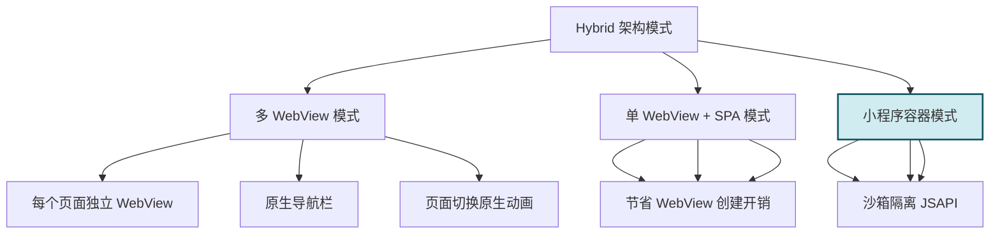
```mermaid
flowchart TB
    A[Hybrid 架构模式]

    A --> A1[多 WebView 模式]
    A --> A2[单 WebView + SPA 模式]
    A --> A3[小程序容器模式]

    A1 --> A1a[每个页面独立 WebView]
    A1 --> A1b[原生导航栏]
    A1 --> A1c[页面切换原生动画]

    A2 --> A2a[一个 WebView 跑整个 SPA]
    A2 --> A2a[路由由前端控制]
    A2 --> A2a[节省 WebView 创建开销]

    A3 --> A3a[双线程/多 WebView]
    A3 --> A3a[JSCore 独立逻辑层]
    A3 --> A3a[沙箱隔离 JSAPI]

    style A3 fill:#d1ecf1,stroke:#0c5460,stroke-width:2px
```

#### 选型决策

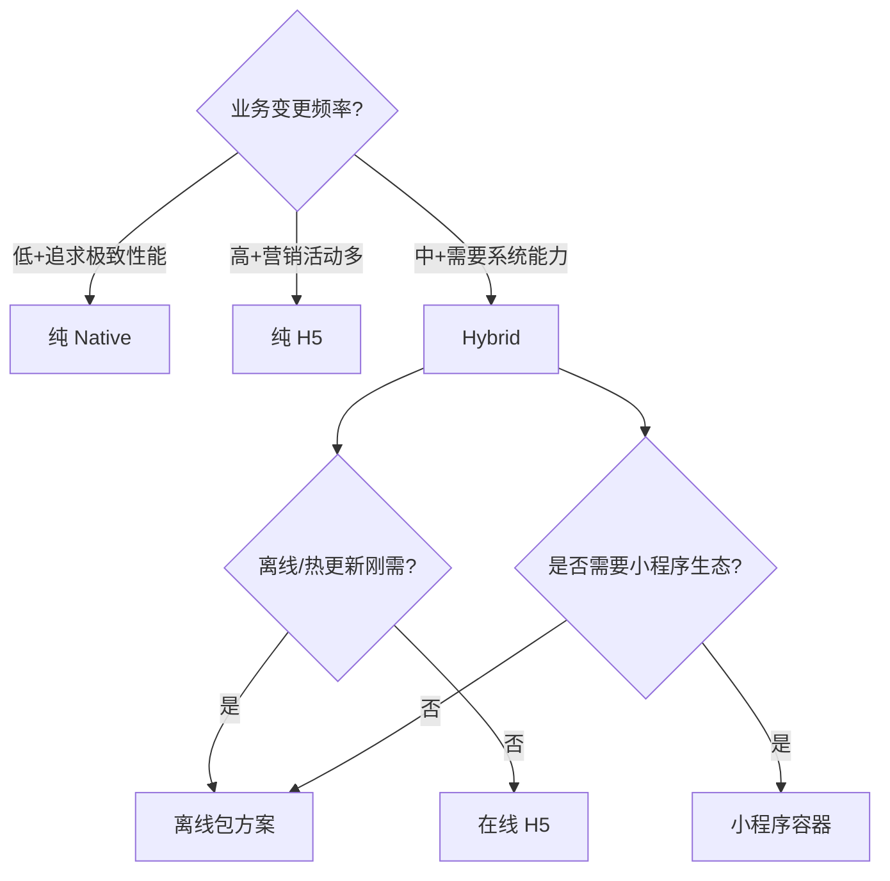
```mermaid
flowchart TD
    Q1{业务变更频率?}
    Q1 -->|低+追求极致性能| N[纯 Native]
    Q1 -->|高+营销活动多| H[纯 H5]
    Q1 -->|中+需要系统能力| X[Hybrid]

    X --> Q2{离线/热更新刚需?}
    Q2 -->|是| X1[离线包方案]
    Q2 -->|否| X2[在线 H5]

    X --> Q3{是否需要小程序生态?}
    Q3 -->|是| X3[小程序容器]
    Q3 -->|否| X1
```

---

### Q2. 主流 Hybrid 方案有哪些？

#### 方案全景图

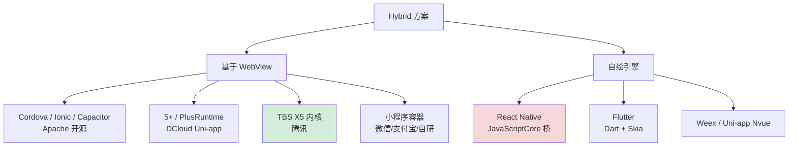
```mermaid
flowchart TB
    H[Hybrid 方案]

    H --> W[基于 WebView]
    H --> R[自绘引擎]

    W --> W1[Cordova / Ionic / Capacitor<br/>Apache 开源]
    W --> W2[5+ / PlusRuntime<br/>DCloud Uni-app]
    W --> W3[TBS X5 内核<br/>腾讯]
    W --> W4[小程序容器<br/>微信/支付宝/自研]

    R --> R1[React Native<br/>JavaScriptCore 桥]
    R --> R2[Flutter<br/>Dart + Skia]
    R --> R3[Weex / Uni-app Nvue]

    style W3 fill:#d4edda
    style R1 fill:#f8d7da
```

#### 方案对比

| 方案 | 内核 | 性能 | 更新方式 | 代表产品 |
|------|------|------|---------|---------|
| **Cordova** | 系统 WebView | 一般 | 应用商店更新 | PhoneGap |
| **Ionic** | 系统 WebView | 一般 | 商店/插件热更 | 内部工具应用 |
| **Capacitor** | 系统 WKWebView | 较好 | 商店更新 | 现代 Cordova 替代 |
| **Uni-app H5+** | 系统 WebView | 较好 | **热更新免审核** | 小程序+App 跨端 |
| **腾讯 X5** | X5 Blink 内核 | 好 | 内核共享动态更新 | 微信/QQ/企业微信 |
| **自研小程序容器** | 多 WebView + JSCore | 好 | 分包/整包热更 | 京东小程序/支付宝小程序 |
| **RN** | JSBridge + Native 组件 | 接近原生 | CodePush 热更新 | Airbnb/京东/美团 |
| **Flutter** | Skia 自绘 | 最高（接近原生） | 商店更新 | 闲鱼/闲鱼 |

#### 腾讯 X5 内核优势

1. **一致性**：所有 Android 设备统一 Blink 内核，无系统 WebView 碎片化问题（Android 4.x 到 14+ 表现一致）
2. **性能**：首屏优化、预加载、硬件加速、TBS 独有优化
3. **体积**：利用微信/手 Q 的 X5 内核，App 无需自带，或动态下载共享内核
4. **能力**：内置视频解码、文件预览、PDF、Canvas 加速

---

### Q3. WebView 是什么？Android/iOS 的 WebView 差异？

#### 核心定义

WebView 是 Native 端嵌入的**浏览器控件**，本质是浏览器内核（Blink/WebKit）的 SDK 封装，可加载 HTML/CSS/JS 并提供 JS 交互接口。

#### Android WebView 演进

| 系统版本 | WebView 实现 | 说明 |
|---------|-------------|------|
| Android 4.3 及以下 | 内置 WebKit | 版本碎片化严重，标准支持差 |
| Android 4.4 - 4.4.3 | Chromium（30） | 首次切换到 Blink |
| Android 5.0 - 6.0 | **独立 APK（可更新）** | Google Play 商店更新 WebView |
| Android 7.0+ | Chrome APK 内置 | 与 Chrome 同版本，自动更新 |
| 开发者可选 | **TBS X5 内核** | 全版本统一，规避碎片化 |

#### iOS WebView 演进

| 类名 | 系统版本 | JS 引擎 | 说明 |
|------|---------|---------|------|
| UIWebView | iOS 2 - 12（废弃） | JavaScriptCore | 内存大、速度慢、iOS 12 后废弃 |
| **WKWebView** | iOS 8+ | WK JSCore（独立进程） | **目前唯一推荐** |

#### Android WebView vs iOS WKWebView 核心差异

| 维度 | Android WebView | iOS WKWebView |
|------|----------------|---------------|
| 进程模型 | 与主进程同进程 | **独立 Nitro 进程**（崩溃不影响 App） |
| JS 引擎 | V8（内置） | JSCore（独立进程，JIT 开启） |
| Cookie | CookieManager | **WKHTTPCookieStore**（iOS 11+） |
| 本地存储 | WebStorage | 独立，与 Safari 隔离 |
| 硬件加速 | 默认开启 | 默认开启，但部分 CSS 需手动开启 |
| JS 注入 | addJavascriptInterface、evaluateJavascript | **WKScriptMessageHandler**、evaluateJavaScript |
| 资源拦截 | shouldInterceptRequest（主线程） | **WKURLSchemeHandler**（iOS 11+） |
| 销毁 | WebView.destroy() | WKWebView = nil（注意循环引用） |
| 白屏/崩溃 | 主进程挂 | **独立进程，App 不崩** |
| 跨域 | 默认宽松 | 默认严格（需 fileURL 配置） |

#### 项目实战踩坑

> **问题**：H5 在 iOS 12 WKWebView 中能正常跑，但在部分 Android 低版本机型中 Flex 布局错乱、CSS 变量不生效。
>
> **根因**：Android 4.x 系统 WebView 版本过低。
>
> **解决**：集成腾讯 X5 内核，统一 Blink 版本。

---

### Q4. Hybrid 通信的三种方式与适用场景？

#### 通信全景图

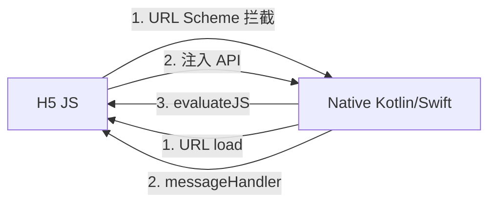
```mermaid
flowchart LR
    JS[H5 JS]
    Native[Native Kotlin/Swift]

    JS -->|1. URL Scheme 拦截| Native
    JS -->|2. 注入 API| Native
    Native -->|3. evaluateJS| JS

    Native -->|1. URL load| JS
    Native -->|2. messageHandler| JS
```

#### 三种方式详解

**方式1：URL Scheme 拦截（通用、最兼容）**

```
JS 发起 → window.location.href = 'jsbridge://getDeviceInfo?cb=123'
Native 拦截 → WebView.shouldOverrideUrlLoading / WKNavigationDelegate
Native 解析 URL → 执行对应方法 → evaluateJS 回调
```

**方式2：Native 注入 JS 对象（Android 方便，iOS WKWebView 用 messageHandler）**

```java
// Android：addJavascriptInterface
webView.addJavascriptInterface(new NativeBridge(), "NativeBridge");

class NativeBridge {
  @JavascriptInterface
  public String getDeviceInfo() { /* ... */ }
}

// JS 端直接调用
window.NativeBridge.getDeviceInfo();
```

```swift
// iOS WKWebView：WKScriptMessageHandler
let userContent = WKUserContentController()
userContent.add(self, name: "nativeBridge")

// JS 端调用
window.webkit.messageHandlers.nativeBridge.postMessage({
  action: 'getDeviceInfo',
  data: {},
  callbackId: 123
})
```

**方式3：Native 调用 JS（回调结果）**

```java
// Android
webView.evaluateJavascript("window.__callbacks[123](" + result + ")", null);

// iOS
webView.evaluateJavaScript("window.__callbacks[123]('\(result)')")
```

#### 适用场景对比

| 方式 | Android | iOS WKWebView | 兼容性 | 性能 | 适用场景 |
|------|---------|---------------|-------|------|---------|
| URL Scheme 拦截 | ✅ | ✅ | 最好 | 差（URL 长度限制） | 通用兜底 / 老版本兼容 |
| 注入 JS 对象 | ✅ | ✅（messageHandler） | 较好 | 好 | 日常调用 |
| evaluateJavaScript | ✅ | ✅ | 好 | 好 | Native 回调 / 主动推送 |

#### 行业标准做法

实际项目中通常采用 **注入 + URL 兜底** 的组合策略：

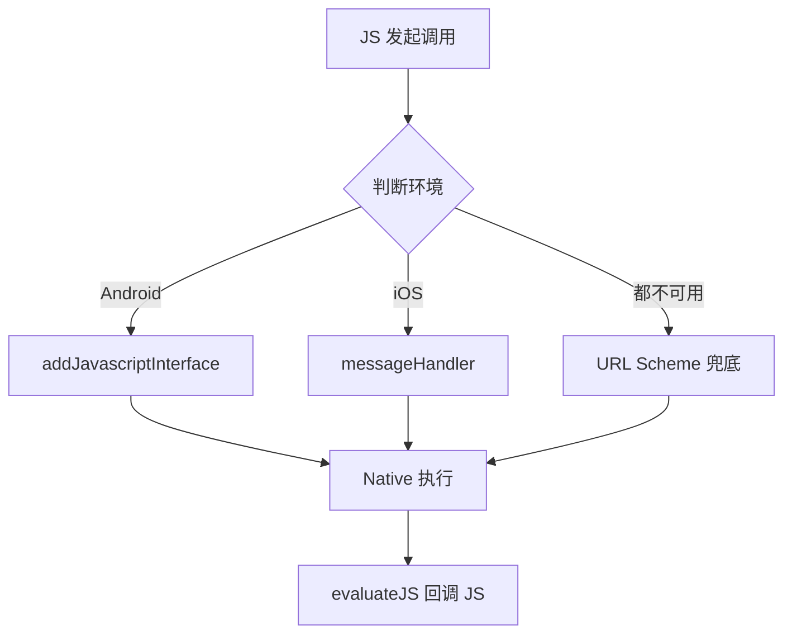
```mermaid
flowchart TD
    JS[JS 发起调用]
    JS --> A{判断环境}
    A -->|Android| B[addJavascriptInterface]
    A -->|iOS| C[messageHandler]
    A -->|都不可用| D[URL Scheme 兜底]
    B --> E[Native 执行]
    C --> E
    D --> E
    E --> F[evaluateJS 回调 JS]
```

---

### Q5. 什么是离线包/热更新？原理与优缺点？

#### 核心定义

- **离线包**：将 H5 资源（HTML/CSS/JS/图片）打包成 zip，App 启动/后台从服务端拉取到本地，WebView 加载本地资源，不走网络。
- **热更新**：不通过应用商店审核，直接下发新版本的离线包覆盖旧包，用户无感升级。

#### 下发流程图

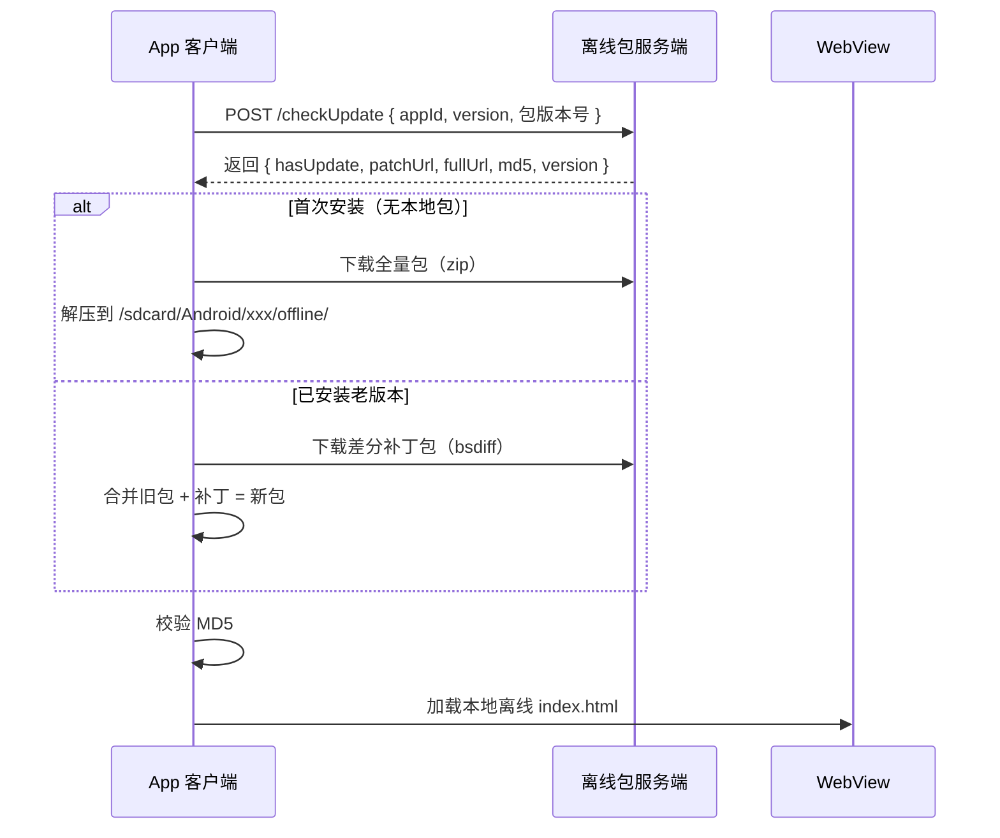
```mermaid
sequenceDiagram
    participant C as App 客户端
    participant S as 离线包服务端
    participant W as WebView

    C->>S: POST /checkUpdate { appId, version, 包版本号 }
    S-->>C: 返回 { hasUpdate, patchUrl, fullUrl, md5, version }

    alt 首次安装（无本地包）
        C->>S: 下载全量包（zip）
        C->>C: 解压到 /sdcard/Android/xxx/offline/
    else 已安装老版本
        C->>S: 下载差分补丁包（bsdiff）
        C->>C: 合并旧包 + 补丁 = 新包
    end

    C->>C: 校验 MD5
    C->>W: 加载本地离线 index.html
```

#### 优点

| 优点 | 说明 |
|------|------|
| **首屏秒开** | 本地加载，无网络延迟 |
| **免审核发布** | 业务更新无需走应用商店审核 |
| **弱网可用** | 断网也能访问页面（本地资源） |
| **省流量** | 仅差分补丁，几十 KB 量级 |
| **体验接近原生** | 加载动画、资源无需等待 |

#### 缺点

| 缺点 | 说明 |
|------|------|
| **包体增加** | 壳 App 需带首次安装包 |
| **更新复杂度** | 版本回滚、灰度、多版本并发 |
| **iOS 政策风险** | 苹果对热更新政策偏严，纯资源更新允许，含 JS 逻辑需谨慎 |
| **安全风险** | 资源被替换的风险（需签名校验） |
| **版本兼容** | 后端 API 需兼容新旧多版本 H5 包 |

#### Android 资源拦截实现

```java
// WebViewClient.shouldInterceptRequest
@Override
public WebResourceResponse shouldInterceptRequest(WebView view, WebResourceRequest request) {
    String url = request.getUrl().toString();

    // 匹配离线规则：https://hybrid.local/xxx → 本地路径
    if (url.contains("hybrid.local")) {
        String localPath = convertToLocalPath(url);
        File file = new File(localPath);
        if (file.exists()) {
            try {
                InputStream is = new FileInputStream(file);
                String mimeType = getMimeType(url);
                return new WebResourceResponse(mimeType, "UTF-8", is);
            } catch (Exception e) {
                e.printStackTrace();
            }
        }
    }

    // 不拦截，走网络
    return super.shouldInterceptRequest(view, request);
}
```

#### iOS 资源拦截（WKURLSchemeHandler）

```swift
// 注册自定义 scheme
let config = WKWebViewConfiguration()
config.setURLSchemeHandler(OfflineSchemeHandler(), forURLScheme: "hybrid")

class OfflineSchemeHandler: NSObject, WKURLSchemeHandler {
    func webView(_ webView: WKWebView, start urlSchemeTask: WKURLSchemeTask) {
        guard let url = urlSchemeTask.request.url else { return }

        // hybrid://module/index.html → 本地文件
        let localPath = convertToLocalPath(url)
        if let data = FileManager.default.contents(atPath: localPath) {
            let response = URLResponse(
                url: url,
                mimeType: getMimeType(url),
                expectedContentLength: data.count,
                textEncodingName: "utf-8"
            )
            urlSchemeTask.didReceive(response)
            urlSchemeTask.didReceive(data)
            urlSchemeTask.didFinish()
        }
    }
}
```

---

## 二、JSBridge 通信原理

### Q6. JSBridge 的核心原理是什么？

#### 架构图

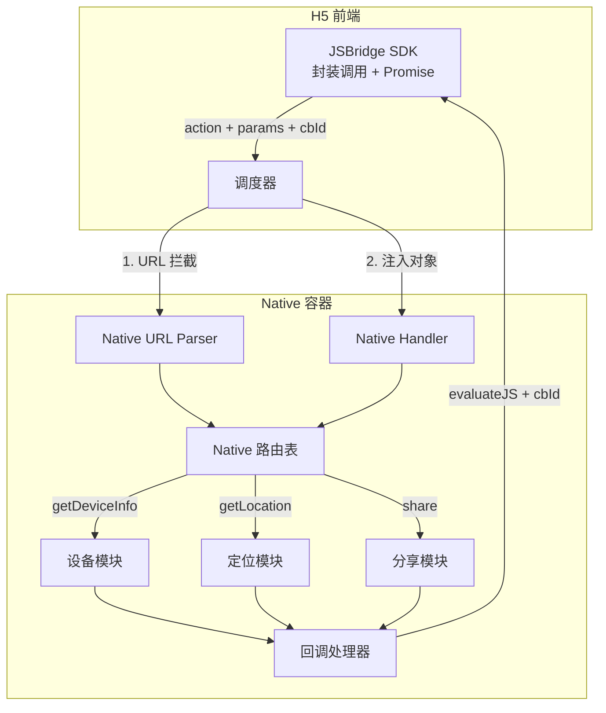
```mermaid
flowchart TB
    subgraph H5 前端
        JSSDK[JSBridge SDK<br/>封装调用 + Promise]
        JSSDK -->|action + params + cbId| Dispatch[调度器]
    end

    Dispatch -->|1. URL 拦截| N1[Native URL Parser]
    Dispatch -->|2. 注入对象| N2[Native Handler]

    subgraph Native 容器
        N1 --> Router[Native 路由表]
        N2 --> Router
        Router -->|getDeviceInfo| M1[设备模块]
        Router -->|getLocation| M2[定位模块]
        Router -->|share| M3[分享模块]
        M1 --> Callback[回调处理器]
        M2 --> Callback
        M3 --> Callback
    end

    Callback -->|evaluateJS + cbId| JSSDK
```

#### 核心四要素

| 要素 | 作用 |
|------|------|
| **协议定义** | 约定通信格式（action / data / callbackId） |
| **调度器** | 负责发送请求、管理回调 ID、超时处理 |
| **路由表** | Native 端维护 action → 模块方法的映射 |
| **回调机制** | 通过 callbackId 关联请求与响应，封装为 Promise |

#### 协议格式

```json
// JS → Native
{
  "action": "getLocation",
  "data": { "type": "gcj02", "timeout": 5000 },
  "callbackId": "cb_1680000000_123"
}

// Native → JS 回调
{
  "code": 0,
  "message": "success",
  "data": { "latitude": 39.9, "longitude": 116.3 },
  "callbackId": "cb_1680000000_123"
}
```

#### JS 端封装（Promise 化）

```javascript
// bridge.js
class JSBridge {
  constructor() {
    this.callbacks = new Map();   // callbackId → { resolve, reject, timer }
    this.seq = 0;                  // 自增 ID
    this.initGlobalCallback();
  }

  // 生成唯一 callbackId
  genCallbackId() {
    return `cb_${Date.now()}_${++this.seq}`;
  }

  // JS 调用 Native
  call(action, data = {}, timeout = 10000) {
    return new Promise((resolve, reject) => {
      const callbackId = this.genCallbackId();

      // 注册回调 + 超时
      const timer = setTimeout(() => {
        this.callbacks.delete(callbackId);
        reject(new Error(`调用超时: ${action}`));
      }, timeout);

      this.callbacks.set(callbackId, { resolve, reject, timer });

      // 组装协议
      const payload = { action, data, callbackId };

      // 根据环境选择通道
      if (window.NativeBridge) {
        // Android addJavascriptInterface
        window.NativeBridge.invoke(JSON.stringify(payload));
      } else if (window.webkit?.messageHandlers?.nativeBridge) {
        // iOS WKWebView messageHandler
        window.webkit.messageHandlers.nativeBridge.postMessage(payload);
      } else {
        // URL Scheme 兜底
        const encoded = encodeURIComponent(JSON.stringify(payload));
        const iframe = document.createElement('iframe');
        iframe.style.display = 'none';
        iframe.src = `jsbridge://native/invoke?payload=${encoded}`;
        document.body.appendChild(iframe);
        setTimeout(() => iframe.remove(), 1000);
      }
    });
  }

  // Native 回调 JS 的入口
  initGlobalCallback() {
    window.__JSBridgeCallback__ = (resultStr) => {
      const result = typeof resultStr === 'string' ? JSON.parse(resultStr) : resultStr;
      const { callbackId, code, message, data } = result;

      const cb = this.callbacks.get(callbackId);
      if (!cb) return;

      clearTimeout(cb.timer);
      this.callbacks.delete(callbackId);

      if (code === 0) cb.resolve(data);
      else cb.reject(new Error(message || `错误码: ${code}`));
    };
  }
}

// 单例导出
export const bridge = new JSBridge();

// 业务方使用
async function getLocation() {
  try {
    const pos = await bridge.call('getLocation', { type: 'gcj02' });
    console.log('定位:', pos.latitude, pos.longitude);
  } catch (e) {
    console.error(e);
  }
}
```

#### Android 端实现

```java
// Android Kotlin
class NativeBridge(private val context: Context, private val webView: WebView) {

    // 路由表：action → 处理器
    private val handlers = mapOf(
        "getDeviceInfo" to { data: JSONObject -> getDeviceInfo() },
        "getLocation"   to { data -> getLocation() },
        "share"         to { data -> share(data) }
    )

    // JS 通过注入对象调用（@JavascriptInterface）
    @JavascriptInterface
    fun invoke(payload: String) {
        try {
            val json = JSONObject(payload)
            val action = json.getString("action")
            val callbackId = json.getString("callbackId")
            val data = json.optJSONObject("data") ?: JSONObject()

            val handler = handlers[action]
            if (handler == null) {
                callbackError(callbackId, -1, "未知 action: $action")
                return
            }

            val result = handler(data)
            callbackSuccess(callbackId, result)
        } catch (e: Exception) {
            e.printStackTrace()
        }
    }

    private fun callbackSuccess(callbackId: String, data: Any?) {
        val result = JSONObject()
        result.put("code", 0)
        result.put("message", "success")
        result.put("data", JSONObject(Gson().toJson(data)))
        result.put("callbackId", callbackId)

        webView.post {
            webView.evaluateJavascript(
                "window.__JSBridgeCallback__('${result.toString()}')", null
            )
        }
    }

    private fun callbackError(callbackId: String, code: Int, msg: String) { /* 类似 */ }
}
```

#### iOS 端实现

```swift
// iOS Swift WKScriptMessageHandler
extension ViewController: WKScriptMessageHandler {
    func userContentController(_ userContentController: WKUserContentController,
                                didReceive message: WKScriptMessage) {
        guard message.name == "nativeBridge",
              let body = message.body as? [String: Any],
              let action = body["action"] as? String,
              let callbackId = body["callbackId"] as? String else { return }

        switch action {
        case "getDeviceInfo":
            let info = getDeviceInfo()
            callback(callbackId, code: 0, data: info)
        case "getLocation":
            getLocation { [weak self] location in
                self?.callback(callbackId, code: 0, data: location)
            }
        default:
            callback(callbackId, code: -1, error: "未知 action")
        }
    }

    private func callback(_ callbackId: String, code: Int, data: Any? = nil, error: String? = nil) {
        var result: [String: Any] = [
            "code": code,
            "callbackId": callbackId
        ]
        if let data = data { result["data"] = data }
        if let error = error { result["message"] = error }

        let jsonData = try! JSONSerialization.data(withJSONObject: result)
        let jsonStr = String(data: jsonData, encoding: .utf8)!

        webView.evaluateJavaScript("window.__JSBridgeCallback__('\(jsonStr)')")
    }
}
```

---

### Q7. Android WebView 的三种 JS 注入方式？

| 方式 | 版本要求 | 原理 | 优缺点 |
|------|---------|------|-------|
| **addJavascriptInterface** | Android 4.2+（加 @JavascriptInterface） | Native 对象注入 JS 上下文 | 直接、简单；4.2 之前有远程代码执行漏洞 |
| **shouldOverrideUrlLoading** | 全版本 | 拦截 URL Scheme | 兼容性最好；**性能差**，URL 有长度限制，异步 |
| **evaluateJavascript** | Android 4.4+ | 执行 JS 片段并获取返回值 | Native 调用 JS 专用；效率高 |

#### addJavascriptInterface 用法

```java
// Kotlin
class NativeInterface {
    @JavascriptInterface
    fun getAppInfo(): String {
        val info = JSONObject()
        info.put("appName", "MyApp")
        info.put("version", BuildConfig.VERSION_NAME)
        return info.toString()
    }
}

// 注入
webView.addJavascriptInterface(NativeInterface(), "AndroidBridge")
webView.settings.javaScriptEnabled = true
```

```javascript
// JS 端
const info = JSON.parse(window.AndroidBridge.getAppInfo());
```

#### URL 拦截用法

```java
// 拦截 jsbridge:// 协议
override fun shouldOverrideUrlLoading(view: WebView, request: WebResourceRequest): Boolean {
    val url = request.url.toString()
    if (url.startsWith("jsbridge://")) {
        val uri = Uri.parse(url)
        val action = uri.host   // e.g. jsbridge://getDeviceInfo
        val params = uri.getQueryParameter("data")
        // 处理并回调
        return true // 拦截，WebView 不再加载
    }
    return super.shouldOverrideUrlLoading(view, request)
}
```

```javascript
// JS 端发起（iframe 方案，不影响当前页面跳转）
function bridgeCall(action, params) {
  const iframe = document.createElement('iframe');
  iframe.style.display = 'none';
  iframe.src = `jsbridge://${action}?data=${encodeURIComponent(JSON.stringify(params))}`;
  document.body.appendChild(iframe);
  setTimeout(() => iframe.remove(), 100);
}
```

#### 漏洞：addJavascriptInterface Android < 4.2

Android 4.2 之前的 `addJavascriptInterface` 存在严重漏洞：JS 可以通过**反射**拿到注入对象的所有 `public` 方法（包括 `getClass()`），进而执行任意 Java 代码。

```javascript
// 攻击示例（旧版本漏洞）
function exploit() {
  for (const key in window.AndroidBridge) {
    // 通过 getClass() 拿到 ClassLoader，加载恶意类
  }
}
```

**解决办法**：
1. 升级 TargetSDK 到 17+ 且使用 `@JavascriptInterface` 注解（只暴露加了注解的方法）
2. 或改用 URL 拦截方式

---

### Q8. iOS WKWebView 的 messageHandler 与 JavaScriptCore？

#### WKScriptMessageHandler（推荐）

```swift
// 注册 handler
let config = WKWebViewConfiguration()
config.userContentController.add(self, name: "nativeAPI")

class VC: UIViewController, WKScriptMessageHandler {
    func userContentController(_ userContentController: WKUserContentController,
                                didReceive message: WKScriptMessage) {
        guard message.name == "nativeAPI",
              let body = message.body as? [String: Any] else { return }

        let action = body["action"] as! String
        // 路由分发...
    }
}
```

```javascript
// JS 端
window.webkit.messageHandlers.nativeAPI.postMessage({
  action: 'getLocation',
  data: {}
});
```

#### JavaScriptCore（废弃/不推荐）

```swift
// 旧 UIWebView / 后台 JSCore 方式
// iOS 7+ 引入，现在主要用于非 WebView 的 JS 运行时
let context = JSContext()!
context.setObject(deviceInfo, forKeyedSubscript: "DeviceInfo" as NSString)
let result = context.evaluateScript("DeviceInfo.getDeviceId()")
```

**注意**：WKWebView 的 JS 运行在独立 Nitro 进程，不直接暴露 JSContext 对象，**只能通过 messageHandler 通信**。

#### WKWebView 双向通信要点

```
JS → Native： messageHandler.postMessage （单向，无返回值）
                → 需要 Native 回调 evaluateJavaScript 实现响应

Native → JS： evaluateJavaScript(script, completionHandler) （有返回值）
```

#### 项目实战：iOS WKWebView 同步返回

```
messageHandler.postMessage 是单向的，JS 无法同步拿到返回值。
```

解决方案：**异步 + callbackId**（前面 [Q6](#q6-jsbridge-的核心原理是什么) 的 Promise 封装模式），业务全部异步处理。

---

### Q9. URL Scheme 拦截实现 JSBridge 的原理？

#### 为什么需要 URL 拦截兜底？

1. **兼容性**：部分老版本或定制系统注入对象不可用
2. **协议统一**：跨端（Android/iOS/小程序）可以用同一套协议
3. **iOS 旧版本**：UIWebView 时代注入不安全

#### 拦截流程

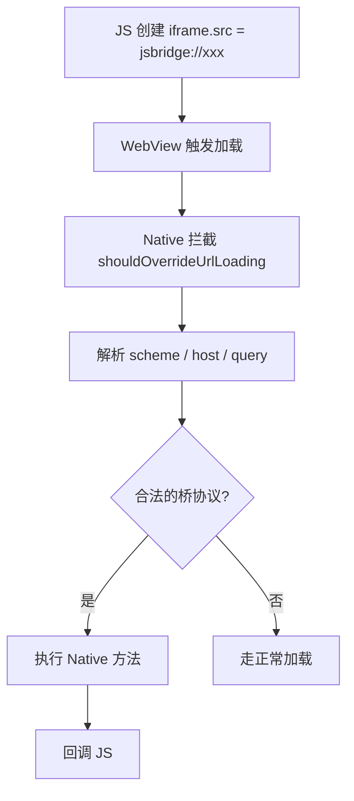
```mermaid
flowchart TD
    JS[JS 创建 iframe.src = jsbridge://xxx]
    JS --> W[WebView 触发加载]
    W --> N[Native 拦截 shouldOverrideUrlLoading]
    N --> P[解析 scheme / host / query]
    P --> E{合法的桥协议?}
    E -->|是| A[执行 Native 方法]
    A --> CB[回调 JS]
    E -->|否| L[走正常加载]
```

#### 为什么用 iframe 而不是 location.href？

```javascript
// ❌ 错误：location.href 会触发页面跳转，连续调用会丢失
window.location.href = 'jsbridge://action1';
window.location.href = 'jsbridge://action2';  // 可能覆盖 action1

// ✅ 正确：每个调用创建独立 iframe
function call(action, data) {
  const iframe = document.createElement('iframe');
  iframe.style.display = 'none';
  iframe.src = `jsbridge://${action}?data=${encodeURIComponent(JSON.stringify(data))}`;
  document.body.appendChild(iframe);
  setTimeout(() => document.body.removeChild(iframe), 0);
}
```

#### URL 长度限制问题

iOS WKWebView 的 URL 最长 **2GB**（几乎无限制），但 Android 部分 ROM 有限制，约 8KB。大数据需**分块传输**或走 `prompt()` 兜底。

#### prompt() 终极兜底

```javascript
// 极端情况：拦截失败，使用 window.prompt
// Native 拦截 onJsPrompt
const result = window.prompt(`jsbridge:${action}`, JSON.stringify(data));
```

#### 完整降级顺序

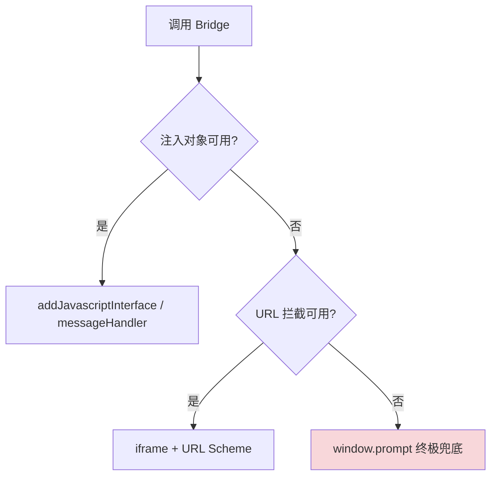
```mermaid
flowchart TD
    A[调用 Bridge]
    A --> B{注入对象可用?}
    B -->|是| C[addJavascriptInterface / messageHandler]
    B -->|否| D{URL 拦截可用?}

    D -->|是| E[iframe + URL Scheme]
    D -->|否| F[window.prompt 终极兜底]

    style F fill:#f8d7da
```

---

### Q10. JSBridge 的回调机制与 Promise 封装？

#### 回调 ID 机制

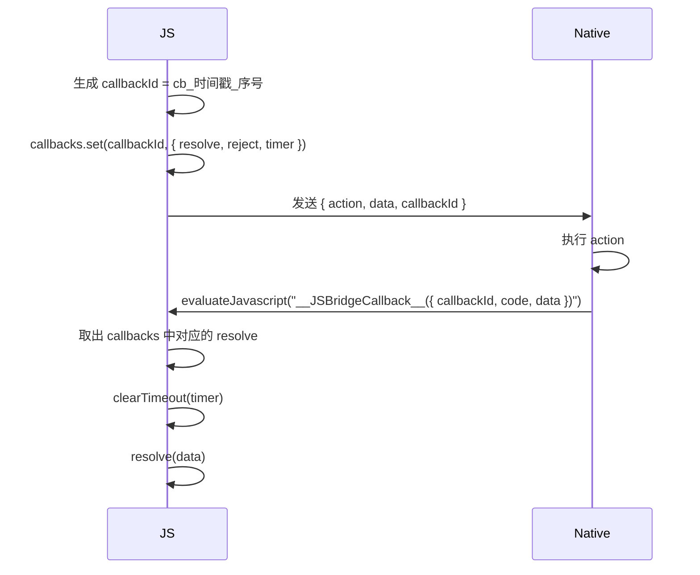
```mermaid
sequenceDiagram
    participant JS
    participant Native

    JS->>JS: 生成 callbackId = cb_时间戳_序号
    JS->>JS: callbacks.set(callbackId, { resolve, reject, timer })
    JS->>Native: 发送 { action, data, callbackId }
    Native->>Native: 执行 action
    Native->>JS: evaluateJavascript("__JSBridgeCallback__({ callbackId, code, data })")
    JS->>JS: 取出 callbacks 中对应的 resolve
    JS->>JS: clearTimeout(timer)
    JS->>JS: resolve(data)
```

#### 完整封装代码

```javascript
// bridge.js 完整版
const PREFIX = 'jsbridge://';
const TIMEOUT = 10000;

class Bridge {
  constructor() {
    this.seq = 0;
    this.callbacks = new Map();
    this.setupGlobalCallback();
    this.isAndroid = /Android/.test(navigator.userAgent);
    this.isiOS = /iPhone|iPad|iPod/.test(navigator.userAgent);
  }

  setupGlobalCallback() {
    window.__JSBridgeCallback__ = (jsonStr) => {
      let result;
      try {
        result = typeof jsonStr === 'string' ? JSON.parse(jsonStr) : jsonStr;
      } catch(e) { return; }

      const { callbackId, code, message, data } = result;
      const cb = this.callbacks.get(callbackId);
      if (!cb) return;

      clearTimeout(cb.timer);
      this.callbacks.delete(callbackId);

      if (code === 0) cb.resolve(data);
      else cb.reject(new Error(message || `Error code: ${code}`));
    };
  }

  call(action, data = {}) {
    return new Promise((resolve, reject) => {
      const callbackId = `cb_${Date.now()}_${++this.seq}`;

      const timer = setTimeout(() => {
        this.callbacks.delete(callbackId);
        reject(new Error(`Bridge timeout: ${action}`));
      }, TIMEOUT);

      this.callbacks.set(callbackId, { resolve, reject, timer });

      const payload = JSON.stringify({ action, data, callbackId });

      // 通道选择
      if (this.isAndroid && window.AndroidBridge?.invoke) {
        window.AndroidBridge.invoke(payload);
      } else if (this.isiOS && window.webkit?.messageHandlers?.nativeBridge) {
        window.webkit.messageHandlers.nativeBridge.postMessage(payload);
      } else {
        this.sendIframe(payload);
      }
    });
  }

  sendIframe(payload) {
    const iframe = document.createElement('iframe');
    iframe.style.display = 'none';
    iframe.src = `jsbridge://invoke?payload=${encodeURIComponent(payload)}`;
    document.documentElement.appendChild(iframe);
    setTimeout(() => document.documentElement.removeChild(iframe), 0);
  }
}

export const bridge = new Bridge();
```

#### 使用示例

```javascript
// 业务代码
async function takePhoto() {
  try {
    const photo = await bridge.call('takePhoto', {
      sourceType: ['album', 'camera'],
      quality: 80
    });
    // { path: 'file://xxx.jpg', size: 123456 }
    previewImage(photo.path);
  } catch (e) {
    if (e.message.includes('timeout')) {
      showToast('调用超时，请重试');
    } else {
      showToast(e.message);
    }
  }
}
```

---

### Q11. JSBridge 安全加固（签名、白名单、防劫持）？

#### 攻击面

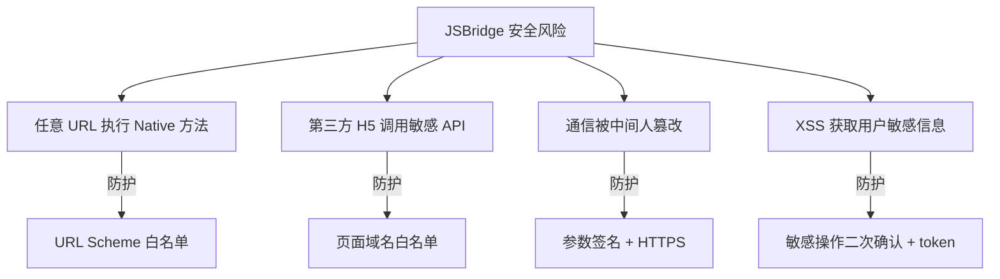
```mermaid
flowchart TB
    S[JSBridge 安全风险]

    S --> R1[任意 URL 执行 Native 方法]
    S --> R2[第三方 H5 调用敏感 API]
    S --> R3[通信被中间人篡改]
    S --> R4[XSS 获取用户敏感信息]

    R1 -->|防护| F1[URL Scheme 白名单]
    R2 -->|防护| F2[页面域名白名单]
    R3 -->|防护| F3[参数签名 + HTTPS]
    R4 -->|防护| F4[敏感操作二次确认 + token]
```

#### 1. 页面域名白名单

```java
// Android 每次拦截时校验 URL Origin
private val TRUSTED_HOSTS = setOf(
    "hybrid.example.com", "h5.example.com"
)

override fun shouldOverrideUrlLoading(
    view: WebView, request: WebResourceRequest
): Boolean {
    // 检查当前页面 host 是否在白名单
    val pageHost = view.url?.let { Uri.parse(it).host }
    if (pageHost !in TRUSTED_HOSTS) {
        return false // 非可信 H5 页面，不提供桥
    }
    // 处理桥调用...
}
```

```swift
// iOS WKWebView 白名单
let TRUSTED_HOSTS: Set<String> = ["hybrid.example.com"]

func webView(_ webView: WKWebView, decidePolicyFor nav: WKNavigationAction,
             decisionHandler: @escaping (WKNavigationActionPolicy) -> Void) {
    if let host = nav.request.url?.host,
       TRUSTED_HOSTS.contains(host) {
        decisionHandler(.allow)
    } else {
        decisionHandler(.cancel)
    }
}
```

#### 2. 调用签名（防篡改）

```javascript
// 每次调用带上签名，Native 端校验
function signParams(action, data, timestamp) {
  const token = localStorage.getItem('app_token'); // 登录态 token
  const raw = `${action}|${JSON.stringify(data)}|${timestamp}|${token}`;
  return sha256(raw);
}

async function bridgeCallSafe(action, data = {}) {
  const ts = Date.now();
  const sign = signParams(action, data, ts);
  return bridge.call(action, {
    ...data,
    __sign: sign,
    __ts: ts
  });
}
```

```java
// Native 端校验签名
private boolean verifySign(String action, JSONObject data, String sign, long ts) {
    // 1. 防重放：5 分钟内时间窗口
    if (System.currentTimeMillis() / 1000 - ts > 300) return false;

    // 2. 从登录态拿 token
    String token = getTokenBySession(data.optString("__sid"));
    String raw = action + "|" + data.toString() + "|" + ts + "|" + token;
    String computed = sha256(raw);

    return computed.equals(sign);
}
```

#### 3. 敏感方法权限分级

```
等级 0（公开）：getDeviceInfo、getSystemVersion、openUrl
等级 1（需登录）：getUserInfo、getToken、share
等级 2（敏感，需弹窗确认）：takePhoto、openAlbum、getContacts、getLocation
等级 3（极高风险，禁用）：sendSms、拨打电话、启动第三方 App（需限制包名）
```

#### 4. 防 XSS 注入

- H5 使用严格 CSP：`default-src 'self'; script-src 'self' 'unsafe-inline'`
- WebView 禁用 `setAllowFileAccess`（防止 file:// 协议读本地）
- 敏感方法（剪贴板、通讯录）返回前**用户弹窗二次确认**

---

## 三、WebView 渲染与性能优化

### Q12. WebView 启动流程与优化手段？

#### WebView 启动耗时分解

```
App 启动
  ↓
0. 冷启动创建 WebView 耗时：150ms~600ms（取决于机型）
  ↓
1. loadUrl → 建立 DNS → TCP → TLS：300ms+
  ↓
2. 接收 HTML → 解析 DOM：100ms
  ↓
3. 下载 CSS / JS → 解析执行：200ms~2s
  ↓
4. 首屏渲染 → 用户可见
```

#### 优化方案一览

| 优化点 | 手段 | 预期收益 |
|--------|------|---------|
| **WebView 预创建** | 全局池中预热 1~2 个 WebView 实例 | -300ms~500ms |
| **DNS 预解析** | App 启动即对 H5 域名 DNS 预热 | -100ms |
| **TCP/TLS 预连接** | 提前建立 H5 服务器 TCP 连接 | -200ms |
| **资源离线化** | 本地加载 HTML/JS/CSS（离线包） | 网络耗时清零 |
| **预加载骨架屏** | WebView 前占位原生骨架屏 → 渲染后移除 | 感知 -500ms |
| **预渲染** | 提前 `loadUrl` 但不显示，点击后秒开 | 首屏 < 100ms |
| **启用硬件加速** | `webView.setLayerType(View.LAYER_TYPE_HARDWARE, null)` | 滚动/动画流畅 |
| **开启离屏缓存** | `settings.setAppCacheEnabled(true)` | 二次访问加速 |

#### WebView 预创建池

```java
// Android Kotlin：全局预创建
object WebViewPool {
    private val pool = LinkedBlockingQueue<WebView>(2)

    fun preCreate(context: Context) {
        repeat(2) {
            val appContext = context.applicationContext
            val webView = WebView(appContext)
            initSettings(webView.settings)
            pool.offer(webView)
        }
    }

    fun acquire(): WebView {
        return pool.poll() ?: WebView(App.instance)
    }

    fun release(webView: WebView) {
        webView.stopLoading()
        webView.loadUrl("about:blank")
        pool.offer(webView)
    }
}
```

#### iOS 预创建 WKWebView

```swift
class WebViewPool {
    static let shared = WebViewPool()
    private var pool: [WKWebView] = []

    func preCreate() {
        for _ in 0..<2 {
            let config = WKWebViewConfiguration()
            // 提前配置 settings、cookie、messageHandler
            let webView = WKWebView(frame: .zero, configuration: config)
            pool.append(webView)
        }
    }

    func acquire() -> WKWebView {
        if pool.isEmpty { preCreate() }
        return pool.removeFirst()
    }
}
```

#### 预加载（热启动）

```java
// 1. App 启动后预加载 H5 首页
webViewPool.forEach { webView ->
    webView.loadUrl("https://hybrid.example.com/home.html")
}

// 2. 用户点击"首页"Tab 时，直接从 pool 取出展示已加载的 WebView
```

---

### Q13. 白屏与加载慢的排查思路？

#### 排查流程

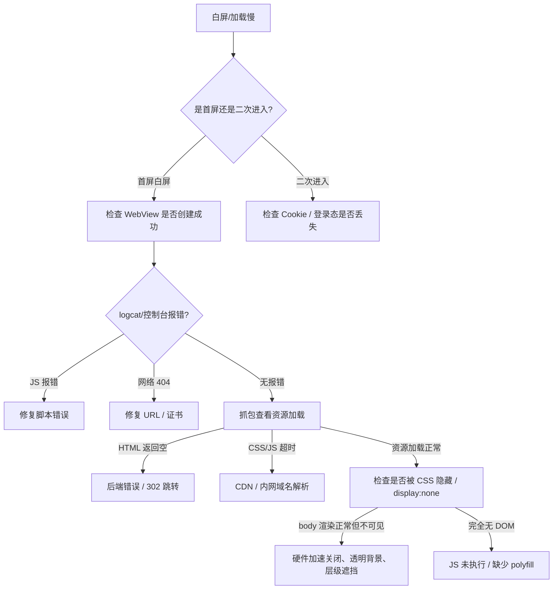
```mermaid
flowchart TD
    S[白屏/加载慢]
    S --> A{是首屏还是二次进入?}

    A -->|首屏白屏| B[检查 WebView 是否创建成功]
    A -->|二次进入| C[检查 Cookie / 登录态是否丢失]

    B --> B1{logcat/控制台报错?}
    B1 -->|JS 报错| B1a[修复脚本错误]
    B1 -->|网络 404| B1b[修复 URL / 证书]
    B1 -->|无报错| B2[抓包查看资源加载]

    B2 -->|HTML 返回空| B2a[后端错误 / 302 跳转]
    B2 -->|CSS/JS 超时| B2b[CDN / 内网域名解析]
    B2 -->|资源加载正常| B3[检查是否被 CSS 隐藏 / display:none]

    B3 -->|body 渲染正常但不可见| B3a[硬件加速关闭、透明背景、层级遮挡]
    B3 -->|完全无 DOM| B3b[JS 未执行 / 缺少 polyfill]
```

#### 常见根因 Top5

| 排名 | 现象 | 根因 | 解决 |
|------|------|------|------|
| 1 | 某 Android 机型白屏，其它正常 | 关闭了硬件加速 | `setLayerType(View.LAYER_TYPE_HARDWARE, null)` |
| 2 | 所有 HTTPS 页面白屏 | SSL 证书验证失败（自签名证书） | 忽略证书（debug）或部署正规证书 |
| 3 | iOS 正常 Android 白屏 | CSS `backdrop-filter` 低版本不支持 + JS 抛错 | 加 polyfill / try-catch |
| 4 | 首次白屏，退出再进正常 | Cookie 丢失导致后端 302 到登录 | 提前同步 Cookie 到 WebView |
| 5 | 首屏慢 3s+ | 无离线包，首屏资源走网络 | 接入离线包 / 预加载 |

#### 抓包工具（移动端调试必备）

| 工具 | 说明 |
|------|------|
| **Charles / Fiddler** | HTTP/S 抓包，看请求耗时与响应内容 |
| **Chrome DevTools Remote Debug** | `chrome://inspect` 调试 Android WebView |
| **Safari 开发菜单** | 调试 iOS WKWebView（Mac 上 Safari） |
| **vConsole / Eruda** | H5 内嵌控制台，真机看 console/network |

#### 性能指标采集

```javascript
// 在 H5 中采集并上报
window.addEventListener('load', () => {
  const timing = performance.timing;
  const metrics = {
    // DNS 耗时
    dns: timing.domainLookupEnd - timing.domainLookupStart,
    // TCP 连接
    tcp: timing.connectEnd - timing.connectStart,
    // 首字节 TTFB
    ttfb: timing.responseStart - timing.requestStart,
    // DOM 解析
    domParse: timing.domInteractive - timing.responseEnd,
    // 资源加载
    resource: timing.loadEventStart - timing.domContentLoadedEventEnd,
    // 首屏总耗时
    total: timing.loadEventEnd - timing.navigationStart,
  };
  // 上报到监控平台
  fetch('/api/monitor/webviewPerf', {
    method: 'POST',
    body: JSON.stringify(metrics)
  });
});
```

---

### Q14. 首屏加载优化全景方案？

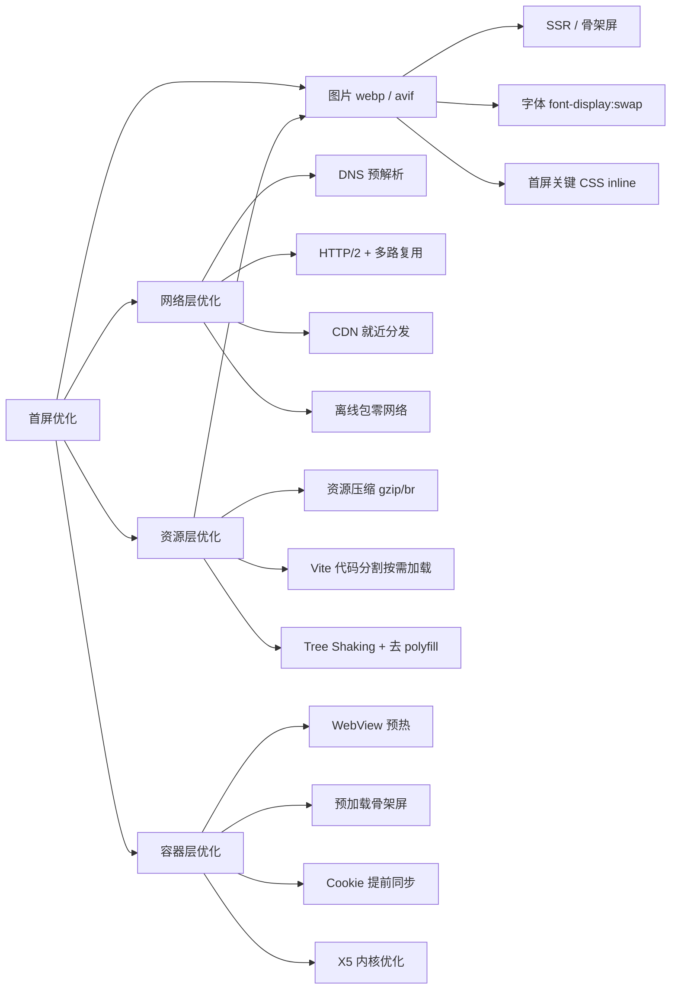
```mermaid
flowchart LR
    OP[首屏优化]

    OP --> N[网络层优化]
    OP --> R[资源层优化]
    OP --> C[容器层优化]
    OP --> R2[渲染层优化]

    N --> N1[DNS 预解析]
    N --> N2[HTTP/2 + 多路复用]
    N --> N3[CDN 就近分发]
    N --> N4[离线包零网络]

    R --> R1[资源压缩 gzip/br]
    R --> R2[图片 webp / avif]
    R --> R3[Vite 代码分割按需加载]
    R --> R4[Tree Shaking + 去 polyfill]

    C --> C1[WebView 预热]
    C --> C2[预加载骨架屏]
    C --> C3[Cookie 提前同步]
    C --> C4[X5 内核优化]

    R2 --> R21[SSR / 骨架屏]
    R2 --> R22[字体 font-display:swap]
    R2 --> R23[首屏关键 CSS inline]
```

#### 关键代码示例

**关键 CSS Inline（首屏不阻塞）**

```html
<!-- 首屏关键样式 inline，不阻塞 -->
<style>
  .header{height:44px;background:#fff}
  .banner{height:200px;background:linear-gradient(135deg,#4facfe,#00f2fe)}
  .list-item{padding:12px;border-bottom:1px solid #eee}
</style>

<!-- 非关键样式异步 -->
<link rel="preload" href="/css/non-critical.css" as="style"
      onload="this.rel='stylesheet'">
```

**图片优化**

```html
<picture>
  <source srcset="banner.webp" type="image/webp">
  <source srcset="banner.avif" type="image/avif">
  
</picture>
```

**骨架屏（SSR 输出）**

```html
<!-- 首屏 HTML 直接输出骨架，无需等 JS -->
<div class="skeleton">
  <div class="sk-line sk-line-1"></div>
  <div class="sk-line sk-line-2"></div>
  <div class="sk-line sk-line-3"></div>
</div>
```

---

### Q15. WebView 硬件加速与合成层？

#### 硬件加速原理

| 模式 | 渲染方式 | 适用 |
|------|---------|------|
| 软件渲染 | CPU 画 bitmap | 兼容性高，性能差 |
| 硬件加速 | GPU 合成图层 | 动画/滚动/图片，推荐 |

```java
// Android 开启
webView.setLayerType(View.LAYER_TYPE_HARDWARE, null);
// AndroidManifest 中也要开启
<application android:hardwareAccelerated="true">
```

#### 合成层（Compositing Layers）

```
HTML 元素 → 独立合成层
     ↓
合成层分配自己的 GPU 纹理（GraphicsBacking）
     ↓
transform / opacity 修改 → 不需要重排重绘
     ↓
直接 GPU 合成，性能提升显著
```

#### 触发合成层的 CSS（H5 端）

```css
/* 以下属性会提升为合成层 */
transform: translateZ(0);      /* 3D 变换 */
transform: translate3d(0,0,0); /* 同上 */
opacity: 0.5;
will-change: transform;        /* 主动声明 */
-webkit-backface-visibility: hidden;
filter: blur(5px);             /* 滤镜 */
mix-blend-mode: multiply;
```

#### 最佳实践

```css
/* ✅ 动画用 transform / opacity，触发 GPU 合成 */
.box {
  will-change: transform;
  transition: transform 0.3s;
}
.box:hover {
  transform: translateX(100px);  /* GPU 合成，不重排 */
}

/* ❌ 不要用 left/top 做动画（每次触发 layout → paint） */
.box {
  position: absolute;
  left: 0;
  transition: left 0.3s;
}
.box:hover {
  left: 100px;   /* 每次重排 + 重绘，卡顿 */
}
```

#### 合成层内存估算

```
1 层 = width * height * 4(RGBA) byte

例：1080x1920 全屏浮层 = 1080*1920*4 ≈ 8MB
过多层合成会导致 GPU 内存暴涨 → 崩溃 / OOM
```

---

### Q16. 滚动性能优化与卡顿排查？

#### 60fps 目标：每帧 16.6ms

```
每帧 16ms 工作：
  JS(主线程，< 5ms) → Style → Layout → Paint → Composite
```

#### 卡顿原因与解决

| 卡顿现象 | 可能原因 | 解决 |
|---------|---------|------|
| 滚动掉帧严重 | 滚动事件中频繁修改 DOM / 读 offset 触发同步 layout | `requestAnimationFrame` 批处理 / 节流 |
| 首屏列表滚动卡 | 图片过大 / 解码频繁 | 图片懒加载 + 适配尺寸 + WebP |
| 长列表 500+ DOM 节点 | DOM 过多，每次重排耗时 | 虚拟列表 / 无限滚动分页 |
| iOS 滚动不跟手 | `-webkit-overflow-scrolling` 被覆盖 | 滚动容器加 `touch` 开启原生惯性 |
| 滚动时输入框弹起卡 | 键盘弹出导致 layout | 输入固定定位，提前占位 |

#### touchmove 节流

```javascript
// ❌ 未节流：每秒触发 60+ 次，每次处理 DOM
el.addEventListener('touchmove', (e) => {
  const y = e.touches[0].clientY;
  el.style.transform = `translateY(${y}px)`;  // 每次重排？
});

// ✅ rAF 批处理 + rAF 调度
let pendingY = 0, ticking = false;
function update() {
  el.style.transform = `translateY(${pendingY}px)`;
  ticking = false;
}
el.addEventListener('touchmove', (e) => {
  pendingY = e.touches[0].clientY;
  if (!ticking) {
    requestAnimationFrame(update);
    ticking = true;
  }
});
```

#### iOS 滚动惯性

```css
/* ✅ 滚动容器开惯性滚动 */
.scroll-container {
  -webkit-overflow-scrolling: touch;
  overflow-y: auto;
  height: 100%;
}

/* ❌ 禁止使用全局：body { overflow: hidden } 会卡住子滚动 */
```

#### 虚拟列表（长列表优化）

```javascript
// 与 React 虚拟列表原理相同
class VirtualList {
  constructor(container, items, itemHeight) {
    this.container = container;
    this.items = items;
    this.itemHeight = itemHeight;
    this.buffer = 5;
    this.bindScroll();
  }

  bindScroll() {
    let ticking = false;
    this.container.addEventListener('scroll', () => {
      if (!ticking) requestAnimationFrame(() => this.render());
      ticking = true;
    });
  }

  render() {
    const scrollTop = this.container.scrollTop;
    const viewportH = this.container.clientHeight;
    const start = Math.max(0, Math.floor(scrollTop / this.itemHeight) - this.buffer);
    const visibleCount = Math.ceil(viewportH / this.itemHeight) + this.buffer * 2;
    const end = Math.min(this.items.length, start + visibleCount);

    this.container.querySelector('.inner').innerHTML =
      this.items.slice(start, end)
        .map((item, i) => `<div style="top:${(start + i) * this.itemHeight}px" class="item">${item.name}</div>`)
        .join('');
    ticking = false;
  }
}
```

---

### Q17. 内存泄漏与 WebView 销毁？

#### WebView 常见泄漏点

1. **Activity/Fragment 引用 WebView**，WebView 持有 Activity Context，内部 JSCore 回调延迟执行 → Activity 无法被 GC
2. **addJavascriptInterface** 中的对象持有外部 Activity 引用（改为 Application Context）
3. **CookieManager / WebViewDatabase** 单例持有 Context
4. **未关闭**：页面还在加载视频/定时器时，直接 finish Activity

#### Android 安全销毁

```java
// Kotlin：正确销毁流程
override fun onDestroy() {
    // 1. 先停止加载 + 加载空白页（释放 JS 定时器等）
    webView.stopLoading()
    webView.loadUrl("about:blank")

    // 2. 移除所有 View
    (webView.parent as? ViewGroup)?.removeView(webView)

    // 3. 清除历史 / Cookie
    webView.clearHistory()
    CookieManager.getInstance().removeAllCookies(null)

    // 4. 调用 destroy（必须最后）
    webView.removeAllViews()
    webView.destroy()

    super.onDestroy()
}
```

#### iOS WKWebView 销毁

```swift
deinit {
    // 移除 messageHandler（会导致循环引用）
    webView.configuration.userContentController
        .removeScriptMessageHandler(forName: "nativeBridge")

    // 停止加载
    webView.stopLoading()

    // KVO 观察者移除
    webView.removeObserver(self, forKeyPath: "estimatedProgress")

    // WKWebView = nil 即可释放（ARC）
}
```

#### H5 端 JS 内存泄漏

```javascript
// ❌ 离开页面未清理，Native WebView 内存涨
setInterval(() => {}, 1000);
document.addEventListener('scroll', handler);
new WebSocket('wss://...');

// ✅ 使用 SPA 路由切换后清理
window.addEventListener('pagehide', () => {
  clearAllTimers();
  document.removeEventListener('scroll', handler);
  ws && ws.close();
});
```

---

## 四、离线包与资源加载

### Q18. 离线包的实现原理与下发流程？

#### 包结构

```
offline-package-v1.2.3.zip
├── package.json          # 清单文件
│   ├── version: "1.2.3"
│   ├── name: "mall"
│   ├── entry: "index.html"
│   ├── files: ["index.html","js/app.xxx.js","css/app.css","img/logo.png"]
│   └── md5: "a1b2c3d4"
├── index.html
├── js/
├── css/
└── img/
```

#### 下发流程（灰度 + 全量）

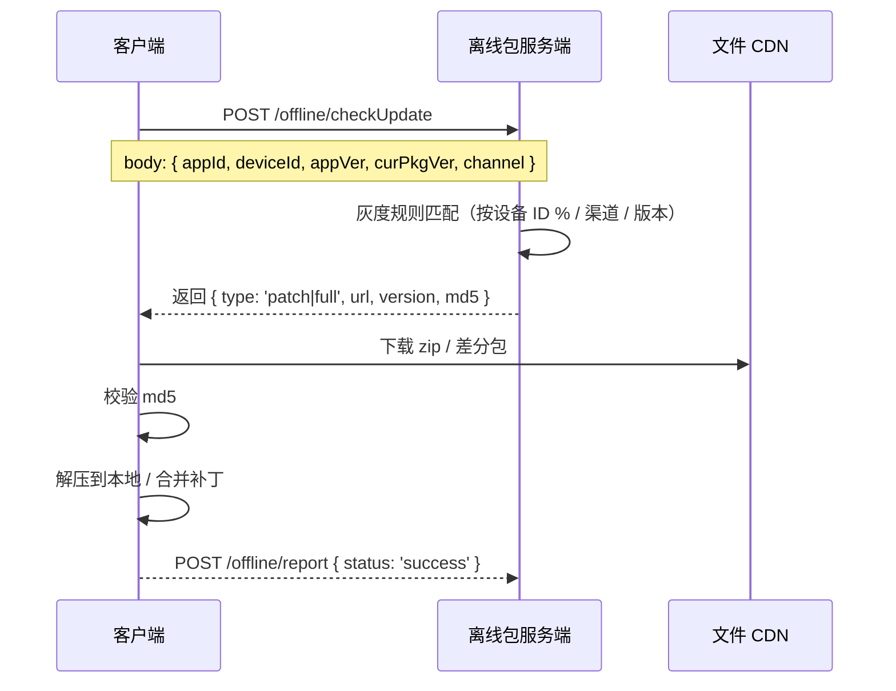
```mermaid
sequenceDiagram
    participant C as 客户端
    participant S as 离线包服务端
    participant F as 文件 CDN

    C->>S: POST /offline/checkUpdate
    Note over C,S: body: { appId, deviceId, appVer, curPkgVer, channel }

    S->>S: 灰度规则匹配（按设备 ID % / 渠道 / 版本）
    S-->>C: 返回 { type: 'patch|full', url, version, md5 }

    C->>F: 下载 zip / 差分包
    C->>C: 校验 md5
    C->>C: 解压到本地 / 合并补丁
    C-->>S: POST /offline/report { status: 'success' }
```

#### 服务端数据库设计

| 表 | 字段 | 说明 |
|----|------|------|
| `offline_package` | id、name、version、full_url、md5、size、status、publish_time | 全量包 |
| `offline_patch` | id、from_ver、to_ver、patch_url、patch_md5、patch_size | 差分补丁 |
| `offline_grayscale` | id、pkg_id、device_id_pattern、percent、channels | 灰度规则 |
| `offline_device` | device_id、pkg_id、cur_ver、last_update、report_status | 设备状态 |

#### 版本回滚

```
1. 服务端把 package 的回滚版本设为 actived
2. 客户端下次 checkUpdate 拿到 rollback=true
3. 删除新包，重新下载旧包 / 直接切换 active 目录
```

---

### Q19. 资源拦截（shouldInterceptRequest）原理与实现？

#### Android 完整实现

```java
class OfflineWebViewClient : WebViewClient() {

    private val offlineRoot = "/sdcard/Android/data/com.xxx/offline/"

    override fun shouldInterceptRequest(
        view: WebView, request: WebResourceRequest
    ): WebResourceResponse? {
        val url = request.url.toString()

        // 规则1：命中离线域名，走本地目录
        val pattern = "https://hybrid.example.com/(.*)".toRegex()
        val match = pattern.matchEntire(url)
        if (match != null) {
            val relativePath = match.groupValues[1]
            val localFile = File(offlineRoot + relativePath)
            if (localFile.exists()) {
                return loadLocal(localFile, url)
            }
        }

        // 规则2：命中 CDN 图片，命中缓存则返回
        if (url.contains("cdn.example.com/img/")) {
            val cache = getImageCache(url)
            if (cache != null) {
                return WebResourceResponse(
                    guessMimeType(url), "UTF-8", cache.inputStream
                )
            }
        }

        // 不拦截，走网络
        return super.shouldInterceptRequest(view, request)
    }

    private fun loadLocal(file: File, url: String): WebResourceResponse {
        val mimeType = guessMimeType(url)
        val fis = FileInputStream(file)
        val headers = mapOf(
            "Cache-Control" to "max-age=86400",
            "Access-Control-Allow-Origin" to "*"
        )
        val resp = WebResourceResponse(mimeType, "UTF-8", fis)
        resp.responseHeaders = headers
        return resp
    }

    private fun guessMimeType(url: String) = when {
        url.endsWith(".html") -> "text/html"
        url.endsWith(".js")   -> "application/javascript"
        url.endsWith(".css")  -> "text/css"
        url.endsWith(".png")  -> "image/png"
        url.endsWith(".jpg")  -> "image/jpeg"
        url.endsWith(".webp") -> "image/webp"
        url.endsWith(".woff2") -> "font/woff2"
        else                  -> "application/octet-stream"
    }
}
```

#### iOS WKURLSchemeHandler

```swift
// 注册自定义 scheme
let config = WKWebViewConfiguration()
config.setURLSchemeHandler(OfflineSchemeHandler(), forURLScheme: "hybrid")

class OfflineSchemeHandler: NSObject, WKURLSchemeHandler {

    let offlineRoot = NSHomeDirectory() + "/Documents/offline/"

    func webView(_ webView: WKWebView, start task: WKURLSchemeTask) {
        guard let url = task.request.url,
              let host = url.host else {
            task.didFailWithError(NSError(domain: "offline", code: 404))
            return
        }

        // hybrid://module/index.html → offlineRoot/module/index.html
        let localPath = offlineRoot + host + url.path
        let fileURL = URL(fileURLWithPath: localPath)

        guard let data = try? Data(contentsOf: fileURL) else {
            task.didFailWithError(NSError(domain: "offline", code: 404))
            return
        }

        let response = URLResponse(
            url: url,
            mimeType: guessMimeType(url.pathExtension),
            expectedContentLength: data.count,
            textEncodingName: "utf-8"
        )
        task.didReceive(response)
        task.didReceive(data)
        task.didFinish()
    }

    func webView(_ webView: WKWebView, stop urlSchemeTask: WKURLSchemeTask) {
        // 中止时清理
    }
}
```

---

### Q20. 增量更新与差分补丁（bsdiff）？

#### 为什么需要差分？

```
全量包大小：5MB → 每次更新下载 5MB
差分包大小：50KB~300KB → 用户省流量，下载快
```

#### 差分算法

| 算法 | 适用于 | 说明 |
|------|--------|------|
| **bsdiff / bspatch** | 二进制文件（图片、压缩后 JS 也行） | 通用，体积较小 |
| HDiffPatch | 文本 / 二进制 | 比 bsdiff 内存低 |
| Google archive-patch | zip 文件（推荐） | 直接对 zip 做 delta，高效 |
| **rsync rolling hash** | 大文件 / 网络流式 | 实时增量 |

#### bsdiff 流程

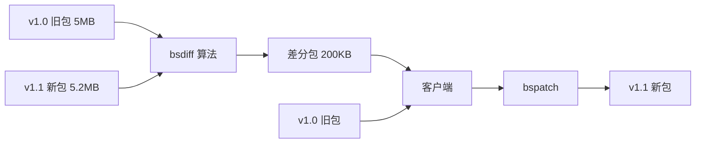
```mermaid
flowchart LR
    Old[v1.0 旧包 5MB]
    New[v1.1 新包 5.2MB]
    Old --> Diff[bsdiff 算法]
    New --> Diff
    Diff --> Patch[差分包 200KB]

    Patch --> Client[客户端]
    ClientOld[v1.0 旧包] --> Client
    Client --> Merge[bspatch]
    Merge --> ClientNew[v1.1 新包]
```

#### bsdiff 工具命令

```bash
# 服务端：生成差分包
bsdiff old_v1.zip new_v2.zip patch_v1_to_v2.bsdiff

# 客户端：应用补丁
bspatch old_v1.zip new_v2.zip patch_v1_to_v2.bsdiff
```

#### Android 端集成

```java
// Gradle 引入 bsdiff JNI
implementation 'com.github.jonthan:bsdiff4j:1.0'

fun applyPatch(oldFile: String, newFile: String, patchFile: String): Boolean {
    return try {
        BSDiff.patch(oldFile, newFile, patchFile) == 0
    } catch (e: Exception) {
        false
    }
}
```

#### 回滚策略

差分包失败（校验 md5 不一致）→ 删除新文件 → 重新下载**全量包**兜底。

---

### Q21. WebView 缓存机制与 Service Worker？

#### WebView 缓存层级

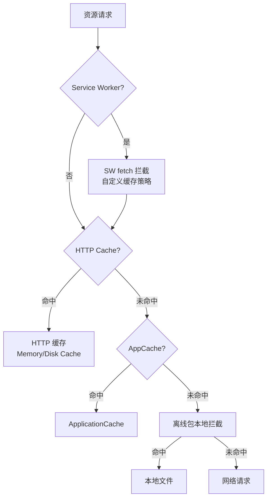
```mermaid
flowchart TB
    R[资源请求]
    R --> A{Service Worker?}
    A -->|是| SW[SW fetch 拦截<br/>自定义缓存策略]
    A -->|否| B{HTTP Cache?}
    SW --> B
    B -->|命中| D[HTTP 缓存<br/>Memory/Disk Cache]
    B -->|未命中| C{AppCache?}
    C -->|命中| E[ApplicationCache]
    C -->|未命中| F[离线包本地拦截]
    F -->|命中| G[本地文件]
    F -->|未命中| N[网络请求]
```

#### WebView 开启缓存配置

```java
// Android 缓存配置
val settings = webView.settings
settings.cacheMode = WebSettings.LOAD_DEFAULT  // 默认：有缓存且未过期则用，否则网络
settings.setAppCacheEnabled(true)                // ApplicationCache
settings.databaseEnabled = true                  // WebSQL / IndexedDB
settings.domStorageEnabled = true                // localStorage / sessionStorage
settings.setAppCachePath(cacheDir.absolutePath)

// 缓存模式选择
// LOAD_DEFAULT:  默认，正常 HTTP 缓存
// LOAD_CACHE_ONLY: 纯离线，不联网
// LOAD_NO_CACHE:  每次走网络
// LOAD_CACHE_ELSE_NETWORK: 只要有缓存就用，不管过期（适合弱网）
```

#### Service Worker（推荐替代 AppCache）

**H5 端注册**

```javascript
// app.js
if ('serviceWorker' in navigator) {
  navigator.serviceWorker.register('/sw.js', { scope: '/' })
    .then(reg => console.log('SW registered', reg));
}
```

**sw.js 缓存策略**

```javascript
// sw.js - Cache First（离线优先）
const CACHE = 'hybrid-v1';

// 安装时预缓存
self.addEventListener('install', (e) => {
  e.waitUntil(
    caches.open(CACHE).then(cache =>
      cache.addAll(['/', '/index.html', '/css/app.css', '/js/app.js'])
    )
  );
});

// 请求拦截：Cache First + 后台更新
self.addEventListener('fetch', (e) => {
  e.respondWith(
    caches.match(e.request).then(cached => {
      const fetchPromise = fetch(e.request).then(response => {
        // 新响应存缓存
        caches.open(CACHE).then(c => c.put(e.request, response.clone()));
        return response;
      });
      return cached || fetchPromise;
    })
  );
});
```

#### Service Worker 在 WebView 中兼容性

- **Android WebView 7.0+**（Chrome 同版本）：完全支持
- **iOS WKWebView 11.3+**：支持
- **X5 内核**：完全支持
- 老旧 Android 4.x：不支持，降级走离线包拦截

---

## 五、主流 Hybrid 框架

### Q22. Cordova / PhoneGap 的架构与插件机制？

#### 架构

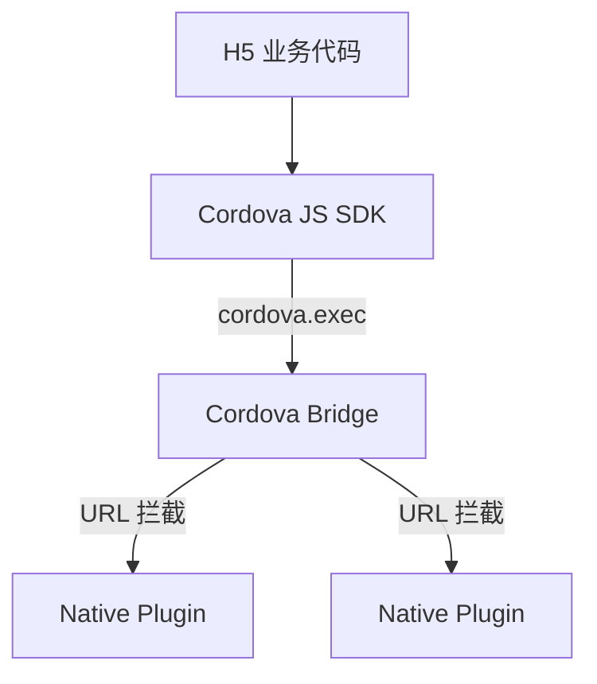
```mermaid
flowchart TB
    H5[H5 业务代码]
    H5 --> JS[Cordova JS SDK]
    JS -->|cordova.exec| Bridge[Cordova Bridge]
    Bridge -->|URL 拦截| Java[Native Plugin]
    Bridge -->|URL 拦截| OC[Native Plugin]
```

#### 插件机制

每个 Cordova 插件 = 前端 JS API + 各端 Native 实现，通过 `plugin.xml` 声明。

```xml
<!-- plugin.xml -->
<plugin id="cordova-plugin-camera" version="6.0.0">
  <name>Camera</name>
  <js-module src="www/Camera.js" name="Camera">
    <clobbers target="navigator.camera" />
  </js-module>

  <!-- Android 实现 -->
  <platform name="android">
    <config-file target="config.xml" parent="/*">
      <feature name="Camera">
        <param name="android-package" value="org.apache.cordova.camera.CameraLauncher"/>
      </feature>
    </config-file>
    <source-file src="src/android/CameraLauncher.java" />
  </platform>

  <!-- iOS 实现 -->
  <platform name="ios">
    <config-file target="config.xml" parent="/*">
      <feature name="Camera">
        <param name="ios-package" value="CDVCamera" />
      </feature>
    </config-file>
    <source-file src="src/ios/CDVCamera.m" />
  </platform>
</plugin>
```

#### Cordova JS 调用流程

```javascript
// H5 端调用
navigator.camera.getPicture(
  (imageData) => { img.src = 'data:image/jpeg;base64,' + imageData },
  (error) => console.err(error),
  { quality: 50, destinationType: Camera.DestinationType.DATA_URL }
);

// 内部通过 cordova.exec 调用 Native
cordova.exec(successCb, errorCb, 'Camera', 'takePicture', [args]);
```

#### Cordova 现状

- **历史地位**：Hybrid 开山鼻祖，Apache 开源
- **现状**：主流团队已迁移到 Capacitor（现代替代）或自研容器
- **缺点**：性能差、插件质量参差不齐、调试不方便

---

### Q23. Ionic 的组件体系与 Capacitor 对比？

#### Ionic 是什么？

**UI 组件库 + 开发工具链**。Ionic 5+ 与框架无关，支持 Angular / Vue / React。

```
技术栈结构：
前端框架（Vue/React/Angular）
    ↓
Ionic UI 组件（按钮 / 列表 / Tab / Nav / 模态框等）
    ↓
Capacitor / Cordova → Native 容器
```

#### Capacitor vs Cordova

| 维度 | Cordova | Capacitor |
|------|---------|-----------|
| 出品 | Apache（2009） | Ionic 团队（2018） |
| CLI | cordova-cli | ionic-cli / npx cap |
| 插件兼容 | 原有生态 | **向后兼容 Cordova 插件** |
| 工程结构 | 大量 hook 生成原生工程 | **直接暴露原生工程**（Android Studio / Xcode 直接改） |
| 热更新 | 需 cordova-hot-code-push | CapacitorUpdater |
| 插件 API | 旧的 cordova.exec | 现代 Promise / Callback 规范 |
| 跨平台 | Android/iOS | Android/iOS/Web/Electron 桌面 |

#### Capacitor 调用示例

```javascript
// capacitor 原生 API 调用（Promise 化，类型友好）
import { Camera, CameraResultType } from '@capacitor/camera';

async function takePhoto() {
  const photo = await Camera.getPhoto({
    quality: 90,
    allowEditing: true,
    resultType: CameraResultType.Uri
  });
  img.src = photo.webPath;
}
```

---

### Q24. Uni-app 的编译原理与 5+Runtime？

#### Uni-app 全景

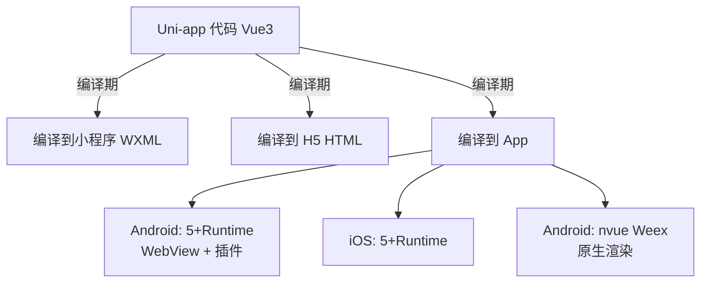
```mermaid
flowchart TB
    U[Uni-app 代码 Vue3]

    U -->|编译期| C1[编译到小程序 WXML]
    U -->|编译期| C2[编译到 H5 HTML]
    U -->|编译期| C3[编译到 App]

    C3 --> R1[Android: 5+Runtime<br/>WebView + 插件]
    C3 --> R2[iOS: 5+Runtime]
    C3 --> R3[Android: nvue Weex<br/>原生渲染]
```

#### 5+Runtime 是什么？

DCloud 自研的 Hybrid 容器 = **增强版 WebView** + **大量原生插件（40+ API）**

- 自带 JSBridge，API 设计兼容 HTML5+ 规范
- 支持离线包、热更新（流应用）
- 内置**相册、定位、地图、支付、推送、分享、IM** 等原生插件
- 自带 plus 对象 API：`plus.camera.getCamera()`、`plus.gallery.pick()`

#### Uni-app 页面渲染模式

| 模式 | 引擎 | 性能 | 适用 |
|------|------|------|------|
| 普通 `.vue` 页 | WebView H5 渲染 | 一般 | 营销页 / 表单 |
| `.nvue` 页 | Weex 原生渲染（类似 RN） | 接近原生 | 列表页 / 首页信息流 |
| 渲染层分离 | WebView + 原生 View 混排 | 最好 | 高性能场景 |

#### plus API 调用

```javascript
// uni-app 中可以直接使用 plus 对象
// 拍照
plus.camera.getCamera().captureImage(path => {
  plus.gallery.save(path);
});

// 原生弹窗
plus.nativeUI.confirm('确认退出?', e => {
  if (e.index === 0) plus.runtime.quit();
});
```

---

### Q25. 小程序容器原理（内嵌 WebView + JSSDK）？

#### 小程序核心架构（微信/支付宝/自研通用）

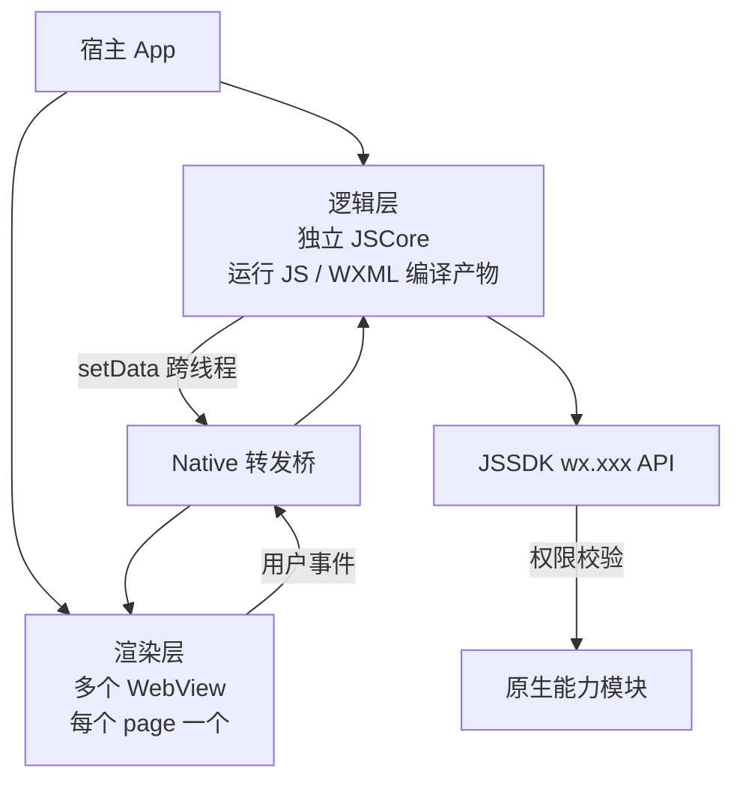
```mermaid
flowchart TB
    App[宿主 App]

    App --> Logic[逻辑层<br/>独立 JSCore<br/>运行 JS / WXML 编译产物]
    App --> Render[渲染层<br/>多个 WebView<br/>每个 page 一个]

    Logic -->|setData 跨线程| Bridge[Native 转发桥]
    Bridge --> Render

    Render -->|用户事件| Bridge
    Bridge --> Logic

    Logic --> SDK[JSSDK wx.xxx API]
    SDK -->|权限校验| NativeApi[原生能力模块]
```

#### 架构亮点

1. **双线程模型**：逻辑层 JSCore 与渲染层 WebView 分离，避免 JS 阻塞页面
2. **多 WebView**：每个页面独立 WebView，切换动画流畅
3. **沙箱隔离**：JS 无法访问真实 DOM，只能通过 setData 驱动，API 权限可配
4. **JSSDK**：统一的 `wx.xxx` 风格 API，每个 API 经 Native 鉴权

#### 自研小程序容器要点

```
功能模块：
1. JS 逻辑层引擎（JSCore / v8）
2. 渲染引擎（WebView / Skia 自绘）
3. setData 序列化与 diff（跨进程通信）
4. API 权限管理 + 域名白名单
5. 包管理：整包 / 分包下载与管理
6. 调试：真机调试 / 热重载 / console 转发
7. 监控：性能 / JS 异常 / API 调用耗时
```

---

## 六、兼容性与系统差异

### Q26. Android / iOS WebView 的 CSS / JS 兼容差异？

#### CSS 兼容差异表

| CSS 属性 | Android WebView | iOS WKWebView | 解决 |
|---------|-----------------|---------------|------|
| `position: sticky` | Android 5.0+ 支持 | iOS 支持 | Android 5 以下用 polyfill |
| `-webkit-overflow-scrolling: touch` | 不支持（无效） | 必须加，否则无惯性 | 条件加前缀 |
| `backdrop-filter: blur` | Android 9+ / Chrome 76+ | iOS 9+ 支持（前缀） | 加 `-webkit-backdrop-filter` |
| `object-fit` | 低版本不支持 | 支持 | polyfill object-fit-images |
| CSS 变量 `var(--x)` | Android 4.4 不支持 | iOS 9+ 支持 | 降级用 Sass 变量 + 构建时替换 |
| `gap` in Flex | Android 低版本不支持 | 支持 | 用 margin 代替 |
| `:has()` `:is()` | 新版本支持 | iOS 15.4+ 支持 | 降级选择器 |

#### JS 兼容差异

| API | Android | iOS | 解决 |
|-----|---------|-----|------|
| `new Date('2024-01-01 10:00')` | 部分低版本返回 NaN（见 Q29） | 同样可能失败 | 统一 `new Date('2024/01/01 10:00')` |
| `Promise.finally` | 老版本缺失 | 也可能缺 | Babel polyfill |
| `IntersectionObserver` | Android 5.0+ | iOS 12.2+ | intersection-observer polyfill |
| `ResizeObserver` | Android 9+ | iOS 13.4+ | polyfill |
| `structuredClone` | 新浏览器 | iOS 15+ | JSON.parse(JSON.stringify(x)) |
| `Intl.DateTimeFormat` | 老版本 locale 不生效 | 也可能 | 自己格式化 |

#### 工程化兜底

```javascript
// main.js 入口添加 polyfill
import 'core-js/stable';
import 'regenerator-runtime/runtime';

// WebP 能力检测
function supportWebp() {
  return document.createElement('canvas').toDataURL('image/webp').indexOf('data:image/webp') === 0;
}
```

```bash
# .browserslistrc 约束目标浏览器
iOS >= 11
Android >= 5
Chrome >= 60
```

---

### Q27. 键盘弹出适配与 fixed 失效？

#### iOS 典型问题

```
iOS 键盘弹起时：
  body.scrollTop 被修改，fixed 元素相对视口往上偏移
  输入框被键盘遮挡，需手动 scrollIntoView
```

```javascript
// iOS 键盘处理方案
const input = document.querySelector('#input');

input.addEventListener('focus', () => {
  // 延时等待键盘弹出
  setTimeout(() => {
    input.scrollIntoView({ behavior: 'smooth', block: 'center' });
  }, 300);
});

input.addEventListener('blur', () => {
  // 失焦时回滚到顶部，避免页面空白
  setTimeout(() => window.scrollTo(0, 0), 100);
});
```

#### Android 典型问题

```
Android: adjustResize 模式 → 视口高度变小，fixed 元素可能被挤出屏幕
```

```css
/* 改为用 absolute + 滚动容器，不依赖 fixed */
.page {
  position: absolute;
  top: 0;
  bottom: 0;
  width: 100%;
  overflow-y: auto;
}
.page-footer {
  position: absolute;
  bottom: 0;
  width: 100%;
  height: 50px;
}
```

```java
// Android 端设置 adjustResize（不被键盘遮挡）
activity.getWindow().setSoftInputMode(
    WindowManager.LayoutParams.SOFT_INPUT_ADJUST_RESIZE
);
```

---

### Q28. iOS 橡皮筋与 overscroll 问题？

#### 现象

iOS 页面滚动到顶/底时，会出现"橡皮筋回弹"效果。嵌套滚动时，子容器滚到底部后会触发外层页面回弹，体验断裂。

#### 方案1：body 禁橡皮筋，容器内部开

```css
html, body {
  height: 100%;
  overflow: hidden;  /* 关闭 body 滚动 */
}
.scroll-page {
  height: 100%;
  overflow-y: auto;
  -webkit-overflow-scrolling: touch;  /* 只在内部容器开惯性滚动 */
}
```

#### 方案2：JS 防止传递

```javascript
// 子滚动容器滚到边界时，阻止事件冒泡
document.querySelectorAll('.scroll-inner').forEach(el => {
  let startY = 0;
  el.addEventListener('touchstart', e => {
    startY = e.touches[0].clientY;
  }, { passive: false });
  el.addEventListener('touchmove', e => {
    const dy = e.touches[0].clientY - startY;
    const scrollTop = el.scrollTop;
    const scrollH = el.scrollHeight;
    const clientH = el.clientHeight;

    // 滚到顶继续下拉
    if (scrollTop === 0 && dy > 0) e.preventDefault();
    // 滚到底继续上拉
    if (scrollTop + clientH >= scrollH && dy < 0) e.preventDefault();
  }, { passive: false });
});
```

#### 方案3：Native 端关闭

```swift
// iOS 关闭 WKWebView 回弹
webView.scrollView.bounces = false
```

```java
// Android 关闭回弹
webView.setOverScrollMode(View.OVER_SCROLL_NEVER);
```

---

### Q29. 时间格式 new Date 兼容？

#### 坑：iOS 不识别连字符时间字符串

```javascript
// ❌ 错误写法，iOS 返回 Invalid Date
new Date('2024-05-01 10:00:00');     // iOS NaN / Android OK
new Date('2024-05-01T10:00:00');     // 部分 iOS OK
new Date('2024-05-01T10:00:00.000Z'); // UTC 时间 OK

// ✅ 统一用斜杠格式（兼容所有 WebView）
new Date('2024/05/01 10:00:00');
```

#### 通用格式化函数

```javascript
function parseDate(str) {
  if (!str) return new Date(NaN);
  // 把 - 统一换成 /
  return new Date(str.replace(/-/g, '/').replace('T', ' '));
}

parseDate('2024-05-01T10:00:00');
```

#### 格式化输出

```javascript
function formatDate(date, pattern = 'YYYY-MM-DD HH:mm:ss') {
  const pad = n => String(n).padStart(2, '0');
  const map = {
    YYYY: date.getFullYear(),
    MM: pad(date.getMonth() + 1),
    DD: pad(date.getDate()),
    HH: pad(date.getHours()),
    mm: pad(date.getMinutes()),
    ss: pad(date.getSeconds())
  };
  return pattern.replace(/YYYY|MM|DD|HH|mm|ss/g, m => map[m]);
}
```

---

### Q30. 安全区与刘海屏适配？

#### iPhone 安全区

```
iPhone 刘海屏（安全区）：
 ┌─────────────────────────────┐
 │ top: constant(safe-area-inset-top) = 44px (刘海)
 │                             │
 │                             │
 │                             │
 │ bottom: constant(safe-area-inset-bottom) = 34px (Home 指示条)
 └─────────────────────────────┘
```

#### CSS 适配（推荐）

```css
/* 开启 viewport-fit=cover */
/* <meta name="viewport" content="width=device-width,initial-scale=1,viewport-fit=cover"> */

body {
  /* 兼容老版本 constant，新版本 env */
  padding-top: constant(safe-area-inset-top);
  padding-top: env(safe-area-inset-top);

  padding-bottom: constant(safe-area-inset-bottom);
  padding-bottom: env(safe-area-inset-bottom);
}

/* 底部 tabBar 固定在安全区上方 */
.tabbar {
  position: fixed;
  left: 0; right: 0; bottom: 0;
  height: calc(50px + env(safe-area-inset-bottom));
  padding-bottom: env(safe-area-inset-bottom);
}
```

#### Android 异形屏

```java
// Android 9+ P 版本允许内容延伸到刘海区
if (Build.VERSION.SDK_INT >= Build.VERSION_CODES.P) {
    val attr = window.attributes
    attr.layoutInDisplayCutoutMode =
        WindowManager.LayoutParams.LAYOUT_IN_DISPLAY_CUTOUT_MODE_SHORT_EDGES
    window.attributes = attr
}
```

```css
/* Android 安全区变量名称自定义，通过 JS 读取后写 CSS 变量 */
:root {
  --sat: constant(safe-area-inset-top);
  --sab: constant(safe-area-inset-bottom);
}
```

---

## 七、工程化与构建

### Q31. H5 在 Hybrid 中的工程化配置（Vite + 多入口）？

#### 目录结构

```
hybrid-h5/
├── src/
│   ├── pages/
│   │   ├── home/
│   │   │   ├── index.html
│   │   │   └── main.js
│   │   ├── order/
│   │   └── mine/
│   ├── components/
│   ├── utils/
│   │   ├── bridge.js         # JSBridge 封装
│   │   └── hybrid-utils.js   # 环境判断 / UA
│   └── styles/
│       └── safe-area.scss
├── config/
│   └── offline-manifest.json # 离线包清单模板
└── vite.config.js
```

#### vite.config.js（多入口 + publicPath）

```javascript
import { defineConfig } from 'vite';
import vue from '@vitejs/plugin-vue';
import path from 'path';
import fs from 'fs';

export default defineConfig({
  plugins: [vue()],
  base: process.env.NODE_ENV === 'production'
    ? 'https://cdn.example.com/hybrid/' // CDN 绝对路径
    : '/',
  build: {
    // 多入口
    rollupOptions: {
      input: {
        home:  path.resolve(__dirname, 'src/pages/home/index.html'),
        order: path.resolve(__dirname, 'src/pages/order/index.html'),
        mine:  path.resolve(__dirname, 'src/pages/mine/index.html'),
      },
      output: {
        chunkFileNames: 'js/[name]-[hash].js',
        assetFileNames: '[ext]/[name]-[hash].[ext]',
      },
    },
  },
  // 生成 package.json 清单
  plugins: [vue(), offlineManifestPlugin()],
});

// 自动生成离线包清单
function offlineManifestPlugin() {
  return {
    name: 'offline-manifest',
    closeBundle() {
      const dist = path.resolve(__dirname, 'dist');
      const files = listAllFiles(dist);
      const manifest = {
        name: 'hybrid-h5',
        version: process.env.npm_package_version,
        entry: 'home/index.html',
        timestamp: Date.now(),
        files: files.map(f => f.replace(dist + '/', '')),
        md5: computeFolderMd5(dist),
      };
      fs.writeFileSync(
        path.join(dist, 'package.json'),
        JSON.stringify(manifest, null, 2)
      );
    }
  };
}
```

#### Bridge 环境判断

```javascript
// utils/hybrid-env.js
export const HybridEnv = {
  isHybrid: /HybridApp\//.test(navigator.userAgent),
  isAndroid: /Android/.test(navigator.userAgent),
  isiOS: /iPhone|iPad/.test(navigator.userAgent),
  isWeChat: /MicroMessenger/.test(navigator.userAgent),
  appVersion: (navigator.userAgent.match(/HybridApp\/([\d.]+)/) || [])[1] || '',

  // Native 能力
  canUseBridge: false,
  init() {
    this.canUseBridge = Boolean(
      window.AndroidBridge || window.webkit?.messageHandlers?.nativeBridge
    );
  }
};
HybridEnv.init();
```

---

### Q32. 混合调试方法（DevTools / Safari 调试 / vConsole）？

#### 1. Android WebView 调试（Chrome DevTools）

```java
// 开启 WebView 调试（debug 包）
if (BuildConfig.DEBUG) {
    WebView.setWebContentsDebuggingEnabled(true);
}
```

```
步骤：
1. USB 连接手机，打开开发者选项 + USB 调试
2. Chrome 浏览器访问 chrome://inspect
3. 看到目标 WebView → 点击 inspect
4. 正常用 Elements / Console / Network / Application
```

#### 2. iOS WKWebView 调试（Safari）

```swift
// 开启（debug 包）
if #available(iOS 16.4, *) {
    webView.isInspectable = true
} else {
    // 开发签名证书自动开启
}
```

```
步骤（需 Mac 电脑）：
1. iPhone 设置 → Safari → 高级 → 打开"网页检查器"
2. USB 连 Mac
3. Mac 上打开 Safari → 开发菜单 → 选择你的手机 → 选择目标 WebView
4. 打开 Web 检查器调试
```

#### 3. 内嵌 vConsole（生产应急调试）

```html
<!-- index.html -->
<script src="https://unpkg.com/vconsole@3.15.0/dist/vconsole.min.js"></script>
<script>
  // 仅 debug 开启；生产可通过 URL 参数开启：?__debug=1
  if (location.search.includes('__debug=1')) {
    new VConsole();
  }
</script>
```

#### 4. Charles / Fiddler 抓包

```
Android 7.0+ 抓 HTTPS 步骤：
1. Charles 安装根证书到电脑
2. 手机 WiFi 设置代理到电脑 IP:8888
3. 手机浏览器访问 chls.pro/ssl 下载证书
4. Android 7+ 默认不信任用户证书，App 需配置：
   res/xml/network_security_config.xml 信任用户证书（debug 版）
```

#### 5. 调试无网环境（离线包）

```
1. 通过 vConsole 看 console 报错
2. 把离线包内容解压到本地，用 http-server 起本地服务
3. 配置 Charles Map Local：hybrid.example.com → 本地解压目录
4. WebView 加载线上 URL 实际返回本地内容，可断点调试
```

---

### Q33. 埋点与监控（性能/异常/用户行为）？

#### 监控三要素

| 类型 | 采集内容 | 指标示例 |
|------|---------|---------|
| **性能监控** | 首屏加载、资源加载、JS 执行时间 | TTFB、FCP、LCP、首屏 total |
| **异常监控** | JS 异常、Promise rejection、资源加载失败 | 错误栈、错误率、Top5 错误页 |
| **行为埋点** | 页面浏览、按钮点击、曝光时长 | PV/UV、点击率、停留时长、转化漏斗 |

#### 异常监控 SDK

```javascript
// monitor/error.js
class ErrorMonitor {
  constructor() {
    this.jsErrors = [];
    this.bindGlobalError();
    this.bindUnhandledRejection();
    this.bindResourceError();
  }

  bindGlobalError() {
    window.addEventListener('error', (e) => {
      if (e.target !== window) { /* 资源错误，单独处理 */ return; }
      this.report({
        type: 'js_error',
        message: e.message,
        stack: e.error?.stack?.slice(0, 1000),
        filename: e.filename,
        line: e.lineno,
        col: e.colno,
      });
    }, true);
  }

  bindUnhandledRejection() {
    window.addEventListener('unhandledrejection', (e) => {
      this.report({
        type: 'promise_rejection',
        reason: String(e.reason),
      });
    });
  }

  bindResourceError() {
    window.addEventListener('error', (e) => {
      const target = e.target;
      if (target !== window) {
        this.report({
          type: 'resource_error',
          tag: target.tagName,
          src: target.src || target.href,
        });
      }
    }, true);
  }

  report(data) {
    data.url = location.href;
    data.ua = navigator.userAgent;
    data.time = Date.now();
    data.app_version = HybridEnv.appVersion;

    // 发送监控（用 1x1 gif 避免 CORS）
    const qs = Object.entries(data)
      .map(([k, v]) => `${k}=${encodeURIComponent(String(v))}`)
      .join('&');
    const img = new Image();
    img.src = `https://monitor.example.com/error?${qs}`;
  }
}

new ErrorMonitor();
```

#### 行为埋点 SDK

```javascript
// monitor/track.js
class Tracker {
  constructor() {
    this.events = [];
    this.bindAutoTrack();
  }

  bindAutoTrack() {
    // 点击事件自动上报（元素带 data-track 属性）
    document.addEventListener('click', (e) => {
      const el = e.target.closest('[data-track]');
      if (el) {
        this.track(el.dataset.track, { value: el.dataset.value });
      }
    });
  }

  track(eventName, props = {}) {
    const event = {
      event: eventName,
      props,
      url: location.pathname,
      time: Date.now(),
      uid: localStorage.getItem('uid') || '',
    };
    this.events.push(event);
    if (this.events.length > 20) {
      this.flush();
    }
  }

  flush() {
    if (this.events.length === 0) return;
    const batch = this.events.splice(0);
    navigator.sendBeacon(
      'https://monitor.example.com/track',
      JSON.stringify(batch)
    );
  }
}

export const tracker = new Tracker();
```

```html
<!-- H5 中使用 -->
<button data-track="buy_click" data-value="product_001">购买</button>
```

---

## 八、综合实战题

### Q34. 设计一个可扩展的 JSBridge SDK？

#### 需求

```
1. 支持 Android / iOS / 小程序 / 浏览器 四端
2. 支持插件化扩展新 API
3. 统一 Promise 调用 + 超时 + 重试
4. 自动降级（浏览器用 H5 等价实现）
5. 版本兼容：不支持的方法自动 fallback / 提示
```

#### 架构设计

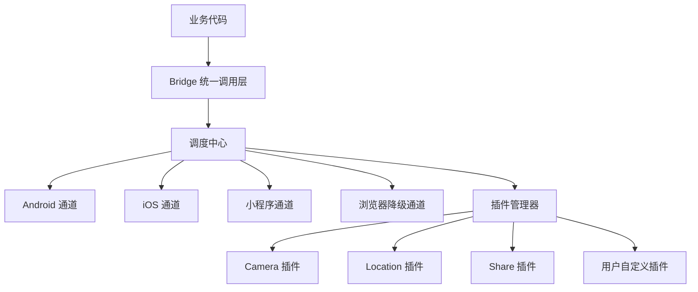
```mermaid
flowchart TB
    Biz[业务代码]
    Biz --> API[Bridge 统一调用层]
    API --> Dispatch[调度中心]

    Dispatch --> Android[Android 通道]
    Dispatch --> iOS[iOS 通道]
    Dispatch --> MP[小程序通道]
    Dispatch --> Web[浏览器降级通道]

    Dispatch --> Plugin[插件管理器]
    Plugin --> P1[Camera 插件]
    Plugin --> P2[Location 插件]
    Plugin --> P3[Share 插件]
    Plugin --> P4[用户自定义插件]
```

#### 核心代码

```javascript
// bridge/core.js
export class HybridBridge {
  constructor() {
    this.channels = {};     // 各端通道
    this.plugins = {};      // 插件集合
    this.version = '';      // Bridge 版本号
    this.detectEnv();       // 探测环境
  }

  // 探测通道环境
  detectEnv() {
    const ua = navigator.userAgent;
    if (window.AndroidBridge) {
      this.env = 'android';
      this.channels.android = new AndroidChannel();
    } else if (window.webkit?.messageHandlers?.nativeBridge) {
      this.env = 'ios';
      this.channels.ios = new IOSChannel();
    } else if (window.__wxjs_environment === 'miniprogram') {
      this.env = 'miniprogram';
      this.channels.miniprogram = new MiniProgramChannel();
    } else {
      this.env = 'web';
      this.channels.web = new WebFallbackChannel();
    }
  }

  // 注册插件
  registerPlugin(name, plugin) {
    this.plugins[name] = plugin;
    Object.keys(plugin.methods || {}).forEach(method => {
      if (!this[method]) {
        this[method] = (args) => this.call(`${name}.${method}`, args);
      }
    });
  }

  // 统一调用入口
  call(action, args = {}, options = {}) {
    const { timeout = 10000, retry = 1 } = options;
    const channel = this.channels[this.env];

    return new Promise(async (resolve, reject) => {
      for (let attempt = 0; attempt <= retry; attempt++) {
        try {
          const result = await channel.invoke(action, args, timeout);
          return resolve(result);
        } catch (err) {
          if (attempt === retry) return reject(err);
          await sleep(300);  // 重试间隔
        }
      }
    }).catch(async (err) => {
      // 自动降级：Web fallback 通道
      if (this.env !== 'web' && options.autoFallback !== false) {
        console.warn('Bridge 调用失败，降级 web fallback:', err);
        return this.channels.web.invoke(action, args, timeout);
      }
      throw err;
    });
  }
}
```

```javascript
// bridge/channels/android.js
class AndroidChannel {
  constructor() {
    this.seq = 0;
    this.callbacks = new Map();
    window.__AndroidCallback__ = this.handleCallback.bind(this);
  }

  invoke(action, args, timeout) {
    return new Promise((resolve, reject) => {
      const callbackId = `android_${Date.now()}_${++this.seq}`;
      const timer = setTimeout(() => {
        this.callbacks.delete(callbackId);
        reject(new Error('Timeout'));
      }, timeout);
      this.callbacks.set(callbackId, { resolve, reject, timer });

      const payload = JSON.stringify({ action, args, callbackId });
      window.AndroidBridge.invoke(payload);
    });
  }

  handleCallback(resultStr) {
    const r = JSON.parse(resultStr);
    const cb = this.callbacks.get(r.callbackId);
    if (!cb) return;
    clearTimeout(cb.timer);
    this.callbacks.delete(r.callbackId);
    r.code === 0 ? cb.resolve(r.data) : cb.reject(new Error(r.msg));
  }
}
```

---

### Q35. 设计离线包管理后台与下发系统？

#### 模块划分

```mermaid
flowchart TB
    A[管理后台] --> A1[上传新版本包]
    A --> A2[灰度规则配置]
    A --> A3[版本回滚]
    A --> A4[数据报表]

    B[客户端 SDK] --> B1[定期 checkUpdate]
    B --> B2[下载 patch / full]
    B --> B3[校验 / 解压 / 切换]
    B --> B4[安装上报]

    C[文件服务 CDN] --> C1[全量包存储]
    C --> C2[差分包存储]
    C --> C3[下载加速]

    D[服务端后端] --> D1[checkUpdate 接口]
    D --> D2[灰度匹配引擎]
    D --> D3[差分任务生成]
    D --> D4[设备版本登记]
```

#### 核心接口

```
POST /offline/package/upload          multipart 上传 zip，后端解析 + 算 diff
GET  /offline/package/list            历史版本列表
POST /offline/publish                 发布新版本 + 灰度配置
POST /offline/rollback                回滚版本

POST /offline/checkUpdate             客户端主动查询（带当前版本 + 设备）
POST /offline/report                  安装结果上报（成功/失败 + md5 校验）
GET  /offline/statistics              数据报表：覆盖率、失败率
```

#### 灰度规则引擎

```javascript
// 后端：根据设备上下文匹配灰度规则
function matchGray(device, rules) {
  for (const rule of rules) {
    if (rule.appVersion && !rule.appVersion.includes(device.appVer)) continue;
    if (rule.channel && !rule.channel.includes(device.channel)) continue;
    if (rule.os && !rule.os.includes(device.os)) continue;
    if (rule.percent) {
      // 按设备 ID 取模命中百分比
      const hash = md5(device.deviceId).charCodeAt(0);
      if (hash % 100 >= rule.percent) continue;
    }
    // 命中
    return {
      type: device.curVersion === rule.fromVersion ? 'patch' : 'full',
      url: rule.url,
      md5: rule.md5,
      version: rule.version,
    };
  }
  return { hasUpdate: false };
}
```

#### 客户端 SDK 核心流程

```
定时任务（每 30 分钟）：
  1. POST /offline/checkUpdate
  2. 有更新 → 加互斥锁，启动下载
  3. 下载 patch/full 包
  4. MD5 校验
  5. full → 解压到新版本目录
     patch → bspatch 合并老包 + patch → 解压到新版本目录
  6. 写 manifest，标记新版本为 "ready"
  7. POST /offline/report { success: true/false }

下次冷启动：
  读取 manifest，若存在 ready 版本，切换根目录到新版本。
```

---

### Q36. 从 0 搭建 Hybrid App 脚手架的技术选型？

#### 推荐架构（2024+ 标准方案）

```
┌───────────────────────────────────────────┐
│              Hybrid App 架构              │
├───────────────────────────────────────────┤
│                                           │
│  H5 端：                                  │
│    框架: Vue 3 / React 18                 │
│    构建: Vite 5.x                         │
│    路由: Vue Router / React Router        │
│    状态: Pinia / Zustand                  │
│    工具: TS + ESLint + Prettier           │
│    Bridge: 自研 @company/hybrid-sdk       │
│    监控: @company/monitor-sdk             │
│                                           │
│  Native 端：                              │
│    Android：Kotlin + 官方 WebView        │
│    iOS    ：Swift + WKWebView            │
│    可选：  集成腾讯 X5 内核              │
│                                           │
│  基础设施：                               │
│    离线包 + 差分补丁服务                  │
│    JSBridge 插件化                        │
│    监控告警平台                           │
│    灰度发布后台                           │
│    DevOps CI/CD 流水线                   │
│                                           │
└───────────────────────────────────────────┘
```

#### 技术选型对比（按团队规模）

| 团队规模 | 场景 | 推荐 |
|---------|------|------|
| 小团队（3-5 人） | MVP / 快速验证 | Uni-app（Vue）+ 5+ Runtime |
| 中团队（10-20 人） | 内部 App + 营销页 | React + Vite + 自研 WebView 容器 + 离线包 |
| 大团队（50+） | 亿级用户主 App | 自研容器 + X5 内核 + 双线程小程序容器 + 完善监控灰度 |

#### CI/CD 流水线

```
H5 提交代码 →
  1. eslint + tsc + unit test
  2. vite build → 生成 dist + package.json 清单
  3. 上传 zip 到离线包后台
  4. 自动匹配灰度（测试账号 100%，正式按百分比）
  5. 发布成功 + 钉钉通知

Native 提交代码 →
  1. Android / iOS unit test
  2. 编译 Debug 包 → 蒲公英 / TestFlight 分发给测试
  3. Release 包 → 应用商店上架
```

---

## 九、高频速答与踩坑总结

### 9.1 速答卡片（20 秒一题）

**Q：JSBridge 原理一句话？**
A：JS 通过 URL 拦截或注入对象把请求交给 Native，Native 执行后再用 `evaluateJavaScript` 回调 JS。

**Q：WKWebView 比 UIWebView 好在哪？**
A：独立 Nitro 进程，崩溃不影响 App；JS 性能快 4 倍；内存占用少。

**Q：离线包为什么要 MD5 校验？**
A：防止下载被截断或替换，避免执行损坏/恶意脚本。

**Q：WebView 硬件加速的副作用？**
A：可能出现页面闪烁、透明层闪烁、WebView 切换白屏，需要用 `setLayerType` 精确控制。

**Q：iOS 键盘把 fixed 顶上去怎么办？**
A：iOS 失焦后主动 `window.scrollTo(0,0)`；Android 开 `adjustResize`。

**Q：new Date('2024-01-01 10:00') iOS 返回 NaN 解决？**
A：改成 `new Date('2024/01/01 10:00')`，用 `/` 替代 `-`。

**Q：addJavascriptInterface 有啥风险？**
A：Android 4.2 以下可反射执行任意 Java。解决：加 `@JavascriptInterface` 注解或改用 URL 拦截。

**Q：微信 X5 内核优点？**
A：全 Android 版本统一 Blink，无碎片化；共享内核体积小；内建视频/文件/优化。

**Q：Hybrid 首屏慢怎么优化？**
A：优先级顺序：WebView 预创建 → 离线包 → 骨架屏 → 资源拆分 → CDN。

**Q：Safari 调试 WKWebView 前提？**
A：Mac + iOS 真机 + 开发者证书 debug 包 + 手机开启网页检查器。

### 9.2 实战踩坑 10 例

| # | 场景 | 现象 | 根因 | 解决 |
|---|------|------|------|------|
| 1 | H5 弹蒙层，iOS 还能滚 | 弹层后背景页面继续滚动 | touchmove 未 preventDefault | touchmove 事件加 `passive: false` + `e.preventDefault()` |
| 2 | WebView 返回白屏 | 偶现 Android 用户点返回白屏 | 硬件加速图层错乱 | `onPause` 时 `webView.onPause()` |
| 3 | JS 回调偶发丢失 | 5s 后偶发 resolve 不执行 | Native evaluateJavaScript 在子线程回调没切主线程 | `runOnUiThread` 中执行 evaluateJavascript |
| 4 | Cookie 登出后仍生效 | 退出登录了但是 WebView 仍带着旧 token | WebView 的 CookieManager 与 App 本地 token 不同步 | 登出时同时调用 `CookieManager.removeAllCookies` |
| 5 | 小米手机滚动黑屏 | 页面较长滚动偶尔黑屏 | 硬件加速下合成层过多 | 限制 `will-change` 滥用，关闭不必要的层 |
| 6 | iOS 12 页面点击延迟 | 300ms 延迟 | viewport 没禁用缩放或 iOS 12 默认保留 | `<meta name="viewport" content="user-scalable=no">` |
| 7 | 离线包热更新后仍加载旧内容 | App 退出再进才能看到新页 | 新版本目录写了但根路径没切换 | 校验完成后立即 `mv` 切换目录，下次 `loadUrl` 才会生效 |
| 8 | 下载进度回调 0 → 100 | 进度条不动到最后直接 100% | `DownloadManager` 没分片 | HTTP Range 请求分片下载 + 自己算进度 |
| 9 | H5 视频全屏后返回变形 | 从全屏返回页面布局错乱 | 硬件加速下视频层没释放 | 全屏切换时 `webView.onPause` → `webView.onResume` 重建层 |
| 10 | Android P 以下 cleartext HTTP 失败 | HTTP 接口不返回数据 | Android 9 默认禁用明文 | manifest 加 `usesCleartextTraffic=true` / 统一 HTTPS |

### 9.3 复习优先级表

| 优先级 | 主题 | 考察概率 | 建议复习时间 |
|--------|------|---------|-------------|
| **P0** | JSBridge 原理 + 双端实现 | 90% | 2h（手写 Promise 封装） |
| **P0** | WebView 性能优化 / 白屏排查 | 85% | 1.5h |
| **P0** | 离线包原理 + 差分 | 75% | 1h |
| **P1** | Android/iOS WebView 差异 | 70% | 1h |
| **P1** | 资源拦截 shouldInterceptRequest | 65% | 1h |
| **P1** | 兼容性：fixed / 键盘 / 日期 / 安全区 | 60% | 1h |
| **P2** | Cordova / Ionic / Uni-app 对比 | 45% | 30min |
| **P2** | 小程序容器架构 | 35% | 30min |
| **P3** | 工程化：Vite 多入口 + 监控 | 30% | 30min |
| **P3** | 综合设计题：Bridge SDK / 离线包后台 | 25%（高级岗） | 2h |

```mermaid
flowchart LR
    P0[JSBridge] --> P0a[性能优化]
    P0a --> P0b[离线包]
    P0b --> P1a[双端差异]
    P1a --> P1b[资源拦截]
    P1b --> P1c[兼容性]
    P1c --> P2a[框架对比]
    P2a --> P2b[小程序容器]
    P2b --> P3a[工程化]
    P3a --> P3b[综合设计]

    style P0 fill:#f8d7da,stroke-width:3px
    style P0a fill:#f8d7da,stroke-width:3px
    style P0b fill:#f8d7da,stroke-width:3px
```
