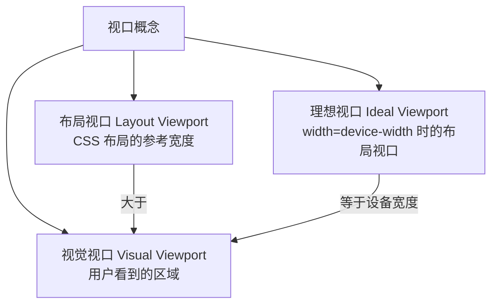
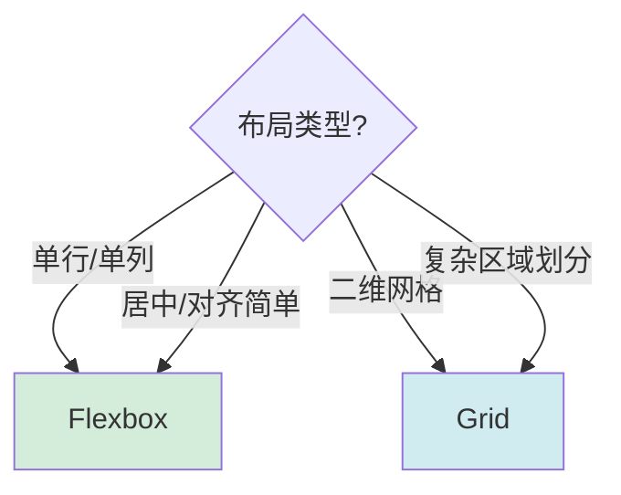
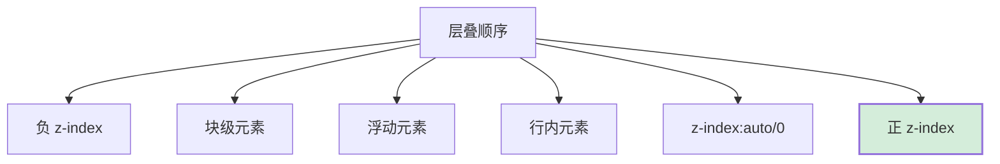
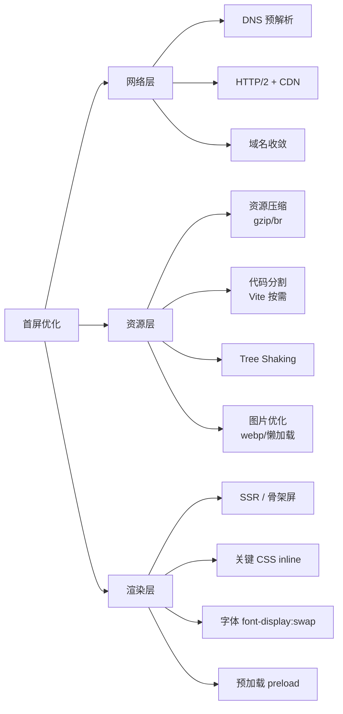
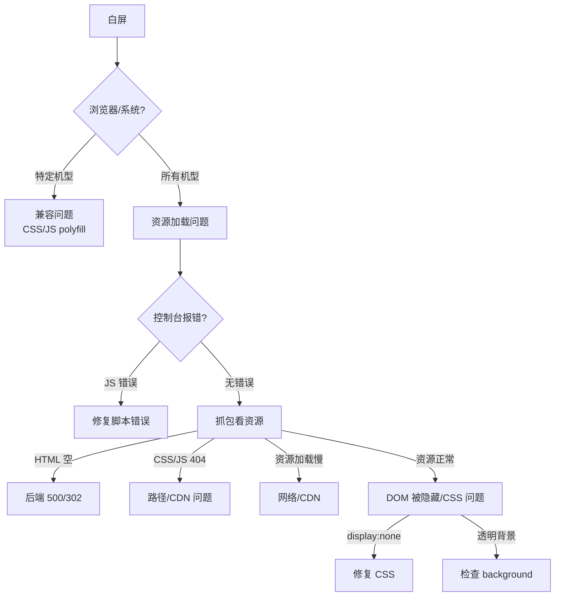
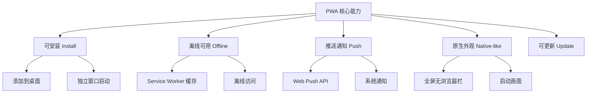
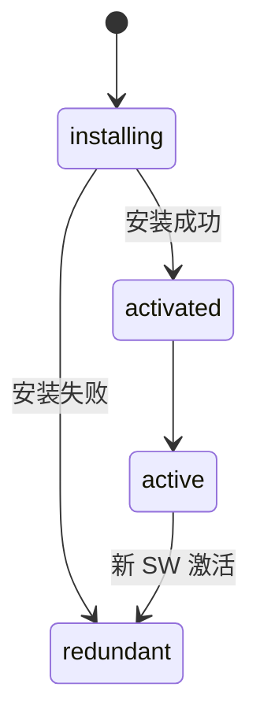
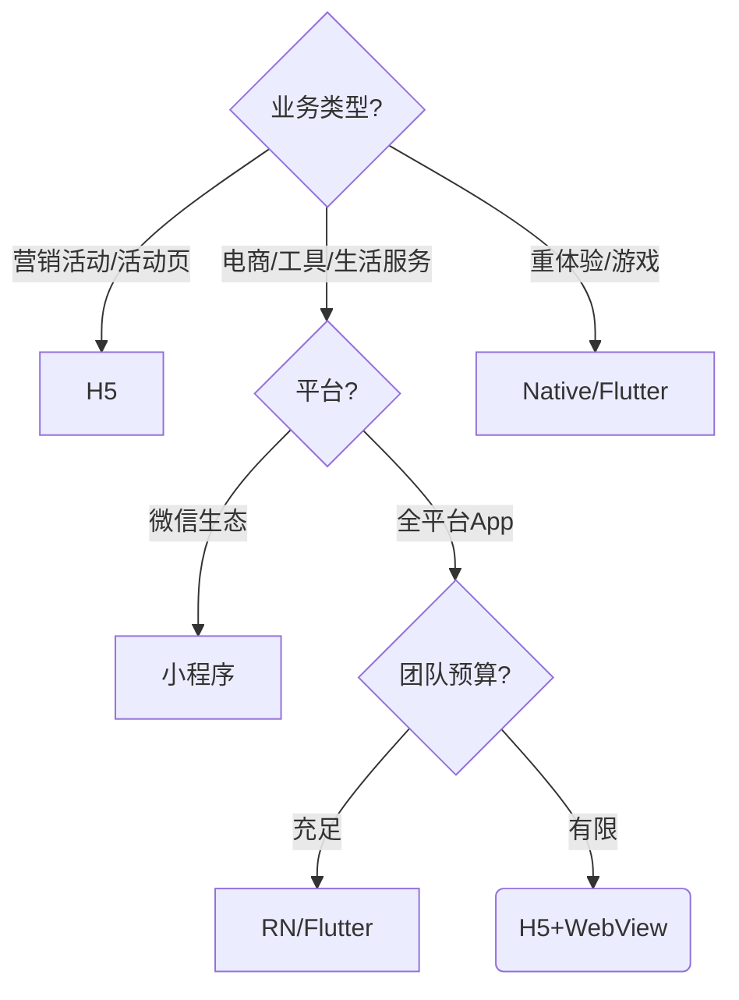
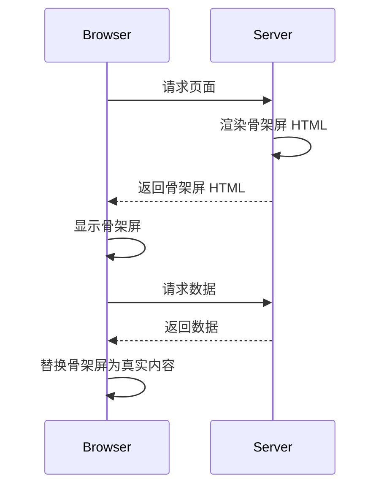

# H5 开发高频面试题与详细回答

> 文档定位：系统梳理 H5（移动端 Web）开发在面试中的高频问题，覆盖视口与布局、响应式适配、CSS3 新特性、移动端事件、性能优化、兼容性、移动端存储、PWA、以及工程化与跨端方案。
>
> 适用人群：移动端 H5 工程师、Hybrid 开发、跨端前端。
>
> 阅读建议：按章节由浅入深，重点关注视口适配、1px 边框、事件机制、性能优化四大核心模块，每道题的「实战踩坑」部分请仔细阅读。

---

## 目录

- [一、视口与移动端适配](#一视口与移动端适配)
  - [Q1. viewport 是什么？width=device-width 与 initial-scale 的作用？](#q1-viewport-是什么widthdevice-width-与-initial-scale-的作用)
  - [Q2. DPR（设备像素比）是什么？对 1px 边框的影响？](#q2-dpr设备像素比是什么对-1px-边框的影响)
  - [Q3. REM / VW / VM / EM 的区别与适配方案？](#q3-rem--vw--vm--em-的区别与适配方案)
  - [Q4. 如何做移动端响应式布局？](#q4-如何做移动端响应式布局)
  - [Q5. 安全区与刘海屏适配（safe-area-inset）？](#q5-安全区与刘海屏适配safe-area-inset)
- [二、CSS3 与布局](#二css3-与布局)
  - [Q6. Flexbox 与 Grid 的区别与选型？](#q6-flexbox-与-grid-的区别与选型)
  - [Q7. 如何实现 1px 边框？5 种方案对比](#q7-如何实现-1px-边框5-种方案对比)
  - [Q8. position 的所有值与区别？](#q8-position-的所有值与区别)
  - [Q9. BFC 是什么？如何触发与应用？](#q9-bfc-是什么如何触发与应用)
  - [Q10. CSS 层叠规则与 z-index 失效场景？](#q10-css-层叠规则与-z-index-失效场景)
  - [Q11. CSS 动画（transition / animation）与 GPU 合成层？](#q11-css-动画transition--animation与-gpu-合成层)
- [三、移动端事件机制](#三移动端事件机制)
  - [Q12. 移动端 Touch 事件有哪些？执行顺序？](#q12-移动端-touch-事件有哪些执行顺序)
  - [Q13. 移动端 click 300ms 延迟原因与解决方案？](#q13-移动端-click-300ms-延迟原因与解决方案)
  - [Q14. 什么是点击穿透（Ghost Click）？如何解决？](#q14-什么是点击穿透ghost-click如何解决)
  - [Q15. 如何实现一个长按、双击、滑动手势？](#q15-如何实现一个长按双击滑动手势)
  - [Q16. passive event listener 是什么？为什么能提升滚动性能？](#q16-passive-event-listener-是什么为什么能提升滚动性能)
- [四、移动端存储](#四移动端存储)
  - [Q17. Cookie / LocalStorage / SessionStorage / IndexedDB 的区别？](#q17-cookie--localstorage--sessionstorage--indexeddb-的区别)
  - [Q18. IndexedDB 的使用场景与基础 CRUD？](#q18-indexeddb-的使用场景与基础-crud)
  - [Q19. WebSQL 与 IndexedDB 的对比？](#q19-websql-与-indexeddb-的对比)
- [五、性能优化](#五性能优化)
  - [Q20. 移动端首屏优化全景方案？](#q20-移动端首屏优化全景方案)
  - [Q21. 图片优化策略（格式 / 懒加载 / 自适应）？](#q21-图片优化策略格式--懒加载--自适应)
  - [Q22. 如何实现图片懒加载？](#q22-如何实现图片懒加载)
  - [Q23. 虚拟列表（长列表优化）原理？](#q23-虚拟列表长列表优化原理)
  - [Q24. 如何排查移动端白屏与卡顿？](#q24-如何排查移动端白屏与卡顿)
  - [Q25. 内存泄漏常见场景与排查？](#q25-内存泄漏常见场景与排查)
- [六、移动端兼容性](#六移动端兼容性)
  - [Q26. iOS 与 Android WebView 的常见兼容差异？](#q26-ios-与-android-webview-的常见兼容差异)
  - [Q27. iOS 橡皮筋滚动（overscroll）如何解决？](#q27-ios-橡皮筋滚动overscroll如何解决)
  - [Q28. fixed 定位在移动端失效的场景与解决？](#q28-fixed-定位在移动端失效的场景与解决)
  - [Q29. 键盘弹出导致页面变形与输入框遮挡？](#q29-键盘弹出导致页面变形与输入框遮挡)
  - [Q30. new Date('2024-01-01') iOS 返回 NaN 原因？](#q30-new-date2024-01-01-ios-返回-nan-原因)
- [七、PWA 与增强能力](#七pwa-与增强能力)
  - [Q31. PWA 是什么？核心能力有哪些？](#q31-pwa-是什么核心能力有哪些)
  - [Q32. Service Worker 的生命周期与缓存策略？](#q32-service-worker-的生命周期与缓存策略)
  - [Q33. Manifest 文件配置与安装到桌面？](#q33-manifest-文件配置与安装到桌面)
- [八、工程化与跨端](#八工程化与跨端)
  - [Q34. 移动端 H5 工程化配置（Vite / PostCSS）？](#q34-移动端-h5-工程化配置vite--postcss)
  - [Q35. 移动端调试方法汇总？](#q35-移动端调试方法汇总)
  - [Q36. H5 / 小程序 / App / React Native 选型对比？](#q36-h5--小程序--app--react-native-选型对比)
- [九、综合实战题](#九综合实战题)
  - [Q37. 设计一个无限滚动列表组件？](#q37-设计一个无限滚动列表组件)
  - [Q38. 设计一个 H5 骨架屏方案？](#q38-设计一个-h5-骨架屏方案)
  - [Q39. 设计一个 H5 通用手势库？](#q39-设计一个-h5-通用手势库)
- [十、高频速答与踩坑总结](#十高频速答与踩坑总结)
  - [10.1 速答卡片（20 秒一题）](#101-速答卡片20-秒一题)
  - [10.2 实战踩坑 10 例](#102-实战踩坑-10-例)
  - [10.3 复习优先级表](#103-复习优先级表)

---

## 一、视口与移动端适配

### Q1. viewport 是什么？width=device-width 与 initial-scale 的作用？

#### 核心答案

viewport 是浏览器可视区域的抽象。移动端浏览器默认把页面放在一个**虚拟视口**（通常 980px）中渲染，再整体缩放至屏幕宽度，导致字很小。通过 `<meta name="viewport">` 可以控制虚拟视口尺寸。

#### 两个关键属性

| 属性 | 作用 |
|------|------|
| `width=device-width` | 把虚拟视口宽度设为设备物理宽度（如 375px），不缩放 |
| `initial-scale=1` | 初始缩放比例为 1，配合 width 保证 1 CSS px = 1 设备像素（受 DPR 影响） |

#### 标准写法

```html
<meta name="viewport"
      content="width=device-width, initial-scale=1.0, maximum-scale=1.0, user-scalable=no, viewport-fit=cover">
```

| 字段 | 作用 |
|------|------|
| `width=device-width` | 视口宽度=设备宽度 |
| `initial-scale=1.0` | 初始缩放 1 |
| `maximum-scale=1.0` | 禁止放大 |
| `user-scalable=no` | 禁止用户手动缩放（注意：iOS 10+ 会忽略） |
| `viewport-fit=cover` | 内容延伸到刘海屏安全区外（配合 safe-area） |

#### viewport 的 3 个概念



#### 项目实战踩坑

> **问题**：iOS 10+ `user-scalable=no` 失效，用户仍能双指缩放。
>
> **原因**：苹果为了可访问性强制允许缩放。
>
> **解决**：用 CSS 阻止手势缩放（`touch-action: manipulation`），但不推荐完全禁用。

---

### Q2. DPR（设备像素比）是什么？对 1px 边框的影响？

#### 核心答案

DPR (Device Pixel Ratio) = 物理像素 / CSS 像素。iPhone 6/7/8 是 2x，iPhone X+ 是 3x，部分 Android 可达 4x。

```
CSS 1px = 物理 DPR px

DPR=2: 1 CSS px = 2 物理 px（所以 1px 边框实际渲染 2 物理像素）
DPR=3: 1 CSS px = 3 物理 px（实际渲染 3 物理像素，看起来更粗）
```

#### 为什么 1px 边框在高分屏显得粗？

```
设计师要的"1px" = 1 物理像素（细线）
CSS 写 border: 1px solid = 在 DPR=2 屏上是 2 物理像素
→ 看起来比设计稿粗
```

#### 获取 DPR

```javascript
const dpr = window.devicePixelRatio; // 1 / 2 / 3
```

#### 1px 边框解决方案（见 Q7）

```
核心思路：用 CSS 缩放或伪元素实现 1 物理像素
```

---

### Q3. REM / VW / VM / EM 的区别与适配方案？

#### 单位对比

| 单位 | 含义 | 参考值 | 用途 |
|------|------|--------|------|
| `px` | 固定像素 | - | 边框、小图标 |
| `em` | 相对父元素 font-size | 父级字号 | 文本缩进、局部相对 |
| `rem` | 相对根元素 font-size | html 字号 | **全页面适配** |
| `vw` | 视口宽度百分比 | 视口宽度 1% | **响应式布局** |
| `vh` | 视口高度百分比 | 视口高度 1% | 满屏布局 |
| `vmin` | vw/vh 较小值 | - | 正方形等比 |
| `vmax` | vw/vh 较大值 | - | 全屏背景 |

#### REM 适配方案（传统）

```javascript
// flexible.js 核心：根据屏幕宽度动态设置 html font-size
function setRem() {
  const dpr = window.devicePixelRatio || 1;
  const screenWidth = document.documentElement.clientWidth;
  // 设计稿 750px，1rem = 75px
  const rem = (screenWidth * 75) / 750;
  document.documentElement.style.fontSize = rem + 'px';
}
setRem();
window.addEventListener('resize', setRem);
```

```css
/* 设计稿 750px，元素宽 100px → 100/75 = 1.33rem */
.box { width: 1.3333rem; height: 1.3333rem; }
```

#### VW 适配方案（推荐，现代）

```css
/* 设计稿 750px，1vw = 7.5px
   元素宽 100px → 100/7.5 = 13.333vw */
.box { width: 13.333vw; height: 13.333vw; }

/* 配合 postcss-px-to-viewport 自动转换 */
```

```javascript
// postcss.config.js
module.exports = {
  plugins: {
    'postcss-px-to-viewport': {
      viewportWidth: 750,        // 设计稿宽度
      unitPrecision: 5,
      viewportUnit: 'vw',
      selectorBlackList: ['.ignore'],
      minPixelValue: 1,
      mediaQuery: false,
    },
  },
};
```

#### 选型建议

| 方案 | 优点 | 缺点 | 适用 |
|------|------|------|------|
| REM + flexible | 兼容好 | JS 依赖、有闪烁 | 老项目 |
| VW | 纯 CSS、无 JS | 低版本浏览器不支持 | 新项目推荐 |
| REM + VW 混合 | 兼顾 | 配置复杂 | 复杂场景 |

#### 文字不建议用 vw/rem

```css
/* 文字用 px + 媒体查询，避免在大屏上过大 */
.title { font-size: 16px; }
@media (min-width: 414px) {
  .title { font-size: 18px; }
}
```

---

### Q4. 如何做移动端响应式布局？

#### 三种方案对比

| 方案 | 原理 | 适用 |
|------|------|------|
| **流式布局** | 百分比 + max-width | 简单页面 |
| **等比缩放** | REM / VW 整体缩放 | 设计稿严格还原 |
| **弹性布局** | Flexbox + 媒体查询 | 现代响应式 |

#### 典型 H5 布局架构

```css
/* 容器：最大宽度居中，小屏铺满 */
.container {
  max-width: 750px;
  margin: 0 auto;
  padding: 16px;
  box-sizing: border-box;
}

/* 使用 flex 实现等分布局 */
.row {
  display: flex;
  gap: 12px;
}
.col { flex: 1; }

/* 图片自适应 */
img {
  max-width: 100%;
  height: auto;
}

/* 大屏（iPad/平板）限制最大宽度 */
@media (min-width: 768px) {
  body { max-width: 750px; margin: 0 auto; }
}
```

#### 媒体查询断点

```css
/* 标准断点 */
@media (max-width: 320px) { /* 小屏 iPhone SE */ }
@media (min-width: 321px) and (max-width: 375px) { /* iPhone 6/7/8 */ }
@media (min-width: 376px) and (max-width: 414px) { /* iPhone Plus */ }
@media (min-width: 415px) { /* 大屏 / iPad */ }
```

---

### Q5. 安全区与刘海屏适配（safe-area-inset）？

#### iPhone 安全区

```
┌─────────────────────────────┐
│  safe-area-inset-top: 44px  │  ← 刘海
│                             │
│                             │
│                             │
│ safe-area-inset-bottom: 34px│  ← Home 指示条
└─────────────────────────────┘
```

#### CSS 适配

```css
/* viewport 必须加 viewport-fit=cover */
body {
  padding-top: constant(safe-area-inset-top);     /* iOS 11 */
  padding-top: env(safe-area-inset-top);           /* iOS 11.2+ */
  padding-bottom: constant(safe-area-inset-bottom);
  padding-bottom: env(safe-area-inset-bottom);
}

/* 底部固定 TabBar */
.tabbar {
  position: fixed;
  bottom: 0; left: 0; right: 0;
  height: calc(50px + env(safe-area-inset-bottom));
  padding-bottom: env(safe-area-inset-bottom);
}

/* 顶部固定导航 */
.navbar {
  position: fixed;
  top: 0; left: 0; right: 0;
  height: calc(44px + env(safe-area-inset-top));
  padding-top: env(safe-area-inset-top);
}
```

#### JS 动态获取安全区（兜底）

```javascript
function getSafeArea() {
  const style = getComputedStyle(document.documentElement);
  return {
    top: parseFloat(style.getPropertyValue('--sat')) || 0,
    bottom: parseFloat(style.getPropertyValue('--sab')) || 0,
    left: parseFloat(style.getPropertyValue('--sal')) || 0,
    right: parseFloat(style.getPropertyValue('--sar')) || 0,
  };
}

// 通过 CSS 变量读取 env 值
:root {
  --sat: env(safe-area-inset-top);
  --sab: env(safe-area-inset-bottom);
}
```

---

## 二、CSS3 与布局

### Q6. Flexbox 与 Grid 的区别与选型？

#### 核心区别

| 维度 | Flexbox | Grid |
|------|---------|------|
| 维度 | **一维**（行或列） | **二维**（行和列同时） |
| 控制 | 控制轴线方向的分布 | 同时控制行和列 |
| 适用 | 导航、列表、单行布局 | 网格、复杂二维布局 |
| 兼容性 | IE11 部分支持 | IE11 不支持，现代浏览器好 |

#### Flexbox 关键属性

```css
.flex {
  display: flex;
  flex-direction: row;        /* 主轴方向 row | column | row-reverse | column-reverse */
  justify-content: center;    /* 主轴对齐 flex-start | center | space-between | space-around */
  align-items: center;        /* 交叉轴对齐 flex-start | center | stretch */
  flex-wrap: wrap;            /* 换行 */
  gap: 12px;                  /* 间距 */
}
.item {
  flex: 1;                    /* flex-grow:1 flex-shrink:1 flex-basis:0% */
  flex-grow: 1;               /* 放大比例 */
  flex-shrink: 0;             /* 缩小比例 */
  flex-basis: 100px;          /* 初始大小 */
  order: 2;                   /* 排列顺序 */
  align-self: center;         /* 单独对齐 */
}
```

#### Grid 关键属性

```css
.grid {
  display: grid;
  grid-template-columns: repeat(3, 1fr);  /* 3 列等宽 */
  grid-template-rows: 100px 200px;        /* 行高 */
  gap: 16px;
}
.item-span {
  grid-column: span 2;   /* 跨 2 列 */
  grid-row: span 2;      /* 跨 2 行 */
}
```

#### 选型决策



---

### Q7. 如何实现 1px 边框？5 种方案对比

#### 方案1：transform scale（推荐）

```css
.border-1px {
  position: relative;
}
.border-1px::after {
  content: '';
  position: absolute;
  left: 0; top: 0;
  width: 200%; height: 200%;
  border: 1px solid #ddd;
  transform: scale(0.5);
  transform-origin: 0 0;
  box-sizing: border-box;
  pointer-events: none;
}
/* DPR=3 时用 scale(0.333) */
@media (-webkit-min-device-pixel-ratio: 3) {
  .border-1px::after { transform: scale(0.333); }
}
```

#### 方案2：box-shadow

```css
.box {
  box-shadow: 0 0 0 1px #ddd;
  /* DPR=3 时用 0.333px */
  box-shadow: 0 0 0 0.5px #ddd;
}
```

#### 方案3：linear-gradient 背景

```css
.border-bottom {
  background-image: linear-gradient(
    to bottom,
    transparent 50%,
    #ddd 50%
  );
  background-size: 100% 1px;
  background-repeat: no-repeat;
  background-position: bottom;
}
```

#### 方案4：SVG 边框（适合圆角）

```css
.radius-border {
  border: 1px solid transparent;
  background-image: linear-gradient(#fff, #fff),
                    linear-gradient(#ddd, #ddd);
  background-origin: border-box;
  background-clip: padding-box, border-box;
}
```

#### 方案5：viewport meta + initial-scale

```html
<!-- 动态设置缩放使 1px = 1 物理像素 -->
<meta name="viewport" content="width=device-width, initial-scale=1, maximum-scale=1">
<script>
  const dpr = window.devicePixelRatio;
  const viewport = document.querySelector('meta[name=viewport]');
  viewport.setAttribute('content',
    `width=device-width,initial-scale=${1/dpr},maximum-scale=${1/dpr},user-scalable=no`);
</script>
```

#### 方案对比

| 方案 | 优点 | 缺点 | 推荐度 |
|------|------|------|--------|
| transform scale | 兼容性好、灵活 | 伪元素占用 | ⭐⭐⭐⭐⭐ |
| box-shadow | 简单 | 部分 Android 不支持 0.5px | ⭐⭐⭐⭐ |
| linear-gradient | 无需伪元素 | 只能单边 | ⭐⭐⭐ |
| SVG | 圆角完美 | 复杂 | ⭐⭐⭐ |
| viewport scale | 全局生效 | 影响所有 px | ⭐⭐ |

---

### Q8. position 的所有值与区别？

| 值 | 定位方式 | 相对基准 | 是否脱离文档流 |
|----|---------|---------|---------------|
| `static` | 默认 | 正常文档流 | 否 |
| `relative` | 相对定位 | **自身原来的位置** | 否（仍占空间） |
| `absolute` | 绝对定位 | **最近的定位祖先**（非 static） | 是 |
| `fixed` | 固定定位 | **视口** | 是 |
| `sticky` | 粘性定位 | 滚动容器 | 否（滚动时临时脱离） |
| `inherit` | 继承父级 | - | - |

#### sticky 详解（移动端常用）

```css
/* 滚动到指定位置时固定 */
.sticky-header {
  position: sticky;
  top: 0;
  background: #fff;
  z-index: 100;
}

/* 注意：sticky 不生效的常见原因
   1. 父元素 overflow: hidden/auto
   2. 父元素高度不够
   3. 没有设置 top/left
*/
```

#### absolute 定位层叠

```html
<div class="parent">
  <div class="child"></div>
</div>
<style>
  .parent { position: relative; }  /* 作为定位基准 */
  .child  { position: absolute; top: 0; right: 0; }
</style>
```

---

### Q9. BFC 是什么？如何触发与应用？

#### 核心答案

BFC (Block Formatting Context) 块级格式化上下文，是一个独立的渲染区域，内部元素不会影响外部，外部也不会影响内部。

#### 触发 BFC 的条件

| 条件 | CSS 属性 |
|------|---------|
| 根元素 | `html` |
| 浮动 | `float: left/right` |
| 绝对定位 | `position: absolute/fixed` |
| 行内块 | `display: inline-block` |
| 表格单元格 | `display: table-cell` |
| 弹性盒子 | `display: flex/grid` |
| 溢出 | `overflow: hidden/auto/scroll`（非 visible） |

#### 经典应用1：清除浮动

```css
/* ❌ 父元素高度塌陷 */
.parent { /* 没有高度 */ }
.child { float: left; }

/* ✅ 触发 BFC 清除浮动 */
.parent { overflow: hidden; }  /* 或 */
.parent::after {
  content: '';
  display: block;
  clear: both;
}
```

#### 经典应用2：阻止外边距合并

```css
/* ❌ 父子 margin 合并（margin 传递） */
.parent { background: #eee; }
.child  { margin-top: 50px; }  /* 实际 parent 也下移 50px */

/* ✅ 父元素触发 BFC，阻止 margin 传递 */
.parent { overflow: hidden; }
```

#### 经典应用3：两栏自适应布局

```css
.sidebar { float: left; width: 200px; }
.content { overflow: hidden; }  /* 触发 BFC，不被浮动覆盖 */
```

---

### Q10. CSS 层叠规则与 z-index 失效场景？

#### 层叠顺序（从下到上）

```
1. 背景和边框（形成层叠上下文的元素）
2. 负 z-index 子元素
3. 块级元素（文档流）
4. 浮动元素
5. 行内元素（文档流）
6. z-index: 0 或 auto 的定位元素
7. 正 z-index 定位元素
```



#### z-index 失效的常见原因

| 原因 | 说明 |
|------|------|
| **父元素未创建层叠上下文** | z-index 只在同上下文比较 |
| **元素未定位** | z-index 只对 position 非 static 生效 |
| **父元素 z-index 低** | 子元素再高也被父级上下文限制 |
| **transform 影响** | 父元素有 transform 会创建层叠上下文 |
| **opacity < 1** | 透明度会创建层叠上下文 |
| **will-change** | 会创建层叠上下文 |

#### 层叠上下文创建条件

```css
/* 以下任一属性都会创建新的层叠上下文 */
z-index: <number>;          /* 定位元素上 */
opacity: 0.5;               /* < 1 */
transform: ...;
filter: ...;
will-change: transform;
isolation: isolate;
```

---

### Q11. CSS 动画（transition / animation）与 GPU 合成层？

#### transition 与 animation 对比

| 维度 | transition | animation |
|------|-----------|-----------|
| 触发 | 状态变化（hover/active） | 自动播放 / 可循环 |
| 关键帧 | 只有起止状态 | 多关键帧 @keyframes |
| 控制 | 简单 | 复杂（iteration/direction/fill） |
| 适合 | 简单过渡 | 复杂动画 |

#### transition 用法

```css
.box {
  transition: all 0.3s ease;  /* 属性 时长 缓动 延迟 */
  transition: transform 0.3s cubic-bezier(0.4, 0, 0.2, 1);
}
.box:hover { transform: translateX(20px); }
```

#### animation 用法

```css
@keyframes fadeIn {
  from { opacity: 0; transform: translateY(20px); }
  to   { opacity: 1; transform: translateY(0); }
}
.box {
  animation: fadeIn 0.5s ease forwards;
  /* 完整写法 */
  animation-name: fadeIn;
  animation-duration: 0.5s;
  animation-timing-function: ease;
  animation-delay: 0s;
  animation-iteration-count: 1;      /* 或 infinite */
  animation-direction: normal;       /* normal | reverse | alternate */
  animation-fill-mode: forwards;     /* none | forwards | backwards | both */
}
```

#### 性能：用 transform / opacity，不用 left/top

```css
/* ❌ 慢：触发 layout → paint → composite */
.box { left: 0; transition: left 0.3s; }
.box:hover { left: 100px; }

/* ✅ 快：只触发 composite（GPU 合成） */
.box { transform: translateX(0); transition: transform 0.3s; }
.box:hover { transform: translateX(100px); }
```

#### will-change 主动声明

```css
.box { will-change: transform; }  /* 告诉浏览器提前优化 */
/* 注意：过度使用 will-change 会占用 GPU 内存，用完要移除 */
```

---

## 三、移动端事件机制

### Q12. 移动端 Touch 事件有哪些？执行顺序？

#### Touch 事件列表

| 事件 | 触发时机 |
|------|---------|
| `touchstart` | 手指触摸屏幕 |
| `touchmove` | 手指在屏幕上移动 |
| `touchend` | 手指离开屏幕 |
| `touchcancel` | 系统中断触摸（如来电） |

#### 事件执行顺序

```
touchstart → touchmove → touchmove → ... → touchend → click
```

#### Touch 对象的三个列表

| 属性 | 含义 |
|------|------|
| `touches` | 当前所有触摸点 |
| `targetTouches` | 目标元素上的触摸点 |
| `changedTouches` | 本次事件变化的触摸点 |

#### 代码示例

```javascript
el.addEventListener('touchstart', (e) => {
  const touch = e.touches[0];
  console.log(touch.clientX, touch.clientY);   // 视口坐标
  console.log(touch.pageX, touch.pageY);       // 页面坐标
  console.log(touch.screenX, touch.screenY);   // 屏幕坐标
  console.log(touch.identifier);               // 触摸点唯一 ID（多指区分）
});
```

#### 禁止默认行为

```javascript
// 禁止页面滚动、缩放、长按弹出菜单
el.addEventListener('touchstart', (e) => {
  e.preventDefault();  // 阻止默认行为
}, { passive: false });
```

---

### Q13. 移动端 click 300ms 延迟原因与解决方案？

#### 原因

```
移动端浏览器默认双击缩放，因此在 touchend 后等待 ~300ms
判断用户是否双击，再触发 click。
```

#### 解决方案

| 方案 | 说明 | 推荐度 |
|------|------|--------|
| **`<meta viewport user-scalable=no>`** | 禁止缩放，部分浏览器去掉延迟 | ⭐⭐⭐ |
| **CSS `touch-action: manipulation`** | 禁用双击缩放 | ⭐⭐⭐⭐⭐ |
| **FastClick 库** | 用 touchend 模拟 click | ⭐⭐⭐（老方案） |
| **直接用 touchend** | 自定义事件 | ⭐⭐ |

#### touch-action 方案（推荐）

```css
/* 全局禁用双击缩放延迟 */
* {
  touch-action: manipulation;
}

/* 更精细：只给可点击元素 */
button, a, [role="button"] {
  touch-action: manipulation;
}
```

#### FastClick 原理

```javascript
// FastClick 核心：在 touchend 时立即触发 click
FastClick.prototype.onTouchEnd = function(event) {
  // ...
  event.preventDefault();
  targetElement.click();  // 立即触发 click
};
```

---

### Q14. 什么是点击穿透（Ghost Click）？如何解决？

#### 问题现象

```
场景：蒙层 + 按钮，点击蒙层关闭
现象：蒙层关闭后，按钮被"自动"点击
原因：touchstart/touchend 立即关闭蒙层，300ms 后 click 事件穿透到下层按钮
```

#### 解决方案

**方案1：延迟关闭蒙层**

```javascript
mask.addEventListener('touchend', (e) => {
  e.preventDefault();
  setTimeout(() => mask.style.display = 'none', 350);  // 等 click 触发完
});
```

**方案2：用 click 事件而非 touch**

```javascript
// 用 click 事件，与系统 click 同步
mask.addEventListener('click', () => {
  mask.style.display = 'none';
});
```

**方案3：阻止穿透的"幽灵点击"**

```javascript
// 用 pointer-events 临时禁用下层
mask.addEventListener('touchend', () => {
  document.body.style.pointerEvents = 'none';
  setTimeout(() => {
    document.body.style.pointerEvents = 'auto';
  }, 400);
  mask.style.display = 'none';
});
```

---

### Q15. 如何实现一个长按、双击、滑动手势？

#### 手势识别器

```javascript
class GestureRecognizer {
  constructor(el) {
    this.el = el;
    this.startX = 0;
    this.startY = 0;
    this.startTime = 0;
    this.timer = null;
    this.lastTapTime = 0;
    this.bind();
  }

  bind() {
    this.el.addEventListener('touchstart', (e) => {
      const t = e.touches[0];
      this.startX = t.clientX;
      this.startY = t.clientY;
      this.startTime = Date.now();

      // 长按检测
      this.timer = setTimeout(() => {
        this.emit('longpress', { x: this.startX, y: this.startY });
      }, 500);
    }, { passive: true });

    this.el.addEventListener('touchmove', (e) => {
      const t = e.touches[0];
      const dx = t.clientX - this.startX;
      const dy = t.clientY - this.startY;

      // 移动超过 10px 取消长按
      if (Math.abs(dx) > 10 || Math.abs(dy) > 10) {
        clearTimeout(this.timer);
      }
    }, { passive: true });

    this.el.addEventListener('touchend', (e) => {
      clearTimeout(this.timer);
      const t = e.changedTouches[0];
      const dx = t.clientX - this.startX;
      const dy = t.clientY - this.startY;
      const duration = Date.now() - this.startTime;

      // 滑动识别
      if (Math.abs(dx) > 50 || Math.abs(dy) > 50) {
        if (Math.abs(dx) > Math.abs(dy)) {
          this.emit(dx > 0 ? 'swiperight' : 'swipeleft', { dx, dy });
        } else {
          this.emit(dy > 0 ? 'swipedown' : 'swipeup', { dx, dy });
        }
        return;
      }

      // 点击 / 双击
      if (duration < 300) {
        const now = Date.now();
        if (now - this.lastTapTime < 300) {
          this.emit('doubletap', { x: t.clientX, y: t.clientY });
          this.lastTapTime = 0;
        } else {
          this.lastTapTime = now;
          this.emit('tap', { x: t.clientX, y: t.clientY });
        }
      }
    });
  }

  emit(event, detail) {
    this.el.dispatchEvent(new CustomEvent(event, { detail }));
  }
}

// 使用
const gesture = new GestureRecognizer(document.body);
document.body.addEventListener('swipeleft', (e) => {
  console.log('左滑', e.detail);
});
document.body.addEventListener('longpress', () => console.log('长按'));
document.body.addEventListener('doubletap', () => console.log('双击'));
```

---

### Q16. passive event listener 是什么？为什么能提升滚动性能？

#### 核心答案

`passive: true` 告诉浏览器：**这个事件监听器不会调用 `preventDefault()`**，浏览器可以立即执行滚动，无需等待 JS 执行完毕。

#### 性能问题来源

```
默认情况：
  touchstart 触发 → 等 JS 执行完（判断是否 preventDefault）→ 才滚动
  若 JS 耗时 50ms → 滚动延迟 50ms

passive: true：
  touchstart 触发 → 立即滚动（不等 JS）
  滚动响应无延迟
```

#### 使用

```javascript
// ✅ 推荐：滚动、触摸事件用 passive
document.addEventListener('touchstart', handler, { passive: true });
document.addEventListener('wheel', handler, { passive: true });

// ❌ 需要 preventDefault 时不能用 passive
el.addEventListener('touchmove', (e) => {
  e.preventDefault();  // 需要阻止默认
}, { passive: false });
```

#### 浏览器告警

```
[Violation] Added non-passive event listener to a scroll-blocking event.
→ 说明：Chrome 会在控制台提示，需要加 passive: true
```

#### 项目实战踩坑

> **问题**：给滚动容器加了 `touchmove` 监听器但没加 `passive`，页面滚动卡顿。
>
> **解决**：加 `{ passive: true }`，需要阻止时再设 `passive: false`。

---

## 四、移动端存储

### Q17. Cookie / LocalStorage / SessionStorage / IndexedDB 的区别？

| 维度 | Cookie | LocalStorage | SessionStorage | IndexedDB |
|------|--------|-------------|----------------|-----------|
| 容量 | **4KB** | **5MB** | 5MB | **不限**（通常 > 50MB） |
| 生命周期 | 可设置过期时间 | 永久（手动清除） | 标签页关闭即清除 | 永久 |
| 与服务端 | 每次请求自动携带 | 不携带 | 不携带 | 不携带 |
| 数据类型 | 字符串 | 字符串 | 字符串 | 对象 / 二进制 |
| API | 同步 | 同步 | 同步 | **异步** |
| 支持索引 | ❌ | ❌ | ❌ | ✅ |
| 事务 | ❌ | ❌ | ❌ | ✅ |
| 跨标签 | ✅ | ✅ | ❌ | ✅ |

#### 使用场景

| 存储 | 典型场景 |
|------|---------|
| Cookie | 登录态（sessionId）、追踪标识 |
| LocalStorage | 用户偏好、UI 状态、非敏感缓存 |
| SessionStorage | 表单临时数据、单次会话状态 |
| IndexedDB | 离线应用缓存、大量数据、结构化存储 |

#### 代码示例

```javascript
// Cookie
document.cookie = 'token=abc123; max-age=3600; path=/; Secure; HttpOnly';

// LocalStorage
localStorage.setItem('theme', 'dark');
const theme = localStorage.getItem('theme');
localStorage.removeItem('theme');

// IndexedDB（见 Q18）
```

#### 安全建议

```
✅ 敏感数据放 Cookie 加 HttpOnly + Secure + SameSite
✅ Token 等认证信息优先 HttpOnly Cookie（防 XSS）
❌ 不要在 LocalStorage 存密码、Token（XSS 可窃取）
```

---

### Q18. IndexedDB 的使用场景与基础 CRUD？

#### 使用场景

- 离线应用（PWA）缓存大量数据
- 结构化数据存储（替代 WebSQL）
- 图片、文件等二进制数据
- 需要索引查询的场景

#### 基础 CRUD

```javascript
class IndexedDBStore {
  constructor(dbName, storeName) {
    this.dbName = dbName;
    this.storeName = storeName;
    this.db = null;
  }

  async open() {
    return new Promise((resolve, reject) => {
      const request = indexedDB.open(this.dbName, 1);

      request.onupgradeneeded = (e) => {
        const db = e.target.result;
        if (!db.objectStoreNames.contains(this.storeName)) {
          // 创建表，主键 id
          const store = db.createObjectStore(this.storeName, { keyPath: 'id' });
          // 创建索引
          store.createIndex('name', 'name', { unique: false });
        }
      };

      request.onsuccess = (e) => {
        this.db = e.target.result;
        resolve(this.db);
      };
      request.onerror = (e) => reject(e.target.error);
    });
  }

  async add(data) {
    return this._transaction('readwrite', (store) => store.add(data));
  }

  async get(id) {
    return this._transaction('readonly', (store) => store.get(id));
  }

  async put(data) {
    return this._transaction('readwrite', (store) => store.put(data));
  }

  async delete(id) {
    return this._transaction('readwrite', (store) => store.delete(id));
  }

  async getAll() {
    return this._transaction('readonly', (store) => store.getAll());
  }

  _transaction(mode, fn) {
    return new Promise((resolve, reject) => {
      const tx = this.db.transaction(this.storeName, mode);
      const store = tx.objectStore(this.storeName);
      const request = fn(store);
      request.onsuccess = () => resolve(request.result);
      request.onerror = () => reject(request.error);
    });
  }
}

// 使用
const db = new IndexedDBStore('myDB', 'users');
await db.open();
await db.add({ id: 1, name: 'Tom', age: 20 });
const user = await db.get(1);
```

---

### Q19. WebSQL 与 IndexedDB 的对比？

| 维度 | WebSQL | IndexedDB |
|------|--------|-----------|
| 数据模型 | 关系型（SQL） | NoSQL（对象存储） |
| 查询语言 | SQL | 索引 + 游标 |
| 标准 | **已废弃**（W3C 停止维护） | **现行标准** |
| 浏览器支持 | Chrome/Safari（部分） | 所有现代浏览器 |
| 事务 | 支持 | 支持 |
| 推荐使用 | ❌ 新项目不要用 | ✅ 推荐 |

> **注意**：WebSQL 已被官方废弃，新项目一律使用 IndexedDB。微信小程序提供了类似 WebSQL 的 `wx.openDatabase`，但底层可能是 SQLite 或 IndexedDB 实现。

---

## 五、性能优化

### Q20. 移动端首屏优化全景方案？



#### 关键代码

**DNS 预解析 + 预连接**

```html
<head>
  <link rel="dns-prefetch" href="//cdn.example.com">
  <link rel="preconnect" href="//api.example.com" crossorigin>
  <link rel="preload" href="/css/app.css" as="style">
  <link rel="preload" href="/fonts/icon.woff2" as="font" crossorigin>
</head>
```

**关键 CSS Inline**

```html
<style>
  /* 首屏必须的样式直接 inline */
  body { margin: 0; font-family: sans-serif; }
  .skeleton { background: #f0f0f0; }
</style>
<!-- 非关键样式异步加载 -->
<link rel="preload" href="/css/non-critical.css" as="style"
      onload="this.rel='stylesheet'">
```

---

### Q21. 图片优化策略（格式 / 懒加载 / 自适应）？

#### 图片格式选择

| 格式 | 透明 | 动画 | 压缩率 | 适用 |
|------|------|------|--------|------|
| JPG | ❌ | ❌ | 中 | 照片 |
| PNG | ✅ | ❌ | 低 | 图标、透明图 |
| WebP | ✅ | ✅ | 高 | **推荐**（比 JPG 小 25-35%） |
| AVIF | ✅ | ✅ | 最高 | 高质量场景（兼容性略差） |
| GIF | ✅ | ✅ | 低 | 小动画（可用 WebP 替代） |
| SVG | ✅ | ✅ | 高 | 矢量图标 |

#### 使用 <picture> 自适应格式

```html
<picture>
  <source srcset="photo.avif" type="image/avif">
  <source srcset="photo.webp" type="image/webp">
  
</picture>
```

#### 自适应尺寸（响应式图片）

```html

```

#### WebP 检测

```javascript
function supportWebp() {
  return document.createElement('canvas').toDataURL('image/webp').indexOf('data:image/webp') === 0;
}
```

---

### Q22. 如何实现图片懒加载？

#### 方案1：loading="lazy"（原生，推荐）

```html

```

`loading="lazy"` 是浏览器原生支持，兼容性好（Chrome 77+、Safari 15.4+）。

#### 方案2：IntersectionObserver

```javascript
class LazyImage {
  constructor() {
    this.observer = new IntersectionObserver((entries) => {
      entries.forEach(entry => {
        if (entry.isIntersecting) {
          const img = entry.target;
          img.src = img.dataset.src;
          img.removeAttribute('data-src');
          this.observer.unobserve(img);
        }
      });
    }, {
      rootMargin: '50px 0px',  // 提前 50px 加载
      threshold: 0.01,
    });
  }

  observe(img) {
    this.observer.observe(img);
  }
}

// HTML: 
const lazy = new LazyImage();
document.querySelectorAll('img[data-src]').forEach(img => lazy.observe(img));
```

#### 方案3：scroll 监听（老浏览器兼容）

```javascript
// 节流
let ticking = false;
window.addEventListener('scroll', () => {
  if (!ticking) {
    requestAnimationFrame(() => {
      checkImages();
      ticking = false;
    });
    ticking = true;
  }
});

function checkImages() {
  document.querySelectorAll('img[data-src]').forEach(img => {
    const rect = img.getBoundingClientRect();
    if (rect.top < window.innerHeight && rect.bottom > 0) {
      img.src = img.dataset.src;
      img.removeAttribute('data-src');
    }
  });
}
```

---

### Q23. 虚拟列表（长列表优化）原理？

#### 核心原理

```
只渲染可见区域 + 缓冲区的 DOM，滚动时动态替换数据。
10000 条数据 → 只渲染约 20 个 DOM 节点 → 滚动流畅
```

#### 实现代码

```javascript
class VirtualList {
  constructor(container, items, itemHeight = 50) {
    this.container = container;
    this.items = items;
    this.itemHeight = itemHeight;
    this.buffer = 5;
    this.init();
  }

  init() {
    // 创建占位容器（撑开总高度）
    this.phantom = document.createElement('div');
    this.phantom.style.height = this.items.length * this.itemHeight + 'px';
    this.container.appendChild(this.phantom);

    // 创建实际渲染层
    this.list = document.createElement('div');
    this.list.style.position = 'absolute';
    this.list.style.top = '0';
    this.list.style.left = '0';
    this.container.style.position = 'relative';
    this.container.style.overflow = 'auto';
    this.container.appendChild(this.list);

    this.container.addEventListener('scroll', () => this.render());
    this.render();
  }

  render() {
    const scrollTop = this.container.scrollTop;
    const viewportH = this.container.clientHeight;

    const startIndex = Math.max(0, Math.floor(scrollTop / this.itemHeight) - this.buffer);
    const visibleCount = Math.ceil(viewportH / this.itemHeight) + this.buffer * 2;
    const endIndex = Math.min(this.items.length, startIndex + visibleCount);

    this.list.style.transform = `translateY(${startIndex * this.itemHeight}px)`;

    this.list.innerHTML = this.items.slice(startIndex, endIndex)
      .map((item, i) =>
        `<div style="height:${this.itemHeight}px;box-sizing:border-box">
          ${startIndex + i}: ${item.name}
        </div>`
      ).join('');
  }
}

// 使用
const items = Array.from({ length: 10000 }, (_, i) => ({ name: `Item ${i}` }));
new VirtualList(document.querySelector('#container'), items, 50);
```

#### 动态高度方案

```javascript
// 每项高度不同时，需要计算累计高度
function getTotalHeight(heights) {
  return heights.reduce((sum, h) => sum + h, 0);
}

// 二分查找 startIndex
function findStartIndex(heights, scrollTop) {
  let left = 0, right = heights.length, acc = 0;
  while (left < right) {
    const mid = (left + right) >> 1;
    acc = heights.slice(0, mid).reduce((s, h) => s + h, 0);
    if (acc < scrollTop) left = mid + 1;
    else right = mid;
  }
  return Math.max(0, left - 1);
}
```

---

### Q24. 如何排查移动端白屏与卡顿？

#### 白屏排查流程



#### 卡顿排查思路

| 现象 | 可能原因 | 工具 |
|------|---------|------|
| 滚动掉帧 | 长列表 DOM 过多 / 大图片 | Chrome Performance |
| 首屏慢 | 大 JS / 无 SSR | Lighthouse |
| 操作响应慢 | 主线程长任务 | Performance |
| 动画卡顿 | 用 left/top 动画 | 改 transform |

#### 工具

- **Chrome DevTools Performance**：录制操作，分析长任务、重排重绘
- **Lighthouse**：首屏性能打分
- **Chrome Remote Debug**：`chrome://inspect` 调试 Android WebView
- **vConsole / Eruda**：真机查看 console、network
- **Systrace**（Android）：系统级性能分析

---

### Q25. 内存泄漏常见场景与排查？

#### 常见泄漏场景

| 场景 | 原因 | 解决 |
|------|------|------|
| **定时器未清理** | setInterval/setTimeout 未清除 | 组件卸载 clearInterval |
| **事件监听器** | addEventListener 未 remove | 对应 removeEventListener |
| **闭包持有 DOM** | 闭包引用已移除的 DOM | 避免闭包持有大对象 |
| **全局变量** | 意外全局变量 | 严格模式 / 检查 |
| **WebSocket** | 未关闭连接 | close() |
| **定时器中的回调** | 持有组件引用 | 用 WeakMap / 解绑 |
| **console.log 大对象** | 开发环境保留引用 | 生产移除 console |

#### 排查方法

```javascript
// 1. Chrome DevTools Memory 面板，对比两次 Heap Snapshot
// 2. 查找 Detached DOM nodes（游离 DOM）
// 3. 查找保留的对象引用链

// 自动检测内存增长
let lastHeapSize = 0;
setInterval(() => {
  if (performance.memory) {
    const current = performance.memory.usedJSHeapSize;
    if (current > lastHeapSize * 1.5) {
      console.warn('内存可能泄漏:', current);
    }
    lastHeapSize = current;
  }
}, 5000);
```

#### 清理模式（SPA 中）

```javascript
class Component {
  mounted() {
    this.timer = setInterval(() => {}, 1000);
    this.handler = () => {};
    window.addEventListener('scroll', this.handler);
    this.ws = new WebSocket('wss://...');
  }

  unmount() {
    clearInterval(this.timer);
    window.removeEventListener('scroll', this.handler);
    this.ws.close();
    this.handler = null;
  }
}
```

---

## 六、移动端兼容性

### Q26. iOS 与 Android WebView 的常见兼容差异？

| 问题 | iOS WKWebView | Android WebView | 解决 |
|------|---------------|-----------------|------|
| `input[type=date]` | 原生控件 | 样式可定制 | 统一隐藏 + 自定义 picker |
| `-webkit-overflow-scrolling` | 必须加 `touch` | 无此属性 | iOS 条件加 |
| `position: fixed` | 键盘弹出时偏移 | 受 soft input 影响 | 改用 absolute |
| `backdrop-filter` | 支持（需前缀） | 版本差异大 | 加前缀 + 降级 |
| `<video>` 自动播放 | 需 `playsinline` | 需用户手势 | 加 playsinline/muted |
| `:active` 伪类 | 默认不生效 | 生效 | 加 `body { -webkit-tap-highlight-color: transparent }` |
| 触摸高亮 | 灰色高亮 | 灰色高亮 | `-webkit-tap-highlight-color: transparent` |
| 滚动惯性 | 默认有 | 各 ROM 不同 | iOS 加 `-webkit-overflow-scrolling: touch` |
| `new Date('2024-01-01')` | NaN | OK | 统一用 `/` |

#### 通用 CSS 兼容前缀

```css
/* 自动加前缀用 Autoprefixer */
.box {
  -webkit-transform: translateX(10px);
  -ms-transform: translateX(10px);
  transform: translateX(10px);
}

/* postcss.config.js */
module.exports = {
  plugins: [
    require('autoprefixer')({
      overrideBrowserslist: ['iOS >= 10', 'Android >= 4.4']
    })
  ]
};
```

---

### Q27. iOS 橡皮筋滚动（overscroll）如何解决？

#### 现象

页面滚动到顶/底时继续滑动会出现橡皮筋回弹。嵌套滚动时，子容器滚到底后会触发外层页面回弹。

#### 方案1：body 不滚动，内部容器滚动

```css
html, body {
  height: 100%;
  overflow: hidden;  /* 关闭 body 滚动 */
}
.scroll-content {
  height: 100%;
  overflow-y: auto;
  -webkit-overflow-scrolling: touch;
}
```

#### 方案2：JS 阻止边界滚动传递

```javascript
document.querySelectorAll('.scroll-inner').forEach(el => {
  let startY = 0;
  el.addEventListener('touchstart', e => {
    startY = e.touches[0].clientY;
  }, { passive: false });

  el.addEventListener('touchmove', e => {
    const dy = e.touches[0].clientY - startY;
    const { scrollTop, scrollHeight, clientHeight } = el;
    // 顶部下拉
    if (scrollTop === 0 && dy > 0) e.preventDefault();
    // 底部上拉
    if (scrollTop + clientHeight >= scrollHeight && dy < 0) e.preventDefault();
  }, { passive: false });
});
```

#### 方案3：overscroll-behavior（现代浏览器）

```css
.scroll-inner {
  overscroll-behavior: contain;  /* 阻止滚动传递 */
}
body {
  overscroll-behavior: none;     /* 禁用橡皮筋 */
}
```

---

### Q28. fixed 定位在移动端失效的场景与解决？

#### 失效场景

1. **iOS 键盘弹出**：fixed 元素随键盘上移或被遮挡
2. **父元素有 transform**：fixed 相对最近的 transform 祖先定位（非视口）
3. **WebView 软键盘**：Android adjustResize 模式下视口变化

#### 解决：改用 absolute + 滚动容器

```css
/* ❌ fixed 在键盘场景下不稳定 */
.header {
  position: fixed;
  top: 0;
}

/* ✅ 用 absolute，外层做滚动容器 */
.page {
  position: absolute;
  top: 0; bottom: 0;
  width: 100%;
  overflow-y: auto;
}
.page-header {
  position: absolute;
  top: 0; left: 0; right: 0;
  height: 44px;
}
.page-body {
  padding-top: 44px;
  padding-bottom: 50px;
}
.page-footer {
  position: absolute;
  bottom: 0; left: 0; right: 0;
  height: 50px;
}
```

#### 父级 transform 问题

```css
/* ❌ 父元素有 transform，子元素 fixed 失效 */
.parent { transform: translateZ(0); }
.child { position: fixed; top: 0; }  /* 相对 parent 而非视口 */

/* ✅ 移除父级 transform，或用 absolute 替代 */
.parent { /* 移除 transform */ }
.child { position: absolute; top: 0; }
```

---

### Q29. 键盘弹出导致页面变形与输入框遮挡？

#### iOS 处理

```javascript
// iOS 键盘弹起时，输入框滚动到可见区域
input.addEventListener('focus', () => {
  setTimeout(() => {
    input.scrollIntoView({ block: 'center', behavior: 'smooth' });
  }, 300);  // 等键盘弹出
});

input.addEventListener('blur', () => {
  // 失焦后回滚，避免页面空白
  setTimeout(() => window.scrollTo(0, 0), 100);
});
```

#### Android 处理

```java
// AndroidManifest 中设置软键盘模式
<activity
  android:windowSoftInputMode="adjustResize"
  />
```

```css
/* 页面用 flex 布局，自动适应 */
.page {
  display: flex;
  flex-direction: column;
  height: 100vh;
}
.page-body {
  flex: 1;
  overflow-y: auto;
}
```

#### 通用方案：fixed 输入框

```javascript
// 监听视口高度变化
const originalHeight = window.innerHeight;
window.addEventListener('resize', () => {
  if (window.innerHeight < originalHeight * 0.75) {
    // 键盘弹出
    document.body.classList.add('keyboard-open');
  } else {
    document.body.classList.remove('keyboard-open');
  }
});
```

---

### Q30. new Date('2024-01-01') iOS 返回 NaN 原因？

#### 原因

iOS Safari/WKWebView 不识别带连字符的日期字符串 `2024-01-01`（部分版本不识别 `T` 分隔符）。

```javascript
new Date('2024-01-01');           // iOS: NaN, Android: OK
new Date('2024-01-01 10:00:00');  // iOS: NaN
new Date('2024-01-01T10:00:00');  // 部分 iOS 支持
new Date('2024/01/01 10:00:00');  // ✅ 全平台支持
```

#### 解决

```javascript
function parseDate(str) {
  if (!str) return new Date(NaN);
  // 把 - 替换成 /，T 替换成空格
  return new Date(str.replace(/-/g, '/').replace('T', ' '));
}

parseDate('2024-01-01T10:00:00');  // ✅
```

#### 格式化输出

```javascript
function formatDate(date, fmt = 'YYYY-MM-DD HH:mm:ss') {
  const pad = n => String(n).padStart(2, '0');
  const map = {
    YYYY: date.getFullYear(),
    MM: pad(date.getMonth() + 1),
    DD: pad(date.getDate()),
    HH: pad(date.getHours()),
    mm: pad(date.getMinutes()),
    ss: pad(date.getSeconds()),
  };
  return fmt.replace(/YYYY|MM|DD|HH|mm|ss/g, m => map[m]);
}
```

---

## 七、PWA 与增强能力

### Q31. PWA 是什么？核心能力有哪些？

#### 核心答案

PWA (Progressive Web App) 是一种用 Web 技术构建的应用，兼具 Web 的可访问性和原生 App 的体验。

#### 核心能力



#### PWA 三要素

1. **HTTPS**：必须 HTTPS（localhost 除外）
2. **Service Worker**：离线缓存、推送
3. **Manifest**：应用清单（名称、图标、启动参数）

#### 优势

| 优势 | 说明 |
|------|------|
| 免安装 / 轻量 | 无需应用商店，URL 即达 |
| 跨平台 | 一套代码所有设备 |
| 离线可用 | Service Worker 缓存 |
| 可推送 | 系统级通知 |
| 可更新 | 静默更新，用户无感 |

---

### Q32. Service Worker 的生命周期与缓存策略？

#### 生命周期



| 阶段 | 事件 | 说明 |
|------|------|------|
| installing | `install` | 预缓存静态资源 |
| installed | - | 等待旧 SW 接管页面关闭 |
| activating | `activate` | 清理旧缓存 |
| activated | `fetch` | 拦截请求、处理推送 |
| redundant | - | 被替换 |

#### 缓存策略

| 策略 | 适用 | 代码逻辑 |
|------|------|---------|
| **Cache First** | 静态资源（JS/CSS/图片） | 先查缓存，命中用缓存，否则网络 |
| **Network First** | API 数据 | 先网络，失败用缓存 |
| **Stale-While-Revalidate** | 重要但可延迟更新 | 立即用缓存，后台更新缓存 |
| **Network Only** | 实时数据 | 只走网络 |

#### 代码示例

```javascript
// sw.js
const CACHE = 'app-v1';

// 安装：预缓存
self.addEventListener('install', (e) => {
  e.waitUntil(
    caches.open(CACHE).then(cache =>
      cache.addAll(['/', '/index.html', '/css/app.css', '/js/app.js'])
    )
  );
  self.skipWaiting();  // 立即激活
});

// 激活：清理旧缓存
self.addEventListener('activate', (e) => {
  e.waitUntil(
    caches.keys().then(keys =>
      Promise.all(keys.filter(k => k !== CACHE).map(k => caches.delete(k)))
    )
  );
  self.clients.claim();
});

// 拦截请求：Stale-While-Revalidate
self.addEventListener('fetch', (e) => {
  e.respondWith(
    caches.match(e.request).then(cached => {
      const fetchPromise = fetch(e.request).then(response => {
        // 更新缓存
        caches.open(CACHE).then(c => c.put(e.request, response.clone()));
        return response;
      }).catch(() => cached);  // 网络失败用缓存
      return cached || fetchPromise;
    })
  );
});
```

#### 注册

```javascript
if ('serviceWorker' in navigator) {
  navigator.serviceWorker.register('/sw.js')
    .then(reg => console.log('SW 注册成功', reg.scope))
    .catch(err => console.error('SW 注册失败', err));
}
```

---

### Q33. Manifest 文件配置与安装到桌面？

#### manifest.json

```json
{
  "name": "我的应用",
  "short_name": "我的App",
  "description": "PWA 示例应用",
  "start_url": "/",
  "scope": "/",
  "display": "standalone",
  "orientation": "portrait",
  "background_color": "#ffffff",
  "theme_color": "#4facfe",
  "icons": [
    {
      "src": "/icons/icon-192.png",
      "sizes": "192x192",
      "type": "image/png"
    },
    {
      "src": "/icons/icon-512.png",
      "sizes": "512x512",
      "type": "image/png"
    },
    {
      "src": "/icons/icon-512-maskable.png",
      "sizes": "512x512",
      "type": "image/png",
      "purpose": "maskable"
    }
  ]
}
```

#### 引入

```html
<link rel="manifest" href="/manifest.json">
<meta name="theme-color" content="#4facfe">
```

#### display 模式

| 值 | 说明 |
|----|------|
| `standalone` | 独立应用，无浏览器栏（推荐） |
| `fullscreen` | 全屏 |
| `minimal-ui` | 最小浏览器 UI |
| `browser` | 普通浏览器 |

#### 安装提示

```javascript
let deferredPrompt;

// 监听可安装事件
window.addEventListener('beforeinstallprompt', (e) => {
  e.preventDefault();
  deferredPrompt = e;
  // 显示安装按钮
  installBtn.style.display = 'block';
});

installBtn.addEventListener('click', async () => {
  deferredPrompt.prompt();
  await deferredPrompt.userChoice;
  deferredPrompt = null;
});
```

---

## 八、工程化与跨端

### Q34. 移动端 H5 工程化配置（Vite / PostCSS）？

#### Vite 配置

```javascript
// vite.config.js
import { defineConfig } from 'vite';
import vue from '@vitejs/plugin-vue';

export default defineConfig({
  plugins: [vue()],
  base: '/',
  build: {
    target: 'es2015',
    cssCodeSplit: true,
    rollupOptions: {
      output: {
        manualChunks: {
          vue: ['vue', 'vue-router', 'pinia'],
        },
      },
    },
  },
  server: {
    host: '0.0.0.0',  // 允许真机访问
    port: 5173,
  },
});
```

#### PostCSS 配置（REM/VW 适配 + 前缀）

```javascript
// postcss.config.js
module.exports = {
  plugins: {
    'postcss-px-to-viewport': {
      viewportWidth: 750,
      unitPrecision: 5,
      viewportUnit: 'vw',
      selectorBlackList: ['.ignore', '.hairline'],
      minPixelValue: 1,
      mediaQuery: false,
      exclude: /node_modules/,
    },
    autoprefixer: {
      overrideBrowserslist: ['iOS >= 10', 'Android >= 4.4', 'Chrome >= 60'],
    },
  },
};
```

#### 真机调试

```bash
# 启动开发服务器
npm run dev -- --host 0.0.0.0

# 手机访问电脑 IP
# http://192.168.1.100:5173
```

---

### Q35. 移动端调试方法汇总？

| 方法 | 适用平台 | 说明 |
|------|---------|------|
| **Chrome Remote Debug** | Android WebView | `chrome://inspect`，Elements/Console/Network |
| **Safari 开发菜单** | iOS WKWebView | Mac Safari → 开发 → 设备 |
| **vConsole / Eruda** | 全平台 | H5 内嵌控制台 |
| **Charles / Fiddler** | 全平台 | HTTP/HTTPS 抓包 |
| **Whistle** | 全平台 | 抓包 + 代理 + mock |
| **weinre** | 全平台 | 远程 DOM 调试（老方案） |
| **Flipper** | iOS/Android | Facebook 出品 |

#### vConsole 接入

```html
<!-- 仅 debug 开启 -->
<script>
  if (location.search.includes('__debug=1') || location.hostname === 'localhost') {
    const script = document.createElement('script');
    script.src = 'https://unpkg.com/vconsole@3.15.0/dist/vconsole.min.js';
    script.onload = () => new VConsole();
    document.head.appendChild(script);
  }
</script>
```

#### 移动端调试域名配置

```
本地开发 → 手机访问电脑 IP（同 WiFi）
测试环境 → 配置测试域名，手机连接代理抓包
生产环境 → 用线上环境 + 灰度 + vConsole 应急
```

---

### Q36. H5 / 小程序 / App / React Native 选型对比？

| 维度 | H5 | 小程序 | App（Hybrid） | React Native | Flutter |
|------|-----|--------|--------------|--------------|---------|
| 开发成本 | 最低 | 低 | 中 | 中高 | 高 |
| 性能 | 低 | 中 | 中高 | 高 | 最高 |
| 离线能力 | 弱（PWA） | 强 | 强 | 强 | 强 |
| 系统能力 | 弱 | 中（JSSDK） | 强（桥接） | 强 | 强 |
| 分发 | URL 即达 | 平台搜索 | 应用商店 | 应用商店 | 应用商店 |
| 更新 | 即时 | 分包热更 | 热更新/商店 | CodePush | 商店 |
| 获客 | 易（分享） | 中 | 难 | 难 | 难 |
| 包体积 | 无 | 小 | 中 | 大 | 大 |

#### 选型决策



---

## 九、综合实战题

### Q37. 设计一个无限滚动列表组件？

#### 需求

```
1. 下拉刷新
2. 上拉加载更多
3. 错误重试
4. 空状态
5. 加载中状态
```

#### 实现

```javascript
class InfiniteList {
  constructor(container, options) {
    this.container = container;
    this.fetchData = options.fetchData;  // (page) => Promise<data>
    this.pageSize = options.pageSize || 20;
    this.renderItem = options.renderItem;

    this.page = 1;
    this.loading = false;
    this.hasMore = true;
    this.data = [];

    this.createSentinel();
    this.bindEvents();
    this.loadFirstPage();
  }

  createSentinel() {
    this.sentinel = document.createElement('div');
    this.sentinel.className = 'sentinel';
    this.container.appendChild(this.sentinel);

    this.observer = new IntersectionObserver((entries) => {
      if (entries[0].isIntersecting && this.hasMore && !this.loading) {
        this.loadMore();
      }
    });
    this.observer.observe(this.sentinel);
  }

  async loadFirstPage() {
    this.page = 1;
    this.hasMore = true;
    this.data = [];
    this.container.innerHTML = '';
    this.container.appendChild(this.sentinel);
    await this.loadMore();
  }

  async loadMore() {
    if (this.loading) return;
    this.loading = true;
    this.showLoading();

    try {
      const list = await this.fetchData(this.page, this.pageSize);
      if (list.length < this.pageSize) this.hasMore = false;
      this.data = this.data.concat(list);
      this.render(list);
      this.page++;
    } catch (err) {
      this.showError(err);
    } finally {
      this.loading = false;
      this.hideLoading();
    }
  }

  render(list) {
    const fragment = document.createDocumentFragment();
    list.forEach((item, i) => {
      const el = this.renderItem(item, this.data.length - list.length + i);
      fragment.appendChild(el);
    });
    this.container.insertBefore(fragment, this.sentinel);
  }

  showLoading() { /* 显示加载中 */ }
  hideLoading() { /* 隐藏加载中 */ }
  showError(err) { /* 显示错误 + 重试按钮 */ }

  // 下拉刷新（用 touch 事件）
  bindPullRefresh() {
    let startY = 0, pulling = false;
    this.container.addEventListener('touchstart', e => {
      if (this.container.scrollTop === 0) {
        startY = e.touches[0].clientY;
        pulling = true;
      }
    });
    this.container.addEventListener('touchmove', e => {
      if (!pulling) return;
      const dy = e.touches[0].clientY - startY;
      if (dy > 0) {
        this.container.style.transform = `translateY(${Math.min(dy, 80)}px)`;
      }
    });
    this.container.addEventListener('touchend', async () => {
      if (!pulling) return;
      const dy = parseFloat(this.container.style.transform.match(/\d+/)?.[0] || 0);
      this.container.style.transform = '';
      if (dy > 60) {
        await this.loadFirstPage();  // 刷新
      }
      pulling = false;
    });
  }
}
```

---

### Q38. 设计一个 H5 骨架屏方案？

#### 方案1：手写骨架屏（简单）

```css
.skeleton {
  background: linear-gradient(90deg, #f0f0f0 25%, #e0e0e0 50%, #f0f0f0 75%);
  background-size: 200% 100%;
  animation: shimmer 1.5s infinite;
}
@keyframes shimmer {
  0% { background-position: 200% 0; }
  100% { background-position: -200% 0; }
}

.skeleton-line { height: 16px; border-radius: 4px; margin: 12px 0; }
.skeleton-title { width: 60%; }
.skeleton-text { width: 90%; }
```

```html
<div v-if="loading">
  <div class="skeleton skeleton-line skeleton-title"></div>
  <div class="skeleton skeleton-line"></div>
  <div class="skeleton skeleton-line skeleton-text"></div>
</div>
```

#### 方案2：SSR 输出骨架（最佳体验）



#### 方案3：自动生成骨架屏

```bash
# 用 puppeteer 自动生成
npx skeleton-cli https://example.com
```

#### 骨架屏设计原则

```
1. 结构与真实页面一致（减少布局跳动）
2. 用灰色块代替文字/图片
3. 加 shimmer 动画提升感知
4. 数据加载完成后平滑替换（fadeOut）
```

---

### Q39. 设计一个 H5 通用手势库？

#### 支持的手势

| 手势 | 触发条件 |
|------|---------|
| tap | 单指点按 < 300ms，位移 < 10px |
| doubletap | 两次 tap 间隔 < 300ms |
| longpress | 单指点按 >= 500ms |
| swipe | 位移 > 50px |
| pinch | 双指缩放 |
| rotate | 双指旋转 |

#### 核心实现

```javascript
class GestureLib {
  constructor(el) {
    this.el = el;
    this.touches = {};  // identifier → touch
    this.startTouches = {};
    this.lastTapTime = 0;
    this.longPressTimer = null;
    this.bind();
  }

  bind() {
    this.el.addEventListener('touchstart', this.onStart.bind(this), { passive: false });
    this.el.addEventListener('touchmove', this.onMove.bind(this), { passive: false });
    this.el.addEventListener('touchend', this.onEnd.bind(this));
  }

  onStart(e) {
    const now = Date.now();
    for (const t of e.changedTouches) {
      this.touches[t.identifier] = { x: t.clientX, y: t.clientY, time: now };
      this.startTouches[t.identifier] = { x: t.clientX, y: t.clientY, time: now };
    }

    // 单指：长按检测
    if (e.touches.length === 1) {
      this.longPressTimer = setTimeout(() => {
        this.emit('longpress', this.getDetail(e.touches[0]));
      }, 500);
    }
  }

  onMove(e) {
    for (const t of e.changedTouches) {
      this.touches[t.identifier] = { x: t.clientX, y: t.clientY };
    }

    // 多指：pinch / rotate
    if (e.touches.length >= 2) {
      clearTimeout(this.longPressTimer);
      this.handleMultiTouch(e);
      return;
    }

    // 单指移动超 10px，取消长按
    const t = e.touches[0];
    const start = this.startTouches[t.identifier];
    if (start) {
      const dx = t.clientX - start.x;
      const dy = t.clientY - start.y;
      if (Math.abs(dx) > 10 || Math.abs(dy) > 10) {
        clearTimeout(this.longPressTimer);
      }
    }
  }

  onEnd(e) {
    clearTimeout(this.longPressTimer);

    for (const t of e.changedTouches) {
      delete this.touches[t.identifier];
    }

    if (e.touches.length === 0) {
      // 最后一根手指离开，处理 tap/doubletap/swipe
      const end = e.changedTouches[0];
      const start = this.startTouches[end.identifier];
      if (!start) return;

      const dx = end.clientX - start.x;
      const dy = end.clientY - start.y;
      const dist = Math.hypot(dx, dy);
      const duration = Date.now() - start.time;

      if (dist < 10 && duration < 300) {
        // tap
        const now = Date.now();
        if (now - this.lastTapTime < 300) {
          this.emit('doubletap', { x: end.clientX, y: end.clientY });
          this.lastTapTime = 0;
        } else {
          this.lastTapTime = now;
          this.emit('tap', { x: end.clientX, y: end.clientY });
        }
      } else if (dist >= 50) {
        // swipe
        const direction = Math.abs(dx) > Math.abs(dy)
          ? (dx > 0 ? 'right' : 'left')
          : (dy > 0 ? 'down' : 'up');
        this.emit(`swipe${direction}`, { dx, dy, direction });
      }
      delete this.startTouches[end.identifier];
    }
  }

  handleMultiTouch(e) {
    const t1 = e.touches[0];
    const t2 = e.touches[1];
    const s1 = this.startTouches[t1.identifier];
    const s2 = this.startTouches[t2.identifier];
    if (!s1 || !s2) return;

    const startDist = Math.hypot(s1.x - s2.x, s1.y - s2.y);
    const currentDist = Math.hypot(t1.clientX - t2.clientX, t1.clientY - t2.clientY);
    const scale = currentDist / startDist;
    this.emit('pinch', { scale });
  }

  emit(type, detail) {
    this.el.dispatchEvent(new CustomEvent(type, { detail, bubbles: true }));
  }

  getDetail(t) {
    return { x: t.clientX, y: t.clientY };
  }
}

// 使用
const gesture = new GestureLib(document.body);
document.body.addEventListener('swipeleft', e => console.log('左滑', e.detail));
document.body.addEventListener('pinch', e => console.log('缩放', e.detail.scale));
```

---

## 十、高频速答与踩坑总结

### 10.1 速答卡片（20 秒一题）

**Q：viewport 的 width=device-width 作用？**
A：把布局视口设为设备宽度，让 1 CSS px 不被缩放。

**Q：1px 边框在 DPR=2 屏上为什么粗？**
A：CSS 1px = 2 物理像素，所以看起来粗。用 `transform: scale(0.5)` 画 1 物理像素。

**Q：REM 和 VW 哪个好？**
A：新项目推荐 VW（纯 CSS 无 JS），兼容老项目用 REM。

**Q：click 300ms 延迟怎么解决？**
A：CSS `touch-action: manipulation` 或禁止缩放 viewport。

**Q：什么是点击穿透？**
A：touch 事件立即关闭蒙层后，300ms 后的 click 事件穿透到下层元素。解决：用 click 事件或延迟关闭。

**Q：passive: true 有什么用？**
A：告诉浏览器监听器不会 preventDefault，浏览器可以立即滚动，提升滚动性能。

**Q：LocalStorage 和 IndexedDB 区别？**
A：LocalStorage 是同步的 5MB 字符串存储；IndexedDB 是异步的大容量对象存储，支持索引和事务。

**Q：图片优化有哪些手段？**
A：WebP/AVIF 格式、懒加载、响应式 srcset、CDN、压缩、雪碧图。

**Q：虚拟列表原理？**
A：只渲染可见区域 + 缓冲区的 DOM，滚动时动态替换数据，用 translateY 偏移。

**Q：iOS new Date('2024-01-01') 为啥 NaN？**
A：iOS 不识别 `-`，用 `/` 替代：`new Date('2024/01/01')`。

**Q：fixed 定位在移动端为什么失效？**
A：父元素有 transform 会让 fixed 相对父级而非视口；iOS 键盘弹出也会影响。解决：用 absolute + 滚动容器。

**Q：PWA 的三要素？**
A：HTTPS + Service Worker + manifest.json。

### 10.2 实战踩坑 10 例

| # | 场景 | 现象 | 根因 | 解决 |
|---|------|------|------|------|
| 1 | 输入框聚焦后页面不滚动 | 输入框被键盘遮挡 | 键盘弹起后未 scrollIntoView | focus 后延时 `scrollIntoView({block:'center'})` |
| 2 | iOS 列表滚动卡顿 | 跟手性差 | 缺 `-webkit-overflow-scrolling: touch` | 滚动容器加该属性 |
| 3 | 点击按钮有灰色高亮 | 半透明灰色块 | 默认 tap-highlight | `-webkit-tap-highlight-color: transparent` |
| 4 | 图片在 iPhone 上变形 | object-fit 不生效 | 低版本不支持 | 加 polyfill 或 background-image |
| 5 | 首屏加载 3s+ | 白屏 | 大 JS 未分割 | Vite 路由懒加载 + preload |
| 6 | 视频全屏后返回布局乱 | 页面错乱 | 硬件加速层未释放 | 全屏切换时重建 WebView |
| 7 | localStorage 存 JSON 出错 | 大对象存不进 | 超 5MB 限制 | 用 IndexedDB |
| 8 | 滑动列表内存暴涨 | OOM | 图片缓存不释放 | IntersectionObserver 回收图片 |
| 9 | iPhone X 底部按钮被 Home 条遮挡 | 按钮不可点 | 未适配安全区 | 加 `padding-bottom: env(safe-area-inset-bottom)` |
| 10 | H5 在微信内 iOS 输入框无法输入 | 键盘不弹 | 微信 iOS bug | `input { -webkit-user-select: text; user-select: text; }` |

### 10.3 复习优先级表

| 优先级 | 主题 | 考察概率 | 建议复习时间 |
|--------|------|---------|-------------|
| **P0** | viewport 与 DPR | 90% | 30min |
| **P0** | 1px 边框方案 | 85% | 30min |
| **P0** | 移动端事件机制（300ms/穿透/passive） | 90% | 1h |
| **P0** | 首屏性能优化 | 85% | 1h |
| **P1** | 存储方案对比 | 70% | 30min |
| **P1** | 兼容性（日期/fixed/键盘） | 75% | 1h |
| **P1** | 图片优化与懒加载 | 70% | 30min |
| **P2** | Flex/Grid 布局 | 60% | 30min |
| **P2** | CSS 动画与合成层 | 55% | 30min |
| **P2** | PWA / Service Worker | 45% | 1h |
| **P3** | 虚拟列表实现 | 40% | 1h |
| **P3** | 手势识别库设计 | 30% | 1h |

```mermaid
flowchart LR
    P0[viewport/DPR] --> P0a[1px边框]
    P0a --> P0b[事件机制]
    P0b --> P0c[首屏优化]
    P0c --> P1a[存储方案]
    P1a --> P1b[兼容性]
    P1b --> P1c[图片优化]
    P1c --> P2a[Flex/Grid]
    P2a --> P2b[CSS动画]
    P2b --> P2c[PWA]
    P2c --> P3a[虚拟列表]
    P3a --> P3b[手势库]

    style P0 fill:#f8d7da,stroke-width:3px
    style P0a fill:#f8d7da,stroke-width:3px
    style P0b fill:#f8d7da,stroke-width:3px
    style P0c fill:#f8d7da,stroke-width:3px
```


