# JavaScript 垃圾回收机制详解

> 本文档系统介绍 JavaScript 垃圾回收的基本原理、常用算法、主流引擎的实现差异、内存泄漏的检测与预防，以及内存管理最佳实践，帮助开发者深入理解 JavaScript 的内存管理机制。
>
> **关联文档**：
> - [JavaScript 深浅拷贝详解](./JavaScript深浅拷贝详解.md) — 引用类型与内存关系
> - [JavaScript 遍历方式详解](./JavaScript遍历方式详解.md) — 集合与迭代内存
> - [02-闭包面试题](./02-闭包面试题.md) — 闭包与内存泄漏
> - [Web Worker 面试题集](./Web%20Worker面试题集.md) — 多线程内存隔离

---

## 目录

- [JavaScript 垃圾回收机制详解](#javascript-垃圾回收机制详解)
  - [目录](#目录)
  - [一、概述：为什么需要垃圾回收](#一概述为什么需要垃圾回收)
    - [1.1 背景](#11-背景)
    - [1.2 垃圾回收的定义](#12-垃圾回收的定义)
    - [1.3 手动 vs 自动内存管理对比](#13-手动-vs-自动内存管理对比)
  - [二、内存生命周期](#二内存生命周期)
    - [2.1 三阶段模型](#21-三阶段模型)
    - [2.2 JavaScript 中的内存分配](#22-javascript-中的内存分配)
    - [2.3 栈内存 vs 堆内存](#23-栈内存-vs-堆内存)
  - [三、核心概念](#三核心概念)
    - [3.1 可达性（Reachability）](#31-可达性reachability)
    - [3.2 根对象（GC Roots）](#32-根对象gc-roots)
    - [3.3 内存分配的两种方式](#33-内存分配的两种方式)
  - [四、常用垃圾回收算法](#四常用垃圾回收算法)
    - [4.1 引用计数（Reference Counting）](#41-引用计数reference-counting)
    - [4.2 标记-清除（Mark-Sweep）](#42-标记-清除mark-sweep)
    - [4.3 标记-整理（Mark-Compact）](#43-标记-整理mark-compact)
    - [4.4 复制算法（Copying）](#44-复制算法copying)
    - [4.5 分代收集（Generational Collection）](#45-分代收集generational-collection)
    - [4.6 增量标记（Incremental Marking）](#46-增量标记incremental-marking)
    - [4.7 算法对比总结](#47-算法对比总结)
  - [五、V8 引擎的垃圾回收实现](#五v8-引擎的垃圾回收实现)
    - [5.1 V8 内存结构](#51-v8-内存结构)
    - [5.2 新生代回收：Scavenge 算法](#52-新生代回收scavenge-算法)
    - [5.3 老生代回收：Mark-Sweep + Mark-Compact](#53-老生代回收mark-sweep--mark-compact)
    - [5.4 对象晋升机制](#54-对象晋升机制)
    - [5.5 全停顿与优化策略](#55-全停顿与优化策略)
    - [5.6 V8 GC 完整流程图](#56-v8-gc-完整流程图)
    - [5.7 Orinoco 与并发 GC](#57-orinoco-与并发-gc)
    - [5.8 引擎差异对比](#58-引擎差异对比)
  - [七、内存泄漏](#七内存泄漏)
    - [7.1 什么是内存泄漏](#71-什么是内存泄漏)
    - [7.2 常见内存泄漏场景](#72-常见内存泄漏场景)
      - [场景 1：意外的全局变量](#场景-1意外的全局变量)
      - [场景 2：未清理的定时器](#场景-2未清理的定时器)
      - [场景 3：未移除的事件监听器](#场景-3未移除的事件监听器)
      - [场景 4：闭包引起的泄漏](#场景-4闭包引起的泄漏)
      - [场景 5：脱离 DOM 的引用](#场景-5脱离-dom-的引用)
      - [场景 6：控制台输出的对象引用](#场景-6控制台输出的对象引用)
    - [7.3 内存泄漏检测方法](#73-内存泄漏检测方法)
      - [方法 1：Chrome DevTools — Heap Snapshot](#方法-1chrome-devtools--heap-snapshot)
      - [方法 2：Chrome DevTools — Allocation Timeline](#方法-2chrome-devtools--allocation-timeline)
      - [方法 3：Performance Monitor](#方法-3performance-monitor)
      - [方法 4：代码层面的检测](#方法-4代码层面的检测)
    - [7.4 内存泄漏预防策略](#74-内存泄漏预防策略)
  - [八、内存管理最佳实践](#八内存管理最佳实践)
    - [8.1 合理使用数据结构](#81-合理使用数据结构)
    - [8.2 WeakMap / WeakSet / WeakRef](#82-weakmap--weakset--weakref)
    - [8.3 及时清理引用](#83-及时清理引用)
    - [8.4 框架中的内存管理](#84-框架中的内存管理)
      - [React 中的内存管理](#react-中的内存管理)
      - [Vue 中的内存管理](#vue-中的内存管理)
      - [Node.js 中的内存管理](#nodejs-中的内存管理)
  - [九、面试题精选](#九面试题精选)
    - [题目 1：解释 V8 引擎的分代回收策略](#题目-1解释-v8-引擎的分代回收策略)
    - [题目 2：引用计数和标记-清除有什么区别？](#题目-2引用计数和标记-清除有什么区别)
    - [题目 3：如何检测和预防内存泄漏？](#题目-3如何检测和预防内存泄漏)
    - [题目 4：什么是全停顿（STW）？V8 如何优化？](#题目-4什么是全停顿stwv8-如何优化)
  - [十、总结与速查表](#十总结与速查表)
    - [算法速查表](#算法速查表)
    - [内存泄漏场景速查表](#内存泄漏场景速查表)
    - [最佳实践清单](#最佳实践清单)
    - [记忆口诀](#记忆口诀)

---

## 一、概述：为什么需要垃圾回收

### 1.1 背景

JavaScript 在创建变量（对象、字符串等）时会自动分配内存，当变量不再使用时，需要释放内存以避免内存耗尽。这个过程如果由开发者手动管理（如 C/C++ 中的 `malloc/free`），极易出错。因此，JavaScript 采用了**自动垃圾回收机制**。

### 1.2 垃圾回收的定义

垃圾回收（Garbage Collection，简称 GC）是指引擎自动追踪内存的分配和使用，发现不再需要的内存并自动释放的过程。

**垃圾回收的核心目标**：

- ✅ 自动释放不再使用的内存，避免内存泄漏
- ✅ 减少开发者的手动内存管理负担
- ✅ 保证程序长期稳定运行
- ⚠️ 需要在回收效率和程序性能之间取得平衡

**核心问题**：如何判断"哪些内存不再需要"？现代 JavaScript 引擎基于**可达性（Reachability）** 来回答这个问题。

### 1.3 手动 vs 自动内存管理对比

| 维度 | 手动管理（C/C++） | 自动管理（JavaScript） |
|------|-------------------|----------------------|
| 内存分配 | `malloc` / `new` | 自动（变量赋值时） |
| 内存释放 | `free` / `delete` | 自动（GC 判断） |
| 开发负担 | 高，需精确配对 | 低，引擎自动处理 |
| 常见问题 | 野指针、重复释放、双重释放 | 内存泄漏、STW 停顿 |
| 性能控制 | 精确可控 | 由引擎决定 |
| 适用场景 | 系统编程、性能敏感场景 | 业务应用、Web 开发 |

---

## 二、内存生命周期

### 2.1 三阶段模型

无论哪种编程语言，内存的生命周期几乎都是一致的，分为三个阶段：

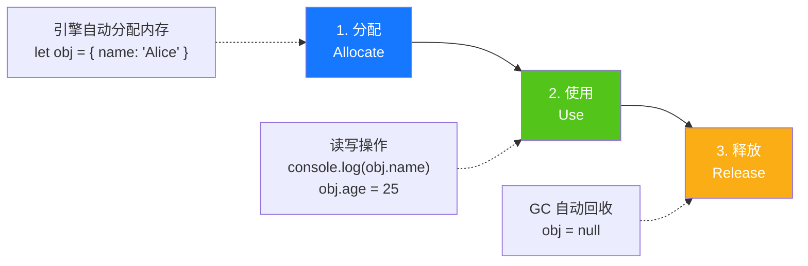

### 2.2 JavaScript 中的内存分配

```javascript
// 基本类型：分配在栈（Stack）中，随作用域自动释放
let num = 42;           // 栈内存
let str = 'hello';      // 栈内存
let bool = true;        // 栈内存

// 引用类型：分配在堆（Heap）中，由 GC 管理
let obj = { name: 'Alice' };        // 堆内存
let arr = [1, 2, 3];                // 堆内存
let func = function() {};           // 堆内存
```

### 2.3 栈内存 vs 堆内存

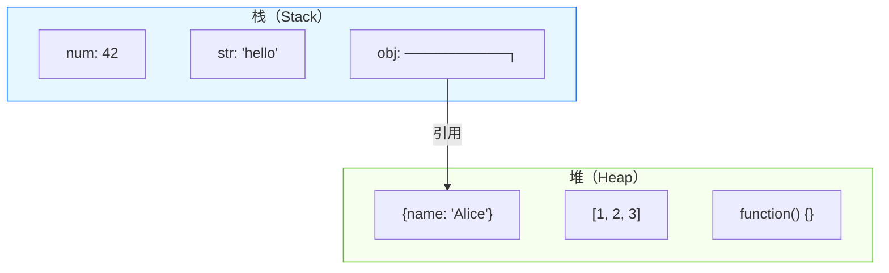

| 维度 | 栈内存 | 堆内存 |
|------|--------|--------|
| **存储内容** | 基本类型值、引用地址 | 引用类型对象 |
| **管理方式** | 自动管理，随作用域退出释放 | 由 GC 自动管理 |
| **访问速度** | 快（LIFO 结构） | 较慢（需通过引用访问） |
| **空间大小** | 小（通常 1-8MB） | 大（受系统内存限制） |
| **生命周期** | 短（函数调用结束即释放） | 不定（可达即存活） |

---

## 三、核心概念

### 3.1 可达性（Reachability）

可达性是现代垃圾回收算法的核心概念：

> **如果一个对象可以通过某种方式被访问到，那么这个对象就是"可达的"，不应该被回收。反之则是"不可达的"，可以被回收。**

```javascript
// 可达对象示例
let globalVar = { name: 'Alice' };        // globalVar 从全局可达

function outer() {
  let closureVar = { data: 'secret' };    // 通过闭包可达
  return function inner() {
    return closureVar;
  };
}
const fn = outer();  // closureVar 通过 fn 可达

// 不可达对象示例
function createTemp() {
  let temp = { value: 42 };  // temp 只在函数内部可达
  return temp.value;
}
createTemp();
// 函数执行完毕后，temp 对象不可达，将被回收
```

### 3.2 根对象（GC Roots）

根对象是垃圾回收的起点，引擎从根对象出发，遍历所有引用链：

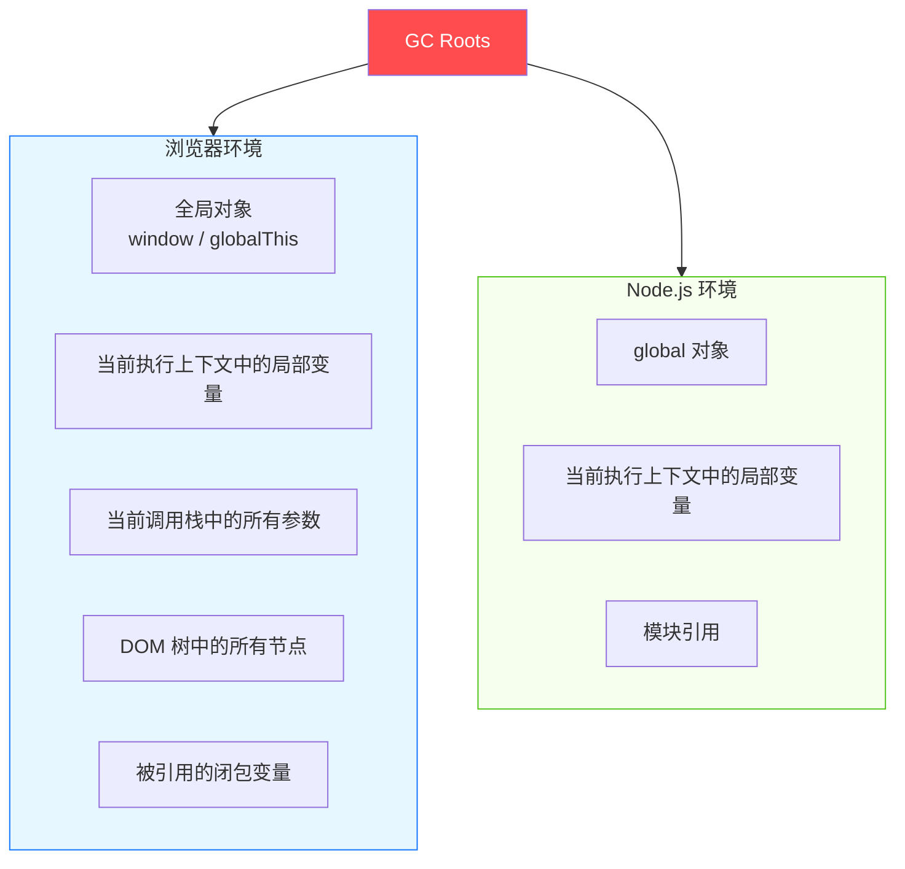

### 3.3 内存分配的两种方式

```javascript
// 基本类型：值传递（栈内存）
let a = 10;              // 栈：直接存储值
let b = a;               // 栈：复制值
b = 20;                  // a 仍为 10，互不影响

// 引用类型：引用传递（堆内存 + 栈中存引用）
let obj1 = { x: 1 };     // 堆：分配对象，栈中存储引用
let obj2 = obj1;         // 栈：复制引用，指向同一对象
obj2.x = 2;              // obj1.x 也变为 2（同一对象）
```

---

## 四、常用垃圾回收算法

### 4.1 引用计数（Reference Counting）

**工作原理**：为每个对象维护一个引用计数器，记录有多少变量引用了它。当引用计数降为 0 时，立即回收该对象。

```javascript
// 引用计数示例
let a = { name: 'Alice' };   // 对象引用计数：1
let b = a;                    // 对象引用计数：2
a = null;                     // 对象引用计数：1
b = null;                     // 对象引用计数：0 → 立即回收
```

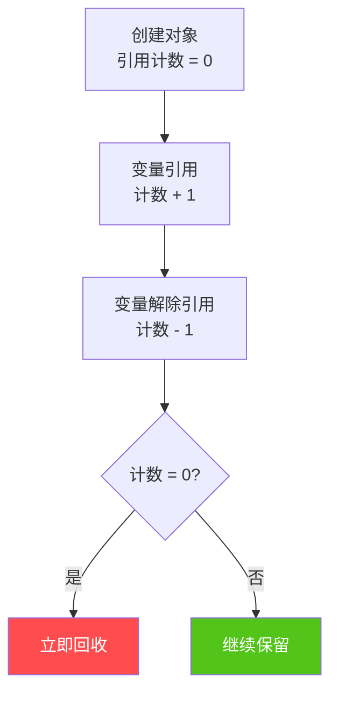

**优点**：

- 实现简单
- 可立即回收垃圾对象，不会造成长时间停顿

**致命缺点：无法处理循环引用**

```javascript
// 循环引用问题
function createCycle() {
  let a = {};
  let b = {};
  a.ref = b;    // a 引用 b
  b.ref = a;    // b 引用 a
  // 函数执行完毕后，a 和 b 的引用计数都不为 0
  // 因为它们互相引用，所以永远不会被回收！
}
createCycle();  // 内存泄漏！
```

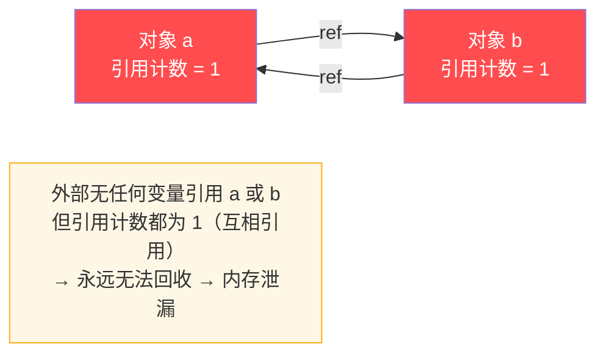

**历史背景**：早期 IE6/7 的 DOM 对象和 BOM 对象使用引用计数，导致循环引用造成严重的内存泄漏问题。现代引擎已弃用此算法。

---

### 4.2 标记-清除（Mark-Sweep）

**工作原理**：分为两个阶段——标记阶段从根对象出发递归遍历所有可达对象并标记；清除阶段遍历堆内存，回收未标记的对象。

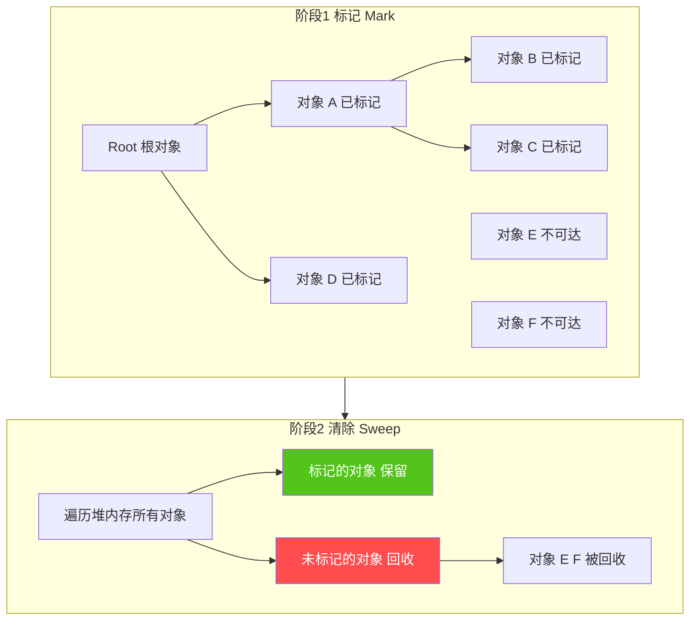

```javascript
// 标记-清除的伪代码实现
function markSweep() {
  // 阶段1：标记
  function mark(object) {
    if (object.marked) return;  // 已标记则跳过
    object.marked = true;
    // 递归标记所有引用的对象
    for (const ref of object.references) {
      mark(ref);
    }
  }
  
  // 从所有根对象开始标记
  for (const root of gcRoots) {
    mark(root);
  }
  
  // 阶段2：清除
  for (const obj of heap) {
    if (!obj.marked) {
      deallocate(obj);  // 回收未标记的对象
    } else {
      obj.marked = false;  // 重置标记，为下次GC准备
    }
  }
}
```

**优点**：

- 解决了引用计数的循环引用问题（互相引用但不可达的对象会被回收）

```javascript
// 标记-清除能正确处理循环引用
function createCycle() {
  let a = {};
  let b = {};
  a.ref = b;
  b.ref = a;
}
createCycle();
// 函数执行后，a 和 b 都不可达（没有从根对象出发的引用链）
// 即使它们互相引用，也会被正确回收 ✓
```

**缺点**：

- **内存碎片**：回收后的内存空间不连续，可能导致后续分配大对象时找不到足够连续空间

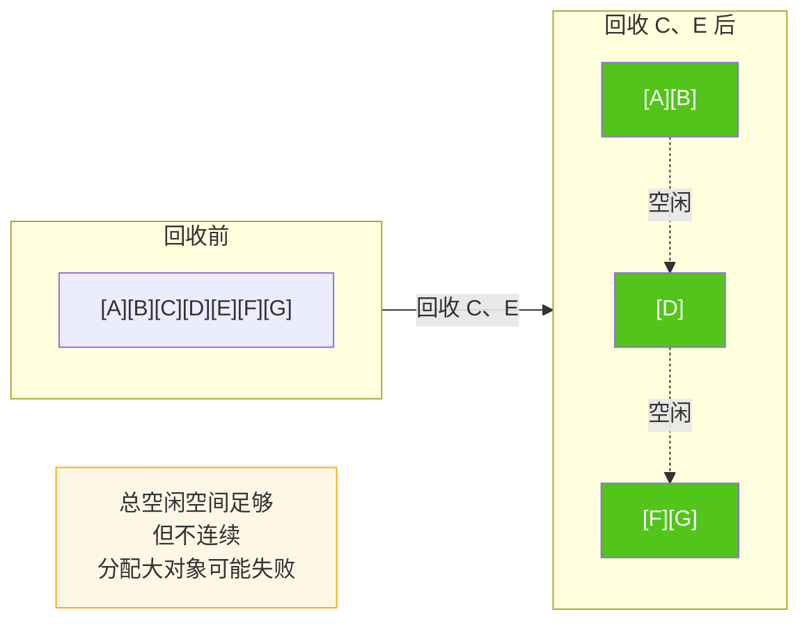

---

### 4.3 标记-整理（Mark-Compact）

**工作原理**：在标记-清除的基础上增加整理阶段，将所有存活对象向内存空间的一端移动，然后清理边界以外的内存。


**优点**：

- 消除了内存碎片问题
- 分配大对象时效率更高

**缺点**：

- 移动对象需要更新所有引用，性能开销较大
- 整理过程比单纯的清除更耗时

---

### 4.4 复制算法（Copying）

**工作原理**：将内存分为大小相等的两个空间（From 和 To）。只使用 From 空间分配对象，GC 时将存活对象复制到 To 空间，然后清空 From 空间，交换两者角色。


> 🧮 **举一个具体小例子（数字级）**
>
> 假设 From / To 各 100KB，程序在 From 里分配了 4 个对象：
> ```
> 第1轮（正常分配）：
>   From: [A 20KB][B 30KB][C 10KB][D 40KB]   ← 填满 100KB，触发 GC
>   To:   [空闲 100KB]
>
> GC 时，检查可达性：发现 A 和 C 仍活着，B 和 D 已死
>
> 第2步（复制存活对象）：
>   From: [A...][B死][C...][D死]               ← 原位置不动
>   To:   [A 20KB][C 10KB][空闲 70KB]          ← 只复制 A 和 C，连续排列
>
> 第3步（清空 From + 交换名字）：
>   原来的 From → 改名叫 To  （下一轮作为备用，整体空闲）
>   原来的 To   → 改名叫 From（下一轮作为在用，已有 [A][C]）
>
> 结果：
>   新的 From: [A 20KB][C 10KB][连续空闲 70KB]  ← 完全没有内存碎片！
>   新的 To:   [空闲 100KB]
> ```
>
> ⚠️ **三个易混点提示**
>
> 1. **为什么是"复制"而不是"清除死对象"？** — 因为在存活率很低的场景（新生代对象大多朝生夕死，通常只有 1%~10% 存活），只搬存活对象要比"遍历整个空间清垃圾"快得多。死对象甚至不需要被"擦除"，直接被整体丢弃。
> 2. **空间利用率只有 50%** — 这是复制算法最大的缺点，也决定了它只能用于 V8 新生代这种**小空间（1~8MB）**。如果把 1GB 的老生代也对半切，就浪费 500MB，无法接受。
> 3. **复制后对象的内存地址会变** — V8 需要额外的"句柄（Handle）"机制来更新所有指向该对象的引用，否则其他引用了该对象的地方会读取旧地址（悬空指针）。这就是复制算法的底层复杂度所在。

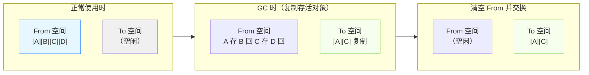

**特点**：

- 没有内存碎片（复制后自然连续）
- 速度快（只遍历存活对象）
- 空间利用率只有 50%
- 适合存活率低的场景（如新生代）

---

### 4.5 分代收集（Generational Collection）

**核心思想**：根据对象的生命周期将堆内存分为不同区域（新生代、老生代），针对不同区域采用不同的回收策略。

**理论基础——弱分代假说**：

- 绝大多数对象生命周期很短（朝生夕死）
- 少数对象会存活很长时间

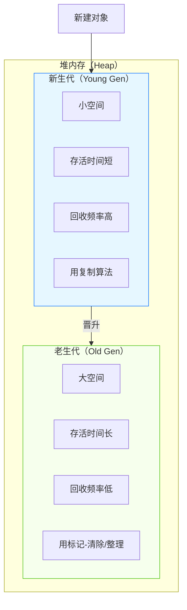

**对象生命周期**：新建对象 → 新生代 →（存活多次 GC）→ 晋升到老生代

---

### 4.6 增量标记（Incremental Marking）

**问题背景**：标记-清除算法在标记阶段需要遍历整个堆，如果堆很大，会导致长时间停顿（Stop-The-World），影响程序响应。

**解决方案**：将标记过程拆分为多个小步骤，穿插在 JavaScript 代码执行之间。

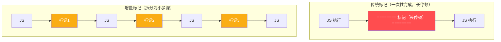

**技术挑战**：

- 需要处理标记过程中引用关系变化（**写屏障 Write Barrier**）
- 需要记录标记进度

---

### 4.7 算法对比总结

| 算法 | 循环引用 | 内存碎片 | 空间利用率 | 性能 | 适用场景 |
|------|:--------:|:--------:|:----------:|:----:|---------|
| **引用计数** | ❌ 无法处理 | ✅ 无碎片 | ✅ 100% | ⚠️ 计数开销 | 已弃用 |
| **标记-清除** | ✅ 可处理 | ❌ 有碎片 | ✅ 100% | 较好 | 老生代基础算法 |
| **标记-整理** | ✅ 可处理 | ✅ 无碎片 | ✅ 100% | ⚠️ 移动开销 | 老生代（碎片多时） |
| **复制算法** | ✅ 可处理 | ✅ 无碎片 | ❌ 50% | ✅ 最快 | 新生代 |
| **分代收集** | ✅ 可处理 | ✅ 无碎片 | ✅ 高 | ✅ 最优 | 现代引擎主流 |
| **增量标记** | ✅ 可处理 | ✅ 无碎片 | ✅ 高 | ✅ 低延迟 | 大堆优化 |

---

## 五、V8 引擎的垃圾回收实现

V8 是 Chrome 和 Node.js 使用的 JavaScript 引擎，其 GC 实现是最具代表性的分代收集策略。

### 5.1 V8 内存结构

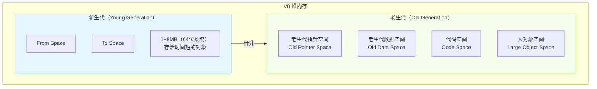

### 5.2 新生代回收：Scavenge 算法

V8 新生代使用 **Scavenge 算法**（基于复制算法），将新生代分为 From 和 To 两个空间。

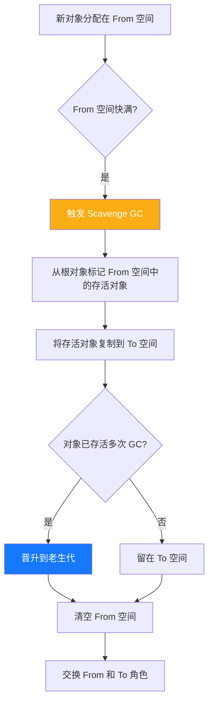

```javascript
// Scavenge 算法伪代码
function scavenge() {
  for (const obj of fromSpace) {
    if (isReachable(obj)) {
      copyTo(obj, toSpace);  // 复制存活对象
      if (hasSurvivedMultipleGC(obj)) {
        promoteToOldSpace(obj);  // 晋升到老生代
      }
    }
    // 不可达对象直接被丢弃（不复制）
  }
  clearSpace(fromSpace);
  swap(fromSpace, toSpace);
}
```

**特点**：

- 速度极快：只处理存活对象，非存活对象直接忽略
- 空间利用率 50%：To 空间作为复制目标保持空闲
- 适合存活率低的新生代对象

### 5.3 老生代回收：Mark-Sweep + Mark-Compact

老生代对象存活率高，不适合用复制算法（复制成本高），采用 **标记-清除** 和 **标记-整理** 组合策略。

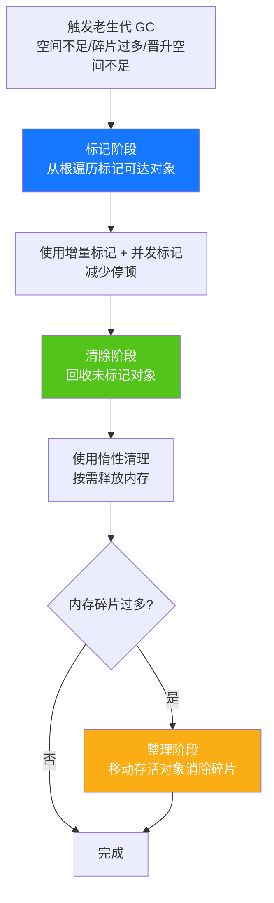

### 5.4 对象晋升机制

新生代对象在满足以下条件时会被晋升到老生代：

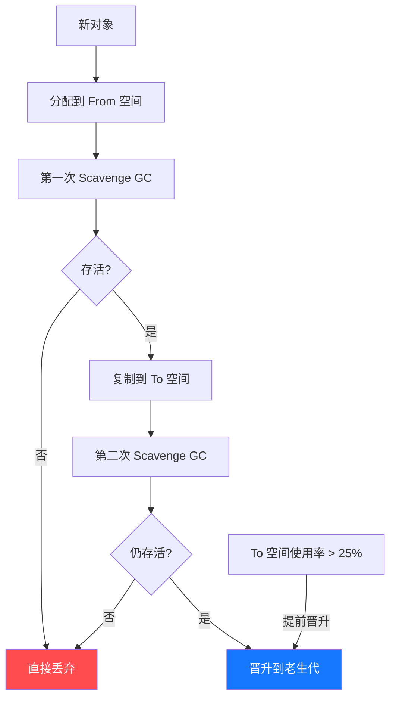

**晋升条件**：

1. **经历过一次 Scavenge 回收仍存活**：对象从 From 复制到 To 后，再次 GC 仍存活
2. **To 空间使用率超过 25%**：提前将存活对象晋升到老生代，避免 From/To 交换后 To 空间不足

### 5.5 全停顿与优化策略

**全停顿（Stop-The-World，STW）**：GC 执行时需要暂停 JavaScript 代码运行，大堆回收会导致明显卡顿。

| 优化策略 | 原理 | 效果 |
|---------|------|------|
| **增量标记** | 将标记拆分为小步骤，穿插在 JS 执行之间 | 每次停顿约 5-10ms |
| **并发标记** | 使用辅助线程并行执行标记工作 | 主线程几乎不停顿 |
| **并行标记** | 多个辅助线程同时标记 | 利用多核 CPU 优势 |
| **惰性清理** | 不一次性清理所有垃圾，按需逐步清理 | 减少单次停顿时间 |
| **并行清理** | 多个辅助线程同时执行清理工作 | 加速清理阶段 |

### 5.6 V8 GC 完整流程图

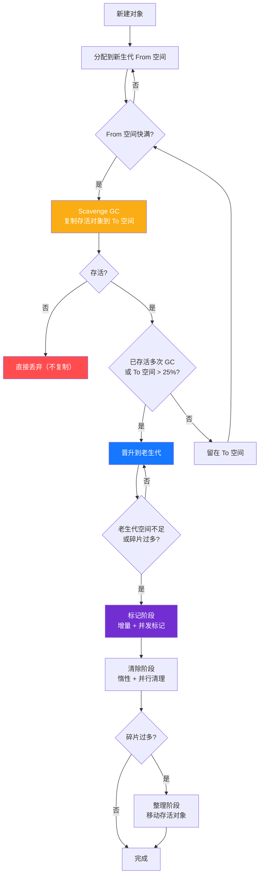

### 5.7 Orinoco 与并发 GC

V8 团队从 2015 年开始推进 **Orinoco GC 项目**，逐步引入并发和并行优化：

| 阶段 | 优化内容 | 引入版本 |
|------|---------|---------|
| **增量标记** | 标记拆分为小步骤 | V8 5.1（2016） |
| **并发标记** | 辅助线程并行标记 | V8 6.2（2018） |
| **并发清理** | 辅助线程并行清理 | V8 6.4（2018） |
| **并行整理** | 多线程并行整理内存 | V8 7.4（2019） |
| **全并发 GC** | 标记、清理、整理全并发 | V8 8.0+（2020+） |

**Orinoco 的核心目标**：将 GC 的停顿时间从**百毫秒级**降到**毫秒级**，让 GC 对用户体验几乎无感知。

---


### 5.8 引擎差异对比

| 维度 | V8（Chrome/Node.js） | SpiderMonkey（Firefox） | JavaScriptCore（Safari） |
|------|---------------------|------------------------|------------------------|
| **分代策略** | 新生代 + 老生代 | Nursery + 老生代 | 多代（Eden/Old/Large） |
| **新生代算法** | Scavenge（复制） | 复制算法 | 复制算法 |
| **老生代算法** | Mark-Sweep + Mark-Compact | Mark-Sweep | Mark-Sweep |
| **并发支持** | 增量+并发标记+并发清理 | 并发 GC | 多线程并发 |
| **停顿优化** | 增量+并发标记 | 并发标记 | 并发收集 |
| **写屏障** | ✅ 支持 | ✅ 支持 | ✅ 支持 |
| **内存整理** | Mark-Compact | 按需整理 | 按需整理 |

> **注意**：各引擎的 GC 策略都在不断演进，以上对比基于近年版本。核心思想（分代收集、并发标记、减少停顿）是一致的，差异主要体现在实现细节和优化侧重点上。

---

## 七、内存泄漏

### 7.1 什么是内存泄漏

内存泄漏是指程序中已不再使用的内存，由于仍然被引用而无法被 GC 回收，导致内存占用持续增长的现象。

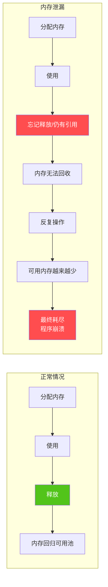

### 7.2 常见内存泄漏场景

#### 场景 1：意外的全局变量

```javascript
// ❌ 泄漏：未使用 var/let/const 声明，自动成为全局变量
function bad() {
  leak = 'this is global';      // 挂载到 window
  this.baz = 'also global';     // this 指向 window 时
}

// ✅ 修复：使用严格模式
'use strict';
function good() {
  let notLeak = 'local';  // 严格模式下未声明会报错
}
```

#### 场景 2：未清理的定时器

```javascript
// ❌ 泄漏：定时器引用了外部数据，组件销毁时未清理
let hugeData = new Array(1000000).fill('*');
setInterval(() => {
  console.log(hugeData.length);  // hugeData 被引用，无法回收
}, 1000);

// ✅ 修复：及时清理定时器
let timer = setInterval(() => {
  console.log(hugeData.length);
}, 1000);

// 不用时清除
clearInterval(timer);
timer = null;
hugeData = null;
```

#### 场景 3：未移除的事件监听器

```javascript
// ❌ 泄漏：移除 DOM 元素时未移除事件监听器
const element = document.getElementById('my-element');
element.addEventListener('click', onClick);
// 移除元素但未移除监听器
element.parentNode.removeChild(element);
// 监听器仍持有 element 引用，无法回收

// ✅ 修复：移除元素前先移除监听器
element.removeEventListener('click', onClick);
element.parentNode.removeChild(element);
```

#### 场景 4：闭包引起的泄漏

```javascript
// ❌ 泄漏：闭包引用了大对象且不释放
let leakData;
function closureLeak() {
  let bigData = new Array(1000000).fill('*');
  leakData = function() {
    return bigData;  // bigData 被闭包引用，永远无法回收
  };
}
closureLeak();

// ✅ 修复：用完后释放引用
function cleanup() {
  leakData = null;  // 解除闭包引用，bigData 可被回收
}
```

#### 场景 5：脱离 DOM 的引用

```javascript
// ❌ 泄漏：DOM 已从文档移除，但 JS 变量仍引用
let elements = {
  button: document.getElementById('button'),
  image: document.getElementById('image')
};
document.body.removeChild(elements.button);
// DOM 树中已移除，但 elements.button 仍引用 → 无法回收

// ✅ 修复：移除 DOM 后同时清除 JS 引用
document.body.removeChild(elements.button);
elements.button = null;
```

#### 场景 6：控制台输出的对象引用

```javascript
// ❌ 泄漏：开发环境中 console.log 持有对象引用
function createBigObject() {
  const bigObj = { data: new Array(1000000) };
  console.log(bigObj);  // 控制台持有引用
  return bigObj;
}

// ✅ 修复：生产环境移除 console.log
// 或使用构建工具在 production 模式下自动移除
```

### 7.3 内存泄漏检测方法

#### 方法 1：Chrome DevTools — Heap Snapshot

```javascript
// 步骤：
// 1. 打开 Chrome DevTools → Memory 标签
// 2. 选择 "Heap snapshot" → Take snapshot（快照1）
// 3. 执行操作（如页面交互、路由切换）
// 4. 再次 Take snapshot（快照2）
// 5. 选择 "Comparison" 模式对比两个快照
// 6. 查看 Delta 列，找出异常增长的对象

// 代码中标记对象便于查找
const suspectObject = { /* ... */ };
// 在 DevTools 控制台中可通过对象属性搜索
```

#### 方法 2：Chrome DevTools — Allocation Timeline

```javascript
// 步骤：
// 1. Memory 标签 → 选择 "Allocation instrumentation on timeline"
// 2. 开始录制
// 3. 执行操作
// 4. 停止录制
// 5. 查看蓝色柱状条（分配但未回收的内存）
// 6. 蓝色柱持续存在说明可能有泄漏
```

#### 方法 3：Performance Monitor

```javascript
// 步骤：
// 1. 打开 Performance Monitor（Command+Shift+P → "Performance Monitor"）
// 2. 勾选 "JS Heap Size"
// 3. 操作页面
// 4. 观察 JS Heap Size 是否持续增长不回落
// 5. 如果持续增长 → 可能存在内存泄漏
```

#### 方法 4：代码层面的检测

```javascript
// 使用 performance.memory API（非标准，Chrome 支持）
function checkMemory() {
  if (performance.memory) {
    console.log('已使用堆大小:', performance.memory.usedJSHeapSize);
    console.log('堆大小限制:', performance.memory.jsHeapSizeLimit);
  }
}

// 定期检测内存
setInterval(checkMemory, 5000);

// Node.js 中使用 process.memoryUsage()
function checkNodeMemory() {
  const usage = process.memoryUsage();
  console.log({
    rss: `${(usage.rss / 1024 / 1024).toFixed(2)} MB`,         // 常驻内存
    heapTotal: `${(usage.heapTotal / 1024 / 1024).toFixed(2)} MB`, // 堆总大小
    heapUsed: `${(usage.heapUsed / 1024 / 1024).toFixed(2)} MB`,   // 堆已使用
    external: `${(usage.external / 1024 / 1024).toFixed(2)} MB`     // 外部内存
  });
}
```

### 7.4 内存泄漏预防策略

```javascript
// 策略 1：使用严格模式
'use strict';  // 防止意外全局变量

// 策略 2：使用 WeakMap/WeakSet 存储对 DOM 的引用
const elementData = new WeakMap();
elementData.set(domElement, { metadata: '...' });
// domElement 被 GC 回收时，对应数据自动释放

// 策略 3：组件/页面销毁时清理资源
// React 示例
useEffect(() => {
  const timer = setInterval(() => {}, 1000);
  const handler = () => {};
  window.addEventListener('resize', handler);
  
  return () => {
    clearInterval(timer);                       // 清理定时器
    window.removeEventListener('resize', handler); // 移除监听器
  };
}, []);

// Vue 示例
export default {
  mounted() {
    this.timer = setInterval(() => {}, 1000);
  },
  beforeUnmount() {
    clearInterval(this.timer);  // 组件卸载时清理
  }
};

// 策略 4：使用 try-finally 保证资源释放
function useResource() {
  const resource = acquireResource();
  try {
    return resource.use();
  } finally {
    resource.release();  // 无论是否异常都会执行
  }
}

// 策略 5：避免在闭包中持有大对象
function processBigData() {
  let bigData = new Array(1000000).fill('*');
  const result = bigData.reduce((acc, val) => acc + val.charCodeAt(0), 0);
  bigData = null;  // 使用完毕后立即释放
  return result;
}
```

---

## 八、内存管理最佳实践

### 8.1 合理使用数据结构

```javascript
// ✅ 按需选择数据结构
// 大量查找操作 → Map/Set（O(1) 查找）
// 有序数据 → 数组
// 键值对且键为对象 → WeakMap

// ❌ 避免创建不必要的大数组
const bad = new Array(1000000).fill(0);  // 占用大量内存

// ✅ 使用懒加载或分页
function* lazyRange(start, end) {
  for (let i = start; i < end; i++) {
    yield i;
  }
}
// 不一次性创建大数组，按需生成

// ✅ 及时清空大数组
let bigArray = new Array(1000000);
// 使用完毕
bigArray.length = 0;  // 清空数组，释放引用
// 或
bigArray = null;
```

### 8.2 WeakMap / WeakSet / WeakRef

```javascript
// WeakMap：键必须是对象，键被回收时值自动释放
const cache = new WeakMap();
function process(obj) {
  if (cache.has(obj)) {
    return cache.get(obj);
  }
  const result = expensiveProcess(obj);
  cache.set(obj, result);  // obj 被回收时，result 自动释放
  return result;
}

// WeakSet：存储对象的弱引用
const tracked = new WeakSet();
function track(element) {
  tracked.add(element);  // element 被回收时自动移除
}

// WeakRef：创建对象的弱引用（ES2021）
let target = { data: 'important' };
const ref = new WeakRef(target);

// 使用时检查是否存活
function getTarget() {
  const obj = ref.deref();
  if (obj) {
    return obj;  // 对象仍存活
  }
  return null;   // 对象已被回收
}

// FinalizationRegistry：对象被回收时执行回调
const registry = new FinalizationRegistry((heldValue) => {
  console.log('对象被回收:', heldValue);
  // 执行清理工作
});

let obj = { data: 'test' };
registry.register(obj, 'my object');  // 注册，obj 被回收时通知
```

### 8.3 及时清理引用

```javascript
// 原则：用完即释放

// 1. 清除变量引用
let data = loadData();
processData(data);
data = null;  // 释放引用

// 2. 清除数组中的引用
let items = [obj1, obj2, obj3];
// 使用完毕
items = null;
// 或
items.length = 0;

// 3. 清除对象属性
let config = { handler: () => {} };
// 使用完毕
delete config.handler;
// 或
config.handler = null;

// 4. 清除 Map 中的引用
const map = new Map();
map.set('key', bigObject);
// 使用完毕
map.delete('key');
// 或使用 WeakMap 自动管理
```

### 8.4 框架中的内存管理

#### React 中的内存管理

```javascript
// ✅ 正确清理 useEffect 中的副作用
function MyComponent() {
  useEffect(() => {
    const controller = new AbortController();
    const timer = setInterval(() => {}, 1000);
    
    fetch('/api', { signal: controller.signal })
      .then(res => res.json())
      .then(data => { /* ... */ });
    
    return () => {
      controller.abort();   // 取消请求
      clearInterval(timer); // 清理定时器
    };
  }, []);
  
  // ✅ 避免在渲染中创建新对象
  // ❌ 每次 render 都创建新对象
  // return <Child style={{ color: 'red' }} />;
  
  // ✅ 使用 useMemo 缓存
  const style = useMemo(() => ({ color: 'red' }), []);
  return <Child style={style} />;
}
```

#### Vue 中的内存管理

```javascript
// ✅ 组件卸载时清理
export default {
  data() {
    return {
      timer: null,
      observer: null
    };
  },
  mounted() {
    this.timer = setInterval(() => {}, 1000);
    
    this.observer = new IntersectionObserver(() => {});
    this.observer.observe(this.$el);
  },
  beforeUnmount() {
    clearInterval(this.timer);
    this.observer.disconnect();
  }
};
```

#### Node.js 中的内存管理

```javascript
// ✅ 使用 Stream 处理大文件，避免一次性加载
const fs = require('fs');
const readStream = fs.createReadStream('large-file.txt');
const writeStream = fs.createWriteStream('output.txt');

readStream.pipe(writeStream);
// 比 fs.readFile + fs.writeFile 更节省内存

// ✅ 设置内存限制
// 启动时：node --max-old-space-size=4096 app.js（4GB）

// ✅ 监控内存
const formatMemory = () => {
  const m = process.memoryUsage();
  return {
    rss: `${(m.rss / 1048576).toFixed(2)} MB`,
    heap: `${(m.heapUsed / 1048576).toFixed(2)} / ${(m.heapTotal / 1048576).toFixed(2)} MB`
  };
};

// 定时检查
setInterval(() => {
  console.log('Memory:', formatMemory());
}, 10000);
```

---

## 九、面试题精选

### 题目 1：解释 V8 引擎的分代回收策略

**答案要点**：

V8 将堆内存分为新生代和老生代：

- **新生代**：小空间（1~8MB），存放生命周期短的对象，使用 Scavenge（复制）算法。分为 From 和 To 两个空间，GC 时将存活对象从 From 复制到 To，然后交换。
- **老生代**：大空间，存放生命周期长的对象，使用 Mark-Sweep（标记-清除）和 Mark-Compact（标记-整理）。支持增量标记和并发标记以减少停顿。
- **晋升机制**：经历过一次 Scavenge 仍存活的对象，或 To 空间使用率超过 25% 时，对象晋升到老生代。

### 题目 2：引用计数和标记-清除有什么区别？

**答案要点**：

| 维度 | 引用计数 | 标记-清除 |
|------|---------|---------|
| 原理 | 追踪引用次数，为 0 时回收 | 从根遍历标记可达对象，清除未标记的 |
| 循环引用 | ❌ 无法处理 | ✅ 可处理 |
| 回收时机 | 立即回收 | 需等待 GC 周期 |
| 内存碎片 | 无 | 有 |
| 现代引擎 | 已弃用 | 主流算法基础 |

### 题目 3：如何检测和预防内存泄漏？

**答案要点**：

**检测方法**：

1. Chrome DevTools → Memory → Heap Snapshot（堆快照对比）
2. Memory → Allocation Timeline（分配时间线）
3. Performance Monitor 观察 JS Heap Size
4. `performance.memory` API（浏览器）/ `process.memoryUsage()`（Node.js）

**预防策略**：

1. 使用严格模式防止意外全局变量
2. 及时清理定时器、事件监听器、闭包引用
3. 使用 WeakMap/WeakSet 存储 DOM 引用
4. 组件卸载时执行清理逻辑
5. 避免在闭包中持有大对象

### 题目 4：什么是全停顿（STW）？V8 如何优化？

**答案要点**：

全停顿（Stop-The-World）是指 GC 执行时暂停 JavaScript 运行，大堆回收会导致明显卡顿。

V8 的优化策略：

1. **增量标记**：将标记拆分为小步骤，穿插在 JS 执行间
2. **并发标记**：使用辅助线程并行标记，主线程几乎不停顿
3. **并行标记**：多个线程同时标记
4. **惰性清理**：不一次性清理，按需逐步释放
5. **并行清理与整理**：多线程加速清理和整理
6. **分代收集**：新生代频繁回收但速度快，老生代低频回收

---

## 十、总结与速查表

### 算法速查表

| 算法 | 原理 | 优点 | 缺点 | 适用场景 |
|------|------|------|------|---------|
| 引用计数 | 引用数为 0 时回收 | 立即回收 | 循环引用泄漏 | 已弃用 |
| 标记-清除 | 标记可达，清除不可达 | 解决循环引用 | 内存碎片 | 老生代 |
| 标记-整理 | 标记后整理内存 | 无碎片 | 移动开销大 | 老生代（碎片多） |
| 复制算法 | 复制存活对象到新空间 | 无碎片，快 | 空间利用率 50% | 新生代 |
| 分代收集 | 新老生代不同策略 | 综合最优 | 实现复杂 | 现代引擎 |

### 内存泄漏场景速查表

| 场景 | 原因 | 预防方法 |
|------|------|---------|
| 意外全局变量 | 未声明变量挂载到 window | 严格模式 |
| 未清理定时器 | setInterval 引用外部数据 | clearInterval + 置 null |
| 事件监听器 | 移除 DOM 未移除监听 | removeEventListener |
| 闭包 | 闭包持有大对象 | 及时释放引用 |
| DOM 引用 | JS 变量引用已移除的 DOM | 移除 DOM 时清除引用 |
| 控制台输出 | console.log 持有对象引用 | 生产环境移除 |

### 最佳实践清单

**✅ 推荐做法**：

- 使用严格模式（`'use strict'`）
- 及时清理定时器、事件监听器
- 用 WeakMap/WeakSet 存储 DOM 引用
- 组件卸载时执行清理逻辑
- 大对象用完即置 null
- 使用 Stream 处理大文件（Node.js）
- 避免在闭包中持有不必要的大对象
- 定期检测内存使用情况

**❌ 避免做法**：

- 不使用 var/let/const 声明变量
- 忘记 clearInterval/clearTimeout
- 移除 DOM 前不移除事件监听器
- 在闭包中长期持有大对象
- 一次性加载大文件到内存
- 生产环境保留 console.log

### 记忆口诀

```
垃圾回收三步走：分配 → 使用 → 释放
判断可达是核心：从根出发能到达的就是活的
算法演进有逻辑：引用计数→标记清除→标记整理→分代收集
V8 分代要记牢：新生代用 Scavenge，老生代用 Mark-Sweep
内存泄漏六大类：全局变量、定时器、监听器、闭包、DOM 引用、控制台
预防泄漏有口诀：用完即清、严格模式、WeakMap 首选
```

---

> **核心结论**：JavaScript 的垃圾回收基于**可达性**判断对象生死，从**GC Roots**出发能到达的对象为存活。现代引擎（V8/SpiderMonkey/JSC）普遍采用**分代收集**策略——新生代用复制算法（Scavenge），老生代用标记-清除+标记-整理，并通过**增量标记、并发标记、并行清理**等优化将停顿降到毫秒级。开发者的责任是**避免内存泄漏**：严格模式、及时清理引用、善用 WeakMap/WeakSet，让 GC 能正确识别垃圾。
>
> **文档版本**：v2.0  
> **适用版本**：JavaScript（ES6+）、V8 引擎（Chrome 90+/Node.js 16+）  
> **最后更新**：2026-08  
> **参考来源**：[V8 官方文档](https://v8.dev/blog)、[MDN Web Docs](https://developer.mozilla.org/zh-CN/docs/Web/JavaScript/Memory_Management)、[ECMAScript 规范](https://tc39.es/ecma262/)
