# ReactJS Top50 常见面试问题详解

> 文档定位：系统整理 React 面试中高频问题，涵盖基础概念、Hooks、路由、状态管理、性能优化、TypeScript、测试与项目实战，适用于初中高级前端工程师面试备战与知识体系查漏补缺。
>
> 阅读建议：按章节顺序由浅入深阅读，每道题先思考再对照答案，重点关注「项目实战」与「踩坑经验」部分。

---

## 目录

- [一、React 基础概念](#一react-基础概念)
  - [Q1. React 是什么？它的核心思想是什么？](#q1-react-是什么它的核心思想是什么)
  - [Q2. JSX 是什么？它和 HTML 有什么区别？](#q2-jsx-是什么它和-html-有什么区别)
  - [Q3. 虚拟 DOM 是什么？为什么需要它？](#q3-虚拟-dom-是什么为什么需要它)
  - [Q4. Diff 算法的原理与三大同层策略？](#q4-diff-算法的原理与三大同层策略)
  - [Q5. React 元素与组件的区别？](#q5-react-元素与组件的区别)
  - [Q6. 函数组件与类组件的区别？](#q6-函数组件与类组件的区别)
  - [Q7. Props 与 State 的区别？](#q7-props-与-state-的区别)
  - [Q8. React 事件机制与原生事件有什么不同？](#q8-react-事件机制与原生事件有什么不同)
  - [Q9. React 18 的新特性有哪些？](#q9-react-18-的新特性有哪些)
  - [Q10. React Fiber 架构是什么？](#q10-react-fiber-架构是什么)
- [二、React Hooks 详解](#二react-hooks-详解)
  - [Q11. useState 的工作原理与更新机制？](#q11-usestate-的工作原理与更新机制)
  - [Q12. useEffect 与 useLayoutEffect 的区别？](#q12-useeffect-与-uselayouteffect-的区别)
  - [Q13. useMemo 与 useCallback 的区别与使用场景？](#q13-usememo-与-usecallback-的区别与使用场景)
  - [Q14. useRef 与 createRef 的区别？](#q14-useref-与-createref-的区别)
  - [Q15. useContext 的使用与性能优化？](#q15-usecontext-的使用与性能优化)
  - [Q16. useReducer 与 useState 的选择？](#q16-usereducer-与-usestate-的选择)
  - [Q17. 自定义 Hook 的设计原则？](#q17-自定义-hook-的设计原则)
  - [Q18. Hooks 的使用规则与常见错误？](#q18-hooks-的使用规则与常见错误)
  - [Q19. useImperativeHandle 与 forwardRef 的使用？](#q19-useimperativehandle-与-forwardref-的使用)
  - [Q20. useId、useSyncExternalStore 等新 Hook？](#q20-useidusesyncexternalstore-等新-hook)
- [三、React Router 路由](#三react-router-路由)
  - [Q21. React Router v6 与 v5 的核心区别？](#q21-react-router-v6-与-v5-的核心区别)
  - [Q22. 声明式路由与编程式路由的使用？](#q22-声明式路由与编程式路由的使用)
  - [Q23. 嵌套路由与 Outlet 的使用？](#q23-嵌套路由与-outlet-的使用)
  - [Q24. 路由守卫与权限控制的实现？](#q24-路由守卫与权限控制的实现)
  - [Q25. 动态路由参数与查询参数？](#q25-动态路由参数与查询参数)
  - [Q26. 路由懒加载与 Suspense 的结合使用？](#q26-路由懒加载与-suspense-的结合使用)
  - [Q27. 路由模式 Hash 与 History 的区别？](#q27-路由模式-hash-与-history-的区别)
  - [Q28. useNavigate、useLocation 等路由 Hooks？](#q28-usenavigateuselocation-等路由-hooks)
- [四、状态管理方案](#四状态管理方案)
  - [Q29. React 状态管理的分类与选型？](#q29-react-状态管理的分类与选型)
  - [Q30. Context API 的原理与使用场景？](#q30-context-api-的原理与使用场景)
  - [Q31. Redux 的核心概念与数据流？](#q31-redux-的核心概念与数据流)
  - [Q32. Redux Toolkit(RTK) 的优势与使用？](#q32-redux-toolkitrtk-的优势与使用)
  - [Q33. Redux 异步中间件 redux-thunk 与 redux-saga 对比？](#q33-redux-异步中间件-redux-thunk-与-redux-saga-对比)
  - [Q34. Zustand 轻量状态管理的优势？](#q34-zustand-轻量状态管理的优势)
  - [Q35. Recoil 与 Jotai 原子化状态管理？](#q35-recoil-与-jotai-原子化状态管理)
  - [Q36. MobX 的响应式与 Redux 的对比？](#q36-mobx-的响应式与-redux-的对比)
  - [Q37. React Query(TanStack Query) 的服务端状态管理？](#q37-react-querytanstack-query-的服务端状态管理)
  - [Q38. 状态管理方案选型决策树？](#q38-状态管理方案选型决策树)
- [五、性能优化](#五性能优化)
  - [Q39. React 性能优化的核心思路？](#q39-react-性能优化的核心思路)
  - [Q40. React.memo 与浅比较 deepMemo？](#q40-reactmemo-与浅比较-deepmemo)
  - [Q41. shouldComponentUpdate 与 React.memo 的关系？](#q41-shouldcomponentupdate-与-reactmemo-的关系)
  - [Q42. 列表渲染的 key 为什么重要？](#q42-列表渲染的-key-为什么重要)
  - [Q43. 虚拟列表与窗口化的实现？](#q43-虚拟列表与窗口化的实现)
  - [Q44. React 18 并发特性(Concurrent) 与 useTransition？](#q44-react-18-并发特性concurrent-与-usetransition)
  - [Q45. Suspense 与 React.lazy 的使用？](#q45-suspense-与-reactlazy-的使用)
- [六、高级特性与模式](#六高级特性与模式)
  - [Q46. 高阶组件 HOC 与 Render Props 模式？](#q46-高阶组件-hoc-与-render-props-模式)
  - [Q47. React 错误边界(Error Boundaries)？](#q47-react-错误边界error-boundaries)
  - [Q48. React Portals 与弹窗组件？](#q48-react-portals-与弹窗组件)
  - [Q49. Forward Ref 与 Ref 转发机制？](#q49-forward-ref-与-ref-转发机制)
  - [Q50. 自定义 Hook 提取业务逻辑的最佳实践？](#q50-自定义-hook-提取业务逻辑的最佳实践)
- [七、TypeScript 与测试](#七typescript-与测试)
  - [Q51. React + TypeScript 的常用类型与泛型？](#q51-react--typescript-的常用类型与泛型)
  - [Q52. React Testing Library 与 Jest 测试？](#q52-react-testing-library-与-jest-测试)
- [八、高频速答卡片与踩坑总结](#八高频速答卡片与踩坑总结)

---

## 一、React 基础概念

### Q1. React 是什么？它的核心思想是什么？

#### 核心答案

React 是 Facebook 推出的**声明式、组件化、用于构建用户界面**的 JavaScript 库（注意：是库不是框架）。

#### 三大核心思想

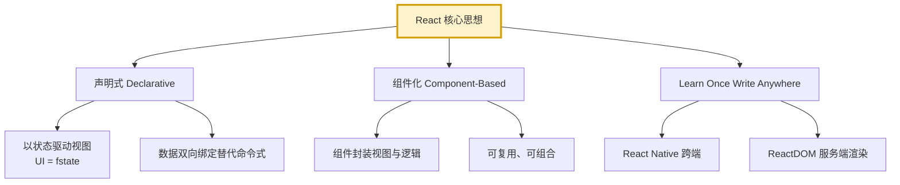

#### 关键特征

| 特征 | 说明 |
|------|------|
| 声明式 | 描述"是什么"而非"怎么做"，React 自动管理 DOM 更新 |
| 组件化 | 将 UI 拆分为独立、可复用的组件 |
| 单向数据流 | 数据从父到子单向流动，便于追踪 |
| 虚拟 DOM | 内存中抽象表示，提升性能 |
| JSX | JavaScript 语法扩展，让 UI 描述更直观 |
| 学习一次，到处写 | 支持 Web、Native、SSR、VR |

#### 公式化理解

```
UI = f(state)

- state 变化 → f 重新计算 → 新的 UI
- React 负责将新旧 UI diff，最小化更新真实 DOM
```

---

### Q2. JSX 是什么？它和 HTML 有什么区别？

#### 核心答案

JSX (JavaScript XML) 是 JavaScript 的语法扩展，让你可以在 JS 中书写类似 HTML 的标记。JSX 最终会被 Babel 编译为 `React.createElement()` 调用。

#### 编译过程

```jsx
// JSX 写法
const element = <h1 className="title">Hello, {name}!</h1>;

// 编译后
const element = React.createElement(
  'h1',
  { className: 'title' },
  'Hello, ',
  name,
  '!'
);

// React 17+ 新的 JSX 转换（无需引入 React）
// 自动引入 jsx-runtime
import { jsx as _jsx } from 'react/jsx-runtime';
const element = _jsx('h1', { className: 'title', children: 'Hello, ' + name });
```

#### 与 HTML 的核心区别

| 特性 | HTML | JSX |
|------|------|-----|
| class 属性 | `class="box"` | `className="box"` |
| for 属性 | `for="id"` | `htmlFor="id"` |
| style 属性 | `style="color:red;font-size:14px"` 字符串 | `style={{ color: 'red', fontSize: '14px' }}` 对象 |
| 自闭合 | 可选 | **必须**自闭合 `` |
| 注释 | `<!-- -->` | `{/* 注释 */}` |
| 事件 | `onclick="fn()"` 字符串 | `onClick={fn}` 函数 |
| 布尔属性 | `disabled` | `disabled={true}` |
| 条件渲染 | 不支持 | `{cond && <Comp />}` |

#### 关键规则

1. **必须返回单一根节点**（可用 Fragment `<>...</>` 包裹）
2. **所有标签必须闭合**
3. **JSX 中的 `{}` 可嵌入任意 JS 表达式**
4. **小写开头为 HTML 标签，大写开头为组件**

```jsx
// ❌ 错误：多个根节点
const App = () => (
  <div>A</div>
  <div>B</div>
);

// ✅ 正确：使用 Fragment
const App = () => (
  <>
    <div>A</div>
    <div>B</div>
  </>
);
```

#### 项目实战踩坑

> **问题**：在 JSX 中循环渲染时忘加 key，警告但功能正常。
>
> **根因**：React 用 key 进行 diff 优化，缺少 key 会导致状态错位。详见 [Q42](#q42-列表渲染的-key-为什么重要)。

---

### Q3. 虚拟 DOM 是什么？为什么需要它？

#### 核心答案

虚拟 DOM (Virtual DOM) 是真实 DOM 的 JavaScript 对象抽象表示，保存在内存中。每次状态变化先生成新的虚拟 DOM，与旧的进行 diff，最后批量更新真实 DOM。

#### 虚拟 DOM 结构

```javascript
// JSX
<div id="app" className="container">
  <h1>Hello</h1>
  <p>World</p>
</div>

// 转换为虚拟 DOM 对象
{
  type: 'div',
  props: {
    id: 'app',
    className: 'container',
    children: [
      { type: 'h1', props: { children: 'Hello' } },
      { type: 'p', props: { children: 'World' } }
    ]
  }
}
```

#### 工作流程

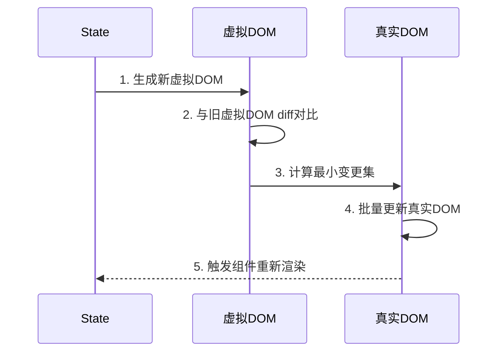

#### 为什么需要虚拟 DOM

| 优势 | 说明 |
|------|------|
| 性能提升 | 减少 DOM 直接操作次数，批量更新 |
| 跨平台 | 抽象层便于在不同环境渲染（Web、Native、SSR） |
| 声明式编程 | 描述 UI 应该是什么样，而非怎么操作 |
| 测试友好 | 可在 Node 中测试无需浏览器 |

#### 局限

- **首次渲染慢**：需先生成虚拟 DOM 再渲染
- **内存占用**：维护两份（虚拟 + 真实）
- **不适合简单场景**：少量更新直接操作 DOM 更快

#### 常见追问

**Q：虚拟 DOM 一定比直接操作 DOM 快吗？**
A：不一定。虚拟 DOM 优势在于"声明式 + 批量更新"，但精心优化的直接 DOM 操作（如 Vue 的编译优化）在某些场景更快。虚拟 DOM 牺牲了极致性能换取了开发效率和跨平台能力。

---

### Q4. Diff 算法的原理与三大同层策略？

#### 核心答案

Diff 算法是 React 比较新旧虚拟 DOM 树，计算最小更新操作的过程。它基于三大同层策略：

#### 三大策略

**策略1：同层比较**

只比较同一层级的节点，不跨层级移动。

```
旧: <div><span>A</span></div>
新: <div><p>A</p></div>

→ 删除 span，新建 p
（不会复用 span，因为 type 不同）
```

**策略2：type 不同直接销毁重建**

```
旧: <div>
新: <span>

→ 销毁 div 及其子树，新建 span
```

**策略3：key 标识列表项**

```jsx
// 旧
<li key="a">A</li>
<li key="b">B</li>
<li key="c">C</li>

// 新（B 被删除）
<li key="a">A</li>
<li key="c">C</li>

→ 通过 key 知道 b 被删除，a/c 复用
```

#### Diff 过程

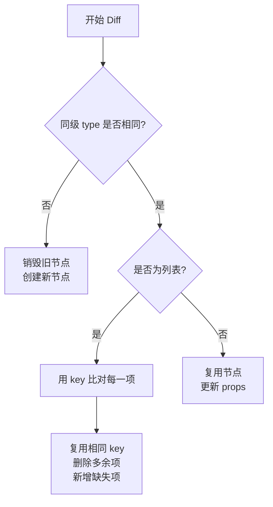

#### 复杂度

- **理论最优 diff**：O(n³)
- **React 优化后**：O(n)（通过同层策略）

#### 项目实战踩坑

> **问题**：列表使用 index 作为 key，删除首项导致全部重新渲染。
>
> **原因**：index 顺序变化导致 React 认为每项 type 变了。
>
> **解决**：使用稳定的唯一 id 作为 key。

```jsx
// ❌ 错误：用 index
{list.map((item, index) => <Item key={index} item={item} />)}

// ✅ 正确：用唯一 id
{list.map(item => <Item key={item.id} item={item} />)}
```

---

### Q5. React 元素与组件的区别？

#### 核心答案

- **React 元素 (Element)**：普通对象，描述界面上应该看到什么。是组件的输出结果。
- **React 组件 (Component)**：可复用的代码单元，接收 props 返回元素树。

#### 区别示例

```jsx
// 组件（函数组件）
function Welcome(props) {
  return <h1>Hello, {props.name}</h1>;
}

// 元素（调用组件产生）
const element = <Welcome name="React" />;

// 调用 element
console.log(element);
// {
//   $$typeof: Symbol(react.element),
//   type: Welcome,  // 函数
//   props: { name: 'React' },
//   ...
// }
```

#### 关系图

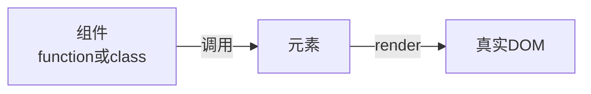

#### 类型分类

| 类型 | 示例 |
|------|------|
| DOM 元素 | `<div />` |
| 组件元素 | `<Welcome />` |
| Fragment | `<></>` |
| Portal | `<CreatePortal />` |

---

### Q6. 函数组件与类组件的区别？

#### 核心对比

| 维度 | 函数组件 | 类组件 |
|------|---------|-------|
| 语法 | 函数 | ES6 class |
| state | Hooks (useState) | this.state |
| 生命周期 | useEffect 等 | 生命周期方法 |
| this | 无 this | 有 this 绑定问题 |
| 性能 | 略优（无实例化） | 实例化开销 |
| Hooks | ✅ 可用 | ❌ 不可用 |
| 代码量 | 少 | 多 |
| 学习曲线 | 平缓 | 陡峭 |

#### 代码对比

```jsx
// 函数组件（推荐）
function Counter() {
  const [count, setCount] = useState(0);

  useEffect(() => {
    document.title = `点击 ${count} 次`;
  }, [count]);

  return <button onClick={() => setCount(count + 1)}>{count}</button>;
}

// 类组件（不推荐新写）
class Counter extends React.Component {
  state = { count: 0 };

  componentDidMount() {
    document.title = `点击 ${this.state.count} 次`;
  }

  componentDidUpdate() {
    document.title = `点击 ${this.state.count} 次`;
  }

  render() {
    return (
      <button onClick={() => this.setState({ count: this.state.count + 1 })}>
        {this.state.count}
      </button>
    );
  }
}
```

#### 类组件的痛点

1. **this 绑定**：事件处理函数需 `.bind(this)` 或箭头函数
2. **生命周期繁琐**：相同逻辑分散在多个生命周期
3. **逻辑复用难**：HOC 和 Render Props 嵌套地狱
4. **状态难以拆分**：state 是一个大对象

#### Hooks 优势

1. **逻辑复用简单**：自定义 Hook 提取
2. **关注点分离**：相同功能逻辑聚合
3. **代码量少**：无需 class 模板代码
4. **无需 this**：避免 this 绑定问题

#### 项目实战踩坑

> **问题**：将类组件改写为函数组件时，原 `componentDidMount` 中的异步请求用 `useEffect`，但请求被重复触发。
>
> **根因**：依赖数组为空但忘了写，或写了变量导致每次渲染都触发。
>
> **解决**：`useEffect(() => {...}, [])` 空依赖数组。

---

### Q7. Props 与 State 的区别？

#### 核心对比

| 维度 | Props | State |
|------|-------|-------|
| 来源 | 父组件传入 | 组件内部维护 |
| 可变性 | 只读（不可修改） | 可修改 |
| 作用 | 配置组件 | 组件状态 |
| 子组件 | 可访问 | 不可访问 |
| 改变后 | 触发重渲染 | 触发重渲染 |
| 初始化 | 父组件决定 | 组件自己决定 |

#### 数据流示意

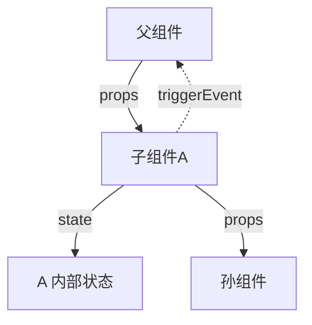

#### 正确使用

```jsx
// ❌ 错误：修改 props
function Welcome(props) {
  props.name = 'New Name';  // 报错！
  return <h1>{props.name}</h1>;
}

// ✅ 正确：state 可修改
function Counter() {
  const [count, setCount] = useState(0);
  return <button onClick={() => setCount(count + 1)}>{count}</button>;
}
```

#### 受控与非受控组件

```jsx
// 受控组件：状态由父组件控制（props）
function Input({ value, onChange }) {
  return <input value={value} onChange={onChange} />;
}

// 非受控组件：状态由自己控制（state + ref）
function Input() {
  const inputRef = useRef();
  return <input ref={inputRef} />;
}
```

---

### Q8. React 事件机制与原生事件有什么不同？

#### 核心差异

| 维度 | React 事件 | 原生事件 |
|------|------------|---------|
| 命名 | camelCase (onClick) | lowercase (onclick) |
| 处理函数 | 函数引用 | 字符串或函数 |
| 阻止默认 | e.preventDefault() | e.preventDefault() 或 return false |
| 事件委托 | 17+ 绑定在 root | 绑定在元素本身 |
| 事件对象 | SyntheticEvent 合成事件 | 原生 Event |
| this 绑定 | 需手动（类组件） | 自动 |

#### 合成事件 (SyntheticEvent)

React 使用合成事件包装原生事件，提供跨浏览器一致性。

```jsx
function handleClick(e) {
  // e 是 SyntheticEvent
  console.log(e.type);         // 'click'
  console.log(e.target);      // 真实 DOM 元素
  console.log(e.nativeEvent); // 原生事件对象

  e.preventDefault();
  e.stopPropagation();
}
```

#### 事件委托机制

React 17+ 将事件监听绑定在 **root 容器** 上，而非每个元素：

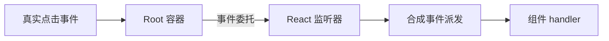

#### 性能优化

```jsx
// ❌ 错误：列表每项绑定事件
list.map(item => <li onClick={handleClick}>{item}</li>);

// ✅ 优化：父级统一委托
<ul onClick={handleClick}>
  {list.map(item => <li data-id={item.id}>{item}</li>)}
</ul>

function handleClick(e) {
  const id = e.target.dataset.id;  // 取出真实元素
}
```

#### 阻止默认行为

```jsx
// ❌ 错误：返回 false 无效
function handleSubmit(e) {
  return false;
}

// ✅ 正确：调用 preventDefault
function handleSubmit(e) {
  e.preventDefault();
  console.log('提交');
}
```

---

### Q9. React 18 的新特性有哪些？

#### 核心新特性

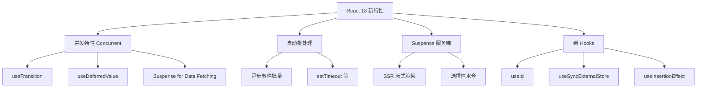

#### 1. 自动批处理 (Automatic Batching)

```jsx
// React 17：只在事件处理函数内批处理
function handleClick() {
  setCount(c => c + 1);
  setData(d => d + 1);
  // 一次重渲染
}

setTimeout(() => {
  setCount(c => c + 1);
  setData(d => d + 1);
  // React 17：两次重渲染
  // React 18：一次重渲染（自动批处理）
}, 0);

// 手动退出批处理
import { flushSync } from 'react-dom';
flushSync(() => setCount(c => c + 1));  // 立即重渲染
```

#### 2. 并发特性 (Concurrent Features)

```jsx
import { useTransition, useDeferredValue } from 'react';

function Search() {
  const [isPending, startTransition] = useTransition();
  const [query, setQuery] = useState('');

  const onChange = (e) => {
    startTransition(() => {
      setQuery(e.target.value);  // 标记为非紧急更新
    });
  };

  return (
    <>
      <input onChange={onChange} />
      {isPending ? '搜索中...' : <ResultList query={query} />}
    </>
  );
}
```

#### 3. 新的 createRoot API

```jsx
// React 17
import ReactDOM from 'react-dom';
ReactDOM.render(<App />, document.getElementById('root'));

// React 18
import { createRoot } from 'react-dom/client';
const root = createRoot(document.getElementById('root'));
root.render(<App />);
```

#### 4. Suspense for Data Fetching

```jsx
const resource = fetchProfileData();  // 返回 Promise 包装对象

function Profile() {
  return (
    <Suspense fallback={<Spinner />}>
      <ProfileDetails resource={resource} />
    </Suspense>
  );
}
```

#### 5. SSR 流式渲染

```jsx
// server: renderToPipeableStream（替代 renderToString）
// 支持流式发送 HTML，配合 Suspense 渐进式水合
```

#### StrictMode 新增检查

```jsx
<React.StrictMode>
  <App />
</React.StrictMode>

// React 18 StrictMode 额外检查：
// - 重复执行 effect（检测副作用）
// - 严格过时的 API
```

---

### Q10. React Fiber 架构是什么？

#### 核心答案

Fiber 是 React 16 引入的**新协调引擎**，让渲染过程可中断、可恢复，实现时间分片（Time Slicing）和优先级调度。

#### Fiber 设计目标

| 目标 | 说明 |
|------|------|
| 可中断 | 渲染过程可被高优先级任务打断 |
| 可恢复 | 中断后能从断点继续 |
| 可分片 | 长任务拆分为多个时间片 |
| 优先级 | 区分高/低优先级更新 |

#### Fiber 节点结构

```javascript
// Fiber 节点（简化版）
{
  type: 'div',              // 组件类型
  key: null,
  stateNode: DOM节点,        // 真实 DOM
  child: Fiber,             // 第一个子节点
  sibling: Fiber,           // 兄弟节点
  return: Fiber,            // 父节点
  pendingProps: {},         // 新 props
  memoizedProps: {},        // 旧 props
  memoizedState: {},        // 旧 state
  updateQueue: {},          // 更新队列
  alternate: Fiber,         // 双缓冲，指向旧 fiber
  effectTag: 'UPDATE',      // 副作用标记
  nextEffect: Fiber         // 下一个 effect
}
```

#### 工作流程

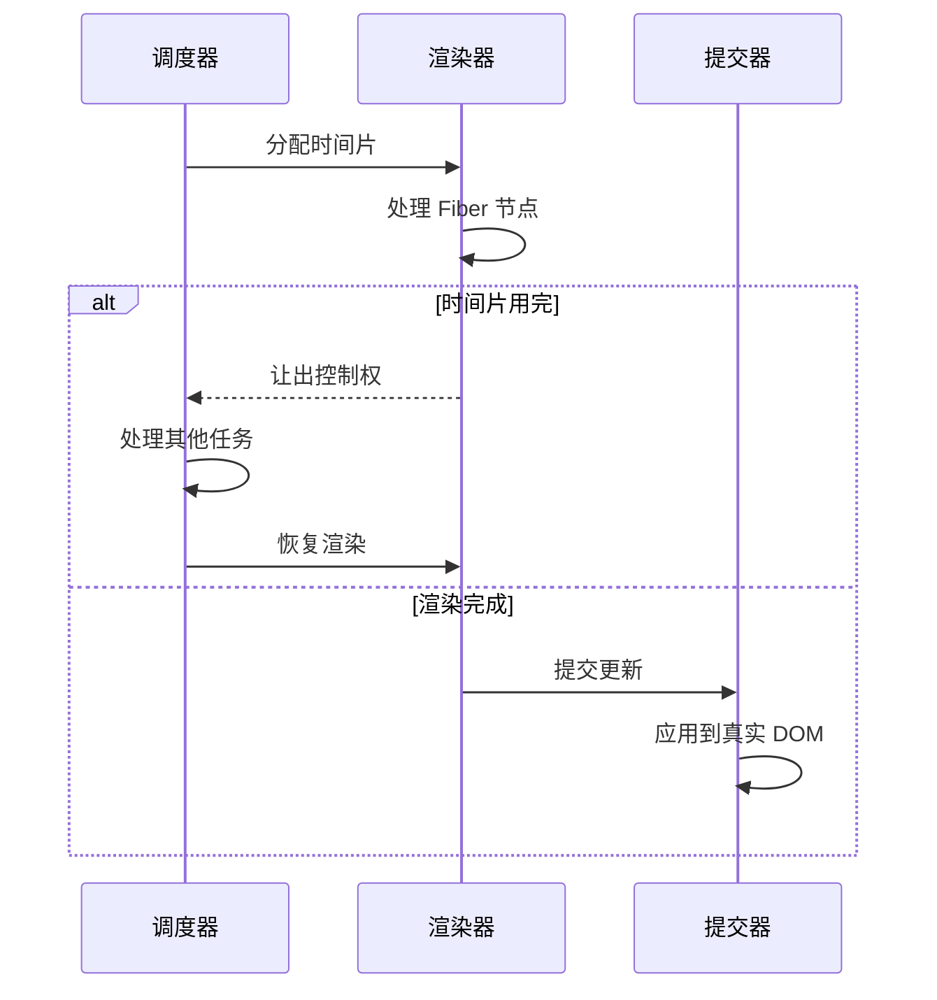

#### 双缓冲机制

Fiber 树存在两份：current（当前显示）和 workInProgress（工作中），渲染完成后切换指针，类似显卡的双缓冲。

#### 优先级调度

```
React 优先级等级（从高到低）：
1. 同步 (Sync)         - 不可中断
2. 用户输入 (User)     - 高优先级
3. 普通更新 (Normal)
4. 过渡 (Transition)  - 低优先级
5. 空闲 (Idle)        - 后台任务
```

#### 项目实战意义

> **场景**：复杂列表 5000 项渲染导致输入框卡顿。
>
> **Fiber 方案**：输入框更新为高优先级，列表渲染分片处理，输入框始终流畅响应。

---

## 二、React Hooks 详解

### Q11. useState 的工作原理与更新机制？

#### 基础用法

```jsx
const [state, setState] = useState(initialValue);

// 三种更新方式
setState(newValue);              // 直接赋值
setState(prev => prev + 1);      // 函数式更新
setState(prev => ({ ...prev, key: 'value' }));  // 对象展开
```

#### 更新机制详解

**1. 函数式更新（推荐）**

```jsx
// ❌ 错误：基于闭包旧值
function Counter() {
  const [count, setCount] = useState(0);

  const handleClick = () => {
    setCount(count + 1);   // count 是闭包旧值
    setCount(count + 1);   // 仍然基于旧值，结果只 +1
  };

  // ✅ 正确：函数式更新
  const handleClickCorrect = () => {
    setCount(c => c + 1);  // 基于最新值
    setCount(c => c + 1);  // +2
  };
}
```

**2. 批处理 (Batching)**

```jsx
// React 18 自动批处理
function handleClick() {
  setA(1);    // 不会立即重渲染
  setB(2);    // 不会立即重渲染
  setC(3);    // 合并为一次重渲染
}
```

**3. 对象更新必须展开**

```jsx
const [user, setUser] = useState({ name: 'Tom', age: 18 });

// ❌ 错误：丢失 name
setUser({ age: 20 });

// ✅ 正确：展开旧值
setUser({ ...user, age: 20 });

// ✅ 函数式更新（更安全）
setUser(prev => ({ ...prev, age: 20 }));
```

#### 惰性初始化

```jsx
// initialValue 是函数时，只执行一次
const [data, setData] = useState(() => {
  console.log('初始化');  // 只在首次渲染执行
  return expensiveCompute();
});
```

#### 异步更新陷阱

```jsx
function Example() {
  const [count, setCount] = useState(0);

  const handleClick = () => {
    setCount(count + 1);
    console.log(count);  // 0！更新是异步的
  };

  // 立即获取更新后的值
  const handleClickAsync = async () => {
    await new Promise(resolve => setCount(c => c + 1, resolve));
    // 或使用 useEffect 监听
  };

  return <button onClick={handleClick}>{count}</button>;
}

// 监听变化
useEffect(() => {
  console.log('count 变了', count);
}, [count]);
```

---

### Q12. useEffect 与 useLayoutEffect 的区别？

#### 核心区别

| 维度 | useEffect | useLayoutEffect |
|------|-----------|-----------------|
| 执行时机 | 异步，浏览器绘制后 | 同步，DOM 变更后立即 |
| 阻塞渲染 | 不阻塞 | 阻塞 |
| 适用场景 | 数据获取、订阅、副作用 | DOM 测量、操作样式 |
| 性能 | 优 | 较差 |

#### 执行时序

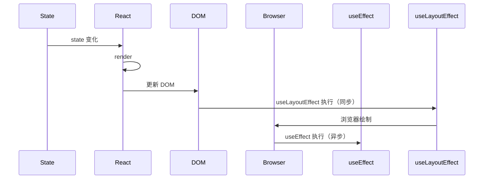

#### 使用场景对比

**useEffect 典型场景**：

```jsx
// 数据获取
useEffect(() => {
  fetch('/api/data').then(res => setData(res));
}, []);

// 事件订阅
useEffect(() => {
  const handler = (e) => console.log(e);
  window.addEventListener('resize', handler);
  return () => window.removeEventListener('resize', handler);
}, []);

// 定时器
useEffect(() => {
  const timer = setInterval(tick, 1000);
  return () => clearInterval(timer);
}, []);
```

**useLayoutEffect 典型场景**：

```jsx
// 测量 DOM 并同步修改样式（避免闪烁）
function Tooltip({ targetRef }) {
  const [pos, setPos] = useState({ x: 0, y: 0 });

  useLayoutEffect(() => {
    if (targetRef.current) {
      const rect = targetRef.current.getBoundingClientRect();
      setPos({ x: rect.x, y: rect.y + rect.height });
    }
  }, [targetRef]);

  return <div style={{ position: 'absolute', left: pos.x, top: pos.y }}>Tooltip</div>;
}
```

#### 清理函数执行时机

```jsx
useEffect(() => {
  console.log('effect 执行');
  return () => console.log('cleanup 执行');
}, [dep]);

// 执行顺序：
// 1. 首次渲染 → effect 执行
// 2. dep 变化 → cleanup 执行 → effect 执行
// 3. 卸载 → cleanup 执行
```

#### 项目实战踩坑

> **问题**：组件首次渲染时 element 位置闪烁，先显示在 (0,0) 再跳到正确位置。
>
> **原因**：useEffect 在浏览器绘制后执行，先看到旧位置。
>
> **解决**：改用 useLayoutEffect。

```jsx
// ❌ useEffect 闪烁
const [pos, setPos] = useState({ x: 0, y: 0 });
useEffect(() => {
  const rect = el.getBoundingClientRect();
  setPos({ x: rect.x, y: rect.y });  // 浏览器已绘制过 (0,0)
}, []);

// ✅ useLayoutEffect 不闪烁
useLayoutEffect(() => {
  const rect = el.getBoundingClientRect();
  setPos({ x: rect.x, y: rect.y });  // 同步修改，绘制前生效
}, []);
```

#### 服务端渲染注意

```jsx
// SSR 中 useLayoutEffect 不执行（会警告）
// 解决：使用 useIsomorphicLayoutEffect
const useIsomorphicLayoutEffect =
  typeof window !== 'undefined' ? useLayoutEffect : useEffect;
```

---

### Q13. useMemo 与 useCallback 的区别与使用场景？

#### 核心区别

| Hook | 缓存内容 | 等价关系 |
|------|---------|---------|
| useMemo | 函数返回值 | `useCallback(fn, deps) ≡ useMemo(() => fn, deps)` |
| useCallback | 函数本身 | 让子组件 memo 生效 |

#### useMemo 用法

```jsx
// 缓存计算结果
const expensiveValue = useMemo(() => {
  return computeExpensiveValue(a, b);
}, [a, b]);

// 缓存对象（避免每次创建新对象）
const userInfo = useMemo(() => ({ name, age }), [name, age]);
<UserCard user={userInfo} />
```

#### useCallback 用法

```jsx
// 缓存函数引用（避免子组件重新渲染）
const handleClick = useCallback(() => {
  console.log('clicked');
}, []);

// 配合 React.memo
const MemoizedChild = React.memo(Child);
function Parent() {
  const handler = useCallback(() => { /* ... */ }, []);
  return <MemoizedChild onClick={handler} />;
}
```

#### 不要滥用！

```jsx
// ❌ 滥用：简单场景不需要
const value = useMemo(() => a + b, [a, b]);  // 加法本身很快
const handler = useCallback(() => setCount(1), []);  // 没传给子组件

// ✅ 需要：复杂计算或传给子组件
const sortedList = useMemo(() => list.sort((a, b) => a - b), [list]);
const onSearch = useCallback(debouncedSearch, []);
```

#### 使用判断流程

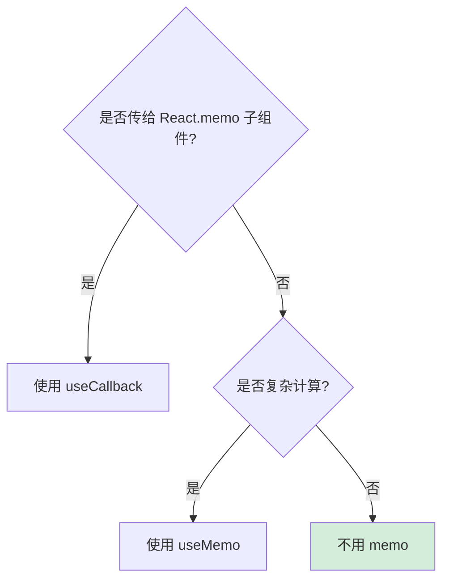

#### useCallback 与 setState 的关系

```jsx
// useState 的 setter 本身就是稳定的，不需要 useCallback
const [count, setCount] = useState(0);
// setCount 引用永远不变，无需 useCallback

// 但 setState 内联函数需注意
const handler = useCallback(() => {
  setCount(c => c + 1);  // ✅ 函数式更新，不依赖 count
}, []);
```

---

### Q14. useRef 与 createRef 的区别？

#### 核心区别

| 维度 | useRef | createRef |
|------|--------|----------|
| 适用 | 函数组件 | 类组件 |
| 创建时机 | 每次渲染返回**同一个**对象 | 每次渲染创建**新**对象 |
| 跨渲染保留 | ✅ | ❌ |
| 存储任意值 | ✅ 可存非 DOM 值 | ❌ 仅用于 DOM |

#### useRef 用法

```jsx
function App() {
  // 1. 引用 DOM
  const inputRef = useRef(null);
  useEffect(() => inputRef.current?.focus(), []);

  // 2. 存储任意值（不触发重渲染）
  const timerRef = useRef(null);
  useEffect(() => {
    timerRef.current = setInterval(tick, 1000);
    return () => clearInterval(timerRef.current);
  }, []);

  // 3. 保存上一次的值
  const prevCountRef = useRef();
  useEffect(() => {
    prevCountRef.current = count;
  });
  const prevCount = prevCountRef.current;

  return <input ref={inputRef} />;
}
```

#### createRef 用法（类组件）

```jsx
class App extends React.Component {
  constructor(props) {
    super(props);
    this.inputRef = React.createRef();  // 创建一次
  }

  componentDidMount() {
    this.inputRef.current.focus();
  }

  render() {
    return <input ref={this.inputRef} />;
  }
}
```

#### useRef 改值不触发重渲染

```jsx
function App() {
  const countRef = useRef(0);

  const handleClick = () => {
    countRef.current++;  // 改值
    console.log(countRef.current);  // 立即可见
    // 但页面不会重渲染
  };

  // 强制更新
  const [, forceUpdate] = useState({});
  const forceRender = () => forceUpdate({});

  return <button onClick={handleClick}>{countRef.current}</button>;
  // ❌ 页面永远显示 0
}
```

#### 项目实战：保存最新值避免闭包陷阱

```jsx
function Timer() {
  const [count, setCount] = useState(0);

  useEffect(() => {
    const timer = setInterval(() => {
      // count 是闭包旧值，永远是 0
      setCount(count + 1);
    }, 1000);
    return () => clearInterval(timer);
  }, []);  // 空依赖

  // ✅ 修复：用 useRef 保存最新 count
  const countRef = useRef(count);
  useEffect(() => {
    countRef.current = count;
  });

  useEffect(() => {
    const timer = setInterval(() => {
      setCount(countRef.current + 1);  // 取最新值
    }, 1000);
    return () => clearInterval(timer);
  }, []);

  return <div>{count}</div>;
}
```

---

### Q15. useContext 的使用与性能优化？

#### 基础用法

```jsx
// 1. 创建 Context
const ThemeContext = React.createContext('light');

// 2. 提供者
function App() {
  return (
    <ThemeContext.Provider value="dark">
      <Page />
    </ThemeContext.Provider>
  );
}

// 3. 消费者（函数组件用 useContext）
function Page() {
  const theme = useContext(ThemeContext);
  return <div style={{ background: theme === 'dark' ? '#000' : '#fff' }} />;
}

// 4. 消费者（嵌套写法）
function Page2() {
  return (
    <ThemeContext.Consumer>
      {theme => <div>{theme}</div>}
    </ThemeContext.Consumer>
  );
}
```

#### 动态 Context

```jsx
function App() {
  const [theme, setTheme] = useState('light');
  return (
    <ThemeContext.Provider value={{ theme, setTheme }}>
      <Page />
    </ThemeContext.Provider>
  );
}

function Page() {
  const { theme, setTheme } = useContext(ThemeContext);
  return (
    <button onClick={() => setTheme(theme === 'light' ? 'dark' : 'light')}>
      切换 ({theme})
    </button>
  );
}
```

#### 性能问题：Context 变化导致所有消费者重渲染

```jsx
// ❌ 问题：每次 App 重渲染，所有 Page 重渲染
const ThemeContext = createContext();
function App() {
  const [count, setCount] = useState(0);  // 与 theme 无关
  return (
    <ThemeContext.Provider value="dark">
      <Page />
      <button onClick={() => setCount(count + 1)}>{count}</button>
    </ThemeContext.Provider>
  );
}
```

#### 性能优化方案

**方案1：拆分 Context**

```jsx
const ThemeContext = createContext();
const UserContext = createContext();

function App() {
  return (
    <ThemeContext.Provider value="dark">
      <UserContext.Provider value={user}>
        <Page />
      </UserContext.Provider>
    </ThemeContext.Provider>
  );
}
```

**方案2：使用 useMemo 缓存 value**

```jsx
const value = useMemo(() => ({ theme, setTheme }), [theme]);
<ThemeContext.Provider value={value}>
```

**方案3：使用状态库替代（大型应用）**

Context 适合低频更新（主题、语言），高频更新（购物车、列表）建议用 Zustand/Redux。

---

### Q16. useReducer 与 useState 的选择？

#### useReducer 用法

```jsx
const [state, dispatch] = useReducer(reducer, initialArg, init);

function reducer(state, action) {
  switch (action.type) {
    case 'increment': return { count: state.count + 1 };
    case 'decrement': return { count: state.count - 1 };
    case 'reset':     return { count: action.payload };
    default: throw new Error();
  }
}

function Counter() {
  const [state, dispatch] = useReducer(reducer, { count: 0 });

  return (
    <>
      Count: {state.count}
      <button onClick={() => dispatch({ type: 'increment' })}>+</button>
      <button onClick={() => dispatch({ type: 'decrement' })}>-</button>
      <button onClick={() => dispatch({ type: 'reset', payload: 0 })}>reset</button>
    </>
  );
}
```

#### useState vs useReducer

| 维度 | useState | useReducer |
|------|---------|------------|
| 数据类型 | 简单值（数字、字符串） | 复杂对象 |
| 更新逻辑 | 简单赋值 | 复杂业务逻辑 |
| 测试 | 难（依赖闭包） | 易（纯函数 reducer） |
| 可读性 | 直观 | 略繁琐 |
| 适合场景 | 单字段 | 多字段联动 |

#### 选择决策

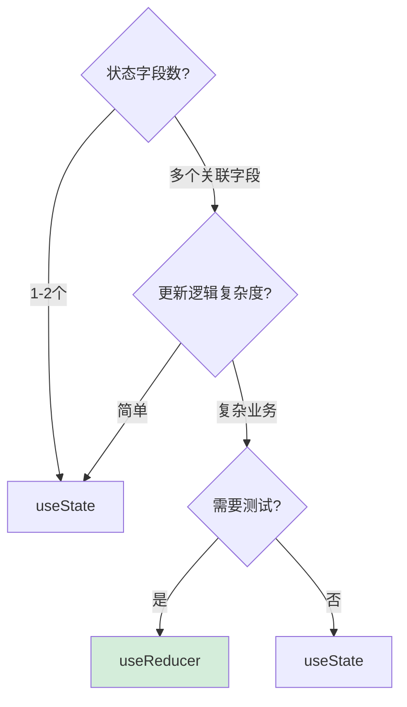

#### 项目实战：购物车

```jsx
const initialState = {
  items: [],
  total: 0
};

function cartReducer(state, action) {
  switch (action.type) {
    case 'ADD_ITEM':
      const existing = state.items.find(i => i.id === action.item.id);
      let items;
      if (existing) {
        items = state.items.map(i =>
          i.id === action.item.id ? { ...i, qty: i.qty + 1 } : i
        );
      } else {
        items = [...state.items, { ...action.item, qty: 1 }];
      }
      return {
        items,
        total: items.reduce((sum, i) => sum + i.price * i.qty, 0)
      };

    case 'REMOVE_ITEM':
      const filtered = state.items.filter(i => i.id !== action.id);
      return {
        items: filtered,
        total: filtered.reduce((sum, i) => sum + i.price * i.qty, 0)
      };

    default: return state;
  }
}

function Cart() {
  const [state, dispatch] = useReducer(cartReducer, initialState);
  const addToCart = (item) => dispatch({ type: 'ADD_ITEM', item });
  const removeFromCart = (id) => dispatch({ type: 'REMOVE_ITEM', id });
  // ...
}
```

---

### Q17. 自定义 Hook 的设计原则？

#### 设计原则

1. **以 use 开头**：强制约束
2. **单一职责**：每个 Hook 只做一件事
3. **返回值灵活**：数组、对象皆可
4. **可组合**：Hook 内可调用其他 Hook
5. **可测试**：纯函数式逻辑

#### 经典自定义 Hook

**1. useToggle**

```jsx
function useToggle(initial = false) {
  const [on, setOn] = useState(initial);
  const toggle = useCallback(() => setOn(v => !v), []);
  const reset = useCallback(() => setOn(initial), [initial]);
  return [on, toggle, reset];
}

// 使用
const [isOpen, toggle, close] = useToggle(false);
```

**2. usePrevious（保存上一次值）**

```jsx
function usePrevious(value) {
  const ref = useRef();
  useEffect(() => {
    ref.current = value;
  }, [value]);
  return ref.current;
}
```

**3. useDebounce**

```jsx
function useDebounce(value, delay = 300) {
  const [debounced, setDebounced] = useState(value);
  useEffect(() => {
    const timer = setTimeout(() => setDebounced(value), delay);
    return () => clearTimeout(timer);
  }, [value, delay]);
  return debounced;
}

// 使用
const [keyword, setKeyword] = useState('');
const debouncedKeyword = useDebounce(keyword, 500);
useEffect(() => {
  if (debouncedKeyword) search(debouncedKeyword);
}, [debouncedKeyword]);
```

**4. useLocalStorage**

```jsx
function useLocalStorage(key, initialValue) {
  const [value, setValue] = useState(() => {
    const stored = localStorage.getItem(key);
    return stored ? JSON.parse(stored) : initialValue;
  });

  useEffect(() => {
    localStorage.setItem(key, JSON.stringify(value));
  }, [key, value]);

  return [value, setValue];
}
```

**5. useFetch**

```jsx
function useFetch(url, options = {}) {
  const [data, setData] = useState(null);
  const [loading, setLoading] = useState(true);
  const [error, setError] = useState(null);

  useEffect(() => {
    let isMounted = true;
    setLoading(true);

    fetch(url, options)
      .then(res => {
        if (!res.ok) throw new Error('HTTP ' + res.status);
        return res.json();
      })
      .then(data => {
        if (isMounted) {
          setData(data);
          setError(null);
        }
      })
      .catch(err => {
        if (isMounted) setError(err);
      })
      .finally(() => {
        if (isMounted) setLoading(false);
      });

    return () => { isMounted = false; };
  }, [url]);

  return { data, loading, error };
}
```

#### Hook 组合使用

```jsx
function useUserSearch(initialKeyword) {
  const [keyword, setKeyword] = useState(initialKeyword);
  const debouncedKeyword = useDebounce(keyword, 500);
  const { data, loading, error } = useFetch(`/api/users?q=${debouncedKeyword}`);
  return { keyword, setKeyword, users: data, loading, error };
}
```

---

### Q18. Hooks 的使用规则与常见错误？

#### 两条铁律

**1. 只在最顶层调用**

```jsx
// ❌ 错误：在条件中调用
function Counter({ initial }) {
  if (initial > 0) {
    const [count, setCount] = useState(initial);  // 报错！
  }
}

// ✅ 正确：永远在最顶层
function Counter({ initial }) {
  const [count, setCount] = useState(initial);
  if (count < 0) return null;
}
```

**2. 只在 React 函数中调用**

```jsx
// ❌ 错误：在普通函数中
function util() {
  const [count, setCount] = useState(0);  // 报错
}

// ✅ 正确：组件或自定义 Hook
function Component() { /* ... */ }
function useCustom() { /* ... */ }
```

#### 常见错误

**错误1：依赖数组遗漏**

```jsx
// ❌ 错误：count 变化时 effect 不触发
useEffect(() => {
  document.title = `Count: ${count}`;
}, []);  // 空依赖

// ✅ 正确
useEffect(() => {
  document.title = `Count: ${count}`;
}, [count]);
```

**错误2：循环/条件中调用**

```jsx
// ❌ 错误：循环中调用
items.forEach(item => {
  useEffect(() => fetch(item.id), [item.id]);
});

// ✅ 正确：提取为组件
function Item({ item }) {
  useEffect(() => fetch(item.id), [item.id]);
  return <div>{item.name}</div>;
}
items.map(item => <Item key={item.id} item={item} />)
```

**错误3：在闭包中捕获旧值**

```jsx
// ❌ 错误：定时器看到旧 count
useEffect(() => {
  const timer = setInterval(() => {
    console.log(count);  // 永远是 0
  }, 1000);
  return () => clearInterval(timer);
}, []);

// ✅ 正确：用 ref 或加入依赖
const countRef = useRef(count);
countRef.current = count;
useEffect(() => {
  const timer = setInterval(() => {
    console.log(countRef.current);
  }, 1000);
  return () => clearInterval(timer);
}, []);
```

**错误4：副作用未清理**

```jsx
// ❌ 错误：组件卸载后 setState 报错
useEffect(() => {
  fetch('/api').then(res => setData(res));
  // 没清理，组件卸载后回调仍执行
}, []);

// ✅ 正确：isMounted 标志
useEffect(() => {
  let isMounted = true;
  fetch('/api').then(res => {
    if (isMounted) setData(res);
  });
  return () => { isMounted = false; };
}, []);
```

#### ESLint 规则

```json
// .eslintrc
{
  "plugins": ["react-hooks"],
  "rules": {
    "react-hooks/rules-of-hooks": "error",
    "react-hooks/exhaustive-deps": "warn"
  }
}
```

---

### Q19. useImperativeHandle 与 forwardRef 的使用？

#### forwardRef：转发 ref 给子组件

```jsx
const FancyInput = React.forwardRef((props, ref) => {
  return <input ref={ref} className="fancy" />;
});

// 父组件使用
function App() {
  const inputRef = useRef();
  return <FancyInput ref={inputRef} />;
}
```

#### useImperativeHandle：自定义暴露给父组件的方法

```jsx
const FancyInput = React.forwardRef((props, ref) => {
  const inputRef = useRef();

  // 仅暴露 focus 方法，而非整个 DOM
  useImperativeHandle(ref, () => ({
    focus: () => inputRef.current?.focus(),
    clear: () => { if (inputRef.current) inputRef.current.value = ''; }
  }));

  return <input ref={inputRef} />;
});

// 父组件只能调用 focus/clear，不能直接操作 DOM
function App() {
  const inputRef = useRef();
  return (
    <>
      <FancyInput ref={inputRef} />
      <button onClick={() => inputRef.current?.focus()}>聚焦</button>
      <button onClick={() => inputRef.current?.clear()}>清空</button>
    </>
  );
}
```

#### 应用场景

```jsx
// 子组件暴露 API，封装复杂逻辑
const Modal = forwardRef((props, ref) => {
  const [isOpen, setIsOpen] = useState(false);

  useImperativeHandle(ref, () => ({
    open: () => setIsOpen(true),
    close: () => setIsOpen(false),
    isOpen: () => isOpen
  }));

  return isOpen ? <div className="modal">{props.children}</div> : null;
});

// 父组件命令式调用
function App() {
  const modalRef = useRef();
  return (
    <>
      <button onClick={() => modalRef.current?.open()}>打开</button>
      <Modal ref={modalRef}>内容</Modal>
    </>
  );
}
```

#### 为什么需要 useImperativeHandle

1. **封装性**：不暴露整个 DOM，仅暴露必要方法
2. **可控性**：父组件只能用预设的方法
3. **测试性**：可 mock 子组件的方法

---

### Q20. useId、useSyncExternalStore 等新 Hook？

#### useId

生成唯一 ID，主要用于 SSR 与可访问性。

```jsx
function Checkbox() {
  const id = useId();
  return (
    <>
      <label htmlFor={id}>同意协议</label>
      <input id={id} type="checkbox" />
    </>
  );
}

// 多个 id
function Form() {
  const id = useId();
  return (
    <>
      <label htmlFor={`${id}-name`}>姓名</label>
      <input id={`${id}-name`} />
      <label htmlFor={`${id}-email`}>邮箱</label>
      <input id={`${id}-email`} />
    </>
  );
}
```

**SSR 一致性**：useId 保证服务端与客户端生成相同 ID，避免水合不匹配。

#### useSyncExternalStore

订阅外部数据源（非 React 状态），解决 tearing（撕裂）问题。

```jsx
import { useSyncExternalStore } from 'react';

// 订阅 localStorage
function useLocalStorageValue(key) {
  return useSyncExternalStore(
    // 订阅函数
    (callback) => {
      window.addEventListener('storage', callback);
      return () => window.removeEventListener('storage', callback);
    },
    // 获取快照
    () => localStorage.getItem(key),
    // SSR 快照
    () => null
  );
}
```

**订阅外部 store（如 Redux）**：

```jsx
function useStore(store) {
  return useSyncExternalStore(
    store.subscribe,
    store.getState,
    store.getServerSnapshot
  );
}
```

#### useInsertionEffect

在 DOM 变更前同步执行，用于 CSS-in-JS 库插入样式。

```jsx
function useCSS(rule) {
  useInsertionEffect(() => {
    const style = document.createElement('style');
    style.textContent = rule;
    document.head.appendChild(style);
    return () => style.remove();
  });
}
```

#### useTransition

将状态更新标记为低优先级（过渡）。

```jsx
function App() {
  const [isPending, startTransition] = useTransition();
  const [tab, setTab] = useState('home');

  const switchTab = (newTab) => {
    startTransition(() => {
      setTab(newTab);  // 低优先级，可被高优先级打断
    });
  };

  return (
    <>
      <button onClick={() => switchTab('about')}>About</button>
      {isPending ? <Spinner /> : <Content tab={tab} />}
    </>
  );
}
```

#### useDeferredValue

延迟更新值，类似防抖但更智能。

```jsx
function Search() {
  const [keyword, setKeyword] = useState('');
  const deferredKeyword = useDeferredValue(keyword);

  return (
    <>
      <input value={keyword} onChange={e => setKeyword(e.target.value)} />
      <ExpensiveList keyword={deferredKeyword} />
    </>
  );
}
```

---

## 三、React Router 路由

### Q21. React Router v6 与 v5 的核心区别？

#### 核心区别

| 维度 | v5 | v6 |
|------|-----|-----|
| 包名 | react-router-dom | @remix-run/react-router |
| 路由写法 | `<Route component>` | `<Route element>`（JSX） |
| 嵌套 | 嵌套 `<Route>` 复杂 | `<Outlet>` 简洁 |
| 路由匹配 | 严格匹配需 `exact` | 默认严格匹配 |
| 编程式 | useHistory | useNavigate |
| Switch | `<Switch>` | `<Routes>` |
| 路由参数 | match.params | useParams |
| 默认导出 | 有 | 仅命名导出 |
| 类型支持 | 弱 | 强（TS 重写） |

#### v5 vs v6 代码对比

```jsx
// v5
import { BrowserRouter, Switch, Route } from 'react-router-dom';

<BrowserRouter>
  <Switch>
    <Route path="/" exact component={Home} />
    <Route path="/about" component={About} />
    <Route path="/users/:id" component={UserDetail} />
  </Switch>
</BrowserRouter>

// v6
import { BrowserRouter, Routes, Route } from 'react-router-dom';

<BrowserRouter>
  <Routes>
    <Route path="/" element={<Home />} />
    <Route path="/about" element={<About />} />
    <Route path="/users/:id" element={<UserDetail />} />
  </Routes>
</BrowserRouter>
```

#### v6 嵌套路由（更优雅）

```jsx
// v5：复杂
function App() {
  return (
    <Switch>
      <Route path="/dashboard" render={() => (
        <Dashboard>
          <Switch>
            <Route path="/dashboard" exact component={Overview} />
            <Route path="/dashboard/settings" component={Settings} />
          </Switch>
        </Dashboard>
      )} />
    </Switch>
  );
}

// v6：简洁
function App() {
  return (
    <Routes>
      <Route path="/dashboard" element={<Dashboard />}>
        <Route index element={<Overview />} />
        <Route path="settings" element={<Settings />} />
      </Route>
    </Routes>
  );
}

function Dashboard() {
  return (
    <div>
      <h1>Dashboard</h1>
      <Outlet />  {/* 子路由渲染位置 */}
    </div>
  );
}
```

#### v6 优势

1. **更简洁的嵌套语法**
2. **更强的类型支持**
3. **默认严格匹配**
4. **路由配置对象化**

---

### Q22. 声明式路由与编程式路由的使用？

#### 声明式路由

```jsx
import { Link, NavLink } from 'react-router-dom';

function Nav() {
  return (
    <nav>
      {/* Link：无 active 状态 */}
      <Link to="/">首页</Link>

      {/* NavLink：自动添加 active class */}
      <NavLink to="/about" className={({ isActive }) => isActive ? 'active' : ''}>
        关于
      </NavLink>

      {/* NavLink：自定义 active 样式 */}
      <NavLink to="/user" style={({ isActive }) => ({ color: isActive ? 'red' : 'black' })}>
        用户
      </NavLink>
    </nav>
  );
}
```

#### 编程式路由

```jsx
import { useNavigate, useLocation, useParams, useSearchParams } from 'react-router-dom';

function Login() {
  const navigate = useNavigate();
  const location = useLocation();

  const handleLogin = async () => {
    const result = await api.login();
    if (result.success) {
      // 跳转，并保留原路径
      const from = location.state?.from || '/';
      navigate(from, { replace: true });
    }
  };

  return <button onClick={handleLogin}>登录</button>;
}

// navigate 用法
navigate('/home');                    // push
navigate('/home', { replace: true }); // replace
navigate(-1);                        // 后退
navigate(1);                         // 前进
navigate('/users', { state: { from: 'menu' } });  // 传 state
```

#### useSearchParams

```jsx
function Search() {
  const [params, setParams] = useSearchParams();
  const keyword = params.get('q') || '';

  const update = (newKeyword) => {
    setParams({ q: newKeyword, page: 1 });
  };

  return <input value={keyword} onChange={e => update(e.target.value)} />;
}
```

#### useParams

```jsx
function UserDetail() {
  const { id } = useParams();
  const { data, loading } = useFetch(`/api/users/${id}`);

  if (loading) return <Spinner />;
  return <div>{data.name}</div>;
}
```

---

### Q23. 嵌套路由与 Outlet 的使用？

#### 路由配置

```jsx
// App.tsx
import { Routes, Route } from 'react-router-dom';

function App() {
  return (
    <Routes>
      <Route path="/" element={<Layout />}>
        <Route index element={<Home />} />            {/* index 路由 */}
        <Route path="about" element={<About />} />
        <Route path="users" element={<UserLayout />}>
          <Route index element={<UserList />} />
          <Route path=":id" element={<UserDetail />} />
          <Route path="new" element={<UserNew />} />
        </Route>
        <Route path="*" element={<NotFound />} />      {/* 404 */}
      </Route>
    </Routes>
  );
}
```

#### Layout 组件使用 Outlet

```jsx
import { Outlet, Link } from 'react-router-dom';

function Layout() {
  return (
    <div>
      <nav>
        <Link to="/">首页</Link>
        <Link to="/about">关于</Link>
        <Link to="/users">用户</Link>
      </nav>
      <main>
        <Outlet />  {/* 子路由会渲染在这里 */}
      </main>
      <footer>Footer</footer>
    </div>
  );
}

function UserLayout() {
  return (
    <div>
      <aside>用户菜单</aside>
      <Outlet />
    </div>
  );
}
```

#### 嵌套路由层级

```
URL: /users/123

匹配：
  /            → Layout (含 Outlet1)
    /users     → UserLayout (含 Outlet2)
      :id      → UserDetail
```

#### Outlet context 传值

```jsx
// 父组件通过 context 向子组件传值
function UserLayout() {
  const [user, setUser] = useState(null);
  return (
    <>
      <Outlet context={{ user, setUser }} />
    </>
  );
}

// 子组件接收
function UserDetail() {
  const { user } = useOutletContext();
  return <div>{user?.name}</div>;
}
```

---

### Q24. 路由守卫与权限控制的实现？

#### 私有路由组件

```jsx
import { Navigate, useLocation } from 'react-router-dom';

function PrivateRoute({ children }) {
  const { user } = useAuth();
  const location = useLocation();

  if (!user) {
    // 重定向到登录，并记住来源
    return <Navigate to="/login" state={{ from: location }} replace />;
  }

  return children;
}

// 使用
<Routes>
  <Route path="/login" element={<Login />} />
  <Route path="/dashboard" element={
    <PrivateRoute>
      <Dashboard />
    </PrivateRoute>
  } />
</Routes>
```

#### 角色权限路由

```jsx
function RoleRoute({ children, roles }) {
  const { user } = useAuth();

  if (!user) return <Navigate to="/login" />;
  if (!roles.includes(user.role)) return <Forbidden />;

  return children;
}

// 使用
<Route path="/admin" element={
  <RoleRoute roles={['admin']}>
    <Admin />
  </RoleRoute>
} />
```

#### 高阶路由守卫

```jsx
function withAuth(Component, requiredRoles = []) {
  return function AuthedRoute() {
    const { user, loading } = useAuth();

    if (loading) return <Spinner />;
    if (!user) return <Navigate to="/login" />;
    if (requiredRoles.length && !requiredRoles.includes(user.role)) {
      return <Forbidden />;
    }
    return <Component />;
  };
}

// 使用
const AdminPage = withAuth(Admin, ['admin']);
<Route path="/admin" element={<AdminPage />} />
```

#### 路由配置化方案

```jsx
const routes = [
  {
    path: '/',
    element: <Layout />,
    children: [
      { index: true, element: <Home /> },
      { path: 'login', element: <Login /> },
      {
        path: 'dashboard',
        element: <PrivateRoute><Dashboard /></PrivateRoute>,
        children: [
          { index: true, element: <Overview /> },
          { path: 'settings', element: <Settings /> }
        ]
      },
      {
        path: 'admin',
        element: <RoleRoute roles={['admin']}><Admin /></RoleRoute>
      }
    ]
  }
];

function App() {
  return useRoutes(routes);
}
```

---

### Q25. 动态路由参数与查询参数？

#### 动态路由参数

```jsx
// 路由定义
<Route path="/users/:id" element={<UserDetail />} />
<Route path="/posts/:category/:slug" element={<PostDetail />} />
<Route path="/files/*" element={<FileExplorer />} />  {/* * 匹配剩余路径 */}

// 路由组件中获取
import { useParams } from 'react-router-dom';

function UserDetail() {
  const { id } = useParams();
  // 多参数
  // const { category, slug } = useParams();
  return <div>User ID: {id}</div>;
}
```

#### 查询参数（Query String）

```jsx
// URL: /search?q=react&page=2
import { useSearchParams } from 'react-router-dom';

function Search() {
  const [searchParams, setSearchParams] = useSearchParams();

  const q = searchParams.get('q') || '';
  const page = parseInt(searchParams.get('page') || '1');

  const setPage = (newPage) => {
    setSearchParams(prev => {
      prev.set('page', String(newPage));
      return prev;
    });
  };

  return (
    <div>
      <p>搜索: {q}, 页码: {page}</p>
      <button onClick={() => setPage(page + 1)}>下一页</button>
    </div>
  );
}
```

#### Link 传参

```jsx
// 1. 路径参数
<Link to="/users/123">User 123</Link>

// 2. 查询参数
<Link to="/search?q=react&page=1">搜索 React</Link>

// 3. state 参数（不显示在 URL）
<Link to="/detail" state={{ from: 'home' }}>详情</Link>

// 接收 state
function Detail() {
  const location = useLocation();
  const from = location.state?.from;  // 'home'
}
```

#### 路由参数 vs 查询参数选择

| 类型 | 适用场景 | 示例 |
|------|---------|------|
| 路径参数 | 必选、标识符 | `/users/:id` |
| 查询参数 | 可选、过滤 | `/users?role=admin&page=2` |
| state | 不显示在 URL | 上次访问路径 |

---

### Q26. 路由懒加载与 Suspense 的结合使用？

#### 基础懒加载

```jsx
import { lazy, Suspense } from 'react';

const Home = lazy(() => import('./pages/Home'));
const About = lazy(() => import('./pages/About'));
const UserDetail = lazy(() => import('./pages/UserDetail'));

function App() {
  return (
    <Suspense fallback={<Spinner />}>
      <Routes>
        <Route path="/" element={<Home />} />
        <Route path="/about" element={<About />} />
        <Route path="/users/:id" element={<UserDetail />} />
      </Routes>
    </Suspense>
  );
}

function Spinner() {
  return <div className="spinner">加载中...</div>;
}
```

#### 分包预加载

```jsx
const Home = lazy(() => import('./pages/Home'));

// 鼠标 hover 时预加载
function NavItem() {
  const [isHover, setIsHover] = useState(false);

  useEffect(() => {
    if (isHover) {
      // 触发 chunk 下载
      import('./pages/Home');
    }
  }, [isHover]);

  return (
    <Link to="/" onMouseEnter={() => setIsHover(true)}>首页</Link>
  );
}
```

#### 按路由分包

```jsx
// webpack 魔法注释，自定义 chunk 名
const Home = lazy(() => import(/* webpackChunkName: "home" */ './pages/Home'));
const Admin = lazy(() => import(/* webpackChunkName: "admin" */ './pages/Admin'));
```

#### Suspense 多级嵌套

```jsx
function App() {
  return (
    <Suspense fallback={<PageSkeleton />}>
      <Routes>
        <Route path="/" element={<Layout />}>
          <Route index element={
            <Suspense fallback={<HomeSkeleton />}>
              <Home />
            </Suspense>
          } />
          <Route path="about" element={
            <Suspense fallback={<AboutSkeleton />}>
              <About />
            </Suspense>
          } />
        </Route>
      </Routes>
    </Suspense>
  );
}
```

#### 配合 ErrorBoundary

```jsx
// chunk 加载失败时重试
class ChunkErrorBoundary extends React.Component {
  state = { error: null };

  static getDerivedStateFromError(error) {
    return { error };
  }

  handleReload = () => {
    window.location.reload();
  };

  render() {
    if (this.state.error) {
      return (
        <div>
          加载失败
          <button onClick={this.handleReload}>重试</button>
        </div>
      );
    }
    return this.props.children;
  }
}

<ChunkErrorBoundary>
  <Suspense fallback={<Spinner />}>
    <Routes>{/* ... */}</Routes>
  </Suspense>
</ChunkErrorBoundary>
```

---

### Q27. 路由模式 Hash 与 History 的区别？

#### 核心区别

| 维度 | HashRouter | BrowserRouter |
|------|-----------|---------------|
| URL 样式 | `/#/about` | `/about` |
| 服务器配置 | 不需要 | 需要（fallback） |
| 兼容性 | 全兼容 | HTML5 history API |
| SEO | 差（# 后不发送） | 好 |
| 原理 | hashchange 事件 | popstate 事件 |
| 部署 | 静态服务器即可 | Nginx 配置 try_files |

#### Hash 模式

```
URL: example.com/#/users/123
                  ↑
                hash 部分（不发送到服务器）

服务器看到：GET /
浏览器处理：解析 hash，路由匹配
```

#### History 模式

```
URL: example.com/users/123

服务器看到：GET /users/123
服务器需配置：所有路径返回 index.html
否则刷新 404
```

#### Nginx 配置（History 模式）

```nginx
server {
  listen 80;
  server_name example.com;
  root /var/www/react-app;

  location / {
    try_files $uri $uri/ /index.html;
  }
}
```

#### 选择建议

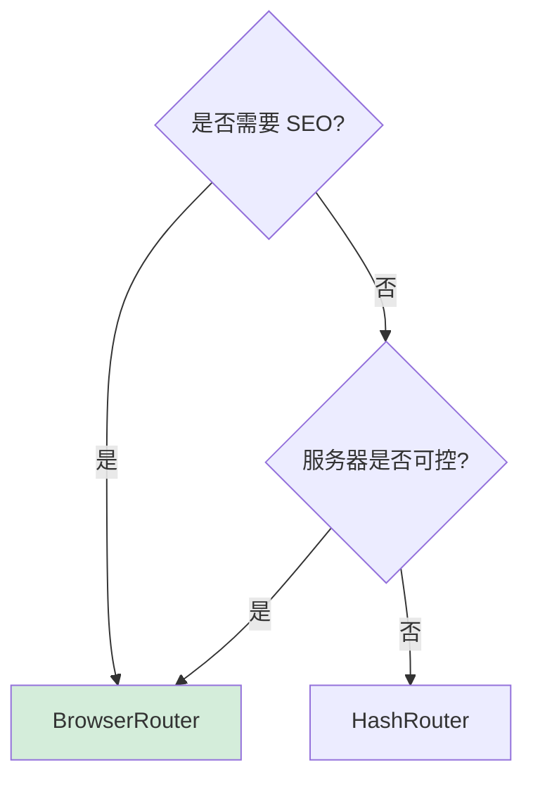

#### 项目实战踩坑

> **问题**：BrowserRouter 部署到子路径 `/app/`，刷新 404。
>
> **解决**：配置 basename + 服务器。

```jsx
<BrowserRouter basename="/app">
  <Routes>{/* ... */}</Routes>
</BrowserRouter>
```

```nginx
location /app {
  try_files $uri $uri/ /app/index.html;
}
```

---

### Q28. useNavigate、useLocation 等路由 Hooks？

#### 路由 Hooks 总览

| Hook | 作用 |
|------|------|
| useNavigate | 编程式导航 |
| useLocation | 当前 URL 信息 |
| useParams | 路径参数 |
| useSearchParams | 查询参数 |
| useMatch | 路由匹配 |
| useOutletContext | 子路由 context |
| useHref | 生成链接 |
| useNavigationType | 导航类型 |

#### useNavigate 详解

```jsx
function Component() {
  const navigate = useNavigate();

  return (
    <>
      <button onClick={() => navigate('/home')}>跳转</button>
      <button onClick={() => navigate('/home', { replace: true })}>替换</button>
      <button onClick={() => navigate(-1)}>后退</button>
      <button onClick={() => navigate(-2)}>后退 2 步</button>
      <button onClick={() => navigate(1)}>前进</button>
      <button onClick={() => navigate('/user/123', { state: { from: 'list' } })}>
        带 state
      </button>
    </>
  );
}
```

#### useLocation

```jsx
function Component() {
  const location = useLocation();
  /*
    location = {
      pathname: '/users/123',
      search: '?tab=settings',
      hash: '#section',
      state: { from: 'menu' },  // 来自 navigate 的 state
      key: 'abc123'  // 唯一标识
    }
  */
  return <div>当前路径: {location.pathname}</div>;
}

// 监听路由变化
function useRouteChange(callback) {
  const location = useLocation();
  useEffect(() => {
    callback(location);
  }, [location]);
}
```

#### useMatch

```jsx
function Component() {
  const match = useMatch('/users/:id');
  /*
    match = {
      params: { id: '123' },
      pathname: '/users/123',
      pathnameBase: '/users/123',
      pattern: { path: '/users/:id' }
    }
  */
  return match ? <div>匹配用户</div> : null;
}
```

#### useNavigationType

```jsx
function Component() {
  const navType = useNavigationType();
  // 'POP' | 'PUSH' | 'REPLACE' | 'RELOAD'

  return <div>导航类型: {navType}</div>;
}
```

---

## 四、状态管理方案

### Q29. React 状态管理的分类与选型？

#### 状态分类

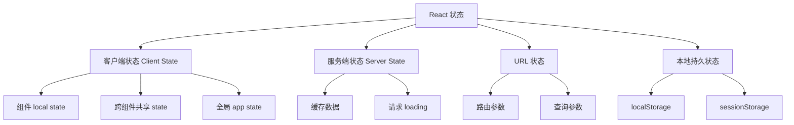

#### 各类状态对应方案

| 状态类型 | 推荐方案 |
|---------|---------|
| 组件局部状态 | useState、useReducer |
| 跨组件共享 | Context、Zustand |
| 全局状态 | Redux、MobX |
| 服务端状态 | React Query、SWR |
| URL 状态 | useSearchParams、useParams |
| 持久状态 | useLocalStorage 自定义 Hook |

#### 选型决策流程

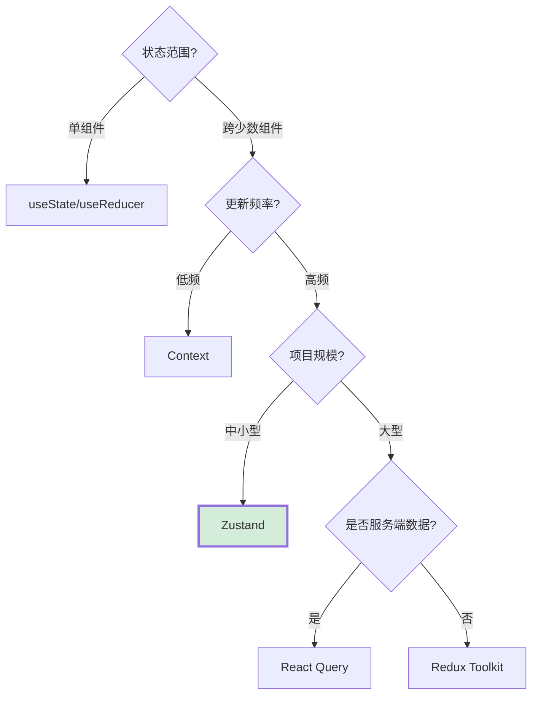

---

### Q30. Context API 的原理与使用场景？

#### 工作原理

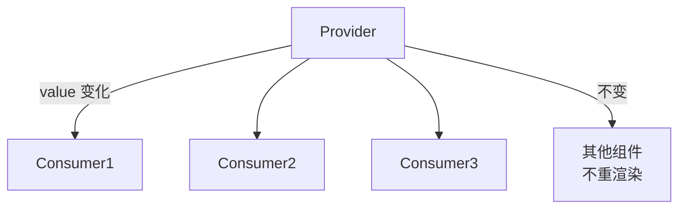

#### 何时用 Context

✅ **适合**：
- 主题、语言、用户信息
- 低频更新的全局配置
- 跨多层组件传值（避免 prop drilling）

❌ **不适合**：
- 高频更新（购物车、列表）
- 大量数据共享
- 复杂业务逻辑

#### 进阶用法

**1. 动态 Context**

```jsx
const ThemeContext = createContext();

function ThemeProvider({ children }) {
  const [theme, setTheme] = useState('light');

  const value = useMemo(() => ({
    theme,
    toggle: () => setTheme(t => t === 'light' ? 'dark' : 'light')
  }), [theme]);

  return <ThemeContext.Provider value={value}>{children}</ThemeContext.Provider>;
}

const useTheme = () => useContext(ThemeContext);
```

**2. 选择性消费（避免全量重渲染）**

```jsx
// 拆分 Context
const UserContext = createContext();
const ThemeContext = createContext();

function App() {
  return (
    <UserContext.Provider value={user}>
      <ThemeContext.Provider value={theme}>
        <Page />
      </ThemeContext.Provider>
    </UserContext.Provider>
  );
}

// 仅订阅 user 的组件不因 theme 变化重渲染
function UserName() {
  const { user } = useContext(UserContext);
  return <span>{user.name}</span>;
}
```

**3. Context + useReducer**

```jsx
const TodoContext = createContext();

function TodoProvider({ children }) {
  const [state, dispatch] = useReducer(todoReducer, initialState);

  const value = useMemo(() => ({ state, dispatch }), [state]);
  return <TodoContext.Provider value={value}>{children}</TodoContext.Provider>;
}

const useTodo = () => useContext(TodoContext);
```

---

### Q31. Redux 的核心概念与数据流？

#### 三大核心

| 概念 | 说明 |
|------|------|
| Action | 描述"发生了什么"的纯对象，必须有 type |
| Reducer | 根据 action 返回新 state 的纯函数 |
| Store | 单一数据源，持有 state 并提供 API |

#### 单向数据流

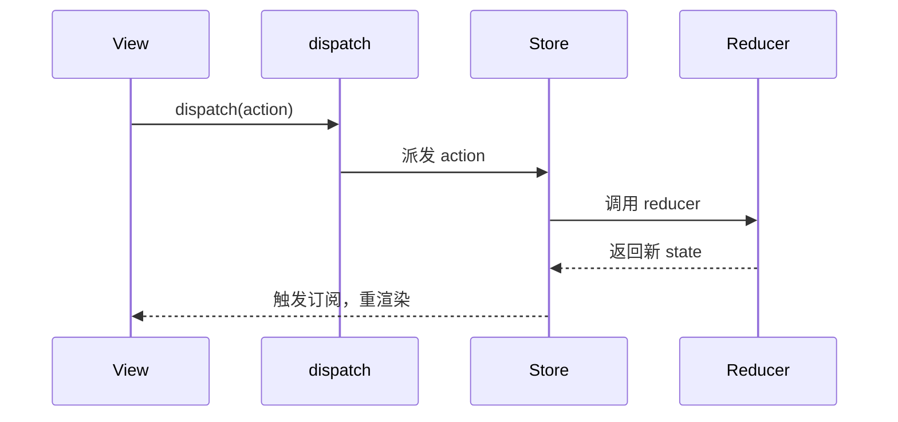

#### 完整示例

```jsx
// 1. Action Types
const ADD_TODO = 'ADD_TODO';
const TOGGLE_TODO = 'TOGGLE_TODO';

// 2. Action Creators
const addTodo = (text) => ({ type: ADD_TODO, payload: { id: Date.now(), text, done: false } });
const toggleTodo = (id) => ({ type: TOGGLE_TODO, payload: id });

// 3. Reducer
function todosReducer(state = [], action) {
  switch (action.type) {
    case ADD_TODO:
      return [...state, action.payload];
    case TOGGLE_TODO:
      return state.map(todo =>
        todo.id === action.payload ? { ...todo, done: !todo.done } : todo
      );
    default:
      return state;
  }
}

// 4. Store
import { createStore } from 'redux';
const store = createStore(todosReducer);

// 5. React 组件
import { useSelector, useDispatch } from 'react-redux';

function TodoList() {
  const todos = useSelector(state => state);
  const dispatch = useDispatch();

  return (
    <ul>
      {todos.map(todo => (
        <li key={todo.id} onClick={() => dispatch(toggleTodo(todo.id))}>
          {todo.done ? '✓' : '○'} {todo.text}
        </li>
      ))}
      <button onClick={() => dispatch(addTodo('New Task'))}>添加</button>
    </ul>
  );
}

// 6. Provider
import { Provider } from 'react-redux';

function App() {
  return <Provider store={store}><TodoList /></Provider>;
}
```

#### 三大原则

1. **单一数据源**：整个应用只有一棵树
2. **State 只读**：只能通过 action 改变
3. **使用纯函数修改**：reducer 必须是纯函数

---

### Q32. Redux Toolkit(RTK) 的优势与使用？

#### RTK 解决的问题

| 传统 Redux 痛点 | RTK 解决方案 |
|---------------|-------------|
| 配置繁琐 | `configureStore` 一键配置 |
| 需手写 action types | `createSlice` 自动生成 |
| 不可变更新繁琐 | 内置 Immer |
| 样板代码多 | 大幅减少 |
| 异步处理复杂 | `createAsyncThunk` |

#### createSlice 示例

```jsx
import { createSlice, configureStore } from '@reduxjs/toolkit';

const todosSlice = createSlice({
  name: 'todos',
  initialState: [],
  reducers: {
    // 自动生成 action: todos/addTodo
    addTodo: (state, action) => {
      // "Mutate" 写法，Immer 自动转为不可变
      state.push({ id: Date.now(), text: action.payload, done: false });
    },
    toggleTodo: (state, action) => {
      const todo = state.find(t => t.id === action.payload);
      if (todo) todo.done = !todo.done;
    },
    removeTodo: (state, action) => {
      return state.filter(t => t.id !== action.payload);
    }
  }
});

export const { addTodo, toggleTodo, removeTodo } = todosSlice.actions;

const store = configureStore({
  reducer: {
    todos: todosSlice.reducer
  }
});
```

#### 异步处理 createAsyncThunk

```jsx
const userSlice = createSlice({
  name: 'user',
  initialState: { data: null, loading: false, error: null },
  reducers: {},
  extraReducers: (builder) => {
    builder
      .addCase(fetchUser.pending, (state) => {
        state.loading = true;
      })
      .addCase(fetchUser.fulfilled, (state, action) => {
        state.loading = false;
        state.data = action.payload;
      })
      .addCase(fetchUser.rejected, (state, action) => {
        state.loading = false;
        state.error = action.error.message;
      });
  }
});

// 异步 thunk
export const fetchUser = createAsyncThunk(
  'user/fetchUser',
  async (userId) => {
    const res = await fetch(`/api/users/${userId}`);
    return res.json();
  }
);
```

#### 使用组件

```jsx
import { useSelector, useDispatch } from 'react-redux';
import { addTodo } from './store';

function TodoList() {
  const todos = useSelector(state => state.todos);
  const dispatch = useDispatch();

  return (
    <button onClick={() => dispatch(addTodo('New'))}>添加</button>
  );
}
```

---

### Q33. Redux 异步中间件 redux-thunk 与 redux-saga 对比？

#### 核心对比

| 维度 | redux-thunk | redux-saga |
|------|------------|------------|
| 实现方式 | 函数分发 | Generator 函数 |
| 学习曲线 | 平缓 | 陡峭 |
| 测试 | 较难（mock dispatch） | 易（mock effects） |
| 复杂流 | 较弱 | 强（取消、并发） |
| 体积 | 极小 | 较大 |
| 适合场景 | 简单异步 | 复杂业务流 |

#### redux-thunk 示例

```jsx
// thunk：action 是函数
const fetchUser = (userId) => {
  return async (dispatch, getState) => {
    dispatch({ type: 'FETCH_START' });
    try {
      const res = await fetch(`/api/users/${userId}`);
      const data = await res.json();
      dispatch({ type: 'FETCH_SUCCESS', payload: data });
    } catch (err) {
      dispatch({ type: 'FETCH_ERROR', payload: err.message });
    }
  };
};

// 使用
dispatch(fetchUser(123));
```

#### redux-saga 示例

```jsx
import { takeEvery, put, call, takeLatest } from 'redux-saga/effects';

// worker saga
function* fetchUserSaga(action) {
  try {
    const data = yield call(api.fetchUser, action.payload);
    yield put({ type: 'FETCH_SUCCESS', payload: data });
  } catch (err) {
    yield put({ type: 'FETCH_ERROR', payload: err.message });
  }
}

// watcher saga
function* rootSaga() {
  yield takeLatest('FETCH_REQUEST', fetchUserSaga);  // 取消旧的
  // 或 takeEvery：并发执行所有
}

// 复杂流：登出时取消所有进行中请求
function* loginFlow() {
  while (true) {
    const { payload } = yield take('LOGIN_REQUEST');
    const task = yield fork(loginSaga, payload);
    const action = yield take(['LOGOUT', 'LOGIN_ERROR']);
    if (action.type === 'LOGOUT') yield cancel(task);
  }
}
```

#### 选择建议

```
简单异步（数据请求） → redux-thunk / RTK Query
复杂业务流（实时聊天、轮询、竞态） → redux-saga
现代项目 → RTK Query / React Query（替代两者）
```

---

### Q34. Zustand 轻量状态管理的优势？

#### 核心 API

```jsx
import { create } from 'zustand';

const useStore = create((set, get) => ({
  count: 0,
  users: [],

  increment: () => set(state => ({ count: state.count + 1 })),
  decrement: () => set(state => ({ count: state.count - 1 })),

  fetchUsers: async () => {
    const res = await fetch('/api/users');
    const users = await res.json();
    set({ users });
  },

  // 计算属性（getter）
  get doubleCount() {
    return get().count * 2;
  }
}));

// 使用
function Counter() {
  const count = useStore(state => state.count);
  const increment = useStore(state => state.increment);
  return <button onClick={increment}>{count}</button>;
}

// 选择性订阅
function UserName() {
  // 仅订阅 users[0].name
  const name = useStore(state => state.users[0]?.name);
  return <div>{name}</div>;
}
```

#### 优势对比

| 维度 | Redux | Zustand |
|------|-------|---------|
| 包大小 | 较大 | 极小（1KB） |
| 样板代码 | 多 | 少 |
| Provider | 必须 | 不需要 |
| 异步处理 | 中间件 | 直接 async/await |
| 性能 | 需 reselect | 内置 selector |
| TS 支持 | 较好 | 优秀 |

#### 进阶用法

**1. 持久化**

```jsx
import { persist } from 'zustand/middleware';

const useStore = create(
  persist(
    (set) => ({
      user: null,
      setUser: (user) => set({ user })
    }),
    { name: 'app-storage' }  // localStorage key
  )
);
```

**2. 跨 store 调用**

```jsx
const useAuthStore = create(() => ({ token: null }));
const useCartStore = create((set, get) => ({
  fetchCart: async () => {
    const token = useAuthStore.getState().token;  // 直接调用
    const res = await fetch('/api/cart', { headers: { Authorization: token } });
    set({ cart: await res.json() });
  }
}));
```

**3. 中间件**

```jsx
import { devtools, persist } from 'zustand/middleware';

const useStore = create(
  devtools(
    persist(
      (set) => ({ /* ... */ }),
      { name: 'storage' }
    )
  )
);
```

---

### Q35. Recoil 与 Jotai 原子化状态管理？

#### 原子化概念

将状态拆分为最小单元（atom），组件订阅单个 atom，避免全量更新。

#### Recoil 示例

```jsx
import { atom, selector, useRecoilState, useRecoilValue } from 'recoil';

// atom：状态单元
const countState = atom({
  key: 'countState',
  default: 0
});

// selector：派生状态
const doubleCountState = selector({
  key: 'doubleCountState',
  get: ({ get }) => get(countState) * 2
});

// 使用
function Counter() {
  const [count, setCount] = useRecoilState(countState);
  const double = useRecoilValue(doubleCountState);
  return (
    <>
      <button onClick={() => setCount(c => c + 1)}>{count}</button>
      <p>双倍: {double}</p>
    </>
  );
}
```

#### Jotai 示例

```jsx
import { atom, useAtom } from 'jotai';

const countAtom = atom(0);
const doubleAtom = atom(get => get(countAtom) * 2);

function Counter() {
  const [count, setCount] = useAtom(countAtom);
  const [double] = useAtom(doubleAtom);
  return (
    <>
      <button onClick={() => setCount(c => c + 1)}>{count}</button>
      <p>{double}</p>
    </>
  );
}
```

#### 对比

| 维度 | Recoil | Jotai |
|------|--------|-------|
| 出品 | Facebook | 社区 |
| API | 略复杂 | 极简 |
| 派生 | selector | atom 嵌套 |
| 异步 | 内置 Suspense | 需手动 |
| 体积 | 较大 | 极小 |

---

### Q36. MobX 的响应式与 Redux 的对比？

#### MobX 核心思想

```jsx
import { makeAutoObservable } from 'mobx';
import { observer } from 'mobx-react-lite';

class CounterStore {
  count = 0;

  constructor() {
    makeAutoObservable(this);
  }

  increment() {
    this.count++;
  }

  // 计算属性
  get double() {
    return this.count * 2;
  }
}

const counter = new CounterStore();

// observer 让组件响应 observable 变化
const Counter = observer(() => {
  return (
    <>
      <button onClick={counter.increment}>{counter.count}</button>
      <p>{counter.double}</p>
    </>
  );
});
```

#### Redux vs MobX

| 维度 | Redux | MobX |
|------|-------|------|
| 数据流 | 单向 | 双向 |
| 不可变 | 必须 | 可变 |
| 模板代码 | 多 | 少 |
| 调试 | 时间旅行 | 难（自动响应） |
| 学习曲线 | 陡 | 平缓 |
| 适合规模 | 大型 | 中小型 |
| 性能 | 手动 memo | 自动 |

#### MobX 状态原则

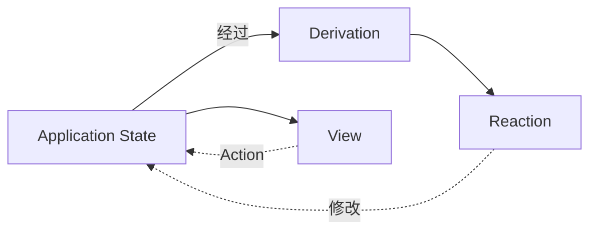

#### 项目实战

> **场景**：表单复杂，字段联动频繁。
>
> **方案**：MobX 自动响应比 Redux 手动管理更直观。

```jsx
class FormStore {
  values = {};
  errors = {};

  constructor() { makeAutoObservable(this); }

  setField(key, value) {
    this.values[key] = value;
    // 自动触发 errors 更新
    this.errors[key] = validate(key, value);
  }
}
```

---

### Q37. React Query(TanStack Query) 的服务端状态管理？

#### 核心概念

React Query 专注于**服务端状态**管理：缓存、请求去重、后台更新、乐观更新。

#### 基础用法

```jsx
import { useQuery, useMutation, QueryClient, QueryClientProvider } from '@tanstack/react-query';

const queryClient = new QueryClient();

function App() {
  return (
    <QueryClientProvider client={queryClient}>
      <UserList />
    </QueryClientProvider>
  );
}

// 查询
function UserList() {
  const { data, isLoading, error } = useQuery({
    queryKey: ['users'],
    queryFn: () => fetch('/api/users').then(res => res.json())
  });

  if (isLoading) return <Spinner />;
  if (error) return <Error />;
  return data.map(user => <div key={user.id}>{user.name}</div>);
}

// 变更
function AddUser() {
  const queryClient = useQueryClient();
  const mutation = useMutation({
    mutationFn: (newUser) => fetch('/api/users', { method: 'POST', body: JSON.stringify(newUser) }),
    onSuccess: () => {
      // 失效缓存，触发重新获取
      queryClient.invalidateQueries({ queryKey: ['users'] });
    }
  });

  return <button onClick={() => mutation.mutate({ name: 'Tom' })}>添加</button>;
}
```

#### 高级特性

**1. 乐观更新**

```jsx
const mutation = useMutation({
  mutationFn: updateTodo,
  onMutate: async (newTodo) => {
    // 取消进行中的查询
    await queryClient.cancelQueries({ queryKey: ['todos'] });
    // 保存旧值
    const previousTodos = queryClient.getQueryData(['todos']);
    // 乐观更新
    queryClient.setQueryData(['todos'], old => [...old, newTodo]);
    return { previousTodos };  // context 传递
  },
  onError: (err, newTodo, context) => {
    // 失败回滚
    queryClient.setQueryData(['todos'], context.previousTodos);
  },
  onSettled: () => {
    queryClient.invalidateQueries({ queryKey: ['todos'] });
  }
});
```

**2. 依赖查询**

```jsx
const { data: user } = useQuery({ queryKey: ['user', userId], queryFn: fetchUser });
const { data: projects } = useQuery({
  queryKey: ['projects', user?.id],
  queryFn: () => fetchProjects(user.id),
  enabled: !!user  // user 存在才查询
});
```

**3. 无限滚动**

```jsx
const {
  data,
  fetchNextPage,
  hasNextPage,
  isFetchingNextPage
} = useInfiniteQuery({
  queryKey: ['posts'],
  queryFn: ({ pageParam = 1 }) => fetchPosts(pageParam),
  getNextPageParam: (lastPage) => lastPage.nextPage,
});
```

#### 缓存策略

```jsx
useQuery({
  queryKey: ['user'],
  queryFn: fetchUser,
  staleTime: 1000 * 60 * 5,  // 5 分钟内不重新请求
  cacheTime: 1000 * 60 * 30, // 30 分钟后清理缓存
  refetchOnWindowFocus: true, // 窗口聚焦时刷新
  refetchOnReconnect: true,   // 网络恢复时刷新
  retry: 3                    // 失败重试 3 次
});
```

---

### Q38. 状态管理方案选型决策树？

#### 决策流程

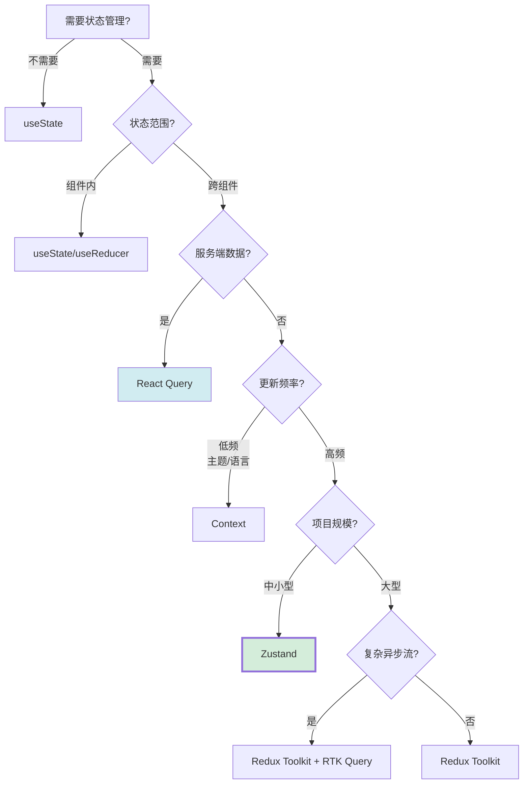

#### 选型表

| 场景 | 推荐方案 |
|------|---------|
| 简单组件 | useState |
| 复杂组件逻辑 | useReducer |
| 跨组件低频共享 | Context |
| 中型应用全局状态 | Zustand |
| 大型应用 + 时间旅行 | Redux Toolkit |
| 服务端数据缓存 | React Query |
| 响应式偏好 | MobX |
| 原子化细粒度 | Jotai |

#### 项目实战：组合方案

```jsx
// 全局客户端状态：Zustand
const useUIStore = create((set) => ({
  theme: 'light',
  toggleTheme: () => set(s => ({ theme: s.theme === 'light' ? 'dark' : 'light' }))
}));

// 服务端状态：React Query
function UserList() {
  const { data } = useQuery(['users'], fetchUsers);
  return <div>{/* ... */}</div>;
}

// URL 状态：useSearchParams
function Search() {
  const [params] = useSearchParams();
  return <div>{/* ... */}</div>;
}

// 本地状态：useState
function Form() {
  const [value, setValue] = useState('');
  return <input value={value} onChange={e => setValue(e.target.value)} />;
}
```

---

## 五、性能优化

### Q39. React 性能优化的核心思路？

#### 优化全景图

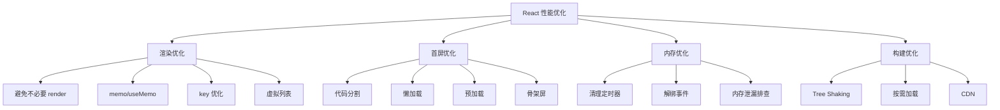

#### 关键指标

| 指标 | 目标 |
|------|------|
| 首屏渲染 | < 1s |
| 交互响应 | < 100ms |
| 重渲染次数 | 最小化 |
| 内存占用 | 无泄漏 |
| bundle 体积 | 主包 < 200KB |

---

### Q40. React.memo 与浅比较 deepMemo？

#### React.memo 基础

```jsx
const MyComponent = React.memo(function MyComponent(props) {
  // 只有 props 变化时才重渲染
  return <div>{props.name}</div>;
});

// 等价于
function areEqual(prevProps, nextProps) {
  return prevProps.name === nextProps.name;
}
const MyComponent = React.memo(Component, areEqual);
```

#### 浅比较陷阱

```jsx
// ❌ 问题：每次传入新对象，memo 失效
function Parent() {
  return <Child style={{ color: 'red' }} />;  // 每次新对象
}

// ✅ 修复1：提到外部
const style = { color: 'red' };
function Parent() {
  return <Child style={style} />;
}

// ✅ 修复2：useMemo
function Parent() {
  const style = useMemo(() => ({ color: 'red' }), []);
  return <Child style={style} />;
}
```

#### 自定义比较函数

```jsx
import { isEqual } from 'lodash';

const DeepMemo = React.memo(Component, (prev, next) => {
  return isEqual(prev, next);  // 深比较
});

// 注意：深比较本身有性能开销，仅在必要时使用
```

#### 项目实战

```jsx
// 列表项 memo
const ListItem = React.memo(({ item, onClick }) => {
  return <li onClick={() => onClick(item.id)}>{item.name}</li>;
});

function List({ items }) {
  const handleClick = useCallback(id => {
    console.log('click', id);
  }, []);  // 稳定引用

  return items.map(item => (
    <ListItem key={item.id} item={item} onClick={handleClick} />
  ));
}
```

---

### Q41. shouldComponentUpdate 与 React.memo 的关系？

#### 关系

- **类组件**：`shouldComponentUpdate` 生命周期
- **函数组件**：`React.memo`

两者作用相同，决定是否重渲染。

#### shouldComponentUpdate

```jsx
class MyComponent extends React.Component {
  shouldComponentUpdate(nextProps, nextState) {
    // 返回 true 渲染，false 不渲染
    return nextProps.value !== this.props.value;
  }

  render() {
    return <div>{this.props.value}</div>;
  }
}

// 内置 PureComponent：浅比较 props/state
class MyComponent extends React.PureComponent {
  render() {
    return <div>{this.props.value}</div>;
  }
}
```

#### 等价关系

```jsx
// React.PureComponent ≡ React.memo(Component)
const MyComponent = React.memo(Component);

// React.memo(Component, areEqual) ≡ shouldComponentUpdate
const MyComponent = React.memo(Component, (prev, next) => {
  return prev.value === next.value;
});
```

#### 选择建议

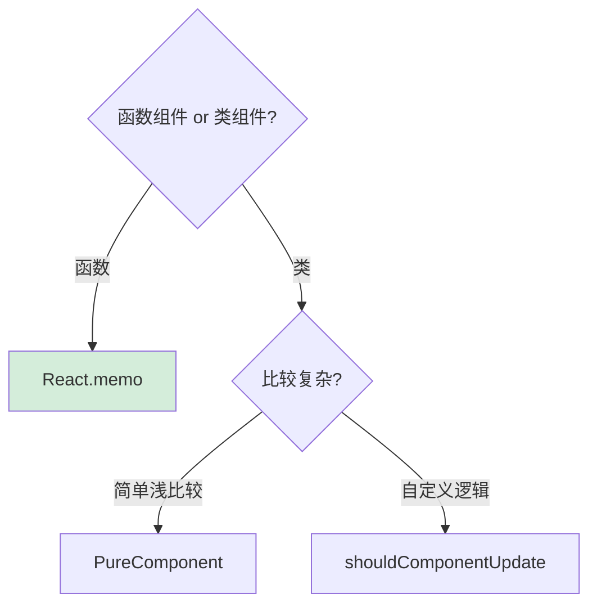

---

### Q42. 列表渲染的 key 为什么重要？

#### key 的作用

帮助 React 识别哪些元素变化、新增、删除，提升 diff 效率，避免状态错位。

#### 无 key 与有 key 对比

```jsx
// ❌ 无 key：React 默认用 index
// 删除第一项后，所有 item 状态错位
function List({ items }) {
  return items.map((item, index) => (
    <Item key={index} item={item} />
  ));
}

// 删除 items[0]：
// 原 [A, B, C] → 新 [B, C]
// key 0: A → B (复用，更新内容)
// key 1: B → C (复用，更新内容)
// key 2: C → 删除
// 所有项都重渲染，input 状态错位

// ✅ 有 key：用 id
function List({ items }) {
  return items.map(item => (
    <Item key={item.id} item={item} />
  ));
}

// 删除 items[0]：
// React 知道 id=A 的没了，B/C 复用
// 只删除第一项 DOM，其他不动
```

#### key 选取原则

```
✅ 稳定、唯一、可预测
   - 数据 id（推荐）
   - 数据唯一字段

❌ 不稳定
   - index（除非列表不变）
   - Math.random()
   - 时间戳
```

#### index 作为 key 的场景

```jsx
// 静态列表（无增删、无重排）可用 index
{[1,2,3].map((n, i) => <span key={i}>{n}</span>)}

// 动态列表必须用 id
{todos.map(todo => <Todo key={todo.id} />)}
```

#### 项目实战踩坑

> **问题**：表单列表删除第一项时，第二项的输入值跑到第一项。
>
> **根因**：用 index 作为 key，React 复用了 DOM 节点，input 的 value 还是旧的。
>
> **解决**：用 item.id 作为 key。

---

### Q43. 虚拟列表与窗口化的实现？

#### 核心原理

只渲染可见区域 + 上下缓冲区的 DOM 节点，滚动时动态替换数据。

```mermaid
flowchart LR
    subgraph 全部数据1万条
        A1[1]
        A2[2]
        A3[...]
        A4[10000]
    end

    subgraph 实际渲染
        B1[可见项1]
        B2[可见项2]
        B3[...缓冲...]
        B4[可见项N]
    end

    A1 -.->|滚动动态映射| B1
```

#### 简化实现

```jsx
function VirtualList({ items, itemHeight = 50, visibleHeight = 600 }) {
  const [scrollTop, setScrollTop] = useState(0);

  const startIndex = Math.max(0, Math.floor(scrollTop / itemHeight) - 5);
  const visibleCount = Math.ceil(visibleHeight / itemHeight) + 10;
  const endIndex = Math.min(items.length, startIndex + visibleCount);

  const visibleItems = items.slice(startIndex, endIndex);

  return (
    <div
      style={{ height: visibleHeight, overflowY: 'auto' }}
      onScroll={e => setScrollTop(e.currentTarget.scrollTop)}
    >
      <div style={{ height: items.length * itemHeight, position: 'relative' }}>
        {visibleItems.map((item, idx) => {
          const realIdx = startIndex + idx;
          return (
            <div
              key={item.id}
              style={{
                position: 'absolute',
                top: realIdx * itemHeight,
                height: itemHeight
              }}
            >
              {item.content}
            </div>
          );
        })}
      </div>
    </div>
  );
}
```

#### 推荐库：react-window

```jsx
import { FixedSizeList } from 'react-window';

const Row = ({ index, style }) => (
  <div style={style}>Row {index}</div>
);

<FixedSizeList
  height={600}
  width="100%"
  itemCount={100000}
  itemSize={50}
>
  {Row}
</FixedSizeList>;
```

#### 动态高度：react-virtualized

```jsx
import { List } from 'react-virtualized';

const rowRenderer = ({ index, key, style }) => (
  <div key={key} style={style}>
    {items[index].content}
  </div>
);

<List
  width={600}
  height={600}
  rowCount={items.length}
  rowHeight={50}  // 或函数动态计算
  rowRenderer={rowRenderer}
/>
```

---

### Q44. React 18 并发特性(Concurrent) 与 useTransition？

#### 并发特性核心

允许 React 中断、暂停、恢复渲染，让高优先级任务优先执行。

#### useTransition

```jsx
function Search() {
  const [isPending, startTransition] = useTransition();
  const [keyword, setKeyword] = useState('');
  const [results, setResults] = useState([]);

  const onChange = (e) => {
    setKeyword(e.target.value);  // 高优先级：立即更新

    startTransition(() => {
      // 低优先级：可被打断
      setResults(filterHugeList(e.target.value));
    });
  };

  return (
    <>
      <input value={keyword} onChange={onChange} />
      {isPending ? <Spinner /> : <Results items={results} />}
    </>
  );
}
```

#### useDeferredValue

```jsx
function Search() {
  const [keyword, setKeyword] = useState('');
  const deferredKeyword = useDeferredValue(keyword);

  return (
    <>
      <input value={keyword} onChange={e => setKeyword(e.target.value)} />
      {/* deferredKeyword 延迟更新，可被打断 */}
      <HugeList filter={deferredKeyword} />
    </>
  );
}
```

#### useTransition vs useDeferredValue

| 维度 | useTransition | useDeferredValue |
|------|--------------|-----------------|
| 控制权 | 主动控制更新 | 被动延迟值 |
| 适用 | 状态在当前组件 | 状态来自父组件或 hook |
| 状态 | 有 isPending | 无 pending 状态 |

#### 并发特性应用场景

1. **大列表过滤**：输入框流畅响应
2. **路由切换**：旧页面保持可交互直到新页面就绪
3. **数据获取**：Suspense 配合 useTransition

---

### Q45. Suspense 与 React.lazy 的使用？

#### Suspense for Code Splitting

```jsx
import { lazy, Suspense } from 'react';

const OtherComponent = lazy(() => import('./OtherComponent'));

function MyComponent() {
  return (
    <Suspense fallback={<div>Loading...</div>}>
      <OtherComponent />
    </Suspense>
  );
}
```

#### Suspense for Data Fetching

```jsx
// 包装 Promise 为可 Suspense 的资源
function wrapPromise(promise) {
  let status = 'pending';
  let result;
  const suspender = promise.then(
    r => { status = 'success'; result = r; },
    e => { status = 'error'; result = e; }
  );
  return {
    read() {
      if (status === 'pending') throw suspender;
      if (status === 'error') throw result;
      return result;
    }
  };
}

function fetchData(url) {
  const promise = fetch(url).then(res => res.json());
  return wrapPromise(promise);
}

// 使用
function User() {
  const user = fetchData('/api/user').read();  // 抛出 Promise
  return <div>{user.name}</div>;
}

function App() {
  return (
    <Suspense fallback={<Spinner />}>
      <User />
    </Suspense>
  );
}
```

#### 嵌套 Suspense

```jsx
function App() {
  return (
    <Suspense fallback={<PageSkeleton />}>
      <Header />
      <Suspense fallback={<ContentSkeleton />}>
        <Content />
      </Suspense>
      <Suspense fallback={<CommentsSkeleton />}>
        <Comments />
      </Suspense>
    </Suspense>
  );
}
```

#### Suspense 配合 React Query

```jsx
import { useQuery } from '@tanstack/react-query';

function User() {
  const { data } = useQuery({
    queryKey: ['user'],
    queryFn: fetchUser,
    suspense: true  // 启用 Suspense 模式
  });
  return <div>{data.name}</div>;
}

function App() {
  return (
    <Suspense fallback={<Spinner />}>
      <User />
    </Suspense>
  );
}
```

---

## 六、高级特性与模式

### Q46. 高阶组件 HOC 与 Render Props 模式？

#### HOC (Higher-Order Component)

```jsx
// HOC：接收组件返回新组件
function withLoading(Component) {
  return function WithLoading({ isLoading, ...props }) {
    if (isLoading) return <Spinner />;
    return <Component {...props} />;
  };
}

const UserList = withLoading(({ users }) => (
  <ul>{users.map(u => <li key={u.id}>{u.name}</li>)}</ul>
));

// 使用
<UserList isLoading={loading} users={users} />
```

#### 多个 HOC 组合

```jsx
function withAuth(Component) {
  return (props) => {
    if (!useAuth().user) return <Navigate to="/login" />;
    return <Component {...props} />;
  };
}

function withTheme(Component) {
  return (props) => {
    const theme = useTheme();
    return <Component {...props} theme={theme} />;
  };
}

// 组合
const EnhancedComponent = withAuth(withTheme(MyComponent));

// 或使用 compose
const enhance = compose(withAuth, withTheme);
const EnhancedComponent = enhance(MyComponent);
```

#### Render Props

```jsx
// Render Props：通过 prop 传递渲染函数
class Mouse extends React.Component {
  state = { x: 0, y: 0 };

  handleMouseMove = (e) => this.setState({ x: e.clientX, y: e.clientY });

  render() {
    return (
      <div onMouseMove={this.handleMouseMove}>
        {this.props.render(this.state)}
      </div>
    );
  }
}

// 使用
<Mouse render={({ x, y }) => (
  <h1>Mouse at {x}, {y}</h1>
)} />

// 等价 children 写法
<Mouse>
  {({ x, y }) => <h1>{x}, {y}</h1>}
</Mouse>
```

#### HOC vs Render Props vs Hooks

```mermaid
flowchart TB
    P[逻辑复用模式]

    P --> H[HOC]
    P --> R[Render Props]
    P --> K[Hooks]

    H --> H1[优点：组合优雅]
    H --> H2[缺点：嵌套地狱<br/>props 命名冲突]

    R --> R1[优点：显式明确]
    R --> R2[缺点：嵌套地狱]

    K --> K1[优点：扁平、灵活]
    K --> K2[推荐：现代项目]

    style K fill:#d4edda,stroke-width:3px
```

---

### Q47. React 错误边界(Error Boundaries)？

#### 核心概念

错误边界是 React 组件，捕获子组件树 JavaScript 错误，展示降级 UI。

#### 注意：错误边界不捕获

- 事件处理函数错误（用 try/catch）
- 异步代码错误（setTimeout、Promise）
- 服务端渲染错误
- 错误边界自身的错误

#### 实现

```jsx
class ErrorBoundary extends React.Component {
  constructor(props) {
    super(props);
    this.state = { hasError: false, error: null };
  }

  static getDerivedStateFromError(error) {
    // 更新 state，下次渲染显示降级 UI
    return { hasError: true, error };
  }

  componentDidCatch(error, errorInfo) {
    // 上报错误
    console.error('Error:', error);
    console.error('Info:', errorInfo);
    // reportErrorToService(error, errorInfo);
  }

  render() {
    if (this.state.hasError) {
      // 降级 UI
      return (
        <div>
          <h1>出错了</h1>
          <p>{this.state.error.message}</p>
          <button onClick={() => window.location.reload()}>刷新</button>
        </div>
      );
    }
    return this.props.children;
  }
}

// 使用
<ErrorBoundary>
  <App />
</ErrorBoundary>

// 嵌套粒度
<ErrorBoundary fallback={<Crash />}>
  <Header />
  <ErrorBoundary fallback={<ContentError />}>
    <Content />
  </ErrorBoundary>
  <Footer />
</ErrorBoundary>
```

#### 函数组件简化版（react-error-boundary 库）

```jsx
import { ErrorBoundary } from 'react-error-boundary';

function App() {
  return (
    <ErrorBoundary
      FallbackComponent={ErrorFallback}
      onError={(error, errorInfo) => {
        console.error(error, errorInfo);
      }}
    >
      <App />
    </ErrorBoundary>
  );
}

function ErrorFallback({ error, resetErrorBoundary }) {
  return (
    <div>
      <p>出错啦: {error.message}</p>
      <button onClick={resetErrorBoundary}>重试</button>
    </div>
  );
}
```

---

### Q48. React Portals 与弹窗组件？

#### 核心用法

```jsx
import { createPortal } from 'react-dom';

function Modal({ children, isOpen }) {
  if (!isOpen) return null;

  return createPortal(
    <div className="modal-overlay">
      <div className="modal-content">
        {children}
      </div>
    </div>,
    document.body  // 渲染到 body 下
  );
}

// 使用
function App() {
  const [isOpen, setIsOpen] = useState(false);
  return (
    <div style={{ position: 'relative', overflow: 'hidden' }}>
      <button onClick={() => setIsOpen(true)}>打开</button>
      <Modal isOpen={isOpen}>
        <h2>标题</h2>
        <p>内容</p>
        <button onClick={() => setIsOpen(false)}>关闭</button>
      </Modal>
    </div>
  );
}
```

#### 为什么需要 Portals

| 痛点 | Portal 解决 |
|------|------------|
| 父级 overflow:hidden 截断 | 渲染到 body，跳出层级 |
| 父级 z-index 限制 | 不受父级层叠影响 |
| 父级 transform 创建包含块 | fixed 失效，Portal 解决 |
| 事件冒泡 | 仍按 React 树冒泡（不是 DOM 树） |

#### 事件冒泡特性

```jsx
function App() {
  const handleClick = () => console.log('父组件 click');

  return (
    <div onClick={handleClick}>
      <Modal>
        <button>点击</button>
        {/* ❌ 不点击也会触发父 onClick！
            因为 React 事件按组件树冒泡 */}
      </Modal>
    </div>
  );
}

// 如需阻止：在 Modal 内 stopPropagation
function Modal({ children }) {
  return createPortal(
    <div onClick={e => e.stopPropagation()}>
      {children}
    </div>,
    document.body
  );
}
```

#### 封装通用 Modal

```jsx
function useModal() {
  const [isOpen, setIsOpen] = useState(false);
  const open = useCallback(() => setIsOpen(true), []);
  const close = useCallback(() => setIsOpen(false), []);
  return { isOpen, open, close };
}

function Modal({ isOpen, onClose, children, title }) {
  useEffect(() => {
    if (isOpen) {
      const handler = (e) => e.key === 'Escape' && onClose();
      document.addEventListener('keydown', handler);
      document.body.style.overflow = 'hidden';  // 防止背景滚动
      return () => {
        document.removeEventListener('keydown', handler);
        document.body.style.overflow = '';
      };
    }
  }, [isOpen, onClose]);

  if (!isOpen) return null;

  return createPortal(
    <div className="overlay" onClick={onClose}>
      <div className="modal" onClick={e => e.stopPropagation()}>
        <h2>{title}</h2>
        {children}
      </div>
    </div>,
    document.body
  );
}
```

---

### Q49. Forward Ref 与 Ref 转发机制？

#### 为什么需要 forwardRef

函数组件默认不能接收 ref，需 forwardRef 转发。

```jsx
// ❌ 普通：ref 不能传给函数组件
const MyInput = (props) => <input {...props} />;
<MyInput ref={inputRef} />  // ref 不会传到 input

// ✅ forwardRef
const MyInput = React.forwardRef((props, ref) => (
  <input ref={ref} {...props} />
));
<MyInput ref={inputRef} />  // inputRef.current 指向 input
```

#### 类组件 ref

```jsx
class MyInput extends React.Component {
  focus() { this.input.focus(); }
  render() {
    return <input ref={el => this.input = el} />;
  }
}

// 父组件
const myInputRef = useRef();
<MyInput ref={myInputRef} />  // ref 指向组件实例
myInputRef.current?.focus();
```

#### useImperativeHandle 自定义暴露

```jsx
const MyInput = forwardRef((props, ref) => {
  const inputRef = useRef();

  useImperativeHandle(ref, () => ({
    focus: () => inputRef.current?.focus(),
    clear: () => { if (inputRef.current) inputRef.current.value = ''; },
    getValue: () => inputRef.current?.value
  }));

  return <input ref={inputRef} />;
});

// 父组件只能调用 focus/clear/getValue
function App() {
  const ref = useRef();
  return (
    <>
      <MyInput ref={ref} />
      <button onClick={() => ref.current?.focus()}>聚焦</button>
      <button onClick={() => ref.current?.clear()}>清空</button>
    </>
  );
}
```

#### ref 转发多层

```jsx
// 高阶组件也需转发 ref
function logProps(Component) {
  class LogProps extends React.Component {
    componentDidUpdate(prevProps) {
      console.log('old:', prevProps);
      console.log('new:', this.props);
    }
    render() {
      // ❌ 旧写法 ref 丢失
      // return <Component {...this.props} />;

      // ✅ forwardRef 转发
      const { forwardedRef, ...rest } = this.props;
      return <Component ref={forwardedRef} {...rest} />;
    }
  }
  return React.forwardRef((props, ref) => (
    <LogProps {...props} forwardedRef={ref} />
  ));
}
```

---

### Q50. 自定义 Hook 提取业务逻辑的最佳实践？

#### 设计原则

1. **单一职责**：一个 Hook 只做一件事
2. **可组合**：Hook 内可调用其他 Hook
3. **返回值清晰**：数组（多值）或对象（命名）
4. **参数灵活**：支持配置
5. **类型友好**：TS 泛型

#### 综合示例：useForm

```jsx
function useForm(initialValues = {}, validate) {
  const [values, setValues] = useState(initialValues);
  const [errors, setErrors] = useState({});
  const [touched, setTouched] = useState({});
  const [isSubmitting, setIsSubmitting] = useState(false);

  // 字段变化
  const handleChange = useCallback((e) => {
    const { name, value } = e.target;
    setValues(prev => ({ ...prev, [name]: value }));
  }, []);

  // 字段失焦
  const handleBlur = useCallback((e) => {
    const { name } = e.target;
    setTouched(prev => ({ ...prev, [name]: true }));
  }, []);

  // 表单验证
  const validateForm = useCallback(() => {
    if (!validate) return {};
    const newErrors = validate(values);
    setErrors(newErrors);
    return newErrors;
  }, [values, validate]);

  // 提交
  const handleSubmit = useCallback(async (onSubmit) => {
    setIsSubmitting(true);
    const errors = validateForm();
    if (Object.keys(errors).length === 0) {
      try {
        await onSubmit(values);
      } catch (err) {
        console.error(err);
      }
    }
    setIsSubmitting(false);
  }, [values, validateForm]);

  // 重置
  const reset = useCallback(() => {
    setValues(initialValues);
    setErrors({});
    setTouched({});
  }, [initialValues]);

  return {
    values,
    errors,
    touched,
    isSubmitting,
    handleChange,
    handleBlur,
    handleSubmit,
    reset
  };
}

// 使用
function LoginForm() {
  const validate = (values) => {
    const errors = {};
    if (!values.email) errors.email = '邮箱必填';
    if (!values.password) errors.password = '密码必填';
    return errors;
  };

  const form = useForm({ email: '', password: '' }, validate);

  const onSubmit = async (values) => {
    await api.login(values);
  };

  return (
    <form onSubmit={e => { e.preventDefault(); form.handleSubmit(onSubmit); }}>
      <input
        name="email"
        value={form.values.email}
        onChange={form.handleChange}
        onBlur={form.handleBlur}
      />
      {form.touched.email && form.errors.email && <span>{form.errors.email}</span>}

      <input
        name="password"
        type="password"
        value={form.values.password}
        onChange={form.handleChange}
        onBlur={form.handleBlur}
      />
      {form.touched.password && form.errors.password && <span>{form.errors.password}</span>}

      <button type="submit" disabled={form.isSubmitting}>登录</button>
    </form>
  );
}
```

#### 综合示例：useFetch（带缓存）

```jsx
function useFetch(url, options = {}) {
  const cache = useRef(new Map());

  const [state, setState] = useState({
    data: null,
    loading: true,
    error: null
  });

  useEffect(() => {
    let isMounted = true;

    // 检查缓存
    if (cache.current.has(url)) {
      setState({ data: cache.current.get(url), loading: false, error: null });
      return;
    }

    setState(s => ({ ...s, loading: true, error: null }));

    fetch(url, options)
      .then(res => {
        if (!res.ok) throw new Error('HTTP ' + res.status);
        return res.json();
      })
      .then(data => {
        if (isMounted) {
          cache.current.set(url, data);
          setState({ data, loading: false, error: null });
        }
      })
      .catch(error => {
        if (isMounted) setState({ data: null, loading: false, error });
      });

    return () => { isMounted = false; };
  }, [url]);

  return state;
}
```

---

## 七、TypeScript 与测试

### Q51. React + TypeScript 的常用类型与泛型？

#### 基础类型

```tsx
import { FC, ReactNode, MouseEvent, ChangeEvent } from 'react';

// 函数组件类型
const Button: FC<{ title: string; onClick?: () => void }> = ({ title, onClick }) => (
  <button onClick={onClick}>{title}</button>
);

// children 类型
const Card: FC<{ children: ReactNode }> = ({ children }) => (
  <div className="card">{children}</div>
);

// 事件类型
function Input() {
  const handleChange = (e: ChangeEvent<HTMLInputElement>) => {
    console.log(e.target.value);
  };

  const handleClick = (e: MouseEvent<HTMLButtonElement>) => {
    console.log(e.currentTarget);
  };

  return (
    <>
      <input onChange={handleChange} />
      <button onClick={handleClick}>Click</button>
    </>
  );
}
```

#### Props 类型

```tsx
interface UserProps {
  user: {
    id: number;
    name: string;
    age?: number;
  };
  onChange: (id: number) => void;
  children?: ReactNode;
}

const User: FC<UserProps> = ({ user, onChange }) => {
  return <div onClick={() => onChange(user.id)}>{user.name}</div>;
};
```

#### useState 泛型

```tsx
const [count, setCount] = useState<number>(0);
const [user, setUser] = useState<User | null>(null);
const [list, setList] = useState<string[]>([]);

// 惰性初始化
const [data, setData] = useState(() => {
  const stored = localStorage.getItem('data');
  return stored ? JSON.parse(stored) : initialData;
});
```

#### useRef 泛型

```tsx
const inputRef = useRef<HTMLInputElement>(null);
// 使用时需 ?. 或 if 判断
inputRef.current?.focus();
if (inputRef.current) inputRef.current.value = '';

// 保存任意值
const timerRef = useRef<number | null>(null);
```

#### useReducer 类型

```tsx
type Action =
  | { type: 'increment' }
  | { type: 'decrement' }
  | { type: 'set'; payload: number };

const reducer = (state: number, action: Action): number => {
  switch (action.type) {
    case 'increment': return state + 1;
    case 'decrement': return state - 1;
    case 'set': return action.payload;
  }
};

const [state, dispatch] = useReducer(reducer, 0);
dispatch({ type: 'set', payload: 10 });
```

#### 泛型组件

```tsx
function List<T,>({ items, render }: { items: T[]; render: (item: T) => ReactNode }) {
  return <ul>{items.map((item, i) => <li key={i}>{render(item)}</li>)}</ul>;
}

// 使用
<List items={[1, 2, 3]} render={n => <span>{n}</span>} />
<List items={['a', 'b']} render={s => <span>{s}</span>} />
```

#### forwardRef + TS

```tsx
const MyInput = forwardRef<HTMLInputElement, { defaultValue?: string }>(
  ({ defaultValue }, ref) => (
    <input ref={ref} defaultValue={defaultValue} />
  )
);
```

#### 自定义 Hook 类型

```tsx
function useToggle(initial: boolean = false): [boolean, () => void, () => void] {
  const [on, setOn] = useState(initial);
  const toggle = useCallback(() => setOn(v => !v), []);
  const reset = useCallback(() => setOn(initial), [initial]);
  return [on, toggle, reset];
}
```

---

### Q52. React Testing Library 与 Jest 测试？

#### 测试原则

RTL 的核心：**"测试组件行为，而非实现细节"**

- ✅ 用户视角：点击、输入、看到内容
- ❌ 不测内部 state、不测私有方法

#### 基础测试

```jsx
import { render, screen, fireEvent } from '@testing-library/react';
import Counter from './Counter';

test('counter increments', () => {
  render(<Counter />);
  expect(screen.getByText('Count: 0')).toBeInTheDocument();

  fireEvent.click(screen.getByText('+'));
  expect(screen.getByText('Count: 1')).toBeInTheDocument();
});
```

#### 异步测试

```jsx
import { render, screen, waitFor } from '@testing-library/react';
import UserList from './UserList';

test('displays users', async () => {
  render(<UserList />);

  // 等待异步内容出现
  await waitFor(() => {
    expect(screen.getByText('Tom')).toBeInTheDocument();
  });

  expect(screen.getByText('Tom')).toBeInTheDocument();
});
```

#### Mock API

```jsx
import { rest } from 'msw';
import { setupServer } from 'msw/node';

const server = setupServer(
  rest.get('/api/users', (req, res, ctx) => {
    return res(ctx.json([{ id: 1, name: 'Tom' }]));
  })
);

beforeAll(() => server.listen());
afterEach(() => server.resetHandlers());
afterAll(() => server.close());

test('shows Tom', async () => {
  render(<UserList />);
  expect(await screen.findByText('Tom')).toBeInTheDocument();
});
```

#### 测试用户交互

```jsx
import { render, screen, fireEvent, waitFor } from '@testing-library/react';
import Login from './Login';

test('login form submits', async () => {
  const mockLogin = jest.fn();
  render(<Login onLogin={mockLogin} />);

  fireEvent.change(screen.getByPlaceholderText('邮箱'), {
    target: { value: 'test@example.com' }
  });
  fireEvent.change(screen.getByPlaceholderText('密码'), {
    target: { value: 'password' }
  });
  fireEvent.click(screen.getByText('登录'));

  await waitFor(() => {
    expect(mockLogin).toHaveBeenCalledWith({
      email: 'test@example.com',
      password: 'password'
    });
  });
});
```

#### 测试 Hook

```jsx
import { renderHook, act } from '@testing-library/react';
import { useCounter } from './useCounter';

test('useCounter', () => {
  const { result } = renderHook(() => useCounter(0));

  expect(result.current[0]).toBe(0);

  act(() => {
    result.current[1]();  // increment
  });

  expect(result.current[0]).toBe(1);
});
```

#### 常用查询方法

| 类型 | 方法 | 说明 |
|------|------|------|
| getBy | `getByText`, `getByRole` | 找不到报错 |
| queryBy | `queryByText` | 找不到返回 null |
| findBy | `findByText` | 异步版 getBy |
| getAllBy | `getAllByText` | 返回数组 |

---

## 八、高频速答卡片与踩坑总结

### 8.1 高频速答卡片

#### 基础类

**Q：React 三大核心思想？**
A：① 声明式（UI = f(state)）；② 组件化；③ 学习一次到处写。

**Q：虚拟 DOM 是什么？**
A：真实 DOM 的 JS 对象抽象。优势：跨平台、批量更新、声明式编程。

**Q：JSX 编译后是什么？**
A：`React.createElement(component, props, ...children)`。

**Q：Diff 三大策略？**
A：① 同层比较；② type 不同直接销毁重建；③ key 标识列表项。

#### Hooks 类

**Q：useState 与 useReducer 区别？**
A：useState 适合简单状态，useReducer 适合复杂状态机和业务逻辑。

**Q：useEffect 与 useLayoutEffect 区别？**
A：前者异步（绘制后），后者同步（绘制前，可避免闪烁）。

**Q：useMemo 与 useCallback 区别？**
A：useMemo 缓存值，useCallback 缓存函数（等价于 `useMemo(() => fn, deps)`）。

**Q：useEffect 依赖空数组 vs 无数组？**
A：空数组 `[]` 只执行一次；无数组每次渲染都执行。

#### 路由类

**Q：React Router v6 嵌套路由怎么写？**
A：父 Route 的 element 中用 `<Outlet />`，子 Route 作为 children。

**Q：Hash 与 History 模式区别？**
A：Hash 不需要服务器配置（# 后不发服务器），History 需配置 fallback 防止 404。

#### 状态管理类

**Q：Context 与 Redux 区别？**
A：Context 适合低频全局配置，Redux 适合大型应用复杂状态。Context 高频更新有性能问题。

**Q：React Query 解决什么问题？**
A：服务端状态管理：缓存、去重、后台更新、乐观更新，替代手写 thunk/saga。

**Q：状态管理选型？**
A：组件内 useState，跨组件 Context/Zustand，大型 Redux Toolkit，服务端 React Query。

#### 性能类

**Q：列表 key 用 index 有什么问题？**
A：删除/排序时状态错位，重渲染效率低。应用稳定唯一 id。

**Q：React.memo 怎么用？**
A：包裹组件，浅比较 props，props 不变则跳过重渲染。配合 useCallback/useMemo。

**Q：虚拟列表原理？**
A：只渲染可见区域 + 缓冲区，滚动时动态替换数据。可用 react-window。

### 8.2 高频踩坑总结

#### 踩坑1：useEffect 死循环

```jsx
// ❌ 错误：依赖包含引用变化的对象
const obj = { a: 1 };
useEffect(() => {
  setState(obj);
}, [obj]);  // 每次渲染 obj 都是新对象

// ✅ 修复：用 useMemo 稳定引用
const obj = useMemo(() => ({ a: 1 }), []);
```

#### 踩坑2：闭包陷阱

```jsx
// ❌ 定时器看到旧值
useEffect(() => {
  const timer = setInterval(() => {
    console.log(count);  // 永远是 0
  }, 1000);
  return () => clearInterval(timer);
}, []);

// ✅ 修复1：useRef
const countRef = useRef(count);
useEffect(() => { countRef.current = count; });
useEffect(() => {
  const timer = setInterval(() => {
    console.log(countRef.current);
  }, 1000);
  return () => clearInterval(timer);
}, []);

// ✅ 修复2：函数式更新
setInterval(() => setCount(c => {
  console.log(c);
  return c + 1;
}), 1000);
```

#### 踩坑3：异步 setState 后立即读取

```jsx
// ❌ 错误
setCount(count + 1);
console.log(count);  // 旧值

// ✅ 修复：useEffect 监听
setCount(count + 1);
useEffect(() => {
  console.log(count);  // 新值
}, [count]);
```

#### 踩坑4：内存泄漏

```jsx
// ❌ 错误：未清理订阅
useEffect(() => {
  const sub = observable.subscribe(handler);
  // 忘记 return 清理
}, []);

// ✅ 修复
useEffect(() => {
  const sub = observable.subscribe(handler);
  return () => sub.unsubscribe();
}, []);
```

#### 踩坑5：列表 key 用 index 导致状态错位

```jsx
// ❌ 错误
{todos.map((todo, i) => <TodoItem key={i} todo={todo} />)}

// 删除第一项后，第二项的 input value 跑到第一项

// ✅ 修复
{todos.map(todo => <TodoItem key={todo.id} todo={todo} />)}
```

#### 踩坑6：Context 性能问题

```jsx
// ❌ 问题：Context value 变化导致所有消费者重渲染
const UserContext = createContext();
function App() {
  const [count, setCount] = useState(0);  // 与 user 无关
  return (
    <UserContext.Provider value={{ name: 'Tom' }}>
      {/* count 变化，UserDisplay 也重渲染 */}
      <UserDisplay />
      <button onClick={() => setCount(c => c + 1)}>{count}</button>
    </UserContext.Provider>
  );
}

// ✅ 修复：拆分 Context 或用状态库
```

### 8.3 面试准备建议

#### 知识体系图

```mermaid
flowchart TB
    R[React 能力]

    R --> B[基础<br/>JSX/虚拟DOM/Diff]
    R --> H[Hooks<br/>useState/useEffect/...]
    R --> RR[路由<br/>React Router v6]
    R --> SM[状态管理<br/>Context/Redux/Zustand]
    R --> P[性能<br/>memo/key/虚拟列表]
    R --> A[高级<br/>HOC/Portal/ErrorBoundary]
    R --> TS[TypeScript]
    R --> T[测试<br/>RTL/Jest]

    style R fill:#fff3cd,stroke:#d39e00,stroke-width:3px
```

#### 复习重点优先级

| 优先级 | 内容 | 复习建议 |
|--------|------|----------|
| P0 | Hooks 全套 | 能手写 useState/useEffect/useMemo |
| P0 | 虚拟 DOM + Diff | 能讲清原理 |
| P0 | React.memo + key | 性能优化必考 |
| P0 | React Router v6 | 路由配置与 Hooks |
| P1 | Redux Toolkit | 大型项目状态管理 |
| P1 | React Query | 服务端状态 |
| P1 | 性能优化思路 | 全景方案 |
| P2 | Fiber 架构 | 高级岗位必问 |
| P2 | TypeScript | 类型定义能力 |
| P3 | 测试 | 加分项 |

#### 简历加分项

1. **具体数字**：如"通过虚拟列表优化，10w 条数据 FPS 从 10 提升至 55"
2. **架构设计**：如"设计 Zustand + React Query 状态分层方案"
3. **性能指标**：如"首屏加载从 3s 优化至 1s"
4. **工程化**：如"搭建组件库 + 单元测试覆盖率 80%+"
5. **技术深度**：如"研究 React Fiber 调度机制