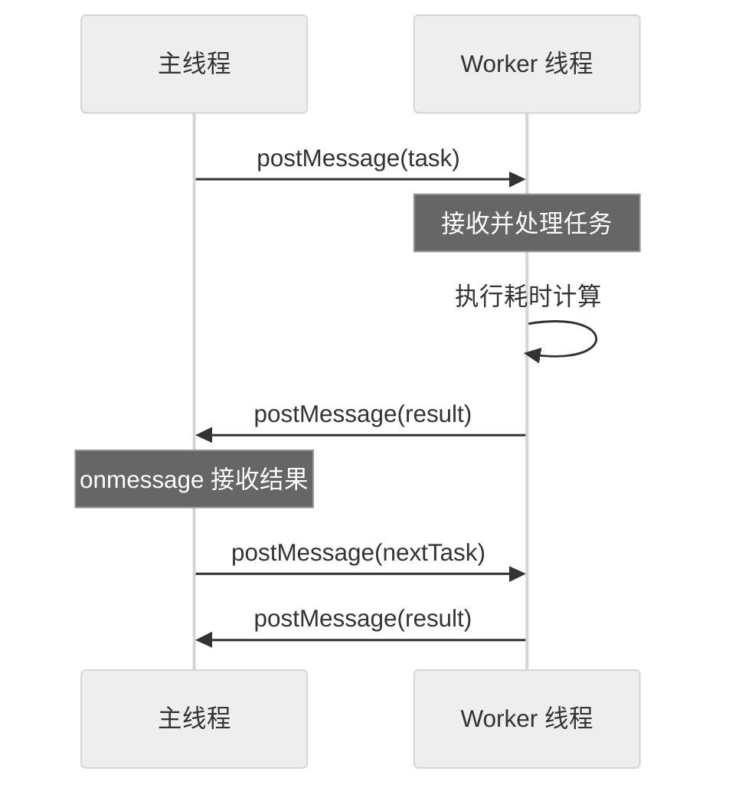
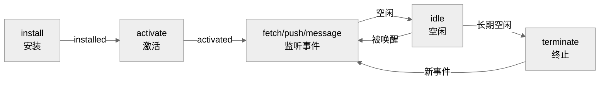

# Web Worker 面试题集

## 目录

- [Web Worker 面试题集](#web-worker-面试题集)
  - [目录](#目录)
  - [一、Web Worker 技术基础](#一web-worker-技术基础)
    - [1.1 什么是 Web Worker](#11-什么是-web-worker)
    - [1.2 Worker 分类对比](#12-worker-分类对比)
    - [1.3 通信机制原理](#13-通信机制原理)
  - [二、面试题及详解](#二面试题及详解)
    - [题目 2：Web Worker 使用场景（简答题·基础）](#题目-2web-worker-使用场景简答题基础)
    - [题目 3：Worker 核心通信 API（选择题·基础）](#题目-3worker-核心通信-api选择题基础)
    - [题目 4：主线程与 Worker 双向通信（简答题·中级）](#题目-4主线程与-worker-双向通信简答题中级)
    - [题目 5：SharedWorker 与 Dedicated Worker 区别（简答题·中级）](#题目-5sharedworker-与-dedicated-worker-区别简答题中级)
    - [题目 6：可转移对象与结构化克隆（简答题·中级）](#题目-6可转移对象与结构化克隆简答题中级)
    - [题目 7：Worker 内部限制与 API 可用性（选择题·中级）](#题目-7worker-内部限制与-api-可用性选择题中级)
    - [题目 8：大数据量计算的 Worker 实现（编程题·中级）](#题目-8大数据量计算的-worker-实现编程题中级)
    - [题目 9：Worker 池设计与性能优化（编程题·高级）](#题目-9worker-池设计与性能优化编程题高级)
    - [题目 10：跨源 Worker 与模块化加载（简答题·高级）](#题目-10跨源-worker-与模块化加载简答题高级)
    - [题目 11：Worker 中的错误处理与资源释放（编程题·高级）](#题目-11worker-中的错误处理与资源释放编程题高级)
    - [题目 12：Service Worker 与 Web Worker 区别（简答题·高级）](#题目-12service-worker-与-web-worker-区别简答题高级)
  - [三、项目实际应用场景](#三项目实际应用场景)
    - [场景 1：前端 Excel 大文件解析与导入](#场景-1前端-excel-大文件解析与导入)
    - [场景 2：图像处理 —— 批量加水印与压缩](#场景-2图像处理--批量加水印与压缩)
    - [场景 3：实时股票行情聚合计算](#场景-3实时股票行情聚合计算)
    - [场景 4：在线 IDE 代码语法检查](#场景-4在线-ide-代码语法检查)
    - [场景 5：WebGIS 地图空间分析](#场景-5webgis-地图空间分析)
    - [场景 6：多人协作白板实时同步](#场景-6多人协作白板实时同步)
    - [场景 7：端侧 AI 推理（ONNX Runtime Web）](#场景-7端侧-ai-推理onnx-runtime-web)
  - [四、考点速查表](#四考点速查表)

---

## 一、Web Worker 技术基础

### 1.1 什么是 Web Worker

Web Worker 是 HTML5 规范定义的**浏览器后台线程机制**，允许 JavaScript 在主线程之外创建独立的工作线程，用于执行耗时的计算任务，避免阻塞 UI 渲染。

**核心特性：**

| 特性 | 说明 |
|------|------|
| **独立线程** | 拥有自己的事件循环、内存空间，不与主线程共享 |
| **不阻塞 UI** | 后台执行耗时任务，主线程保持流畅响应 |
| **消息通信** | 主线程与 Worker 通过 `postMessage` 异步通信 |
| **同源限制** | Worker 脚本必须与主页面同源（部分场景可放宽） |
| **DOM 限制** | Worker 内不能访问 `document`、`window`、`parent` 等主线程 API |
| **类型多样** | 分为 Dedicated Worker、Shared Worker、Service Worker 三类 |

### 1.2 Worker 分类对比

```
┌─────────────────────────────────────────────────────────────┐
│                    Web Worker 类型                           │
├──────────────────┬──────────────┬───────────────────────────┤
│  Dedicated Worker│ SharedWorker │     Service Worker        │
├──────────────────┼──────────────┼───────────────────────────┤
│  一对一：1 主线程 │  一对多：多个 │  离线缓存、网络代理          │
│  ↔ 1 Worker      │  页面共享 1 个│  可拦截请求、推送通知        │
│                  │  Worker 实例 │  生命周期独立于页面          │
│  最常用           │  跨标签页共享 │  PWA 核心技术               │
└──────────────────┴──────────────┴───────────────────────────┘
```

### 1.3 通信机制原理

```
主线程 (Main Thread)              Worker 线程
    │                                 │
    │── postMessage(data) ──────────→│
    │                                 │ onmessage = handler
    │                                 │
    │← onmessage = handler ──────────│ postMessage(result)
    │                                 │
    │── terminate() ────────────────→│ (销毁)
    │                                 │
```

**关键点：**
1. **异步通信**：`postMessage` 是异步的，消息进入对方的事件队列。
2. **数据拷贝**：默认采用**结构化克隆算法**深拷贝数据，非引用共享。
3. **可转移对象**：`ArrayBuffer`、`MessagePort` 等可通过 `Transferable` 零拷贝转移所有权。

---

## 二、面试题及详解

### 题目 2：Web Worker 使用场景（简答题·基础）

**难度**：基础　**类型**：简答题

**问题描述**：
请列举至少 4 个适合使用 Web Worker 的实际场景，并说明为什么这些场景需要使用 Worker。

**参考答案**：

| 场景 | 使用原因 |
|------|----------|
| **大数组/矩阵计算** | 如图像处理、科学计算，CPU 密集且耗时，会阻塞 UI |
| **JSON 大数据解析** | 解析超大 JSON 文件（如日志分析），主线程解析会卡顿 |
| **加密/哈希计算** | 如 SHA-256、AES 加密，纯计算密集型任务 |
| **复杂数据排序/过滤** | 前端表格万条数据排序，避免主线程渲染卡顿 |
| **流式数据处理** | 如 WebSocket 大量消息的实时聚合计算 |
| **离线画布渲染** | Canvas 复杂图形渲染（如游戏），后台计算像素数据 |
| **文本分析/搜索** | 全文检索、语法高亮等大文本处理 |

**通用判断标准**：
1. **CPU 密集**：任务以计算为主，耗时 > 50ms。
2. **可并行**：任务不依赖 DOM 操作。
3. **无需频繁同步**：通信开销小于计算收益。 

---

### 题目 3：Worker 核心通信 API（选择题·基础）

**难度**：基础　**类型**：选择题

**问题描述**：
以下代码用于创建 Worker 并接收消息，其中**空白处**应填入的正确选项是（　　）

```javascript
// main.js
const worker = new Worker('worker.js');
worker.______( 'message', (e) => {
    console.log('收到结果:', e.data);
} );
worker.postMessage({ num: 100 });
```

A. `on`　　B. `addEventListener`　　C. `addListener`　　D. `attach`

**参考答案**：**B**

**解析**：
- Worker 实例继承自 `EventTarget`，使用标准 `addEventListener` 监听事件。
- 也可使用 `worker.onmessage = handler` 形式，但 `addEventListener` 支持多个监听器，更灵活。
- A/C/D 均非标准 API。

**补充**：在 Worker 内部，使用 `self.onmessage` 或 `self.addEventListener('message', ...)` 接收主线程消息。

**评分标准**：选对得 2 分；能说明 `addEventListener` 与 `onmessage` 的区别加 1 分。

---

### 题目 4：主线程与 Worker 双向通信（简答题·中级）

**难度**：中级　**类型**：简答题

**问题描述**：
请描述主线程与 Web Worker 之间双向通信的完整流程，并说明通信过程中的数据传递机制（结构化克隆 vs 可转移对象）。

**参考答案**：

**双向通信流程**：



**数据传递机制**：

| 机制 | 说明 | 适用对象 | 性能 |
|------|------|----------|------|
| **结构化克隆** | 默认方式，深拷贝数据 | 普通对象、数组、Map、Set、Date 等 | 数据量大时有拷贝开销 |
| **可转移对象（Transferable）** | 转移内存所有权，零拷贝 | `ArrayBuffer`、`MessagePort`、`ImageBitmap` 等 | 性能最优，但转移后原对象不可用 |

**代码示例**：

```javascript
// 主线程
const worker = new Worker('worker.js');
worker.onmessage = (e) => console.log('结果:', e.data);

// 方式一：结构化克隆（默认）
worker.postMessage({ list: [1, 2, 3] });

// 方式二：可转移对象（零拷贝）
const buffer = new ArrayBuffer(1024 * 1024); // 1MB
worker.postMessage({ buffer }, [buffer]);    // 第二参数为转移列表
console.log(buffer.byteLength);              // 0，所有权已转移

// worker.js
self.onmessage = (e) => {
    const { list, buffer } = e.data;
    const result = heavyCompute(list);
    self.postMessage(result);
};
```

**关键点**：
1. 通信是**异步**的，基于事件循环。
2. 结构化克隆会**深拷贝**，函数和 DOM 节点无法克隆。
3. 可转移对象转移后，**原线程中的对象变为不可用**（`byteLength` 变为 0）。

---

### 题目 5：SharedWorker 与 Dedicated Worker 区别（简答题·中级）

**难度**：中级　**类型**：简答题

**问题描述**：
请对比 Dedicated Worker 和 SharedWorker 的区别，并说明各自的适用场景。

**参考答案**：

| 维度 | Dedicated Worker | SharedWorker |
|------|------------------|--------------|
| **归属关系** | 一对一：1 主线程 ↔ 1 Worker | 一对多：多个页面共享 1 个 Worker |
| **生命周期** | 随创建它的页面销毁而终止 | 所有连接关闭后才销毁 |
| **通信端口** | 直接用 `worker.postMessage` | 必须通过 `MessagePort` 通信 |
| **作用域** | 仅创建者可用 | 同源的所有页面/标签页共享 |
| **构造函数** | `new Worker('x.js')` | `new SharedWorker('x.js')` |
| **调试** | DevTools Console 可直接切到 | 需在 `chrome://inspect` 中单独查看 |

**适用场景**：

- **Dedicated Worker**：单页面的计算任务，如图像处理、数据排序，**最常用**。
- **SharedWorker**：
  - 多标签页共享状态（如在线状态、通知中心）
  - 多页面共享 WebSocket 连接，避免重复建连
  - 跨标签页的缓存数据共享

**代码对比**：

```javascript
// Dedicated Worker
const worker = new Worker('dedicated.js');
worker.postMessage({ type: 'compute' });
worker.onmessage = (e) => console.log(e.data);

// SharedWorker
const shared = new SharedWorker('shared.js');
const port = shared.port; // 必须通过 port 通信
port.start();
port.postMessage({ type: 'ping' });
port.onmessage = (e) => console.log('收到:', e.data);

// shared.js（Worker 内部）
self.onconnect = (e) => {
    const port = e.ports[0];
    port.onmessage = (ev) => {
        port.postMessage('pong: ' + ev.data);
    };
    port.start();
};
```
---

### 题目 6：可转移对象与结构化克隆（简答题·中级）

**难度**：中级　**类型**：简答题

**问题描述**：
在主线程与 Worker 通信时，若需要传递一个 100MB 的 `ArrayBuffer`，应采用哪种方式？为什么？请给出代码示例，并说明采用其他方式可能出现的问题。

**参考答案**：

**应采用可转移对象（Transferable）方式**。

**原因**：
1. **零拷贝**：可转移对象直接转移内存所有权，无需复制 100MB 数据，通信延迟从 O(n) 降为 O(1)。
2. **避免内存峰值**：结构化克隆会临时占用 200MB（原 100MB + 副本 100MB），可能触发浏览器 GC 卡顿。
3. **主线程无需保留原数据**：计算任务交由 Worker 后，主线程不再需要该 buffer。

**代码示例**：

```javascript
// 主线程
const worker = new Worker('processor.js');
const buffer = new ArrayBuffer(100 * 1024 * 1024); // 100MB

// ✅ 推荐：可转移对象
worker.postMessage({ buffer }, [buffer]);
console.log(buffer.byteLength); // 0，所有权已转移

// ❌ 不推荐：结构化克隆（默认）
// worker.postMessage({ buffer });  // 会复制 100MB，卡顿明显
```

```javascript
// processor.js
self.onmessage = (e) => {
    const { buffer } = e.data;
    const view = new Uint8Array(buffer);
    // 执行处理...
    self.postMessage({ result: view[0] }); // 处理结果
};
```

**采用结构化克隆的问题**：
1. **性能差**：复制 100MB 数据耗时可达几十毫秒到上百毫秒，主线程阻塞。
2. **内存占用高**：瞬时内存翻倍，移动端易 OOM。
3. **GC 压力**：副本使用完毕后需回收，引发 GC 卡顿。

**注意事项**：
- 转移后原 `ArrayBuffer` 的 `byteLength` 变为 0，不能再访问。
- 若主线程仍需使用，应先在主线程拷贝一份再转移，或让 Worker 处理后回传。

---

### 题目 7：Worker 内部限制与 API 可用性（选择题·中级）

**难度**：中级　**类型**：选择题

**问题描述**：
以下 API 中，**不能**在 Web Worker 中直接使用的是（　　）

A. `fetch`　　B. `IndexedDB`　　C. `setTimeout`　　D. `localStorage`

**参考答案**：**D**

**解析**：
- A `fetch`：✅ 可用，Worker 支持 HTTP 请求。
- B `IndexedDB`：✅ 可用，Worker 可操作 IndexedDB 进行数据存储。
- C `setTimeout`：✅ 可用，Worker 有自己的事件循环和定时器。
- D `localStorage`：❌ **不可用**，`localStorage` 是同步 API 且绑定到主线程的源，Worker 中只能使用 `IndexedDB` 或 `Cache API` 进行持久化。

**Worker 内可用的常用 API**：
- `fetch` / `XMLHttpRequest`
- `IndexedDB`
- `WebSocket` / `EventSource`
- `setTimeout` / `setInterval`
- `console` / `navigator` / `location`
- `importScripts`（Classic Worker）/ `import`（Module Worker）

**Worker 内不可用的 API**：
- `window` / `document` / `parent`
- `localStorage` / `sessionStorage`
- DOM API（`createElement`、`querySelector` 等）
- `alert` / `confirm` / `prompt`

---

### 题目 8：大数据量计算的 Worker 实现（编程题·中级）

**难度**：中级　**类型**：编程题

**问题描述**：
请实现一个使用 Web Worker 计算大数组平均值的示例。要求：
1. 主线程生成 1000 万个随机数；
2. 创建 Worker 进行计算；
3. 主线程接收并显示结果；
4. 在 Worker 计算期间，主线程的 UI（如点击按钮）仍能正常响应。

请给出 `main.js` 和 `worker.js` 的完整代码，并说明如何验证 UI 未被阻塞。

**参考答案**：

**main.js**：

```javascript
// 1. 生成 1000 万个随机数
const data = new Float64Array(10_000_000);
for (let i = 0; i < data.length; i++) {
    data[i] = Math.random();
}

// 2. 创建 Worker
const worker = new Worker('worker.js', { type: 'module' });

// 3. 使用可转移对象传递数据（零拷贝）
worker.postMessage({ data: data.buffer }, [data.buffer]);

// 4. 接收结果
worker.onmessage = (e) => {
    const { average, duration } = e.data;
    document.getElementById('result').textContent =
        `平均值: ${average.toFixed(6)}，耗时: ${duration}ms`;
};

// 5. 错误处理
worker.onerror = (e) => {
    console.error('Worker 错误:', e.message);
};

// 验证 UI 未阻塞：点击按钮应立即响应
document.getElementById('testBtn').addEventListener('click', () => {
    console.log('UI 响应正常:', Date.now());
});
```

**worker.js**：

```javascript
self.onmessage = (e) => {
    const { data } = e.data;
    const numbers = new Float64Array(data); // 从 ArrayBuffer 重建视图
    const start = performance.now();

    let sum = 0;
    for (let i = 0; i < numbers.length; i++) {
        sum += numbers[i];
    }
    const average = sum / numbers.length;
    const duration = performance.now() - start;

    self.postMessage({ average, duration });
};
```

**验证 UI 未阻塞的方法**：
1. **点击测试按钮**：在 Worker 计算期间反复点击 `testBtn`，控制台应即时打印时间戳。
2. **动画测试**：页面放置一个 CSS 动画元素，Worker 计算时动画应保持流畅。
3. **对比实验**：若将计算放在主线程，动画会卡顿、按钮点击无响应。

**关键设计点**：
1. 使用 `Float64Array` 而非普通数组，内存连续、访问更快。
2. 通过可转移对象（`buffer`）零拷贝传递，避免 80MB 数据复制。
3. Worker 计算期间主线程事件循环空闲，UI 响应不受影响。

---

### 题目 9：Worker 池设计与性能优化（编程题·高级）

**难度**：高级　**类型**：编程题

**问题描述**：
单台机器有 8 核 CPU，现需对 100 张图片进行批量高斯模糊处理。若只用 1 个 Worker，耗时过长；若创建 100 个 Worker，调度开销巨大。请设计一个 Worker 池方案，要求：
1. 创建固定数量（如 `navigator.hardwareConcurrency`）的 Worker；
2. 任务队列管理待处理图片；
3. 空闲 Worker 自动领取任务；
4. 全部完成后回调汇总结果。

请给出核心代码实现，并说明性能优化的关键点。

**参考答案**：

**核心实现**：

```javascript
// worker-pool.js
class WorkerPool {
    constructor(workerScript, size = navigator.hardwareConcurrency || 4) {
        this.workers = [];
        this.taskQueue = [];
        this.activeCount = 0;
        this.results = [];

        for (let i = 0; i < size; i++) {
            const worker = new Worker(workerScript);
            worker.idle = true;
            this.workers.push(worker);
        }
    }

    // 提交任务
    submit(tasks) {
        return new Promise((resolve) => {
            this.resolve = resolve;
            this.results = new Array(tasks.length);
            this.taskQueue = tasks.map((task, index) => ({ task, index }));

            this.workers.forEach((worker) => this.dispatch(worker));
        });
    }

    // 分发任务给空闲 Worker
    dispatch(worker) {
        if (this.taskQueue.length === 0) {
            if (this.activeCount === 0 && this.resolve) {
                this.resolve(this.results);
            }
            return;
        }

        const { task, index } = this.taskQueue.shift();
        worker.idle = false;
        this.activeCount++;

        worker.onmessage = (e) => {
            this.results[index] = e.data;
            worker.idle = true;
            this.activeCount--;
            this.dispatch(worker); // 领取下一个任务
        };

        worker.onerror = (err) => {
            console.error('任务失败:', err);
            worker.idle = true;
            this.activeCount--;
            this.dispatch(worker);
        };

        worker.postMessage(task);
    }

    // 销毁所有 Worker
    terminate() {
        this.workers.forEach((w) => w.terminate());
    }
}

// 使用示例
const pool = new WorkerPool('blur-worker.js', 8);
const images = Array.from({ length: 100 }, (_, i) => ({ id: i, data: getImageData(i) }));

pool.submit(images).then((results) => {
    console.log('全部处理完成:', results.length, '张');
    pool.terminate();
});
```

**性能优化关键点**：

| 优化点 | 说明 |
|--------|------|
| **Worker 数量匹配 CPU 核数** | 避免过多 Worker 抢占 CPU，使用 `navigator.hardwareConcurrency` |
| **任务队列 + 空闲领取** | 负载均衡，避免某些 Worker 空闲而其他堆积任务 |
| **可转移对象传输** | 图片 `ArrayBuffer` 通过转移零拷贝传递 |
| **复用 Worker** | 一个 Worker 处理多张图片，避免反复创建销毁开销 |
| **批量结果汇总** | 按原索引存放结果，保证顺序正确 |
| **错误隔离** | 单个任务失败不影响其他任务，继续领取下一个 |

**评分标准**：
- Worker 池类设计正确 3 分；
- 任务队列与空闲分发逻辑 2 分；
- 至少列出 3 个性能优化点 2 分；
- 满分 7 分。

---

### 题目 10：跨源 Worker 与模块化加载（简答题·高级）

**难度**：高级　**类型**：简答题

**问题描述**：
1. Web Worker 脚本是否必须与主页面同源？如何加载跨源 Worker 脚本？
2. 如何在 Worker 中使用 ES Module 语法（`import`/`export`）？请给出代码示例。

**参考答案**：

**1. 跨源 Worker 加载**

- **默认限制**：Worker 脚本必须与主页面**同源**（同协议、同域名、同端口）。
- **跨源解决方案**：
  - 使用 `importScripts` 引入跨源脚本（需 CORS 头允许）。
  - 通过 `fetch` 拉取跨源脚本内容，用 `Blob URL` 创建 Worker：

```javascript
// 跨源 Worker 加载示例
fetch('https://cdn.example.com/worker.js', { mode: 'cors' })
    .then((res) => res.blob())
    .then((blob) => {
        const url = URL.createObjectURL(blob);
        const worker = new Worker(url);
        URL.revokeObjectURL(url); // 创建后可释放
    });
```

**2. Worker 中的 ES Module**

- 通过 `new Worker(scriptURL, { type: 'module' })` 指定模块模式。
- 模块 Worker 内部可使用 `import` / `export` 语法。
- 注意：模块 Worker 遵循 CORS 策略，支持跨源 `import`。

```javascript
// main.js
const worker = new Worker('./worker.js', { type: 'module' });
worker.postMessage({ data: [1, 2, 3] });
```

```javascript
// worker.js
import { compute } from './utils.js';   // ✅ 支持 ES Module 导入

self.onmessage = (e) => {
    const result = compute(e.data.data);
    self.postMessage(result);
};
```

```javascript
// utils.js
export function compute(arr) {
    return arr.reduce((a, b) => a + b, 0);
}
```

**Classic Worker vs Module Worker 对比**：

| 维度 | Classic Worker（默认） | Module Worker |
|------|------------------------|---------------|
| 构造方式 | `new Worker('x.js')` | `new Worker('x.js', { type: 'module' })` |
| 脚本加载 | `importScripts()` 同步加载 | `import` 异步加载 |
| 作用域 | 函数作用域 | 模块作用域（严格模式） |
| `this` 指向 | `WorkerGlobalScope` | `undefined`（严格模式） |
| 跨源支持 | 需同源或 CORS | 支持 CORS 跨源 import |
| 浏览器支持 | 全部支持 | Chrome 80+、Firefox 114+ |

**评分标准**：
- 跨源加载方案 2 分（Blob URL 或 importScripts）；
- 模块 Worker 代码示例 2 分；
- Classic vs Module 对比 2 分；
- 满分 6 分。

---

### 题目 11：Worker 中的错误处理与资源释放（编程题·高级）

**难度**：高级　**类型**：编程题

**问题描述**：
某项目中创建了一个 Worker 处理后台任务，但出现以下问题：
1. Worker 内部抛出未捕获异常，导致主线程卡死等待；
2. 长时间运行后内存占用持续增长。

请实现一个健壮的 Worker 封装，要求：
1. 捕获 Worker 内部异常并回传主线程；
2. 设置任务超时机制（如 5 秒），超时自动终止 Worker 并重建；
3. 任务完成后正确释放资源；
4. 提供统一的 Promise 接口。

请给出完整代码。

**参考答案**：

```javascript
// robust-worker.js
class RobustWorker {
    constructor(scriptURL, options = {}) {
        this.scriptURL = scriptURL;
        this.timeout = options.timeout || 5000;
        this.worker = null;
        this.currentTask = null;
        this.timeoutId = null;
        this._init();
    }

    _init() {
        this.worker = new Worker(this.scriptURL);

        this.worker.onmessage = (e) => {
            const { success, data, error } = e.data;
            clearTimeout(this.timeoutId);

            if (success) {
                this.currentTask?.resolve(data);
            } else {
                this.currentTask?.reject(new Error(error));
            }
            this.currentTask = null;
        };

        this.worker.onerror = (err) => {
            clearTimeout(this.timeoutId);
            this.currentTask?.reject(new Error(err.message || 'Worker 错误'));
            this.currentTask = null;
            // 重建 Worker
            this._rebuild();
        };
    }

    _rebuild() {
        try {
            this.worker.terminate();
        } catch (e) {}
        this._init();
    }

    post(data) {
        return new Promise((resolve, reject) => {
            if (this.currentTask) {
                reject(new Error('Worker 忙，上一个任务未完成'));
                return;
            }

            this.currentTask = { resolve, reject };

            // 超时机制
            this.timeoutId = setTimeout(() => {
                console.warn('任务超时，重建 Worker');
                this._rebuild();
                this.currentTask?.reject(new Error('任务超时'));
                this.currentTask = null;
            }, this.timeout);

            this.worker.postMessage(data);
        });
    }

    terminate() {
        clearTimeout(this.timeoutId);
        this.worker.terminate();
        this.currentTask?.reject(new Error('Worker 已销毁'));
        this.currentTask = null;
    }
}
```

**Worker 端配套代码**：

```javascript
// task-worker.js
self.onmessage = async (e) => {
    try {
        const result = await doHeavyTask(e.data);
        self.postMessage({ success: true, data: result });
    } catch (err) {
        self.postMessage({ success: false, error: err.message });
    }
};

async function doHeavyTask(data) {
    // 模拟可能失败的任务
    if (Math.random() < 0.1) throw new Error('随机失败');
    return { processed: true };
}
```

**使用示例**：

```javascript
const worker = new RobustWorker('task-worker.js', { timeout: 5000 });

try {
    const result = await worker.post({ task: 'compute' });
    console.log('结果:', result);
} catch (err) {
    console.error('任务失败:', err.message);
} finally {
    worker.terminate(); // 不再使用时释放
}
```

**关键设计点**：

| 问题 | 解决方案 |
|------|----------|
| **未捕获异常** | Worker 内部 `try/catch` 包裹，通过 `postMessage` 回传错误 |
| **主线程卡死等待** | 超时机制：5 秒未响应自动 terminate 并重建 |
| **内存持续增长** | 任务完成后 `terminate`；超时重建 Worker 释放内存 |
| **统一接口** | Promise 封装，支持 `async/await` |
| **并发控制** | 单任务串行，拒绝并发提交 |

**评分标准**：
- 异常捕获与回传 2 分；
- 超时机制与 Worker 重建 2 分；
- 资源释放（terminate）1 分；
- Promise 接口封装 1 分；
- 满分 6 分。

---

### 题目 12：Service Worker 与 Web Worker 区别（简答题·高级）

**难度**：高级　**类型**：简答题

**问题描述**：
请详细对比 Service Worker 与 Web Worker（Dedicated Worker）的区别，并说明 Service Worker 的生命周期和典型应用场景。

**参考答案**：

**核心区别对比**：

| 维度 | Web Worker (Dedicated) | Service Worker |
|------|------------------------|----------------|
| **定位** | 后台计算线程 | 网络代理与离线缓存 |
| **生命周期** | 随页面销毁而终止 | 独立于页面，可长期存活 |
| **运行环境** | 随页面打开而启动 | 浏览器后台运行，页面关闭仍可唤醒 |
| **DOM 访问** | ❌ 不可访问 | ❌ 不可访问 |
| **网络拦截** | ❌ 不能拦截 | ✅ 可拦截/代理页面所有请求 |
| **通信方式** | `postMessage` | `postMessage` + `Clients API` |
| **HTTPS 要求** | 无（localhost 例外） | 强制 HTTPS |
| **作用域** | 单页面 | 注册路径下的所有页面 |
| **典型用途** | CPU 密集计算 | PWA、离线缓存、推送通知 |

**Service Worker 生命周期**：



**生命周期事件**：

```javascript
// sw.js
self.addEventListener('install', (e) => {
    console.log('安装中');
    e.waitUntil(caches.open('v1').then((c) => c.addAll(['/'])));
});

self.addEventListener('activate', (e) => {
    console.log('已激活');
    e.waitUntil(cleanOldCaches());
});

self.addEventListener('fetch', (e) => {
    e.respondWith(
        caches.match(e.request).then((cached) => cached || fetch(e.request))
    );
});

self.addEventListener('push', (e) => {
    e.waitUntil(showNotification(e.data.json()));
});
```

**Service Worker 典型场景**：
1. **PWA 离线访问**：缓存页面与资源，断网仍可访问。
2. **推送通知**：即使页面关闭也能接收服务器推送。
3. **后台同步**：网络恢复后自动同步数据。
4. **请求拦截与优化**：统一缓存策略，加速二次访问。
5. **资源预加载**：在用户访问前预取关键资源。

**评分标准**：
- 至少列出 6 项区别 3 分；
- 生命周期流程正确 2 分；
- 典型场景列举 2 分；
- 满分 7 分。

---

## 三、项目实际应用场景

> 以下场景基于真实业务需求，涵盖大数据处理、复杂计算、实时数据更新、多线程任务调度等典型使用案例，每个场景包含业务背景、技术挑战、Worker 解决方案、实现要点与优化策略。

### 场景 1：前端 Excel 大文件解析与导入

**业务背景**：
某企业级数据中台需要支持用户上传 Excel 文件（最大 50MB，含 10 万行数据），在前端完成数据校验、字段映射后批量入库。用户期望上传过程中页面保持可操作（如取消上传、查看进度）。

**技术挑战**：
- SheetJS（xlsx）解析 10 万行数据耗时约 3-5 秒，主线程阻塞导致进度条卡死、取消按钮无响应。
- 解析后的 JSON 数据约 200MB，主线程内存压力大，移动端易 OOM。
- 用户误操作关闭页面时数据全部丢失，需支持断点续传。

**Worker 解决方案**：

```javascript
// excel-worker.js
import * as XLSX from 'xlsx';

self.onmessage = async (e) => {
    const { file, chunkSize = 5000 } = e.data;
    const buffer = await file.arrayBuffer();

    try {
        const workbook = XLSX.read(buffer, { type: 'array' });
        const sheet = workbook.Sheets[workbook.SheetNames[0]];
        const rows = XLSX.utils.sheet_to_json(sheet);

        // 分批回传，避免一次性传输 200MB 数据
        for (let i = 0; i < rows.length; i += chunkSize) {
            const chunk = rows.slice(i, i + chunkSize);
            self.postMessage({
                type: 'chunk',
                data: chunk,
                progress: (i + chunk.length) / rows.length
            });
        }
        self.postMessage({ type: 'done', total: rows.length });
    } catch (err) {
        self.postMessage({ type: 'error', error: err.message });
    }
};
```

```javascript
// main.js
const worker = new Worker('excel-worker.js', { type: 'module' });
let parsedRows = [];
let cancelled = false;

worker.onmessage = (e) => {
    const { type, data, progress, total, error } = e.data;
    if (type === 'chunk') {
        if (cancelled) return;
        parsedRows.push(...data);
        updateProgressBar(progress);
    } else if (type === 'done') {
        importToDatabase(parsedRows);
    } else if (type === 'error') {
        showToast('解析失败: ' + error);
    }
};

worker.postMessage({ file, chunkSize: 5000 });

// 取消按钮可即时响应
cancelBtn.onclick = () => {
    cancelled = true;
    worker.terminate();
};
```

**实现要点**：
1. **Worker 内引入 SheetJS**：使用 Module Worker 通过 `import` 加载，避免主线程打包体积膨胀。
2. **分批回传**：按 5000 行/批回传，避免单次 postMessage 传输 200MB 数据导致主线程卡顿。
3. **可转移对象**：`file.arrayBuffer()` 得到的 ArrayBuffer 可转移给 Worker，零拷贝。
4. **取消响应**：主线程调用 `worker.terminate()` 即时终止解析。

**优化策略**：
- **流式解析**：对 CSV 使用流式解析器（如 papaparse），边读边处理，避免全量加载。
- **进度反馈**：Worker 回传 `progress` 字段，主线程实时更新进度条。
- **内存释放**：每批数据处理完后在 Worker 内 `null` 引用，触发 GC。
- **断点续传**：每批数据入库后记录 offset，页面重开可从断点继续。

---

### 场景 2：图像处理 —— 批量加水印与压缩

**业务背景**：
某图片素材管理平台，用户上传一批图片（20-50 张，单张 5-10MB）后，需要批量添加水印并压缩为 WebP 格式。要求处理过程中用户可继续浏览其他素材，处理完成后自动下载。

**技术挑战**：
- Canvas 绘制 + `toBlob` 在主线程执行，单张图片处理约 500ms，20 张累计 10 秒，UI 完全卡死。
- OffscreenCanvas 在部分浏览器支持有限，需降级方案。
- 图片数据量大，主线程与 Worker 之间传输开销不可忽视。

**Worker 解决方案**：

```javascript
// image-worker.js
self.onmessage = async (e) => {
    const { id, bitmap, watermark, quality } = e.data;
    const canvas = new OffscreenCanvas(bitmap.width, bitmap.height);
    const ctx = canvas.getContext('2d');

    // 绘制原图
    ctx.drawImage(bitmap, 0, 0);
    // 绘制水印
    ctx.font = '48px sans-serif';
    ctx.fillStyle = 'rgba(255,255,255,0.5)';
    ctx.fillText(watermark, 20, bitmap.height - 30);

    // 转为 WebP Blob
    const blob = await canvas.convertToBlob({ type: 'image/webp', quality });
    bitmap.close(); // 释放 ImageBitmap

    // 回传 Blob（结构化克隆，体积小）
    self.postMessage({ id, blob, size: blob.size });
};
```

```javascript
// main.js
const POOL_SIZE = navigator.hardwareConcurrency || 4;
const workers = Array.from({ length: POOL_SIZE }, () => new Worker('image-worker.js'));

async function processImages(files) {
    const watermark = '© 2026 素材平台';
    const results = new Array(files.length);

    // 任务队列
    const queue = files.map((file, index) => ({ file, index }));
    const tasks = workers.map(async (worker) => {
        while (queue.length > 0) {
            const { file, index } = queue.shift();
            const bitmap = await createImageBitmap(file);

            const result = await new Promise((resolve) => {
                worker.onmessage = (e) => resolve(e.data);
                worker.postMessage({ id: index, bitmap, watermark, quality: 0.8 }, [bitmap]);
            });
            results[index] = result.blob;
            updateProgress(results.filter(Boolean).length / files.length);
        }
    });

    await Promise.all(tasks);
    downloadZip(results);
}
```

**实现要点**：
1. **OffscreenCanvas**：Worker 内使用 `OffscreenCanvas` 绘制，完全脱离主线程。
2. **ImageBitmap 可转移**：`createImageBitmap` 生成的 `ImageBitmap` 通过转移零拷贝传入 Worker。
3. **Worker 池**：根据 `hardwareConcurrency` 创建 4-8 个 Worker，并行处理。
4. **Blob 回传**：处理结果为 Blob（小对象），结构化克隆开销可忽略。

**优化策略**：
- **任务粒度控制**：单张图片为一个任务，避免大任务阻塞队列。
- **降级方案**：不支持 OffscreenCanvas 时，回退到主线程 Canvas + `requestIdleCallback`。
- **内存管理**：`bitmap.close()` 及时释放，避免 Worker 内存泄漏。
- **结果打包**：使用 `fflate` 在 Worker 内打包 ZIP，主线程仅下载。

---

### 场景 3：实时股票行情聚合计算

**业务背景**：
某证券行情展示系统，通过 WebSocket 接收实时行情推送（每秒约 1000 条），前端需实时计算移动平均线（MA5、MA10）、MACD、KDJ 等技术指标，并渲染 K 线图。

**技术挑战**：
- 每秒 1000 条数据，主线程同时计算指标 + 渲染图表，导致图表掉帧严重。
- 指标计算依赖历史数据（如 MA10 需保留近 10 日收盘价），数据结构复杂。
- 多个图表订阅同一标的，需广播计算结果。

**Worker 解决方案**：

```javascript
// quote-worker.js
const indicators = {
    MA: (prices, period) => {
        const result = [];
        for (let i = period - 1; i < prices.length; i++) {
            const slice = prices.slice(i - period + 1, i + 1);
            result.push(slice.reduce((a, b) => a + b, 0) / period);
        }
        return result;
    },
    MACD: (prices, fast = 12, slow = 26, signal = 9) => { /* ... */ }
};

let priceHistory = [];

self.onmessage = (e) => {
    const { type, data } = e.data;
    if (type === 'tick') {
        priceHistory.push(data.price);
        if (priceHistory.length > 1000) priceHistory.shift();

        const ma5 = indicators.MA(priceHistory, 5);
        const ma10 = indicators.MA(priceHistory, 10);
        const macd = indicators.MACD(priceHistory);

        self.postMessage({ type: 'indicator', data: { ma5, ma10, macd, price: data.price } });
    } else if (type === 'reset') {
        priceHistory = [];
    }
};
```

```javascript
// main.js
const worker = new Worker('quote-worker.js');

// WebSocket 数据接入
ws.onmessage = (e) => {
    const ticks = JSON.parse(e.data);
    ticks.forEach((tick) => worker.postMessage({ type: 'tick', data: tick }));
};

// 计算结果广播给多个图表
const charts = [chartA, chartB, chartC];
worker.onmessage = (e) => {
    if (e.data.type === 'indicator') {
        charts.forEach((chart) => chart.update(e.data.data));
    }
};
```

**实现要点**：
1. **计算与渲染分离**：Worker 负责指标计算，主线程仅负责图表渲染，各司其职。
2. **历史数据驻留 Worker**：`priceHistory` 保存在 Worker 内，避免每次通信传输全量数据。
3. **增量计算**：新 tick 到达时仅计算增量部分，非全量重算。
4. **结果广播**：Worker 输出统一指标数据，主线程广播给多个图表实例。

**优化策略**：
- **批处理**：Worker 内累积 50ms 的 tick 后批量计算，减少主线程渲染频率。
- **SharedArrayBuffer**：高频场景可用 SAB 共享数据，彻底避免拷贝（需 COOP/COEP 头）。
- **降级采样**：行情过快时按时间窗口采样，保证 UI 流畅。
- **Worker 复用**：多标的共用一个 Worker，按 symbol 路由数据。

---

### 场景 4：在线 IDE 代码语法检查

**业务背景**：
某在线编程平台（类似 CodeSandbox），用户在浏览器中编写 JavaScript/TypeScript 代码，需要实时进行语法检查、类型推导、代码补全，无需等待服务端返回。

**技术挑战**：
- TypeScript Compiler（tsc）体积约 3MB，加载与执行均耗时。
- 用户每次按键触发检查，主线程执行 tsc 会导致输入卡顿。
- 大文件（>1 万行）类型检查耗时可达 2 秒，严重影响体验。

**Worker 解决方案**：

```javascript
// ts-checker-worker.js
import * as ts from 'typescript';

let compilerOptions = ts.getDefaultCompilerOptions();
let fileCache = new Map();

self.onmessage = (e) => {
    const { type, code, fileName } = e.data;

    if (type === 'update') {
        fileCache.set(fileName, code);
    }

    // 防抖：累积 300ms 无新输入再检查
    clearTimeout(this._timer);
    this._timer = setTimeout(() => {
        const sourceFile = ts.createSourceFile(fileName, code, ts.ScriptTarget.Latest, true);
        const diagnostics = [
            ...ts.getPreEmitDiagnostics({ getSourceFile: () => sourceFile }),
            ...sourceFile.parseDiagnostics
        ];

        const errors = diagnostics.map((d) => ({
            line: ts.getLineAndCharacterOfPosition(sourceFile, d.start).line,
            message: ts.flattenDiagnosticMessageText(d.messageText, '\n'),
            code: d.code
        }));

        self.postMessage({ type: 'diagnostics', errors });
    }, 300);
};
```

```javascript
// main.js（Monaco Editor 集成）
const checker = new Worker('ts-checker-worker.js', { type: 'module' });

editor.onDidChangeModelContent(() => {
    const code = editor.getValue();
    checker.postMessage({ type: 'update', code, fileName: 'main.ts' });
});

checker.onmessage = (e) => {
    const { errors } = e.data;
    const markers = errors.map((err) => ({
        startLineNumber: err.line + 1,
        message: err.message,
        severity: monaco.MarkerSeverity.Error
    }));
    monaco.editor.setModelMarkers(editor.getModel(), 'ts', markers);
};
```

**实现要点**：
1. **tsc 加载到 Worker**：通过 Module Worker `import` 加载，避免主线程加载 3MB 库。
2. **防抖机制**：Worker 内部 `setTimeout` 防抖 300ms，避免每次按键都触发检查。
3. **增量编译**：缓存 `SourceFile`，仅重新编译变更文件。
4. **Marker 映射**：Worker 输出错误信息，主线程映射为 Monaco Marker 显示。

**优化策略**：
- **Web Worker + WASM**：用 `@typescript/wasm` 替代 JS 版 tsc，性能提升 2-3 倍。
- **按需加载**：首次输入时才加载 tsc，首屏不阻塞。
- **文件缓存**：`fileCache` 避免重复解析未变更文件。
- **Worker 预热**：页面加载后即创建 Worker 并预编译基础库声明文件。

---

### 场景 5：WebGIS 地图空间分析

**业务背景**：
某城市规划系统基于 WebGIS 展示城市地块、道路、管网等矢量数据。用户框选区域后，需实时计算该区域内的地块面积、道路长度、管网覆盖范围，并高亮显示。

**技术挑战**：
- 矢量数据量大（单图层 10 万+ 要素），空间相交计算（intersect）耗时 1-3 秒。
- 用户频繁框选/缩放，每次触发全量计算导致交互卡顿。
- turf.js 等空间计算库函数耗时较长，主线程执行阻塞渲染。

**Worker 解决方案**：

```javascript
// gis-worker.js
import * as turf from '@turf/turf';

let layers = {};

self.onmessage = (e) => {
    const { type, data } = e.data;

    if (type === 'loadLayer') {
        layers[data.name] = data.features;
        self.postMessage({ type: 'layerLoaded', name: data.name, count: data.features.length });
    } else if (type === 'analyze') {
        const { bbox, layerNames } = data;
        const polygon = turf.bboxPolygon(bbox);
        const results = {};

        layerNames.forEach((name) => {
            const features = layers[name] || [];
            results[name] = features
                .filter((f) => turf.booleanIntersects(f, polygon))
                .map((f) => ({
                    id: f.id,
                    area: turf.area(f),
                    length: f.geometry.type === 'LineString' ? turf.length(f) : 0
                }));
        });

        self.postMessage({ type: 'analysis', results });
    }
};
```

```javascript
// main.js（结合 Mapbox GL）
const worker = new Worker('gis-worker.js', { type: 'module' });

// 预加载图层
['parcels', 'roads', 'pipes'].forEach(async (name) => {
    const features = await fetchLayer(name);
    worker.postMessage({ type: 'loadLayer', data: { name, features } });
});

// 框选分析
map.on('boxselect', (e) => {
    const bbox = [e.west, e.south, e.east, e.north];
    worker.postMessage({ type: 'analyze', data: { bbox, layerNames: ['parcels', 'roads'] } });
});

worker.onmessage = (e) => {
    if (e.data.type === 'analysis') {
        renderResults(e.data.results); // 高亮要素 + 显示统计
    }
};
```

**实现要点**：
1. **图层数据驻留 Worker**：避免每次框选都传输 10 万要素到 Worker。
2. **turf.js 在 Worker 内执行**：空间计算完全脱离主线程，地图渲染不卡顿。
3. **增量过滤**：`booleanIntersects` 快速过滤，仅对相交要素做面积/长度计算。
4. **结果回传精简**：仅回传统计结果与要素 ID，不回传几何数据。

**优化策略**：
- **空间索引**：Worker 内构建 R-Tree（`rbush`），将相交计算从 O(n) 降为 O(log n)。
- **分层 Worker**：不同图层分配不同 Worker，并行计算。
- **降采样**：缩放级别低时使用简化几何（Douglas-Peucker），减少计算量。
- **WebAssembly 加速**：复杂空间运算用 WASM 版 GDAL，性能再提升 5-10 倍。

---

### 场景 6：多人协作白板实时同步

**业务背景**：
某在线白板工具（类似 Figma），支持多人实时绘制图形。每个用户的操作需广播给其他用户，并在本地实时渲染。当多个用户同时操作时，需进行操作合并（CRDT）与冲突消解。

**技术挑战**：
- CRDT 合并算法（如 Yjs）计算密集，主线程执行会导致绘制延迟。
- WebSocket 消息高频到达（每秒 50-100 条），主线程处理易堆积。
- 历史记录管理（undo/redo）需维护操作日志，内存占用大。

**Worker 解决方案**：

```javascript
// crdt-worker.js
import * as Y from 'yjs';

const ydoc = new Y.Doc();
const yShapes = ydoc.get('shapes', Y.Array);

// WebSocket 同步层也放在 Worker
import { WebsocketProvider } from 'y-websocket';

self.onmessage = (e) => {
    const { type, data } = e.data;

    if (type === 'init') {
        const wsProvider = new WebsocketProvider(data.url, data.room, ydoc);
        wsProvider.on('update', () => {
            self.postMessage({ type: 'state', shapes: yShapes.toArray() });
        });
    } else if (type === 'localOp') {
        // 应用本地操作到 CRDT
        ydoc.transact(() => {
            yShapes.push([data.shape]);
        });
    } else if (type === 'undo') {
        Y.undoManager.undo();
    }
};

// 监听远程更新
yShapes.observe((event) => {
    self.postMessage({ type: 'remoteUpdate', delta: event.changes.delta });
});
```

```javascript
// main.js
const worker = new Worker('crdt-worker.js', { type: 'module' });

worker.postMessage({ type: 'init', data: { url: 'wss://...', room: 'board-123' } });

worker.onmessage = (e) => {
    const { type, shapes, delta } = e.data;
    if (type === 'state') {
        renderCanvas(shapes); // 全量渲染
    } else if (type === 'remoteUpdate') {
        applyDelta(delta); // 增量渲染
    }
};

// 本地绘制操作
canvas.onDraw = (shape) => {
    worker.postMessage({ type: 'localOp', data: { shape } });
};
```

**实现要点**：
1. **CRDT + WebSocket 都在 Worker**：合并算法与网络通信均脱离主线程。
2. **增量更新**：Worker 回传 `delta` 而非全量 state，减少渲染开销。
3. **事务批处理**：`ydoc.transact` 合并多个操作为一次更新。
4. **Undo/Redo 在 Worker**：历史栈由 Worker 维护，主线程零负担。

**优化策略**：
- **SharedWorker 复用**：多标签页打开同一白板时共享一个 Worker，避免重复连接。
- **操作节流**：高频鼠标移动操作节流后批量提交。
- **二进制编码**：Yjs 原生支持二进制编码，比 JSON 传输快 3-5 倍。
- **按需同步**：视口外的图形变更延迟同步，优先保证可见区域流畅。

---

### 场景 7：端侧 AI 推理（ONNX Runtime Web）

**业务背景**：
某医疗影像应用在浏览器中运行轻量级 AI 模型，对用户上传的 X 光片进行初步病灶检测。出于隐私合规要求，图像不能上传服务器，必须在端侧完成推理。

**技术挑战**：
- ONNX 模型约 20MB，加载与推理均耗时（单次推理 1-2 秒）。
- 推理过程 CPU 密集，主线程阻塞导致用户无法预览/标注图像。
- WebAssembly 后端需多线程加速，但主线程无法使用。

**Worker 解决方案**：

```javascript
// ai-worker.js
import * as ort from 'onnxruntime-web';

let session = null;

self.onmessage = async (e) => {
    const { type, data } = e.data;

    if (type === 'load') {
        session = await ort.InferenceSession.create(data.modelUrl, {
            executionProviders: ['wasm'],
            graphOptimizationLevel: 'all'
        });
        self.postMessage({ type: 'ready', inputs: session.inputNames });
    } else if (type === 'infer') {
        const tensor = new ort.Tensor('float32', data.pixels, data.dims);
        const results = await session.run({ [session.inputNames[0]]: tensor });
        const detections = postprocess(results);
        self.postMessage({ type: 'result', detections });
    }
};

function postprocess(results) {
    // 解析模型输出为检测框
    return [...];
}
```

```javascript
// main.js
const worker = new Worker('ai-worker.js', { type: 'module' });

worker.postMessage({ type: 'load', data: { modelUrl: '/models/xray-detector.onnx' } });

worker.onmessage = (e) => {
    if (e.data.type === 'ready') {
        console.log('模型加载完成');
    } else if (e.data.type === 'result') {
        drawDetections(e.data.detections); // 在 Canvas 上绘制检测框
    }
};

// 用户上传图像后触发推理
async function onImageUpload(file) {
    const pixels = await preprocess(file); // 图像预处理仍在 Worker 更佳
    worker.postMessage({ type: 'infer', data: { pixels, dims: [1, 3, 224, 224] } }, [pixels.buffer]);
}
```

**实现要点**：
1. **ONNX Runtime Web in Worker**：模型加载与推理完全在 Worker，主线程零阻塞。
2. **WASM 多线程后端**：Worker 内启用 `wasm` 后端 + `cross-origin-isolated`，利用多核加速。
3. **Tensor 可转移**：预处理后的像素数据通过 ArrayBuffer 转移，零拷贝。
4. **结果可视化**：Worker 仅返回检测框坐标，主线程负责 Canvas 绘制。

**优化策略**：
- **WebGPU 后端**：支持 WebGPU 的浏览器启用 GPU 加速，推理速度提升 5-10 倍。
- **模型量化**：使用 INT8 量化模型，体积减少 75%，推理速度提升 2-3 倍。
- **预热推理**：模型加载后立即做一次空推理，避免首次用户操作卡顿。
- **多 Worker 并行**：多模型场景按模型分配 Worker，独立推理互不阻塞。

---

## 四、考点速查表

| 题号 | 类型 | 难度 | 考点 | 满分 |
|------|------|------|------|------|
| 1 | 选择题 | 基础 | Worker 基本概念、DOM 限制 | 3 |
| 2 | 简答题 | 基础 | Worker 使用场景判断 | 6 |
| 3 | 选择题 | 基础 | Worker 通信 API | 3 |
| 4 | 简答题 | 中级 | 双向通信流程与数据传递机制 | 6 |
| 5 | 简答题 | 中级 | SharedWorker vs Dedicated Worker | 6 |
| 6 | 简答题 | 中级 | 可转移对象与结构化克隆 | 6 |
| 7 | 选择题 | 中级 | Worker 内 API 可用性 | 4 |
| 8 | 编程题 | 中级 | 大数据量计算 Worker 实现 | 6 |
| 9 | 编程题 | 高级 | Worker 池设计与性能优化 | 7 |
| 10 | 简答题 | 高级 | 跨源 Worker 与 ES Module 加载 | 6 |
| 11 | 编程题 | 高级 | 错误处理、超时与资源释放 | 6 |
| 12 | 简答题 | 高级 | Service Worker vs Web Worker | 7 |

**面试官建议**：
- **初级岗位**：重点考察题 1、2、3、7，要求概念清晰、能判断是否使用 Worker。
- **中级岗位**：增加题 4、5、6、8，要求理解通信机制并能实现基础 Worker。
- **高级岗位**：重点考察题 9、10、11、12，要求能设计 Worker 池、处理异常、对比 Service Worker。
