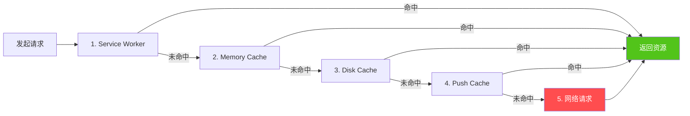
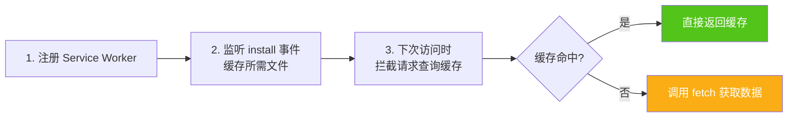
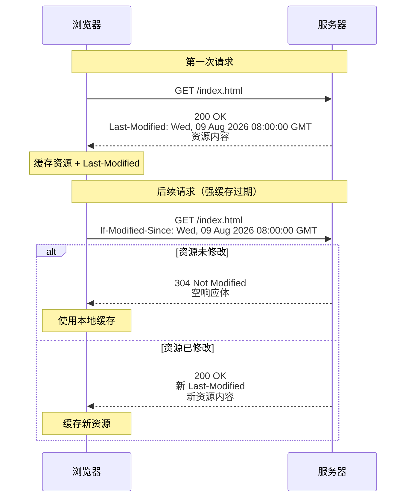
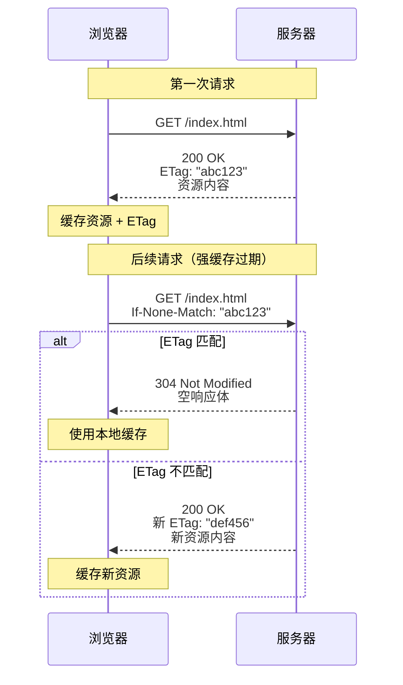
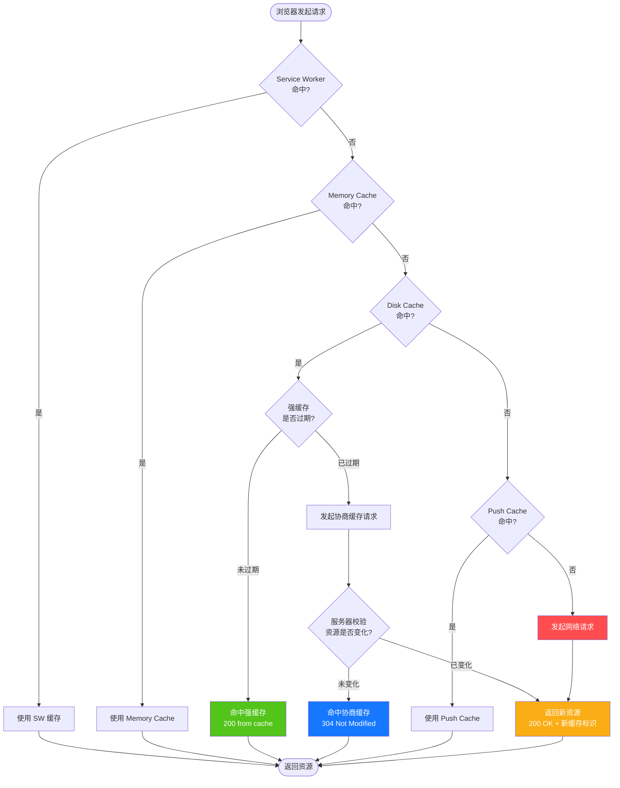
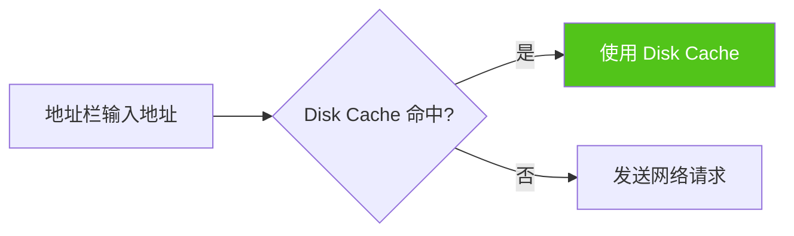
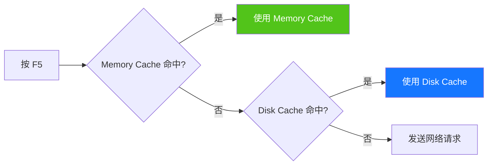
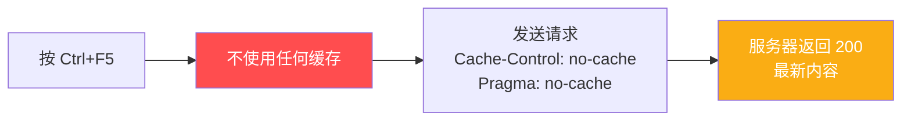

# 浏览器缓存机制详解：强缓存与协商缓存

> 本文系统讲解浏览器缓存的工作机制，覆盖缓存位置、强缓存、协商缓存、决策流程、用户行为影响与最佳实践，帮助读者全面理解浏览器缓存体系。
>
> **关联文档**：
> - [03-Promise 异步编程](./03-Promise异步编程.md) — Service Worker 异步基础
> - [HTTP 缓存规范 RFC 7234](https://tools.ietf.org/html/rfc7234) — 权威规范参考

## 目录

- [浏览器缓存机制详解：强缓存与协商缓存](#浏览器缓存机制详解强缓存与协商缓存)
  - [目录](#目录)
  - [一、浏览器缓存概述](#一浏览器缓存概述)
    - [1.1 什么是浏览器缓存](#11-什么是浏览器缓存)
    - [1.2 缓存的价值](#12-缓存的价值)
    - [1.3 缓存的代价](#13-缓存的代价)
    - [1.4 缓存的核心流程](#14-缓存的核心流程)
  - [二、缓存位置](#二缓存位置)
    - [2.1 缓存位置优先级](#21-缓存位置优先级)
    - [2.2 Service Worker](#22-service-worker)
    - [2.3 Memory Cache](#23-memory-cache)
    - [2.4 Disk Cache](#24-disk-cache)
    - [2.5 Push Cache](#25-push-cache)
    - [2.6 四种缓存位置对比](#26-四种缓存位置对比)
  - [三、强缓存](#三强缓存)
    - [3.1 强缓存原理](#31-强缓存原理)
    - [3.2 Expires](#32-expires)
    - [3.3 Cache-Control](#33-cache-control)
    - [3.4 Cache-Control 指令详解](#34-cache-control-指令详解)
    - [3.5 强缓存 HTTP 示例](#35-强缓存-http-示例)
  - [四、协商缓存](#四协商缓存)
    - [4.1 协商缓存原理](#41-协商缓存原理)
    - [4.2 Last-Modified / If-Modified-Since](#42-last-modified--if-modified-since)
    - [4.3 ETag / If-None-Match](#43-etag--if-none-match)
    - [4.4 Last-Modified vs ETag](#44-last-modified-vs-etag)
    - [4.5 协商缓存 HTTP 示例](#45-协商缓存-http-示例)
  - [五、缓存决策流程](#五缓存决策流程)
    - [5.1 完整决策流程图](#51-完整决策流程图)
    - [5.2 强缓存与协商缓存的协作](#52-强缓存与协商缓存的协作)
    - [5.3 启发式缓存](#53-启发式缓存)
  - [六、用户行为对缓存的影响](#六用户行为对缓存的影响)
    - [6.1 不同用户行为对照表](#61-不同用户行为对照表)
    - [6.2 行为详解](#62-行为详解)
      - [地址栏输入地址](#地址栏输入地址)
      - [普通刷新（F5）](#普通刷新f5)
      - [强制刷新（Ctrl+F5）](#强制刷新ctrlf5)
  - [七、实际应用场景与最佳实践](#七实际应用场景与最佳实践)
    - [7.1 不同资源的缓存策略](#71-不同资源的缓存策略)
    - [7.2 缓存策略配置示例](#72-缓存策略配置示例)
    - [7.3 最佳实践](#73-最佳实践)
  - [八、常见问题与误区](#八常见问题与误区)
    - [Q1：`no-cache` 和 `no-store` 的区别？](#q1no-cache-和-no-store-的区别)
    - [Q2：强缓存命中时为什么状态码是 200 而不是 304？](#q2强缓存命中时为什么状态码是-200-而不是-304)
    - [Q3：为什么修改了文件，用户看到的还是旧版本？](#q3为什么修改了文件用户看到的还是旧版本)
    - [Q4：为什么 `Cache-Control: max-age=0` 仍然会缓存？](#q4为什么-cache-control-max-age0-仍然会缓存)
    - [Q5：Service Worker 缓存和 HTTP 缓存冲突吗？](#q5service-worker-缓存和-http-缓存冲突吗)
    - [Q6：跨域资源的缓存如何处理？](#q6跨域资源的缓存如何处理)

---

## 一、浏览器缓存概述

### 1.1 什么是浏览器缓存

**浏览器缓存**（Browser Cache）是指浏览器将用户请求过的静态资源（HTML、CSS、JavaScript、图片、字体等）存储在本地，在下次请求相同资源时直接从本地读取，而不必再向服务器发起网络请求的机制。

浏览器缓存是 Web 性能优化中**最重要、最有效**的手段之一，能显著减少网络传输、降低服务器压力、提升页面加载速度。

### 1.2 缓存的价值

| 价值维度 | 说明 |
|---------|------|
| **减少网络延迟** | 缓存命中后直接从本地读取，跳过 DNS、TCP、TLS、请求/响应传输等环节 |
| **降低服务器压力** | 减少重复请求，服务器可服务更多用户 |
| **减少带宽消耗** | 缓存命中的资源无需传输，节省流量成本（尤其对移动端） |
| **提升用户体验** | 页面秒开，交互更流畅，弱网环境下仍可访问 |

### 1.3 缓存的代价

| 代价 | 说明 | 应对方案 |
|------|------|---------|
| **资源更新不及时** | 缓存未过期时，用户可能看到旧版本资源 | 文件名加 hash 指纹（如 `app.abc123.js`） |
| **存储空间占用** | 缓存占用本地磁盘/内存 | 合理设置 max-age 和缓存清理策略 |
| **缓存一致性问题** | 多标签页/多设备间可能不一致 | 配合 ETag 协商缓存校验 |

### 1.4 缓存的核心流程

一次数据请求可以分为三个步骤：**发起网络请求 → 后端处理 → 浏览器响应**。浏览器缓存在第一步和第三步都能优化性能：

- **第一步优化**：如果浏览器有缓存，可以不发起网络请求
- **第三步优化**：如果发起了请求但后端数据未变化，服务器可以不返回数据，只返回 304 状态码

---

## 二、缓存位置

### 2.1 缓存位置优先级

浏览器查找缓存时，按以下优先级依次查找，命中即返回，全部未命中才发起网络请求：



### 2.2 Service Worker

**Service Worker** 是运行在浏览器背后的独立线程，常用于实现离线缓存、消息推送等高级功能。

**特性**：

- 运行在独立线程中，不阻塞主线程
- 涉及请求拦截，**必须使用 HTTPS** 传输协议（安全要求）
- 开发者可以**自由控制**缓存哪些文件、如何匹配缓存、如何读取缓存
- 缓存是**持续性**的，关闭浏览器后依然存在

**Service Worker 实现缓存的三个步骤**：



**代码示例**：

```javascript
// 1. 注册 Service Worker
if ('serviceWorker' in navigator) {
  navigator.serviceWorker.register('/sw.js')
    .then(registration => console.log('SW registered:', registration.scope));
}

// 2. sw.js：监听 install 事件缓存文件
self.addEventListener('install', event => {
  event.waitUntil(
    caches.open('v1').then(cache => {
      return cache.addAll(['/index.html', '/main.js', '/style.css']);
    })
  );
});

// 3. 拦截请求，查询缓存
self.addEventListener('fetch', event => {
  event.respondWith(
    caches.match(event.request).then(response => {
      return response || fetch(event.request);  // 命中返回缓存，否则请求网络
    })
  );
});
```

**注意**：当 Service Worker 未命中缓存而回退到 Memory Cache 或网络请求时，浏览器**仍会显示**资源来自 Service Worker。

### 2.3 Memory Cache

**Memory Cache** 是存储在内存中的缓存，主要存放当前会话中访问过的资源。

| 特性 | 说明 |
|------|------|
| **读取速度** | 极快（内存读取） |
| **持续时效** | 短，随页面进程释放而释放（关闭标签页即清除） |
| **存储容量** | 较小，受内存大小限制 |
| **匹配规则** | 不仅匹配 URL，还会校验 `Content-Type`、`CORS` 等特征 |
| **Cache-Control 影响** | 不关心 `Cache-Control` 的值，由浏览器自行管理 |
| **典型场景** | 普通刷新（F5）优先使用 Memory Cache |

### 2.4 Disk Cache

**Disk Cache** 是存储在硬盘中的缓存，是浏览器缓存中**容量最大、最持久**的存储位置。

| 特性 | 说明 |
|------|------|
| **读取速度** | 比 Memory Cache 慢，但仍快于网络请求 |
| **持续时效** | 长，即使关闭浏览器依然存在 |
| **存储容量** | 大，受磁盘空间限制 |
| **匹配规则** | 严格根据 HTTP Header 字段判断（`Cache-Control`、`Expires` 等） |
| **跨站点共享** | 相同地址的资源一旦缓存，跨站点也可复用 |
| **存储策略** | 大文件优先存硬盘；系统内存使用率高时优先存硬盘 |

### 2.5 Push Cache

**Push Cache** 是 HTTP/2 推送（Server Push）机制相关的缓存，属于会话级缓存。

| 特性 | 说明 |
|------|------|
| **时效** | 短，只在会话（Session）中存在，会话结束即释放 |
| **归属** | 属于 HTTP/2 连接级别，不同连接之间不共享 |
| **匹配规则** | 可匹配同一连接的多请求，但 URL 相同不一定匹配 |
| **未来** | HTTP/3 中行为类似，但 Chrome 正在逐步减少 Server Push 的使用 |

### 2.6 四种缓存位置对比

| 缓存位置 | 存储介质 | 读取速度 | 持久性 | 容量 | 控制方式 |
|---------|---------|:-------:|:------:|:----:|---------|
| **Service Worker** | 硬盘（由 SW 管理） | 中 | 持久 | 大 | 开发者代码控制 |
| **Memory Cache** | 内存 | 极快 | 会话级 | 小 | 浏览器自动管理 |
| **Disk Cache** | 硬盘 | 快 | 持久 | 大 | HTTP Header 控制 |
| **Push Cache** | 内存 | 快 | 会话级 | 小 | HTTP/2 服务器推送 |

---

## 三、强缓存

### 3.1 强缓存原理

**强缓存**（Strong Cache）：浏览器不向服务器发送请求，直接从本地缓存读取资源。

**核心特征**：

- **不发请求**：浏览器命中强缓存时，不会与服务器通信
- **状态码**：Chrome 中显示 `200 (from cache)`（Firefox 中显示 `304`）
- **控制字段**：通过 `Expires` 和 `Cache-Control` 两个 HTTP Header 实现

### 3.2 Expires

**Expires** 是 HTTP/1.0 的缓存控制字段，用于指定资源的**绝对过期时间**。

**响应头示例**：

```http
HTTP/1.1 200 OK
Expires: Wed, 09 Aug 2026 08:00:00 GMT
Content-Type: text/html
```

**工作原理**：

- 服务器返回资源时附带 `Expires` 头，值是一个**具体的时间点**（GMT 格式）
- 浏览器下次请求时，比较当前时间与 `Expires` 时间：
  - 当前时间 < Expires：命中强缓存，直接使用
  - 当前时间 ≥ Expires：强缓存失效，进入协商缓存流程

**弊端**：

| 弊端 | 说明 |
|------|------|
| **依赖本地时间** | `Expires` 是绝对时间，如果用户修改本地系统时间，会导致缓存判断失误 |
| **已过时** | HTTP/1.1 引入了更强大的 `Cache-Control`，`Expires` 仅作兼容性保留 |

### 3.3 Cache-Control

**Cache-Control** 是 HTTP/1.1 的缓存控制字段，比 `Expires` 更强大、更灵活，支持多种指令组合。

**响应头示例**：

```http
HTTP/1.1 200 OK
Cache-Control: public, max-age=31536000
Content-Type: text/html
```

**与 Expires 的优先级**：

- 当 `Cache-Control` 与 `Expires` 同时存在时，**`Cache-Control` 优先级更高**
- `Expires` 仅作为 HTTP/1.0 客户端的兼容性方案保留

### 3.4 Cache-Control 指令详解

| 指令 | 类型 | 说明 |
|------|------|------|
| `public` | 响应 | 表示响应可被任何对象（浏览器、代理服务器）缓存 |
| `private` | 响应 | 表示响应只能被浏览器缓存，代理服务器不可缓存（如用户私人数据） |
| `no-cache` | 响应/请求 | **强制协商缓存**：浏览器可以缓存，但使用前必须向服务器验证 |
| `no-store` | 响应/请求 | **彻底禁止缓存**：浏览器和代理服务器都不缓存，每次都请求最新内容 |
| `max-age=<seconds>` | 响应/请求 | 设置缓存存储的最大周期，相对时间（秒） |
| `s-maxage=<seconds>` | 响应 | 共享缓存（如 CDN）的最大周期，优先级高于 `max-age` |
| `must-revalidate` | 响应 | 缓存过期后必须向服务器验证，不可使用过期缓存 |
| `proxy-revalidate` | 响应 | 类似 `must-revalidate`，但仅对代理缓存生效 |
| `immutable` | 响应 | 表示资源永不变化，即使用户主动刷新也不验证 |
| `stale-while-revalidate=<seconds>` | 响应 | 允许在过期后的一定时间内使用旧缓存，同时异步验证 |
| `stale-if-error=<seconds>` | 响应 | 服务器出错时允许使用过期缓存 |
| `no-transform` | 响应/请求 | 禁止代理对资源进行转换（如压缩、格式转换） |

**`no-cache` vs `no-store` 区别**：

| 指令 | 行为 | 适用场景 |
|------|------|---------|
| `no-cache` | 允许缓存，但每次使用前必须向服务器验证（走协商缓存） | 频繁变动但需要快速展示的资源 |
| `no-store` | 完全禁止缓存，每次都必须重新请求 | 敏感数据、实时性要求极高的内容 |

### 3.5 强缓存 HTTP 示例

**首次请求**（无缓存，服务器返回资源 + 缓存指令）：

```http
# 请求
GET /index.html HTTP/1.1
Host: www.example.com

# 响应
HTTP/1.1 200 OK
Cache-Control: max-age=3600
ETag: "abc123"
Last-Modified: Wed, 09 Aug 2026 08:00:00 GMT
Content-Type: text/html

<html>...</html>
```

**后续请求**（强缓存命中，不发请求，直接用缓存）：

```
状态码：200 (from cache)
响应时间：0ms（无网络请求）
```

---

## 四、协商缓存

### 4.1 协商缓存原理

**协商缓存**（Negotiation Cache）：强缓存失效后，浏览器携带缓存标识向服务器发送请求，由服务器根据标识决定是否使用缓存。

**核心特征**：

- **发请求**：浏览器与服务器有一次通信
- **命中缓存**：返回 `304 Not Modified`，不返回资源内容
- **未命中缓存**：返回 `200 OK`，返回新资源和新的缓存标识
- **控制字段**：通过 `Last-Modified` 和 `ETag` 两对 HTTP Header 实现

### 4.2 Last-Modified / If-Modified-Since

**Last-Modified** 是服务器在响应中返回的资源**最后修改时间**。

**工作流程**：



**弊端**：

| 弊端 | 说明 |
|------|------|
| **本地打开导致误判** | 用户本地打开缓存文件时，即使没修改内容，Last-Modified 也会被更新，导致服务端无法命中缓存 |
| **精度不足** | Last-Modified 只能精确到秒，1 秒内多次修改无法被检测到 |
| **分布式时间问题** | 分布式部署的服务器，文件修改时间可能不一致 |

### 4.3 ETag / If-None-Match

**ETag**（Entity Tag）是服务器为资源生成的**唯一标识**（通常基于资源内容的 hash），只要资源内容变化，ETag 就会重新生成。

**工作流程**：



### 4.4 Last-Modified vs ETag

| 对比维度 | Last-Modified | ETag |
|---------|---------------|------|
| **精度** | 秒级，1 秒内多次修改无法识别 | 基于内容 hash，精确到字节 |
| **性能** | 高（只需比较时间） | 较低（需计算资源 hash） |
| **优先级** | 低 | 高（服务器优先考虑 ETag） |
| **分布式问题** | 修改时间可能不一致 | 基于内容，与时间无关 |
| **版本** | HTTP/1.0 | HTTP/1.1 |

**结论**：精度上 ETag 优于 Last-Modified，性能上 ETag 逊于 Last-Modified。现代 Web 应用优先使用 ETag。

### 4.5 协商缓存 HTTP 示例

**命中协商缓存**（返回 304）：

```http
# 请求
GET /index.html HTTP/1.1
Host: www.example.com
If-None-Match: "abc123"
If-Modified-Since: Wed, 09 Aug 2026 08:00:00 GMT

# 响应
HTTP/1.1 304 Not Modified
ETag: "abc123"
Last-Modified: Wed, 09 Aug 2026 08:00:00 GMT
# 注意：没有响应体，节省带宽
```

**未命中协商缓存**（返回 200 + 新资源）：

```http
# 请求
GET /index.html HTTP/1.1
Host: www.example.com
If-None-Match: "abc123"

# 响应
HTTP/1.1 200 OK
ETag: "def456"
Last-Modified: Thu, 10 Aug 2026 09:00:00 GMT
Cache-Control: max-age=3600
Content-Type: text/html

<html>...新的内容...</html>
```

---

## 五、缓存决策流程

### 5.1 完整决策流程图



### 5.2 强缓存与协商缓存的协作

| 步骤 | 阶段 | 行为 |
|:----:|------|------|
| 1 | 检查强缓存 | 浏览器检查本地缓存的 `Cache-Control`/`Expires` 是否过期 |
| 2 | 命中强缓存 | 未过期 → 直接使用，状态码 `200 (from cache)`，不发请求 |
| 3 | 强缓存失效 | 已过期 → 携带 `If-None-Match`/`If-Modified-Since` 发起请求 |
| 4 | 服务器校验 | 服务器比较 ETag/Last-Modified，判断资源是否变化 |
| 5 | 命中协商缓存 | 未变化 → 返回 `304 Not Modified`，无响应体 |
| 6 | 协商缓存失效 | 已变化 → 返回 `200 OK` + 新资源 + 新缓存标识 |

### 5.3 启发式缓存

如果服务器**没有设置任何缓存策略**（无 `Cache-Control`、无 `Expires`），浏览器会采用**启发式算法**（Heuristic Freshness）决定缓存时间。

**RFC 7234 规范**：

```
启发式缓存时间 = (Date - Last-Modified) × 10%
```

**示例**：如果响应头中 `Date: 当前时间`，`Last-Modified: 100 天前`，则启发式缓存时间为 `100 天 × 10% = 10 天`。

**注意**：启发式缓存是浏览器的"兜底"行为，**不应依赖**。生产环境应显式设置 `Cache-Control`，避免不可控的缓存行为。

---

## 六、用户行为对缓存的影响

### 6.1 不同用户行为对照表

| 用户行为 | 缓存查找顺序 | 行为说明 |
|---------|------------|---------|
| **地址栏输入地址访问** | Disk Cache → 网络 | 查找 Disk Cache，命中则使用，否则请求网络 |
| **普通刷新（F5）** | Memory Cache → Disk Cache → 网络 | TAB 未关闭，Memory Cache 可用，优先使用 |
| **强制刷新（Ctrl+F5）** | 不使用缓存 | 直接请求网络，请求头带 `Cache-Control: no-cache` |
| **回退（Back/Forward）** | 优先 Memory Cache | 浏览器前进/后退使用缓存，不发请求 |

### 6.2 行为详解

#### 地址栏输入地址



#### 普通刷新（F5）



#### 强制刷新（Ctrl+F5）



**强制刷新请求头**：

```http
GET /index.html HTTP/1.1
Cache-Control: no-cache
Pragma: no-cache
```

---

## 七、实际应用场景与最佳实践

### 7.1 不同资源的缓存策略

| 资源类型 | 变动频率 | 推荐缓存策略 | 示例 |
|---------|:-------:|------------|------|
| **HTML 文档** | 频繁变动 | `Cache-Control: no-cache` | 配合 ETag 协商缓存 |
| **JS/CSS（带 hash）** | 极低 | `Cache-Control: max-age=31536000, immutable` | `app.abc123.js` |
| **图片** | 低 | `Cache-Control: max-age=2592000`（30 天） | logo、背景图 |
| **字体文件** | 极低 | `Cache-Control: max-age=31536000` | 1 年有效期 |
| **API 响应** | 高 | `Cache-Control: no-store` | 实时数据 |
| **用户敏感数据** | - | `Cache-Control: no-store, private` | 个人信息 |

### 7.2 缓存策略配置示例

**Nginx 配置示例**：

```nginx
# 静态资源（带 hash 文件名）—— 长期强缓存
location ~* \.(js|css|png|jpg|jpeg|gif|ico|svg|woff2)$ {
    expires 1y;
    add_header Cache-Control "public, immutable";
}

# HTML 文件 —— 协商缓存
location ~* \.html$ {
    add_header Cache-Control "no-cache";
}

# API 接口 —— 不缓存
location /api/ {
    add_header Cache-Control "no-store, private";
}
```

**Node.js Express 配置示例**：

```javascript
const express = require('express');
const app = express();

// 静态资源（带 hash 文件名）—— 长期强缓存
app.use('/static', express.static('public', {
  maxAge: '1y',
  immutable: true
}));

// HTML —— 协商缓存
app.get('/', (req, res) => {
  res.set('Cache-Control', 'no-cache');
  res.sendFile('index.html');
});

// API —— 不缓存
app.get('/api/data', (req, res) => {
  res.set('Cache-Control', 'no-store, private');
  res.json({ data: 'real-time' });
});
```

### 7.3 最佳实践

1. **文件名加 hash 指纹**：构建时为静态资源文件名加内容 hash（如 `app.[hash].js`），内容变化时 hash 变化，文件名变化，强制浏览器重新下载

2. **HTML 不使用强缓存**：HTML 文档是入口文件，使用 `no-cache` 走协商缓存，确保用户能及时获取最新版本

3. **带 hash 的静态资源使用长期强缓存**：JS/CSS/图片等带 hash 的资源，设置 `max-age=31536000, immutable`，1 年有效

4. **API 响应不缓存**：实时数据使用 `no-store`，避免脏数据

5. **优先使用 ETag**：相比 Last-Modified，ETag 精度更高，分布式场景更可靠

6. **CDN 配置 `s-maxage`**：为共享缓存（CDN 节点）单独设置过期时间

7. **使用 `stale-while-revalidate`**：允许在过期后短时间内使用旧缓存，同时异步更新，提升用户体验

---

## 八、常见问题与误区

### Q1：`no-cache` 和 `no-store` 的区别？

| 指令 | 行为 | 适用场景 |
|------|------|---------|
| `no-cache` | 允许缓存，但使用前必须向服务器验证（走协商缓存） | HTML 文档、频繁变动的资源 |
| `no-store` | 完全禁止缓存，每次都必须重新请求 | 敏感数据、实时性要求高的内容 |

**常见误区**：误以为 `no-cache` 是"不缓存"。实际上 `no-cache` 是"可以缓存但必须验证"，`no-store` 才是真正的"不缓存"。

### Q2：强缓存命中时为什么状态码是 200 而不是 304？

Chrome 中强缓存命中显示 `200 (from cache)`，因为它**没有真正发出 HTTP 请求**，也就没有状态码。浏览器用 `200` 表示"成功获取了资源"，`(from cache)` 标识来源是缓存。

Firefox 中则显示 `304`，行为不同。

### Q3：为什么修改了文件，用户看到的还是旧版本？

**原因**：

1. 强缓存未过期，浏览器直接使用本地缓存，不向服务器请求
2. 文件名未变，即使内容变了，浏览器也不知道

**解决方案**：

- 文件名加内容 hash（如 `app.[hash].js`），内容变化时 hash 变化，强制重新下载
- HTML 使用 `no-cache`，走协商缓存，确保能检测到更新
- 紧急情况下可强制刷新（Ctrl+F5）或清除浏览器缓存

### Q4：为什么 `Cache-Control: max-age=0` 仍然会缓存？

`max-age=0` 意味着"缓存立即过期"，但**资源仍被缓存**。下次请求时会走协商缓存流程，向服务器验证资源是否变化。

这与 `no-cache` 行为类似，但 `no-cache` 语义更明确。

### Q5：Service Worker 缓存和 HTTP 缓存冲突吗？

不冲突。Service Worker 优先级最高，会先拦截请求。如果 Service Worker 决定不使用自己的缓存（调用 `fetch`），则会回退到 Memory Cache → Disk Cache → 网络。

### Q6：跨域资源的缓存如何处理？

跨域资源同样会被浏览器缓存（Disk Cache）。匹配规则不仅看 URL，还会校验 `CORS` 头。如果 CORS 配置变化，即使 URL 相同也不会命中缓存。

---

> **核心结论**：浏览器缓存是 Web 性能优化的基石。理解"**强缓存不发请求、协商缓存发请求验证**"这一核心区别，以及 `Cache-Control`、`ETag`、`Last-Modified` 三大字段的协作机制，就能设计出合理的缓存策略。生产实践的关键是：**HTML 走协商缓存、带 hash 的静态资源走长期强缓存、API 不缓存**，并通过文件名 hash 解决"强缓存无法感知更新"的问题。

---

**参考资源**：

- [RFC 7234 - Hypertext Transfer Protocol (HTTP/1.1): Caching](https://tools.ietf.org/html/rfc7234)
- [MDN - HTTP Caching](https://developer.mozilla.org/zh-CN/docs/Web/HTTP/Caching)
- [Google Web Fundamentals - HTTP 缓存](https://web.dev/http-cache/)
