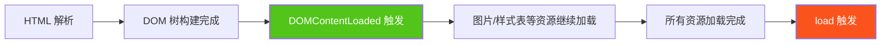
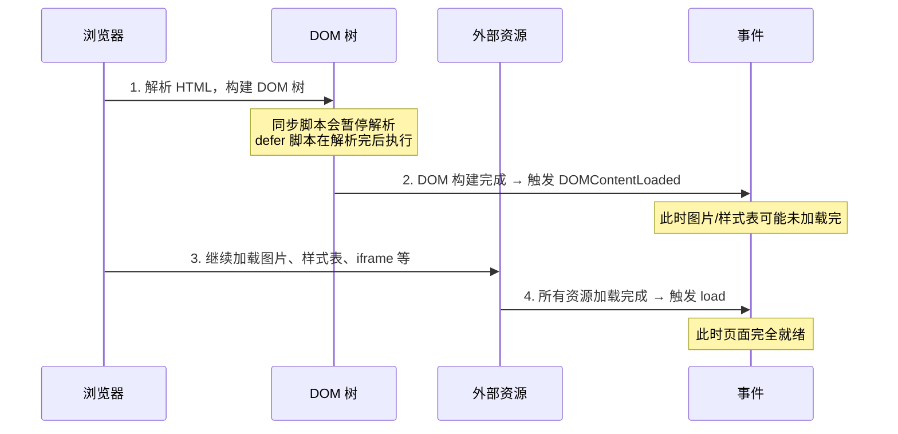

# onload 与 DOMContentLoaded 事件区别详解

> **文档定位**：本文系统讲解页面加载过程中两个关键事件——`load` 与 `DOMContentLoaded`——的触发时机、执行顺序、区别及实际应用场景，帮助开发者在正确的时机执行初始化逻辑。

---

## 目录

- [onload 与 DOMContentLoaded 事件区别详解](#onload-与-domcontentloaded-事件区别详解)
  - [目录](#目录)
  - [一、概述](#一概述)
  - [二、DOMContentLoaded 事件](#二domcontentloaded-事件)
    - [2.1 定义与触发时机](#21-定义与触发时机)
    - [2.2 代码示例](#22-代码示例)
    - [2.3 脚本加载方式对 DOMContentLoaded 的影响](#23-脚本加载方式对-domcontentloaded-的影响)
  - [三、load 事件](#三load-事件)
    - [3.1 定义与触发时机](#31-定义与触发时机)
    - [3.2 代码示例](#32-代码示例)
    - [3.3 监听对象](#33-监听对象)
  - [四、核心区别对比](#四核心区别对比)
  - [五、页面加载完整时序](#五页面加载完整时序)
  - [六、document.readyState 状态](#六documentreadystate-状态)
  - [七、实际应用场景](#七实际应用场景)
    - [7.1 使用 DOMContentLoaded 的场景](#71-使用-domcontentloaded-的场景)
    - [7.2 使用 load 的场景](#72-使用-load-的场景)
  - [八、最佳实践](#八最佳实践)
    - [8.1 选择建议](#81-选择建议)
    - [8.2 绑定方式建议](#82-绑定方式建议)
    - [8.3 脚本放置位置](#83-脚本放置位置)

---

## 一、概述

浏览器加载页面时，会经历 **HTML 解析 → DOM 树构建 → 资源加载（CSS/图片/脚本）→ 渲染** 等阶段。`DOMContentLoaded` 和 `load` 是标记其中两个关键节点的生命周期事件：

| 事件 | 触发条件 | 触发时机 |
|------|---------|---------|
| **DOMContentLoaded** | DOM 树构建完成（不含图片、样式表等外部资源） | 较早 |
| **load** | 页面所有资源（DOM、样式表、图片、iframe 等）全部加载完成 | 较晚 |

**执行顺序**：`DOMContentLoaded` **始终先于** `load` 触发。



> **核心记忆**：`DOMContentLoaded` = DOM 就绪可操作；`load` = 页面完全加载。

---

## 二、DOMContentLoaded 事件

### 2.1 定义与触发时机

`DOMContentLoaded` 事件在 **HTML 文档被完全解析且 DOM 树构建完成后**触发，此时**无需等待**样式表、图片和子框架等外部资源完成加载。

| 特性 | 说明 |
|------|------|
| 触发对象 | `document` |
| 触发条件 | HTML 解析完毕，DOM 树构建完成 |
| 不等待的资源 | 图片、样式表、iframe、`flash` 等 |
| 等待的资源 | **同步脚本**（`<script>` 无 `async`/`defer`）和 **`defer` 脚本** |
| 可多次监听 | ✅ 支持（`addEventListener`） |

> **关键点**：`DOMContentLoaded` 会等待**同步脚本**和 **`defer` 脚本**执行完毕后才触发，因为脚本可能修改 DOM。但**不会等待 `async` 脚本**。

### 2.2 代码示例

```javascript
// ✅ 正确写法：使用 addEventListener（可多次绑定，不会覆盖）
document.addEventListener('DOMContentLoaded', function () {
  console.log('DOM 已就绪，可以操作 DOM 元素了');

  // 此时可以安全地查询和操作 DOM
  const span = document.querySelector('span');
  console.log(span); // <span>...</span>

  // 但图片可能还未加载完成
  const img = document.querySelector('img');
  console.log(img.naturalWidth); // 可能是 0（图片未加载完）
});
```

```html
<!DOCTYPE html>
<html>
<head>
  <title>DOMContentLoaded 示例</title>
  <!-- CSS 不会阻塞 DOMContentLoaded（但会阻塞脚本执行） -->
  <link rel="stylesheet" href="style.css">
</head>
<body>
  <span>Hello</span>
  

  <script>
    // 同步脚本：会延迟 DOMContentLoaded 的触发
    // 因为引擎需要等待脚本执行完毕才能继续解析后续 HTML
    document.addEventListener('DOMContentLoaded', function () {
      console.log('DOM 就绪');
    });
  </script>
</body>
</html>
```

### 2.3 脚本加载方式对 DOMContentLoaded 的影响

| 脚本类型 | 是否阻塞 DOMContentLoaded | 说明 |
|---------|:------------------------:|------|
| `<script src="...">`（同步） | ✅ 阻塞 | 引擎等待脚本下载+执行完毕后继续解析 HTML |
| `<script defer src="...">` | ✅ 阻塞 | 延迟到 HTML 解析完后执行，但执行完才触发 DOMContentLoaded |
| `<script async src="...">` | ❌ 不阻塞 | 异步下载执行，不参与 DOMContentLoaded 等待 |

```html
<!-- defer 脚本：DOMContentLoaded 会等待此脚本执行完毕 -->
<script defer src="app.js"></script>

<!-- async 脚本：DOMContentLoaded 不会等待此脚本 -->
<script async src="analytics.js"></script>

<script>
  document.addEventListener('DOMContentLoaded', function () {
    // 此时 defer 脚本已执行完毕
    // 但 async 脚本可能还未执行完
    console.log('DOM 就绪');
  });
</script>
```

> **⚠️ 注意**：CSS 样式表**不直接阻塞** DOMContentLoaded，但如果 CSS 后面有同步 `<script>`，浏览器会等待 CSS 加载完毕后才执行脚本（因为脚本可能依赖样式），从而间接延迟 DOMContentLoaded。

---

## 三、load 事件

### 3.1 定义与触发时机

`load` 事件在页面**所有资源**（DOM、CSS、图片、iframe、脚本等）全部加载完成后触发。

| 特性 | 说明 |
|------|------|
| 触发对象 | `window` |
| 触发条件 | 所有资源（DOM + 图片 + 样式表 + iframe 等）加载完毕 |
| 等待的资源 | 所有外部资源 |
| 触发时机 | 晚于 `DOMContentLoaded` |
| 绑定方式 | `window.onload` 或 `addEventListener` |

> **关键点**：`load` 事件等待所有图片下载完成，如果页面有大量图片或大文件，`load` 可能在页面打开很久后才触发。

### 3.2 代码示例

```javascript
// 方式一：addEventListener（推荐，可多次绑定）
window.addEventListener('load', function () {
  console.log('页面所有资源加载完成');

  // 此时图片已加载完毕，可以获取图片尺寸
  const img = document.querySelector('img');
  console.log(img.naturalWidth);  // 图片实际宽度（>0）
  console.log(img.naturalHeight); // 图片实际高度（>0）
});

// 方式二：window.onload（不推荐，会覆盖之前的绑定）
window.onload = function () {
  console.log('页面加载完成');
};

// ⚠️ 上述两种方式同时使用时，addEventListener 的回调仍会执行
// 但 window.onload 赋值会覆盖之前通过 onload 绑定的回调
```

### 3.3 监听对象

`load` 事件不仅可以在 `window` 上监听，也可以在**单个资源元素**上监听：

```javascript
// 监听单张图片加载完成
const img = document.querySelector('img');
img.addEventListener('load', function () {
  console.log('图片加载完成', img.naturalWidth);
});

// 监听单个脚本加载完成
const script = document.createElement('script');
script.src = 'library.js';
script.addEventListener('load', function () {
  console.log('脚本加载完成，可以使用其中的 API');
});
document.head.appendChild(script);
```

---

## 四、核心区别对比

| 对比维度 | DOMContentLoaded | load |
|---------|:-----------------:|:----:|
| **触发对象** | `document` | `window` |
| **触发条件** | DOM 树构建完成 | 所有资源加载完成 |
| **是否等待图片** | ❌ 不等待 | ✅ 等待 |
| **是否等待样式表** | ❌ 不等待（但间接可能延迟） | ✅ 等待 |
| **是否等待 iframe** | ❌ 不等待 | ✅ 等待 |
| **是否等待同步脚本** | ✅ 等待 | ✅ 等待 |
| **是否等待 async 脚本** | ❌ 不等待 | ✅ 等待 |
| **触发时机** | 较早 | 较晚 |
| **执行顺序** | 先执行 | 后执行 |
| **绑定方式** | `addEventListener` | `addEventListener` / `window.onload` |
| **能否多次绑定** | ✅ 可以 | `addEventListener` ✅ / `onload` ❌（覆盖） |

---

## 五、页面加载完整时序



**验证执行顺序的代码示例**：

```javascript
document.addEventListener('DOMContentLoaded', function () {
  console.log('1. DOMContentLoaded 触发');
});

window.addEventListener('load', function () {
  console.log('2. load 触发');
});

console.log('0. 同步脚本执行');

// 输出顺序：
// 0. 同步脚本执行
// 1. DOMContentLoaded 触发
// 2. load 触发
```

---

## 六、document.readyState 状态

`document.readyState` 属性反映文档的加载状态，可用于在脚本延迟加载时判断当前阶段：

| readyState 值 | 含义 | 对应事件 |
|:------------:|------|---------|
| `loading` | 文档正在加载中 | — |
| `interactive` | DOM 解析完成，可操作 DOM | `DOMContentLoaded` |
| `complete` | 文档和所有资源加载完成 | `load` |

```javascript
// 当脚本通过 async/动态注入延迟加载时，
// DOMContentLoaded 可能已经触发，此时用 readyState 判断
if (document.readyState === 'loading') {
  // 文档还在解析，监听 DOMContentLoaded
  document.addEventListener('DOMContentLoaded', init);
} else if (document.readyState === 'interactive') {
  // DOM 已就绪，DOMContentLoaded 已触发或即将触发
  init();
} else if (document.readyState === 'complete') {
  // 页面完全加载，load 也已触发
  init();
}

function init() {
  console.log('初始化逻辑执行');
}
```

> **实用技巧**：动态注入的脚本执行时，`DOMContentLoaded` 可能已经触发完毕。此时再 `addEventListener('DOMContentLoaded', ...)` 不会执行回调。使用 `readyState` 判断可以避免这个问题。

---

## 七、实际应用场景

### 7.1 使用 DOMContentLoaded 的场景

**适用条件**：只需要操作 DOM，不依赖图片尺寸或外部资源。

```javascript
// ✅ 场景：初始化交互逻辑、绑定事件、操作 DOM
document.addEventListener('DOMContentLoaded', function () {
  // 绑定按钮点击事件
  document.querySelector('#btn').addEventListener('click', handleClick);

  // 初始化列表渲染
  renderList();

  // 初始化第三方库（不依赖图片尺寸）
  initApp();
});
```

**典型场景**：
- 绑定事件监听器
- 操作 DOM 元素（增删改查）
- 初始化框架（Vue、React 挂载）
- 发送 Ajax 请求获取数据

### 7.2 使用 load 的场景

**适用条件**：依赖图片尺寸、需要获取资源加载状态、或需要确保所有资源就绪。

```javascript
// ✅ 场景 1：获取图片真实尺寸
window.addEventListener('load', function () {
  const img = document.querySelector('img');
  console.log('图片实际尺寸:', img.naturalWidth, '×', img.naturalHeight);

  // 根据图片尺寸执行布局计算
  adjustLayout();
});

// ✅ 场景 2：隐藏 loading 遮罩
window.addEventListener('load', function () {
  document.querySelector('#loading-overlay').style.display = 'none';
});

// ✅ 场景 3：等所有资源就绪后执行 canvas 绘制
window.addEventListener('load', function () {
  const canvas = document.querySelector('canvas');
  const ctx = canvas.getContext('2d');
  const img = document.querySelector('img');
  ctx.drawImage(img, 0, 0); // 确保图片已加载
});
```

**典型场景**：
- 获取图片真实尺寸（`naturalWidth`/`naturalHeight`）
- Canvas 绘制依赖图片资源
- 隐藏页面加载动画/遮罩
- 统计页面完全加载的耗时

---

## 八、最佳实践

### 8.1 选择建议

| 需求 | 推荐事件 | 原因 |
|------|---------|------|
| 绑定事件、操作 DOM | `DOMContentLoaded` | 无需等待图片，更早执行 |
| 初始化框架（Vue/React） | `DOMContentLoaded` | 框架只需 DOM 就绪 |
| 获取图片尺寸 | `load` | 需要图片完全加载 |
| 隐藏 loading 遮罩 | `load` | 确保所有资源加载完 |
| Canvas 绘制图片 | `load` | 确保图片可绘制 |
| 发送 Ajax 请求 | `DOMContentLoaded` | 尽早获取数据 |

### 8.2 绑定方式建议

```javascript
// ✅ 推荐：addEventListener（可多次绑定，不覆盖）
window.addEventListener('load', handler);
document.addEventListener('DOMContentLoaded', handler);

// ❌ 不推荐：onload 赋值（后赋值会覆盖前赋值）
window.onload = handler1;
window.onload = handler2; // handler1 被覆盖，不会执行
```

### 8.3 脚本放置位置

```html
<!DOCTYPE html>
<html>
<head>
  <title>最佳实践</title>
  <!-- CSS 放 head，尽早加载避免闪屏 -->
  <link rel="stylesheet" href="style.css">
</head>
<body>
  <!-- DOM 内容 -->
  <div id="app"></div>

  <!-- 同步脚本放 body 底部，不阻塞 HTML 解析 -->
  <script src="app.js"></script>

  <!-- 或使用 defer，效果同放底部，但更规范 -->
  <!-- <script defer src="app.js"></script> -->
</body>
</html>
```

> **总结**：
> - **默认优先使用 `DOMContentLoaded`**，因为它更早触发，能提升页面交互响应速度
> - 仅在需要图片尺寸或所有资源就绪时才使用 `load`
> - 使用 `addEventListener` 而非 `onload` 赋值，避免回调被覆盖
> - 脚本放在 `<body>` 底部或使用 `defer`，减少对 HTML 解析的阻塞
