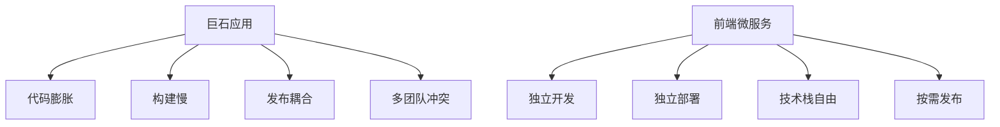
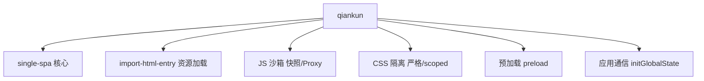
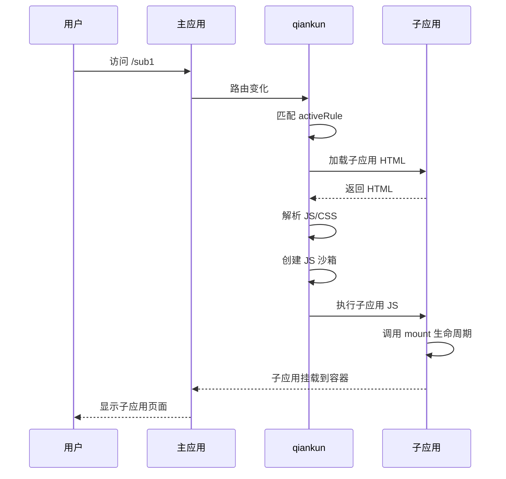
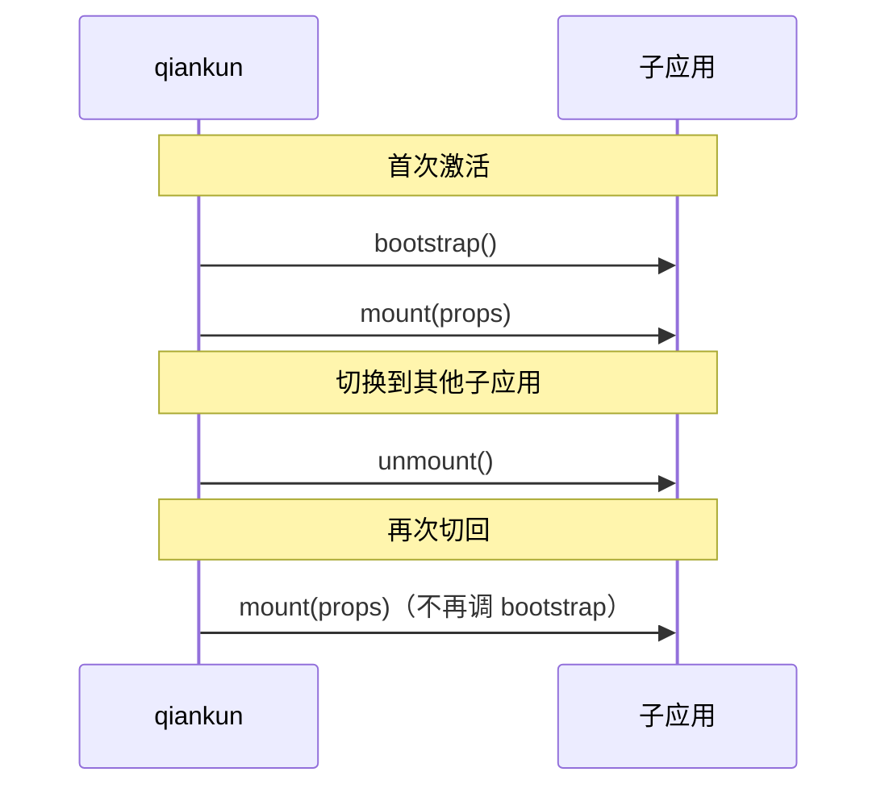
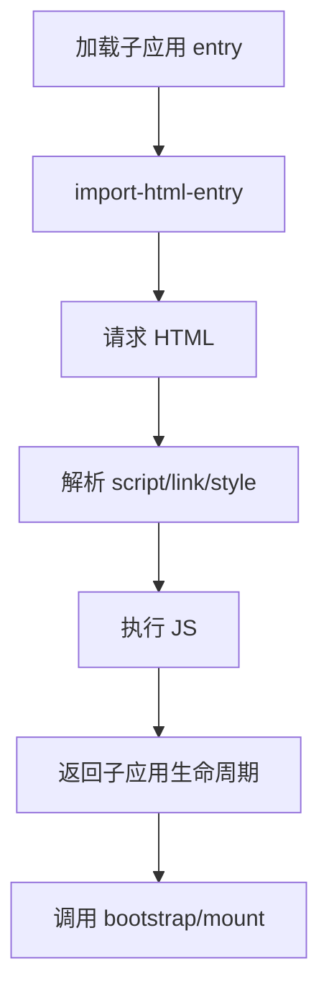
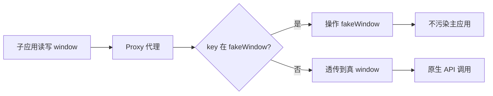
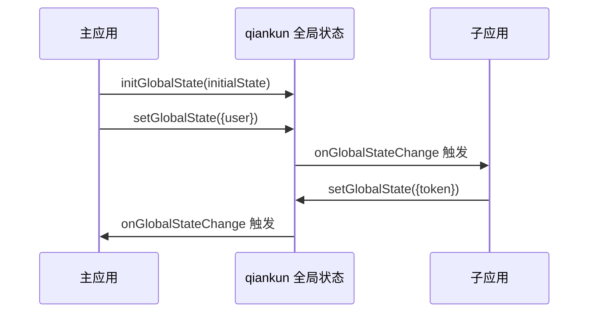
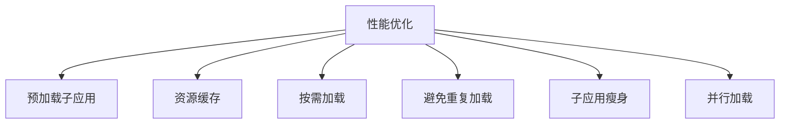

# qiankun 前端微服务框架高频面试题与详细回答

> 文档定位：系统梳理 qiankun（基于 single-spa 的前端微服务框架）在面试中的高频问题，涵盖微服务架构原理、qiankun 核心机制、应用注册与生命周期、路由劫持、JS 沙箱、CSS 隔离、应用通信、性能优化、生产实战等核心考点。
>
> 适用人群：前端工程师，尤其是需要在前端微服务架构下做应用拆分、集成、治理与性能优化的开发者。
>
> 阅读建议：先掌握微服务架构原理与 qiankun 核心（一至三章），再攻克 JS 沙箱与 CSS 隔离（四至五章），最后学习通信、优化与生产实战（六至九章）。重点关注「应用注册与生命周期」「路由劫持原理」「JS 沙箱（快照/Proxy）」「CSS 隔离方案」「应用通信」「生产踩坑」六大核心模块。

---

## 目录

- [一、微服务架构基础](#一微服务架构基础)
  - [Q1. 什么是前端微服务？为什么需要？](#q1-什么是前端微服务为什么需要)
  - [Q2. 前端微服务的几种实现方式？](#q2-前端微服务的几种实现方式)
  - [Q3. qiankun 是什么？](#q3-qiankun-是什么)
  - [Q4. qiankun 和 single-spa 的关系？](#q4-qiankun-和-single-spa-的关系)
- [二、qiankun 核心机制](#二qiankun-核心机制)
  - [Q5. qiankun 的核心能力有哪些？](#q5-qiankun-的核心能力有哪些)
  - [Q6. qiankun 的整体工作流程？](#q6-qiankun-的整体工作流程)
  - [Q7. qiankun 应用注册方式？](#q7-qiankun-应用注册方式)
- [三、应用注册与生命周期](#三应用注册与生命周期)
  - [Q8. 主应用如何注册子应用？](#q8-主应用如何注册子应用)
  - [Q9. 子应用如何导出生命周期？](#q9-子应用如何导出生命周期)
  - [Q10. 生命周期执行顺序？](#q10-生命周期执行顺序)
- [四、路由劫持与加载](#四路由劫持与加载)
  - [Q11. qiankun 如何实现路由劫持？](#q11-qiankun-如何实现路由劫持)
  - [Q12. 子应用资源如何加载？](#q12-子应用资源如何加载)
  - [Q13. import-html-entry 的作用？](#q13-import-html-entry-的作用)
- [五、JS 沙箱](#五js-沙箱)
  - [Q14. 为什么需要 JS 沙箱？](#q14-为什么需要-js-沙箱)
  - [Q15. 快照沙箱原理？](#q15-快照沙箱原理)
  - [Q16. Proxy 沙箱原理？](#q16-proxy-沙箱原理)
- [六、CSS 隔离](#六css-隔离)
  - [Q17. 为什么需要 CSS 隔离？](#q17-为什么需要-css-隔离)
  - [Q18. 严格样式隔离方案？](#q18-严格样式隔离方案)
  - [Q19. 实验性 scoped 方案？](#q19-实验性-scoped-方案)
- [七、应用通信](#七应用通信)
  - [Q20. qiankun 应用间如何通信？](#q20-qiankun-应用间如何通信)
  - [Q21. initGlobalState API 用法？](#q21-initglobalstate-api-用法)
  - [Q22. 通信方案对比？](#q22-通信方案对比)
- [八、性能优化](#八性能优化)
  - [Q23. qiankun 性能优化手段？](#q23-qiankun-性能优化手段)
  - [Q24. 预加载如何实现？](#q24-预加载如何实现)
  - [Q25. 子应用资源如何缓存？](#q25-子应用资源如何缓存)
- [九、生产实战与踩坑](#九生产实战与踩坑)
  - [Q26. 子应用资源跨域如何处理？](#q26-子应用资源跨域如何处理)
  - [Q27. Vue/React 子应用接入注意点？](#q27-vuereact-子应用接入注意点)
  - [Q28. 生产环境常见问题？](#q28-生产环境常见问题)
- [十、速答与踩坑总结](#十速答与踩坑总结)
  - [10.1 速答卡片](#101-速答卡片)
  - [10.2 实战踩坑 10 例](#102-实战踩坑-10-例)
  - [10.3 复习优先级表](#103-复习优先级表)

---

## 一、微服务架构基础

### Q1. 什么是前端微服务？为什么需要？

#### 核心答案

```
前端微服务：将一个大型前端应用拆分为多个独立开发、独立部署、独立运行的子应用
各子应用可使用不同技术栈，通过主应用统一集成
```

#### 为什么需要

| 痛点 | 说明 |
|------|------|
| **巨石应用难维护** | 单仓库代码膨胀，构建慢，发布耦合 |
| **多团队协作冲突** | 多团队改同一仓库，冲突频繁 |
| **技术栈演进难** | 老技术栈难升级，新技术难引入 |
| **独立部署难** | 一个改动需全量发布 |
| **历史系统集成** | 多个独立系统需统一入口 |



---

### Q2. 前端微服务的几种实现方式？

#### 四种主流方式

| 方式 | 说明 | 代表方案 | 隔离性 | 复杂度 |
|------|------|---------|--------|--------|
| **Nginx 路由转发** | 不同路由走不同应用 | Nginx 配置 | 高 | 低 |
| **iframe 嵌套** | 用 iframe 嵌入子应用 | 原生 iframe | 极高 | 低 |
| **Web Components** | 自定义元素封装应用 | Custom Elements | 中 | 中 |
| **前端微服务框架** | JS 沙箱 + 路由劫持 | single-spa/qiankun | 中 | 高 |

#### Nginx 路由转发示例

```nginx
server {
  listen 80;
  location /app1 {
    proxy_pass http://app1.server;
  }
  location /app2 {
    proxy_pass http://app2.server;
  }
}
```

```
优点：简单，天然隔离
缺点：页面切换会整页刷新，体验差
```

#### iframe 嵌套

```html
<iframe src="/app1"></iframe>
<iframe src="/app2"></iframe>
```

```
优点：天然隔离（JS/CSS/路由）
缺点：
  - 每次加载慢
  - 通信困难（postMessage）
  - 全局弹窗被 iframe 裁剪
  - URL 状态不同步
```

#### qiankun 方式（推荐）

```
主应用 + 子应用，通过 JS 沙箱 + 路由劫持集成
优点：体验好（SPA 切换）、独立部署、技术栈无关
缺点：沙箱/CSS 隔离有边界情况，需踩坑
```

---

### Q3. qiankun 是什么？

```
qiankun：基于 single-spa 封装的前端微服务框架
由蚂蚁金服开源，提供更开箱即用的微服务能力
```

#### 核心定位

```
1. 基于 single-spa，封装了应用注册、资源加载、沙箱、隔离
2. 开箱即用：API 简洁，无需手写资源加载逻辑
3. 技术栈无关：Vue/React/Angular/jQuery 都可接入
```

#### 核心能力

| 能力 | 说明 |
|------|------|
| **应用注册** | registerMicroApps 注册子应用 |
| **资源加载** | import-html-entry 加载 HTML/JS/CSS |
| **JS 沙箱** | 快照沙箱 / Proxy 沙箱隔离全局变量 |
| **CSS 隔离** | 严格样式隔离 / scoped（实验性） |
| **路由劫持** | 劫持 popstate/hashchange 自动切换应用 |
| **预加载** | 空闲时预加载子应用资源 |
| **应用通信** | initGlobalState 全局状态通信 |

---

### Q4. qiankun 和 single-spa 的关系？

| 维度 | single-spa | qiankun |
|------|-----------|---------|
| **定位** | 微服务核心库 | 封装 single-spa 的上层框架 |
| **资源加载** | 需手动实现 | 内置 import-html-entry |
| **JS 沙箱** | 无 | 内置快照/Proxy 沙箱 |
| **CSS 隔离** | 无 | 内置严格隔离/scoped |
| **API 复杂度** | 高（需手写较多） | 低（开箱即用） |
| **HTML 入口** | 需手动导出 JS | 支持 HTML 作为入口 |
| **预加载** | 需手动实现 | 内置 preload |

```
single-spa：提供核心的应用注册和生命周期管理，其他都需自己实现
qiankun：在 single-spa 基础上补齐了资源加载、沙箱、隔离、预加载等工程化能力
```



---

## 二、qiankun 核心机制

### Q5. qiankun 的核心能力有哪些？

#### 六大核心能力

```
1. 应用注册：registerMicroApps 注册子应用
2. 资源加载：import-html-entry 拉 HTML 并解析 JS/CSS
3. JS 沙箱：隔离主子应用全局变量
4. CSS 隔离：防止子应用样式污染主应用
5. 路由劫持：自动根据 URL 激活/卸载子应用
6. 预加载：空闲时预加载子应用资源
```

#### 最小可用示例

```javascript
// 主应用 main.js
import { registerMicroApps, start } from 'qiankun'

// 注册子应用
registerMicroApps([
  {
    name: 'sub-app-1',
    entry: '//localhost:7101',
    container: '#subapp-container',
    activeRule: '/sub1'
  },
  {
    name: 'sub-app-2',
    entry: '//localhost:7102',
    container: '#subapp-container',
    activeRule: '/sub2'
  }
])

// 启动 qiankun
start({
  prefetch: true,        // 开启预加载
  sandbox: { strictStyleIsolation: true }  // CSS 严格隔离
})
```

---

### Q6. qiankun 的整体工作流程？



#### 关键步骤

```
1. 主应用启动，调用 registerMicroApps 注册子应用
2. 调用 start 启动 qiankun，劫持路由
3. 用户访问 /sub1，qiankun 匹配 activeRule
4. qiankun 用 import-html-entry 加载子应用 HTML
5. 解析 HTML，提取 JS/CSS 资源
6. 创建 JS 沙箱（快照/Proxy）
7. 在沙箱中执行子应用 JS，调用 bootstrap → mount
8. 子应用挂载到主应用容器
9. 用户访问 /sub2，qiankun 卸载 sub1（unmount），激活 sub2
```

---

### Q7. qiankun 应用注册方式？

#### 方式1：registerMicroApps（自动激活）

```javascript
import { registerMicroApps, start } from 'qiankun'

registerMicroApps([
  {
    name: 'sub-app-1',        // 子应用唯一 id
    entry: '//localhost:7101', // 子应用入口（HTML 或 JS）
    container: '#subapp-container', // 挂载容器
    activeRule: '/sub1',       // 激活路由
    props: { token: 'xxx' }    // 传递给子应用的参数
  }
])

start()
```

#### 方式2：loadMicroApp（手动激活）

```javascript
import { loadMicroApp } from 'qiankun'

// 手动加载子应用（不受路由控制）
const app = loadMicroApp({
  name: 'sub-app-1',
  entry: '//localhost:7101',
  container: '#subapp-container',
  props: { token: 'xxx' }
})

// 卸载
app.unmount()
```

```
registerMicroApps：基于路由自动激活，适合多页面切换
loadMicroApp：手动激活，适合组件级嵌入（如多个子应用共存）
```

---

## 三、应用注册与生命周期

### Q8. 主应用如何注册子应用？

```javascript
// 主应用 main.js
import { registerMicroApps, start } from 'qiankun'

const apps = [
  {
    name: 'sub-vue',
    entry: '//localhost:7101',
    container: '#subapp-container',
    activeRule: '/sub-vue',
    props: {
      mainAppToken: 'token-xxx',
      onGlobalStateChange: (state) => console.log(state)
    }
  },
  {
    name: 'sub-react',
    entry: '//localhost:7102',
    container: '#subapp-container',
    activeRule: '/sub-react'
  }
]

registerMicroApps(apps, {
  beforeLoad: [(app) => console.log('加载前', app.name)],
  beforeMount: [(app) => console.log('挂载前', app.name)],
  afterUnmount: [(app) => console.log('卸载后', app.name)]
})

start({
  prefetch: true,
  sandbox: true,
  singular: false  // 是否单实例模式
})
```

#### 关键配置

| 字段 | 说明 |
|------|------|
| **name** | 子应用唯一标识 |
| **entry** | 子应用入口（HTML 或 JS URL） |
| **container** | 挂载容器选择器 |
| **activeRule** | 激活路由规则（字符串/函数） |
| **props** | 传递给子应用的数据 |

---

### Q9. 子应用如何导出生命周期？

```javascript
// 子应用 main.js
import Vue from 'vue'
import App from './App.vue'

let instance = null

// 1. 导出生命周期（必须）
function bootstrap() {
  console.log('子应用 bootstrap')
  // 可做全局级初始化（只执行一次）
}

function mount(props) {
  console.log('子应用 mount', props)
  // props 是主应用传过来的数据
  instance = new Vue({
    render: h => h(App, { props })
  }).$mount(props.container.querySelector('#app'))
}

function unmount() {
  console.log('子应用 unmount')
  instance.$destroy()
  instance.$el.innerHTML = ''
  instance = null
}

// 2. 独立运行时直接挂载
if (!window.__POWERED_BY_QIANKUN__) {
  mount({ container: document })
}

// 3. 导出生命周期（umd 格式）
export { bootstrap, mount, unmount }
```

#### 打包配置（Webpack）

```javascript
// webpack.config.js
const { name } = require('./package.json')

module.exports = {
  output: {
    library: name,             // 库名
    libraryTarget: 'umd',      // UMD 格式
    jsonpFunction: `webpackJsonp_${name}`
  },
  devServer: {
    port: 7101,
    headers: {
      'Access-Control-Allow-Origin': '*'  // 跨域
    }
  }
}
```

```
关键点：
  1. 导出 bootstrap/mount/unmount 三个生命周期
  2. 用 UMD 格式打包（libraryTarget: 'umd'）
  3. 开发服务器开启 CORS（主应用需跨域加载子应用资源）
  4. 独立运行时也能正常工作（window.__POWERED_BY_QIANKUN__）
```

---

### Q10. 生命周期执行顺序？



#### 三大生命周期

| 生命周期 | 调用时机 | 调用次数 | 用途 |
|---------|---------|---------|------|
| **bootstrap** | 首次加载 | 仅 1 次 | 全局初始化（只执行一次） |
| **mount** | 每次激活 | 多次 | 创建实例并挂载 |
| **unmount** | 每次卸载 | 多次 | 销毁实例并清理 |

```
bootstrap 只在首次加载时调用一次
mount/unmount 在每次激活/卸载时都会调用
unmount 必须彻底清理，否则会内存泄漏
```

---

## 四、路由劫持与加载

### Q11. qiankun 如何实现路由劫持？

```
qiankun 劫持 popstate/hashchange 事件，根据 URL 匹配 activeRule
匹配则激活子应用，不匹配则卸载
```

#### 劫持原理

```javascript
// qiankun 内部简化逻辑
const rawPushState = window.history.pushState
const rawReplaceState = window.history.replaceState

// 劫持 pushState
window.history.pushState = function (...args) {
  rawPushState.apply(this, args)
  // 触发路由变化检查
  checkActiveApps()
}

// 劫持 popstate
window.addEventListener('popstate', () => {
  checkActiveApps()
})

function checkActiveApps() {
  const path = location.pathname
  apps.forEach(app => {
    const isActive = app.activeRule(path)
    if (isActive && !app.loaded) {
      loadApp(app)  // 激活
    } else if (!isActive && app.loaded) {
      unmountApp(app)  // 卸载
    }
  })
}
```

#### activeRule 配置

```javascript
// 字符串匹配
activeRule: '/sub1'

// 字符串数组（多路由匹配）
activeRule: ['/sub1', '/sub1/*']

// 函数（自定义逻辑）
activeRule: (location) => location.pathname.startsWith('/sub1')
```

---

### Q12. 子应用资源如何加载？



#### import-html-entry 的作用

```javascript
import { importHTML } from 'import-html-entry'

const { execScripts, getExternalScripts, getExternalStyleSheets } = await importHTML('//localhost:7101')

// 执行 JS，拿到子应用导出的生命周期
const exportObj = await execScripts()
const { bootstrap, mount, unmount } = exportObj
```

```
import-html-entry 干了什么：
  1. 请求子应用 HTML
  2. 解析 <script src>、<link rel="stylesheet">、<style>
  3. 请求所有外部 JS/CSS
  4. 执行 JS（在沙箱中），拿到导出的生命周期
  5. 注入 CSS 到主应用
```

---

### Q13. import-html-entry 的作用？

#### 核心能力

| 能力 | 说明 |
|------|------|
| **HTML 解析** | 解析子应用 HTML，提取 script/style |
| **资源请求** | 并发请求 JS/CSS |
| **JS 执行** | 在沙箱中执行 JS，拿到导出 |
| **CSS 注入** | 将子应用 CSS 注入主应用 |

#### 为什么用 HTML 作为入口？

```
传统方式：子应用需导出 JS 文件作为入口
  - 子应用需改造打包，导出 lifecycle
  - 资源依赖（CSS/图片）难处理

qiankun 方式：用 HTML 作为入口
  - 子应用无需改造打包，直接用现有 HTML
  - 自动解析 HTML 中的所有 JS/CSS
  - 子应用可独立运行（开发体验好）
```

---

## 五、JS 沙箱

### Q14. 为什么需要 JS 沙箱？

#### 核心问题

```
子应用直接修改 window 上的变量，会污染主应用和其他子应用
```

```javascript
// 子应用 sub1
window.appName = 'sub1'
window.fetch = customFetch

// 子应用 sub2
console.log(window.appName)  // 'sub1'（污染了！）
```

#### 沙箱的作用

```
1. 隔离全局变量：子应用修改 window 不影响主应用
2. 沙箱激活/卸载：子应用卸载时恢复 window 状态
3. 多实例隔离：多个子应用同时运行时互不干扰
```

| 不使用沙箱 | 使用沙箱 |
|-----------|---------|
| window 污染 | 隔离 |
| 全局变量冲突 | 各自独立 |
| 子应用卸载残留 | 自动恢复 |

---

### Q15. 快照沙箱原理？

```
快照沙箱（SnapshotSandbox）：在子应用激活前快照 window，卸载后恢复
适用于不支持 Proxy 的旧浏览器
```

#### 简化实现

```javascript
class SnapshotSandbox {
  constructor() {
    this.proxy = window  // 快照沙箱直接用 window
    this.active = false
    this.snapshot = {}   // 激活前的快照
    this.modifyMap = {}  // 修改记录
  }

  // 激活：快照当前 window
  active() {
    this.active = true
    this.snapshot = {}
    for (const key in window) {
      this.snapshot[key] = window[key]
    }
  }

  // 卸载：恢复 window，记录修改
  inactive() {
    this.active = false
    for (const key in window) {
      if (window[key] !== this.snapshot[key]) {
        // 记录修改
        this.modifyMap[key] = window[key]
        // 恢复
        window[key] = this.snapshot[key]
      }
    }
  }
}
```

#### 特点

| 维度 | 说明 |
|------|------|
| **兼容性** | 好（不支持 Proxy 也能用） |
| **性能** | 差（需遍历 window 快照/恢复） |
| **多实例** | 不支持（直接操作 window） |
| **激活/卸载** | 激活时快照，卸载时恢复 |

```
快照沙箱的缺点：
  1. 每次激活/卸载都要遍历 window（性能差）
  2. 不能多实例（多个子应用同时运行会冲突）
```

---

### Q16. Proxy 沙箱原理？

```
Proxy 沙箱（ProxySandbox）：用 Proxy 代理 window，子应用操作的是代理对象
支持多实例，性能好
```

#### 简化实现

```javascript
class ProxySandbox {
  constructor() {
    this.fakeWindow = {}  // 子应用的"假 window"
    const fakeWindow = this.fakeWindow

    this.proxy = new Proxy(fakeWindow, {
      get(target, key) {
        // 子应用读变量：先从 fakeWindow 找，找不到去真 window
        if (key in target) {
          return target[key]
        }
        const value = window[key]
        return typeof value === 'function' ? value.bind(window) : value
      },
      set(target, key, value) {
        // 子应用写变量：写到 fakeWindow，不污染真 window
        target[key] = value
        return true
      },
      has(target, key) {
        return key in target || key in window
      }
    })
  }

  active() { /* 激活 */ }
  inactive() { /* 卸载 */ }
}
```

#### 特点

| 维度 | 说明 |
|------|------|
| **兼容性** | 需 Proxy（IE 不支持） |
| **性能** | 好（无需遍历 window） |
| **多实例** | 支持（每个子应用一个 fakeWindow） |
| **隔离性** | 好（子应用操作 fakeWindow） |

```
Proxy 沙箱的优点：
  1. 性能好（无需遍历 window）
  2. 支持多实例（多个子应用可同时运行）
  3. 隔离性好（子应用操作 fakeWindow）
```



---

## 六、CSS 隔离

### Q17. 为什么需要 CSS 隔离？

#### 核心问题

```css
/* 子应用 sub1 的全局样式 */
body { background: red; }
.btn { color: blue; }

/* 子应用 sub2 的全局样式 */
body { background: blue; }
.btn { color: red; }
```

```
问题：
  1. 子应用的全局样式污染主应用
  2. 多个子应用的样式互相覆盖
  3. 子应用卸载后样式可能残留
```

#### qiankun 提供的隔离方案

| 方案 | 说明 | 状态 |
|------|------|------|
| **严格样式隔离** | 用 Shadow DOM 包裹子应用 | 稳定 |
| **实验性 scoped** | 给子应用样式加 data 属性前缀 | 实验性 |
| **手动隔离** | 用 CSS Modules / 命名空间 | 推荐 |

---

### Q18. 严格样式隔离方案？

```javascript
// 主应用
start({
  sandbox: {
    strictStyleIsolation: true  // 开启 Shadow DOM 隔离
  }
})
```

#### 原理

```
用 Shadow DOM 包裹子应用容器
子应用的样式不会影响主应用（Shadow DOM 天然隔离）
```

```javascript
// qiankun 内部简化逻辑
const container = document.querySelector('#subapp-container')
const shadow = container.attachShadow({ mode: 'open' })
// 子应用挂载到 shadow，样式天然隔离
shadow.appendChild(subAppContent)
```

#### 优缺点

| 优点 | 缺点 |
|------|------|
| 样式完全隔离 | 子应用内全局弹窗（如 Modal）会被 Shadow DOM 裁剪 |
| 实现简单 | 第三方组件库（如 antd Modal）可能异常 |
| 无需改造子应用 | ECharts 等需要挂载到 body 的组件失效 |

```
strictStyleIsolation: true 的坑：
  - antd Modal 渲染到 body，会跑到 Shadow DOM 外
  - ECharts 默认挂载到 body，样式丢失
  - 第三方组件库的弹窗/抽屉可能失效
```

---

### Q19. 实验性 scoped 方案？

```javascript
start({
  sandbox: {
    experimentalStyleIsolation: true  // 开启 scoped 样式隔离
  }
})
```

#### 原理

```
qiankun 在子应用加载时，遍历所有 CSS 规则
给每个选择器加 data-qiankun="app-name" 前缀
```

```css
/* 原始 */
body { background: red; }
.btn { color: blue; }

/* scoped 后 */
body[data-qiankun="sub1"] { background: red; }
[data-qiankun="sub1"] .btn { color: blue; }
```

#### 优缺点

| 优点 | 缺点 |
|------|------|
| 不用 Shadow DOM | 动态插入的样式可能漏改 |
| 兼容第三方组件库 | 前缀加长，CSS 体积变大 |
| 全局弹窗正常 | 实验性，可能有边界 case |

```
推荐选择：
  - 子应用无复杂第三方组件库 → strictStyleIsolation
  - 用 antd/element-plus → experimentalStyleIsolation
  - 完全可控 → 手动 CSS Modules + 命名空间
```

---

## 七、应用通信

### Q20. qiankun 应用间如何通信？

#### 三种方式

| 方式 | 说明 | 适用 |
|------|------|------|
| **props 传递** | 主应用通过 props 传给子应用 | 父子单向 |
| **initGlobalState** | 全局状态共享 | 多应用共享 |
| **CustomEvent** | 自定义事件广播 | 事件通知 |

---

### Q21. initGlobalState API 用法？

#### 主应用

```javascript
import { initGlobalState } from 'qiankun'

const actions = initGlobalState({
  user: null,
  token: ''
})

// 修改全局状态
actions.setGlobalState({
  user: { name: '张三' },
  token: 'xxx'
})

// 监听变化
actions.onGlobalStateChange((state, prev) => {
  console.log('主应用监听', state)
})
```

#### 子应用

```javascript
// 子应用 mount 接收 props
function mount(props) {
  // props.onGlobalStateChange 监听
  props.onGlobalStateChange((state, prev) => {
    console.log('子应用监听', state)
  })

  // props.setGlobalState 修改
  props.setGlobalState({ user: { name: '李四' } })
}
```

#### 通信流程



---

### Q22. 通信方案对比？

| 方案 | 实现难度 | 实时性 | 解耦性 | 适用场景 |
|------|---------|--------|--------|---------|
| **props 传递** | 低 | 即时 | 强耦合 | 主→子单向数据 |
| **initGlobalState** | 中 | 即时 | 中 | 多应用共享状态 |
| **CustomEvent** | 低 | 即时 | 弱 | 事件通知 |
| **全局 Store**（Pinia/Redux） | 中 | 即时 | 中 | 同框架子应用 |
| **localStorage** | 低 | 非即时 | 弱 | 简单持久化 |

```
推荐选型：
  - 主应用传 token/user 给子应用 → props 传递
  - 多应用共享登录态 → initGlobalState
  - 子应用通知主应用跳转 → CustomEvent
  - 复杂状态管理 → 用全局 Store（如 Pinia）
```

---

## 八、性能优化

### Q23. qiankun 性能优化手段？



| 优化 | 说明 |
|------|------|
| **预加载** | 空闲时预加载子应用资源 |
| **资源缓存** | 子应用 JS/CSS 缓存 |
| **按需加载** | 子应用内部做代码分割 |
| **singular: false** | 多实例并行 |
| **子应用瘦身** | Tree Shaking + 按需导入 |
| **CDN 加速** | 大依赖用 CDN |

---

### Q24. 预加载如何实现？

```javascript
// 主应用
start({
  prefetch: true  // 默认开启，空闲时预加载
})

// 自定义预加载策略
start({
  prefetch: (apps) => {
    // 只预加载 sub1
    return apps.filter(app => app.name === 'sub1')
  }
})

// 手动预加载
import { prefetchApps } from 'qiankun'
prefetchApps([{ name: 'sub1', entry: '//localhost:7101' }])
```

#### 预加载原理

```
qiankun 用 requestIdleCallback 在浏览器空闲时预加载子应用资源
用户访问子应用时，资源已在缓存，秒开
```

```javascript
// qiankun 内部简化逻辑
window.requestIdleCallback(() => {
  apps.forEach(app => {
    // 用 import-html-entry 预加载资源
    importHTML(app.entry)
  })
})
```

---

### Q25. 子应用资源如何缓存？

#### 方式1：Service Worker 缓存

```javascript
// 主应用注册 Service Worker
if ('serviceWorker' in navigator) {
  navigator.serviceWorker.register('/sw.js')
}

// sw.js
self.addEventListener('fetch', (event) => {
  if (event.request.url.includes('/subapp/')) {
    event.respondWith(
      caches.match(event.request).then(resp => {
        return resp || fetch(event.request).then(resp => {
          caches.open('subapp-v1').then(cache => {
            cache.put(event.request, resp.clone())
          })
          return resp
        })
      })
    )
  }
})
```

#### 方式2：HTTP 缓存（推荐）

```nginx
# 子应用资源设置长缓存
location /subapp/ {
  expires 1y
  add_header Cache-Control "public, immutable"
}
```

```
推荐：HTTP 缓存 + 文件名 hash
子应用资源文件名带 hash，内容变则 hash 变，自动失效
```

---

## 九、生产实战与踩坑

### Q26. 子应用资源跨域如何处理？

#### 问题

```
主应用在 localhost:8000
子应用在 localhost:7101
主应用跨域加载子应用 JS/CSS → 被浏览器拦截
```

#### 解决：子应用开启 CORS

```javascript
// Webpack devServer
devServer: {
  port: 7101,
  headers: {
    'Access-Control-Allow-Origin': '*'
  }
}

// Nginx 生产环境
location / {
  add_header Access-Control-Allow-Origin *
  add_header Access-Control-Allow-Methods 'GET, POST, OPTIONS'
}
```

#### Vue CLI 配置

```javascript
// vue.config.js
module.exports = {
  devServer: {
    port: 7101,
    headers: {
      'Access-Control-Allow-Origin': '*'
    }
  },
  configureWebpack: {
    output: {
      library: 'sub-vue',
      libraryTarget: 'umd'
    }
  }
}
```

---

### Q27. Vue/React 子应用接入注意点？

#### Vue 子应用

```javascript
// 子应用 main.js
import Vue from 'vue'
import App from './App.vue'
import router from './router'

let instance = null

function mount(props) {
  instance = new Vue({
    router,
    render: h => h(App)
  }).$mount(props.container.querySelector('#app'))
}

function unmount() {
  instance.$destroy()
  instance.$el.innerHTML = ''
  instance = null
}

// 独立运行
if (!window.__POWERED_BY_QIANKUN__) {
  mount({ container: document })
}

export { bootstrap, mount, unmount }
```

#### Vue 注意点

```javascript
// 1. 必须修改 publicPath
// public-path.js
if (window.__POWERED_BY_QIANKUN__) {
  __webpack_public_path__ = window.__INJECTED_PUBLIC_PATH_BY_QIANKUN__
}
// 在 main.js 顶部引入
import './public-path'

// 2. 路由 base
const router = new VueRouter({
  base: window.__POWERED_BY_QIANKUN__ ? '/sub-vue' : '/',
  mode: 'history',
  routes
})

// 3. 实例销毁
function unmount() {
  instance.$destroy()
  instance.$el.innerHTML = ''  // 清空 DOM
  instance = null              // 解除引用
}
```

#### React 子应用

```javascript
import React from 'react'
import ReactDOM from 'react-dom'
import App from './App'

function mount(props) {
  ReactDOM.render(
    <App {...props} />,
    props.container.querySelector('#root')
  )
}

function unmount(props) {
  ReactDOM.unmountComponentAtNode(
    props.container.querySelector('#root')
  )
}

export { bootstrap, mount, unmount }
```

---

### Q28. 生产环境常见问题？

#### 1. 子应用资源 404

```
原因：publicPath 配置错误，子应用资源路径不对
解决：
  - 开发：在 public-path.js 中动态设置 __webpack_public_path__
  - 生产：用 window.__INJECTED_PUBLIC_PATH_BY_QIANKUN__
```

#### 2. 子应用样式污染主应用

```
原因：未开启 CSS 隔离
解决：
  - start({ sandbox: { experimentalStyleIsolation: true } })
  - 或子应用用 CSS Modules
```

#### 3. 子应用全局弹窗（Modal）位置错乱

```
原因：strictStyleIsolation 用 Shadow DOM，弹窗跑到外层
解决：
  - 改用 experimentalStyleIsolation
  - 或子应用把 Modal 挂载到子应用容器内
```

#### 4. 子应用卸载后 JS 残留

```
原因：子应用在 window 上注册了定时器/事件未清理
解决：
  - unmount 中清理所有定时器/事件
  - 用沙箱自动清理
```

---

## 十、速答与踩坑总结

### 10.1 速答卡片

**Q：qiankun 是什么？**
A：基于 single-spa 封装的前端微服务框架，提供应用注册、资源加载、JS 沙箱、CSS 隔离等能力。

**Q：qiankun 和 single-spa 区别？**
A：single-spa 只提供核心，qiankun 补齐资源加载、沙箱、隔离、预加载等工程化能力。

**Q：qiankun 的核心能力？**
A：应用注册、资源加载（import-html-entry）、JS 沙箱、CSS 隔离、路由劫持、预加载、应用通信。

**Q：子应用需要导出哪些生命周期？**
A：bootstrap（首次加载）、mount（每次激活）、unmount（每次卸载）。

**Q：import-html-entry 干了什么？**
A：请求子应用 HTML，解析 JS/CSS，执行 JS，返回子应用导出的生命周期。

**Q：快照沙箱和 Proxy 沙箱区别？**
A：快照沙箱兼容性好但性能差且不支持多实例；Proxy 沙箱性能好支持多实例但需 Proxy。

**Q：JS 沙箱为什么需要？**
A：隔离子应用对 window 的修改，防止污染主应用和其他子应用。

**Q：strictStyleIsolation 的原理？**
A：用 Shadow DOM 包裹子应用容器，样式天然隔离。

**Q：experimentalStyleIsolation 的原理？**
A：给子应用 CSS 选择器加 data-qiankun="app-name" 前缀。

**Q：应用通信有哪些方式？**
A：props 传递、initGlobalState、CustomEvent、全局 Store。

**Q：预加载怎么实现？**
A：用 requestIdleCallback 在浏览器空闲时预加载子应用资源。

**Q：子应用资源跨域怎么办？**
A：子应用 devServer/Nginx 开启 Access-Control-Allow-Origin。

---

### 10.2 实战踩坑 10 例

| # | 场景 | 现象 | 根因 | 解决 |
|---|------|------|------|------|
| 1 | 子应用资源 404 | JS/CSS 找不到 | publicPath 配置错 | 动态设置 __webpack_public_path__ |
| 2 | 样式污染 | 子应用样式影响主应用 | 未开启 CSS 隔离 | experimentalStyleIsolation: true |
| 3 | Modal 位置错乱 | 弹窗跑到 Shadow DOM 外 | strictStyleIsolation | 改用 experimentalStyleIsolation |
| 4 | 子应用卸载残留 | 定时器/事件仍在跑 | unmount 未清理 | 在 unmount 中清理资源 |
| 5 | 资源跨域失败 | 主应用加载子应用报错 | 子应用未开 CORS | devServer 加 headers |
| 6 | 路由冲突 | 主子应用路由互相覆盖 | activeRule 配置错 | 确保子应用路由前缀与 activeRule 一致 |
| 7 | 子应用独立运行失败 | 直接访问子应用白屏 | 未判断独立运行 | if (!window.__POWERED_BY_QIANKUN__) |
| 8 | 多实例冲突 | 多个子应用同时运行时 window 污染 | 用了快照沙箱 | singular: false + Proxy 沙箱 |
| 9 | 预加载失效 | 切换子应用仍慢 | prefetch 关闭 | start({ prefetch: true }) |
| 10 | Echarts 渲染异常 | 图表样式丢失 | Shadow DOM 隔离 | 改用 experimentalStyleIsolation |

---

### 10.3 复习优先级表

| 优先级 | 主题 | 考察概率 | 建议复习时间 |
|--------|------|---------|-------------|
| **P0** | qiankun 核心能力 | 95% | 30min |
| **P0** | 应用注册与生命周期 | 90% | 30min |
| **P0** | JS 沙箱（快照/Proxy） | 90% | 1h |
| **P0** | CSS 隔离方案 | 85% | 30min |
| **P0** | 路由劫持原理 | 85% | 30min |
| **P1** | import-html-entry | 80% | 30min |
| **P1** | 应用通信 | 80% | 30min |
| **P1** | 预加载与性能优化 | 75% | 30min |
| **P2** | Vue/React 子应用接入 | 70% | 1h |
| **P2** | 生产踩坑（跨域/404/Modal） | 70% | 30min |
| **P3** | 多实例/singular 配置 | 60% | 15min |
| **P3** | qiankun vs single-spa | 55% | 15min |

```mermaid
flowchart LR
    P0[qiankun核心能力] --> P0a[应用注册与生命周期]
    P0a --> P0b[JS沙箱 快照/Proxy]
    P0b --> P0c[CSS隔离方案]
    P0c --> P0d[路由劫持原理]
    P0d --> P1a[import-html-entry]
    P1a --> P1b[应用通信]
    P1b --> P1c[预加载与性能优化]
    P1c --> P2a[Vue/React子应用接入]
    P2a --> P2b[生产踩坑]
    P2b --> P3a[多实例配置]
    P3a --> P3b[qiankun vs single-spa]

    style P0 fill:#f8d7da,stroke-width:3px
    style P0a fill:#f8d7da,stroke-width:3px
    style P0b fill:#f8d7da,stroke-width:3px
    style P0c fill:#f8d7da,stroke-width:3px
    style P0d fill:#f8d7da,stroke-width:3px
```


