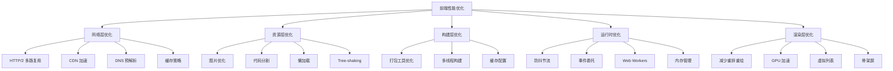
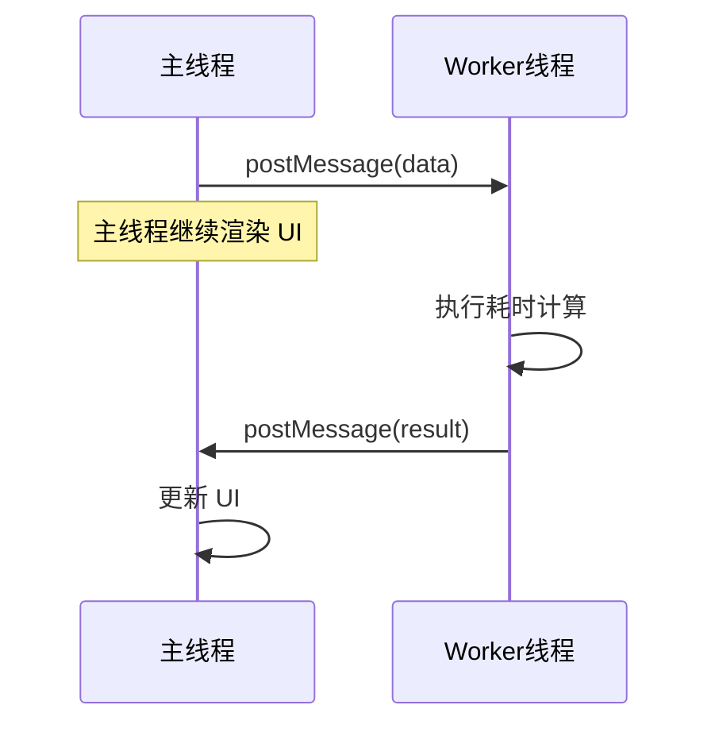
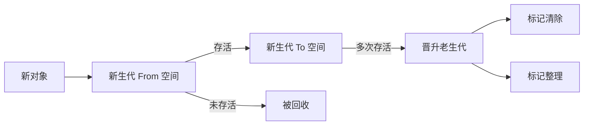
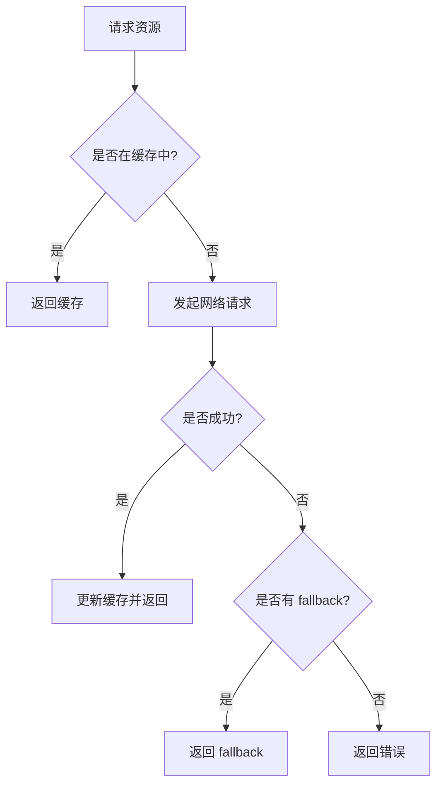
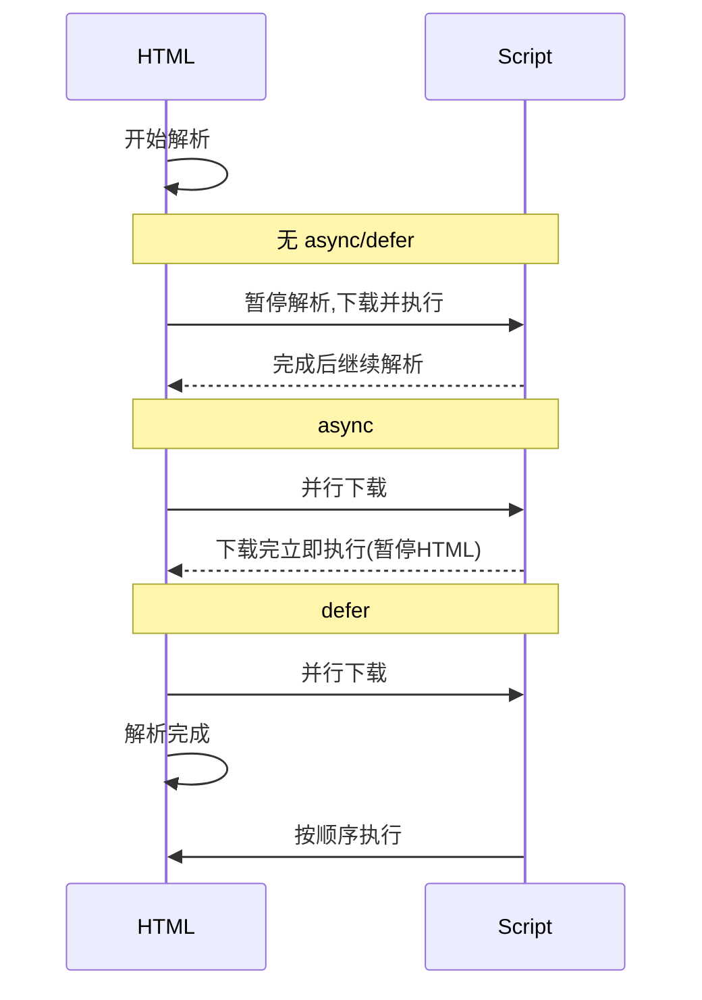
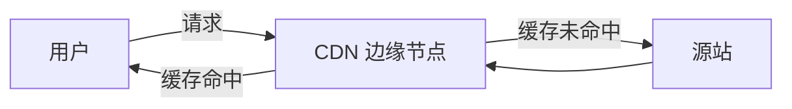
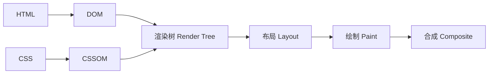
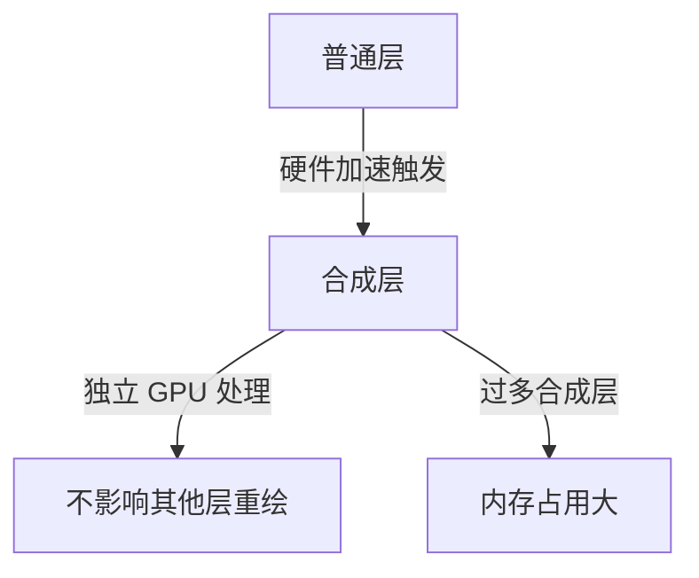

# 前端性能优化 - 核心知识点与面试指南

> 本文档系统整理前端性能优化相关的核心知识点与高频面试题，涵盖原生 JavaScript、Vue3、图片处理、打包构建、首屏渲染、闭包处理、浏览器兼容性等关键领域。兼顾学习资料与面试准备双重价值。

## 目录

- [一、性能优化总览](#一性能优化总览)
- [二、原生 JavaScript 性能优化](#二原生-javascript-性能优化)
  - [2.1 执行效率优化](#21-执行效率优化)
  - [2.2 内存管理与垃圾回收](#22-内存管理与垃圾回收)
  - [2.3 事件优化](#23-事件优化)
  - [2.4 DOM 操作优化](#24-dom-操作优化)
- [三、Vue3 性能优化](#三vue3-性能优化)
  - [3.1 响应式系统优化](#31-响应式系统优化)
  - [3.2 编译优化](#32-编译优化)
  - [3.3 组件优化](#33-组件优化)
  - [3.4 Composition API 最佳实践](#34-composition-api-最佳实践)
- [四、图片处理优化](#四图片处理优化)
- [五、打包构建优化](#五打包构建优化)
- [六、减少白屏时间](#六减少白屏时间)
- [七、闭包处理优化](#七闭包处理优化)
- [八、浏览器兼容性处理](#八浏览器兼容性处理)
- [九、其他重要面试题](#九其他重要面试题)
- [十、常见面试题汇总](#十常见面试题汇总)
- [参考文档](#参考文档)

---

## 一、性能优化总览

前端性能优化是一个系统工程，可以从**资源加载**和**浏览器渲染**两大维度切入，结合**网络层、构建层、运行时层**多个层面进行优化。

### 1.1 性能优化的核心目标

| 指标 | 说明 | 目标值 |
| --- | --- | --- |
| **FP (First Paint)** | 首次绘制时间 | < 1.5s |
| **FCP (First Contentful Paint)** | 首次内容绘制 | < 1.8s |
| **LCP (Largest Contentful Paint)** | 最大内容绘制 | < 2.5s |
| **FID (First Input Delay)** | 首次输入延迟 | < 100ms |
| **CLS (Cumulative Layout Shift)** | 累积布局偏移 | < 0.1 |
| **TTI (Time to Interactive)** | 可交互时间 | < 3.8s |

> **Core Web Vitals (核心网页指标)** 是 Google 提出的衡量用户体验的关键指标集合，包括 LCP、FID/INP、CLS 三项。

### 1.2 性能优化全景图



---

## 二、原生 JavaScript 性能优化

### 2.1 执行效率优化

#### 2.1.1 循环优化

**原理**：JavaScript 是单线程语言，长时间运行的循环会阻塞主线程，导致页面卡顿。优化循环可以减少 CPU 占用，提升响应速度。

**优化策略**：

1. **减少循环体内重复计算**：将不变的计算移到循环外
2. **使用更高效的循环方式**：`for` > `for...of` > `forEach` > `for...in`
3. **避免在循环中操作 DOM**
4. **大数组采用分块处理**：避免长时间阻塞主线程

**代码示例**：

```javascript
// ❌ 反例：每次循环都读取 arr.length
for (let i = 0; i < arr.length; i++) {
  // ...
}

// ✅ 正例：缓存 length
for (let i = 0, len = arr.length; i < len; i++) {
  // ...
}

// ✅ 大数组分块处理，避免阻塞 UI
function chunkProcess(array, process, callback) {
  const result = [];
  let index = 0;

  function step() {
    const start = Date.now();
    while (index < array.length && Date.now() - start < 16) {
      // 每次处理不超过 16ms（一帧）
      result.push(process(array[index]));
      index++;
    }
    if (index < array.length) {
      // 还有数据未处理，交给下一帧
      requestAnimationFrame(step);
    } else {
      callback(result);
    }
  }
  step();
}

// 使用示例
chunkProcess(
  new Array(100000).fill(0).map((_, i) => i),
  (item) => item * 2,
  (result) => console.log('处理完成', result.length)
);
```

> **注意事项**：在循环中使用 `break` 和 `continue` 提前退出可以减少不必要的迭代。

#### 2.1.2 避免阻塞主线程

**原理**：JavaScript 主线程同时负责执行脚本和渲染 UI，长任务（Long Task，>50ms）会阻塞渲染，导致掉帧。

**优化方法**：

1. **任务分片**：将大任务拆分为多个小任务
2. **使用 `requestIdleCallback`** 在浏览器空闲时执行低优先级任务
3. **使用 `setTimeout(fn, 0)` 或 `MessageChannel` 让出主线程**

```javascript
// 使用 requestIdleCallback 处理低优先级任务
function processIdleTask(tasks) {
  let i = 0;
  function work(deadline) {
    // 当浏览器空闲且有剩余任务时执行
    while (i < tasks.length && deadline.timeRemaining() > 0) {
      tasks[i++]();
    }
    if (i < tasks.length) {
      requestIdleCallback(work);
    }
  }
  requestIdleCallback(work);
}

// 兼容性处理
const ric = window.requestIdleCallback || function (cb) {
  return setTimeout(() => cb({ timeRemaining: () => 0, didTimeout: false }), 1);
};
```

#### 2.1.3 Web Workers 应用

**原理**：Web Workers 允许 JavaScript 在后台线程中运行，与主线程并行执行，适用于 CPU 密集型任务（数据处理、图像计算、加密等）。

**适用场景**：
- 大数据处理（排序、过滤、聚合）
- 图像处理（Canvas 像素操作）
- 复杂数学计算
- 加密/解密

**代码示例**：

```javascript
// main.js - 主线程
const worker = new Worker('worker.js');

worker.postMessage({ type: 'sort', data: largeArray });

worker.onmessage = function (e) {
  console.log('排序结果：', e.data);
};

worker.onerror = function (e) {
  console.error('Worker 错误：', e.message);
};

// worker.js - 工作线程
self.onmessage = function (e) {
  const { type, data } = e.data;
  if (type === 'sort') {
    const result = data.sort((a, b) => a - b);
    self.postMessage(result);
  }
};
```

**注意事项**：
- Worker 不能操作 DOM 和 BOM
- Worker 与主线程通信存在序列化开销，数据量大时建议使用 `Transferable Objects`
- 频繁创建/销毁 Worker 开销大，建议使用**线程池**



---

### 2.2 内存管理与垃圾回收

#### 2.2.1 垃圾回收机制

JavaScript 采用**自动垃圾回收**机制，主流浏览器使用以下算法：

1. **标记-清除（Mark-Sweep）**：现代浏览器主要算法
   - 标记阶段：从根对象出发，递归标记所有可达对象
   - 清除阶段：回收未被标记的对象

2. **分代回收（Generational Collection）**：V8 引擎采用
   - **新生代（Young Generation）**：Scavenge 算法，短生命周期对象
   - **老生代（Old Generation）**：标记-清除 + 标记-整理，长生命周期对象



#### 2.2.2 常见内存泄漏及识别

**1. 意外的全局变量**

```javascript
// ❌ 忘记 let/const/var，变量挂载到 window
function leak() {
  leakedData = new Array(1000000).fill('*'); // 等同于 window.leakedData
}

// ✅ 严格模式避免此问题
'use strict';
function safe() {
  let safeData = '...';
}
```

**2. 被遗忘的定时器**

```javascript
// ❌ 定时器引用了 DOM 节点，节点无法被回收
function setupTimer() {
  const element = document.getElementById('node');
  setInterval(() => {
    if (element) console.log(element.offsetHeight);
  }, 1000);
}

// ✅ 在组件销毁时清除定时器
let timer = setInterval(() => { /* ... */ }, 1000);
// 销毁时
clearInterval(timer);
timer = null;
```

**3. 闭包引用**

```javascript
// ❌ 闭包持有大对象不释放
function createLeak() {
  const hugeData = new Array(1000000).fill('*');
  return function () {
    // 即使不使用 hugeData，它也无法被回收
    console.log('leak');
  };
}

// ✅ 使用完后置空
function createSafe() {
  let hugeData = new Array(1000000).fill('*');
  return function () {
    hugeData = null; // 使用完毕手动释放
  };
}
```

**4. 被遗忘的事件监听器**

```javascript
// ❌ 添加事件监听但从不移除
function bindEvent() {
  const element = document.getElementById('btn');
  element.addEventListener('click', onClick);
}

// ✅ 使用 AbortController 统一管理
const controller = new AbortController();
element.addEventListener('click', onClick, { signal: controller.signal });
// 销毁时
controller.abort();
```

**5. 脱离 DOM 的引用**

```javascript
// ❌ 变量引用了已移除的 DOM
let btn = document.getElementById('btn');
document.body.removeChild(btn);
// btn 仍引用该节点，无法被回收

// ✅ 解除引用
btn = null;
```

**内存泄漏识别方法**：
1. Chrome DevTools → Memory → Heap Snapshot 对比快照
2. Performance Monitor 观察 JS Heap Size 是否持续增长
3. Performance 面板录制查看 GC 频率

#### 2.2.3 内存优化技巧

```javascript
// 1. 使用对象池复用对象（减少 GC 压力）
class ObjectPool {
  constructor(createFn) {
    this.pool = [];
    this.createFn = createFn;
  }
  acquire() {
    return this.pool.pop() || this.createFn();
  }
  release(obj) {
    this.pool.push(obj);
  }
}

// 2. 使用 TypedArray 处理数值数据
const arr = new Float32Array(1000000); // 比 Array 内存占用更小，GC 更快

// 3. 避免频繁创建短生命周期对象
// ❌ 频繁创建
function update() {
  return { x: Math.random(), y: Math.random() }; // 每帧创建新对象
}
// ✅ 复用对象
const pos = { x: 0, y: 0 };
function update() {
  pos.x = Math.random();
  pos.y = Math.random();
  return pos;
}
```

---

### 2.3 事件优化

#### 2.3.1 事件委托

**原理**：利用事件冒泡机制，将子元素的事件统一绑定在父元素上，减少事件监听器数量。

**优点**：
- 减少内存占用
- 动态添加的子元素自动获得事件处理
- 代码更简洁

**代码示例**：

```javascript
// ❌ 为每个 li 绑定事件
document.querySelectorAll('li').forEach(li => {
  li.addEventListener('click', handler);
});

// ✅ 使用事件委托
const ul = document.querySelector('ul');
ul.addEventListener('click', function (e) {
  if (e.target.tagName === 'LI') {
    console.log('点击了：', e.target.textContent);
  }
});
```

**注意事项**：
- 不适合 `blur`、`focus` 等不冒泡的事件（可使用 `focusin`/`focusout` 替代）
- 层级过深时可能影响事件响应速度
- 某些场景需要判断 `e.currentTarget` vs `e.target`

#### 2.3.2 防抖（Debounce）

**原理**：事件触发后等待一段时间再执行，若在等待期内再次触发则重新计时。**适用于频繁触发但只需最终结果**的场景。

```javascript
/**
 * 防抖函数
 * @param {Function} fn - 要执行的函数
 * @param {number} delay - 延迟时间（ms）
 * @param {boolean} immediate - 是否立即执行一次
 */
function debounce(fn, delay, immediate = false) {
  let timer = null;
  return function (...args) {
    if (timer) clearTimeout(timer);
    if (immediate && !timer) {
      fn.apply(this, args);
    }
    timer = setTimeout(() => {
      if (!immediate) fn.apply(this, args);
      timer = null;
    }, delay);
  };
}

// 使用示例：搜索框输入
input.addEventListener('input', debounce(function (e) {
  search(e.target.value);
}, 300));
```

#### 2.3.3 节流（Throttle）

**原理**：在一段时间内只执行一次回调，**适用于频繁触发但需要按固定频率响应**的场景。

```javascript
/**
 * 节流函数（时间戳版）
 */
function throttle(fn, delay) {
  let lastTime = 0;
  return function (...args) {
    const now = Date.now();
    if (now - lastTime >= delay) {
      fn.apply(this, args);
      lastTime = now;
    }
  };
}

/**
 * 节流函数（定时器版，确保最后一次触发也会执行）
 */
function throttleWithTimer(fn, delay) {
  let timer = null;
  let lastArgs = null;
  return function (...args) {
    lastArgs = args;
    if (!timer) {
      timer = setTimeout(() => {
        fn.apply(this, lastArgs);
        timer = null;
      }, delay);
    }
  };
}

// 使用示例：滚动监听
window.addEventListener('scroll', throttle(function () {
  console.log('滚动位置：', window.scrollY);
}, 100));
```

**防抖与节流对比**：

| 特性 | 防抖 (Debounce) | 节流 (Throttle) |
| --- | --- | --- |
| 触发方式 | 停止触发后执行 | 固定频率执行 |
| 适用场景 | 搜索输入、表单验证 | 滚动、resize、鼠标移动 |
| 典型场景 | 用户停止输入 300ms 后搜索 | 滚动时每 100ms 计算一次位置 |

---

### 2.4 DOM 操作优化

#### 2.4.1 减少重排（Reflow）和重绘（Repaint）

**核心概念**：
- **重排（Reflow/Layout）**：元素几何属性（尺寸、位置）变化，需要重新计算布局
- **重绘（Repaint）**：元素外观属性（颜色、背景）变化，不影响布局
- 重排必定引发重绘，重绘不一定引发重排

**触发重排的操作**：
- 添加/删除可见 DOM 元素
- 元素位置、尺寸改变
- 内容改变（文本、图片尺寸）
- 页面渲染器初始化
- 浏览器窗口大小改变
- 读取 `offsetTop/Width`、`scrollTop`、`getComputedStyle` 等属性（强制同步布局）

**优化策略**：

```javascript
// 1. 批量修改样式：使用 cssText 或 class
// ❌ 多次修改 style，触发多次重排
el.style.width = '100px';
el.style.height = '200px';
el.style.margin = '10px';

// ✅ 一次性修改
el.style.cssText = 'width:100px;height:200px;margin:10px;';
// 或
el.className = 'new-style';

// 2. 避免逐项修改样式，先隐藏再修改再显示
el.style.display = 'none';
// 进行大量修改
el.style.display = 'block';

// 3. 缓存布局信息，避免强制同步布局
// ❌ 每次循环都读取 offsetTop，触发强制重排
for (let i = 0; i < elements.length; i++) {
  elements[i].style.left = elements[i].offsetTop + 10 + 'px';
}

// ✅ 先缓存所有 offsetTop
const tops = elements.map(el => el.offsetTop);
for (let i = 0; i < elements.length; i++) {
  elements[i].style.left = tops[i] + 10 + 'px';
}

// 4. 使用 transform 代替 top/left（GPU 加速，不触发重排）
// ❌
el.style.left = '100px';
el.style.top = '100px';
// ✅
el.style.transform = 'translate(100px, 100px)';
```

#### 2.4.2 使用文档碎片（DocumentFragment）

**原理**：`DocumentFragment` 是轻量级的文档对象，对它的修改不会触发 DOM 重排。将多个 DOM 操作集中在 fragment 上，最后一次性插入。

```javascript
// ❌ 逐个插入，触发 N 次重排
const list = document.querySelector('#list');
for (let i = 0; i < 1000; i++) {
  const li = document.createElement('li');
  li.textContent = `Item ${i}`;
  list.appendChild(li); // 每次都重排
}

// ✅ 使用文档碎片，只触发一次重排
const fragment = document.createDocumentFragment();
for (let i = 0; i < 1000; i++) {
  const li = document.createElement('li');
  li.textContent = `Item ${i}`;
  fragment.appendChild(li);
}
list.appendChild(fragment);
```

#### 2.4.3 虚拟列表（Virtual List）

**原理**：对于长列表（如 10000+ 条数据），只渲染可视区域内的元素，滚动时动态替换。常见库：`vue-virtual-scroller`、`react-window`。

```javascript
// 简易虚拟列表实现
class VirtualList {
  constructor(container, items, itemHeight) {
    this.container = container;
    this.items = items;
    this.itemHeight = itemHeight;
    this.visibleCount = Math.ceil(container.clientHeight / itemHeight);
    this.startIndex = 0;
    this.init();
  }

  init() {
    this.container.style.overflow = 'auto';
    this.container.style.position = 'relative';

    // 创建占位元素，撑起总高度
    this.placeholder = document.createElement('div');
    this.placeholder.style.height = this.items.length * this.itemHeight + 'px';
    this.container.appendChild(this.placeholder);

    // 创建可见项容器
    this.content = document.createElement('div');
    this.content.style.position = 'absolute';
    this.content.style.top = '0';
    this.content.style.left = '0';
    this.content.style.right = '0';
    this.container.appendChild(this.content);

    this.container.addEventListener('scroll', this.onScroll.bind(this));
    this.render();
  }

  onScroll() {
    const scrollTop = this.container.scrollTop;
    const newIndex = Math.floor(scrollTop / this.itemHeight);
    if (newIndex !== this.startIndex) {
      this.startIndex = newIndex;
      this.render();
    }
  }

  render() {
    const endIndex = Math.min(this.startIndex + this.visibleCount, this.items.length);
    this.content.style.transform = `translateY(${this.startIndex * this.itemHeight}px)`;
    this.content.innerHTML = '';
    for (let i = this.startIndex; i < endIndex; i++) {
      const item = document.createElement('div');
      item.style.height = this.itemHeight + 'px';
      item.textContent = this.items[i];
      this.content.appendChild(item);
    }
  }
}
```

---

## 三、Vue3 性能优化

### 3.1 响应式系统优化

#### 3.1.1 Proxy 相比 Object.defineProperty 的优势

**Vue2 的 `Object.defineProperty` 缺陷**：
1. 无法监听新增/删除属性（需用 `Vue.set`/`Vue.delete`）
2. 无法监听数组索引和 length 变化（需重写数组方法）
3. 需要递归遍历对象，初始化性能差
4. 监听的是属性而非对象本身

**Vue3 的 `Proxy` 优势**：
1. **监听整个对象**：新增/删除属性自动响应
2. **原生支持数组**：索引修改、length 变化均可监听
3. **惰性响应式**：访问时才递归代理，提升初始化性能
4. **支持 Map/Set/WeakMap/WeakSet**

**代码对比**：

```javascript
// Vue2 实现方式
Object.defineProperty(obj, 'key', {
  get() { /* 收集依赖 */ },
  set(newVal) { /* 触发更新 */ }
});

// Vue3 实现方式
const proxy = new Proxy(target, {
  get(target, key, receiver) {
    track(target, key); // 收集依赖
    return Reflect.get(target, key, receiver);
  },
  set(target, key, value, receiver) {
    const result = Reflect.set(target, key, value, receiver);
    trigger(target, key); // 触发更新
    return result;
  }
});
```

> **浏览器兼容性**：Proxy 无法被 polyfill，因此 Vue3 不支持 IE11。

#### 3.1.2 响应式 API 选择

| API | 返回类型 | 适用场景 | 性能 |
| --- | --- | --- | --- |
| `reactive` | Proxy 对象 | 对象/数组 | 深层响应式 |
| `ref` | `{ value: T }` | 基本类型、需重新赋值的对象 | 轻量 |
| `shallowRef` | 浅响应 | 大对象，只关心 .value 替换 | 最优 |
| `shallowReactive` | 浅响应 | 只需第一层响应 | 优 |
| `readonly` | 只读 Proxy | 配置/常量 | 防止误改 |
| `markRaw` | 原始对象 | 永远不需要响应式的对象 | 跳过代理 |

**优化示例**：

```javascript
import { ref, shallowRef, reactive, shallowReactive, markRaw } from 'vue';

// ✅ 大数据列表用 shallowRef，避免深层代理开销
const hugeList = shallowRef([]);

// ✅ 只修改第一层时用 shallowReactive
const state = shallowReactive({
  count: 0,
  list: [] // list 的内部变化不会触发响应
});

// ✅ 第三方实例用 markRaw 跳过代理
const chart = markRaw(new Chart());

// ✅ 使用 readonly 防止误修改
const config = readonly({
  API_URL: 'https://api.example.com'
});
```

#### 3.1.3 响应式边界处理

```javascript
import { ref, toRef, toRefs, customRef } from 'vue';

// 1. 解构 reactive 对象会失去响应性，需用 toRefs
const state = reactive({ count: 0, name: 'vue' });
const { count, name } = toRefs(state); // ✅ 保持响应性

// 2. customRef 实现防抖 ref
function debouncedRef(value, delay = 200) {
  let timer;
  return customRef((track, trigger) => ({
    get() {
      track();
      return value;
    },
    set(newVal) {
      clearTimeout(timer);
      timer = setTimeout(() => {
        value = newVal;
        trigger();
      }, delay);
    }
  }));
}
```

---

### 3.2 编译优化

Vue3 编译器通过静态分析模板，生成更优化的渲染函数代码。

#### 3.2.1 静态提升（Static Hoisting）

**原理**：将模板中不参与更新的静态节点/属性提升到渲染函数之外，避免每次渲染重新创建。

```vue
<!-- 模板 -->
<template>
  <div>
    <h1>标题</h1>  <!-- 静态节点 -->
    <p>{{ message }}</p>
  </div>
</template>

<!-- 编译后（伪代码） -->
<script>
const _hoisted_1 = createVNode('h1', null, '标题'); // ✅ 提升到 render 外
function render() {
  return createVNode('div', null, [
    _hoisted_1, // 复用
    createVNode('p', null, message) // 动态节点
  ]);
}
</script>
```

#### 3.2.2 PatchFlag（补丁标记）

**原理**：编译时为动态节点标记需要更新的类型（文本、class、style 等），运行时 diff 时只对比标记部分，跳过静态部分。

```javascript
// 编译产物中带有 PatchFlag
createVNode('p', null, message, 1 /* TEXT */); // 只更新文本
createVNode('div', { class: dynamicClass }, null, 2 /* CLASS */); // 只更新 class
```

**PatchFlag 类型**：

| 值 | 含义 |
| --- | --- |
| 1 | TEXT（动态文本） |
| 2 | CLASS（动态 class） |
| 4 | STYLE（动态 style） |
| 8 | PROPS（动态属性） |
| 16 | FULL_PROPS（具有动态 key） |
| 32 | HYDRATE_EVENTS |
| 64 | STABLE_FRAGMENT |
| 128 | KEYED_FRAGMENT |
| 256 | UNKEYED_FRAGMENT |

#### 3.2.3 缓存事件处理函数（cacheHandlers）

```vue
<!-- 模板 -->
<template>
  <button @click="onClick">点击</button>
</template>

<!-- 未开启缓存：每次渲染都创建新函数 -->
function render() {
  return createVNode('button', { onClick: onClick });
}

<!-- 开启缓存：复用同一函数 -->
const _cache = [];
function render(_ctx, _cache) {
  return createVNode('button', {
    onClick: _cache[0] || (_cache[0] = (...args) => _ctx.onClick(...args))
  });
}
```

#### 3.2.4 Block Tree 与 diff 优化

Vue3 将模板基于动态节点指令切割为 Block，diff 时只对比 Block 内的动态节点（而非所有节点），复杂度从 O(N) 降到 O(动态节点数)。

---

### 3.3 组件优化

#### 3.3.1 合理使用 v-show 与 v-if

| 指令 | 切换成本 | 初始成本 | 适用场景 |
| --- | --- | --- | --- |
| `v-if` | 高（销毁/重建） | 低（惰性渲染） | 切换不频繁、条件复杂 |
| `v-show` | 低（CSS 切换） | 高（始终渲染） | 频繁切换 |

#### 3.3.2 v-for 必须使用 key

```vue
<!-- ❌ 使用 index 作为 key -->
<li v-for="(item, index) in list" :key="index">{{ item }}</li>

<!-- ✅ 使用唯一稳定的 id -->
<li v-for="item in list" :key="item.id">{{ item }}</li>
```

**原理**：key 是虚拟 DOM diff 算法的身份标识。使用 index 作为 key，在列表增删时会导致节点复用错乱、状态错位、性能下降。

#### 3.3.3 keep-alive 缓存组件

```vue
<template>
  <!-- 缓存所有 -->
  <keep-alive>
    <component :is="currentComponent" />
  </keep-alive>

  <!-- 指定缓存 -->
  <keep-alive :include="['UserList', 'UserDetail']" :max="10">
    <component :is="currentComponent" />
  </keep-alive>
</template>
```

**原理**：`<keep-alive>` 将不活动的组件实例缓存在内存中，保留状态，避免重复渲染。

**生命周期**：
- `onActivated`：被 keep-alive 缓存的组件激活时调用
- `onDeactivated`：被 keep-alive 缓存的组件停用时调用

**注意事项**：
- `include/exclude` 匹配的是组件的 `name` 选项
- 设置 `max` 限制缓存数量，避免内存占用过大
- 不适合缓存过多大组件，可能造成内存压力

#### 3.3.4 异步组件与 Suspense

```javascript
// 异步组件
import { defineAsyncComponent } from 'vue';

const AsyncComp = defineAsyncComponent(() => import('./HeavyComp.vue'));

// 带配置
const AsyncCompWithConfig = defineAsyncComponent({
  loader: () => import('./HeavyComp.vue'),
  loadingComponent: Loading,
  errorComponent: Error,
  delay: 200,
  timeout: 3000
});
```

```vue
<!-- 配合 Suspense 处理异步 -->
<template>
  <Suspense>
    <template #default>
      <AsyncComp />
    </template>
    <template #fallback>
      <Loading />
    </template>
  </Suspense>
</template>
```

#### 3.3.5 组件懒加载（v-lazy）

```javascript
// 路由级懒加载
const routes = [
  {
    path: '/dashboard',
    component: () => import('@/views/Dashboard.vue')
  }
];
```

---

### 3.4 Composition API 最佳实践

#### 3.4.1 逻辑复用

```javascript
// useMouse.js - 提取鼠标位置逻辑
import { ref, onMounted, onUnmounted } from 'vue';

export function useMouse() {
  const x = ref(0);
  const y = ref(0);

  const update = (e) => {
    x.value = e.pageX;
    y.value = e.pageY;
  };

  onMounted(() => window.addEventListener('mousemove', update));
  onUnmounted(() => window.removeEventListener('mousemove', update));

  return { x, y };
}

// 组件中使用
import { useMouse } from './useMouse';
const { x, y } = useMouse();
```

#### 3.4.2 computed 与 watch 选择

```javascript
import { ref, computed, watch, watchEffect } from 'vue';

// ✅ computed：派生状态，有缓存
const fullName = computed(() => `${firstName.value} ${lastName.value}`);

// ✅ watch：监听变化执行副作用
watch(count, (newVal, oldVal) => {
  console.log(`count 从 ${oldVal} 变为 ${newVal}`);
});

// ✅ watchEffect：自动收集依赖，立即执行
watchEffect(() => {
  console.log('count:', count.value);
});

// ✅ watch 多源监听
watch([firstName, lastName], ([newFirst, newLast]) => {
  // ...
}, { immediate: true, deep: false }); // immediate 立即执行，deep 深度监听
```

**性能建议**：
- 优先用 `computed` 派生状态
- 避免滥用 `watch`，能用 `computed` 解决就不用 `watch`
- 大对象监听时，用 `() => state.obj.field` 监听具体字段，避免 `deep: true`
- 在 watch 回调中访问响应式数据前判断是否已卸载

#### 3.4.3 响应式数据管理建议

```javascript
// ❌ 避免过大的 reactive 对象
const state = reactive({
  user: { /* ... */ },
  list: [], // 大数据
  config: { /* ... */ }
});

// ✅ 按职责拆分
const user = reactive({ /* ... */ });
const list = shallowRef([]); // 大数据用 shallowRef
const config = readonly({ /* ... */ });
```

---

## 四、图片处理优化

### 4.1 图片格式选择

| 格式 | 优点 | 缺点 | 兼容性 | 适用场景 |
| --- | --- | --- | --- | --- |
| JPEG | 压缩率高，色彩丰富 | 不支持透明 | 全部 | 照片、彩色图片 |
| PNG | 支持透明，无损 | 文件较大 | 全部 | 图标、透明图 |
| WebP | 比 JPEG/PNG 小 25-35% | 编解码稍慢 | 96%+ | 现代图片主力格式 |
| AVIF | 压缩率比 WebP 更高 | 编码慢，兼容性一般 | 92%+ | 下一代图片格式 |
| SVG | 矢量，无限缩放 | 不适合复杂图片 | 全部 | 图标、Logo、简单图形 |
| GIF | 支持动画 | 颜色数受限，体积大 | 全部 | 用 MP4/WebP 替代 |

**渐进增强方案**：

```html
<!-- 优先使用 AVIF，回退到 WebP，再回退到 JPEG -->
<picture>
  <source srcset="image.avif" type="image/avif">
  <source srcset="image.webp" type="image/webp">
  
</picture>
```

### 4.2 图片压缩

**无损压缩**：图像质量不损失，体积减小有限
- 工具：`pngquant`、`optipng`、`jpegoptim`

**有损压缩**：质量轻微下降，体积大幅减小
- 工具：`imagemin`、`sharp`、`tinypng`

**自动化构建方案**：

```javascript
// vite.config.js - 配置图片压缩
import viteImagemin from 'vite-plugin-imagemin';

export default {
  plugins: [
    viteImagemin({
      gifsicle: { optimizationLevel: 7 },
      optipng: { optimizationLevel: 7 },
      mozjpeg: { quality: 75 },
      pngquant: { quality: [0.65, 0.8] },
      webp: { quality: 75 }
    })
  ]
};
```

### 4.3 图片懒加载

#### 4.3.1 原生 loading 属性

```html
<!-- 最简单的懒加载 -->

```

#### 4.3.2 IntersectionObserver 实现懒加载

**原理**：监听元素与视窗的交集，进入视窗时再加载图片，比 `scroll` 事件更高效。

```javascript
class ImageLazyLoader {
  constructor(selector = 'img[data-src]') {
    this.images = document.querySelectorAll(selector);
    this.init();
  }

  init() {
    // 不支持 IntersectionObserver 时降级处理
    if (!('IntersectionObserver' in window)) {
      this.images.forEach(img => this.loadImage(img));
      return;
    }

    const observer = new IntersectionObserver(
      (entries) => {
        entries.forEach(entry => {
          if (entry.isIntersecting) {
            this.loadImage(entry.target);
            observer.unobserve(entry.target);
          }
        });
      },
      {
        rootMargin: '50px 0px', // 提前 50px 开始加载
        threshold: 0.01
      }
    );

    this.images.forEach(img => observer.observe(img));
  }

  loadImage(img) {
    const src = img.dataset.src;
    if (!src) return;
    img.src = src;
    img.removeAttribute('data-src');
  }
}

// 使用
new ImageLazyLoader();
```

```html
<!-- HTML 结构 -->

```

### 4.4 响应式图片

#### 4.4.1 srcset + sizes

```html
<!-- 根据屏幕宽度加载不同尺寸的图片 -->

```

#### 4.4.2 picture 配合媒体查询

```html
<picture>
  <source media="(max-width: 600px)" srcset="mobile.jpg">
  <source media="(max-width: 1200px)" srcset="tablet.jpg">
  
</picture>
```

### 4.5 现代图片技术

#### 4.5.1 图像 CDN

通过 URL 参数动态处理图片，按需返回最佳格式和尺寸。

```html
<!-- 阿里云 OSS 图片处理示例 -->


<!-- 七牛云 -->

```

#### 4.5.2 SVG 优化

```html
<!-- 内联 SVG，可被 CSS/JS 控制 -->
<svg width="24" height="24" viewBox="0 0 24 24">
  <path d="M12 2L2 22h20L12 2z" fill="currentColor"/>
</svg>
```

**优化技巧**：
- 使用 [SVGO](https://github.com/svg/svgo) 压缩 SVG
- 内联小体积 SVG，减少 HTTP 请求
- 使用 `<symbol>` + `<use>` 复用图标

```html
<!-- SVG sprite -->
<svg style="display:none">
  <symbol id="icon-home" viewBox="0 0 24 24">
    <path d="..."/>
  </symbol>
</svg>

<svg><use href="#icon-home"/></svg>
```

#### 4.5.3 使用 base64 内联小图

```javascript
// vite.config.js - 小图转 base64
export default {
  build: {
    assetsInlineLimit: 4096 // 4kb 以下转 base64
  }
};
```

> **注意**：base64 会增大 HTML 体积约 33%，且无法被浏览器缓存。建议仅对小于 4KB 的小图标使用。

---

## 五、打包构建优化

### 5.1 代码分割（Code Splitting）

#### 5.1.1 路由级别分割

```javascript
// router/index.js
const routes = [
  {
    path: '/',
    component: () => import('@/views/Home.vue') // 动态 import
  },
  {
    path: '/about',
    component: () => import('@/views/About.vue')
  }
];
```

#### 5.1.2 组件级别分割

```javascript
// 异步加载大组件
const HeavyChart = defineAsyncComponent(() => import('./HeavyChart.vue'));
```

#### 5.1.3 手动分割（Vite manualChunks）

```javascript
// vite.config.js
export default {
  build: {
    rollupOptions: {
      output: {
        manualChunks: {
          vue: ['vue', 'vue-router', 'pinia'],
          echarts: ['echarts'],
          utils: ['lodash', 'dayjs']
        }
      }
    }
  }
};
```

### 5.2 Tree-shaking

**原理**：基于 ES Module 的静态分析，移除未被使用的代码。前提是使用 ES Module（`import/export`），而非 CommonJS。

**生效条件**：
1. 使用 ES Module 语法
2. `package.json` 中设置 `"sideEffects": false` 或具体文件
3. 生产模式构建（`mode: production`）
4. 使用支持 Tree-shaking 的打包工具（Webpack 4+、Rollup、Vite）

```javascript
// ❌ CommonJS 无法 Tree-shaking
const _ = require('lodash');

// ✅ ES Module 可以 Tree-shaking
import debounce from 'lodash/debounce'; // 只引入具体方法
// 或使用 lodash-es
import { debounce } from 'lodash-es';

// package.json
{
  "sideEffects": false  // 告诉打包工具所有文件都没有副作用
  // 或
  "sideEffects": ["*.css", "*.vue"]  // 排除有副作用的文件
}
```

### 5.3 懒加载配置（动态 import）

```javascript
// 动态导入模块，返回 Promise
const module = await import('./module.js');

// 配合注释指定 chunk 名称
const utils = await import(
  /* webpackChunkName: "utils" */
  /* webpackPrefetch: true */
  './utils'
);
```

**Webpack 魔法注释**：
- `webpackChunkName`：自定义 chunk 名称
- `webpackPrefetch: true`：浏览器空闲时预加载
- `webpackPreload: true`：与父 chunk 并行加载
- `webpackMode`：`lazy` / `lazy-once` / `eager`

### 5.4 构建速度优化

#### 5.4.1 缓存配置

```javascript
// vite.config.js - 使用缓存
export default {
  build: {},
  esbuild: {
    legalComments: 'none'
  }
};

// webpack.config.js - 持久化缓存
module.exports = {
  cache: {
    type: 'filesystem',
    buildDependencies: {
      config: [__filename]
    }
  }
};
```

#### 5.4.2 多线程构建

```javascript
// webpack 使用 thread-loader
module.exports = {
  module: {
    rules: [
      {
        test: /\.js$/,
        use: [
          {
            loader: 'thread-loader',
            options: { workers: 4 }
          },
          'babel-loader'
        ]
      }
    ]
  }
};
```

#### 5.4.3 构建速度对比

| 优化项 | 优化前 | 优化后 | 提升幅度 |
| --- | --- | --- | --- |
| 持久化缓存 | 60s | 15s | 75% |
| 多线程 babel | 60s | 35s | 41% |
| esbuild 替代 babel | 35s | 12s | 65% |
| exclude node_modules | 35s | 28s | 20% |

### 5.5 缓存策略

#### 5.5.1 HTTP 缓存

| 缓存类型 | 头字段 | 特点 |
| --- | --- | --- |
| 强缓存 | `Cache-Control`、`Expires` | 不发请求，直接用缓存 |
| 协商缓存 | `Last-Modified/If-Modified-Since`、`ETag/If-None-Match` | 发请求验证，命中返回 304 |

**最佳实践**：
- HTML 文件：`Cache-Control: no-cache`（每次协商）
- 带 hash 的 JS/CSS：`Cache-Control: public, max-age=31536000, immutable`（一年强缓存）
- 图片/字体：`Cache-Control: public, max-age=2592000`

```nginx
# nginx 配置示例
location ~* \.(js|css|woff2?)$ {
  expires 1y;
  add_header Cache-Control "public, immutable";
}

location ~* \.(html)$ {
  add_header Cache-Control "no-cache";
}
```

#### 5.5.2 Service Worker 缓存

```javascript
// sw.js
const CACHE_NAME = 'app-v1';
const CACHE_URLS = [
  '/',
  '/index.html',
  '/static/js/main.[hash].js'
];

// 安装：预缓存核心资源
self.addEventListener('install', (event) => {
  event.waitUntil(
    caches.open(CACHE_NAME).then(cache => cache.addAll(CACHE_URLS))
  );
  self.skipWaiting();
});

// 激活：清理旧缓存
self.addEventListener('activate', (event) => {
  event.waitUntil(
    caches.keys().then(keys =>
      Promise.all(keys.map(key => key !== CACHE_NAME && caches.delete(key)))
    )
  );
  self.clients.claim();
});

// 拦截请求：缓存优先，网络回退
self.addEventListener('fetch', (event) => {
  event.respondWith(
    caches.match(event.request).then(response => {
      return response || fetch(event.request).then(res => {
        // 缓存新请求
        const resClone = res.clone();
        caches.open(CACHE_NAME).then(cache => cache.put(event.request, resClone));
        return res;
      });
    }).catch(() => caches.match('/offline.html'))
  );
});
```

**缓存策略选择**：



---

## 六、减少白屏时间

### 6.1 白屏原因分析

**白屏时间** = 浏览器开始渲染时间 - 用户输入 URL 时间

**主要成因**：
1. **网络请求慢**：DNS 解析、TCP 握手、服务端响应慢
2. **资源加载阻塞**：CSS/JS 在 `<head>` 中阻塞渲染
3. **JS 包过大**：解析、执行时间长
4. **服务端渲染缺失**：依赖客户端 JS 渲染内容
5. **第三方脚本阻塞**：广告、统计、字体加载

### 6.2 首屏加载优化

#### 6.2.1 关键资源优先加载

```html
<head>
  <!-- 关键 CSS 内联 -->
  <style>
    body { margin: 0; }
    .header { /* 首屏样式 */ }
  </style>

  <!-- 非关键 CSS 异步加载 -->
  <link rel="preload" href="main.css" as="style" onload="this.rel='stylesheet'">
  <noscript><link rel="stylesheet" href="main.css"></noscript>

  <!-- JS 延迟加载 -->
  <script src="app.js" defer></script>
</head>
```

**`defer` vs `async`**：

| 属性 | 下载时机 | 执行时机 | 执行顺序 | 适用场景 |
| --- | --- | --- | --- | --- |
| 无 | 阻塞 | 立即（阻塞） | 顺序 | 主脚本 |
| `async` | 异步 | 下载完立即 | 不保证顺序 | 独立脚本（统计） |
| `defer` | 异步 | HTML 解析后 | 顺序执行 | 主应用脚本 |



#### 6.2.2 预加载策略（preload / prefetch / dns-prefetch / preconnect）

```html
<!-- preload：当前页面高优先级加载关键资源 -->
<link rel="preload" href="critical-font.woff2" as="font" type="font/woff2" crossorigin>
<link rel="preload" href="hero-image.jpg" as="image">

<!-- prefetch：浏览器空闲时低优先级预取下一页资源 -->
<link rel="prefetch" href="next-page.js">

<!-- dns-prefetch：提前解析域名 DNS -->
<link rel="dns-prefetch" href="//cdn.example.com">

<!-- preconnect：提前建立连接（DNS+TCP+TLS） -->
<link rel="preconnect" href="//cdn.example.com" crossorigin>
```

| 指令 | 时机 | 优先级 | 用途 |
| --- | --- | --- | --- |
| `dns-prefetch` | 任意 | 低 | 仅 DNS 解析 |
| `preconnect` | 任意 | 中 | DNS + TCP + TLS |
| `preload` | 当前页 | 高 | 必需的关键资源 |
| `prefetch` | 空闲时 | 低 | 下个页面可能用到的资源 |
| `modulepreload` | 当前页 | 高 | 预加载 ES Module |

#### 6.2.3 字体优化

```css
/* 字体加载优化 */
@font-face {
  font-family: 'CustomFont';
  src: url('font.woff2') format('woff2');
  font-display: swap; /* 加载完成前用回退字体 */
  unicode-range: U+0000-00FF; /* 仅加载需要的字符集 */
}

/* 使用系统字体栈避免网络字体 */
font-family: -apple-system, BlinkMacSystemFont, 'Segoe UI', sans-serif;
```

### 6.3 骨架屏实现

#### 6.3.1 手动实现骨架屏

```html
<!-- 骨架屏结构 -->
<div class="skeleton" id="skeleton">
  <div class="skeleton-header"></div>
  <div class="skeleton-line"></div>
  <div class="skeleton-line short"></div>
  <div class="skeleton-line"></div>
</div>

<style>
  .skeleton-line {
    height: 16px;
    margin: 12px 0;
    background: linear-gradient(90deg, #f0f0f0 25%, #e0e0e0 50%, #f0f0f0 75%);
    background-size: 200% 100%;
    animation: shimmer 1.5s infinite;
    border-radius: 4px;
  }
  .skeleton-line.short { width: 60%; }
  @keyframes shimmer {
    0% { background-position: 200% 0; }
    100% { background-position: -200% 0; }
  }
</style>

<script>
  // 数据加载完成后替换骨架屏
  fetch('/api/data').then(res => res.json()).then(data => {
    document.getElementById('skeleton').style.display = 'none';
    renderContent(data);
  });
</script>
```

#### 6.3.2 自动生成方案

- **`vue-skeleton-webpack-plugin`**：Vue 项目自动生成骨架屏
- **`draw-page-structure`**：从页面 DOM 自动生成骨架
- **UI 库内置**：Element Plus、Ant Design 都提供 Skeleton 组件

```vue
<!-- Element Plus 骨架屏 -->
<el-skeleton :loading="loading" :rows="5" animated>
  <template #default>
    <div>实际内容</div>
  </template>
</el-skeleton>
```

### 6.4 服务端渲染（SSR）

```javascript
// Vue3 SSR 示例
import { createSSRApp } from 'vue';
import { renderToString } from '@vue/server-renderer';

const app = createSSRApp({
  data: () => ({ msg: 'Hello SSR' }),
  template: `<div>{{ msg }}</div>`
});

renderToString(app).then(html => {
  console.log(html); // 直接输出 HTML 字符串
});
```

**SSR 优缺点**：

| 优点 | 缺点 |
| --- | --- |
| 首屏渲染快 | 服务端压力增大 |
| SEO 友好 | 开发限制（不能用 window 等） |
| 利于低配设备 | 部署复杂 |

**现代化方案**：
- **Nuxt.js**（Vue）、**Next.js**（React）
- **SSG（静态站点生成）**：构建时生成静态 HTML
- ** Islands Architecture（岛屿架构）**：静态 HTML + 局部水合（Astro）

---

## 七、闭包处理优化

### 7.1 闭包内存管理

**闭包（Closure）**：函数与其词法环境的组合，使内部函数可以访问外部函数的变量。**优点**：封装、模块化、柯里化；**风险**：易引发内存泄漏。

```javascript
// 经典闭包示例
function createCounter() {
  let count = 0;
  return {
    increment: () => ++count,
    decrement: () => --count,
    getCount: () => count
  };
}
```

### 7.2 常见闭包陷阱

#### 7.2.1 闭包持有不必要引用

```javascript
// ❌ 闭包意外持有大对象
function process() {
  const hugeData = new Array(1e6).fill('*');
  return function () {
    console.log('done'); // hugeData 不需要但被持有
  };
}

// ✅ 显式置空
function process() {
  let hugeData = new Array(1e6).fill('*');
  const result = doSomething(hugeData);
  hugeData = null; // 使用完毕立即释放
  return function () {
    console.log(result);
  };
}
```

#### 7.2.2 定时器中的闭包泄漏

```javascript
// ❌ 定时器持有大对象引用
function setup() {
  const bigData = new Array(1e6).fill('*');
  setInterval(() => {
    console.log(bigData.length); // bigData 一直无法回收
  }, 1000);
}

// ✅ 完成后清除定时器
function setup() {
  const bigData = new Array(1e6).fill('*');
  let count = 0;
  const timer = setInterval(() => {
    count++;
    if (count >= 5) clearInterval(timer); // 完成后清除
  }, 1000);
}
```

#### 7.2.3 事件监听中的闭包

```javascript
// ❌ React 中未清理事件监听
function Component() {
  const [data, setData] = useState([]);
  useEffect(() => {
    window.addEventListener('resize', () => {
      console.log(data); // 闭包捕获旧 data
    });
    // 缺少 cleanup
  }, []);
}

// ✅ 使用 cleanup
function Component() {
  const [data, setData] = useState([]);
  useEffect(() => {
    const handler = () => console.log(data);
    window.addEventListener('resize', handler);
    return () => window.removeEventListener('resize', handler);
  }, [data]); // 依赖变化时重新绑定
}
```

### 7.3 闭包性能优化技巧

```javascript
// 1. 避免在热路径（高频执行）创建闭包
// ❌
function handleClick() {
  elements.forEach(el => {
    el.onclick = () => doSomething(el.id); // 每个元素都创建闭包
  });
}
// ✅ 使用事件委托
container.onclick = (e) => {
  if (e.target.matches('.item')) doSomething(e.target.dataset.id);
};

// 2. 使用 WeakMap 存储关联数据，避免强引用
const cache = new WeakMap();
function process(obj) {
  if (cache.has(obj)) return cache.get(obj);
  const result = expensiveCompute(obj);
  cache.set(obj, result);
  return result;
}

// 3. 工厂函数中的闭包优化
function createHandler(id) {
  // 共享方法定义在外部
  return () => doSomething(id);
}
```

### 7.4 实际案例分析

**案例：循环中的闭包问题**

```javascript
// ❌ 经典错误：var + 闭包，所有都输出 5
for (var i = 0; i < 5; i++) {
  setTimeout(() => console.log(i), 0);
}

// ✅ let 创建块级作用域
for (let i = 0; i < 5; i++) {
  setTimeout(() => console.log(i), 0);
}

// ✅ IIFE 立即执行函数
for (var i = 0; i < 5; i++) {
  (function (j) {
    setTimeout(() => console.log(j), 0);
  })(i);
}
```

---

## 八、浏览器兼容性处理

### 8.1 跨浏览器性能优化方案

#### 8.1.1 CSS 兼容性

```css
/* 使用 PostCSS 自动添加前缀 */
/* 配置 postcss.config.js + autoprefixer */

/* 渐进增强：先写基础样式，再写增强样式 */
.box {
  /* 基础：所有浏览器支持 */
  display: block;
  /* 增强：现代浏览器支持 */
  display: flex;
  display: grid;
}

/* 特性查询 @supports */
@supports (display: grid) {
  .container { display: grid; }
}

@supports not (display: grid) {
  .container { display: flex; }
}
```

#### 8.1.2 JavaScript 兼容性

```javascript
// 通过 Babel 转译 ES6+ 语法
// 配置 .browserslistrc
/*
> 1%
last 2 versions
not dead
not ie 11
*/

// 特性检测而非浏览器检测
// ✅ 特性检测
if ('IntersectionObserver' in window) {
  // 使用 IntersectionObserver
} else {
  // 降级到 scroll 监听
}

// ✅ 动态 polyfill
if (!Array.prototype.flat) {
  import('core-js/modules/es.array.flat').then(() => {
    // 使用 flat
  });
}
```

### 8.2 渐进式增强与优雅降级

| 策略 | 理念 | 实践 |
| --- | --- | --- |
| **渐进式增强** | 先保证基础功能可用，再增强体验 | 优先语义化 HTML → CSS → JS |
| **优雅降级** | 先实现完整功能，再为低版本浏览器降级 | 现代功能 + 降级方案 |

```html
<!-- 渐进式增强示例 -->
<noscript>
  <!-- JS 不可用时的降级方案 -->
  <meta http-equiv="refresh" content="0;url=nojs.html">
</noscript>

<form action="/api/submit" method="post">
  <!-- 基础：原生表单可工作 -->
  <input name="email" type="email" required>
  <button type="submit">提交</button>
</form>

<script>
  // 增强：用 JS 提升体验
  form.addEventListener('submit', async (e) => {
    e.preventDefault();
    await fetch('/api/submit', { method: 'POST', body: new FormData(form) });
  });
</script>
```

### 8.3 特性检测实现

```javascript
// 1. CSS 特性检测
function supportsCSS(prop, value) {
  const el = document.createElement('div');
  if (prop in el.style) {
    el.style[prop] = value;
    return el.style[prop] === value;
  }
  return false;
}

// 2. JS API 检测
const features = {
  intersectionObserver: 'IntersectionObserver' in window,
  serviceWorker: 'serviceWorker' in navigator,
  webp: () => new Promise(resolve => {
    const img = new Image();
    img.onload = () => resolve(img.width > 0);
    img.onerror = () => resolve(false);
    img.src = 'data:image/webp;base64,UklGRiQAAABXRUJQVlA4IBgAAAAwAQCdASoBAAEAAwA0JaQAA3pg/vAAAA';
  })
};

// 3. Modernizr 风格的检测
const supports = {
  flexbox: supportsCSS('display', 'flex'),
  grid: supportsCSS('display', 'grid'),
  customProperties: supportsCSS('--custom', 'value')
};
```

### 8.4 移动端兼容优化

```html
<!-- viewport 设置 -->
<meta name="viewport" content="width=device-width, initial-scale=1, viewport-fit=cover">

<!-- 禁用缩放（iOS） -->
<meta name="viewport" content="width=device-width, initial-scale=1, maximum-scale=1, user-scalable=no">

<!-- 适配安全区域（iPhone X+） -->
<meta name="apple-mobile-web-app-capable" content="yes">
<style>
  body { padding: env(safe-area-inset-top) env(safe-area-inset-right) env(safe-area-inset-bottom) env(safe-area-inset-left); }
</style>
```

**移动端性能优化要点**：
1. **使用 `transform` 替代 `top/left`**：触发 GPU 加速
2. **避免 300ms 点击延迟**：`<meta name="viewport" content="width=device-width">`
3. **使用 `touch-action`** 控制触摸行为
4. **避免 `box-shadow` 在滚动元素上**：iOS 渲染慢
5. **图片使用 `srcset` 适配 DPR**

---

## 九、其他重要面试题

### 9.1 网络优化

#### 9.1.1 HTTP/1.1 vs HTTP/2 vs HTTP/3

| 特性 | HTTP/1.1 | HTTP/2 | HTTP/3 |
| --- | --- | --- | --- |
| 传输层 | TCP | TCP | QUIC (UDP) |
| 多路复用 | ❌ | ✅ | ✅ |
| 头部压缩 | ❌ | HPACK | QPACK |
| 服务端推送 | ❌ | ✅ | ✅ |
| 队头阻塞 | 有（应用层+TCP） | TCP 层有 | 无 |
| 连接迁移 | ❌ | ❌ | ✅ |

**HTTP/2 核心特性**：
- **多路复用**：一个 TCP 连接上并行多个请求
- **头部压缩**：HPACK 算法压缩重复 header
- **服务端推送**：服务器可主动推送资源
- **二进制分帧**：改为二进制格式提升解析效率

#### 9.1.2 HTTPS 性能优化

```nginx
# nginx HTTPS 优化配置
server {
  listen 443 ssl http2;
  ssl_session_cache shared:SSL:10m;
  ssl_session_timeout 10m;
  ssl_session_tickets on;
  ssl_protocols TLSv1.2 TLSv1.3;
  ssl_prefer_server_ciphers on;
  # OCSP Stapling
  ssl_stapling on;
  ssl_stapling_verify on;
}
```

**优化要点**：
1. **会话复用**：减少 TLS 握手
2. **OCSP Stapling**：避免客户端验证证书延迟
3. **TLS 1.3**：1-RTT 握手，0-RTT 恢复
4. **HTTP/2**：减少连接数
5. **HSTS**：避免 HTTP→HTTPS 跳转

#### 9.1.3 CDN 加速



**CDN 优势**：
- 就近访问，降低延迟
- 减轻源站压力
- 提供安全防护（DDoS、CC）

### 9.2 渲染性能

#### 9.2.1 浏览器渲染流程



**关键步骤**：
1. **解析 HTML → DOM 树**
2. **解析 CSS → CSSOM 树**
3. **合成 → 渲染树**（不含 `display:none` 的元素）
4. **布局（Layout/Reflow）**：计算几何位置
5. **绘制（Paint）**：填充像素
6. **合成（Composite）**：将各图层合成

#### 9.2.2 CSS 优化

```css
/* ❌ 选择器过深，性能差 */
.container .list .item .title { color: red; }

/* ✅ 单类名，BEM 命名 */
.list__title { color: red; }

/* ✅ 使用 will-change 提前告知浏览器 */
.animated-box {
  will-change: transform, opacity;
}

/* ✅ 使用 contain 隔离渲染 */
.widget {
  contain: layout style paint;
}

/* ✅ GPU 加速属性 */
.smooth {
  transform: translateZ(0); /* 触发硬件加速 */
  /* 或 */
  will-change: transform;
}
```

**GPU 加速属性**（不触发重排重绘）：
- `transform`
- `opacity`
- `filter`
- `will-change`

#### 9.2.3 渲染层与合成层



**触发合成层的条件**：
- `transform: translate3d/translateZ`
- `opacity` < 1
- `position: fixed`
- `will-change`
- `<video>`、`<canvas>`、WebGL
- 3D `transform`

> **注意事项**：过多合成层会占用大量内存（每层都是 GPU 纹理），需权衡。

### 9.3 性能监控与分析

#### 9.3.1 Lighthouse

```bash
# 命令行运行
npx lighthouse https://example.com --output html --output-path report.html

# 关键指标
# - Performance（性能）
# - Accessibility（无障碍）
# - Best Practices（最佳实践）
# - SEO
# - PWA
```

#### 9.3.2 Performance API

```javascript
// 获取关键时间点
const timing = performance.getEntriesByType('navigation')[0];
console.log('DNS 解析：', timing.domainLookupEnd - timing.domainLookupStart);
console.log('TCP 连接：', timing.connectEnd - timing.connectStart);
console.log('请求响应：', timing.responseEnd - timing.requestStart);
console.log('DOM 解析：', timing.domComplete - timing.domInteractive);
console.log('页面加载：', timing.loadEventStart - timing.fetchStart);

// 监听 LCP
new PerformanceObserver((list) => {
  const entries = list.getEntries();
  const lastEntry = entries[entries.length - 1];
  console.log('LCP:', lastEntry.startTime, lastEntry.element);
}).observe({ type: 'largest-contentful-paint', buffered: true });

// 上报性能数据
navigator.sendBeacon('/api/perf', JSON.stringify({
  fp: timing.domLoading - timing.fetchStart,
  domReady: timing.domContentLoadedEventEnd - timing.fetchStart,
  load: timing.loadEventEnd - timing.fetchStart
}));
```

#### 9.3.3 Chrome DevTools 性能分析

| 面板 | 用途 |
| --- | --- |
| **Performance** | 录制运行时性能（FPS、CPU、网络、内存） |
| **Memory** | 内存快照、堆分配分析 |
| **Network** | 网络请求瀑布图、缓存、请求阻塞 |
| **Coverage** | 代码使用率，发现未使用的 JS/CSS |
| **Lighthouse** | 综合性能评估 |

#### 9.3.4 Web Vitals 监控

```javascript
// 使用 web-vitals 库
import { getCLS, getFID, getLCP, getFCP, getTTFB } from 'web-vitals';

function report(metric) {
  // 上报到监控平台
  fetch('/api/metrics', {
    method: 'POST',
    body: JSON.stringify(metric)
  });
}

getCLS(report);
getFID(report);
getLCP(report);
getFCP(report);
getTTFB(report);
```

---

## 十、常见面试题汇总

### 基础概念类

**Q1：什么是重排和重绘？如何避免？**

> **答**：重排（Reflow）是元素几何属性变化引发的重新布局计算；重绘（Repaint）是元素外观属性变化引发的重新绘制。重排一定引发重绘。避免方法：批量修改样式、使用 transform 替代 top/left、避免频繁读取布局属性、使用文档碎片、将动画应用到 `position:absolute/fixed` 元素。

**Q2：防抖和节流的区别？分别适用什么场景？**

> **答**：防抖（Debounce）是在事件停止触发一段时间后执行；节流（Throttle）是在固定时间间隔内只执行一次。防抖适合搜索框输入、表单验证；节流适合滚动监听、resize、鼠标移动。

**Q3：什么是事件委托？有什么优缺点？**

> **答**：事件委托是利用事件冒泡，将子元素事件绑定在父元素上。优点：减少监听器数量、动态元素自动响应、内存占用低。缺点：不适合不冒泡事件、层级过深影响响应、需要正确判断 target。

**Q4：闭包是什么？会导致什么问题？**

> **答**：闭包是函数与其词法环境的组合，使内部函数可访问外部函数变量。问题：可能引发内存泄漏（外部变量无法回收）、性能问题（创建闭包开销）。解决：使用完毕置空引用、用 WeakMap 存储关联数据。

### 原理分析类

**Q5：Vue3 的 Proxy 相比 Vue2 的 Object.defineProperty 有什么优势？**

> **答**：① 可监听对象整体，自动响应新增/删除属性；② 原生支持数组索引/length 变化；③ 惰性响应式，访问时才递归代理，初始化更快；④ 支持 Map/Set 等集合类型；⑤ 性能更好。缺点：无法 polyfill，不支持 IE11。

**Q6：Vue3 的编译优化有哪些？**

> **答**：① 静态提升（Static Hoisting）：静态节点提到 render 外复用；② PatchFlag：标记动态节点类型，diff 时只比对动态部分；③ Block Tree：基于动态节点切分 Block，diff 复杂度从 O(N) 降到 O(动态节点数)；④ cacheHandlers：缓存事件处理函数；⑤ SSR 优化。

**Q7：Tree-shaking 原理？如何确保生效？**

> **答**：基于 ES Module 静态分析，标记未被引用的导出，打包时移除。生效条件：使用 ES Module 语法、`package.json` 配置 `sideEffects`、生产模式构建。注意：CommonJS 不支持、有副作用的代码不会被移除。

**Q8：HTTP/2 相比 HTTP/1.1 有哪些改进？**

> **答**：① 多路复用：一个 TCP 连接并行多个请求；② 头部压缩：HPACK 算法；③ 服务端推送；④ 二进制分帧：解析更快；⑤ 优先级控制。剩余问题：TCP 层队头阻塞（HTTP/3 用 QUIC 解决）。

### 实践操作类

**Q9：如何实现图片懒加载？**

> **答**：① 原生 `loading="lazy"`（最简单，兼容性 96%+）；② IntersectionObserver（推荐，性能好）：监听元素与视窗交集，进入视窗时设置 `src`；③ scroll 事件 + getBoundingClientRect（兼容老浏览器，性能差需配节流）。

**Q10：如何优化一个加载缓慢的页面？**

> **答**：① 用 Lighthouse/Performance 定位瓶颈；② 网络层：CDN、HTTP/2、缓存策略；③ 资源层：代码分割、图片优化（WebP、懒加载）、压缩 Gzip/Brotli；④ 渲染层：关键 CSS 内联、defer/async、骨架屏、SSR；⑤ 运行时：减少重排重绘、虚拟列表、防抖节流。

**Q11：如何检测和解决内存泄漏？**

> **答**：检测：Chrome DevTools Memory 面板做堆快照对比、Performance Monitor 观察 JS Heap Size、Performance 录制查看 GC。常见泄漏：意外全局变量、被遗忘的定时器/事件监听、闭包引用、脱离 DOM 引用。解决：严格模式、及时清理监听器/定时器、置空引用、使用 WeakMap。

**Q12：实现一个带立即执行选项的防抖函数。**

```javascript
function debounce(fn, delay, immediate = false) {
  let timer = null;
  return function (...args) {
    if (timer) clearTimeout(timer);
    if (immediate && !timer) fn.apply(this, args);
    timer = setTimeout(() => {
      if (!immediate) fn.apply(this, args);
      timer = null;
    }, delay);
  };
}
```

### 场景题

**Q13：长列表（10万条数据）如何渲染？**

> **答**：① 虚拟列表（推荐）：只渲染可视区域，滚动时动态替换，复杂度 O(可见项数)。常用库：vue-virtual-scroller、react-window；② 分页加载：每页 50 条，滚动到底加载下一页；③ 时间分片：用 `requestAnimationFrame` 分批渲染；④ 后端分页 + 搜索：避免一次性返回所有数据。

**Q14：首屏白屏时间长，如何排查和优化？**

> **答**：排查：① Performance API 看各阶段耗时；② Network 看资源大小和阻塞；③ Lighthouse 看建议。优化：网络（CDN、HTTP/2、缓存）、资源（代码分割、图片优化、压缩、Tree-shaking）、渲染（关键 CSS 内联、defer、骨架屏、SSR/预渲染、preload 关键资源）。

**Q15：移动端 1px 边框问题如何解决？**

```css
/* 方案1：transform 缩放 */
.border-1px::after {
  content: '';
  position: absolute;
  left: 0; bottom: 0;
  width: 100%; height: 1px;
  background: #ccc;
  transform: scaleY(0.5);
  transform-origin: 0 0;
}

/* 方案2：viewport 缩放 */
<meta name="viewport" content="width=device-width,initial-scale=0.5">
```

**Q16：如何优化 Webpack/Vite 构建速度？**

> **答**：Webpack：① 持久化缓存（`cache.type: 'filesystem'`）；② thread-loader 多线程；③ exclude node_modules；④ 用 esbuild-loader 替代 babel-loader；⑤ splitChunks 拆分 vendor。Vite：① 使用 esbuild 替代 babel；② optimizeDeps 预构建；③ rollupOptions 拆包；④ build.minify 用 esbuild。

**Q17：什么是 Core Web Vitals？**

> **答**：Google 提出的核心网页指标：① LCP（最大内容绘制）< 2.5s；② FID/INP（首次输入延迟/交互延迟）< 100ms/200ms；③ CLS（累积布局偏移）< 0.1。影响搜索排名。

**Q18：SSR、SSG、CSR 的区别？**

> **答**：① CSR（客户端渲染）：JS 在浏览器渲染，首屏慢、SEO 差；② SSR（服务端渲染）：服务端生成 HTML 返回，首屏快、SEO 好，但服务端压力大；③ SSG（静态站点生成）：构建时生成静态 HTML，性能最优，适合内容不常变的页面（博客、文档）。Nuxt/Next 都支持三者。

**Q19：如何选择 `v-if` 和 `v-show`？**

> **答**：`v-if` 是真正的条件渲染（销毁/重建），切换成本高但初始渲染惰性；`v-show` 只是 CSS `display` 切换，切换成本低但始终渲染。频繁切换用 `v-show`，条件很少改变或初次可能不渲染用 `v-if`。

**Q20：浏览器缓存策略如何设计？**

> **答**：强缓存优先，命中则不发请求；未命中走协商缓存（ETag/Last-Modified），命中返回 304。实践：HTML 用 `no-cache`（每次协商）；带 hash 的 JS/CSS 用 `max-age=31536000, immutable`（一年强缓存）；图片字体用 `max-age=2592000`。文件名加 hash 实现内容更新时缓存失效。

**Q21：Vue3 中如何避免不必要的更新？**

> **答**：① 合理使用 `v-once` 渲染静态内容只一次；② `v-memo` 缓存子树，依赖不变则跳过更新；③ 列表用稳定的 `key`；④ 大对象用 `shallowRef/shallowReactive`；⑤ 计算属性优于方法；⑥ 事件处理用内联函数 + `cacheHandlers`；⑦ 组件拆分粒度合理，`computed` 细化依赖。

**Q22：如何减少 SPA 应用的打包体积？**

> **答**：① 路由懒加载（动态 import）；② 组件异步加载；③ Tree-shaking（ES Module + sideEffects）；④ 按需引入第三方库（如 `lodash-es`、Element Plus 按需引入）；⑤ 替换重型库（moment → dayjs）；⑥ Gzip/Brotli 压缩；⑦ 图片优化（WebP、压缩、懒加载）；⑧ 移除未使用的依赖（`depcheck`）。

**Q23：什么是 Service Worker？如何用它做离线应用？**

> **答**：Service Worker 是运行在浏览器后台的 JS 脚本，独立于网页，可拦截网络请求、管理缓存、实现离线功能和推送通知。实现离线：① install 阶段预缓存核心资源；② fetch 事件中缓存优先、网络回退；③ activate 阶段清理旧缓存。注意：必须在 HTTPS 下运行、生命周期异步、不能直接操作 DOM。

**Q24：如何做性能监控？**

> **答**：① 性能指标采集：Performance API（FP/FCP/LCP/TTI）、`web-vitals` 库、PerformanceObserver 监听 CLS/FID；② 错误监控：`window.onerror`、`unhandledrejection`、try-catch；③ 资源监控：PerformanceResourceTiming；④ 用户行为：点击/路由/停留时长；⑤ 上报：`navigator.sendBeacon`（页面卸载时不丢失）、图片打点、fetch。常用平台：Sentry、阿里 ARMS、FunDebug。

**Q25：谈谈你对前端性能优化的整体思路？**

> **答**：分三个层次：① **网络层**：CDN、HTTP/2、DNS 预解析、缓存策略、Gzip/Brotli；② **资源层**：代码分割、Tree-shaking、图片优化、懒加载、按需引入；③ **运行时**：减少重排重绘、虚拟列表、防抖节流、Web Workers、内存管理；④ **渲染层**：关键 CSS 内联、defer/async、SSR/SSG、骨架屏；⑤ **监控层**：Lighthouse、Performance API、Web Vitals 持续监控。优化前先测量（定位瓶颈），优化后验证（A/B 测试），形成"测量→优化→验证"闭环。

---

## 参考文档

### 官方文档
- **MDN Web Docs**：[https://developer.mozilla.org/](https://developer.mozilla.org/)
- **Vue3 官方文档**：[https://vuejs.org/](https://vuejs.org/)
- **Web.dev（Google）**：[https://web.dev/](https://web.dev/)
- **Chrome DevTools**：[https://developer.chrome.com/docs/devtools/](https://developer.chrome.com/docs/devtools/)

### 规范与标准
- **W3C Web Performance Working Group**：[https://www.w3.org/webperf/](https://www.w3.org/webperf/)
- **Core Web Vitals**：[https://web.dev/vitals/](https://web.dev/vitals/)
- **HTTP/2 RFC 7540**：[https://httpwg.org/specs/rfc7540.html](https://httpwg.org/specs/rfc7540.html)

### 工具与库
- **Lighthouse**：[https://github.com/GoogleChrome/lighthouse](https://github.com/GoogleChrome/lighthouse)
- **web-vitals**：[https://github.com/GoogleChrome/web-vitals](https://github.com/GoogleChrome/web-vitals)
- **Vite**：[https://vitejs.dev/](https://vitejs.dev/)
- **Webpack**：[https://webpack.js.org/](https://webpack.js.org/)

### 进阶阅读
- 《高性能 JavaScript》- Nicholas C. Zakas
- 《Web 性能权威指南》- Ilya Grigorik
- Vue3 设计与实现 - 霍春阳

---

> **文档说明**：本文档持续更新，结合实际项目经验与社区最佳实践。如有错误或建议，欢迎指正。
