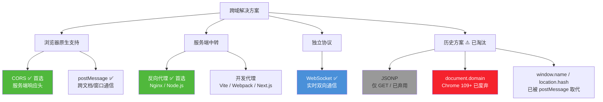
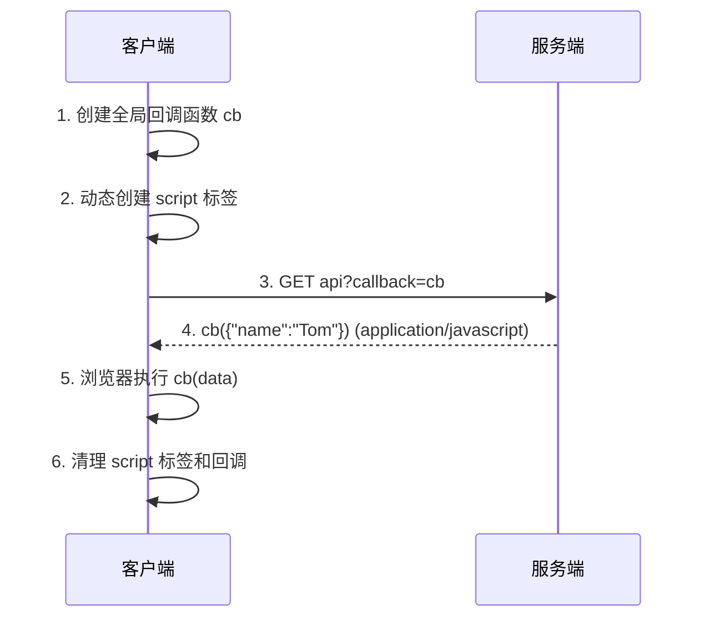
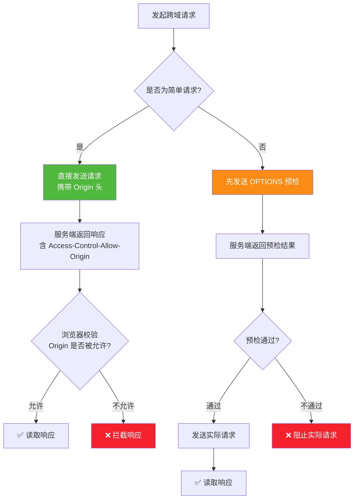
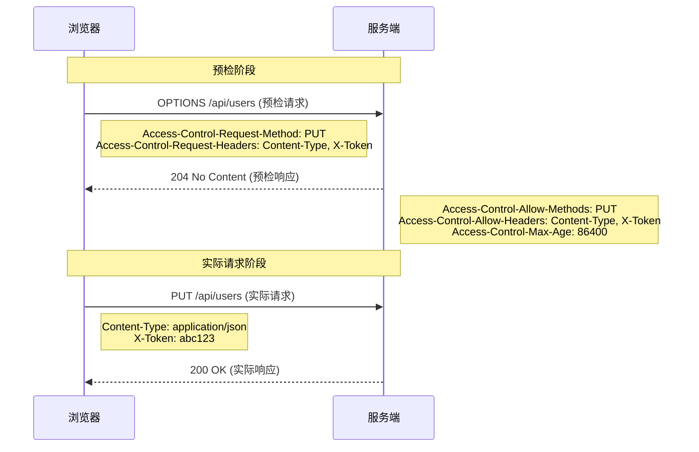
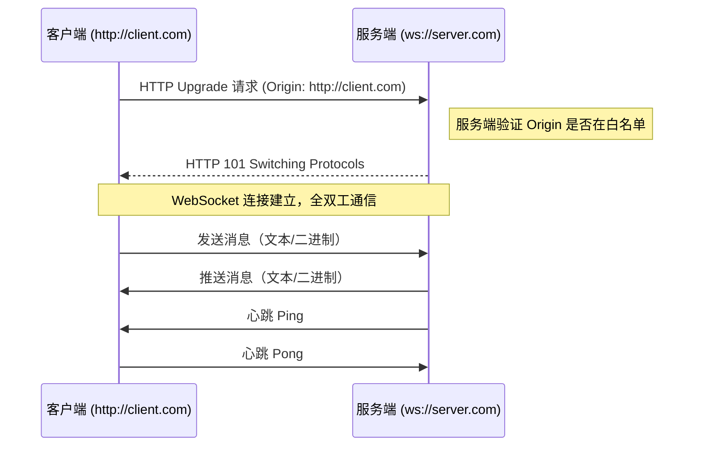
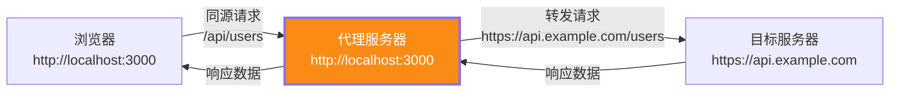
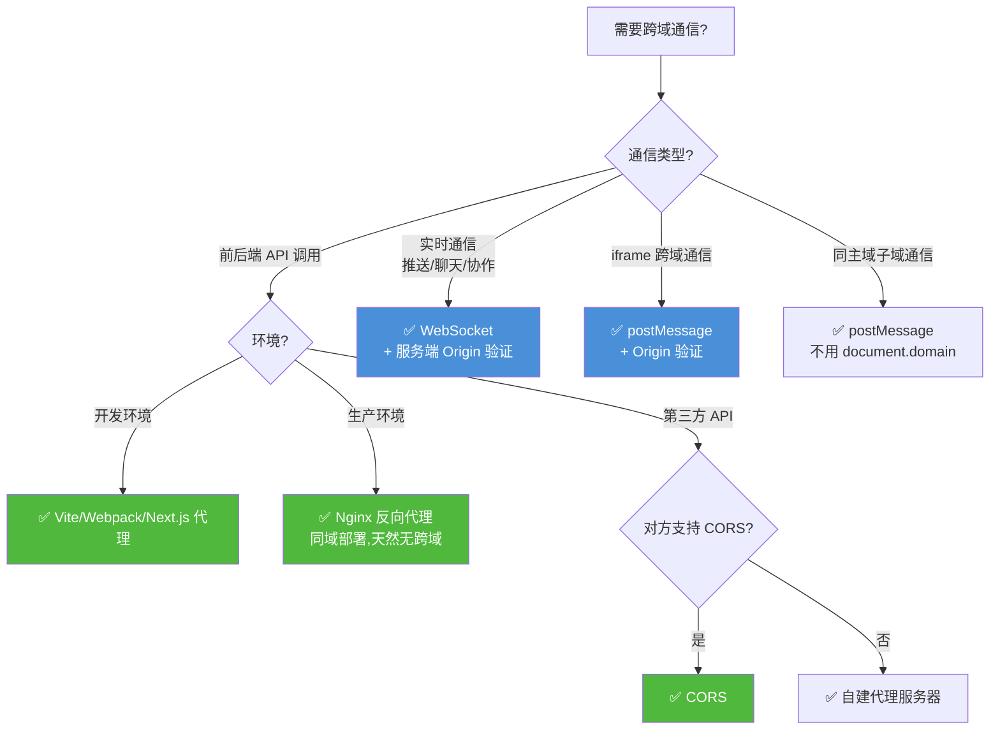

# 前端跨域解决方案完整指南

> 本文档系统梳理前端开发中所有主流跨域解决方案，涵盖实现原理、完整代码示例、浏览器兼容性、优缺点对比及最佳实践。内容已更新至 2026 年最新标准，包含现代安全头（COOP/COEP/CORP）、`SameSite` Cookie 策略、`Private Network Access` 等前沿内容，帮助开发者根据项目需求选择最合适的方案。

---

## 目录

- [一、跨域问题概述](#一跨域问题概述)
  - [1.1 什么是跨域](#11-什么是跨域)
  - [1.2 同源策略的限制范围](#12-同源策略的限制范围)
  - [1.3 跨域方案全景图](#13-跨域方案全景图)
  - [1.4 现代浏览器安全头概览](#14-现代浏览器安全头概览)
- [二、JSONP](#二jsonp)
  - [2.1 实现原理](#21-实现原理)
  - [2.2 完整实现](#22-完整实现)
  - [2.3 优缺点分析](#23-优缺点分析)
- [三、CORS（跨域资源共享）](#三cors跨域资源共享)
  - [3.1 实现原理](#31-实现原理)
  - [3.2 简单请求](#32-简单请求)
  - [3.3 预检请求（Preflight）](#33-预检请求preflight)
  - [3.4 凭证传递与 SameSite Cookie](#34-凭证传递与-samesite-cookie)
  - [3.5 各服务端配置示例](#35-各服务端配置示例)
  - [3.6 Private Network Access（私有网络访问）](#36-private-network-access私有网络访问)
  - [3.7 优缺点分析](#37-优缺点分析)
- [四、WebSocket](#四websocket)
  - [4.1 实现原理](#41-实现原理)
  - [4.2 完整实现](#42-完整实现)
  - [4.3 优缺点分析](#43-优缺点分析)
- [五、代理服务器](#五代理服务器)
  - [5.1 实现原理](#51-实现原理)
  - [5.2 开发环境代理](#52-开发环境代理)
  - [5.3 生产环境代理](#53-生产环境代理)
  - [5.4 优缺点分析](#54-优缺点分析)
- [六、postMessage](#六postmessage)
  - [6.1 实现原理](#61-实现原理)
  - [6.2 完整实现](#62-完整实现)
  - [6.3 跨域通信封装](#63-跨域通信封装)
  - [6.4 优缺点分析](#64-优缺点分析)
- [七、document.domain（已废弃）](#七documentdomain已废弃)
- [八、其他历史方案](#八其他历史方案)
  - [8.1 window.name](#81-windowname)
  - [8.2 location.hash](#82-locationhash)
- [九、方案对比总表](#九方案对比总表)
- [十、最佳实践建议](#十最佳实践建议)
  - [10.1 按场景推荐方案](#101-按场景推荐方案)
  - [10.2 安全最佳实践](#102-安全最佳实践)
  - [10.3 开发与生产环境统一策略](#103-开发与生产环境统一策略)
  - [10.4 常见问题排查清单](#104-常见问题排查清单)

---

## 一、跨域问题概述

### 1.1 什么是跨域

**同源策略（Same-Origin Policy）** 是浏览器最核心的安全机制。当两个 URL 的**协议、域名、端口**三者完全一致时，才属于同源；任一不同即为跨域。

| 对比项 | URL A | URL B | 是否同源 | 原因 |
|--------|-------|-------|----------|------|
| 案例 1 | `http://a.com/path` | `http://a.com/other` | ✅ 同源 | 仅路径不同 |
| 案例 2 | `http://a.com` | `https://a.com` | ❌ 跨域 | 协议不同 |
| 案例 3 | `http://a.com` | `http://b.com` | ❌ 跨域 | 域名不同 |
| 案例 4 | `http://a.com:80` | `http://a.com:8080` | ❌ 跨域 | 端口不同 |
| 案例 5 | `http://a.com` | `http://127.0.0.1` | ❌ 跨域 | 域名 ≠ IP |

> **注意**：同源策略是**浏览器端**的安全限制，服务端之间互相请求不存在跨域问题。跨域报错只发生在浏览器中。

### 1.2 同源策略的限制范围

| 允许（不受限制） | 限制（受同源策略保护） |
|------|------|
| `<script src="...">` 加载外部 JS（但不可读取内容） | Ajax（XMLHttpRequest / Fetch）跨域请求 |
| `<link href="...">` 加载外部 CSS | 跨域 iframe / window 的 DOM 访问 |
| `` 加载外部图片（但 canvas 读取像素受限） | `localStorage` / `sessionStorage` / `IndexedDB` 跨域访问 |
| `<video>` / `<audio>` 加载外部媒体 | `Cookie` 跨域读取（受 `SameSite` 属性影响） |
| `@font-face` 加载外部字体（需配合 CORS） | 跨域 Web Worker 模块加载 |

### 1.3 跨域方案全景图



### 1.4 现代浏览器安全头概览

现代浏览器引入了一系列安全响应头，与 CORS 配合使用可构建完整的跨域安全体系：

| 安全头 | 作用 | 典型值 | 场景 |
|--------|------|--------|------|
| `Cross-Origin-Opener-Policy` (COOP) | 隔离顶层窗口，防止跨源窗口操作 | `same-origin` | 防止 Spectre 等侧信道攻击 |
| `Cross-Origin-Embedder-Policy` (COEP) | 限制页面加载跨源资源（需 CORS） | `require-corp` | 启用 SharedArrayBuffer |
| `Cross-Origin-Resource-Policy` (CORP) | 限制资源被哪些源加载 | `same-site` | 防止跨站资源引用 |
| `Access-Control-Allow-Origin` | CORS 核心头，允许的源 | `https://a.com` | 跨域 API |
| `Content-Security-Policy` (CSP) | 限制资源加载来源 | `default-src 'self'` | 防 XSS |

> **实践建议**：生产环境应组合使用 CORS + COOP + CORP + CSP，构建纵深防御体系。

---

## 二、JSONP

### 2.1 实现原理

JSONP（JSON with Padding）利用 `<script>` 标签不受同源策略限制的特性，通过动态创建 `<script>` 标签实现跨域数据请求。服务端返回的是一个函数调用，参数即为数据。



> **⚠️ 现代定位**：JSONP 在现代开发中已基本淘汰，仅用于维护遗留系统或对接不支持 CORS 的旧 API。新项目应使用 CORS。

### 2.2 完整实现

**前端封装：**

```javascript
/**
 * JSONP 封装函数
 * @param {string} url - 请求地址
 * @param {object} params - 请求参数
 * @param {string} callbackKey - 回调函数参数名（默认 'callback'）
 * @param {number} timeout - 超时时间（毫秒，默认 10000）
 * @returns {Promise} - 返回 Promise 包装的响应数据
 */
function jsonp(url, params = {}, callbackKey = 'callback', timeout = 10000) {
  return new Promise((resolve, reject) => {
    // 1. 生成全局唯一的回调函数名
    const callbackName = `jsonp_${Date.now()}_${Math.random().toString(36).slice(2)}`;

    // 2. 将回调函数挂载到 window 上
    window[callbackName] = (data) => {
      resolve(data);
      cleanup();
    };

    // 3. 构建查询参数
    params[callbackKey] = callbackName;
    const queryString = Object.entries(params)
      .map(([key, value]) => `${encodeURIComponent(key)}=${encodeURIComponent(value)}`)
      .join('&');
    const scriptUrl = `${url}${url.includes('?') ? '&' : '?'}${queryString}`;

    // 4. 动态创建 script 标签
    const script = document.createElement('script');
    script.src = scriptUrl;

    // 5. 错误处理
    script.onerror = () => {
      reject(new Error(`JSONP request to ${url} failed`));
      cleanup();
    };

    // 6. 超时处理（JSONP 无法获取 HTTP 状态码，只能靠超时判断失败）
    const timer = setTimeout(() => {
      reject(new Error(`JSONP request to ${url} timed out`));
      cleanup();
    }, timeout);

    // 7. 清理函数：移除 script 标签、删除全局回调、清除定时器
    function cleanup() {
      clearTimeout(timer);
      if (script.parentNode) {
        script.parentNode.removeChild(script);
      }
      delete window[callbackName];
    }

    // 8. 插入 DOM，发起请求
    document.head.appendChild(script);
  });
}

// 使用示例
jsonp('https://api.example.com/user', { id: 123 })
  .then(data => console.log('获取数据:', data))
  .catch(err => console.error('请求失败:', err));
```

**服务端（Node.js Express）：**

```javascript
const express = require('express');
const app = express();

app.get('/api/user', (req, res) => {
  const callbackName = req.query.callback;
  const userId = req.query.id;

  const data = { id: userId, name: 'Tom', age: 25, email: 'tom@example.com' };

  // 返回函数调用形式的响应，Content-Type 必须是 JavaScript
  res.setHeader('Content-Type', 'application/javascript');
  res.send(`${callbackName}(${JSON.stringify(data)})`);
});

app.listen(3000);
```

**服务端（Java Spring Boot）：**

```java
@RestController
@RequestMapping("/api")
public class UserController {

    @GetMapping("/user")
    public String getUser(@RequestParam Long id,
                          @RequestParam(defaultValue = "callback") String callback) {
        User user = userService.findById(id);
        String json = new ObjectMapper().writeValueAsString(user);
        // 返回 callback(json) 格式
        return callback + "(" + json + ")";
    }
}
```

### 2.3 优缺点分析

| 维度 | 评价 | 说明 |
|------|------|------|
| 安全性 | ❌ 极低 | 存在 XSS 风险，服务端返回任意 JS 都会被执行 |
| 实用性 | ⚠️ 低 | 仅支持 GET 请求，无法发送 POST/PUT/DELETE |
| 性能 | ✅ 好 | 无额外开销，请求流程简洁 |
| 错误处理 | ❌ 差 | 无法获取 HTTP 状态码，只能通过超时判断失败 |
| 现代适用性 | ❌ 已淘汰 | 现代浏览器和 API 普遍支持 CORS，JSONP 仅用于遗留系统 |

**优点：**
- 兼容性极好，支持所有浏览器包括 IE6
- 不需要服务端额外配置（仅需支持 callback 参数）

**缺点：**
- 只支持 GET 请求
- 安全性差，服务端返回的脚本会被直接执行（XSS 风险）
- 无法捕获 HTTP 错误状态码
- 不支持请求头自定义
- 不支持异步错误处理（try-catch 无效）
- **现代项目不推荐使用，应优先使用 CORS**

---

## 三、CORS（跨域资源共享）

### 3.1 实现原理

CORS（Cross-Origin Resource Sharing）是 W3C 标准，也是**现代跨域 API 调用的首选方案**。通过服务端设置 HTTP 响应头来告知浏览器允许跨域请求。浏览器根据请求类型分为**简单请求**和**预检请求**两种处理方式。



### 3.2 简单请求

**满足以下全部条件的请求为简单请求（不触发预检）：**

| 条件 | 详细说明 |
|------|---------|
| 请求方法 | 仅限 `GET`、`HEAD`、`POST` |
| 自定义请求头 | 仅限 `Accept`、`Accept-Language`、`Content-Language`、`Content-Type`（以及 `Range`） |
| Content-Type | 仅限 `text/plain`、`multipart/form-data`、`application/x-www-form-urlencoded` |
| 其他限制 | 未使用 `ReadableStream`，未注册 `XMLHttpRequestUpload` 事件监听器 |

**前端代码（Fetch API）：**

```javascript
async function fetchUserData() {
  try {
    const response = await fetch('https://api.example.com/users', {
      method: 'GET',
      headers: {
        'Content-Type': 'application/x-www-form-urlencoded'
      },
      // 携带 Cookie（跨域默认不携带，需显式声明）
      credentials: 'include'
    });

    if (!response.ok) {
      throw new Error(`HTTP ${response.status}: ${response.statusText}`);
    }

    const data = await response.json();
    console.log('用户数据:', data);
    return data;
  } catch (error) {
    console.error('请求失败:', error);
  }
}
```

**前端代码（XMLHttpRequest，兼容旧环境）：**

```javascript
function xhrGetRequest(url) {
  return new Promise((resolve, reject) => {
    const xhr = new XMLHttpRequest();
    xhr.open('GET', url, true);

    // 携带 Cookie
    xhr.withCredentials = true;

    xhr.onload = function() {
      if (xhr.status >= 200 && xhr.status < 300) {
        resolve(JSON.parse(xhr.responseText));
      } else {
        reject(new Error(`HTTP ${xhr.status}: ${xhr.statusText}`));
      }
    };

    xhr.onerror = function() {
      reject(new Error('Network error'));
    };

    xhr.send();
  });
}
```

**服务端响应头（简单请求只需设置）：**

```javascript
// Node.js Express
app.get('/users', (req, res) => {
  // 允许指定源（生产环境必须指定具体域名，不能是 *）
  res.setHeader('Access-Control-Allow-Origin', 'https://www.example.com');
  // 允许携带 Cookie（此时 Allow-Origin 绝对不能为 *）
  res.setHeader('Access-Control-Allow-Credentials', 'true');
  // 允许客户端读取的自定义响应头
  res.setHeader('Access-Control-Expose-Headers', 'X-Total-Count, X-Custom-Header');

  const users = [{ id: 1, name: 'Tom' }, { id: 2, name: 'Jerry' }];
  res.json(users);
});
```

### 3.3 预检请求（Preflight）

不满足简单请求条件的请求（如 `Content-Type: application/json`、`PUT`/`DELETE`/`PATCH` 方法、自定义请求头），浏览器会先发送一个 **OPTIONS** 预检请求，询问服务端是否允许，通过后才发送实际请求。



**前端代码（触发预检的请求）：**

```javascript
async function updateUser(userId, userData) {
  try {
    const response = await fetch(`https://api.example.com/users/${userId}`, {
      method: 'PUT',                        // 非简单方法 → 触发预检
      headers: {
        'Content-Type': 'application/json', // 非简单类型 → 触发预检
        'X-Custom-Token': 'abc123'          // 自定义头 → 触发预检
      },
      credentials: 'include',
      body: JSON.stringify(userData)
    });

    if (!response.ok) throw new Error(`HTTP ${response.status}`);
    const data = await response.json();
    return data;
  } catch (error) {
    console.error('更新失败:', error);
    throw error;
  }
}
```

### 3.4 凭证传递与 SameSite Cookie

跨域请求默认不携带 Cookie。要携带凭证需前后端同时配置，且受 `SameSite` 属性约束：

**前端配置：**

```javascript
// Fetch API
fetch(url, { credentials: 'include' });  // 携带 Cookie

// XMLHttpRequest
xhr.withCredentials = true;

// Axios
axios.defaults.withCredentials = true;
```

**后端配置：**

```javascript
// Access-Control-Allow-Credentials: true
// 且 Access-Control-Allow-Origin 不能为 *，必须指定具体域名
res.setHeader('Access-Control-Allow-Credentials', 'true');
res.setHeader('Access-Control-Allow-Origin', 'https://www.example.com'); // 不能是 *
```

**`SameSite` Cookie 属性（关键约束）：**

| SameSite 值 | 行为 | 跨域是否携带 | 适用场景 |
|-------------|------|:----------:|---------|
| `Strict` | 仅同源发送 Cookie | ❌ 不携带 | 敏感操作（如银行） |
| `Lax`（默认） | 顶层导航时发送，其他不发送 | ❌ 不携带（Ajax 不携带） | 一般网站（Chrome 默认） |
| `None` | 跨域发送 Cookie | ✅ 携带（需 `Secure`） | 跨域 SSO、第三方嵌入 |

```http
# 跨域携带 Cookie 必须这样设置：
Set-Cookie: sessionId=abc123; SameSite=None; Secure; HttpOnly
```

> **⚠️ 关键注意**：Chrome 80+ 默认 `SameSite=Lax`，跨域 Ajax 请求**不会携带 Cookie**。若需跨域携带 Cookie，服务端必须显式设置 `SameSite=None; Secure`，且前端使用 HTTPS。

### 3.5 各服务端配置示例

**Node.js Express 完整 CORS 中间件：**

```javascript
// CORS 中间件（生产可用）
app.use((req, res, next) => {
  const allowedOrigins = ['https://www.example.com', 'https://admin.example.com'];
  const origin = req.headers.origin;

  // 动态设置允许的源（不使用 *，支持多域名）
  if (allowedOrigins.includes(origin)) {
    res.setHeader('Access-Control-Allow-Origin', origin);
    // 允许携带凭证时，Vary 头必须包含 Origin（防止 CDN 缓存错误的响应）
    res.setHeader('Vary', 'Origin');
  }

  res.setHeader('Access-Control-Allow-Credentials', 'true');
  res.setHeader('Access-Control-Allow-Methods', 'GET, POST, PUT, DELETE, PATCH, OPTIONS');
  res.setHeader('Access-Control-Allow-Headers', 'Content-Type, Authorization, X-Custom-Token');
  res.setHeader('Access-Control-Expose-Headers', 'X-Total-Count, X-Request-Id');
  // 预检结果缓存 24 小时，减少 OPTIONS 请求
  res.setHeader('Access-Control-Max-Age', '86400');

  // OPTIONS 预检请求直接返回 204
  if (req.method === 'OPTIONS') {
    return res.sendStatus(204);
  }

  next();
});
```

**Java Spring Boot 配置：**

```java
@Configuration
public class CorsConfig implements WebMvcConfigurer {

    @Override
    public void addCorsMappings(CorsRegistry registry) {
        registry.addMapping("/api/**")
            .allowedOrigins("https://www.example.com", "https://admin.example.com")
            .allowedMethods("GET", "POST", "PUT", "DELETE", "PATCH", "OPTIONS")
            .allowedHeaders("*")
            .exposedHeaders("X-Total-Count", "X-Request-Id")
            .allowCredentials(true)  // 等价于 Allow-Credentials: true
            .maxAge(86400);          // 预检缓存 24 小时
    }
}
```

**Spring Boot 5.3+ 全局 CORS 配置（推荐）：**

```java
@Configuration
public class GlobalCorsConfig {

    @Bean
    public CorsConfigurationSource corsConfigurationSource() {
        CorsConfiguration config = new CorsConfiguration();
        config.setAllowedOrigins(List.of("https://www.example.com"));
        config.setAllowedMethods(List.of("GET", "POST", "PUT", "DELETE", "OPTIONS"));
        config.setAllowedHeaders(List.of("*"));
        config.setAllowCredentials(true);
        config.setMaxAge(86400L);

        UrlBasedCorsConfigurationSource source = new UrlBasedCorsConfigurationSource();
        source.registerCorsConfiguration("/api/**", config);
        return source;
    }

    @Bean
    public CorsFilter corsFilter(CorsConfigurationSource source) {
        return new CorsFilter(source);
    }
}
```

**Nginx 配置 CORS：**

```nginx
# /etc/nginx/conf.d/api.conf
server {
    listen 80;
    server_name api.example.com;

    location /api/ {
        # 动态设置允许的源（正则匹配白名单）
        if ($http_origin ~* "^https://(www|admin)\.example\.com$") {
            add_header 'Access-Control-Allow-Origin' '$http_origin' always;
            add_header 'Access-Control-Allow-Credentials' 'true' always;
            add_header 'Access-Control-Allow-Methods' 'GET, POST, PUT, DELETE, PATCH, OPTIONS' always;
            add_header 'Access-Control-Allow-Headers' 'Content-Type, Authorization, X-Custom-Token' always;
            add_header 'Access-Control-Max-Age' '86400' always;
            add_header 'Vary' 'Origin' always;
        }

        # 预检请求直接返回 204
        if ($request_method = 'OPTIONS') {
            return 204;
        }

        proxy_pass http://backend:8080;
    }
}
```

> **注意**：Nginx 使用 `add_header` 时必须加 `always`，否则在 4xx/5xx 响应中不会携带 CORS 头，导致前端无法读取错误信息。

### 3.6 Private Network Access（私有网络访问）

Chrome 104+ 引入 **Private Network Access (PNA)**（原 CORS-RFC1918），限制公网页面直接访问私有网络（localhost / 内网 IP）的请求，防止恶意网站攻击内网服务。

| 请求来源 | 目标 | 是否允许 | 额外要求 |
|---------|------|:-------:|---------|
| 公网页面 → 公网 API | 正常 | ✅ | 标准 CORS |
| 公网页面 → 内网/localhost | 受限 | ⚠️ | 需目标返回 `Access-Control-Allow-Private-Network: true` |
| 内网页面 → 内网 | 正常 | ✅ | 标准 CORS |

```javascript
// 公网页面访问本地开发服务器，需服务端额外设置：
// Node.js 本地开发服务器
app.use((req, res, next) => {
  res.setHeader('Access-Control-Allow-Private-Network', 'true');
  res.setHeader('Access-Control-Allow-Origin', '*');
  next();
});
```

> **影响场景**：本地开发时，前端部署在公网测试环境但需访问本地后端服务时会触发 PNA 限制。建议开发环境统一使用代理服务器方案（见第五节）。

### 3.7 优缺点分析

| 维度 | 评价 | 说明 |
|------|------|------|
| 安全性 | ✅ 高 | 服务端精确控制允许的源、方法、头，W3C 标准 |
| 实用性 | ✅ 高 | 支持所有 HTTP 方法，支持自定义请求头 |
| 性能 | ⚠️ 中 | 非简单请求有预检开销，可通过 `Max-Age` 优化 |
| 前后端改动 | ⚠️ 中 | 服务端需要配置 CORS 响应头，前端改造量小 |
| 适用场景 | 广泛 | 前后端分离项目、跨域 API 调用、第三方服务集成 |

**优点：**
- W3C 标准，所有现代浏览器原生支持
- 支持所有 HTTP 方法（GET/POST/PUT/DELETE/PATCH）
- 服务端精确控制，安全性高
- 支持自定义请求头和 Cookie 携带

**缺点：**
- 非简单请求有额外预检开销（可通过 `Max-Age` 缓存优化）
- 需要服务端配合配置
- `Allow-Origin: *` 时无法携带 Cookie（必须指定具体域名）
- 跨域携带 Cookie 受 `SameSite` 属性限制

---

## 四、WebSocket

### 4.1 实现原理

WebSocket 是 HTML5 的独立通信协议（`ws://` / `wss://`），它在建立连接时使用 HTTP Upgrade 握手，建立后转为独立的 WebSocket 协议进行全双工通信。

> **⚠️ 重要澄清**：WebSocket 握手时**会携带 `Origin` 请求头**，浏览器虽然不通过同源策略拦截 WebSocket，但**服务端必须自行验证 `Origin`** 以防止跨站 WebSocket 劫持攻击（CSWSH）。不验证 Origin 的 WebSocket 服务端存在安全漏洞。



### 4.2 完整实现

**前端代码（含自动重连 + 心跳）：**

```javascript
/**
 * WebSocket 客户端封装
 * 支持自动重连、心跳检测、事件监听、消息队列
 */
class WebSocketClient {
  constructor(url, options = {}) {
    this.url = url;
    this.ws = null;
    this.reconnectInterval = options.reconnectInterval || 3000;
    this.maxReconnectAttempts = options.maxReconnectAttempts || 5;
    this.reconnectAttempts = 0;
    this.heartbeatInterval = options.heartbeatInterval || 30000;
    this.listeners = new Map();
    this.messageQueue = [];   // 连接未就绪时的消息队列
    this.heartbeatTimer = null;
    this.connect();
  }

  /** 建立 WebSocket 连接 */
  connect() {
    this.ws = new WebSocket(this.url);

    this.ws.onopen = () => {
      console.log('[WS] 连接已建立');
      this.reconnectAttempts = 0;
      this._startHeartbeat();
      // 发送排队消息
      while (this.messageQueue.length > 0) {
        this.ws.send(this.messageQueue.shift());
      }
      this._emit('open');
    };

    this.ws.onmessage = (event) => {
      try {
        const data = JSON.parse(event.data);
        this._emit('message', data);
      } catch (e) {
        this._emit('message', event.data); // 非JSON消息直接传递
      }
    };

    this.ws.onerror = (error) => {
      console.error('[WS] 错误:', error);
      this._emit('error', error);
    };

    this.ws.onclose = (event) => {
      console.log(`[WS] 连接关闭: code=${event.code}, reason=${event.reason}`);
      this._stopHeartbeat();
      this._emit('close', event);
      this._attemptReconnect();
    };
  }

  /** 发送消息（连接未就绪时自动排队） */
  send(data) {
    const payload = typeof data === 'string' ? data : JSON.stringify(data);
    if (this.ws && this.ws.readyState === WebSocket.OPEN) {
      this.ws.send(payload);
    } else {
      console.warn('[WS] 连接未就绪，消息已排队');
      this.messageQueue.push(payload);
    }
  }

  /** 主动关闭连接 */
  close(code = 1000, reason = '') {
    this.reconnectAttempts = this.maxReconnectAttempts; // 阻止自动重连
    this._stopHeartbeat();
    if (this.ws) {
      this.ws.close(code, reason);
    }
  }

  /** 注册事件监听 */
  on(event, callback) {
    if (!this.listeners.has(event)) {
      this.listeners.set(event, []);
    }
    this.listeners.get(event).push(callback);
  }

  /** 移除事件监听 */
  off(event, callback) {
    const callbacks = this.listeners.get(event);
    if (callbacks) {
      const index = callbacks.indexOf(callback);
      if (index > -1) callbacks.splice(index, 1);
    }
  }

  /** 心跳检测 */
  _startHeartbeat() {
    this.heartbeatTimer = setInterval(() => {
      if (this.ws && this.ws.readyState === WebSocket.OPEN) {
        this.ws.send(JSON.stringify({ type: 'ping', timestamp: Date.now() }));
      }
    }, this.heartbeatInterval);
  }

  _stopHeartbeat() {
    if (this.heartbeatTimer) {
      clearInterval(this.heartbeatTimer);
      this.heartbeatTimer = null;
    }
  }

  /** 自动重连（指数退避） */
  _attemptReconnect() {
    if (this.reconnectAttempts >= this.maxReconnectAttempts) {
      console.log('[WS] 达到最大重连次数，停止重连');
      this._emit('reconnect_failed');
      return;
    }
    this.reconnectAttempts++;
    const delay = this.reconnectInterval * Math.pow(1.5, this.reconnectAttempts - 1);
    console.log(`[WS] 第 ${this.reconnectAttempts} 次重连，${delay}ms 后执行...`);
    setTimeout(() => this.connect(), delay);
  }

  _emit(event, ...args) {
    const callbacks = this.listeners.get(event) || [];
    callbacks.forEach(cb => cb(...args));
  }
}

// 使用示例
const ws = new WebSocketClient('wss://api.example.com/ws', {
  reconnectInterval: 5000,
  maxReconnectAttempts: 3,
  heartbeatInterval: 30000
});

ws.on('open', () => ws.send({ type: 'subscribe', channel: 'news' }));
ws.on('message', (data) => console.log('收到推送:', data));
ws.on('close', () => console.log('连接已关闭'));
```

**服务端（Node.js ws 库，含 Origin 验证 + 心跳）：**

```javascript
const WebSocket = require('ws');

const wss = new WebSocket.Server({ port: 8080 });

// 允许的源白名单（安全关键：必须验证 Origin）
const ALLOWED_ORIGINS = ['https://www.example.com', 'https://admin.example.com'];

wss.on('connection', (ws, req) => {
  const origin = req.headers.origin;

  // 安全关键：验证 Origin，防止跨站 WebSocket 劫持
  if (!ALLOWED_ORIGINS.includes(origin)) {
    console.warn(`[WS] 拒绝来自 ${origin} 的连接`);
    ws.close(4001, 'Origin not allowed');
    return;
  }

  console.log(`[WS] 新连接: ${origin}, 当前连接数: ${wss.clients.size}`);

  // 发送欢迎消息
  ws.send(JSON.stringify({ type: 'connected', message: '连接成功', timestamp: Date.now() }));

  // 接收消息
  ws.on('message', (data) => {
    try {
      const message = JSON.parse(data);
      if (message.type === 'subscribe') {
        ws.channel = message.channel;
        ws.send(JSON.stringify({ type: 'subscribed', channel: message.channel }));
      }
    } catch (e) {
      console.error('[WS] 消息解析错误:', e);
    }
  });

  // 心跳检测
  ws.isAlive = true;
  ws.on('pong', () => { ws.isAlive = true; });

  ws.on('close', (code, reason) => {
    console.log(`[WS] 连接关闭: ${code} - ${reason}`);
  });
});

// 服务端心跳定时器：定期检测连接存活
const heartbeat = setInterval(() => {
  wss.clients.forEach((ws) => {
    if (!ws.isAlive) return ws.terminate();
    ws.isAlive = false;
    ws.ping();
  });
}, 30000);

wss.on('close', () => clearInterval(heartbeat));
```

### 4.3 优缺点分析

| 维度 | 评价 | 说明 |
|------|------|------|
| 安全性 | ✅ 高 | 服务端验证 Origin，`wss://` 提供加密传输 |
| 实用性 | ✅ 高 | 全双工通信，适合实时数据推送 |
| 性能 | ✅ 优 | 长连接，无 HTTP 头开销，消息帧仅 2-14 字节 |
| 适用场景 | 特定 | 实时通信（聊天、推送、协作编辑、实时图表） |

**优点：**
- 全双工通信，服务端可主动推送
- 消息帧开销小（2-14 字节），延迟低
- 支持二进制数据传输
- 连接建立后不受同源策略限制（但服务端应验证 Origin）

**缺点：**
- 需要服务端支持 WebSocket 协议
- 长连接需要处理断线重连、心跳检测
- 代理和负载均衡器需额外配置 Upgrade 支持
- 不适合短连接、低频请求场景

---

## 五、代理服务器

### 5.1 实现原理

代理服务器方案通过同源的服务端转发请求，绕过浏览器的同源策略限制。浏览器请求同源的代理服务器，代理服务器再转发到目标服务器。这是**生产环境和开发环境最常用的跨域方案**。



> **核心优势**：前端零改动，所有请求类型都支持，浏览器完全无感知。

### 5.2 开发环境代理

**Vite 配置（vite.config.ts）：**

```typescript
import { defineConfig } from 'vite';

export default defineConfig({
  server: {
    port: 3000,
    proxy: {
      // 代理 /api 开头的请求
      '/api': {
        target: 'https://api.example.com',
        changeOrigin: true,        // 修改请求头中的 Origin 为目标地址
        rewrite: (path) => path.replace(/^\/api/, ''), // 去掉 /api 前缀
        secure: false,             // 忽略 HTTPS 证书验证（开发环境）
        configure: (proxy) => {
          proxy.on('error', (err) => console.error('[Proxy Error]', err));
          proxy.on('proxyReq', (proxyReq) => {
            proxyReq.setHeader('X-Proxy-By', 'Vite');
          });
        }
      },
      // 代理多个服务
      '/auth': {
        target: 'https://auth.example.com',
        changeOrigin: true
      }
    }
  }
});
```

**Webpack 配置（webpack.config.js）：**

```javascript
module.exports = {
  devServer: {
    port: 3000,
    proxy: {
      '/api': {
        target: 'https://api.example.com',
        changeOrigin: true,
        pathRewrite: { '^/api': '' }
      }
    }
  }
};
```

**Create React App 配置（src/setupProxy.js）：**

```javascript
const { createProxyMiddleware } = require('http-proxy-middleware');

module.exports = function(app) {
  app.use(
    '/api',
    createProxyMiddleware({
      target: 'https://api.example.com',
      changeOrigin: true,
      pathRewrite: { '^/api': '' }
    })
  );
};
```

**Next.js 配置（next.config.js）：**

```javascript
/** @type {import('next').NextConfig} */
const nextConfig = {
  async rewrites() {
    return [
      {
        source: '/api/:path*',
        destination: 'https://api.example.com/:path*',
      },
      {
        source: '/auth/:path*',
        destination: 'https://auth.example.com/:path*',
      },
    ];
  },
};

module.exports = nextConfig;
```

### 5.3 生产环境代理

**Nginx 反向代理（生产环境标准方案）：**

```nginx
server {
    listen 80;
    server_name www.example.com;

    # 前端静态资源
    location / {
        root /var/www/dist;
        try_files $uri $uri/ /index.html;  # SPA 路由回退
    }

    # API 代理（前端请求 /api/xxx → 后端 :8080/xxx）
    location /api/ {
        proxy_pass http://backend:8080/;
        proxy_set_header Host $host;
        proxy_set_header X-Real-IP $remote_addr;
        proxy_set_header X-Forwarded-For $proxy_add_x_forwarded_for;
        proxy_set_header X-Forwarded-Proto $scheme;

        # 超时设置
        proxy_connect_timeout 30s;
        proxy_read_timeout 60s;
        proxy_send_timeout 30s;
    }

    # WebSocket 代理（需特殊配置 Upgrade）
    location /ws/ {
        proxy_pass http://backend:8080;
        proxy_http_version 1.1;
        proxy_set_header Upgrade $http_upgrade;
        proxy_set_header Connection "upgrade";
        proxy_set_header Host $host;
        proxy_read_timeout 86400;  # WebSocket 长连接超时
    }
}
```

> **生产环境最佳实践**：前端静态资源与 API 统一部署在同一域名下（通过 Nginx 反向代理），天然无跨域问题。CORS 仅在需要第三方跨域调用时才额外配置。

**Node.js 中间件代理（灵活方案）：**

```javascript
const express = require('express');
const { createProxyMiddleware } = require('http-proxy-middleware');

const app = express();

// 静态文件托管
app.use(express.static('dist'));

// API 代理中间件
app.use('/api', createProxyMiddleware({
  target: 'https://api.example.com',
  changeOrigin: true,
  pathRewrite: { '^/api': '' },
  onError: (err, req, res) => {
    console.error('[Proxy Error]', err.message);
    res.status(502).json({ error: '代理请求失败', message: err.message });
  },
  onProxyReq: (proxyReq, req) => {
    // 转发认证信息
    if (req.headers.authorization) {
      proxyReq.setHeader('Authorization', req.headers.authorization);
    }
  },
  onProxyRes: (proxyRes, req) => {
    console.log(`[Proxy] ${req.method} ${req.url} → ${proxyRes.statusCode}`);
  }
}));

app.listen(3000, () => console.log('Server running on http://localhost:3000'));
```

### 5.4 优缺点分析

| 维度 | 评价 | 说明 |
|------|------|------|
| 安全性 | ✅ 高 | 请求在同源间转发，浏览器无感知 |
| 实用性 | ✅ 高 | 前端零改动，所有请求类型都支持 |
| 性能 | ⚠️ 中 | 多一层转发，增加少量延迟（通常 <5ms） |
| 适用场景 | 广泛 | 开发环境标配，生产环境静态资源与 API 同域部署 |

**优点：**
- 前端无需任何改动，完全透明
- 无浏览器兼容性问题
- 支持所有 HTTP 方法和请求头
- Nginx 方案性能优秀，可承载大量并发
- 生产环境同域部署可完全避免跨域问题

**缺点：**
- 需要额外的服务器运维
- 增加一层网络跳转，有轻微延迟
- 代理服务器可能成为单点（需高可用方案）
- 开发环境与生产环境配置需保持一致

---

## 六、postMessage

### 6.1 实现原理

`window.postMessage` 是 HTML5 提供的跨文档通信 API，允许不同源的窗口（iframe、弹出窗口、Worker）之间安全地传递消息。这是**跨窗口通信的标准方案**。

```mermaid
flowchart LR
    P[父页面<br/>http://a.com] -->|postMessage(data, targetOrigin)| I[iframe<br/>http://b.com]
    I -->|window.addEventListener message| I
    I -->|parent.postMessage(data, targetOrigin)| P
    P -->|window.addEventListener message| P
    
    style P fill:#4a90d9,color:#fff
    style I fill:#fa8c16,color:#fff
```

> **关键安全点**：发送消息时必须指定 `targetOrigin`（目标源），接收消息时必须验证 `event.origin`（来源源），否则存在安全风险。

### 6.2 完整实现

**父页面（http://parent.com）：**

```html
<!DOCTYPE html>
<html>
<head>
  <title>父页面</title>
</head>
<body>
  <h1>父页面 (http://parent.com)</h1>
  <button onclick="sendMessage()">发送消息给 iframe</button>
  <div id="response"></div>

  <iframe id="childFrame" src="http://child.com/child.html"
          width="400" height="300"></iframe>

  <script>
    const iframe = document.getElementById('childFrame');
    const responseDiv = document.getElementById('response');

    // 监听来自 iframe 的消息
    window.addEventListener('message', (event) => {
      // 安全校验：验证消息来源（必须做）
      if (event.origin !== 'http://child.com') {
        console.warn('拒绝来自未知源的消息:', event.origin);
        return;
      }

      console.log('收到 iframe 消息:', event.data);
      if (event.data.type === 'response') {
        responseDiv.textContent = `子页面回复: ${event.data.payload}`;
      }
    });

    // 发送消息给 iframe（必须指定 targetOrigin）
    function sendMessage() {
      iframe.contentWindow.postMessage(
        { type: 'request', payload: 'Hello from parent', timestamp: Date.now() },
        'http://child.com'  // 指定目标源，增强安全性（不用 *）
      );
    }

    // iframe 加载完成后发送初始化消息
    iframe.addEventListener('load', () => {
      iframe.contentWindow.postMessage(
        { type: 'init', payload: 'Parent page loaded' },
        'http://child.com'
      );
    });
  </script>
</body>
</html>
```

**子页面（http://child.com）：**

```html
<!DOCTYPE html>
<html>
<head>
  <title>子页面</title>
</head>
<body>
  <h1>子页面 (http://child.com)</h1>
  <div id="received"></div>
  <button onclick="replyToParent()">回复父页面</button>

  <script>
    const receivedDiv = document.getElementById('received');

    // 监听来自父页面的消息
    window.addEventListener('message', (event) => {
      // 安全校验：验证来源
      if (event.origin !== 'http://parent.com') {
        console.warn('拒绝来自未知源的消息:', event.origin);
        return;
      }

      console.log('收到父页面消息:', event.data);
      receivedDiv.textContent = `收到: ${JSON.stringify(event.data)}`;
    });

    // 回复父页面
    function replyToParent() {
      window.parent.postMessage(
        { type: 'response', payload: 'Hello from child', timestamp: Date.now() },
        'http://parent.com'  // 指定目标源
      );
    }
  </script>
</body>
</html>
```

### 6.3 跨域通信封装

```javascript
/**
 * 安全的跨域消息通信封装
 * 支持：事件监听、RPC 风格的请求-响应、超时处理、来源验证
 */
class CrossOriginMessenger {
  constructor(targetWindow, targetOrigin) {
    this.targetWindow = targetWindow;
    this.targetOrigin = targetOrigin;
    this.allowedOrigins = new Set([targetOrigin]);
    this.listeners = new Map();
    this.pendingRequests = new Map();

    this._handleMessage = this._handleMessage.bind(this);
    window.addEventListener('message', this._handleMessage);
  }

  /** 发送消息（单向，无需响应） */
  send(type, payload) {
    const message = { type, payload, id: this._generateId() };
    this.targetWindow.postMessage(message, this.targetOrigin);
    return message.id;
  }

  /** 发送请求并等待响应（RPC 风格） */
  request(type, payload, timeout = 5000) {
    return new Promise((resolve, reject) => {
      const id = this._generateId();
      const message = { type, payload, id, isRequest: true };

      const timer = setTimeout(() => {
        this.pendingRequests.delete(id);
        reject(new Error(`Request "${type}" timed out after ${timeout}ms`));
      }, timeout);

      this.pendingRequests.set(id, { resolve, reject, timer });
      this.targetWindow.postMessage(message, this.targetOrigin);
    });
  }

  /** 注册消息处理器 */
  on(type, handler) {
    if (!this.listeners.has(type)) {
      this.listeners.set(type, []);
    }
    this.listeners.get(type).push(handler);
  }

  /** 添加允许的来源 */
  allowOrigin(origin) {
    this.allowedOrigins.add(origin);
  }

  /** 处理接收到的消息 */
  _handleMessage(event) {
    // 来源验证（安全关键）
    if (!this.allowedOrigins.has(event.origin)) {
      console.warn(`[Messenger] 拒绝来自 ${event.origin} 的消息`);
      return;
    }

    const { type, payload, id, isRequest } = event.data || {};

    // 处理 RPC 响应
    if (id && this.pendingRequests.has(id)) {
      const { resolve, timer } = this.pendingRequests.get(id);
      clearTimeout(timer);
      this.pendingRequests.delete(id);
      resolve(payload);
      return;
    }

    // 处理 RPC 请求
    if (isRequest) {
      const handlers = this.listeners.get(type) || [];
      Promise.all(handlers.map(h => h(payload)))
        .then(results => {
          this.targetWindow.postMessage(
            { type: `${type}:response`, payload: results[0], id },
            this.targetOrigin
          );
        });
      return;
    }

    // 处理普通消息
    const handlers = this.listeners.get(type) || [];
    handlers.forEach(handler => handler(payload));
  }

  _generateId() {
    return `${Date.now()}_${Math.random().toString(36).slice(2, 9)}`;
  }

  /** 销毁 */
  destroy() {
    window.removeEventListener('message', this._handleMessage);
    this.pendingRequests.forEach(({ timer, reject }) => {
      clearTimeout(timer);
      reject(new Error('Messenger destroyed'));
    });
    this.pendingRequests.clear();
    this.listeners.clear();
  }
}

// 使用示例
const messenger = new CrossOriginMessenger(iframe.contentWindow, 'http://child.com');

// 监听消息
messenger.on('userData', (data) => {
  console.log('收到子页面用户数据:', data);
});

// RPC 请求（等待响应）
messenger.request('getUserInfo', { userId: 123 })
  .then(userInfo => console.log('获取到用户信息:', userInfo))
  .catch(err => console.error('请求失败:', err));

// 页面卸载时清理
window.addEventListener('beforeunload', () => messenger.destroy());
```

### 6.4 优缺点分析

| 维度 | 评价 | 说明 |
|------|------|------|
| 安全性 | ✅ 高 | 可精确指定目标源，双向验证 |
| 实用性 | ✅ 高 | 支持双向通信，可传递结构化数据 |
| 性能 | ✅ 好 | 异步通信，不阻塞主线程 |
| 适用场景 | 特定 | iframe 跨域通信、多窗口协作、第三方嵌入 |

**优点：**
- 浏览器原生支持，无需额外库
- 双向通信，支持传递结构化对象（自动序列化）
- 精确的源验证，安全性高
- 支持 RPC 风格的请求-响应模式

**缺点：**
- 仅适用于窗口间通信（iframe / 弹出窗口 / Worker）
- 需要双方页面配合实现
- 不适合与纯 API 服务端通信
- 消息大小有限制（各浏览器不同）

---

## 七、document.domain（已废弃）

> **⚠️ 严重警告**：`document.domain` 已在 **Chrome 109+** 中被废弃（默认不可用）。现代项目**不要使用**此方案，应改用 `postMessage`。仅当维护遗留系统且无法修改代码时，可通过设置 `Origin-Agent-Cluster: ?0` 响应头临时恢复。

**历史用途**：用于解决**主域相同、子域不同**的页面间跨域问题。将两个页面的 `document.domain` 设置为相同的主域后，即可互相访问 DOM。

```javascript
// ❌ 已废弃，不要在新项目中使用
// 页面 A (a.example.com) 和 页面 B (b.example.com) 都设置：
document.domain = 'example.com';

// 之后即可互相访问 DOM（Chrome 109+ 已不可用）
```

| 限制项 | 说明 |
|--------|------|
| 废弃状态 | Chrome 109+ 默认禁用，Firefox 逐步跟进 |
| 临时恢复 | 服务端返回 `Origin-Agent-Cluster: ?0` 头可临时恢复（不推荐） |
| 安全风险 | 设置后子域间隔离被打破，存在安全漏洞 |
| 现代替代 | 使用 `postMessage` 实现跨域通信 |

> **结论**：此方案已过时，所有新项目应使用 `postMessage` 替代。仅在维护无法修改的遗留代码时，可临时设置 `Origin-Agent-Cluster: ?0` 恢复功能。

---

## 八、其他历史方案

> 以下方案在现代开发中**已被 `postMessage` 完全取代**，仅作了解，不推荐使用。

### 8.1 window.name

`window.name` 属性在页面跳转时保持不变（最大 2MB），曾用于实现跨域数据传输。需要借助同源代理页面中转，实现复杂且不安全，已被 `postMessage` 完全取代。

**局限性**：需要同源代理页面、实现复杂、数据可被中间页面读取、已淘汰。

### 8.2 location.hash

通过修改 URL 的 hash 片段在不同源的 iframe 间传递数据。受 URL 长度限制（约 2KB），只能单向传递，已不推荐使用。

**局限性**：数据量受 URL 长度限制、只能传递字符串、已淘汰。

---

## 九、方案对比总表

| 方案 | 原理 | 安全性 | 实用性 | 性能 | 现代状态 | 适用场景 | 推荐度 |
|------|------|:------:|:------:|:----:|:--------:|----------|:------:|
| **CORS** | 服务端响应头 | ✅ 高 | ✅ 高 | ⚠️ 中 | ✅ 标准方案 | 前后端分离 API | ⭐⭐⭐⭐⭐ |
| **代理服务器** | 服务端转发 | ✅ 高 | ✅ 高 | ⚠️ 中 | ✅ 标准方案 | 开发+生产环境 | ⭐⭐⭐⭐⭐ |
| **postMessage** | 跨文档通信 | ✅ 高 | ✅ 高 | ✅ 好 | ✅ 标准方案 | iframe/窗口通信 | ⭐⭐⭐⭐⭐ |
| **WebSocket** | 独立协议 | ✅ 高 | ✅ 高 | ✅ 优 | ✅ 实时通信 | 推送/聊天/协作 | ⭐⭐⭐⭐ |
| **JSONP** | `<script>` 标签 | ❌ 低 | ⚠️ 低 | ✅ 好 | ⚠️ 已淘汰 | 遗留系统/旧 API | ⭐ |
| **document.domain** | 主域降级 | ❌ 低 | ❌ 低 | ✅ 好 | ❌ 已废弃 | 仅遗留维护 | ⭐ |
| **window.name** | 窗口属性 | ⚠️ 低 | ❌ 低 | ⚠️ 中 | ❌ 已淘汰 | 不推荐使用 | ⭐ |
| **location.hash** | URL hash | ⚠️ 低 | ❌ 低 | ⚠️ 中 | ❌ 已淘汰 | 不推荐使用 | ⭐ |

---

## 十、最佳实践建议

### 10.1 按场景推荐方案



**一句话选择建议：**

| 场景 | 首选方案 | 备选方案 |
|------|---------|---------|
| 开发环境跨域 | Vite/Webpack/Next.js 代理 | — |
| 生产环境跨域 | Nginx 反向代理（同域部署） | CORS |
| 第三方 API 调用 | CORS（对方支持时） | 自建代理服务器 |
| 实时推送/聊天 | WebSocket + Origin 验证 | SSE（Server-Sent Events） |
| iframe 跨域通信 | postMessage + Origin 验证 | — |
| 遗留系统维护 | JSONP（仅 GET） | 自建代理服务器 |

### 10.2 安全最佳实践

| 实践 | 说明 | 示例 |
|------|------|------|
| **精确指定 Origin** | CORS 不使用 `*`，明确列出允许的域名 | `Allow-Origin: https://www.example.com` |
| **添加 Vary: Origin** | 防止 CDN 缓存错误的 CORS 响应 | `Vary: Origin` |
| **验证 postMessage 来源** | 接收消息时始终验证 `event.origin` | `if (event.origin !== 'https://a.com') return;` |
| **指定 postMessage 目标** | 发送时指定 `targetOrigin`，不用 `*` | `postMessage(data, 'https://b.com')` |
| **验证 WebSocket Origin** | 服务端验证 Origin 请求头 | 白名单校验 |
| **设置 SameSite Cookie** | 跨域 Cookie 设 `SameSite=None; Secure` | `Set-Cookie: ...; SameSite=None; Secure` |
| **使用 HTTPS** | 生产环境强制 HTTPS，避免中间人攻击 | `wss://` / `https://` |
| **最小权限** | 仅开放必要的 HTTP 方法和请求头 | `Allow-Methods: GET, POST` |
| **组合安全头** | 配合 COOP/COEP/CORP/CSP | 纵深防御 |

### 10.3 开发与生产环境统一策略

```
开发环境：
  Vite proxy / Webpack devServer proxy / Next.js rewrites
  → 前端本地开发，代理转发到后端 API
  → 无需配置 CORS，前端零改动

测试环境：
  Nginx 反向代理 + CORS 配置
  → 模拟生产部署方式，提前验证跨域配置

生产环境：
  Nginx 反向代理（同域部署）
  → 前端静态资源与 API 同域，天然无跨域
  + CORS 配置（仅第三方跨域调用需要）
  + COOP/COOP/CSP 安全头
```

> **核心原则**：生产环境尽量通过 Nginx 同域部署避免跨域，CORS 仅作为第三方调用的补充方案。开发环境通过构建工具代理保持与生产环境一致的请求路径。

### 10.4 常见问题排查清单

| 问题现象 | 排查方向 | 解决方法 |
|---------|---------|---------|
| CORS 报错 "No 'Access-Control-Allow-Origin' header" | 服务端未设置 CORS 头 | 检查服务端/Nginx 是否返回 `Access-Control-Allow-Origin` |
| CORS 报错 "Credentials flag is true, but Allow-Origin is *" | 携带凭证时不能用 `*` | 改为具体域名：`Allow-Origin: https://www.example.com` |
| 跨域请求不携带 Cookie | `SameSite` 默认为 `Lax` | 服务端设 `SameSite=None; Secure`，前端 `credentials: 'include'` |
| 自定义请求头被拦截 | `Allow-Headers` 未包含该头 | 添加到 `Access-Control-Allow-Headers` |
| 预检请求频繁发送 | `Max-Age` 未设置或已过期 | 设置 `Access-Control-Max-Age: 86400` |
| Nginx CORS 在 4xx/5xx 时不生效 | `add_header` 未加 `always` | `add_header ... always;` |
| postMessage 收不到消息 | `targetOrigin` 不匹配 | 检查发送方的 `targetOrigin` 与接收方实际源是否一致 |
| WebSocket 连接失败 | 代理不支持 Upgrade | Nginx 配置 `proxy_set_header Upgrade` 和 `Connection "upgrade"` |
| 本地开发访问 localhost 被 PNA 拦截 | Private Network Access 限制 | 使用开发代理（Vite/Webpack proxy）而非直接跨域请求 |
| CDN 缓存了错误的 CORS 响应 | 缺少 `Vary: Origin` | 响应头添加 `Vary: Origin` |

---

> **参考资源：**
> - [MDN - 同源策略](https://developer.mozilla.org/zh-CN/docs/Web/Security/Same-origin_policy)
> - [MDN - CORS](https://developer.mozilla.org/zh-CN/docs/Web/HTTP/CORS)
> - [MDN - WebSocket](https://developer.mozilla.org/zh-CN/docs/Web/API/WebSocket)
> - [MDN - postMessage](https://developer.mozilla.org/zh-CN/docs/Web/API/Window/postMessage)
> - [MDN - COOP/COEP](https://developer.mozilla.org/zh-CN/docs/Web/HTTP/Cross-Origin_Embedder_Policy)
> - [W3C CORS 规范（Fetch Standard）](https://fetch.spec.whatwg.org/#http-cors-protocol)
> - [Private Network Access](https://developer.chrome.com/blog/private-network-access-update/)
> - [Vite 代理配置](https://cn.vitejs.dev/config/server-options.html)
> - [Next.js Rewrites](https://nextjs.org/docs/app/api-reference/next-config-js/rewrites)
