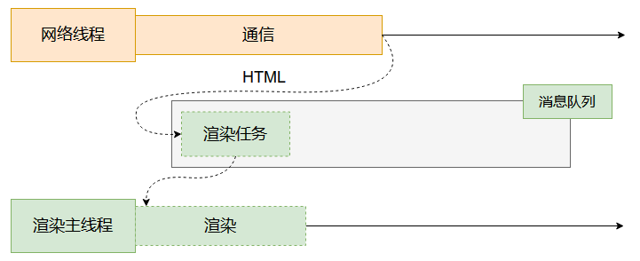

<link rel="stylesheet" href="/style.css">


### My Great Heading {#custom-id}

### 渲染是指什么？

渲染 (render)，是指将HTML代码转换为像素信息的过程。

当用户在浏览器上输入url之后，访问的服务器返回html文件，本质上是html代码，是字符串。渲染这个过程的任务就是：识别这段字符串，并且转换为像素信息。


### 渲染时间点



用户打开网页的过程可以简单概括为：

1.网络：拿HTML。
    ```
    这里概括为拿HTML，是因为在HTML文件中可以通过<style>标签和<script>标签引入 CSS 和 JS 文件。

    事实上网络的过程也很复杂， 但是不是这篇笔记的重点讨论内容。
    ```
