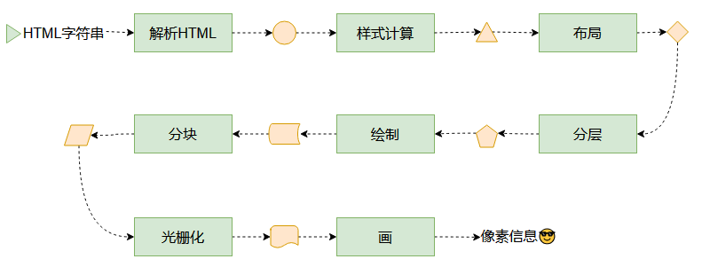
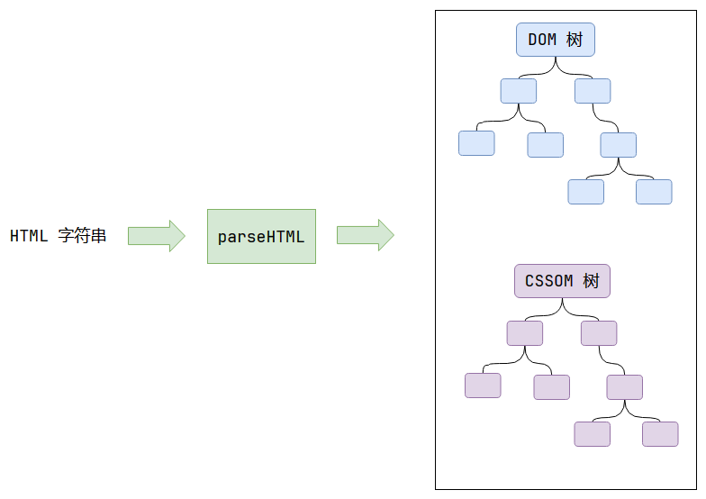
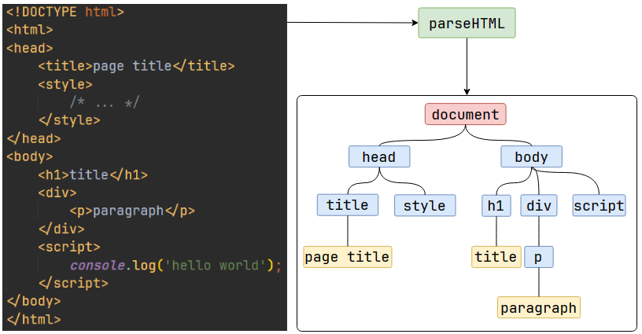
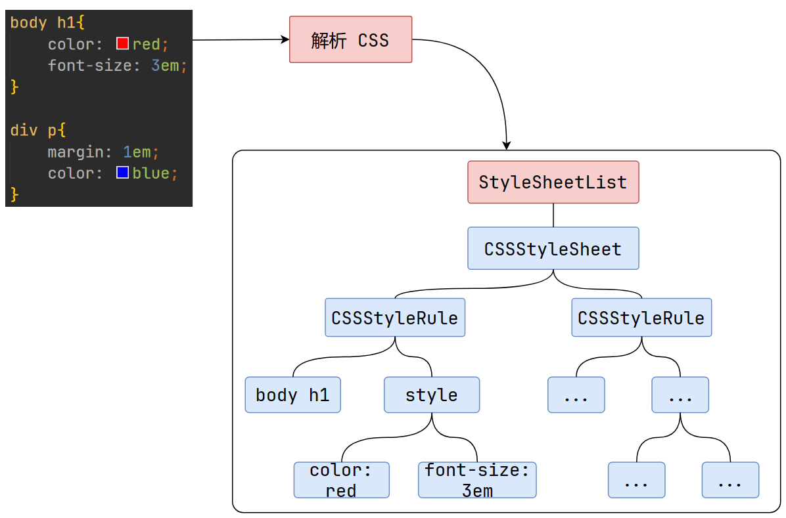
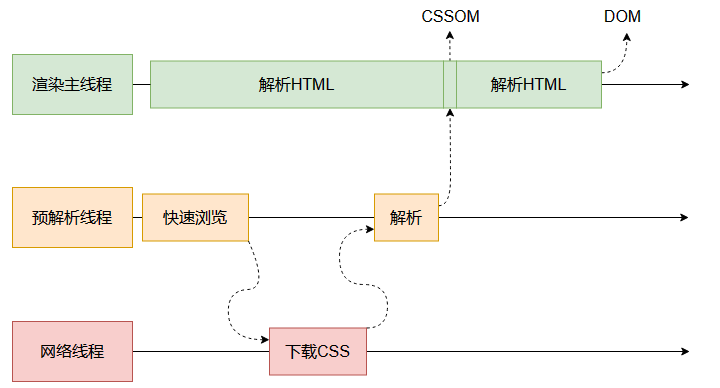
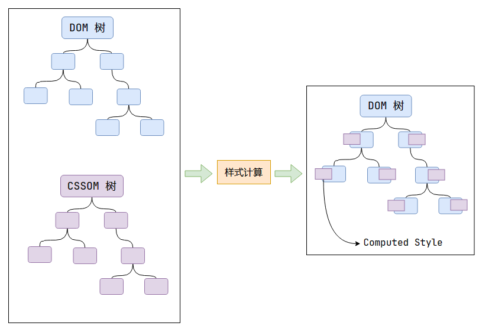
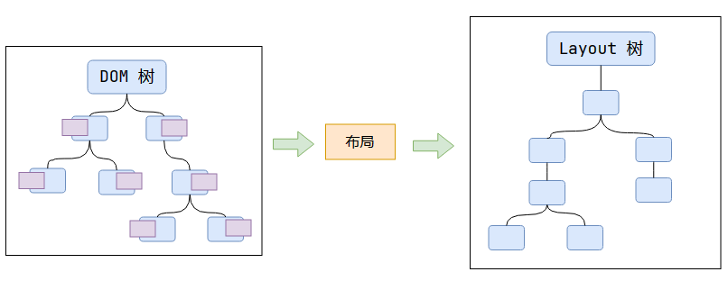
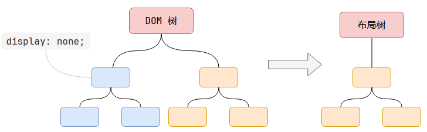
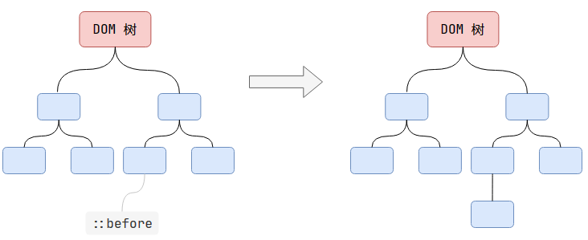
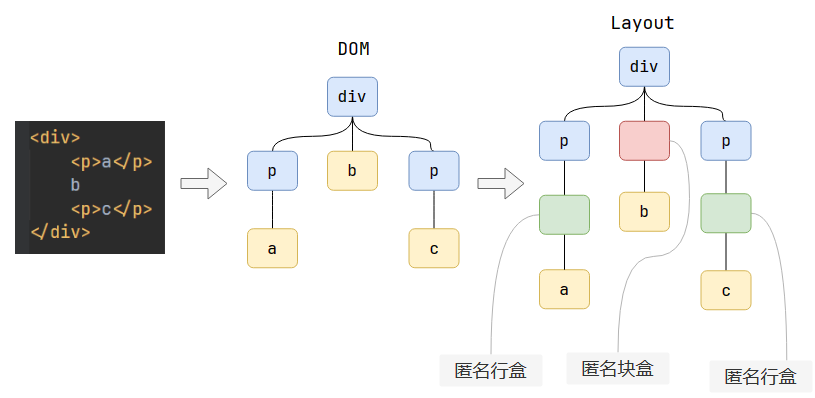

- [浏览器渲染原理](#浏览器渲染原理)
  - [渲染是指什么？](#渲染是指什么)
  - [渲染时间点](#渲染时间点)
  - [渲染流程](#渲染流程)
    - [解析HTML - Parse HTML](#解析html---parse-html)
    - [HTML解析过程遇到CSS怎么办？](#html解析过程遇到css怎么办)
    - [样式计算 - Recalculate Style](#样式计算---recalculate-style)
      - [确定声明值](#确定声明值)
      - [层叠冲突](#层叠冲突)
        - [比较源的重要性](#比较源的重要性)
        - [比较优先级](#比较优先级)
        - [比较次序](#比较次序)
      - [使用继承](#使用继承)
        - [继承原则：](#继承原则)
      - [使用默认值](#使用默认值)
  - [布局 - Layout](#布局---layout)

<style>
  code {
    color: #15a7a7;
  }
</style>
## 浏览器渲染原理

### 渲染是指什么？

渲染 (render)，是指将HTML代码转换为像素信息的过程。

当用户在浏览器上输入url之后，访问的服务器返回html文件，本质上是html代码，是字符串。渲染这个过程的任务就是：识别这段字符串，并且转换为像素信息。


### 渲染时间点


用户打开网页的过程可以简单概括为：

1.网络：拿HTML。

```
    这里概括为拿HTML，是因为在HTML文件中可以通过<style>标签和<script>标签引入 CSS 和 JS 文件。

    事实上网络的过程也很复杂， 但是不是这篇笔记的重点讨论内容。
```

2.渲染：解析HTML代码并最终转换为像素信息。

浏览器有很多进程，其中有**网络进程**，而网络进程又包含**网络线程**。

网络线程完成网络请求任务之后，拿到了一个<code>html</code>文件，但是它没有解析的能力，于是将<code>html</code>文件包装成一个任务，通过消息队列，转交给**渲染主线程**。

### 渲染流程



#### 解析HTML - Parse HTML



**DOM树**(Document Object Model)：页面中的元素和文本，以树形结构相关联。


在 JS 代码中，通过document对象可以访问和修改DOM树。而上图中的DOM树指的是浏览器底层由C++生成的DOM树。



这一个转换步骤是为后续步骤做准备的，因为字符串难处理，而对象结构容易处理。

CSS也会被解析成CSSOM（CSS Object Model），也是树形结构，根节点(StyleSheetList)是网页中所有的样式表，二级子节点可能包含**内部样式表**、**外部样式表**、**内联样式表**和**浏览器默认样式表**（取决于代码中是否有这些内容），如果有两个<code>\<link></code>，则会出现两个外部样式表节点。

可以在[github上的chromium源码](https://github.com/chromium/chromium/blob/main/third_party/blink/renderer/core/html/resources/html.css)找到浏览器默认样式表的内容。

> 除了浏览器默认样式表，内部样式表、外部样式表、内联样式表都可以通过 JS 访问到。
- 内部样式表和外部样式表：使用document.styleSheets可以访问到一个数组，元素是样式表对象。
- 使用document.styleSheets[0].addRule("div", "border: 1px solid red important")可以让页面上的所有div标签的边框变成红色，这种做法与传统的“获取所有div标签，再设置其style”的做法不同。
- 内联样式表：使用dom.style访问



#### HTML解析过程遇到CSS怎么办？

为了提高解析效率，浏览器会启动一个预解析器率先下载和解析CSS。

渲染主线程在解析HTML的时候，会关注每一个标签；而预解析线程只关注外部样式表的标签<code>\<link></code>，尽快地完成CSS的下载与解析。

这样做的目的是防止CSS的解析阻塞了HTML的解析。



#### 样式计算 - Recalculate Style



样式计算过程计算每一个DOM节点的最终样式（Computed Style）。

通过上一过程，得到的 DOM 树和 CSSOM 树。通过遍历 DOM 树，为每一个 DOM 节点，计算它的**所有 CSS 属性**。

属性值的计算过程，分为如下4个步骤：

1.确定声明值；
2.层叠冲突；
3.使用继承；
4.使用默认值。

##### 确定声明值


如果先不考虑冲突的话，那么通过 页面作者书写的**CSS样式** 和 **用户代理样式表（浏览器内置的样式表）** 的声明值相加得到全部的声明值，并且将部分值进行转换。

例如，将<code>color: red;</code>转换为<code>color: rgb(255, 0, 0);</code>，将<code>font-size: 2em;</code>转换为<code>font-size: 14px;</code>。

##### 层叠冲突
在确定声明值时，可能出现一种情况，那就是声明的样式规则发生了冲突。

此时会进入解决层叠冲突的流程。而这一步又可以细分为下面这三个步骤：

- 比较源的重要性
- 比较优先级
- 比较次序
- 比较源的重要性

###### 比较源的重要性

  样式有三种来源：
  - 浏览器会有一个基本的样式表来给任何网页设置默认样式。这些样式统称用户代理样式。
  - 网页的作者可以定义文档的样式，这是最常见的样式表，称之为页面作者样式。
  - 浏览器的用户，可以使用自定义样式表定制使用体验，称之为用户样式。
  
  对应的重要性顺序依次为：页面作者样式 > 用户样式 > 用户代理样式。

[CSS 层叠 - CSS：层叠样式表 | MDN (mozilla.org)](https://www.cnblogs.com/feixianxing/p/browser-render-process.html#%E6%AF%94%E8%BE%83%E6%BA%90%E7%9A%84%E9%87%8D%E8%A6%81%E6%80%A7)

###### 比较优先级
  如果在同一源中出现了样式声明冲突，则比较其优先级
  简单来说就是：ID选择器 > 类名选择器 > 标签选择器。

  [优先级 - CSS：层叠样式表 | MDN (mozilla.org)](https://developer.mozilla.org/zh-CN/docs/Web/CSS/Specificity)

###### 比较次序

如果出现同源同权重的情况，则比较样式的声明次序。

后声明的样式会覆盖先声明的样式。

```
  p{
      /* 会被覆盖 */
      color: red;
  }

  p{
      /* 生效 */
    color: green;
  }

```

显然，不存在次序相同的情况。至此，样式声明中存在冲突的所有情况都解决了。

##### 使用继承

上文提到了，对于每一个 DOM 节点，都会去计算它的所有 **CSS 属性**。

层叠冲突这一步骤完成之后，声明值已全部确定。

而对于未声明的属性，并不是直接使用默认值，而是使用继承值。

```
<div>
	<p>hello world</p>
</div>

```

```
div{
	color: red;
}

```

这里\<p>标签会继承来自\<div>的<code>color: red</code>样式。

###### 继承原则：

- 就近原则，谁近就继承谁的，与权重无关
- 哪些属性能够继承？答：大部分字体相关的属性都是可继承的，可以在MDN上查找属性是否可继承。

##### 使用默认值

如果经过上述过程仍不能确定属性值，则使用默认值。

### 布局 - Layout



根据 DOM 树里每个节点的样式，计算出每个节点的**尺寸和位置**。

>有一些数值，例如：百分比，或者auto，在上一步骤无法算出来，在布局这个过程才能算出来。

对于一个元素来说，它的尺寸和位置经常与它的包含块(containing block)有关。

> 这里简单地记录包含块的知识，更详细的说明可以查阅 MDN 文档：👉[布局和包含块](https://developer.mozilla.org/zh-CN/docs/Web/CSS/Containing_block)
> 盒模型：每一个盒子被划分为4个区域，即**内容区**，**内边距区**，**边框区**和**外边距区**。
> 对于一个元素而言，大部分时候，它的包含块就是它父元素的内容区。但在一些情况下并不如此。
> **包含块影响这些内容的计算**：<code>width</code>，<code>height</code>，<code>margin</code>，<code>padding</code>，偏移量(<code>position</code>为<code>absolute</code>或<code>fixed</code>的时候)，以及使用百分比的时候，是依照其包含块数值为基准计算的。
> **如何确定包含块**：确定一个元素的包含块的过程完全依赖于这个元素的position属性。
> - <code>static</code>、<code>relative</code>、<code></code>：包含块可能由它的最近的祖先块元素（比如说 <code>inline-block</code>, <code>block</code> 或 <code>list-item </code>元素）的内容区的边缘组成；
>- <code>absolute</code>：由它的最近的 <code>position</code> 的值不是 <code>static</code> 的祖先元素的内边距区的边缘组成；
>- <code>fixed</code>：在连续媒体的情况下包含块是<code>viewport</code>；
>- <code>absolute</code>或<code>fixed</code>：包含块也可能是由满足以下条件的最近父级元素的内边距区的边缘组成的。
  &emsp;1、transform或 perspective 的值不是 none。
  &emsp;2、will-change的值是 transform 或 perspective。
  &emsp;3、filter的值不是 none 或 will-change 的值是 filter（只在 Firefox 下生效）。
  &emsp;4、contain的值是 paint（例如：contain: paint;）。

  

  

  

  如上图所示，Layout树和DOM树不一定是一一对应的。

  原因是：
  1. 布局树是记录节点的几何信息(尺寸和位置)的，如果设置了<code>display: none;</code>，则节点失去几何信息，不会被添加到布局树中。
  2. 伪元素节点不存在于DOM树中，但是有几何信息，因此会被生成到布局树中。
  3. 布局过程存在两个规则(w3c规定)：
      - 内容必须在行盒中
     - 行盒和块盒不能相邻
  
  如果在块盒中直接写入内容，则会在中间生成一个<code>匿名行盒</code>；如果块盒和行盒相邻，则为行盒外部生成一个<code>匿名块盒</code>。（参考上图）

  >HTML元素可以嵌套，元素盒子当然也可以嵌套。多数盒子都是基于明确定义的元素生成的。不过有一种情况，就算不明确定义元素也会生成块级盒子。比如，像下面这样，在section这个块级元素的开头加入“some text”。此时，“some text”就算没有定义为块级元素，也会被当成块级元素。
  ```
    <section>
	    some text
	    <p>Some more text</p>
    </section>
  ```
  > 这种情况下，这个盒子被称为匿名块盒子(anonymous block box)，因为这个盒子并不与任何特定的元素相关。

  