# 移动端开发常见面试问题详解

> 文档定位：系统梳理移动端 H5 开发中高频面试问题，涵盖基础概念、响应式适配、事件处理、性能优化、兼容性问题、调试方案及综合项目实战，适用于初中级前端工程师面试备战与知识查漏补缺。
>
> 阅读建议：按章节顺序由浅入深阅读，每道题先思考再对照答案，重点关注「项目实战」与「踩坑经验」部分。

---

## 目录

- [一、移动端基础概念](#一移动端基础概念)
  - [1.1 物理像素、逻辑像素与设备像素比(DPR)](#11-物理像素逻辑像素与设备像素比dpr)
  - [1.2 视口(Viewport)与 meta 标签配置](#12-视口viewport与-meta-标签配置)
  - [1.3 REM、EM、VW/VH 单位区别](#13-rememvwvh-单位区别)
  - [1.4 安全区与刘海屏适配](#14-安全区与刘海屏适配)
- [二、响应式布局与适配方案](#二响应式布局与适配方案)
  - [2.1 REM 适配方案原理与实现](#21-rem-适配方案原理与实现)
  - [2.2 VW/VH 视口单位适配方案](#22-vwvh-视口单位适配方案)
  - [2.3 flexible.js 与 lib-flexible 库](#23-flexiblejs-与-lib-flexible-库)
  - [2.4 postcss-px-to-viewport 自动转换](#24-postcss-px-to-viewport-自动转换)
  - [2.5 响应式布局三大流派对比](#25-响应式布局三大流派对比)
- [三、移动端事件与手势处理](#三移动端事件与手势处理)
  - [3.1 Touch 事件与 MouseEvent 区别](#31-touch-事件与-mouseevent-区别)
  - [3.2 300ms 点击延迟与 FastClick 原理](#32-300ms-点击延迟与-fastclick-原理)
  - [3.3 点击穿透问题与解决方案](#33-点击穿透问题与解决方案)
  - [3.4 手势识别(滑动/长按/双指缩放)](#34-手势识别滑动长按双指缩放)
  - [3.5 passive 事件监听与滚动性能](#35-passive-事件监听与滚动性能)
- [四、1px 边框与高 DPI 屏幕适配](#四1px-边框与高-dpi-屏幕适配)
  - [4.1 1px 边框变粗问题根因](#41-1px-边框变粗问题根因)
  - [4.2 五种主流解决方案对比](#42-五种主流解决方案对比)
  - [4.3 图片高清适配方案](#43-图片高清适配方案)
- [五、移动端性能优化](#五移动端性能优化)
  - [5.1 首屏加载优化策略](#51-首屏加载优化策略)
  - [5.2 滚动性能优化(合成层与 will-change)](#52-滚动性能优化合成层与-will-change)
  - [5.3 图片懒加载与 WebP 格式](#53-图片懒加载与-webp-格式)
  - [5.4 虚拟列表与长列表渲染](#54-虚拟列表与长列表渲染)
  - [5.5 移动端白屏问题排查](#55-移动端白屏问题排查)
- [六、常见兼容性问题](#六常见兼容性问题)
  - [6.1 iOS 与 Android 软键盘差异](#61-ios-与-android-软键盘差异)
  - [6.2 iOS 橡皮筋滚动与禁止滚动](#62-ios-橡皮筋滚动与禁止滚动)
  - [6.3 fixed 定位在 iOS 下的失效问题](#63-fixed-定位在-ios-下的失效问题)
  - [6.4 日期对象兼容性与格式化](#64-日期对象兼容性与格式化)
  - [6.5 input 类型在 iOS/Android 差异](#65-input-类型在-iosandroid-差异)
- [七、移动端调试方法](#七移动端调试方法)
  - [7.1 Chrome DevTools 移动端模拟](#71-chrome-devtools-移动端模拟)
  - [7.2 vConsole 与 eruda 调试工具](#72-vconsole-与-eruda-调试工具)
  - [7.3 真机远程调试(Android/Safari)](#73-真机远程调试androidsafari)
  - [7.4 Charles/Whistle 抓包与代理](#74-charleswhistle-抓包与代理)
- [八、PWA 与 Hybrid 开发](#八pwa-与-hybrid-开发)
  - [8.1 PWA 核心技术与离线方案](#81-pwa-核心技术与离线方案)
  - [8.2 Hybrid 与原生通信原理(JSBridge)](#82-hybrid-与原生通信原理jsbridge)
  - [8.3 小程序双线程架构理解](#83-小程序双线程架构理解)
  - [8.4 React Native / Flutter 跨端方案](#84-react-native--flutter-跨端方案)
- [九、移动端安全与隐私](#九移动端安全与隐私)
  - [9.1 HTTPS 与证书绑定](#91-https-与证书绑定)
  - [9.2 XSS 与 CSRF 防护在移动端的特殊性](#92-xss-与-csrf-防护在移动端的特殊性)
  - [9.3 数据加密存储与本地安全](#93-数据加密存储与本地安全)
- [十、综合项目实战题](#十综合项目实战题)
  - [10.1 实现一个商品列表页(下拉刷新+上拉加载)](#101-实现一个商品列表页下拉刷新上拉加载)
  - [10.2 设计移动端轮播图组件(支持手势)](#102-设计移动端轮播图组件支持手势)
  - [10.3 大促活动页 1px 适配全方案](#103-大促活动页-1px-适配全方案)
  - [10.4 直播间高并发消息流渲染优化](#104-直播间高并发消息流渲染优化)
- [十一、面试高频速答与踩坑总结](#十一面试高频速答与踩坑总结)

---

## 一、移动端基础概念

### 1.1 物理像素、逻辑像素与设备像素比(DPR)

**面试题：请解释物理像素、逻辑像素、DPR 之间的关系，并说明为什么 iPhone 标称 750px 设计稿却只显示 375px 逻辑宽度。**

#### 核心概念

| 概念 | 说明 | 示例 |
|------|------|------|
| 物理像素 (Physical Pixel) | 屏幕实际发光点数，硬件出厂决定 | iPhone 6 横向 750 个 |
| 逻辑像素 (CSS Pixel) | CSS 中使用的 px，开发者面向的抽象单位 | iPhone 6 横向 375px |
| 设备像素比 (DPR) | 物理像素 / 逻辑像素 | iPhone 6 DPR = 2 |
| 屏幕独立像素 (DIP/DP) | 与逻辑像素等价的物理抽象单位 | Android 常用 |

#### 关系公式

```
物理像素 = 逻辑像素 × DPR
DPR = 物理像素 / 逻辑像素
```

#### 详细解释

以 iPhone 6 为例：
- 物理分辨率：750 × 1334（硬件实际像素）
- 逻辑分辨率：375 × 667（CSS 像素）
- DPR = 750 / 375 = 2

这意味着在 iPhone 6 上，1 个 CSS 像素由 2×2 = 4 个物理像素显示，因此图像更清晰。设计师按 750px 设计稿出图，是因为设计师面对的是物理像素；而前端工程师按 375px 编写代码，是因为代码运行在逻辑像素层面。

#### 获取 DPR 的方法

```javascript
// 通过 window.devicePixelRatio 获取
const dpr = window.devicePixelRatio;
console.log('当前设备DPR:', dpr);

// 不同设备典型值
// iPhone 6/7/8: 2
// iPhone 6+/7+/8+: 3
// 普通Android: 1 或 2
// 三星S系列: 3 或 4
```

#### 项目实战

> **项目背景**：电商 H5 商品详情页，用户反馈图片模糊。
>
> **原因分析**：设计稿 750px 宽，1 倍图在 iPhone 6（DPR=2）下实际显示宽度被放大到 2 倍物理像素，导致模糊。
>
> **解决方案**：根据 DPR 动态加载对应倍数图片。

```javascript
// 根据DPR动态选择图片倍数
function getImageUrl(baseUrl, dpr = window.devicePixelRatio) {
  const ratio = dpr >= 3 ? 3 : dpr >= 2 ? 2 : 1;
  // 例：https://cdn.example.com/p.jpg -> https://cdn.example.com/p@2x.jpg
  return baseUrl.replace(/(\.[^.]+)$/, `@${ratio}x$1`);
}

// 配合  标签使用 srcset（更优方案）
// 
```

#### 常见追问

**Q：为什么不用 navigator.hardwareConcurrency 判断设备性能？**
A：hardwareConcurrency 返回 CPU 逻辑核心数，与显示能力无关。判断渲染性能应结合 DPR、内存（performance.memory）和具体场景。

---

### 1.2 视口(Viewport)与 meta 标签配置

**面试题：移动端为什么要配置 `<meta name="viewport">` 标签？请解释各属性含义及推荐配置。**

#### 视口的两种类型

```mermaid
flowchart TB
    VP[移动端视口]

    VP --> LV[Layout Viewport 布局视口]
    VP --> VV[Visual Viewport 可视视口]
    VP >> IV[Ideal Viewport 理想视口]

    LV --> L1[默认值约980px<br/>页面渲染基准]
    VV --> V1[当前可见区域<br/>缩放时变化]
    IV --> I1[等于屏幕逻辑宽度<br/>推荐状态]
```

#### meta 标签属性详解

| 属性 | 说明 | 推荐值 |
|------|------|--------|
| width | 布局视口宽度 | device-width |
| initial-scale | 初始缩放比例 | 1.0 |
| maximum-scale | 最大缩放比例 | 1.0 或不限制 |
| minimum-scale | 最小缩放比例 | 1.0 |
| user-scalable | 是否允许用户缩放 | no（无障碍场景为 yes） |
| viewport-fit | 视口如何填充屏幕 | cover（适配刘海屏） |

#### 推荐配置

```html
<!-- 标准移动端配置 -->
<meta name="viewport" content="width=device-width, initial-scale=1.0, maximum-scale=1.0, minimum-scale=1.0, user-scalable=no, viewport-fit=cover">

<!-- 兼顾无障碍（允许缩放） -->
<meta name="viewport" content="width=device-width, initial-scale=1.0, viewport-fit=cover">

<!-- 防止用户双指缩放（iOS 10+ 需配合JS） -->
<meta name="viewport" content="width=device-width, initial-scale=1.0, maximum-scale=1.0, user-scalable=no">
```

#### 原理详解

默认情况下，移动端浏览器将布局视口设为约 980px 宽（Android 可能是 800px），这导致页面被缩小显示，文字模糊、点击区域小。配置 `width=device-width` 让布局视口等于屏幕逻辑宽度（即理想视口），页面以 1:1 比例渲染，文字清晰可点击。

#### 项目实战

> **项目背景**：某活动页在 iOS 14+ 设备上可双指缩放，导致布局错乱。
>
> **原因**：iOS 10 起 Apple 出于无障碍考虑，忽略 `user-scalable=no`。
>
> **解决方案**：通过 JS 监听手势阻止缩放，或使用 touch-action。

```javascript
// 禁止双指缩放（iOS 10+ 绕过方案）
document.addEventListener('gesturestart', (e) => e.preventDefault());

// 通过 CSS touch-action 限制手势
// html { touch-action: pan-x pan-y; }  /* 仅允许横向/纵向滚动，禁止缩放 */
```

#### 常见追问

**Q：viewport-fit=cover 与 contain 的区别？**
A：cover 表示视口覆盖整个屏幕（包括刘海区域），网页可绘制到安全区外；contain 表示视口限制在安全区内，不进入刘海/圆角区域。一般用 cover 配合 `env(safe-area-inset-*)` 实现安全区适配。

---

### 1.3 REM、EM、VW/VH 单位区别

**面试题：rem、em、vw、vh 各自适应什么场景？为什么 vw 方案逐渐取代 rem？**

#### 单位对比

| 单位 | 参照基准 | 适用场景 | 兼容性 |
|------|----------|----------|--------|
| px | 绝对像素 | 边框、固定尺寸 | 全兼容 |
| em | 父元素 font-size | 组件内相对尺寸 | 全兼容 |
| rem | 根元素 html font-size | 整体响应式适配 | IE9+ |
| vw | 视口宽度 1% | 现代 H5 适配 | iOS 8+/Android 4.4+ |
| vh | 视口高度 1% | 全屏布局 | 同 vw |
| vmin | vw/vh 较小者 | 横竖屏适配 | 同 vw |
| vmax | vw/vh 较大者 | 横竖屏适配 | 同 vw |

#### 换算关系

```
设计稿 750px 宽，1rem = 100px 时：
- 设计稿 100px -> 1rem
- CSS 写法：width: 1rem;

VW 方案下（1vw = 1% 视口宽度）：
- 设计稿 750px 宽，100px 占 13.33%
- 即 100px -> 13.33vw
```

#### 为什么 VW 逐渐取代 REM

1. **无需 JS 计算**：rem 方案需要在运行时通过 JS 设置 html font-size，vw 是浏览器原生支持
2. **避免 1px 问题**：rem 方案下，根 font-size 设置过小时，Chrome 限制最小 12px，影响小数计算
3. **无需等 JS 执行**：rem 方案下，JS 执行前页面无样式，vw 无此问题
4. **精度更高**：vw 是浮点计算，rem 受 font-size 取整影响

#### 项目实战配置

```css
/* REM 方案：JS 动态设置 */
/* JS: document.documentElement.style.fontSize = (window.innerWidth / 375) * 100 + 'px'; */
.title { font-size: 0.32rem; /* 设计稿32px */ }

/* VW 方案：纯CSS实现 */
/* 设计稿375px宽，100px -> 26.67vw */
.title { font-size: 8.533vw; /* 设计稿32px = 32/375*100vw */ }

/* 推荐组合方案：VW + REM fallback */
html { font-size: 16px; }  /* fallback */
@supports (font-size: 1vw) {
  html { font-size: 4.267vw; }  /* 16px / 375px * 100 = 4.267vw */
}
.title { font-size: 2rem; }  /* = 32px */
```

---

### 1.4 安全区与刘海屏适配

**面试题：iPhone X 之后的刘海屏如何适配？env() 与 constant() 有什么区别？**

#### 安全区概念

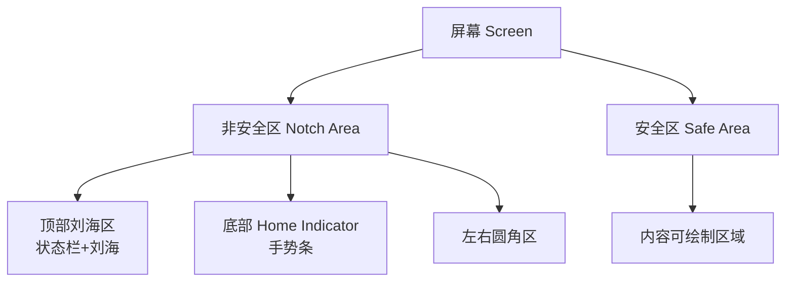

#### env() 函数详解

`env(safe-area-inset-*)` 返回安全区与屏幕边缘的距离，四个方向：

| 函数 | 含义 | iPhone X 默认值 |
|------|------|------------------|
| env(safe-area-inset-top) | 顶部安全距离 | 44px |
| env(safe-area-inset-bottom) | 底部安全距离 | 34px |
| env(safe-area-inset-left) | 左侧安全距离 | 0px |
| env(safe-area-inset-right) | 右侧安全距离 | 0px |

#### 适配方案

```css
/* 1. viewport-fit=cover 必须配置 */
/* <meta name="viewport" content="...,viewport-fit=cover"> */

/* 2. 兼容 constant() 与 env() */
/* iOS 11.1-11.2 使用 constant()，11.2+ 使用 env() */
.bottom-bar {
  padding-bottom: constant(safe-area-inset-bottom); /* 兼容旧版 */
  padding-bottom: env(safe-area-inset-bottom);       /* 新版 */
}

/* 3. 固定底部按钮适配 */
.fixed-btn {
  position: fixed;
  bottom: 0;
  /* 方案A：增加内边距 */
  padding-bottom: constant(safe-area-inset-bottom);
  padding-bottom: env(safe-area-inset-bottom);
  /* 方案B：偏移定位 */
  /* bottom: calc(0px + env(safe-area-inset-bottom)); */
}

/* 4. 横屏左右适配 */
@media (orientation: landscape) {
  .container {
    padding-left: env(safe-area-inset-left);
    padding-right: env(safe-area-inset-right);
  }
}
```

#### 项目实战

> **项目背景**：直播 App 内嵌 H5 直播间，底部礼物栏在 iPhone X 被手势条遮挡。
>
> **解决方案**：使用 `calc()` 组合安全区与设计间距。

```css
.gift-bar {
  position: fixed;
  bottom: 0;
  left: 0;
  right: 0;
  /* 设计稿距底部10px + 安全区34px = 44px */
  bottom: calc(10px + constant(safe-area-inset-bottom));
  bottom: calc(10px + env(safe-area-inset-bottom));
}
```

---

## 二、响应式布局与适配方案

### 2.1 REM 适配方案原理与实现

**面试题：手写一个 REM 适配方案，要求支持设计稿 750px，并解释原理。**

#### 原理

REM (Root EM) 单位相对于根元素 `<html>` 的 font-size。通过 JS 动态设置 html 的 font-size，让 1rem 对应设计稿中固定比例的 px，从而实现整体等比缩放。

#### 实现代码

```javascript
/**
 * REM 适配方案
 * 设计稿宽度：750px，基准 1rem = 100px
 */
(function(doc, win) {
  const docEl = doc.documentElement;
  // 横屏时取宽度的较小维度，避免横屏过大
  const resizeEvt = 'orientationchange' in window ? 'orientationchange' : 'resize';
  const recalc = function() {
    const clientWidth = docEl.clientWidth;
    if (!clientWidth) return;
    // 750px设计稿 -> 1rem = 100px，方便换算
    docEl.style.fontSize = 100 * (clientWidth / 750) + 'px';
  };

  if (!doc.addEventListener) return;
  win.addEventListener(resizeEvt, recalc, false);
  doc.addEventListener('DOMContentLoaded', recalc, false);
  recalc();
})(document, window);
```

#### 使用方式

```css
/* 设计稿 750px，标注 32px 字号 */
/* 换算：32px / 100px = 0.32rem */
.title {
  font-size: 0.32rem;
}

/* 设计稿 200px 宽的按钮 */
.btn {
  width: 2rem;  /* 200/100 */
  height: 0.88rem;  /* 88/100 */
}
```

#### 进阶：解决 1px 边框问题

```javascript
/**
 * REM方案进阶版：解决1px边框在高DPR下变粗问题
 * 思路：当DPR>=2时，border使用0.5px物理像素
 */
(function(doc, win) {
  const docEl = doc.documentElement;
  const dpr = window.devicePixelRatio || 1;

  // 设置data-dpr属性，供CSS使用
  docEl.setAttribute('data-dpr', String(dpr));

  const recalc = function() {
    const clientWidth = docEl.clientWidth;
    if (!clientWidth) return;
    docEl.style.fontSize = 100 * (clientWidth / 750) + 'px';
  };

  recalc();
  win.addEventListener('resize', recalc, false);
})(document, window);
```

```css
/* 配合 [data-dpr] 选择器处理1px */
.border-1px {
  border: 1px solid #ccc;
}
[data-dpr="2"] .border-1px {
  border-width: 0.5px;
}
[data-dpr="3"] .border-1px {
  border-width: 0.333px;
}
```

#### 常见追问

**Q：为什么基准设为 100px 而不是 1px？**
A：方便心算。设计稿标注 32px，直接除以 100 = 0.32rem。若设为 1px，则需除以 750，心算困难。

**Q：rem 方案的缺陷？**
A：①依赖 JS 执行，JS 异常时样式失效；②不支持 SSR（服务端渲染时无 window）；③字体不会随 DPR 缩放，需手动处理。

---

### 2.2 VW/VH 视口单位适配方案

**面试题：VW 方案如何实现？相比 REM 方案有哪些优势？**

#### 原理

vw (viewport width) 1vw = 视口宽度的 1%。浏览器原生支持，无需 JS 计算。

#### 换算公式

设计稿宽度 375px（iPhone 6 逻辑宽度）：

```
设计稿 100px -> 100 / 375 * 100% = 26.667vw
```

#### 配置示例

```css
/* 设计稿375px宽 */
/* 1px = 1/375 * 100vw = 0.2667vw */

/* 设计稿标注32px字号 */
.title { font-size: 8.533vw; }  /* 32 * 0.2667 */

/* 设计稿200px按钮 */
.btn {
  width: 53.333vw;  /* 200 * 0.2667 */
  height: 23.467vw;  /* 88 * 0.2667 */
}
```

#### 优化：使用 postcss-px-to-viewport 自动转换

```javascript
// postcss.config.js
module.exports = {
  plugins: {
    'postcss-px-to-viewport': {
      unitToConvert: 'px',         // 要转换的单位
      viewportWidth: 375,          // 设计稿宽度
      unitPrecision: 5,             // 转换精度（小数位）
      propList: ['*'],              // 转换哪些属性
      viewportUnit: 'vw',          // 转换目标单位
      fontViewportUnit: 'vw',      // 字体转换目标单位
      selectorBlackList: [],       // 忽略的选择器
      minPixelValue: 1,            // 小于1px不转换
      mediaQuery: false,           // 是否转换媒体查询
      replace: true,               // 是否替换原值
      exclude: [/node_modules/]    // 排除文件
    }
  }
};

// 业务代码照常写px：
// .title { font-size: 32px; }
// 构建后自动转换为：
// .title { font-size: 8.53333vw; }
```

#### VW 方案优势

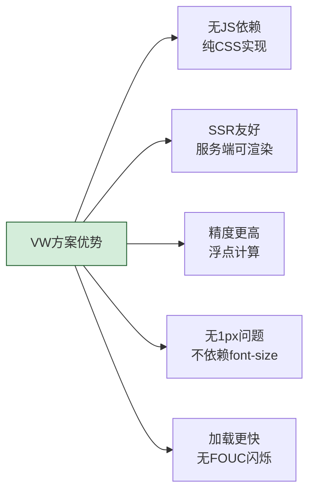

#### 项目实战踩坑

> **项目背景**：电商首页切换为 VW 方案后，iOSE 老机型（iOS 8）下 vw 不生效。
>
> **解决方案**：提供 rem fallback，使用 PostCSS 同时生成两套样式。

```javascript
// postcss-preset-env 同时生成 vw 和 rem 兼容
module.exports = {
  plugins: {
    'postcss-px-to-viewport': { viewportWidth: 375, viewportUnit: 'vw' },
    'postcss-pxtorem': { rootValue: 37.5, propList: ['*'], replace: false }
    // replace:false 保留px，配合 @supports 使用
  }
};
```

```css
/* 自动生成兼容样式 */
.title {
  font-size: 32px;
  font-size: 0.853rem;  /* fallback */
}
@supports (font-size: 8.533vw) {
  .title { font-size: 8.533vw; }
}
```

---

### 2.3 flexible.js 与 lib-flexible 库

**面试题：阿里 flexible.js 的核心原理是什么？为什么官方宣布废弃？**

#### 核心原理

flexible.js 通过动态设置 html 的 font-size 实现 rem 适配，同时处理 DPR 用于高清屏适配。

#### 源码精简版

```javascript
(function flexible(window, document) {
  const docEl = document.documentElement;
  // 获取DPR
  const dpr = window.devicePixelRatio || 1;

  // 设置 body 字体大小（调整后的DPR）
  function setBodyFontSize() {
    if (document.body) {
      document.body.style.fontSize = 12 * dpr + 'px';
    } else {
      document.addEventListener('DOMContentLoaded', setBodyFontSize);
    }
  }
  setBodyFontSize();

  // 将1rem设置为屏幕宽度的1/10
  function setRemUnit() {
    const rem = docEl.clientWidth / 10;
    docEl.style.fontSize = rem + 'px';
  }
  setRemUnit();

  // 监听reset事件重新计算
  window.addEventListener('resize', setRemUnit);
  window.addEventListener('pageshow', function(e) {
    if (e.persisted) setRemUnit();
  });

  // 设置data-dpr供CSS使用
  if (dpr >= 2) {
    const fakeBody = document.createElement('body');
    fakeBody.style.background = '#eee';
    fakeBody.style.fontSize = 12 * 2 + 'px';
    document.documentElement.appendChild(fakeBody);
  }
})(window, document);
```

#### CSS 使用方式

```css
/* 设计稿750px，1rem = 75px (750/10) */
/* 设计稿标注32px -> 32/75 = 0.4267rem */
.title { font-size: 0.4267rem; }

/* 字体使用[data-dpr]区分 */
[data-dpr="1"] .title { font-size: 14px; }
[data-dpr="2"] .title { font-size: 28px; }
[data-dpr="3"] .title { font-size: 42px; }
```

#### 为什么废弃

阿里官方于 2018 年宣布 flexible.js 不再维护，原因：

1. **iOS 已支持 vw 单位**：iOS 8+ 支持 vw，无需 JS 计算
2. **Android 兼容性问题**：Android 设备厂商碎片化，DPR 判断不准
3. **PostCSS 工具链成熟**：postcss-px-to-viewport 可自动转换
4. **1px 边框方案局限**：flexible.js 的 data-dpr 方案复杂

#### 官方推荐替代方案

```javascript
// postcss.config.js 使用 postcss-px-to-viewport
module.exports = {
  plugins: {
    'postcss-px-to-viewport': {
      viewportWidth: 750,  // 注意：这里用750设计稿
      unitPrecision: 5,
      viewportUnit: 'vw',
      selectorBlackList: ['.ignore'],
      minPixelValue: 1,
      mediaQuery: false
    }
  }
};
```

---

### 2.4 postcss-px-to-viewport 自动转换

**面试题：如何配置 postcss-px-to-viewport 排除某些不需要转换的样式？**

#### 完整配置

```javascript
// postcss.config.js
module.exports = {
  plugins: {
    'postcss-px-to-viewport': {
      unitToConvert: 'px',            // 转换单位
      viewportWidth: 375,             // 设计稿宽度（逻辑像素）
      unitPrecision: 5,               // 小数精度
      propList: ['*'],                // 转换属性，*表示全部
      viewportUnit: 'vw',             // 目标单位
      fontViewportUnit: 'vw',         // 字体目标单位
      selectorBlackList: [],          // 选择器黑名单
      minPixelValue: 1,               // 小于1px不转换
      mediaQuery: false,              // 是否转换媒体查询
      replace: true,                  // 替换原值
      exclude: [/node_modules/],      // 排除文件
      landscape: false,               // 横屏处理
      landscapeUnit: 'vw',
      landscapeWidth: 568
    }
  }
};
```

#### 排除特定样式

```javascript
// 方法1：选择器黑名单（匹配包含某类名的不转换）
selectorBlackList: ['.norem', '.ignore-vw']

// 业务代码：包含.ignore-vw的选择器不转换
.ignore-vw .box { width: 200px; }  // 不转换

// 方法2：大写PX不转换
.title { font-size: 32PX; }  // 不转换，保留原值

// 方法3：行内style不转换（默认配置）
```

#### 处理 1px 边框

```css
/* 不被转换：使用Px大写或minPixelValue */
.border { border: 1px solid #ccc; }  /* 转0.267vw，变粗 */

/* 方案1：使用大写PX */
.border { border: 1PX solid #ccc; }  /* 不转换，保持1px */

/* 方案2：配置minPixelValue（推荐） */
// 配置 minPixelValue: 2  // 小于2px不转换
.border { border: 1px solid #ccc; }  /* 不转换 */
```

#### 项目实战配置示例

```javascript
// Vue CLI 项目：vue.config.js
module.exports = {
  css: {
    loaderOptions: {
      postcss: {
        plugins: [
          require('postcss-px-to-viewport')({
            viewportWidth: 375,
            unitPrecision: 5,
            viewportUnit: 'vw',
            selectorBlackList: ['.van-', '.ignore-vw'],  // 排除Vant组件
            minPixelValue: 1,
            mediaQuery: false
          })
        ]
      }
    }
  }
};
```

---

### 2.5 响应式布局三大流派对比

**面试题：媒体查询、REM、VW 三种响应式方案，你会如何选择？**

#### 方案对比

| 方案 | 实现方式 | 优势 | 劣势 | 适用场景 |
|------|----------|------|------|----------|
| 媒体查询 | @media 断点 | 简单可控，兼容性好 | 断点僵硬，无法平滑过渡 | PC+移动响应式站点 |
| REM | JS动态设font-size | 平滑缩放，兼容性好 | 依赖JS，字体不缩放 | 老项目兼容方案 |
| VW/VH | 视口单位 | 无JS依赖，精度高 | iOS8以下不兼容 | 现代H5页面 |
| Flex/Grid | 弹性布局 | 内容自适应 | 不解决整体缩放 | 组件内布局 |

#### 决策流程

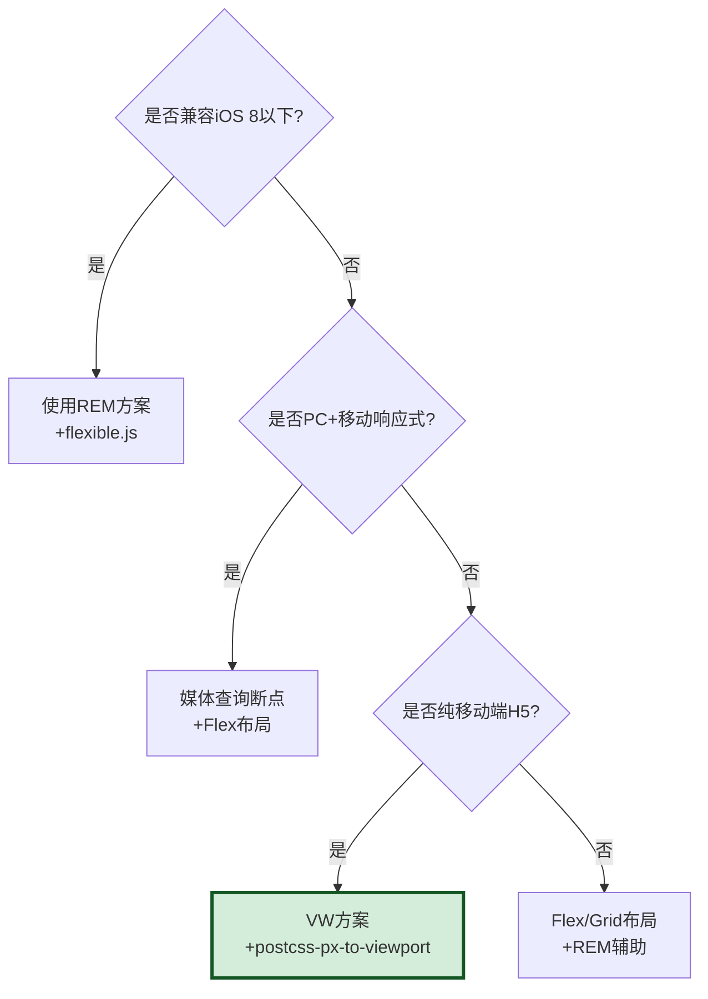

#### 项目实战：混合方案

> **项目背景**：金融产品页面，需要在 PC 显示完整版，移动端显示精简版。
>
> **方案**：媒体查询断点 + REM 整体缩放。

```css
/* PC端：3栏布局 */
@media (min-width: 768px) {
  .layout { display: grid; grid-template-columns: 1fr 2fr 1fr; }
  .sidebar { display: block; }
}

/* 移动端：单栏 + REM缩放 */
@media (max-width: 767px) {
  html { font-size: 100px; /* 配合JS动态设置 */ }
  .layout { display: flex; flex-direction: column; }
  .sidebar { display: none; }
  .title { font-size: 0.32rem; }
}
```

---

## 三、移动端事件与手势处理

### 3.1 Touch 事件与 MouseEvent 区别

**面试题：移动端 touch 事件与 PC 端 mouse 事件有什么区别？事件触发顺序是什么？**

#### 事件对比

| 特性 | TouchEvent | MouseEvent |
|------|-----------|-----------|
| 触发对象 | 手指触摸 | 鼠标点击 |
| 多点支持 | 支持（touches 列表） | 单点 |
| 事件类型 | touchstart/move/end/cancel | mousedown/move/up |
| 触发顺序 | touchstart → touchmove → touchend → mousemove → mousedown → mouseup → click | mouse → click |
| 延迟 | 无延迟 | click 有 300ms 延迟 |

#### TouchEvent 对象详解

```javascript
element.addEventListener('touchstart', function(e) {
  // touches: 当前屏幕上所有手指
  console.log('屏幕所有触摸点:', e.touches.length);

  // targetTouches: 当前元素上的所有手指
  console.log('当前元素触摸点:', e.targetTouches.length);

  // changedTouches: 触发本次事件的触摸点
  console.log('变化的触摸点:', e.changedTouches.length);

  // 单个触摸点信息
  const touch = e.touches[0];
  console.log('坐标:', touch.clientX, touch.clientY);
  console.log('相对目标:', touch.target);
  console.log('唯一标识:', touch.identifier);
}, { passive: false });
```

#### 事件触发顺序

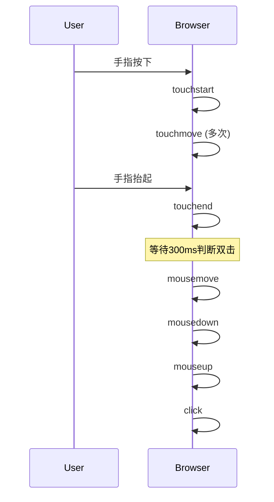

#### 项目实战：自定义长按事件

```javascript
/**
 * 长按事件封装
 * @param {Element} el 目标元素
 * @param {Function} cb 长按回调
 * @param {number} duration 长按时长(ms)
 */
function onLongPress(el, cb, duration = 500) {
  let timer = null;
  let startX = 0, startY = 0;

  el.addEventListener('touchstart', (e) => {
    const touch = e.touches[0];
    startX = touch.clientX;
    startY = touch.clientY;
    timer = setTimeout(() => {
      cb.call(el, e);
      // 阻止后续click事件
      e.preventDefault();
    }, duration);
  }, { passive: false });

  // 移动时取消长按
  el.addEventListener('touchmove', (e) => {
    const touch = e.touches[0];
    const dx = Math.abs(touch.clientX - startX);
    const dy = Math.abs(touch.clientY - startY);
    if (dx > 10 || dy > 10) {
      clearTimeout(timer);
    }
  });

  // 抬起或离开取消
  el.addEventListener('touchend', () => clearTimeout(timer));
  el.addEventListener('touchcancel', () => clearTimeout(timer));
}

// 使用
onLongPress(document.querySelector('.item'), (e) => {
  console.log('触发长按', e);
  // 显示删除菜单
});
```

---

### 3.2 300ms 点击延迟与 FastClick 原理

**面试题：为什么移动端 click 事件会有 300ms 延迟？FastClick 是如何解决的？**

#### 300ms 延迟来源

早期移动浏览器为了支持双击缩放（double tap to zoom），在用户第一次点击后会等待 300ms，判断是否有第二次点击：
- 若有 → 触发双击缩放
- 若无 → 触发 click 事件

#### FastClick 原理

FastClick 在 touchend 阶段立即合成 click 事件，并阻止浏览器原生的 click 事件触发，从而消除延迟。

#### FastClick 核心源码

```javascript
// FastClick 简化原理
class FastClick {
  constructor(layer) {
    this.layer = layer;
    const handler = ['touchstart', 'touchmove', 'touchend', 'click'];

    // 监听 touchend
    layer.addEventListener('touchend', this.onTouchEnd.bind(this), false);
    // 在 capture 阶段拦截原生click
    layer.addEventListener('click', this.onClickCapture.bind(this), true);
  }

  onTouchEnd(e) {
    if (this.trackingClick) return;
    // 记录目标元素
    this.targetElement = e.target;

    // 合成点击事件
    const clickEvent = document.createEvent('MouseEvents');
    clickEvent.initMouseEvent(
      'click', true, true, window, 1,
      0, 0, 0, 0,
      false, false, false, false, 0, null
    );
    // 立即派发合成click
    this.targetElement.dispatchEvent(clickEvent);

    // 阻止后续原生click
    e.preventDefault();
  }

  onClickCapture(e) {
    // 拦截原生click事件
    if (e.target === this.targetElement) {
      e.stopPropagation();
      e.preventDefault();
    }
  }
}
```

#### 现代替代方案

**方案1：meta 禁用缩放（推荐）**

```html
<!-- iOS 9.3+ / Android 5+ 自动消除300ms延迟 -->
<meta name="viewport" content="width=device-width, initial-scale=1, maximum-scale=1, user-scalable=no">
```

**方案2：CSS touch-action**

```css
html {
  touch-action: manipulation;  /* 允许点击与滚动，禁用双击缩放 */
}
```

**方案3：直接监听 touchend**

```javascript
// 不使用click，直接监听touchend
button.addEventListener('touchend', (e) => {
  e.preventDefault();  // 阻止后续click
  handleClick();
}, { passive: false });
```

#### 常见追问

**Q：现在还需要用 FastClick 吗？**
A：现代浏览器在配置 `width=device-width` 的 viewport 时，已自动消除 300ms 延迟。仅在兼容老设备（iOS 8 以下）时才需要。

---

### 3.3 点击穿透问题与解决方案

**面试题：什么是点击穿透？如何解决？**

#### 现象描述

当上层元素通过 `touchstart` 隐藏后，300ms 后浏览器原生 click 事件会"穿透"到下层元素，触发其点击事件。

#### 触发流程

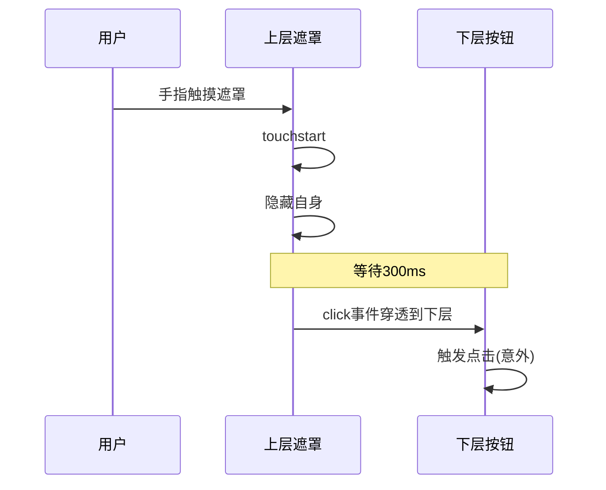

#### 经典场景

```html
<div id="mask" style="position:fixed;top:0;left:0;right:0;bottom:0;background:rgba(0,0,0,0.5);z-index:100;">
  遮罩层
</div>
<button id="btn" style="position:fixed;z-index:1;">下层按钮</button>

<script>
const mask = document.getElementById('mask');
const btn = document.getElementById('btn');

// 错误写法：在touchstart中隐藏
mask.addEventListener('touchstart', () => {
  mask.style.display = 'none';  // 300ms后click会穿透到button
});

btn.addEventListener('click', () => {
  console.log('btn被点击了');  // 意外触发
});
</script>
```

#### 解决方案

**方案1：统一使用 click 事件**

```javascript
// 修改：遮罩也用click
mask.addEventListener('click', () => {
  mask.style.display = 'none';
});
```

**方案2：touchstart 阻止默认行为**

```javascript
mask.addEventListener('touchstart', (e) => {
  e.preventDefault();  // 阻止后续合成click
  mask.style.display = 'none';
}, { passive: false });
```

**方案3：延迟隐藏**

```javascript
mask.addEventListener('touchstart', () => {
  setTimeout(() => {
    mask.style.display = 'none';
  }, 350);  // 等300ms延迟过后再隐藏
});
```

**方案4：使用 pointer 事件（现代）**

```javascript
// PointerEvent 统一处理鼠标/触摸/笔
mask.addEventListener('pointerdown', () => {
  mask.style.display = 'none';
});
```

---

### 3.4 手势识别(滑动/长按/双指缩放)

**面试题：实现一个支持双指缩放图片的手势识别。**

#### 手势识别核心

```javascript
/**
 * 手势识别器
 * 支持单击、双击、长按、滑动、双指缩放
 */
class GestureDetector {
  constructor(element) {
    this.el = element;
    this.startTouches = [];
    this.startTime = 0;
    this.lastClickTime = 0;
    this.longPressTimer = null;
    this.scale = 1;
    this.bind();
  }

  bind() {
    this.el.addEventListener('touchstart', this.onTouchStart.bind(this), { passive: false });
    this.el.addEventListener('touchmove', this.onTouchMove.bind(this), { passive: false });
    this.el.addEventListener('touchend', this.onTouchEnd.bind(this));
    this.el.addEventListener('touchcancel', this.onTouchCancel.bind(this));
  }

  onTouchStart(e) {
    e.preventDefault();
    this.startTime = Date.now();
    this.startTouches = Array.from(e.touches).map(t => ({
      x: t.clientX, y: t.clientY, identifier: t.identifier
    }));

    // 单指
    if (e.touches.length === 1) {
      // 启动长按定时器
      this.longPressTimer = setTimeout(() => {
        this.emit('longpress', { touches: this.startTouches });
        this.longPressTriggered = true;
      }, 500);
    }

    // 双指
    if (e.touches.length === 2) {
      clearTimeout(this.longPressTimer);
      this.initialDistance = this.getDistance(e.touches);
      this.initialAngle = this.getAngle(e.touches);
    }
  }

  onTouchMove(e) {
    e.preventDefault();

    // 双指缩放
    if (e.touches.length === 2 && this.initialDistance) {
      const currentDistance = this.getDistance(e.touches);
      const currentAngle = this.getAngle(e.touches);
      const scale = currentDistance / this.initialDistance;
      const rotation = currentAngle - this.initialAngle;

      this.emit('pinch', { scale, rotation });
    }

    // 单指滑动
    if (e.touches.length === 1) {
      const touch = e.touches[0];
      const start = this.startTouches[0];
      const dx = touch.clientX - start.x;
      const dy = touch.clientY - start.y;

      if (Math.abs(dx) > 10 || Math.abs(dy) > 10) {
        clearTimeout(this.longPressTimer);
        this.emit('swipe', { dx, dy });
      }
    }
  }

  onTouchEnd(e) {
    clearTimeout(this.longPressTimer);
    const duration = Date.now() - this.startTime;

    // 单击/双击判断
    if (e.changedTouches.length === 1 && duration < 500 && !this.longPressTriggered) {
      const now = Date.now();
      if (now - this.lastClickTime < 300) {
        this.emit('doubletap', { touch: e.changedTouches[0] });
        this.lastClickTime = 0;
      } else {
        // 延迟判断，避免与doubletap冲突
        setTimeout(() => {
          if (Date.now() - this.lastClickTime >= 300) {
            this.emit('tap', { touch: e.changedTouches[0] });
          }
        }, 300);
        this.lastClickTime = now;
      }
    }
    this.longPressTriggered = false;
  }

  onTouchCancel() {
    clearTimeout(this.longPressTimer);
  }

  // 计算双指距离
  getDistance(touches) {
    const dx = touches[0].clientX - touches[1].clientX;
    const dy = touches[0].clientY - touches[1].clientY;
    return Math.sqrt(dx * dx + dy * dy);
  }

  // 计算双指角度
  getAngle(touches) {
    const dx = touches[0].clientX - touches[1].clientX;
    const dy = touches[0].clientY - touches[1].clientY;
    return Math.atan2(dy, dx) * 180 / Math.PI;
  }

  emit(type, data) {
    this.el.dispatchEvent(new CustomEvent(type, { detail: data }));
  }
}

// 使用示例
const img = document.querySelector('img');
const gesture = new GestureDetector(img);

let scale = 1;
img.addEventListener('pinch', (e) => {
  scale *= e.detail.scale;
  scale = Math.max(0.5, Math.min(3, scale));
  img.style.transform = `scale(${scale})`;
});
```

---

### 3.5 passive 事件监听与滚动性能

**面试题：什么是 passive 事件监听？为什么能提升滚动性能？**

#### 问题背景

默认情况下，浏览器在触发 `touchmove` 或 `wheel` 事件时，必须等待事件监听器执行完毕才能确定是否调用 `preventDefault()`。如果监听器耗时较长，会导致滚动卡顿。

#### Passive 解决方案

```javascript
// 传统写法：浏览器必须等待
element.addEventListener('touchmove', (e) => {
  // 浏览器不确定是否调用preventDefault
  // 必须同步等待这里执行完
  if (someCondition) e.preventDefault();
});

// Passive写法：告诉浏览器不会preventDefault
element.addEventListener('touchmove', (e) => {
  // 这里不能调用preventDefault
  console.log('滚动中');
}, { passive: true });
```

#### 性能对比

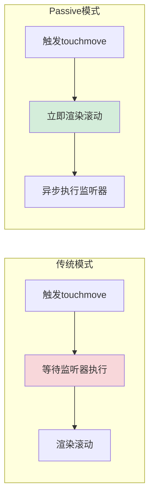

#### 浏览器警告

在 Chrome 中，如果在不指定 passive 的 touchmove 中调用 preventDefault，控制台会警告：

```
Unable to preventDefault inside passive event listener due to target being treated as passive.
```

#### 项目实战配置

```javascript
// Vue 项目统一配置passive
const passiveEvents = ['touchstart', 'touchmove', 'wheel'];

passiveEvents.forEach(eventName => {
  // 监听body滚动
  document.body.addEventListener(eventName, handleScroll, { passive: true });
});

// React 项目：注意react的事件系统
// React 17+ 默认passive，无需配置
// React 16及以下，需要手动绑定原生事件

// 检查是否支持passive
let supportsPassive = false;
try {
  const opts = Object.defineProperty({}, 'passive', {
    get() { supportsPassive = true; }
  });
  window.addEventListener('test', null, opts);
} catch (e) {}

document.addEventListener('touchmove', handler, supportsPassive ? { passive: true } : false);
```

#### 常见追问

**Q：passive:true 时调用 preventDefault 会怎样？**
A：调用无效，浏览器忽略，并在控制台打印警告。如果需要阻止滚动，必须设置 passive:false。

---

## 四、1px 边框与高 DPI 屏幕适配

### 4.1 1px 边框变粗问题根因

**面试题：为什么移动端 1px 边框在高 DPR 设备上看起来很粗？**

#### 问题根因

CSS 中的 1px 是逻辑像素。在 DPR=2 的设备上，1 个 CSS 像素由 2×2 个物理像素显示，因此 1px 边框实际占用 2 个物理像素，看起来比设计稿（基于物理像素标注）粗。

#### 视觉对比

```
设计稿标注：1px (物理像素)
iPhone 6 (DPR=2) CSS 1px → 2 物理像素 → 看起来是设计的2倍粗
iPhone 6+ (DPR=3) CSS 1px → 3 物理像素 → 看起来是设计的3倍粗
```

#### 期望效果

```
在DPR=2的设备上，希望1px边框 = 0.5px CSS = 1物理像素
在DPR=3的设备上，希望1px边框 = 0.333px CSS = 1物理像素
```

---

### 4.2 五种主流解决方案对比

#### 方案1：transform: scale (推荐)

```css
.border-1px {
  position: relative;
}
.border-1px::after {
  content: '';
  position: absolute;
  left: 0;
  top: 0;
  width: 100%;
  height: 100%;
  border: 1px solid #ccc;
  transform-origin: 0 0;
  box-sizing: border-box;
  pointer-events: none;  /* 不影响点击 */
}

/* DPR=2 缩放0.5 */
@media (-webkit-min-device-pixel-ratio: 2) {
  .border-1px::after {
    width: 200%;
    height: 200%;
    transform: scale(0.5);
  }
}

/* DPR=3 缩放0.333 */
@media (-webkit-min-device-pixel-ratio: 3) {
  .border-1px::after {
    width: 300%;
    height: 300%;
    transform: scale(0.333);
  }
}

/* 只需要某一边框时 */
.border-top::after {
  border: none;
  border-top: 1px solid #ccc;
  transform: scaleY(0.5);
}
```

#### 方案2：0.5px CSS 单位 (iOS 8+)

```css
.border-1px {
  border: 0.5px solid #ccc;
}

/* 仅iOS 8+支持，Android兼容性差 */
/* iOS Safari 8+ ✓ */
/* Android WebView < 4.4 ✗ */
```

#### 方案3：box-shadow 模拟

```css
.border-1px {
  box-shadow: 0 0 0 0.5px #ccc;
  /* 或：0 -0.5px 0 0 #ccc (上边框) */
}

/* 优点：兼容性好 */
/* 缺点：颜色会变浅，无法控制圆角 */
```

#### 方案4：viewport + REM 方案

```javascript
// 动态设置meta viewport
const dpr = window.devicePixelRatio || 1;
const scale = 1 / dpr;
const viewport = document.querySelector('meta[name=viewport]');
viewport.setAttribute('content', `initial-scale=${scale}, maximum-scale=${scale}, minimum-scale=${scale}, user-scalable=no`);
// 缺点：整页缩放，字体也变小，不灵活
```

#### 方案5：background-image 渐变

```css
.border-1px-bottom {
  background-image: linear-gradient(0deg, #ccc, #ccc 50%, transparent 50%);
  background-size: 100% 1px;
  background-repeat: no-repeat;
  background-position: bottom;
}

/* 仅适合单边边框，且颜色单一 */
```

#### 方案对比

| 方案 | 兼容性 | 圆角支持 | 复杂度 | 推荐度 |
|------|--------|---------|--------|--------|
| transform:scale | 全兼容 | ✓ | 中 | ★★★★★ |
| 0.5px | iOS8+ | ✓ | 低 | ★★★☆☆ |
| box-shadow | 全兼容 | ✓ | 低 | ★★★☆☆ |
| viewport缩放 | 全兼容 | ✓ | 高 | ★★☆☆☆ |
| background渐变 | 全兼容 | ✗ | 中 | ★★☆☆☆ |

#### 项目实战：通用 1px 组件

```css
/* 通用1px边框混合（SCSS） */
@mixin border-1px($color: #ccc, $position: bottom, $radius: 0) {
  position: relative;

  &::after {
    content: "";
    position: absolute;
    pointer-events: none;
    box-sizing: border-box;
    #{$position}: 0;
    left: 0;
    width: 100%;
    height: 1px;
    background-color: $color;
    transform-origin: 0 0;

    @media (-webkit-min-device-pixel-ratio: 2) {
      transform: scaleY(0.5);
    }
    @media (-webkit-min-device-pixel-ratio: 3) {
      transform: scaleY(0.333);
    }
  }
}

/* 使用 */
.list-item {
  @include border-1px(#ddd, bottom);
}
```

---

### 4.3 图片高清适配方案

**面试题：如何在多 DPR 设备上加载合适的图片？**

#### 方案1：srcset 属性 (推荐)

```html
<!-- 浏览器自动选择合适倍数 -->

```

#### 方案2：picture 元素 (响应式)

```html
<picture>
  <source media="(min-width: 768px)" srcset="large.jpg 1x, large@2x.jpg 2x">
  <source media="(max-width: 767px)" srcset="small.jpg 1x, small@2x.jpg 2x">
  
</picture>
```

#### 方案3：JS 动态加载

```javascript
function getHighResImage(baseUrl) {
  const dpr = window.devicePixelRatio || 1;
  const ratio = dpr >= 3 ? 3 : dpr >= 2 ? 2 : 1;
  return baseUrl.replace(/(\.\w+)$`, `@${ratio}x$1`);
}

// 网络情况结合
function getAdaptiveImage(baseUrl) {
  const conn = navigator.connection || navigator.mozConnection;
  const dpr = window.devicePixelRatio || 1;
  const effectiveType = conn?.effectiveType;

  // 慢网络降低倍数
  let ratio = 1;
  if (effectiveType === '4g') ratio = dpr >= 2 ? 2 : 1;
  else if (effectiveType === '3g') ratio = 1.5;
  else if (effectiveType === '2g') ratio = 1;

  return baseUrl.replace(/(\.\w+)$/, `@${Math.ceil(ratio)}x$1`);
}
```

#### 方案4：CSS 媒体查询

```css
.logo {
  background-image: url('logo@1x.png');
}

@media (-webkit-min-device-pixel-ratio: 2), (min-resolution: 2dppx) {
  .logo {
    background-image: url('logo@2x.png');
  }
}

@media (-webkit-min-device-pixel-ratio: 3), (min-resolution: 3dppx) {
  .logo {
    background-image: url('logo@3x.png');
  }
}
```

#### 项目实战踩坑

> **项目背景**：电商列表页，3 倍图导致流量消耗过大，用户投诉。
>
> **解决方案**：根据网络情况动态选择图片倍数。

```javascript
class AdaptiveImage {
  constructor() {
    this.dpr = window.devicePixelRatio || 1;
    this.networkType = this.getNetworkType();
  }

  getNetworkType() {
    const conn = navigator.connection;
    return conn?.effectiveType || '4g';
  }

  getImageUrl(baseUrl) {
    // 慢网络强制1倍
    if (['2g', 'slow-2g'].includes(this.networkType)) {
      return baseUrl.replace(/@\d+x/, '') || baseUrl;
    }

    // 3g 最多2倍
    if (this.networkType === '3g') {
      return baseUrl.replace(/(\.\w+)$/, '@2x$1');
    }

    // 4g 按DPR选择
    const ratio = this.dpr >= 3 ? 3 : 2;
    return baseUrl.replace(/(\.\w+)$/, `@${ratio}x$1`);
  }

  // 监听网络变化
  watchNetworkChange(cb) {
    const conn = navigator.connection;
    if (conn) {
      conn.addEventListener('change', () => {
        this.networkType = this.getNetworkType();
        cb();
      });
    }
  }
}
```

---

## 五、移动端性能优化

### 5.1 首屏加载优化策略

**面试题：移动端首屏加载缓慢，列出你能想到的所有优化策略。**

#### 优化策略全景

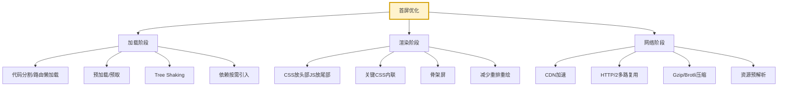

#### 具体策略

**1. 路由懒加载（React/Vue）**

```javascript
// React 路由懒加载
const Home = React.lazy(() => import('./pages/Home'));
const About = React.lazy(() => import('./pages/About'));

// 配合Suspense
<Suspense fallback={<Skeleton />}>
  <Routes>
    <Route path="/" element={<Home />} />
    <Route path="/about" element={<About />} />
  </Routes>
</Suspense>

// Vue路由懒加载
const routes = [
  { path: '/', component: () => import('./views/Home.vue') },
  { path: '/about', component: () => import('./views/About.vue') }
];
```

**2. 关键 CSS 内联**

```html
<head>
  <!-- 关键CSS内联，避免阻塞渲染 -->
  <style>
    body { margin: 0; font-family: sans-serif; }
    .header { height: 44px; background: #fff; }
    .skeleton { background: #f5f5f5; }
  </style>

  <!-- 非关键CSS异步加载 -->
  <link rel="preload" href="/styles/main.css" as="style" onload="this.rel='stylesheet'">
  <noscript><link rel="stylesheet" href="/styles/main.css"></noscript>
</head>
```

**3. 骨架屏**

```javascript
// 骨架屏组件
function Skeleton() {
  return (
    <div className="skeleton-container">
      <div className="skeleton-header" />
      <div className="skeleton-content">
        {Array.from({ length: 5 }).map((_, i) => (
          <div key={i} className="skeleton-item">
            <div className="skeleton-img" />
            <div className="skeleton-text" />
          </div>
        ))}
      </div>
    </div>
  );
}
```

```css
.skeleton-img {
  width: 80px;
  height: 80px;
  background: linear-gradient(90deg, #f0f0f0 25%, #e0e0e0 50%, #f0f0f0 75%);
  background-size: 200% 100%;
  animation: shimmer 1.5s infinite;
}

@keyframes shimmer {
  0% { background-position: 200% 0; }
  100% { background-position: -200% 0; }
}
```

**4. 资源预加载**

```html
<!-- 预加载关键资源（高优先级） -->
<link rel="preload" href="/fonts/main.woff2" as="font" type="font/woff2" crossorigin>
<link rel="preload" href="/js/main.js" as="script">

<!-- 预取下一页资源（低优先级） -->
<link rel="prefetch" href="/js/about.js">

<!-- DNS预解析 -->
<link rel="dns-prefetch" href="//cdn.example.com">

<!-- 预连接 -->
<link rel="preconnect" href="//cdn.example.com" crossorigin>
```

#### 性能指标

| 指标 | 含义 | 目标值 |
|------|------|--------|
| FCP (First Contentful Paint) | 首次内容绘制 | < 1.8s |
| LCP (Largest Contentful Paint) | 最大内容绘制 | < 2.5s |
| FID (First Input Delay) | 首次输入延迟 | < 100ms |
| CLS (Cumulative Layout Shift) | 累积布局偏移 | < 0.1 |
| TTI (Time to Interactive) | 可交互时间 | < 3.8s |

---

### 5.2 滚动性能优化(合成层与 will-change)

**面试题：长列表滚动卡顿如何优化？谈谈合成层与 will-change 的作用。**

#### 卡顿原因

1. 主线程被 JS 任务占用
2. 滚动触发大量重排重绘
3. 复杂 CSS 计算消耗性能

#### 合成层原理

浏览器渲染流程：HTML → DOM → Style → Layout → Paint → Composite

合成层（Composite Layer）跳过 Layout 和 Paint，由 GPU 直接合成，性能最优。

#### will-change 使用

```css
/* 提前告知浏览器元素将变化，触发合成层 */
.animated-box {
  will-change: transform, opacity;
  transform: translateZ(0);  /* 强制开启GPU加速 */
}

/* 滚动容器 */
.scroll-container {
  will-change: transform;
  transform: translateZ(0);
  backface-visibility: hidden;
}

/* 注意：不要滥用，否则内存消耗过大 */
/* 错误写法 */
* { will-change: transform; }  /* 所有元素都开启，灾难 */
```

#### 滚动优化技巧

**1. 使用 transform 替代 top/left**

```css
/* 错误：触发重排 */
.animate {
  position: absolute;
  top: 0;
  transition: top 0.3s;
}
.animate.active { top: 100px; }

/* 正确：仅触发合成 */
.animate {
  transform: translateY(0);
  transition: transform 0.3s;
}
.animate.active { transform: translateY(100px); }
```

**2. requestAnimationFrame 节流**

```javascript
// 滚动事件节流
let ticking = false;
element.addEventListener('scroll', () => {
  if (!ticking) {
    requestAnimationFrame(() => {
      handleScroll();
      ticking = false;
    });
    ticking = true;
  }
}, { passive: true });  // 必须passive
```

**3. 避免强制同步布局**

```javascript
// 错误：读写交替，触发强制布局（layout thrashing）
for (let i = 0; i < items.length; i++) {
  items[i].style.left = items[i].offsetLeft + 10 + 'px';  // 读+写循环
}

// 正确：先读后写
const lefts = items.map(item => item.offsetLeft);
items.forEach((item, i) => {
  item.style.left = lefts[i] + 10 + 'px';
});
```

#### 项目实战

> **项目背景**：直播礼物滚动列表，每秒新增 50 条消息，卡顿严重。
>
> **优化方案**：
> 1. 虚拟列表减少 DOM 节点
> 2. transform 替代 top
> 3. requestAnimationFrame 批量更新
> 4. content-visibility 长内容优化

```css
/* CSS content-visibility（实验性，Chrome 85+） */
.long-list-item {
  content-visibility: auto;
  contain-intrinsic-size: 80px;  /* 默认高度 */
}
/* 浏览器只渲染可视区域，超出的不渲染 */
```

---

### 5.3 图片懒加载与 WebP 格式

**面试题：实现一个图片懒加载方案，支持 IntersectionObserver 与降级方案。**

#### 方案1：IntersectionObserver (推荐)

```javascript
class LazyImageLoader {
  constructor(selector = 'img[data-src]') {
    this.images = document.querySelectorAll(selector);
    this.observer = null;
    this.init();
  }

  init() {
    if ('IntersectionObserver' in window) {
      this.observer = new IntersectionObserver(
        this.onIntersection.bind(this),
        {
          root: null,
          rootMargin: '100px',  // 提前100px加载
          threshold: 0.01
        }
      );
      this.images.forEach(img => this.observer.observe(img));
    } else {
      // 降级：scroll + getBoundingClientRect
      this.fallbackLazyLoad();
    }
  }

  onIntersection(entries) {
    entries.forEach(entry => {
      if (entry.isIntersecting) {
        const img = entry.target;
        const src = img.dataset.src;
        const srcset = img.dataset.srcset;

        if (srcset) img.srcset = srcset;
        if (src) img.src = src;

        img.removeAttribute('data-src');
        img.removeAttribute('data-srcset');

        this.observer.unobserve(img);
      }
    });
  }

  fallbackLazyLoad() {
    const lazyLoad = () => {
      this.images.forEach(img => {
        if (this.isInViewport(img)) {
          if (img.dataset.src) img.src = img.dataset.src;
          img.removeAttribute('data-src');
        }
      });
    };

    window.addEventListener('scroll', this.throttle(lazyLoad, 200), { passive: true });
    window.addEventListener('resize', this.throttle(lazyLoad, 200));
    lazyLoad();
  }

  isInViewport(el) {
    const rect = el.getBoundingClientRect();
    return (
      rect.top >= 0 &&
      rect.left >= 0 &&
      rect.bottom <= window.innerHeight &&
      rect.right <= window.innerWidth
    );
  }

  throttle(fn, delay) {
    let last = 0;
    return (...args) => {
      const now = Date.now();
      if (now - last >= delay) {
        fn.apply(this, args);
        last = now;
      }
    };
  }
}

// 使用
new LazyImageLoader('img[data-src]');
```

#### 方案2：原生 loading 属性

```html
<!-- 现代浏览器原生懒加载 -->

```

#### 方案3：WebP 格式与降级

```html
<picture>
  <!-- 优先WebP -->
  <source srcset="image.webp" type="image/webp">
  <!-- 降级JPEG -->
  <source srcset="image.jpg" type="image/jpeg">
  
</picture>
```

```javascript
// 检测WebP支持
function checkWebPSupport() {
  return new Promise(resolve => {
    const img = new Image();
    img.onload = () => resolve(img.width > 0);
    img.onerror = () => resolve(false);
    img.src = 'data:image/webp;base64,UklGRhoAAABXRUJQVlA4TA0AAAAvAAAAEAcQERGIi4AAAg';
  });
}

// 应用
checkWebPSupport().then(supported => {
  if (supported) {
    document.documentElement.classList.add('webp');
  }
});
```

```css
/* CSS背景图WebP适配 */
.bg { background-image: url('bg.jpg'); }
.webp .bg { background-image: url('bg.webp'); }
```

---

### 5.4 虚拟列表与长列表渲染

**面试题：实现一个虚拟列表，支持 10 万条数据流畅滚动。**

#### 核心原理

只渲染可视区域内的 DOM 节点（+ 上下缓冲区），滚动时动态替换数据。

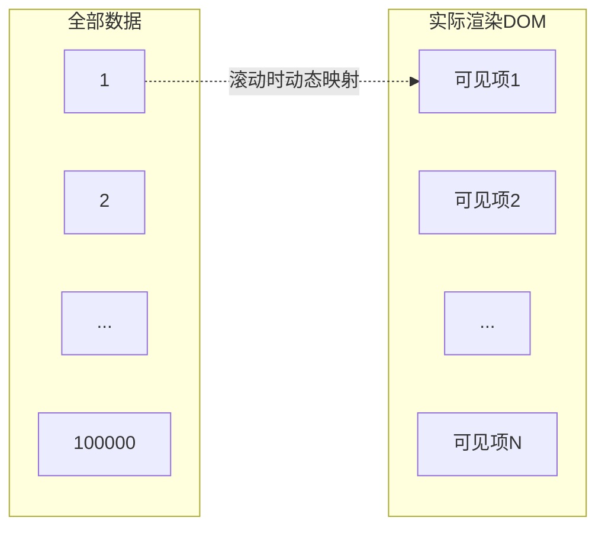

#### 实现代码

```javascript
class VirtualList {
  constructor(options) {
    this.container = options.container;
    this.itemHeight = options.itemHeight;  // 单项高度（固定）
    this.data = options.data;
    this.renderItem = options.renderItem;
    this.bufferSize = options.bufferSize || 5;

    this.visibleCount = Math.ceil(this.container.clientHeight / this.itemHeight);
    this.startIndex = 0;
    this.endIndex = this.visibleCount + this.bufferSize;

    this.contentEl = null;
    this.itemsEl = null;
    this.init();
  }

  init() {
    // 容器结构：外层定高滚动，内层占位撑开高度
    this.container.innerHTML = `
      <div class="vl-content" style="position: relative; height: ${this.data.length * this.itemHeight}px;">
        <div class="vl-items" style="position: absolute; top: 0; left: 0; right: 0;"></div>
      </div>
    `;
    this.contentEl = this.container.querySelector('.vl-content');
    this.itemsEl = this.container.querySelector('.vl-items');

    this.container.addEventListener('scroll', this.onScroll.bind(this), { passive: true });
    this.render();
  }

  onScroll() {
    const scrollTop = this.container.scrollTop;
    const newStart = Math.max(0, Math.floor(scrollTop / this.itemHeight) - this.bufferSize);
    const newEnd = Math.min(
      this.data.length,
      newStart + this.visibleCount + this.bufferSize * 2
    );

    if (newStart !== this.startIndex || newEnd !== this.endIndex) {
      this.startIndex = newStart;
      this.endIndex = newEnd;
      this.render();
    }
  }

  render() {
    const html = this.data
      .slice(this.startIndex, this.endIndex)
      .map((item, idx) => {
        const realIdx = this.startIndex + idx;
        return this.renderItem(item, realIdx);
      })
      .join('');

    this.itemsEl.innerHTML = html;
    // 偏移到正确位置
    this.itemsEl.style.transform = `translateY(${this.startIndex * this.itemHeight}px)`;
  }

  // 动态高度版本（变高item）
  // 需要维护position缓存，使用ResizeObserver监听
}
```

#### 使用示例

```javascript
// 10万条数据
const data = Array.from({ length: 100000 }, (_, i) => ({
  id: i,
  name: `用户${i}`
}));

const vl = new VirtualList({
  container: document.getElementById('list'),
  itemHeight: 60,
  data: data,
  renderItem: (item, idx) => `
    <div class="item" style="height: 60px; line-height: 60px; border-bottom: 1px solid #eee;">
      ${item.name}
    </div>
  `
});
```

#### 动态高度方案

```javascript
// 变高item的虚拟列表
class DynamicVirtualList {
  constructor(options) {
    this.data = options.data;
    this.estimatedItemHeight = options.estimatedItemHeight || 50;
    this.positions = this.data.map(() => ({ height: this.estimatedItemHeight, top: 0, bottom: 0 }));
    this.initPositions();
    // ... 其他初始化
  }

  initPositions() {
    let top = 0;
    this.positions.forEach(pos => {
      pos.top = top;
      pos.bottom = top + pos.height;
      top += pos.height;
    });
  }

  // 二分查找当前startIndex
  getStartIndex(scrollTop) {
    let low = 0, high = this.positions.length - 1;
    while (low < high) {
      const mid = Math.floor((low + high) / 2);
      const midBottom = this.positions[mid].bottom;
      if (midBottom === scrollTop) return mid + 1;
      if (midBottom < scrollTop) low = mid + 1;
      else high = mid;
    }
    return low;
  }

  // 渲染后实测高度更新positions
  updatePositions() {
    const nodes = this.itemsEl.children;
    Array.from(nodes).forEach((node, idx) => {
      const realIdx = this.startIndex + idx;
      const newHeight = node.getBoundingClientRect().height;
      const oldHeight = this.positions[realIdx].height;
      const diff = newHeight - oldHeight;

      if (diff) {
        this.positions[realIdx].height = newHeight;
        this.positions[realIdx].bottom = this.positions[realIdx].top + newHeight;
        // 更新后续所有position
        for (let i = realIdx + 1; i < this.positions.length; i++) {
          this.positions[i].top = this.positions[i - 1].bottom;
          this.positions[i].bottom = this.positions[i].top + this.positions[i].height;
        }
      }
    });
  }
}
```

---

### 5.5 移动端白屏问题排查

**面试题：移动端页面白屏，如何排查？**

#### 排查流程

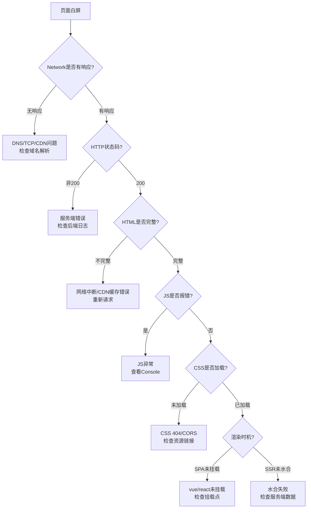

#### 常见白屏原因

1. **JS 异常未捕获**：导致页面挂载失败
2. **资源加载失败**：CDN 不可达、CORS 配置错误
3. **WebView 版本过低**：不支持 ES6+ 语法
4. **HTTPS 混合内容**：HTTP 资源在 HTTPS 下被拦截
5. **内存溢出**：JS 堆栈溢出导致渲染中断

#### 排查工具

```javascript
// 1. 全局错误捕获
window.addEventListener('error', (event) => {
  console.error('JS错误:', event.message, event.filename, event.lineno);
  // 上报到监控平台
  reportError({
    type: 'js_error',
    message: event.message,
    file: event.filename,
    line: event.lineno,
    stack: event.error?.stack
  });
}, true);

// 2. Promise未捕获异常
window.addEventListener('unhandledrejection', (event) => {
  console.error('未处理Promise:', event.reason);
  reportError({ type: 'promise_rejection', reason: event.reason });
});

// 3. 资源加载失败
window.addEventListener('error', (event) => {
  const target = event.target;
  if (target && (target.tagName === 'SCRIPT' || target.tagName === 'LINK')) {
    console.error('资源加载失败:', target.src || target.href);
    reportError({ type: 'resource_error', url: target.src || target.href });
  }
}, true);  // 注意capture为true

// 4. 内存警告
window.addEventListener('memory' in performance ? 'memory' : 'error', () => {
  if (performance.memory) {
    console.warn('内存使用:', performance.memory);
  }
});
```

#### 项目实战：白屏降级方案

```javascript
// 超时降级：3秒未渲染完成，显示降级页
let renderTimeout = setTimeout(() => {
  document.getElementById('app').innerHTML = `
    <div style="padding: 20px; text-align: center;">
      <h3>加载超时</h3>
      <p>请检查网络后重试</p>
      <button onclick="location.reload()">重新加载</button>
    </div>
  `;
}, 3000);

// 渲染完成后清除
window.addEventListener('load', () => {
  clearTimeout(renderTimeout);
});

// 资源加载失败重试
function loadScript(src, retries = 3) {
  return new Promise((resolve, reject) => {
    const script = document.createElement('script');
    script.src = src;
    script.onload = resolve;
    script.onerror = () => {
      if (retries > 0) {
        console.log(`重试加载 ${src}, 剩余 ${retries}`);
        loadScript(src, retries - 1).then(resolve).catch(reject);
      } else {
        reject(new Error(`资源加载失败: ${src}`));
      }
    };
    document.head.appendChild(script);
  });
}
```

---

## 六、常见兼容性问题

### 6.1 iOS 与 Android 软键盘差异

**面试题：iOS 和 Android 软键盘弹起行为有什么不同？如何适配？**

#### 行为差异

| 行为 | iOS | Android |
|------|-----|---------|
| Webview 高度 | 不变（视觉缩小） | 缩小（resize 事件触发） |
| fixed 元素 | 键盘上方（被遮挡） | 屏幕底部（正常显示） |
| 滚动 | 整体上推 | 仅聚焦输入框 |
| 收起后 | 内容可能错位 | 自动恢复 |
| 事件 | focus/blur | resize |

#### 适配方案

```javascript
// 1. 监听键盘弹起/收起（兼容两端）
class KeyboardAdapter {
  constructor() {
    this.originHeight = document.documentElement.clientHeight || window.innerHeight;
    this.isShow = false;
    this.bindEvents();
  }

  bindEvents() {
    // Android: resize 事件
    window.addEventListener('resize', this.onResize.bind(this));
    // iOS: focus/blur（需要监听具体input）
    document.addEventListener('focusin', this.onFocus.bind(this));
    document.addEventListener('focusout', this.onBlur.bind(this));
  }

  onResize() {
    const currentHeight = document.documentElement.clientHeight || window.innerHeight;
    const diff = this.originHeight - currentHeight;

    // 高度差 > 100 视为键盘弹起
    if (diff > 100 && !this.isShow) {
      this.isShow = true;
      this.onKeyboardShow(currentHeight);
    } else if (diff < 50 && this.isShow) {
      this.isShow = false;
      this.onKeyboardHide(this.originHeight);
    }
  }

  onFocus(e) {
    if (e.target.tagName === 'INPUT' || e.target.tagName === 'TEXTAREA') {
      this.activeElement = e.target;
      // iOS 下滚动到可视区域
      setTimeout(() => {
        e.target.scrollIntoView({ behavior: 'smooth', block: 'center' });
      }, 300);
    }
  }

  onBlur(e) {
    // iOS 收起后恢复滚动
    setTimeout(() => {
      window.scrollTo(0, 0);
    }, 100);
  }

  onKeyboardShow(keyboardHeight) {
    document.documentElement.style.setProperty('--keyboard-height', `${this.originHeight - keyboardHeight}px`);
    // 触发业务回调
    window.dispatchEvent(new CustomEvent('keyboard:show', { detail: { height: this.originHeight - keyboardHeight } }));
  }

  onKeyboardHide(originHeight) {
    document.documentElement.style.setProperty('--keyboard-height', '0px');
    window.dispatchEvent(new CustomEvent('keyboard:hide'));
  }
}
```

#### 项目实战踩坑

> **问题**：聊天页面输入框 fixed 在底部，iOS 键盘弹起时被遮挡。
>
> **原因**：iOS Safari 下 fixed 元素相对 visual viewport（键盘上方），但部分 WebView 行为不一致。
>
> **解决方案**：使用 VisualViewport API（iOS 13+）。

```javascript
// 现代方案：VisualViewport API
if (window.visualViewport) {
  window.visualViewport.addEventListener('resize', () => {
    const offsetHeight = window.visualViewport.height;
    const offsetTop = window.visualViewport.offsetTop;
    // 移动fixed元素到可视区域
    document.querySelector('.chat-input').style.transform =
      `translateY(${-(window.innerHeight - offsetHeight - offsetTop)}px)`;
  });
}
```

---

### 6.2 iOS 橡皮筋滚动与禁止滚动

**面试题：iOS 下如何禁止橡皮筋滚动？overscroll-behavior 与 touch-action 的区别？**

#### iOS 橡皮筋问题

iOS Safari 默认 body 可以"橡皮筋"滚动（上下越界回弹效果），导致 fixed 定位失效、内容错位。

#### 解决方案

```css
/* 方案1：overscroll-behavior（现代） */
html, body {
  overscroll-behavior: none;  /* 禁止橡皮筋 */
  /* 或只禁止纵向：overscroll-behavior-y: none; */
}

/* 方案2：position fixed 锁定 */
body.locked {
  position: fixed;
  width: 100%;
  height: 100%;
  overflow: hidden;
}

/* 方案3：touch-action */
.no-scroll {
  touch-action: none;  /* 完全禁止触摸滚动 */
}

.scroll-y {
  touch-action: pan-y;  /* 仅允许纵向滚动 */
}
```

#### 弹窗场景：锁滚动 + 内部可滚动

```javascript
// 弹窗打开时锁定body，关闭时恢复
class ScrollLock {
  constructor() {
    this.scrollTop = 0;
    this.body = document.body;
  }

  lock() {
    this.scrollTop = window.pageYOffset;
    this.body.style.position = 'fixed';
    this.body.style.top = `-${this.scrollTop}px`;
    this.body.style.width = '100%';
    this.body.style.height = '100%';
    this.body.style.overflow = 'hidden';
  }

  unlock() {
    this.body.style.position = '';
    this.body.style.top = '';
    this.body.style.width = '';
    this.body.style.height = '';
    this.body.style.overflow = '';
    window.scrollTo(0, this.scrollTop);
  }
}

// 弹窗内部滚动：使用 overflow-y: auto
// .modal-content { max-height: 80vh; overflow-y: auto; }
```

#### 项目实战

> **场景**：商品详情页弹窗，弹窗内部可滚动，但禁止背景滚动。
>
> **方案**：弹窗容器 `overscroll-behavior: contain`。

```css
.modal {
  position: fixed;
  top: 0; left: 0; right: 0; bottom: 0;
  background: rgba(0,0,0,0.5);
  overflow: hidden;
}

.modal-content {
  max-height: 80%;
  overflow-y: auto;
  overscroll-behavior: contain;  /* 关键：滚动到边界时不传递给父级 */
  -webkit-overflow-scrolling: touch;  /* iOS 惯性滚动 */
}
```

---

### 6.3 fixed 定位在 iOS 下的失效问题

**面试题：为什么 fixed 定位在 iOS 下会失效？如何解决？**

#### 失效场景

1. **祖先元素设置 transform**：transform 会创建新的包含块，fixed 变成 absolute 效果
2. **键盘弹起**：fixed 元素被键盘遮挡
3. **iOS 输入框聚焦**：fixed 元素错位

#### 失效原因

```css
/* 错误：祖先有transform */
.parent {
  transform: translateZ(0);  /* 创建包含块 */
}
.child {
  position: fixed;  /* 实际变成相对.parent定位 */
}
```

#### 解决方案

**方案1：避免祖先 transform**

```css
/* 不要给 fixed 元素的祖先加 transform */
/* 替代方案：使用 will-change 或 opacity */
.parent {
  will-change: transform;  /* 不创建包含块 */
}
```

**方案2：使用 sticky 替代 fixed**

```css
/* sticky 不会受 transform 影响 */
.sticky-header {
  position: sticky;
  top: 0;
  z-index: 100;
}
```

**方案3：键盘弹起时切换为 absolute**

```javascript
// 监听键盘，动态切换定位方式
const fixedEl = document.querySelector('.fixed-bottom');

window.addEventListener('focusin', (e) => {
  if (e.target.tagName === 'INPUT') {
    fixedEl.style.position = 'absolute';
  }
});

window.addEventListener('focusout', () => {
  fixedEl.style.position = 'fixed';
});
```

#### 项目实战踩坑

> **问题**：聊天页 fixed 底部输入框，iOS 聚焦时位置错乱。
>
> **方案**：使用 VisualViewport 监听键盘高度，动态调整。

```javascript
function adjustInputPosition() {
  const input = document.querySelector('.chat-input-bar');
  if (window.visualViewport) {
    const handler = () => {
      const { height, pageTop } = window.visualViewport;
      input.style.bottom = `${window.innerHeight - height - pageTop}px`;
    };
    window.visualViewport.addEventListener('resize', handler);
    window.visualViewport.addEventListener('scroll', handler);
  } else {
    // 降级：focus时滚动到可视区
    input.addEventListener('focus', () => {
      setTimeout(() => input.scrollIntoView({ block: 'center' }), 300);
    });
  }
}
```

---

### 6.4 日期对象兼容性与格式化

**面试题：为什么 `new Date('2023-01-01')` 在 iOS Safari 下返回 Invalid Date？**

#### 问题根因

iOS Safari 严格遵循 ISO 8601 标准，要求日期字符串符合 `YYYY-MM-DDTHH:mm:ss.sssZ` 格式，对连字符 `-` 与斜杠 `/` 处理不一致。

#### 兼容性表

| 字符串格式 | Chrome | iOS Safari | Android |
|-----------|---------|-----------|---------|
| 2023-01-01 | ✓ | ✓ (UTC) | ✓ |
| 2023-01-01 12:00:00 | ✓ | ✗ Invalid | ✓ |
| 2023/01/01 | ✓ | ✓ | ✓ |
| 2023/01/01 12:00:00 | ✓ | ✓ | ✓ |
| 2023-01-01T12:00:00 | ✓ | ✓ (UTC) | ✓ |
| 2023-01-01T12:00:00+08:00 | ✓ | ✓ (本地) | ✓ |

#### 解决方案

```javascript
// 方案1：使用斜杠格式（推荐，全兼容）
function parseDate(dateStr) {
  // 统一替换为斜杠
  return new Date(dateStr.replace(/-/g, '/'));
}

// 方案2：使用 ISO 格式 + 时区
function parseDateISO(dateStr) {
  // 确保格式为 YYYY-MM-DDTHH:mm:ss
  const normalized = dateStr.replace(' ', 'T');
  return new Date(normalized);
}

// 方案3：手动解析（最稳妥）
function parseDateManual(dateStr) {
  const parts = dateStr.match(/(\d{4})[-/](\d{1,2})[-/](\d{1,2})(?:[ T](\d{1,2}):(\d{1,2}):(\d{1,2}))?/);
  if (!parts) return new Date(NaN);
  return new Date(
    parseInt(parts[1]),
    parseInt(parts[2]) - 1,  // 月份0-11
    parseInt(parts[3]),
    parseInt(parts[4] || 0),
    parseInt(parts[5] || 0),
    parseInt(parts[6] || 0)
  );
}
```

#### 通用日期格式化工具

```javascript
function formatDate(date, format = 'YYYY-MM-DD HH:mm:ss') {
  if (typeof date === 'string') date = parseDate(date);
  if (!(date instanceof Date) || isNaN(date)) return '';

  const map = {
    YYYY: date.getFullYear(),
    MM: String(date.getMonth() + 1).padStart(2, '0'),
    DD: String(date.getDate()).padStart(2, '0'),
    HH: String(date.getHours()).padStart(2, '0'),
    mm: String(date.getMinutes()).padStart(2, '0'),
    ss: String(date.getSeconds()).padStart(2, '0')
  };

  return format.replace(/YYYY|MM|DD|HH|mm|ss/g, match => map[match]);
}

// 使用
formatDate('2023-01-01 12:00:00', 'YYYY年MM月DD日');  // 2023年01月01日
```

---

### 6.5 input 类型在 iOS/Android 差异

**面试题：移动端表单 input 如何控制弹出的键盘类型？**

#### input type 与键盘映射

| type 属性 | iOS 键盘 | Android 键盘 | 注意事项 |
|----------|---------|------------|----------|
| text | 默认 | 默认 | 基础文本 |
| number | 数字+符号 | 数字 | iOS 不限制输入字符 |
| tel | 数字电话 | 数字电话 | 推荐用于手机号 |
| email | 带@键 | 默认+@ | 邮箱输入 |
| url | 带.com/. | 默认+斜杠 | 网址输入 |
| search | 带"搜索"键 | 带"前往" | 触发搜索 |
| date | 原生日期滚轮 | 原生日期 | 样式不可控 |
| password | 默认带遮罩 | 默认带遮罩 | 安全键盘需配置 |

#### 进阶：pattern 属性

```html
<!-- pattern 控制iOS键盘布局 -->
<input type="text" pattern="[0-9]*">  <!-- iOS弹出纯数字键盘 -->
<input type="text" pattern="\d*">      <!-- 同上 -->

<!-- 推荐手机号输入 -->
<input type="tel" pattern="[0-9]*" maxlength="11">
```

#### 项目实战踩坑

> **问题1**：`type="number"` 在 iOS 下可以输入字母 "e"（科学计数法）。
>
> **解决方案**：用 `type="tel"` 或加 inputmode。

```html
<!-- 推荐方案 -->
<input type="tel" inputmode="numeric" pattern="[0-9]*">

<!-- inputmode 属性（现代）-->
<input type="text" inputmode="decimal">  <!-- 数字+小数点 -->
<input type="text" inputmode="numeric">   <!-- 纯数字 -->
<input type="text" inputmode="email">     <!-- 邮箱键盘 -->
```

> **问题2**：iOS 键盘的"前往"键无法触发 form 提交。
>
> **原因**：form 内必须有 submit 按钮。

```html
<form action="/search">
  <input type="search" name="q" placeholder="搜索">
  <input type="submit" style="display:none">  <!-- 隐藏的submit按钮 -->
</form>
```

> **问题3**：input 聚焦后页面放大。
>
> **原因**：font-size < 16px 时，iOS 会自动放大。

```css
/* 解决：input字号至少16px */
input, textarea, select {
  font-size: 16px;
}

/* 或阻止缩放 */
input {
  font-size: 16px;
  transform: scale(0.875);  /* 视觉缩小但功能保留 */
  transform-origin: left center;
}
```

---

## 七、移动端调试方法

### 7.1 Chrome DevTools 移动端模拟

**面试题：Chrome DevTools 模拟移动端有哪些局限性？**

#### 模拟功能

1. **Device Toolbar**：模拟不同设备视口
2. **Network throttling**：模拟 3G/4G 网络
3. **CPU throttling**：降低 4x CPU 性能
4. **Touch 事件模拟**：鼠标模拟触摸
5. **Sensors**：GPS 定位模拟

#### 局限性

| 模拟项 | 局限 |
|--------|------|
| DPR | 不准确，实际物理像素无法模拟 |
| 安全区 | 刘海屏 env() 值不生效 |
| 触摸事件 | 鼠标模拟，多点触摸不支持 |
| 性能 | 桌面 CPU 比移动端强很多 |
| WebView | 与浏览器有差异 |
| iOS Safari | 渲染差异无法模拟 |

#### 推荐调试配置

```javascript
// 注入调试标记
if (location.search.includes('debug=1')) {
  // 启用详细日志
  console.log = console.debug;
  // 性能监控
  const observer = new PerformanceObserver((list) => {
    list.getEntries().forEach(entry => {
      console.debug('性能:', entry.name, entry.duration);
    });
  });
  observer.observe({ entryTypes: ['paint', 'navigation'] });
}
```

---

### 7.2 vConsole 与 eruda 调试工具

**面试题：如何在生产环境移动端调试？vConsole 实现原理是什么？**

#### vConsole 集成

```html
<!-- 方式1：script 引入 -->
<script src="https://unpkg.com/vconsole@latest/dist/vconsole.min.js"></script>
<script>
  if (location.search.includes('vconsole=1') || localStorage.getItem('vconsole') === '1') {
    new VConsole();
  }
</script>

<!-- 方式2：npm 安装 -->
<!-- npm install vconsole -->
```

```javascript
// 方式2：模块化引入
import VConsole from 'vconsole';

const enableVConsole = () => {
  const trigger = localStorage.getItem('vconsole') === '1';
  const query = new URLSearchParams(location.search).get('vconsole') === '1';
  return trigger || query;
};

if (enableVConsole()) {
  const vConsole = new VConsole({
    defaultPlugins: ['system', 'network', 'page', 'storage'],
    log: { maxLogLength: 1000 },
    onReady: () => console.log('vConsole已就绪')
  });
}
```

#### vConsole 原理

```javascript
// vConsole 核心原理：劫持 console 方法
class VConsole {
  constructor() {
    this.logQueue = [];
    this.hijackConsole();
    this.createPanel();
  }

  hijackConsole() {
    ['log', 'info', 'warn', 'error', 'debug'].forEach(method => {
      const original = console[method];
      console[method] = (...args) => {
        // 存储日志
        this.logQueue.push({ method, args, time: Date.now() });
        // 调用原方法
        original.apply(console, args);
        // 更新UI
        this.updatePanel();
      };
    });
  }

  createPanel() {
    // 创建浮动按钮和面板DOM
    // 监听点击事件
  }
}
```

#### eruda（功能更全）

```html
<script src="https://cdn.jsdelivr.net/npm/eruda"></script>
<script>
  eruda.init({
    container: document.body,
    tool: ['console', 'elements', 'network', 'resources', 'info']
  });
</script>
```

#### 项目实战：环境感知调试

```javascript
// 自动根据环境决定是否开启调试
class DebugManager {
  constructor() {
    this.isEnabled = this.checkEnable();
    if (this.isEnabled) this.init();
  }

  checkEnable() {
    // 开发环境
    if (process.env.NODE_ENV === 'development') return true;
    // URL参数
    if (new URLSearchParams(location.search).get('debug') === '1') return true;
    // localStorage
    if (localStorage.getItem('debug') === '1') return true;
    // 特定用户
    if (window.userInfo?.role === 'tester') return true;
    return false;
  }

  init() {
    // 动态加载vConsole
    const script = document.createElement('script');
    script.src = 'https://unpkg.com/vconsole@3/dist/vconsole.min.js';
    script.onload = () => new window.VConsole();
    document.head.appendChild(script);
  }
}
```

---

### 7.3 真机远程调试(Android/Safari)

**面试题：如何对 iOS Safari 和 Android Chrome 进行真机远程调试？**

#### Android Chrome 真机调试

**步骤**：

1. 手机：开启开发者选项 → USB 调试
2. 用 USB 连接电脑
3. 电脑 Chrome：`chrome://inspect`
4. 勾选 "Discover USB devices"
5. 点击 "Inspect"

**无线调试（Android 11+）**：

```
1. 手机：开发者选项 → 无线调试
2. 点击"使用配对码配对设备"
3. 电脑：chrome://inspect → 配置端口
```

#### iOS Safari 真机调试

**步骤**：

1. iPhone：设置 → Safari → 高级 → 开启 Web 检查器
2. Mac：Safari → 偏好设置 → 高级 → 开启"开发菜单"
3. USB 连接
4. Mac Safari：开发菜单 → 选择设备 → 选择页面

#### iOS WKWebView 调试

```javascript
// iOS 端配置（需要原生开发配合）
// Swift: 开启WKWebView调试
if #available(iOS 14.0, *) {
    WKWebView.configuration.preferences.webInspectorEnabled = true
}

// 或在Info.plist添加
// <key>WKWebViewInspectable</key>
// <true/>
```

#### 企业微信/钉钉 WebView 调试

```javascript
// 企业微信WebView调试
if (typeof wx !== 'undefined' && wx.invoke) {
  // 开启vConsole
  wx.invoke('invokeDebug', {}, () => {});
}

// 通用方案：通过URL参数触发
if (location.hash.includes('#debug')) {
  // 注入vConsole
}
```

---

### 7.4 Charles/Whistle 抓包与代理

**面试题：使用 Charles 抓包 HTTPS 流量，如何配置证书？**

#### Charles 配置步骤

1. **安装证书**：Help → SSL Proxying → Install Charles Root Certificate
2. **信任证书**：钥匙串 → 找到 Charles → 设为始终信任
3. **设置代理端口**：Proxy → Proxy Settings → HTTP Proxy → Port 8888
4. **开启 SSL Proxying**：Proxy → SSL Proxying Settings → 添加 `*:443`
5. **手机配置代理**：Wi-Fi → HTTP 代理 → 手动 → 电脑IP:8888
6. **手机安装证书**：chls.pro/ssl → 安装描述文件
7. **iOS 信任证书**：设置 → 通用 → 关于本机 → 证书信任设置

#### Whistle 配置（开源替代）

```bash
# 安装
npm install -g whistle

# 启动
w2 start

# 访问
# http://127.0.0.1:8899

# 手机配置代理：电脑IP:8899
# 扫码安装证书：http://电脑IP:8899
```

#### 实战：Mock 接口响应

```javascript
// whistle 规则配置（在whistle web界面）
// pattern: example.com/api/user
// responder: {"name":"test","age":18}

// Charles: Map Local
// Tools → Map Local → 配置URL与本地JSON文件

// 修改响应头
// resHeaders://{"Access-Control-Allow-Origin":"*"}
```

#### 实战：弱网模拟

```javascript
// Charles: Proxy → Throttle Settings
// Bandwidth: 256 Kbps (3G)
// Utilisation: 100%
// Latency: 100ms

// whistle规则：
// reqDelay://1000  // 请求延迟1秒
// resDelay://2000  // 响应延迟2秒
```

---

## 八、PWA 与 Hybrid 开发

### 8.1 PWA 核心技术与离线方案

**面试题：PWA 的核心组成是什么？Service Worker 如何实现离线访问？**

#### PWA 核心技术

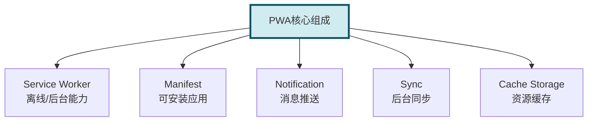

#### Service Worker 注册

```javascript
// 主线程注册Service Worker
if ('serviceWorker' in navigator) {
  window.addEventListener('load', () => {
    navigator.serviceWorker.register('/sw.js')
      .then(registration => console.log('SW注册成功:', registration.scope))
      .catch(err => console.error('SW注册失败:', err));
  });
}
```

#### Service Worker 离线缓存

```javascript
// sw.js
const CACHE_NAME = 'app-v1';
const CACHE_URLS = [
  '/',
  '/index.html',
  '/styles/main.css',
  '/js/main.js',
  '/images/logo.png'
];

// 安装：预缓存核心资源
self.addEventListener('install', (event) => {
  event.waitUntil(
    caches.open(CACHE_NAME)
      .then(cache => cache.addAll(CACHE_URLS))
      .then(() => self.skipWaiting())  // 立即激活
  );
});

// 激活：清理旧缓存
self.addEventListener('activate', (event) => {
  event.waitUntil(
    caches.keys().then(cacheNames => {
      return Promise.all(
        cacheNames.map(cacheName => {
          if (cacheName !== CACHE_NAME) {
            return caches.delete(cacheName);
          }
        })
      );
    }).then(() => self.clients.claim())
  );
});

// 拦截请求：缓存优先策略
self.addEventListener('fetch', (event) => {
  // 跳过非GET请求
  if (event.request.method !== 'GET') return;

  event.respondWith(
    caches.match(event.request).then(response => {
      // 缓存命中直接返回
      if (response) return response;

      // 否则请求网络
      return fetch(event.request).then(networkResponse => {
        // 网络成功后缓存（动态缓存）
        if (networkResponse && networkResponse.status === 200) {
          const responseToCache = networkResponse.clone();
          caches.open(CACHE_NAME).then(cache => {
            cache.put(event.request, responseToCache);
          });
        }
        return networkResponse;
      }).catch(() => {
        // 网络失败，尝试缓存
        return caches.match('/offline.html');
      });
    })
  );
});
```

#### 缓存策略对比

| 策略 | 说明 | 适用场景 |
|------|------|---------|
| Cache First | 缓存优先 | 静态资源(CSS/JS/图片) |
| Network First | 网络优先 | 动态数据(API) |
| Stale-While-Revalidate | 缓存优先+后台更新 | 重要但非关键资源 |
| Network Only | 仅网络 | 实时数据 |
| Cache Only | 仅缓存 | 离线包 |

#### Manifest 配置

```json
// manifest.json
{
  "name": "我的应用",
  "short_name": "应用",
  "description": "应用描述",
  "start_url": "/",
  "display": "standalone",
  "background_color": "#ffffff",
  "theme_color": "#000000",
  "orientation": "portrait",
  "icons": [
    {
      "src": "/icons/icon-192.png",
      "sizes": "192x192",
      "type": "image/png"
    },
    {
      "src": "/icons/icon-512.png",
      "sizes": "512x512",
      "type": "image/png"
    }
  ]
}
```

```html
<link rel="manifest" href="/manifest.json">
<meta name="theme-color" content="#000000">
```

---

### 8.2 Hybrid 与原生通信原理(JSBridge)

**面试题：JSBridge 的实现原理是什么？如何处理异步回调？**

#### JSBridge 通信原理

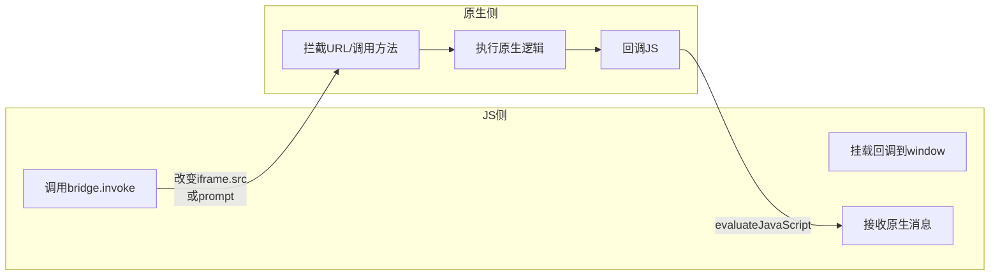

#### 通信方案对比

| 方案 | iOS | Android | 特点 |
|------|-----|---------|------|
| URL 拦截 | UIWebView shouldStartLoadWithRequest | WebView shouldOverrideUrlLoading | 兼容性好，但有长度限制 |
| 注入对象 | WKWebView evaluateJavaScript | addJavascriptInterface | 直接调用，无长度限制 |
| prompt 拦截 | WKUIDelegate | WebChromeClient.onJsPrompt | 通用性好 |

#### 实现：基于 URL Scheme

```javascript
// JS侧：封装JSBridge
class JSBridge {
  constructor() {
    this.callbackId = 0;
    this.callbacks = {};
    this.initMessageQueue();
  }

  // 调用原生方法
  invoke(method, params = {}, callback) {
    const callbackId = ++this.callbackId;
    this.callbacks[callbackId] = callback;

    // 方案1：iframe.src（兼容性好）
    const message = {
      method,
      params,
      callbackId
    };
    this.sendMessageViaIframe(message);

    // 方案2：window.prompt（推荐）
    // window.prompt(JSON.stringify(message));
  }

  sendMessageViaIframe(message) {
    const iframe = document.createElement('iframe');
    iframe.style.display = 'none';
    iframe.src = `jsbridge://invoke?data=${encodeURIComponent(JSON.stringify(message))}`;
    document.body.appendChild(iframe);
    setTimeout(() => iframe.remove(), 0);
  }

  // 接收原生回调
  initMessageQueue() {
    window.JSBridge = {
      // 原生调用此方法回调JS
      onCallback: (callbackId, data) => {
        const callback = this.callbacks[callbackId];
        if (callback) {
          callback(data);
          delete this.callbacks[callbackId];
        }
      },
      // 原生主动调用JS
      onEvent: (event, data) => {
        const handlers = this.eventHandlers[event] || [];
        handlers.forEach(handler => handler(data));
      }
    };
  }

  // 注册事件监听
  on(event, handler) {
    this.eventHandlers = this.eventHandlers || {};
    this.eventHandlers[event] = this.eventHandlers[event] || [];
    this.eventHandlers[event].push(handler);
  }
}

// 使用
const bridge = new JSBridge();
bridge.invoke('getUserInfo', { fields: ['name', 'avatar'] }, (user) => {
  console.log('收到原生回调:', user);
});
```

#### 实现：基于注入对象（现代）

```javascript
// 原生注入 window.wx 或 window.androidBridge
// JS侧直接调用
class NativeBridge {
  constructor() {
    // 等待原生注入
    this.ready = this.waitForBridge();
  }

  waitForBridge() {
    return new Promise((resolve) => {
      if (window.wx) {
        resolve(window.wx);
      } else {
        document.addEventListener('WXBridgeReady', () => {
          resolve(window.wx);
        });
      }
    });
  }

  async invoke(method, params = {}) {
    const bridge = await this.ready;
    return new Promise((resolve, reject) => {
      bridge.invoke(method, params, (res) => {
        if (res.errMsg.includes(':ok')) resolve(res);
        else reject(new Error(res.errMsg));
      });
    });
  }
}
```

#### 项目实战踩坑

> **问题1**：iOS WKWebView 下 `addJavascriptInterface` 无法使用。
>
> **解决方案**：使用 `WKUserContentController` 注入。

```swift
// iOS Swift 原生
let contentController = WKUserContentController()
contentController.add(self, name: "bridge")
let config = WKWebViewConfiguration()
config.userContentController = contentController

func userContentController(_ userContentController: WKUserContentController,
                          didReceive message: WKScriptMessage) {
    if message.name == "bridge" {
        let body = message.body as! [String: Any]
        let method = body["method"] as! String
        // 处理调用
    }
}
```

> **问题2**：连续调用 bridge 时回调丢失。
>
> **解决方案**：使用队列保证顺序。

```javascript
class QueuedBridge {
  constructor() {
    this.queue = [];
    this.processing = false;
  }

  async invoke(method, params) {
    return new Promise((resolve, reject) => {
      this.queue.push({ method, params, resolve, reject });
      this.processQueue();
    });
  }

  async processQueue() {
    if (this.processing || this.queue.length === 0) return;
    this.processing = true;

    const task = this.queue.shift();
    try {
      const result = await this.nativeInvoke(task.method, task.params);
      task.resolve(result);
    } catch (err) {
      task.reject(err);
    }

    this.processing = false;
    this.processQueue();  // 处理下一个
  }
}
```

---

### 8.3 小程序双线程架构理解

**面试题：微信小程序为什么采用双线程架构？有什么优缺点？**

#### 双线程架构

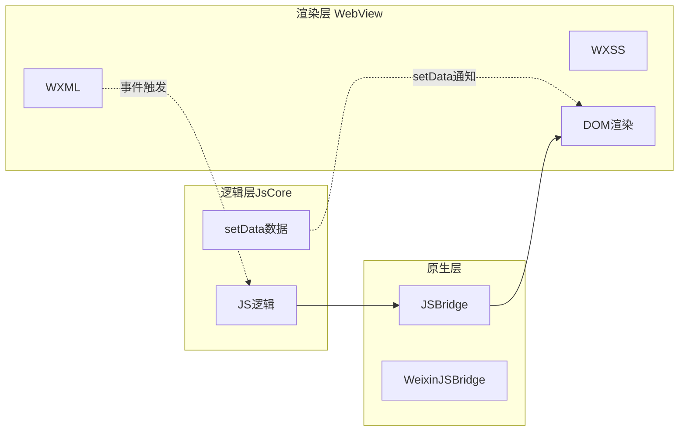

#### 为什么双线程

1. **安全考虑**：逻辑层无 DOM API，无法直接操作渲染，避免 XSS
2. **性能隔离**：JS 计算不阻塞渲染，滚动更流畅
3. **审核合规**：禁止动态执行 JS（eval、new Function），便于审核

#### setData 性能瓶颈

```javascript
// Page({
data: {
  list: Array(1000).fill(0).map((_, i) => ({ id: i, name: `item${i}` }))
},

// 错误：频繁setData大对象
updateList() {
  const newData = this.data.list.map(item => ({ ...item, name: 'updated' }));
  this.setData({ list: newData });  // 数据量大，传输慢
},

// 正确：局部更新
updateItem(index) {
  const key = `list[${index}].name`;
  this.setData({
    [key]: 'updated'  // 仅更新单条
  });
},

// 批量更新合并
batchUpdate() {
  const updates = {};
  for (let i = 0; i < 10; i++) {
    updates[`list[${i}].name`] = `updated${i}`;
  }
  this.setData(updates);  // 一次性传输
}
```

#### 双线程通信成本

```javascript
// 跨线程通信：JS -> 渲染层
// 数据需序列化 → 传输 → 反序列化 → 渲染
// 大对象传输耗时

// 优化策略：
// 1. 减少setData频率
// 2. 减少setData数据量
// 3. 使用纯数据字段（不需渲染的不放在data）
// 4. 使用数据绑定key减少diff
```

#### 项目实战：长列表优化

```javascript
// 使用 recycle-view 组件（官方虚拟列表）
// 或自实现虚拟列表

Page({
  data: {
    visibleData: [],
    startIndex: 0,
    itemHeight: 80
  },

  onLoad() {
    this.allData = Array(10000).fill(0).map((_, i) => ({ id: i }));
    this.updateVisibleData(0);
  },

  onPageScroll(e) {
    const startIndex = Math.floor(e.scrollTop / this.data.itemHeight);
    if (startIndex !== this.data.startIndex) {
      this.updateVisibleData(startIndex);
    }
  },

  updateVisibleData(startIndex) {
    const visibleCount = 20;
    const visibleData = this.allData.slice(startIndex, startIndex + visibleCount);
    this.setData({
      visibleData,
      startIndex
    });
  }
});
```

---

### 8.4 React Native / Flutter 跨端方案

**面试题：React Native 与 Flutter 的渲染原理有什么区别？**

#### 渲染原理对比

| 特性 | React Native | Flutter |
|------|--------------|---------|
| 渲染方式 | 原生组件映射 | 自绘 Skia |
| UI 一致性 | 平台差异 | 全平台一致 |
| 性能 | 接近原生 | 接近原生 |
| 包体积 | 较小 | 较大 |
| 开发语言 | JavaScript | Dart |
| 热更新 | 支持（需方案） | 不支持 |

#### React Native 原理

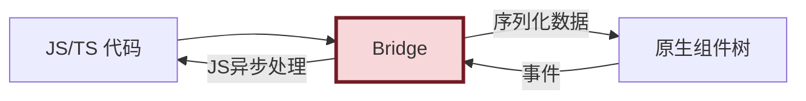

**RN 关键点**：
- 通过 Bridge 通信，存在异步延迟
- 渲染依赖原生组件，平台 UI 有差异
- JS 线程与原生线程独立，需注意性能

#### Flutter 原理

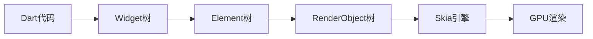

**Flutter 关键点**：
- 自带渲染引擎 Skia，不依赖原生 UI
- 单线程 Isolate 模式，无锁竞争
- AOT 编译为原生代码，性能高

#### 项目选型建议

```javascript
// 选择决策
function chooseCrossPlatform(requirements) {
  const { team, performance, uiConsistency, hotUpdate, packageSize } = requirements;

  if (team === 'JavaScript团队' && hotUpdate) {
    return 'React Native';  // 团队熟悉JS，需要热更新
  }

  if (uiConsistency && performance && packageSize > 20) {
    return 'Flutter';  // UI一致，性能优先，可接受大包体
  }

  if (performance && nativeAPIs) {
    return '原生开发';  // 性能极致，大量原生API
  }

  return 'H5 + WebView';  // 通用性优先，性能要求低
}
```

---

## 九、移动端安全与隐私

### 9.1 HTTPS 与证书绑定

**面试题：移动端如何防止中间人攻击（MITM）？**

#### 中间人攻击原理

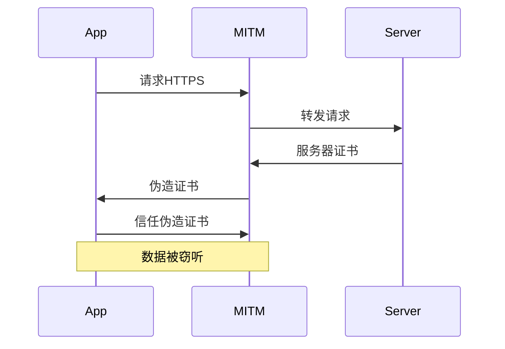

#### 证书绑定方案

```java
// Android: Network Security Config
// res/xml/network_security_config.xml
<?xml version="1.0" encoding="utf-8"?>
<network-security-config>
  <domain-config>
    <domain includeSubdomains="true">example.com</domain>
    <pin-set expirationDate="2024-12-31">
      <pin digest="SHA-256">7HIpactkIAq2Y49orFOOQKgrWRRaAw2Gs2...</pin>
      <pin digest="SHA-256">fwzaioLN6k9fPvTn2B3aJAVSrpRhxKNKEx...</pin>
    </pin-set>
  </domain-config>
</network-security-config>
```

```swift
// iOS: URLSessionDelegate
func urlSession(_ session: URLSession,
                didReceive challenge: URLAuthenticationChallenge,
                completionHandler: @escaping (URLSession.AuthChallengeDisposition, URLCredential?) -> Void) {
  guard challenge.protectionSpace.authenticationMethod == NSURLAuthenticationMethodServerTrust,
        let serverTrust = challenge.protectionSpace.serverTrust else {
    completionHandler(.performDefaultHandling, nil)
    return
  }

  // 校验证书
  let certificate = SecTrustGetCertificateAtIndex(serverTrust, 0)!
  let data = SecCertificateCopyData(certificate) as Data
  let localCertData = // 本地证书
  if data == localCertData {
    completionHandler(.useCredential, URLCredential(trust: serverTrust))
  } else {
    completionHandler(.cancelAuthenticationChallenge, nil)
  }
}
```

---

### 9.2 XSS 与 CSRF 防护在移动端的特殊性

**面试题：移动端 H5 相比 PC 端在 XSS/CSRF 防护上有什么特殊考虑？**

#### 移动端特殊性

1. **WebView 安全限制弱**：file://协议、cookie 共享
2. **Intent Scheme 风险**：Android Intent 可被劫持
3. **Universal Links**：iOS 可被滥用启动其他 App
4. **本地存储风险**：localStorage 无 HttpOnly 保护

#### XSS 防护

```javascript
// 1. 输入输出转义
function escapeHtml(str) {
  return str
    .replace(/&/g, '&amp;')
    .replace(/</g, '&lt;')
    .replace(/>/g, '&gt;')
    .replace(/"/g, '&quot;')
    .replace(/'/g, '&#x27;');
}

// 2. CSP配置
// <meta http-equiv="Content-Security-Policy"
//       content="default-src 'self'; script-src 'self' 'unsafe-inline'">

// 3. WebView禁用file://
// Android: webView.getSettings().setAllowFileAccess(false);
// iOS: 不允许file://加载外部资源

// 4. JS注入防护
// WebView添加接口时限定来源
class SecureBridge {
  constructor() {
    // 白名单校验
    this.trustedOrigins = ['https://example.com', 'https://cdn.example.com'];
  }

  onMessage(handler) {
    window.addEventListener('message', (e) => {
      if (!this.trustedOrigins.includes(e.origin)) return;
      handler(e.data);
    });
  }
}
```

#### CSRF 防护

```javascript
// 1. Token方案（不用Cookie传Token）
// 后端返回Token，前端存内存，每次请求加header
class TokenManager {
  constructor() {
    this.token = null;
  }

  setToken(token) {
    this.token = token;
    // 不存localStorage（XSS风险）
    // 也不依赖cookie（CSRF风险）
  }

  getHeaders() {
    return this.token ? { 'X-CSRF-Token': this.token } : {};
  }
}

// 2. SameSite Cookie（推荐）
// 后端配置：Set-Cookie: token=xxx; SameSite=Strict; Secure; HttpOnly
// 严格模式：跨站请求不携带Cookie
// 宽松模式（Lax）：仅顶层导航携带

// 3. 双重Cookie验证
// Cookie + Header双校验
fetch('/api', {
  headers: {
    'X-CSRF-Token': getCookie('csrfToken')  // 读取cookie放入header
  }
});
```

---

### 9.3 数据加密存储与本地安全

**面试题：如何在移动端安全存储敏感数据？localStorage 有什么风险？**

#### localStorage 风险

1. **XSS 可读取**：无 HttpOnly 保护
2. **同源共享**：子域名被攻破可读取
3. **明文存储**：无加密
4. **容量限制**：5-10MB

#### 安全存储方案

```javascript
// 方案1：AES加密存储（前端）
import CryptoJS from 'crypto-js';

class SecureStorage {
  constructor(secretKey) {
    this.key = CryptoJS.enc.Utf8.parse(secretKey);
  }

  set(key, value) {
    const encrypted = CryptoJS.AES.encrypt(
      JSON.stringify(value),
      this.key,
      { mode: CryptoJS.mode.ECB, padding: CryptoJS.pad.Pkcs7 }
    ).toString();
    localStorage.setItem(key, encrypted);
  }

  get(key) {
    const encrypted = localStorage.getItem(key);
    if (!encrypted) return null;
    const decrypted = CryptoJS.AES.decrypt(encrypted, this.key, {
      mode: CryptoJS.mode.ECB,
      padding: CryptoJS.pad.Pkcs7
    });
    try {
      return JSON.parse(decrypted.toString(CryptoJS.enc.Utf8));
    } catch {
      return null;
    }
  }

  remove(key) {
    localStorage.removeItem(key);
  }
}

// 使用
const storage = new SecureStorage('my-secret-key-32byteslong');
storage.set('userToken', { token: 'xxx', expire: Date.now() + 3600000 });
```

#### 方案2：原生安全存储

```javascript
// JSBridge调用原生Keychain/Keystore
class NativeSecureStorage {
  async set(key, value) {
    return await jsBridge.invoke('secureStorage', {
      action: 'set',
      key,
      value: JSON.stringify(value)
    });
  }

  async get(key) {
    const result = await jsBridge.invoke('secureStorage', {
      action: 'get',
      key
    });
    return result ? JSON.parse(result) : null;
  }
}
```

#### 方案3：SessionStorage（推荐用于会话数据）

```javascript
// sessionStorage 在页面关闭后清除，相对安全
class SessionStorage {
  set(key, value) {
    sessionStorage.setItem(key, JSON.stringify(value));
  }

  get(key) {
    const value = sessionStorage.getItem(key);
    return value ? JSON.parse(value) : null;
  }
}
```

#### 方案4：IndexedDB（大量数据）

```javascript
// IndexedDB容量大，但同样有XSS风险
// 适合非敏感大量数据
class IndexedDBStorage {
  constructor(dbName = 'appDB', version = 1) {
    this.dbName = dbName;
    this.version = version;
  }

  open() {
    return new Promise((resolve, reject) => {
      const request = indexedDB.open(this.dbName, this.version);
      request.onupgradeneeded = (e) => {
        const db = e.target.result;
        if (!db.objectStoreNames.contains('cache')) {
          db.createObjectStore('cache', { keyPath: 'key' });
        }
      };
      request.onsuccess = () => resolve(request.result);
      request.onerror = () => reject(request.error);
    });
  }

  async set(key, value) {
    const db = await this.open();
    return new Promise((resolve, reject) => {
      const tx = db.transaction('cache', 'readwrite');
      tx.objectStore('cache').put({ key, value });
      tx.oncomplete = () => resolve();
      tx.onerror = () => reject(tx.error);
    });
  }
}
```

---

## 十、综合项目实战题

### 10.1 实现一个商品列表页(下拉刷新+上拉加载)

**面试题：手写一个移动端无限滚动列表，支持下拉刷新和上拉加载。**

#### 完整实现

```html
<!DOCTYPE html>
<html lang="zh-CN">
<head>
  <meta charset="UTF-8">
  <meta name="viewport" content="width=device-width, initial-scale=1.0, viewport-fit=cover">
  <title>无限滚动列表</title>
  <style>
    * { margin: 0; padding: 0; box-sizing: border-box; }
    body { font-family: -apple-system, sans-serif; background: #f5f5f5; }

    .scroll-container {
      height: 100vh;
      overflow-y: auto;
      -webkit-overflow-scrolling: touch;
    }

    /* 下拉刷新提示 */
    .refresh-tip {
      position: absolute;
      top: 0;
      left: 0;
      right: 0;
      height: 50px;
      display: flex;
      align-items: center;
      justify-content: center;
      color: #999;
      transform: translateY(-50px);
      transition: transform 0.2s;
    }

    .refresh-tip.show { transform: translateY(0); }
    .refresh-tip.refreshing::after {
      content: '';
      display: inline-block;
      width: 16px;
      height: 16px;
      margin-left: 8px;
      border: 2px solid #999;
      border-top-color: transparent;
      border-radius: 50%;
      animation: spin 0.8s linear infinite;
    }

    @keyframes spin {
      to { transform: rotate(360deg); }
    }

    /* 商品卡片 */
    .product-item {
      background: #fff;
      margin: 8px;
      padding: 12px;
      border-radius: 8px;
      display: flex;
      align-items: center;
      box-shadow: 0 1px 3px rgba(0,0,0,0.05);
    }

    .product-img {
      width: 80px;
      height: 80px;
      background: #eee;
      margin-right: 12px;
      border-radius: 4px;
    }

    .product-info { flex: 1; }
    .product-name { font-size: 14px; margin-bottom: 4px; }
    .product-price { color: #f50; font-size: 16px; }

    /* 加载更多 */
    .load-more {
      text-align: center;
      padding: 20px;
      color: #999;
      font-size: 14px;
    }

    .load-more.loading::after {
      content: '';
      display: inline-block;
      width: 14px;
      height: 14px;
      margin-left: 8px;
      border: 2px solid #999;
      border-top-color: transparent;
      border-radius: 50%;
      animation: spin 0.8s linear infinite;
    }
  </style>
</head>
<body>
  <div class="scroll-container" id="container">
    <div class="refresh-tip" id="refreshTip">下拉刷新</div>
    <div id="list"></div>
    <div class="load-more" id="loadMore">上拉加载更多</div>
  </div>

  <script>
    class InfiniteScroll {
      constructor(options) {
        this.container = options.container;
        this.listEl = options.listEl;
        this.refreshTip = options.refreshTip;
        this.loadMoreEl = options.loadMoreEl;
        this.onRefresh = options.onRefresh;
        this.onLoadMore = options.onLoadMore;

        this.page = 1;
        this.pageSize = 20;
        this.loading = false;
        this.refreshing = false;
        this.hasMore = true;

        this.bindEvents();
      }

      bindEvents() {
        // 下拉刷新
        let startY = 0, currentY = 0;
        let pullDistance = 0;

        this.container.addEventListener('touchstart', (e) => {
          if (this.container.scrollTop !== 0 || this.refreshing) return;
          startY = e.touches[0].clientY;
          this.refreshTip.classList.add('show');
        }, { passive: true });

        this.container.addEventListener('touchmove', (e) => {
          if (this.refreshing) return;
          currentY = e.touches[0].clientY;
          pullDistance = currentY - startY;

          if (pullDistance > 0 && this.container.scrollTop === 0) {
            // 阻止原生滚动
            if (e.cancelable) e.preventDefault();
            // 阻尼效果
            const dampDistance = pullDistance * 0.4;
            this.refreshTip.style.transform = `translateY(${Math.min(dampDistance, 80) - 50}px)`;
            this.refreshTip.textContent = pullDistance > 80 ? '释放刷新' : '下拉刷新';
          }
        }, { passive: false });

        this.container.addEventListener('touchend', async () => {
          if (this.refreshing) return;
          if (pullDistance > 80) {
            await this.refresh();
          }
          this.refreshTip.style.transform = '';
          this.refreshTip.classList.remove('show');
          pullDistance = 0;
        });

        // 上拉加载
        this.container.addEventListener('scroll', this.throttle(() => {
          if (this.loading || !this.hasMore || this.refreshing) return;

          const { scrollTop, scrollHeight, clientHeight } = this.container;
          if (scrollHeight - scrollTop - clientHeight < 100) {
            this.loadMore();
          }
        }, 200), { passive: true });
      }

      async refresh() {
        this.refreshing = true;
        this.refreshTip.classList.add('refreshing');
        this.refreshTip.textContent = '正在刷新';

        try {
          this.page = 1;
          const data = await this.onRefresh(this.page, this.pageSize);
          this.listEl.innerHTML = '';
          this.renderItems(data);
          this.hasMore = data.length === this.pageSize;
        } finally {
          this.refreshing = false;
          this.refreshTip.classList.remove('refreshing');
        }
      }

      async loadMore() {
        this.loading = true;
        this.loadMoreEl.classList.add('loading');
        this.loadMoreEl.textContent = '加载中';

        try {
          this.page++;
          const data = await this.onLoadMore(this.page, this.pageSize);
          this.renderItems(data);
          this.hasMore = data.length === this.pageSize;
          this.loadMoreEl.textContent = this.hasMore ? '上拉加载更多' : '没有更多了';
        } finally {
          this.loading = false;
          this.loadMoreEl.classList.remove('loading');
        }
      }

      renderItems(items) {
        const html = items.map(item => `
          <div class="product-item">
            <div class="product-img" style="background-image:url(${item.img});background-size:cover"></div>
            <div class="product-info">
              <div class="product-name">${item.name}</div>
              <div class="product-price">¥${item.price}</div>
            </div>
          </div>
        `).join('');
        this.listEl.insertAdjacentHTML('beforeend', html);
      }

      throttle(fn, delay) {
        let last = 0;
        return (...args) => {
          const now = Date.now();
          if (now - last >= delay) {
            fn.apply(this, args);
            last = now;
          }
        };
      }
    }

    // 模拟API
    function fetchProducts(page, size) {
      return new Promise(resolve => {
        setTimeout(() => {
          const products = Array.from({ length: size }, (_, i) => ({
            id: (page - 1) * size + i,
            name: `商品 ${(page - 1) * size + i + 1}`,
            price: Math.floor(Math.random() * 1000),
            img: `https://via.placeholder.com/80x80?text=${i}`
          }));
          resolve(products);
        }, 800);
      });
    }

    // 初始化
    const scroller = new InfiniteScroll({
      container: document.getElementById('container'),
      listEl: document.getElementById('list'),
      refreshTip: document.getElementById('refreshTip'),
      loadMoreEl: document.getElementById('loadMore'),
      onRefresh: fetchProducts,
      onLoadMore: fetchProducts
    });

    // 首次加载
    scroller.refresh();
  </script>
</body>
</html>
```

#### 项目实战踩坑

> **问题1**：iOS 下下拉刷新时页面会跟着滚动。
>
> **方案**：touchmove 中 preventDefault，但必须 `passive: false`。

> **问题2**：滚动到顶部判断不准确。
>
> **方案**：使用 `scrollTop <= 0` 替代 `scrollTop === 0`，避免浮点误差。

> **问题3**：加载到最后一页时，loadMore 一直显示 loading。
>
> **方案**：后端返回 hasMore 字段，前端依据显示。

---

### 10.2 设计移动端轮播图组件(支持手势)

**面试题：实现一个支持手势滑动的移动端轮播组件。**

#### 完整实现

```javascript
class MobileCarousel {
  constructor(options) {
    this.container = options.container;
    this.slides = options.slides;
    this.interval = options.interval || 3000;
    this.loop = options.loop !== false;
    this.autoPlay = options.autoPlay !== false;

    this.currentIndex = 0;
    this.isDragging = false;
    this.startX = 0;
    this.currentX = 0;
    this.translateX = 0;
    this.timer = null;

    this.render();
    this.bindEvents();

    if (this.autoPlay) this.startAutoPlay();
  }

  render() {
    const slidesCount = this.slides.length;
    this.container.innerHTML = `
      <div class="carousel-wrapper" style="overflow:hidden;position:relative;">
        <div class="carousel-track" style="display:flex;transition:transform 0.3s ease;will-change:transform;">
          ${this.slides.map(slide => `
            <div class="carousel-slide" style="flex:0 0 100%;position:relative;">
              
              ${slide.title ? `<div style="position:absolute;bottom:0;left:0;right:0;padding:10px;background:linear-gradient(transparent,rgba(0,0,0,0.5));color:#fff;">${slide.title}</div>` : ''}
            </div>
          `).join('')}
        </div>
        ${slidesCount > 1 ? `
          <div class="carousel-dots" style="position:absolute;bottom:10px;left:50%;transform:translateX(-50%);display:flex;gap:6px;">
            ${this.slides.map((_, i) => `
              <span class="carousel-dot" data-index="${i}" style="width:6px;height:6px;border-radius:50%;background:${i === 0 ? '#fff' : 'rgba(255,255,255,0.5)'};transition:all 0.3s;"></span>
            `).join('')}
          </div>
        ` : ''}
      </div>
    `;

    this.track = this.container.querySelector('.carousel-track');
    this.dots = this.container.querySelectorAll('.carousel-dot');
    this.wrapperWidth = this.container.offsetWidth;
  }

  bindEvents() {
    // 触摸事件
    this.track.addEventListener('touchstart', this.onTouchStart.bind(this), { passive: false });
    this.track.addEventListener('touchmove', this.onTouchMove.bind(this), { passive: false });
    this.track.addEventListener('touchend', this.onTouchEnd.bind(this));

    // 过渡结束
    this.track.addEventListener('transitionend', this.onTransitionEnd.bind(this));

    // 点击圆点
    this.dots.forEach(dot => {
      dot.addEventListener('click', () => {
        this.goTo(parseInt(dot.dataset.index));
      });
    });

    // 可见性变化暂停
    document.addEventListener('visibilitychange', () => {
      if (document.hidden) this.stopAutoPlay();
      else if (this.autoPlay) this.startAutoPlay();
    });
  }

  onTouchStart(e) {
    this.isDragging = true;
    this.startX = e.touches[0].clientX;
    this.track.style.transition = 'none';
    this.stopAutoPlay();
  }

  onTouchMove(e) {
    if (!this.isDragging) return;
    e.preventDefault();  // 阻止页面滚动
    this.currentX = e.touches[0].clientX;
    const diff = this.currentX - this.startX;
    this.translateX = -this.currentIndex * this.wrapperWidth + diff;
    this.track.style.transform = `translateX(${this.translateX}px)`;
  }

  onTouchEnd() {
    if (!this.isDragging) return;
    this.isDragging = false;
    this.track.style.transition = 'transform 0.3s ease';

    const diff = this.currentX - this.startX;
    const threshold = this.wrapperWidth * 0.2;

    if (diff > threshold) {
      this.goTo(this.currentIndex - 1);
    } else if (diff < -threshold) {
      this.goTo(this.currentIndex + 1);
    } else {
      this.goTo(this.currentIndex);
    }

    if (this.autoPlay) this.startAutoPlay();
  }

  goTo(index) {
    const total = this.slides.length;
    if (this.loop) {
      // 循环：模运算
      this.currentIndex = ((index % total) + total) % total;
    } else {
      this.currentIndex = Math.max(0, Math.min(total - 1, index));
    }

    this.track.style.transform = `translateX(${-this.currentIndex * this.wrapperWidth}px)`;
    this.updateDots();
  }

  updateDots() {
    this.dots.forEach((dot, i) => {
      dot.style.background = i === this.currentIndex ? '#fff' : 'rgba(255,255,255,0.5)';
      dot.style.width = i === this.currentIndex ? '20px' : '6px';
    });
  }

  onTransitionEnd() {
    // 循环模式可在此实现无限滚动
  }

  startAutoPlay() {
    this.stopAutoPlay();
    this.timer = setInterval(() => {
      this.goTo(this.currentIndex + 1);
    }, this.interval);
  }

  stopAutoPlay() {
    clearInterval(this.timer);
  }

  destroy() {
    this.stopAutoPlay();
    this.track.removeEventListener('touchstart', this.onTouchStart);
    this.track.removeEventListener('touchmove', this.onTouchMove);
    this.track.removeEventListener('touchend', this.onTouchEnd);
  }
}

// 使用
const carousel = new MobileCarousel({
  container: document.getElementById('carousel'),
  slides: [
    { image: 'banner1.jpg', title: '活动1' },
    { image: 'banner2.jpg', title: '活动2' },
    { image: 'banner3.jpg', title: '活动3' }
  ],
  interval: 4000,
  loop: true,
  autoPlay: true
});
```

#### 项目实战踩坑

> **问题1**：滑动过程中图片变形。
>
> **原因**：transition 未移除，导致 transform 滞后。
>
> **方案**：touchstart 时设 `transition: none`，touchend 时恢复。

> **问题2**：循环模式下最后一页滑到第一页有"回弹"动画。
>
> **方案**：复制首尾两张图，过渡结束后瞬间跳到真实位置（无缝轮播）。

---

### 10.3 大促活动页 1px 适配全方案

**面试题：电商大促活动页要求视觉一致，如何实现 1px 边框全方案？**

#### 综合方案

```css
/* 全局 1px 边框混合方案 */
@charset "UTF-8";

/* 方案1：transform scale（推荐，适用于元素边框） */
@mixin retina-border($color: #ddd, $position: bottom) {
  position: relative;

  &::after {
    content: "";
    position: absolute;
    #{$position}: 0;
    left: 0;
    width: 100%;
    height: 1px;
    background-color: $color;
    transform-origin: 0 0;
    pointer-events: none;

    @media (-webkit-min-device-pixel-ratio: 2) {
      transform: scaleY(0.5);
    }
    @media (-webkit-min-device-pixel-ratio: 3) {
      transform: scaleY(0.333);
    }
  }
}

/* 方案2：0.5px（iOS 8+，配合降级） */
@mixin hairline-border($color: #ddd) {
  border: 1px solid $color;
  @supports (border-width: 0.5px) {
    border-width: 0.5px;
  }
}

/* 方案3：box-shadow（兼容性好） */
@mixin shadow-border($color: #ddd) {
  box-shadow: 0 0 0 0.5px $color;
}

/* 使用示例 */
.list-item { @include retina-border(#e5e5e5, bottom); }
.card { @include hairline-border(#ddd); }
.icon-border { @include shadow-border(#ccc); }
```

```javascript
// 动态注入1px适配脚本（兜底方案）
function injectRetinaBorder() {
  const dpr = window.devicePixelRatio || 1;
  const scale = 1 / dpr;
  const style = document.createElement('style');
  style.textContent = `
    [data-retina-border]::after {
      transform: scale(${scale}) !important;
      transform-origin: 0 0;
    }
  `;
  document.head.appendChild(style);
}

injectRetinaBorder();
```

#### 项目实战踩坑

> **项目背景**：双11活动页在 iPhone 12 Pro（DPR=3）下边框明显变粗。
>
> **解决方案**：组合方案，SCSS 混合 + PostCSS 自动转换。

```javascript
// postcss.config.js 保留1px不转换
module.exports = {
  plugins: {
    'postcss-px-to-viewport': {
      viewportWidth: 375,
      minPixelValue: 2  // 小于2px不转换，1px边框保留
    }
  }
};
```

```css
/* SCSS统一封装 */
@import './retina-border';

.activity-card {
  @include retina-border(#ff6700, bottom);

  &-inner {
    @include retina-border(#eee, top);
  }
}
```

> **踩坑记录**：
> 1. 0.5px 在 Android WebView 不支持，必须有降级
> 2. transform scale 的伪元素会影响圆角，需配合 box-sizing: border-box
> 3. 媒体查询 DPR 不准确，部分厂商定制系统会伪造 DPR

---

### 10.4 直播间高并发消息流渲染优化

**面试题：直播间每秒新增数百条弹幕消息，如何保证滚动流畅？**

#### 问题分析

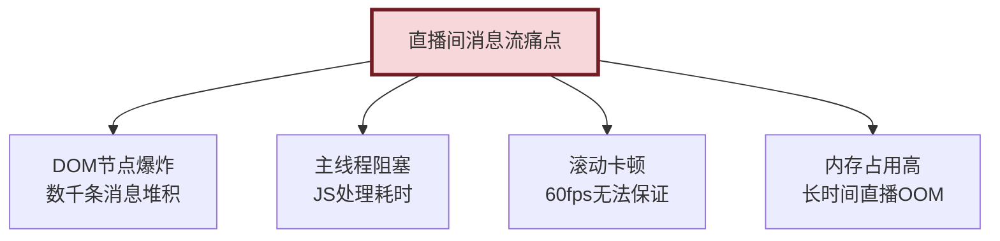

#### 综合优化方案

**1. 虚拟列表（核心）**

```javascript
class DanmakuVirtualList {
  constructor(container, options = {}) {
    this.container = container;
    this.itemHeight = options.itemHeight || 40;
    this.maxItems = options.maxItems || 100;  // 最大保留条数
    this.bufferSize = options.bufferSize || 10;

    this.messages = [];
    this.startIndex = 0;
    this.visibleCount = Math.ceil(container.clientHeight / this.itemHeight);
    this.endIndex = this.startIndex + this.visibleCount + this.bufferSize;

    this.init();
  }

  init() {
    this.container.innerHTML = `
      <div class="vl-content" style="position:relative;height:100%;overflow-y:auto;-webkit-overflow-scrolling:touch;">
        <div class="vl-track" style="position:absolute;top:0;left:0;right:0;will-change:transform;"></div>
      </div>
    `;
    this.scrollEl = this.container.querySelector('.vl-content');
    this.trackEl = this.container.querySelector('.vl-track');

    this.scrollEl.addEventListener('scroll', this.onScroll.bind(this), { passive: true });
  }

  // 添加新消息
  add(message) {
    this.messages.push(message);
    // 超过最大条数时移除旧消息
    if (this.messages.length > this.maxItems) {
      this.messages.shift();
      this.startIndex = Math.max(0, this.startIndex - 1);
    }
    this.render();
  }

  // 批量添加
  batchAdd(newMessages) {
    this.messages.push(...newMessages);
    while (this.messages.length > this.maxItems) {
      this.messages.shift();
      this.startIndex = Math.max(0, this.startIndex - 1);
    }
    this.render();
  }

  onScroll() {
    const scrollTop = this.scrollEl.scrollTop;
    const newStart = Math.max(0, Math.floor(scrollTop / this.itemHeight) - this.bufferSize);
    const newEnd = Math.min(
      this.messages.length,
      newStart + this.visibleCount + this.bufferSize * 2
    );

    if (newStart !== this.startIndex || newEnd !== this.endIndex) {
      this.startIndex = newStart;
      this.endIndex = newEnd;
      this.render();
    }
  }

  render() {
    const items = this.messages.slice(this.startIndex, this.endIndex);
    const html = items.map(msg => `
      <div class="msg-item" style="height:${this.itemHeight}px;display:flex;align-items:center;padding:0 12px;">
        <span style="color:${msg.color};margin-right:8px;">${msg.nickname}:</span>
        <span>${msg.content}</span>
      </div>
    `).join('');

    this.trackEl.innerHTML = html;
    this.trackEl.style.transform = `translateY(${this.startIndex * this.itemHeight}px)`;
    this.trackEl.style.height = `${this.messages.length * this.itemHeight}px`;
  }
}
```

**2. requestAnimationFrame 批量更新**

```javascript
class BatchUpdater {
  constructor() {
    this.queue = [];
    this.scheduled = false;
  }

  add(item) {
    this.queue.push(item);
    if (!this.scheduled) {
      this.scheduled = true;
      requestAnimationFrame(() => {
        this.flush();
        this.scheduled = false;
      });
    }
  }

  flush() {
    if (this.queue.length === 0) return;
    const items = this.queue.splice(0);
    // 批量处理，一次DOM更新
    virtualList.batchAdd(items);
  }
}

const batchUpdater = new BatchUpdater();

// WebSocket消息接收
ws.onmessage = (event) => {
  const msg = JSON.parse(event.data);
  batchUpdater.add(msg);
};
```

**3. 消息节流（防抖）**

```javascript
class MessageThrottler {
  constructor(maxPerSecond = 50) {
    this.maxPerSecond = maxPerSecond;
    this.queue = [];
    this.lastFlush = 0;
  }

  add(message) {
    this.queue.push(message);
    this.flushIfNeeded();
  }

  flushIfNeeded() {
    const now = Date.now();
    const elapsed = now - this.lastFlush;

    if (elapsed >= 1000 / this.maxPerSecond) {
      this.flush();
    } else {
      setTimeout(() => this.flushIfNeeded(), 1000 / this.maxPerSecond - elapsed);
    }
  }

  flush() {
    if (this.queue.length === 0) return;
    // 限制单次渲染数量，超出丢弃或合并
    const items = this.queue.splice(0, 20);
    virtualList.batchAdd(items);
    this.lastFlush = Date.now();
  }
}
```

**4. CSS 优化**

```css
/* GPU加速 */
.msg-item {
  will-change: transform;
  transform: translateZ(0);
  contain: layout style paint;  /* 限制重排范围 */
}

/* content-visibility（Chrome 85+） */
.msg-item {
  content-visibility: auto;
  contain-intrinsic-size: 40px;
}
```

**5. 内存优化**

```javascript
// 定期清理（每5分钟）
setInterval(() => {
  if (virtualList.messages.length > 500) {
    virtualList.messages = virtualList.messages.slice(-200);
    virtualList.render();
    console.log('清理旧消息');
  }
}, 5 * 60 * 1000);

// 长消息截断
function truncateMessage(content, maxLen = 50) {
  return content.length > maxLen ? content.slice(0, maxLen) + '...' : content;
}

// 对象池复用
class MessagePool {
  constructor() {
    this.pool = [];
  }

  acquire() {
    return this.pool.pop() || { nickname: '', content: '', color: '' };
  }

  release(msg) {
    msg.nickname = '';
    msg.content = '';
    msg.color = '';
    this.pool.push(msg);
  }
}
```

#### 项目实战效果

> **项目背景**：电商直播，峰值在线 5 万人，弹幕峰值 500 条/秒。
>
> **优化前**：DOM 节点 5000+，FPS 跌至 10，CPU 占用 90%。
>
> **优化后**：DOM 节点稳定 30，FPS 稳定 55+，CPU 占用 30%。
>
> **关键指标对比**：

| 指标 | 优化前 | 优化后 |
|------|--------|--------|
| DOM 节点数 | 5000+ | ~30 |
| 内存占用 | 持续增长 | 稳定 |
| FPS | 10 | 55+ |
| CPU 占用 | 90% | 30% |
| 滚动延迟 | 严重卡顿 | 流畅 |

---

## 十一、面试高频速答与踩坑总结

### 11.1 高频速答卡片

#### 基础概念类

**Q：1 秒能说出移动端适配三要素？**
A：① viewport meta 配置；② REM 或 VW 单位适配；③ 1px 边框 DPR 适配。

**Q：300ms 延迟怎么解决？**
A：① `<meta viewport>` 配置 `width=device-width`（现代浏览器自动消除）；② FastClick 库；③ CSS `touch-action: manipulation`。

**Q：1px 边框方案最快的写法？**
A：`@media (-webkit-min-device-pixel-ratio: 2) { border-width: 0.5px; }`（iOS 8+），或 `transform: scaleY(0.5)` 兼容性更好。

#### 性能优化类

**Q：首屏优化 5 个手段？**
A：① 路由懒加载；② 关键 CSS 内联；③ 图片懒加载；④ 资源预加载；⑤ CDN 加速。

**Q：长列表性能优化？**
A：① 虚拟列表；② requestAnimationFrame 批量更新；③ will-change + transform GPU 加速；④ content-visibility 自动跳过不可见区域渲染。

**Q：滚动卡顿排查步骤？**
A：① 检查是否有强制同步布局（layout thrashing）；② 是否大量重排重绘；③ 是否 JS 阻塞主线程；④ 是否未使用 passive 监听。

#### 兼容性类

**Q：iOS fixed 失效怎么办？**
A：① 检查祖先是否有 transform；② 用 sticky 替代；③ 键盘弹起时切换为 absolute；④ 用 VisualViewport API 调整位置。

**Q：iOS 日期 Invalid Date？**
A：用 `new Date(str.replace(/-/g, '/'))`，将 `-` 替换为 `/`。

**Q：input 聚焦页面放大？**
A：input `font-size` 至少 16px，或用 `transform: scale(0.875)` 视觉缩小。

### 11.2 高频踩坑总结

#### 踩坑1：iOS input 失焦后页面错位

```javascript
// 问题：input blur 后，页面整体上移未恢复
// 解决：blur 时强制 scroll
input.addEventListener('blur', () => {
  setTimeout(() => window.scrollTo(0, 0), 100);
});
```

#### 踩坑2：Android 软键盘弹起 fixed 元素遮挡

```javascript
// 问题：Android 下 fixed 底部栏被键盘遮挡
// 解决：监听 resize 调整位置
window.addEventListener('resize', () => {
  const fixedEl = document.querySelector('.fixed-bottom');
  const visibleHeight = document.documentElement.clientHeight;
  if (visibleHeight < originHeight) {
    fixedEl.style.bottom = `${originHeight - visibleHeight}px`;
  } else {
    fixedEl.style.bottom = '0';
  }
});
```

#### 踩坑3：iOS WKWebView 不支持 fetch

```javascript
// 问题：iOS 9 以下 WKWebView 无 fetch API
// 解决：polyfill 或用 XMLHttpRequest
async function safeFetch(url, options = {}) {
  if ('fetch' in window) {
    return fetch(url, options);
  }
  return new Promise((resolve, reject) => {
    const xhr = new XMLHttpRequest();
    xhr.open(options.method || 'GET', url);
    Object.keys(options.headers || {}).forEach(key => {
      xhr.setRequestHeader(key, options.headers[key]);
    });
    xhr.onload = () => resolve({ ok: xhr.status >= 200, json: () => Promise.resolve(JSON.parse(xhr.responseText)) });
    xhr.onerror = reject;
    xhr.send(options.body);
  });
}
```

#### 踩坑4：滚动惯性 -webkit-overflow-scrolling 失效

```css
/* 问题：iOS 下 overflow:auto 无惯性滚动 */
/* 解决：加 -webkit-overflow-scrolling: touch */
.scroll-container {
  overflow-y: auto;
  -webkit-overflow-scrolling: touch;
}

/* 注意：会创建独立的合成层，导致内部 fixed 失效 */
```

#### 踩坑5：position: sticky 不生效

```css
/* 常见原因 */
.sticky {
  position: sticky;
  top: 0;
}

/* 检查清单 */
/* 1. 父元素是否 overflow: hidden/auto（必须为 visible） */
/* 2. 父元素高度是否足够（必须高于 sticky 元素） */
/* 3. 是否设置了 top/right/bottom/left（必须至少一个） */
/* 4. 父元素是否有 transform（会创建包含块） */
```

#### 踩坑6：iOS 下 video 自动播放

```html
<!-- 问题：iOS 下 video autoplay 无效 -->
<!-- 解决：静音 + playsinline + webkit-playsinline -->
<video
  src="video.mp4"
  autoplay
  muted
  playsinline
  webkit-playsinline
  x5-video-player-type="h5-page"
></video>

<script>
// 必须用户交互后才能播放
document.addEventListener('touchstart', () => {
  video.play();
}, { once: true });
</script>
```

### 11.3 面试准备建议

#### 知识体系图

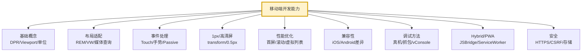

#### 复习重点优先级

| 优先级 | 内容 | 复习建议 |
|--------|------|----------|
| P0 | 移动端适配（REM/VW） | 必须能手写 |
| P0 | 1px 边框方案 | 至少掌握 transform 方案 |
| P0 | 300ms 延迟 / 点击穿透 | 能讲清原理与方案 |
| P1 | Touch 事件 / 手势 | 能实现长按、滑动 |
| P1 | 软键盘适配 | 知道 iOS/Android 差异 |
| P1 | 性能优化（虚拟列表） | 能实现基础版 |
| P2 | fixed 定位失效 | 知道原因与替代方案 |
| P2 | 安全区适配 | env() 使用 |
| P3 | PWA / JSBridge | 理解原理 |
| P3 | 调试工具 | vConsole/真机调试 |

#### 简历加分项

1. **具体数字**：如"优化首屏加载从 3s 到 1s"
2. **技术方案**：如"采用 VW + PostCSS 实现自动化适配"
3. **兼容性经验**：如"解决 iOS 13+ WKWebView 的 VisualViewport 适配"
4. **性能指标**：如"FPS 从 30 提升至 55"
5. **工程化实践**：如"搭建移动端 1px 适配 SCSS 组件库"

---

## 参考资料与延伸阅读

- [MDN: 移动端 Web 开发](https://developer.mozilla.org/zh-CN/docs/Web/Guide/Mobile)
- [阿里无线前端: 使用 Flexible 实现H5适配](https://github.com/amfe/article/issues/17)
- [WebView 缓存机制与适配](https://developer.chrome.com/docs/multidevice/webview/)
- [Web.dev: 移动端性能优化](https://web.dev/fast/)
- [PWA 官方文档](https://web.dev/progressive-web-apps/)
- [WebKit 开发指南](https://webkit.org/)

---

> 文档总结：本文涵盖移动端开发 11 大模块共 40+ 道高频面试题，从基础概念到项目实战层层递进，每道题包含原理讲解、代码示例、项目背景与踩坑经验，适合系统化复习与面试备战。建议重点关注 P0 级内容，做到能手写代码、能讲清原理。