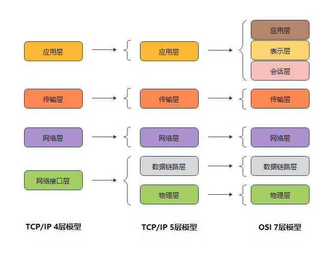
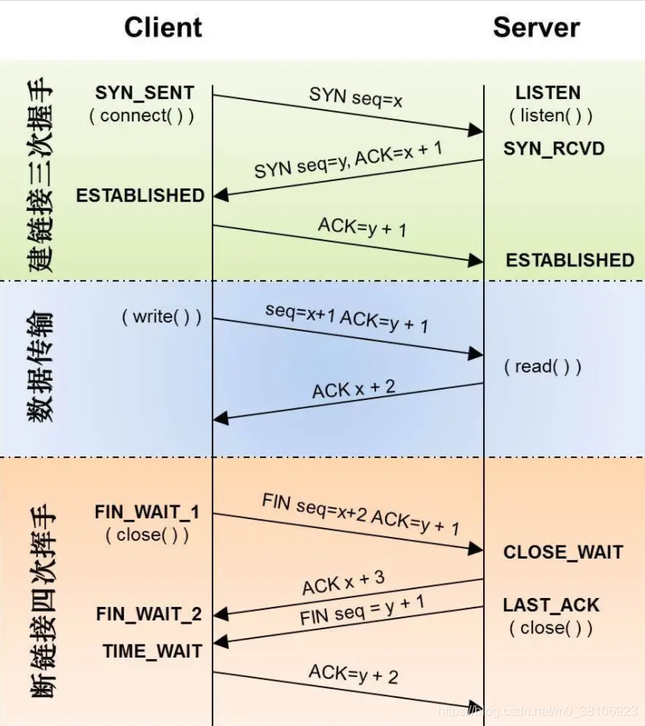

### 一、OSI七层模型

OSI（Open Systems Interconnection）模型是一个概念性的框架，用于理解网络系统中不同部分如何交互。它将网络通信分为七层，每一层都有特定的功能和协议。


| 层数 | 名称         | 功能描述                                                    | 协议示例                  |名称         | 
|------|--------------|------------------------------------------------------------|-----------------------|----------------|
| 7    | 应用层       | 为应用程序提供网络服务接口 ，对用户不透明的提供各种服务，如E-mail。                              | HTTP, FTP, SMTP, DNS         | 数据
| 6    | 表示层       | 数据转换（编码/解码）、加密解密、压缩解压      。实现数据转换(包括格式转换、压缩、加密等)，提供标准的应用接口、公用的通信服务、公共数据表示方法。                | SSL/TLS, JPEG, ASCII         |
| 5    | 会话层       | 建立、管理和终止会话（连接） ，建立通信进程的逻辑名字与物理名字之间的联系，提供进程之间建立、管理和终止会话的方法，处理同步与恢复问题。                            | NetBIOS, RPC                 |
| 4    | 传输层       | 提供端到端的可靠数据传输，流量控制，错误控制，提供端-端间可靠的、透明的数据传输，保证报文顺序的正确性、数据的完整性。              | TCP, UDP                     | 报文段
| 3    | 网络层       | 负责数据包的路由和转发（选择最佳路径），在源节点-目的节点之间进行路由选择、拥塞控制、顺序控制、传送包，保证报文的正确性。网络层控制着通信子网的运行，因而它又称为通信子网层。                      | IP, ICMP, OSPF, BGP          | IP分组
| 2    | 数据链路层   | 在相邻节点之间传输数据，提供物理寻址（MAC地址），错误检测。把不可靠的信道变为可靠的信道。为此将比特组成帧，在链路上提供点到点的帧传输，并进行差错控制、流量控制等。       | Ethernet, PPP, Switch        | 帧
| 1    | 物理层       | 传输原始比特流，定义物理介质（电缆、光纤等）和电气特性，在链路上透明地传输位。需要完成的工作包括线路配置、确定数据传输模式、确定信号形式、对信号进行编码、连接传输介质。为此定义了建立、维护和拆除物理链路所具备的机械特性、电气特性、功能特性以及规程特性。           | RJ45, IEEE 802.11 (Wi-Fi)    | 比特


### 横向对比下TCP/IP4层模型、5层模型和OSI七层模型的差别



### TCP的三次握手和四次挥手

```TCP的三次握手和四次挥手实质就是TCP通信的连接和断开。```

三次握手：为了对每次发送的数据量进行跟踪与协商，确保数据段的发送和接收同步，根据所接收到的数据量而确认数据发送、接收完毕后何时撤消联系，并建立虚连接。

四次挥手：即终止TCP连接，就是指断开一个TCP连接时，需要客户端和服务端总共发送4个包以确认连接的断开。




##### 1、三次握手

TCP协议位于传输层，作用是提供可靠的字节流服务，为了准确无误地将数据送达目的地，TCP协议采纳三次握手策略。

__三次握手​​​​​​​原理__：

第1次握手：客户端发送一个带有SYN（synchronize）标志的数据包给服务端；

第2次握手：服务端接收成功后，回传一个带有SYN/ACK标志的数据包传递确认信息，表示我收到了；

第3次握手：客户端再回传一个带有ACK标志的数据包，表示我知道了，握手结束。

其中：SYN标志位数置1，表示建立TCP连接；ACK标志表示验证字段。

__三次握手过程详细说明：__

1、客户端发送建立TCP连接的请求报文，其中报文中包含seq序列号，是由发送端随机生成的，并且将报文中的SYN字段置为1，表示需要建立TCP连接。（SYN=1，seq=x，x为随机生成数值）；

2、服务端回复客户端发送的TCP连接请求报文，其中包含seq序列号，是由回复端随机生成的，并且将SYN置为1，而且会产生ACK字段，ACK字段数值是在客户端发送过来的序列号seq的基础上加1进行回复，以便客户端收到信息时，知晓自己的TCP建立请求已得到验证。（SYN=1，ACK=x+1，seq=y，y为随机生成数值）这里的ack加1可以理解为是确认和谁建立连接；

3、服务端回复客户端发送的TCP连接请求报文，其中包含seq序列号，是由回复端随机生成的，并且将SYN置为1，而且会产生ACK字段，ACK字段数值是在客户端发送过来的序列号seq的基础上加1进行回复，以便客户端收到信息时，知晓自己的TCP建立请求已得到验证。（SYN=1，ACK=x+1，seq=y，y为随机生成数值）这里的ack加1可以理解为是确认和谁建立连接；

##### 2、四次挥手

由于TCP连接是全双工的，因此每个方向都必须单独进行关闭。这原则是当一方完成它的数据发送任务后就能发送一个FIN来终止这个方向的连接。收到一个 FIN只意味着这一方向上没有数据流动，一个TCP连接在收到一个FIN后仍能发送数据。首先进行关闭的一方将执行主动关闭，而另一方执行被动关闭

__四次挥手​​​​​​​原理：__


第1次挥手：客户端发送一个FIN，用来关闭客户端到服务端的数据传送，客户端进入FIN_WAIT_1状态；

第2次挥手：服务端收到FIN后，发送一个ACK给客户端，确认序号为收到序号+1（与SYN相同，一个FIN占用一个序号），服务端进入CLOSE_WAIT状态；

第3次挥手：服务端发送一个FIN，用来关闭服务端到客户端的数据传送，服务端进入LAST_ACK状态；

第4次挥手：客户端收到FIN后，客户端t进入TIME_WAIT状态，接着发送一个ACK给Server，确认序号为收到序号+1，服务端进入CLOSED状态，完成四次挥手。

其中：FIN标志位数置1，表示断开TCP连接。

__四次挥手​​​​​​​过程详细说明：__

1、客户端发送断开TCP连接请求的报文，其中报文中包含seq序列号，是由发送端随机生成的，并且还将报文中的FIN字段置为1，表示需要断开TCP连接。（FIN=1，seq=x，x由客户端随机生成）；

2、服务端会回复客户端发送的TCP断开请求报文，其包含seq序列号，是由回复端随机生成的，而且会产生ACK字段，ACK字段数值是在客户端发过来的seq序列号基础上加1进行回复，以便客户端收到信息时，知晓自己的TCP断开请求已经得到验证。（FIN=1，ACK=x+1，seq=y，y由服务端随机生成）；

3、服务端在回复完客户端的TCP断开请求后，不会马上进行TCP连接的断开，服务端会先确保断开前，所有传输到A的数据是否已经传输完毕，一旦确认传输数据完毕，就会将回复报文的FIN字段置1，并且产生随机seq序列号。（FIN=1，ACK=x+1，seq=z，z由服务端随机生成）；

4、客户端收到服务端的TCP断开请求后，会回复服务端的断开请求，包含随机生成的seq字段和ACK字段，ACK字段会在服务端的TCP断开请求的seq基础上加1，从而完成服务端请求的验证回复。（FIN=1，ACK=z+1，seq=h，h为客户端随机生成）
 至此TCP断开的4次挥手过程完毕。