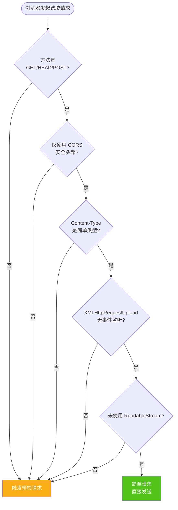
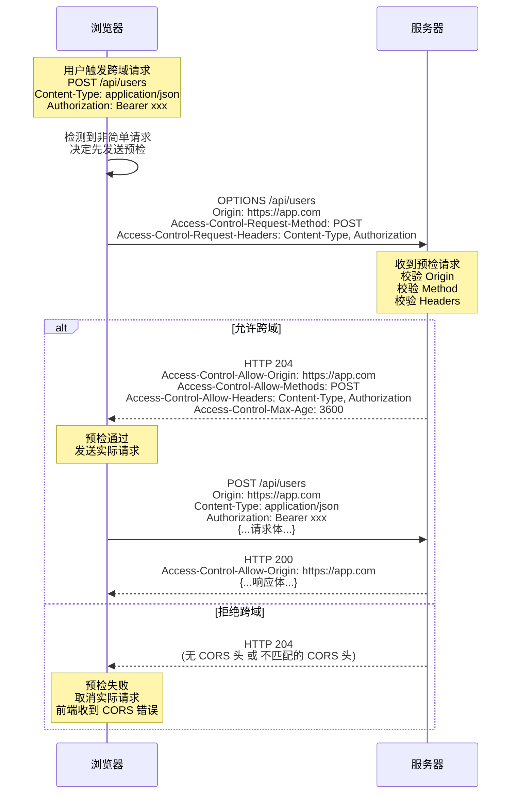
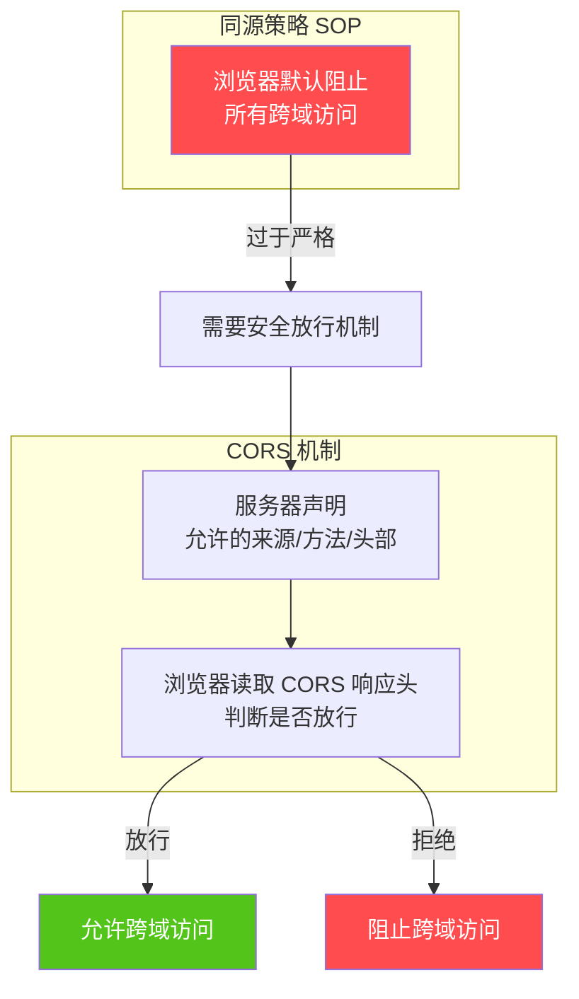
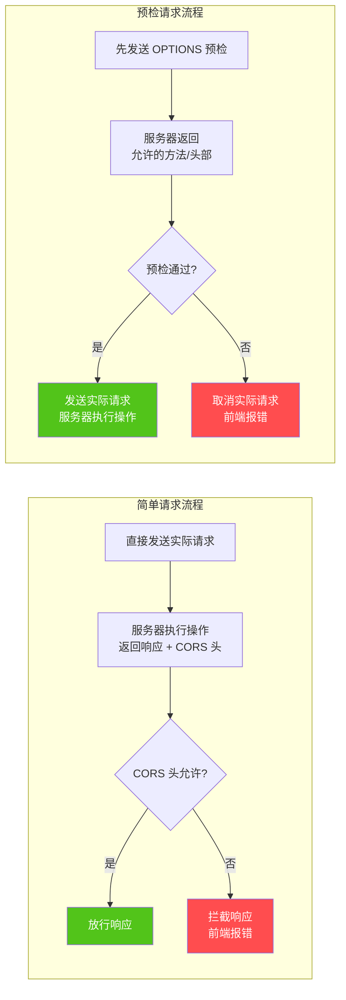
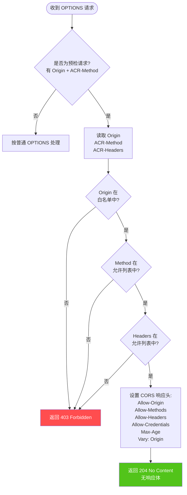

# 跨域预检 OPTIONS 请求完整指南：概念·原理·触发条件·服务器处理·最佳实践

> 本文系统讲解浏览器跨域预检请求（OPTIONS）的完整知识体系，覆盖基本概念、触发条件、工作原理、同源策略关系、服务器处理方法、常见问题与最佳实践，是前端与后端开发人员理解与处理 CORS 预检的完整参考。
>
> **关联文档与资源**：
> - [cors-preflight-handler.js](./cors-preflight-handler.js) — 配套的可运行 CORS 处理工具模块（约 500 行）
> - [前端跨域解决方案](./前端跨域解决方案.md) — 跨域方案总览
> - [iframe 跨域通信与安全实践](./iframe跨域通信与安全实践.md) — iframe 跨域专题
> - [MDN - CORS](https://developer.mozilla.org/zh-CN/docs/Web/HTTP/CORS) — 权威规范
> - [Fetch Standard](https://fetch.spec.whatwg.org/#http-cors-protocol) — W3C 规范

## 目录

- [一、跨域预检请求基本概念](#一跨域预检请求基本概念)
  - [1.1 什么是 CORS](#11-什么是-cors)
  - [1.2 什么是预检请求](#12-什么是预检请求)
  - [1.3 OPTIONS 方法的角色](#13-options-方法的角色)
  - [1.4 预检请求的核心价值](#14-预检请求的核心价值)
- [二、OPTIONS 请求触发条件与工作原理](#二options-请求触发条件与工作原理)
  - [2.1 简单请求 vs 预检请求](#21-简单请求-vs-预检请求)
  - [2.2 触发预检的三大条件](#22-触发预检的三大条件)
  - [2.3 预检请求工作流程](#23-预检请求工作流程)
  - [2.4 预检请求头详解](#24-预检请求头详解)
  - [2.5 预检响应头详解](#25-预检响应头详解)
- [三、浏览器同源策略与预检机制的关系](#三浏览器同源策略与预检机制的关系)
  - [3.1 同源策略定义](#31-同源策略定义)
  - [3.2 同源策略的局限](#32-同源策略的局限)
  - [3.3 CORS 作为同源策略的安全放行](#33-cors-作为同源策略的安全放行)
  - [3.4 预检请求作为"安全问询"](#34-预检请求作为安全问询)
- [四、服务器端处理 OPTIONS 请求](#四服务器端处理-options-请求)
  - [4.1 处理流程](#41-处理流程)
  - [4.2 Node.js 原生 http 实现](#42-nodejs-原生-http-实现)
  - [4.3 Express 中间件实现](#43-express-中间件实现)
  - [4.4 Koa 实现](#44-koa-实现)
  - [4.5 Nginx 配置](#45-nginx-配置)
  - [4.6 使用配套工具模块](#46-使用配套工具模块)
- [五、常见问题分析与解决方案](#五常见问题分析与解决方案)
  - [5.1 预检请求失败的常见原因](#51-预检请求失败的常见原因)
  - [5.2 凭据与通配符互斥问题](#52-凭据与通配符互斥问题)
  - [5.3 Vary 头缺失导致缓存串用](#53-vary-头缺失导致缓存串用)
  - [5.4 自定义头未声明](#54-自定义头未声明)
  - [5.5 Max-Age 配置不当](#55-max-age-配置不当)
  - [5.6 预检请求携带 Cookie 的误解](#56-预检请求携带-cookie-的误解)
- [六、实际应用场景与最佳实践](#六实际应用场景与最佳实践)
  - [6.1 不同场景的预检策略](#61-不同场景的预检策略)
  - [6.2 安全最佳实践](#62-安全最佳实践)
  - [6.3 性能优化建议](#63-性能优化建议)
  - [6.4 调试技巧](#64-调试技巧)
- [七、速查表](#七速查表)

---

## 一、跨域预检请求基本概念

### 1.1 什么是 CORS

**CORS**（Cross-Origin Resource Sharing，跨源资源共享）是浏览器的标准机制，允许服务器声明哪些来源、方法、头部可以跨域访问自己的资源。它通过一组 HTTP 头部字段实现，让浏览器和服务器协商决定是否允许跨域请求。

**关键点**：

- CORS 是**浏览器行为**，不是服务器行为。服务器只负责设置响应头，是否放行由浏览器决定
- CORS 适用于 `XMLHttpRequest`、`Fetch API` 等跨域请求场景
- CORS 不适用于 `<script>`、``、`<link>` 等标签的跨域资源加载（这些有各自的策略）

### 1.2 什么是预检请求

**预检请求**（Preflight Request）是浏览器在发送"非简单"跨域请求前，先向服务器发送的一个**探测请求**，用于询问服务器是否允许即将发送的实际请求。

**预检请求的特征**：

- HTTP 方法为 **OPTIONS**
- 不携带请求体
- 不携带 Cookie 等凭据
- 携带 `Origin`、`Access-Control-Request-Method`、`Access-Control-Request-Headers` 等预检请求头

### 1.3 OPTIONS 方法的角色

**OPTIONS** 是 HTTP/1.1 定义的请求方法，语义是"询问服务器支持的方法"。在 CORS 场景下，浏览器复用了 OPTIONS 方法作为预检请求的载体。

| 特性 | 说明 |
|------|------|
| **请求方法** | OPTIONS |
| **是否携带请求体** | 否 |
| **是否携带 Cookie** | 否（即使 `allowCredentials=true`） |
| **响应应有请求体** | 否（204 No Content 或 200 OK 空响应） |
| **幂等性** | 是（多次请求结果相同） |
| **缓存性** | 通过 `Access-Control-Max-Age` 控制预检结果缓存 |

### 1.4 预检请求的核心价值

**没有预检的潜在风险**：

假设浏览器不发送预检请求，直接发送跨域的 `DELETE /api/users/123`，服务器在处理完删除操作后才返回 CORS 拒绝头，此时**删除操作已经执行**，造成不可逆的数据破坏。

**预检请求的价值**：

| 价值 | 说明 |
|------|------|
| **安全问询** | 在实际请求前询问服务器是否允许，避免非法请求被执行 |
| **方法预检** | 对于 `PUT`/`DELETE`/`PATCH` 等非简单方法，提前校验 |
| **头部预检** | 对于 `Authorization`、自定义头等非简单头，提前校验 |
| **内容类型预检** | 对于 `application/json` 等 Content-Type，提前校验 |
| **缓存优化** | 通过 `Max-Age` 缓存预检结果，减少重复 OPTIONS 请求 |

---

## 二、OPTIONS 请求触发条件与工作原理

### 2.1 简单请求 vs 预检请求

浏览器将跨域请求分为两类：**简单请求**（不触发预检）和**预检请求**（先发 OPTIONS）。



### 2.2 触发预检的三大条件

满足以下**任意一个**条件，就会触发预检请求：

#### 条件一：使用了非简单方法

| 简单方法（不触发） | 非简单方法（触发预检） |
|:---------------:|:-------------------:|
| GET | PUT |
| HEAD | DELETE |
| POST | PATCH |
|  | OPTIONS（用于其他场景） |
|  | TRACE |
|  | CONNECT |

#### 条件二：使用了非简单请求头

**CORS 安全头部**（不触发预检）：

- `Accept`
- `Accept-Language`
- `Content-Language`
- `Content-Type`（仅限下面三种简单类型）
- `Range`（仅简单 Range 请求）

**非简单头部**（触发预检）：

- `Authorization`
- `Content-Type: application/json` 等
- `X-Requested-With`
- `X-CSRF-Token`
- 任何自定义头（`X-Custom-Header`、`X-Api-Key` 等）

#### 条件三：Content-Type 为非简单类型

**简单 Content-Type**（不触发预检）：

- `application/x-www-form-urlencoded`
- `multipart/form-data`
- `text/plain`

**非简单 Content-Type**（触发预检）：

- `application/json`（最常见）
- `application/xml`
- `text/xml`
- `text/html`

### 2.3 预检请求工作流程



### 2.4 预检请求头详解

浏览器发送预检请求时携带的关键请求头：

| 请求头 | 说明 | 示例 |
|-------|------|------|
| `Origin` | 发起跨域请求的源 | `https://app.example.com` |
| `Access-Control-Request-Method` | 实际请求将使用的方法 | `POST` |
| `Access-Control-Request-Headers` | 实际请求将携带的头部（逗号分隔） | `Content-Type, Authorization` |

**预检请求示例**：

```http
OPTIONS /api/users HTTP/1.1
Host: api.example.com
Origin: https://app.example.com
Access-Control-Request-Method: POST
Access-Control-Request-Headers: Content-Type, Authorization
```

### 2.5 预检响应头详解

服务器响应预检请求时需设置的关键响应头：

| 响应头 | 说明 | 示例 |
|-------|------|------|
| `Access-Control-Allow-Origin` | 允许的来源 | `https://app.example.com` 或 `*` |
| `Access-Control-Allow-Methods` | 允许的方法 | `GET, POST, PUT, DELETE` |
| `Access-Control-Allow-Headers` | 允许的请求头 | `Content-Type, Authorization` |
| `Access-Control-Allow-Credentials` | 是否允许凭据 | `true` |
| `Access-Control-Max-Age` | 预检结果缓存时间（秒） | `3600` |
| `Vary` | 标记响应受 Origin 影响 | `Origin` |

**预检响应示例**：

```http
HTTP/1.1 204 No Content
Access-Control-Allow-Origin: https://app.example.com
Access-Control-Allow-Methods: GET, POST, PUT, DELETE
Access-Control-Allow-Headers: Content-Type, Authorization
Access-Control-Allow-Credentials: true
Access-Control-Max-Age: 3600
Vary: Origin
```

---

## 三、浏览器同源策略与预检机制的关系

### 3.1 同源策略定义

**同源策略**（Same-Origin Policy，SOP）是浏览器最基础的安全机制，限制**不同源**的文档之间相互访问。

**同源判定规则**：两个 URL 的**协议**、**域名**、**端口**三者完全相同，即为同源。

| URL A | URL B | 是否同源 | 原因 |
|-------|-------|:-------:|------|
| `http://example.com/a` | `http://example.com/b` | ✅ | 同协议、同域名、同端口 |
| `http://example.com` | `https://example.com` | ❌ | 协议不同 |
| `http://example.com` | `http://api.example.com` | ❌ | 域名不同（子域也视为不同源） |
| `http://example.com:80` | `http://example.com:8080` | ❌ | 端口不同 |

### 3.2 同源策略的局限

同源策略过于严格，导致正常的跨域场景被限制：

- **前后端分离架构**：前端 `https://app.com`，后端 API `https://api.com`
- **CDN 资源加载**：网页 `https://site.com` 加载 CDN `https://cdn.com` 的字体
- **第三方 API 调用**：调用微信、GitHub 等第三方 OAuth API
- **微服务架构**：不同服务部署在不同子域名

### 3.3 CORS 作为同源策略的安全放行



**CORS 与同源策略的关系**：

- CORS 不是绕过同源策略，而是**同源策略的官方放行机制**
- 服务器通过 CORS 响应头"声明"哪些跨域访问被允许
- 浏览器读取响应头后，"代为执行"同源策略的放行决策
- 整个过程浏览器是裁判，服务器是声明者

### 3.4 预检请求作为"安全问询"

**为何需要预检？**

对于**简单请求**，浏览器直接发送实际请求，然后检查响应的 CORS 头：

- 如果 CORS 头允许 → 放行响应给前端
- 如果 CORS 头不允许 → 拦截响应，前端报错

但对于**非简单请求**（如 `DELETE`、自定义头），直接发送可能导致服务器执行了不可逆操作。所以浏览器**先用预检请求问询**：



**预检请求的核心意义**：在不可逆操作发生前，先确认服务器是否真的允许该跨域请求。

---

## 四、服务器端处理 OPTIONS 请求

### 4.1 处理流程

服务器处理 OPTIONS 预检请求的标准流程：



### 4.2 Node.js 原生 http 实现

```javascript
const http = require('http');

// 允许的来源白名单
const ALLOWED_ORIGINS = [
  'https://app.example.com',
  'https://www.example.com',
];

// 允许的方法与头部
const ALLOWED_METHODS = 'GET, POST, PUT, DELETE, PATCH, OPTIONS, HEAD';
const ALLOWED_HEADERS = 'Content-Type, Authorization, X-Requested-With';

const server = http.createServer((req, res) => {
  const { method, headers } = req;
  const origin = headers.origin;

  // ===== 1. 处理预检请求 =====
  if (method === 'OPTIONS' && origin && headers['access-control-request-method']) {
    // 校验来源
    if (!ALLOWED_ORIGINS.includes(origin)) {
      res.statusCode = 403;
      res.end('Forbidden');
      return;
    }

    // 设置 CORS 预检响应头
    res.setHeader('Access-Control-Allow-Origin', origin);
    res.setHeader('Access-Control-Allow-Methods', ALLOWED_METHODS);
    res.setHeader('Access-Control-Allow-Headers', ALLOWED_HEADERS);
    res.setHeader('Access-Control-Allow-Credentials', 'true');
    res.setHeader('Access-Control-Max-Age', '3600');
    res.setHeader('Vary', 'Origin');
    res.setHeader('Content-Length', '0');

    // 返回 204，无响应体
    res.statusCode = 204;
    res.end();
    return;
  }

  // ===== 2. 处理实际跨域请求 =====
  if (origin && ALLOWED_ORIGINS.includes(origin)) {
    res.setHeader('Access-Control-Allow-Origin', origin);
    res.setHeader('Access-Control-Allow-Credentials', 'true');
    res.setHeader('Vary', 'Origin');
  }

  // ===== 3. 业务路由 =====
  if (method === 'GET' && req.url === '/api/users') {
    res.setHeader('Content-Type', 'application/json');
    res.end(JSON.stringify({ users: ['Tom', 'Jerry'] }));
    return;
  }

  res.statusCode = 404;
  res.end('Not Found');
});

server.listen(3000, () => {
  console.log('Server running on http://localhost:3000');
});
```

### 4.3 Express 中间件实现

```javascript
const express = require('express');
const app = express();

// CORS 中间件
app.use((req, res, next) => {
  const allowedOrigins = ['https://app.example.com', 'https://www.example.com'];
  const origin = req.headers.origin;

  // 来源校验
  if (origin && allowedOrigins.includes(origin)) {
    res.setHeader('Access-Control-Allow-Origin', origin);
    res.setHeader('Access-Control-Allow-Credentials', 'true');
    res.setHeader('Vary', 'Origin');
  }

  // 预检请求处理
  if (req.method === 'OPTIONS') {
    res.setHeader('Access-Control-Allow-Methods', 'GET, POST, PUT, DELETE, PATCH');
    res.setHeader('Access-Control-Allow-Headers', 'Content-Type, Authorization');
    res.setHeader('Access-Control-Max-Age', '3600');
    return res.status(204).end();
  }

  next();
});

// 业务路由
app.get('/api/users', (req, res) => {
  res.json({ users: ['Tom', 'Jerry'] });
});

app.post('/api/users', (req, res) => {
  res.json({ success: true, id: Date.now() });
});

app.listen(3000);
```

### 4.4 Koa 实现

```javascript
const Koa = require('koa');
const app = new Koa();

// CORS 中间件
app.use(async (ctx, next) => {
  const allowedOrigins = ['https://app.example.com'];
  const origin = ctx.request.headers.origin;

  if (origin && allowedOrigins.includes(origin)) {
    ctx.set('Access-Control-Allow-Origin', origin);
    ctx.set('Access-Control-Allow-Credentials', 'true');
    ctx.set('Vary', 'Origin');
  }

  // 预检请求
  if (ctx.method === 'OPTIONS') {
    ctx.set('Access-Control-Allow-Methods', 'GET, POST, PUT, DELETE, PATCH');
    ctx.set('Access-Control-Allow-Headers', 'Content-Type, Authorization');
    ctx.set('Access-Control-Max-Age', '3600');
    ctx.status = 204;
    return;
  }

  await next();
});

// 业务路由
app.use(async (ctx) => {
  if (ctx.path === '/api/users' && ctx.method === 'GET') {
    ctx.body = { users: ['Tom', 'Jerry'] };
  }
});

app.listen(3000);
```

### 4.5 Nginx 配置

```nginx
server {
    listen 80;
    server_name api.example.com;

    # 处理预检请求
    if ($request_method = 'OPTIONS') {
        add_header 'Access-Control-Allow-Origin' '$http_origin';
        add_header 'Access-Control-Allow-Methods' 'GET, POST, PUT, DELETE, PATCH, OPTIONS';
        add_header 'Access-Control-Allow-Headers' 'Content-Type, Authorization, X-Requested-With';
        add_header 'Access-Control-Allow-Credentials' 'true';
        add_header 'Access-Control-Max-Age' 3600;
        add_header 'Vary' 'Origin';
        add_header 'Content-Length' 0;
        add_header 'Content-Type' 'text/plain charset=UTF-8';
        return 204;
    }

    # 实际请求的 CORS 头
    add_header 'Access-Control-Allow-Origin' '$http_origin' always;
    add_header 'Access-Control-Allow-Credentials' 'true' always;
    add_header 'Vary' 'Origin' always;

    # 后端代理
    location /api/ {
        proxy_pass http://backend:3000;
        proxy_set_header Host $host;
        proxy_set_header X-Real-IP $remote_addr;
    }
}
```

### 4.6 使用配套工具模块

本文配套提供了 [cors-preflight-handler.js](./cors-preflight-handler.js) 工具模块，封装了完整的预检处理逻辑：

```javascript
const { createCorsMiddleware } = require('./cors-preflight-handler');

const cors = createCorsMiddleware({
  allowedOrigins: [
    'https://app.example.com',
    'https://*.example.com',
    /^https:\/\/localhost:\d+$/,
  ],
  allowedMethods: ['GET', 'POST', 'PUT', 'DELETE', 'PATCH'],
  allowedHeaders: ['Content-Type', 'Authorization', 'X-Custom-Header'],
  exposedHeaders: ['X-Request-Id'],
  allowCredentials: true,
  maxAge: 3600,
});

// Express 使用
app.use(cors);

// 原生 http 使用
http.createServer((req, res) => {
  cors(req, res, () => {
    // 业务逻辑
  });
}).listen(3000);
```

---

## 五、常见问题分析与解决方案

### 5.1 预检请求失败的常见原因

| 错误信息 | 根本原因 | 解决方案 |
|---------|---------|---------|
| `No 'Access-Control-Allow-Origin' header` | 服务器未设置 CORS 头 | 检查响应头是否正确设置 |
| `Access-Control-Allow-Origin` value does not match | Allow-Origin 与 Origin 不匹配 | 确保白名单包含请求来源 |
| `Method DELETE is not allowed` | Allow-Methods 未包含该方法 | 在 Allow-Methods 中添加该方法 |
| `Header Authorization is not allowed` | Allow-Headers 未包含该头部 | 在 Allow-Headers 中添加该头部 |
| `Credentials flag is true, but Allow-Origin is *` | credentials 与通配符互斥 | credentials=true 时回显具体 Origin |
| `Status code 405 Method Not Allowed` | 服务器未处理 OPTIONS 方法 | 添加 OPTIONS 路由处理 |

### 5.2 凭据与通配符互斥问题

**问题描述**：

```http
Access-Control-Allow-Origin: *
Access-Control-Allow-Credentials: true
```

浏览器会忽略此组合，因为**安全策略禁止** `Allow-Origin: *` 与 `Allow-Credentials: true` 同时使用。

**原因**：如果允许通配符 + 凭据，任何网站都能携带用户 Cookie 访问服务器，造成 CSRF 风险。

**解决方案**：当 `allowCredentials=true` 时，必须**回显具体 Origin**：

```javascript
// ❌ 错误
res.setHeader('Access-Control-Allow-Origin', '*');
res.setHeader('Access-Control-Allow-Credentials', 'true');

// ✅ 正确
res.setHeader('Access-Control-Allow-Origin', origin);
res.setHeader('Access-Control-Allow-Credentials', 'true');
```

### 5.3 Vary 头缺失导致缓存串用

**问题描述**：CDN 或浏览器缓存了 A 来源的 CORS 响应后，B 来源的请求复用了该缓存，导致 `Allow-Origin` 还是 A 来源，B 来源请求被拒绝。

**解决方案**：必须设置 `Vary: Origin`，告诉缓存"响应内容随 Origin 变化"：

```http
Access-Control-Allow-Origin: https://a.example.com
Vary: Origin
```

### 5.4 自定义头未声明

**问题描述**：前端请求携带 `X-Api-Key` 头，但服务器 `Allow-Headers` 未声明，导致预检失败。

**解决方案**：将所有实际请求会携带的头部都声明在 `Allow-Headers` 中：

```http
Access-Control-Allow-Headers: Content-Type, Authorization, X-Api-Key, X-Request-Id
```

**灵活方案**：镜像请求头中的 `Access-Control-Request-Headers`：

```javascript
// 镜像预检请求中请求的头部
const requestedHeaders = req.headers['access-control-request-headers'];
if (requestedHeaders) {
  res.setHeader('Access-Control-Allow-Headers', requestedHeaders);
}
```

### 5.5 Max-Age 配置不当

**问题描述**：开发阶段频繁修改 CORS 配置，但浏览器仍使用旧的预检结果，导致配置不生效。

**原因**：`Access-Control-Max-Age` 控制预检结果缓存，浏览器在有效期内不重发 OPTIONS 请求。

**各浏览器上限**：

| 浏览器 | 最大缓存时间 |
|-------|:-----------:|
| Chrome | 7200 秒（2 小时） |
| Firefox | 86400 秒（24 小时） |
| Safari | 604800 秒（7 天） |

**解决方案**：

- 开发阶段：将 `Max-Age` 设为 `0` 或 `-1`，每次都发预检
- 生产环境：设为合理值（如 3600 秒），减少 OPTIONS 请求
- 调试时：浏览器开发者工具中勾选"Disable cache"

### 5.6 预检请求携带 Cookie 的误解

**误解**：认为预检请求也需要携带 Cookie。

**事实**：**预检请求永远不会携带 Cookie**，即使设置了 `allowCredentials=true`。Cookie 只在实际请求中携带。

**结论**：服务器处理预检请求时，不需要校验 Cookie/Session，只需校验 Origin/Method/Headers。

---

## 六、实际应用场景与最佳实践

### 6.1 不同场景的预检策略

| 场景 | 推荐配置 | 说明 |
|-----|---------|------|
| **公开 API** | `Allow-Origin: *`，`allowCredentials: false` | 任意来源可访问，但无凭据 |
| **企业内部 API** | 来源白名单，`allowCredentials: true` | 仅允许内部域名，支持 SSO |
| **RESTful API（JSON）** | `Allow-Headers: Content-Type, Authorization` | 标准 JSON API 配置 |
| **文件上传** | `Allow-Headers: Content-Type, X-File-Name` | 含自定义头部 |
| **GraphQL API** | `Allow-Methods: POST`，`Allow-Headers: Content-Type, Authorization` | GraphQL 通常用 POST |
| **开发环境** | `Allow-Origin: http://localhost:*`，`Max-Age: 0` | 本地开发，不缓存预检 |

### 6.2 安全最佳实践

1. **避免 `Allow-Origin: *` 用于敏感接口**

   ```javascript
   // ❌ 危险：任何网站都能访问
   res.setHeader('Access-Control-Allow-Origin', '*');

   // ✅ 安全：白名单校验
   if (ALLOWED_ORIGINS.includes(origin)) {
     res.setHeader('Access-Control-Allow-Origin', origin);
   }
   ```

2. **谨慎开启 `Allow-Credentials`**

   - 仅在确实需要 Cookie/HTTP 认证时开启
   - 开启后必须严格校验来源白名单

3. **限制 `Allow-Methods` 为实际需要的方法**

   ```http
   # ❌ 过度宽松
   Access-Control-Allow-Methods: *

   # ✅ 最小权限
   Access-Control-Allow-Methods: GET, POST
   ```

4. **限制 `Allow-Headers` 为实际使用的头部**

5. **正则匹配来源时注意锚点**

   ```javascript
   // ❌ 危险：可能匹配恶意域名
   /example\.com/

   // ✅ 安全：严格锚定
   /^https:\/\/[a-z]+\.example\.com$/
   ```

### 6.3 性能优化建议

1. **合理设置 `Max-Age`**：减少重复 OPTIONS 请求，生产环境推荐 3600 秒以上

2. **避免不必要的预检**：

   - 简单请求不触发预检，能用 `GET/HEAD` 就不用 `POST`
   - Content-Type 用 `application/x-www-form-urlencoded` 不触发预检（但不推荐用 JSON API）
   - 避免不必要的自定义头

3. **CDN 缓存友好**：

   - 设置 `Vary: Origin` 让 CDN 按来源分别缓存
   - 或使用 `Cache-Control: public, max-age=3600` 配合固定来源

4. **预检请求快速响应**：

   - 预检请求不调用业务逻辑，直接返回 CORS 头
   - 中间件优先级要高，避免被其他中间件拖慢

### 6.4 调试技巧

1. **浏览器开发者工具 Network 面板**：

   - 查看 OPTIONS 请求的状态码与响应头
   - 检查 `Access-Control-Allow-*` 头是否齐全
   - 勾选"Disable cache"避免预检缓存影响

2. **curl 模拟预检请求**：

   ```bash
   curl -X OPTIONS http://api.example.com/api/users \
     -H "Origin: https://app.example.com" \
     -H "Access-Control-Request-Method: POST" \
     -H "Access-Control-Request-Headers: Content-Type, Authorization" \
     -i
   ```

3. **Console 错误信息**：

   - CORS 错误信息会明确指出缺失的头或冲突的配置
   - 注意"preflight request"关键字，说明是预检阶段失败

4. **常见调试 checklist**：

   - [ ] OPTIONS 请求是否返回 204 或 200
   - [ ] `Allow-Origin` 是否匹配请求 Origin
   - [ ] `Allow-Methods` 是否包含实际请求方法
   - [ ] `Allow-Headers` 是否包含所有实际请求头
   - [ ] `Allow-Credentials` 与 `Allow-Origin: *` 是否冲突
   - [ ] `Vary: Origin` 是否设置
   - [ ] 是否被 `Max-Age` 缓存了旧的预检结果

---

## 七、速查表

### 触发预检的快速判断

| 请求特征 | 是否触发预检 |
|---------|:-----------:|
| GET + 无自定义头 | ❌ |
| GET + Authorization 头 | ✅ |
| POST + `Content-Type: application/x-www-form-urlencoded` | ❌ |
| POST + `Content-Type: application/json` | ✅ |
| PUT / DELETE / PATCH | ✅ |
| 任何方法 + 自定义头（`X-*`） | ✅ |

### CORS 响应头速查

| 响应头 | 用于预检 | 用于实际请求 | 必填 |
|-------|:--------:|:-----------:|:----:|
| `Access-Control-Allow-Origin` | ✅ | ✅ | ✅ |
| `Access-Control-Allow-Methods` | ✅ | ❌ | ✅（预检时） |
| `Access-Control-Allow-Headers` | ✅ | ❌ | ✅（预检时） |
| `Access-Control-Allow-Credentials` | 可选 | 可选 | 视场景 |
| `Access-Control-Max-Age` | 可选 | ❌ | 推荐 |
| `Access-Control-Expose-Headers` | ❌ | 可选 | 视场景 |
| `Vary: Origin` | 推荐 | 推荐 | 推荐 |

### 预检请求 vs 实际请求对照

| 维度 | 预检请求 | 实际请求 |
|------|---------|---------|
| 方法 | OPTIONS | GET/POST/PUT/DELETE 等 |
| 携带 Cookie | ❌ 永不携带 | ✅ 当 credentials=true 时 |
| 携带请求体 | ❌ | ✅（视方法） |
| 触发时机 | 非简单请求前 | 预检通过后 |
| 响应体 | ❌ 空 | ✅ 业务数据 |
| 状态码 | 204 或 200 | 200/201/400/500 等 |
| 缓存 | 受 Max-Age 控制 | 不缓存（每次都发） |

---

> **核心结论**：跨域预检请求（OPTIONS）是浏览器 CORS 机制的"安全问询"环节，本质是浏览器代为询问服务器"是否允许即将到来的非简单跨域请求"。理解"简单请求不预检、非简单请求先预检"这一核心规则，以及 `Allow-Origin`/`Allow-Methods`/`Allow-Headers` 三大响应头的协作机制，就能正确处理所有 CORS 场景。生产实践的关键是：**白名单校验来源、声明实际使用的方法与头部、credentials=true 时回显具体 Origin、设置 Vary: Origin 避免缓存串用、合理配置 Max-Age 减少预检开销**。
