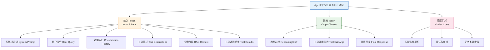
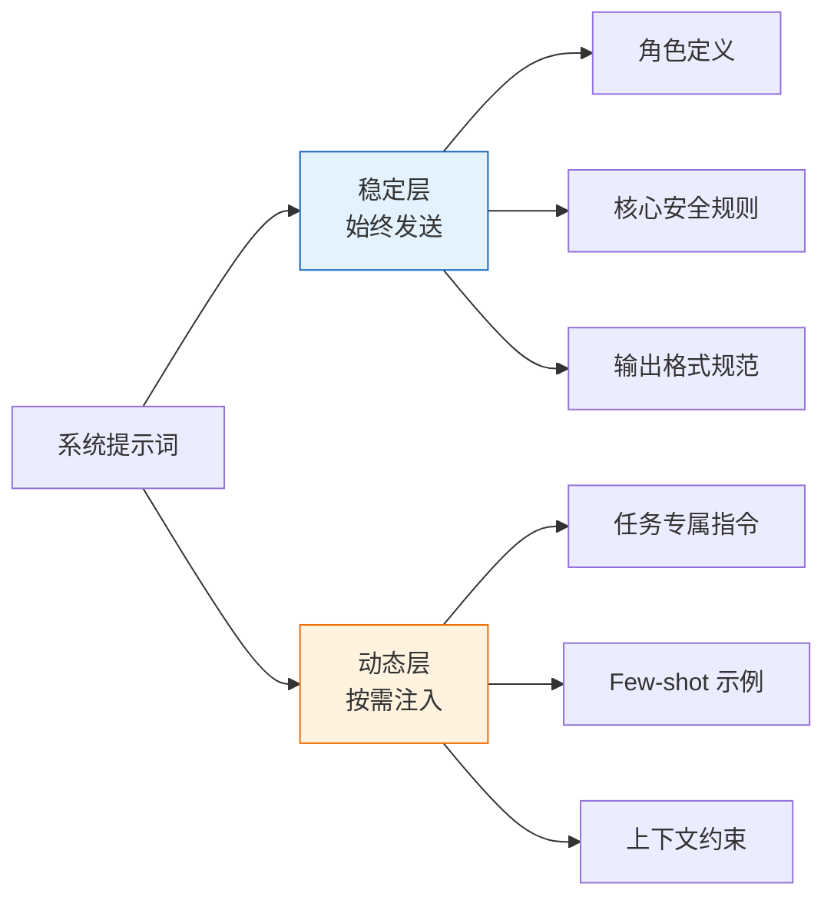
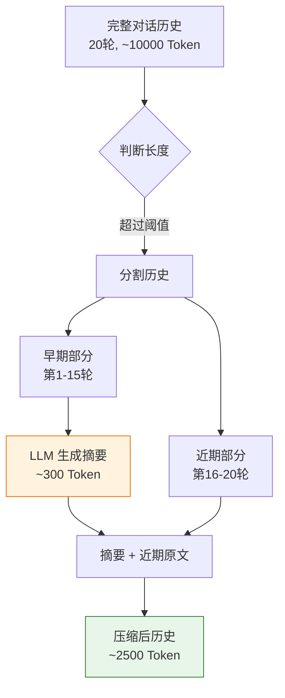
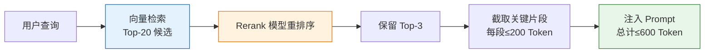
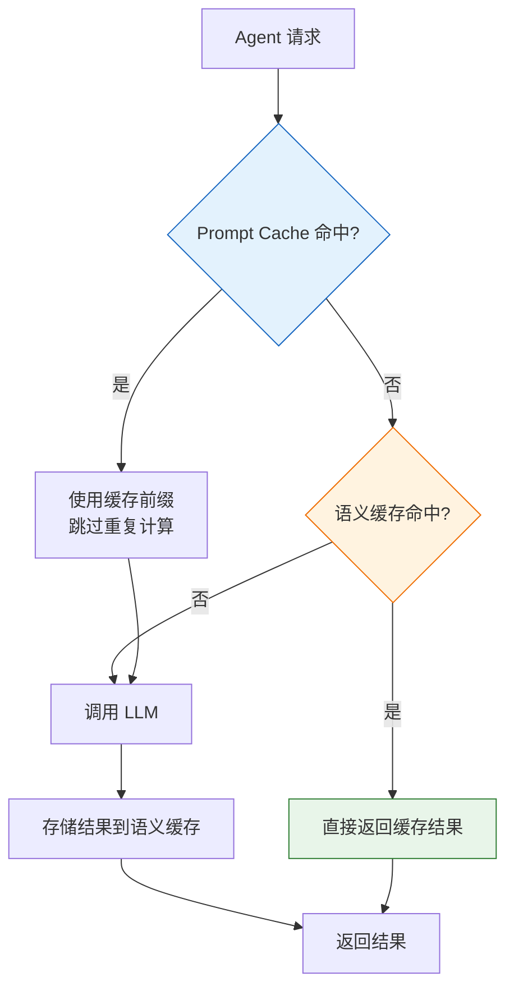
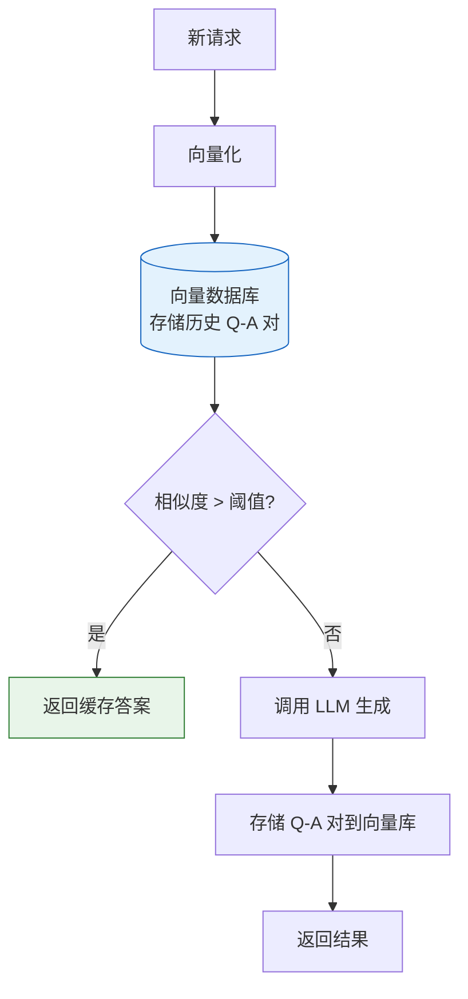
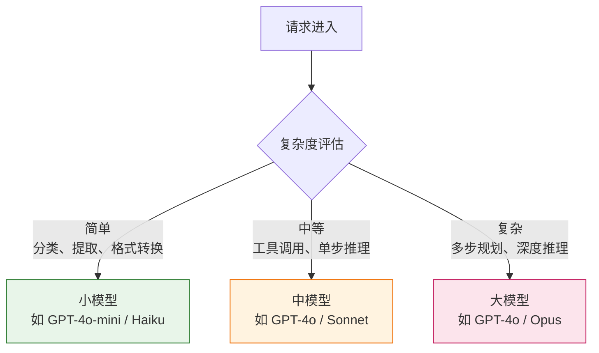
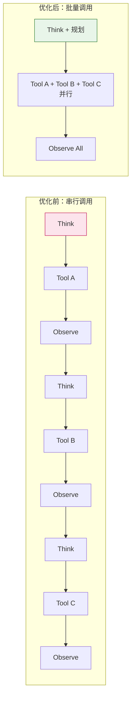
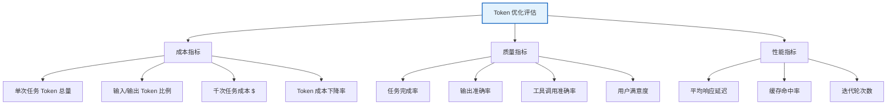
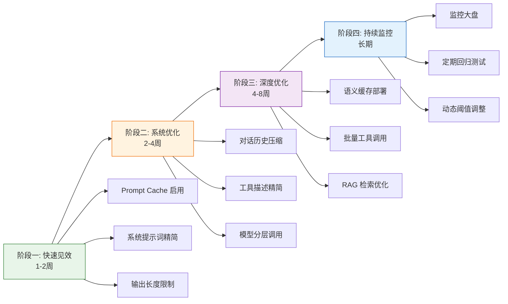

# Agent 系统 Token 消耗优化深度分析

## 引言

在大语言模型（LLM）驱动的 Agent 系统中，**Token 消耗**直接决定了运行成本、响应延迟和系统可扩展性。一个设计不当的 Agent，单次任务可能消耗数十万 Token，而优化后的系统可将成本降低 60%~90%。Token 优化不仅是成本控制手段，更是提升 Agent 工程化水平的关键环节。

本文系统性地提出一套 Agent Token 消耗优化方案，涵盖输入提示优化、响应内容精简、缓存机制设计、模型调用策略调整四大维度，并明确各项措施的预期效果、实施难度、潜在风险及验证方法。

---

## 1. Token 消耗来源分析

在制定优化方案前，必须清晰识别 Agent 系统中 Token 消耗的来源。

### 1.1 Token 消耗构成图



### 1.2 关键消耗点识别

根据实践经验，Agent 系统 Token 消耗的典型分布如下：

| 消耗来源 | 占比（典型） | 优化空间 | 优先级 |
| :--- | :--- | :--- | :--- |
| 对话历史累积 | 30%~45% | 高 | P0 |
| 系统提示词 + 工具描述 | 15%~25% | 中 | P1 |
| 检索内容（RAG） | 10%~20% | 高 | P1 |
| 工具返回结果 | 5%~15% | 中 | P2 |
| 思考过程（CoT） | 10%~20% | 中 | P2 |
| 最终回复 | 5%~10% | 低 | P3 |

---

## 2. 输入提示优化（Input Prompt Optimization）

### 2.1 系统提示词精简

#### 2.1.1 问题分析

系统提示词（System Prompt）在每次 LLM 调用时都会被重复发送。一个冗长的系统提示词（如 2000 Token）在 10 轮对话中会累积消耗 20000 Token。

#### 2.1.2 优化方案

**方案 A：提示词压缩与重构**

- **去除冗余表述**：将"请你务必注意，在做任何决策之前，你需要先仔细思考"精简为"决策前先思考"。
- **合并重复指令**：将散落各处的相同主题指令合并。
- **使用结构化格式**：用 YAML/JSON 替代自然语言描述，信息密度更高。

**优化前**（约 180 Token）：
```
你是一个专业的代码助手。你的职责是帮助用户分析代码问题、提供修复建议、
解释代码逻辑。在回答时，你应该确保你的回答是准确的、详细的、有条理的。
如果用户的问题不明确，你应该主动询问以获取更多信息。你不应该编造不存在
的函数或API。如果不确定，请明确说明。请使用Markdown格式输出。
```

**优化后**（约 60 Token）：
```yaml
角色: 代码助手
职责: 分析问题、提供修复、解释逻辑
规则:
  - 回答准确、详细、有条理
  - 不明确时主动询问
  - 不编造API；不确定时声明
格式: Markdown
```

**方案 B：分层提示词架构**

将系统提示词分为"稳定层"和"动态层"：
- **稳定层**：角色定义、核心规则，始终保留。
- **动态层**：任务特定指令、示例，按需注入。



#### 2.1.3 预期效果与风险

| 指标 | 说明 |
| :--- | :--- |
| **预期效果** | 系统提示词 Token 减少 40%~60% |
| **实施难度** | 低（中）——需仔细审查提示词，保持语义完整 |
| **潜在风险** | 过度压缩可能丢失关键约束，导致模型行为偏差 |
| **风险缓解** | 压缩后进行回归测试，对比关键场景的输出质量 |

### 2.2 对话历史管理

#### 2.2.1 问题分析

对话历史是最大的 Token 消耗源。随着对话轮次增加，历史线性累积。一个 20 轮对话的完整历史可能超过 10000 Token。

#### 2.2.2 优化方案

**方案 A：滑动窗口截断**

只保留最近 $N$ 轮对话，超出部分直接丢弃。

```python
def sliding_window(messages, max_turns=5):
    """保留最近 max_turns 轮对话"""
    return messages[-(max_turns * 2):]  # 每轮含 user + assistant
```

**方案 B：摘要压缩历史**

将早期对话压缩为摘要，保留近期原文。



```python
def compress_history(messages, recent_keep=6, summary_threshold=10):
    """历史压缩：早期摘要 + 近期保留"""
    if len(messages) <= summary_threshold:
        return messages
    
    old_messages = messages[:-recent_keep]
    recent_messages = messages[-recent_keep:]
    
    # 调用 LLM 生成早期对话摘要
    summary = llm_summarize(old_messages)
    
    return [{"role": "system", "content": f"历史摘要: {summary}"}] + recent_messages
```

**方案 C：选择性保留**

根据信息重要性选择性保留历史：
- 保留：用户明确指令、关键决策点、错误与修正记录。
- 丢弃：寒暄、重复确认、冗长解释。

#### 2.2.3 预期效果与风险

| 指标 | 说明 |
| :--- | :--- |
| **预期效果** | 长对话场景 Token 减少 50%~80% |
| **实施难度** | 中（摘要方案需额外 LLM 调用） |
| **潜在风险** | 信息丢失导致 Agent 遗忘早期上下文，影响任务连贯性 |
| **风险缓解** | 关键信息（如用户偏好、任务目标）单独存储于记忆系统，不依赖对话历史 |

### 2.3 工具描述优化

#### 2.3.1 问题分析

Agent 的工具列表会作为上下文发送给 LLM。10 个工具的详细描述可能消耗 1500~3000 Token。

#### 2.3.2 优化方案

**方案 A：工具描述精简**

- 用简洁的函数签名 + 一句话描述替代冗长说明。
- 移除显而易见的参数说明（如 `query: 查询字符串`）。
- 将详细使用示例移至按需检索的文档。

**优化前**（约 120 Token/工具）：
```json
{
  "name": "search_web",
  "description": "使用这个工具可以在互联网上搜索信息。当你需要查找最新的新闻、查询某个事实、或者获取你不确定的知识时，请使用此工具。输入一个搜索查询字符串，工具会返回相关的网页摘要和链接。",
  "parameters": {
    "query": {
      "type": "string",
      "description": "要搜索的查询字符串，应该是清晰的、具体的搜索词"
    },
    "num_results": {
      "type": "integer",
      "description": "返回结果的数量，默认为5，最大为10",
      "default": 5
    }
  }
}
```

**优化后**（约 40 Token/工具）：
```json
{
  "name": "search_web",
  "description": "网络搜索，返回相关网页摘要",
  "parameters": {
    "query": {"type": "string"},
    "num_results": {"type": "integer", "default": 5}
  }
}
```

**方案 B：动态工具加载**

根据当前任务阶段，只加载相关工具子集。

```python
def get_relevant_tools(task_phase, all_tools):
    """根据任务阶段返回相关工具"""
    phase_tool_map = {
        "information_gathering": ["search_web", "read_file", "rag_query"],
        "analysis": ["code_executor", "data_analyzer"],
        "output": ["write_file", "send_email"]
    }
    return [t for t in all_tools if t.name in phase_tool_map.get(task_phase, [])]
```

#### 2.3.3 预期效果与风险

| 指标 | 说明 |
| :--- | :--- |
| **预期效果** | 工具描述 Token 减少 50%~70% |
| **实施难度** | 低（精简）/ 中（动态加载需任务阶段识别） |
| **潜在风险** | 描述过简导致模型误用工具；动态加载可能遗漏所需工具 |
| **风险缓解** | A/B 测试对比工具调用准确率；动态加载保留"搜索更多工具"能力 |

### 2.4 RAG 检索内容优化

#### 2.4.1 优化方案

- **检索结果数量限制**：Top-K 从 10 降至 3~5，仅保留高相关性片段。
- **片段长度压缩**：将 chunk size 从 1000 Token 降至 200~500 Token。
- **二次筛选**：检索后用轻量模型对结果重排序（Rerank），只保留最相关的前 N 项。
- **引用式注入**：不注入全文，只注入关键句摘要 + 引用编号。



---

## 3. 响应内容精简（Output Optimization）

### 3.1 控制思考过程长度

#### 3.1.1 问题分析

Agent 的 ReAct 模式（Reason + Act）中，"思考"部分往往冗长。不必要的详细推理可能消耗大量输出 Token。

#### 3.1.2 优化方案

- **限制思考长度**：在提示词中明确约束，如"思考过程不超过 3 句话"。
- **结构化思考**：用固定格式（如 `Thought: <keyword> | Action: <tool>`）替代自由文本。
- **按需展开**：简单任务跳过思考，直接行动；复杂任务才启用详细 CoT。

**优化前**：
```
Thought: 用户想要了解今天的天气情况。我需要使用天气查询工具来获取这个信息。
首先，我需要确定用户所在的位置。从用户的提问"今天天气怎么样"来看，用户没有
明确说明位置。但是根据之前的对话历史，用户提到过他在北京，所以我可以推断
用户想查询北京的天气。现在我将调用天气查询工具...
Action: get_weather
Action Input: {"location": "北京"}
```

**优化后**：
```
Thought: 查询北京天气（位置来自历史）
Action: get_weather
Action Input: {"location": "北京"}
```

#### 3.1.3 预期效果与风险

| 指标 | 说明 |
| :--- | :--- |
| **预期效果** | 思考过程 Token 减少 60%~80% |
| **实施难度** | 低 |
| **潜在风险** | 过度简化思考可能降低复杂任务的推理质量 |
| **风险缓解** | 根据任务复杂度动态调整思考深度，简单任务用快速模式，复杂任务用完整 CoT |

### 3.2 限制输出格式

- **JSON 模式**：强制结构化输出，避免废话。
- **最大长度限制**：`max_tokens` 参数硬性限制。
- **禁止寒暄**：提示词中明确"直接给出结果，不要开场白和结束语"。

### 3.3 工具调用参数精简

- 避免在工具参数中重复已知信息。
- 使用 ID 引用替代完整内容传递。

---

## 4. 缓存机制设计（Caching Mechanism）

### 4.1 缓存策略全景



### 4.2 Prompt Cache（提示前缀缓存）

#### 4.2.1 原理

利用 LLM 提供商的 Prompt Caching 功能（如 Anthropic 的 Prompt Caching、OpenAI 的 Cached Context）。将系统提示词、工具描述等稳定前缀标记为可缓存，后续请求复用已计算的 KV Cache。

#### 4.2.2 实施方式

```python
# Anthropic Prompt Caching 示例
response = client.messages.create(
    model="claude-3-5-sonnet-20241022",
    system=[
        {
            "type": "text",
            "text": system_prompt,  # 稳定部分
            "cache_control": {"type": "ephemeral"}  # 标记缓存
        }
    ],
    messages=conversation_history  # 动态部分
)
```

#### 4.2.3 预期效果与风险

| 指标 | 说明 |
| :--- | :--- |
| **预期效果** | 缓存命中时输入 Token 计费减少 80%~90%，延迟降低 40%~60% |
| **实施难度** | 低（提供商原生支持，仅需 API 参数调整） |
| **潜在风险** | 缓存有 TTL 限制（通常 5 分钟）；前缀变更导致缓存失效 |
| **风险缓解** | 确保稳定前缀严格不变；监控缓存命中率 |

### 4.3 语义缓存（Semantic Cache）

#### 4.3.1 原理

将历史请求-响应对存入向量数据库。新请求到来时，先计算其向量表示，检索相似度高于阈值的历史请求，若命中则直接返回缓存结果，跳过 LLM 调用。

#### 4.3.2 实施架构



#### 4.3.3 实施要点

- **相似度阈值**：通常设为 0.92~0.95，过高则命中率低，过低则可能返回错误答案。
- **缓存失效**：知识更新、工具变更时需清除相关缓存。
- **适用场景**：高频重复问题场景（如客服、FAQ），命中率可达 20%~40%。

#### 4.3.4 预期效果与风险

| 指标 | 说明 |
| :--- | :--- |
| **预期效果** | 命中场景节省 100% LLM 调用成本，整体降低 15%~35% |
| **实施难度** | 中（需向量数据库 + 相似度策略） |
| **潜在风险** | 语义相似但实际不同的问题被误判为相同，返回错误答案 |
| **风险缓解** | 设置高相似度阈值；对关键决策类请求禁用缓存 |

### 4.4 工具结果缓存

- 对幂等性工具调用（如查询天气、获取股票价格）的结果进行短期缓存。
- 缓存 Key = 工具名 + 参数哈希。
- 设置合理 TTL（如天气缓存 30 分钟，股价缓存 1 分钟）。

---

## 5. 模型调用策略调整（Model Call Strategy）

### 5.1 模型分层调用

#### 5.1.1 策略

根据任务复杂度选择不同成本的模型：



#### 5.1.2 复杂度评估方式

- **基于规则**：根据任务类型、输入长度、所需工具数量预设复杂度。
- **基于路由模型**：先用小模型判断复杂度，再路由到合适模型。
- **基于历史**：根据类似任务的历史执行模式判断。

#### 5.1.3 预期效果与风险

| 指标 | 说明 |
| :--- | :--- |
| **预期效果** | 综合成本降低 50%~70%（小模型成本约为大模型的 1/10~1/30） |
| **实施难度** | 中（需设计路由逻辑和复杂度评估） |
| **潜在风险** | 复杂度误判导致简单任务用大模型（浪费）或复杂任务用小模型（质量下降） |
| **风险缓解** | 设置 fallback 机制：小模型置信度低时自动升级到大模型 |

### 5.2 减少迭代轮次

#### 5.2.1 问题分析

Agent 的多轮迭代（Think-Act-Observe 循环）是 Token 消耗的"放大器"。每多一轮迭代，就多消耗一轮的输入 + 输出 Token。

#### 5.2.2 优化方案

- **批量工具调用**：允许 Agent 在一轮中并行调用多个无依赖工具，减少迭代轮次。
- **提前终止**：当 Agent 已获得足够信息时，主动终止而非继续探索。
- **最大轮次限制**：设置硬性上限（如 10 轮），防止失控循环。
- **规划先行**：先制定完整计划再执行，避免"边想边做"的无效探索。



### 5.3 上下文窗口管理

- **主动截断**：当上下文接近窗口上限时，主动压缩历史，而非依赖模型自动截断。
- **分区管理**：将上下文分为"核心区"（任务目标、关键约束）和"可压缩区"（对话历史、中间结果）。
- **按需加载**：长文档不全量放入上下文，用 RAG 按需检索相关片段。

---

## 6. 测试方法与评估指标

### 6.1 评估指标体系



### 6.2 测试方法

#### 6.2.1 A/B 测试

- **对照组**：使用未优化的原始 Agent。
- **实验组**：使用优化后的 Agent。
- **测试集**：构建覆盖典型场景的 100~500 个测试任务。
- **对比维度**：Token 消耗、任务完成质量、响应延迟。

#### 6.2.2 分级评估

| 评估级别 | 方法 | 目的 |
| :--- | :--- | :--- |
| **L1: 单元测试** | 单个优化措施的独立测试 | 验证措施本身有效性 |
| **L2: 集成测试** | 多措施组合测试 | 验证措施间无冲突 |
| **L3: 回归测试** | 优化前后同任务对比 | 验证质量无回退 |
| **L4: 压力测试** | 长对话、复杂任务场景 | 验证极端场景稳定性 |

#### 6.2.3 持续监控

```python
# 监控埋点示例
class TokenMonitor:
    def __init__(self):
        self.metrics = {
            "total_input_tokens": 0,
            "total_output_tokens": 0,
            "llm_calls": 0,
            "cache_hits": 0,
            "tool_calls": 0,
            "avg_iterations": 0
        }
    
    def record_call(self, input_tokens, output_tokens, cache_hit=False):
        self.metrics["total_input_tokens"] += input_tokens
        self.metrics["total_output_tokens"] += output_tokens
        self.metrics["llm_calls"] += 1
        if cache_hit:
            self.metrics["cache_hits"] += 1
    
    def get_report(self):
        return {
            **self.metrics,
            "cache_hit_rate": self.metrics["cache_hits"] / max(self.metrics["llm_calls"], 1),
            "total_cost_estimate": self._estimate_cost()
        }
```

### 6.3 评估基准模板

| 评估项 | 优化前 | 优化后 | 变化率 | 质量是否回退 |
| :--- | :--- | :--- | :--- | :--- |
| 单任务平均 Token | — | — | -X% | — |
| 单任务平均成本 | — | — | -X% | — |
| 任务完成率 | — | — | — | ✓/✗ |
| 平均响应延迟 | — | — | -X% | — |
| 平均迭代轮次 | — | — | -X% | — |
| 缓存命中率 | — | — | +X% | — |
| 工具调用准确率 | — | — | — | ✓/✗ |

---

## 7. 优化实施路线图

### 7.1 分阶段实施



### 7.2 优先级矩阵

| 优化措施 | 预期收益 | 实施难度 | 优先级 |
| :--- | :--- | :--- | :--- |
| Prompt Cache 启用 | 高 | 低 | **P0** |
| 系统提示词精简 | 中 | 低 | **P0** |
| 输出长度限制 | 中 | 低 | **P0** |
| 对话历史压缩 | 高 | 中 | **P1** |
| 模型分层调用 | 高 | 中 | **P1** |
| 工具描述精简 | 中 | 低 | **P1** |
| 批量工具调用 | 中 | 中 | **P2** |
| 语义缓存部署 | 中 | 高 | **P2** |
| RAG 检索优化 | 中 | 中 | **P2** |

---

## 8. 总结

Agent 系统的 Token 优化是一个系统工程，需要从**输入、输出、缓存、调用策略**四个维度协同推进。核心原则是：

1. **先测量，后优化**：建立完善的 Token 监控体系，用数据驱动决策。
2. **保质量，降成本**：任何优化都不能以牺牲任务完成质量为代价，需配套回归测试。
3. **分层施策，循序渐进**：从低难度、高收益的措施入手，逐步推进深度优化。
4. **持续监控，动态调整**：优化不是一次性工作，需根据业务变化持续迭代。

通过系统性地实施上述优化方案，一个典型的 Agent 系统可在保证任务质量的前提下，将 Token 消耗降低 **60%~85%**，显著降低运行成本并提升响应速度，为 Agent 的大规模生产化部署奠定基础。
