# Agent 系统稳定性提升完整方案深度解析

> 文档定位:系统阐述 AI Agent 系统的稳定性问题识别、根因分析、优化措施设计、监控机制建立、故障恢复策略的完整方案,涵盖代码质量提升、资源管理优化、错误处理完善、并发控制改进,为构建高可用 Agent 系统提供工程级指导。
>
> 阅读建议:本文是 Agent 性能优化系列的稳定性专题,建议结合 [113Agent系统Token消耗优化深度分析.md](./113Agent系统Token消耗优化深度分析.md)、[114Prompt长度优化策略与实施深度解析.md](./114Prompt长度优化策略与实施深度解析.md)、[115Agent系统延迟优化完整方案深度解析.md](./115Agent系统延迟优化完整方案深度解析.md) 一并阅读,形成性能与稳定性的完整优化体系。

---

## 目录

- [一、稳定性问题概述](#一稳定性问题概述)
- [二、稳定性问题识别](#二稳定性问题识别)
- [三、根本原因分析](#三根本原因分析)
- [四、代码质量提升](#四代码质量提升)
- [五、资源管理优化](#五资源管理优化)
- [六、错误处理机制完善](#六错误处理机制完善)
- [七、并发控制改进](#七并发控制改进)
- [八、稳定性监控机制](#八稳定性监控机制)
- [九、故障恢复策略](#九故障恢复策略)
- [十、实施步骤与效果评估](#十实施步骤与效果评估)

---

## 一、稳定性问题概述

### 1.1 稳定性的定义

**Agent 系统稳定性**是指系统在面临各种异常、负载波动、资源约束时,能够持续提供符合预期服务的能力,具体表现为:

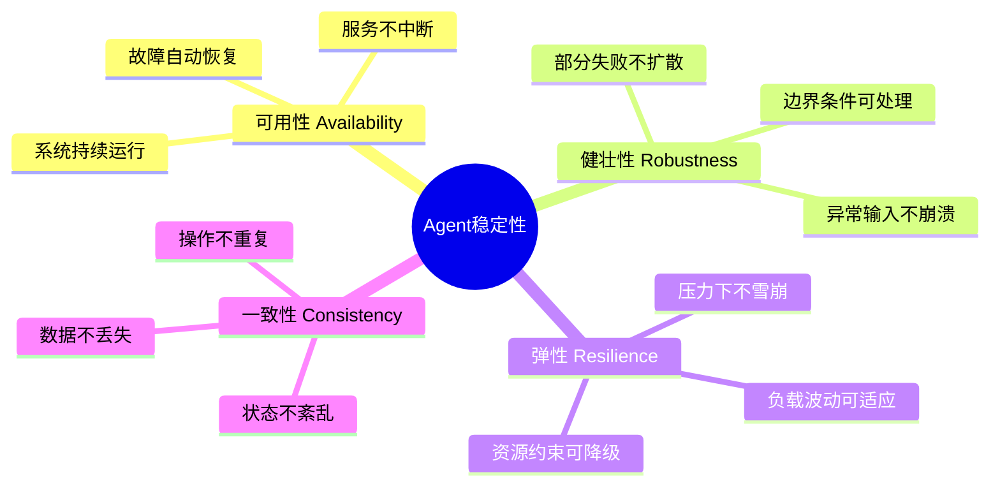

### 1.2 稳定性的核心指标

| 指标 | 定义 | 目标值 | 计算方式 |
|-----|------|:------:|---------|
| **可用性(SLA)** | 系统正常运行时间占比 | ≥99.9% | 正常时间/总时间 |
| **MTBF** | 平均无故障时间 | ≥720小时 | 总运行时间/故障次数 |
| **MTTR** | 平均故障恢复时间 | ≤5分钟 | 故障总时间/故障次数 |
| **错误率** | 请求失败比例 | ≤0.1% | 失败请求/总请求 |
| **崩溃率** | 进程崩溃次数/天 | ≤0次 | 每天崩溃次数 |
| **内存泄漏率** | 内存增长率 | ≤1%/小时 | 内存增量/初始内存 |
| **P99 延迟** | 99% 请求的响应时间 | ≤5s | 排序统计 |

### 1.3 稳定性优化的核心目标

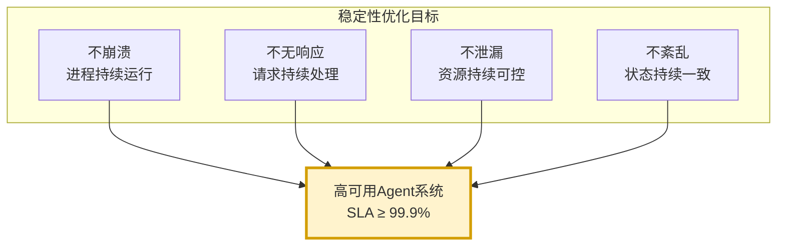

---

## 二、稳定性问题识别

### 2.1 问题分类体系

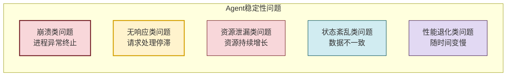

### 2.2 问题表现与识别方法

#### 2.2.1 崩溃类问题

```python
from dataclasses import dataclass, field
from typing import Optional
from enum import Enum
from datetime import datetime


class CrashType(Enum):
    """崩溃类型"""
    OOM_CRASH = "oom_crash"              # 内存不足崩溃
    SEGFAULT = "segfault"                # 段错误
    STACK_OVERFLOW = "stack_overflow"    # 栈溢出
    UNHANDLED_EXCEPTION = "unhandled"    # 未捕获异常
    DEADLOCK = "deadlock"                # 死锁
    INFINITE_LOOP = "infinite_loop"      # 死循环


@dataclass
class CrashReport:
    """崩溃报告"""
    crash_id: str
    crash_type: CrashType
    timestamp: datetime
    process_id: int
    exit_code: int
    stack_trace: str = ""
    memory_usage: int = 0              # 崩溃前内存(MB)
    cpu_usage: float = 0.0             # 崩溃前CPU(%)
    last_operation: str = ""           # 最后操作
    error_message: str = ""


class CrashDetector:
    """崩溃检测器"""
    
    def __init__(self):
        self.crash_reports: list[CrashReport] = []
    
    def detect_crash_type(self, exit_code: int, 
                           signal: Optional[int] = None,
                           error_log: str = "") -> CrashType:
        """根据退出码识别崩溃类型"""
        # 信号判断
        if signal == 9:  # SIGKILL
            return CrashType.OOM_CRASH
        if signal == 11:  # SIGSEGV
            return CrashType.SEGFAULT
        if signal == 6:  # SIGABRT
            return CrashType.UNHANDLED_EXCEPTION
        
        # 退出码判断
        if exit_code == 137:
            return CrashType.OOM_CRASH
        if exit_code == 139:
            return CrashType.SEGFAULT
        if exit_code == 1:
            if "RecursionError" in error_log:
                return CrashType.STACK_OVERFLOW
            if "deadlock" in error_log.lower():
                return CrashType.DEADLOCK
            return CrashType.UNHANDLED_EXCEPTION
        
        # 日志判断
        if "MemoryError" in error_log:
            return CrashType.OOM_CRASH
        if "timeout" in error_log.lower() and "deadlock" in error_log.lower():
            return CrashType.DEADLOCK
        
        return CrashType.UNHANDLED_EXCEPTION
```

#### 2.2.2 无响应类问题

```python
import time
import threading
from typing import Callable, Any


class UnresponsivenessDetector:
    """无响应检测器"""
    
    def __init__(self, check_interval: float = 5.0,
                 unresponsive_threshold: float = 30.0):
        self.check_interval = check_interval
        self.unresponsive_threshold = unresponsive_threshold
        self._last_heartbeat: dict[str, float] = {}
        self._lock = threading.Lock()
        self._monitor_thread: Optional[threading.Thread] = None
        self._running = False
    
    def start_monitoring(self):
        """启动监控"""
        self._running = True
        self._monitor_thread = threading.Thread(
            target=self._monitor_loop, daemon=True
        )
        self._monitor_thread.start()
    
    def stop_monitoring(self):
        """停止监控"""
        self._running = False
        if self._monitor_thread:
            self._monitor_thread.join(timeout=5)
    
    def heartbeat(self, component: str):
        """组件心跳"""
        with self._lock:
            self._last_heartbeat[component] = time.time()
    
    def _monitor_loop(self):
        """监控循环"""
        while self._running:
            time.sleep(self.check_interval)
            now = time.time()
            
            with self._lock:
                for component, last_time in list(self._last_heartbeat.items()):
                    silent_duration = now - last_time
                    
                    if silent_duration > self.unresponsive_threshold:
                        self._handle_unresponsive(component, silent_duration)
    
    def _handle_unresponsive(self, component: str, 
                              silent_duration: float):
        """处理无响应"""
        print(f"[WARNING] 组件 {component} 无响应 {silent_duration:.1f}s")
        # 触发告警、重启等
```

#### 2.2.3 内存泄漏检测

```python
import psutil
import os
from collections import deque


class MemoryLeakDetector:
    """内存泄漏检测器"""
    
    def __init__(self, history_size: int = 100,
                 leak_threshold_mb_per_hour: float = 10.0):
        self.history_size = history_size
        self.leak_threshold = leak_threshold_mb_per_hour
        self.memory_history: deque[tuple[float, float]] = deque(
            maxlen=history_size
        )
        self._process = psutil.Process(os.getpid())
        self._monitoring = False
    
    def start_monitoring(self, interval: float = 60.0):
        """启动监控"""
        self._monitoring = True
        import threading
        
        def monitor():
            while self._monitoring:
                self._record_memory()
                time.sleep(interval)
        
        thread = threading.Thread(target=monitor, daemon=True)
        thread.start()
    
    def stop_monitoring(self):
        """停止监控"""
        self._monitoring = False
    
    def _record_memory(self):
        """记录内存"""
        mem_mb = self._process.memory_info().rss / 1024 / 1024
        self.memory_history.append((time.time(), mem_mb))
    
    def detect_leak(self) -> dict:
        """检测内存泄漏"""
        if len(self.memory_history) < 10:
            return {"leak_detected": False, "reason": "数据不足"}
        
        # 计算内存增长率
        recent = list(self.memory_history)
        
        # 线性回归计算增长率
        times = [r[0] - recent[0][0] for r in recent]  # 相对秒
        mems = [r[1] for r in recent]
        
        n = len(times)
        sum_x = sum(times)
        sum_y = sum(mems)
        sum_xy = sum(t * m for t, m in zip(times, mems))
        sum_x2 = sum(t * t for t in times)
        
        slope = (n * sum_xy - sum_x * sum_y) / (n * sum_x2 - sum_x * sum_x)
        
        # 转换为 MB/小时
        growth_rate_per_hour = slope * 3600
        
        leak_detected = growth_rate_per_hour > self.leak_threshold
        
        return {
            "leak_detected": leak_detected,
            "growth_rate_mb_per_hour": growth_rate_per_hour,
            "current_memory_mb": mems[-1],
            "initial_memory_mb": mems[0],
            "duration_seconds": times[-1] - times[0],
            "threshold": self.leak_threshold
        }
```

### 2.3 问题识别检查清单

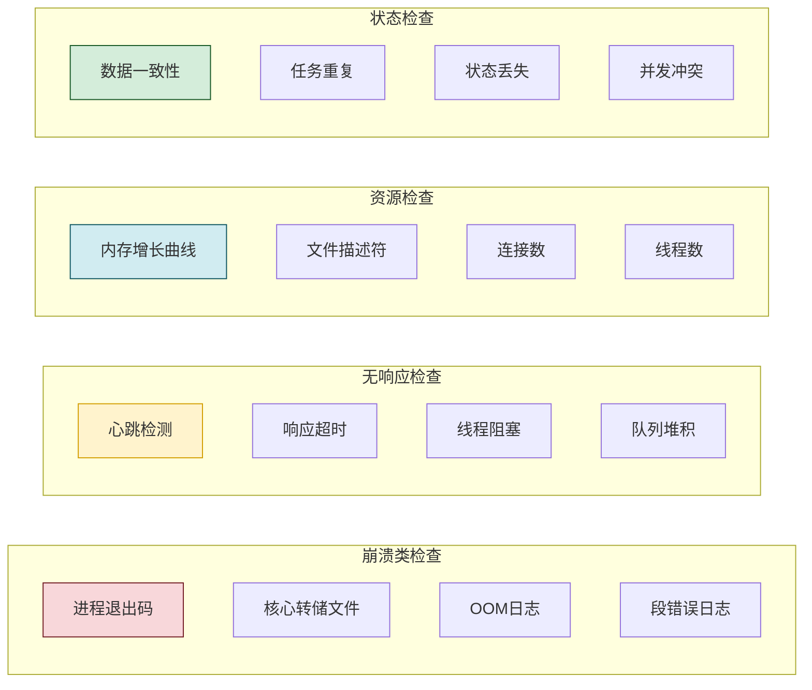

---

## 三、根本原因分析

### 3.1 根因分类

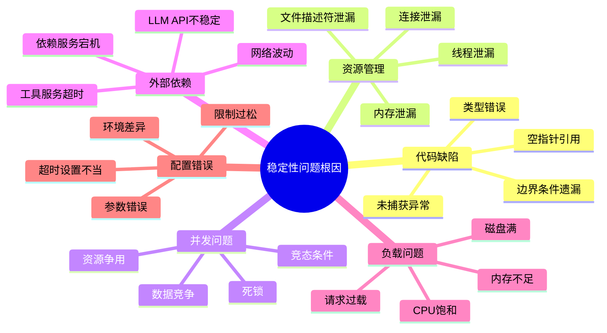

### 3.2 根因分析框架

```python
from dataclasses import dataclass, field
from typing import Optional


@dataclass
class RootCauseAnalysis:
    """根因分析结果"""
    issue_id: str
    issue_description: str
    issue_category: str = ""
    
    # 根因链
    immediate_cause: str = ""          # 直接原因
    contributing_causes: list[str] = field(default_factory=list)  # 促成原因
    root_cause: str = ""              # 根本原因
    
    # 影响分析
    impact_severity: str = "medium"   # low/medium/high/critical
    impact_scope: str = ""            # 影响范围
    affected_components: list[str] = field(default_factory=list)
    
    # 修复建议
    immediate_fix: str = ""           # 临时修复
    permanent_fix: str = ""           # 永久修复
    preventive_measures: list[str] = field(default_factory=list)  # 预防措施
    
    # 时间线
    detected_at: Optional[datetime] = None
    root_cause_identified_at: Optional[datetime] = None
    fixed_at: Optional[datetime] = None


class RootCauseAnalyzer:
    """根因分析器"""
    
    def analyze_crash(self, crash_report: CrashReport) -> RootCauseAnalysis:
        """分析崩溃根因"""
        analysis = RootCauseAnalysis(
            issue_id=crash_report.crash_id,
            issue_description=f"崩溃类型: {crash_report.crash_type.value}",
            detected_at=crash_report.timestamp
        )
        
        # 根据崩溃类型分析根因
        if crash_report.crash_type == CrashType.OOM_CRASH:
            analysis = self._analyze_oom(crash_report, analysis)
        elif crash_report.crash_type == CrashType.DEADLOCK:
            analysis = self._analyze_deadlock(crash_report, analysis)
        elif crash_report.crash_type == CrashType.UNHANDLED_EXCEPTION:
            analysis = self._analyze_unhandled(crash_report, analysis)
        elif crash_report.crash_type == CrashType.STACK_OVERFLOW:
            analysis = self._analyze_stack_overflow(crash_report, analysis)
        
        return analysis
    
    def _analyze_oom(self, crash: CrashReport, 
                      analysis: RootCauseAnalysis) -> RootCauseAnalysis:
        """分析OOM根因"""
        analysis.immediate_cause = "进程内存超过系统限制"
        
        # 分析可能的根本原因
        possible_causes = []
        
        if crash.memory_usage > 0:
            possible_causes.append(
                f"崩溃前内存 {crash.memory_usage}MB,可能存在内存泄漏"
            )
        
        if "conversation_history" in crash.stack_trace:
            possible_causes.append("对话历史无限增长")
        
        if "vector_store" in crash.stack_trace:
            possible_causes.append("向量索引内存过大")
        
        if "cache" in crash.stack_trace.lower():
            possible_causes.append("缓存无限制增长")
        
        analysis.contributing_causes = possible_causes
        analysis.root_cause = possible_causes[0] if possible_causes else "内存使用不当"
        
        analysis.immediate_fix = "增加内存限制或重启进程"
        analysis.permanent_fix = "修复内存泄漏,添加内存限制与垃圾回收"
        analysis.preventive_measures = [
            "实施内存监控与告警",
            "限制对话历史长度",
            "定期清理缓存",
            "使用内存分析工具定期检查"
        ]
        
        return analysis
    
    def _analyze_deadlock(self, crash: CrashReport,
                            analysis: RootCauseAnalysis) -> RootCauseAnalysis:
        """分析死锁根因"""
        analysis.immediate_cause = "线程互相等待对方释放资源"
        
        analysis.contributing_causes = [
            "锁的获取顺序不一致",
            "锁未正确释放(异常导致)",
            "嵌套锁获取",
            "长时间持有锁"
        ]
        
        analysis.root_cause = "锁管理不当"
        
        analysis.immediate_fix = "重启进程"
        analysis.permanent_fix = "统一锁顺序,使用超时锁,避免嵌套锁"
        analysis.preventive_measures = [
            "使用锁超时机制",
            "实施死锁检测",
            "避免嵌套锁",
            "使用并发安全的数据结构"
        ]
        
        return analysis
    
    def _analyze_unhandled(self, crash: CrashReport,
                             analysis: RootCauseAnalysis) -> RootCauseAnalysis:
        """分析未捕获异常根因"""
        analysis.immediate_cause = crash.error_message or "未捕获的异常"
        
        # 分析异常类型
        if "KeyError" in crash.stack_trace:
            analysis.root_cause = "字典键访问未检查"
            analysis.permanent_fix = "添加键存在性检查"
        elif "IndexError" in crash.stack_trace:
            analysis.root_cause = "索引越界"
            analysis.permanent_fix = "添加边界检查"
        elif "TypeError" in crash.stack_trace:
            analysis.root_cause = "类型不匹配"
            analysis.permanent_fix = "添加类型检查"
        elif "AttributeError" in crash.stack_trace:
            analysis.root_cause = "None对象属性访问"
            analysis.permanent_fix = "添加None检查"
        else:
            analysis.root_cause = "异常处理不完善"
            analysis.permanent_fix = "添加全局异常处理"
        
        analysis.preventive_measures = [
            "添加全局异常处理器",
            "编写防御性代码",
            "增加单元测试覆盖",
            "使用类型注解与静态检查"
        ]
        
        return analysis
    
    def _analyze_stack_overflow(self, crash: CrashReport,
                                  analysis: RootCauseAnalysis) -> RootCauseAnalysis:
        """分析栈溢出根因"""
        analysis.immediate_cause = "递归调用过深"
        
        analysis.contributing_causes = [
            "递归无终止条件",
            "递归深度过大",
            "栈空间不足"
        ]
        
        analysis.root_cause = "递归逻辑缺陷"
        analysis.permanent_fix = "添加递归深度限制,改为迭代实现"
        analysis.preventive_measures = [
            "限制最大递归深度",
            "优先使用迭代替代递归",
            "增加栈大小配置"
        ]
        
        return analysis
```

### 3.3 常见根因与修复对照表

| 问题表现 | 直接原因 | 根本原因 | 修复方案 |
|---------|---------|---------|---------|
| OOM 崩溃 | 内存超过限制 | 对话历史无限增长 | 限制历史长度+定期清理 |
| OOM 崩溃 | 内存超过限制 | 向量索引过大 | 分页加载+磁盘存储 |
| 进程挂起 | 线程死锁 | 锁顺序不一致 | 统一锁顺序+超时锁 |
| 请求超时 | LLM 调用阻塞 | 无超时设置 | 添加调用超时 |
| 数据不一致 | 并发写入冲突 | 无锁保护 | 添加并发控制 |
| 内存持续增长 | 对象未释放 | 循环引用 | 弱引用+显式释放 |
| 响应变慢 | 线程数过多 | 线程创建无限制 | 线程池+队列限制 |
| 文件描述符耗尽 | 连接未关闭 | 异常路径漏关 | try-finally/上下文管理器 |

---

## 四、代码质量提升

### 4.1 防御性编程

```python
from typing import Optional, Any, Callable
from functools import wraps
import logging

logger = logging.getLogger(__name__)


class DefensiveProgramming:
    """防御性编程工具集"""
    
    @staticmethod
    def safe_get(obj: Any, key: str, default: Any = None) -> Any:
        """安全的字典/对象访问"""
        if obj is None:
            return default
        if isinstance(obj, dict):
            return obj.get(key, default)
        return getattr(obj, key, default)
    
    @staticmethod
    def safe_call(func: Callable, *args, default: Any = None,
                   **kwargs) -> Any:
        """安全的函数调用"""
        try:
            return func(*args, **kwargs)
        except Exception as e:
            logger.warning(f"安全调用失败: {func.__name__}: {e}")
            return default
    
    @staticmethod
    def safe_index(lst: list, idx: int, default: Any = None) -> Any:
        """安全的索引访问"""
        if not lst or idx < 0 or idx >= len(lst):
            return default
        return lst[idx]
    
    @staticmethod
    def validate_input(value: Any, expected_type: type,
                        name: str = "input") -> Any:
        """输入验证"""
        if not isinstance(value, expected_type):
            raise TypeError(
                f"{name} 期望类型 {expected_type.__name__}, "
                f"实际类型 {type(value).__name__}"
            )
        return value
    
    @staticmethod
    def validate_range(value: (int, float), min_val: float,
                        max_val: float, name: str = "value") -> Any:
        """范围验证"""
        if value < min_val or value > max_val:
            raise ValueError(
                f"{name} 超出范围 [{min_val}, {max_val}], 实际值 {value}"
            )
        return value


def global_exception_handler(func: Callable) -> Callable:
    """全局异常处理装饰器"""
    @wraps(func)
    def wrapper(*args, **kwargs):
        try:
            return func(*args, **kwargs)
        except Exception as e:
            logger.error(
                f"未捕获异常 in {func.__name__}: {type(e).__name__}: {e}",
                exc_info=True
            )
            # 返回安全默认值或重新抛出
            raise
    return wrapper


def safe_execute(default: Any = None, log_error: bool = True):
    """安全执行装饰器"""
    def decorator(func: Callable) -> Callable:
        @wraps(func)
        def wrapper(*args, **kwargs):
            try:
                return func(*args, **kwargs)
            except Exception as e:
                if log_error:
                    logger.error(f"{func.__name__} 执行失败: {e}")
                return default
        return wrapper
    return decorator
```

### 4.2 类型安全与静态检查

```python
from typing import Protocol, runtime_checkable
from dataclasses import dataclass


@runtime_checkable
class ToolProtocol(Protocol):
    """工具协议接口"""
    def execute(self, *args, **kwargs) -> dict:
        ...
    
    def validate_params(self, params: dict) -> bool:
        ...


@dataclass
class ToolResult:
    """工具结果(类型安全)"""
    success: bool
    output: Any = None
    error: Optional[str] = None
    metadata: dict = None
    
    @classmethod
    def success_result(cls, output: Any, **metadata) -> "ToolResult":
        return cls(success=True, output=output, metadata=metadata)
    
    @classmethod
    def error_result(cls, error: str, **metadata) -> "ToolResult":
        return cls(success=False, error=error, metadata=metadata)


class TypedToolExecutor:
    """类型安全的工具执行器"""
    
    def execute_tool(self, tool: ToolProtocol, 
                     *args, **kwargs) -> ToolResult:
        """执行工具(类型安全)"""
        # 1. 类型检查
        if not isinstance(tool, ToolProtocol):
            return ToolResult.error_result(f"工具不符合协议: {type(tool)}")
        
        # 2. 参数验证
        try:
            if not tool.validate_params(kwargs):
                return ToolResult.error_result("参数验证失败")
        except Exception as e:
            return ToolResult.error_result(f"参数验证异常: {e}")
        
        # 3. 执行
        try:
            result = tool.execute(*args, **kwargs)
            return ToolResult.success_result(result)
        except Exception as e:
            return ToolResult.error_result(f"执行失败: {e}")
```

### 4.3 代码质量检查清单

```python
class CodeQualityChecklist:
    """代码质量检查清单"""
    
    CHECKS = [
        # 异常处理
        ("所有外部调用有 try-except", "exception_handling"),
        ("异常被正确记录", "exception_logging"),
        ("异常后资源被释放", "resource_cleanup"),
        ("不吞没异常(空 except)", "no_silent_except"),
        
        # 边界条件
        ("空值检查(None)", "null_check"),
        ("空集合检查", "empty_collection_check"),
        ("索引越界检查", "bounds_check"),
        ("数值溢出检查", "overflow_check"),
        
        # 资源管理
        ("文件使用 with 语句", "file_with_statement"),
        ("连接使用上下文管理器", "connection_context_manager"),
        ("锁使用 with 语句", "lock_with_statement"),
        ("临时资源显式释放", "explicit_cleanup"),
        
        # 并发安全
        ("共享数据有锁保护", "shared_data_lock"),
        ("锁有超时机制", "lock_timeout"),
        ("避免嵌套锁", "no_nested_lock"),
        ("使用线程安全数据结构", "thread_safe_structures"),
        
        # 输入验证
        ("外部输入有验证", "input_validation"),
        ("参数类型有检查", "type_check"),
        ("参数范围有检查", "range_check"),
        ("特殊字符有处理", "special_char_handling"),
    ]
    
    @classmethod
    def run_checks(cls, code: str) -> dict:
        """运行代码质量检查(简化)"""
        results = {}
        for description, check_id in cls.CHECKS:
            # 简化:实际需更复杂的静态分析
            results[check_id] = {
                "description": description,
                "passed": True,  # 需实际检查
                "details": ""
            }
        return results
```

---

## 五、资源管理优化

### 5.1 资源管理架构

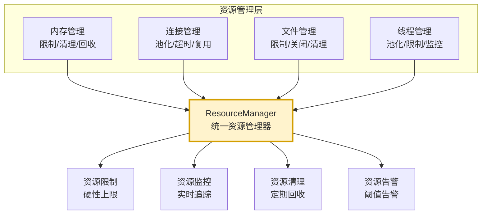

### 5.2 内存管理优化

```python
import gc
import weakref
from typing import Any, Optional
from collections import OrderedDict
from datetime import datetime, timedelta


class BoundedDict:
    """有界字典 - 防止无限增长"""
    
    def __init__(self, max_size: int = 1000):
        self._data: OrderedDict = OrderedDict()
        self._max_size = max_size
        self._lock = threading.RLock()
    
    def get(self, key: str) -> Optional[Any]:
        with self._lock:
            if key in self._data:
                self._data.move_to_end(key)
                return self._data[key]
            return None
    
    def set(self, key: str, value: Any):
        with self._lock:
            if key in self._data:
                self._data.move_to_end(key)
            self._data[key] = value
            
            # 超过上限时淘汰最老的
            if len(self._data) > self._max_size:
                self._data.popitem(last=False)
    
    def clear(self):
        with self._lock:
            self._data.clear()
    
    def size(self) -> int:
        with self._lock:
            return len(self._data)


class ConversationHistoryManager:
    """对话历史管理器 - 防止内存泄漏"""
    
    def __init__(self, max_messages: int = 100,
                 max_memory_mb: float = 50.0,
                 summary_threshold: int = 80):
        self.max_messages = max_messages
        self.max_memory_mb = max_memory_mb
        self.summary_threshold = summary_threshold
        self._histories: dict[str, list[dict]] = {}
        self._lock = threading.RLock()
    
    def add_message(self, session_id: str, message: dict):
        """添加消息"""
        with self._lock:
            if session_id not in self._histories:
                self._histories[session_id] = []
            
            self._histories[session_id].append(message)
            
            # 检查是否需要压缩
            if len(self._histories[session_id]) > self.summary_threshold:
                self._compress_history(session_id)
            
            # 检查是否超过最大消息数
            if len(self._histories[session_id]) > self.max_messages:
                # 保留最近的消息
                self._histories[session_id] = \
                    self._histories[session_id][-self.max_messages:]
    
    def _compress_history(self, session_id: str):
        """压缩历史(摘要旧消息)"""
        history = self._histories[session_id]
        
        # 保留最近20条,前面的摘要
        keep_recent = 20
        to_summarize = history[:-keep_recent]
        
        if to_summarize:
            # 生成摘要(简化)
            summary = {
                "role": "system",
                "content": f"[历史摘要] 之前有 {len(to_summarize)} 条对话",
                "timestamp": datetime.now().isoformat(),
                "type": "summary"
            }
            
            self._histories[session_id] = [summary] + history[-keep_recent:]
    
    def get_history(self, session_id: str) -> list[dict]:
        """获取历史"""
        with self._lock:
            return self._histories.get(session_id, []).copy()
    
    def clear_session(self, session_id: str):
        """清除会话历史"""
        with self._lock:
            self._histories.pop(session_id, None)
    
    def clear_all(self):
        """清除所有"""
        with self._lock:
            self._histories.clear()
    
    def get_memory_usage(self) -> dict:
        """获取内存使用"""
        import sys
        with self._lock:
            total_size = 0
            for session_id, history in self._histories.items():
                session_size = sys.getsizeof(history)
                total_size += session_size
            
            return {
                "total_sessions": len(self._histories),
                "total_messages": sum(len(h) for h in self._histories.values()),
                "estimated_memory_mb": total_size / 1024 / 1024
            }


class MemoryGuard:
    """内存守护器"""
    
    def __init__(self, max_memory_mb: float = 1024,
                 warning_threshold: float = 0.8,
                 critical_threshold: float = 0.95):
        self.max_memory_mb = max_memory_mb
        self.warning_threshold = warning_threshold
        self.critical_threshold = critical_threshold
        self._gc_callbacks: list[Callable] = []
    
    def register_gc_callback(self, callback: Callable):
        """注册垃圾回收回调"""
        self._gc_callbacks.append(callback)
    
    def check_memory(self) -> dict:
        """检查内存状态"""
        import psutil
        import os
        
        process = psutil.Process(os.getpid())
        mem_mb = process.memory_info().rss / 1024 / 1024
        usage_ratio = mem_mb / self.max_memory_mb
        
        status = "normal"
        if usage_ratio >= self.critical_threshold:
            status = "critical"
            self._trigger_gc()
        elif usage_ratio >= self.warning_threshold:
            status = "warning"
            self._trigger_gc()
        
        return {
            "memory_mb": mem_mb,
            "max_memory_mb": self.max_memory_mb,
            "usage_ratio": usage_ratio,
            "status": status
        }
    
    def _trigger_gc(self):
        """触发垃圾回收"""
        logger.info("触发垃圾回收")
        
        # 1. 调用注册的清理回调
        for callback in self._gc_callbacks:
            try:
                callback()
            except Exception as e:
                logger.error(f"GC回调失败: {e}")
        
        # 2. Python 垃圾回收
        collected = gc.collect()
        logger.info(f"GC回收 {collected} 个对象")
```

### 5.3 连接管理优化

```python
import threading
from contextlib import contextmanager
from typing import Generator, Optional


class ConnectionPool:
    """连接池 - 防止连接泄漏"""
    
    def __init__(self, factory: Callable, max_connections: int = 10,
                 idle_timeout: float = 300):
        self._factory = factory
        self._max_connections = max_connections
        self._idle_timeout = idle_timeout
        self._pool: list[tuple[Any, float]] = []  # (connection, last_used)
        self._in_use: set[int] = set()  # 正在使用的连接ID
        self._lock = threading.RLock()
        self._total_created = 0
    
    @contextmanager
    def get_connection(self) -> Generator[Any, None, None]:
        """获取连接(上下文管理器)"""
        conn = self._acquire()
        try:
            yield conn
        finally:
            self._release(conn)
    
    def _acquire(self) -> Any:
        """获取连接"""
        with self._lock:
            # 1. 从池中获取空闲连接
            while self._pool:
                conn, last_used = self._pool.pop()
                if time.time() - last_used < self._idle_timeout:
                    self._in_use.add(id(conn))
                    return conn
                else:
                    self._close_connection(conn)
            
            # 2. 创建新连接
            if len(self._in_use) < self._max_connections:
                conn = self._factory()
                self._in_use.add(id(conn))
                self._total_created += 1
                return conn
            
            # 3. 等待可用连接
            raise ConnectionError("连接池已满,无法获取连接")
    
    def _release(self, conn: Any):
        """释放连接"""
        with self._lock:
            self._in_use.discard(id(conn))
            self._pool.append((conn, time.time()))
    
    def _close_connection(self, conn: Any):
        """关闭连接"""
        try:
            if hasattr(conn, 'close'):
                conn.close()
        except Exception as e:
            logger.error(f"关闭连接失败: {e}")
    
    def cleanup_idle(self):
        """清理空闲连接"""
        with self._lock:
            now = time.time()
            active_pool = []
            for conn, last_used in self._pool:
                if now - last_used < self._idle_timeout:
                    active_pool.append((conn, last_used))
                else:
                    self._close_connection(conn)
            self._pool = active_pool
    
    def get_stats(self) -> dict:
        """获取统计"""
        with self._lock:
            return {
                "total_created": self._total_created,
                "in_use": len(self._in_use),
                "idle": len(self._pool),
                "max": self._max_connections
            }
```

### 5.4 资源限制配置

```python
@dataclass
class ResourceLimits:
    """资源限制配置"""
    # 内存限制
    max_memory_mb: float = 2048
    memory_warning_ratio: float = 0.8
    memory_critical_ratio: float = 0.95
    
    # 对话历史限制
    max_conversation_messages: int = 100
    max_conversation_memory_mb: float = 50
    conversation_summary_threshold: int = 80
    
    # 缓存限制
    max_cache_size: int = 1000
    max_cache_memory_mb: float = 100
    cache_ttl_seconds: float = 3600
    
    # 连接限制
    max_connections: int = 10
    connection_idle_timeout: float = 300
    connection_request_timeout: float = 30
    
    # 线程限制
    max_threads: int = 20
    thread_queue_size: int = 100
    
    # 文件描述符限制
    max_file_descriptors: int = 1024
    
    # LLM 调用限制
    max_concurrent_llm_calls: int = 5
    llm_call_timeout: float = 60
    
    # 工具调用限制
    max_concurrent_tool_calls: int = 3
    tool_call_timeout: float = 120
```

---

## 六、错误处理机制完善

### 6.1 错误处理架构

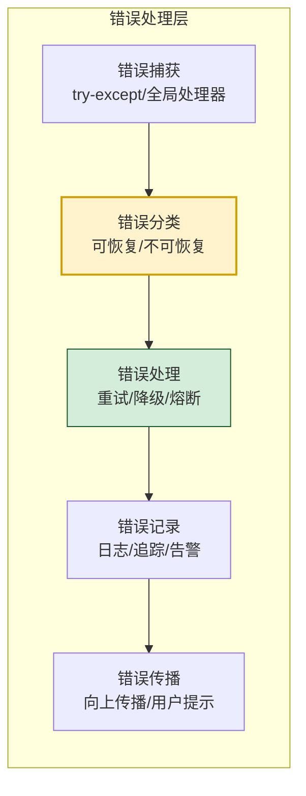

### 6.2 分级错误处理

```python
from enum import Enum


class ErrorSeverity(Enum):
    """错误严重级别"""
    INFO = "info"           # 信息:可忽略
    WARNING = "warning"     # 警告:可继续
    ERROR = "error"         # 错误:需处理
    CRITICAL = "critical"   # 严重:需降级
    FATAL = "fatal"         # 致命:需重启


class ErrorRecoverability(Enum):
    """错误可恢复性"""
    RECOVERABLE = "recoverable"          # 可恢复(重试)
    DEGRADABLE = "degradable"            # 可降级(备用方案)
    NON_RECOVERABLE = "non_recoverable"  # 不可恢复(失败)


@dataclass
class HandledError:
    """已处理的错误"""
    error_type: str
    error_message: str
    severity: ErrorSeverity
    recoverability: ErrorRecoverability
    timestamp: datetime
    context: dict = field(default_factory=dict)
    stack_trace: str = ""
    recovery_action: str = ""
    user_message: str = ""


class ErrorHandler:
    """错误处理器"""
    
    def __init__(self):
        self._handlers: dict[str, Callable] = {}
        self._fallback_handler: Optional[Callable] = None
        self._error_history: list[HandledError] = []
        self._lock = threading.RLock()
    
    def register_handler(self, error_type: str, handler: Callable):
        """注册特定错误类型的处理器"""
        self._handlers[error_type] = handler
    
    def set_fallback_handler(self, handler: Callable):
        """设置兜底处理器"""
        self._fallback_handler = handler
    
    def handle(self, error: Exception, 
               context: Optional[dict] = None) -> HandledError:
        """处理错误"""
        error_type = type(error).__name__
        context = context or {}
        
        # 分类错误
        severity, recoverability = self._classify_error(error)
        
        # 构建错误对象
        handled = HandledError(
            error_type=error_type,
            error_message=str(error),
            severity=severity,
            recoverability=recoverability,
            timestamp=datetime.now(),
            context=context,
            stack_trace=traceback.format_exc()
        )
        
        # 查找并执行处理器
        handler = self._handlers.get(error_type, self._fallback_handler)
        if handler:
            try:
                recovery_action = handler(error, context)
                handled.recovery_action = recovery_action or "handled"
            except Exception as handler_error:
                logger.error(f"错误处理器本身失败: {handler_error}")
                handled.recovery_action = "handler_failed"
        else:
            handled.recovery_action = "no_handler"
        
        # 生成用户消息
        handled.user_message = self._generate_user_message(handled)
        
        # 记录错误
        self._record_error(handled)
        
        # 记录日志
        self._log_error(handled)
        
        return handled
    
    def _classify_error(self, error: Exception) -> tuple[ErrorSeverity, ErrorRecoverability]:
        """分类错误"""
        error_type = type(error).__name__
        
        # 网络错误: 可恢复
        if isinstance(error, (ConnectionError, TimeoutError, OSError)):
            return ErrorSeverity.WARNING, ErrorRecoverability.RECOVERABLE
        
        # LLM 错误: 可降级
        if "RateLimit" in error_type or "ServiceUnavailable" in error_type:
            return ErrorSeverity.ERROR, ErrorRecoverability.DEGRADABLE
        
        # 参数错误: 不可恢复
        if isinstance(error, (ValueError, TypeError, KeyError)):
            return ErrorSeverity.ERROR, ErrorRecoverability.NON_RECOVERABLE
        
        # 内存错误: 严重
        if isinstance(error, MemoryError):
            return ErrorSeverity.FATAL, ErrorRecoverability.NON_RECOVERABLE
        
        # 默认: 错误,可恢复
        return ErrorSeverity.ERROR, ErrorRecoverability.RECOVERABLE
    
    def _generate_user_message(self, error: HandledError) -> str:
        """生成用户友好消息"""
        messages = {
            ErrorSeverity.INFO: "操作完成",
            ErrorSeverity.WARNING: f"操作有警告: {error.error_message}",
            ErrorSeverity.ERROR: f"操作出错,正在处理: {error.error_message}",
            ErrorSeverity.CRITICAL: "服务暂时不可用,正在降级处理",
            ErrorSeverity.FATAL: "服务遇到严重问题,正在恢复"
        }
        return messages.get(error.severity, "未知错误")
    
    def _record_error(self, error: HandledError):
        """记录错误"""
        with self._lock:
            self._error_history.append(error)
            # 限制历史大小
            if len(self._error_history) > 1000:
                self._error_history = self._error_history[-500:]
    
    def _log_error(self, error: HandledError):
        """记录日志"""
        if error.severity == ErrorSeverity.INFO:
            logger.info(self._format_error(error))
        elif error.severity == ErrorSeverity.WARNING:
            logger.warning(self._format_error(error))
        elif error.severity == ErrorSeverity.ERROR:
            logger.error(self._format_error(error))
        elif error.severity in (ErrorSeverity.CRITICAL, ErrorSeverity.FATAL):
            logger.critical(self._format_error(error))
    
    def _format_error(self, error: HandledError) -> str:
        """格式化错误"""
        return (
            f"[{error.severity.value}] {error.error_type}: {error.error_message} "
            f"| 恢复: {error.recoverability.value} "
            f"| 动作: {error.recovery_action}"
        )


# 全局异常处理器
def install_global_exception_handlers(error_handler: ErrorHandler):
    """安装全局异常处理器"""
    import sys
    
    def handle_exception(exc_type, exc_value, exc_traceback):
        if issubclass(exc_type, KeyboardInterrupt):
            sys.__excepthook__(exc_type, exc_value, exc_traceback)
            return
        
        error = exc_type(str(exc_value))
        error_handler.handle(error, {
            "traceback": "".join(
                traceback.format_exception(exc_type, exc_value, exc_traceback)
            )
        })
    
    sys.excepthook = handle_exception
    
    # 异步异常处理
    def handle_async_exception(loop, context):
        error = context.get("exception")
        if error:
            error_handler.handle(error, {
                "async_context": context
            })
        else:
            logger.error(f"异步错误: {context['message']}")
    
    try:
        loop = asyncio.get_event_loop()
        loop.set_exception_handler(handle_async_exception)
    except RuntimeError:
        pass  # 无事件循环
```

### 6.3 熔断器模式

```python
class CircuitBreaker:
    """熔断器"""
    
    def __init__(self, failure_threshold: int = 5,
                 recovery_timeout: float = 60,
                 half_open_max_calls: int = 3):
        self.failure_threshold = failure_threshold
        self.recovery_timeout = recovery_timeout
        self.half_open_max_calls = half_open_max_calls
        
        self._failure_count = 0
        self._last_failure_time: Optional[float] = None
        self._state = "closed"  # closed/open/half_open
        self._half_open_calls = 0
        self._lock = threading.RLock()
    
    @property
    def state(self) -> str:
        with self._lock:
            if self._state == "open":
                # 检查是否可以进入半开状态
                if (self._last_failure_time and 
                    time.time() - self._last_failure_time > self.recovery_timeout):
                    self._state = "half_open"
                    self._half_open_calls = 0
            return self._state
    
    def can_execute(self) -> bool:
        """是否可以执行"""
        state = self.state
        if state == "closed":
            return True
        elif state == "open":
            return False
        elif state == "half_open":
            with self._lock:
                if self._half_open_calls < self.half_open_max_calls:
                    self._half_open_calls += 1
                    return True
                return False
    
    def record_success(self):
        """记录成功"""
        with self._lock:
            if self._state == "half_open":
                # 半开状态成功,恢复到关闭
                self._state = "closed"
                self._failure_count = 0
                self._half_open_calls = 0
            elif self._state == "closed":
                # 关闭状态成功,重置失败计数
                self._failure_count = 0
    
    def record_failure(self):
        """记录失败"""
        with self._lock:
            self._failure_count += 1
            self._last_failure_time = time.time()
            
            if self._state == "half_open":
                # 半开状态失败,重新打开
                self._state = "open"
            elif self._state == "closed":
                if self._failure_count >= self.failure_threshold:
                    self._state = "open"
    
    def get_state(self) -> dict:
        """获取状态"""
        with self._lock:
            return {
                "state": self._state,
                "failure_count": self._failure_count,
                "failure_threshold": self.failure_threshold,
                "last_failure_time": self._last_failure_time,
                "recovery_timeout": self.recovery_timeout
            }


def with_circuit_breaker(breaker: CircuitBreaker):
    """熔断器装饰器"""
    def decorator(func):
        @wraps(func)
        def wrapper(*args, **kwargs):
            if not breaker.can_execute():
                raise CircuitBreakerOpenError(
                    f"熔断器开启, {func.__name__} 不可调用"
                )
            try:
                result = func(*args, **kwargs)
                breaker.record_success()
                return result
            except Exception as e:
                breaker.record_failure()
                raise
        return wrapper
    return decorator


class CircuitBreakerOpenError(Exception):
    """熔断器开启异常"""
    pass
```

---

## 七、并发控制改进

### 7.1 并发问题与解决

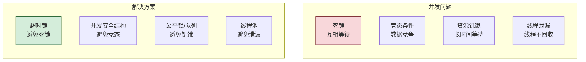

### 7.2 线程池管理

```python
from concurrent.futures import ThreadPoolExecutor, Future, as_completed
from typing import Optional


class ManagedThreadPool:
    """受控线程池"""
    
    def __init__(self, max_workers: int = 10,
                 queue_size: int = 100,
                 thread_timeout: float = 60):
        self.max_workers = max_workers
        self.queue_size = queue_size
        self.thread_timeout = thread_timeout
        
        self._executor: Optional[ThreadPoolExecutor] = None
        self._pending: dict[Future, dict] = {}
        self._lock = threading.RLock()
        self._stats = {
            "submitted": 0,
            "completed": 0,
            "failed": 0,
            "rejected": 0
        }
    
    def start(self):
        """启动线程池"""
        self._executor = ThreadPoolExecutor(
            max_workers=self.max_workers,
            thread_name_prefix="agent-worker"
        )
    
    def shutdown(self):
        """关闭线程池"""
        if self._executor:
            self._executor.shutdown(wait=True, timeout=self.thread_timeout)
            self._executor = None
    
    def submit(self, func: Callable, *args, 
               timeout: float = 30, **kwargs) -> Future:
        """提交任务"""
        if not self._executor:
            raise RuntimeError("线程池未启动")
        
        with self._lock:
            if len(self._pending) >= self.queue_size:
                self._stats["rejected"] += 1
                raise RuntimeError("任务队列已满")
            
            future = self._executor.submit(func, *args, **kwargs)
            self._pending[future] = {
                "func_name": func.__name__,
                "submitted_at": time.time(),
                "timeout": timeout
            }
            self._stats["submitted"] += 1
            
            future.add_done_callback(self._on_done)
            return future
    
    def _on_done(self, future: Future):
        """任务完成回调"""
        with self._lock:
            task_info = self._pending.pop(future, {})
            
            if future.exception():
                self._stats["failed"] += 1
                logger.error(
                    f"任务失败: {task_info.get('func_name')}: "
                    f"{future.exception()}"
                )
            else:
                self._stats["completed"] += 1
    
    def wait_all(self, timeout: float = 60) -> dict:
        """等待所有任务"""
        with self._lock:
            futures = list(self._pending.keys())
        
        results = {"completed": 0, "failed": 0, "timeout": 0}
        
        for future in as_completed(futures, timeout=timeout):
            try:
                future.result()
                results["completed"] += 1
            except Exception:
                results["failed"] += 1
            except TimeoutError:
                results["timeout"] += 1
        
        return results
    
    def get_stats(self) -> dict:
        """获取统计"""
        with self._lock:
            return {
                **self._stats,
                "pending": len(self._pending),
                "max_workers": self.max_workers,
                "queue_size": self.queue_size
            }
```

### 7.3 超时锁

```python
class TimeoutLock:
    """超时锁 - 防止死锁"""
    
    def __init__(self, timeout: float = 30):
        self._lock = threading.RLock()
        self._timeout = timeout
        self._owner: Optional[str] = None
        self._acquired_at: Optional[float] = None
    
    def acquire(self, timeout: Optional[float] = None) -> bool:
        """获取锁(带超时)"""
        timeout = timeout or self._timeout
        
        acquired = self._lock.acquire(timeout=timeout)
        if acquired:
            self._owner = threading.current_thread().name
            self._acquired_at = time.time()
            return True
        
        logger.warning(f"锁获取超时 ({timeout}s)")
        return False
    
    def release(self):
        """释放锁"""
        self._owner = None
        self._acquired_at = None
        self._lock.release()
    
    def __enter__(self):
        self.acquire()
        return self
    
    def __exit__(self, *args):
        self.release()
    
    def check_holding_time(self) -> float:
        """检查持有时间"""
        if self._acquired_at:
            return time.time() - self._acquired_at
        return 0


class DeadlockDetector:
    """死锁检测器"""
    
    def __init__(self, check_interval: float = 10):
        self.check_interval = check_interval
        self._locks: dict[str, TimeoutLock] = {}
        self._lock_threshold = 60  # 持有超过60秒视为可疑
        self._running = False
    
    def register_lock(self, name: str, lock: TimeoutLock):
        """注册锁"""
        self._locks[name] = lock
    
    def start(self):
        """启动检测"""
        self._running = True
        thread = threading.Thread(target=self._detect_loop, daemon=True)
        thread.start()
    
    def stop(self):
        """停止检测"""
        self._running = False
    
    def _detect_loop(self):
        """检测循环"""
        while self._running:
            time.sleep(self.check_interval)
            
            for name, lock in self._locks.items():
                holding_time = lock.check_holding_time()
                if holding_time > self._lock_threshold:
                    logger.warning(
                        f"可能的死锁: 锁 {name} 已持有 {holding_time:.1f}s"
                    )
                    # 可触发告警或强制释放
```

### 7.4 并发安全数据结构

```python
class ConcurrentBoundedQueue:
    """线程安全的有界队列"""
    
    def __init__(self, max_size: int = 100):
        self._queue: deque = deque(maxlen=max_size)
        self._lock = threading.RLock()
        self._not_empty = threading.Condition(self._lock)
        self._not_full = threading.Condition(self._lock)
        self._max_size = max_size
    
    def put(self, item, timeout: float = 30) -> bool:
        """入队(带超时)"""
        with self._not_full:
            if len(self._queue) >= self._max_size:
                if not self._not_full.wait(timeout):
                    return False
            self._queue.append(item)
            self._not_empty.notify()
            return True
    
    def get(self, timeout: float = 30) -> Any:
        """出队(带超时)"""
        with self._not_empty:
            if not self._queue:
                if not self._not_empty.wait(timeout):
                    return None
            item = self._queue.popleft()
            self._not_full.notify()
            return item
    
    def size(self) -> int:
        """队列大小"""
        with self._lock:
            return len(self._queue)
```

---

## 八、稳定性监控机制

### 8.1 监控体系架构

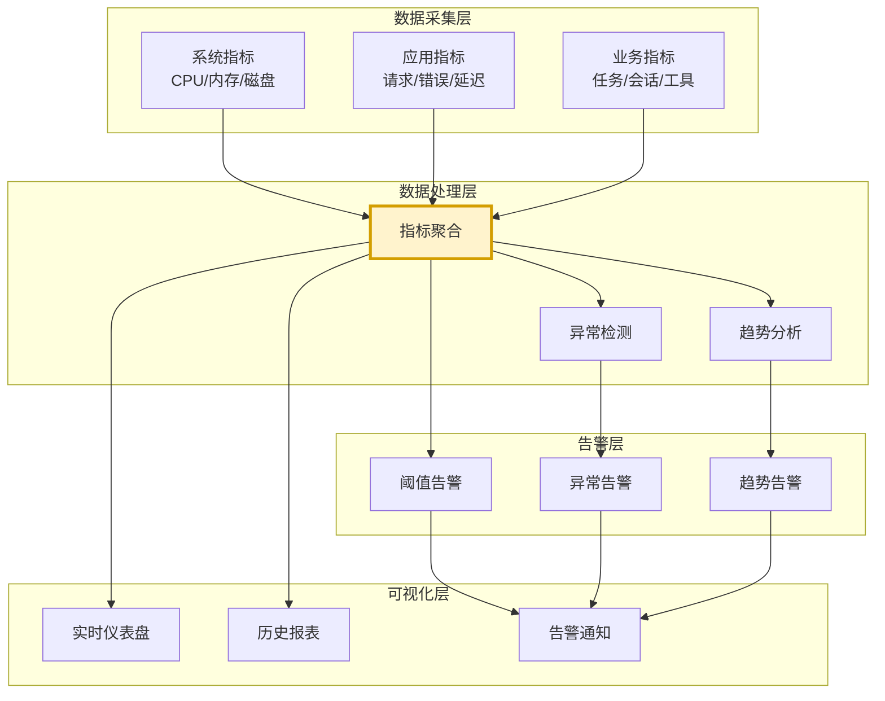

### 8.2 监控指标实现

```python
from dataclasses import dataclass, field
from collections import defaultdict
import time


@dataclass
class StabilityMetrics:
    """稳定性监控指标"""
    
    # 系统指标
    cpu_usage: float = 0.0
    memory_usage_mb: float = 0.0
    memory_usage_ratio: float = 0.0
    disk_usage_ratio: float = 0.0
    file_descriptor_count: int = 0
    thread_count: int = 0
    
    # 应用指标
    request_count: int = 0
    error_count: int = 0
    error_rate: float = 0.0
    avg_response_time: float = 0.0
    p99_response_time: float = 0.0
    
    # 稳定性指标
    uptime_seconds: float = 0.0
    crash_count: int = 0
    restart_count: int = 0
    last_crash_time: Optional[float] = None
    
    # 健康状态
    health_status: str = "healthy"  # healthy/warning/critical
    active_alerts: list[str] = field(default_factory=list)


class StabilityMonitor:
    """稳定性监控器"""
    
    def __init__(self):
        self._start_time = time.time()
        self._metrics_history: list[StabilityMetrics] = []
        self._max_history = 1440  # 24小时,每分钟一个
        self._lock = threading.RLock()
        self._alert_callbacks: list[Callable] = []
        self._error_count = 0
        self._request_count = 0
        self._response_times: list[float] = []
    
    def record_request(self, response_time: float, 
                       success: bool):
        """记录请求"""
        with self._lock:
            self._request_count += 1
            if not success:
                self._error_count += 1
            
            self._response_times.append(response_time)
            # 保留最近1000个
            if len(self._response_times) > 1000:
                self._response_times = self._response_times[-1000:]
    
    def collect_metrics(self) -> StabilityMetrics:
        """采集指标"""
        import psutil
        import os
        
        process = psutil.Process(os.getpid())
        
        # 系统指标
        cpu = process.cpu_percent()
        mem_info = process.memory_info()
        mem_mb = mem_info.rss / 1024 / 1024
        
        # 应用指标
        with self._lock:
            error_rate = (
                self._error_count / self._request_count 
                if self._request_count > 0 else 0
            )
            avg_rt = (
                sum(self._response_times) / len(self._response_times)
                if self._response_times else 0
            )
            p99_rt = self._calculate_p99()
        
        # 健康状态判断
        health, alerts = self._assess_health(cpu, mem_mb, error_rate, avg_rt)
        
        metrics = StabilityMetrics(
            cpu_usage=cpu,
            memory_usage_mb=mem_mb,
            memory_usage_ratio=mem_mb / 2048,  # 假设2GB限制
            request_count=self._request_count,
            error_count=self._error_count,
            error_rate=error_rate,
            avg_response_time=avg_rt,
            p99_response_time=p99_rt,
            uptime_seconds=time.time() - self._start_time,
            health_status=health,
            active_alerts=alerts
        )
        
        # 保存历史
        with self._lock:
            self._metrics_history.append(metrics)
            if len(self._metrics_history) > self._max_history:
                self._metrics_history = self._metrics_history[-self._max_history:]
        
        # 触发告警回调
        if alerts:
            for callback in self._alert_callbacks:
                try:
                    callback(alerts, metrics)
                except Exception as e:
                    logger.error(f"告警回调失败: {e}")
        
        return metrics
    
    def _calculate_p99(self) -> float:
        """计算P99"""
        if not self._response_times:
            return 0.0
        
        sorted_times = sorted(self._response_times)
        p99_idx = int(len(sorted_times) * 0.99)
        return sorted_times[p99_idx] if p99_idx < len(sorted_times) else sorted_times[-1]
    
    def _assess_health(self, cpu: float, mem_mb: float,
                        error_rate: float, avg_rt: float) -> tuple[str, list[str]]:
        """评估健康状态"""
        alerts = []
        
        # CPU 检查
        if cpu > 90:
            alerts.append(f"CPU 使用率过高: {cpu:.1f}%")
        
        # 内存检查
        if mem_mb > 1800:  # 接近2GB限制
            alerts.append(f"内存使用过高: {mem_mb:.0f}MB")
        
        # 错误率检查
        if error_rate > 0.05:  # 5%
            alerts.append(f"错误率过高: {error_rate:.1%}")
        
        # 响应时间检查
        if avg_rt > 5:
            alerts.append(f"响应时间过长: {avg_rt:.1f}s")
        
        if any("过高" in a or "过长" in a for a in alerts):
            health = "critical" if len(alerts) >= 2 else "warning"
        else:
            health = "healthy"
        
        return health, alerts
    
    def register_alert_callback(self, callback: Callable):
        """注册告警回调"""
        self._alert_callbacks.append(callback)
    
    def get_summary(self) -> dict:
        """获取摘要"""
        with self._lock:
            if not self._metrics_history:
                return {}
            
            latest = self._metrics_history[-1]
            return {
                "uptime_hours": latest.uptime_seconds / 3600,
                "health_status": latest.health_status,
                "active_alerts": latest.active_alerts,
                "error_rate": latest.error_rate,
                "avg_response_time": latest.avg_response_time,
                "memory_usage_mb": latest.memory_usage_mb,
                "cpu_usage": latest.cpu_usage,
                "total_requests": latest.request_count,
                "total_errors": latest.error_count
            }
```

### 8.3 健康检查端点

```python
class HealthChecker:
    """健康检查器"""
    
    def __init__(self):
        self._checks: dict[str, Callable] = {}
    
    def register_check(self, name: str, check_func: Callable[bool, []]):
        """注册健康检查"""
        self._checks[name] = check_func
    
    def check_health(self) -> dict:
        """执行健康检查"""
        results = {}
        all_healthy = True
        
        for name, check_func in self._checks.items():
            try:
                healthy = check_func()
                results[name] = {
                    "status": "healthy" if healthy else "unhealthy",
                    "timestamp": datetime.now().isoformat()
                }
                if not healthy:
                    all_healthy = False
            except Exception as e:
                results[name] = {
                    "status": "error",
                    "error": str(e),
                    "timestamp": datetime.now().isoformat()
                }
                all_healthy = False
        
        return {
            "overall": "healthy" if all_healthy else "unhealthy",
            "checks": results,
            "timestamp": datetime.now().isoformat()
        }


# 健康检查示例
health_checker = HealthChecker()

# 注册LLM可用性检查
health_checker.register_check("llm_available", lambda: check_llm_connection())

# 注册数据库可用性检查
health_checker.register_check("db_available", lambda: check_db_connection())

# 注册内存检查
health_checker.register_check("memory_ok", lambda: get_memory_usage() < 1800)
```

---

## 九、故障恢复策略

### 9.1 恢复策略体系

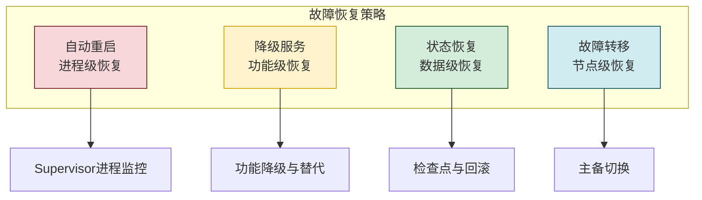

### 9.2 自动重启机制

```python
class ProcessSupervisor:
    """进程监控器"""
    
    def __init__(self, max_restarts: int = 5,
                 restart_cooldown: float = 30,
                 crash_window: float = 300):
        self.max_restarts = max_restarts
        self.restart_cooldown = restart_cooldown
        self.crash_window = crash_window  # 5分钟内崩溃计数窗口
        
        self._restart_count = 0
        self._crash_times: list[float] = []
        self._last_restart: Optional[float] = None
        self._lock = threading.RLock()
    
    def should_restart(self) -> tuple[bool, str]:
        """判断是否应该重启"""
        with self._lock:
            now = time.time()
            
            # 清理过期的崩溃记录
            self._crash_times = [
                t for t in self._crash_times 
                if now - t < self.crash_window
            ]
            
            # 检查冷却时间
            if self._last_restart and now - self._last_restart < self.restart_cooldown:
                remaining = self.restart_cooldown - (now - self._last_restart)
                return False, f"冷却中, {remaining:.0f}s 后可重启"
            
            # 检查窗口内崩溃次数
            if len(self._crash_times) >= self.max_restarts:
                return False, f"窗口内崩溃 {len(self._crash_times)} 次,超过上限"
            
            return True, "允许重启"
    
    def record_restart(self):
        """记录重启"""
        with self._lock:
            self._restart_count += 1
            self._crash_times.append(time.time())
            self._last_restart = time.time()
    
    def get_stats(self) -> dict:
        """获取统计"""
        with self._lock:
            return {
                "total_restarts": self._restart_count,
                "recent_crashes": len(self._crash_times),
                "max_restarts": self.max_restarts,
                "last_restart": self._last_restart,
                "cooldown_remaining": max(0, 
                    self.restart_cooldown - (time.time() - self._last_restart)
                ) if self._last_restart else 0
            }


# Supervisor 脚本示例
def supervisor_main():
    """Supervisor 主进程"""
    import subprocess
    import signal
    
    supervisor = ProcessSupervisor()
    
    while True:
        should, reason = supervisor.should_restart()
        if not should:
            logger.critical(f"不再重启: {reason}")
            break
        
        logger.info(f"启动 Agent 进程 (第 {supervisor._restart_count + 1} 次)")
        
        try:
            process = subprocess.Popen(
                ["python", "agent_main.py"],
                preexec_fn=lambda: signal.signal(signal.SIGTERM, signal.SIG_DFL)
            )
            exit_code = process.wait()
            
            logger.warning(f"Agent 进程退出, 退出码: {exit_code}")
            supervisor.record_restart()
            
        except Exception as e:
            logger.error(f"启动失败: {e}")
            supervisor.record_restart()
```

### 9.3 降级服务

```python
class DegradationManager:
    """降级管理器"""
    
    def __init__(self):
        self._degradation_levels = {
            0: {"name": "normal", "features": ["all"]},
            1: {"name": "reduced", "features": ["basic_search", "simple_response"]},
            2: {"name": "minimal", "features": ["cache_only", "canned_response"]},
            3: {"name": "emergency", "features": ["maintenance_message"]},
        }
        self._current_level = 0
        self._lock = threading.RLock()
    
    def evaluate_degradation(self, metrics: StabilityMetrics):
        """评估是否需要降级"""
        with self._lock:
            new_level = 0
            
            if metrics.error_rate > 0.3 or metrics.cpu_usage > 95:
                new_level = 3  # 紧急
            elif metrics.error_rate > 0.1 or metrics.cpu_usage > 85:
                new_level = 2  # 最小
            elif metrics.error_rate > 0.05 or metrics.cpu_usage > 75:
                new_level = 1  # 降低
            
            if new_level != self._current_level:
                self._change_level(new_level)
    
    def _change_level(self, new_level: int):
        """变更降级级别"""
        old_level = self._current_level
        self._current_level = new_level
        
        level_info = self._degradation_levels[new_level]
        logger.warning(
            f"降级: {old_level} -> {new_level} ({level_info['name']}), "
            f"可用功能: {level_info['features']}"
        )
    
    def can_use_feature(self, feature: str) -> bool:
        """检查功能是否可用"""
        with self._lock:
            available = self._degradation_levels[self._current_level]["features"]
            return feature in available or "all" in available
    
    def get_current_status(self) -> dict:
        """获取当前状态"""
        with self._lock:
            return self._degradation_levels[self._current_level]
```

### 9.4 检查点与状态恢复

```python
class CheckpointManager:
    """检查点管理器"""
    
    def __init__(self, checkpoint_dir: str = "./checkpoints",
                 interval: float = 300):
        self.checkpoint_dir = Path(checkpoint_dir)
        self.checkpoint_dir.mkdir(exist_ok=True)
        self.interval = interval
        self._last_checkpoint: Optional[float] = None
    
    def save_checkpoint(self, state: dict):
        """保存检查点"""
        checkpoint = {
            "timestamp": datetime.now().isoformat(),
            "state": state
        }
        
        filepath = self.checkpoint_dir / f"checkpoint_{int(time.time())}.json"
        with open(filepath, "w", encoding="utf-8") as f:
            json.dump(checkpoint, f, ensure_ascii=False, indent=2)
        
        self._last_checkpoint = time.time()
        
        # 清理旧检查点(保留最近10个)
        checkpoints = sorted(self.checkpoint_dir.glob("checkpoint_*.json"))
        if len(checkpoints) > 10:
            for old in checkpoints[:-10]:
                old.unlink()
    
    def load_latest_checkpoint(self) -> Optional[dict]:
        """加载最新检查点"""
        checkpoints = sorted(self.checkpoint_dir.glob("checkpoint_*.json"))
        if not checkpoints:
            return None
        
        latest = checkpoints[-1]
        with open(latest, "r", encoding="utf-8") as f:
            return json.load(f)
    
    def should_checkpoint(self) -> bool:
        """是否应该保存检查点"""
        if not self._last_checkpoint:
            return True
        return time.time() - self._last_checkpoint > self.interval
```

---

## 十、实施步骤与效果评估

### 10.1 实施路线图

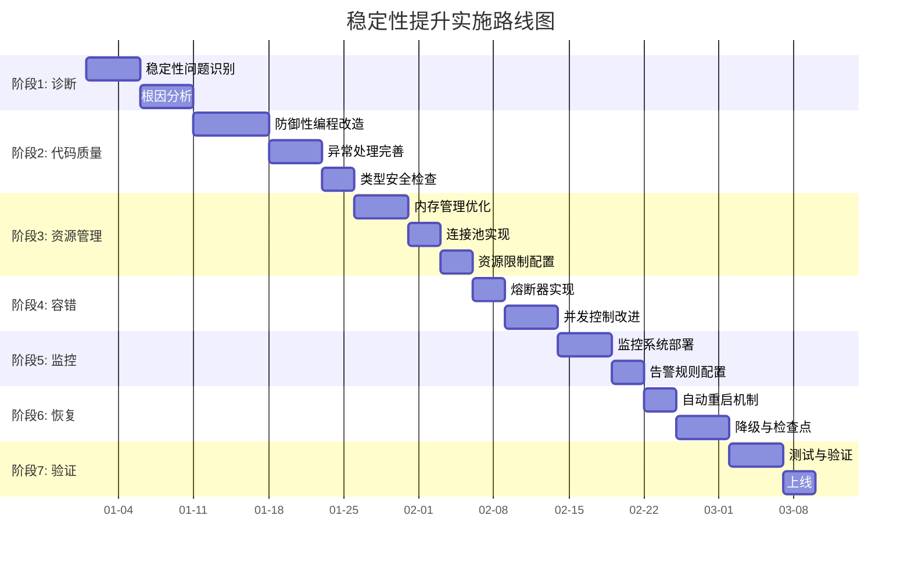

### 10.2 测试方法

```python
class StabilityTestSuite:
    """稳定性测试套件"""
    
    # 1. 压力测试
    def test_under_load(self, concurrent_users: int = 100,
                         duration: float = 300):
        """压力测试"""
        pass
    
    # 2. 长时间运行测试
    def test_long_running(self, duration_hours: float = 24):
        """长时间运行测试"""
        pass
    
    # 3. 故障注入测试
    def test_fault_injection(self):
        """故障注入测试"""
        pass
    
    # 4. 资源耗尽测试
    def test_resource_exhaustion(self):
        """资源耗尽测试"""
        pass
    
    # 5. 恢复测试
    def test_recovery(self):
        """恢复测试"""
        pass
```

### 10.3 效果评估标准

| 评估维度 | 指标 | 优化前 | 目标 | 验证方法 |
|---------|------|:------:|:----:|---------|
| **可用性** | SLA | 95% | ≥99.9% | 监控统计 |
| **崩溃率** | 次/天 | 2-3 | 0 | 日志统计 |
| **MTTR** | 分钟 | 30 | ≤5 | 故障记录 |
| **错误率** | % | 5% | ≤0.1% | 请求统计 |
| **内存泄漏** | MB/小时 | 50 | ≤1 | 内存监控 |
| **P99延迟** | 秒 | 15 | ≤5 | 性能监控 |
| **死锁** | 次/周 | 1-2 | 0 | 日志检测 |
| **恢复时间** | 秒 | 120 | ≤30 | 故障注入测试 |

### 10.4 最佳实践清单

| 领域 | 最佳实践 |
|-----|---------|
| **代码质量** | 防御性编程、全局异常处理、类型检查 |
| **资源管理** | 有界数据结构、连接池、资源限制 |
| **错误处理** | 分级处理、熔断器、降级策略 |
| **并发控制** | 超时锁、线程池、死锁检测 |
| **监控** | 全维度监控、健康检查、告警通知 |
| **恢复** | 自动重启、检查点、状态恢复 |
| **测试** | 压力测试、故障注入、长时间运行测试 |

### 10.5 核心要点回顾

1. **问题识别**:崩溃、无响应、泄漏、紊乱、退化五大类问题。
2. **根因分析**:代码缺陷、资源管理、并发、外部依赖、负载、配置六类根因。
3. **代码质量**:防御性编程、类型安全、全局异常处理。
4. **资源管理**:有界数据结构、连接池、内存守护、资源限制。
5. **错误处理**:分级处理、熔断器、降级策略。
6. **并发控制**:超时锁、线程池、死锁检测、并发安全结构。
7. **监控机制**:系统/应用/业务三维监控、健康检查、告警。
8. **故障恢复**:自动重启、降级服务、检查点恢复。
9. **效果评估**:SLA、MTTR、错误率、内存泄漏率等量化指标。
10. **实施路线**:诊断→代码→资源→容错→监控→恢复→验证七阶段。

### 10.6 与系列文档的关联

本文档作为 Agent 性能优化系列的稳定性专题,与其他文档形成完整闭环:

- **Token 优化**:[113Agent系统Token消耗优化深度分析.md](./113Agent系统Token消耗优化深度分析.md)
- **Prompt 优化**:[114Prompt长度优化策略与实施深度解析.md](./114Prompt长度优化策略与实施深度解析.md)
- **延迟优化**:[115Agent系统延迟优化完整方案深度解析.md](./115Agent系统延迟优化完整方案深度解析.md)
- **本文档**:**稳定性提升**,关注系统持续可靠运行

---

> **相关文档**
>
> - [113Agent系统Token消耗优化深度分析.md](./113Agent系统Token消耗优化深度分析.md)
> - [114Prompt长度优化策略与实施深度解析.md](./114Prompt长度优化策略与实施深度解析.md)
> - [115Agent系统延迟优化完整方案深度解析.md](./115Agent系统延迟优化完整方案深度解析.md)
