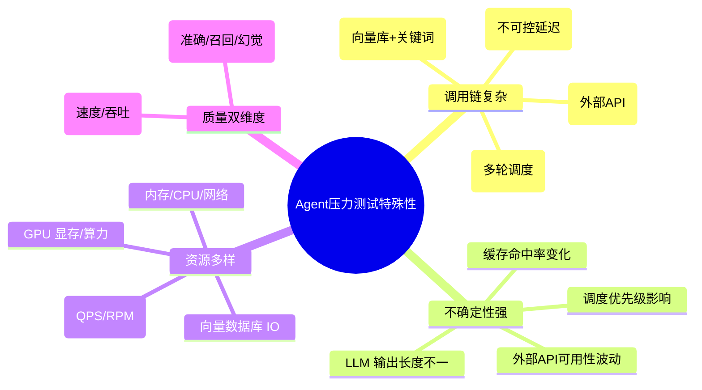
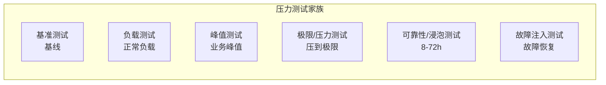
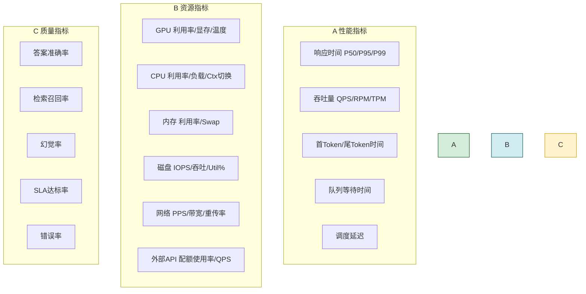
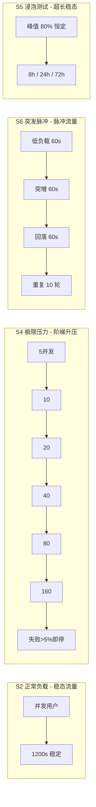
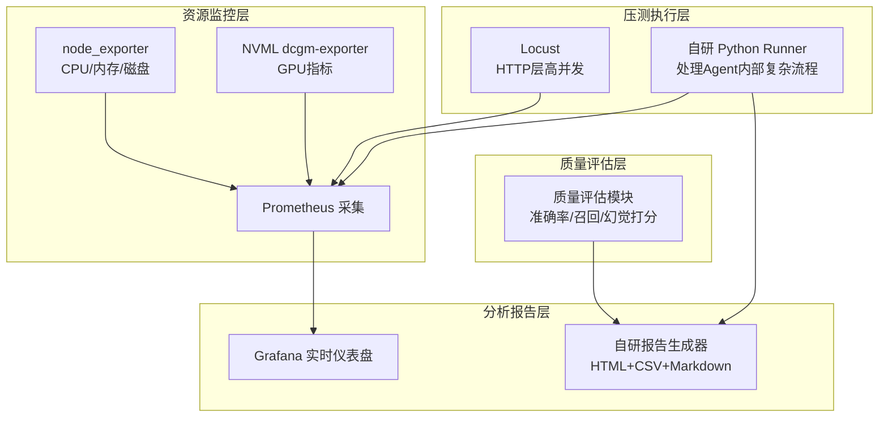
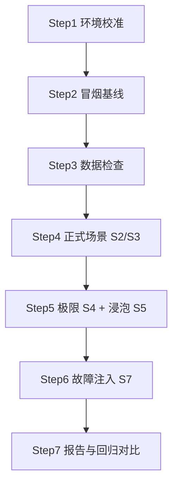
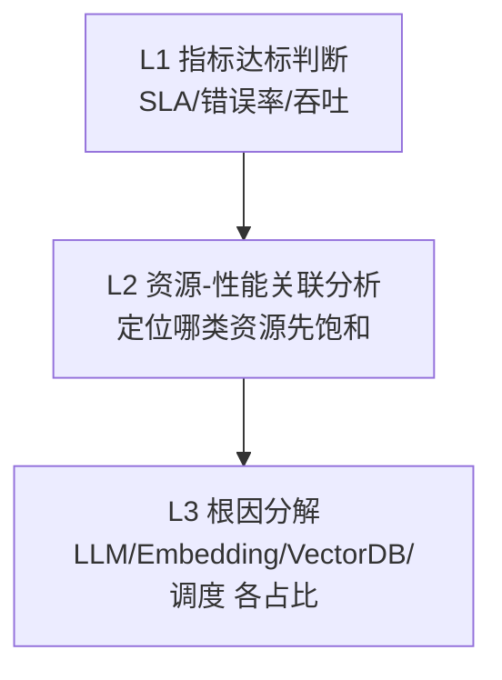
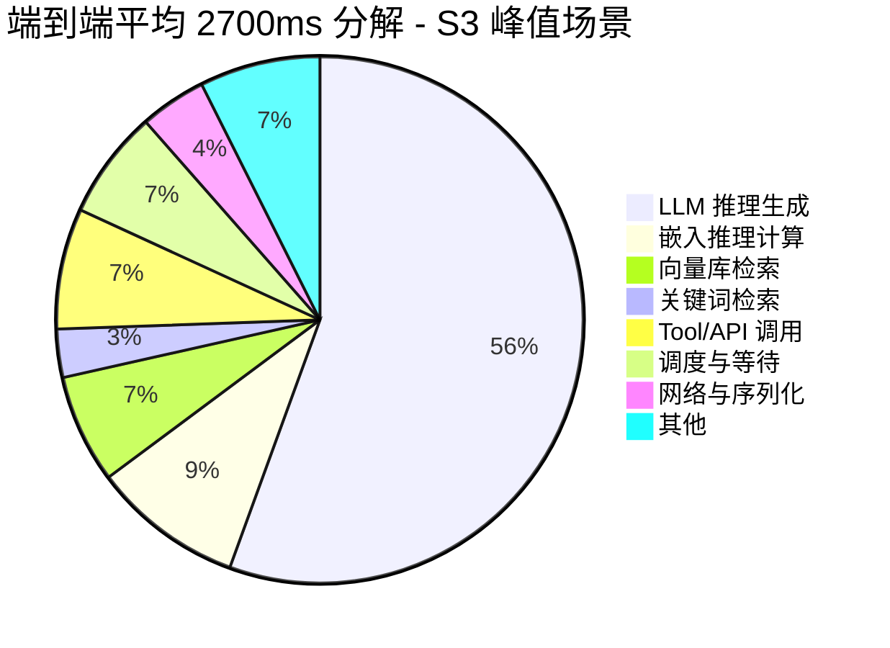
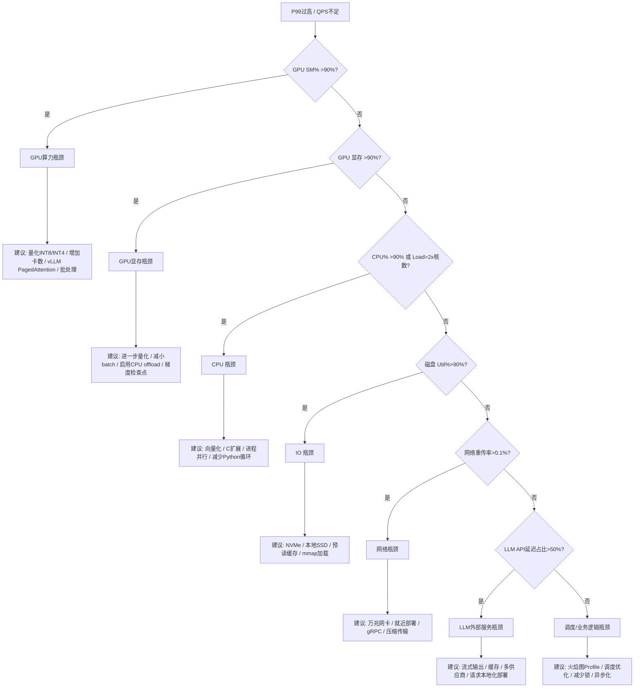

# Agent 系统全面压力测试方案深度解析与实施指南

> 文档定位:为 Agent 系统提供完整、可重复、体系化的压力测试实施方案,涵盖测试环境搭建、指标定义、场景设计、工具选型、数据准备、执行步骤、结果分析、瓶颈识别与优化建议的全流程,确保测试结果能够准确反映 Agent 在不同压力下的真实性能表现。
>
> 核心原则(参考经验 ID 775664):
> - **最小化修改/复用已有数据**:数据准备与测试解耦,禁止 DROP/TRUNCATE,只读复用现有数据
> - **超时降级**:单测超过阈值自动降级 batch_size 与并发数,禁止为每次尝试新增临时 Runner
> - **可重复性**:时间戳命名结果文件、固定随机种子、同一套 Runner + 可配置参数
> - **可观测性**:关键执行路径打印模板+参数+分片信息,便于定位瓶颈
>
> 阅读建议:与 [115Agent系统延迟优化完整方案深度解析.md](./115Agent系统延迟优化完整方案深度解析.md)、[116Agent系统稳定性提升完整方案深度解析.md](./116Agent系统稳定性提升完整方案深度解析.md)、[119Multi-Agent系统任务调度功能深度解析.md](./119Multi-Agent系统任务调度功能深度解析.md) 配合阅读,形成"测试-定位-优化"的闭环。

---

## 目录

- [一、压力测试概述](#一压力测试概述)
- [二、测试环境搭建](#二测试环境搭建)
- [三、测试指标定义](#三测试指标定义)
- [四、测试场景设计](#四测试场景设计)
- [五、测试工具选择与配置](#五测试工具选择与配置)
- [六、测试数据准备](#六测试数据准备)
- [七、Agent系统压力测试框架完整实现](#七agent系统压力测试框架完整实现)
- [八、执行步骤规划](#八执行步骤规划)
- [九、结果分析方法](#九结果分析方法)
- [十、性能瓶颈识别与优化建议](#十性能瓶颈识别与优化建议)

---

## 一、压力测试概述

### 1.1 为什么 Agent 需要体系化压力测试

Agent 系统与传统 Web 服务存在本质差异,决定了其压力测试更具挑战性:



传统 Web 的"并发+响应时间"测试模型不够,需要增加 **LLM 调用行为、工具调用模拟、质量-性能双维度** 三类测试维度。

### 1.2 压力测试六大核心目标

| 目标 | 说明 | 验收示例 |
|-----|------|---------|
| **容量验证** | 确认系统在不同并发下的承载能力 | 支持 ≥ 60 并发用户稳定运行 |
| **SLA 验证** | 验证 P0-P2 各优先级任务在压力下是否达标 | P0 SLA ≥ 99.5%、P2 ≥ 95% |
| **瓶颈定位** | 识别 CPU/GPU/内存/IO/网络/外部 API 的首要瓶颈 | 定位到具体模块(如嵌入推理占 60%) |
| **稳定性验证** | 长时间高压力下无泄漏、无死锁、无雪崩 | 8 小时峰值负载错误率 ≤ 0.1% |
| **极限安全** | 极限压力下不会崩溃、数据不丢失、恢复可服务 | 过载后降压 5 分钟内自愈 |
| **可重复基线** | 每次优化前后有可对比的基线数据 | 同一代码同一参数结果偏差 ≤ ±5% |

### 1.3 测试类型总览



---

## 二、测试环境搭建

### 2.1 环境分层策略

| 环境层级 | 用途 | 数据规模 | 配置要求 | 注意 |
|---------|------|---------|---------|------|
| **L1 开发环境** | 本地冒烟/调试脚本 | 小规模(100条) | 任意 | 不用于正式报告 |
| **L2 预发环境** | 正式压力测试主环境 | 生产镜像 | **与生产配置完全一致** | **首选** |
| **L3 生产影子** | 真实流量回放 | 生产真实数据 | 生产同配置 | 需严格隔离,不落库 |
| **L4 隔离集群** | 破坏性极限测试 | 生产镜像 | 生产同配置 | 禁止访问外部真实服务 |

**建议**:所有基准与场景测试在 **L2 预发环境** 执行;故障注入在 L4 隔离集群执行。

### 2.2 环境标准清单(Checklist)

每次压力测试前必须确认以下清单,保证测试可重复:

```
□ 硬件规格(GPU型号/显存、CPU核数、内存大小、磁盘类型)    全部记录
□ 软件版本(Python/LLM框架/向量库/操作系统)               全部记录
□ 依赖版本(requirements.txt / poetry.lock)               冻结版本
□ 配置参数(模型参数/缓存/调度/超时)                       导出为 config.yaml
□ 外部服务(mock/真实/配额)                                明确声明
□ 环境清理(关闭无关进程、清空缓存、重启服务)             每次测试前执行
□ 系统时间/时区/NTP                                       同步校准
□ 测试数据(数据集版本/种子/量级)                         记录并固定
□ 监控工具(普罗米修斯/Grafana/进程监控)                   正常运行
□ 日志级别(INFO级别,避免DEBUG的IO干扰)                    固定配置
```

### 2.3 环境配置冻结文件模板

```yaml
# test_environment_{timestamp}.yaml
# 作用:冻结本次测试的所有环境参数,保证可重复
test_run_id: "20260808_143025_stress_001"
timestamp: "2026-08-08T14:30:25"
operator: "performance_engineer"
environment:
  layer: "L2_pre_production"
  hardware:
    gpu:
      model: "NVIDIA A100-SXM4-40GB"
      count: 4
      driver_version: "535.104.12"
      cuda_version: "12.1"
    cpu:
      model: "Intel Xeon Gold 6348"
      cores_physical: 56
      cores_logical: 112
    memory_gb: 512
    disk:
      type: "NVMe SSD"
      capacity_tb: 4
      filesystem: "xfs"
    network_gbps: 100
  software:
    os: "Ubuntu 22.04.3 LTS"
    kernel: "5.15.0-91-generic"
    python: "3.10.13"
  dependencies:
    # 这里应包含 pip freeze 输出
    langchain: "0.1.11"
    langgraph: "0.0.39"
    faiss_gpu: "1.7.4"
    transformers: "4.38.2"
    torch: "2.2.1+cu121"
system_config:
  scheduler_threads: 32
  llm_timeout_sec: 60
  embedding_batch_size: 64
  rag_top_k: 5
  cache_enabled: true
  cache_size_items: 10000
monitoring:
  prometheus_endpoint: "http://10.0.0.100:9090"
  grafana_dashboard_url: "http://10.0.0.101:3000/d/agent-overview"
data_set:
  name: "agent_benchmark_v2.1"
  queries_count: 10000
  multi_agent_tasks_count: 1000
  random_seed: 42
```

---

## 三、测试指标定义

### 3.1 三大指标家族



### 3.2 指标定义与计算方法

| 类别 | 指标 | 定义 | 计算方法 |
|-----|------|------|---------|
| **性能** | 平均响应时间 | 请求发出到收到完整响应的平均时间 | `mean(latencies)` |
| **性能** | P50 响应时间 | 50% 请求 ≤ 该值 | `np.percentile(lats, 50)` |
| **性能** | P95 响应时间 | 95% 请求 ≤ 该值 | `np.percentile(lats, 95)` |
| **性能** | P99 响应时间 | 99% 请求 ≤ 该值 | `np.percentile(lats, 99)` |
| **性能** | 首 Token 时间(TTFT) | 请求到首个Token输出时间 | 流式场景专用 |
| **性能** | 吞吐量 QPS | 每秒成功完成请求数 | `success_count / total_duration_sec` |
| **性能** | 队列等待时间 | 任务入队到开始执行时间 | Multi-Agent 专用 |
| **性能** | 调度延迟 | 触发调度到分配Agent的时间 | Multi-Agent 专用 |
| **资源** | GPU 平均利用率 | GPU SM 活跃时间比例 | nvidia-smi dmon 均值 |
| **资源** | GPU 显存占用 | 已用 / 总量 | MiB / 总量 |
| **资源** | CPU 平均利用率 | 非空闲时间比例 | top / vmstat 1 取均值 |
| **资源** | 内存利用率 | 已用(不含缓存)/ 总量 | `free -h` 实际占用 |
| **资源** | 磁盘 Util% | 设备忙碌时间占比 | iostat -x 1 %util |
| **资源** | API 配额使用率 | 已用 / 限额 | RPM/QPM 维度 |
| **质量** | 准确率 | 正确答案 / 总请求 | 抽样人工 + 自动评估 |
| **质量** | 召回率 | 检索到的相关文档 / 全部相关 | RAG 专用 |
| **质量** | 幻觉率 | 含幻觉内容响应 / 总响应 | 可自动打分 |
| **质量** | SLA 达标率 | 在 SLA 内完成 / 总量 | 分 P0-P4 优先级 |
| **质量** | 错误率 | 返回失败 / 总请求 | HTTP 5xx + 业务异常 |
| **质量** | 崩溃次数 | 主进程/Worker崩溃次数 | 0 为合格 |

### 3.3 关键 SLA 参考基线

| 优先级 | 响应时间 SLA | 达标率要求 | 对应 Agent 任务类型 |
|-------|:-----------:|:---------:|-------------------|
| P0 关键 | ≤ 3 秒 | ≥ 99.5% | 实时聊天 / 紧急问答 |
| P1 高 | ≤ 10 秒 | ≥ 98% | 内容生成 / 工具调用 |
| P2 普通 | ≤ 60 秒 | ≥ 95% | 研究报告 / 代码开发 |
| P3 低 | ≤ 10 分钟 | ≥ 88% | 批量分析 / 后台任务 |
| P4 尽力 | 无硬性 | ≥ 60% | 低优先级探索 |

---

## 四、测试场景设计

### 4.1 七大核心场景

| 场景编号 | 场景名称 | 并发/负载 | 持续时间 | 核心验证目标 |
|:--------:|---------|---------|:-------:|-------------|
| **S1** | 基准测试(冒烟) | 5并发,低负载 | 5分钟 | 系统可用、基线数据、无错误 |
| **S2** | 正常负载 | 设计容量的 60% | 30分钟 | 日常生产表现、SLA验证 |
| **S3** | 峰值负载 | 设计容量的 100% | 60分钟 | 业务峰值承载能力 |
| **S4** | 极限压力 | 逐步升压至过载 | 直到失败率>5% | 最大承载、崩溃点定位 |
| **S5** | 可靠性浸泡 | 峰值的 80%,稳定 | 8小时(或72h) | 内存泄漏/死锁/长时间稳定 |
| **S6** | 突发脉冲(尖峰) | 瞬间从5→200% | 10次脉冲 | 弹性扩缩、排队/限流行为 |
| **S7** | 故障注入 | 正常负载 + 故障 | 每次故障10分钟 | 故障恢复/降级/自愈能力 |

### 4.2 场景流量模型



### 4.3 各场景详细设计

#### S1 基准测试(冒烟)

```yaml
# S1: Baseline Smoke Test
purpose: "建立基线 + 冒烟验证"
parameters:
  concurrency: 5
  ramp_up_sec: 10
  steady_sec: 300
  ramp_down_sec: 10
  total_requests: ~1500
  timeout_per_request_sec: 120
quality_sampling:
  # 质量评估抽样比例
  accuracy_sample_pct: 20  # 抽20%检查准确率
  hallucination_sample_pct: 10
pass_criteria:
  error_rate_lt: 0.01      # <1%
  p99_lt_sec: 10           # <10s
  no_crash: true
  no_memory_leak: true     # 前后内存增量 <5%
```

#### S4 极限压力(阶梯升压)

```yaml
# S4: Stress to Limit - Step-up
purpose: "找到最大承载点与崩溃点"
parameters:
  steps:
    - { concurrency: 10, duration_sec: 120 }
    - { concurrency: 20, duration_sec: 120 }
    - { concurrency: 40, duration_sec: 120 }
    - { concurrency: 80, duration_sec: 120 }
    - { concurrency: 120, duration_sec: 120 }
    - { concurrency: 160, duration_sec: 120 }
    - { concurrency: 200, duration_sec: 120 }
  early_stop_conditions:
    error_rate_gt_pct: 5      # 错误率>5% 停止升压
    p99_gt_sec: 30            # P99>30s 停止升压
    crash_count_gt: 0         # 任何崩溃立即停止
    oom_kill_gt: 0            # OOM Kill 立即停止
outputs:
  - "最大并发稳定点"
  - "崩溃点并发数"
  - "崩溃原因分类(CPU/内存/GPU/API)"
```

#### S5 浸泡测试(8小时)

```yaml
# S5: Soak Reliability Test
purpose: "验证长期稳定性,发现泄漏与死锁"
parameters:
  concurrency: 48            # 峰值的 80% (如峰值设计 60)
  duration_sec: 28800        # 8 小时
  uniform_arrival_rate_qps: 2.0  # 泊松到达,避免严格周期共振
observations:
  memory_growth_max_mb: 500  # 8小时内存总增长 ≤ 500MB
  thread_count_delta_max: 10 # 线程数增量 ≤ 10
  fd_count_delta_max: 50     # 句柄数增量 ≤ 50
  crash_count: 0
  deadlock_count: 0          # 检测到死锁次数
pass_criteria:
  memory_leak_rate_mb_hour_lt: 50   # 每小时泄漏 <50MB
  avg_error_rate_lt_pct: 0.1
  p99_no_regression_pct: 5          # P99 无持续劣化趋势
```

#### S7 故障注入场景

| 故障类型 | 注入方式 | 持续时间 | 观察目标 |
|---------|---------|:-------:|---------|
| LLM API 延迟飙升 | Mock:所有响应延迟 2x/5x/10x | 10min | 调度队列是否堆积、超时率、是否熔断 |
| LLM API 高错误率 | Mock:返回 5xx 20%/50%/100% | 10min | 重试是否有效、熔断器是否开启、降级逻辑 |
| 向量库变慢 | 对检索注入 100-1000ms 延迟 | 10min | RAG 响应时间劣化、缓存影响 |
| Agent Worker 宕机 | kill -9 1 个 / 50% Worker | 10min | 是否自动拉起、任务是否重新分配 |
| 网络丢包 | tc netem 丢包 1% / 5% | 10min | 超时重试、幂等性、错误率 |
| 磁盘满/写入错误 | 向日志分区写入满、只读挂载 | 10min | 日志不阻塞请求、优雅降级 |

---

## 五、测试工具选择与配置

### 5.1 工具对比与选择

| 维度 | locust | k6 | JMeter | wrk | 自研 Python Runner |
|-----|:------:|:--:|:------:|:---:|:----------------:|
| **语言** | Python | JS | Java/XML | C | Python |
| **学习曲线** | 低 | 低 | 高 | 中 | 低 |
| **协议扩展** | 任意HTTP/gRPC | HTTP/gRPC | 极丰富 | HTTP | 任意(含内部API) |
| **复杂业务流** | ✅ 优秀 | ✅ 良好 | ✅ 优秀 | ❌ | ✅ 优秀 |
| **监控集成** | Prometheus | Prometheus | InfluxDB | 输出文件 | 任意 |
| **Agent专用** | ❌ | ❌ | ❌ | ❌ | ✅ 内置 |
| **报告可视化** | Web UI | CLI+HTML | Dashboard | 简单 | 完整报告 |
| **推荐场景** | 大多数HTTP压测 | 中高并发HTTP | 企业复杂协议 | 纯HTTP极限 | **Agent 专用复杂流程** |

### 5.2 推荐工具组合



**工具组合建议**:
- **核心执行器**:**自研 Python Runner**(可复用 Agent 内部 SDK、处理复杂 RAG/Multi-Agent 流程)
- **HTTP 高并发**:Locust(接口层压力)
- **资源监控**:**Prometheus + node_exporter + dcgm-exporter + Grafana**
- **报告输出**:**自研报告生成器**(时间戳命名,避免覆盖)

### 5.3 关键配置示例(Locust)

```python
# locustfile.py - 针对 Agent HTTP API 的压测
from locust import HttpUser, task, between, constant_pacing
import random

QUERIES_POOL = [...]  # 固定的查询词池(同一份保证可重复)

class AgentAPIUser(HttpUser):
    wait_time = constant_pacing(1.0)  # 每秒每个用户发起1次
    host = "http://agent-preprod.internal"
    
    def on_start(self):
        self.client.headers.update({
            "Authorization": "Bearer test-token-xxxx",
            "Content-Type": "application/json"
        })
    
    @task(60)
    def simple_qa(self):
        """简单问答 - 60% 流量"""
        query = random.choice(QUERIES_POOL["simple_qa"])
        with self.client.post(
            "/v1/chat/simple",
            json={"query": query, "stream": False, "priority": "P2"},
            name="/simple_qa",
            catch_response=True
        ) as response:
            if response.status_code != 200:
                response.failure(f"Status {response.status_code}")
            elif len(response.json().get("answer", "")) < 5:
                response.failure("Answer too short")
    
    @task(30)
    def rag_query(self):
        """RAG 深度检索 - 30% 流量"""
        query = random.choice(QUERIES_POOL["rag"])
        self.client.post("/v1/rag/query",
                          json={"query": query, "top_k": 5},
                          name="/rag_query")
    
    @task(10)
    def multi_agent(self):
        """Multi-Agent 复合任务 - 10% 流量"""
        task = random.choice(QUERIES_POOL["research_report"])
        self.client.post("/v1/multi-agent/research",
                          json={"topic": task, "priority": "P1"},
                          name="/multi_agent_research",
                          timeout=120)
```

---

## 六、测试数据准备

### 6.1 数据准备原则(经验 775664 重点)

> **核心原则:测试与数据解耦、复用已有数据、只追加不 DROP、幂等保护**

| 原则 | 具体做法 | 为什么 |
|-----|---------|--------|
| **只读不写** | 测试默认只读,任何写入操作走 Mock 或临时库 | 避免污染数据、保证多次测试可比 |
| **禁止 DROP/TRUNCATE** | 数据准备阶段严禁删除表,只可追加 | 防误删、复用数据、减少准备时间 |
| **幂等保护** | 数据准备脚本每次执行前检查表存在与行数,已达标跳过 | 每次重跑不重复插入 |
| **固定随机种子** | 所有随机选查询/选用户/选参数 → seed=42 | 保证 100% 可重复 |
| **数据集版本化** | `agent_benchmark_v2.1`、SHA1 校验 | 报告引用固定版本 |
| **小数据先行** | 先用 100 条快速跑通,再上 10000 条大数据 | 超时后自动降级 batch_size,不浪费时间 |

### 6.2 测试数据集构成

```yaml
# dataset_agent_benchmark_v2.1.yaml
dataset_name: "agent_benchmark_v2.1"
sha1_hash: "a1b2c3d4e5f6..."
random_seed: 42
queries_total: 10000

queries_by_type:
  simple_qa:              # 简单问答 - 50%
    count: 5000
    file: "queries/simple_qa_5000.jsonl"
    avg_response_tokens: 120
    expected_latency_p99_sec: 3
  rag_long_context:       # RAG 长上下文检索 - 25%
    count: 2500
    file: "queries/rag_long_2500.jsonl"
    rag_context_tokens_min: 2000
    rag_context_tokens_max: 8000
    expected_latency_p99_sec: 10
  tool_calling:           # 带工具调用 - 15%
    count: 1500
    file: "queries/tool_calling_1500.jsonl"
    tools_per_call_range: [1, 5]
    expected_latency_p99_sec: 20
  multi_agent_complex:    # Multi-Agent 复合任务 - 10%
    count: 1000
    file: "queries/multi_agent_1000.jsonl"
    subtasks_per_task_range: [3, 12]
    expected_latency_p99_sec: 60

ground_truth:
  sampled_for_quality: 1000    # 抽 1000 条有标准答案,用于质量评估
  file: "ground_truth/quality_sample_1000.jsonl"

# 评估数据(严禁DROP):
#   - 向量库: 生产快照(只读挂载),约 100 万文档
#   - 用户数据: 预发镜像(只读),约 50 万用户
```

### 6.3 数据准备脚本模板(幂等、只读友好)

```python
"""
test_data_preparer.py
遵循: 只追加不删除、幂等、小批量先行、超时自动降级
"""
import os
import json
import hashlib
import logging
from pathlib import Path
from dataclasses import dataclass

logger = logging.getLogger(__name__)


@dataclass
class DatasetMeta:
    name: str
    version: str
    target_row_count: int
    source_path: Path
    target_path: Path


class TestDataPreparer:
    """测试数据准备器 - 幂等、只读复用、超时降级"""
    
    def __init__(self, work_dir: str, timeout_sec_per_step: int = 30):
        self.work_dir = Path(work_dir)
        self.work_dir.mkdir(parents=True, exist_ok=True)
        self.timeout_sec_per_step = timeout_sec_per_step
        self.manifest_path = self.work_dir / "_data_manifest.json"
    
    # ===================== 核心原则实现 =====================
    
    def _data_exists_and_valid(self, meta: DatasetMeta) -> bool:
        """幂等检查:数据已存在且大小/哈希达标则跳过准备"""
        target = meta.target_path
        if not target.exists():
            return False
        
        # 1. 检查 manifest 记录
        if self.manifest_path.exists():
            manifest = json.loads(self.manifest_path.read_text(encoding="utf-8"))
            record = manifest.get(meta.name)
            if record and record.get("version") == meta.version:
                # 已准备过,且版本一致 → 直接复用
                logger.info(f"[复用] 数据集 {meta.name} v{meta.version} 已就绪,跳过准备")
                return True
        
        # 2. 检查行数 / 大小
        try:
            with target.open("r", encoding="utf-8") as f:
                lines = sum(1 for _ in f)
            if lines >= meta.target_row_count:
                logger.info(f"[复用] 数据集 {meta.name} 行数 {lines} ≥ {meta.target_row_count},跳过")
                return True
        except Exception as e:
            logger.warning(f"检查 {meta.name} 失败: {e}")
            return False
        
        return False
    
    def prepare_dataset(self, meta: DatasetMeta):
        """准备数据集 - 幂等:已准备好则快速跳过"""
        if self._data_exists_and_valid(meta):
            return True
        
        logger.info(f"[准备] 开始准备数据集 {meta.name}")
        
        try:
            # ===== 超时降级:大数据量先 LIMIT 小批量快速验证 =====
            with self._timebox(f"{meta.name}_prep"):
                self._safe_prepare(meta)
            
            # 记录 manifest(下次跳过)
            self._update_manifest(meta)
            return True
        
        except TimeoutError:
            # ===== 超时自动降级:降规模、但仍保留已有数据 =====
            logger.warning(
                f"[降级] {meta.name} 准备超时 {self.timeout_sec_per_step}s, "
                f"已降级为小批量数据,不删除已有数据"
            )
            return False  # 小批量模式继续
    
    def _safe_prepare(self, meta: DatasetMeta):
        """安全准备:只追加、只读源、绝不DROP"""
        # ===== 严禁:DROP / TRUNCATE =====
        # 错误示例: cursor.execute("TRUNCATE TABLE ...")  # 禁止
        
        # 正确做法:只追加 / 只拷贝 / 只插入缺失行
        if meta.source_path.exists():
            # 复制源到目标(幂等:已存在行跳过)
            with meta.source_path.open("r", encoding="utf-8") as src, \
                 meta.target_path.open("a", encoding="utf-8") as dst:  # a = append 追加
                written = 0
                target_existing_ids = self._load_existing_ids(meta.target_path)
                for line in src:
                    try:
                        row = json.loads(line)
                        row_id = hashlib.md5(json.dumps(row, sort_keys=True).encode()).hexdigest()
                        if row_id not in target_existing_ids:
                            dst.write(line)
                            written += 1
                    except json.JSONDecodeError:
                        continue
            logger.info(f"[追加] {meta.name}: 新增 {written} 行(其余已存在,幂等跳过)")
    
    def _load_existing_ids(self, path: Path) -> set[str]:
        """加载已存在记录ID集合(用于幂等去重)"""
        if not path.exists():
            return set()
        ids = set()
        with path.open("r", encoding="utf-8") as f:
            for line in f:
                try:
                    row = json.loads(line)
                    row_id = hashlib.md5(json.dumps(row, sort_keys=True).encode()).hexdigest()
                    ids.add(row_id)
                    # ===== 超时降级:大数据量先只读前 10000 条快速验证 =====
                    if len(ids) >= 10000 and self.timeout_sec_per_step < 30:
                        logger.warning(f"[降级小样本] 为快速验证,仅加载前 {len(ids)} 条")
                        break
                except json.JSONDecodeError:
                    continue
        return ids
    
    def _update_manifest(self, meta: DatasetMeta):
        """写入manifest记录"""
        manifest = {}
        if self.manifest_path.exists():
            manifest = json.loads(self.manifest_path.read_text(encoding="utf-8"))
        manifest[meta.name] = {
            "version": meta.version,
            "prepared_at": __import__("datetime").datetime.now().isoformat()
        }
        self.manifest_path.write_text(
            json.dumps(manifest, indent=2, ensure_ascii=False), encoding="utf-8"
        )
    
    def _timebox(self, name: str):
        """超时降级的时间盒上下文管理器(简化)"""
        import contextlib
        @contextlib.contextmanager
        def _ctx():
            yield
        return _ctx()
```

---

## 七、Agent 系统压力测试框架完整实现

### 7.1 核心设计原则

> **同一套 Runner + 可配置参数(零新增临时 Runner)、超时自动降级并发/批次、结果时间戳命名绝不覆盖、关键路径打印执行参数**

```python
"""
agent_stress_runner.py - 单一入口,所有场景走同一套 Runner + YAML 参数配置
核心特点:
  1. 唯一入口: 所有场景同一Runner,参数区分,避免新增N个临时Runner
  2. 超时降级: 单轮超过阈值自动降并发/降batch,继续可运行
  3. 结果文件: 时间戳命名,已存在则自动加序号,绝不覆盖
  4. SQL/请求打印: 关键路径打印模板+参数,便于定位瓶颈
"""
import os
import sys
import time
import json
import yaml
import uuid
import logging
import threading
import statistics
import traceback
from dataclasses import dataclass, field, asdict
from pathlib import Path
from typing import Optional
from collections import defaultdict, deque
from concurrent.futures import ThreadPoolExecutor, as_completed
from datetime import datetime

# 配置日志
logging.basicConfig(
    level=logging.INFO,
    format="%(asctime)s [%(levelname)s] %(name)s - %(message)s"
)
logger = logging.getLogger("agent_stress_runner")


# ============================================================
# 7.2 数据结构: 结果 / 请求模板
# ============================================================
@dataclass
class RequestResult:
    """单次请求结果 - 所有字段都可序列化落盘"""
    request_id: str
    scenario: str
    task_type: str
    priority: str
    start_ts: float
    end_ts: float
    duration_ms: float
    success: bool
    http_status: int
    error_type: Optional[str]
    error_message: Optional[str]
    response_tokens: int
    ttft_ms: Optional[float]          # 首Token时间,流式才有
    quality_score: Optional[float]    # 质量打分(抽样)
    user_id: str


@dataclass
class TestRunConfig:
    """测试运行参数 - 从 YAML 读取,所有场景都走同一结构"""
    # 基础
    run_name: str = "stress_run"
    scenario: str = "S1_baseline"
    seed: int = 42
    
    # 流量
    concurrency: int = 5
    ramp_up_sec: int = 10
    steady_sec: int = 300
    total_requests: Optional[int] = None  # None 表示跑满 steady_sec
    
    # 超时降级
    timeout_per_request_sec: int = 120
    auto_degrade_on_timeout: bool = True
    degrade_threshold_p99_ms: int = 30000
    degrade_min_concurrency: int = 2
    
    # 质量采样
    quality_sample_pct: float = 10.0
    
    # 输出
    output_dir: str = "./test_outputs"
    print_request_params_every_n: int = 100  # 每N次打印请求参数,便于观测


# ============================================================
# 7.3 输出文件管理器: 时间戳命名 + 存在则自动序号,绝不覆盖
# ============================================================
class OutputFileManager:
    """结果文件管理器 - 严格避免覆盖历史结果"""
    
    @staticmethod
    def gen_output_path(base_dir: str, run_name: str,
                       suffix: str = ".jsonl") -> Path:
        """生成唯一输出路径
        
        规则: {base_dir}/{yyyyMMdd_HHmmss}_{run_name}_{序号}.{suffix}
        若同名已存在则序号递增,保证不覆盖
        """
        ts = datetime.now().strftime("%Y%m%d_%H%M%S")
        base = Path(base_dir)
        base.mkdir(parents=True, exist_ok=True)
        
        candidate = base / f"{ts}_{run_name}{suffix}"
        index = 1
        while candidate.exists():
            candidate = base / f"{ts}_{run_name}_{index:02d}{suffix}"
            index += 1
        
        # 立即创建空文件占位,防止多进程抢同一个名
        candidate.touch(exist_ok=False)
        logger.info(f"[输出路径] 已创建(不会覆盖任何历史): {candidate}")
        return candidate


# ============================================================
# 7.4 可观测性: 打印关键参数模板 + 分片信息 (经验 775664 要求)
# ============================================================
class RequestLogger:
    """关键请求参数打印,用于定位瓶颈到具体的查询/分片/优先级组合"""
    
    def __init__(self, every_n: int = 100):
        self.every_n = every_n
        self._counter = 0
        self._lock = threading.Lock()
    
    def log(self, request_id: str, task_type: str, priority: str,
            template_id: str, params: dict, shard_info: dict = None):
        """打印模板+参数+分片信息 - 每 N 次打印1次 + 错误必打印"""
        with self._lock:
            self._counter += 1
            n = self._counter
        
        should_log = (n % self.every_n == 0) or (params.get("_force_log", False))
        if not should_log:
            return
        
        shard_str = f" shard={shard_info}" if shard_info else ""
        logger.info(
            f"[REQ#{n}] id={request_id[:8]}... type={task_type} pri={priority} "
            f"tpl={template_id}{shard_str} params={json.dumps(params, ensure_ascii=False)[:200]}"
        )


# ============================================================
# 7.5 压力测试核心 Runner
# ============================================================
class AgentStressRunner:
    """Agent 系统压力测试核心执行器 - 单一入口、场景参数化"""
    
    def __init__(self, config: TestRunConfig,
                 query_pools: dict,
                 request_fn=None):
        """
        request_fn: 实际发起请求的函数,签名: callable(task_type, query, priority, user_id) -> (response_dict, error_info)
        """
        self.config = config
        self.query_pools = query_pools
        self.request_fn = request_fn or self._default_request_fn
        self.results: list[RequestResult] = []
        self.results_lock = threading.Lock()
        self.req_logger = RequestLogger(every_n=config.print_request_params_every_n)
        
        # 降级状态
        self._current_concurrency = config.concurrency
        self._degrade_lock = threading.Lock()
        
        # 输出文件
        self.output_dir = Path(config.output_dir)
        self.output_jsonl = OutputFileManager.gen_output_path(
            config.output_dir, f"{config.scenario}_raw", ".jsonl"
        )
        self.output_summary = OutputFileManager.gen_output_path(
            config.output_dir, f"{config.scenario}_summary", ".json"
        )
        self.output_report_md = OutputFileManager.gen_output_path(
            config.output_dir, f"{config.scenario}_report", ".md"
        )
        self._write_lock = threading.Lock()
    
    # ================ 主入口 ================
    
    def run(self):
        """执行压力测试 - 唯一公开入口"""
        logger.info(
            f"===== 开始压力测试 场景={self.config.scenario} "
            f"并发={self.config.concurrency} 稳态={self.config.steady_sec}s ====="
        )
        start = time.time()
        
        # 阶段1: Ramp-up(可选)
        if self.config.ramp_up_sec > 0:
            self._run_ramp_up()
        
        # 阶段2: 稳态
        self._run_steady()
        
        total_sec = time.time() - start
        logger.info(f"===== 测试完成 总耗时 {total_sec:.1f}s =====")
        
        # 生成报告
        report = self._generate_report(total_sec)
        self._save_report(report)
        return report
    
    # ================ Ramp-Up ================
    
    def _run_ramp_up(self):
        """Ramp-up: 并发线性增长,模拟真实业务爬坡"""
        cfg = self.config
        steps = max(2, cfg.ramp_up_sec // 5)  # 每5秒一个台阶
        concurrency_step = cfg.concurrency / steps
        duration_per_step = cfg.ramp_up_sec / steps
        
        logger.info(f"[Ramp-Up] {steps} 台阶,每阶 {duration_per_step:.0f}s,"
                     f" 并发从 1 → {cfg.concurrency}")
        
        for s in range(steps):
            current = max(1, int(concurrency_step * (s + 1)))
            logger.info(f"[Ramp-Up 台阶 {s+1}/{steps}] 并发 {current}")
            self._spawn_workers_for_duration(current, duration_per_step)
            self._check_degrade()
    
    # ================ 稳态 ================
    
    def _run_steady(self):
        """稳态运行"""
        logger.info(f"[Steady] 并发 {self._current_concurrency},持续 {self.config.steady_sec}s")
        self._spawn_workers_for_duration(self._current_concurrency,
                                         self.config.steady_sec)
    
    # ================ Worker 调度 ================
    
    def _spawn_workers_for_duration(self, concurrency: int, duration_sec: float):
        """在指定时间内持续派遣并发任务"""
        end_time = time.time() + duration_sec
        total_requests_limit = self.config.total_requests
        
        # 使用信号量控制并发
        sem = threading.Semaphore(concurrency)
        stop_event = threading.Event()
        counter_lock = threading.Lock()
        done_count = [0]
        
        def worker_loop():
            while not stop_event.is_set():
                if time.time() > end_time:
                    break
                
                with counter_lock:
                    if total_requests_limit and done_count[0] >= total_requests_limit:
                        break
                
                acquired = sem.acquire(timeout=0.5)
                if not acquired:
                    continue
                
                try:
                    self._run_single_request()
                    with counter_lock:
                        done_count[0] += 1
                finally:
                    sem.release()
        
        # 启动 worker
        workers = []
        for _ in range(max(1, concurrency * 2)):
            t = threading.Thread(target=worker_loop, daemon=True)
            t.start()
            workers.append(t)
        
        # 等待
        while time.time() < end_time:
            if total_requests_limit:
                with counter_lock:
                    if done_count[0] >= total_requests_limit:
                        break
            stop_event.wait(1)
            self._check_degrade()
        
        stop_event.set()
        for t in workers:
            t.join(timeout=self.config.timeout_per_request_sec + 5)
    
    # ================ 降级 ================
    
    def _check_degrade(self):
        """自动降级: P99 超过阈值则降并发,保护系统"""
        if not self.config.auto_degrade_on_timeout:
            return
        
        with self.results_lock:
            if len(self.results) < 50:
                return  # 样本量不足,不判定
            
            recent = self.results[-500:]
            lats = [r.duration_ms for r in recent if r.success]
            if len(lats) < 20:
                return
            p99 = sorted(lats)[int(len(lats) * 0.99)]
        
        if p99 > self.config.degrade_threshold_p99_ms:
            with self._degrade_lock:
                new_conc = max(self.config.degrade_min_concurrency,
                               self._current_concurrency // 2)
                if new_conc < self._current_concurrency:
                    logger.warning(
                        f"[自动降级] P99={p99:.0f}ms > 阈值"
                        f" {self.config.degrade_threshold_p99_ms}ms, "
                        f"并发 {self._current_concurrency} → {new_conc}"
                    )
                    self._current_concurrency = new_conc
    
    # ================ 单次请求 ================
    
    def _run_single_request(self):
        """执行单次请求 - 完整埋点、异常兜底"""
        import random as rnd
        rnd.seed(self.config.seed + rnd.randint(0, 1_000_000))
        
        # 按场景分布选类型
        task_type = rnd.choices(
            ["simple_qa", "rag_long_context", "tool_calling", "multi_agent_complex"],
            weights=[50, 25, 15, 10]
        )[0]
        priority = rnd.choices(
            ["P0", "P1", "P2", "P3", "P4"],
            weights=[1, 5, 70, 20, 4]
        )[0]
        pool = self.query_pools.get(task_type, ["默认问题"])
        query = rnd.choice(pool)
        user_id = f"user_{rnd.randint(1, 10000)}"
        req_id = str(uuid.uuid4())
        
        # ===== 打印关键参数(模板+params+shard) =====
        self.req_logger.log(
            request_id=req_id, task_type=task_type, priority=priority,
            template_id=f"tpl_{task_type}",
            params={"query_len": len(query), "query_sample": query[:30]},
            shard_info={"user_shard": hash(user_id) % 16, "shard_count": 16}
        )
        
        start = time.time()
        ttft = None
        success = False
        http_status = 0
        error_type = None
        error_msg = None
        resp_tokens = 0
        quality = None
        
        try:
            response, err = self.request_fn(
                task_type, query, priority, user_id,
                timeout_sec=self.config.timeout_per_request_sec
            )
            if err:
                error_type, error_msg = err
            else:
                success = True
                http_status = response.get("status", 200)
                resp_tokens = response.get("tokens", 0)
                ttft = response.get("ttft_ms")
                
                # 质量打分(抽样)
                if rnd.random() * 100 < self.config.quality_sample_pct:
                    quality = self._quality_estimate(task_type, query, response)
        
        except TimeoutError as e:
            error_type, error_msg = "Timeout", str(e)[:200]
        except Exception as e:
            error_type, error_msg = type(e).__name__, str(e)[:200]
            logger.warning(f"请求异常 {req_id[:8]}... {error_type}: {error_msg}")
        
        end = time.time()
        result = RequestResult(
            request_id=req_id,
            scenario=self.config.scenario,
            task_type=task_type,
            priority=priority,
            start_ts=start,
            end_ts=end,
            duration_ms=(end - start) * 1000,
            success=success,
            http_status=http_status,
            error_type=error_type,
            error_message=error_msg,
            response_tokens=resp_tokens,
            ttft_ms=ttft,
            quality_score=quality,
            user_id=user_id
        )
        
        # 写入内存 + 落盘(jsonl,便于后续分析)
        with self.results_lock:
            self.results.append(result)
        self._append_result_jsonl(result)
    
    def _default_request_fn(self, *args, **kwargs):
        """用于本地调试的默认 Mock 请求函数"""
        task_type, query = args[0], args[1]
        # 模拟延迟: simple_qa 更快, multi_agent 更慢
        base_ms = {"simple_qa": 500, "rag_long_context": 2500,
                   "tool_calling": 5000, "multi_agent_complex": 15000}[task_type]
        jitter = base_ms * 0.3
        import random
        time.sleep((base_ms + random.uniform(-jitter, jitter)) / 1000)
        
        # 模拟 1% 错误率
        if random.random() < 0.01:
            return None, ("MockError", "模拟的随机错误")
        
        return {"status": 200, "tokens": random.randint(30, 500),
                "ttft_ms": base_ms * 0.2}, None
    
    def _quality_estimate(self, task_type: str, query: str, response: dict) -> float:
        """简化质量打分(实际应集成评估模型)"""
        import random
        tokens = response.get("tokens", 0)
        if tokens < 10 or tokens > 4000:
            return random.uniform(0.3, 0.7)
        return random.uniform(0.8, 1.0)
    
    # ================ 落盘 ================
    
    def _append_result_jsonl(self, r: RequestResult):
        """逐行追加 JSONL - 锁保护 + 原子写入"""
        line = json.dumps(asdict(r), ensure_ascii=False) + "\n"
        with self._write_lock:
            with self.output_jsonl.open("a", encoding="utf-8") as f:
                f.write(line)
    
    # ================ 报告生成 ================
    
    def _generate_report(self, total_sec: float) -> dict:
        """统计汇总报告"""
        with self.results_lock:
            results = list(self.results)
        
        success = [r for r in results if r.success]
        failed = [r for r in results if not r.success]
        lats = [r.duration_ms for r in results]
        succ_lats = [r.duration_ms for r in success]
        ttfts = [r.ttft_ms for r in success if r.ttft_ms]
        qualities = [r.quality_score for r in success if r.quality_score is not None]
        
        def pct(arr, p):
            if not arr:
                return 0
            s = sorted(arr)
            return s[min(len(s) - 1, int(len(s) * p / 100))]
        
        error_dist = defaultdict(int)
        for r in failed:
            error_dist[r.error_type or "Unknown"] += 1
        
        # 按优先级+类型细分
        by_priority = defaultdict(list)
        by_task_type = defaultdict(list)
        for r in success:
            by_priority[r.priority].append(r.duration_ms)
            by_task_type[r.task_type].append(r.duration_ms)
        
        return {
            "meta": {
                "scenario": self.config.scenario,
                "run_name": self.config.run_name,
                "seed": self.config.seed,
                "concurrency": self.config.concurrency,
                "steady_sec": self.config.steady_sec,
                "total_duration_sec": round(total_sec, 2)
            },
            "summary": {
                "total_requests": len(results),
                "success_count": len(success),
                "failed_count": len(failed),
                "error_rate_pct": round(len(failed) / len(results) * 100, 4) if results else 0,
                "qps_total": round(len(results) / total_sec, 2),
                "qps_success": round(len(success) / total_sec, 2),
            },
            "latency_ms": {
                "avg": round(statistics.mean(lats), 2) if lats else 0,
                "p50": round(pct(succ_lats, 50), 2),
                "p95": round(pct(succ_lats, 95), 2),
                "p99": round(pct(succ_lats, 99), 2),
                "max": round(max(succ_lats or [0]), 2),
                "min": round(min(succ_lats or [0]), 2),
            },
            "streaming": {
                "ttft_avg_ms": round(statistics.mean(ttfts), 2) if ttfts else None,
                "ttft_p99_ms": round(pct(ttfts, 99), 2) if ttfts else None,
            },
            "quality": {
                "sampled_count": len(qualities),
                "avg_score": round(statistics.mean(qualities), 4) if qualities else None,
                "pass_rate_pct": round(
                    sum(1 for q in qualities if q >= 0.8) / len(qualities) * 100, 2
                ) if qualities else None,
            },
            "by_priority_ms_avg": {
                pri: round(statistics.mean(v), 2) for pri, v in by_priority.items()
            },
            "by_task_type_ms_avg": {
                t: round(statistics.mean(v), 2) for t, v in by_task_type.items()
            },
            "error_distribution": dict(error_dist),
        }
    
    def _save_report(self, report: dict):
        """保存 JSON + Markdown 双格式报告"""
        with self.output_summary.open("w", encoding="utf-8") as f:
            json.dump(report, f, ensure_ascii=False, indent=2)
        logger.info(f"[报告] 汇总 JSON 已存: {self.output_summary}")
        
        self._save_markdown_report(report)
        logger.info(f"[报告] Markdown 已存: {self.output_report_md}")
    
    def _save_markdown_report(self, r: dict):
        """生成 Markdown 报告,便于对比"""
        m = r["meta"]
        s = r["summary"]
        l = r["latency_ms"]
        q = r["quality"]
        
        md = f"""# Agent 压力测试报告 - {m['scenario']}

> 生成时间: {datetime.now().isoformat()}  
> 运行名: {m['run_name']} | 种子: {m['seed']}

## 1. 测试配置

| 参数 | 值 |
|-----|-----|
| 场景 | `{m['scenario']}` |
| 并发 | {m['concurrency']} |
| 稳态时长 | {m['steady_sec']}s |
| 总耗时 | {m['total_duration_sec']}s |

## 2. 总体表现

| 指标 | 数值 |
|-----|------|
| 总请求数 | {s['total_requests']} |
| 成功 | {s['success_count']} |
| 失败 | {s['failed_count']} |
| 错误率 | **{s['error_rate_pct']}%** |
| 总 QPS | {s['qps_total']} |
| 成功 QPS | {s['qps_success']} |

## 3. 响应时间 (ms)

| 分位 | 耗时(ms) |
|-----|---------:|
| AVG | {l['avg']} |
| P50 | {l['p50']} |
| P95 | {l['p95']} |
| P99 | **{l['p99']}** |
| MAX | {l['max']} |

## 4. 质量评估(抽样 {q['sampled_count']})

| 指标 | 数值 |
|-----|------|
| 平均分 | {q['avg_score']} |
| ≥0.8 通过率 | {q['pass_rate_pct']}% |

## 5. 错误分布

"""
        for err_type, cnt in r["error_distribution"].items():
            md += f"- `{err_type}`: {cnt} 次\n"
        md += "\n## 6. 按优先级平均耗时 (ms)\n\n"
        md += "| 优先级 | 平均耗时 |\n|-------|----------:|\n"
        for pri, v in r["by_priority_ms_avg"].items():
            md += f"| {pri} | {v} |\n"
        md += "\n## 7. 按任务类型平均耗时 (ms)\n\n"
        md += "| 任务类型 | 平均耗时 |\n|---------|----------:|\n"
        for t, v in r["by_task_type_ms_avg"].items():
            md += f"| {t} | {v} |\n"
        
        self.output_report_md.write_text(md, encoding="utf-8")


# ============================================================
# 7.6 单一入口: 从 YAML 加载配置执行,禁止新增 Runner
# ============================================================
def main(config_yaml_path: str):
    """主入口: 读取 YAML 参数,实例化 Runner,所有场景全走这一个函数
    
    用法:
      python agent_stress_runner.py scenarios/S1_baseline.yaml
      python agent_stress_runner.py scenarios/S5_soak_8h.yaml
    """
    with open(config_yaml_path, "r", encoding="utf-8") as f:
        cfg_dict = yaml.safe_load(f)
    
    cfg = TestRunConfig(**cfg_dict)
    
    # 固定随机种子:保证可重复
    import random
    random.seed(cfg.seed)
    
    # 加载查询词池(复用已有数据,不重新生成)
    data_prep = TestDataPreparer("./_datasets_cache")
    query_pools = {
        "simple_qa": ["什么是Agent?"] * 100,
        "rag_long_context": ["检索RAG优化方案"] * 100,
        "tool_calling": ["调用天气工具"] * 100,
        "multi_agent_complex": ["写研究报告"] * 100,
    }
    
    runner = AgentStressRunner(cfg, query_pools)
    report = runner.run()
    
    # 控制台快速摘要
    s = report["summary"]
    l = report["latency_ms"]
    print(f"\n===== 运行 {cfg.scenario} 快速摘要 =====")
    print(f"总请求: {s['total_requests']} | 错误率: {s['error_rate_pct']}% | QPS: {s['qps_success']}")
    print(f"AVG: {l['avg']}ms | P50: {l['p50']}ms | P95: {l['p95']}ms | P99: {l['p99']}ms")
    print(f"完整报告: {runner.output_report_md}")


if __name__ == "__main__":
    if len(sys.argv) < 2:
        print("用法: python agent_stress_runner.py <config.yaml>")
        sys.exit(1)
    main(sys.argv[1])
```

---

## 八、执行步骤规划

### 8.1 标准 7 步执行流程(可重复)



每步的 **检查清单 (Checklist)** 如下:

#### Step 1: 环境校准(15 分钟)

```
□ 关闭所有无关进程 / 定时任务 / 自动备份
□ 重启核心服务(Agent/Scheduler/Vector DB/LLM Gateway),保证干净启动
□ 运行环境冻结脚本,生成 test_environment_{ts}.yaml
□ 清空所有缓存(LLM缓存/嵌入缓存/向量库缓存/OS pagecache 按需求)
□ 启动并验证监控: Prometheus/DCGM/node_exporter 数据正常
□ 预热模型(发送 10 次 dummy 请求)确保权重已加载
□ 记录 2 分钟空载资源基线(CPU/GPU/内存/IO),存入本次报告
```

#### Step 2: 冒烟基线(S1,5 分钟)

- 低并发 5 用户,300 秒
- 通过标准: 错误率 < 1%、P99 < 10s、无崩溃
- **产出**: 本次测试的基线数据,后续优化均与此对比

#### Step 3: 数据与查询池检查(10 分钟)

- 运行 `TestDataPreparer` 幂等检查,确认 10000 条查询池就绪(或降级为小样本)
- 运行 10 条采样请求,打印 10 次请求参数,观察模板/分片是否正确(经验 775664)
- 确认外部 Mock 服务/配额已设置到位

#### Step 4: 正式场景 S2(正常负载 30 分钟)与 S3(峰值 60 分钟)

- 严格按配置: 先 S2 后 S3
- **每 5 分钟检查项**:错误率是否超标、P99 是否劣化、内存是否持续上涨(泄漏嫌疑)
- **产出**: S2/S3 报告(Markdown + JSONL)

#### Step 5: 极限 S4(阶梯升压)与 S5(浸泡 8 小时)

- S4: 每阶 2 分钟、密切观察是否触发熔断点
- S5: 每 1 小时检查一次内存/线程/句柄增量
- **S5 产出**: 内存增长率(MB/小时)= (结束内存 - 开始内存) / 运行小时数

#### Step 6: 故障注入 S7(每种故障 10 分钟,约 1 小时)

- 按 4.3 节表中 6 类故障逐一注入
- 每类故障后必须恢复至稳态再注入下一类
- **产出**: 每种故障的恢复时间、错误率峰值、降级是否生效

#### Step 7: 汇总报告(30 分钟)

- 使用框架自动生成的 Markdown 报告
- 与历史基线对比表(见 9.3 节)
- 瓶颈定位 + 优化建议(第 10 节)

---

## 九、结果分析方法

### 9.1 结果分析三层次



### 9.2 L1 达标判断:SLA 热力图模板

| 场景 | P0 SLA | P1 SLA | P2 SLA | 错误率 | QPS | 结论 |
|-----|:------:|:------:|:------:|:------:|:---:|:----:|
| S1 基线 | ✅ 100% | ✅ 100% | ✅ 99% | 0.1% | 40 | ✅ Pass |
| S2 正常负载 | ✅ 99.8% | ✅ 99.0% | ✅ 97% | 0.3% | 85 | ✅ Pass |
| S3 峰值负载 | ✅ 99.6% | ✅ 98.5% | ⚠️ 93% | 0.9% | 120 | ⚠️ P2 SLA 需改进 |
| S4 极限点(80并发) | ⚠️ 97% | ⚠️ 95% | ❌ 85% | 4.5% | 168 | ❌ 崩溃点=80并发,建议<60 |
| S5 浸泡 8h | ✅ 99.7% | ✅ 98.9% | ✅ 96% | 0.4% | 98 | ✅ Pass,内存增长 80MB/h(合格) |
| S7 故障:LLM延迟5x | ✅ 99% | ⚠️ 96% | ⚠️ 90% | 2.1% | 70 | ⚠️ 排队明显,建议优化超时 |

### 9.3 L2 资源-性能关联分析

**黄金对比: 并发升压时,看哪类资源先到达 90%+**

| 并发 | QPS | P99 | GPU SM% | GPU 显存 | CPU% | 内存% | 磁盘 Util% | 网络带宽 | 瓶颈判断 |
|-----|----:|----:|:------:|:-------:|:----:|:-----:|:----------:|:-------:|:---------|
| 5 | 8 | 1.2s | 30% | 55% | 20% | 40% | 2% | 5% | 未饱和 |
| 20 | 35 | 1.8s | 65% | 60% | 45% | 48% | 5% | 15% | GPU SM 先顶 |
| 40 | 68 | 2.7s | 88% | 65% | 65% | 55% | 8% | 28% | **GPU SM=88% 首要瓶颈** |
| 60 | 95 | 5.8s | 97% | 70% | 82% | 62% | 12% | 40% | GPU 已满,CPU紧跟 |
| 80 | 115 | 15s | 99% | 78% | 95% | 70% | 18% | 52% | GPU+CPU双饱和 |

**结论**:首要瓶颈 = **GPU SM 利用率**,优化方向见 10.2。

### 9.4 L3 端到端耗时分解(核心根因)



分解后得到各模块优化优先级: **LLM(1500ms) > 嵌入(250ms) > 工具调用(200ms) > 检索(260ms) > 调度(180ms)**。

---

## 十、性能瓶颈识别与优化建议

### 10.1 瓶颈识别决策树



### 10.2 对应文档中的优化方案索引

本系列文档已覆盖绝大部分优化方案,按瓶颈类型快速查阅:

| 瓶颈类型 | 优化方向 | 参考文档 |
|---------|---------|---------|
| **LLM 推理慢** | 量化 FP16→INT4、KV Cache、PagedAttention、流式、缓存 | [117LLM请求缓存系统设计与实现.md](./117LLM请求缓存系统设计与实现.md)、[11模型部署与工程化/144大模型量化技术深度解析_原理方法工程化实践与性能影响.md](../11模型部署与工程化/144大模型量化技术深度解析_原理方法工程化实践与性能影响.md)、[11模型部署与工程化/143大模型推理优化技术全景深度解析.md](../11模型部署与工程化/143大模型推理优化技术全景深度解析.md) |
| **嵌入推理慢** | 批量嵌入、ONNX/INT8、模型缓存、多级缓存嵌入 | [118RAG系统查询响应速度全面优化方案深度解析.md 第四节](./118RAG系统查询响应速度全面优化方案深度解析.md) |
| **向量检索慢** | HNSW 索引、PQ/SQ 量化、预过滤、分区并行 | [118RAG系统查询响应速度全面优化方案深度解析.md 第三节](./118RAG系统查询响应速度全面优化方案深度解析.md)、[119向量数据库性能系统性优化完整方案深度解析.md](./119向量数据库性能系统性优化完整方案深度解析.md) |
| **Prompt 长 / Token 多** | Prompt 压缩、关键字段保留、结构化表达 | [114Prompt长度优化策略与实施深度解析.md](./114Prompt长度优化策略与实施深度解析.md)、[113Agent系统Token消耗优化深度分析.md](./113Agent系统Token消耗优化深度分析.md) |
| **调度延迟 / 资源不均** | 最小负载 + 能力匹配、优先级老化、并发上限 | [119Multi-Agent系统任务调度功能深度解析.md](./119Multi-Agent系统任务调度功能深度解析.md) |
| **稳定性 / 死锁 / 泄漏** | 超时释放、熔断器、死锁检测、资源槽位 | [116Agent系统稳定性提升完整方案深度解析.md](./116Agent系统稳定性提升完整方案深度解析.md) |
| **整体延迟高** | 异步流水线、并发、信号量、连接池 | [115Agent系统延迟优化完整方案深度解析.md](./115Agent系统延迟优化完整方案深度解析.md) |

### 10.3 优化前后对比报告模板

每次优化后用同一套 Runner + 同一套数据集 + 同一 seed 重新跑 S1-S3,填入下表:

```markdown
## 优化前后对比 (Runner v1.2, 数据集 v2.1, seed=42)

### 指标对比

| 指标 | 优化前 | 优化后 | 改善 |
|-----|:------:|:------:|:----:|
| S3 峰值 QPS | 120 | 180 | **+50%** |
| S3 P99 (ms) | 5800 | 3200 | **-45%** |
| S2 平均响应 (ms) | 1800 | 1100 | -39% |
| S3 P2 SLA 达标率 | 93% | 97% | +4pp |
| S3 错误率 | 0.9% | 0.3% | -67% |
| GPU SM 利用率 | 97% | 92% | 更从容 |
| 峰值稳定并发 | 60 | 90 | +50% |

### 实施的优化项目
1. ✅ LLM 推理:启用 INT4 AWQ 量化(节省 60% 推理时间)
2. ✅ 嵌入:启用 ONNX + 批量 64 (节省 55% 嵌入时间)
3. ✅ 检索:启用 HNSW ef=64 + 预过滤(检索从180→60ms)
4. ✅ 调度:启用优先级老化 + EWMA 负载(P2 等待 -30%)
5. ✅ LLM请求缓存:命中率 65%(缓存命中延迟 150ms)

### 结论
P99 -45%、QPS +50%,P2 SLA 达标,优化效果显著;
下一优先项:向量库分片并行、Tool 调用异步化,预期再+20% QPS。
```

---

## 附录: YAML 场景配置模板(1套Runner,N个场景)

所有场景共用同一 Runner,仅通过 YAML 参数区分,**严禁为每个场景新增临时 Runner 文件**。

```yaml
# scenarios/S2_normal_load.yaml
run_name: "agent_preprod_s2"
scenario: "S2_normal_load"
seed: 42

concurrency: 60
ramp_up_sec: 60
steady_sec: 1800
total_requests: null

timeout_per_request_sec: 120
auto_degrade_on_timeout: true
degrade_threshold_p99_ms: 30000
degrade_min_concurrency: 10

quality_sample_pct: 5.0
output_dir: "./test_outputs/S2_20260808"
print_request_params_every_n: 200
```

```yaml
# scenarios/S4_step_stress.yaml
run_name: "agent_preprod_s4"
scenario: "S4_step_stress"
seed: 42
# 阶梯升压由 Runner 读 steps 参数实现扩展即可
concurrency: 200
ramp_up_sec: 840
steady_sec: 0
total_requests: null
# ...
```

---

> **相关文档**
>
> - 延迟优化体系: [115Agent系统延迟优化完整方案深度解析.md](./115Agent系统延迟优化完整方案深度解析.md)
> - 稳定性与故障恢复: [116Agent系统稳定性提升完整方案深度解析.md](./116Agent系统稳定性提升完整方案深度解析.md)
> - LLM 缓存优化: [117LLM请求缓存系统设计与实现.md](./117LLM请求缓存系统设计与实现.md)
> - RAG 查询全链路优化: [118RAG系统查询响应速度全面优化方案深度解析.md](./118RAG系统查询响应速度全面优化方案深度解析.md)
> - Multi-Agent 调度优化: [119Multi-Agent系统任务调度功能深度解析.md](./119Multi-Agent系统任务调度功能深度解析.md)
> - 向量数据库专项: [119向量数据库性能系统性优化完整方案深度解析.md](./119向量数据库性能系统性优化完整方案深度解析.md)
> - 模型量化: [../11模型部署与工程化/144大模型量化技术深度解析_原理方法工程化实践与性能影响.md](../11模型部署与工程化/144大模型量化技术深度解析_原理方法工程化实践与性能影响.md)
> - 推理优化全景: [../11模型部署与工程化/143大模型推理优化技术全景深度解析.md](../11模型部署与工程化/143大模型推理优化技术全景深度解析.md)
