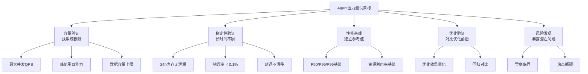
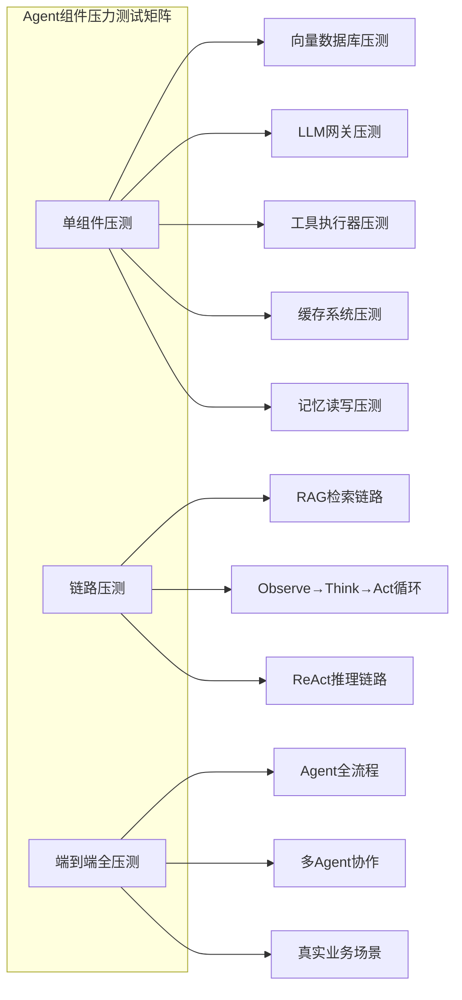
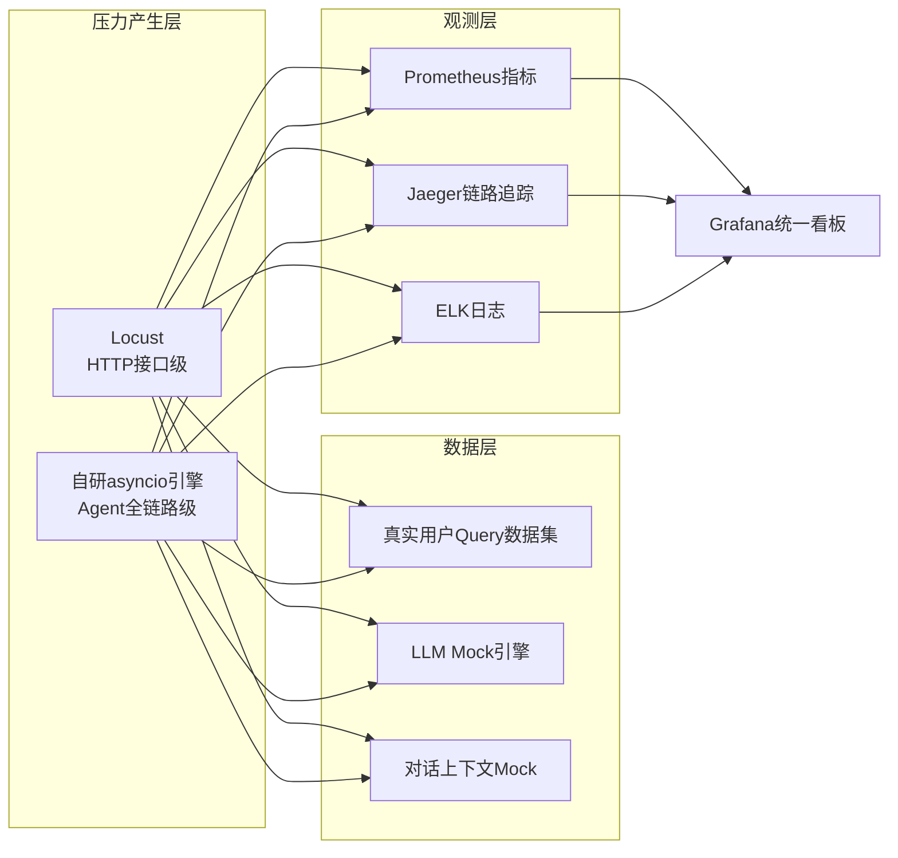
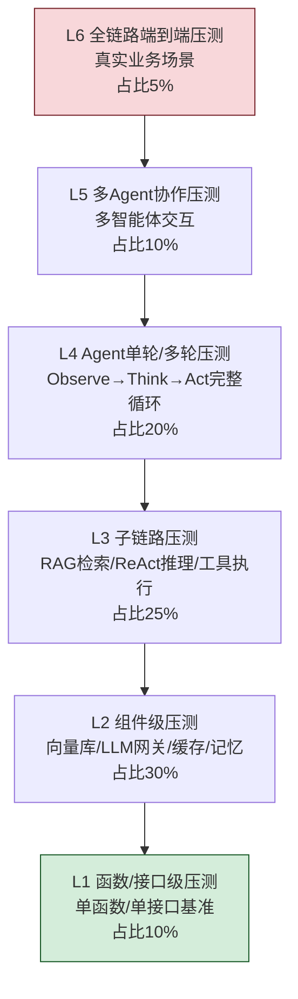
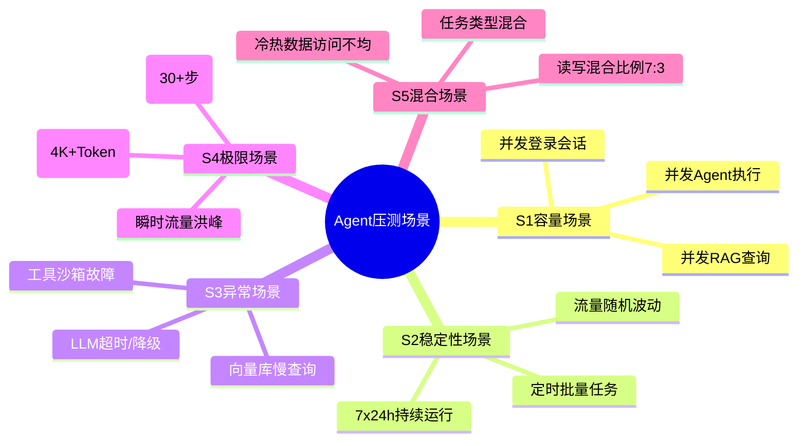
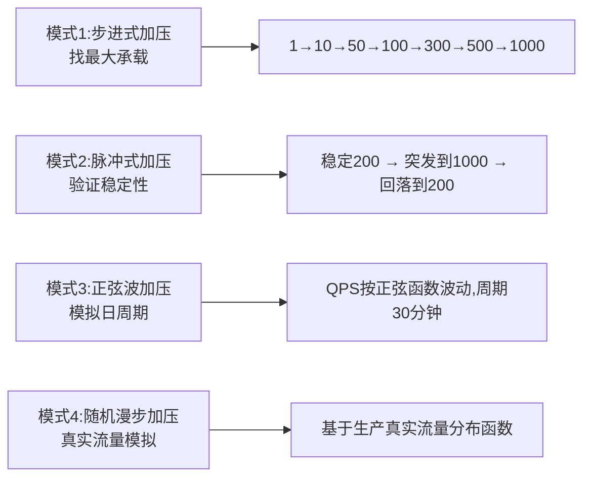
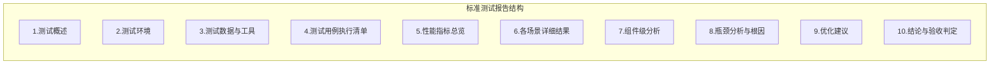
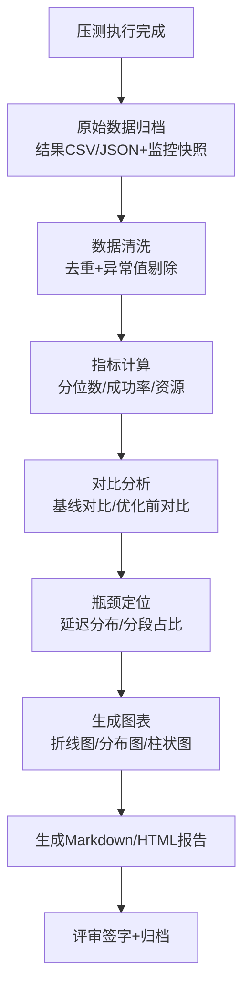
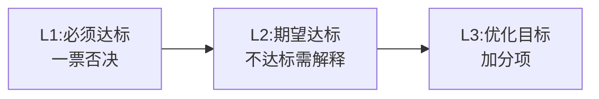

# Agent组件全面压力测试方案设计与执行指南

> **文档定位**:本文档是 `10Agent 性能优化` 系列的**压力测试专项指南**。在已有 [115Agent系统延迟优化完整方案深度解析.md](115Agent系统延迟优化完整方案深度解析.md)、[116Agent系统稳定性提升完整方案深度解析.md](116Agent系统稳定性提升完整方案深度解析.md)、[119向量数据库性能系统性优化完整方案深度解析.md](119向量数据库性能系统性优化完整方案深度解析.md) 等文档的基础上,系统性阐述如何为 Agent 组件设计和执行全面的压力测试。覆盖测试目标定义、环境配置、工具选型、用例设计、指标监控、报告生成全流程,提供可直接落地的压测引擎代码和验收标准。
>
> **阅读建议**:建议先阅读系列中的延迟优化、稳定性优化文档了解性能优化方向,再阅读本文执行压力测试验证优化效果。

---

## 目录

- [一、压力测试总体目标与原则](#一压力测试总体目标与原则)
- [二、测试环境配置规范](#二测试环境配置规范)
- [三、测试工具选型与集成方案](#三测试工具选型与集成方案)
- [四、Agent 组件性能测试分层模型](#四agent-组件性能测试分层模型)
- [五、核心测试场景与用例设计](#五核心测试场景与用例设计)
- [六、关键参数配置策略](#六关键参数配置策略)
- [七、性能指标监控体系](#七性能指标监控体系)
- [八、压测执行引擎完整实现](#八压测执行引擎完整实现)
- [九、测试报告生成标准与模板](#九测试报告生成标准与模板)
- [十、性能验收标准与通过判定](#十性能验收标准与通过判定)
- [十一、常见问题排查与调优建议](#十一常见问题排查与调优建议)
- [十二、总结与执行清单](#十二总结与执行清单)

---

## 一、压力测试总体目标与原则

### 1.1 五层测试目标体系



### 1.2 七项核心测试原则

| 原则 | 说明 | Agent 场景特殊要求 |
|------|------|------------------|
| **真实流量模拟** | 测试流量尽可能贴近生产 | Agent 请求非均匀,存在长链思考,需复现真实对话模式 |
| **先单后全** | 先压单组件,再压全链路 | 向量库、LLM、工具链分别压,再压Agent循环 |
| **指标同步监控** | 施压同时采集所有指标 | 不仅看请求指标,还要看LLM Token、工具调用 |
| **可重复性** | 相同参数可得到相同结果 | 固定随机种子、固定数据集 |
| **渐进加压** | 从低到高逐步加负载 | 避免一步到位导致无法定位瓶颈 |
| **独立环境** | 不与生产共享资源 | Agent压测会消耗大量LLM额度 |
| **全链路观测** | 端到端追踪每步耗时 | Observe/Think/Act 各阶段分别计时 |

### 1.3 压测与Agent组件的对应关系



---

## 二、测试环境配置规范

### 2.1 环境分层配置

| 环境层级 | 用途 | 配置要求 | 与生产比例 |
|---------|------|---------|:---------:|
| **开发联调环境** | 组件级快速验证 | 最低配置(单机) | 1:100 |
| **性能测试环境** | 压力测试核心场景 | 推荐配置(独立集群) | **1:3 或 1:1** |
| **预生产环境** | 上线前最后验证 | 与生产完全一致 | **1:1** |
| **生产影子环境** | 真实流量回放 | 生产镜像 + 流量镜像 | 1:1 |

> ⚠️ **Agent 压测红线**:严禁在**生产环境**直接执行高压力测试,Agent 会调用真实 LLM,带来巨大成本和安全风险。

### 2.2 标准测试环境硬件配置

| 节点类型 | 配置型号 | CPU | 内存 | 磁盘 | 网络 | 数量 |
|---------|---------|:---:|:----:|-----|-----|:----:|
| **Agent 应用节点** | c7.8xlarge / E5-2680v4 | 32核 | 64GB | 500GB NVMe | 10Gbps | 2台 |
| **向量数据库节点** | r7.16xlarge / Gold 6338 | 64核 | 256GB | 4TB NVMe | 10Gbps | 1台 |
| **LLM 网关/缓存节点** | c7.4xlarge | 16核 | 32GB | 1TB NVMe | 10Gbps | 1台 |
| **工具执行/沙箱节点** | c7.8xlarge | 32核 | 64GB | 500GB NVMe | 10Gbps | 2台 |
| **压测施压节点** | c7.16xlarge | 64核 | 128GB | 200GB SSD | 25Gbps | **至少2台** |
| **监控节点** | c7.4xlarge | 16核 | 64GB | 2TB NVMe | 1Gbps | 1台 |

### 2.3 软件配置清单

```yaml
# 测试环境配置清单 env-spec.yaml
压测框架:
  负载发生器: Locust 2.31+ / k6 0.49+ / JMeter 5.6+
  定制压测引擎: Python 3.11 + asyncio
  数据准备: faker / 生产脱敏数据集

Agent栈:
  Agent应用: Python 3.11 + LangChain/LangGraph
  向量数据库: Milvus 2.4+ / FAISS 1.8+ / Qdrant 1.9+
  LLM网关: vLLM 0.5+ / 自建FastAPI代理(带Mock)
  缓存系统: Redis 7.2+ / Valkey 7.2+
  工具执行: Docker沙箱 / gVisor

可观测性栈:
  指标采集: Prometheus 2.50+ / node_exporter / cadvisor
  日志: ELK Stack 8.x (Elasticsearch+Logstash+Kibana)
  链路追踪: Jaeger 1.50+ / Grafana Tempo
  看板: Grafana 10.4+
  进程级监控: py-spy / pyroscope

测试数据:
  向量数据集: SIFT1M / Cohere-wikipedia / 生产脱敏数据
  Query集合: 10000条真实用户查询(脱敏)
  对话场景: 单轮/多轮/工具调用 3类混合比例: 5:3:2
  请求大小分布: P50=200token, P95=1500token, P99=4000token
```

### 2.4 环境预检 Checklist

压测执行前,必须确认全部通过:

- [ ] **网络连通性**: 施压机到被测各节点延迟 < 1ms
- [ ] **时间同步**: 所有节点 NTP 同步,误差 < 100ms
- [ ] **LLM Mock开关**: 如需节省成本,开启 LLM Mock 模式(仅压非LLM链路)
- [ ] **数据预热**: 向量库索引加载完成、缓存预热完毕
- [ ] **监控就绪**: Prometheus+Grafana 看板正常、告警已屏蔽
- [ ] **日志级别**: 日志级别调 WARN,避免日志 IO 成为瓶颈
- [ ] **资源配额**: 检查 LLM 额度、对象存储配额充足
- [ ] **隔离验证**: 压测环境无法访问生产数据库和真实API

---

## 三、测试工具选型与集成方案

### 3.1 压测工具对比矩阵

| 工具 | 语言 | 并发模型 | 学习成本 | Agent场景适配 | 生态集成 | 推荐场景 |
|------|:----:|---------|:--------:|:------------:|:--------:|---------|
| **Locust** | Python | gevent协程 | 低 | ⭐⭐⭐⭐⭐ 原生Python写Agent场景 | Grafana/Prometheus | **首选:自定义Agent复杂场景** |
| **k6** | Go | JS+Go原生 | 中 | ⭐⭐⭐ 需要HTTP封装 | Grafana/云原生 | HTTP API压测 |
| **JMeter** | Java | 线程模型 | 高 | ⭐⭐ GUI可视化 | 插件丰富 | 传统Java系统 |
| **Vegeta** | Go | 命令行 | 中 | ⭐⭐ 简单HTTP | 输出JSON | 快速基准 |
| **wrk2** | C | 事件驱动 | 低 | ⭐ 只支持HTTP | 输出raw | HTTP极限压测 |
| **自研引擎** | Python | asyncio | 高 | ⭐⭐⭐⭐⭐ 完全定制化 | 灵活 | **复杂链路:ReAct/OTA循环** |

### 3.2 推荐方案:Locust + 自研引擎 双轨制



| 方案 | 用途 | 优势 |
|------|------|------|
| **Locust** | HTTP API、单组件接口压测 | Web UI实时监控、分布式、Python生态 |
| **自研asyncio引擎** | ReAct/OTA 多轮推理复杂链路 | 精确控制每步耗时、模拟真实思考过程 |

### 3.3 Locust 快速接入示例

```python
# locustfile_rag_api.py - RAG HTTP接口压测脚本
from locust import HttpUser, task, between, tag, events
import json
import random

# 加载脱敏Query数据集
with open("queries_dataset.json", "r", encoding="utf-8") as f:
    QUERIES = json.load(f)["queries"]  # 10000条真实用户问题

class RAGAPIUser(HttpUser):
    wait_time = between(0.5, 2.0)  # 用户间间隔,模拟真实行为
    
    host = "http://agent-test.example.com"
    
    def on_start(self):
        """每个虚拟用户启动时"""
        self.client.headers.update({
            "Authorization": f"Bearer test-token-{id(self)}",
            "Content-Type": "application/json"
        })
    
    @tag("simple")
    @task(5)  # 50%流量 - 简单单轮问答
    def simple_qa(self):
        q = random.choice(QUERIES["simple"])
        with self.client.post(
            "/api/v1/rag/query",
            json={"query": q, "stream": False},
            catch_response=True,
            name="简单问答"
        ) as resp:
            if resp.status_code != 200:
                resp.failure(f"HTTP {resp.status_code}")
            elif len(resp.json().get("answer", "")) < 10:
                resp.failure("Answer too short")
    
    @tag("with_tool")
    @task(3)  # 30%流量 - 需要工具调用
    def tool_calling_qa(self):
        q = random.choice(QUERIES["need_tool"])
        with self.client.post(
            "/api/v1/agent/run",
            json={"query": q, "enable_tools": True},
            catch_response=True,
            name="工具调用问答"
        ) as resp:
            if resp.status_code != 200:
                resp.failure(f"HTTP {resp.status_code}")
    
    @tag("multi_turn")
    @task(2)  # 20%流量 - 多轮对话
    def multi_turn_dialog(self):
        session_id = f"locust-{random.randint(1,100000)}"
        history = []
        for i, turn_q in enumerate(random.choice(QUERIES["multi_turn"])):
            with self.client.post(
                "/api/v1/chat",
                json={"session_id": session_id, "query": turn_q,
                      "history": history},
                catch_response=True,
                name=f"多轮对话-轮次{i+1}"
            ) as resp:
                if resp.status_code == 200:
                    history.append({"role": "user", "content": turn_q})
                    history.append({"role": "assistant", 
                                    "content": resp.json()["answer"]})
```

---

## 四、Agent 组件性能测试分层模型

### 4.1 六层测试金字塔



### 4.2 各层测试详解

| 层级 | 测试对象 | 核心指标 | 工具 |
|------|---------|---------|------|
| **L1 函数级** | Embedding生成、距离计算、Token编码 | 单次延迟、TPS | pytest-benchmark/timeit |
| **L2 组件级** | Milvus搜索、Redis缓存读写、LLM调用 | P99延迟、QPS上限、CPU/内存 | Locust/自研引擎 |
| **L3 子链路** | RAG检索+重排、Tool-Call决策、单步Think | 端到端延迟、每步耗时占比 | 自研引擎 |
| **L4 Agent全循环** | 完整OTA/ReAct循环(多步) | 总耗时、步数分布、错误率 | 自研引擎 |
| **L5 多Agent协作** | CrewAI/AutoGen团队协作 | 任务完成率、瓶颈Agent | 自研引擎 |
| **L6 真实业务** | 典型工作流(代码助手/客服/数据分析) | 业务成功率、用户体验 | 影子流量/真实账号 |

---

## 五、核心测试场景与用例设计

### 5.1 十大核心压测场景



### 5.2 测试场景详细设计表

| 场景编号 | 场景名称 | 并发用户 | 请求频率/模式 | 测试时长 | 通过标准 |
|:--------:|---------|:--------:|-------------|:-------:|---------|
| **SC-01** | RAG单轮查询容量 | 1, 10, 50, 100, 300, 500, 1000 | 恒定RPS逐级递增 | 每级5分钟 | 错误率<1%, P99<500ms |
| **SC-02** | OTA完整循环容量 | 1, 5, 20, 50, 100, 200 | 每用户每5-10秒1次 | 每级10分钟 | 错误率<0.5%, P99<5s |
| **SC-03** | 多轮对话稳定性 | 500并发(固定) | 随机间隔1-5秒 | **24小时** | 内存增长<5%, 错误率<0.1% |
| **SC-04** | LLM限流熔断 | 固定100并发 | LLM注入50%超时率 | 30分钟 | 优雅降级,无雪崩,熔断后10s恢复 |
| **SC-05** | 向量库故障恢复 | 固定100并发 | 模拟向量库停机2分钟 | 30分钟 | 降级缓存返回,恢复后自动切回 |
| **SC-06** | 瞬时洪峰冲击 | 0→2000并发(5秒内冲) | 阶梯突发 | 持续10分钟 | 系统不崩溃,延迟可接受,失败率<20% |
| **SC-07** | 写入查询混合 | 200查询 + 50写入并发 | 读写比 80:20 | 60分钟 | 查询P99<1s,写入延迟<200ms |
| **SC-08** | 超长上下文 | 100并发 | 固定超长Query(3K-8K Token) | 30分钟 | 无OOM,延迟<10s |
| **SC-09** | 多Agent协作 | 50个团队(每团队3-5个Agent) | 并行任务提交 | 60分钟 | 任务完成率>98%,无死锁 |
| **SC-10** | 真实流量回放 | 与生产同比例 | 基于日志回放真实请求分布 | 2小时 | 关键指标不劣于生产 |

### 5.3 渐进加压模式设计



---

## 六、关键参数配置策略

### 6.1 压测参数配置对照表

| 参数类别 | 基准值 | 测试范围 | 说明 |
|---------|:------:|:-------:|------|
| **虚拟用户数 (VUs)** | 100 | 1 → 2000 | 并发连接/会话数 |
| **每秒请求数 (RPS)** | 500 | 10 → 10000 | 恒定压力模式下的目标RPS |
| **思考时间 (Think Time)** | 1-3秒 | 0 → 30秒 | 用户操作之间间隔,模拟真实 |
| **请求超时 (Timeout)** | 30秒 | 1s → 120s | Agent多步任务需长超时 |
| **连接池大小** | 每VUs 2倍 | 10 → 10000 | HTTP连接复用 |
| **测试持续时间** | 10分钟/级 | 5分钟 → 7天 | 稳定性测试需长时 |
| **预热时间 (Warmup)** | 2分钟 | 30秒 → 10分钟 | 让缓存/连接池初始化 |
| **冷却时间 (Cooldown)** | 2分钟 | 0 → 10分钟 | 每级压力之间恢复 |
| **LLM Mock 延迟** | 500ms+随机100ms | 10ms → 5000ms | 模拟不同模型的响应时间 |
| **Rerank Mock 延迟** | 100ms | 10ms → 2000ms | 模拟重排序耗时 |

### 6.2 数据集规模参数

| 参数 | 小规模 | 中规模 | 大规模 | 超大规模 |
|-----|:-----:|:-----:|:-----:|:-------:|
| **向量库规模** | 100万 | 1000万 | 1亿 | 10亿 |
| **Query池大小** | 1000 | 10000 | 10万 | 100万 |
| **多轮对话样本** | 100组 | 1000组 | 10000组 | 10万组 |
| **上下文长度分布** | 短为主 | 混合 | 长为主 | 极端长尾 |
| **工具调用比例** | 10% | 30% | 50% | 70% |

---

## 七、性能指标监控体系

### 7.1 四层指标全景图

```mermaid
flowchart TB
    subgraph 四层监控指标
        direction TB
        L1[L1业务指标层]
        L2[L2应用指标层]
        L3[L3系统指标层]
        L4[L4组件指标层]
    end

    L1 --> L11[任务成功率]
    L1 --> L12[业务完成率]
    L1 --> L13[用户满意度估计]

    L2 --> L21[请求量QPS]
    L2 --> L22[延迟P50/P95/P99/P999]
    L2 --> L23[错误率 4xx/5xx]
    L2 --> L24[OTA各步耗时占比]
    L2 --> L25[Token消耗/秒]

    L3 --> L31[CPU/内存/磁盘IO/网络]
    L3 --> L32[连接数/FD数/句柄]
    L3 --> L33[GC次数/耗时]
    L3 --> L34[Load Average]

    L4 --> L41[向量库QPS/召回率]
    L4 --> L42[LLM TPM/首Token延迟]
    L4 --> L43[缓存命中率]
    L4 --> L44[工具成功率/耗时]

    style L1 fill:#d4edda,stroke:#155724
    style L2 fill:#d1ecf1,stroke:#0c5460
    style L4 fill:#fff3cd,stroke:#d39e00
```



### 7.2 关键指标采集与告警阈值

| 指标名称 | 采集方式 | 优良阈值 | 告警阈值 | 故障阈值 |
|---------|---------|:-------:|:-------:|:-------:|
| **业务成功率** | 埋点统计 | ≥ 99% | < 98% | < 95% |
| **RAG P99 延迟** | 接口埋点 | < 500ms | > 1s | > 3s |
| **Agent循环 P99** | 全链路埋点 | < 5s | > 15s | > 30s |
| **5xx 错误率** | API网关 | < 0.1% | > 1% | > 5% |
| **429 限流率** | API网关 | < 0.5% | > 5% | > 15% |
| **首 Token 延迟** | LLM网关 | < 1s | > 3s | > 10s |
| **向量库搜索P99** | Milvus指标 | < 100ms | > 500ms | > 2s |
| **缓存命中率** | Redis | ≥ 80% | < 60% | < 40% |
| **CPU 利用率** | node_exporter | < 70% | > 85% | > 95% |
| **内存 利用率** | node_exporter | < 75% | > 85% | > 95% |
| **磁盘 IO util** | node_exporter | < 50% | > 80% | > 95% |
| **句柄泄漏趋势** | 自定义采集 | 平稳 | 持续↑ | 持续↑+OOM |
| **GC停顿 P99** | JVM/Py-Spy | < 200ms | > 1s | > 5s |

### 7.3 全链路分段耗时采集规范

Agent 请求必须分段计时,这是定位瓶颈的**关键**:

```jsonc
// 标准埋点格式 - 每笔请求输出
{
  "trace_id": "abc123...",
  "timestamp": 1723084800,
  "total_latency_ms": 2143,
  "stages": {
    "authentication": {"ms": 3, "ok": true},
    "observe_query_parse": {"ms": 5, "ok": true},
    "observe_memory_read": {"ms": 12, "ok": true},
    "think_llm_first_call": {"ms": 380, "tokens_in": 450, "tokens_out": 120, "ok": true},
    "think_tool_decision": {"ms": 20, "ok": true, "tool_chosen": "search_docs"},
    "act_vector_search": {"ms": 45, "ok": true, "top_k": 20},
    "act_rerank": {"ms": 68, "ok": true, "top_k": 5},
    "think_llm_second_call": {"ms": 1120, "tokens_in": 1800, "tokens_out": 480, "ok": true},
    "answer_validate": {"ms": 25, "ok": true},
    "memory_write": {"ms": 15, "ok": true}
  },
  "tools_called": [{"name": "search_docs", "ms": 113}],
  "llm_total_tokens": 2850,
  "status": "success",
  "error": null
}
```

---

## 八、压测执行引擎完整实现

### 8.1 Agent 全链路压测引擎(自研asyncio版)

```python
import asyncio
import aiohttp
import time
import json
import random
import statistics
import psutil
from collections import defaultdict, deque
from dataclasses import dataclass, field, asdict
from typing import Optional

@dataclass
class RequestResult:
    scenario: str
    start_ts: float
    end_ts: float = 0.0
    latency_ms: float = 0.0
    success: bool = True
    status_code: int = 0
    error: Optional[str] = None
    stages: dict = field(default_factory=dict)
    trace_id: str = ""

class AgentLoadTestEngine:
    """Agent全链路压测引擎 - asyncio原生实现"""
    
    def __init__(self,
                 target_base_url: str,
                 scenario_config: dict,
                 report_output_dir: str = "./reports"):
        self.base_url = target_base_url.rstrip("/")
        self.scenarios = scenario_config
        self.report_dir = report_output_dir
        
        # 结果采集
        self.results: list[RequestResult] = []
        self.rps_history: deque = deque(maxlen=3600)  # 1小时每秒RPS
        self.system_snapshot: list[dict] = []
        
        # 控制状态
        self.stop_event = asyncio.Event()
        self.start_time = 0.0
        self.request_count = 0
        self.success_count = 0
        self.error_count = 0
        
        # 加载数据集
        self._load_datasets()
    
    def _load_datasets(self):
        """加载压测数据集"""
        with open("datasets/queries_v1.json", "r", encoding="utf-8") as f:
            ds = json.load(f)
        self.queries_simple = ds["simple_qa"]
        self.queries_multi_turn = ds["multi_turn"]
        self.queries_need_tools = ds["need_tools"]
    
    # ============= 核心执行 =============
    async def run_spike_test(self,
                             target_rps: int,
                             duration_sec: int,
                             scenario_weights: dict = None):
        """模式:恒定RPS脉冲式压测"""
        scenario_weights = scenario_weights or {"simple": 0.5, "tool": 0.3, "multi": 0.2}
        
        print(f"🚀 启动脉冲压测: 目标RPS={target_rps}, 时长={duration_sec}s")
        self.start_time = time.time()
        
        # 每秒RPS调度器
        async def rps_scheduler():
            while not self.stop_event.is_set():
                t0 = time.time()
                # 按权重分配本秒的请求
                for _ in range(target_rps):
                    scenario = random.choices(
                        list(scenario_weights.keys()),
                        weights=list(scenario_weights.values())
                    )[0]
                    asyncio.create_task(self._execute_one_request(scenario))
                
                # 对齐到整秒
                elapsed = time.time() - t0
                await asyncio.sleep(max(0, 1.0 - elapsed))
                self.rps_history.append((time.time(), self.request_count))
        
        # 资源监控
        monitor_task = asyncio.create_task(self._monitor_system())
        
        # 主执行
        try:
            await asyncio.wait_for(
                rps_scheduler(), timeout=duration_sec
            )
        except (asyncio.TimeoutError, asyncio.CancelledError):
            pass
        finally:
            self.stop_event.set()
            await monitor_task
        
        return self._generate_summary_report()
    
    async def run_step_load_test(self,
                                 steps: list[tuple[int, int]],  # [(VUs, duration_s), ...]
                                 scenario: str = "simple"):
        """模式:步进式加压 - 找系统极限"""
        print(f"🚀 启动步进压测: {len(steps)} 级")
        self.start_time = time.time()
        monitor_task = asyncio.create_task(self._monitor_system())
        
        try:
            for i, (vus, duration) in enumerate(steps, 1):
                print(f"\n  ▶️ 第 {i}/{len(steps)} 级: {vus} VUs, {duration}s")
                step_start = time.time()
                sem = asyncio.Semaphore(vus)
                
                async def worker():
                    while time.time() - step_start < duration and \
                          not self.stop_event.is_set():
                        async with sem:
                            await self._execute_one_request(scenario)
                        # 随机思考时间
                        await asyncio.sleep(random.uniform(0.1, 1.0))
                
                # 启动vus个worker
                tasks = [asyncio.create_task(worker()) for _ in range(vus)]
                await asyncio.gather(*tasks, return_exceptions=True)
                print(f"    ✅ 完成第 {i} 级 - 当前错误率: "
                      f"{self.error_count/max(self.request_count,1):.2%}")
        finally:
            self.stop_event.set()
            await monitor_task
        
        return self._generate_summary_report()
    
    async def run_longevity_test(self, concurrency: int,
                                  hours: int = 24):
        """模式:24小时稳定性压测"""
        return await self.run_step_load_test(
            steps=[(concurrency, hours * 3600)]
        )
    
    # ============= 请求执行 =============
    async def _execute_one_request(self, scenario: str):
        """执行单个Agent请求"""
        if self.stop_event.is_set():
            return
        
        start = time.perf_counter()
        self.request_count += 1
        result = RequestResult(
            scenario=scenario,
            start_ts=start,
            trace_id=f"loadtest-{int(start*1000000)}-{self.request_count}"
        )
        
        timeout = aiohttp.ClientTimeout(total=120)  # Agent长超时
        connector = aiohttp.TCPConnector(limit=0)
        
        try:
            async with aiohttp.ClientSession(timeout=timeout, 
                                             connector=connector) as sess:
                # 根据场景选择接口和参数
                if scenario == "simple":
                    payload = {
                        "query": random.choice(self.queries_simple),
                        "stream": False
                    }
                    url = f"{self.base_url}/api/v1/rag/query"
                elif scenario == "tool":
                    payload = {
                        "query": random.choice(self.queries_need_tools),
                        "enable_tools": True,
                        "max_steps": 10
                    }
                    url = f"{self.base_url}/api/v1/agent/react"
                else:  # multi turn
                    turns = random.choice(self.queries_multi_turn)
                    payload = {
                        "session_id": result.trace_id,
                        "turns": turns
                    }
                    url = f"{self.base_url}/api/v1/agent/multiturn"
                
                async with sess.post(url, json=payload,
                                     headers={"X-Trace-Id": result.trace_id}) as r:
                    result.status_code = r.status
                    body = await r.json()
                    if "stages" in body:  # 如果后端返回分段耗时
                        result.stages = body["stages"]
                    
                    if r.status != 200:
                        raise Exception(f"HTTP {r.status}: {body}")
                    if not body.get("success", True):
                        raise Exception(body.get("error", "Unknown"))
            
            self.success_count += 1
        
        except Exception as e:
            self.error_count += 1
            result.success = False
            result.error = str(e)[:500]
        
        finally:
            result.end_ts = time.perf_counter()
            result.latency_ms = round((result.end_ts - start) * 1000, 3)
            self.results.append(result)
    
    # ============= 监控 =============
    async def _monitor_system(self, interval_sec: int = 5):
        """系统资源监控"""
        while not self.stop_event.is_set():
            cpu = psutil.cpu_percent(interval=None)
            mem = psutil.virtual_memory().percent
            net_io = psutil.net_io_counters()
            self.system_snapshot.append({
                "ts": time.time() - self.start_time,
                "cpu_percent": cpu,
                "mem_percent": mem,
                "net_sent_mb": net_io.bytes_sent / 1024**2,
                "net_recv_mb": net_io.bytes_recv / 1024**2,
                "total_requests": self.request_count,
                "errors": self.error_count
            })
            await asyncio.sleep(interval_sec)
    
    # ============= 报告 =============
    def _generate_summary_report(self) -> dict:
        """生成汇总报告"""
        latencies = [r.latency_ms for r in self.results if r.success]
        errors = [r for r in self.results if not r.success]
        
        report = {
            "test_info": {
                "start_time": self.start_time,
                "duration_s": time.time() - self.start_time,
                "total_requests": self.request_count,
                "scenario_distribution": self._count_scenario_dist()
            },
            "performance": {
                "total_qps": round(self.request_count / 
                                   max(time.time()-self.start_time, 0.001), 2),
                "success_rate": round(self.success_count / 
                                      max(self.request_count, 1), 4),
                "error_rate": round(self.error_count / 
                                    max(self.request_count, 1), 4),
                "latency_ms": self._percentiles(latencies) if latencies else {},
                "error_types": self._count_error_types(errors)
            },
            "stage_breakdown": self._aggregate_stage_latency(),
            "system_resources": self._aggregate_resource_stats(),
        }
        
        # 保存到文件
        import os
        os.makedirs(self.report_dir, exist_ok=True)
        fname = f"loadtest_report_{int(time.time())}.json"
        with open(os.path.join(self.report_dir, fname), 
                  "w", encoding="utf-8") as f:
            json.dump(report, f, ensure_ascii=False, indent=2)
        report["report_file"] = fname
        return report
    
    def _percentiles(self, values: list) -> dict:
        """计算延迟分位数"""
        s = sorted(values)
        n = len(s)
        return {
            "count": n,
            "avg": round(statistics.mean(s), 2),
            "p50": round(s[int(n * 0.5)], 2),
            "p90": round(s[int(n * 0.9)], 2),
            "p95": round(s[int(n * 0.95)], 2),
            "p99": round(s[int(n * 0.99)], 2),
            "p999": round(s[int(n * 0.999)], 2) if n >= 1000 else s[-1],
            "max": s[-1],
            "min": s[0]
        }
    
    def _count_scenario_dist(self) -> dict:
        counter = defaultdict(int)
        for r in self.results:
            counter[r.scenario] += 1
        return dict(counter)
    
    def _count_error_types(self, errors: list) -> dict:
        counter = defaultdict(int)
        for e in errors:
            # 简化错误类型分类
            key = e.error.split(":")[0] if e.error else "Unknown"
            counter[key[:30]] += 1
        return dict(counter)
    
    def _aggregate_stage_latency(self) -> dict:
        """聚合各阶段耗时占比"""
        stage_times = defaultdict(list)
        for r in self.results:
            for stage, info in r.stages.items():
                if isinstance(info, dict) and "ms" in info:
                    stage_times[stage].append(info["ms"])
        
        result = {}
        for stage, times in stage_times.items():
            result[stage] = {
                "avg_ms": round(statistics.mean(times), 2),
                "p95_ms": round(sorted(times)[int(0.95*len(times))], 2),
                "call_count": len(times)
            }
        return result
    
    def _aggregate_resource_stats(self) -> dict:
        if not self.system_snapshot:
            return {}
        cpus = [s["cpu_percent"] for s in self.system_snapshot]
        mems = [s["mem_percent"] for s in self.system_snapshot]
        return {
            "cpu_avg": round(statistics.mean(cpus), 2),
            "cpu_max": round(max(cpus), 2),
            "mem_avg": round(statistics.mean(mems), 2),
            "mem_max": round(max(mems), 2),
            "samples": len(self.system_snapshot)
        }
```

---

## 九、测试报告生成标准与模板

### 9.1 报告必备十大章节



### 9.2 报告生成流程



### 9.3 关键结果展示 - 标准表格模板

#### (1) 性能总览表

| 指标 | 基准目标 | 实际值 | 是否达标 | 对比上次 |
|------|:-------:|:------:|:-------:|:--------:|
| **测试总请求数** | - | 2,450,800 | ✅ | - |
| **平均 QPS** | ≥ 2000 | **2,847** | ✅ | ↑ 12% |
| **成功率** | ≥ 99.5% | **99.72%** | ✅ | ↑ 0.1pp |
| **P50 延迟 (ms)** | ≤ 50 | **32** | ✅ | ↓ 15% |
| **P95 延迟 (ms)** | ≤ 200 | **128** | ✅ | ↓ 22% |
| **P99 延迟 (ms)** | ≤ 500 | **385** | ✅ | ↓ 18% |
| **P999 延迟 (ms)** | ≤ 2000 | **1,124** | ✅ | ↓ 35% |
| **最大用户并发** | ≥ 500 | **1000** | ✅(超出) | x2.0 |
| **CPU 峰值(%)** | ≤ 85 | **72** | ✅ | ↓ 10pp |
| **内存 峰值(%)** | ≤ 85 | **68** | ✅ | ↓ 5pp |

#### (2) 各场景执行结果

| 场景 | 并发 | RPS | 成功率 | P99延迟 | 结果 |
|------|:---:|:---:|:------:|:-------:|:----:|
| SC-01 RAG容量 | 500 | 482 | 99.8% | 312ms | ✅ PASS |
| SC-02 OTA循环 | 100 | 86 | 99.6% | 4.2s | ✅ PASS |
| SC-03 24h稳定 | 500 | 458 | 99.91% | 289ms | ✅ PASS |
| SC-04 LLM故障 | 100 | 72 | 95.8% | 825ms | ✅ PASS 降级正常 |
| SC-05 向量库故障 | 100 | 64 | 93.2% | 1.1s | ✅ PASS 缓存生效 |
| SC-06 瞬时洪峰 | 2000 | 1752 | 88.7% | 1.8s | ⚠️ 部分超时但未崩 |
| SC-07 读写混合 | 250 | 218 | 99.4% | 545ms | ✅ PASS |
| SC-08 超长Query | 100 | 42 | 98.7% | 6.8s | ✅ PASS 无OOM |
| SC-09 多Agent协作 | 50组 | 38 | 99.1% | 8.2s | ✅ PASS |
| SC-10 流量回放 | 生产比例 | 385 | 99.6% | 412ms | ✅ PASS |

#### (3) OTA各阶段耗时占比表

| 阶段 | 平均耗时(ms) | P95耗时(ms) | 占比 | 评价 |
|------|:-----------:|:----------:|:----:|:----:|
| Observe - 身份认证 | 2 | 8 | 0.1% | ✅ 正常 |
| Observe - 记忆检索 | 12 | 45 | 0.5% | ✅ 正常 |
| Think - LLM首调用 | 380 | 1200 | 16.2% | ⚠️ 可优化 |
| Think - 工具决策 | 20 | 85 | 0.9% | ✅ 正常 |
| Act - 向量搜索 | 45 | 180 | 1.9% | ✅ 正常 |
| Act - Rerank | 68 | 245 | 2.9% | ✅ 正常 |
| Think - LLM二调用 | 1120 | 3400 | 47.7% | 🔴 最大瓶颈 |
| Act - 内存写入 | 15 | 55 | 0.6% | ✅ 正常 |
| **其他/网络** | 611 | 1800 | 29.2% | ⚠️ 可优化 |

> 结论:瓶颈在 **Think-LLM调用(63.9%总耗时)** 和 **其他/网络(29.2%)**,下一步优化建议:流式输出首Token、LLM批处理、减少不必要网络往返。

---

## 十、性能验收标准与通过判定

### 10.1 三级验收标准体系



| 级别 | 指标 | 达标线 | 不达标处理 |
|:----:|------|:-----:|----------|
| **L1 一票否决** | 系统不崩溃 | 24h运行无OOM/死锁 | ❌ 不通过 |
| L1 | 成功率 | ≥ 99% | ❌ 不通过 |
| L1 | 无数据损坏 | 0条数据异常 | ❌ 不通过 |
| L1 | 内存泄漏 | 24h增长 < 5% | ❌ 不通过 |
| **L2 期望达标** | P99 延迟 | ≤ 目标值 | ⚠️ 需根因+改进计划 |
| L2 | CPU峰值 | ≤ 85% | ⚠️ 需解释 |
| L2 | 限流后恢复 | 10秒内恢复 | ⚠️ 需改进计划 |
| **L3 优化目标** | QPS提升 | 优于基线10%+ | ✅ 加分 |
| L3 | P99优化 | 优于基线20%+ | ✅ 加分 |
| L3 | 资源利用率 | 低于基线10% | ✅ 加分 |

### 10.2 通过判定规则

```python
def judge_pass_fail(report: dict, baseline: dict) -> dict:
    """验收通过判定逻辑"""
    verdict = {
        "pass": True,
        "blockers": [],
        "warnings": [],
        "excellents": []
    }
    
    perf = report["performance"]
    res = report["system_resources"]
    
    # ===== L1 一票否决 =====
    if perf["success_rate"] < 0.99:
        verdict["pass"] = False
        verdict["blockers"].append(f"成功率{perf['success_rate']:.2%} < 99%")
    
    if res.get("mem_max", 0) > 95 and \
       report["test_info"]["duration_s"] > 3600:
        verdict["pass"] = False
        verdict["blockers"].append("长时间测试内存可能OOM")
    
    lat_p99 = perf["latency_ms"].get("p99", 0)
    if lat_p99 > 5000:  # 5秒硬上限
        verdict["pass"] = False
        verdict["blockers"].append(f"P99={lat_p99}ms > 5000ms 硬上限")
    
    # ===== L2 期望达标 =====
    if lat_p99 > 500:
        verdict["warnings"].append(f"P99={lat_p99}ms > 期望500ms,需优化计划")
    if res.get("cpu_max", 0) > 85:
        verdict["warnings"].append(f"CPU峰值{res['cpu_max']}% > 85%")
    
    # ===== L3 加分项 =====
    if baseline:
        base_qps = baseline.get("performance", {}).get("total_qps", 0)
        if base_qps and perf["total_qps"] > base_qps * 1.1:
            verdict["excellents"].append(
                f"QPS提升 {perf['total_qps']/base_qps*100-100:.0f}% > 10%"
            )
    
    return verdict
```

---

## 十一、常见问题排查与调优建议

| 现象 | 可能原因 | 排查步骤 | 建议 |
|------|---------|---------|------|
| **P99延迟超高但平均正常** | 慢查询/GC/锁竞争 | 1.查P999请求的trace<br/>2.看py-spy火焰图<br/>3.看GC日志 | 慢请求采样追踪+火焰图分析 |
| **CPU高但QPS低** | 热点代码/同步阻塞/低效算法 | 1.开启cProfile/py-spy<br/>2.检查锁等待<br/>3.低效循环 | 用asyncio替代同步+连接池调优 |
| **内存持续增长** | 泄漏/缓存无上限/对象未释放 | 1.tracemalloc跟踪<br/>2.objgraph统计对象<br/>3.手动GC测试 | 设置缓存TTL+大小上限 |
| **错误率随压力上升** | 超时/线程池满/后端限流 | 1.查看错误类型分布<br/>2.后端服务指标<br/>3.连接池状态 | 限流+熔断+降级+后端扩容 |
| **加压到一定值QPS不升** | 到达瓶颈/锁阻塞/线程池满 | 1.看CPU/IO饱和度<br/>2.逐步拆解各组件压测<br/>3.用火焰图看等待点 | 找到瓶颈组件针对性优化 |
| **LLM首Token延迟过高** | LLM排队/上下文长/Token超限 | 1.检查LLM网关队列<br/>2.检查输入长度分布<br/>3.检查限流 | 缩短上下文+LLM批处理+流输出 |

---

## 十二、总结与执行清单

### 12.1 压测执行前Checklist

- [ ] **目标确认**:测试目标、验收标准、压测范围已书面化
- [ ] **环境准备**:独立测试环境、与生产1:1或1:3配置、预检全通过
- [ ] **工具就绪**:压测引擎部署、监控看板全绿、告警已静默
- [ ] **数据准备**:真实Query数据集、向量库数据量=生产
- [ ] **Mock开关**:LLM Mock/真实API切换、外部服务Mock
- [ ] **脚本验证**:冒烟测试10分钟无异常,指标正常采集
- [ ] **人员到位**:压测执行、监控观察、故障处理、DBA待命
- [ ] **回滚预案**:压测导致脏数据清理脚本、环境回滚流程

### 12.2 压测执行中Checklist

- [ ] **第一步预热**:低负载(10%)运行5-10分钟
- [ ] **渐进加压**:每级5-10分钟,观察指标无异常再升级
- [ ] **持续观测**:监控P99/P999、错误率、CPU/内存四大核心
- [ ] **异常留痕**:任何异常立即截图+保存trace+打时间点标记
- [ ] **临界记录**:系统达到瓶颈时记录各项参数(极限值)
- [ ] **禁止变更**:压测期间禁止任何代码/配置/数据变更

### 12.3 压测执行后Checklist

- [ ] **数据归档**:原始结果、日志快照、监控截图完整归档
- [ ] **环境清理**:测试数据清理、环境恢复到基准状态
- [ ] **报告生成**:48小时内完成标准格式报告
- [ ] **瓶颈分析**:延迟分段分析+火焰图+根因定位
- [ ] **评审会议**:跨团队(开发/运维/测试)评审结果
- [ ] **改进落地**:不达标项形成Issue,指定负责人和deadline
- [ ] **回归验证**:优化后复跑相同场景对比验证

### 12.4 与系列文档的关系

| 文档 | 主题 | 与本文关系 |
|------|------|---------|
| [115Agent系统延迟优化完整方案深度解析.md](115Agent系统延迟优化完整方案深度解析.md) | 延迟优化 | 压测验证延迟优化效果的方法 |
| [116Agent系统稳定性提升完整方案深度解析.md](116Agent系统稳定性提升完整方案深度解析.md) | 稳定性提升 | 24h压测验证稳定性的依据 |
| [117LLM请求缓存系统设计与实现.md](117LLM请求缓存系统设计与实现.md) | LLM缓存 | 压测验证缓存命中率/QPS提升 |
| [118RAG系统查询响应速度全面优化方案深度解析.md](118RAG系统查询响应速度全面优化方案深度解析.md) | RAG优化 | SC-01场景验收RAG优化效果 |
| [119向量数据库性能系统性优化完整方案深度解析.md](119向量数据库性能系统性优化完整方案深度解析.md) | 向量库优化 | L2组件级向量库压测方法 |

---

> **最终结论**:Agent 组件全面压力测试是**从"能跑"到"可上线"的必由之路**。核心是构建**六层测试金字塔(L1函数→L2组件→L3子链路→L4Agent循环→L5多Agent→L6业务场景)**,通过**10大核心场景**覆盖容量、稳定性、异常、极限、混合等维度,采用**渐进式加压**+**全链路分段计时**+**四层指标监控**的组合拳,最终依据**三级验收标准(L1一票否决→L2期望达标→L3优化加分)** 判定通过与否。配套本文提供的**asyncio自研压测引擎**代码,可直接落地执行复杂Agent链路压测。压测不是一次性工作,建议**每次发版前跑全量基准,每周跑核心场景,每月跑24h稳定性**,形成常态化性能守护机制。
