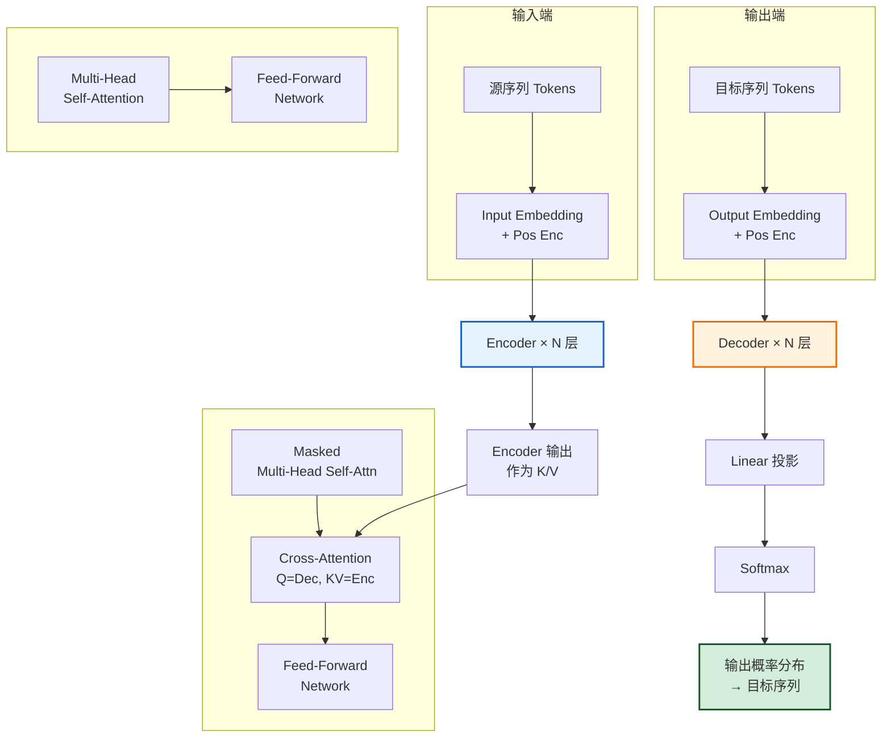
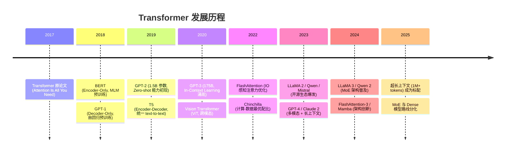
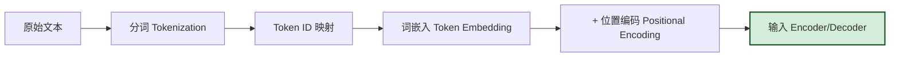
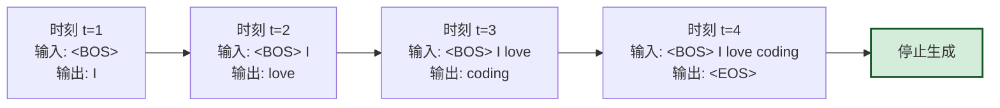
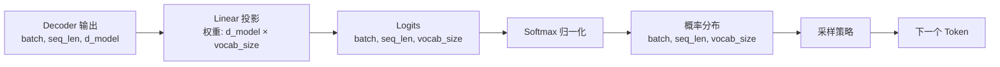
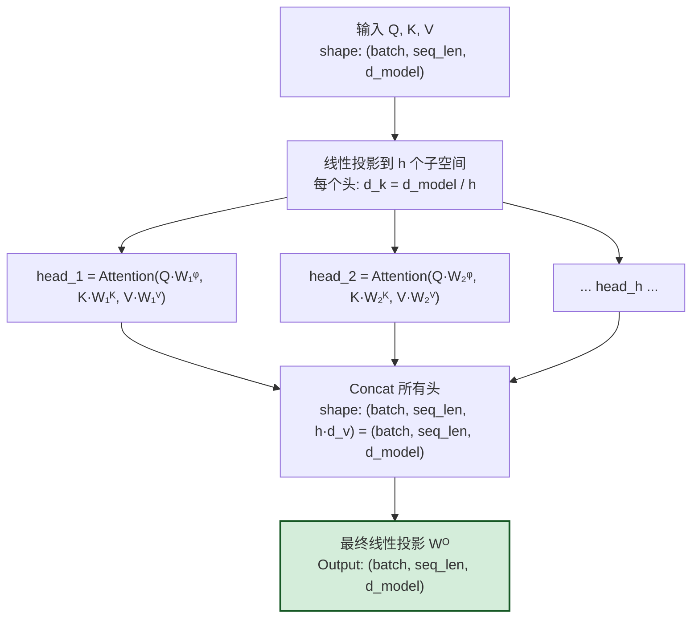
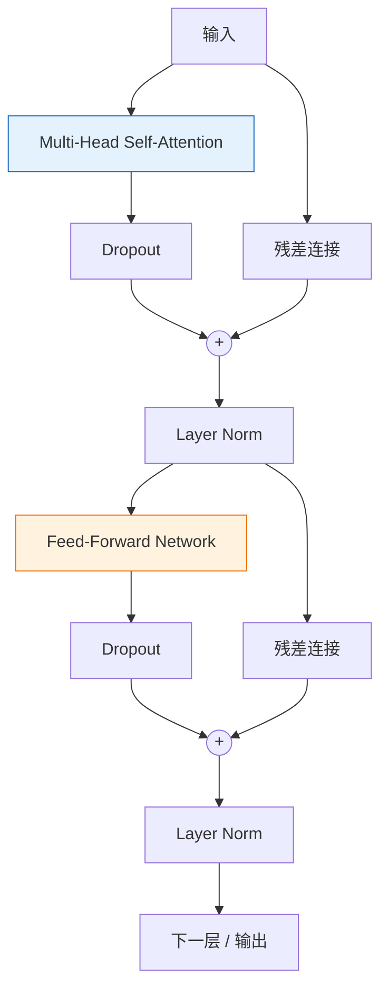
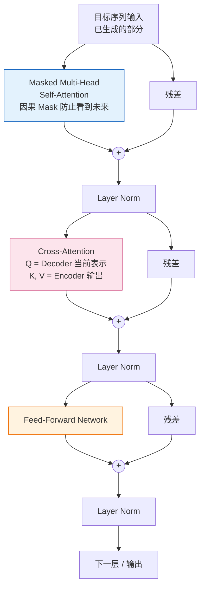
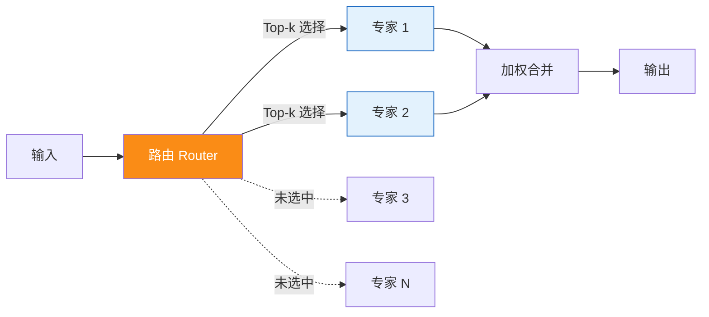
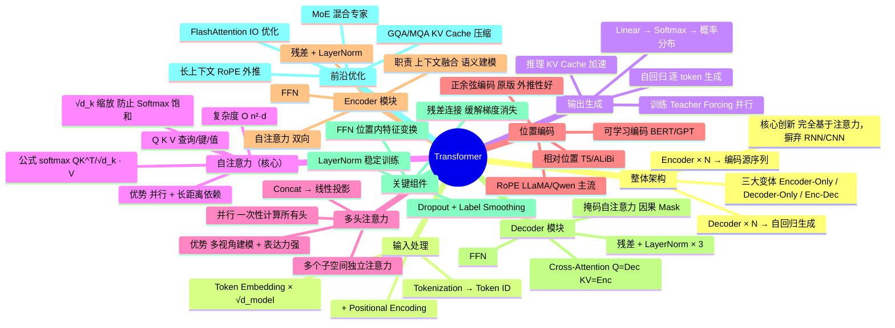

# Transformer 架构原理面试答案详解

> **文档定位**：本文档是 `agent` 系列的 **Transformer 架构原理专题篇**，面向算法工程师面试准备与深度学习基础巩固。系统覆盖 Transformer 的输入输出、自注意力、多头注意力、位置编码、编码器/解码器及关键功能组件，从直觉动机到数学推导再到代码实现，层层递进。
>
> **适用读者**：中高级算法面试候选人、大模型初学者、需要系统性回顾 Transformer 原理的工程师。
>
> **阅读建议**：
> - **面试速览**：先读「1.1 背景与定位」→「四、自注意力」→「十二、面试高频追问」→「十三、3 分钟回答模板」
> - **深度学习**：按章节顺序通读，重点关注数学推导（4.3/5.2/6.2）与代码实现（4.4/7.3/8.4）
> - **工程实践**：关注「9 关键组件」与「十一、前沿进展与优化方向」

---

## 目录

- [Transformer 架构原理面试答案详解](#transformer-架构原理面试答案详解)
  - [目录](#目录)
  - [一、Transformer 整体架构概览](#一transformer-整体架构概览)
    - [1.1 背景与定位](#11-背景与定位)
    - [1.2 整体架构图](#12-整体架构图)
    - [1.3 三大主流变体](#13-三大主流变体)
    - [1.4 发展历程与里程碑](#14-发展历程与里程碑)
  - [二、输入序列的处理流程](#二输入序列的处理流程)
    - [2.1 处理流水线](#21-处理流水线)
    - [2.2 词嵌入（Token Embedding）](#22-词嵌入token-embedding)
    - [2.3 输入的维度变换](#23-输入的维度变换)
  - [三、输出序列的生成机制](#三输出序列的生成机制)
    - [3.1 自回归生成流程](#31-自回归生成流程)
    - [3.2 输出层详解](#32-输出层详解)
    - [3.3 训练 vs 推理的差异](#33-训练-vs-推理的差异)
  - [四、自注意力机制（Self-Attention）](#四自注意力机制self-attention)
    - [4.1 直觉与动机](#41-直觉与动机)
    - [4.2 Q、K、V 的含义](#42-qkv-的含义)
    - [4.3 数学实现](#43-数学实现)
    - [4.4 代码实现](#44-代码实现)
    - [4.5 复杂度分析](#45-复杂度分析)
  - [五、多头注意力机制（Multi-Head Attention）](#五多头注意力机制multi-head-attention)
    - [5.1 动机](#51-动机)
    - [5.2 结构与数学实现](#52-结构与数学实现)
    - [5.3 并行计算特性](#53-并行计算特性)
    - [5.4 多头的优势总结](#54-多头的优势总结)
  - [六、位置编码（Positional Encoding）](#六位置编码positional-encoding)
    - [6.1 为什么需要位置编码](#61-为什么需要位置编码)
    - [6.2 正弦余弦位置编码（原论文方案）](#62-正弦余弦位置编码原论文方案)
    - [6.3 其他位置编码方案](#63-其他位置编码方案)
    - [6.4 位置编码对比](#64-位置编码对比)
  - [七、编码器（Encoder）模块](#七编码器encoder模块)
    - [7.1 编码器整体结构](#71-编码器整体结构)
    - [7.2 编码器的功能](#72-编码器的功能)
    - [7.3 编码器层代码实现](#73-编码器层代码实现)
  - [八、解码器（Decoder）模块与交叉注意力](#八解码器decoder模块与交叉注意力)
    - [8.1 解码器整体结构](#81-解码器整体结构)
    - [8.2 掩码自注意力（Masked Self-Attention）](#82-掩码自注意力masked-self-attention)
    - [8.3 交叉注意力（Cross-Attention）](#83-交叉注意力cross-attention)
    - [8.4 解码器层代码实现](#84-解码器层代码实现)
  - [九、其他关键功能组件](#九其他关键功能组件)
    - [9.1 残差连接（Residual Connection）](#91-残差连接residual-connection)
    - [9.2 层归一化（Layer Normalization）](#92-层归一化layer-normalization)
    - [9.3 前馈神经网络（Feed-Forward Network, FFN）](#93-前馈神经网络feed-forward-network-ffn)
    - [9.4 Dropout 与正则化](#94-dropout-与正则化)
  - [十、整体架构优势与应用场景](#十整体架构优势与应用场景)
    - [10.1 架构优势](#101-架构优势)
    - [10.2 应用场景](#102-应用场景)
    - [10.3 架构选型建议](#103-架构选型建议)
  - [十一、面试高频追问](#十一面试高频追问)
    - [Q1：为什么自注意力要除以 √d\_k？](#q1为什么自注意力要除以-d_k)
    - [Q2：为什么用 LayerNorm 而不是 BatchNorm？](#q2为什么用-layernorm-而不是-batchnorm)
    - [Q3：Pre-Norm 和 Post-Norm 有什么区别？](#q3pre-norm-和-post-norm-有什么区别)
    - [Q4：Encoder 和 Decoder 能否单独使用？](#q4encoder-和-decoder-能否单独使用)
    - [Q5：KV Cache 是什么？为什么推理时要用？](#q5kv-cache-是什么为什么推理时要用)
    - [Q6：为什么大模型多用 Decoder-Only 而非 Encoder-Decoder？](#q6为什么大模型多用-decoder-only-而非-encoder-decoder)
    - [Q7：自注意力的 O(n²) 复杂度如何优化？](#q7自注意力的-on-复杂度如何优化)
    - [Q8：Encoder 和 Decoder 在训练时有什么区别？](#q8encoder-和-decoder-在训练时有什么区别)
  - [十二、前沿进展与优化方向](#十二前沿进展与优化方向)
    - [12.1 注意力计算优化](#121-注意力计算优化)
    - [12.2 架构创新](#122-架构创新)
    - [12.3 长上下文技术](#123-长上下文技术)
  - [十三、总结](#十三总结)
    - [Transformer 核心知识图谱](#transformer-核心知识图谱)
    - [面试回答模板（3 分钟版）](#面试回答模板3-分钟版)

---

## 一、Transformer 整体架构概览

### 1.1 背景与定位

**Transformer** 是 Google 在 2017 年论文《Attention Is All You Need》中提出的**完全基于注意力机制**的序列建模架构，摒弃了 RNN 和 CNN，成为现代大模型（GPT、BERT、T5、LLaMA 等）的统一基座。

**核心创新**：

| 创新点 | 传统方案的问题 | Transformer 的解法 |
|:------|:-------------|:------------------|
| 放弃循环结构（RNN） | 必须逐时间步计算，无法并行 | 全序列并行计算 |
| 放弃卷积结构（CNN） | 只能建模局部窗口，长距离依赖需堆叠多层 | 注意力直接建模任意距离依赖，距离为 O(1) |
| 仅用注意力 + FFN | 传统结构复杂、表达受限 | 结构简洁但表达力强 |

> **定位**：Transformer 是 NLP 从「专用模型」走向「通用基座」的分水岭——BERT（仅 Encoder）/ GPT（仅 Decoder）/ T5（Encoder-Decoder）都是其变体。

### 1.2 整体架构图



**关键说明**：
- Encoder 和 Decoder 各有 N 层（原论文 N=6）
- Encoder 的输出作为 Decoder 中 Cross-Attention 的 K/V
- Decoder 采用自回归方式逐 token 生成

### 1.3 三大主流变体

| 变体 | 结构 | 代表模型 | 适用任务 |
|:----|:-----|:--------|:--------|
| **Encoder-Only** | 仅编码器 | BERT、RoBERTa | 理解类：分类、NER、QA |
| **Decoder-Only** | 仅解码器 | GPT、LLaMA、Qwen | 生成类：对话、续写、代码 |
| **Encoder-Decoder** | 完整结构 | T5、BART、Transformer 原版 | 序列到序列：翻译、摘要 |

### 1.4 发展历程与里程碑



---

## 二、输入序列的处理流程

### 2.1 处理流水线



**示例**（翻译任务：「我 爱 编程」→「I love coding」）：

| 步骤 | 操作 | 输入 | 输出 |
|:----|:-----|:-----|:-----|
| Step 1 | 分词 | `"我 爱 编程"` | `["我", "爱", "编程"]` |
| Step 2 | Token ID 映射 | `["我", "爱", "编程"]` | `[1056, 3455, 7892]` |
| Step 3 | 词嵌入 | `[1056, 3455, 7892]` | shape `(3, 512)` 的矩阵 |
| Step 4 | 位置编码 | Embedding + PE | 同 shape，含位置信息 |
| Step 5 | 进入 Encoder | — | 第一层输入 |

### 2.2 词嵌入（Token Embedding）

**作用**：将离散的 Token ID 映射为连续的稠密向量。

**实现本质**：一个查找表（Lookup Table）——
- 权重矩阵 `W_emb`，shape = `(vocab_size, d_model)`
- Token ID `i` 对应 `W_emb` 的第 `i` 行

```python
import torch.nn as nn
import math

# vocab_size=30000, d_model=512
self.embedding = nn.Embedding(vocab_size, d_model)
x = self.embedding(token_ids)  # (batch, seq_len) → (batch, seq_len, d_model)

# 关键细节：原论文将嵌入权重乘以 √d_model
# 原因：让嵌入值的量级与位置编码相当，避免位置编码"淹没"词义
x = self.embedding(token_ids) * math.sqrt(d_model)
```

> **补充说明**：
> - 权重可学习（随训练更新）
> - 可与输出层共享权重（Weight Tying），减少参数量
> - 现代大模型常用 BPE / SentencePiece 分词，词表规模 3 万~15 万

### 2.3 输入的维度变换

以 `batch_size=2, seq_len=4, d_model=512` 为例，维度跟踪如下：

| 阶段 | 维度 | 说明 |
|:-----|:-----|:-----|
| 原始输入 | `(2, 4)` | Token IDs |
| Token Embedding | `(2, 4, 512)` | 嵌入向量 |
| + Pos Enc | `(2, 4, 512)` | 加入位置信息 |
| Q, K, V（线性投影后） | `(2, 4, 512)` | 注意力输入 |
| Attention 输出 | `(2, 4, 512)` | 注意力输出 |
| FFN 输出 | `(2, 4, 512)` | 前馈网络输出 |
| Encoder 输出 | `(2, 4, 512)` | 送入 Decoder 的 K/V |

---

## 三、输出序列的生成机制

### 3.1 自回归生成流程

Decoder 采用**自回归（Autoregressive）**方式逐 token 生成：



**每一步的操作**：
1. 将当前已生成序列送入 Decoder
2. Decoder 结合 Encoder 输出（K/V）计算
3. 最后一层通过 Linear + Softmax 得到词表概率分布
4. 采样（Greedy / Top-k / Top-p）得到下一个 token
5. 将新 token 追加到输入，进入下一步
6. 遇到 `<EOS>` 或达到最大长度时停止

### 3.2 输出层详解

Decoder 最后一层输出 → Linear → Softmax → 概率分布：



**采样策略对比**：

| 策略 | 原理 | 特点 |
|:----|:-----|:-----|
| **Greedy** | `argmax` 选概率最高 | 确定性，易重复 |
| **Top-k** | 前 k 个中按概率采样 | 多样性可控 |
| **Top-p（Nucleus）** | 累计概率阈值内采样 | 自适应候选集 |
| **Temperature** | `logits / T` 调节分布平滑度 | T 低→保守，T 高→多样 |

```python
import torch
import torch.nn.functional as F

# logits: (batch, seq_len, vocab_size)
probs = F.softmax(logits, dim=-1)
next_token = torch.multinomial(probs, num_samples=1)
```

### 3.3 训练 vs 推理的差异

**训练阶段（Teacher Forcing）**：
- 输入：真实的完整目标序列（含 `<BOS>`）
- 标签：错位一位的目标序列（含 `<EOS>`）
- 一次前向传播得到所有位置的预测，可并行计算所有 token 的 loss

```
Decoder 输入: [<BOS>, "I", "love", "coding"]
预测目标:     ["I", "love", "coding", <EOS>]
→ 并行计算 4 个位置的 loss
```

**推理阶段（自回归）**：
- 无法并行，必须逐 token 生成
- 每生成一个 token 都要重新前向传播
- 通过 KV Cache 优化（缓存历史 K/V 避免重复计算）

| 维度 | 训练 | 推理 |
|:----|:-----|:-----|
| 输入 | 完整目标序列 | 已生成的前缀 |
| 并行性 | 全序列并行 | 逐 token 串行 |
| Mask | 因果 Mask（防泄漏） | 自然因果 |
| 计算量 | O(1) 次前向 | O(seq_len) 次前向 |

---

## 四、自注意力机制（Self-Attention）

### 4.1 直觉与动机

**动机**：
- RNN 通过隐藏状态传递信息，长序列信息会逐层衰减
- CNN 只能捕获局部窗口的依赖，需要堆叠多层才能建模长距离
- → 需要一种机制让序列中任意两个位置「直接对话」

**直觉示例**：

> 对于句子 `"The animal didn't cross the street because it was tired"`
> - `"it"` 指代谁？模型需要让 `"it"` 关注到 `"animal"`
> - 自注意力让每个 token 都能「询问」其他所有 token
> - 根据语义相关性动态分配注意力权重

> **比喻**：自注意力 = 序列内部的「全员会议」——每个 token 都可以「听到」其他所有 token 的发言，并根据相关性决定「重点听谁的」。

### 4.2 Q、K、V 的含义

| 符号 | 含义 | 直觉 | 类比（图书馆检索） |
|:----|:-----|:-----|:-----------------|
| **Query (Q)** | 「我在找什么」 | 当前 token 的查询向量 | 你的检索关键词 |
| **Key (K)** | 「我有什么」 | 每个 token 的标签/索引向量 | 每本书的书名/标签 |
| **Value (V)** | 「我的内容是什么」 | 每个 token 的实际内容向量 | 每本书的内容 |

**计算流程**：
1. 每个 token 生成 Q、K、V 三个向量（通过线性变换）
2. 用 Q 和所有 token 的 K 做点积，得到「相关性得分」
3. 用得分对 V 加权求和，得到「融合了上下文」的新表示

### 4.3 数学实现

**缩放点积注意力（Scaled Dot-Product Attention）**：

$$
\text{Attention}(Q, K, V) = \text{softmax}\!\left(\frac{QK^T}{\sqrt{d_k}}\right) V
$$

**分步解析**：

**Step 1 — 计算相关性得分**

$$
\text{Scores} = Q \cdot K^T
$$

- `Q` shape: `(seq_len, d_k)`
- `K^T` shape: `(d_k, seq_len)`
- `Scores` shape: `(seq_len, seq_len)` — 每对 token 的相关性

**Step 2 — 缩放（Scale）**

$$
\text{Scores} = \frac{\text{Scores}}{\sqrt{d_k}}
$$

- `d_k` 是 Key 向量的维度
- **为什么要缩放？** 当 `d_k` 较大时，`Q·K^T` 的值会很大 → Softmax 进入梯度饱和区 → 梯度消失 → 除以 `√d_k` 让方差稳定在 1 附近

**Step 3 — Softmax 归一化**

$$
\text{Weights} = \text{softmax}(\text{Scores})
$$

- 每行求 softmax，得到 0~1 的权重
- 每行权重之和为 1
- 表示当前 token 对其他 token 的「关注程度」

**Step 4 — 加权求和**

$$
\text{Output} = \text{Weights} \cdot V
$$

- `Weights` shape: `(seq_len, seq_len)`
- `V` shape: `(seq_len, d_v)`
- `Output` shape: `(seq_len, d_v)`
- 每个 token 的新表示 = 所有 token 的 V 的加权平均

**具体数值示例**（简化版，`d_k=2, seq_len=3`）：

```
Q = [[1, 0], [0, 1], [1, 1]]    # 3 个 token 的 Query
K = [[1, 0], [0, 1], [1, 1]]    # 3 个 token 的 Key
V = [[10, 0], [0, 10], [5, 5]]  # 3 个 token 的 Value

Step 1: Scores = Q · K^T
  [[1, 0, 1],      # token0 与 token0/1/2 的相关性
   [0, 1, 1],      # token1 与 token0/1/2 的相关性
   [1, 1, 2]]      # token2 与 token0/1/2 的相关性

Step 2: Scale (÷ √2 ≈ 1.41)
  [[0.71, 0,    0.71],
   [0,    0.71, 0.71],
   [0.71, 0.71, 1.41]]

Step 3: Softmax（每行）
  [[0.33, 0.17, 0.33],   # 加起来=1（近似，简化演示）
   [0.17, 0.33, 0.33],
   [0.21, 0.21, 0.58]]   # token2 最关注自己

Step 4: Output = Weights · V
  token0_output ≈ 0.33×[10,0] + 0.17×[0,10] + 0.33×[5,5]
                = [4.95, 3.35]
  → 融合了上下文信息的新表示
```

### 4.4 代码实现

```python
import torch
import torch.nn.functional as F
import math

def scaled_dot_product_attention(Q, K, V, mask=None):
    """
    缩放点积注意力

    Args:
        Q: (batch, num_heads, seq_len, d_k)
        K: (batch, num_heads, seq_len, d_k)
        V: (batch, num_heads, seq_len, d_v)
        mask: (batch, 1, seq_len, seq_len) 可选

    Returns:
        output: (batch, num_heads, seq_len, d_v)
        weights: (batch, num_heads, seq_len, seq_len)
    """
    d_k = Q.size(-1)

    # 1. 计算相关性得分
    scores = torch.matmul(Q, K.transpose(-2, -1))  # (..., seq_len, seq_len)

    # 2. 缩放
    scores = scores / math.sqrt(d_k)

    # 3. 应用 mask（将禁止关注的位置设为 -inf）
    if mask is not None:
        scores = scores.masked_fill(mask == 0, float('-inf'))

    # 4. Softmax 归一化
    weights = F.softmax(scores, dim=-1)

    # 5. 加权求和
    output = torch.matmul(weights, V)  # (..., seq_len, d_v)

    return output, weights
```

### 4.5 复杂度分析

**自注意力复杂度**（序列长度 `n`，特征维度 `d`）：

| 操作 | 时间复杂度 | 说明 |
|:-----|:---------|:-----|
| 计算 `QK^T` | O(n² · d) | 生成 `(n, n)` 注意力矩阵 |
| Softmax | O(n²) | 对矩阵每行归一化 |
| 乘以 V | O(n² · d) | 加权求和 |
| **总计** | **O(n² · d)** | — |
| **空间复杂度** | **O(n²)** | 存储注意力矩阵 |

**与 RNN/CNN 对比**：

| 维度 | 自注意力 | RNN | CNN |
|:-----|:--------|:----|:----|
| 复杂度 | O(n²·d) | O(n·d²) | O(k·n·d²) |
| 并行性 | ✅ 全并行 | ❌ 串行 | ✅ 序列并行 |
| 长距离依赖 | ✅ O(1) | ❌ O(n) | ⚠️ O(n/k) |

> **关键权衡**：自注意力的优势是并行性 + 长距离依赖建模；劣势是序列过长时 O(n²) 计算和内存开销——这也是 FlashAttention、Longformer 等优化的动机（详见第十二章）。

---

## 五、多头注意力机制（Multi-Head Attention）

### 5.1 动机

**单头注意力的局限**：
- 一组 Q/K/V 只能学习一种「关注模式」
- 例如句子 `"The cat sat on the mat because it was soft"` 中，`"it"` 可能需要同时关注 `"cat"`（指代关系）和 `"soft"`（语义关联），单头难以同时建模

**多头注意力的思路**：
- 将 Q/K/V 投影到多个不同的子空间
- 每个头独立做注意力，学习不同的关注模式
- 最后拼接所有头的输出，再线性投影回原维度

> **比喻**：单头 = 一个面试官同时考察所有能力；多头 = 多个面试官分别考察不同能力（技术、沟通、领导力等），最后综合所有人的评价。

### 5.2 结构与数学实现



**数学公式**：

$$
\text{MultiHead}(Q, K, V) = \text{Concat}(\text{head}_1, \dots, \text{head}_h) W^O
$$

$$
\text{where } \text{head}_i = \text{Attention}(QW_i^Q,\ KW_i^K,\ VW_i^V)
$$

**参数维度**：
- `W_i^Q`: `(d_model, d_k)`，`W_i^K`: `(d_model, d_k)`，`W_i^V`: `(d_model, d_v)`
- 通常 `d_k = d_v = d_model / h`，例如 `d_model=512, h=8 → d_k=64`
- `W^O`: `(d_model, d_model)`

### 5.3 并行计算特性

**高效实现技巧**：不用 for 循环逐个头计算，而是利用矩阵 reshape 一次性计算所有头。

```python
import torch
import torch.nn.functional as F
import math

# 输入 Q, K, V: (batch, seq_len, d_model)
batch, seq_len, d_model = Q.shape
h = 8  # 头数
d_k = d_model // h  # 每个头的维度

# 1. 一次性投影到所有头
Q = Q @ W_Q  # (batch, seq_len, d_model)
K = K @ W_K
V = V @ W_V

# 2. Reshape 分头: (batch, seq_len, d_model) → (batch, seq_len, h, d_k) → (batch, h, seq_len, d_k)
Q = Q.view(batch, seq_len, h, d_k).transpose(1, 2)
K = K.view(batch, seq_len, h, d_k).transpose(1, 2)
V = V.view(batch, seq_len, h, d_k).transpose(1, 2)

# 3. 一次性计算所有头的注意力（利用广播）
scores = Q @ K.transpose(-2, -1) / math.sqrt(d_k)  # (batch, h, seq_len, seq_len)
weights = F.softmax(scores, dim=-1)
heads_out = weights @ V  # (batch, h, seq_len, d_k)

# 4. 合并所有头
heads_out = heads_out.transpose(1, 2).reshape(batch, seq_len, d_model)

# 5. 最终投影
output = heads_out @ W_O  # (batch, seq_len, d_model)
```

> **优势**：所有头的计算在一次矩阵乘法中完成，充分利用 GPU 的并行矩阵运算能力。计算量与单头（同总维度）相近，但表达能力更强。

### 5.4 多头的优势总结

| 优势 | 说明 |
|:-----|:-----|
| **多视角建模** | 不同头学习不同的关注模式（如语法关系、语义关系、位置关系） |
| **表达力增强** | 多个子空间的非线性组合，比单头更强大，类似 CNN 的多通道 |
| **计算高效** | 总计算量与单头（d_model 维）相当，因为每个头维度缩小为 d_model/h |
| **可解释性** | 可视化每个头的注意力权重，分析模型「在看什么」 |

> **经验值**：`h = 8` 或 `16` 是常用值。h 太少表达力不足；h 太多则每个头维度太小、信息不足。`d_k = d_model / h` 通常保持为 64 左右。

---

## 六、位置编码（Positional Encoding）

### 6.1 为什么需要位置编码

**问题**：自注意力机制本身是「顺序无关」的——它把输入看作「集合」而非「序列」，打乱输入顺序输出基本不变。

> **示例**：`"我 爱 你"` 和 `"你 爱 我"`，如果没有位置编码，模型看到的 token 集合相同，无法区分语序 → 无法理解语义差异。

RNN 按时间步顺序处理，天然包含位置信息；Transformer 需要额外补充位置信息。

**解决方案**：在 Token Embedding 上叠加「位置编码」。

$$
\text{Input} = \text{Embedding}(\text{token}) + \text{PE}(\text{pos})
$$

**设计要求**：
- 不同位置有不同的编码
- 相邻位置编码相似，距离远的差异大
- 能推广到比训练时更长的序列（外推性）
- 有界，避免数值爆炸

### 6.2 正弦余弦位置编码（原论文方案）

**公式**：

$$
\text{PE}(\text{pos}, 2i) = \sin\!\left(\frac{\text{pos}}{10000^{2i/d_{\text{model}}}}\right)
$$

$$
\text{PE}(\text{pos}, 2i+1) = \cos\!\left(\frac{\text{pos}}{10000^{2i/d_{\text{model}}}}\right)
$$

- `pos`：token 在序列中的位置 (0, 1, 2, ...)
- `i`：维度的索引 (0, 1, ..., d_model/2 - 1)
- `d_model`：模型维度（如 512）

> **直觉**：使用不同频率的正弦/余弦波。低维度（小 i）= 高频率，捕捉精细位置差异；高维度（大 i）= 低频率，捕捉粗略位置关系。类比时钟：秒针（高频）+ 分针（中频）+ 时针（低频）。

**特点**：
1. 每个位置的编码唯一
2. 相邻位置编码相似，距离远差异大
3. 可以推广到任意长度（正余弦函数无长度限制）
4. `PE(pos+k)` 可以表示为 `PE(pos)` 的线性变换 → 模型容易学到「相对位置」关系

```python
import math
import torch
import torch.nn as nn

class SinusoidalPositionalEncoding(nn.Module):
    def __init__(self, d_model, max_len=5000):
        super().__init__()
        pe = torch.zeros(max_len, d_model)  # (max_len, d_model)
        position = torch.arange(0, max_len).unsqueeze(1).float()  # (max_len, 1)

        # 计算除数项: 10000^(2i/d_model)
        div_term = torch.exp(
            torch.arange(0, d_model, 2).float() *
            -(math.log(10000.0) / d_model)
        )

        pe[:, 0::2] = torch.sin(position * div_term)  # 偶数维: sin
        pe[:, 1::2] = torch.cos(position * div_term)  # 奇数维: cos

        pe = pe.unsqueeze(0)  # (1, max_len, d_model)
        self.register_buffer('pe', pe)

    def forward(self, x):
        # x: (batch, seq_len, d_model)
        x = x + self.pe[:, :x.size(1)]
        return x
```

> **为什么用 sin 和 cos 交替？** 如果全用 sin，`PE(pos+k)` 和 `PE(pos)` 的关系是非线性的，难以学习。sin+cos 组合使得 `PE(pos+k) = M(k) · PE(pos)`，`M(k)` 是固定矩阵，模型可通过线性投影学到相对位置关系。

### 6.3 其他位置编码方案

**1. 可学习位置编码（Learned PE）**
- 为每个位置分配一个可训练的 embedding 向量
- BERT、GPT 采用此方案
- 优点：灵活，可学习最优编码
- 缺点：长度固定，无法推广到比训练更长的序列

```python
self.position_embeddings = nn.Embedding(max_len, d_model)
positions = torch.arange(seq_len).unsqueeze(0)
x = x + self.position_embeddings(positions)
```

**2. 相对位置编码（Relative PE）**
- 不编码绝对位置，编码 token 之间的相对距离
- 代表：T5 Relative Position Bias、ALiBi
- 优点：更好地推广到长序列
- T5 偏置公式：`attention_score(i, j) = Q_i · K_j + bias(relative_dist(i, j))`，bias 是可学习的标量，按「桶」分组

**3. ALiBi（Attention with Linear Biases）**
- 不增加位置 embedding，直接在注意力分数上加线性偏置
- 偏置 = `-m · |i - j|`，`m` 是与头相关的斜率
- 优点：极简，外推性好
- 应用：BLOOM、MPT 等

**4. RoPE（Rotary Position Embedding，旋转位置编码）**
- 通过旋转矩阵编码位置，将绝对位置信息融入 Q、K，使内积自然反映相对位置
- 优点：外推性好，广泛用于现代大模型
- 应用：LLaMA、Qwen、ChatGLM 等

$$
Q_{\text{rotated}} = R(\text{pos}) \cdot Q,\quad K_{\text{rotated}} = R(\text{pos}) \cdot K
$$

> 其中 `R(pos)` 是基于位置的旋转矩阵，`Q_rotated · K_rotated^T` 只依赖于相对位置 `(pos_q - pos_k)`。

### 6.4 位置编码对比

| 方案 | 类型 | 外推性 | 计算成本 | 代表模型 |
|:------|:-----|:------:|:--------:|:--------|
| 正余弦 | 固定 | ✅ 好 | 低 | Transformer 原版 |
| 可学习 | 参数 | ❌ 差 | 低 | BERT、GPT |
| T5 Bias | 相对 | ⚠️ 中 | 中 | T5 |
| ALiBi | 相对 | ✅ 好 | 低 | BLOOM |
| RoPE | 相对 | ✅ 好 | 中 | LLaMA、Qwen |

---

## 七、编码器（Encoder）模块

### 7.1 编码器整体结构

Encoder 由 N 个相同结构的层堆叠而成（原论文 N=6），每层包含两个子层：
1. 多头自注意力（Multi-Head Self-Attention）
2. 前馈神经网络（Feed-Forward Network）

每个子层都有残差连接（Residual Connection）和层归一化（Layer Normalization）。



### 7.2 编码器的功能

**核心职责**：将输入序列编码为「富含上下文信息」的表示。

| 功能 | 说明 | 示例 |
|:-----|:-----|:-----|
| **上下文融合** | 每个位置的表示不再孤立，而是融合了整个序列的信息 | `"bank"` 在 `"river bank"` 和 `"bank account"` 中得到不同表示 |
| **语义建模** | 学习词与词之间的语义关系 | 指代消解、依存关系被隐式编码 |
| **全局信息汇总** | 自注意力让每个位置都能「看到」整个序列 | 不像 CNN 只看局部窗口 |

**特点**：
- **双向注意力**：每个 token 可以关注前后所有 token
- 适合「理解类」任务：分类、NER、阅读理解
- BERT 是纯 Encoder 架构的代表

### 7.3 编码器层代码实现

```python
import torch
import torch.nn as nn

class EncoderLayer(nn.Module):
    def __init__(self, d_model, num_heads, d_ff, dropout=0.1):
        super().__init__()

        # 1. 多头自注意力
        self.self_attn = MultiHeadAttention(d_model, num_heads)

        # 2. 前馈网络
        self.ffn = PositionwiseFeedForward(d_model, d_ff, dropout)

        # 3. 两个 Layer Norm
        self.norm1 = nn.LayerNorm(d_model)
        self.norm2 = nn.LayerNorm(d_model)

        # 4. Dropout
        self.dropout = nn.Dropout(dropout)

    def forward(self, x, mask=None):
        """
        Args:
            x: (batch, seq_len, d_model)
            mask: padding mask
        Returns:
            x: (batch, seq_len, d_model)
        """
        # === 子层 1: 多头自注意力 + 残差 + LN ===
        # Pre-Norm 风格（现代实现常用）:
        #   x = x + self_attn(norm1(x))
        # Post-Norm 风格（原论文）:
        #   x = norm1(x + self_attn(x))

        attn_output = self.self_attn(x, x, x, mask)  # Q=K=V=x（自注意力）
        x = self.norm1(x + self.dropout(attn_output))  # 残差 + LN

        # === 子层 2: 前馈网络 + 残差 + LN ===
        ffn_output = self.ffn(x)
        x = self.norm2(x + self.dropout(ffn_output))  # 残差 + LN

        return x
```

---

## 八、解码器（Decoder）模块与交叉注意力

### 8.1 解码器整体结构

Decoder 由 N 个相同结构的层堆叠而成（原论文 N=6），每层包含**三个子层**：
1. 掩码多头自注意力（Masked Multi-Head Self-Attention）
2. 交叉注意力（Cross-Attention / Encoder-Decoder Attention）
3. 前馈神经网络（Feed-Forward Network）



### 8.2 掩码自注意力（Masked Self-Attention）

**为什么需要 Mask？**
- 训练时使用 Teacher Forcing，一次性输入完整目标序列
- 但生成时是逐 token 的，位置 t 不应该「看到」位置 t+1 及之后的信息
- 如果不加 Mask，模型会「作弊」，直接从未来 token 获取答案

**因果 Mask（Causal Mask / Look-ahead Mask）**：一个下三角矩阵，上三角部分（未来位置）设为 `-∞`，Softmax 后变 0。

```
Mask (seq_len=4):         应用到注意力分数后:
[[1, 0, 0, 0],            [[s00,  -∞,  -∞,  -∞],
 [1, 1, 0, 0],    →        [s10, s11,  -∞,  -∞],
 [1, 1, 1, 0],             [s20, s21, s22,  -∞],
 [1, 1, 1, 1]]             [s30, s31, s32, s33]]

Softmax 后:               → 未来位置的权重为 0，无法"看到"
[[1.0,  0.0, 0.0, 0.0],
 [w10,  w11, 0.0, 0.0],
 [w20,  w21, w22, 0.0],
 [w30,  w31, w32, w33]]
```

```python
import torch

def create_causal_mask(seq_len):
    """创建因果 mask"""
    mask = torch.tril(torch.ones(seq_len, seq_len))  # 下三角矩阵
    return mask.unsqueeze(0).unsqueeze(0)  # (1, 1, seq_len, seq_len)

# 在注意力计算中使用
scores = scores.masked_fill(mask == 0, float('-inf'))
```

### 8.3 交叉注意力（Cross-Attention）

**核心作用**：桥接 Encoder（源序列）和 Decoder（目标序列）。

**工作机制**：
- Q 来自 Decoder 当前层输出
- K、V 来自 Encoder 最后一层输出
- Decoder 的每个位置「查询」Encoder 的所有位置
- 根据相关性加权获取源序列信息

> **示例**（机器翻译：中→英）：Encoder 输入 `"我 爱 编程"`，Decoder 当前 `"I"` 准备生成 `"love"`。
> - Q = `"I"` 的表示（Decoder）
> - K, V = `"我", "爱", "编程"` 的表示（Encoder）
> - `"I"` 的 Q 与 `"爱"` 的 K 最相关 → `"I"` 的输出融合了 `"爱"` 的信息 → 帮助模型知道下一个该生成 `"love"`

**三种注意力对比**：

| 类型 | Q 来自 | K, V 来自 | 作用 |
|:-----|:------|:---------|:-----|
| Encoder Self-Attn | Encoder | Encoder | 源序列内部建模 |
| Masked Self-Attn | Decoder | Decoder | 目标序列内部建模 |
| Cross-Attn | Decoder | Encoder | 源-目标桥接 |

### 8.4 解码器层代码实现

```python
import torch.nn as nn

class DecoderLayer(nn.Module):
    def __init__(self, d_model, num_heads, d_ff, dropout=0.1):
        super().__init__()

        # 1. 掩码多头自注意力
        self.self_attn = MultiHeadAttention(d_model, num_heads)

        # 2. 交叉注意力
        self.cross_attn = MultiHeadAttention(d_model, num_heads)

        # 3. 前馈网络
        self.ffn = PositionwiseFeedForward(d_model, d_ff, dropout)

        # 4. 三个 Layer Norm
        self.norm1 = nn.LayerNorm(d_model)
        self.norm2 = nn.LayerNorm(d_model)
        self.norm3 = nn.LayerNorm(d_model)

        self.dropout = nn.Dropout(dropout)

    def forward(self, x, enc_output, src_mask=None, tgt_mask=None):
        """
        Args:
            x: (batch, tgt_len, d_model) - Decoder 输入
            enc_output: (batch, src_len, d_model) - Encoder 输出
            src_mask: 源序列 padding mask
            tgt_mask: 目标序列因果 mask
        """
        # === 子层 1: 掩码自注意力 ===
        attn_output = self.self_attn(x, x, x, tgt_mask)  # 因果 mask
        x = self.norm1(x + self.dropout(attn_output))

        # === 子层 2: 交叉注意力 ===
        # Q 来自 Decoder, K/V 来自 Encoder
        cross_output = self.cross_attn(
            query=x,          # Decoder 当前表示作为 Q
            key=enc_output,   # Encoder 输出作为 K
            value=enc_output, # Encoder 输出作为 V
            mask=src_mask
        )
        x = self.norm2(x + self.dropout(cross_output))

        # === 子层 3: 前馈网络 ===
        ffn_output = self.ffn(x)
        x = self.norm3(x + self.dropout(ffn_output))

        return x
```

---

## 九、其他关键功能组件

### 9.1 残差连接（Residual Connection）

**作用**：将子层输入直接加到子层输出上：`output = sublayer(x) + x`，解决深层网络梯度消失问题，让信息能够「直通」跨层流动。

**为什么需要**：
- Transformer 堆叠多层（6~96 层）
- 深层网络梯度反向传播时会逐层衰减
- 残差连接提供「梯度高速公路」，避免梯度消失

```python
# 原论文 Post-Norm 风格
output = LayerNorm(x + Sublayer(x))

# 现代常用 Pre-Norm 风格（训练更稳定）
output = x + Sublayer(LayerNorm(x))
```

> **注意**：残差连接要求输入和输出维度相同。如果维度不同，需要投影（Projection/Shortcut）。
>
> **类比**：残差连接 = 高速公路的「应急车道」——即使主路（子层）拥堵，信息也能通过应急车道传递。

### 9.2 层归一化（Layer Normalization）

**作用**：对每个样本的所有特征维度做归一化，稳定训练，加速收敛，缓解内部协变量偏移。

**公式**：

$$
\text{LN}(x) = \gamma \cdot \frac{x - \mu}{\sigma} + \beta
$$

- `μ = mean(x)`：沿特征维度求均值
- `σ = std(x)`：沿特征维度求标准差
- `γ, β`：可学习参数

**LayerNorm vs BatchNorm 对比**：

| 维度 | LayerNorm | BatchNorm |
|:-----|:---------|:---------|
| 归一化维度 | 特征维度 | Batch 维度 |
| 依赖 batch | ❌ 不依赖 | ✅ 依赖 |
| 序列任务 | ✅ 适合 | ❌ 不适合 |
| 推理一致性 | ✅ 训练推理一致 | ⚠️ 需 running 统计量 |

> **为什么 Transformer 用 LN 而非 BN？**
> - 序列长度可变，BN 在变长序列上统计不稳定
> - BN 在 batch 小时统计量不准
> - LN 对每个样本独立计算，更稳定

```python
self.norm = nn.LayerNorm(d_model)
# 内部可学习参数: gamma (d_model), beta (d_model)
```

### 9.3 前馈神经网络（Feed-Forward Network, FFN）

**作用**：对每个位置独立地进行非线性变换，增加模型的表达能力，是注意力的「后处理」模块。

**结构**：两层全连接 + 激活函数，先升维（`d_model → d_ff`），再降维（`d_ff → d_model`），`d_ff` 通常是 `d_model` 的 4 倍。

$$
\text{FFN}(x) = \max(0,\ x W_1 + b_1) W_2 + b_2
$$

**原论文参数**：`d_model = 512`，`d_ff = 2048`（4×d_model），激活函数 ReLU。

| 特性 | 说明 |
|:-----|:-----|
| **位置独立** | 每个位置用相同的权重独立处理，不混合不同位置 |
| **分工互补** | 注意力负责「跨位置信息融合」，FFN 负责「位置内特征变换」 |

```python
import torch.nn as nn
import torch.nn.functional as F

class PositionwiseFeedForward(nn.Module):
    def __init__(self, d_model, d_ff, dropout=0.1):
        super().__init__()
        self.w1 = nn.Linear(d_model, d_ff)
        self.w2 = nn.Linear(d_ff, d_model)
        self.dropout = nn.Dropout(dropout)

    def forward(self, x):
        # x: (batch, seq_len, d_model)
        return self.w2(self.dropout(F.relu(self.w1(x))))
```

**现代变体的激活函数**：

| 激活函数 | 公式特点 | 代表模型 |
|:--------|:--------|:--------|
| **ReLU** | `max(0, x)` | 原版 Transformer |
| **GELU** | 更平滑的 ReLU 变体 | BERT、GPT 系列 |
| **SwiGLU** | 门控机制，效果更好但参数翻倍 | LLaMA、PaLM |

SwiGLU 公式：`FFN(x) = (Swish(x·W1) ⊙ (x·W2)) · W3`，引入门控让模型动态选择信息。

### 9.4 Dropout 与正则化

**Dropout**：
- 随机将部分神经元置零，防止过拟合
- 原论文在每个子层输出（残差前）使用，也作用于 Embedding + Positional Encoding

```python
# 位置: output = LayerNorm(x + Dropout(Sublayer(x)))
# 原论文 dropout 率: 0.1；大模型: 0.0~0.1（数据多时可降低）
```

**Label Smoothing（标签平滑）**：
- 将 one-hot 标签 `[0, 1, 0]` 平滑为 `[0.1, 0.8, 0.1]`
- 防止模型过度自信
- 原论文使用 `ε = 0.1`

---

## 十、整体架构优势与应用场景

### 10.1 架构优势

| 优势 | 说明 |
|:-----|:-----|
| **并行计算能力** | 自注意力可同时计算所有位置，训练效率远超 RNN，充分利用 GPU 矩阵运算 |
| **长距离依赖建模** | 任意两个位置的「距离」都是 O(1)，RNN 是 O(n)，CNN 是 O(n/k) |
| **可扩展性** | 结构统一，易于堆叠加深；参数量和数据量可平滑扩展，符合 Scaling Law |
| **灵活的架构变体** | Encoder-Only 适合理解任务；Decoder-Only 适合生成任务；Encoder-Decoder 适合 seq2seq |
| **可解释性** | 注意力权重可视化，可分析模型「在看什么」 |
| **迁移学习友好** | 预训练 + 微调范式，通用表示能力强 |

**劣势（诚实地说）**：
- 序列长度平方复杂度 O(n²)
- 推理时 Decoder 自回归较慢
- 缺乏归纳偏置（需要更多数据）

### 10.2 应用场景

| 领域 | 典型应用 | 架构 |
|:-----|:--------|:-----|
| **NLP** | 机器翻译、文本摘要、文本分类、对话生成、代码生成 | Encoder-Decoder / Encoder-Only / Decoder-Only |
| **计算机视觉** | ViT（图像切块当序列）、DETR（目标检测）、DALL-E（图像生成） | Encoder / Encoder-Decoder |
| **语音处理** | Whisper（语音识别）、语音合成 | Encoder-Decoder |
| **多模态** | CLIP（图文对齐）、GPT-4V（视觉理解+文本生成） | 混合架构 |
| **科学领域** | AlphaFold 2（蛋白质结构预测）、时间序列预测、药物发现 | 定制变体 |
| **推荐系统** | 行为序列建模、BST（Behavior Sequence Transformer） | Encoder |

### 10.3 架构选型建议

| 任务类型 | 推荐架构 | 原因 |
|:---------|:---------|:-----|
| 文本分类、NER | Encoder-Only | 双向注意力，理解充分 |
| 机器翻译、摘要 | Encoder-Decoder | 源-目标分离，适合 seq2seq |
| 对话、续写、代码 | Decoder-Only | 自回归生成，统一通用接口 |
| 多模态理解 | Encoder-Decoder 或混合 | 灵活处理不同模态 |

---

## 十一、面试高频追问

### Q1：为什么自注意力要除以 √d_k？

**原因**：防止 Softmax 进入饱和区。

**数学分析**：
- Q、K 的每个元素假设是均值 0、方差 1 的独立分布
- `Q · K^T = Σ_{i=1}^{d_k} q_i · k_i`，点积的方差 = `d_k`（随维度增大而增大）
- 当 `d_k` 很大时（如 64），点积值可能很大（如 ±20）→ `Softmax(large values)` 接近 one-hot → 梯度几乎为 0 → 训练停滞
- 除以 `√d_k`：点积方差变回 1，Softmax 输入保持在合理范围，梯度健康

> **经验**：`d_k = 64` 时不除以 `√64=8`，训练几乎无法收敛。这是论文中「看似细节、实则关键」的设计。

### Q2：为什么用 LayerNorm 而不是 BatchNorm？

| 原因 | 说明 |
|:-----|:-----|
| 序列长度可变 | 不同样本序列长度可能不同，BatchNorm 在 batch 维度统计遇到 padding 会失真；LayerNorm 在特征维度统计与序列长度无关 |
| Batch 大小限制 | 大模型训练 batch 可能很小（受显存限制），BatchNorm 在小 batch 时统计量不准 |
| 训练/推理一致性 | BatchNorm 推理时用 running mean/var，与训练不完全一致；LayerNorm 训练和推理行为完全相同 |
| 并行训练友好 | 数据并行时各 GPU 的 BatchNorm 统计独立；LayerNorm 不涉及跨样本统计，天然支持并行 |

### Q3：Pre-Norm 和 Post-Norm 有什么区别？

| 维度 | Post-Norm（原论文） | Pre-Norm（现代主流） |
|:-----|:-------------------|:-------------------|
| 公式 | `output = LayerNorm(x + Sublayer(x))` | `output = x + Sublayer(LayerNorm(x))` |
| 残差位置 | 残差在 LN 之前 | 残差在 LN 之后 |
| 训练稳定性 | 深层不稳定，需 warmup | 训练更稳定，可不用 warmup |
| 效果 | 训练充分时可能略好 | 效果可能略弱，但易训练 |
| 适用场景 | 层数少（<12） | 层数多（>24），大模型首选（GPT、LLaMA 等） |

### Q4：Encoder 和 Decoder 能否单独使用？

可以，这正是现代大模型的主流做法：

- **Encoder-Only（BERT 类）**：只保留 Encoder，双向注意力，适合理解任务，不能直接生成文本。代表：BERT、RoBERTa、ALBERT。
- **Decoder-Only（GPT 类）**：只保留 Decoder（去掉 Cross-Attention），单向（因果）注意力，适合生成，统一的「下一个 token 预测」任务。代表：GPT、LLaMA、Qwen、ChatGLM。

> **为什么 Decoder-Only 成为主流？**
> 1. 通用性：一个架构解决所有任务（in-context learning）
> 2. Scaling Law：参数和数据扩展效果最稳定
> 3. 工程简化：不需要 Encoder-Decoder 的复杂交互
> 4. Zero/Few-shot 能力强

### Q5：KV Cache 是什么？为什么推理时要用？

**问题**：Decoder 自回归生成，每步都要重新计算所有历史位置的 K、V，序列越长重复计算越多。

**KV Cache**：缓存已计算过的 K、V，新 token 只需计算自己的 Q、K、V，用新 Q 与缓存的所有 K 做注意力。

```
生成 "I love coding":
  Step 1: Q=[q0], K=[k0], V=[v0]
  Step 2: Q=[q1], K=[k0,k1], V=[v0,v1]        # k0,v0 复用缓存
  Step 3: Q=[q2], K=[k0,k1,k2], V=[v0,v1,v2]  # 复用缓存
```

**效果**：计算量从 O(n²) 降到 O(n) 每步，推理速度大幅提升；代价是额外内存存储 KV（长序列时占用大）。

**优化方案**：
- **PagedAttention**（vLLM）：分页管理 KV Cache
- **量化 KV Cache**：降低存储精度
- **Sliding Window**：只保留最近 N 个位置的 KV

### Q6：为什么大模型多用 Decoder-Only 而非 Encoder-Decoder？

1. **通用接口**：Decoder-Only 用统一的「next token prediction」任务，可处理分类、生成、翻译、问答等所有任务，不需要为不同任务设计不同 head
2. **Scaling Law 表现更好**：实证发现 Decoder-Only 在参数扩展时收益更稳定
3. **In-Context Learning**：Decoder-Only 天然支持 few-shot（给示例就学会）
4. **工程简化**：单一架构，训练和推理流程统一，KV Cache 实现更简单
5. **实证证据**：GPT-3 证明 Decoder-Only 在大规模下涌现能力，LLaMA、Qwen、Mistral 等开源模型都采用 Decoder-Only

> **反例**：T5、BART 仍然是 Encoder-Decoder，在某些 seq2seq 任务上可能更优；Flan-T5 在指令微调后效果不错。

### Q7：自注意力的 O(n²) 复杂度如何优化？

| 优化方案 | 原理 | 复杂度 | 代表 |
|:--------|:-----|:------|:-----|
| **稀疏注意力** | 只计算部分位置，其余设为 0 | O(n·k) | Longformer、BigBird |
| **线性注意力** | 用核函数近似 softmax，先算 K^T·V 再算 Q | O(n·d²) | Performer、Linear Transformer |
| **FlashAttention** | 不改变数学等价性，优化 GPU 内存访问 | 等价 O(n²) 但实际快 2~4× | 现代 LLM 标配 |
| **滑动窗口注意力** | 每个位置只关注前后 w 个位置 | O(n·w) | Mistral (w=4096) |
| **Ring Attention** | 跨 GPU 分布式计算长序列注意力 | 分布式 | 百万级 token 上下文 |

### Q8：Encoder 和 Decoder 在训练时有什么区别？

| 维度 | Encoder | Decoder |
|:-----|:--------|:--------|
| 注意力方向 | 双向（每个位置看所有位置） | 单向（因果 mask，只看过去） |
| 训练目标 | 判别式任务（如 MLM 完型填空） | 自回归语言建模（预测下一个 token） |
| 输入输出 | 输入完整序列，输出每个位置表示 | 输入已生成前缀，输出下一个 token 概率 |
| 训练效率 | 可并行预测所有 [MASK] 位置 | 用 Teacher Forcing 也可并行训练；推理时必须自回归（串行） |

**任务示例**：
- Encoder (BERT MLM)：输入 `"我 [MASK] 编程"`，目标预测 `[MASK]` → `"爱"`
- Decoder (GPT LM)：输入 `"我 爱"`，目标预测下一个 → `"编程"`

---

## 十二、前沿进展与优化方向

> Transformer 自 2017 年提出以来，围绕「计算效率、长上下文、架构创新」三大方向持续演进。以下为 2022-2025 年的关键进展。

### 12.1 注意力计算优化

| 技术 | 核心思想 | 效果 | 应用 |
|:-----|:--------|:-----|:-----|
| **FlashAttention** (2022) | IO 感知：减少 HBM 读写，分块计算注意力 | 速度 2~4×，内存 5~10×↓ | GPT-4、LLaMA 2 |
| **FlashAttention-2** (2023) | 优化并行度与寄存器使用 | 较 v1 再提速 2× | LLaMA 3、Qwen 2 |
| **FlashAttention-3** (2024) | 针对 H100 GPU 异步流水线 | 较 v2 提速 1.5~2× | 最新大模型 |
| **PagedAttention** (vLLM) | 分页管理 KV Cache，减少碎片 | 吞吐量 2~4× | vLLM 推理引擎 |
| **GQA / MQA** | 多个 Query 共享一组 KV | KV Cache 内存 ↓ 50%+ | LLaMA 2/3、Mistral |

**GQA（Grouped Query Attention）详解**：

传统 MHA 中每个头有独立的 Q/K/V，而 GQA 让多个 Query 头共享同一组 K/V，在几乎不损失效果的前提下大幅减少 KV Cache 的内存占用，是长上下文场景的标配。

### 12.2 架构创新

| 方向 | 代表 | 核心变化 | 状态 |
|:-----|:-----|:--------|:-----|
| **MoE（混合专家）** | Mixtral、DeepSeek-V3、Qwen2-MoE | FFN 替换为多个专家网络，路由激活 Top-k | 2024 年普及，降低推理成本 |
| **Mamba / SSM** | Mamba、Jamba | 状态空间模型替代注意力，O(n) 复杂度 | 架构替代路线，长序列有优势 |
| **线性注意力** | RetNet、RWKV | 去除 softmax，推理时 O(n) | RNN 式并行训练 |
| **Hybrid 架构** | Jamba | 注意力 + Mamba 混合层 | 兼顾长序列与表达力 |
| **Norm 优化** | RMSNorm | 去掉 LayerNorm 的均值中心化，更快 | LLaMA 系列 |

**MoE 架构示意**：



> MoE 的核心价值：**以较小的激活计算量实现更大的总参数量**。例如 Mixtral 8×7B 总参数 47B 但每次推理仅激活 13B，推理速度接近 7B Dense 模型而效果接近 47B 模型。

### 12.3 长上下文技术

长上下文（32K→128K→1M+ tokens）是大模型的核心竞争方向之一：

| 技术 | 作用 | 代表 |
|:-----|:-----|:-----|
| **RoPE 外推** | 调整旋转基频，扩展到训练未见长度 | YaRN、NTK-aware |
| **位置插值（PI）** | 压缩位置索引到训练范围 | LLaMA 2 Long |
| **KV Cache 量化** | FP16→INT8/INT4 降低显存 | vLLM、TensorRT-LLM |
| **Sliding Window + Attention Sink** | 滑动窗口 + 首尾 token 保留 | Mistral、StreamingLLM |
| **Ring Attention** | 跨 GPU 分布式计算 | 1M+ tokens 训练 |

> **发展趋势**：2024 年主流模型上下文已从 4K 扩展到 128K（GPT-4 Turbo、Claude 3、Qwen 2），2025 年百万级 token 上下文逐步成为标配。核心挑战从「能不能做长上下文」转向「长上下文下的大海捞针（Needle-in-Haystack）检索精度」。

---

## 十三、总结

### Transformer 核心知识图谱



### 面试回答模板（3 分钟版）

> Transformer 是 2017 年 Google 提出的基于注意力机制的序列建模架构，摒弃了 RNN 和 CNN，成为现代大模型的统一基座。整体采用 Encoder-Decoder 结构，原论文各 6 层。
>
> **输入处理**：文本经分词得到 Token ID，通过 Embedding 查表转为向量，再叠加位置编码（正余弦或 RoPE）补充顺序信息，送入模型。
>
> **核心是自注意力**：每个 token 生成 Query、Key、Value 三个向量。用 Q 和所有 K 做点积得到相关性得分，除以 √d_k 缩放（防止 Softmax 饱和），Softmax 归一化后对 V 加权求和，得到融合了上下文的新表示。复杂度 O(n²·d)。
>
> **多头注意力**：将 Q/K/V 投影到多个子空间，每个头独立做注意力，学习不同的关注模式（如语法、语义、指代），最后 Concat 并线性投影。总计算量与单头相当，但表达力更强。
>
> **位置编码**：因为自注意力本身顺序无关，需要额外补充位置信息。原版用正余弦函数（不同频率编码不同粒度的位置），现代大模型多用 RoPE（旋转位置编码），外推性更好。
>
> **Encoder**：每层包含多头自注意力 + FFN，每个子层都有残差连接和 LayerNorm。双向注意力，适合理解任务。
>
> **Decoder**：每层多一个 Cross-Attention 子层。掩码自注意力用因果 Mask 防止看到未来 token；Cross-Attention 用 Decoder 的 Q 查询 Encoder 的 K/V，桥接源序列和目标序列。
>
> **关键组件**：残差连接解决深层梯度消失；LayerNorm（而非 BatchNorm）稳定训练且不依赖 batch；FFN 做位置内特征变换（升维→ReLU→降维），与注意力分工互补。
>
> **优势**：全并行计算、长距离依赖 O(1) 建模、可扩展性强。**变体**：Encoder-Only（BERT）做理解，Decoder-Only（GPT/LLaMA）做生成且成为大模型主流，Encoder-Decoder（T5）做 seq2seq。**优化方向**：FlashAttention、GQA、MoE 解决计算与内存瓶颈，KV Cache 加速推理，RoPE 外推支持长上下文。
