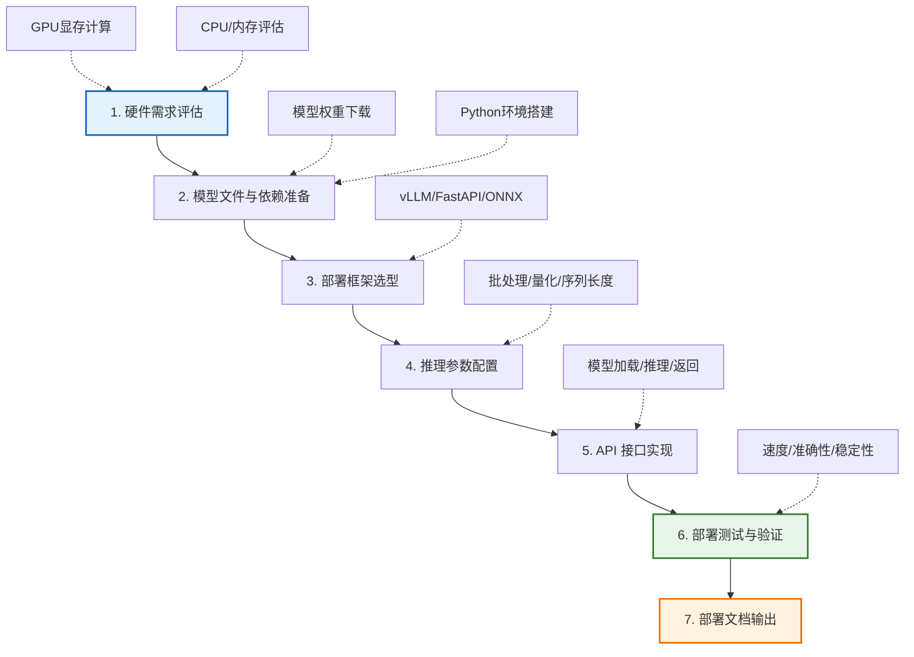
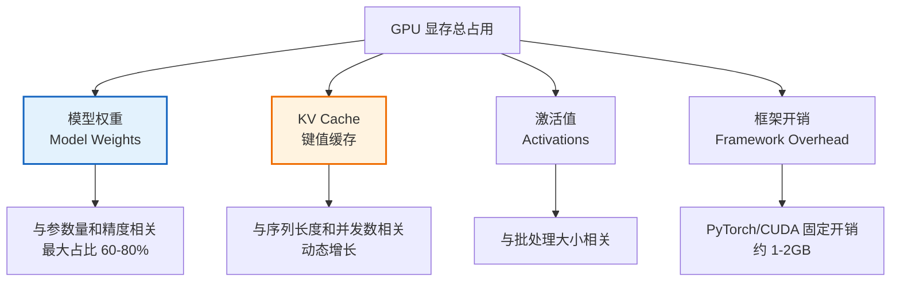
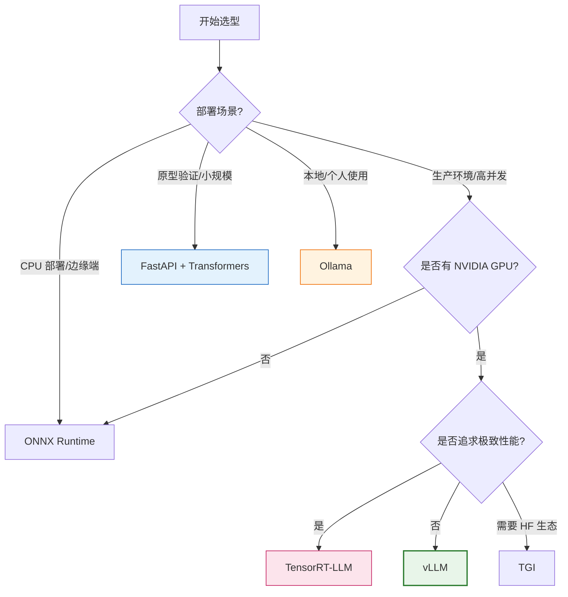
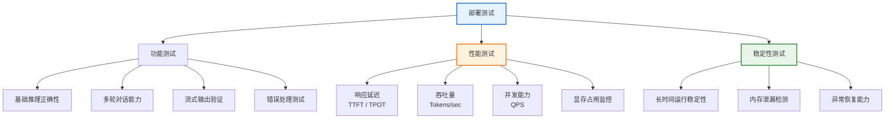
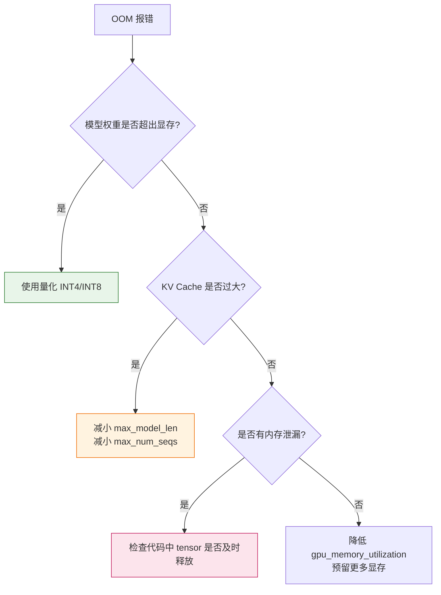

# 开源大模型部署与工程化完整指南

## 引言

随着 LLaMA、Qwen、ChatGLM、DeepSeek 等开源大语言模型的快速发展，在企业内部部署开源大模型已成为降低成本、保障数据隐私、实现定制化的关键路径。然而，大模型的部署远非"下载模型 + 调用 API"那么简单——它涉及硬件评估、环境配置、框架选型、推理优化、服务封装、测试验证等多个工程化环节。

本文以从零到一部署一个开源大模型为脉络，系统性地覆盖完整部署流程，提供可直接落地的技术方案与代码实现。

---

## 1. 部署流程总览



---

## 2. 第一步：硬件需求评估

### 2.1 GPU 显存计算（最关键指标）

GPU 显存是大模型部署的**第一瓶颈**。显存不足会导致 OOM（Out of Memory）错误，直接无法运行。

#### 2.1.1 显存占用构成



#### 2.1.2 模型权重显存计算公式

$$
\text{显存(GB)} = \frac{\text{参数量(十亿)} \times \text{每参数字节数}}{1024}
$$

| 精度格式 | 每参数字节数 | 7B 模型显存 | 13B 模型显存 | 70B 模型显存 |
| :--- | :--- | :--- | :--- | :--- |
| FP32（全精度） | 4 bytes | 28 GB | 52 GB | 280 GB |
| FP16/BF16（半精度） | 2 bytes | 14 GB | 26 GB | 140 GB |
| INT8（8位量化） | 1 byte | 7 GB | 13 GB | 70 GB |
| INT4（4位量化） | 0.5 bytes | 3.5 GB | 6.5 GB | 35 GB |

#### 2.1.3 KV Cache 显存计算

KV Cache 是自回归生成时缓存的历史键值对，随序列长度线性增长：

$$
\text{KV Cache} = 2 \times n_{\text{layers}} \times n_{\text{heads}} \times d_{\text{head}} \times \text{seq\_len} \times \text{batch\_size} \times \text{bytes\_per\_param}
$$

**经验估算**（FP16 精度）：

| 模型 | 序列长度 | 单请求 KV Cache | 10 并发 KV Cache |
| :--- | :--- | :--- | :--- |
| 7B (32层, 32头) | 2048 | ~1 GB | ~10 GB |
| 13B (40层, 40头) | 2048 | ~1.6 GB | ~16 GB |
| 70B (80层, 64头) | 2048 | ~5 GB | ~50 GB |

#### 2.1.4 总显存估算公式

$$
\text{总显存} = \text{模型权重} + \text{KV Cache} + \text{激活值} + \text{框架开销}
$$

**快速估算经验公式**：

$$
\text{总显存} \approx \text{模型权重} \times 1.2 + \text{KV Cache}
$$

### 2.2 硬件需求参考表

| 模型规模 | 精度 | 最小 GPU 配置 | 推荐 GPU 配置 | CPU | 内存 |
| :--- | :--- | :--- | :--- | :--- | :--- |
| 7B | INT4 | RTX 3060 12GB | RTX 4090 24GB | 8 核 | 16 GB |
| 7B | FP16 | RTX 3090 24GB | A10G 24GB | 8 核 | 32 GB |
| 13B | INT4 | RTX 3090 24GB | A100 40GB | 16 核 | 32 GB |
| 13B | FP16 | A100 40GB | A100 80GB | 16 核 | 64 GB |
| 70B | INT4 | 2×A100 40GB | 2×A100 80GB | 32 核 | 128 GB |
| 70B | FP16 | 4×A100 80GB | 8×A100 80GB | 64 核 | 256 GB |

### 2.3 评估检查脚本

```python
import torch

def check_gpu_requirements(model_params_billion, precision='fp16', 
                           max_seq_len=2048, max_batch_size=1):
    """评估 GPU 显存需求"""
    bytes_per_param = {'fp32': 4, 'fp16': 2, 'bf16': 2, 'int8': 1, 'int4': 0.5}
    bpp = bytes_per_param.get(precision, 2)
    
    # 模型权重
    weight_mem = model_params_billion * bpp  # GB
    
    # KV Cache（粗略估算）
    kv_cache_per_req = model_params_billion * 0.15 * (max_seq_len / 2048)  # GB
    total_kv = kv_cache_per_req * max_batch_size
    
    # 总显存（含 20% 开销）
    total_mem = (weight_mem + total_kv) * 1.2
    
    print(f"模型: {model_params_billion}B ({precision})")
    print(f"模型权重: {weight_mem:.1f} GB")
    print(f"KV Cache ({max_batch_size}并发, seq={max_seq_len}): {total_kv:.1f} GB")
    print(f"预计总显存需求: {total_mem:.1f} GB")
    
    # 检查当前 GPU
    if torch.cuda.is_available():
        gpu_mem = torch.cuda.get_device_properties(0).total_mem / 1024**3
        print(f"\n当前 GPU 显存: {gpu_mem:.1f} GB")
        if gpu_mem >= total_mem:
            print("✅ 显存满足要求")
        else:
            print(f"❌ 显存不足! 缺口: {total_mem - gpu_mem:.1f} GB")
    else:
        print("\n⚠️ 未检测到 GPU")
    
    return total_mem

# 示例：评估 Qwen-7B FP16 部署
check_gpu_requirements(7, 'fp16', max_seq_len=2048, max_batch_size=5)
```

---

## 3. 第二步：模型文件与依赖准备

### 3.1 模型权重下载

#### 3.1.1 主要模型来源

| 平台 | 适用模型 | 下载方式 |
| :--- | :--- | :--- |
| **Hugging Face Hub** | LLaMA, Mistral, Qwen 等 | `huggingface-cli` / `git lfs` |
| **ModelScope（魔搭）** | Qwen, ChatGLM 等（国内更快） | `modelscope` 库 |
| **官方 GitHub** | 部分模型官方发布 | `git clone` |

#### 3.1.2 下载示例

```bash
# 方式1: Hugging Face Hub（需安装 huggingface_hub）
pip install huggingface_hub

# 下载完整模型
huggingface-cli download Qwen/Qwen2.5-7B-Instruct \
    --local-dir ./models/qwen2.5-7b \
    --resume-download

# 方式2: ModelScope（国内推荐，速度更快）
pip install modelscope
modelscope download --model qwen/Qwen2.5-7B-Instruct \
    --local_dir ./models/qwen2.5-7b

# 方式3: 使用 Python 脚本下载（支持断点续传）
```

```python
from huggingface_hub import snapshot_download

# 下载模型到指定目录
model_path = snapshot_download(
    repo_id="Qwen/Qwen2.5-7B-Instruct",
    local_dir="./models/qwen2.5-7b",
    resume_download=True
)
print(f"模型已下载到: {model_path}")
```

### 3.2 Python 环境搭建

#### 3.2.1 使用 Conda 创建隔离环境

```bash
# 创建专用环境
conda create -n llm_deploy python=3.10 -y
conda activate llm_deploy

# 安装 PyTorch（根据 CUDA 版本选择）
# CUDA 12.1
pip install torch torchvision torchaudio --index-url https://download.pytorch.org/whl/cu121

# CUDA 11.8
pip install torch torchvision torchaudio --index-url https://download.pytorch.org/whl/cu118
```

#### 3.2.2 核心依赖安装

```bash
# 基础依赖
pip install transformers>=4.40.0
pip install accelerate          # 模型加载加速
pip install sentencepiece       # Tokenizer 依赖
pip install protobuf

# 推理优化（按需选择）
pip install vllm                # 高性能推理引擎
pip install bitsandbytes        # 量化支持
pip install flash-attn --no-build-isolation  # Flash Attention

# API 服务框架
pip install fastapi uvicorn     # FastAPI 服务
pip install sse-starlette       # 流式响应支持

# 监控与工具
pip install prometheus-client   # 指标监控
pip install loguru              # 日志管理
```

#### 3.2.3 requirements.txt 完整清单

```txt
# === 核心框架 ===
torch>=2.1.0
transformers>=4.40.0
accelerate>=0.27.0
sentencepiece>=0.1.99
protobuf>=4.25.0

# === 推理优化 ===
vllm>=0.4.0
bitsandbytes>=0.42.0
flash-attn>=2.5.0

# === API 服务 ===
fastapi>=0.104.0
uvicorn>=0.24.0
sse-starlette>=1.6.0
pydantic>=2.0.0

# === 监控与工具 ===
prometheus-client>=0.19.0
loguru>=0.7.0
python-dotenv>=1.0.0
```

### 3.3 环境验证

```python
# verify_env.py —— 环境验证脚本
import torch
import transformers

def verify_environment():
    print("=" * 50)
    print("环境验证报告")
    print("=" * 50)
    
    # PyTorch 与 CUDA
    print(f"PyTorch 版本: {torch.__version__}")
    print(f"CUDA 可用: {torch.cuda.is_available()}")
    if torch.cuda.is_available():
        print(f"CUDA 版本: {torch.version.cuda}")
        print(f"GPU 设备: {torch.cuda.get_device_name(0)}")
        gpu_mem = torch.cuda.get_device_properties(0).total_mem / 1024**3
        print(f"GPU 显存: {gpu_mem:.1f} GB")
    
    # Transformers
    print(f"Transformers 版本: {transformers.__version__}")
    
    # 可选依赖
    try:
        import vllm
        print(f"vLLM 版本: {vllm.__version__}")
    except ImportError:
        print("vLLM: 未安装")
    
    try:
        import bitsandbytes as bnb
        print(f"bitsandbytes 版本: {bnb.__version__}")
    except ImportError:
        print("bitsandbytes: 未安装")
    
    print("=" * 50)
    print("✅ 环境验证完成")

if __name__ == "__main__":
    verify_environment()
```

---

## 4. 第三步：部署框架选型

### 4.1 框架对比

| 框架 | 类型 | 优势 | 劣势 | 适用场景 |
| :--- | :--- | :--- | :--- | :--- |
| **vLLM** | 高性能推理引擎 | PagedAttention 极高吞吐；连续批处理；原生 API 服务 | 仅支持部分模型；显存占用略高 | **生产环境首选** |
| **Text Generation Inference (TGI)** | 推理服务引擎 | HuggingFace 官方；支持模型多；内置监控 | 部署较重；Docker 依赖 | HF 生态项目 |
| **FastAPI + Transformers** | 自定义 API | 灵活可控；易于定制；学习成本低 | 性能一般；无批处理优化 | 原型验证/小规模 |
| **ONNX Runtime** | 优化推理运行时 | 跨平台；CPU/GPU 通用；量化支持好 | 大模型支持有限；转换复杂 | CPU 部署/边缘端 |
| **TensorRT-LLM** | NVIDIA 优化引擎 | 极致 GPU 性能；FP8 支持 | 仅限 NVIDIA；配置复杂 | 极致性能需求 |
| **Ollama** | 一键部署工具 | 极简部署；自动量化；内置 API | 定制性差；性能非最优 | 快速验证/本地使用 |

### 4.2 选型决策树



### 4.3 推荐方案

**本文以两种主流方案为例**：
- **方案 A（推荐生产环境）**：vLLM —— 高性能，内置 API 服务
- **方案 B（灵活定制）**：FastAPI + Transformers —— 易于理解和定制

---

## 5. 第四步：推理参数配置

### 5.1 关键推理参数详解

| 参数 | 说明 | 推荐值 | 影响 |
| :--- | :--- | :--- | :--- |
| `dtype` | 模型精度 | `float16` / `bfloat16` | 显存占用与精度权衡 |
| `quantization` | 量化策略 | `awq` / `gptq` / `bitsandbytes` | 显存大幅降低，精度略降 |
| `max_model_len` | 最大序列长度 | 2048~8192 | KV Cache 显存线性增长 |
| `gpu_memory_utilization` | GPU 显存利用率 | 0.85~0.95 | 预留显存防止 OOM |
| `max_num_seqs` | 最大并发序列数 | 64~256 | 吞吐量与显存权衡 |
| `batch_size` | 批处理大小 | 8~32 | 吞吐量与延迟权衡 |
| `temperature` | 采样温度 | 0.7~0.9 | 输出随机性 |
| `top_p` | 核采样阈值 | 0.9~0.95 | 输出多样性控制 |
| `repetition_penalty` | 重复惩罚 | 1.05~1.2 | 防止重复生成 |

### 5.2 量化策略对比

| 量化方法 | 显存节省 | 精度损失 | 速度 | 实现难度 |
| :--- | :--- | :--- | :--- | :--- |
| **BF16/FP16（基线）** | 0% | 0% | 基准 | 低 |
| **INT8（bitsandbytes）** | 50% | 极小 | 略慢 | 低 |
| **INT4（bitsandbytes）** | 75% | 小 | 略慢 | 低 |
| **AWQ** | 75% | 很小 | 快 | 中 |
| **GPTQ** | 75% | 很小 | 快 | 中 |

### 5.3 配置文件示例

```python
# config.py —— 推理配置
from dataclasses import dataclass
from typing import Optional

@dataclass
class ModelConfig:
    """模型配置"""
    model_name_or_path: str = "./models/qwen2.5-7b"
    dtype: str = "bfloat16"              # 精度
    quantization: Optional[str] = None   # None / "awq" / "gptq" / "bitsandbytes"
    trust_remote_code: bool = True
    device_map: str = "auto"

@dataclass
class InferenceConfig:
    """推理配置"""
    max_model_len: int = 4096            # 最大序列长度
    gpu_memory_utilization: float = 0.90  # GPU 显存利用率
    max_num_seqs: int = 128              # 最大并发数
    tensor_parallel_size: int = 1        # 张量并行数（多 GPU）
    
    # 生成参数
    default_temperature: float = 0.7
    default_top_p: float = 0.9
    default_max_tokens: int = 1024
    default_repetition_penalty: float = 1.1

@dataclass
class APIConfig:
    """API 服务配置"""
    host: str = "0.0.0.0"
    port: int = 8000
    workers: int = 1                     # vLLM 推荐单 worker
    cors_origins: list = None
    
    def __post_init__(self):
        if self.cors_origins is None:
            self.cors_origins = ["*"]

# 全局配置实例
model_config = ModelConfig()
inference_config = InferenceConfig()
api_config = APIConfig()
```

---

## 6. 第五步：API 接口实现

### 6.1 方案 A：vLLM 部署（推荐生产环境）

#### 6.1.1 vLLM 内置 API 服务（最简方式）

```bash
# 一行命令启动 API 服务
python -m vllm.entrypoints.openai.api_server \
    --model ./models/qwen2.5-7b \
    --dtype bfloat16 \
    --max-model-len 4096 \
    --gpu-memory-utilization 0.90 \
    --max-num-seqs 128 \
    --host 0.0.0.0 \
    --port 8000
```

**优势**：兼容 OpenAI API 格式，客户端可直接复用 OpenAI SDK。

#### 6.1.2 vLLM Python API 自定义封装

```python
# vllm_server.py —— vLLM 自定义 API 服务
from vllm import LLM, SamplingParams
from fastapi import FastAPI
from fastapi.responses import StreamingResponse
from pydantic import BaseModel
from typing import Optional, List
import uvicorn

app = FastAPI(title="LLM Inference Server")

# 全局 LLM 实例（启动时加载）
llm = None

class ChatRequest(BaseModel):
    messages: List[dict]
    temperature: float = 0.7
    top_p: float = 0.9
    max_tokens: int = 1024

class ChatResponse(BaseModel):
    response: str
    usage: dict

@app.on_event("startup")
async def load_model():
    """启动时加载模型"""
    global llm
    print("正在加载模型...")
    llm = LLM(
        model="./models/qwen2.5-7b",
        dtype="bfloat16",
        max_model_len=4096,
        gpu_memory_utilization=0.90,
        max_num_seqs=128,
        trust_remote_code=True,
    )
    print("模型加载完成!")

@app.post("/v1/chat/completions", response_model=ChatResponse)
async def chat_completions(request: ChatRequest):
    """聊天补全接口"""
    # 构建提示词
    from transformers import AutoTokenizer
    tokenizer = AutoTokenizer.from_pretrained("./models/qwen2.5-7b")
    prompt = tokenizer.apply_chat_template(
        request.messages, tokenize=False, add_generation_prompt=True
    )
    
    # 配置采样参数
    sampling_params = SamplingParams(
        temperature=request.temperature,
        top_p=request.top_p,
        max_tokens=request.max_tokens,
    )
    
    # 推理
    outputs = llm.generate([prompt], sampling_params)
    response_text = outputs[0].outputs[0].text
    
    # 统计 Token 用量
    usage = {
        "prompt_tokens": len(outputs[0].prompt_token_ids),
        "completion_tokens": len(outputs[0].outputs[0].token_ids),
        "total_tokens": len(outputs[0].prompt_token_ids) + 
                        len(outputs[0].outputs[0].token_ids)
    }
    
    return ChatResponse(response=response_text, usage=usage)

@app.get("/health")
async def health_check():
    """健康检查"""
    return {"status": "healthy", "model_loaded": llm is not None}

if __name__ == "__main__":
    uvicorn.run(app, host="0.0.0.0", port=8000)
```

### 6.2 方案 B：FastAPI + Transformers 部署

#### 6.2.1 完整 API 实现

```python
# fastapi_server.py —— FastAPI + Transformers 部署
import torch
from fastapi import FastAPI, HTTPException
from fastapi.middleware.cors import CORSMiddleware
from fastapi.responses import StreamingResponse
from pydantic import BaseModel
from typing import Optional, List
from transformers import AutoModelForCausalLM, AutoTokenizer, TextIteratorStreamer
from threading import Thread
import uvicorn
import time
import logging

# 日志配置
logging.basicConfig(level=logging.INFO)
logger = logging.getLogger(__name__)

app = FastAPI(title="LLM Inference Server", version="1.0.0")

# CORS 配置
app.add_middleware(
    CORSMiddleware,
    allow_origins=["*"],
    allow_methods=["*"],
    allow_headers=["*"],
)

# ========== 数据模型 ==========
class Message(BaseModel):
    role: str
    content: str

class ChatRequest(BaseModel):
    messages: List[Message]
    temperature: Optional[float] = 0.7
    top_p: Optional[float] = 0.9
    max_tokens: Optional[int] = 1024
    stream: Optional[bool] = False

class ChatResponse(BaseModel):
    id: str
    model: str
    choices: List[dict]
    usage: dict

# ========== 全局模型实例 ==========
MODEL_PATH = "./models/qwen2.5-7b"
tokenizer = None
model = None

@app.on_event("startup")
async def load_model():
    """启动时加载模型"""
    global tokenizer, model
    logger.info(f"正在加载模型: {MODEL_PATH}")
    
    tokenizer = AutoTokenizer.from_pretrained(
        MODEL_PATH,
        trust_remote_code=True,
        padding_side="left"
    )
    
    model = AutoModelForCausalLM.from_pretrained(
        MODEL_PATH,
        torch_dtype=torch.bfloat16,
        device_map="auto",
        trust_remote_code=True,
    )
    
    model.eval()
    logger.info("模型加载完成!")

# ========== 核心接口 ==========
@app.post("/v1/chat/completions")
async def chat_completions(request: ChatRequest):
    """聊天补全接口（兼容 OpenAI 格式）"""
    if model is None:
        raise HTTPException(status_code=503, detail="模型尚未加载完成")
    
    # 构建输入
    messages = [{"role": m.role, "content": m.content} for m in request.messages]
    input_text = tokenizer.apply_chat_template(
        messages, tokenize=False, add_generation_prompt=True
    )
    inputs = tokenizer(input_text, return_tensors="pt").to(model.device)
    input_length = inputs["input_ids"].shape[1]
    
    if request.stream:
        return StreamingResponse(
            stream_generate(request, inputs, input_length),
            media_type="text/event-stream"
        )
    
    # 非流式生成
    start_time = time.time()
    with torch.no_grad():
        outputs = model.generate(
            **inputs,
            max_new_tokens=request.max_tokens,
            temperature=request.temperature,
            top_p=request.top_p,
            do_sample=request.temperature > 0,
            pad_token_id=tokenizer.eos_token_id,
        )
    
    # 提取生成部分
    generated_ids = outputs[0][input_length:]
    response_text = tokenizer.decode(generated_ids, skip_special_tokens=True)
    
    generation_time = time.time() - start_time
    output_tokens = len(generated_ids)
    
    return {
        "id": f"chatcmpl-{int(time.time())}",
        "model": "qwen2.5-7b",
        "choices": [{
            "index": 0,
            "message": {"role": "assistant", "content": response_text},
            "finish_reason": "stop"
        }],
        "usage": {
            "prompt_tokens": input_length,
            "completion_tokens": output_tokens,
            "total_tokens": input_length + output_tokens,
        },
        "timing": {
            "generation_time_sec": round(generation_time, 3),
            "tokens_per_second": round(output_tokens / generation_time, 1)
        }
    }

async def stream_generate(request, inputs, input_length):
    """流式生成"""
    streamer = TextIteratorStreamer(
        tokenizer, skip_prompt=True, skip_special_tokens=True
    )
    
    generation_kwargs = {
        **inputs,
        "max_new_tokens": request.max_tokens,
        "temperature": request.temperature,
        "top_p": request.top_p,
        "do_sample": request.temperature > 0,
        "pad_token_id": tokenizer.eos_token_id,
        "streamer": streamer,
    }
    
    # 后台线程生成
    thread = Thread(target=model.generate, kwargs=generation_kwargs)
    thread.start()
    
    # 流式返回
    for text in streamer:
        if text:
            yield f"data: {text}\n\n"
    
    yield "data: [DONE]\n\n"
    thread.join()

@app.get("/health")
async def health_check():
    """健康检查"""
    return {
        "status": "healthy",
        "model_loaded": model is not None,
        "gpu_available": torch.cuda.is_available(),
        "gpu_memory_allocated": f"{torch.cuda.memory_allocated()/1024**3:.2f} GB"
            if torch.cuda.is_available() else "N/A",
    }

@app.get("/v1/models")
async def list_models():
    """列出可用模型"""
    return {
        "object": "list",
        "data": [{"id": "qwen2.5-7b", "object": "model"}]
    }

if __name__ == "__main__":
    uvicorn.run(
        "fastapi_server:app",
        host="0.0.0.0",
        port=8000,
        workers=1,  # 大模型推理建议单 worker
        log_level="info"
    )
```

### 6.3 Docker 容器化部署

#### 6.3.1 Dockerfile

```dockerfile
# Dockerfile
FROM nvidia/cuda:12.1.0-runtime-ubuntu22.04

# 环境变量
ENV PYTHONUNBUFFERED=1 \
    DEBIAN_FRONTEND=noninteractive \
    PIP_NO_CACHE_DIR=1

# 安装系统依赖
RUN apt-get update && apt-get install -y \
    python3.10 python3-pip git curl \
    && rm -rf /var/lib/apt/lists/*

# 创建工作目录
WORKDIR /app

# 安装 Python 依赖
COPY requirements.txt .
RUN pip install --upgrade pip && \
    pip install -r requirements.txt

# 复制应用代码
COPY . .

# 模型文件通过 Volume 挂载（避免镜像过大）
# docker run -v /path/to/models:/app/models ...

EXPOSE 8000

# 健康检查
HEALTHCHECK --interval=30s --timeout=10s --retries=3 \
    CMD curl -f http://localhost:8000/health || exit 1

CMD ["python", "fastapi_server.py"]
```

#### 6.3.2 docker-compose.yml

```yaml
# docker-compose.yml
version: '3.8'

services:
  llm-server:
    build: .
    container_name: llm-inference-server
    ports:
      - "8000:8000"
    volumes:
      - ./models:/app/models:ro        # 模型文件挂载
      - ./logs:/app/logs               # 日志挂载
    environment:
      - MODEL_PATH=/app/models/qwen2.5-7b
      - CUDA_VISIBLE_DEVICES=0
    deploy:
      resources:
        reservations:
          devices:
            - driver: nvidia
              count: 1
              capabilities: [gpu]
    restart: unless-stopped
    healthcheck:
      test: ["CMD", "curl", "-f", "http://localhost:8000/health"]
      interval: 30s
      timeout: 10s
      retries: 3
```

```bash
# 启动服务
docker-compose up -d

# 查看日志
docker-compose logs -f llm-server

# 停止服务
docker-compose down
```

---

## 7. 第六步：部署测试与验证

### 7.1 测试体系



### 7.2 功能测试脚本

```python
# test_functional.py —— 功能测试
import requests
import json

BASE_URL = "http://localhost:8000"

def test_basic_chat():
    """测试基础对话"""
    response = requests.post(f"{BASE_URL}/v1/chat/completions", json={
        "messages": [
            {"role": "user", "content": "请用一句话介绍机器学习。"}
        ],
        "temperature": 0.7,
        "max_tokens": 100
    })
    assert response.status_code == 200
    result = response.json()
    assert "choices" in result
    assert len(result["choices"][0]["message"]["content"]) > 0
    print("✅ 基础对话测试通过")
    print(f"   回复: {result['choices'][0]['message']['content'][:80]}...")

def test_multi_turn():
    """测试多轮对话"""
    messages = [
        {"role": "user", "content": "1+1等于几？"},
    ]
    # 第一轮
    r1 = requests.post(f"{BASE_URL}/v1/chat/completions", 
                       json={"messages": messages, "max_tokens": 50})
    assistant_msg = r1.json()["choices"][0]["message"]
    messages.append(assistant_msg)
    
    # 第二轮（依赖上下文）
    messages.append({"role": "user", "content": "再加上2呢？"})
    r2 = requests.post(f"{BASE_URL}/v1/chat/completions",
                       json={"messages": messages, "max_tokens": 50})
    reply = r2.json()["choices"][0]["message"]["content"]
    print(f"✅ 多轮对话测试通过，回复: {reply}")

def test_streaming():
    """测试流式输出"""
    response = requests.post(f"{BASE_URL}/v1/chat/completions", json={
        "messages": [{"role": "user", "content": "讲一个短故事"}],
        "stream": True,
        "max_tokens": 200
    }, stream=True)
    
    chunks = []
    for line in response.iter_lines():
        if line:
            chunks.append(line.decode())
    
    assert len(chunks) > 1, "流式响应应有多个 chunk"
    print(f"✅ 流式输出测试通过，共 {len(chunks)} 个 chunk")

def test_error_handling():
    """测试错误处理"""
    # 空消息
    r = requests.post(f"{BASE_URL}/v1/chat/completions", json={"messages": []})
    assert r.status_code in [400, 422]
    print("✅ 错误处理测试通过")

if __name__ == "__main__":
    test_basic_chat()
    test_multi_turn()
    test_streaming()
    test_error_handling()
    print("\n🎉 所有功能测试通过!")
```

### 7.3 性能测试脚本

```python
# test_performance.py —— 性能测试
import requests
import time
import concurrent.futures
import statistics

BASE_URL = "http://localhost:8000"

def single_request():
    """单次请求，返回延迟"""
    start = time.time()
    response = requests.post(f"{BASE_URL}/v1/chat/completions", json={
        "messages": [{"role": "user", "content": "解释什么是深度学习"}],
        "max_tokens": 200,
        "temperature": 0.7
    })
    elapsed = time.time() - start
    
    result = response.json()
    output_tokens = result["usage"]["completion_tokens"]
    tps = output_tokens / elapsed  # Tokens per second
    
    return {
        "latency": elapsed,
        "output_tokens": output_tokens,
        "tokens_per_second": tps
    }

def test_latency(n=20):
    """延迟测试"""
    print(f"延迟测试 ({n} 次请求)...")
    results = [single_request() for _ in range(n)]
    
    latencies = [r["latency"] for r in results]
    tps_list = [r["tokens_per_second"] for r in results]
    
    print(f"  平均延迟: {statistics.mean(latencies):.3f}s")
    print(f"  P50 延迟: {statistics.median(latencies):.3f}s")
    print(f"  P95 延迟: {sorted(latencies)[int(n*0.95)]:.3f}s")
    print(f"  平均吞吐: {statistics.mean(tps_list):.1f} tokens/s")

def test_concurrency(concurrent_users=10):
    """并发测试"""
    print(f"\n并发测试 ({concurrent_users} 并发)...")
    with concurrent.futures.ThreadPoolExecutor(max_workers=concurrent_users) as executor:
        futures = [executor.submit(single_request) for _ in range(concurrent_users)]
        results = [f.result() for f in futures]
    
    total_time = max(r["latency"] for r in results)
    total_tokens = sum(r["output_tokens"] for r in results)
    overall_tps = total_tokens / total_time
    
    print(f"  总耗时: {total_time:.3f}s")
    print(f"  总 Token: {total_tokens}")
    print(f"  整体吞吐: {overall_tps:.1f} tokens/s")
    print(f"  平均单请求延迟: {statistics.mean(r['latency'] for r in results):.3f}s")

if __name__ == "__main__":
    test_latency(n=20)
    test_concurrency(concurrent_users=10)
```

### 7.4 性能指标参考

| 指标 | 含义 | 7B 模型参考值 | 优秀标准 |
| :--- | :--- | :--- | :--- |
| **TTFT** | 首 Token 延迟 | 200~500ms | <200ms |
| **TPOT** | 每 Token 生成时间 | 20~40ms | <20ms |
| **TPS（单请求）** | 单请求吞吐量 | 25~50 tokens/s | >50 tokens/s |
| **并发 TPS** | 多并发总吞吐量 | 200~500 tokens/s | >500 tokens/s |
| **显存利用率** | GPU 显存使用率 | 80~95% | 稳定无 OOM |

### 7.5 稳定性测试

```bash
# 持续压力测试（使用 Apache Bench）
ab -n 1000 -c 10 -p request.json -T application/json \
   http://localhost:8000/v1/chat/completions

# 或使用 locust 进行复杂场景压测
pip install locust
locust -f locustfile.py --host=http://localhost:8000
```

```python
# locustfile.py —— 压力测试
from locust import HttpUser, task, between

class LLMUser(HttpUser):
    wait_time = between(1, 3)
    
    @task
    def chat(self):
        self.client.post("/v1/chat/completions", json={
            "messages": [{"role": "user", "content": "解释量子计算的基本原理"}],
            "max_tokens": 200,
            "temperature": 0.7
        })
```

---

## 8. 部署文档与常见问题

### 8.1 部署文档模板

```markdown
# 大模型部署文档

## 环境信息
- **模型**: Qwen2.5-7B-Instruct
- **GPU**: NVIDIA A10G 24GB × 1
- **CUDA**: 12.1
- **Python**: 3.10
- **部署框架**: vLLM 0.4.0

## 启动步骤
1. 激活环境: `conda activate llm_deploy`
2. 启动服务: `python -m vllm.entrypoints.openai.api_server --model ./models/qwen2.5-7b ...`
3. 验证: `curl http://localhost:8000/health`

## API 使用示例
(见 7.2 节测试脚本)

## 监控指标
- GPU 显存: `nvidia-smi`
- 服务健康: `GET /health`
- 请求统计: Prometheus + Grafana
```

### 8.2 常见问题与解决方案

| 问题 | 原因 | 解决方案 |
| :--- | :--- | :--- |
| **OOM (Out of Memory)** | 显存不足 | 降低 `max_model_len`；使用量化（INT4/INT8）；减小 `gpu_memory_utilization` |
| **加载速度慢** | 模型从磁盘加载 | 使用 SSD 存储；预先加载到内存 |
| **推理速度慢** | 无批处理/无优化 | 使用 vLLM；启用 Flash Attention；调整 batch size |
| **生成重复内容** | 采样参数不当 | 调高 `repetition_penalty`（1.1~1.2）；调整 `temperature` |
| **中文乱码** | Tokenizer 问题 | 确认 `trust_remote_code=True`；检查模型是否支持中文 |
| **CUDA 版本不匹配** | PyTorch 与 CUDA 版本冲突 | 重新安装匹配版本的 PyTorch |
| **并发时延迟剧增** | 无连续批处理 | 使用 vLLM 的连续批处理功能 |
| **模型输出截断** | `max_tokens` 过小 | 增大 `max_tokens`；检查 `max_model_len` 是否足够 |

### 8.3 OOM 排查流程



---

## 9. 总结

开源大模型的工程化部署是一个系统性的工程，核心要点如下：

1. **硬件评估先行**：精确计算显存需求（模型权重 + KV Cache + 开销），避免部署时 OOM。
2. **框架选型决定上限**：vLLM 是生产环境首选，FastAPI 适合原型验证，Ollama 适合本地使用。
3. **量化是降本关键**：INT4 量化可将显存需求降低 75%，是消费级 GPU 部署大模型的关键技术。
4. **API 兼容 OpenAI 格式**：降低客户端迁移成本，便于生态复用。
5. **测试验证不可省**：功能、性能、稳定性三维测试，确保服务可靠上线。
6. **容器化部署是标准实践**：Docker + docker-compose 实现环境一致性与便捷运维。

通过本文的完整流程，读者可以从零开始部署一个生产可用的开源大模型推理服务，并根据实际需求进行优化和扩展。
