# Ollama 工作原理深度解析与工程化实践

> **文档定位**:本文档系统解析 **Ollama** 这一轻量级本地大模型运行时的**内部工作原理**,从架构设计、模型加载、推理机制、资源管理、组件交互到外部集成,逐层拆解 Ollama 如何在本地高效运行大语言模型。区别于 [1开源大模型部署与工程化完整指南.md](./1开源大模型部署与工程化完整指南.md) 侧重"通用部署流程",本文聚焦 Ollama 这一具体工具的**黑盒拆解与工程化应用**,为在本地/边缘/私有云环境部署大模型提供深度技术参考。
>
> **阅读建议**:本文是"模型部署与工程化"系列的原理解析篇,建议结合 [1开源大模型部署与工程化完整指南.md](./1开源大模型部署与工程化完整指南.md) 一并阅读——前者回答"如何部署",本文回答"Ollama 为何能这样部署、内部如何运转"。
>
> **适用读者**:需要在本地部署 LLM 的工程师、希望理解 Ollama 内部机制的架构师、评估 Ollama 用于生产环境的决策者。

---

## 目录

- [一、Ollama 概述与定位](#一ollama-概述与定位)
- [二、整体架构设计](#二整体架构设计)
- [三、核心组件深度解析](#三核心组件深度解析)
- [四、模型加载机制](#四模型加载机制)
- [五、推理过程与执行引擎](#五推理过程与执行引擎)
- [六、数据处理流程](#六数据处理流程)
- [七、资源管理策略](#七资源管理策略)
- [八、Modelfile 与模型配置体系](#八modelfile-与模型配置体系)
- [九、API 层与外部系统集成](#九api-层与外部系统集成)
- [十、并发与性能机制](#十并发与性能机制)
- [十一、工程化部署实践](#十一工程化部署实践)
- [十二、监控与运维](#十二监控与运维)
- [十三、与同类方案对比](#十三与同类方案对比)
- [十四、最佳实践与避坑指南](#十四最佳实践与避坑指南)
- [十五、总结与展望](#十五总结与展望)

---

## 一、Ollama 概述与定位

### 1.1 什么是 Ollama

**Ollama** 是一个开源的、轻量级的**本地大语言模型运行时(Runtime)**,它将复杂的大模型部署流程封装为极简的命令行体验——`ollama run llama3` 一行命令即可在本地运行 LLM。其核心价值在于:把"下载模型、管理依赖、配置推理引擎、暴露 API"这套繁琐流程,简化为类似 Docker 的使用体验。

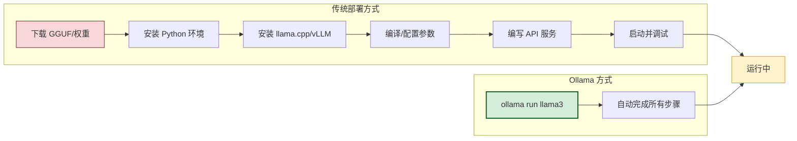

### 1.2 核心定位

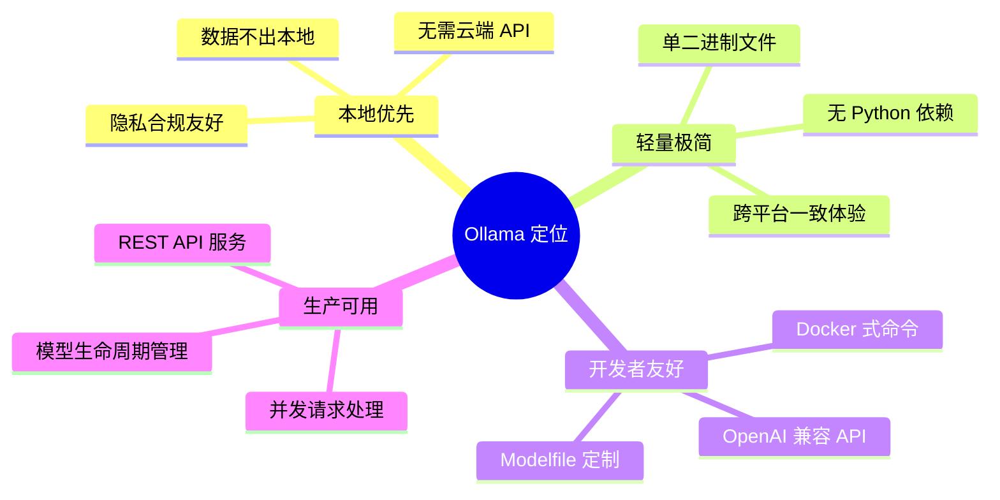

| 维度 | Ollama 的定位 | 说明 |
|------|-------------|------|
| **部署形态** | 本地/边缘/私有云 | 不依赖外部云服务,数据本地闭环 |
| **目标用户** | 开发者与运维者 | 命令行 + API 双模式 |
| **核心能力** | 模型运行时 | 非训练框架,专注推理服务 |
| **底层引擎** | llama.cpp | C/C++ 高性能推理,跨平台 |
| **模型格式** | GGUF | 量化压缩,单文件分发 |
| **API 兼容** | OpenAI 兼容 | 可直接替换 OpenAI 客户端 |

### 1.3 与传统部署的本质区别

| 维度 | 传统部署(vLLM/Transformers) | Ollama | 工程意义 |
|------|---------------------------|--------|---------|
| **运行时依赖** | Python + PyTorch + CUDA | 单个静态二进制 | 部署极简,无依赖地狱 |
| **模型管理** | 手动下载与路径管理 | 内置 registry + 自动拉取 | 类 Docker 体验 |
| **配置方式** | YAML/代码参数 | Modelfile(类 Dockerfile) | 声明式可复现 |
| **服务化** | 需自行封装 FastAPI | 内置 REST API 服务 | 开箱即用 |
| **并发处理** | 需自行实现队列 | 内置请求调度 | 生产可用 |
| **量化支持** | 需手动转换 | 内置多种量化 | 即拉即用 |

> **关键认知**:Ollama 的设计哲学是"**把大模型当作容器镜像来管理**"——`ollama pull` 如同 `docker pull`,`ollama run` 如同 `docker run`,Modelfile 如同 Dockerfile。这种"容器化思维"是理解 Ollama 架构的钥匙。

---

## 二、整体架构设计

### 2.1 架构全景

Ollama 采用**客户端-服务端(Client-Server)** 架构,核心由三大层次构成:

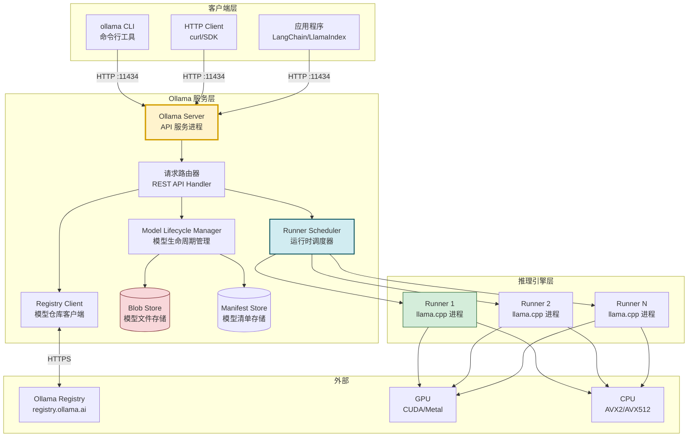

### 2.2 三大核心层次职责

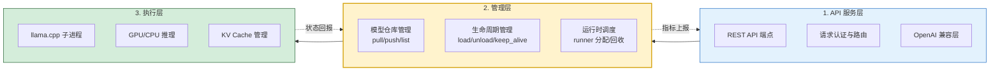

| 层次 | 组件 | 职责 | 技术实现 |
|------|------|------|---------|
| **API 服务层** | Ollama Server | 接收 HTTP 请求,路由到处理逻辑 | Go 语言,net/http |
| **管理层** | Lifecycle Manager | 管理模型加载/卸载/保活 | Go 语言,内存状态机 |
| **管理层** | Runner Scheduler | 调度推理子进程 | Go + Unix Socket |
| **执行层** | llama.cpp Runner | 执行实际推理 | C/C++,CGo 绑定 |
| **存储层** | Blob/Manifest Store | 存储模型文件与清单 | 本地文件系统 |

### 2.3 进程模型

Ollama 运行时涉及**一个主服务进程 + N 个推理子进程**:

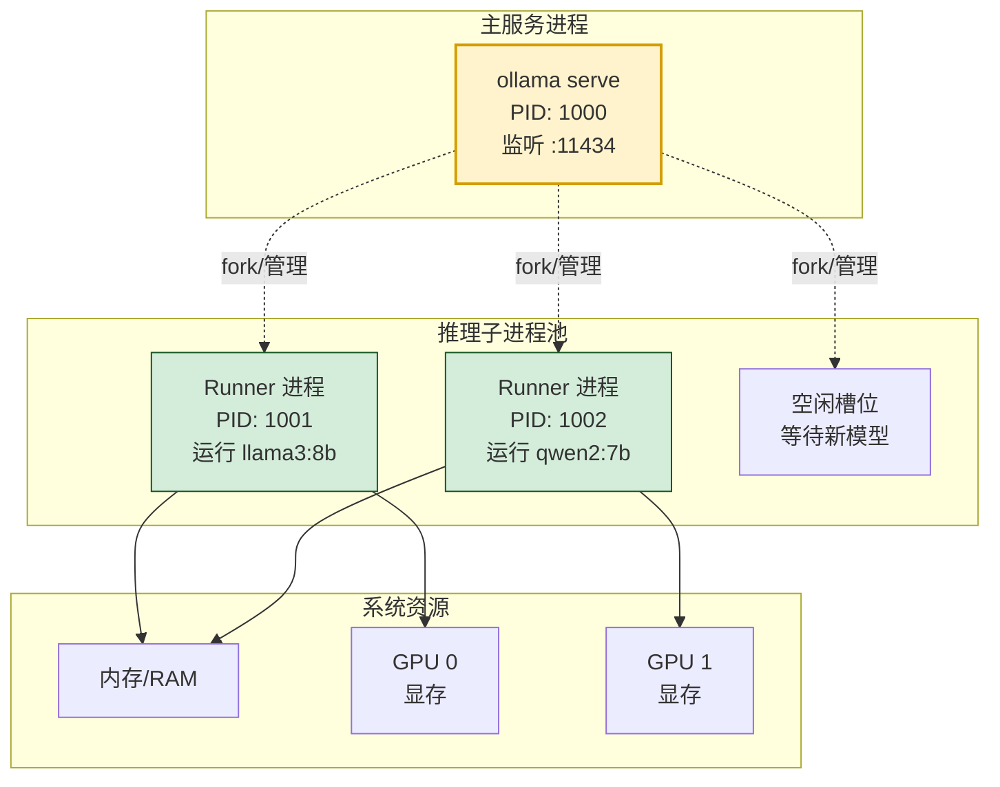

**关键设计**:
- **主服务进程**常驻,负责 API 接收、模型管理、子进程调度
- **推理子进程**按需启动,每个子进程加载一个模型实例
- **进程隔离**:模型崩溃不影响主服务,主服务可重启子进程
- **通信方式**:主进程与子进程通过 **Unix Domain Socket** 通信(低开销)

> **工程意义**:这种"主进程 + 工作进程"的模型,与 Gunicorn 的"Master + Worker"异曲同工——主进程负责调度,工作进程执行实际推理,实现故障隔离与资源管控。

---

## 三、核心组件深度解析

### 3.1 组件交互全景

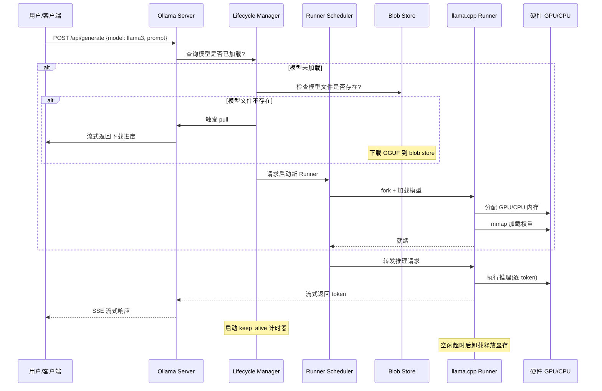

### 3.2 API Server(HTTP 服务)

**职责**:接收外部 HTTP 请求,路由到对应处理器,返回响应。

```go
// Ollama Server 的核心路由简化示意
// 实际源码位于 server/routes.go

func (s *Server) GenerateHandler(c *gin.Context) {
    var req GenerateRequest
    if err := c.ShouldBindJSON(&req); err != nil {
        c.JSON(400, gin.H{"error": err.Error()})
        return
    }
    
    // 1. 获取或加载模型
    runner, err := s.lifecycle.AcquireRunner(req.Model)
    if err != nil {
        c.JSON(500, gin.H{"error": err.Error()})
        return
    }
    
    // 2. 设置 SSE 流式响应
    c.Header("Content-Type", "application/x-ndjson")
    
    // 3. 调用推理
    ch := runner.Generate(c.Request.Context(), req.Prompt, req.Options)
    for token := range ch {
        c.JSON(200, token)  // 逐 token 流式返回
        c.Writer.Flush()
    }
}
```

**核心 API 端点**:

| 端点 | 方法 | 功能 | 类比 |
|------|------|------|------|
| `/api/generate` | POST | 文本生成(单轮) | OpenAI `/v1/completions` |
| `/api/chat` | POST | 对话生成(多轮) | OpenAI `/v1/chat/completions` |
| `/api/embeddings` | POST | 生成向量嵌入 | OpenAI `/v1/embeddings` |
| `/api/pull` | POST | 拉取模型 | `docker pull` |
| `/api/push` | POST | 推送模型 | `docker push` |
| `/api/tags` | GET | 列出本地模型 | `docker images` |
| `/api/show` | POST | 查看模型信息 | `docker inspect` |
| `/api/delete` | DELETE | 删除模型 | `docker rmi` |
| `/api/ps` | GET | 列出运行中模型 | `docker ps` |

### 3.3 Lifecycle Manager(生命周期管理器)

**职责**:管理模型从"未加载 → 加载中 → 就绪 → 运行中 → 空闲 → 卸载"的完整状态机。

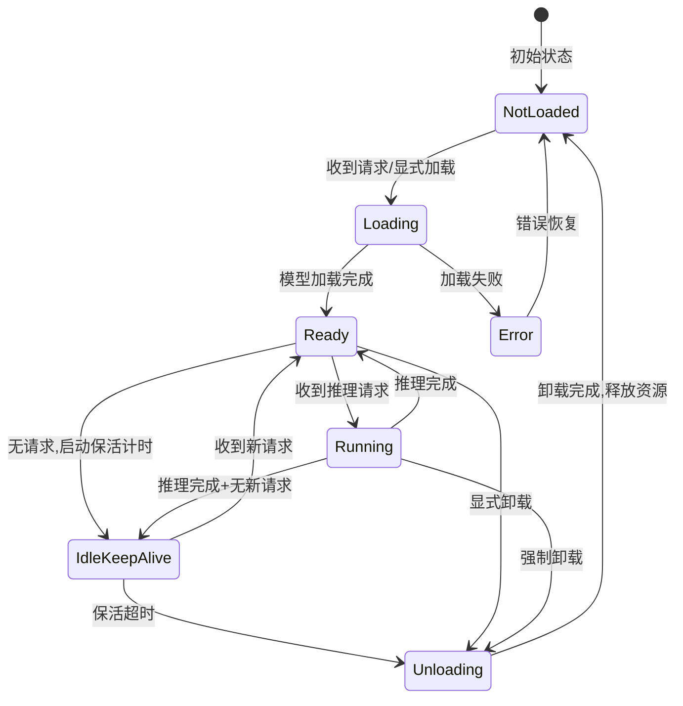

**关键参数 `keep_alive`**:

```python
# keep_alive 控制模型在内存中的保活时间
# 这是 Ollama 资源管理的核心机制

# 请求级别指定
response = requests.post("http://localhost:11434/api/generate", json={
    "model": "llama3",
    "prompt": "你好",
    "keep_alive": "5m"    # 本次请求后保活 5 分钟
})

# 全局默认 keep_alive = 5 分钟
# 设为 0 则请求后立即卸载(省内存,但下次请求需重新加载)
# 设为 -1 则永久保活(不卸载,响应快但常驻显存)
```

| keep_alive 值 | 行为 | 适用场景 | 显存占用 |
|:-------------:|------|---------|:--------:|
| `"5m"`(默认) | 空闲 5 分钟后卸载 | 通用场景,平衡响应与资源 | 中 |
| `"30m"` | 空闲 30 分钟后卸载 | 高频使用时段 | 较高 |
| `"-1"` | 永不卸载 | 生产高并发,响应优先 | 高(常驻) |
| `"0"` | 请求后立即卸载 | 显存紧张,多模型轮换 | 低 |
| `"10s"` | 短保活 | 低频调用 | 低 |

### 3.4 Runner Scheduler(运行时调度器)

**职责**:管理推理子进程池,负责子进程的创建、分配、回收与故障重启。

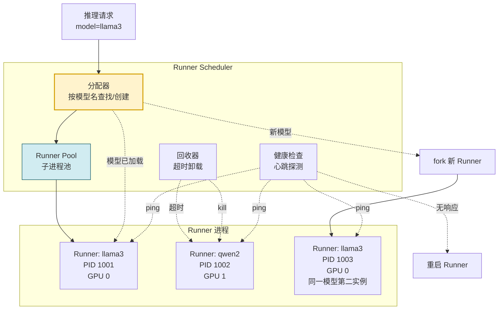

**调度策略要点**:
1. **模型复用**:同一模型的多个请求复用同一 Runner(串行)或启动多实例(并行)
2. **显存感知**:启动新 Runner 前检查 GPU 显存是否充足
3. **优雅降级**:GPU 显存不足时,自动回退到 CPU 推理
4. **故障恢复**:Runner 崩溃后,主进程自动重启并重新加载模型

### 3.5 Blob Store(模型文件存储)

**职责**:以内容寻址(Content-Addressable)方式存储模型文件,类似 Docker 的镜像层存储。

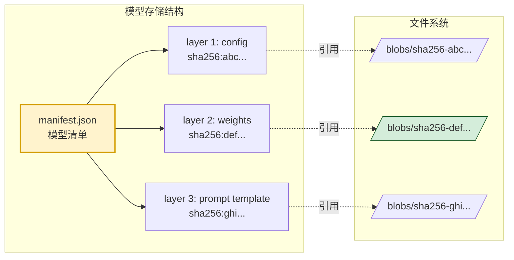

**存储路径**(默认):
- **Linux**: `~/.ollama/models/`
- **macOS**: `~/.ollama/models/`
- **Windows**: `C:\Users\<user>\.ollama\models\`

```bash
# 目录结构示例
~/.ollama/models/
├── manifests/
│   └── registry.ollama.ai/
│       └── library/
│           └── llama3/
│               └── latest          # manifest 清单文件
└── blobs/
    ├── sha256-abc123...            # 模型权重(GGUF)
    ├── sha256-def456...            # 配置参数
    └── sha256-ghi789...            # prompt 模板
```

**内容寻址的优势**:
- **去重**:相同层(如相同量化权重)只存一份,多模型共享
- **完整性校验**:SHA256 校验,防篡改防损坏
- **增量更新**:模型更新只需下载变化的层

---

## 四、模型加载机制

### 4.1 模型加载全流程

模型加载是 Ollama 最核心的工程机制之一,直接决定了启动速度与资源占用:

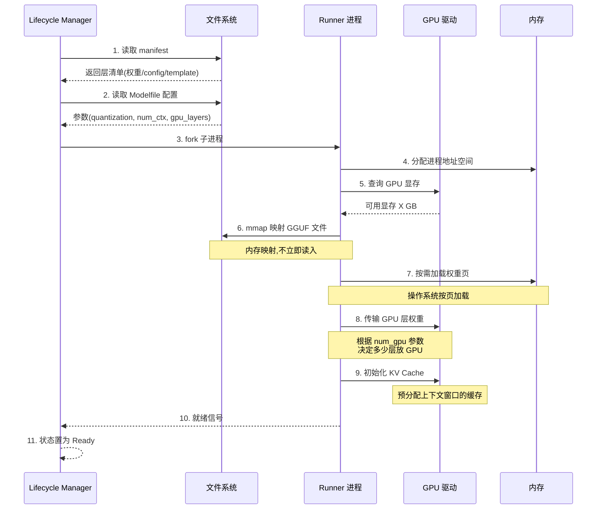

### 4.2 GGUF 格式解析

**GGUF(GPT-Generated Unified Format)** 是 Ollama 的核心模型格式,由 llama.cpp 社区推动,取代旧的 GGML 格式:

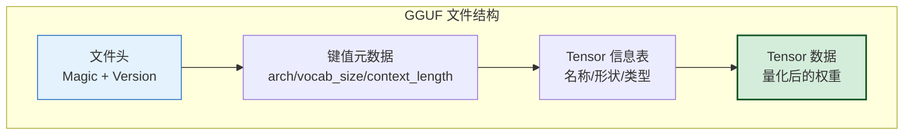

**GGUF 关键特性**:

| 特性 | 说明 | 工程价值 |
|------|------|---------|
| **单文件分发** | 权重+词表+配置合一 | 简化分发,一个 .gguf 文件即可 |
| **量化内置** | 支持 Q4_0/Q4_K_M/Q5_K_M/Q8_0 等 | 文件即已量化,加载即用 |
| **元数据自描述** | 内含架构、上下文长度等信息 | 运行时无需额外配置 |
| **大端序存储** | 跨平台一致 | x86/ARM 通用 |
| **mmap 友好** | 设计为可内存映射加载 | 按需加载,启动快 |

**常见量化类型对比**:

| 量化类型 | 每参数比特 | 7B 模型大小 | 质量损失 | 推荐场景 |
|---------|:---------:|:----------:|:--------:|---------|
| F16(半精度) | 16 bit | 13 GB | 无 | 质量优先,显存充足 |
| Q8_0 | 8 bit | 7 GB | 极小(<1%) | 质量与体积平衡 |
| Q5_K_M | 5 bit | 4.8 GB | 很小(~2%) | **推荐默认** |
| Q4_K_M | 4 bit | 4.1 GB | 小(~3%) | 显存有限,普及度高 |
| Q4_0 | 4 bit | 3.8 GB | 中(~5%) | 最小体积,质量略降 |

### 4.3 内存映射加载(Memory-Mapped Loading)

Ollama/llama.cpp 的**核心加速机制**之一是使用 `mmap` 加载模型权重:

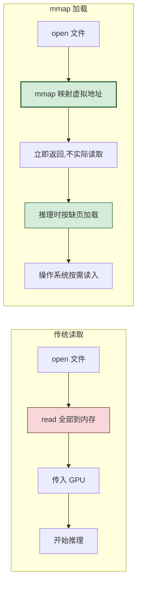

**mmap 加载的四大优势**:

```python
# mmap 加载的原理示意(简化)
import mmap

# 传统方式:全部读入内存
with open("llama3-8b.gguf", "rb") as f:
    weights = f.read()  # 阻塞,等待全部 4GB 读入
    # 问题:启动慢,内存占用大

# mmap 方式:虚拟地址映射
with open("llama3-8b.gguf", "rb") as f:
    mm = mmap.mmap(f.fileno(), 0, prot=mmap.PROT_READ)
    # 立即返回!虚拟地址已映射,但物理内存未分配
    # 当访问 mm[offset] 时,触发缺页中断,OS 才读入对应页
    # 优势 1: 启动快(无需等待全量读取)
    # 优势 2: 内存按需(只加载用到的部分)
    # 优势 3: 多进程共享(同一文件映射可被多个进程共享,只读)
    # 优势 4: 内核页缓存(OS 自动缓存热数据)
```

| 优势 | 原理 | 工程价值 |
|------|------|---------|
| **启动快** | 映射不读取,立即可用 | 模型"加载"近乎瞬时 |
| **按需加载** | 缺页中断时才读入 | 内存占用 = 实际访问页 |
| **多进程共享** | 只读映射可共享物理页 | 多 Runner 共享同模型,内存不翻倍 |
| **内核缓存** | OS 页缓存自动热数据 | 二次加载极快 |

### 4.4 GPU/CPU 混合加载

Ollama 支持**层卸载(Layer Offload)** 策略——将模型的部分层放 GPU,部分层留 CPU:

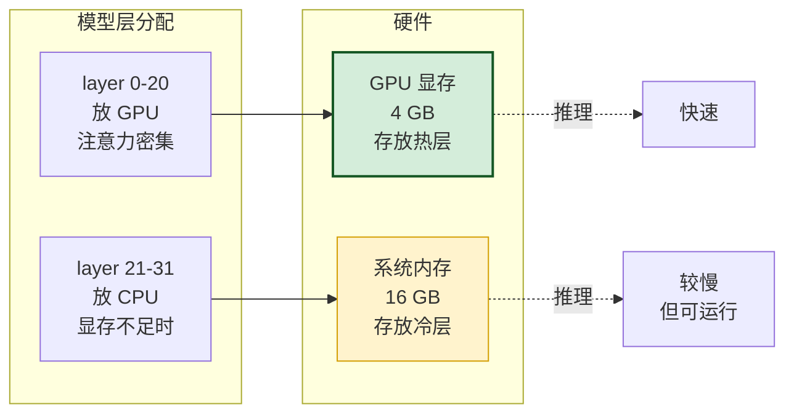

**自动分配策略**:

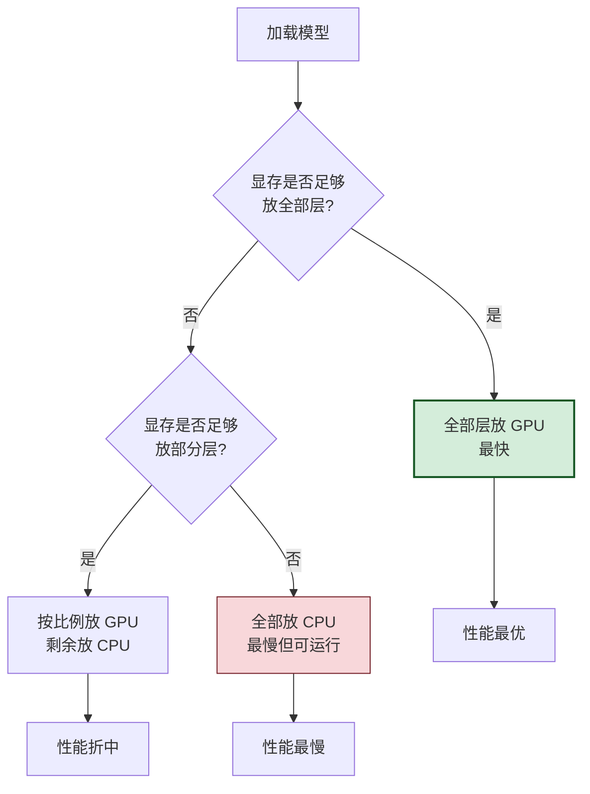

> **工程要点**:Ollama 默认**自动检测**GPU 显存并智能分配。可通过 `OLLAMA_NUM_GPU` 环境变量或 Modelfile 的 `num_gpu` 参数手动控制放 GPU 的层数。显存不足时**自动回退**到 CPU,这是 Ollama"开箱即用"的关键设计。

---

## 五、推理过程与执行引擎

### 5.1 推理引擎:llama.cpp

Ollama 的推理核心是 **llama.cpp**——一个纯 C/C++ 实现的 LLM 推理库:

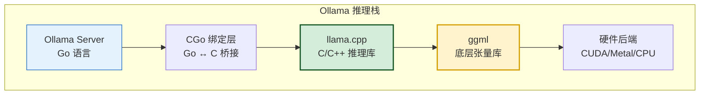

**llama.cpp 的核心价值**:

| 特性 | 说明 | 对 Ollama 的意义 |
|------|------|-----------------|
| **纯 C/C++** | 无 Python/PyTorch 依赖 | 单二进制部署,无依赖地狱 |
| **多后端** | CUDA/Metal/Vulkan/ROCm/CPU | 跨平台跨硬件统一运行时 |
| **量化推理** | 运行时反量化计算 | 4-bit 量化即可推理,省显存 |
| **AVX/NEON 优化** | CPU 指令集加速 | CPU 推理也可用 |
| **内存映射** | mmap 加载权重 | 启动快,内存省 |
| **Flash Attention** | 优化的注意力计算 | 长上下文性能提升 |

### 5.2 推理执行流程

一次完整的推理请求,从 API 接收到响应返回的全流程:

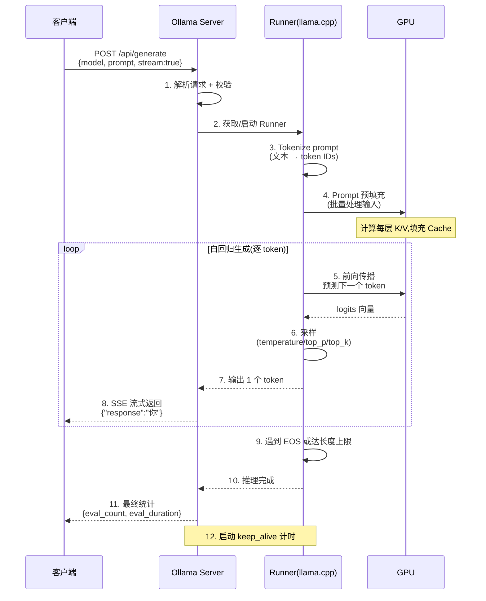

### 5.3 两个关键阶段:Prefill 与 Decode

LLM 推理分为两个性能特征截然不同的阶段:

```mermaid
graph LR
    subgraph Prefill 阶段 预填充
        P1[输入 prompt<br/>如 500 tokens]
        P2[并行计算所有 token]
        P3[填充 KV Cache]
        P4[计算密集型<br/>GPU 算力瓶颈]
    end
    
    subgraph Decode 阶段 自回归生成
        D1[逐个生成 token]
        D2[查询 KV Cache]
        D3[追加新 K/V]
        D4[内存密集型<br/>显存带宽瓶颈]
    end
    
    Prefill 阶段 预填充 --> Decode 阶段 自回归生成

    style P4 fill:#f8d7da,stroke:#721c24
    style D4 fill:#fff3cd,stroke:#d39e00
```

| 阶段 | 名称 | 处理对象 | 计算特征 | 瓶颈 | 优化重点 |
|------|------|---------|---------|------|---------|
| **Prefill** | 预填充 | 输入 prompt(批量) | 计算密集 | GPU 算力 | 并行度、Flash Attention |
| **Decode** | 解码生成 | 逐个输出 token | 内存密集 | 显存带宽 | KV Cache、批处理 |

**Ollama 返回的性能指标**:

```json
{
  "response": "你好,我是AI助手",
  "done": true,
  "context": [1, 234, 567, ...],
  "total_duration": 1500000000,      // 总耗时(纳秒)
  "load_duration": 500000000,        // 模型加载耗时
  "prompt_eval_count": 8,            // 输入 token 数
  "prompt_eval_duration": 200000000, // Prefill 耗时
  "eval_count": 12,                  // 输出 token 数
  "eval_duration": 800000000         // Decode 耗时
}
```

**性能计算公式**:

$$
\text{Prefill 吞吐} = \frac{\text{prompt\_eval\_count}}{\text{prompt\_eval\_duration}} \quad (\text{tokens/s})
$$

$$
\text{Decode 吞吐} = \frac{\text{eval\_count}}{\text{eval\_duration}} \quad (\text{tokens/s})
$$

> **工程意义**:监控这两个指标可定位性能瓶颈——Prefill 慢说明 GPU 算力不足(需更强 GPU),Decode 慢说明显存带宽不足(需更高带宽显存或减小 KV Cache)。

### 5.4 KV Cache 机制

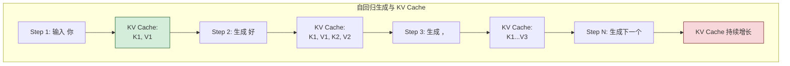

**KV Cache 是 LLM 推理的"记忆"**——每生成一个 token,需访问之前所有 token 的 Key/Value 向量。其大小随序列长度线性增长:

$$
\text{KV Cache 大小} = 2 \times n_{\text{layers}} \times n_{\text{heads}} \times d_{\text{head}} \times \text{seq\_len} \times \text{batch} \times \text{bytes}
$$

**Ollama 的 KV Cache 管理**:

```python
# Ollama 通过 num_ctx 参数控制上下文窗口大小
# 这直接决定 KV Cache 的最大显存占用

# Modelfile 中设置
# PARAMETER num_ctx 8192  # 8K 上下文

# 请求级别覆盖
response = requests.post("http://localhost:11434/api/generate", json={
    "model": "llama3",
    "prompt": "长文本...",
    "options": {
        "num_ctx": 4096    # 本次请求用 4K 上下文
    }
})

# num_ctx 过大 → KV Cache 占满显存 → OOM
# num_ctx 过小 → 长对话被截断 → 上下文丢失
```

---

## 六、数据处理流程

### 6.1 请求处理全链路

```mermaid
flowchart TB
    subgraph 1 请求接收
        REQ[HTTP 请求] --> AUTH[认证/限流]
        AUTH --> PARSE[解析 JSON Body]
        PARSE --> VALID[参数校验]
    end
    
    subgraph 2 模型准备
        VALID --> LOOKUP{模型已加载?}
        LOOKUP -- 否 --> LOAD[加载模型]
        LOOKUP -- 是 --> ACQUIRE[获取 Runner]
        LOAD --> ACQUIRE
    end
    
    subgraph 3 输入处理
        ACQUIRE -> TEMPL[应用 Prompt 模板]
        TEMPL --> TOK[Tokenize<br/>文本→token IDs]
        TOK --> EMBD[Embedding<br/>token→向量]
    end
    
    subgraph 4 推理执行
        EMBD --> PRE[Prefill<br/>批量处理输入]
        PRE --> DEC[Decode<br/>自回归生成]
        DEC --> SAM[采样<br/>temperature/top_p]
    end
    
    subgraph 5 输出处理
        SAM --> DETOK[Detokenize<br/>token→文本]
        DETOK --> STREAM{流式?}
        STREAM -- 是 --> SSE[SSE 逐 token 返回]
        STREAM -- 否 --> BUF[缓冲全部后返回]
    end
    
    subgraph 6 收尾
        SSE --> STATS[返回统计信息]
        BUF --> STATS
        STATS --> KEEP[启动 keep_alive 计时]
    end

    style VALID fill:#e3f2fd,stroke:#1565c0
    style DEC fill:#d4edda,stroke:#155724,stroke-width:2px
    style SSE fill:#fff3cd,stroke:#d39e00
```

### 6.2 Tokenization 流程

```python
"""
Ollama 的 Tokenization 流程(基于 llama.cpp 的 tokenizer)
"""

# 1. 原始输入
raw_input = "你好,请介绍一下自己"

# 2. 应用 prompt 模板(Modelfile 中定义)
# 例如 llama3 的模板:
templated = """<|begin_of_text|><|start_header_id|>system<|end_header_id|>

你是助手<|eot_id|><|start_header_id|>user<|end_header_id|>

你好,请介绍一下自己<|eot_id|><|start_header_id|>assistant<|end_header_id|>

"""

# 3. Tokenize(基于 SentencePiece/BPE)
token_ids = tokenizer.encode(templated)
# [128000, 8948, ...]  # 每个数字对应一个 token

# 4. 转为 embedding 向量
embeddings = embedding_table[token_ids]  # [seq_len, d_model]

# 5. 送入 Transformer 层
```

### 6.3 Prompt 模板系统

```mermaid
graph LR
    subgraph Modelfile 模板定义
        T[TEMPLATE """{{ .System }}<br/>{{ .Prompt }}"""]
    end
    
    subgraph 运行时渲染
        R1[.System → 系统提示]
        R2[.Prompt → 用户输入]
        R3[.Response → AI 回复占位]
    end
    
    subgraph 渲染结果
        OUT[完整 prompt 字符串]
    end
    
    T --> R1 & R2 & R3 --> OUT

    style T fill:#fff3cd,stroke:#d39e00,stroke-width:2px
    style OUT fill:#d4edda,stroke:#155724
```

**不同模型的模板差异**:

| 模型 | 模板格式 | 特殊标记 |
|------|---------|---------|
| Llama 3 | `<\|start_header_id\|>...<\|end_header_id\|>` | `<\|eot_id\|>` |
| Qwen2 | `<\|im_start\|>user...<\|im_end\|>` | `<\|im_end\|>` |
| ChatML | `<\|im_start\|>system...<\|im_end\|>` | `<\|im_end\|>` |
| Mistral | `[INST]...[/INST]` | `</s>` |

> **工程要点**:Ollama 的 Modelfile `TEMPLATE` 指令确保不同模型使用正确的对话格式。**错误的模板会导致模型输出质量急剧下降**——这是迁移模型时最易出错的环节。

### 6.4 采样策略

```mermaid
flowchart TB
    L[Logits 向量<br/>vocab_size 维] --> TEMP[Temperature 缩放]
    TEMP --> CHOICE{采样策略}
    
    CHOICE --> GREEDY[贪心<br/>argmax]
    CHOICE --> TOPK[Top-K<br/>保留 K 个最高]
    CHOICE --> TOPP[Top-P 核采样<br/>累计概率 ≤ P]
    
    GREEDY --> SAMPLE[采样]
    TOPK --> SAMPLE
    TOPP --> SAMPLE
    SAMPLE --> TOKEN[选中的 token ID]

    style L fill:#e3f2fd,stroke:#1565c0
    style SAMPLE fill:#d4edda,stroke:#155724,stroke-width:2px
```

**Ollama 支持的采样参数**:

```python
# 请求中通过 options 字段控制采样
response = requests.post("http://localhost:11434/api/generate", json={
    "model": "llama3",
    "prompt": "写一首诗",
    "options": {
        "temperature": 0.8,     # 温度(越高越随机,0=贪心)
        "top_p": 0.9,           # 核采样(保留累计概率90%的token)
        "top_k": 40,            # Top-K(只保留概率最高的40个)
        "num_predict": 200,     # 最大生成 token 数
        "repeat_penalty": 1.1,  # 重复惩罚(抑制重复)
        "seed": 42,             # 随机种子(可复现)
        "num_ctx": 4096         # 上下文窗口
    }
})
```

| 参数 | 作用 | 推荐值 | 效果 |
|------|------|--------|------|
| `temperature` | 控制随机性 | 0.7-0.9 | 高=创意,低=确定 |
| `top_p` | 核采样截断 | 0.9 | 过滤低概率 token |
| `top_k` | Top-K 截断 | 40 | 限制候选数量 |
| `repeat_penalty` | 重复惩罚 | 1.1-1.3 | 防止重复输出 |
| `num_predict` | 最大生成长度 | 200-2000 | 控制输出长度 |
| `seed` | 随机种子 | -1(随机) | 固定则可复现 |

---

## 七、资源管理策略

### 7.1 资源管理全景

```mermaid
mindmap
  root((资源管理))
    显存管理
      自动层卸载
      KV Cache 预分配
      keep_alive 超时释放
      多模型显存分配
    内存管理
      mmap 按需加载
      共享内存页
      CPU 推理内存池
    并发管理
      请求排队
      Runner 复用
      并行实例
    模型轮换
      LRU 卸载策略
      显存不足时驱逐
      加载优先级
```

### 7.2 显存管理策略

显存是 Ollama 最核心的资源约束。Ollama 的显存管理遵循"**按需分配,超时回收,不足降级**"三原则:

```mermaid
flowchart TB
    subgraph 显存管理生命周期
        A[请求模型A] --> Q1{显存足够?}
        Q1 -- 是 --> L1[加载模型A到GPU]
        Q1 -- 否 --> Q2{有可卸载模型?}
        Q2 -- 是 --> EVICT[LRU 卸载最久未用模型]
        Q2 -- 否 --> DEGRADE[降级到CPU推理]
        EVICT --> Q1
        DEGRADE --> L2[加载到CPU/部分GPU]
        
        L1 --> IDLE[空闲]
        L2 --> IDLE
        IDLE --> TIMER[启动keep_alive计时]
        TIMER --> TIMEOUT{超时?}
        TIMEOUT -- 是 --> UNLOAD[卸载释放显存]
        TIMEOUT -- 否 --> REUSE[新请求复用]
    end

    style L1 fill:#d4edda,stroke:#155724
    style DEGRADE fill:#fff3cd,stroke:#d39e00
    style UNLOAD fill:#d1ecf1,stroke:#0c5460
```

### 7.3 多模型共存与切换

```mermaid
sequenceDiagram
    participant U as 用户
    participant S as Server
    participant LM as Lifecycle Mgr
    participant GPU as GPU (16GB)

    Note over GPU: 初始:空闲 16GB

    U->>S: 请求 llama3 (Q4, 需 5GB)
    S->>LM: 加载 llama3
    LM->>GPU: 分配 5GB
    Note over GPU: 已用 5GB,剩余 11GB
    
    U->>S: 请求 qwen2 (Q4, 需 5GB)
    S->>LM: 加载 qwen2
    LM->>GPU: 分配 5GB
    Note over GPU: 已用 10GB,剩余 6GB
    
    U->>S: 请求 mistral (Q4, 需 5GB)
    S->>LM: 加载 mistral
    LM->>LM: 显存不足(6GB<5GB+开销)
    LM->>GPU: 卸载最久未用的 llama3
    Note over GPU: 已用 5GB(qwen2)
    LM->>GPU: 分配 5GB(mistral)
    Note over GPU: 已用 10GB
    
    Note over LM: 若用户再次请求 llama3<br/>需重新加载(冷启动)
```

**多模型共存的关键参数**:

```bash
# 环境变量控制
OLLAMA_MAX_LOADED_MODELS=2      # 同时加载的最大模型数(默认=GPU数×2 或 1)
OLLAMA_MAX_VRAM=0               # 限制 Ollama 使用的最大显存(0=自动)
OLLAMA_NUM_PARALLEL=1           # 每个模型的并行请求数

# keep_alive 控制卸载时机
# 默认 5m:5分钟无请求则卸载
```

### 7.4 内存与 CPU 管理

```mermaid
graph TB
    subgraph 内存使用构成
        M1[GGUF 权重<br/>mmap 映射<br/>按需加载]
        M2[KV Cache<br/>预分配<br/>随上下文增长]
        M3[激活值<br/>推理时临时<br/>层间传递]
        M4[词表/Tokenizer<br/>常驻<br/>约 10-50MB]
    end
    
    M1 --> RAM[系统内存]
    M2 --> GPU_RAM[GPU 显存 或 CPU 内存]
    M3 --> GPU_RAM
    M4 --> RAM

    style M1 fill:#d4edda,stroke:#155724,stroke-width:2px
    style M2 fill:#fff3cd,stroke:#d39e00,stroke-width:2px
```

**CPU 推理优化**:

```bash
# Ollama 自动检测 CPU 指令集
# - AVX2: 大多数 x86 CPU(2013年后)
# - AVX512: 高端 CPU(2017年后)
# - NEON: ARM CPU

# 可通过环境变量限制线程数(避免过度竞争)
OLLAMA_NUM_THREAD=8   # 限制推理线程数(默认=CPU核数)

# CPU 推理性能参考(7B Q4 模型):
# - 高端 CPU(i9/RYZEN 9): 10-20 tokens/s
# - 中端 CPU(i5/RYZEN 5): 5-10 tokens/s
# - 低端 CPU: 1-5 tokens/s
```

### 7.5 资源监控

```bash
# 查看 Ollama 当前运行的模型
curl http://localhost:11434/api/ps

# 响应示例
{
  "models": [
    {
      "name": "llama3:8b",
      "model": "llama3:8b",
      "size": 4661211072,          # 模型大小(bytes)
      "digest": "sha256:...",
      "expires_at": "2026-08-07T10:05:00Z",  # keep_alive 过期时间
      "size_vram": 4661211072      # 占用显存(bytes)
    }
  ]
}

# 实时监控 GPU 显存
nvidia-smi -l 1   # 每秒刷新

# 监控 Ollama 进程内存
ps aux | grep ollama
# 或
top -p $(pgrep ollama)
```

---

## 八、Modelfile 与模型配置体系

### 8.1 Modelfile 设计理念

Modelfile 是 Ollama 的**声明式模型配置文件**,灵感来自 Dockerfile——把模型权重、参数、模板、系统提示等打包为一个可复现的"模型镜像":

```mermaid
graph LR
    subgraph Docker 类比
        D1[Dockerfile] --> D2[docker build] --> D3[镜像 Image]
        D3 --> D4[docker run]
    end
    
    subgraph Ollama 对应
        O1[Modelfile] --> O2[ollama create] --> O3[本地模型]
        O3 --> O4[ollama run]
    end
    
    D1 -.对应.-> O1
    D2 -.对应.-> O2
    D3 -.对应.-> O3
    D4 -.对应.-> O4

    style D1 fill:#e3f2fd,stroke:#1565c0
    style O1 fill:#d4edda,stroke:#155724,stroke-width:2px
```

### 8.2 Modelfile 指令详解

```dockerfile
# ============================================
# Modelfile 完整示例
# ============================================

# FROM: 基础模型(必需)
# 可以是:
#   - 官方模型名: llama3:8b
#   - 本地 GGUF 路径: ./my-model.gguf
#   - 已创建的自定义模型: my-custom:latest
FROM llama3:8b

# PARAMETER: 推理参数(可多个)
PARAMETER temperature 0.7
PARAMETER top_p 0.9
PARAMETER num_ctx 8192
PARAMETER num_gpu 32              # 放 GPU 的层数(-1=全部)
PARAMETER stop "<|eot_id|>"       # 停止标记
PARAMETER stop "用户:"
PARAMETER repeat_penalty 1.1
PARAMETER num_predict 2000

# SYSTEM: 系统提示词(默认)
SYSTEM """你是一个专业的编程助手。
请用中文回答,代码示例用 Markdown 格式。
回答要简洁准确,避免冗长。"""

# TEMPLATE: 对话模板(Go 模板语法)
TEMPLATE """{{ if .System }}<|start_header_id|>system<|end_header_id|>

{{ .System }}<|eot_id|>{{ end }}<|start_header_id|>user<|end_header_id|>

{{ .Prompt }}<|eot_id|><|start_header_id|>assistant<|end_header_id|>

{{ .Response }}<|eot_id|>"""

# ADAPTER: LoRA 适配器(可选,微调)
ADAPTER ./my-lora-adapter.bin

# LICENSE: 许可证(可选)
LICENSE "MIT"
```

### 8.3 指令速查表

| 指令 | 作用 | 必需 | 示例 |
|------|------|:----:|------|
| `FROM` | 指定基础模型/权重文件 | ✅ | `FROM llama3:8b` |
| `PARAMETER` | 设置推理参数 | ❌ | `PARAMETER temperature 0.7` |
| `SYSTEM` | 设置系统提示词 | ❌ | `SYSTEM "你是助手"` |
| `TEMPLATE` | 设置对话模板 | ❌ | `TEMPLATE "{{ .Prompt }}"` |
| `ADAPTER` | 加载 LoRA 适配器 | ❌ | `ADAPTER ./lora.bin` |
| `LICENSE` | 声明许可证 | ❌ | `LICENSE "Apache-2.0"` |

### 8.4 参数完整列表

| 参数 | 类型 | 默认值 | 说明 |
|------|------|--------|------|
| `temperature` | float | 0.8 | 温度,越高越随机 |
| `top_p` | float | 0.9 | 核采样概率阈值 |
| `top_k` | int | 40 | Top-K 采样 |
| `num_ctx` | int | 2048 | 上下文窗口大小 |
| `num_gpu` | int | -1 | GPU 层数(-1=全部) |
| `num_thread` | int | CPU核数 | CPU 推理线程数 |
| `num_predict` | int | 128 | 最大生成 token 数 |
| `repeat_penalty` | float | 1.1 | 重复惩罚 |
| `repeat_last_n` | int | 64 | 重复惩罚窗口 |
| `seed` | int | -1 | 随机种子 |
| `stop` | string[] | [] | 停止标记 |
| `mirostat` | int | 0 | Mirostat 采样(0/1/2) |

### 8.5 自定义模型创建流程

```bash
# 1. 编写 Modelfile
cat > MyModelfile << 'EOF'
FROM llama3:8b
PARAMETER temperature 0.3
PARAMETER num_ctx 4096
SYSTEM "你是 Python 编程专家,回答简洁。"
EOF

# 2. 创建自定义模型
ollama create my-python-assistant -f MyModelfile
# 输出: transferring model data
#       using existing layer sha256:...
#       creating new layer sha256:...
#       writing manifest
#       success

# 3. 运行
ollama run my-python-assistant

# 4. 查看
ollama show my-python-assistant

# 5. 更新(修改 Modelfile 后重新 create)
ollama create my-python-assistant -f MyModelfile

# 6. 删除
ollama rm my-python-assistant
```

---

## 九、API 层与外部系统集成

### 9.1 API 接口体系

```mermaid
graph TB
    subgraph Ollama 原生 API
        N1[/api/generate<br/>文本生成]
        N2[/api/chat<br/>对话生成]
        N3[/api/embeddings<br/>向量嵌入]
        N4[/api/pull<br/>拉取模型]
        N5[/api/tags<br/>列出模型]
        N6[/api/ps<br/>运行中模型]
    end
    
    subgraph OpenAI 兼容 API
        O1[/v1/chat/completions<br/>对话]
        O2[/v1/completions<br/>补全]
        O3[/v1/embeddings<br/>嵌入]
        O4[/v1/models<br/>模型列表]
    end
    
    subgraph 外部集成
        E1[LangChain]
        E2[LlamaIndex]
        E3[LiteLLM]
        E4[OpenAI SDK]
        E5[自定义应用]
    end
    
    E1 & E2 & E3 & E4 --> O1 & O2 & O3 & O4
    E5 --> N1 & N2 & N3 & N4 & N5 & N6

    style N1 fill:#d4edda,stroke:#155724
    style O1 fill:#fff3cd,stroke:#d39e00,stroke-width:2px
```

### 9.2 原生 API 调用示例

```bash
# 1. 文本生成(流式)
curl http://localhost:11434/api/generate -d '{
  "model": "llama3",
  "prompt": "为什么天空是蓝色的?",
  "stream": true,
  "options": {
    "temperature": 0.7,
    "num_predict": 500
  }
}'

# 流式响应(每行一个 JSON)
# {"model":"llama3","response":"天空","done":false}
# {"model":"llama3","response":"之所以","done":false}
# ...
# {"model":"llama3","response":"","done":true,"total_duration":...}

# 2. 对话生成(多轮)
curl http://localhost:11434/api/chat -d '{
  "model": "llama3",
  "messages": [
    {"role": "system", "content": "你是科普助手"},
    {"role": "user", "content": "黑洞是什么?"}
  ],
  "stream": false
}'

# 3. 生成嵌入
curl http://localhost:11434/api/embeddings -d '{
  "model": "nomic-embed-text",
  "prompt": "这是一段需要向量化的文本"
}'
# {"embedding": [0.123, -0.456, ...]}  # 768 维向量
```

### 9.3 OpenAI 兼容 API

Ollama 提供 OpenAI 兼容端点,可直接用 OpenAI SDK 调用——这是**零成本迁移**的关键:

```python
"""
使用 OpenAI SDK 调用 Ollama
只需修改 base_url,其余代码完全不变
"""
from openai import OpenAI

# 关键:将 base_url 指向 Ollama
client = OpenAI(
    base_url="http://localhost:11434/v1",  # Ollama 的 OpenAI 兼容端点
    api_key="ollama"                        # 任意值,Ollama 不校验
)

# 对话补全(与调用 OpenAI 完全一致)
response = client.chat.completions.create(
    model="llama3",                         # Ollama 中的模型名
    messages=[
        {"role": "system", "content": "你是助手"},
        {"role": "user", "content": "你好"}
    ],
    temperature=0.7,
    stream=True                             # 支持流式
)

for chunk in response:
    print(chunk.choices[0].delta.content or "", end="")
```

```mermaid
flowchart LR
    subgraph 迁移前 调用 OpenAI
        A1[OpenAI SDK] -->|api.openai.com| OAI[OpenAI 云]
    end
    
    subgraph 迁移后 调用 Ollama
        A2[OpenAI SDK] -->|localhost:11434/v1| OLL[Ollama 本地]
    end
    
    A1 -.仅改 base_url.-> A2

    style OAI fill:#f8d7da,stroke:#721c24
    style OLL fill:#d4edda,stroke:#155724,stroke-width:2px
```

> **工程价值**:OpenAI 兼容 API 意味着——所有基于 OpenAI SDK 的应用(LangChain、AutoGen、CrewAI 等)**只需改一行 `base_url`** 即可切换到本地 Ollama,实现从云端到本地的无缝迁移。

### 9.4 LangChain 集成

```python
"""
LangChain + Ollama 集成
"""
from langchain_community.chat_models import ChatOllama
from langchain_core.prompts import ChatPromptTemplate
from langchain_core.output_parsers import StrOutputParser

# 1. 初始化 Ollama LLM
llm = ChatOllama(
    base_url="http://localhost:11434",
    model="llama3",
    temperature=0.7,
    # Ollama 特有参数
    num_ctx=4096,
    num_predict=500,
)

# 2. 构建 Chain
prompt = ChatPromptTemplate.from_messages([
    ("system", "你是 Python 编程专家"),
    ("user", "{question}")
])

chain = prompt | llm | StrOutputParser()

# 3. 调用
response = chain.invoke({"question": "如何实现单例模式?"})
print(response)

# 4. 流式调用
for chunk in chain.stream({"question": "解释一下装饰器"}):
    print(chunk, end="", flush=True)
```

### 9.5 Ollama Python 库

```python
"""
Ollama 官方 Python 库(更原生的接口)
"""
import ollama

# 1. 对话
response = ollama.chat(
    model='llama3',
    messages=[
        {'role': 'user', 'content': '你好'}
    ]
)
print(response['message']['content'])

# 2. 流式
for chunk in ollama.chat(
    model='llama3',
    messages=[{'role': 'user', 'content': '写首诗'}],
    stream=True
):
    print(chunk['message']['content'], end='')

# 3. 嵌入
embedding = ollama.embeddings(
    model='nomic-embed-text',
    prompt='向量化这段文本'
)

# 4. 多模态(支持 LLaVA 等视觉模型)
response = ollama.chat(
    model='llava',
    messages=[{
        'role': 'user',
        'content': '描述这张图片',
        'images': ['./image.jpg']    # 传入图片路径
    }]
)
```

### 9.6 集成架构示例:RAG 系统

```mermaid
graph TB
    subgraph RAG 系统集成
        Q[用户提问] --> EMBED[Ollama Embeddings<br/>nomic-embed-text]
        EMBED --> VDB[(向量数据库<br/>Qdrant/Chroma)]
        VDB --> RETRIEVE[检索相关文档]
        RETRIEVE --> LLM[Ollama LLM<br/>llama3]
        LLM --> ANS[生成回答]
    end
    
    subgraph Ollama 服务
        O1[Embedding 模型<br/>常驻]
        O2[LLM 模型<br/>按需加载]
    end
    
    EMBED --> O1
    LLM --> O2

    style O1 fill:#d4edda,stroke:#155724
    style O2 fill:#d4edda,stroke:#155724
    style LLM fill:#fff3cd,stroke:#d39e00,stroke-width:2px
```

```python
"""
完整 RAG 集成示例:Ollama Embedding + Ollama LLM
"""
import ollama
from chromadb import Client

# 1. 初始化向量数据库
chroma = Client()
collection = chroma.create_collection("docs")

# 2. 文档入库(用 Ollama 生成嵌入)
def add_document(text: str, doc_id: str):
    embed = ollama.embeddings(model="nomic-embed-text", prompt=text)
    collection.add(
        ids=[doc_id],
        embeddings=[embed["embedding"]],
        documents=[text]
    )

# 3. 检索 + 生成
def rag_query(question: str) -> str:
    # 用 Ollama 生成查询向量
    q_embed = ollama.embeddings(model="nomic-embed-text", prompt=question)
    
    # 向量检索
    results = collection.query(
        query_embeddings=[q_embed["embedding"]],
        n_results=3
    )
    context = "\n".join(results["documents"][0])
    
    # 用 Ollama LLM 生成回答
    response = ollama.chat(
        model="llama3",
        messages=[
            {"role": "system", "content": f"基于以下资料回答:\n{context}"},
            {"role": "user", "content": question}
        ]
    )
    return response["message"]["content"]
```

---

## 十、并发与性能机制

### 10.1 并发处理模型

```mermaid
graph TB
    subgraph 并发请求处理
        R1[请求 A<br/>model=llama3]
        R2[请求 B<br/>model=llama3]
        R3[请求 C<br/>model=qwen2]
        
        R1 --> QUEUE[请求队列]
        R2 --> QUEUE
        R3 --> QUEUE
        
        QUEUE --> SCHED{调度器}
        
        SCHED -->|同模型| RUN1[Runner: llama3<br/>串行处理 A→B]
        SCHED -->|不同模型| RUN2[Runner: qwen2<br/>并行处理 C]
    end

    style QUEUE fill:#fff3cd,stroke:#d39e00,stroke-width:2px
    style RUN1 fill:#d4edda,stroke:#155724
```

**Ollama 的并发模型**:
- **同一模型**:默认串行处理(一个 Runner 实例),后续请求排队
- **不同模型**:可并行运行(各自独立 Runner)
- **并行实例**:通过 `OLLAMA_NUM_PARALLEL` 增加同模型并行度

```bash
# 增加单模型的并行请求数
OLLAMA_NUM_PARALLEL=4 ollama serve
# 此时 llama3 可同时处理 4 个请求(共享 KV Cache,提升吞吐)
```

### 10.2 性能优化策略

```mermaid
mindmap
  root((性能优化))
    模型层
      选择合适量化
      减小上下文窗口
      使用小参数模型
    推理层
      Flash Attention
      批处理 Batch
      KV Cache 复用
    资源层
      GPU 充分利用
      内存充足
      避免交换分区
    部署层
      keep_alive 调优
      预加载模型
      多实例部署
```

### 10.3 性能基准参考

**测试环境**:RTX 4090 24GB + Intel i9 + 64GB RAM

| 模型 | 量化 | 显存占用 | Prefill (tok/s) | Decode (tok/s) | 并发支持 |
|------|:----:|:-------:|:---------------:|:--------------:|:--------:|
| Llama3 8B | Q4_K_M | 5 GB | 1500+ | 80-100 | 4 |
| Llama3 8B | Q8_0 | 8 GB | 1200+ | 60-80 | 2 |
| Llama3 8B | F16 | 14 GB | 1000+ | 40-50 | 1 |
| Qwen2 7B | Q4_K_M | 5 GB | 1400+ | 85-105 | 4 |
| Llama3 70B | Q4_K_M | 40 GB | 300+ | 15-20 | - |
| Llama3 70B | Q4_K_M | 40GB(2×24) | 350+ | 18-25 | - |

> **注**:以上为参考数据,实际性能受硬件、驱动、并发数等影响。Decode 速度达 30+ tokens/s 即可满足实时对话需求。

### 10.4 性能调优清单

| 优化项 | 方法 | 预期效果 |
|--------|------|---------|
| 量化选择 | 显存够用选 Q8,紧张选 Q4 | 平衡质量与速度 |
| 上下文窗口 | 按需设 `num_ctx`,非必要不用 8K+ | 减小 KV Cache |
| keep_alive | 高频时段设 -1(永久保活) | 省去重复加载 |
| 预加载 | 启动后立即发空请求触发加载 | 首请求不冷启动 |
| 并行度 | 设 `OLLAMA_NUM_PARALLEL=4` | 提升吞吐 |
| GPU 层数 | 显存足时 `num_gpu=-1` | 全 GPU 加速 |
| Flash Attn | 较新版本默认启用 | 长上下文提速 |

---

## 十一、工程化部署实践

### 11.1 生产部署架构

```mermaid
graph TB
    subgraph 生产部署架构
        LB[负载均衡<br/>Nginx] --> O1[Ollama 实例 1<br/>GPU 0]
        LB --> O2[Ollama 实例 2<br/>GPU 1]
        
        O1 & O2 --> SHARED[(共享模型存储<br/>NFS/对象存储)]
        
        MON[Prometheus<br/>+ Grafana] -.监控.-> O1 & O2
        LOG[ELK<br/>日志聚合] -.采集.-> O1 & O2
        
        APP[应用层<br/>LangChain/Agent] --> LB
    end
    
    subgraph 高可用
        O1 -.故障转移.-> O2
    end

    style LB fill:#fff3cd,stroke:#d39e00,stroke-width:2px
    style O1 fill:#d4edda,stroke:#155724
    style SHARED fill:#d1ecf1,stroke:#0c5460
```

### 11.2 systemd 部署

```ini
# /etc/systemd/system/ollama.service

[Unit]
Description=Ollama Service
After=network.target

[Service]
Type=simple
User=ollama
Group=ollama

# 环境变量
Environment="OLLAMA_HOST=0.0.0.0:11434"
Environment="OLLAMA_MODELS=/data/ollama/models"
Environment="OLLAMA_MAX_LOADED_MODELS=2"
Environment="OLLAMA_NUM_PARALLEL=4"
Environment="OLLAMA_KEEP_ALIVE=10m"
Environment="OLLAMA_FLASH_ATTENTION=1"
# GPU 限制(可选)
# Environment="CUDA_VISIBLE_DEVICES=0,1"

# 启动命令
ExecStart=/usr/local/bin/ollama serve

# 重启策略
Restart=always
RestartSec=5

# 资源限制
LimitNOFILE=65536
MemoryMax=64G

# 安全
NoNewPrivileges=true
ProtectSystem=strict
ReadWritePaths=/data/ollama

[Install]
WantedBy=multi-user.target
```

```bash
# 部署命令
sudo systemctl daemon-reload
sudo systemctl enable ollama
sudo systemctl start ollama
sudo systemctl status ollama
```

### 11.3 Docker 部署

```yaml
# docker-compose.yml
version: "3.9"

services:
  ollama:
    image: ollama/ollama:latest
    container_name: ollama
    restart: unless-stopped
    ports:
      - "11434:11434"
    volumes:
      - ollama-data:/root/.ollama
      # 挂载模型目录(避免重复下载)
      - /data/ollama/models:/root/.ollama/models
    environment:
      - OLLAMA_HOST=0.0.0.0:11434
      - OLLAMA_MAX_LOADED_MODELS=2
      - OLLAMA_NUM_PARALLEL=4
      - OLLAMA_KEEP_ALIVE=10m
    deploy:
      resources:
        reservations:
          devices:
            - driver: nvidia          # GPU 支持
              count: all
              capabilities: [gpu]
        limits:
          memory: 32G
    healthcheck:
      test: ["CMD", "curl", "-f", "http://localhost:11434/api/tags"]
      interval: 30s
      timeout: 10s
      retries: 3

volumes:
  ollama-data:
```

```bash
# 启动
docker compose up -d

# 预加载模型
docker exec ollama ollama pull llama3
docker exec ollama ollama pull nomic-embed-text
```

### 11.4 预加载与预热

```bash
#!/bin/bash
# ============================================
# Ollama 模型预热脚本
# 在服务启动后预加载模型,避免首请求冷启动
# ============================================

OLLAMA_HOST="http://localhost:11434"

# 1. 等待服务就绪
echo "[1/3] 等待 Ollama 服务就绪..."
until curl -sf "$OLLAMA_HOST/api/tags" > /dev/null 2>&1; do
    sleep 2
done
echo "  ✓ 服务已就绪"

# 2. 拉取必要模型
echo "[2/3] 确保模型已下载..."
for model in llama3 nomic-embed-text; do
    if ! curl -sf "$OLLAMA_HOST/api/tags" | grep -q "$model"; then
        echo "  拉取 $model..."
        ollama pull "$model"
    fi
done
echo "  ✓ 模型就绪"

# 3. 预热(发送空请求触发加载)
echo "[3/3] 预热模型..."
for model in llama3 nomic-embed-text; do
    curl -s "$OLLAMA_HOST/api/generate" -d "{\"model\":\"$model\",\"prompt\":\"\",\"keep_alive\":\"30m\"}" > /dev/null
    echo "  ✓ $model 已加载并保活 30 分钟"
done

echo "预热完成!"
```

### 11.5 Nginx 反向代理

```nginx
# /etc/nginx/sites-available/ollama
upstream ollama_backend {
    least_conn;
    server 127.0.0.1:11434 max_fails=3 fail_timeout=30s;
    # 多实例
    # server 127.0.0.1:11435 max_fails=3 fail_timeout=30s;
    keepalive 32;
}

server {
    listen 443 ssl http2;
    server_name llm.internal.example.com;

    ssl_certificate     /etc/ssl/certs/llm.pem;
    ssl_certificate_key /etc/ssl/private/llm.key;

    # 请求体大小(可能有大 prompt)
    client_max_body_size 50m;

    # 超时(LLM 推理较慢)
    proxy_connect_timeout 10s;
    proxy_read_timeout    600s;    # 10 分钟,长生成
    proxy_send_timeout    600s;

    # 通用代理
    location / {
        proxy_pass http://ollama_backend;
        proxy_set_header Host $host;
        proxy_set_header X-Real-IP $remote_addr;
        proxy_set_header X-Forwarded-For $proxy_add_x_forwarded_for;

        # SSE 流式响应支持(关键!)
        proxy_buffering off;           # 关闭缓冲,否则流式失效
        proxy_cache off;
        proxy_http_version 1.1;
        proxy_set_header Connection "";
    }

    # 限流
    limit_req_zone $binary_remote_addr zone=llm:10m rate=5r/s;
    location /api/generate {
        limit_req zone=llm burst=10 nodelay;
        proxy_pass http://ollama_backend;
        proxy_buffering off;
    }
}
```

> **关键配置**:LLM 流式响应必须设置 `proxy_buffering off`,否则 Nginx 会缓冲全部输出,流式效果失效,用户需等待全部生成完才看到结果。

### 11.6 模型存储管理

```bash
# 生产环境模型存储策略

# 1. 将模型目录放到大容量磁盘
export OLLAMA_MODELS=/data/ollama/models

# 2. NFS 共享(多实例共享模型,避免重复下载)
# /etc/fstab
# nfs-server:/shared/ollama-models /data/ollama/models nfs defaults 0 0

# 3. 清理未使用模型
ollama list                          # 查看所有模型
ollama rm old-model:unused           # 删除不用的

# 4. 查看存储占用
du -sh ~/.ollama/models/
du -sh ~/.ollama/models/blobs/

# 5. 模型文件去重(内容寻址天然去重)
# 不同 tag 指向同一 blob 时,只占一份空间
```

---

## 十二、监控与运维

### 12.1 监控指标体系

```mermaid
mindmap
  root((Ollama 监控))
    服务可用性
      进程存活
      端口监听
      API 响应
    性能指标
      Prefill 吞吐
      Decode 吞吐
      请求延迟
      并发数
    资源指标
      GPU 显存
      GPU 利用率
      内存占用
      CPU 使用率
    模型指标
      已加载模型数
      模型加载耗时
      keep_alive 状态
      请求队列长度
    业务指标
      请求数 QPS
      错误率
      平均生成长度
      Token 消耗
```

### 12.2 健康检查脚本

```bash
#!/bin/bash
# ollama_healthcheck.sh

OLLAMA_HOST="http://localhost:11434"
ALERT_WEBHOOK="https://hooks.slack.com/xxx"

# 1. 进程检查
if ! pgrep -x "ollama" > /dev/null; then
    echo "[CRITICAL] Ollama 进程不存在"
    curl -X POST "$ALERT_WEBHOOK" -d '{"text":"🚨 Ollama 进程崩溃!"}'
    exit 2
fi

# 2. API 可达性
if ! curl -sf "$OLLAMA_HOST/api/tags" > /dev/null 2>&1; then
    echo "[CRITICAL] Ollama API 不可达"
    exit 2
fi

# 3. 模型可用性
MODELS=$(curl -s "$OLLAMA_HOST/api/tags" | python3 -c "
import sys, json
data = json.load(sys.stdin)
print(len(data.get('models', [])))
")

if [ "$MODELS" -eq 0 ]; then
    echo "[WARNING] 无可用模型"
    exit 1
fi

# 4. GPU 状态
GPU_MEM=$(nvidia-smi --query-gpu=memory.used,memory.total --format=csv,noheader,nounits | head -1)
USED=$(echo $GPU_MEM | cut -d',' -f1 | tr -d ' ')
TOTAL=$(echo $GPU_MEM | cut -d',' -f2 | tr -d ' ')
PCT=$((USED * 100 / TOTAL))

if [ $PCT -gt 95 ]; then
    echo "[WARNING] GPU 显存使用率 ${PCT}%"
fi

echo "[OK] Ollama 健康, $MODELS 个模型可用, GPU 显存 ${PCT}%"
```

### 12.3 Prometheus 监控

```python
"""
Ollama Prometheus 指标采集器
定时轮询 Ollama API,暴露为 Prometheus 指标
"""
import time
import requests
from prometheus_client import start_http_server, Gauge, Counter

# 指标定义
OLLAMA_UP = Gauge('ollama_up', 'Ollama service status', [1 if up else 0])
OLLAMA_MODELS_LOADED = Gauge('ollama_models_loaded', 'Number of loaded models')
OLLAMA_VRAM_USED = Gauge('ollama_vram_used_bytes', 'GPU VRAM used')
OLLAMA_REQUESTS = Counter('ollama_requests_total', 'Total requests', ['model', 'status'])
OLLAMA_EVAL_TOKENS = Counter('ollama_eval_tokens_total', 'Tokens evaluated', ['type'])

def collect_metrics():
    """采集 Ollama 指标"""
    try:
        # 服务状态
        r = requests.get("http://localhost:11434/api/tags", timeout=5)
        OLLAMA_UP.set(1 if r.status_code == 200 else 0)
        
        # 运行中模型
        ps = requests.get("http://localhost:11434/api/ps").json()
        OLLAMA_MODELS_LOADED.set(len(ps.get("models", [])))
        
        # 显存占用
        for model in ps.get("models", []):
            OLLAMA_VRAM_USED.set(model.get("size_vram", 0))
            
    except Exception:
        OLLAMA_UP.set(0)

if __name__ == "__main__":
    start_http_server(9100)  # Prometheus 抓取端口
    while True:
        collect_metrics()
        time.sleep(15)
```

### 12.4 日志管理

```bash
# Ollama 日志查看
# systemd 方式
sudo journalctl -u ollama -f

# Docker 方式
docker logs -f ollama

# 调试日志(更详细)
OLLAMA_DEBUG=1 ollama serve

# 日志级别
OLLAMA_LOG_LEVEL=DEBUG ollama serve  # DEBUG/INFO/WARN/ERROR
```

**关键日志模式**:

| 日志内容 | 含义 | 处理建议 |
|---------|------|---------|
| `loading model` | 正在加载模型 | 正常,等待 |
| `model loaded successfully` | 加载完成 | 正常 |
| `out of memory` | 显存不足 | 减小模型/num_ctx |
| `CUDA error` | GPU 错误 | 检查驱动/显存 |
| `unloading model` | keep_alive 超时卸载 | 正常,可调长 |
| `no compatible GPUs` | 无可用 GPU | 检查驱动/CUDA |

---

## 十三、与同类方案对比

### 13.1 对比全景

```mermaid
graph TB
    subgraph 本地推理方案对比
        O[Ollama<br/>轻量极简]
        V[vLLM<br/>高性能服务]
        T[llama.cpp<br/>底层引擎]
        L[LM Studio<br/>GUI 桌面]
        S[SGLang<br/>前沿优化]
    end
    
    O -->|基于| T
    L -->|基于| T
    V -->|独立实现| VV[PagedAttention]
    S -->|独立实现| SS[RadixAttention]

    style O fill:#d4edda,stroke:#155724,stroke-width:2px
    style V fill:#fff3cd,stroke:#d39e00,stroke-width:2px
    style T fill:#e3f2fd,stroke:#1565c0
```

### 13.2 详细对比

| 维度 | Ollama | vLLM | llama.cpp | LM Studio | TGI |
|------|--------|------|-----------|-----------|-----|
| **定位** | 本地运行时 | 高性能服务 | 底层引擎 | 桌面 GUI | 生产服务 |
| **易用性** | ⭐⭐⭐⭐⭐ | ⭐⭐⭐ | ⭐⭐ | ⭐⭐⭐⭐⭐ | ⭐⭐⭐ |
| **性能** | ⭐⭐⭐⭐ | ⭐⭐⭐⭐⭐ | ⭐⭐⭐⭐ | ⭐⭐⭐ | ⭐⭐⭐⭐⭐ |
| **并发** | 中 | 极高 | 低 | 低 | 高 |
| **量化** | ✅ 内置 | ❌ 需外部 | ✅ | ✅ | ❌ |
| **OpenAI 兼容** | ✅ | ✅ | ❌ | ✅ | ✅ |
| **GPU** | ✅ | ✅ | ✅ | ✅ | ✅ |
| **CPU** | ✅ | ❌ | ✅ | ✅ | ❌ |
| **多模型** | ✅ | ❌ | 手动 | ✅ | ❌ |
| **依赖** | 无 | Python 生态 | 无 | 无 | Python |
| **适用规模** | 单机/小集群 | 大规模服务 | 嵌入式 | 个人 | 企业 |

### 13.3 选型决策

```mermaid
flowchart TB
    START[选型需求] --> Q1{部署规模?}
    
    Q1 -- 个人/开发 --> Q2{需要 GUI?}
    Q2 -- 是 --> LM[LM Studio]
    Q2 -- 否 --> OLL[Ollama ✅ 推荐]
    
    Q1 -- 团队/小规模 --> Q3{模型多样?}
    Q3 -- 是 --> OLL
    Q3 -- 否 --> VLL[vLLM]
    
    Q1 -- 大规模生产 --> Q4{追求极致吞吐?}
    Q4 -- 是 --> VLL
    Q4 -- 否 --> TGI[TGI]
    
    Q1 -- 嵌入式/边缘 --> LLC[llama.cpp]

    style OLL fill:#d4edda,stroke:#155724,stroke-width:2px
```

### 13.4 Ollama 的优势与局限

**优势**:
```mermaid
mindmap
  root((Ollama 优势))
    极简体验
      一行命令运行
      无依赖单二进制
      Docker 式模型管理
    跨平台
      Linux/macOS/Windows
      GPU/CPU 自适应
      ARM/x86 统一
    生态兼容
      OpenAI 兼容 API
      LangChain 集成
      多语言 SDK
    工程友好
      Modelfile 声明式
      模型版本管理
      多模型共存
```

**局限**:
| 局限 | 说明 | 替代方案 |
|------|------|---------|
| 并发吞吐有限 | 单实例串行为主 | vLLM(PagedAttention) |
| 不支持分布式 | 无法跨 GPU 分片 | vLLM/Ray Serve |
| 无动态批处理 | 请求串行处理 | vLLM(连续批处理) |
| 量化选项有限 | 主要 GGUF 量化 | AWQ/GPTQ 需其他工具 |
| 无模型热加载 | 切换模型需重新加载 | 自定义服务 |

---

## 十四、最佳实践与避坑指南

### 14.1 最佳实践(Do's)

| # | 实践 | 说明 |
|---|------|------|
| ✅1 | **生产用 systemd/Docker 管理** | 自动重启、资源限制 |
| ✅2 | **预加载常用模型** | 避免首请求冷启动 |
| ✅3 | **按需设置 keep_alive** | 高频=-1,低频=5m |
| ✅4 | **选择合适量化** | 显存足选 Q8,紧张选 Q4 |
| ✅5 | **限制 num_ctx** | 非必要不用 8K+,省显存 |
| ✅6 | **用 OpenAI 兼容 API** | 应用层零成本迁移 |
| ✅7 | **Modelfile 固化配置** | 声明式可复现 |
| ✅8 | **模型存大容量磁盘** | 模型文件动辄数 GB |
| ✅9 | **Nginx 关闭 buffering** | SSE 流式必须 |
| ✅10 | **监控显存与延迟** | 及时发现瓶颈 |
| ✅11 | **多实例 + 负载均衡** | 提升可用性与吞吐 |
| ✅12 | **定期清理无用模型** | 释放磁盘空间 |

### 14.2 常见踩坑(Don'ts)

| # | 踩坑 | 后果 | 避坑 |
|---|------|------|------|
| ❌1 | **num_ctx 设过大** | KV Cache 撑爆显存 | 按需设 2048-4096 |
| ❌2 | **keep_alive=0** | 每次请求都冷启动 | 设 5m 或 -1 |
| ❌3 | **Nginx 未关 buffering** | 流式失效,需等全部完成 | `proxy_buffering off` |
| ❌4 | **错误 prompt 模板** | 模型输出质量骤降 | 用模型原生模板 |
| ❌5 | **显存不足硬跑大模型** | OOM 崩溃 | 用更小量化或模型 |
| ❌6 | **多实例用同端口** | 端口冲突 | 实例间端口递增 |
| ❌7 | **模型存系统盘** | 磁盘满,系统卡死 | 挂载独立数据盘 |
| ❌8 | **未限制并发** | 资源耗尽,响应雪崩 | 限流 + 队列 |
| ❌9 | **Docker 未挂 GPU** | CPU 推理,慢 10 倍 | 配置 GPU 设备映射 |
| ❌10 | **忽略 keep_alive 过期** | 闲时显存未释放 | 合理设置超时 |

### 14.3 故障排查流程

```mermaid
flowchart TB
    F[Ollama 异常] --> S1{服务启动?}
    S1 -- 否 --> S2[检查日志<br/>journalctl -u ollama]
    S2 --> S3{错误类型?}
    S3 -- CUDA error --> S4[检查 GPU 驱动<br/>nvidia-smi]
    S3 -- 端口占用 --> S5[检查 11434 端口<br/>lsof -i:11434]
    S3 -- 权限错误 --> S6[检查文件权限<br/>chown ollama:ollama]
    
    S1 -- 是 --> S4_2{API 可达?}
    S4_2 -- 否 --> S7[检查防火墙/绑定地址<br/>OLLAMA_HOST=0.0.0.0]
    S4_2 -- 是 --> S8{模型可加载?}
    S8 -- 否 --> S9[检查显存<br/>nvidia-smi]
    S8 -- 是 --> S10{推理慢?}
    S10 -- 是 --> S11[检查 GPU 利用率<br/>+ 量化/ctx 设置]
    S10 -- 否 --> S12[✅ 正常]

    style F fill:#f8d7da,stroke:#721c24
    style S12 fill:#d4edda,stroke:#155724
```

### 14.4 常见问题速查

```bash
# Q1: 如何查看 Ollama 版本?
ollama --version

# Q2: 如何修改模型存储位置?
export OLLAMA_MODELS=/data/ollama/models
ollama serve

# Q3: 如何让局域网访问?
OLLAMA_HOST=0.0.0.0:11434 ollama serve

# Q4: 如何限制只用 CPU?
CUDA_VISIBLE_DEVICES="" ollama serve

# Q5: 如何查看模型详细信息?
ollama show llama3 --modelfile
ollama show llama3 --parameters
ollama show llama3 --template

# Q6: 如何导出 Modelfile?
ollama show llama3 --modelfile > my-modelfile

# Q7: 如何从 GGUF 导入模型?
# 创建 Modelfile: FROM ./my-model.gguf
ollama create my-model -f Modelfile

# Q8: 如何调试推理慢?
# 查看 OLLAMA_DEBUG=1 日志
# 检查是 Prefill 慢还是 Decode 慢
# 确认是否用了 GPU(num_gpu=-1)
```

---

## 十五、总结与展望

### 15.1 核心原理总结

```mermaid
mindmap
  root((Ollama 工作原理))
    架构设计
      客户端-服务端
      主进程+Runner子进程
      Unix Socket 通信
    模型管理
      GGUF 格式
      内容寻址存储
      mmap 加载
      GPU/CPU 混合
    推理机制
      llama.cpp 引擎
      Prefill + Decode
      KV Cache
      采样策略
    资源管理
      keep_alive 保活
      LRU 模型卸载
      显存自动分配
      不足自动降级
    工程化
      Modelfile 声明式
      OpenAI 兼容 API
      systemd/Docker 部署
      多实例负载均衡
```

### 15.2 工程化应用要点回顾

| 要点 | 核心做法 | 价值 |
|------|---------|------|
| **模型选型** | 按显存选量化,按任务选模型 | 平衡质量与资源 |
| **参数调优** | num_ctx 按需,keep_alive 按频 | 性能与资源最优 |
| **进程管理** | systemd/Docker 托管 | 自动重启,生产可靠 |
| **反向代理** | Nginx + 关闭 buffering | SSL + 流式 + 负载均衡 |
| **预加载** | 启动后预热常用模型 | 避免冷启动 |
| **监控告警** | Prometheus + 健康检查 | 及时发现故障 |
| **API 兼容** | 用 OpenAI 兼容端点 | 应用层零成本迁移 |

### 15.3 与文档 1 的关系

```mermaid
flowchart LR
    D1[文档1: 通用部署指南<br/>硬件评估/框架选型/部署流程] --> D2[本文: Ollama 原理<br/>架构/加载/推理/工程化]
    D2 --> D3[后续: 进阶优化<br/>分布式/微调/量化定制]
    
    D1 -.通用方法论.-> D2
    D2 -.具体实现.-> D3

    style D1 fill:#e3f2fd,stroke:#1565c0
    style D2 fill:#d4edda,stroke:#155724,stroke-width:2px
    style D3 fill:#fff3cd,stroke:#d39e00
```

- **[1开源大模型部署与工程化完整指南](./1开源大模型部署与工程化完整指南.md)**:提供**通用部署方法论**——硬件评估、框架选型、部署流程,适用于 vLLM/TGI/llama.cpp 等所有方案
- **本文(Ollama 原理)**:深入**Ollama 这一具体工具**的内部机制——架构设计、模型加载、推理过程、资源管理、工程化实践
- 两文互补:文档 1 教"如何选与部署",本文教"Ollama 为何能这样部署、如何用好"

### 15.4 后续演进方向

```mermaid
graph LR
    subgraph Ollama 演进方向
        A[当前: 单机运行时] --> B[多机分布式]
        A --> C[动态批处理]
        A --> D[更多量化支持]
        A --> E[多模态融合]
    end
    
    B --> B1[模型分片<br/>大模型跨 GPU]
    C --> C1[连续批处理<br/>提升吞吐]
    D --> D1[AWQ/GPTQ<br/>更优量化]
    E --> E1[视觉/音频<br/>统一接口]

    style A fill:#d4edda,stroke:#155724
    style B fill:#fff3cd,stroke:#d39e00
```

1. **分布式推理**:支持大模型(如 70B+)跨多 GPU/多机分片
2. **动态批处理**:引入 vLLM 式连续批处理,提升并发吞吐
3. **量化扩展**:支持 AWQ、GPTQ 等更先进量化算法
4. **多模态统一**:视觉、音频模型统一管理与推理
5. **边缘优化**:进一步降低资源占用,适配移动端/嵌入式

---

> **文档结语**:Ollama 以"**把大模型当容器管**"的设计哲学,通过**GGUF 格式 + llama.cpp 引擎 + mmap 加载 + keep_alive 管理 + OpenAI 兼容 API** 五大核心机制,实现了"极简体验"与"生产可用"的统一。理解其**主进程+Runner 子进程**架构、**Prefill+Decode** 推理流程、**显存自动分配与降级**策略,是将其用于生产环境的基础。
>
> **工程化核心要点**:① 用 systemd/Docker 托管进程,保障可靠;② 预加载 + keep_alive 调优,避免冷启动;③ Nginx 反代 + 关闭 buffering,支持流式;④ OpenAI 兼容 API,实现应用层零成本迁移;⑤ 监控显存与延迟,及时扩容。
>
> **与 [1开源大模型部署与工程化完整指南](./1开源大模型部署与工程化完整指南.md) 搭配阅读**,前者提供通用部署方法论,本文提供 Ollama 专项深度——两者结合,覆盖"选型 → 部署 → 运维 → 优化"全链路,为企业级本地大模型部署提供完整技术参考。
