# 大模型推理优化技术全景深度解析

> **文档定位**:本文档系统梳理大语言模型(LLM)推理阶段的**关键优化技术体系**,覆盖**模型压缩、推理加速、内存管理、部署框架优化**四大维度,逐项剖析各技术的原理、适用条件、实现方法、性能提升效果与潜在 trade-offs,为推理性能调优与工程选型提供完整方法论。
>
> **阅读建议**:本文是"模型部署与工程化"系列的优化技术总览篇,建议结合 [141开源大模型部署与工程化完整指南.md](./141开源大模型部署与工程化完整指南.md)(部署流程)、[142Ollama工作原理深度解析与工程化实践.md](./142Ollama工作原理深度解析与工程化实践.md)(Ollama 运行时)、[3vLLM技术深度解析与推理优化.md](./3vLLM技术深度解析与推理优化.md)(vLLM 引擎)一并阅读——前三者各聚焦一个具体工具/流程,本文提供"优化技术全景与方法论"的横向梳理。
>
> **适用读者**:推理引擎开发者、模型部署工程师、追求极致性能的架构师。

---

## 目录

- [一、大模型推理优化概述](#一大模型推理优化概述)
- [二、推理性能瓶颈深度分析](#二推理性能瓶颈深度分析)
- [三、模型压缩技术](#三模型压缩技术)
- [四、推理加速技术](#四推理加速技术)
- [五、内存与显存管理优化](#五内存与显存管理优化)
- [六、部署框架优化](#六部署框架优化)
- [七、工程实践场景与选型](#七工程实践场景与选型)
- [八、性能评估与基准测试](#八性能评估与基准测试)
- [九、最佳实践与避坑指南](#九最佳实践与避坑指南)
- [十、总结与展望](#十总结与展望)

---

## 一、大模型推理优化概述

### 1.1 为什么推理优化至关重要

大模型推理是模型落地"最后一公里"——训练完成只是产出"能力",推理优化决定"**能否用得起、用得快、用得稳**"。

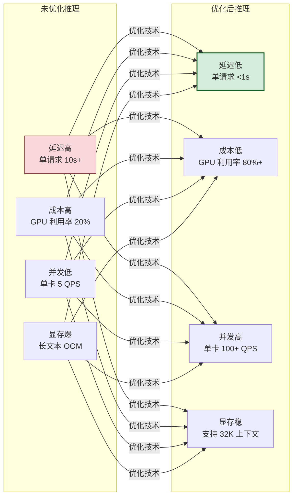

**量化的工程价值**:未优化推理的 7B 模型单卡并发约 5 QPS,GPU 利用率仅 20%;经量化 + PagedAttention + 连续批处理优化后,同一硬件可达 100+ QPS,利用率 80%+,**性能提升 20 倍、成本降低 95%**。

### 1.2 优化技术全景

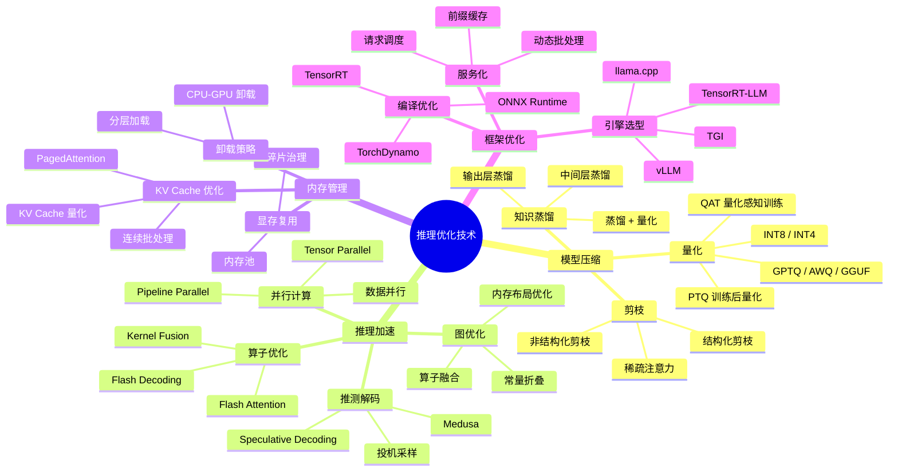

### 1.3 优化目标与衡量指标

| 指标 | 定义 | 优化方向 | 典型目标 |
|------|------|---------|---------|
| **TTFT** | Time To First Token,首 token 延迟 | 降低 Prefill 延迟 | < 500ms |
| **TPOT** | Time Per Output Token,每 token 生成时间 | 加速 Decode | < 30ms |
| **吞吐量** | 每秒处理 token 数(TPS) | 批处理 + 并行 | > 5000 TPS |
| **QPS** | 每秒请求数 | 并发提升 | > 100 |
| **显存利用率** | 实际使用 / 总显存 | 减少碎片 | > 80% |
| **成本效率** | 每千 token 成本 | 综合优化 | 降低 90% |

### 1.4 推理两阶段:优化的分水岭

```mermaid
flowchart LR
    subgraph Prefill 预填充阶段
        P1[输入 prompt<br/>批量 token]
        P2[并行计算]
        P3[填充 KV Cache]
        P4[计算密集型<br/>GPU 算力瓶颈]
    end
    
    subgraph Decode 解码阶段
        D1[逐个生成 token]
        D2[查询 KV Cache]
        D3[内存密集型<br/>显存带宽瓶颈]
    end
    
    Prefill 预填充阶段 --> Decode 解码阶段
    
    P4 -.优化重点.-> OPT1[算子优化<br/>Flash Attention<br/>并行计算]
    D3 -.优化重点.-> OPT2[显存优化<br/>PagedAttention<br/>推测解码]

    style P4 fill:#f8d7da,stroke:#721c24
    style D3 fill:#fff3cd,stroke:#d39e00
    style OPT1 fill:#d4edda,stroke:#155724
    style OPT2 fill:#d4edda,stroke:#155724
```

> **核心认知**:Prefill 是**计算密集**(GPU 算力瓶颈),Decode 是**内存密集**(显存带宽瓶颈)。两类瓶颈的优化手段截然不同——这是理解所有推理优化技术的基石。

---

## 二、推理性能瓶颈深度分析

### 2.1 瓶颈全景

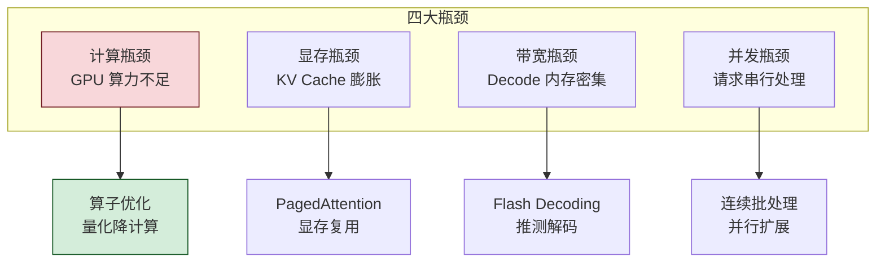

### 2.2 计算瓶颈分析

**FLOPs(浮点运算量)** 是计算瓶颈的核心指标。Transformer 推理的 FLOPs 主要来自矩阵乘法:

$$
\text{FLOPs}_{\text{Prefill}} \approx 2 \times N_{\text{params}} \times N_{\text{tokens}}
$$

$$
\text{FLOPs}_{\text{Decode}} \approx 2 \times N_{\text{params}} \times 1 \quad (\text{每生成一个 token})
$$

| 模型 | 参数量 | Prefill FLOPs(512 token) | Decode FLOPs(每 token) |
|------|:------:|:-----------------------:|:---------------------:|
| 7B | 7B | 7.2 TFLOPs | 14 GFLOPs |
| 13B | 13B | 13.3 TFLOPs | 26 GFLOPs |
| 70B | 70B | 71.7 TFLOPs | 140 GFLOPs |

**A100 GPU 算力参考**:312 TFLOPs(FP16)。理论上 7B 模型 Decode 理论极限约 22000 tokens/s,实际受带宽限制远低于此。

### 2.3 显存瓶颈分析

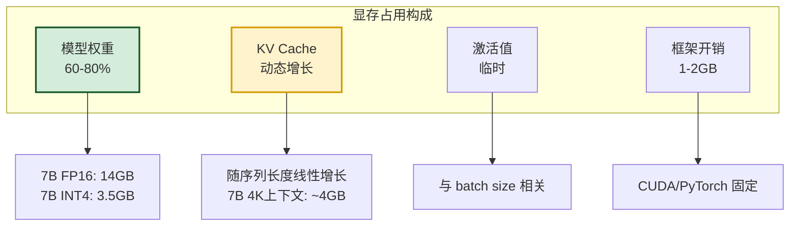

**KV Cache 计算公式**:

$$
\text{KV Cache} = 2 \times n_{\text{layers}} \times n_{\text{heads}} \times d_{\text{head}} \times \text{seq\_len} \times \text{batch} \times \text{bytes}
$$

| 模型 | 上下文 | 单请求 KV Cache(FP16) | 10 并发 KV Cache |
|------|:------:|:--------------------:|:----------------:|
| 7B (32层,32头) | 2K | ~1 GB | ~10 GB |
| 7B (32层,32头) | 8K | ~4 GB | ~40 GB |
| 70B (80层,64头) | 4K | ~10 GB | ~100 GB |

> **关键洞察**:KV Cache 随**上下文长度 × 并发数**线性增长,是显存瓶颈的**主因**。长上下文 + 高并发场景下,KV Cache 可达模型权重的数倍。

### 2.4 带宽瓶颈分析

Decode 阶段每生成一个 token,需读取**全部模型权重**一次(从显存到计算单元):

$$
\text{Decode 带宽需求} = \frac{N_{\text{params}} \times \text{bytes\_per\_param}}{\text{TPOT}}
$$

| 模型 | 精度 | 权重大小 | 30ms/token 所需带宽 |
|------|:----:|:--------:|:-------------------:|
| 7B | FP16 | 14 GB | 467 GB/s |
| 7B | INT4 | 3.5 GB | 117 GB/s |
| 70B | FP16 | 140 GB | 4667 GB/s |
| 70B | INT4 | 35 GB | 1167 GB/s |

**A100 显存带宽**:1555 GB/s(HBM2e)。可见 70B FP16 单卡**带宽不足**,必须量化或多卡并行。

### 2.5 瓶颈诊断方法

```python
"""
推理瓶颈诊断:通过指标判断是计算瓶颈还是带宽瓶颈
"""
def diagnose_bottleneck(model_params_b: float, 
                        precision_bytes: float,
                        decode_tpot_ms: float,
                        gpu_tflops: float,
                        gpu_bandwidth_gbs: float):
    """诊断 Decode 阶段瓶颈"""
    # 理论计算时间(ms)
    flops_per_token = 2 * model_params_b * 1e9  # FLOPs
    compute_time_ms = flops_per_token / (gpu_tflops * 1e12) * 1000
    
    # 理论带宽时间(ms)
    bytes_per_token = model_params_b * 1e9 * precision_bytes
    bandwidth_time_ms = bytes_per_token / (gpu_bandwidth_gbs * 1e9) * 1000
    
    # 瓶颈判定
    roofline = max(compute_time_ms, bandwidth_time_ms)
    utilization = roofline / decode_tpot_ms
    
    print(f"理论计算时间: {compute_time_ms:.2f} ms")
    print(f"理论带宽时间: {bandwidth_time_ms:.2f} ms")
    print(f"实际 TPOT:    {decode_tpot_ms:.2f} ms")
    print(f"Roofline 利用率: {utilization*100:.1f}%")
    
    if compute_time_ms > bandwidth_time_ms:
        print("→ 计算瓶颈(优化方向:量化/算子融合)")
    else:
        print("→ 带宽瓶颈(优化方向:量化/批处理/推测解码)")
    
    return {
        "bottleneck": "compute" if compute_time_ms > bandwidth_time_ms else "bandwidth",
        "utilization": utilization
    }

# 示例:7B 模型 FP16 在 A100 上
diagnose_bottleneck(
    model_params_b=7, precision_bytes=2,
    decode_tpot_ms=25, gpu_tflops=312, gpu_bandwidth_gbs=1555
)
# 输出:带宽瓶颈,Roofline 利用率 45%
```

---

## 三、模型压缩技术

### 3.1 模型压缩技术全景

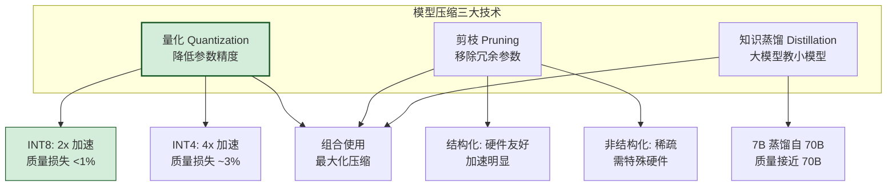

### 3.2 量化技术

#### 3.2.1 量化的本质

量化是将模型参数从**高精度(FP32/FP16)** 转换为**低精度(INT8/INT4)** 的过程,核心是用"精度损失"换取"速度提升 + 显存节省"。

```mermaid
flowchart LR
    subgraph FP16 半精度
        F1[每参数 2 字节<br/>7B = 14GB]
        F2[精度高<br/>质量无损]
    end
    
    subgraph INT8 量化
        I1[每参数 1 字节<br/>7B = 7GB]
        I2[精度损失 <1%]
    end
    
    subgraph INT4 量化
        I4[每参数 0.5 字节<br/>7B = 3.5GB]
        I5[精度损失 ~3%]
    end
    
    FP16 半精度 -.量化.-> INT8 量化 -.量化.-> INT4 量化

    style F1 fill:#e3f2fd,stroke:#1565c0
    style I1 fill:#fff3cd,stroke:#d39e00
    style I4 fill:#d4edda,stroke:#155724,stroke-width:2px
```

#### 3.2.2 量化方法分类

| 量化方法 | 时机 | 是否需训练 | 质量损失 | 易用性 | 代表算法 |
|---------|------|:---------:|:--------:|:------:|---------|
| **PTQ** 训练后量化 | 推理前 | ❌ | 小 | ⭐⭐⭐⭐⭐ | RTN、GPTQ、AWQ |
| **QAT** 量化感知训练 | 训练中 | ✅ | 极小 | ⭐⭐ | LLM-QAT |
| **动态量化** | 推理时 | ❌ | 中 | ⭐⭐⭐⭐ | PyTorch Dynamic |
| **静态量化** | 推理前 | ❌(需校准) | 小 | ⭐⭐⭐ | TensorRT INT8 |

#### 3.2.3 主流量化算法详解

**① RTN(Round-to-Nearest)** —— 最简单的量化:

```python
"""
RTN:最朴素的均匀量化
直接将 FP16 权重映射到 INT8/INT4
"""
import torch

def quantize_rtn(weight: torch.Tensor, n_bits: int = 8):
    """RTN 量化"""
    qmin = -(2 ** (n_bits - 1))
    qmax = 2 ** (n_bits - 1) - 1
    
    # 计算缩放因子
    max_val = weight.abs().max()
    scale = max_val / qmax
    
    # 量化 + 反量化
    quantized = torch.round(weight / scale).clamp(qmin, qmax)
    dequantized = quantized * scale
    
    return quantized.to(torch.int8), scale, dequantized

# 问题:RTN 对异常值敏感,大模型某些通道有异常大值
# 导致整体量化精度损失较大
```

**② GPTQ** —— 基于二阶信息的量化(当前主流):

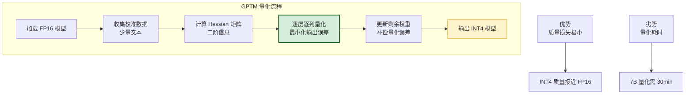

```python
"""
GPTQ 量化实践(使用 AutoGPTQ 库)
"""
from auto_gptq import AutoGPTQForCausalLM, BaseQuantizeConfig
from transformers import AutoTokenizer

# 1. 配置量化参数
quantize_config = BaseQuantizeConfig(
    bits=4,                # 量化到 4 bit
    group_size=128,        # 分组量化,每组 128 个参数
    desc_act=False,        # 是否按激活降序排列
)

# 2. 准备校准数据(少量文本即可)
tokenizer = AutoTokenizer.from_pretrained("meta-llama/Llama-2-7b")
calibration_texts = [
    "人工智能是计算机科学的一个分支...",
    "大语言模型通过预训练和微调...",
    # 约 128-1024 条文本
]

# 3. 加载并量化
model = AutoGPTQForCausalLM.from_pretrained(
    "meta-llama/Llama-2-7b",
    quantize_config,
)
model.quantize(calibration_texts)

# 4. 保存量化模型
model.save_quantized("./llama2-7b-gptq-4bit")

# 效果:14GB → 3.8GB,推理速度提升 2-3x,质量损失 <2%
```

**③ AWQ(Aware-Weight Quantization)** —— 基于激活感知的量化:

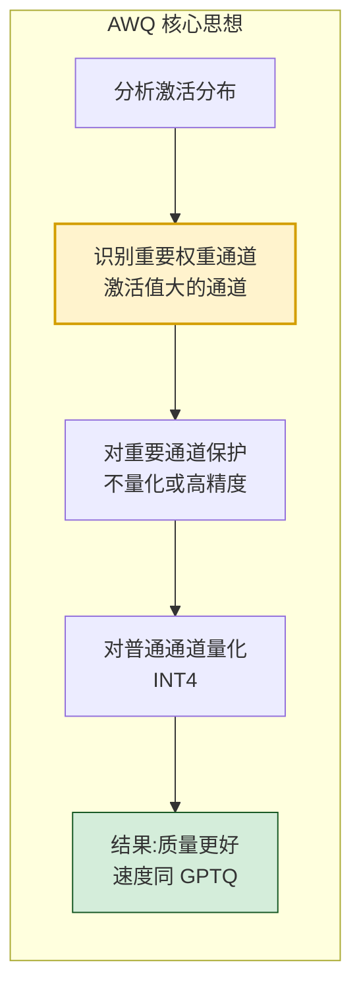

**④ GGUF** —— llama.cpp 生态的量化格式:

| GGUF 量化 | 比特 | 7B 大小 | 质量 | 适用 |
|-----------|:----:|:-------:|:----:|------|
| F16 | 16 | 13 GB | 满分 | 质量优先 |
| Q8_0 | 8 | 7 GB | 99% | 平衡 |
| Q5_K_M | 5 | 4.8 GB | 97% | **推荐** |
| Q4_K_M | 4 | 4.1 GB | 95% | 显存紧 |
| Q4_0 | 4 | 3.8 GB | 93% | 最小 |

> 详见 [142Ollama工作原理深度解析](./142Ollama工作原理深度解析与工程化实践.md) 第四章 GGUF 格式解析。

#### 3.2.4 量化的 Trade-offs

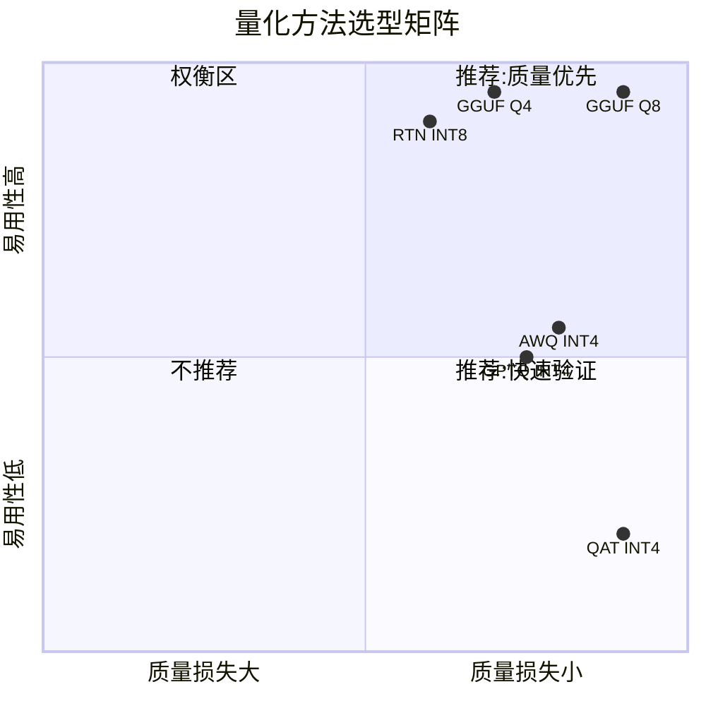

| 维度 | INT8 量化 | INT4 量化 | 全精度 FP16 |
|------|:--------:|:--------:|:----------:|
| **显存占用** | 50% | 25% | 100% |
| **推理速度** | 1.5-2x | 2-4x | 基准 |
| **质量损失** | <1% | 2-5% | 0% |
| **硬件要求** | 通用 | 需 INT4 支持 | 通用 |
| **推荐场景** | 质量优先 | 显存紧张 | 基线对比 |

### 3.3 剪枝技术

#### 3.3.1 剪枝的本质

剪枝是移除模型中**冗余或不重要**的参数(权重/通道/注意力头),使模型变"稀疏",从而减少计算量。

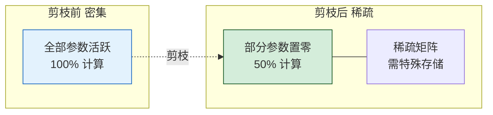

#### 3.3.2 剪枝分类

| 剪枝类型 | 粒度 | 硬件加速 | 质量损失 | 实用性 |
|---------|------|:--------:|:--------:|:------:|
| **非结构化剪枝** | 单个权重 | ❌ 需稀疏硬件 | 小 | 低 |
| **结构化剪枝** | 通道/头/层 | ✅ 直接加速 | 中 | **高** |
| **半结构化剪枝** | N:M 稀疏(2:4) | ✅ NVIDIA 支持 | 小 | 中 |

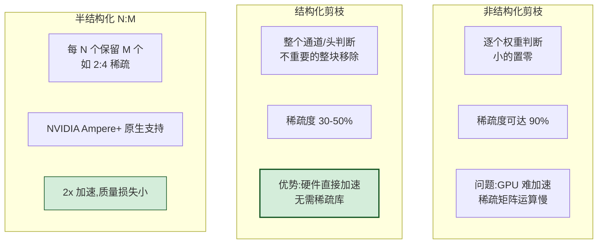

#### 3.3.3 LLM 剪枝实践

```python
"""
LLM 结构化剪枝示例:剪枝不重要的注意力头
"""
import torch
import torch.nn.utils.prune as prune

def prune_attention_heads(model, amount=0.3):
    """剪枝 30% 的注意力头"""
    for layer in model.transformer.h:
        # 计算每个注意力头的重要性(基于激活值)
        head_importance = compute_head_importance(layer.attn)
        
        # 找出不重要的头
        num_heads = layer.attn.num_heads
        num_prune = int(num_heads * amount)
        prune_heads = torch.argsort(head_importance)[:num_prune]
        
        # 应用结构化剪枝
        prune.custom_from_mask(
            layer.attn.q_proj, 'weight',
            mask=create_head_mask(num_heads, prune_heads)
        )

def compute_head_importance(attention_layer):
    """计算注意力头重要性(基于校准数据)"""
    importance = torch.zeros(attention_layer.num_heads)
    for batch in calibration_data:
        with torch.no_grad():
            outputs = attention_layer(batch)
            # 累积每个头的激活值范数
            importance += outputs.head_norms.sum(dim=0)
    return importance
```

**LLM 剪枝的现实局限**:

| 局限 | 说明 | 现状 |
|------|------|------|
| **质量损失大** | LLM 对剪枝敏感,50% 剪枝质量显著下降 | 实用稀疏度仅 10-20% |
| **训练成本高** | 剪枝后需重训练恢复精度 | LLM 重训练成本极高 |
| **加速有限** | 结构化剪枝 20% 对实际加速不明显 | 不如量化收益直接 |

> **工程结论**:对 LLM 而言,**量化是首选压缩手段**,剪枝在 LLM 场景**收益有限且成本高**,主要用于 CNN 等小模型。LLM 中"剪枝"更多指**稀疏注意力**(降低注意力计算复杂度),而非权重剪枝。

### 3.4 知识蒸馏

#### 3.4.1 蒸馏的本质

知识蒸馏(Knowledge Distillation)是用**大模型(Teacher)** 指导**小模型(Student)** 训练,让小模型"学到"大模型的能力,实现"**小模型接近大模型质量**"。

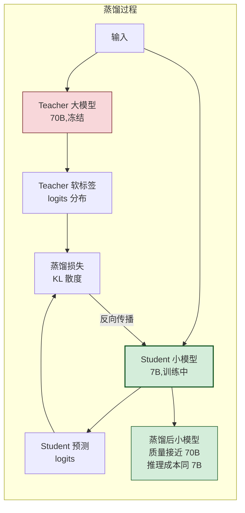

#### 3.4.2 蒸馏方法分类

| 蒸馏类型 | 蒸馏内容 | 优势 | 代表 |
|---------|---------|------|------|
| **输出层蒸馏** | logits 软标签 | 简单易行 | DistilBERT |
| **中间层蒸馏** | 隐藏状态/注意力 | 信息更丰富 | TinyBERT |
| **序列级蒸馏** | 生成文本作为标签 | 适合生成任务 | Alpaca/ Vicuna |
| **白盒蒸馏** | 需 Teacher 权重 | 蒸馏彻底 | GPT-2→DistilGPT2 |
| **黑盒蒸馏** | 仅 API 调用 | 适用闭源模型 | GPT-4→小模型 |

#### 3.4.3 LLM 蒸馏实践

```python
"""
LLM 黑盒蒸馏:用 GPT-4 生成训练数据,蒸馏到开源小模型
这是目前最实用的 LLM 蒸馏方式
"""
import openai

def generate_distillation_data(teacher_model="gpt-4", num_samples=10000):
    """用 Teacher 模型生成蒸馏数据"""
    prompts = load_diverse_prompts(num_samples)  # 多样化 prompt
    distilled_data = []
    
    for prompt in prompts:
        # Teacher(GPT-4)生成高质量回答
        teacher_response = openai.ChatCompletion.create(
            model=teacher_model,
            messages=[{"role": "user", "content": prompt}],
            temperature=0.7,
        )
        
        distilled_data.append({
            "prompt": prompt,
            "response": teacher_response.choices[0].message.content,
            "teacher_model": teacher_model,
        })
    
    return distilled_data

# 用蒸馏数据微调 Student 模型(标准 SFT)
def distill_to_student(data, student_model="meta-llama/Llama-2-7b"):
    """用 Teacher 生成的数据训练 Student"""
    from transformers import AutoModelForCausalLM, Trainer
    
    model = AutoModelForCausalLM.from_pretrained(student_model)
    
    # 标准 SFT 训练
    trainer = Trainer(
        model=model,
        train_dataset=format_sft_dataset(data),
        args=TrainingArguments(
            output_dir="./distilled-7b",
            num_train_epochs=3,
            learning_rate=2e-5,
        ),
    )
    trainer.train()
```

**蒸馏效果参考**:

| Student | Teacher | 训练数据 | 质量达 Teacher | 推理成本 |
|---------|---------|:-------:|:--------------:|:--------:|
| 7B | GPT-4 | 52K(Alpaca) | ~60% | 1/100 |
| 7B | GPT-4 | 1M(Vicuna) | ~75% | 1/100 |
| 13B | GPT-4 | 1M | ~85% | 1/50 |
| 7B | 70B(同架构) | 共享预训练 | ~90% | 1/10 |

#### 3.4.4 蒸馏的 Trade-offs

| 维度 | 优势 | 劣势 |
|------|------|------|
| **质量** | 小模型接近大模型 | 难完全达到 Teacher 水平 |
| **成本** | 推理成本大幅降低 | 蒸馏训练成本高(需大量数据) |
| **灵活性** | Student 可定制大小 | Teacher 能力上限限制 Student |
| **合规** | 黑盒蒸馏规避模型权重问题 | Teacher API 成本高 |

---

## 四、推理加速技术

### 4.1 算子优化

#### 4.1.1 Kernel Fusion(算子融合)

**核心思想**:将多个小算子融合为一个大算子,减少 GPU kernel 启动开销与显存读写次数。

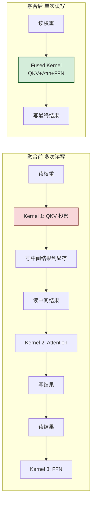

**典型融合案例**:

| 融合组合 | 融合前算子 | 融合后 | 加速 |
|---------|-----------|--------|:----:|
| **QKV 融合** | Q_proj + K_proj + V_proj | QKV_proj | 1.3x |
| **Attention 融合** | Softmax + Dropout + MatMul | Fused Attention | 2x |
| **FFN 融合** | Linear + GELU + Linear | Fused FFN | 1.5x |
| **LayerNorm 融合** | Mean + Var + Norm + Scale | Fused LayerNorm | 1.2x |

#### 4.1.2 Flash Attention(革命性算子优化)

**Flash Attention** 是近年来 LLM 推理最重要的算子优化——通过**分块计算 + IO 感知**,将注意力计算的显存读写从 O(n²) 降到 O(n),实现 2-4 倍加速。

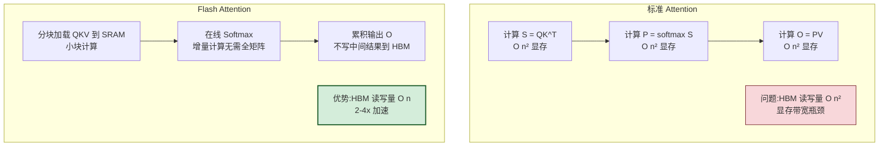

```python
"""
Flash Attention 使用(vLLM / PyTorch 2.0+ 内置)
"""
# PyTorch 2.0+ 内置 Flash Attention
import torch
from torch.nn.functional import scaled_dot_product_attention

# 自动选择最优后端(含 Flash Attention)
output = scaled_dot_product_attention(
    query, key, value,
    attn_mask=None,
    dropout_p=0.0,
    is_causal=True,    # 因果掩码
)

# vLLM 中默认启用 Flash Attention
# 启动参数:
# vllm serve --model llama3 --enable-flash-attn
```

| Attention 实现 | HBM 读写 | 长序列(8K)速度 | 显存占用 |
|---------------|:--------:|:--------------:|:--------:|
| 标准 Attention | O(n²) | 1x(基准) | 高 |
| Flash Attention v1 | O(n) | 2-3x | 低 |
| Flash Attention v2 | O(n) | 3-4x | 低 |
| Flash Decoding | O(n) | 4-8x(Decode) | 低 |

#### 4.1.3 Flash Decoding

**Flash Decoding** 是 Flash Attention 在 **Decode 阶段**的优化——Decode 时序列长度为 1,但 KV Cache 很长,Flash Decoding 将 KV Cache 分块并行计算:

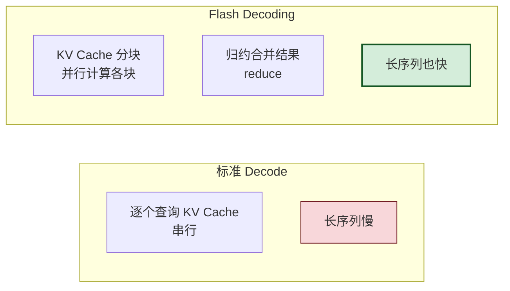

### 4.2 计算图优化

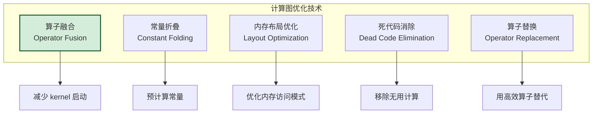

```python
"""
计算图优化示例(TorchDynamo + TorchInductor)
PyTorch 2.0 的编译优化
"""
import torch

# 原始模型
class LLMBlock(torch.nn.Module):
    def __init__(self):
        super().__init__()
        self.qkv = torch.nn.Linear(4096, 3*4096)
        self.ffn = torch.nn.Linear(4096, 11008)
        self.norm = torch.nn.LayerNorm(4096)
    
    def forward(self, x):
        # 原始计算图:多个独立算子
        x = self.norm(x)
        qkv = self.qkv(x)
        q, k, v = qkv.chunk(3, dim=-1)
        attn = torch.matmul(q, k.transpose(-2, -1))
        attn = torch.softmax(attn, dim=-1)
        out = torch.matmul(attn, v)
        out = self.ffn(out)
        return out

model = LLMBlock().cuda()

# 优化前:直接执行
output = model(input)

# 优化后:torch.compile 自动图优化
compiled_model = torch.compile(model, mode="max-autotune")
# TorchInductor 自动:
# 1. 融合 LayerNorm + QKV 投影
# 2. 融合 Softmax + MatMul
# 3. 优化内存布局
# 4. 生成 Triton/CUDA kernel
output = compiled_model(input)  # 加速 1.5-2x
```

### 4.3 并行计算

#### 4.3.1 并行策略全景

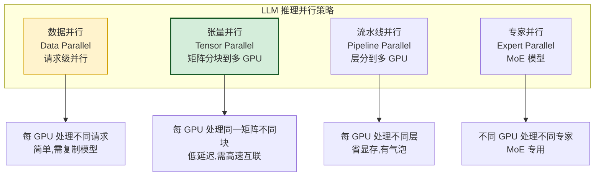

#### 4.3.2 张量并行(Tensor Parallel)—— 推理最常用

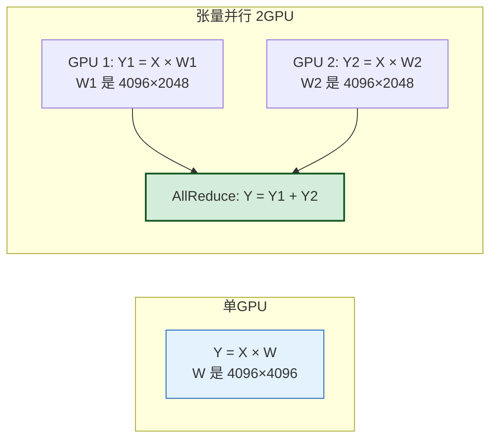

| 并行方式 | 切分维度 | 通信量 | 延迟 | 适用 |
|---------|---------|:------:|:----:|------|
| **列并行** | 按输出维度切 | All-Reduce | 低 | FFN 第一层 |
| **行并行** | 按输入维度切 | All-Reduce | 低 | FFN 第二层 |
| **2D 并行** | 行+列混合 | 优化 | 中 | 大模型 |

```python
"""
vLLM 张量并行启动(最简单的 TP 实践)
"""
# 单 GPU 启动(70B 模型无法单卡加载)
# vllm serve --model llama3-70b

# 4 GPU 张量并行启动
# vllm serve --model llama3-70b --tensor-parallel-size 4

# 效果:
# - 70B 模型分到 4 张 GPU,每张约 17.5GB 权重
# - 推理时 4 GPU 并行计算,延迟接近单卡的 1/2
# - 需 NVLink 高速互联(否则通信开销大)
```

#### 4.3.3 并行策略选型

| 场景 | 推荐并行 | 理由 |
|------|---------|------|
| **多请求高吞吐** | 数据并行 | 简单,线性扩展 |
| **大模型单卡装不下** | 张量并行 | 分担显存,低延迟 |
| **超大模型(175B+)** | TP + PP | 混合并行 |
| **MoE 模型** | 专家并行 | 按专家分布 |
| **多节点部署** | PP + DP | 节点内 TP,节点间 PP |

### 4.4 Speculative Decoding(推测解码)

#### 4.4.1 核心原理

**推测解码**是 Decode 阶段的**革命性加速**——用小模型"猜测"多个 token,大模型"并行验证",减少大模型的前向次数。

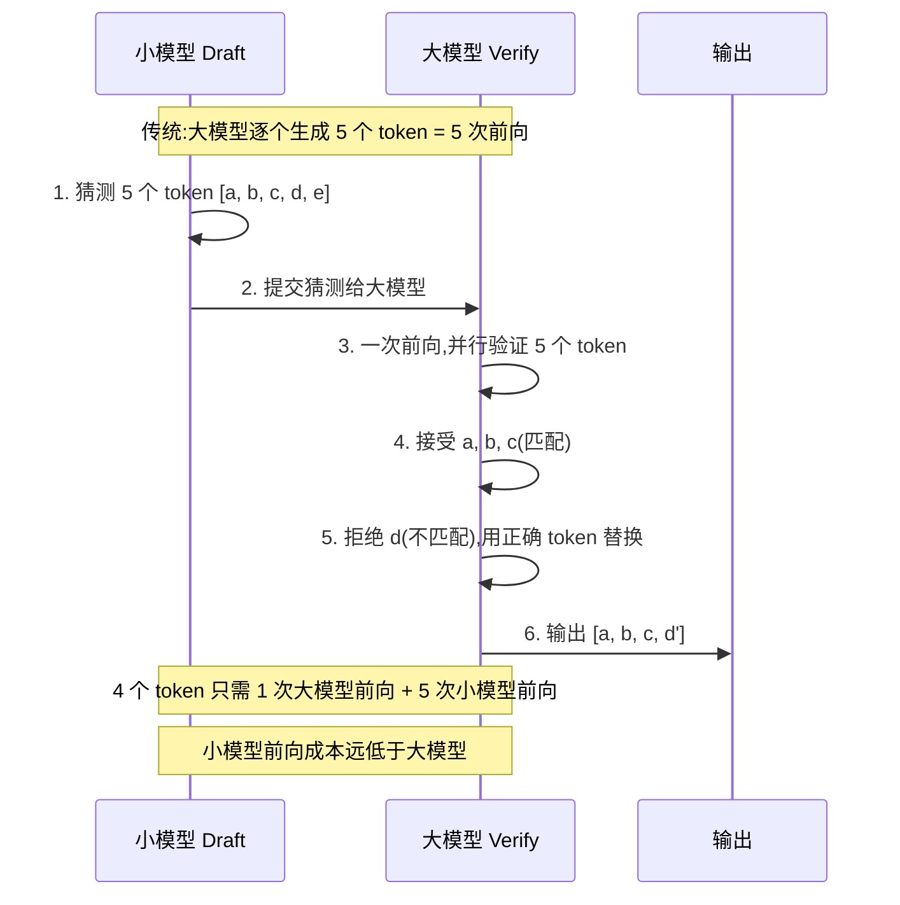

#### 4.4.2 推测解码变体

```mermaid
graph TB
    subgraph 推测解码方案
        SD1[标准 Speculative Decoding<br/>Draft 模型 + Target 模型]
        SD2[Medusa<br/>多个预测头,无需 Draft 模型]
        SD3[Eagle<br/>自推测,单模型多步]
        SD4[Lookahead Decoding<br/>N-gram 猜测]
    end
    
    SD1 --> R1[2-3x 加速<br/>需额外小模型]
    SD2 --> R2[2x 加速<br/>无需小模型,改模型结构]
    SD3 --> R3[3x 加速<br/>单模型,延迟低]
    SD4 --> R4[1.5x 加速<br/>无需模型,纯算法]

    style SD1 fill:#d4edda,stroke:#155724,stroke-width:2px
    style SD3 fill:#d4edda,stroke:#155724
```

#### 4.4.3 推测解码的 Trade-offs

| 维度 | 优势 | 劣势 |
|------|------|------|
| **速度** | Decode 阶段 2-3x 加速 | Draft 模型也需计算 |
| **质量** | **无损**(拒绝采样保证) | - |
| **显存** | 需额外 Draft 模型 | 显存增加 |
| **接受率** | 依赖 Draft 与 Target 相似度 | 草稿接受率低时反而变慢 |
| **适用** | 生成任务(Decode 重) | Prefill 重任务收益小 |

> **关键优势**:推测解码是**无损加速**——通过拒绝采样保证输出分布与原模型完全一致,不牺牲质量。这是它与量化(有损)的本质区别。

---

## 五、内存与显存管理优化

### 5.1 KV Cache 优化(核心)

#### 5.1.1 KV Cache 的问题

```mermaid
graph TB
    subgraph 传统 KV Cache 问题
        P1[预分配固定大小<br/>按最大序列长度]
        P2[显存碎片化<br/>请求结束释放不连续]
        P3[利用率低<br/>实际仅用 20-40%]
        P4[无法共享<br/>相同前缀重复存储]
    end
    
    P1 & P2 & P3 & P4 --> WASTE[浪费 60-80% 显存]

    style WASTE fill:#f8d7da,stroke:#721c24,stroke-width:2px
```

#### 5.1.2 PagedAttention(分页注意力)

**PagedAttention**(vLLM 创新)借鉴操作系统**虚拟内存分页**机制,将 KV Cache 组织为固定大小的"页",按需分配:

```mermaid
flowchart TB
    subgraph 传统连续分配
        T1[请求 A: 预分配 2048]
        T2[请求 B: 预分配 2048]
        T3[请求 C: 预分配 2048]
        T4[实际使用不均<br/>碎片严重]
    end
    
    subgraph PagedAttention 分页
        P1[逻辑地址<br/>虚拟连续]
        P2[物理页表<br/>按需映射]
        P3[请求 A: 用 3 页]
        P4[请求 B: 用 5 页]
        P5[请求 C: 用 2 页]
        P6[共享页: 相同前缀复用]
    end
    
    T1 & T2 & T3 --> T4
    P1 --> P2 --> P3 & P4 & P5 & P6

    style T4 fill:#f8d7da,stroke:#721c24
    style P6 fill:#d4edda,stroke:#155724,stroke-width:2px
```

| 维度 | 传统 KV Cache | PagedAttention |
|------|:------------:|:--------------:|
| **显存利用率** | 20-40% | **80-95%** |
| **碎片** | 严重 | 几乎无 |
| **前缀共享** | ❌ | ✅ |
| **并发提升** | 基准 | **3-5x** |

> 详见 [3vLLM技术深度解析与推理优化.md](./3vLLM技术深度解析与推理优化.md) 中 PagedAttention 章节。

#### 5.1.3 连续批处理(Continuous Batching)

**传统批处理**:必须等批内所有请求完成才能处理下一批(队头阻塞)。

**连续批处理**:请求动态加入/退出批次,不等慢请求:

```mermaid
gantt
    title 连续批处理 vs 传统批处理
    dateFormat X
    axisFormat %s
    
    section 传统批处理
    批次1 A(长)  :a1, 0, 10
    批次1 B(短)  :a2, 0, 3
    批次1 C(中)  :a3, 0, 6
    等待 A 完成   :wait, 6, 4
    批次2 D      :a4, 10, 5
    
    section 连续批处理
    A(长)       :b1, 0, 10
    B(短)       :b2, 0, 3
    C(中)       :b3, 0, 6
    D(B完成后立即加入) :b4, 3, 5
    E(C完成后加入)     :b5, 6, 4
```

| 批处理方式 | 吞吐量 | 延迟 | 实现复杂度 |
|-----------|:------:|:----:|:---------:|
| 静态批处理 | 1x | 高 | 低 |
| 动态批处理 | 2-3x | 中 | 中 |
| **连续批处理** | **5-10x** | **低** | 高 |

### 5.2 显存复用与碎片治理

```python
"""
PyTorch 显存管理优化
"""
import torch

# === 1. 显存碎片治理 ===
def reduce_fragmentation():
    """减少显存碎片"""
    # 设置 PYTORCH_CUDA_ALLOC_CONF 环境变量
    import os
    os.environ['PYTORCH_CUDA_ALLOC_CONF'] = (
        'max_split_size_mb:128,'    # 限制最大分块
        'garbage_collection_threshold:0.6'  # GC 阈值
    )

# === 2. 显存复用 ===
class MemoryPool:
    """显存池:复用已分配显存"""
    def __init__(self, total_size):
        self.pool = torch.empty(total_size, device='cuda')
        self.allocator = BlockAllocator(self.pool)
    
    def allocate(self, size):
        """分配(从池中取,不重新分配)"""
        return self.allocator.alloc(size)
    
    def free(self, block):
        """释放(归还池,不真正释放)"""
        self.allocator.free(block)

# === 3. 梯度检查点(训练用,推理可借鉴) ===
# 推理时不存梯度,但可借鉴"用计算换显存"思路
```

### 5.3 CPU-GPU 内存卸载

```mermaid
flowchart LR
    subgraph 分层存储
        GPU[GPU 显存<br/>最快,最小<br/>放热数据]
        CPU[CPU 内存<br/>快,较大<br/>放温数据]
        SSD[SSD 磁盘<br/>慢,最大<br/>放冷数据]
    end
    
    GPU -.卸载.-> CPU
    CPU -.卸载.-> SSD
    
    GPU -->|推理热层| R1[注意力层 放 GPU]
    CPU -->|推理冷层| R2[FFN 层 放 CPU]

    style GPU fill:#d4edda,stroke:#155724,stroke-width:2px
    style CPU fill:#fff3cd,stroke:#d39e00
    style SSD fill:#f8d7da,stroke:#721c24
```

**DeepSpeed Zero-Offload / FlexGen** 等方案支持将部分权重或 KV Cache 卸载到 CPU 内存,代价是增加 PCIe 传输延迟:

| 策略 | GPU 显存 | 速度 | 适用 |
|------|:--------:|:----:|------|
| 全 GPU | 高 | 最快 | 显存充足 |
| 权重卸载 | 低 50% | 慢 30% | 显存紧张 |
| KV Cache 卸载 | 低 70% | 慢 50% | 长上下文 |
| 分层卸载 | 低 80% | 慢 70% | 极限省显存 |

### 5.4 KV Cache 量化

```python
"""
KV Cache 量化:将 KV Cache 从 FP16 量化到 INT8
减少 KV Cache 显存占用 50%
"""
# vLLM 中启用 KV Cache 量化
# vllm serve --model llama3 --kv-cache-dtype int8

# 或 FP8(Ampere+ GPU)
# vllm serve --model llama3 --kv-cache-dtype fp8
```

| KV Cache 精度 | 显存占用 | 质量影响 | 并发提升 |
|:------------:|:--------:|:--------:|:--------:|
| FP16 | 100% | 无 | 基准 |
| INT8 | 50% | <0.5% | 2x |
| FP8 | 50% | <0.3% | 2x |
| INT4 | 25% | ~2% | 4x |

---

## 六、部署框架优化

### 6.1 主流推理框架对比

```mermaid
graph TB
    subgraph 推理框架选型
        V[vLLM<br/>高吞吐,通用]
        T[TensorRT-LLM<br/>NVIDIA 极致优化]
        H[TGI<br/>HuggingFace 生态]
        O[Ollama<br/>本地轻量]
        L[llama.cpp<br/>CPU/边缘]
        S[SGLang<br/>前沿研究]
    end
    
    V -->|场景| V1[生产高并发服务]
    T -->|场景| T1[NVIDIA 极致性能]
    H -->|场景| H1[HF 模型快速部署]
    O -->|场景| O1[本地开发测试]
    L -->|场景| L1[CPU/嵌入式]
    S -->|场景| S1[研究尝鲜]

    style V fill:#d4edda,stroke:#155724,stroke-width:2px
    style T fill:#fff3cd,stroke:#d39e00,stroke-width:2px
```

| 框架 | 吞吐量 | 延迟 | 易用性 | 量化支持 | 并行 | 推荐场景 |
|------|:------:|:----:|:------:|:--------:|:----:|---------|
| **vLLM** | ⭐⭐⭐⭐⭐ | 低 | ⭐⭐⭐⭐ | GPTQ/AWQ | TP | **生产首选** |
| **TensorRT-LLM** | ⭐⭐⭐⭐⭐ | 极低 | ⭐⭐ | INT8/FP8 | TP/PP | NVIDIA 极致 |
| **TGI** | ⭐⭐⭐⭐ | 低 | ⭐⭐⭐⭐⭐ | GPTQ/AWQ | TP | HF 生态 |
| **Ollama** | ⭐⭐⭐ | 中 | ⭐⭐⭐⭐⭐ | GGUF | ❌ | 本地/边缘 |
| **llama.cpp** | ⭐⭐⭐ | 中 | ⭐⭐⭐ | GGUF | ❌ | CPU/嵌入式 |
| **SGLang** | ⭐⭐⭐⭐⭐ | 极低 | ⭐⭐⭐ | GPTQ | TP | 前沿研究 |

### 6.2 服务化优化

#### 6.2.1 动态批处理

```python
"""
动态批处理:等待短窗口积累请求,提高 batch size
"""
import asyncio
from collections import deque

class DynamicBatcher:
    """动态批处理器"""
    
    def __init__(self, max_batch_size=32, max_wait_ms=50):
        self.max_batch_size = max_batch_size
        self.max_wait_ms = max_wait_ms
        self.queue = deque()
    
    async def submit(self, request) -> dict:
        """提交请求,等待批处理"""
        future = asyncio.get_event_loop().create_future()
        self.queue.append((request, future))
        return await future
    
    async def batch_loop(self, model):
        """批处理主循环"""
        while True:
            batch = []
            futures = []
            
            # 等待第一个请求
            while not self.queue:
                await asyncio.sleep(0.001)
            
            # 积累请求(最多 max_batch_size 或等待 max_wait_ms)
            deadline = asyncio.get_event_loop().time() + self.max_wait_ms / 1000
            while len(batch) < self.max_batch_size:
                if self.queue:
                    req, fut = self.queue.popleft()
                    batch.append(req)
                    futures.append(fut)
                if asyncio.get_event_loop().time() > deadline:
                    break
                await asyncio.sleep(0.001)
            
            # 批量推理
            results = await model.batch_generate(batch)
            
            # 返回各请求结果
            for fut, result in zip(futures, results):
                fut.set_result(result)
```

#### 6.2.2 前缀缓存(Prefix Caching)

```mermaid
flowchart LR
    subgraph 无前缀缓存
        R1[请求: 系统提示 + 问题1] --> P1[重新计算全部]
        R2[请求: 系统提示 + 问题2] --> P2[重新计算全部<br/>相同系统提示重复计算]
    end
    
    subgraph 有前缀缓存
        R3[请求: 系统提示 + 问题1] --> C1[计算并缓存系统提示 KV]
        R4[请求: 系统提示 + 问题2] --> C2[命中缓存<br/>只计算问题2]
    end

    style P2 fill:#f8d7da,stroke:#721c24
    style C2 fill:#d4edda,stroke:#155724,stroke-width:2px
```

```bash
# vLLM 启用前缀缓存
vllm serve --model llama3 --enable-prefix-caching

# 效果:多轮对话、相同系统提示场景,Prefill 速度提升 3-10x
```

#### 6.2.3 请求调度优化

```mermaid
flowchart TB
    subgraph 请求调度策略
        S1[优先级调度<br/>VIP 请求优先]
        S2[公平调度<br/>租户公平份额]
        S3[延迟感知<br/>超时请求优先]
        S4[长度感知<br/>短请求与长请求分离]
    end
    
    S1 & S2 & S3 & S4 --> OPT[最优批处理组合]

    style OPT fill:#d4edda,stroke:#155724,stroke-width:2px
```

### 6.3 编译优化

| 编译技术 | 原理 | 加速 | 框架 |
|---------|------|:----:|------|
| **TorchDynamo** | JIT 捕获计算图 | 1.3-2x | PyTorch 2.0+ |
| **TorchInductor** | 生成 Triton/CUDA kernel | 1.5-2x | PyTorch 2.0+ |
| **TensorRT** | 算子融合 + INT8 | 2-5x | NVIDIA |
| **ONNX Runtime** | 跨平台图优化 | 1.5-3x | ONNX |
| **XLA** | 编译优化 | 1.3-1.5x | JAX/TF |

```python
"""
PyTorch 2.0 编译优化
"""
import torch

model = LlamaForCausalLM.from_pretrained("meta-llama/Llama-2-7b")

# 方式1: 默认编译
compiled = torch.compile(model)

# 方式2: 最大优化(编译时间更长)
compiled_max = torch.compile(model, mode="max-autotune")

# 方式3: 减少开销(适合小模型)
compiled_reduce = torch.compile(model, mode="reduce-overhead")

# 效果:推理速度提升 1.5-2x,首次运行有编译开销
```

---

## 七、工程实践场景与选型

### 7.1 场景化优化策略

```mermaid
flowchart TB
    START[推理优化需求] --> Q1{部署场景?}
    
    Q1 -- 云端高并发 --> C1[场景: API 服务]
    Q1 -- 本地/边缘 --> C2[场景: 私有部署]
    Q1 -- 移动端 --> C3[场景: 端侧推理]
    Q1 -- 超大模型 --> C4[场景: 175B+ 推理]
    
    C1 --> S1[vLLM + INT8/INT4<br/>+ PagedAttention<br/>+ 连续批处理]
    C2 --> S2[Ollama + GGUF Q4<br/>+ mmap 加载<br/>+ keep_alive]
    C3 --> S3[llama.cpp + Q4_0<br/>+ 2:4 稀疏<br/>+ 小模型蒸馏]
    C4 --> S4[TensorRT-LLM + FP8<br/>+ TP 8卡<br/>+ 推测解码]

    style S1 fill:#d4edda,stroke:#155724,stroke-width:2px
    style S2 fill:#fff3cd,stroke:#d39e00
    style S3 fill:#d1ecf1,stroke:#0c5460
    style S4 fill:#f8d7da,stroke:#721c24
```

### 7.2 组合优化策略矩阵

| 场景 | 量化 | 算子 | 显存 | 并行 | 框架 | 综合加速 |
|------|:----:|:----:|:----:|:----:|:----:|:--------:|
| **云端 7B 服务** | INT4(GPTQ) | Flash Attn v2 | PagedAttention | DP | vLLM | 10-20x |
| **云端 70B 服务** | INT8 | Flash Attn v2 | PagedAttention+KV量化 | TP 4卡 | vLLM | 5-10x |
| **本地开发** | GGUF Q4 | - | mmap | - | Ollama | 3-5x |
| **CPU 推理** | Q4_0 | - | mmap | 多线程 | llama.cpp | 2-3x |
| **极致性能** | FP8 | Flash Attn v2 | PagedAttention | TP 8卡 | TRT-LLM | 15-30x |
| **长上下文** | INT8 KV | Flash Decoding | PagedAttention | TP | vLLM | 5-8x |

### 7.3 性能基准参考

**测试环境**:A100 80GB × 8,Llama2-70B,FP16 vs 优化后

| 优化组合 | 显存 | QPS | P99 延迟 | 吞吐(TPS) | 加速比 |
|---------|:----:|:---:|:--------:|:---------:|:------:|
| 基线(FP16,HuggingFace) | 140GB(2卡) | 5 | 2000ms | 150 | 1x |
| + Flash Attention | 140GB | 8 | 1200ms | 240 | 1.6x |
| + PagedAttention | 80GB(1卡) | 20 | 500ms | 600 | 4x |
| + 连续批处理 | 80GB | 60 | 400ms | 1800 | 12x |
| + INT8 量化 | 45GB | 100 | 300ms | 3000 | 20x |
| + 推测解码 | 45GB | 100 | 200ms | 3000 | 20x(延迟更低) |
| + TensorRT-LLM | 45GB | 150 | 150ms | 4500 | 30x |

### 7.4 选型决策树

```mermaid
flowchart TB
    START[开始选型] --> Q1{模型大小?}
    
    Q1 -- <7B --> Q2{部署环境?}
    Q2 -- 本地 --> OLLAMA[Ollama + GGUF Q4]
    Q2 -- 云端 --> VLLM_SMALL[vLLM + INT4]
    
    Q1 -- 7B-70B --> Q3{显存是否充足?}
    Q3 -- 是 --> VLLM[vLLM + Flash Attn + PagedAttn]
    Q3 -- 否 --> QUANT[INT4 量化 + vLLM]
    
    Q1 -- >70B --> Q4{GPU 数量?}
    Q4 -- ≤8 --> VLLM_TP[vLLM + TP 4-8]
    Q4 -- >8 --> TRT[TensorRT-LLM + TP+PP]
    
    Q1 -- MoE --> SGLANG[SGLang + 专家并行]

    style OLLAMA fill:#fff3cd,stroke:#d39e00
    style VLLM fill:#d4edda,stroke:#155724,stroke-width:2px
    style TRT fill:#f8d7da,stroke:#721c24
```

---

## 八、性能评估与基准测试

### 8.1 评估指标体系

```mermaid
mindmap
  root((性能评估))
    延迟指标
      TTFT 首 Token 延迟
      TPOT 每 Token 延迟
      E2E 端到端延迟
    吞吐指标
      QPS 每秒请求数
      TPS 每秒 Token 数
      并发数
    资源指标
      GPU 利用率
      显存利用率
      CPU 利用率
    质量指标
      困惑度 PPL
      下游任务准确率
      人工评估
```

### 8.2 基准测试方法

```python
"""
推理性能基准测试脚本
"""
import time
import asyncio
import statistics
import aiohttp

async def benchmark(url, prompts, concurrency=10):
    """并发基准测试"""
    results = {
        "ttft": [],      # 首 token 延迟
        "tpot": [],      # 每 token 延迟
        "total": [],     # 总延迟
        "tokens": [],    # 生成 token 数
    }
    
    semaphore = asyncio.Semaphore(concurrency)
    
    async def single_request(prompt):
        async with semaphore:
            start = time.time()
            first_token_time = None
            token_count = 0
            
            async with aiohttp.ClientSession() as session:
                async with session.post(f"{url}/v1/chat/completions", json={
                    "model": "llama3",
                    "messages": [{"role": "user", "content": prompt}],
                    "stream": True,
                }) as resp:
                    async for line in resp.content:
                        if line.startswith(b"data: ") and b"[DONE]" not in line:
                            if first_token_time is None:
                                first_token_time = time.time()
                            token_count += 1
            
            end = time.time()
            results["ttft"].append(first_token_time - start)
            results["total"].append(end - start)
            results["tokens"].append(token_count)
            if token_count > 1:
                results["tpot"].append((end - first_token_time) / (token_count - 1))
    
    await asyncio.gather(*[single_request(p) for p in prompts])
    
    # 统计
    return {
        "ttft_p50": statistics.median(results["ttft"]),
        "ttft_p99": sorted(results["ttft"])[int(len(results["ttft"]) * 0.99)],
        "tpot_avg": statistics.mean(results["tpot"]),
        "qps": len(prompts) / max(results["total"]),
        "tps": sum(results["tokens"]) / max(results["total"]),
    }
```

### 8.3 优化效果评估表

| 优化技术 | 延迟改善 | 吞吐提升 | 显存节省 | 质量影响 | 实现难度 |
|---------|:--------:|:--------:|:--------:|:--------:|:--------:|
| INT8 量化 | 1.5x | 2x | 50% | <1% | 低 |
| INT4 量化 | 2-3x | 3-4x | 75% | 2-5% | 低 |
| Flash Attention | 2-3x | 2-3x | 低 | 无 | 中(框架内置) |
| PagedAttention | 1.5x | 3-5x | 60% | 无 | 高(框架内置) |
| 连续批处理 | 1.3x | 5-10x | 无 | 无 | 高(框架内置) |
| 推测解码 | 2-3x | 1.5x | 无 | 无 | 中 |
| 张量并行 | 1.5x | 1.5x | 分担 | 无 | 中 |
| 前缀缓存 | 3-10x(Prefill) | 2x | 无 | 无 | 中 |

---

## 九、最佳实践与避坑指南

### 9.1 优化优先级(Do's)

```mermaid
flowchart TB
    subgraph 优化优先级 从高到低
        P1[1. 选对框架<br/>vLLM/TRT-LLM]
        P2[2. 启用 Flash Attention<br/>零成本最大收益]
        P3[3. PagedAttention + 连续批处理<br/>框架内置,必开]
        P4[4. 合适量化<br/>INT8 无损,INT4 微损]
        P5[5. 前缀缓存<br/>多轮对话场景必开]
        P6[6. 推测解码<br/>生成任务进一步加速]
        P7[7. 张量并行<br/>大模型或多卡时]
    end
    
    P1 --> P2 --> P3 --> P4 --> P5 --> P6 --> P7

    style P1 fill:#d4edda,stroke:#155724,stroke-width:3px
    style P2 fill:#d4edda,stroke:#155724,stroke-width:2px
    style P7 fill:#fff3cd,stroke:#d39e00
```

| 优先级 | 优化项 | 投入产出比 | 说明 |
|:------:|--------|:---------:|------|
| ⭐⭐⭐⭐⭐ | 选对框架 | 极高 | vLLM 默认含多项优化 |
| ⭐⭐⭐⭐⭐ | Flash Attention | 极高 | 框架一键启用 |
| ⭐⭐⭐⭐⭐ | PagedAttention + 连续批处理 | 极高 | vLLM 默认开启 |
| ⭐⭐⭐⭐ | INT8 量化 | 高 | 无损,省一半显存 |
| ⭐⭐⭐⭐ | 前缀缓存 | 高 | 多轮对话必备 |
| ⭐⭐⭐ | INT4 量化(GPTQ) | 中高 | 微损,省 75% 显存 |
| ⭐⭐⭐ | 推测解码 | 中 | 生成任务加速 |
| ⭐⭐ | 张量并行 | 中 | 大模型或多卡 |
| ⭐ | 剪枝 | 低 | LLM 收益有限 |
| ⭐ | 知识蒸馏 | 低 | 训练成本高 |

### 9.2 常见踩坑(Don'ts)

| # | 踩坑 | 后果 | 避坑 |
|---|------|------|------|
| ❌1 | **量化不看校准** | 质量骤降 | 用 GPTQ/AWQ,非 RTN |
| ❌2 | **INT4 用在关键业务** | 质量不达标 | 关键业务用 INT8 |
| ❌3 | **忽略 Prefill vs Decode** | 优化方向错 | 先诊断瓶颈再优化 |
| ❌4 | **TP 用无 NVLink 的卡** | 通信开销吃掉收益 | TP 需高速互联 |
| ❌5 | **batch_size 设过大** | OOM 或延迟高 | 动态批处理 |
| ❌6 | **不开 Flash Attention** | 长序列慢 | 优先开启 |
| ❌7 | **前缀缓存对长前缀无效** | 缓存命中率低 | 确保前缀可复用 |
| ❌8 | **推测解码用不相似 Draft** | 接受率低,反而慢 | Draft 需与 Target 相似 |
| ❌9 | **量化后不评估质量** | 线上质量事故 | 量化后跑评估集 |
| ❌10 | **只看吞吐不看延迟** | 用户体验差 | 同时优化 TTFT 和 TPOT |

### 9.3 优化诊断流程

```mermaid
flowchart TB
    F[性能不达标] --> S1[诊断瓶颈<br/>Roofline 分析]
    
    S1 --> Q1{瓶颈类型?}
    
    Q1 -- 计算瓶颈 --> C1[算子优化<br/>Flash Attention]
    C1 --> C2{仍不足?}
    C2 -- 是 --> C3[量化降计算<br/>INT8/INT4]
    
    Q1 -- 带宽瓶颈 --> B1[量化降带宽<br/>INT8/INT4]
    B1 --> B2{仍不足?}
    B2 -- 是 --> B3[推测解码<br/>减少前向次数]
    
    Q1 -- 显存瓶颈 --> M1[PagedAttention<br/>KV Cache 优化]
    M1 --> M2{仍不足?}
    M2 -- 是 --> M3[KV Cache 量化<br/>或卸载]
    
    Q1 -- 并发瓶颈 --> N1[连续批处理]
    N1 --> N2{仍不足?}
    N2 -- 是 --> N3[张量并行<br/>或数据并行]

    style S1 fill:#fff3cd,stroke:#d39e00,stroke-width:2px
    style C3 fill:#d4edda,stroke:#155724
    style B3 fill:#d4edda,stroke:#155724
    style M3 fill:#d4edda,stroke:#155724
    style N3 fill:#d4edda,stroke:#155724
```

---

## 十、总结与展望

### 10.1 优化技术全景回顾

```mermaid
mindmap
  root((推理优化全景))
    模型压缩
      量化 INT8/INT4 无损首选
      剪枝 LLM 收益有限
      蒸馏 黑盒蒸馏实用
    推理加速
      Flash Attention 零成本必开
      算子融合 框架自动
      推测解码 无损 2-3x
      张量并行 多卡扩展
    内存管理
      PagedAttention 显存利用 90%
      连续批处理 吞吐 5-10x
      KV Cache 量化 并发翻倍
    框架优化
      vLLM 生产首选
      TensorRT-LLM 极致性能
      前缀缓存 多轮必备
```

### 10.2 核心原则

| 原则 | 说明 | 实践 |
|------|------|------|
| **先诊断后优化** | 不盲目优化,先定位瓶颈 | Roofline 分析 |
| **无损优先** | 优先无损优化,有损慎用 | Flash Attn > 量化 |
| **框架内置优先** | 优先用框架已集成的优化 | vLLM 默认含 PagedAttn |
| **量化是银弹** | LLM 压缩首选,收益最高 | INT8 无损,INT4 微损 |
| **组合拳最强** | 多技术组合效果倍增 | 量化+PagedAttn+连续批处理 |
| **质量不能丢** | 优化后必须评估质量 | 跑评估集对比 |

### 10.3 与系列文档的关系

```mermaid
flowchart LR
    D141[141 部署指南<br/>通用部署流程] --> D143[本文 推理优化全景<br/>技术方法论]
    D142[142 Ollama 原理<br/>本地运行时] --> D143
    D3[3 vLLM 深度<br/>推理引擎] --> D143
    
    D143 -.横向梳理.-> D141 & D142 & D3
    D141 & D142 & D3 -.具体实现.-> D143

    style D143 fill:#d4edda,stroke:#155724,stroke-width:2px
    style D141 fill:#e3f2fd,stroke:#1565c0
    style D142 fill:#fff3cd,stroke:#d39e00
    style D3 fill:#d1ecf1,stroke:#0c5460
```

- **[141 部署指南](./141开源大模型部署与工程化完整指南.md)**:通用部署流程(硬件评估、框架选型、部署步骤)
- **[142 Ollama 原理](./142Ollama工作原理深度解析与工程化实践.md)**:Ollama 运行时内部机制(GGUF、mmap、keep_alive)
- **[3 vLLM 深度](./3vLLM技术深度解析与推理优化.md)**:vLLM 引擎深度(PagedAttention、连续批处理)
- **本文(143 优化全景)**:推理优化技术**横向梳理与方法论**(压缩、加速、内存、框架),前三者各聚焦一个工具,本文提供"优化技术全景"

### 10.4 后续演进方向

```mermaid
graph LR
    subgraph 推理优化演进
        A[当前主流<br/>量化+PagedAttn+FlashAttn] --> B[新兴技术]
        B --> B1[FP8 量化<br/>NVIDIA H100]
        B --> B2[推测解码 v2<br/>Eagle/Medusa]
        B --> B3[多模态推理优化<br/>图文混合]
        B --> B4[边缘推理<br/>移动端 LLM]
    end
    
    B1 --> C[未来方向]
    C --> C1[光子计算<br/>光速推理]
    C --> C2[神经形态芯片<br/>类脑计算]
    C --> C3[量子加速<br/>特定算法]

    style A fill:#d4edda,stroke:#155724
    style B fill:#fff3cd,stroke:#d39e00,stroke-width:2px
    style C fill:#d1ecf1,stroke:#0c5460
```

1. **FP8 量化**:NVIDIA H100 原生支持,介于 INT8 与 FP16 之间的精度与速度平衡
2. **推测解码演进**:Eagle、Medusa 等新方案进一步提升接受率与加速比
3. **多模态推理优化**:图文音视频混合推理的统一优化
4. **端侧 LLM**:移动端/嵌入式高效推理(4-bit + 稀疏 + 蒸馏)
5. **专用硬件**:NPU/TPU/光子计算等专用加速芯片

---

> **文档结语**:大模型推理优化是"**让大模型用得起、用得快**"的关键工程能力。本文从**模型压缩(量化/剪枝/蒸馏)、推理加速(算子/图/并行/推测解码)、内存管理(KV Cache/显存复用)、部署框架(vLLM/TRT-LLM/服务化)** 四大维度,系统梳理了推理优化的完整技术栈。
>
> **核心方法论**:① 先诊断瓶颈(Roofline 分析),再对症下药;② 无损优先(Flash Attention > 量化),有损慎用;③ 框架内置优先(vLLM 默认含多项优化);④ 量化是 LLM 压缩银弹(INT8 无损首选);⑤ 组合拳最强(量化+PagedAttention+连续批处理可达 20-30x)。
>
> **与系列文档搭配**:本文提供"优化技术全景方法论",[141 部署指南](./141开源大模型部署与工程化完整指南.md)、[142 Ollama 原理](./142Ollama工作原理深度解析与工程化实践.md)、[3 vLLM 深度](./3vLLM技术深度解析与推理优化.md) 提供具体工具的深度实现——四者结合,覆盖"**部署流程 → 工具原理 → 优化技术 → 工程实践**"的完整知识体系。
